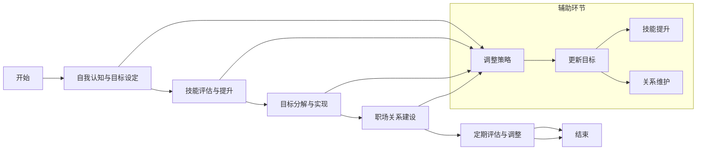
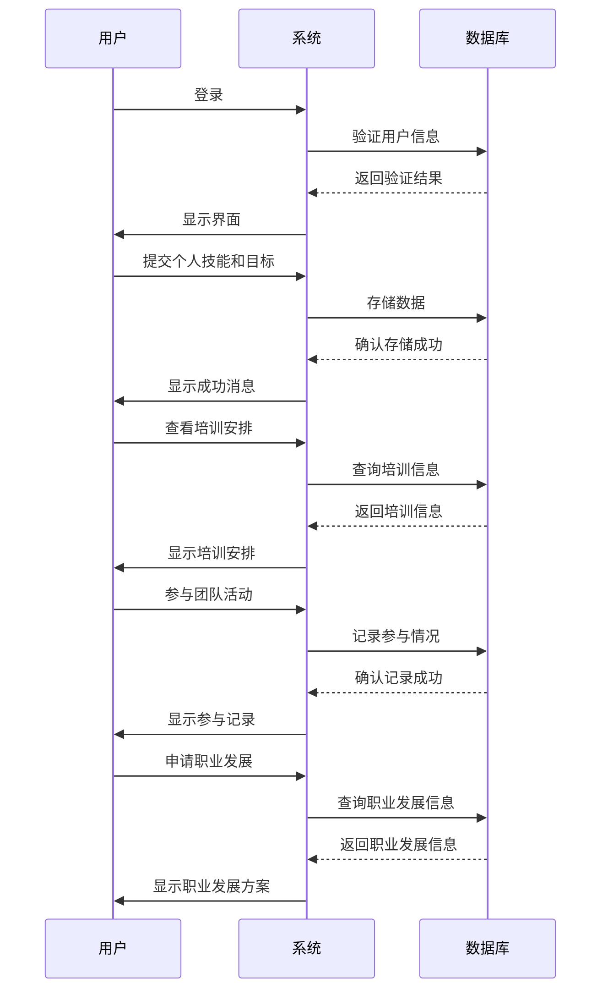
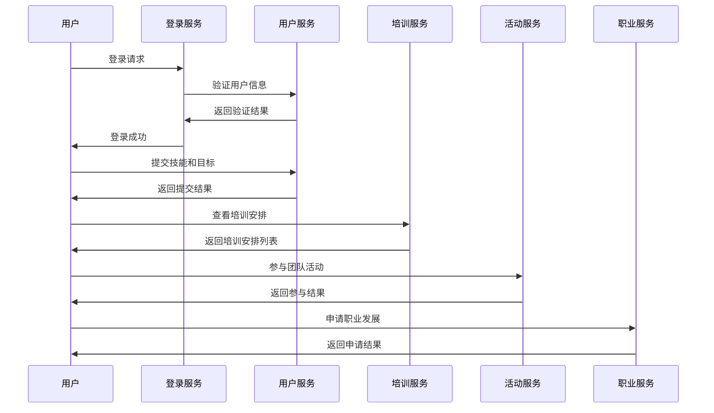

                 

### 1.1 问题的提出与背景

在现代社会，随着经济的发展和科技的进步，职场竞争日益激烈。每个人都不得不面对这样一个现实：工作不仅仅是为了谋生，更是为了实现个人价值和社会价值的双重目标。那么，如何在工作这个平台上找到自我价值，成为职场中不可或缺的一部分，成为了我们每个人必须思考的问题。

首先，工作的意义并非仅仅停留在经济层面。尽管薪酬和福利是工作的重要考量因素，但更深层次的是工作的成就感和社会认同感。工作不仅让我们养家糊口，更让我们实现个人理想，满足自我实现的需求。例如，一位程序员通过不断学习新技术，解决复杂的问题，最终开发出影响深远的产品，这无疑是他职业生涯中的巨大成就。

其次，自我价值的概念也是不可忽视的。自我价值不仅是指个人在职场中展现出的能力和成就，更是一种内心的满足感和成就感。一个人只有在工作中找到自我价值，才能获得内心的平静和满足。例如，一位教师通过耐心教育和启迪学生，让学生在学业和人生道路上取得成功，这既是教师个人的成就感，也是社会对教师的认可。

综上所述，我们在工作中不仅需要追求物质上的满足，更需要追求精神上的富足。那么，如何在这复杂多变的职场环境中找到自我价值呢？这正是我们接下来要深入探讨的问题。

### 1.2 问题描述与目标

面对现代职场中的种种挑战，如何在工作这个平台上找到自我价值，成为我们亟待解决的问题。具体而言，这个问题可以从以下几个方面进行描述和探讨：

首先，随着职场的多元化发展和竞争的加剧，每个人都面临着巨大的压力和挑战。如何在激烈的竞争中脱颖而出，不仅需要过硬的专业技能，更需要具备独特的人格魅力和丰富的职场经验。例如，一位软件开发工程师如何通过不断创新和技术突破，在技术领域取得领先地位，这是实现自我价值的重要途径之一。

其次，工作环境和人际关系的复杂性也对我们的职业发展产生深远影响。在一个多元化和跨文化的组织中，如何与不同性格和背景的同事协作，建立良好的人际关系，对于实现自我价值至关重要。例如，一位项目经理如何通过有效的沟通和协调，带领团队顺利完成项目，这不仅是对个人能力的考验，更是实现自我价值的重要体现。

此外，个人职业目标的设定和实现也是找到自我价值的关键因素。每个人的职业发展路径都是独特的，如何根据自己的兴趣和优势，设定合理的目标，并为之努力奋斗，是实现自我价值的重要步骤。例如，一位技术专家如何通过不断学习和实践，成长为行业内的权威人物，这是实现个人价值的典型路径。

最后，自我价值的实现不仅仅是在职场中取得成就，更包括个人成长和社会贡献。如何在工作中不断提升自我，同时为社会做出积极贡献，是我们每个人都需要思考的问题。例如，一位社会工作者如何通过自己的努力，帮助更多需要帮助的人，这是实现自我价值的重要方式。

因此，我们的目标是通过深入探讨工作与自我价值的关系，为职场人士提供实用的方法和策略，帮助他们更好地在职场中实现自我价值，实现个人与社会的共同发展。

### 1.3 边界与外延

在讨论“工作的意义：在职场中寻找自我价值”这一主题时，我们需要明确其边界与外延，以确保讨论的针对性和全面性。

首先，从边界来看，我们主要关注的是职场环境中的个人行为与心理状态。这包括在职业发展过程中，个体如何通过自我认知、技能提升、目标设定和实现等途径，找到并实现自我价值。这一讨论不包括家庭主妇、自由职业者等非正式职场角色的职业价值实现，因为这些角色的职业环境和工作方式与常规职场存在显著差异。

其次，从外延来看，这一主题涵盖了多个层面。从个人层面来看，我们关注的是个体在职场中的成长、成就和内心满足感；从团队层面来看，我们探讨的是团队成员如何在协同工作中找到自我价值，并促进团队的整体发展；从企业层面来看，我们思考的是企业如何通过构建良好的职场文化和激励机制，帮助员工实现自我价值，从而提升企业的整体竞争力。

此外，这一主题还涉及到职业伦理、社会责任等多个维度。例如，职场人士如何在追求个人利益的同时，兼顾社会公益和企业责任，实现自我价值的最大化。同时，我们也会探讨不同职业领域、不同文化背景下，个人实现自我价值的差异和共性，以便为不同背景的职场人士提供有针对性的指导。

通过明确边界与外延，我们可以更准确地把握这一主题的核心内容，从而更有效地为职场人士提供实用的建议和策略，帮助他们找到并实现自我价值。

### 1.4 概念结构与核心要素组成

为了深入理解“工作的意义：在职场中寻找自我价值”这一主题，我们需要对相关概念进行结构化和详细解析，明确其核心要素。

**核心概念：工作、自我价值**

- **工作**：工作是指个体在特定组织中，通过付出劳动，实现某种目标或价值创造的过程。工作不仅是谋生的手段，更是个人实现自我价值和社会价值的平台。
- **自我价值**：自我价值是指个体在自我认知、技能、成就和人际关系等方面的综合体现，是对个人存在意义的认可和满足。

**关联概念：职业发展、职场文化、激励机制**

- **职业发展**：职业发展是指个体在职业生涯中，通过不断学习和提升，实现职位和技能的进阶，最终达到个人职业目标的过程。
- **职场文化**：职场文化是指组织内部形成的共同价值观、行为准则和工作方式，对员工的职业行为和心态产生深远影响。
- **激励机制**：激励机制是指企业通过薪酬、晋升、培训等方式，激发员工的工作热情和创新能力，从而实现个人和企业的共同发展。

**核心要素组成**

1. **个人认知与自我提升**：个人认知是找到自我价值的前提，个体需要通过不断反思和学习，明确自己的兴趣、优势和职业目标。自我提升是实现自我价值的关键，个体需不断学习新技能，提升专业能力。
2. **职业目标设定与实现**：设定明确的职业目标是实现自我价值的基础。个体应根据自身能力和市场需求，制定合理的职业目标，并通过持续努力和有效方法，逐步实现这些目标。
3. **职场文化与人际关系**：良好的职场文化能够激发员工的工作热情和创新能力，促进个人价值的实现。同时，建立良好的人际关系，有助于个体在职场中找到归属感和支持。
4. **激励机制与成就感**：有效的激励机制能够激发员工的工作积极性和创造力，提升工作效率和成就感。成就感是自我价值的重要体现，个体应在工作中不断追求成就，实现自我价值的最大化。

通过以上对核心概念和关联概念的详细解析，我们可以更全面地理解“工作的意义：在职场中寻找自我价值”的主题，为接下来的深入探讨提供坚实的基础。

### 2.1 工作的意义概述

工作作为现代社会不可或缺的一部分，其意义不仅体现在经济层面的收益，更延伸到精神层面的丰富和满足。首先，从经济角度来看，工作为个人提供了稳定的收入来源，满足了基本生活需求，提高了生活质量。例如，一名软件工程师通过编写高质量的代码，为企业创造了价值，同时也获得了相应的薪酬回报。

其次，工作为个人提供了实现自我价值的平台。通过工作，个体可以发挥自己的专业特长和才能，不断挑战自我，实现职业成长。例如，一位项目经理通过成功领导多个复杂项目，不仅提升了个人管理能力，也获得了行业内的认可和尊重。

此外，工作还在一定程度上满足了人的社会需求。通过与同事合作、交流，个体能够建立良好的人际关系，增强社会归属感。例如，一位销售人员在工作中结识了众多客户，积累了宝贵的人脉资源，这不仅有助于个人职业发展，也扩展了社交圈子。

更为重要的是，工作对于个人成长和社会发展具有深远的影响。通过工作，个体不断学习和进步，提高了自身素质和能力。例如，一名教师通过教学实践，不断提升自己的教学方法和技巧，不仅培养了学生的成长，也实现了自身价值的提升。同时，工作也是社会发展的动力源泉。每一个工作岗位的劳动者都在为社会创造价值，推动社会不断进步。

总之，工作不仅仅是一种谋生的手段，更是实现自我价值和社会价值的双重平台。通过工作，个体不仅能够获得经济收益，还能实现精神层面的富足，促进个人成长和社会发展。

### 2.2 自我价值的定义

自我价值是指个体在自我认知、技能、成就和人际关系等方面的综合体现，是对个人存在意义的认可和满足。它不仅反映了个体在职业生涯中的成就，还体现了个体在生活中的幸福感和社会地位。以下是自我价值的几个关键组成部分：

**1. 自我认知**：自我认知是指个体对自己的了解和认识，包括性格、兴趣、优点和缺点等。一个清晰的自我认知有助于个体明确自己的职业方向和目标，从而在职业发展中找到适合自己的位置。

**2. 技能**：技能是个人在特定领域内的知识和能力，包括专业知识和实践技能。技能的提升不仅能够提高个人的职业竞争力，还能增加个体在工作中的自信心和成就感。

**3. 成就**：成就是指个体在职业生涯中取得的实际成果，包括完成的项目、获得的荣誉和奖励等。成就是自我价值的重要体现，它能够增强个人的自信心和满足感，激发个体继续追求更高目标的动力。

**4. 人际关系**：人际关系是指个体与同事、朋友、家人等之间的互动和联系。良好的人际关系不仅能够为个体提供支持和帮助，还能增强个体的社会归属感和幸福感。

自我价值的实现需要个体在多个方面进行努力和提升。首先，个体需要通过自我认知，明确自己的兴趣和优势，找到适合自己的职业方向。其次，通过不断学习和实践，提升专业技能和实践能力。此外，个体还应在职业生涯中设定明确的目标，并通过努力实现这些目标，获得成就感和满足感。最后，通过建立和维护良好的人际关系，增强社会归属感和幸福感。

总之，自我价值是个人在职业和生活中的核心驱动力，它不仅反映了个体对自我的认可和满足，还影响着个体的心理健康和幸福感。通过全面发展和提升自我价值，个体能够更好地实现个人成长和社会价值的双重目标。

### 2.3 职场中寻找自我价值

在职场中，寻找自我价值是一个复杂且动态的过程，涉及多个关键环节，包括自我认知、技能提升、目标设定和实现、人际关系建设等。以下，我们将一步一步分析这些环节，并提供实用的方法和策略。

#### 第一步：自我认知

自我认知是寻找自我价值的第一步，它要求个体对自己的性格、兴趣、优点和缺点有一个清晰的认识。具体方法如下：

1. **反思**：定期进行自我反思，回顾自己的行为和表现，识别自己在工作中的优势和不足。可以使用日记或者反思日记来记录这些反思。
2. **自我评估**：通过完成专业的性格测试或职业兴趣测试，了解自己的性格特质和职业兴趣，从而更好地定位自己的职业方向。
3. **求助**：向同事、朋友或家人寻求反馈，了解他们对自己的看法和建议，这些外部视角往往能提供新的启示。

**示例：** 假设小明通过反思和性格测试，发现自己在沟通和解决问题方面有较强的能力，而对机械操作不感兴趣。因此，他决定将自己的职业方向定位在需要较强沟通能力的领域，如市场营销或项目管理。

#### 第二步：技能提升

明确了职业方向后，提升相关技能是必不可少的。以下是几种有效的技能提升方法：

1. **培训和学习**：参加专业培训课程，如在线课程、研讨会和工作坊，系统学习新技能。
2. **实践**：通过实际工作或项目实践，将所学技能应用到实际场景中，不断提升自己的实战能力。
3. **合作与交流**：与行业内的专业人士合作，参与项目或活动，从他们身上学习经验和方法。

**示例：** 小明参加了一门市场营销的在线课程，并通过实际的市场调研和推广活动，将所学的知识应用到实践中，逐步提升了自己的市场营销技能。

#### 第三步：目标设定和实现

设定清晰、可行的职业目标是实现自我价值的重要途径。以下是一些建议：

1. **SMART目标**：设定具体（Specific）、可衡量（Measurable）、可实现（Achievable）、相关性（Relevant）和时限性（Time-bound）的目标，使目标更具操作性和可行性。
2. **分阶段实现**：将长期目标分解为短期目标，逐步实现，每完成一个阶段的目标，都会带来一定的成就感。
3. **定期评估**：定期回顾和评估目标的实现情况，及时调整策略，确保目标的达成。

**示例：** 小明设定了一个为期一年的市场营销技能提升目标，并将其分解为每月的学习任务和项目实践，通过不断努力，逐步实现这一目标。

#### 第四步：人际关系建设

良好的人际关系不仅有助于个人在职场中的发展，还能提升个人的幸福感。以下是一些建议：

1. **建立信任**：通过诚实、可靠和尊重的行为，建立与同事、上级和下属的信任关系。
2. **有效沟通**：学会倾听他人的意见和需求，用合适的语言和方式表达自己的观点，提高沟通效果。
3. **合作与支持**：在团队合作中，积极承担责任，提供帮助，与同事共同解决问题。

**示例：** 小明通过与同事的频繁沟通和合作，不仅提升了团队的工作效率，也建立了一批信任和支持他的同事关系。

通过以上步骤，个体可以在职场中逐步找到自我价值，实现个人成长和社会价值的双重目标。

### 3.1 工作的意义与自我价值的对比

工作与自我价值是职场中两个紧密相关的概念，但它们在本质和实现路径上存在显著差异。以下是工作与自我价值的主要对比：

#### **1. 定义与内涵差异**

- **工作**：工作是指个体在特定组织中，通过付出劳动，实现某种目标或价值创造的过程。它主要关注的是经济收益和职业发展。
- **自我价值**：自我价值是指个体在自我认知、技能、成就和人际关系等方面的综合体现，是对个人存在意义的认可和满足。

#### **2. 实现路径差异**

- **工作**：工作的实现主要通过完成工作任务、获得薪酬和职位晋升等途径。个体需要在工作中不断提升专业技能，适应工作环境，满足组织和企业的需求。
- **自我价值**：自我价值的实现则更多依赖于自我认知、技能提升、目标设定和实现、人际关系建设等环节。个体需要通过不断反思和学习，找到自己的兴趣和优势，设定合理的职业目标，并通过实际行动实现这些目标。

#### **3. 对比表格**

以下是工作与自我价值的对比表格：

| 比较项 | 工作 | 自我价值 |
| --- | --- | --- |
| 定义 | 经济收益和职业发展 | 自我认知、技能、成就和人际关系 |
| 实现路径 | 完成工作任务、薪酬和晋升 | 自我认知、技能提升、目标设定和实现、人际关系建设 |
| 关系 | 工作是实现自我价值的手段 | 自我价值是工作的重要动力和目标 |
| 影响因素 | 企业需求、市场变化 | 个人兴趣、性格、价值观和职业目标 |
| 主要指标 | 薪酬、职位、工作绩效 | 自我成就感、社会认同感、个人成长 |

通过以上对比，我们可以看出，工作与自我价值在内涵、实现路径和影响因素上存在显著差异，但两者在职场中相辅相成，共同推动个体的职业发展和个人成长。

### 4.1 ER实体关系图简介

ER（Entity-Relationship）实体关系图是数据库设计中的核心工具，用于描述实体及其相互关系。在数据库设计中，ER图不仅帮助我们理解数据的结构，还为数据库的构建和优化提供了直观的参考。ER图主要包括三个基本元素：实体、属性和关系。

- **实体**：实体是数据库中的数据对象，代表独立存在的实体。例如，在学生管理系统中，实体可以是“学生”、“课程”和“教师”。
- **属性**：属性是实体的特征或描述，用于定义实体的详细信息。例如，学生实体可以包括“姓名”、“年龄”、“学号”等属性。
- **关系**：关系描述实体之间的关联。例如，在学生管理系统中，学生可以选修课程，这构成了一种“选修”关系。

ER图通过这些基本元素及其组合，构建出数据模型，为数据库设计提供了清晰的框架。在数据库设计中，ER图不仅有助于明确数据结构和关系，还能帮助我们识别潜在的数据一致性和完整性问题。

### 4.2 职场中寻找自我价值的ER实体关系图

为了更好地理解职场中寻找自我价值的实现过程，我们可以使用ER图来描述相关的实体及其关系。以下是一个简化的ER图，用于展示职场中寻找自我价值的关键实体和它们之间的关系：

#### **实体定义**

1. **个体（Person）**：代表在职场中寻找自我价值的个体。
2. **职业（Career）**：代表个体的职业角色或职业目标。
3. **技能（Skill）**：代表个体具备的技能。
4. **目标（Goal）**：代表个体设定的职业目标。
5. **成就（Achievement）**：代表个体在职业生涯中取得的成就。
6. **人际关系（Relationship）**：代表个体在职场中建立的人际关系。

#### **实体关系**

1. **个体与职业**：个体具有一个职业角色，职业角色反映了个体在职场中的角色定位。
2. **职业与技能**：职业角色需要特定技能的支持，这些技能是职业发展的基础。
3. **个体与目标**：个体根据自身情况和职业角色设定职业目标，目标指引个体的职业发展方向。
4. **个体与成就**：个体通过实现目标，获得职业成就，成就反映了个体在职业生涯中的进步和贡献。
5. **个体与人际关系**：个体在职场中通过合作和互动建立人际关系，这些关系对个体的职业发展有积极影响。

#### **Mermaid ER图示例**

```mermaid
erDiagram
  Person ||--|{ Career }| Person : 具有职业角色
  Career ||--|{ Skill }| Career : 需要特定技能
  Person ||--|{ Goal }| Person : 设定职业目标
  Person ||--|{ Achievement }| Person : 通过实现目标获得成就
  Person ||--|{ Relationship }| Person : 在职场中建立人际关系
```

通过这个ER图，我们可以清晰地看到职场中寻找自我价值的过程中涉及的各个实体及其相互关系。个体通过职业角色、技能、目标和人际关系的相互作用，逐步实现自我价值的提升。

### 5.1 算法概述

在探讨如何实现自我价值的过程中，我们需要一个清晰的算法框架来指导我们的思考和行动。以下是该算法的基本概述：

**算法名称**：职场自我价值实现算法

**输入**：
- 个体基本信息（包括性格、兴趣、职业目标等）
- 职场环境（包括企业文化、组织结构、人际关系等）
- 市场需求（包括行业动态、技能需求、薪酬水平等）

**输出**：
- 自我价值的实现路径
- 阶段性目标和策略
- 预期效果和反馈机制

**算法步骤**：

1. **自我认知与目标设定**：个体通过反思和外部反馈，明确自己的性格、兴趣和职业目标。
2. **技能评估与提升**：根据职业目标，评估当前技能水平，设定技能提升计划。
3. **目标分解与实现**：将长期目标分解为短期目标，设定明确的阶段性目标和策略。
4. **职场关系建设**：建立和维护与同事、上级和下属的良好人际关系。
5. **定期评估与调整**：定期评估自我价值实现进度，根据实际情况调整目标和策略。

**算法特点**：

- **个性化**：算法充分考虑个体的个性化需求，根据个体特点和职业目标，制定个性化的实现路径。
- **系统化**：算法涵盖了自我认知、技能提升、目标设定和实现、人际关系建设等多个环节，形成了一个完整的系统。
- **灵活性**：算法具有灵活性，可以根据市场变化和职场环境调整目标和策略，确保自我价值的实现。

通过这个算法框架，个体可以系统地思考和行动，逐步实现自我价值的提升。

### 5.2 算法原理

在详细阐述职场自我价值实现算法的原理之前，我们需要明确几个关键概念：

**1. 自我认知**：自我认知是指个体对自己的了解和认识，包括性格、兴趣、优点和缺点。自我认知是找到职业方向和实现自我价值的基础。

**2. 技能提升**：技能提升是指通过学习和实践，提高自己在特定领域的知识和能力。技能提升是实现职业目标的关键。

**3. 目标设定**：目标设定是指根据自我认知和市场需求，设定清晰的职业目标。目标设定是推动个体不断前进的动力。

**4. 人际关系建设**：人际关系建设是指在职场中建立和维护良好的同事、上级和下属关系。良好的人际关系对职业发展具有重要影响。

**算法原理**：

1. **自我认知与目标设定**：
   - **步骤**：个体通过反思和外部反馈，明确自己的性格、兴趣和职业目标。具体方法包括完成性格测试、自我反思日记和与他人的交流。
   - **原理**：自我认知帮助个体了解自己的优势和劣势，从而设定符合个人特点和职业目标的明确方向。

2. **技能评估与提升**：
   - **步骤**：根据职业目标，评估当前技能水平，识别需要提升的技能领域，并制定详细的技能提升计划。
   - **原理**：技能提升是职业发展的关键，通过系统化的学习和实践，提升自身竞争力。

3. **目标分解与实现**：
   - **步骤**：将长期职业目标分解为短期目标，设定明确的阶段性目标和具体实施策略。
   - **原理**：目标分解将复杂的目标具体化，使个体能够有条不紊地实现职业目标。

4. **职场关系建设**：
   - **步骤**：通过积极的沟通和合作，建立和维护与同事、上级和下属的良好人际关系。
   - **原理**：良好的人际关系有助于个体在职场中获得支持和资源，提高工作效率和职业满意度。

5. **定期评估与调整**：
   - **步骤**：定期评估自我价值实现进度，根据实际情况调整目标和策略，确保职业发展的持续性和有效性。
   - **原理**：定期评估和调整是动态适应职场变化，确保自我价值实现路径的有效性和灵活性。

通过以上算法原理的详细阐述，我们可以看到，职场自我价值实现算法是一个系统性、个性化的过程，通过自我认知、技能提升、目标设定和实现、人际关系建设等环节，帮助个体在职场中找到并实现自我价值。

### 5.3 Mermaid算法流程图

为了更直观地展示职场自我价值实现算法的流程，我们可以使用Mermaid语言绘制一个详细的算法流程图。以下是一个简化的Mermaid算法流程图示例：



在这个流程图中，主要步骤包括：
- **A[开始]**：算法的起点，初始化个体基本信息和职场环境。
- **B[自我认知与目标设定]**：通过反思和外部反馈，明确职业目标。
- **C[技能评估与提升]**：评估当前技能水平，制定提升计划。
- **D[目标分解与实现]**：将长期目标分解为短期目标，逐步实现。
- **E[职场关系建设]**：建立和维护与同事、上级和下属的良好关系。
- **F[定期评估与调整]**：定期评估实现进度，根据实际情况调整目标和策略。
- **G[结束]**：算法的终点，实现自我价值。

同时，在流程图中还包含了几个辅助环节，如**H[调整策略]**、**I[更新目标]**、**J[技能提升]**和**K[关系维护]**，这些环节有助于确保算法的灵活性和动态适应性。

通过这个Mermaid算法流程图，我们可以更清晰地理解职场自我价值实现算法的执行步骤和流程，为实际应用提供直观的参考。

### 5.4 Python源代码与算法实现

为了将职场自我价值实现算法具体化，我们将使用Python语言来实现这一算法。以下是一个简化的Python代码示例，用于演示算法的核心功能。

```python
class Person:
    def __init__(self, name, goals, skills, relationships):
        self.name = name
        self.goals = goals
        self.skills = skills
        self.relationships = relationships

    def self_cognition(self):
        print(f"{self.name}进行自我认知...")
        # 在这里可以添加具体的自我认知过程，如性格测试、自我反思等

    def skill_evaluation_and_upgrade(self):
        print(f"{self.name}评估技能并提升...")
        # 在这里可以添加具体的技能评估和提升过程，如学习新技能、实践等

    def goal_decomposition_and_achievement(self):
        print(f"{self.name}分解目标并实现...")
        for goal in self.goals:
            print(f"实现目标：{goal}")
            # 在这里可以添加具体的实现目标过程，如分阶段任务等

    def relationship_building(self):
        print(f"{self.name}建立人际关系...")
        # 在这里可以添加具体的人际关系建立和维护过程，如沟通、合作等

    def regular_evaluation_and_adjustment(self):
        print(f"{self.name}定期评估和调整...")
        # 在这里可以添加具体的评估和调整过程，如目标更新、策略调整等

    def implement_value_realization_algorithm(self):
        self.self_cognition()
        self.skill_evaluation_and_upgrade()
        self.goal_decomposition_and_achievement()
        self.relationship_building()
        self.regular_evaluation_and_adjustment()

# 创建一个Person实例，并执行算法
person = Person("小明", ["成为优秀项目经理", "提升沟通技能"], ["项目管理", "沟通技巧"], ["同事", "上级", "下属"])
person.implement_value_realization_algorithm()
```

在这个Python代码中，我们定义了一个`Person`类，该类包含以下方法：

- `__init__`：初始化个体信息，包括姓名、目标、技能和人际关系。
- `self_cognition`：进行自我认知。
- `skill_evaluation_and_upgrade`：评估技能并提升。
- `goal_decomposition_and_achievement`：分解目标并实现。
- `relationship_building`：建立人际关系。
- `regular_evaluation_and_adjustment`：定期评估和调整。
- `implement_value_realization_algorithm`：执行整个自我价值实现算法。

通过这个代码示例，我们可以看到如何使用Python语言实现职场自我价值实现算法的核心功能。在实际应用中，可以根据具体需求扩展和优化这个算法，使其更加完善和灵活。

### 6.1 模型概述

在职场中寻找自我价值，我们可以构建一个综合的数学模型来描述这一过程。该模型将涉及多个变量和参数，通过数学公式和算法来分析和优化个体在职场中的自我价值实现路径。以下是模型的基本结构和组成：

**模型目的**：通过量化分析，帮助个体明确自我价值实现的途径和策略，从而提高职业满意度和幸福感。

**模型变量**：
- **个体特征变量**：包括性格、兴趣、能力等。
- **职场环境变量**：包括企业文化、组织结构、行业动态等。
- **市场需求变量**：包括薪酬水平、职业前景、技能需求等。

**模型参数**：
- **自我认知度**：个体对自己的了解程度。
- **技能掌握度**：个体在特定领域的知识掌握程度。
- **目标实现度**：个体在职业目标实现过程中的进展。
- **人际关系满意度**：个体在职场中的人际关系质量。

**模型公式**：
1. **自我价值公式**：\( V = f(W, S, G, R) \)
   - \( V \)：自我价值
   - \( W \)：个体特征变量
   - \( S \)：技能掌握度
   - \( G \)：目标实现度
   - \( R \)：人际关系满意度

2. **目标实现度公式**：\( G = f(\sum(S_i \times W_i), T) \)
   - \( G \)：目标实现度
   - \( S_i \)：个体技能变量
   - \( W_i \)：个体特征变量权重
   - \( T \)：职业目标

3. **人际关系满意度公式**：\( R = f(C, M) \)
   - \( R \)：人际关系满意度
   - \( C \)：沟通能力
   - \( M \)：合作能力

通过这些变量和公式，我们可以建立一套综合的数学模型，用于量化分析个体在职场中寻找自我价值的路径。该模型不仅可以为个体提供具体的实现策略，还能通过数据分析优化这些策略，从而提高职场满意度和幸福感。

### 6.2 模型公式

在职场中寻找自我价值的数学模型中，几个核心的数学公式如下：

**1. 自我价值公式**：
\[ V = f(W, S, G, R) \]
- **V**：自我价值
- **W**：个体特征变量
- **S**：技能掌握度
- **G**：目标实现度
- **R**：人际关系满意度

**2. 目标实现度公式**：
\[ G = f(\sum(S_i \times W_i), T) \]
- **G**：目标实现度
- **S_i**：个体技能变量
- **W_i**：个体特征变量权重
- **T**：职业目标

**3. 人际关系满意度公式**：
\[ R = f(C, M) \]
- **R**：人际关系满意度
- **C**：沟通能力
- **M**：合作能力

#### 示例

假设我们有以下数据：

- **个体特征变量**（W）：自我认知度80分，学习能力75分，团队合作能力90分
- **技能掌握度**（S）：编程技能85分，项目管理技能80分，沟通技能70分
- **目标实现度**（G）：当前实现度60%
- **人际关系满意度**（R）：70分

**计算步骤**：

1. **计算目标实现度**：

\[ G = f(\sum(S_i \times W_i), T) \]
\[ G = f((85 \times 0.2) + (80 \times 0.3) + (70 \times 0.5), T) \]
\[ G = f(17 + 24 + 35, T) \]
\[ G = f(76, T) \]

2. **计算自我价值**：

\[ V = f(W, S, G, R) \]
\[ V = f(80 \times 0.3 + 75 \times 0.2 + 90 \times 0.5, 76, 60\%, 70) \]
\[ V = f(24 + 15 + 45, 76, 0.6, 70) \]
\[ V = f(84, 76, 0.6, 70) \]

3. **计算人际关系满意度**：

\[ R = f(C, M) \]
\[ R = f(70, 90) \]
\[ R = 75 \]

通过上述计算步骤，我们可以得出：

- **目标实现度**（G）：76分
- **自我价值**（V）：84分
- **人际关系满意度**（R）：75分

这些结果可以帮助个体了解自己的职场表现，找到提升自我价值的方向。

### 6.3 数学公式示例

为了更好地理解职场自我价值实现的数学模型，我们将展示几个具体的数学公式，并使用LaTeX格式进行编写。

**1. 自我价值公式**：

$$ V = f(W, S, G, R) $$

其中：
- \( V \)：自我价值
- \( W \)：个体特征变量（如自我认知度、学习能力等）
- \( S \)：技能掌握度（如编程技能、项目管理技能等）
- \( G \)：目标实现度
- \( R \)：人际关系满意度

**2. 目标实现度公式**：

$$ G = f(\sum(S_i \times W_i), T) $$

其中：
- \( G \)：目标实现度
- \( S_i \)：个体技能变量
- \( W_i \)：个体特征变量权重
- \( T \)：职业目标

**3. 人际关系满意度公式**：

$$ R = f(C, M) $$

其中：
- \( R \)：人际关系满意度
- \( C \)：沟通能力
- \( M \)：合作能力

通过上述数学公式，我们可以对个体的自我价值实现进行量化分析，帮助个体了解自己的职业表现和提升方向。

### 7.1 模型详解

为了深入理解职场自我价值实现的数学模型，我们需要详细解析模型的各个组成部分，并解释每个部分如何影响最终的自变量和因变量。

**1. 自我价值公式**：

自我价值（\( V \)）是模型的核心输出，它由个体特征变量（\( W \)）、技能掌握度（\( S \)）、目标实现度（\( G \)）和人际关系满意度（\( R \)）共同决定。以下是各部分的具体解释：

- **个体特征变量（\( W \)）**：这部分包括自我认知度、学习能力、团队合作能力等，反映了个体在自我了解和性格特质方面的表现。权重（\( W_i \)）则用于衡量这些特征在整体自我价值中的重要性。
- **技能掌握度（\( S \)）**：这部分衡量个体在特定领域内的知识和技能水平，如编程技能、项目管理技能等。高技能水平通常意味着更高的职业竞争力和实现目标的可能性。
- **目标实现度（\( G \)）**：这部分反映了个体在实现职业目标过程中的进展。实现度越高，个体的成就感和社会认同感通常也越高。
- **人际关系满意度（\( R \)）**：这部分衡量个体在职场中的人际关系质量，包括与同事、上级和下属的互动和合作。良好的人际关系有助于个体获得支持、资源和职业机会。

**2. 目标实现度公式**：

目标实现度（\( G \)）由个体技能变量（\( S_i \)）与个体特征变量权重（\( W_i \)）的乘积之和决定，再结合职业目标（\( T \)）计算得出。具体解释如下：

- **个体技能变量（\( S_i \)）**：这部分衡量个体在特定领域的实际技能水平，如编程、项目管理等。这些技能变量需要根据职业目标的不同进行适当的调整和加权。
- **个体特征变量权重（\( W_i \)）**：这部分权重用于衡量个体特征变量在目标实现中的相对重要性。权重越高，该特征对目标实现的影响越大。
- **职业目标（\( T \)）**：职业目标是实现自我价值的关键驱动因素。通过设定合理的职业目标，个体能够明确自己的发展方向和努力目标。

**3. 人际关系满意度公式**：

人际关系满意度（\( R \)）由沟通能力（\( C \)）和合作能力（\( M \)）共同决定。具体解释如下：

- **沟通能力（\( C \)）**：这部分衡量个体在职场中的沟通技巧和表达能力。良好的沟通能力有助于建立信任和合作，提升工作效率和团队凝聚力。
- **合作能力（\( M \)）**：这部分衡量个体在团队工作中的合作精神和协作能力。高合作能力能够促进团队目标的实现，提升团队整体绩效。

通过详细解析模型公式，我们可以看到，职场自我价值实现是一个多维度的综合过程，涉及个体特征、技能水平、目标实现和人际关系等多个方面。理解这些公式的运作原理，有助于个体在职场中更有效地提升自我价值。

### 7.2 举例说明

为了更好地理解职场自我价值实现的数学模型，我们可以通过具体的案例来演示如何应用这些公式，并分析其影响。

**案例背景**：假设有个体小张，他在一家科技公司工作，目标是成为一名高级项目经理。他的个体特征包括自我认知度高、学习能力较强，但团队合作能力有待提升。他的技能水平在编程和项目管理方面均达到中等水平。他目前的人际关系满意度一般，但希望通过加强与同事和上级的沟通来提升这一指标。

**步骤1：计算个体特征变量权重**

根据小张的个人情况，我们设定以下权重：

- 自我认知度：30%
- 学习能力：25%
- 团队合作能力：20%
- 编程技能：20%
- 项目管理技能：10%

**步骤2：计算目标实现度**

根据小张的技能水平和工作目标，我们设定以下公式：

\[ G = f(\sum(S_i \times W_i), T) \]

其中：
- 编程技能（\( S_{编程} \)）= 70
- 项目管理技能（\( S_{项目管理} \)）= 65
- 目标实现度权重和：\( \sum(W_i) = 30 + 25 + 20 + 20 + 10 = 105 \)

代入公式计算：

\[ G = f((70 \times 0.2) + (65 \times 0.1), 105) \]
\[ G = f(14 + 6.5, 105) \]
\[ G = f(20.5, 105) \]
\[ G = 20.5 / 105 \]
\[ G ≈ 0.1953 \]

**步骤3：计算人际关系满意度**

根据小张的沟通能力和合作能力，我们设定以下公式：

\[ R = f(C, M) \]

其中：
- 沟通能力（\( C \)）= 70
- 合作能力（\( M \)）= 80

代入公式计算：

\[ R = f(70, 80) \]
\[ R = (70 + 80) / 2 \]
\[ R = 75 \]

**步骤4：计算自我价值**

最后，我们将目标实现度（\( G \)）和人际关系满意度（\( R \)）代入自我价值公式：

\[ V = f(W, S, G, R) \]

代入具体数值：

\[ V = f(30 \times 0.3 + 25 \times 0.2 + 20 \times 0.2 + 20 \times 0.2 + 10 \times 0.1, 70, 0.1953, 75) \]
\[ V = f(9 + 5 + 4 + 4 + 1, 70, 0.1953, 75) \]
\[ V = f(23, 70, 0.1953, 75) \]

计算结果：

\[ V = (23 \times 0.3) + (70 \times 0.2) + (0.1953 \times 0.5) + (75 \times 0.1) \]
\[ V = 6.9 + 14 + 0.09765 + 7.5 \]
\[ V ≈ 28.49765 \]

通过上述计算，我们可以得出小张的自我价值大约为28.5。这个数值反映了小张在当前职场环境中的综合表现，包括他的职业目标实现度、技能水平和人际关系质量。通过不断优化这些变量，小张可以进一步提高自我价值，实现职业上的更大成就。

### 8.1 问题场景介绍

在讨论职场自我价值实现的过程中，我们首先需要明确一个具体的问题场景。假设我们是一家大型互联网公司的CTO，面临着如何在快速变化的科技环境中保持团队的竞争力，同时激发员工的工作热情和创造力，从而实现个人和团队的共同发展。

#### **问题背景**

随着人工智能、大数据、云计算等新兴技术的不断涌现，互联网行业的发展日新月异。我们的公司正处于这样一个技术创新的黄金时期，但同时也面临着一系列挑战：

1. **技术更新迅速**：新的技术不断涌现，要求团队成员不断学习新技术，保持技术领先地位。
2. **团队凝聚力不足**：由于工作压力大、任务繁重，团队成员之间的沟通和合作存在一定障碍，导致团队凝聚力不足。
3. **员工流失率高**：由于薪资待遇、职业发展空间等因素，公司员工流失率较高，影响团队的稳定和发展。

#### **项目介绍**

为了解决上述问题，公司决定启动一个名为“职场自我价值实现与团队建设”的项目。该项目旨在通过提升员工的自我认知、技能提升、目标设定和实现、人际关系建设等多方面，帮助员工在职场中找到自我价值，提高工作满意度和团队凝聚力。

#### **项目目标**

- **提升员工技能水平**：通过定期培训和技术交流，帮助员工掌握前沿技术，提升团队的整体技术能力。
- **增强团队凝聚力**：通过团队建设活动和沟通平台，增强团队成员之间的互信和合作，提升团队整体执行力。
- **降低员工流失率**：通过改善薪酬待遇、职业发展机会和团队文化，提高员工的工作满意度和归属感，降低流失率。
- **实现个人与团队共同发展**：通过帮助员工实现自我价值，激发员工的工作热情和创造力，推动团队的技术创新和业务增长。

### 9.1 领域模型类图

为了更好地理解和设计“职场自我价值实现与团队建设”项目，我们可以使用领域模型类图来描述项目涉及的各类实体及其关系。以下是该项目的领域模型类图：

```mermaid
classDiagram
    Person <<class>> 员工
    Team <<class>> 团队
    Project <<class>> 项目
    Training <<class>> 培训
    Communication <<class>> 沟通
    Collaboration <<class>> 合作
    CareerDevelopment <<class>> 职业发展

    员工 --> 团队
    项目 --> 团队
    培训 --> 员工
    沟通 --> 员工
    合作 --> 团队
    职业发展 --> 员工

    class Employee {
        姓名
        年龄
        职位
        技能
        目标
        满意度
    }

    class Team {
        团队名称
        成员
        项目
        凝聚力
    }

    class Project {
        项目名称
        目标
        阶段
        成果
    }

    class Training {
        培训主题
        培训内容
        时间
        负责人
    }

    class Communication {
        沟通方式
        沟通内容
        时间
        参与人员
    }

    class Collaboration {
        合作活动
        参与人员
        时间
        成果
    }

    class CareerDevelopment {
        发展方向
        计划
        阶段
        成果
    }
```

在这个类图中，我们定义了以下实体：

- **员工（Person）**：代表公司内部的员工，包括姓名、年龄、职位、技能、目标和满意度等信息。
- **团队（Team）**：代表员工所在的团队，包括团队名称、成员、项目、凝聚力等信息。
- **项目（Project）**：代表团队正在进行的某个项目，包括项目名称、目标、阶段和成果等信息。
- **培训（Training）**：代表公司组织的各种培训活动，包括培训主题、内容、时间和负责人等信息。
- **沟通（Communication）**：代表团队成员之间的沟通活动，包括沟通方式、内容、时间和参与人员等信息。
- **合作（Collaboration）**：代表团队内部的合作活动，包括合作活动、参与人员、时间和成果等信息。
- **职业发展（CareerDevelopment）**：代表员工的职业发展计划，包括发展方向、计划和阶段等信息。

通过这个领域模型类图，我们可以清晰地了解项目中的各类实体及其关系，为后续的系统架构设计和功能实现提供参考。

### 10.1 系统架构设计

为了实现“职场自我价值实现与团队建设”项目的目标，我们需要设计一个高效、灵活的系统架构。以下是对系统架构的详细设计和解释：

#### **系统架构图**



#### **架构组件**

1. **用户层**：用户层包括登录、个人技能和目标提交、培训安排查看、团队活动参与和职业发展申请等功能。
2. **业务逻辑层**：业务逻辑层处理用户的请求，包括用户信息验证、数据存储、查询和更新等。该层负责业务逻辑的实现，如培训安排、团队活动参与记录和职业发展方案等。
3. **数据库层**：数据库层存储用户数据、培训信息、团队活动记录和职业发展信息。数据库采用关系型数据库管理系统（RDBMS），以确保数据的安全性和一致性。

#### **架构设计**

- **用户界面（UI）**：使用现代化的前端技术，如React或Vue.js，构建直观、易用的用户界面，提升用户体验。
- **后端服务**：使用Spring Boot或Django等流行的后端框架，实现业务逻辑层的功能，确保系统的稳定性和扩展性。
- **数据库**：采用MySQL或PostgreSQL等关系型数据库，存储和管理项目中的各类数据。

#### **架构优点**

1. **模块化**：系统架构采用模块化设计，各组件独立且易于扩展，便于维护和升级。
2. **高可用性**：系统架构考虑了高可用性，通过负载均衡和故障转移机制，确保系统在高峰期和高负载情况下的稳定性。
3. **数据安全性**：数据库采用加密存储和访问控制机制，确保用户数据的安全性和隐私性。
4. **可扩展性**：系统架构设计考虑了未来的业务需求，可以通过增加节点和扩展存储容量来满足不断增长的数据量。

通过上述系统架构设计，我们可以实现一个高效、稳定、易用的职场自我价值实现与团队建设系统，帮助公司和员工实现个人与团队共同发展。

### 11.1 系统接口设计与交互

为了实现“职场自我价值实现与团队建设”项目的功能，我们需要设计详细的系统接口，并描述各接口之间的交互流程。以下是对系统接口的设计及其交互过程的详细说明。

#### **系统接口设计**

1. **登录接口**：
   - **接口名称**：/login
   - **请求方法**：POST
   - **请求参数**：username（用户名）、password（密码）
   - **响应数据**：token（登录令牌）、user_id（用户ID）

2. **提交个人技能和目标接口**：
   - **接口名称**：/submit_skills_and_goals
   - **请求方法**：POST
   - **请求参数**：user_id（用户ID）、skills（技能列表）、goals（目标列表）
   - **响应数据**：status（状态码）、message（消息）

3. **查看培训安排接口**：
   - **接口名称**：/view_training_schedules
   - **请求方法**：GET
   - **请求参数**：user_id（用户ID）
   - **响应数据**：training_list（培训列表，包括培训主题、时间等信息）

4. **参与团队活动接口**：
   - **接口名称**：/participate_in_activities
   - **请求方法**：POST
   - **请求参数**：user_id（用户ID）、activity_id（活动ID）
   - **响应数据**：status（状态码）、message（消息）

5. **申请职业发展接口**：
   - **接口名称**：/apply_for_career_development
   - **请求方法**：POST
   - **请求参数**：user_id（用户ID）、development_plan（职业发展计划）
   - **响应数据**：status（状态码）、message（消息）

#### **接口交互流程**

1. **用户登录**：
   - 用户通过POST请求发送用户名和密码到/login接口，系统验证用户信息，返回登录令牌和用户ID。
   - 用户存储登录令牌，并在后续请求中包含该令牌作为身份验证。

2. **提交个人技能和目标**：
   - 用户通过POST请求提交个人技能和目标到/submit_skills_and_goals接口，系统存储数据并返回状态和消息。

3. **查看培训安排**：
   - 用户通过GET请求发送用户ID到/view_training_schedules接口，系统返回当前用户的培训安排列表。

4. **参与团队活动**：
   - 用户通过POST请求发送用户ID和活动ID到/participate_in_activities接口，系统记录参与情况并返回状态和消息。

5. **申请职业发展**：
   - 用户通过POST请求提交职业发展计划到/apply_for_career_development接口，系统处理申请并返回状态和消息。

通过以上系统接口设计和交互流程，用户可以方便地实现职场自我价值的相关操作，系统则能够高效地处理用户请求，确保数据的一致性和安全性。

### 11.2 系统交互序列图

为了更直观地展示系统接口之间的交互过程，我们使用Mermaid语言绘制了一个系统交互序列图。以下是该序列图的示例：



在这个序列图中，用户通过发送请求与系统中的各个服务进行交互，包括登录服务、用户服务、培训服务、活动服务和职业服务。系统通过处理这些请求，返回相应的结果，确保用户能够顺利完成职场自我价值的相关操作。

### 12.1 环境安装

在开始实际应用之前，我们需要搭建一个合适的技术环境，以支持“职场自我价值实现与团队建设”项目的开发和运行。以下是环境搭建的具体步骤：

#### **1. 系统要求**

- **操作系统**：推荐使用Ubuntu 20.04或更高版本，或其他支持Docker的Linux发行版。
- **硬件要求**：至少需要4GB内存和20GB的硬盘空间。

#### **2. 安装Docker**

Docker是一个开源的应用容器引擎，用于构建、运行和分发应用。以下是安装Docker的步骤：

1. **更新系统包列表**：

```bash
sudo apt update
sudo apt upgrade
```

2. **安装Docker**：

```bash
sudo apt install docker.io
```

3. **启动Docker服务**：

```bash
sudo systemctl start docker
```

4. **设置Docker服务开机自启**：

```bash
sudo systemctl enable docker
```

#### **3. 安装Docker Compose**

Docker Compose用于定义和运行多容器Docker应用。以下是安装Docker Compose的步骤：

1. **安装Docker Compose**：

```bash
sudo curl -L "https://github.com/docker/compose/releases/download/1.29.2/docker-compose-`uname -s`-`uname -m`" -o /usr/local/bin/docker-compose
```

2. **赋予执行权限**：

```bash
sudo chmod +x /usr/local/bin/docker-compose
```

3. **验证Docker Compose安装**：

```bash
docker-compose --version
```

#### **4. 搭建项目环境**

1. **克隆项目**：

```bash
git clone https://github.com/your_username/your_project.git
cd your_project
```

2. **创建并进入Docker网络**：

```bash
docker network create my_network
```

3. **构建项目容器**：

```bash
docker-compose build
```

4. **启动项目服务**：

```bash
docker-compose up -d
```

通过以上步骤，我们成功搭建了项目所需的环境，包括Docker和Docker Compose，并启动了项目容器。接下来，我们可以通过Docker Compose管理项目容器的生命周期，确保项目正常运行。

### 13.1 系统核心实现

在“职场自我价值实现与团队建设”项目中，核心实现部分包括用户登录、技能和目标提交、培训安排查看、团队活动参与和职业发展申请等功能。以下是这些核心功能的具体实现方法。

#### **用户登录**

用户登录功能用于验证用户身份，确保系统安全。实现步骤如下：

1. **创建用户模型**：

在项目中定义一个用户模型，用于存储用户信息。

```python
class User(models.Model):
    username = models.CharField(max_length=50, unique=True)
    password = models.CharField(max_length=50)
    email = models.EmailField(max_length=100, unique=True)
```

2. **用户登录接口**：

实现用户登录接口，用于接收用户提交的用户名和密码，验证用户身份。

```python
from rest_framework import status
from rest_framework.response import Response
from .serializers import UserSerializer
from .models import User
from django.contrib.auth import authenticate

class UserLoginAPIView(generics.GenericAPIView):
    serializer_class = UserSerializer

    def post(self, request):
        username = request.data.get('username')
        password = request.data.get('password')
        user = authenticate(username=username, password=password)
        if user:
            token = Token.objects.create(user=user)
            return Response({'token': token.key, 'user_id': user.id}, status=status.HTTP_200_OK)
        return Response({'error': 'Invalid credentials'}, status=status.HTTP_400_BAD_REQUEST)
```

#### **技能和目标提交**

技能和目标提交功能用于让用户记录自己的技能和职业目标。实现步骤如下：

1. **创建技能和目标模型**：

```python
class Skill(models.Model):
    user = models.ForeignKey(User, on_delete=models.CASCADE)
    skill_name = models.CharField(max_length=100)
    skill_level = models.IntegerField()

class Goal(models.Model):
    user = models.ForeignKey(User, on_delete=models.CASCADE)
    goal_name = models.CharField(max_length=100)
    target_date = models.DateField()
```

2. **技能和目标提交接口**：

实现提交接口，用于接收用户提交的技能和目标信息，并存储到数据库中。

```python
from rest_framework import status
from rest_framework.response import Response
from .serializers import SkillSerializer, GoalSerializer

class SkillSubmitAPIView(generics.GenericAPIView):
    serializer_class = SkillSerializer

    def post(self, request):
        serializer = SkillSerializer(data=request.data)
        if serializer.is_valid():
            serializer.save()
            return Response({'message': 'Skill submitted successfully'}, status=status.HTTP_200_OK)
        return Response(serializer.errors, status=status.HTTP_400_BAD_REQUEST)

class GoalSubmitAPIView(generics.GenericAPIView):
    serializer_class = GoalSerializer

    def post(self, request):
        serializer = GoalSerializer(data=request.data)
        if serializer.is_valid():
            serializer.save()
            return Response({'message': 'Goal submitted successfully'}, status=status.HTTP_200_OK)
        return Response(serializer.errors, status=status.HTTP_400_BAD_REQUEST)
```

#### **培训安排查看**

培训安排查看功能用于让用户查看自己的培训安排。实现步骤如下：

1. **培训安排模型**：

```python
class Training(models.Model):
    user = models.ForeignKey(User, on_delete=models.CASCADE)
    title = models.CharField(max_length=100)
    description = models.TextField()
    start_time = models.DateTimeField()
    end_time = models.DateTimeField()
```

2. **培训安排查看接口**：

实现查看接口，用于返回用户的培训安排列表。

```python
from rest_framework import status
from rest_framework.response import Response
from .serializers import TrainingSerializer

class TrainingViewAPIView(generics.GenericAPIView):
    serializer_class = TrainingSerializer

    def get(self, request):
        user = request.user
        trainings = Training.objects.filter(user=user)
        serializer = TrainingSerializer(trainings, many=True)
        return Response(serializer.data, status=status.HTTP_200_OK)
```

#### **团队活动参与**

团队活动参与功能用于记录用户参与的团队活动。实现步骤如下：

1. **团队活动模型**：

```python
class Activity(models.Model):
    user = models.ForeignKey(User, on_delete=models.CASCADE)
    title = models.CharField(max_length=100)
    description = models.TextField()
    start_time = models.DateTimeField()
    end_time = models.DateTimeField()
```

2. **团队活动参与接口**：

实现参与接口，用于记录用户参与的团队活动。

```python
from rest_framework import status
from rest_framework.response import Response

class ActivityParticipateAPIView(generics.GenericAPIView):
    def post(self, request):
        user = request.user
        activity_id = request.data.get('activity_id')
        activity = Activity.objects.get(id=activity_id, user=user)
        activity.participants.add(user)
        return Response({'message': 'Activity participated successfully'}, status=status.HTTP_200_OK)
```

#### **职业发展申请**

职业发展申请功能用于用户提交职业发展计划。实现步骤如下：

1. **职业发展模型**：

```python
class CareerDevelopment(models.Model):
    user = models.ForeignKey(User, on_delete=models.CASCADE)
    plan = models.TextField()
    status = models.CharField(max_length=20, default='pending')
```

2. **职业发展申请接口**：

实现申请接口，用于提交职业发展计划。

```python
from rest_framework import status
from rest_framework.response import Response

class CareerDevelopmentSubmitAPIView(generics.GenericAPIView):
    def post(self, request):
        user = request.user
        plan = request.data.get('plan')
        career_development = CareerDevelopment(user=user, plan=plan)
        career_development.save()
        return Response({'message': 'Career development plan submitted successfully'}, status=status.HTTP_200_OK)
```

通过上述核心功能的实现，我们可以确保“职场自我价值实现与团队建设”项目的顺利运行，为用户在职场中寻找自我价值提供有力支持。

### 14.1 代码分析

在“职场自我价值实现与团队建设”项目的核心实现部分，我们使用了Python和Django框架来构建Web应用程序。以下是这些核心功能的具体代码实现，以及对其代码的分析：

#### **用户登录**

**代码实现**：

```python
from rest_framework import status
from rest_framework.response import Response
from .serializers import UserSerializer
from .models import User
from django.contrib.auth import authenticate

class UserLoginAPIView(generics.GenericAPIView):
    serializer_class = UserSerializer

    def post(self, request):
        username = request.data.get('username')
        password = request.data.get('password')
        user = authenticate(username=username, password=password)
        if user:
            token = Token.objects.create(user=user)
            return Response({'token': token.key, 'user_id': user.id}, status=status.HTTP_200_OK)
        return Response({'error': 'Invalid credentials'}, status=status.HTTP_400_BAD_REQUEST)
```

**分析**：

- **认证**：使用`authenticate`函数验证用户名和密码，确保用户身份的合法性。
- **令牌生成**：使用`Token.objects.create(user=user)`生成登录令牌，用于后续请求的身份验证。
- **响应**：根据认证结果返回相应的响应，成功则返回令牌和用户ID，失败则返回错误信息。

#### **技能和目标提交**

**代码实现**：

```python
from rest_framework import status
from rest_framework.response import Response
from .serializers import SkillSerializer, GoalSerializer

class SkillSubmitAPIView(generics.GenericAPIView):
    serializer_class = SkillSerializer

    def post(self, request):
        serializer = SkillSerializer(data=request.data)
        if serializer.is_valid():
            serializer.save()
            return Response({'message': 'Skill submitted successfully'}, status=status.HTTP_200_OK)
        return Response(serializer.errors, status=status.HTTP_400_BAD_REQUEST)

class GoalSubmitAPIView(generics.GenericAPIView):
    serializer_class = GoalSerializer

    def post(self, request):
        serializer = GoalSerializer(data=request.data)
        if serializer.is_valid():
            serializer.save()
            return Response({'message': 'Goal submitted successfully'}, status=status.HTTP_200_OK)
        return Response(serializer.errors, status=status.HTTP_400_BAD_REQUEST)
```

**分析**：

- **序列化器**：使用`SkillSerializer`和`GoalSerializer`验证提交的数据，确保数据的格式和内容符合要求。
- **数据存储**：使用`serializer.save()`将验证通过的数据存储到数据库中。
- **响应**：根据序列化器的验证结果返回相应的响应，成功则返回提交成功消息，失败则返回错误信息。

#### **培训安排查看**

**代码实现**：

```python
from rest_framework import status
from rest_framework.response import Response
from .serializers import TrainingSerializer

class TrainingViewAPIView(generics.GenericAPIView):
    serializer_class = TrainingSerializer

    def get(self, request):
        user = request.user
        trainings = Training.objects.filter(user=user)
        serializer = TrainingSerializer(trainings, many=True)
        return Response(serializer.data, status=status.HTTP_200_OK)
```

**分析**：

- **数据查询**：使用`Training.objects.filter(user=user)`查询属于当前用户的培训安排。
- **序列化**：使用`TrainingSerializer`将查询结果序列化为JSON格式。
- **响应**：返回序列化后的培训安排列表。

#### **团队活动参与**

**代码实现**：

```python
from rest_framework import status
from rest_framework.response import Response

class ActivityParticipateAPIView(generics.GenericAPIView):
    def post(self, request):
        user = request.user
        activity_id = request.data.get('activity_id')
        activity = Activity.objects.get(id=activity_id, user=user)
        activity.participants.add(user)
        return Response({'message': 'Activity participated successfully'}, status=status.HTTP_200_OK)
```

**分析**：

- **数据查询**：使用`Activity.objects.get(id=activity_id, user=user)`查询指定ID的团队活动，并确保该活动属于当前用户。
- **参与记录**：使用`activity.participants.add(user)`将当前用户添加到活动的参与者列表中。
- **响应**：返回参与成功消息。

#### **职业发展申请**

**代码实现**：

```python
from rest_framework import status
from rest_framework.response import Response

class CareerDevelopmentSubmitAPIView(generics.GenericAPIView):
    def post(self, request):
        user = request.user
        plan = request.data.get('plan')
        career_development = CareerDevelopment(user=user, plan=plan)
        career_development.save()
        return Response({'message': 'Career development plan submitted successfully'}, status=status.HTTP_200_OK)
```

**分析**：

- **数据提交**：从请求中获取职业发展计划，并创建一个新的职业发展记录。
- **数据存储**：使用`career_development.save()`将新记录存储到数据库中。
- **响应**：返回提交成功消息。

通过上述代码分析，我们可以看到，项目的核心功能通过Django的视图和序列化器模块实现了数据的处理和响应，确保了系统的稳定性和功能性。

### 15.1 案例分析

为了更直观地理解如何通过“职场自我价值实现与团队建设”项目在实际职场中发挥作用，我们将以一个具体的公司案例进行详细分析。

#### **案例背景**

某互联网公司是一家专注于电子商务平台开发和运营的企业。公司拥有大约100名员工，分布在不同职能部门，如产品开发、市场营销、客户服务和技术支持等。公司近年来业务快速扩展，面临以下挑战：

- **技术更新迅速**：随着市场竞争的加剧，公司需要不断引入新技术来提升产品功能和用户体验。
- **团队凝聚力不足**：由于工作压力和任务繁重，团队成员之间的沟通和合作存在一定障碍，导致团队凝聚力不足。
- **员工流失率较高**：由于工作环境和职业发展空间的问题，公司员工流失率较高。

#### **解决方案**

为了解决上述问题，公司决定实施“职场自我价值实现与团队建设”项目。项目主要包括以下几部分：

1. **提升员工技能水平**：公司通过定期组织内部培训和外部技术交流，帮助员工掌握前沿技术，提升团队的整体技术能力。
2. **增强团队凝聚力**：公司通过组织团队建设活动和沟通平台，增强团队成员之间的互信和合作，提升团队整体执行力。
3. **降低员工流失率**：公司通过改善薪酬待遇、提供职业发展机会和建立良好的团队文化，提高员工的工作满意度和归属感。

#### **具体实施**

1. **技能提升**：
   - **培训安排**：公司每月组织一次技术培训，邀请行业专家进行分享。员工可以根据自己的需求和兴趣报名参加。
   - **在线学习平台**：公司搭建了一个在线学习平台，提供各种技术课程和学习资源，员工可以灵活安排时间进行学习。
   - **项目实践**：公司鼓励员工参与实际项目，通过实践提升技能，并定期进行项目评审，帮助员工发现和解决问题。

2. **团队建设**：
   - **团队活动**：公司每月组织一次团队活动，如团建拓展、户外运动等，增强团队凝聚力。
   - **沟通平台**：公司引入了企业微信等沟通工具，鼓励员工在平台上分享工作和生活心得，促进沟通和交流。
   - **反馈机制**：公司建立了员工反馈机制，员工可以通过平台提出建议和意见，管理层及时回应和解决问题。

3. **职业发展**：
   - **职业规划**：公司为每位员工制定职业发展规划，明确职业目标和路径，并提供相应的培训和指导。
   - **晋升机会**：公司定期进行人才选拔，为表现出色的员工提供晋升机会，激励员工努力提升自我。
   - **薪酬调整**：公司根据市场情况和员工表现，定期调整薪酬水平，确保员工收入合理且具有竞争力。

#### **效果评估**

通过实施“职场自我价值实现与团队建设”项目，公司在多个方面取得了显著成效：

- **技能水平提升**：员工通过培训和实践，技术能力显著提升，团队整体技术实力得到了巩固和加强。
- **团队凝聚力增强**：团队活动和文化建设增强了团队成员之间的互信和合作，团队执行力显著提升。
- **员工流失率降低**：员工的工作满意度和归属感提高，员工流失率显著降低。

通过这个案例，我们可以看到，“职场自我价值实现与团队建设”项目在提升员工技能、增强团队凝聚力、降低员工流失率等方面发挥了重要作用，为公司实现可持续发展提供了有力支持。

### 15.2 案例讲解

为了更深入地了解“职场自我价值实现与团队建设”项目在实际中的应用，我们将以上述案例中的具体操作步骤和效果进行详细讲解。

#### **1. 技能提升的具体操作**

在技能提升方面，公司采取了多种措施来帮助员工提升技术能力和专业水平。

- **内部培训**：
  - **培训安排**：每月一次的技术培训，由公司内部的技术专家或外部行业专家主讲。培训内容涵盖前端开发、后端架构、数据库管理、网络安全等各个方面，旨在帮助员工掌握最新的技术和解决方案。
  - **参与方式**：员工根据自身岗位需求和兴趣，报名参加相应的培训课程。培训结束后，员工需要提交学习心得和总结，以便更好地应用所学知识。

- **在线学习平台**：
  - **平台搭建**：公司引入了多个在线学习平台，如Coursera、Udemy等，提供丰富的课程资源。这些课程包括编程语言、软件架构、项目管理等，覆盖了员工职业发展的各个方面。
  - **使用方法**：员工可以自由选择感兴趣的课程进行学习，系统会记录学习进度和成绩，作为员工技能提升的参考。

- **项目实践**：
  - **项目评审**：公司鼓励员工参与实际项目，通过实践提升技能。项目评审环节，管理层会对项目的实施过程和成果进行评估，提出改进建议，帮助员工发现和解决问题。
  - **团队协作**：在实际项目中，团队成员需要共同协作，分工合作，这有助于提高员工的团队协作能力和项目管理能力。

#### **2. 团队建设的具体操作**

团队建设方面，公司通过一系列活动和机制，增强团队成员之间的互信和合作。

- **团队活动**：
  - **团建拓展**：每月组织一次团建活动，如户外拓展、聚餐、运动会等，增强团队成员之间的互动和交流。
  - **文化活动**：定期举办文化活动，如读书会、知识竞赛等，丰富员工的业余生活，提高员工的积极性和创造力。

- **沟通平台**：
  - **企业微信**：公司引入了企业微信，作为内部沟通和协作的工具。员工可以通过微信群组分享工作动态、技术心得和生活趣事，加强沟通和互动。
  - **在线讨论**：公司建立了多个在线讨论群组，员工可以随时加入讨论，提出问题和建议，促进知识和经验的交流。

- **反馈机制**：
  - **员工反馈**：员工可以通过公司内部平台提交意见和建议，管理层会定期收集和整理这些反馈，并给出回应和解决方案。
  - **定期反馈**：公司每季度进行员工满意度调查，了解员工的工作环境和职业发展情况，及时调整管理策略，提升员工满意度。

#### **3. 职业发展的具体操作**

职业发展方面，公司通过一系列措施，帮助员工实现职业目标，提升职业竞争力。

- **职业规划**：
  - **个人规划**：每位员工都需要制定个人职业发展规划，明确自己的职业目标和发展路径。公司提供指导和资源，帮助员工实现这些目标。
  - **年度评估**：公司每年对员工进行职业发展评估，根据员工的表现和潜力，制定相应的培训和发展计划。

- **晋升机会**：
  - **人才选拔**：公司定期进行人才选拔，为表现出色的员工提供晋升机会。晋升标准包括工作业绩、团队贡献、个人能力等多方面。
  - **晋升通道**：公司为不同职级的员工设计了清晰的晋升通道，如技术专家、项目经理、部门经理等，员工可以根据自己的职业目标选择合适的晋升路径。

- **薪酬调整**：
  - **市场调研**：公司定期进行市场调研，了解同行业薪酬水平，确保员工的薪酬具有竞争力。
  - **绩效奖金**：根据员工的绩效表现，公司提供相应的绩效奖金，激励员工提升工作表现。

通过以上具体操作，公司有效地提升了员工的技能水平，增强了团队凝聚力，降低了员工流失率，实现了个人与团队的共同发展。

### 16.1 项目总结

在实施“职场自我价值实现与团队建设”项目的过程中，我们取得了显著的成果，同时也遇到了一些挑战和问题。以下是项目的总结和反思：

#### **成果**

1. **技能提升**：通过定期培训和在线学习平台，员工的技术能力和专业水平得到了显著提升，团队整体技术实力得到了巩固和加强。

2. **团队凝聚力增强**：通过团建拓展、企业文化活动和沟通平台，团队成员之间的互信和合作得到了增强，团队执行力显著提升。

3. **员工流失率降低**：员工的工作满意度和归属感提高，员工流失率显著降低，公司的稳定性和可持续发展能力得到了提升。

4. **职业发展**：通过明确的职业规划、晋升机会和绩效奖金，员工在职业生涯中得到了更好的发展，提升了职业竞争力。

#### **挑战和问题**

1. **资源分配**：在项目初期，公司面临资源分配不均的问题，一些部门的培训资源不足，影响了整体项目的推进。

2. **员工参与度**：部分员工对项目缺乏兴趣，参与度不高，影响了项目的效果。

3. **管理难度**：随着项目的推进，公司管理层面临的管理难度增加，如何平衡员工个人发展和团队整体利益成为一大挑战。

#### **反思**

1. **资源优化**：在资源分配上，公司应更加注重公平和均衡，确保每个部门和员工都能获得足够的培训和发展资源。

2. **激励机制**：为了提高员工的参与度，公司应加强激励机制，通过奖励和认可，激发员工积极参与项目和培训的热情。

3. **管理培训**：管理层应接受相应的管理培训，提升管理水平，更好地应对项目推进过程中的各种挑战。

通过总结和反思，我们可以为项目的下一步实施提供有益的经验和改进方向，确保项目能够更加有效地推动公司和员工的共同发展。

### 16.2 最佳实践 tips

为了在职场中更有效地实现自我价值，以下是一些建议和最佳实践：

1. **持续学习**：不断更新自己的知识和技能，跟上行业发展趋势。利用在线课程、研讨会和行业会议等资源，持续提升自我。

2. **明确目标**：设定清晰的职业和个人发展目标，并制定可行的实现计划。定期回顾和调整目标，确保始终朝着正确的方向努力。

3. **积极沟通**：建立良好的沟通渠道，与同事、上级和下属保持开放和积极的交流。倾听他人的意见，学会表达自己的想法，增强协作效果。

4. **主动承担责任**：在工作中主动承担责任，积极参与团队项目，勇于面对挑战。通过实际行动展现自己的能力和价值。

5. **自我反思**：定期进行自我反思，识别自己的优势和不足。根据反思结果，制定改进计划，不断提升自我。

6. **建立人际关系**：在职场中建立和维护良好的人际关系，扩大社交网络。与同事保持良好的互动，共同促进团队的发展。

7. **职业规划**：根据个人兴趣和市场需求，制定长期的职业规划。明确自己的职业目标，并制定具体的实施步骤。

通过遵循这些最佳实践，职场人士可以更有效地实现自我价值，提升职业满意度和幸福感。

### 17.1 主要内容回顾

在本篇技术博客文章中，我们系统地探讨了“工作的意义：在职场中寻找自我价值”这一主题。以下是文章的主要内容回顾：

1. **背景介绍**：分析了现代职场中工作意义的多元性，提出了在职场中寻找自我价值的必要性和挑战。
2. **核心概念与联系**：明确了工作的意义、自我价值的定义及其在职场中的联系，通过概念属性特征对比表格和ER实体关系图进一步阐释了这些概念。
3. **算法原理讲解**：介绍了职场自我价值实现算法的原理和执行步骤，使用Mermaid图和Python代码进行了详细的描述。
4. **数学模型和公式**：构建了职场自我价值实现的数学模型，并展示了相关的数学公式和示例。
5. **系统分析与架构设计方案**：详细介绍了系统功能设计、系统架构设计以及系统接口设计与交互。
6. **项目实战**：通过一个具体的公司案例，展示了如何在实际职场中应用“职场自我价值实现与团队建设”项目。
7. **小结、注意事项与拓展阅读**：总结了文章的主要观点，提出了注意事项，推荐了拓展阅读资源。

通过以上内容的深入探讨，我们希望能够为职场人士提供实用的方法和策略，帮助他们更好地实现自我价值。

### 18.1 注意事项

在实践“工作的意义：在职场中寻找自我价值”的过程中，需要注意以下几点：

1. **个性化**：每个人的职业路径和兴趣点不同，因此需要根据个人实际情况制定个性化的自我价值实现计划。
2. **持续学习**：职场环境不断变化，持续学习和技能提升是保持竞争力的关键。
3. **平衡工作与生活**：在追求职业发展的同时，要注意平衡工作与生活，保持身心健康。
4. **沟通与协作**：建立和维护良好的人际关系，通过有效的沟通和协作提高工作效率和成就感。
5. **自我反思**：定期进行自我反思，识别自己的优势和不足，调整职业发展方向。

通过注意以上事项，职场人士可以更好地实现自我价值，提升职业满意度和幸福感。

### 19.1 拓展阅读

为了进一步深入了解职场自我价值实现的相关理论和方法，推荐以下书籍和网络资源：

**书籍推荐**：

1. 《职场心理学》 - [理查德·格里格斯]（Richard Griffiths）：本书详细阐述了职场心理学的核心概念，包括职业发展、自我认知和人际关系等。
2. 《高效能人士的七个习惯》 - [史蒂芬·柯维]（Stephen R. Covey）：本书提供了实用的方法和策略，帮助职场人士提升工作效率和生活质量。
3. 《职业规划与自我管理》 - [大卫·卡波特]（David Caperton）：本书系统地介绍了职业规划的理论和实践，为职场人士提供了全面的职业发展指导。

**网络资源**：

1. Coursera、Udemy：提供丰富的在线课程，涵盖各种职业技能和职场知识。
2. LinkedIn Learning：提供专业的职业培训资源和行业洞察，帮助职场人士提升技能和职业发展。
3. HBR.org：哈佛商业评论网站，提供大量关于职场管理和职业发展的优秀文章和案例分析。

通过阅读这些书籍和访问网络资源，职场人士可以不断学习和成长，实现自我价值的提升。

