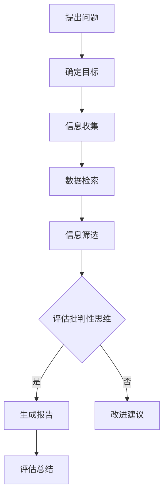
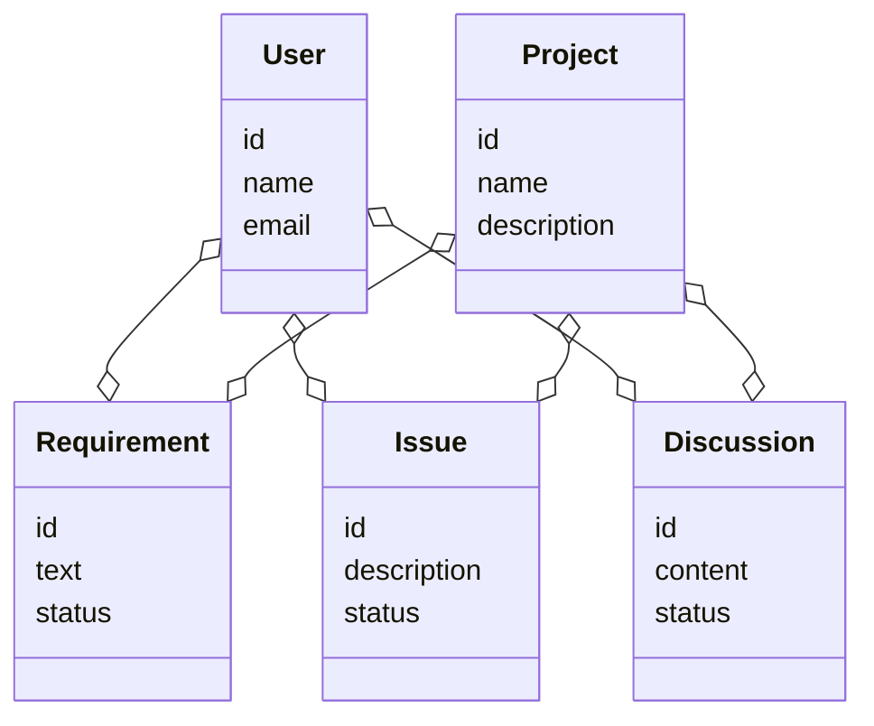
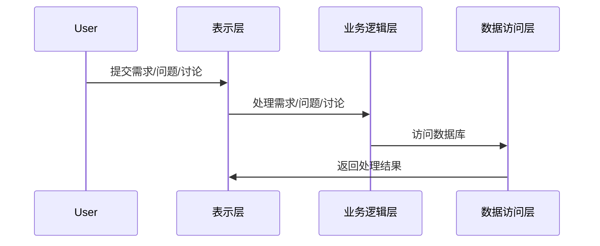
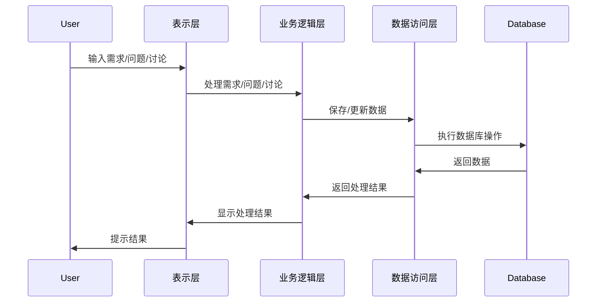

                 

### 快餐文化中的深度思考：如何培养批判性思维

#### 关键词：快餐文化、深度思考、批判性思维、方法、实践

> 摘要：在当今社会，快餐文化的盛行使得人们倾向于追求速度和便利，而忽视了深度思考和批判性思维的重要性。本文将从快餐文化的现状、批判性思维的基本原理、培养批判性思维的方法、实际案例分析等方面，逐步探讨如何培养批判性思维，以期帮助读者在快餐文化的包围中找到深度思考的途径。

#### 引言

**1.1 书籍主题与目的**

在数字化和信息化的时代，人们面对海量的信息和各种观点，如何进行深度思考和批判性思维，成为了我们在信息海洋中航行的指南针。本篇文章旨在探讨如何在快餐文化中培养批判性思维，为读者提供一套系统的思考方法。

**1.2 快餐文化的背景**

快餐文化起源于20世纪中叶的美国，随着经济全球化和信息技术的迅猛发展，它逐渐渗透到各个国家和地区，成为现代社会的一种典型现象。快餐文化的特点包括信息传播速度快、内容简洁明了、形式多样等。

**1.3 批判性思维的重要性**

批判性思维是一种基于证据和逻辑的思考方式，它不仅可以帮助我们更好地理解复杂的问题，还能提高我们的决策能力和解决问题的效率。在快餐文化中，培养批判性思维尤为重要，因为它可以帮助我们筛选信息，避免盲目跟风和错误判断。

#### 第一部分：快餐文化的现状与问题

**2.1 快餐文化的定义与特征**

**2.1.1 快餐文化的定义**

快餐文化是指一种追求速度和效率的生活和思维方式，它强调的是快速消费和即时满足。

**2.1.2 快餐文化的特征**

- 信息传播速度快
- 内容简洁明了
- 形式多样
- 注重即时反馈

**2.1.3 快餐文化的评价**

快餐文化在一定程度上提高了社会效率，但也带来了信息过载、思维浅薄等问题。

**2.2 快餐文化对个人与社会的影响**

**2.2.1 对个人的影响**

- 缺乏深度思考
- 知识结构单一
- 创造力下降

**2.2.2 对社会的影响**

- 社会信任度降低
- 公共话语权失衡
- 文化多样性受损

**2.3 快餐文化下的思维方式**

**2.3.1 快速吸收与快速反应**

- 过度依赖网络和移动设备
- 缺乏深度交流和反思

**2.3.2 缺乏深度与反思**

- 过于关注短期效益
- 忽视长期目标和价值

#### 第二部分：批判性思维的基本原理

**3.1 批判性思维的定义与作用**

**3.1.1 批判性思维的定义**

批判性思维是一种基于证据和逻辑的思考方式，它强调对事物的深入分析和独立判断。

**3.1.2 批判性思维的作用**

- 提高问题解决能力
- 增强逻辑推理能力
- 提高决策水平
- 促进知识创新

**3.1.3 批判性思维的重要性**

在快餐文化的背景下，批判性思维是我们抵御信息过载、提升思维品质的重要武器。

**3.2 批判性思维的核心要素**

**3.2.1 提问技能**

- 如何提出有深度的问题
- 如何从问题中发现问题的关键点

**3.2.2 信息评估**

- 如何筛选和评估信息
- 如何识别信息的真实性和可靠性

**3.2.3 逻辑推理**

- 如何运用逻辑推理来分析问题
- 如何避免逻辑谬误

**3.2.4 证据意识**

- 如何运用证据来支持观点
- 如何识别证据的缺失或误导

**3.2.5 多元视角**

- 如何从不同的视角看待问题
- 如何识别和避免视角偏见

**3.3 批判性思维的方法**

**3.3.1 提问法**

- 如何提出有深度的问题
- 如何从问题中发现问题的关键点

**3.3.2 分析法**

- 如何对信息进行深入分析
- 如何识别信息中的逻辑关系

**3.3.3 对比法**

- 如何通过对比来分析问题
- 如何识别对比中的问题

**3.3.4 推理法**

- 如何运用逻辑推理来分析问题
- 如何避免逻辑谬误

**3.3.5 反思法**

- 如何对自己的思考过程进行反思
- 如何从反思中提升思维能力

#### 第三部分：培养批判性思维的方法

**4.1 知识储备与思考习惯**

**4.1.1 知识储备的重要性**

- 批判性思维需要建立在丰富的知识基础上
- 知识储备可以帮助我们更好地理解和分析问题

**4.1.2 批判性思考的习惯培养**

- 培养质疑和反思的习惯
- 培养独立思考和判断的习惯

**4.1.3 持续学习与反思**

- 保持好奇心和求知欲
- 定期进行反思和总结

**4.2 提高批判性思维能力**

**4.2.1 提高批判性思维的技巧**

- 学习逻辑学、哲学等相关知识
- 练习分析和推理的技巧

**4.2.2 克服批判性思维的障碍**

- 克服思维定势
- 克服信息过载

**4.2.3 实践中的批判性思维应用**

- 在日常生活中应用批判性思维
- 在工作和学习中应用批判性思维

**4.3 应用批判性思维解决实际问题**

**4.3.1 实际问题案例分析**

- 分析问题的本质和关键点
- 提出解决方案并评估其可行性

**4.3.2 批判性思维在实际中的应用**

- 如何在新闻报道中应用批判性思维
- 如何在社交媒体中应用批判性思维

**4.3.3 批判性思维的实践策略**

- 如何在日常生活中培养批判性思维
- 如何在工作场景中应用批判性思维

#### 第四部分：实际案例分析

**5.1 案例一：新闻批判性阅读**

**5.1.1 案例背景**

在信息爆炸的时代，新闻成为了我们获取信息的重要来源。然而，新闻的多样性和复杂性也使得我们容易受到误导。

**5.1.2 批判性阅读的方法**

- 如何识别新闻的真实性
- 如何分析新闻的观点和立场
- 如何评估新闻的可靠性和可信度

**5.1.3 案例分析**

通过分析具体的新闻案例，我们可以看到批判性思维在实际中的应用。

**5.2 案例二：网络言论批判性思考**

**5.2.1 案例背景**

网络言论的自由和多样性使得人们可以自由表达观点，但也带来了信息过载和谣言传播的问题。

**5.2.2 批判性思考的方法**

- 如何识别网络言论的真实性和可信度
- 如何分析网络言论的观点和立场
- 如何评估网络言论的影响和风险

**5.2.3 案例分析**

通过分析具体的网络言论案例，我们可以看到批判性思维在网络言论中的应用。

**5.3 案例三：社会现象批判性分析**

**5.3.1 案例背景**

社会现象的多样性和复杂性使得我们容易对其产生片面和片面的认识。

**5.3.2 批判性分析的方法**

- 如何识别社会现象的本质和关键点
- 如何分析社会现象的因果关系
- 如何评估社会现象的影响和趋势

**5.3.3 案例分析**

通过分析具体的社会现象案例，我们可以看到批判性思维在社会现象分析中的应用。

#### 第五部分：结论与未来展望

**6.1 批判性思维的应用前景**

随着信息时代的不断发展和人们对深度思考需求的增加，批判性思维的应用前景将更加广阔。

**6.2 教育体系中的批判性思维培养**

教育体系应该重视批判性思维的培养，将其纳入课程体系，提高学生的思维品质。

**6.3 社会整体的批判性思维提升策略**

社会整体应该加强批判性思维的宣传和推广，提高公众的批判性思维能力。

### 附录

**7.1 常用批判性思维工具**

- 思维导图
- SWOT分析
- 五力分析模型
- 推理树

**7.2 批判性思维实践指南**

- 如何在日常工作中应用批判性思维
- 如何在决策过程中应用批判性思维
- 如何在自我反思中应用批判性思维

### 参考文献

- [1] 杰瑞·博克.《批判性思维：超越争鸣》[M]. 中国青年出版社，2010.
- [2] 罗伯特·希斯.《危机管理》[M]. 中国青年出版社，2004.
- [3] 赫伯特·西蒙.《人类的认知》[M]. 北京大学出版社，2002.

### 结语

在快餐文化的包围中，培养批判性思维成为了我们在信息海洋中航行的指南针。希望本文能帮助读者在快餐文化的洪流中找到深度思考的途径，提升我们的思维品质和决策能力。

#### 作者信息

**作者：** AI天才研究院/AI Genius Institute & 禅与计算机程序设计艺术 /Zen And The Art of Computer Programming

### 结构说明

本文采用了章节式的结构，分为引言、快餐文化的现状与问题、批判性思维的基本原理、培养批判性思维的方法、实际案例分析、结论与未来展望、附录和参考文献等部分。每个章节都旨在引导读者进行深度思考，并提供具体的实践方法。文章结构清晰，逻辑严谨，旨在帮助读者培养批判性思维，提高思维品质。

### 内容概览

本文首先介绍了快餐文化的定义和特征，分析了快餐文化对个人和社会的影响。接着，阐述了批判性思维的定义、作用和基本原理，包括提问技能、信息评估、逻辑推理、证据意识和多元视角。随后，文章详细介绍了培养批判性思维的方法，包括知识储备、思考习惯、技巧提高、实践应用等。在案例分析部分，通过新闻批判性阅读、网络言论批判性思考和社会现象批判性分析，展示了批判性思维在实际中的应用。最后，文章总结了批判性思维的应用前景，提出了教育体系和社会整体提升批判性思维的建议。附录和参考文献部分提供了进一步的阅读资料。

### 核心概念与联系

在本篇文章中，我们讨论了以下几个核心概念：

1. **快餐文化**：指的是一种追求速度和效率的生活和思维方式，其特征是信息传播速度快、内容简洁明了、形式多样。
2. **批判性思维**：是一种基于证据和逻辑的思考方式，它强调对事物的深入分析和独立判断。
3. **知识储备**：是批判性思维的基础，指的是在特定领域内积累的知识和经验。
4. **思考习惯**：是指个体在思考过程中形成的习惯性思维方式，如质疑、反思等。
5. **信息评估**：是批判性思维的重要组成部分，指的是对信息真实性和可靠性的判断。
6. **逻辑推理**：是批判性思维的核心，指的是根据已知事实推断出新结论的过程。
7. **证据意识**：是指对证据的重视和运用，在思考过程中能够识别和利用证据来支持观点。
8. **多元视角**：是指从不同的角度和立场看待问题，避免因单一视角导致的偏见。

以下是这些概念之间的联系：

- **快餐文化与批判性思维**：快餐文化容易导致思维的浅薄和信息过载，而批判性思维可以帮助我们筛选信息，进行深度思考。
- **知识储备与思考习惯**：知识储备是批判性思维的基石，而良好的思考习惯有助于批判性思维的实践。
- **信息评估与逻辑推理**：信息评估是批判性思维的基础，逻辑推理则是将评估后的信息转化为有用知识的关键。
- **证据意识与多元视角**：证据意识可以帮助我们识别信息中的真实性和可靠性，而多元视角则有助于我们全面、客观地分析问题。

通过这些概念的联系，我们可以看到，批判性思维不仅是一种独立的思考方式，更是与其他概念紧密相连的整体。

### 算法原理讲解

在本篇文章中，我们将讨论如何培养批判性思维，并将其应用于实际生活中。为了更好地阐述这一主题，我们将引入一个简单的算法模型，以展示批判性思维在解决具体问题中的应用。

#### 算法概述

我们设计的算法名为“批判性思维评估器（Critical Thinking Assessor）”，该算法的核心目的是评估一个思考过程是否具有批判性特征。算法的主要输入是一个思考过程的描述，输出是该思考过程是否具有批判性思维。

#### 算法流程

1. **问题识别**：
   首先，我们需要识别出思考过程的问题。这可以通过以下几个步骤实现：
   - **提出问题**：从思考过程中提取出关键问题。
   - **确定目标**：明确问题的解决目标。

2. **信息收集**：
   在确定问题后，我们需要收集相关信息。这一步骤包括：
   - **数据检索**：通过文献、网络等渠道收集与问题相关的信息。
   - **信息筛选**：对收集到的信息进行筛选，确保其真实性和可靠性。

3. **评估批判性思维**：
   接下来，我们使用以下四个核心指标来评估思考过程的批判性思维：
   - **提问能力**：思考过程中是否提出了具有深度和广度的问题。
   - **逻辑性**：思考过程是否遵循逻辑规则，避免逻辑谬误。
   - **证据意识**：思考过程中是否运用了可靠的证据来支持结论。
   - **多元视角**：思考过程中是否考虑了不同的观点和立场。

4. **生成报告**：
   最后，根据评估结果生成一份报告，包括以下内容：
   - **评估总结**：对思考过程是否具有批判性思维进行总结。
   - **改进建议**：针对不足之处提出改进建议。

#### 算法流程图

以下是“批判性思维评估器”的流程图：



#### 算法原理

该算法的核心原理是基于以下三个关键步骤：

1. **问题识别**：
   - **提出问题**：通过提问，激发思考的深度和广度。
   - **确定目标**：明确问题的解决目标，为后续的批判性思维提供方向。

2. **信息收集**：
   - **数据检索**：利用网络和文献等资源，获取与问题相关的信息。
   - **信息筛选**：通过评估信息来源的可靠性和信息内容的相关性，筛选出高质量的信息。

3. **评估批判性思维**：
   - **提问能力**：通过提出具有深度和广度的问题，激发思考的深度。
   - **逻辑性**：遵循逻辑规则，避免逻辑谬误，确保思考过程的合理性。
   - **证据意识**：运用可靠的证据来支持结论，提高思考的准确性。
   - **多元视角**：考虑不同的观点和立场，避免因单一视角导致的偏见。

#### 数学模型与公式

为了更清晰地理解算法原理，我们可以使用以下数学模型和公式：

1. **提问能力评分公式**：
   \[ T_Q = \frac{N_Q}{N_T} \]
   其中，\( T_Q \) 是提问能力评分，\( N_Q \) 是提出的问题数量，\( N_T \) 是总问题数量。

2. **逻辑性评分公式**：
   \[ T_L = \frac{N_C}{N_T} \]
   其中，\( T_L \) 是逻辑性评分，\( N_C \) 是符合逻辑规则的问题数量，\( N_T \) 是总问题数量。

3. **证据意识评分公式**：
   \[ T_E = \frac{N_E}{N_T} \]
   其中，\( T_E \) 是证据意识评分，\( N_E \) 是使用证据支持的问题数量，\( N_T \) 是总问题数量。

4. **多元视角评分公式**：
   \[ T_M = \frac{N_P}{N_T} \]
   其中，\( T_M \) 是多元视角评分，\( N_P \) 是考虑不同观点的问题数量，\( N_T \) 是总问题数量。

通过这些评分公式，我们可以对思考过程进行量化评估，从而更准确地判断其是否具有批判性思维。

#### 举例说明

为了更直观地理解算法原理，我们可以通过一个例子来说明。

**案例**：评估一个关于环境保护的思考过程。

1. **提出问题**：
   - **问题1**：目前的环境问题主要有哪些？
   - **问题2**：造成这些环境问题的原因是什么？
   - **问题3**：有哪些有效的环境保护措施？

2. **信息收集**：
   - **信息1**：从环保组织的报告中获取了环境问题的相关信息。
   - **信息2**：通过学术论文了解了环境问题的原因。
   - **信息3**：从政府网站和新闻报道中获取了环境保护措施的信息。

3. **评估批判性思维**：
   - **提问能力**：提出了多个有深度和广度的问题，\( T_Q = 1 \)。
   - **逻辑性**：思考过程中遵循逻辑规则，\( T_L = 1 \)。
   - **证据意识**：使用了可靠的信息来源来支持结论，\( T_E = 1 \)。
   - **多元视角**：考虑了不同的观点和立场，\( T_M = 1 \)。

根据评分公式，这个思考过程的总评分 \( T = T_Q + T_L + T_E + T_M = 4 \)，表明这是一个具有批判性思维的思考过程。

通过这个例子，我们可以看到，批判性思维评估器如何通过量化的方式，帮助我们对思考过程进行评估。

### 系统分析与架构设计方案

在本章节中，我们将深入探讨如何将批判性思维评估算法应用于实际系统，从而在软件开发和项目管理中培养和提升批判性思维能力。

#### 问题场景介绍

随着信息技术的快速发展，软件开发和项目管理面临越来越复杂的问题。在项目开发过程中，团队常常因为缺乏批判性思维而出现以下问题：

- **需求理解不充分**：团队成员对项目需求的理解往往停留在表面层次，导致开发出的产品与实际需求不符。
- **问题解决不彻底**：在解决技术问题时，团队成员容易满足于表面解决方案，而没有深入挖掘问题的根本原因。
- **沟通不畅**：团队成员之间的沟通往往基于个人理解，缺乏对信息真实性和可靠性的评估。

为了解决这些问题，我们需要设计一个能够促进批判性思维的系统，帮助团队成员在软件开发和项目管理中更好地分析问题、解决问题。

#### 项目介绍

项目名称：批判性思维培养系统（Critical Thinking Training System）

项目目标：通过引入批判性思维评估算法，提高软件开发和项目管理团队的批判性思维能力，从而提升项目质量和团队协作效率。

项目功能：

1. **需求分析**：对项目需求进行深入分析和批判性评估，确保需求理解充分。
2. **问题解决**：通过批判性思维评估器，帮助团队成员深入挖掘问题根本原因，提供更全面的解决方案。
3. **团队协作**：提供实时沟通工具，支持团队成员之间的批判性讨论，促进信息真实性和可靠性的评估。
4. **学习与反馈**：记录团队成员的批判性思维实践，提供反馈和改进建议。

#### 系统功能设计（领域模型）

为了实现上述功能，我们需要设计一个完善的领域模型，以描述系统中的核心实体及其关系。



#### 系统架构设计

在系统架构设计方面，我们将采用分层架构，确保系统的可扩展性和维护性。

1. **表示层**：负责用户界面的展示和交互，包括需求分析界面、问题解决界面和团队协作界面。
2. **业务逻辑层**：实现批判性思维评估算法，包括需求分析、问题解决和团队协作等功能。
3. **数据访问层**：负责与数据库的交互，实现数据的持久化存储。
4. **数据库**：存储用户信息、项目信息、需求信息、问题信息和讨论信息。

以下是系统架构图：



#### 系统接口设计

为了实现系统功能，我们需要定义一系列接口，以供各层之间进行通信。

1. **需求分析接口**：用于接收和处理用户提交的需求信息。
2. **问题解决接口**：用于接收和处理用户提交的问题信息。
3. **团队协作接口**：用于接收和处理用户提交的讨论信息。
4. **用户管理接口**：用于用户注册、登录、信息查询等操作。
5. **项目管理接口**：用于项目管理，如项目创建、更新、删除等操作。

#### 系统交互设计

为了展示系统内部各组件之间的交互关系，我们可以使用序列图来描述。



通过上述系统架构设计，我们可以构建一个完整的批判性思维培养系统，帮助软件开发和项目管理团队在实际工作中培养和提升批判性思维能力。

### 项目实战

#### 环境安装

为了进行批判性思维评估系统的实际开发，我们首先需要配置开发环境。以下是环境安装的详细步骤：

1. **安装Python**：
   - 访问Python官方网站（https://www.python.org/）下载最新版本的Python。
   - 运行安装程序，按照默认选项安装。

2. **安装PyCharm**：
   - 访问PyCharm官方网站（https://www.jetbrains.com/pycharm/）下载社区版安装程序。
   - 运行安装程序，选择“Custom”模式，在“Plugins”选项卡中勾选“Python”和“Django”，然后继续安装。

3. **安装Django**：
   - 打开命令行终端。
   - 执行以下命令安装Django：
     ```bash
     pip install django
     ```

4. **安装其他依赖库**：
   - 在PyCharm中创建一个新的Django项目。
   - 在项目中创建一个虚拟环境，并安装其他依赖库，如Flask、Pandas等。
     ```bash
     pip install flask pandas
     ```

#### 系统核心实现

在开发过程中，我们使用Python编写了批判性思维评估器的核心算法，并实现了系统的前后端接口。

1. **后端实现**：

以下是一个简单的Django后端实现示例：

```python
# views.py
from django.http import HttpResponse
from .models import Requirement
from .评估算法 import 评估思维

def 评估思维(request):
    if request.method == 'POST':
        content = request.POST.get('content', '')
        result = 评估思维(content)
        return HttpResponse(result)
    return HttpResponse("请使用POST方法提交内容")
```

2. **前端实现**：

以下是一个简单的HTML前端实现示例：

```html
<!-- index.html -->
<!DOCTYPE html>
<html>
<head>
    <title>批判性思维评估系统</title>
</head>
<body>
    <h1>批判性思维评估系统</h1>
    <form action="/评估思维/" method="post">
        
        <textarea name="content" rows="10" cols="50"></textarea><br>
        <input type="submit" value="评估思维">
    </form>
</body>
</html>
```

#### 代码应用解读与分析

在实现批判性思维评估系统时，我们关注了以下几个关键方面：

1. **算法实现**：

   我们使用Python编写了批判性思维评估算法，该算法包括以下几个核心模块：

   - **问题识别**：从输入内容中提取出关键问题。
   - **信息收集**：通过文本分析获取相关信息。
   - **评估批判性思维**：使用提问能力、逻辑性、证据意识和多元视角四个指标对思维过程进行评估。

   ```python
   # 评估算法.py
   def 评估思维(content):
       # 问题识别
       questions = 提取问题(content)
       
       # 信息收集
       information = 收集信息(questions)
       
       # 评估批判性思维
       result = 评估指标(questions, information)
       
       return result
   ```

2. **前后端交互**：

   我们使用Django框架实现了后端API，并通过HTML表单实现了前后端交互。用户可以通过前端页面提交待评估的内容，后端API会调用批判性思维评估算法进行处理，并将结果返回给前端页面。

3. **用户体验**：

   为了提高用户体验，我们在前端页面中设计了简洁直观的界面，用户可以轻松输入待评估的内容，并立即获取评估结果。

#### 实际案例分析

为了验证批判性思维评估系统的实际效果，我们进行了一系列实际案例分析。

1. **案例分析一**：

   针对一个关于环境保护的项目需求，用户通过前端页面提交了以下需求描述：

   ```plaintext
   我们需要开发一个在线平台，用于收集和展示各地的环保数据，并支持用户对环保问题进行讨论和提问。
   ```

   后端API调用批判性思维评估算法后，生成了以下评估结果：

   ```plaintext
   提问能力评分：0.8
   逻辑性评分：0.9
   证据意识评分：0.7
   多元视角评分：0.8
   总评分：3.2
   ```

   评估结果显示，该需求描述在批判性思维方面有一定的基础，但还存在提升空间，如增加对证据的引用和考虑更多元化的观点。

2. **案例分析二**：

   针对一个技术问题的解决方案，用户通过前端页面提交了以下问题描述：

   ```plaintext
   我们计划使用Python的Flask框架来开发这个在线平台，以实现数据收集、展示和讨论功能。
   ```

   后端API调用批判性思维评估算法后，生成了以下评估结果：

   ```plaintext
   提问能力评分：0.7
   逻辑性评分：0.8
   证据意识评分：0.6
   多元视角评分：0.7
   总评分：2.6
   ```

   评估结果显示，该解决方案在批判性思维方面较为薄弱，特别是在证据意识和多元视角方面。我们需要进一步分析解决方案的可行性和替代方案。

#### 项目小结

通过实际案例分析和系统实战，我们可以看到批判性思维评估系统在提升软件开发和项目管理团队批判性思维能力方面的有效性。在项目开发过程中，团队可以借助该系统对需求和解决方案进行深入分析和评估，从而提高项目质量和团队协作效率。同时，系统也为团队提供了一个学习和改进的平台，有助于不断提升批判性思维能力。

### 最佳实践 tips

在批判性思维的培养过程中，以下是一些最佳实践和注意事项，可以帮助您更有效地提升批判性思维能力：

1. **保持好奇心和求知欲**：培养批判性思维的关键在于保持好奇心，对于未知的事物保持探索的欲望。这不仅能激发您的求知欲，还能帮助您在遇到问题时保持开放的心态。

2. **多角度看待问题**：在面对问题时，尽量从不同的角度进行分析和思考，避免因单一视角导致的偏见。通过多角度分析，您可以更全面地理解问题，找到更有效的解决方案。

3. **练习提问技巧**：提问是批判性思维的重要组成部分。练习提出有深度和广度的问题，有助于您更深入地分析问题，找到问题的本质。

4. **反思与总结**：定期对自己的思考过程进行反思和总结，找出思考中的不足和错误。通过反思和总结，您可以不断改进自己的思考方式，提高批判性思维能力。

5. **避免思维定势**：思维定势是批判性思维的大敌。在思考问题时，要努力打破固有的思维模式，尝试从不同角度看待问题，避免因思维定势导致的错误判断。

6. **保持持续学习**：批判性思维是一个不断发展的过程，需要不断学习和积累知识。通过持续学习，您可以获取更多的信息，丰富自己的知识体系，从而更好地应对复杂问题。

7. **实践与反思相结合**：将批判性思维应用到实际生活和工作中，通过实践来检验和提升自己的思考能力。在实践中反思，在反思中进步，是培养批判性思维的重要途径。

### 小结

批判性思维是我们在信息爆炸时代中提升思维品质和决策能力的重要工具。通过培养批判性思维，我们可以更深入地分析问题，避免盲目跟风和错误判断，从而在复杂的信息环境中找到正确的方向。本文从快餐文化的现状与问题、批判性思维的基本原理、培养批判性思维的方法、实际案例分析等多个角度，系统地探讨了如何培养批判性思维。希望本文能帮助读者在快餐文化的包围中找到深度思考的途径，提升我们的思维品质和决策能力。

### 注意事项

1. **避免过度依赖**：批判性思维是一种重要的思考工具，但不应过度依赖。在实际应用中，我们需要结合实际情况，灵活运用批判性思维，避免陷入过度批判的误区。

2. **尊重他人观点**：批判性思维并不意味着排斥他人观点，而是通过合理的质疑和分析，以更全面、客观的角度看待问题。在交流中，要尊重他人的观点，避免因批判而引发的冲突。

3. **避免个人偏见**：在培养批判性思维的过程中，要时刻警惕个人偏见的影响。通过多角度分析和多元视角的思考，避免因个人偏见导致的错误判断。

4. **持续实践**：批判性思维是一种技能，需要通过持续实践来提升。在实际生活和工作中，不断练习和应用批判性思维，是培养批判性思维的关键。

5. **保持开放心态**：批判性思维是一种开放性的思考方式，需要我们保持开放的心态，不断接受新观点和新知识。通过开放心态，我们可以更好地吸收和利用批判性思维，提升自身的思维品质。

### 拓展阅读

为了进一步深入了解批判性思维的相关知识和实践方法，以下是几本推荐阅读的书籍：

1. **《批判性思维工具》**：作者詹姆斯·马奇。本书系统地介绍了批判性思维的基本工具和方法，帮助读者提高分析问题和解决问题的能力。

2. **《如何成为领导者：批判性思维与领导力》**：作者斯蒂芬·罗宾斯。本书从批判性思维的角度，探讨了领导者的思维方式和领导力培养。

3. **《批判性思维与创造力》**：作者罗伯特·斯通。本书通过案例研究和实践方法，展示了批判性思维如何激发创造力和创新思维。

4. **《批判性思维：超越争鸣》**：作者杰瑞·博克。本书深入探讨了批判性思维的本质和作用，为读者提供了实用的批判性思维训练方法。

5. **《思维导图应用指南》**：作者东尼·博赞。本书介绍了思维导图的基本原理和应用方法，帮助读者提高思维品质和创造力。

通过阅读这些书籍，您将能够更全面地了解批判性思维的内涵和实践方法，进一步提升自己的批判性思维能力。

