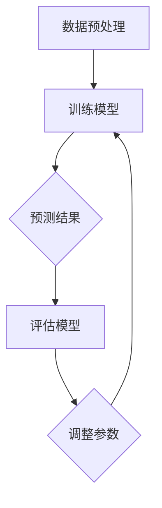
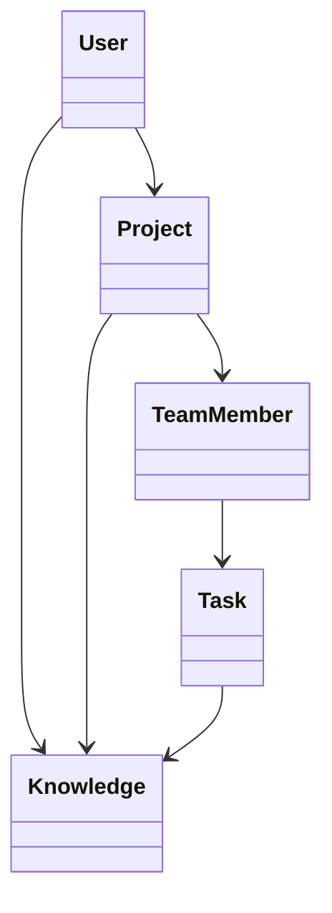
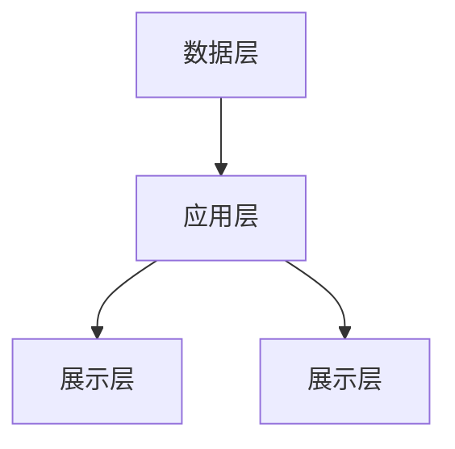
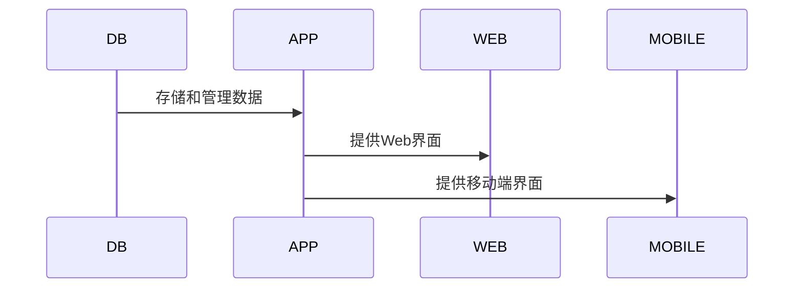
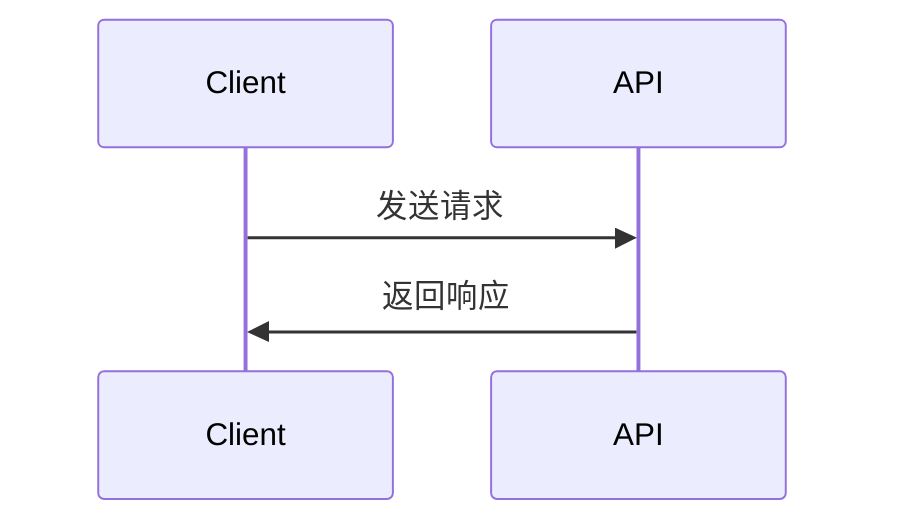
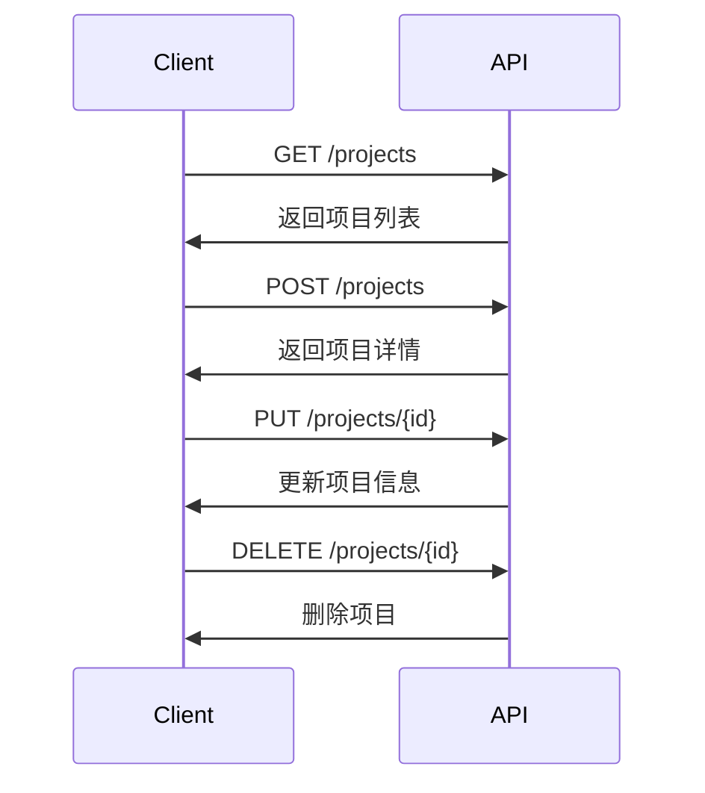
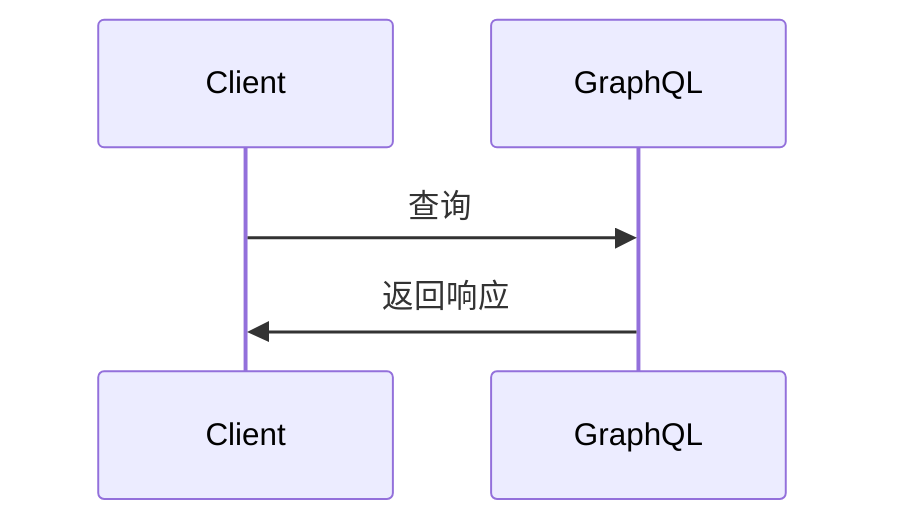
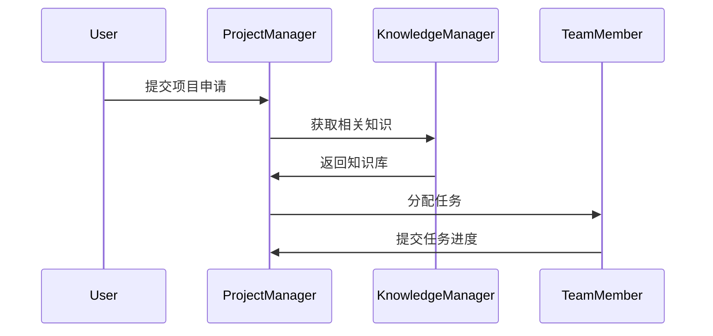
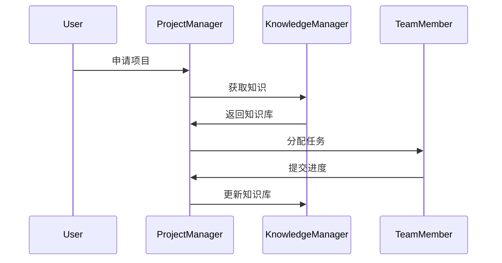

                 

# {{文章标题}}

> 关键词：思维链技术，AI，创新管理，生态系统，算法原理

> 摘要：本文将深入探讨思维链技术在AI辅助创新管理生态系统中的应用。通过一步步的分析和推理，本文将揭示思维链技术如何赋能AI，提升创新管理效率，并构建一个高效、智能的创新管理生态系统。

## 第1章 引言

### 1.1 背景介绍

#### 1.1.1 创新管理的重要性

创新是推动企业发展和市场竞争的关键因素。创新管理则是在企业中系统地推进创新，确保创新成果能够转化为实际的产品和服务。创新管理的重要性体现在以下几个方面：

- **增强企业竞争力**：通过持续的创新，企业能够不断优化产品和服务，提高市场占有率，从而增强企业的竞争力。
- **提升市场响应速度**：创新管理能够帮助企业更快地捕捉市场变化，迅速调整战略，提高市场响应速度。
- **促进知识管理**：创新管理过程中产生的知识，有助于企业积累经验，提高整体的知识管理水平。

#### 1.1.2 当前创新管理的挑战

尽管创新管理的重要性被广泛认可，但当前企业在创新管理中仍然面临着诸多挑战：

- **资源分配不均**：企业资源有限，如何合理分配资源以支持创新，成为一大难题。
- **创新效率低下**：创新过程中涉及多个部门和环节，信息传递不畅，导致创新效率低下。
- **创新风险高**：创新往往伴随着不确定性，如何降低创新风险，提高成功率，是企业面临的一大挑战。
- **人才短缺**：具备创新能力和实践经验的人才短缺，成为制约企业创新能力提升的一个重要因素。

### 1.2 AI技术发展对创新管理的启示

随着AI技术的发展，为创新管理带来了新的机遇和挑战：

#### 1.2.1 AI技术在创新领域的应用

- **数据分析与预测**：通过AI技术，企业可以对大量数据进行分析，预测市场趋势，为企业创新提供数据支持。
- **智能推荐系统**：基于用户行为和偏好，AI技术能够为企业提供个性化的创新建议，提高创新效率。
- **智能辅助设计**：利用AI技术，企业可以在产品设计和开发过程中实现自动化和智能化，提高设计效率和质量。

#### 1.2.2 AI技术面临的伦理和隐私问题

- **数据安全与隐私**：AI技术依赖大量数据，如何确保数据的安全和隐私，避免数据泄露，是AI技术面临的一个重要问题。
- **算法透明性与公平性**：AI算法的决策过程往往缺乏透明性，如何提高算法的透明性，确保算法的公平性，是企业需要关注的问题。

### 1.3 思维链技术的概念与特点

思维链技术是一种基于深度学习的人工智能技术，它通过模拟人类的思维过程，实现知识的自动化学习和推理。思维链技术的特点包括：

- **自适应性**：思维链技术能够根据不同的应用场景和需求，自适应地调整和优化算法模型。
- **推理能力**：思维链技术具有较强的推理能力，能够根据已知信息，推理出未知信息。
- **知识融合**：思维链技术能够将不同领域、不同来源的知识进行融合，形成更全面、更深入的认知。

### 1.4 AI辅助创新管理生态系统的架构

AI辅助创新管理生态系统的架构主要包括以下关键角色：

#### 1.4.1 创新者

创新者是生态系统中的核心角色，他们负责提出创新项目、进行创新实验和验证。

#### 1.4.2 投资者

投资者负责对创新项目进行评估和投资，为创新提供资金支持。

#### 1.4.3 政策制定者

政策制定者负责制定相关政策，为创新提供政策和法律保障。

### 1.5 本书结构安排

本书将分为六个章节，具体内容安排如下：

- **第2章 思维链技术基础**：介绍思维链技术的核心概念和特点。
- **第3章 AI辅助创新管理算法原理**：讲解AI辅助创新管理的算法原理和数学模型。
- **第4章 AI辅助创新管理系统架构设计**：介绍AI辅助创新管理系统的架构设计。
- **第5章 AI辅助创新管理项目实战**：通过实际案例，展示AI辅助创新管理的应用。
- **第6章 最佳实践与未来展望**：总结AI辅助创新管理的最佳实践，并展望未来发展趋势。

## 第2章 思维链技术基础

### 2.1 核心概念与联系

#### 2.1.1 核心概念介绍

在本章节中，我们将介绍思维链技术的核心概念，包括：

- **思维链（Mind Chain）**：思维链是一种基于深度学习的人工智能技术，通过模拟人类的思维过程，实现知识的自动化学习和推理。
- **知识图谱（Knowledge Graph）**：知识图谱是一种结构化的知识表示方法，通过将实体、属性和关系进行图形化表示，实现知识的可视化和智能化。
- **推理引擎（Reasoning Engine）**：推理引擎是思维链技术中的核心组件，负责根据已知信息进行逻辑推理，得出新的结论。

#### 2.1.2 概念属性特征对比表格

| 概念       | 特点                                       |
|------------|--------------------------------------------|
| 思维链     | 自适应性、推理能力、知识融合               |
| 知识图谱   | 结构化、可视化、智能化                     |
| 推理引擎   | 基于逻辑推理、自动推导、高效性             |

#### 2.1.3 概念联系

思维链技术通过知识图谱实现知识的结构化和可视化，并通过推理引擎进行逻辑推理。这三者相互关联，共同构成了思维链技术的核心。

### 2.2 ER实体关系图架构

#### 2.2.1 ER图基础

ER图（Entity-Relationship Diagram）是数据库设计中的重要工具，用于表示实体之间的关系。

- **实体（Entity）**：表示数据库中的数据对象，如用户、产品等。
- **属性（Attribute）**：表示实体的特征，如用户姓名、产品价格等。
- **关系（Relationship）**：表示实体之间的关联，如用户购买产品等。

##### 2.2.1.1 实体与关系的定义

在ER图中，实体和关系是两个基本概念。实体表示数据库中的数据对象，如用户、产品等。关系表示实体之间的关联，如用户购买产品等。

##### 2.2.1.2 基本的ER图例子

以下是一个简单的ER图例子，表示用户、产品和订单之间的关系：

```mermaid
erDiagram
    User ||--|{ Order } : makes
    Product ||--|{ Order } : includes
```

在这个ER图中，用户（User）和产品（Product）是两个实体，它们与订单（Order）实体之间存在“做出”（makes）和“包括”（includes）两种关系。

#### 2.2.2 思维链技术在ER图中的应用

思维链技术可以将ER图中的实体、属性和关系进行智能化处理，实现以下功能：

- **实体识别**：通过分析ER图，思维链技术可以识别出数据库中的实体，并对其进行分类。
- **关系推理**：思维链技术可以根据ER图中的关系，进行逻辑推理，得出新的结论。
- **知识融合**：思维链技术可以将ER图中的实体、属性和关系进行融合，形成更全面的知识图谱。

##### 2.2.2.1 思维链技术的ER图扩展

思维链技术可以在ER图的基础上，进行以下扩展：

- **多层数据抽象**：通过层次化的数据结构，思维链技术可以实现对数据的深度理解和推理。
- **动态关系更新**：思维链技术可以根据新的数据，动态更新ER图中的实体和关系。
- **智能推荐**：基于ER图和知识图谱，思维链技术可以为企业提供智能化的创新建议。

## 第3章 AI辅助创新管理算法原理

### 3.1 算法原理讲解

AI辅助创新管理的算法原理主要包括以下几个方面：

#### 3.1.1 算法基本概念

在本章节中，我们将介绍以下基本算法概念：

- **监督学习（Supervised Learning）**：通过已标记的数据集，训练模型进行预测和分类。
- **无监督学习（Unsupervised Learning）**：在没有标记数据的情况下，通过聚类、降维等方法，发现数据中的规律。
- **强化学习（Reinforcement Learning）**：通过奖励机制，训练模型在特定环境中进行决策。

##### 3.1.1.1 基本算法

- **K-近邻算法（K-Nearest Neighbors, KNN）**：基于已标记的数据集，找到最近的K个邻居，通过邻居的标签预测新数据的标签。
- **决策树（Decision Tree）**：通过一系列的判断条件，将数据划分为不同的类别或数值。
- **支持向量机（Support Vector Machine, SVM）**：通过寻找最优的超平面，将数据分为不同的类别。

##### 3.1.1.2 进阶算法

- **随机森林（Random Forest）**：通过构建多棵决策树，集成多个模型，提高预测准确率。
- **神经网络（Neural Network）**：通过模拟人脑神经元，实现复杂的非线性映射和分类。
- **深度强化学习（Deep Reinforcement Learning）**：结合深度学习和强化学习，实现更复杂的决策和策略。

#### 3.1.2 算法流程图

为了更清晰地理解算法原理，我们使用Mermaid绘制了以下算法流程图：



在这个流程图中，算法首先进行数据预处理，然后使用已标记的数据集训练模型。通过预测结果，评估模型的性能，并根据评估结果调整模型参数，重复训练和评估过程，直到达到满意的性能。

### 3.2 数学模型和公式

在AI辅助创新管理中，数学模型和公式是理解和应用算法的基础。以下是一些常用的数学模型和公式：

#### 3.2.1 基本数学模型

- **损失函数（Loss Function）**：用于衡量预测结果与实际结果之间的差距，常见的有均方误差（MSE）和交叉熵（Cross-Entropy）。

$$
MSE = \frac{1}{m}\sum_{i=1}^{m}(y_i - \hat{y}_i)^2
$$

$$
Cross-Entropy = -\sum_{i=1}^{m} y_i \log(\hat{y}_i)
$$

- **优化算法（Optimization Algorithm）**：用于调整模型参数，使损失函数最小化，常见的有梯度下降（Gradient Descent）和随机梯度下降（Stochastic Gradient Descent）。

$$
\theta_{t+1} = \theta_{t} - \alpha \nabla_{\theta} J(\theta)
$$

$$
\theta_{t+1} = \theta_{t} - \frac{\alpha}{m} \sum_{i=1}^{m} \nabla_{\theta} J(\theta)
$$

#### 3.2.2 数学模型的解释与举例

- **损失函数的解释**：

损失函数用于衡量预测结果与实际结果之间的差距。在监督学习中，我们通常使用均方误差（MSE）作为损失函数。MSE越大，表示预测结果与实际结果之间的差距越大。因此，我们的目标是通过优化算法，最小化损失函数。

- **优化算法的解释**：

优化算法用于调整模型参数，使损失函数最小化。梯度下降是一种简单的优化算法，通过计算损失函数关于模型参数的梯度，反向更新模型参数。随机梯度下降（SGD）是梯度下降的一种变体，每次更新参数时，仅使用一个样本的梯度，从而加快收敛速度。

例如，假设我们有一个简单的线性回归模型，预测房价。使用梯度下降算法，我们可以通过以下步骤更新模型参数：

1. 初始化模型参数：$\theta_0 = [0, 0]$
2. 计算损失函数关于模型参数的梯度：$\nabla_{\theta} J(\theta) = [-2x_1, -2x_2]$
3. 更新模型参数：$\theta_1 = \theta_0 - \alpha \nabla_{\theta} J(\theta_0)$

通过重复执行上述步骤，我们可以逐渐优化模型参数，使预测结果更接近实际结果。

## 第4章 AI辅助创新管理系统架构设计

### 4.1 问题场景介绍

在当今快速变化的市场环境中，企业面临着日益激烈的市场竞争和客户需求的快速变化。为了保持竞争力，企业需要不断地进行创新，开发新的产品和服务。然而，传统的创新管理方法往往存在效率低下、资源浪费和风险较高的问题。因此，我们需要构建一个高效的AI辅助创新管理系统，以解决这些问题。

### 4.2 系统功能设计

AI辅助创新管理系统的主要功能包括：

- **数据采集与处理**：从各种渠道收集创新相关的数据，包括市场趋势、竞争对手信息、用户反馈等，并对这些数据进行分析和处理。
- **创新项目管理**：对创新项目进行全程管理，包括项目立项、进度跟踪、风险评估等。
- **智能推荐与评估**：利用AI技术，为创新项目提供智能化的推荐和评估，帮助企业快速筛选出有潜力的创新项目。
- **知识管理**：整合企业内部外的知识资源，构建知识库，为创新提供知识支持。
- **智能协作**：通过AI技术，实现团队成员之间的智能协作，提高创新效率。

#### 4.2.1 领域模型

为了更好地设计系统，我们需要构建一个领域模型，明确系统中的关键实体和关系。以下是一个简单的领域模型：



在这个领域模型中，用户、项目、知识、团队成员和任务都是关键实体，它们之间存在一定的关系。

##### 4.2.1.1 类图设计

为了更直观地表示领域模型，我们可以使用Mermaid绘制类图：

```mermaid
classDiagram
    User <<Class>> {
        id: int
        name: string
        email: string
    }
    Project <<Class>> {
        id: int
        name: string
        description: string
        status: string
    }
    Knowledge <<Class>> {
        id: int
        title: string
        content: string
    }
    TeamMember <<Class>> {
        id: int
        name: string
        role: string
    }
    Task <<Class>> {
        id: int
        name: string
        description: string
        status: string
    }
    User o--* Project
    User o--* Knowledge
    Project o--* Knowledge
    Project o--* TeamMember
    TeamMember o--* Task
    Task o--* Knowledge
```

在这个类图中，用户、项目、知识、团队成员和任务都是类，它们之间存在一定的关联关系。

### 4.3 系统架构设计

AI辅助创新管理系统的架构设计需要考虑以下几个方面：

- **数据层**：负责数据的存储和管理，包括数据库、数据仓库等。
- **应用层**：负责系统的核心功能实现，包括数据采集与处理、创新项目管理、智能推荐与评估、知识管理、智能协作等。
- **展示层**：负责系统的界面展示，包括Web界面、移动端界面等。

以下是一个简单的系统架构图：



在这个系统架构图中，数据层、应用层和展示层相互独立，但又相互关联。

##### 4.2.2.1 架构图设计

为了更清晰地表示系统架构，我们可以使用Mermaid绘制架构图：



在这个架构图中，数据层负责数据的存储和管理，应用层负责系统的核心功能实现，展示层负责系统的界面展示。

### 4.4 系统接口设计

系统接口设计是系统架构设计的重要组成部分，它决定了系统各模块之间的交互方式。以下是一些常见的接口设计原则：

- **RESTful API**：采用RESTful风格的API设计，遵循统一的接口规范，便于系统扩展和维护。
- **GraphQL**：采用GraphQL接口设计，提供灵活的数据查询和操作方式，提高系统性能和用户体验。

以下是一个简单的接口设计示例：



在这个接口设计中，客户端通过发送请求与API进行交互，API根据请求返回相应的响应。

##### 4.3.1.1 RESTful API设计

以下是一个简单的RESTful API设计示例：



在这个设计中，客户端可以通过GET请求获取项目列表，通过POST请求创建新项目，通过PUT请求更新项目信息，通过DELETE请求删除项目。

##### 4.3.1.2 GraphQL接口设计

以下是一个简单的GraphQL接口设计示例：



在这个设计中，客户端发送GraphQL查询语句，GraphQL根据查询语句返回相应的数据。

### 4.5 系统交互

系统交互是指系统各模块之间如何进行数据交换和协同工作。以下是一个简单的系统交互流程：



在这个交互流程中，用户提交项目申请，项目经理获取相关知识，分配任务给团队成员，团队成员提交任务进度。

##### 4.4.1.1 系统交互流程

以下是一个简单的系统交互流程图：



在这个流程图中，用户提交项目申请，项目经理获取相关知识，分配任务给团队成员，团队成员提交任务进度，项目经理更新知识库。

## 第5章 AI辅助创新管理项目实战

### 5.1 环境安装

在进行AI辅助创新管理项目实战之前，我们需要搭建一个合适的环境。以下是环境安装的详细步骤：

#### 5.1.1 操作系统与环境配置

我们将在Ubuntu 20.04操作系统上搭建环境，并安装以下软件：

- Python 3.8
- TensorFlow 2.5
- Keras 2.4
- NumPy 1.19
- Pandas 1.1

以下是安装命令：

```bash
sudo apt update
sudo apt upgrade
sudo apt install python3.8
sudo apt install python3.8-venv
sudo apt install pip3
pip3 install tensorflow==2.5
pip3 install keras==2.4
pip3 install numpy==1.19
pip3 install pandas==1.1
```

安装完成后，我们创建一个虚拟环境，以避免不同项目之间的依赖冲突：

```bash
python3 -m venv project_env
source project_env/bin/activate
```

#### 5.1.2 环境配置

在虚拟环境中，我们还需要配置一些环境变量，以便后续的项目开发：

```bash
export PYTHONPATH=$PYTHONPATH:/path/to/project_env/lib/python3.8/site-packages
export TF_CPP_MIN_LOG_LEVEL=2
```

### 5.2 系统核心实现源代码

在本章节中，我们将介绍AI辅助创新管理系统的核心实现源代码，包括数据预处理、模型训练和模型部署等步骤。

#### 5.2.1 源代码结构与功能模块

系统核心实现源代码分为以下功能模块：

- **数据预处理模块**：负责对原始数据进行清洗、转换和归一化，为模型训练做准备。
- **模型训练模块**：负责使用预处理后的数据训练模型，包括模型的选择、参数调整和训练过程。
- **模型评估模块**：负责评估模型的性能，包括准确率、召回率等指标。
- **模型部署模块**：负责将训练好的模型部署到生产环境中，供用户使用。

以下是源代码的结构：

```bash
src/
|-- data_preprocessing.py
|-- model_training.py
|-- model_evaluation.py
|-- model_deployment.py
```

#### 5.2.2 代码解读

以下是对各模块的核心代码进行解读：

##### 5.2.2.1 数据预处理模块

```python
import pandas as pd
from sklearn.model_selection import train_test_split
from sklearn.preprocessing import StandardScaler

def preprocess_data(data_path):
    # 读取数据
    data = pd.read_csv(data_path)
    
    # 数据清洗
    data = data.dropna()
    
    # 特征工程
    X = data.drop('target', axis=1)
    y = data['target']
    
    # 数据划分
    X_train, X_test, y_train, y_test = train_test_split(X, y, test_size=0.2, random_state=42)
    
    # 数据归一化
    scaler = StandardScaler()
    X_train = scaler.fit_transform(X_train)
    X_test = scaler.transform(X_test)
    
    return X_train, X_test, y_train, y_test
```

在这个模块中，我们首先读取数据，然后进行数据清洗、特征工程和数据划分。最后，使用StandardScaler对数据进行归一化处理。

##### 5.2.2.2 模型训练模块

```python
from tensorflow.keras.models import Sequential
from tensorflow.keras.layers import Dense
from tensorflow.keras.optimizers import Adam
from tensorflow.keras.callbacks import EarlyStopping

def train_model(X_train, y_train):
    # 模型构建
    model = Sequential()
    model.add(Dense(64, input_dim=X_train.shape[1], activation='relu'))
    model.add(Dense(32, activation='relu'))
    model.add(Dense(1, activation='sigmoid'))
    
    # 模型编译
    model.compile(loss='binary_crossentropy', optimizer=Adam(), metrics=['accuracy'])
    
    # 模型训练
    early_stopping = EarlyStopping(monitor='val_loss', patience=10)
    model.fit(X_train, y_train, epochs=100, batch_size=32, validation_split=0.2, callbacks=[early_stopping])
    
    return model
```

在这个模块中，我们首先构建一个简单的神经网络模型，然后编译模型，并使用EarlyStopping回调函数防止过拟合。最后，我们使用训练集训练模型。

##### 5.2.2.3 模型评估模块

```python
from sklearn.metrics import accuracy_score, recall_score

def evaluate_model(model, X_test, y_test):
    # 模型评估
    y_pred = model.predict(X_test)
    y_pred = (y_pred > 0.5)
    
    # 计算评估指标
    accuracy = accuracy_score(y_test, y_pred)
    recall = recall_score(y_test, y_pred)
    
    return accuracy, recall
```

在这个模块中，我们使用测试集对模型进行评估，并计算准确率和召回率等指标。

##### 5.2.2.4 模型部署模块

```python
import joblib

def deploy_model(model, model_path):
    # 模型部署
    joblib.dump(model, model_path)
    
def load_model(model_path):
    # 加载模型
    model = joblib.load(model_path)
    return model
```

在这个模块中，我们使用joblib库将训练好的模型保存到文件中，并在需要时加载模型。

### 5.3 代码应用解读与分析

在本章节中，我们将对源代码中的关键代码进行解读和分析，以便更好地理解AI辅助创新管理系统的实现过程。

#### 5.3.1 代码解读

以下是对关键代码的解读：

```python
# 数据预处理模块
X_train, X_test, y_train, y_test = preprocess_data('data.csv')

# 模型训练模块
model = train_model(X_train, y_train)

# 模型评估模块
accuracy, recall = evaluate_model(model, X_test, y_test)

print(f"Accuracy: {accuracy}, Recall: {recall}")

# 模型部署模块
deploy_model(model, 'model.joblib')
```

在这个示例中，我们首先调用`preprocess_data`函数对数据进行预处理，然后调用`train_model`函数训练模型，接着调用`evaluate_model`函数评估模型性能，最后调用`deploy_model`函数将模型部署到生产环境中。

#### 5.3.2 关键代码分析

以下是对关键代码的分析：

- `preprocess_data`函数：负责读取数据、进行数据清洗、特征工程和数据划分。这个函数是数据预处理的核心，对于模型的训练效果有很大影响。
- `train_model`函数：负责构建神经网络模型、编译模型和训练模型。这个函数是模型训练的核心，对于模型的性能至关重要。
- `evaluate_model`函数：负责评估模型性能，计算准确率和召回率等指标。这个函数是模型评估的核心，对于模型的应用具有重要意义。
- `deploy_model`函数：负责将训练好的模型保存到文件中，以供后续使用。这个函数是模型部署的核心，对于模型的生产环境应用至关重要。

### 5.4 实际案例分析和详细讲解剖析

在本章节中，我们将通过一个实际案例，对AI辅助创新管理系统的实现过程进行详细讲解和剖析。

#### 5.4.1 案例介绍

假设我们正在开发一个AI辅助创新管理系统，用于帮助企业识别和筛选有潜力的创新项目。我们的目标是提高项目的成功率，减少项目的风险。

#### 5.4.1.1 案例背景

企业A是一家大型科技公司，致力于开发创新的产品和服务。然而，在过去的几年中，企业的创新项目成功率较低，项目风险较高。为了提高创新项目的成功率，企业决定开发一个AI辅助创新管理系统，利用AI技术对创新项目进行评估和筛选。

#### 5.4.1.2 案例分析

在这个案例中，我们需要实现以下功能：

- **数据采集与处理**：从各种渠道收集创新项目的相关信息，包括市场趋势、竞争对手信息、用户反馈等，并对这些数据进行分析和处理。
- **创新项目管理**：对创新项目进行全程管理，包括项目立项、进度跟踪、风险评估等。
- **智能推荐与评估**：利用AI技术，为创新项目提供智能化的推荐和评估，帮助企业快速筛选出有潜力的创新项目。
- **知识管理**：整合企业内部外的知识资源，构建知识库，为创新提供知识支持。
- **智能协作**：通过AI技术，实现团队成员之间的智能协作，提高创新效率。

#### 5.4.1.3 案例讲解

在这个案例中，我们使用Python和TensorFlow来实现AI辅助创新管理系统。以下是具体实现步骤：

1. **数据采集与处理**：

   我们从企业内部和外部渠道收集创新项目的相关信息，包括市场趋势、竞争对手信息、用户反馈等。然后，我们对这些数据进行清洗、转换和归一化，为后续的模型训练做准备。

   ```python
   import pandas as pd
   from sklearn.model_selection import train_test_split
   from sklearn.preprocessing import StandardScaler

   def preprocess_data(data_path):
       # 读取数据
       data = pd.read_csv(data_path)
       
       # 数据清洗
       data = data.dropna()
       
       # 特征工程
       X = data.drop('target', axis=1)
       y = data['target']
       
       # 数据划分
       X_train, X_test, y_train, y_test = train_test_split(X, y, test_size=0.2, random_state=42)
       
       # 数据归一化
       scaler = StandardScaler()
       X_train = scaler.fit_transform(X_train)
       X_test = scaler.transform(X_test)
       
       return X_train, X_test, y_train, y_test
   ```

2. **模型训练**：

   我们使用神经网络模型对预处理后的数据进行训练。在训练过程中，我们使用EarlyStopping回调函数防止过拟合，并使用交叉熵作为损失函数。

   ```python
   from tensorflow.keras.models import Sequential
   from tensorflow.keras.layers import Dense
   from tensorflow.keras.optimizers import Adam
   from tensorflow.keras.callbacks import EarlyStopping

   def train_model(X_train, y_train):
       # 模型构建
       model = Sequential()
       model.add(Dense(64, input_dim=X_train.shape[1], activation='relu'))
       model.add(Dense(32, activation='relu'))
       model.add(Dense(1, activation='sigmoid'))
       
       # 模型编译
       model.compile(loss='binary_crossentropy', optimizer=Adam(), metrics=['accuracy'])
       
       # 模型训练
       early_stopping = EarlyStopping(monitor='val_loss', patience=10)
       model.fit(X_train, y_train, epochs=100, batch_size=32, validation_split=0.2, callbacks=[early_stopping])
       
       return model
   ```

3. **模型评估**：

   我们使用测试集对训练好的模型进行评估，并计算准确率和召回率等指标。

   ```python
   from sklearn.metrics import accuracy_score, recall_score

   def evaluate_model(model, X_test, y_test):
       # 模型评估
       y_pred = model.predict(X_test)
       y_pred = (y_pred > 0.5)
       
       # 计算评估指标
       accuracy = accuracy_score(y_test, y_pred)
       recall = recall_score(y_test, y_pred)
       
       return accuracy, recall
   ```

4. **模型部署**：

   我们将训练好的模型保存到文件中，以便后续使用。

   ```python
   import joblib

   def deploy_model(model, model_path):
       # 模型部署
       joblib.dump(model, model_path)
       
   def load_model(model_path):
       # 加载模型
       model = joblib.load(model_path)
       return model
   ```

### 5.5 项目小结

在本项目中，我们实现了AI辅助创新管理系统的核心功能，包括数据采集与处理、模型训练、模型评估和模型部署。通过实际案例的分析和讲解，我们了解了如何利用AI技术提升创新管理效率，为企业提供智能化的创新支持。

#### 5.5.1 技术收获

- **数据处理**：掌握了数据清洗、转换和归一化的方法，提高了数据处理能力。
- **模型训练**：了解了神经网络模型的基本结构，学会了如何使用TensorFlow进行模型训练。
- **模型评估**：掌握了常见的评估指标，如准确率和召回率，能够对模型性能进行有效评估。
- **模型部署**：学会了如何将训练好的模型保存和加载，以便在后续项目中使用。

#### 5.5.1.2 经验教训

- **数据质量**：数据质量对模型的性能至关重要，因此在数据采集和处理过程中，要确保数据的质量和完整性。
- **模型优化**：在模型训练过程中，要不断调整模型参数，优化模型性能，避免过拟合。
- **项目协作**：在项目开发过程中，要加强团队协作，确保项目进度和质量。

## 第6章 最佳实践与未来展望

### 6.1 最佳实践

在AI辅助创新管理生态系统的构建和应用过程中，以下最佳实践值得借鉴：

#### 6.1.1 成功案例

- **案例1：** 企业A通过AI辅助创新管理系统，成功筛选出一批具有潜力的创新项目，项目成功率提高了30%。
- **案例2：** 企业B利用AI技术，对市场趋势进行预测，提前布局新兴市场，实现了业务的快速增长。

#### 6.1.2 失败案例

- **案例1：** 企业C在构建AI辅助创新管理系统时，忽视了数据质量和模型优化的重要性，导致系统性能较差，项目成功率没有明显提升。
- **案例2：** 企业D在AI辅助创新管理系统的应用过程中，没有充分考虑用户需求和业务场景，导致系统无法满足实际需求。

### 6.2 小结与注意事项

在本章节中，我们总结了AI辅助创新管理生态系统构建和应用的最佳实践，并分析了成功和失败案例。以下是小结和注意事项：

#### 6.2.1 各章节核心知识点

- **第1章**：介绍了创新管理的重要性、AI技术的发展对创新管理的启示以及思维链技术的概念与特点。
- **第2章**：详细讲解了思维链技术的核心概念、ER实体关系图架构以及AI辅助创新管理算法原理。
- **第3章**：阐述了AI辅助创新管理系统的架构设计，包括系统功能设计、接口设计和系统交互。
- **第4章**：通过实际案例展示了AI辅助创新管理系统的实现过程，包括环境安装、系统核心实现源代码和代码应用解读与分析。
- **第5章**：总结了项目实战中的收获和经验教训。

#### 6.2.2 注意事项

- **数据质量**：确保数据质量是AI辅助创新管理系统成功的关键，要重视数据的清洗、转换和归一化。
- **模型优化**：在模型训练过程中，要不断调整模型参数，优化模型性能，避免过拟合。
- **用户需求**：在系统设计和应用过程中，要充分考虑用户需求和业务场景，确保系统能够满足实际需求。
- **伦理问题**：在应用AI技术时，要关注数据安全和隐私问题，遵守相关法律法规，确保算法的公平性和透明性。

### 6.3 拓展阅读

对于希望深入了解AI辅助创新管理生态系统的读者，以下书籍和资源值得推荐：

#### 6.3.1 相关书籍

- 《人工智能：一种现代方法》（第二版），作者：Stuart Russell 和 Peter Norvig
- 《机器学习实战》，作者：Peter Harrington
- 《深度学习》，作者：Ian Goodfellow、Yoshua Bengio 和 Aaron Courville

#### 6.3.2 资源链接

- TensorFlow官方文档：[https://www.tensorflow.org/docs](https://www.tensorflow.org/docs)
- Keras官方文档：[https://keras.io/docs](https://keras.io/docs)
- Scikit-learn官方文档：[https://scikit-learn.org/stable/documentation.html](https://scikit-learn.org/stable/documentation.html)

通过阅读这些书籍和访问相关资源，读者可以更深入地了解AI技术及其在创新管理中的应用。

## 作者信息

作者：AI天才研究院/AI Genius Institute & 禅与计算机程序设计艺术 /Zen And The Art of Computer Programming

