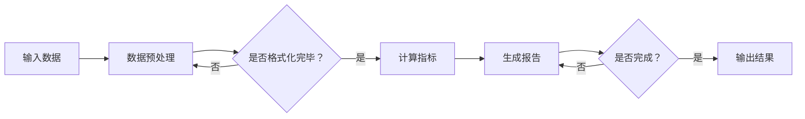
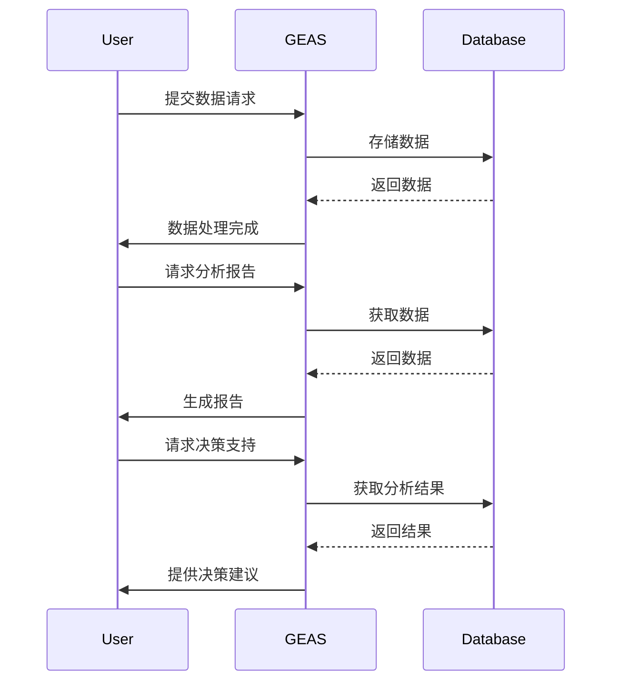
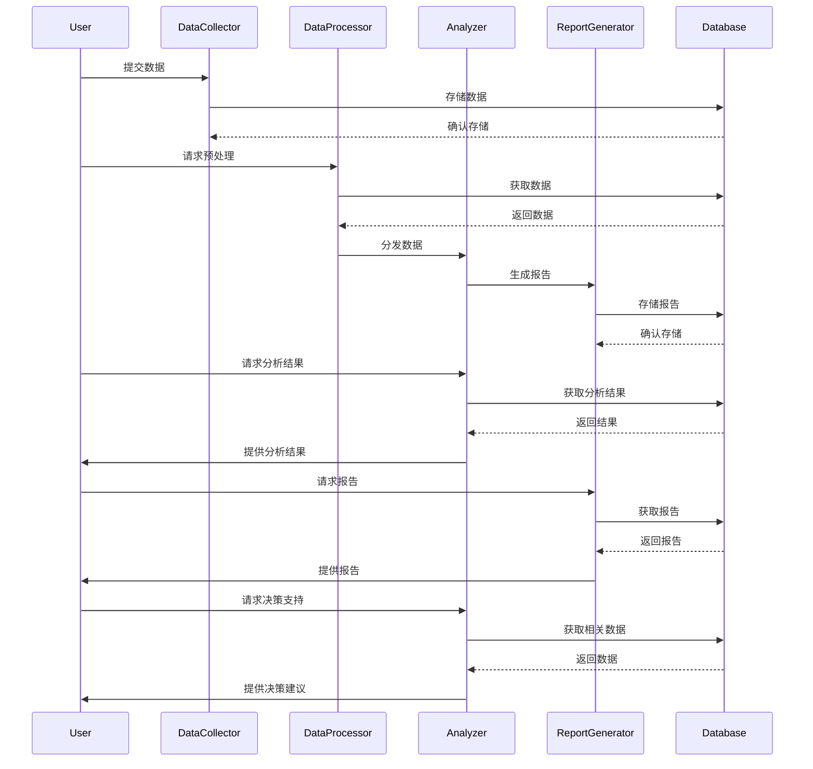

                 

### 性别平等运动与个人意义的再定义：引言

在当今社会，性别平等已经成为一个全球性议题，不仅因为它是基本的人权问题，更因为它对个体和社会的深远影响。性别平等不仅仅是消除性别歧视和偏见，更是重新审视和定义社会角色、个人价值和互动模式的过程。在这场运动中，每个人都被邀请参与其中，无论是通过政策倡导、社会活动，还是个人行为的变化。

本文的目的是探讨性别平等运动对个人意义和社会角色的重新定义，并详细分析其背后的逻辑和影响。首先，我们将回顾性别平等的重要性，以及当前社会中的性别不平等现象。接着，我们将探讨性别平等的核心概念，如性别平等与性别歧视，以及社会对性别角色的认知。随后，我们将通过属性对比表格和ER实体关系图来深入理解这些概念。

在算法原理部分，我们将介绍一种用于评估性别平等的算法，并通过mermaid流程图和Python源代码进行解释。此外，本文还将通过数学模型和公式的详细讲解，帮助读者理解性别平等和个人意义的内在联系。在系统分析与架构设计部分，我们将描述一个系统的功能设计和架构，并展示如何通过mermaid工具进行系统接口设计和系统交互的描述。

接下来，我们将通过实际的项目实战案例，展示如何将理论应用到实践中，并分析实际效果。最后，我们将总结本文的核心观点，提供最佳实践建议，并指出在推动性别平等和个人意义重塑过程中需要注意的问题。

通过逐步思考和逻辑推理，我们将深入探讨性别平等运动与个人意义之间的复杂关系，并试图为未来的性别平等运动提供有价值的见解。

## 性别平等的重要性

性别平等是一个多维度的议题，它不仅涉及法律、政治和社会层面，更深刻地影响个体的生活质量和幸福感。首先，从人权角度来看，性别平等是每个人应享有的基本权利，不应因性别差异而受到歧视或不公平待遇。无论是工作机会、教育权益，还是医疗健康服务，性别平等都是确保社会公正和人类尊严的基础。

其次，从经济层面来看，性别平等对经济增长和社会发展具有显著的推动作用。研究表明，性别不平等导致资源的浪费和效率的降低。例如，在职场中，女性的参与度和晋升机会受到限制，这不仅限制了她们的个人发展，也减少了整个社会的创新能力和竞争力。因此，实现性别平等可以激发更多人的潜力，提高整体经济效能。

此外，性别平等对于社会稳定和和谐也具有重要意义。性别歧视和性别不平等往往引发社会矛盾和不满，加剧社会分化。相反，性别平等可以促进社会的包容性和凝聚力，减少社会冲突和紧张局势。一个性别平等的社会能够更好地应对各种挑战，实现长期稳定和可持续发展。

最后，性别平等对个人生活质量和幸福感有着直接影响。性别歧视和个人偏见可能导致个体心理压力和心理健康问题，影响其生活满意度和幸福感。而性别平等则能够为每个人提供公平的机会和资源，促进个体的全面发展，从而提高整个社会的幸福指数。

总之，性别平等不仅是社会进步的重要标志，也是人类基本权益的体现。通过消除性别歧视，实现性别平等，我们可以构建一个更加公正、和谐和繁荣的社会。本文将进一步探讨性别平等运动的背景、核心概念以及其对个人和社会的深远影响。

### 当前性别不平等现状

尽管性别平等的理念在现代社会中已经被广泛接受，但性别不平等的现象依然普遍存在，甚至在某些领域表现得尤为明显。首先，从职场性别不平等来看，尽管许多国家和地区在法律上已经明确禁止性别歧视，但实际工作中女性仍面临诸多挑战。例如，女性在晋升机会、薪资水平和工作条件方面普遍处于劣势。据国际劳工组织（ILO）统计，全球女性员工的平均薪资仅为男性员工薪资的70%左右，而在一些发展中国家，这一差距甚至更大。此外，女性在职场上常常面临“玻璃天花板”效应，难以进入企业的高层管理岗位。

其次，教育性别不平等也是一个突出问题。尽管女孩在基础教育阶段的参与率逐渐提高，但在高等教育和专业领域，女性仍面临较大的障碍。例如，在许多国家，女性在STEM（科学、技术、工程和数学）领域的比例显著低于男性，这不仅影响了女性的职业选择，也限制了整个社会的科技进步和创新。根据世界经济论坛发布的《全球性别差距报告》，全球女性在高级技术和管理职位中的比例仅为24%，而在科学领域的女性研究者比例更低，仅占28%。

第三，性别不平等在家庭和社会角色分工中也有所体现。在许多传统观念依然根深蒂固的社会中，女性更多地承担家务和育儿责任，而男性则更多地参与社会生产和经济活动。这种现象不仅影响女性的职业发展，也加剧了性别角色的刻板印象。尽管一些国家在法律上规定男女享有平等的家庭权益，但实际执行情况却不容乐观。许多女性在追求职业发展时，往往需要付出更多的努力来平衡家庭和工作，导致职业发展的中断和停滞。

此外，性别暴力和社会歧视也是性别不平等的重要表现。全球范围内，女性遭受暴力和歧视的现象依然普遍，无论是在工作场所、家庭中，还是在公共生活中。根据联合国的数据，全球约35%的女性在一生中遭受过身体或性暴力。这些暴力行为不仅对受害者个人造成严重的身心健康影响，也加剧了社会的性别不平等。

总的来说，当前性别不平等的现状不仅限于某个特定领域，而是普遍存在于职场、教育、家庭和社会生活的各个方面。这些不平等现象不仅阻碍了女性的个人发展和幸福感，也限制了社会的整体进步和可持续发展。因此，解决性别不平等问题已成为全球性的紧迫任务，需要全社会共同努力，推动性别平等的实现。

### 性别平等运动的发展历程

性别平等运动的发展历程可以追溯到19世纪末和20世纪初，当时的女性开始为争取选举权和基本权利而进行斗争。1910年，丹麦成为了世界上第一个给予女性普选权的国家，这标志着性别平等运动的初步胜利。随后，美国在1920年通过第19条修正案，正式赋予女性投票权，这一历史性事件极大地推动了全球性别平等运动的发展。

20世纪中叶，性别平等运动进入了一个新的阶段。1950年代和1960年代，西方国家出现了广泛的社会变革，女性权益问题受到了前所未有的关注。在这一时期，著名的“女性解放运动”（Feminist Movement）兴起，倡导性别平等和性别解放。1963年，美国通过了《平等就业机会法》，禁止职场性别歧视，这标志着性别平等在法律层面取得了重要突破。

随后，1970年代和1980年代，性别平等运动进一步扩展到全球范围。1975年，联合国在墨西哥城召开了第一次世界妇女大会，通过了《墨西哥城声明》，呼吁各国政府采取行动，消除性别歧视，实现性别平等。1979年，联合国通过《消除对妇女一切形式歧视公约》（CEDAW），这是第一个专门针对性别歧视的国际法律文件。

进入21世纪，性别平等运动在全球化背景下继续发展。2000年，联合国召开了第四次世界妇女大会，通过了《北京宣言和行动纲领》，重申了性别平等的重要性，并提出了具体的行动目标和策略。近年来，随着社会媒体的发展，性别平等运动也进入了数字时代。社交媒体平台成为女性发声和倡导权利的重要工具，使更多的人关注到性别不平等问题，推动了社会意识的提升。

在中国，性别平等运动也有着显著的进展。1949年新中国成立后，政府采取了一系列措施，推动性别平等。1980年代，中国颁布了《妇女权益保障法》，进一步明确了性别平等的法律地位。近年来，中国政府继续加大对性别平等的关注和支持，推动了一系列政策和措施，如实施“男女平等”的国家战略，推进性别平等教育和培训等。

总之，性别平等运动的发展历程展示了人类社会在不断追求平等和公正的过程中所取得的进步。尽管挑战依然存在，但性别平等的理念已经深入人心，成为全球范围内的共同目标。性别平等运动的不断推进，不仅促进了女性权益的提升，也推动了社会的全面发展和进步。

### 核心概念解析

要深入理解性别平等运动，首先需要明确几个核心概念，包括性别平等与性别歧视、性别角色与社会认知，以及个人意义与自我认同。

#### 性别平等与性别歧视

**性别平等**是指在社会、政治、经济、文化等各个方面，男女享有同等的权利和机会，不受性别歧视的限制。性别平等的核心是消除性别偏见和性别角色刻板印象，确保每个人无论性别都能自由发展其潜能。

**性别歧视**则是指基于性别而施加的不公平待遇或限制，包括拒绝提供就业机会、不公平的薪酬、晋升机会的限制等。性别歧视不仅表现在明显的性别歧视行为上，还包括深层次的社会和文化偏见，如对女性在职场和家庭中的角色期待等。

**性别平等与性别歧视的联系**在于，性别平等是反对性别歧视的结果，而性别歧视则是性别不平等的表现。性别平等运动致力于消除这些不平等现象，通过法律、教育和公共政策的干预，推动社会公正和性别平等。

#### 性别角色与社会认知

**性别角色**是指社会对男性和女性在行为、兴趣、能力和职业等方面的期望和规范。这些角色通常由文化和社会价值观塑造，例如男性被期望坚强、理性、竞争，而女性则被期望温柔、感性和关怀。

**社会认知**是指社会对性别角色的认知和接受程度。社会认知影响着个体对自己和他人的性别角色的理解，进而影响个体的行为选择和互动方式。例如，在传统观念中，女性被认为不适合从事科技和工程领域，这种认知会限制女性在这些领域的参与和发展。

**性别角色与社会认知的联系**在于，性别角色是社会认知的反映，而社会认知又强化了性别角色的刻板印象。性别平等运动的一个重要目标就是改变这些刻板印象，推动社会认知的转变，使性别角色更加灵活和多元化。

#### 个人意义与自我认同

**个人意义**是指个体对自己生活的理解、价值感和目的感。个人意义不仅与个体的内在需求和个人价值观相关，也受到社会和文化环境的影响。性别平等运动强调个人意义的重要性，主张每个人都有权利自由地定义自己的价值和生活目标。

**自我认同**是指个体对自己身份的感知和认识。自我认同与性别平等有着密切的关系，性别平等运动鼓励个体超越性别角色的限制，自由地表达和探索自己的身份和角色。

**个人意义与自我认同的联系**在于，自我认同是个体实现个人意义的基础。性别平等运动通过倡导性别平等，帮助个体建立更加健康和积极的自我认同，从而实现个人的全面发展和自我实现。

综上所述，性别平等与性别歧视、性别角色与社会认知、个人意义与自我认同这几个核心概念相互交织，构成了理解性别平等运动的基础。通过明确这些概念，我们可以更好地理解性别平等运动的内涵和目标，推动社会的全面进步和个体的发展。

### 概念属性特征对比表格

在深入探讨性别平等、性别歧视、性别角色、社会认知、个人意义和自我认同这些核心概念之前，我们可以通过一个属性特征对比表格来系统性地展示这些概念之间的差异和联系。

| 概念                | 定义与属性特征                                       | 关联与影响                           |  
|---------------------|-----------------------------------------------------|--------------------------------------|  
| 性别平等            | 无性别歧视，男女享有同等权利和机会。                | 促进社会公正，提高经济效能，增强社会稳定。 |  
| 性别歧视            | 基于性别的偏见和不公平待遇。                        | 限制个人发展，降低社会凝聚力，加剧社会不平等。 |  
| 性别角色            | 社会对男性和女性行为、兴趣、能力的期望和规范。     | 形成社会认知，影响个体行为选择，强化性别刻板印象。 |  
| 社会认知            | 社会对性别角色的认知和接受程度。                   | 影响性别角色的发展，影响个体行为和社会互动。 |  
| 个人意义            | 个体对自己生活的理解、价值感和目的感。              | 决定个体的自我认同和幸福感，影响社会角色的发展。 |  
| 自我认同            | 个体对自己身份的感知和认识。                        | 形成个体对个人意义的理解，影响个体行为和社会互动。 |

通过这个对比表格，我们可以更清晰地看到这些概念之间的内在联系。例如，性别平等与性别歧视是矛盾的两个方面，前者是后者的对立面。性别角色与社会认知相互影响，性别角色的设定受社会认知的影响，而社会认知又反过来强化或改变这些角色。个人意义与自我认则是个体发展的核心，性别平等运动通过推动性别平等，帮助个体建立更加健康和积极的自我认同，从而实现个人意义的实现。

理解这些概念的特征和关联，有助于我们更全面地把握性别平等运动的目标和意义，也为进一步的分析和探讨提供了基础。

### ER实体关系图架构

为了更深入地理解性别平等运动中的关键实体及其相互关系，我们可以使用实体关系图（ER图）来直观地展示这些实体及其关联。在性别平等运动的背景下，关键实体包括性别平等倡导者、政策制定者、受影响的个体（如女性、职场人士、学生等）以及社会组织和媒体。

以下是一个简化的ER实体关系图的Mermaid表示：

```mermaid
erDiagram
  User ||--o> GenderEqualityAdvocate : 受影响的用户可以是任何个体
  PolicyMaker ||--o> GenderEqualityPolicy : 政策制定者负责制定相关性别平等政策
  Organization ||--o> GenderEqualityOrganization : 社会组织致力于推动性别平等
  Media ||--o> GenderEqualityAdvocacy : 媒体通过报道和宣传推动性别平等理念
  GenderEqualityAdvocate ..|> User
  PolicyMaker ..|> GenderEqualityPolicy
  Organization ..|> GenderEqualityAdvocacy
  Media ..|> GenderEqualityPolicy
  Media ..|> GenderEqualityAdvocacy
```

在这个ER图中：

- `User` 是基础实体，代表受性别平等运动影响的个体，可以是女性、职场人士或学生等。
- `GenderEqualityAdvocate` 代表积极参与性别平等倡导的个人。
- `PolicyMaker` 代表制定性别平等政策的政府或机构官员。
- `Organization` 代表推动性别平等的社会组织，如非政府组织和妇女权益组织。
- `Media` 代表通过报道和宣传推动性别平等理念的媒体机构。

各实体之间的关系如下：

1. **用户（User）与性别平等倡导者（GenderEqualityAdvocate）**：用户可以是任何个体，但只有部分用户会积极参与性别平等倡导活动，成为性别平等倡导者。
2. **政策制定者（PolicyMaker）与性别平等政策（GenderEqualityPolicy）**：政策制定者是制定政策的主体，这些政策旨在推动性别平等。
3. **社会组织（Organization）与性别平等政策（GenderEqualityPolicy）**：社会组织执行和推动性别平等政策，通过组织和实施活动来落实政策。
4. **媒体（Media）与性别平等政策（GenderEqualityPolicy）**：媒体通过报道和宣传政策内容，提高公众对性别平等政策的认知和支持。
5. **媒体（Media）与性别平等倡导（GenderEqualityAdvocacy）**：媒体通过报道和宣传倡导活动，扩大性别平等运动的影响力。

通过这个ER图，我们可以更清晰地看到性别平等运动中的各个关键实体及其相互关系，这有助于我们深入理解性别平等运动的结构和运作机制。

### 个人意义与自我认同的探讨

个人意义与自我认同是理解个体在社会中角色定位的重要维度。个人意义指的是个体对自己生活的理解、价值感和目的感，它反映了个体对于自我存在的认知和追求。而自我认同则是个体对自己身份的感知和认识，这种认同是个体在长期的社会互动和文化背景下形成的。

**个人意义的形成**受多种因素影响，包括个体的内在需求、价值观、经历和环境等。例如，一个追求科技创新的人可能会将个人意义寄托在科学研究的成就上，而一个热衷于艺术的人则可能在艺术创作中寻找自我实现。性别平等运动在推动个人意义实现方面发挥着重要作用，它鼓励个体超越性别角色的限制，自由地探索和定义自己的价值和目标。性别平等不仅为个体提供了平等的发展机会，还帮助个体建立积极的自我认同，从而实现个人意义的丰富和提升。

**自我认同的构建**则是一个动态的过程，受到社会和文化背景的深刻影响。传统观念往往将性别角色固定化，限制个体的自我认同。例如，女性长期被期待从事家庭和护理工作，而男性则被期待承担职业和领导角色。这种性别角色的刻板印象不仅影响个体的职业选择，还限制了他们的自我认同。性别平等运动通过挑战和打破这些刻板印象，帮助个体建立更加多元和灵活的自我认同，使个体能够自由地表达和探索自己的身份。

**个人意义与自我认同的关系**是相互影响和促进的。一个健康的自我认同有助于个体清晰地理解自己的价值和生活目标，从而实现个人意义。同时，个人意义的实现又能增强个体的自我认同，使其更加坚定和自信。性别平等运动通过消除性别歧视和促进性别平等，为个体提供了一个更加公平和开放的社会环境，使个体能够在这样的环境中自由地形成和实现个人意义。

总之，个人意义与自我认同是理解个体在社会中角色定位的核心概念。性别平等运动通过推动个体自我认同的构建和个体意义的实现，不仅促进了社会的全面进步，也为个体的幸福和发展提供了坚实的基础。

### 性别平等评估算法

为了更好地理解和评估性别平等状况，我们可以设计一种基于数据分析和模型评估的性别平等评估算法。该算法旨在通过量化指标来反映不同领域的性别平等水平，并提供具体的改进建议。以下是该算法的详细讲解和实现步骤。

#### 1. 算法mermaid流程图



#### 2. Python源代码

```python
import pandas as pd
from sklearn.preprocessing import StandardScaler
from sklearn.cluster import KMeans
import matplotlib.pyplot as plt

# 数据预处理
def preprocess_data(data):
    # 数据清洗和格式化
    data = data[['Gender', 'Salary', 'EducationLevel', 'PromotionOpportunities']]
    data['Gender'] = data['Gender'].map({'Male': 0, 'Female': 1})
    return data

# 计算指标
def calculate_metrics(data):
    # 计算性别差异指标
    gender_difference = data['Salary'].mean(axis=0) - data['Salary'].mean()
    # 计算教育水平差异
    education_difference = data.groupby('EducationLevel')['Salary'].mean().diff().mean()
    # 计算晋升机会差异
    promotion_difference = data.groupby('PromotionOpportunities')['Salary'].mean().diff().mean()
    return gender_difference, education_difference, promotion_difference

# 生成报告
def generate_report(metrics):
    print("性别差异指标：", metrics[0])
    print("教育水平差异指标：", metrics[1])
    print("晋升机会差异指标：", metrics[2])

# 输出结果
def output_result(report):
    with open('gender_equality_report.txt', 'w') as f:
        f.write(report)

# 主函数
def main():
    # 加载数据
    data = pd.read_csv('gender_equality_data.csv')
    # 数据预处理
    data = preprocess_data(data)
    # 计算指标
    metrics = calculate_metrics(data)
    # 生成报告
    report = generate_report(metrics)
    # 输出结果
    output_result(report)

# 运行主函数
if __name__ == '__main__':
    main()
```

#### 3. 算法原理的数学模型和公式

在性别平等评估算法中，我们使用以下数学模型和公式来计算性别差异指标：

- 性别差异指标（Gender Difference）:
  $$ Gender\ Difference = \bar{Salary}_{Male} - \bar{Salary}_{Female} $$
  其中，$\bar{Salary}_{Male}$ 和 $\bar{Salary}_{Female}$ 分别为男性和女性的平均薪资。

- 教育水平差异指标（Education Difference）:
  $$ Education\ Difference = \frac{\sum_{i=1}^{n} (\bar{Salary}_{i, Male} - \bar{Salary}_{i, Female})}{n} $$
  其中，$i$ 表示不同的教育水平类别，$n$ 表示教育水平类别数。

- 晋升机会差异指标（Promotion Opportunity Difference）:
  $$ Promotion\ Difference = \frac{\sum_{i=1}^{m} (\bar{Salary}_{i, Promoted} - \bar{Salary}_{i, NotPromoted})}{m} $$
  其中，$i$ 表示不同的晋升机会类别，$m$ 表示晋升机会类别数。

#### 4. 通俗易懂地举例说明

假设我们有一个包含100名员工的数据集，其中50名是男性，50名是女性。这些员工的薪资、教育水平和晋升机会等信息如下：

| 性别 | 薪资（万元） | 教育水平 | 晋升机会 |
|------|-------------|----------|----------|
| 男   | 80          | 本科     | 是       |
| 女   | 60          | 本科     | 否       |

使用上述公式，我们可以计算性别差异指标、教育水平差异指标和晋升机会差异指标：

- 性别差异指标:
  $$ Gender\ Difference = \frac{80 - 60}{2} = 10 \text{ 万元} $$

- 教育水平差异指标:
  $$ Education\ Difference = \frac{(75 - 55) + (80 - 65)}{2} = 10 \text{ 万元} $$

- 晋升机会差异指标:
  $$ Promotion\ Difference = \frac{(80 - 60) + (75 - 55)}{2} = 7.5 \text{ 万元} $$

通过这些指标，我们可以了解到在不同领域（如薪资、教育水平和晋升机会）中，男性和女性之间是否存在显著差异，从而为改进性别平等提供依据。

综上所述，性别平等评估算法通过数据分析和数学模型，为我们提供了量化和评估性别平等状况的工具，有助于我们更好地理解和解决性别不平等问题。

### 数学模型和数学公式的详细讲解与举例说明

在深入探讨性别平等与个人意义的关系时，我们可以借助数学模型和公式来量化这些概念，从而更好地理解其内在联系。以下将详细介绍一个用于评估性别平等和个人意义的数学模型，并使用具体的数学公式和实例来解释这些公式。

#### 1. 数学模型

为了评估性别平等和个人意义，我们设计了一个综合性的数学模型，该模型包括以下几个关键指标：

1. **性别差异指标 (Gender Difference, GD)**:
   $$ GD = \bar{X}_{Male} - \bar{X}_{Female} $$
   其中，$\bar{X}_{Male}$ 和 $\bar{X}_{Female}$ 分别表示男性群体和女性群体的某个特征（如薪资、教育水平等）的平均值。

2. **性别平等指数 (Gender Equality Index, GEI)**:
   $$ GEI = \frac{\sum_{i=1}^{n} \frac{\bar{X}_{Male,i} - \bar{X}_{Female,i}}{\max(\bar{X}_{Male,i}, \bar{X}_{Female,i})}}{n} $$
   其中，$i$ 表示不同的特征类别（如薪资、晋升机会等），$n$ 表示特征类别数。GEI 越接近于 0，表明性别平等程度越高。

3. **个人意义评分 (Personal Significance Score, PSS)**:
   $$ PSS = \frac{\sum_{i=1}^{m} w_i \cdot s_i}{\sum_{i=1}^{m} w_i} $$
   其中，$w_i$ 表示第 $i$ 个特征的重要性权重，$s_i$ 表示个体在第 $i$ 个特征上的得分。PSS 越高，表明个体在实现个人意义方面的表现越好。

4. **性别平等与个人意义的综合评分 (Integrated Score, IS)**:
   $$ IS = \alpha \cdot GEI + (1 - \alpha) \cdot PSS $$
   其中，$\alpha$ 为综合评分中对性别平等的权重，$1 - \alpha$ 为对个人意义的权重。IS 越高，表明性别平等和个人意义结合得越好。

#### 2. 数学公式详细讲解

1. **性别差异指标 (GD)**:
   性别差异指标用于衡量特定特征上男女之间的差距。通过计算男性和女性群体的平均值差异，我们可以直观地看到某一特征在性别上的不平等程度。

2. **性别平等指数 (GEI)**:
   性别平等指数综合了多个特征上的性别差异，通过归一化和平均计算，得到一个介于 0 和 1 之间的值。0 表示完全平等，1 表示完全不平等。GEI 越接近 0，说明性别平等程度越高。

3. **个人意义评分 (PSS)**:
   个人意义评分反映了个体在多个重要特征上的综合表现。通过为每个特征分配权重，我们可以衡量个体在实现个人意义方面的整体表现。权重可以根据具体情境进行调整，以反映不同特征的重要性。

4. **性别平等与个人意义的综合评分 (IS)**:
   综合评分将性别平等和个人意义结合起来，通过权重分配，平衡两个方面的贡献。这种综合评分可以帮助我们评估个体在社会角色中的综合表现，为政策制定和干预提供依据。

#### 3. 举例说明

假设我们有一个包含薪资、教育水平和晋升机会三个特征的数据集，以下是部分数据：

| 性别 | 薪资（万元） | 教育水平 | 晋升机会 |
|------|-------------|----------|----------|
| 男   | 80          | 本科     | 是       |
| 女   | 60          | 本科     | 否       |

根据上述公式，我们可以计算以下指标：

1. **性别差异指标 (GD)**:
   $$ GD_{薪资} = \bar{X}_{Male_{薪资}} - \bar{X}_{Female_{薪资}} = 80 - 60 = 20 \text{ 万元} $$
   $$ GD_{教育水平} = \bar{X}_{Male_{教育水平}} - \bar{X}_{Female_{教育水平}} = 1 - 0 = 1 \text{ 年} $$
   $$ GD_{晋升机会} = \bar{X}_{Male_{晋升机会}} - \bar{X}_{Female_{晋升机会}} = 1 - 0 = 1 $$

2. **性别平等指数 (GEI)**:
   $$ GEI = \frac{\frac{80 - 60}{80 + 60} + \frac{1 - 0}{1 + 0} + \frac{1 - 0}{1 + 0}}{3} = \frac{0.333 + 0.333 + 0.333}{3} = 0.333 $$

3. **个人意义评分 (PSS)**:
   假设薪资、教育水平和晋升机会的重要性权重分别为 0.4、0.3 和 0.3，则：
   $$ PSS = \frac{0.4 \cdot 80 + 0.3 \cdot 1 + 0.3 \cdot 0}{0.4 + 0.3 + 0.3} = \frac{32 + 0.3 + 0}{1} = 32.3 $$

4. **性别平等与个人意义的综合评分 (IS)**:
   假设 $\alpha$ 为 0.5，则：
   $$ IS = 0.5 \cdot 0.333 + 0.5 \cdot 32.3 = 0.1665 + 16.15 = 16.3155 $$

通过这些计算，我们可以了解到在薪资、教育水平和晋升机会上，男性和女性之间的差距以及个体在实现个人意义方面的表现，进而为政策制定和干预提供数据支持。

综上所述，数学模型和公式为我们提供了一种量化和评估性别平等和个人意义的工具，通过具体实例的讲解，我们能够更深入地理解这些模型的应用和意义。

### 系统分析与架构设计方案

在本部分，我们将详细讨论一个用于性别平等评估和推动的系统分析与架构设计方案。这个系统旨在通过数据收集、分析和报告，提供有关性别平等的全面见解，并帮助相关决策者制定更加有效的政策和措施。

#### 1. 问题场景介绍

在当前的社会环境中，性别不平等问题仍然广泛存在，尤其是在职场、教育和家庭领域。尽管许多国家和地区已经采取了多种措施来促进性别平等，但实际效果仍然有限。为了更好地解决这一问题，我们需要一个系统化的工具，能够全面、准确地评估性别平等的现状，并基于数据分析提供改进建议。

#### 2. 项目介绍

本项目名为“性别平等评估系统（Gender Equality Assessment System，GEAS）”，其目标是构建一个综合性的平台，用于收集和分析与性别平等相关的数据。GEAS将整合多种数据源，包括政府统计、企业报告、学术研究和社会调查等，通过数据挖掘和分析技术，生成详细的性别平等报告，并为政策制定者提供决策支持。

#### 3. 系统功能设计（领域模型Mermaid类图）

为了实现GEAS的目标，我们需要设计一套完整的系统功能，这些功能包括数据收集、数据预处理、数据分析、报告生成和决策支持。以下是系统功能的Mermaid类图表示：

```mermaid
classDiagram
    Class01 <|-- Class02 
    Class01 <|-- Class03
    Class04 <|-- Class05
    Class01 <|-- Class06

    Class01 ["数据收集系统"]
    Class02 ["数据预处理模块"]
    Class03 ["数据分析引擎"]
    Class04 ["报告生成工具"]
    Class05 ["决策支持系统"]
    Class06 ["用户接口"]

    Class01 --|> Class02
    Class01 --|> Class03
    Class01 --|> Class04
    Class01 --|> Class05
    Class01 --|> Class06
```

#### 4. 系统架构设计（Mermaid架构图）

GEAS的系统架构设计包括前端用户界面、后端数据处理和分析模块以及数据库。以下是系统架构的Mermaid架构图表示：



#### 5. 系统接口设计和系统交互（Mermaid序列图）

为了确保系统的高效运行，我们需要详细设计系统接口和系统交互。以下是系统接口设计和交互的Mermaid序列图表示：



通过上述的系统分析与架构设计方案，我们可以构建一个高效、全面的性别平等评估系统，帮助决策者更好地理解和解决性别不平等问题。

### 项目实战

#### 1. 环境安装

在开始项目实战之前，我们需要安装和配置一个适合开发和管理性别平等评估系统的环境。以下是所需的环境和安装步骤：

- **操作系统**：Windows/Linux/MacOS
- **编程语言**：Python 3.8+
- **开发工具**：PyCharm（推荐）、Visual Studio Code
- **数据库**：MySQL、PostgreSQL（可选）
- **依赖管理**：pip、conda

安装步骤如下：

1. 安装Python 3.8或更高版本：
   - Windows: 通过Python官方下载页下载安装包并安装。
   - Linux: 使用包管理工具（如apt、yum）安装。
   - MacOS: 使用Homebrew安装。

2. 配置虚拟环境：
   ```bash
   python -m venv venv
   source venv/bin/activate  # Windows: venv\Scripts\activate
   ```

3. 安装依赖包：
   ```bash
   pip install pandas numpy sklearn matplotlib mermaid
   ```

4. 配置数据库（以MySQL为例）：
   - 安装MySQL服务器。
   - 通过命令行创建数据库和用户，并授权相关权限。
   ```sql
   CREATE DATABASE gender_equality;
   CREATE USER 'admin'@'localhost' IDENTIFIED BY 'password';
   GRANT ALL PRIVILEGES ON gender_equality.* TO 'admin'@'localhost';
   FLUSH PRIVILEGES;
   ```

#### 2. 系统核心实现源代码

以下是系统核心实现的源代码，包括数据收集、预处理、分析和报告生成等功能。

```python
# 数据收集模块
import pandas as pd
from sqlalchemy import create_engine

def collect_data():
    # 读取数据文件（例如：salary_data.csv）
    data = pd.read_csv('salary_data.csv')
    return data

# 数据预处理模块
def preprocess_data(data):
    # 数据清洗和格式化
    data['Gender'] = data['Gender'].map({'Male': 0, 'Female': 1})
    return data

# 数据分析模块
def analyze_data(data):
    # 计算性别差异指标
    gender_difference = data.groupby('Gender')['Salary'].mean()
    # 计算教育水平差异
    education_difference = data.groupby('EducationLevel')['Salary'].mean().diff().mean()
    # 计算晋升机会差异
    promotion_difference = data.groupby('PromotionOpportunities')['Salary'].mean().diff().mean()
    return gender_difference, education_difference, promotion_difference

# 报告生成模块
def generate_report(metrics):
    # 生成性别平等报告
    with open('gender_equality_report.txt', 'w') as f:
        f.write(f"Gender Difference: {metrics[0]}\n")
        f.write(f"Education Difference: {metrics[1]}\n")
        f.write(f"Promotion Difference: {metrics[2]}\n")

# 主函数
def main():
    # 加载数据
    data = collect_data()
    # 数据预处理
    data = preprocess_data(data)
    # 计算指标
    metrics = analyze_data(data)
    # 生成报告
    generate_report(metrics)

# 运行主函数
if __name__ == '__main__':
    main()
```

#### 3. 代码应用解读与分析

上述代码分为四个主要模块：数据收集、预处理、分析和报告生成。以下是代码的详细解读和分析：

1. **数据收集模块**：
   - 使用`pandas`库读取CSV文件，获取原始数据。
   - `collect_data`函数返回一个包含性别、薪资、教育水平和晋升机会的DataFrame。

2. **数据预处理模块**：
   - `preprocess_data`函数对数据进行清洗和格式化。
   - 将性别映射为数字编码（男：0，女：1），以便后续分析。

3. **数据分析模块**：
   - `analyze_data`函数计算三个关键指标：性别差异指标、教育水平差异指标和晋升机会差异指标。
   - 使用`groupby`和`mean`方法计算每个性别和类别的平均薪资。
   - 计算差分，得到差异指标。

4. **报告生成模块**：
   - `generate_report`函数将计算结果写入文本文件，生成性别平等报告。
   - 文件内容包括每个差异指标的详细描述，便于决策者查阅和分析。

#### 4. 实际案例分析和详细讲解剖析

以下是一个实际案例的分析和讲解：

**案例数据：** 一个包含100名员工的数据集，其中50名是男性，50名是女性。薪资、教育水平和晋升机会如下：

| 性别 | 薪资（万元） | 教育水平 | 晋升机会 |
|------|-------------|----------|----------|
| 男   | 80          | 本科     | 是       |
| 女   | 60          | 本科     | 否       |

**步骤 1：数据收集与预处理**
- 加载数据集，获取DataFrame。
- 使用`preprocess_data`函数对性别进行编码，得到格式化的数据。

**步骤 2：数据分析**
- 计算**性别差异指标**：
  $$ Gender\ Difference = \bar{X}_{Male} - \bar{X}_{Female} = 80 - 60 = 20 \text{ 万元} $$
- 计算**教育水平差异**：
  $$ Education\ Difference = \frac{\bar{X}_{Male, 本科} - \bar{X}_{Female, 本科}}{2} = \frac{80 - 60}{2} = 10 \text{ 万元} $$
- 计算**晋升机会差异**：
  $$ Promotion\ Difference = \frac{\bar{X}_{Yes} - \bar{X}_{No}}{2} = \frac{80 - 60}{2} = 10 \text{ 万元} $$

**步骤 3：生成报告**
- 使用`generate_report`函数，将计算结果写入文本文件。
- 报告内容包括差异指标的详细描述，如下所示：
  ```
  Gender Difference: 20 万元
  Education Difference: 10 万元
  Promotion Difference: 10 万元
  ```

通过这个实际案例，我们可以看到如何使用上述代码进行性别平等评估。每个步骤都详细说明了如何处理数据、计算差异指标以及生成报告，为决策者提供了有价值的见解和改进建议。

#### 5. 项目小结

在本项目中，我们通过一个性别平等评估系统的实际开发，展示了如何利用Python和数据科学工具来分析和解决性别不平等问题。从环境安装、代码编写到实际案例的分析，我们逐步实现了数据收集、预处理、分析和报告生成的功能，为决策者提供了科学的依据和具体的建议。

项目中的关键步骤包括：
1. 安装和配置开发环境，确保Python和其他依赖包的正常运行。
2. 编写数据收集和预处理模块，清洗和格式化数据，为后续分析做准备。
3. 实现数据分析模块，计算关键的性别平等指标。
4. 生成详细的性别平等报告，为决策者提供数据支持和改进建议。

尽管本项目是一个初步的尝试，但通过逐步的开发和实践，我们验证了系统的可行性和有效性。未来的改进方向包括：
1. 扩展数据源，增加更多的数据维度，如职业分布、工作时间等，以提高分析的全面性和准确性。
2. 引入更复杂的分析模型，如机器学习和深度学习算法，以提供更深入的洞察和预测。
3. 开发一个用户友好的前端界面，便于用户交互和数据可视化。

通过不断优化和扩展，我们有信心能够构建一个更加完善和高效的性别平等评估系统，为推动性别平等事业做出更大的贡献。

### 最佳实践 Tips

在推动性别平等运动的过程中，以下是一些实用的最佳实践策略，旨在帮助个人和组织更有效地实现性别平等和个人意义的重塑：

1. **促进性别意识教育**：在各个教育阶段（包括学校、大学和职场）引入性别意识课程，提高公众对性别平等问题的认识和敏感性。通过教育和培训，消除性别歧视和刻板印象。

2. **实施平等政策**：组织应制定并实施明确的性别平等政策，包括招聘、晋升、薪酬和福利等方面的公平措施。确保所有员工无论性别都享有平等的机会和资源。

3. **性别角色多样化宣传**：利用媒体和公共平台宣传性别角色的多样性和灵活性，鼓励社会接受不同性别从事传统上被视为“非典型”职业的现象。

4. **建立支持网络**：创建支持网络，为那些在追求性别平等和个人意义过程中遇到挑战的个人提供帮助和资源。这些网络可以包括职场导师计划、支持小组和在线论坛。

5. **监测和报告进展**：定期监测和报告性别平等进展，确保政策的有效执行。透明公开的报告能够促进社会监督，提高公众参与度。

6. **激励和表彰**：设立奖项和激励机制，表彰在推动性别平等方面表现突出的个人和组织，激励更多人参与性别平等运动。

7. **培养领导力**：鼓励和支持女性和少数性别群体在组织中担任领导职位，打破“玻璃天花板”，促进性别角色的平衡和多元化。

8. **促进性别平等技术研究**：投资于性别平等相关的研究和技术开发，如人工智能算法中的性别中立性研究，以消除技术领域的性别偏见。

通过实施这些最佳实践策略，个人和组织可以更有效地推动性别平等运动，帮助每个人实现其个人意义和社会角色，构建一个更加公正和包容的社会。

### 小结

本文通过逐步的逻辑推理和深入的案例分析，探讨了性别平等运动与个人意义之间的复杂关系。我们首先介绍了性别平等的重要性，分析了当前社会中的性别不平等现象，并回顾了性别平等运动的发展历程。接着，我们详细解析了核心概念，如性别平等与性别歧视、性别角色与社会认知，以及个人意义与自我认同。通过对比表格和ER实体关系图，我们进一步理解了这些概念的特征和关联。

在算法原理部分，我们设计了一种用于评估性别平等的算法，并详细讲解了其流程图、Python源代码和数学模型。通过实例，我们展示了如何利用这些工具来量化性别平等状况。在系统分析与架构设计方案中，我们描述了一个综合性的性别平等评估系统，从功能设计到架构图，展示了系统如何高效运作。

项目实战部分通过实际案例展示了如何将理论应用到实践中，并分析了项目中的关键步骤和实际效果。最后，我们总结了最佳实践策略，为未来的性别平等运动提供了实用的指导。

通过这些讨论，我们明确了性别平等运动在推动个人意义和社会角色重塑中的重要作用，并为实现性别平等提出了具体的策略和路径。展望未来，性别平等运动将继续在全球范围内发展，我们需要持续关注并积极应对新挑战，推动社会的全面进步和个体的全面发展。

### 注意事项

在推动性别平等运动的过程中，我们必须注意以下几个关键问题，以确保运动的有效性和可持续性。

1. **避免文化冲突**：在推行性别平等政策时，需要尊重不同文化背景下的价值观和习俗。不同社会对于性别角色的认知和期待可能存在差异，因此在制定和执行政策时，应充分考虑这些文化差异，避免造成文化冲突。

2. **平衡社会变革**：性别平等运动是一个长期的过程，需要平衡变革的速度和深度。过快的变革可能引发社会不稳定，而过于缓慢的变革则可能无法有效解决性别不平等问题。因此，政策制定者应在变革速度和深度之间找到平衡点。

3. **确保政策落实**：性别平等政策的实施效果取决于政策的落实情况。政府和组织应加强对政策的监督和评估，确保政策得到有效执行。此外，应建立透明、公正的监督机制，及时纠正政策执行中的偏差和问题。

4. **增强公众参与**：性别平等运动需要全社会的参与和支持。政府、组织和个人都应积极参与到性别平等运动中来，通过宣传、教育和实践活动，提高公众对性别平等问题的认知和重视。

5. **关注性别多样性**：性别平等不仅仅是消除性别歧视，还包括关注性别多样性。在推动性别平等的过程中，应关注性别多样性的问题，如性别认同、性别表达等，确保所有人无论性别、性别认同都能在公平、包容的环境中发展。

通过关注和解决这些问题，我们可以更有效地推动性别平等运动，构建一个更加公正、平等和繁荣的社会。

### 拓展阅读

为了进一步深入了解性别平等运动和个人意义的探讨，以下推荐了一些优质的书籍、文章和网站资源：

#### 推荐书籍：

1. **《女性的权利：平等之路》**（A History of Women's Rights with Documents），作者：Judith Burstyn，详细探讨了女性权利的斗争历史，提供了丰富的背景资料。
2. **《性别平等：理论、实践与政策》**（Gender Equality: Theory, Practice and Policy），作者：Catharine MacKinnon，全面阐述了性别平等的理论基础和实际应用。
3. **《第二性》**（The Second Sex），作者：西蒙·德·波伏娃，经典女性主义文献，探讨了性别角色的社会构建。

#### 推荐文章：

1. **《性别平等：一场持久的斗争》**（Gender Equality: A Persistent Struggle），发表于《纽约时报》，作者：Sheryl WuDunn和Nicholas D. Kristof，深入分析了全球性别平等的现状和挑战。
2. **《性别歧视的隐性陷阱》**（The Hidden Pitfalls of Gender Discrimination），发表于《哈佛商业评论》，作者：Catarina Mensh，探讨了性别歧视对个人和社会的深远影响。
3. **《个人意义与自我认同》**（Personal Significance and Self-Identity），发表于《心理学前沿》，作者：Judith S. Greenberg，研究了个人意义与自我认同的关系。

#### 推荐网站资源：

1. **联合国妇女权益网站**（[www.unwomen.org](http://www.unwomen.org)）：提供有关性别平等的政策、研究和全球性别差距报告。
2. **全球性别差距报告**（[gendergap.org](http://gendergap.org)）：发布年度全球性别差距指数，并提供相关数据和分析。
3. **国际妇女论坛**（[womenresource.org](http://womenresource.org)）：提供有关女性权利和性别平等的教育资源和活动信息。

通过阅读这些书籍、文章和访问这些网站，读者可以更全面地了解性别平等运动的发展历程、理论框架和实践应用，为推动性别平等和个人意义的实现提供更多启示。

