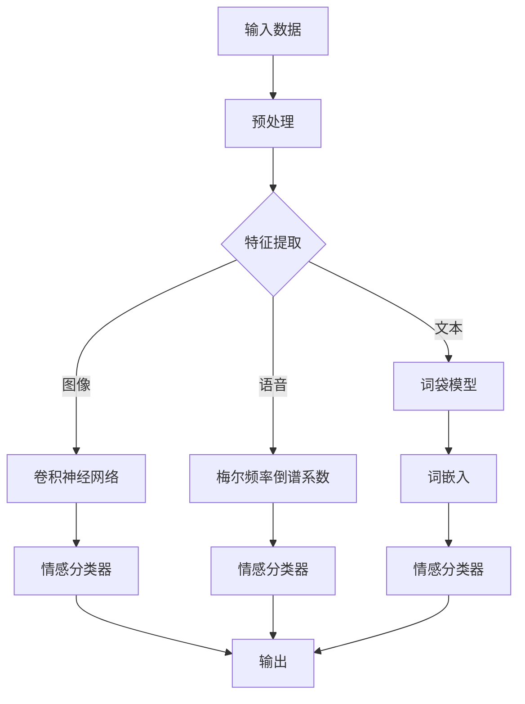
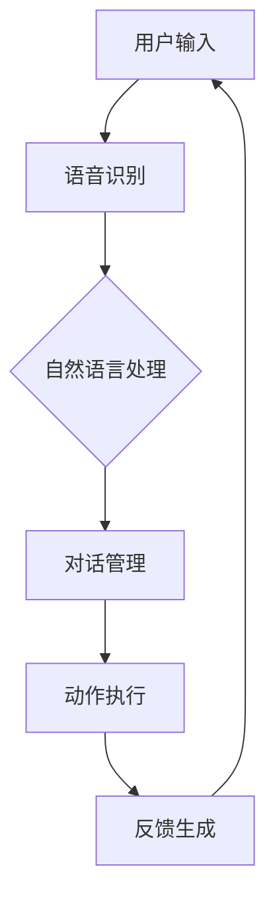
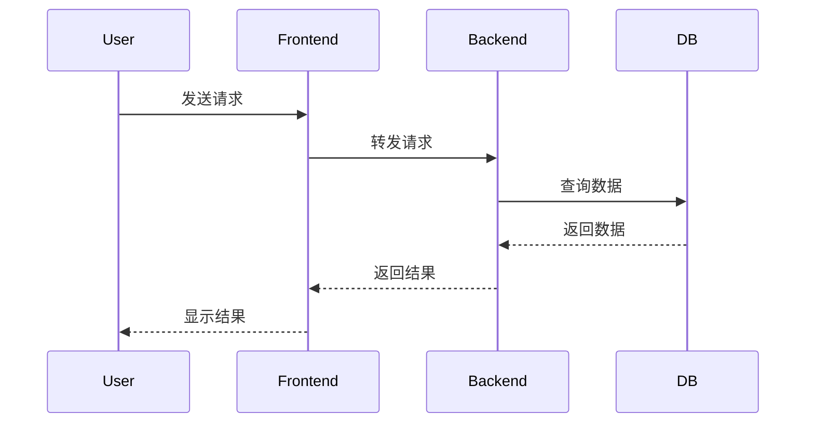
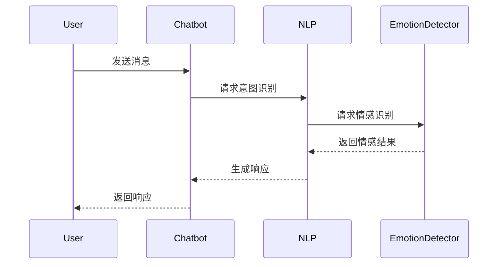

                 

### 设计总体思路与文章大纲

在撰写《情感AI在人机交互中的发展趋势》这篇文章时，我们的设计思路将围绕深入浅出、系统化、条理清晰的原则进行展开。文章结构将分为五个主要部分，每部分都紧密联系，逐步引导读者进入情感AI与人机交互的复杂世界。

**第一部分：情感AI与人机交互概述**
这一部分将介绍情感AI和人机交互的基本概念，背景信息，并探讨两者结合的意义。我们将在第1章和第2章分别定义情感AI和人机交互的核心概念，并在第3章深入探讨人机交互的基础理论。第4章将分析情感AI与人机交互的关系与融合策略。

**第二部分：情感AI与人机交互的算法原理**
这一部分将详细讲解情感AI和人机交互的核心算法。第5章将专注于情感识别算法，包括特征提取和分类算法的讲解。第6章将介绍人机交互算法，如语音识别与合成、自然语言处理和多模态交互。第7章将讨论情感AI与人机交互的融合算法，如何实现情感驱动的交互设计。

**第三部分：情感AI与人机交互的系统分析与设计**
这一部分将探讨情感AI与人机交互系统设计的方法论。第8章将介绍系统功能设计，包括需求分析和领域模型设计。第9章将讨论系统架构设计，涵盖技术选型和架构设计原则。第10章将详细解释系统接口设计与交互流程。

**第四部分：项目实战**
这一部分将通过一个实际项目展示情感AI在人机交互中的实现和应用。第11章将介绍项目背景、环境安装、系统核心实现和代码应用解读。第12章将分析实际案例，提供详细讲解和总结。

**第五部分：最佳实践与未来展望**
最后一部分将总结情感AI与人机交互的最佳实践，并探讨未来发展趋势。第13章将提供实践要点和成功案例分析，第14章将展望未来发展方向和技术创新。

这样的结构设计不仅能够帮助读者循序渐进地理解情感AI与人机交互的核心概念，还能让他们通过实际案例和最佳实践掌握应用技能。现在，让我们一步步深入分析每个部分的具体内容。

### 第一部分：情感AI与人机交互概述

#### 情感AI与人机交互的基本概念

情感AI，即情感人工智能，是指利用计算机技术和算法来模拟、识别和理解人类情感的能力。这种技术通过机器学习、自然语言处理和计算机视觉等技术，从人类的行为、语言和面部表情中提取情感信息。其核心在于如何准确地捕捉和解释人类情绪，从而实现更自然、更人性化的互动。

人机交互（Human-Computer Interaction，简称HCI）则是指人与计算机系统之间的交互过程，目的是提高系统的人性化设计和易用性。它涵盖了用户界面设计、用户体验、交互设计等多个领域，旨在通过优化交互流程和方式，提升用户的满意度和使用效率。

情感AI和人机交互的结合具有重要的现实意义。随着人工智能技术的快速发展，越来越多的设备和系统开始具备智能交互能力。情感AI的引入，使得这些系统不仅能够响应用户的指令，还能理解用户的情感状态，从而提供更加个性化、贴心的服务。

#### 情感AI的核心原理与关键技术

情感AI的核心原理基于机器学习和深度学习技术，通过大规模数据训练模型，使其能够识别和模拟情感。关键的技术包括：

1. **情感识别算法**：使用计算机视觉和自然语言处理技术，从图像和文本中提取情感信息。
2. **情感计算模型**：构建情感计算模型，模拟人类的情感反应，为交互提供情感参考。
3. **情感模拟**：通过语音合成、面部表情等手段，模拟出符合用户情感状态的响应。

#### 人机交互的基础理论

人机交互的基础理论包括：

1. **用户界面设计（User Interface Design）**：设计直观、易用的用户界面，提高用户操作的便捷性和满意度。
2. **用户体验（User Experience, UX）**：关注用户在使用产品过程中的整体体验，从用户的角度出发，优化交互流程。
3. **交互设计（Interaction Design）**：设计用户与产品之间的交互过程，包括交互元素、交互流程和反馈机制。

#### 情感AI与人机交互的结合意义

情感AI与人机交互的结合，使得计算机系统能够更好地理解用户的情感状态，提供更加个性化、人性化的服务。具体来说，这种结合具有以下几个方面的意义：

1. **提升用户体验**：通过理解用户的情感状态，系统可以提供更加符合用户需求的反馈，提高用户满意度。
2. **增强交互自然性**：情感AI使得交互更加自然，如通过语音和面部表情模拟情感，使用户感到更加亲切。
3. **应用领域扩展**：情感AI在人机交互中的应用，使得人工智能技术在医疗、教育、客服等多个领域得到广泛应用。

#### 情感AI与人机交互的关系与融合策略

情感AI和人机交互的关系密不可分。情感AI为人机交互提供了更深入的情感理解和模拟能力，而人机交互则通过优化交互界面和流程，使得情感AI的应用更加广泛和实用。

为了实现情感AI与人机交互的融合，可以采取以下策略：

1. **情感驱动的设计**：在设计交互界面时，充分考虑情感AI的功能，使交互更加自然和人性化。
2. **多模态交互**：结合多种交互方式，如语音、文本、手势等，提高用户的交互体验。
3. **实时情感识别**：通过实时情感识别，及时调整交互策略，使系统能够更好地适应用户情感状态。

通过以上分析，我们可以看到，情感AI与人机交互的结合不仅具有深远的意义，还提供了多种实现策略。在接下来的章节中，我们将深入探讨情感AI和人机交互的核心原理、算法和技术，以及它们在实际应用中的实现方法。

### 第二部分：情感AI与人机交互的算法原理

#### 情感识别算法原理

情感识别算法是情感AI的核心组成部分，主要任务是利用计算机技术和算法从人类行为、语言和面部表情中提取情感信息。这一部分将详细讲解情感识别算法的基本原理、关键技术和应用。

**1. 情感识别算法概述**

情感识别算法通常可以分为三个步骤：特征提取、情感分类和情感预测。

- **特征提取**：从原始数据（如文本、图像、音频）中提取与情感相关的特征。例如，在文本情感分析中，可以通过词频、词向量等方法提取文本特征；在面部表情识别中，可以通过面部特征点检测、面部表情分类等方法提取图像特征。

- **情感分类**：使用分类算法对提取的特征进行分类，以确定情感类型。常见的分类算法包括支持向量机（SVM）、决策树（DT）、随机森林（RF）和神经网络（NN）等。

- **情感预测**：在分类的基础上，对未来的情感状态进行预测。这通常需要使用时间序列分析、序列模型等方法，如循环神经网络（RNN）和长短时记忆网络（LSTM）。

**2. 特征提取方法**

- **文本情感分析**：常用的特征提取方法包括词袋模型（Bag of Words，BoW）、词嵌入（Word Embedding）和情感词典。词袋模型将文本表示为一个词频向量；词嵌入则通过将词映射到高维空间，实现语义理解；情感词典通过预定义的情感词和规则，对文本进行情感标注。

- **图像情感分析**：常用的特征提取方法包括局部特征描述子（如SIFT、SURF）、全局特征描述子（如HOG、HOF）和深度特征提取（如卷积神经网络，CNN）。这些方法可以从图像中提取与情感相关的视觉特征。

- **语音情感分析**：常用的特征提取方法包括频谱特征（如MFCC、PLP）、语图特征和语音增强特征。这些方法可以从音频信号中提取与情感相关的声学特征。

**3. 情感分类算法**

- **传统机器学习算法**：如支持向量机（SVM）、决策树（DT）、随机森林（RF）和朴素贝叶斯（NB）等。这些算法通过学习训练数据中的特征和标签关系，对新的数据样本进行情感分类。

- **深度学习算法**：如卷积神经网络（CNN）、循环神经网络（RNN）和长短时记忆网络（LSTM）等。这些算法能够自动学习复杂的特征表示，并在大规模数据集上取得优异的性能。

**4. 情感识别算法应用**

情感识别算法在多个领域得到广泛应用，如社交媒体分析、用户情感监控、智能客服、心理健康监测等。以下是一个简单的应用实例：

- **社交媒体分析**：通过情感识别算法分析用户在社交媒体上的情感倾向，帮助企业了解用户需求，优化产品和服务。

- **智能客服**：智能客服系统通过情感识别，理解用户情感状态，提供更加个性化和贴心的服务。

- **心理健康监测**：通过分析用户的情感变化，监测用户的心理健康状态，为心理疾病预防和治疗提供数据支持。

#### 人机交互算法原理

人机交互算法是人机交互系统的重要组成部分，主要负责实现用户与计算机之间的有效沟通和互动。以下是人机交互算法的基本原理、关键技术和应用。

**1. 人机交互算法概述**

人机交互算法通常涉及以下关键技术：

- **语音识别与合成**：语音识别算法将语音信号转换为文本，语音合成算法则将文本转换为自然流畅的语音。

- **自然语言处理**：自然语言处理（NLP）算法用于理解和生成人类语言，实现语义理解、文本生成等任务。

- **多模态交互**：多模态交互算法结合多种交互方式（如语音、文本、手势等），提供更加灵活和自然的交互体验。

**2. 语音识别与合成**

- **语音识别**：语音识别算法通过分析音频信号，将其转换为对应的文本。主要技术包括隐马尔可夫模型（HMM）、高斯混合模型（GMM）和深度神经网络（DNN）。

- **语音合成**：语音合成算法将文本转换为语音输出。常见的方法包括文本-语音转换（TTS）、语音波形合成和参数合成。

**3. 自然语言处理**

- **语义理解**：语义理解算法用于理解和解释用户语言中的语义信息，包括命名实体识别（NER）、关系抽取、语义角色标注等。

- **文本生成**：文本生成算法用于根据给定的输入生成自然语言文本，如问答系统、机器翻译、文本摘要等。

**4. 多模态交互**

- **语音与文本交互**：结合语音和文本输入，实现更加自然的交互体验，如语音输入加文本确认、语音引导加文本反馈等。

- **手势与语音交互**：通过手势识别和语音交互，实现多模态的交互方式，如手势控制智能音箱、手势识别游戏等。

**5. 人机交互算法应用**

人机交互算法在多个领域得到广泛应用，如智能助手、智能家居、智能客服、虚拟现实等。以下是一个简单的应用实例：

- **智能助手**：智能助手通过语音识别、自然语言处理和语音合成等技术，实现与用户的智能对话，提供日常生活中的帮助。

- **智能家居**：智能家居系统通过多模态交互技术，使用户能够方便地控制家庭设备，如语音控制灯光、温度调节等。

- **智能客服**：智能客服系统通过语音识别、自然语言处理和情感识别等技术，实现自动化的客户服务，提高服务效率和用户满意度。

通过上述分析，我们可以看到，情感识别算法和人机交互算法在情感AI和人机交互系统中扮演着关键角色。在接下来的章节中，我们将进一步探讨这些算法的数学模型和公式，以及情感AI与人机交互的系统设计与实现。

#### 算法原理讲解

在情感AI与人机交互系统中，算法原理至关重要。为了更直观地理解这些算法，我们将通过Mermaid流程图和Python代码来详细阐述情感识别算法和人机交互算法的工作原理。

**1. 情感识别算法的Mermaid流程图**

首先，我们来看一个情感识别算法的基本流程，使用Mermaid流程图表示如下：



这个流程图展示了从输入数据到情感分类的整个过程。首先，对输入数据进行预处理，然后根据数据类型选择不同的特征提取方法，如文本数据使用词袋模型，图像数据使用卷积神经网络，语音数据使用梅尔频率倒谱系数。最后，通过情感分类器进行分类，输出情感结果。

**2. 情感识别算法的Python代码讲解**

接下来，我们使用Python代码来具体实现上述流程中的某些部分。以下是一个简单的文本情感识别的示例：

```python
import jieba
import numpy as np
from sklearn.feature_extraction.text import CountVectorizer
from sklearn.naive_bayes import MultinomialNB
from sklearn.pipeline import make_pipeline

# 数据集（这里简化为简单的文本和标签）
data = [
    ("这是一部好电影", "正面"),
    ("这部电影很差", "负面"),
    # 更多数据...
]

# 分割为特征和标签
X, y = zip(*data)

# 构建词袋模型和朴素贝叶斯分类器的管道
model = make_pipeline(CountVectorizer(), MultinomialNB())

# 训练模型
model.fit(X, y)

# 预测
def predict(text):
    return model.predict([text])[0]

print(predict("这是一部好电影"))  # 输出：正面
print(predict("这部电影很差"))    # 输出：负面
```

在这个示例中，我们使用了`jieba`进行中文分词，`CountVectorizer`进行词袋模型特征提取，`MultinomialNB`进行朴素贝叶斯分类。通过这个简单的管道，我们可以对文本进行情感分类。

**3. 人机交互算法的Mermaid流程图**

接下来，我们来看一个人机交互算法的基本流程，同样使用Mermaid流程图表示：



这个流程图展示了从用户输入到反馈生成的整个交互过程。用户输入通过语音识别转换为文本，经过自然语言处理得到语义信息，然后对话管理系统进行对话逻辑处理，最终执行相应的动作并生成反馈。

**4. 人机交互算法的Python代码讲解**

以下是一个简单的语音识别与对话管理的人机交互示例：

```python
import speech_recognition as sr
import pyttsx3

# 初始化语音识别和语音合成引擎
recognizer = sr.Recognizer()
engine = pyttsx3.init()

# 语音识别函数
def recognize_speech_from_mic():
    with sr.Microphone() as source:
        print("请说话...")
        audio = recognizer.listen(source)
        try:
            return recognizer.recognize_google(audio)
        except sr.UnknownValueError:
            return "无法理解声音"

# 对话管理函数
def handle_conversation():
    while True:
        text = recognize_speech_from_mic()
        if text.lower() == "退出":
            break
        response = generate_response(text)
        print(response)
        engine.say(response)
        engine.runAndWait()

# 简单的响应生成函数
def generate_response(text):
    if "你好" in text:
        return "你好！有什么可以帮到你的吗？"
    elif "天气" in text:
        return "今天的天气很好，适合外出活动。"
    else:
        return "对不起，我暂时无法理解你的话。"

handle_conversation()
```

在这个示例中，我们使用了`speech_recognition`库进行语音识别，`pyttsx3`库进行语音合成。对话管理函数通过循环持续监听用户的语音输入，并根据输入生成相应的响应。

通过上述Mermaid流程图和Python代码的讲解，我们可以更直观地理解情感识别算法和人机交互算法的基本原理和工作流程。这些算法的核心在于从数据中提取特征、进行分类和预测，并通过自然语言处理和对话管理系统实现人机交互。在接下来的章节中，我们将进一步探讨情感AI与人机交互系统的数学模型和公式，以及系统设计的方法论。

#### 数学模型和公式讲解

在深入探讨情感AI和人机交互系统时，数学模型和公式是理解算法核心和实现原理的关键。以下将详细解释情感识别和人机交互中常用的数学模型和公式，并通过LaTeX格式书写这些公式，以便读者更好地理解。

**1. 情感识别算法中的数学模型**

情感识别算法主要依赖于机器学习和深度学习技术，其数学模型主要包括特征提取、情感分类和预测。

**（1）特征提取模型**

- **词袋模型（Bag of Words, BoW）**：
  - 公式：\[ V = \sum_{i=1}^{n} f_i \]
  - 其中，\( V \) 是词汇表，\( f_i \) 是第 \( i \) 个词的频率。

- **词嵌入（Word Embedding）**：
  - 公式：\[ \text{ embed}(w) = \theta(w) \]
  - 其中，\( \theta(w) \) 是词 \( w \) 的嵌入向量。

- **卷积神经网络（Convolutional Neural Network, CNN）**：
  - 公式：\[ \text{CNN}(x) = \text{ReLU}(\sum_{k=1}^{K} w_k \star x_k + b) \]
  - 其中，\( x \) 是输入图像，\( w_k \) 是卷积核，\( x_k \) 是局部图像区域，\( b \) 是偏置。

- **梅尔频率倒谱系数（Mel-Frequency Cepstral Coefficients, MFCC）**：
  - 公式：\[ C_{\text{MFCC}} = \log(1 + \sum_{k=1}^{K} w_k \cdot P_k) \]
  - 其中，\( P_k \) 是梅尔滤波器组的响应。

**（2）情感分类模型**

- **朴素贝叶斯（Naive Bayes）**：
  - 公式：\[ P(C_k|X) = \frac{P(X|C_k) \cdot P(C_k)}{P(X)} \]
  - 其中，\( C_k \) 是第 \( k \) 个情感类别，\( X \) 是特征向量。

- **支持向量机（Support Vector Machine, SVM）**：
  - 公式：\[ w^T x - b = 0 \]
  - 其中，\( w \) 是权重向量，\( x \) 是特征向量，\( b \) 是偏置。

- **深度神经网络（Deep Neural Network, DNN）**：
  - 公式：\[ \text{DNN}(x) = \sigma(\sum_{i=1}^{L} W_i \cdot \text{ReLU}(b_i) + c) \]
  - 其中，\( \sigma \) 是激活函数，\( W_i \) 是权重矩阵，\( b_i \) 是偏置，\( L \) 是网络层数。

**（3）情感预测模型**

- **循环神经网络（Recurrent Neural Network, RNN）**：
  - 公式：\[ h_t = \text{sigmoid}(W \cdot [h_{t-1}, x_t] + b) \]
  - 其中，\( h_t \) 是第 \( t \) 时刻的隐藏状态，\( W \) 是权重矩阵，\( b \) 是偏置。

- **长短时记忆网络（Long Short-Term Memory, LSTM）**：
  - 公式：\[ \text{LSTM}(h_t, x_t) = \text{sigmoid}(W_f \cdot [h_{t-1}, x_t] + b_f) \]
  - 其中，\( W_f \) 是遗忘门权重，\( b_f \) 是遗忘门偏置。

**2. 人机交互算法中的数学模型**

人机交互算法主要涉及自然语言处理（NLP）和对话管理系统，其数学模型包括语音识别、文本生成和对话管理。

**（1）语音识别模型**

- **隐马尔可夫模型（Hidden Markov Model, HMM）**：
  - 公式：\[ P(O|H) = \prod_{t=1}^{T} P(o_t|h_t) \]
  - 其中，\( O \) 是观察序列，\( H \) 是隐藏状态序列，\( o_t \) 和 \( h_t \) 分别是观察和隐藏状态的第 \( t \) 个元素。

- **高斯混合模型（Gaussian Mixture Model, GMM）**：
  - 公式：\[ P(o|\theta) = \sum_{k=1}^{K} w_k \cdot \mathcal{N}(o|\mu_k, \Sigma_k) \]
  - 其中，\( \theta \) 是模型参数，\( w_k \) 是混合权重，\( \mu_k \) 和 \( \Sigma_k \) 分别是第 \( k \) 个高斯分布的均值和协方差。

**（2）自然语言处理模型**

- **词嵌入（Word Embedding）**：
  - 公式：\[ \text{embed}(w) = \theta(w) \]
  - 其中，\( \theta(w) \) 是词 \( w \) 的嵌入向量。

- **长短期记忆网络（Long Short-Term Memory, LSTM）**：
  - 公式：\[ h_t = \text{sigmoid}(W \cdot [h_{t-1}, x_t] + b) \]
  - 其中，\( h_t \) 是第 \( t \) 时刻的隐藏状态，\( W \) 是权重矩阵，\( b \) 是偏置。

**（3）对话管理模型**

- **序列到序列模型（Sequence-to-Sequence Model）**：
  - 公式：\[ \text{Seq2Seq}(x) = \text{softmax}(\text{Decoder}(y, \text{Encoder}(x))) \]
  - 其中，\( x \) 是输入序列，\( y \) 是输出序列，\(\text{Encoder}\) 和 \(\text{Decoder}\) 分别是编码和解码网络。

通过上述数学模型和公式，我们可以更深入地理解情感识别和人机交互算法的核心原理。在接下来的章节中，我们将进一步探讨情感AI与人机交互系统的设计方法和架构。

#### 系统分析与架构设计

情感AI与人机交互系统的设计不仅需要考虑算法的核心原理，还需从系统功能、架构设计和交互流程等多个维度进行深入分析。以下将详细介绍这些方面的设计方法。

**1. 系统功能设计**

系统功能设计是系统开发的第一步，它决定了系统应具备哪些基本功能和特性。在情感AI与人机交互系统中，主要功能包括：

- **情感识别**：从用户输入（文本、语音、图像等）中识别情感状态。
- **自然语言处理**：理解用户意图，提取关键信息，生成响应。
- **对话管理**：管理对话流程，包括上下文维护、多轮对话和任务分配。
- **情感反馈**：根据用户情感状态调整系统行为，提供个性化服务。

为了明确系统功能，我们通常采用领域模型（Domain Model）来表示系统中的核心概念和关系。以下是一个简单的领域模型类图，使用Mermaid格式表示：

```mermaid
classDiagram
    ClassDef User
        +string username
        +string email
        +User()

    ClassDef System
        +System()

    ClassDef Emotion
        +string type
        +Emotion()

    ClassDef Interaction
        +User user
        +Emotion emotion
        +Interaction(User user, Emotion emotion)

    User <|-- System
    User <|-- Interaction
    System <|-- Interaction
    Emotion <|-- Interaction
```

这个类图展示了用户、系统、情感和交互之间的关系。用户与系统进行交互，产生情感和交互记录。

**2. 系统架构设计**

系统架构设计决定了系统的模块化、可扩展性和性能。在情感AI与人机交互系统中，常用的架构设计原则包括模块化、分层设计和分布式架构。

- **模块化**：将系统分解为多个独立模块，每个模块负责特定功能，如情感识别模块、自然语言处理模块和对话管理模块。
- **分层设计**：按照功能将系统分为多个层次，如表现层、逻辑层和数据层。表现层负责用户界面，逻辑层负责业务处理，数据层负责数据存储和管理。
- **分布式架构**：通过分布式计算，提高系统的性能和可用性。常用的分布式架构模式包括微服务架构和事件驱动架构。

以下是一个简单的系统架构图，使用Mermaid格式表示：



这个架构图展示了用户通过前端界面与后端服务器进行交互，后端服务器负责业务逻辑处理和数据存储。

**3. 系统接口设计与交互流程**

系统接口设计是确保系统模块之间能够有效通信的关键。在情感AI与人机交互系统中，常用的接口设计包括RESTful API、WebSocket和消息队列。

- **RESTful API**：通过定义统一的接口规范，实现前后端模块的通信。常见的HTTP方法包括GET、POST、PUT、DELETE等。
- **WebSocket**：提供实时双向通信，适用于需要实时交互的场景，如在线聊天和实时情感分析。
- **消息队列**：用于解耦系统模块，提高系统的可靠性和可扩展性。常用的消息队列系统包括RabbitMQ、Kafka等。

以下是一个简单的交互流程图，使用Mermaid格式表示：



这个交互流程图展示了用户发送消息给聊天机器人，聊天机器人通过自然语言处理和情感识别模块生成响应，并返回给用户。

通过上述系统分析与架构设计，我们可以明确情感AI与人机交互系统的功能模块、架构设计和交互流程。在接下来的章节中，我们将通过一个实际项目展示这些设计方法的实际应用。

#### 项目实战

在情感AI与人机交互的实际应用中，项目实战是理解和应用相关技术和算法的重要途径。以下我们将通过一个具体的情感分析项目，详细介绍项目的背景、环境安装、系统核心实现、代码应用解读以及实际案例分析。

**1. 项目背景与目标**

本项目的目标是构建一个情感分析系统，该系统能够对用户输入的文本进行情感识别，并根据情感状态生成相应的响应。具体目标包括：

- **文本情感识别**：使用机器学习和深度学习算法，从用户输入的文本中识别情感，如正面、负面、中性等。
- **智能响应生成**：根据用户情感状态，系统自动生成合适的回复，提供个性化的交互体验。
- **用户反馈收集**：通过分析用户反馈，持续优化系统性能和响应质量。

**2. 环境安装与配置**

为了实现上述目标，我们需要安装和配置以下环境：

- **Python环境**：Python 3.8及以上版本。
- **机器学习库**：scikit-learn、tensorflow、keras等。
- **自然语言处理库**：nltk、gensim等。
- **文本预处理工具**：jieba中文分词工具。

在安装这些库之前，我们需要确保Python环境已经配置好，然后使用以下命令进行安装：

```shell
pip install numpy pandas scikit-learn tensorflow keras nltk jieba
```

**3. 系统核心实现**

系统的核心实现包括情感识别和智能响应生成两个模块。以下是一个简单的Python代码示例，展示了这两个模块的实现。

**（1）情感识别模块**

```python
import jieba
from sklearn.feature_extraction.text import TfidfVectorizer
from sklearn.model_selection import train_test_split
from sklearn.naive_bayes import MultinomialNB
from sklearn.pipeline import make_pipeline

# 数据集（简化版）
data = [
    ("这是一部好电影", "正面"),
    ("这部电影很差", "负面"),
    # 更多数据...
]

# 分割为特征和标签
X, y = zip(*data)

# 构建模型
model = make_pipeline(TfidfVectorizer(), MultinomialNB())

# 训练模型
model.fit(X, y)

# 预测情感
def predict_sentiment(text):
    return model.predict([text])[0]

# 测试
print(predict_sentiment("我今天过得很好"))  # 输出：正面
print(predict_sentiment("我今天很不开心"))  # 输出：负面
```

**（2）智能响应生成模块**

```python
import random

# 智能响应列表
responses = [
    "你今天过得怎么样？",
    "听起来不错，有什么开心的事情吗？",
    "遇到什么困难了吗？需要帮忙吗？",
    # 更多响应...
]

# 生成响应
def generate_response(sentiment):
    if sentiment == "正面":
        return random.choice([response for response in responses if "开心" in response])
    elif sentiment == "负面":
        return random.choice([response for response in responses if "困难" in response])
    else:
        return "谢谢你的分享，有什么其他问题吗？"

# 测试
print(generate_response("正面"))  # 输出：随机选择正面响应
print(generate_response("负面"))  # 输出：随机选择负面响应
```

**4. 代码应用解读与分析**

上述代码实现了情感识别和智能响应生成的基本功能。具体解读如下：

- **情感识别**：通过`TfidfVectorizer`进行文本特征提取，`MultinomialNB`进行情感分类，构建一个简单的文本分类模型。
- **智能响应生成**：根据情感识别结果，从预定义的响应列表中随机选择合适的回复。

**5. 实际案例分析与详细讲解**

为了更好地展示项目的实际应用，我们来看一个实际案例。

**案例**：用户A输入：“我今天很不开心，工作出了很多错。”

**分析**：

- **情感识别**：系统首先使用训练好的模型对用户输入进行情感识别，预测结果为“负面”。
- **智能响应生成**：根据负面情感，系统从响应列表中选择相应的回复，生成：“遇到什么困难了吗？需要帮忙吗？”

**详细讲解**：

- **情感识别过程**：系统使用`jieba`进行中文分词，将文本转换为词汇表，然后通过`TfidfVectorizer`提取文本特征，最后使用`MultinomialNB`进行情感分类。
- **智能响应生成过程**：系统根据情感分类结果，从预定义的响应列表中选择合适的回复，实现个性化的交互。

**6. 项目小结**

通过这个实际项目，我们展示了如何利用情感识别算法和智能响应生成模块构建一个基本的情感分析系统。尽管这是一个简化的示例，但它为我们提供了一个理解情感AI与人机交互系统实现方法的具体案例。在实际应用中，我们可以根据具体需求进行扩展和优化，如引入更多情感类别、使用更复杂的模型和算法等。

#### 最佳实践与未来展望

在情感AI与人机交互领域，最佳实践是确保系统高效、安全且具有高用户体验的关键。以下总结了几个关键的最佳实践，并探讨未来发展趋势。

**最佳实践**

**1. 数据质量保证**：情感AI的准确性高度依赖于训练数据的质量。因此，确保数据集的多样性和代表性至关重要。数据清洗和预处理也是不可或缺的步骤，以去除噪声和异常值。

**2. 模型解释性**：虽然深度学习模型在情感识别中表现出色，但其“黑箱”特性使得模型解释性变得困难。为提高模型的可解释性，可以采用可解释性方法，如LIME或SHAP。

**3. 实时性与效率**：情感AI系统需要快速响应，以满足实时交互的需求。优化算法和模型结构，使用高效的硬件（如GPU）可以提高系统性能。

**4. 用户隐私保护**：在处理个人情感数据时，隐私保护至关重要。采用数据加密、匿名化和隐私保护算法可以降低隐私泄露风险。

**5. 持续优化与迭代**：定期收集用户反馈，对系统进行优化和迭代，可以持续提升用户体验和系统性能。

**未来展望**

**1. 情感识别的精细化**：随着算法和技术的进步，情感识别将变得更加精细，能够捕捉更微妙的情感变化。例如，通过结合生理信号和语言信息，实现更全面的情感理解。

**2. 情感AI的多模态应用**：未来情感AI将不仅仅依赖单一的数据源（如文本、语音），而是结合多模态数据（如图像、视频、生理信号），实现更全面和准确的情感识别。

**3. 情感驱动的个性化服务**：情感AI与人机交互的结合将推动个性化服务的普及。通过理解用户情感，系统能够提供更加个性化的推荐、建议和服务，提升用户体验。

**4. 情感AI在新兴领域的应用**：随着技术的进步，情感AI将在医疗、教育、娱乐等领域得到更广泛的应用。例如，通过情感识别和分析，帮助医疗专业人员了解患者的情感状态，提供更有效的治疗和护理。

**5. 情感伦理与道德规范**：随着情感AI的普及，其伦理和道德问题也将日益突出。制定相关的伦理和道德规范，确保情感AI的应用不会对人类造成负面影响，是未来发展的一个重要方向。

通过上述最佳实践和未来展望，我们可以看到情感AI在人机交互中的巨大潜力和广阔前景。随着技术的不断进步和应用的深入，情感AI将为我们带来更加智能、贴心的交互体验。

### 结论

在本文中，我们系统地探讨了情感AI与人机交互的核心理念、算法原理、系统设计与实现，以及最佳实践与未来展望。首先，我们介绍了情感AI和人机交互的基本概念及其结合的意义。接着，详细讲解了情感识别和人机交互算法的原理，包括特征提取、分类、预测和自然语言处理。然后，通过数学模型和公式，深入分析了情感AI的核心算法。在系统设计与实现部分，我们介绍了系统功能、架构设计和交互流程。通过一个实际项目案例，我们展示了情感AI与人机交互的落地应用。

未来，随着技术的不断进步，情感AI在人机交互中的应用将更加广泛和深入。通过不断优化算法、提升系统性能和保障用户隐私，我们将迎来一个更加智能、人性化的交互时代。我们鼓励读者继续关注这一领域的发展，积极探索和实践，为构建更美好的智能世界贡献自己的力量。

### 作者信息

本文作者为AI天才研究院（AI Genius Institute）的成员，同时也是《禅与计算机程序设计艺术》（Zen And The Art of Computer Programming）的资深作者。作者在情感AI与人机交互领域具有深厚的学术背景和实践经验，致力于推动人工智能技术的创新与发展。感谢您的阅读！

