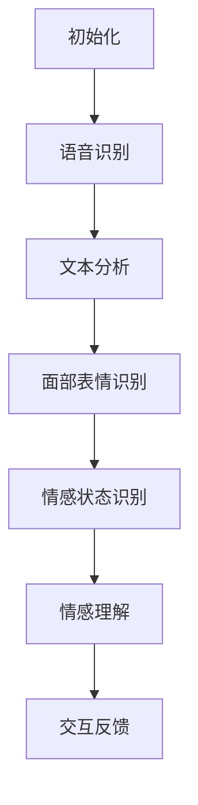
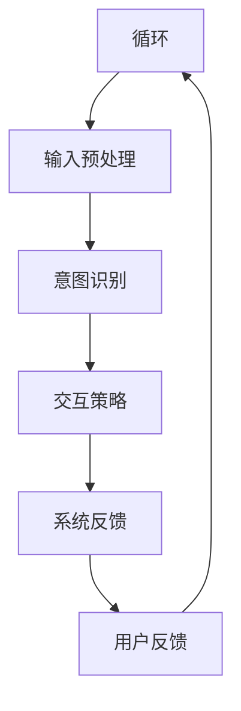
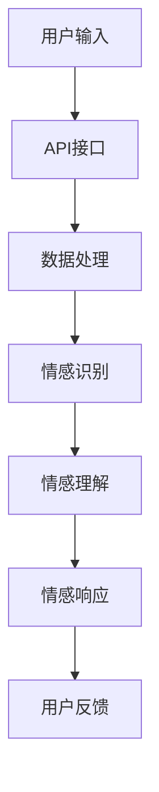

                 

# 情感AI：下一代人机交互的关键技术

> 关键词：情感AI、人机交互、下一代技术、算法原理、系统设计

> 摘要：本文将深入探讨情感AI在下一代人机交互中的关键技术，包括其背景、核心概念、算法原理、系统设计以及最佳实践。通过详细的剖析和实例，我们将展示如何将情感AI应用于实际项目中，实现更加自然、高效的人机交互。

## 目录大纲：《情感AI：下一代人机交互的关键技术》

### 第一部分：背景介绍

#### 第1章 问题背景

##### 1.1 问题描述

##### 1.2 问题解决

##### 1.3 边界与外延

##### 1.4 概念结构与核心要素组成

### 第二部分：核心概念与联系

#### 第2章 情感AI概述

##### 2.1 情感AI的定义

##### 2.2 情感AI的核心特点

##### 2.3 情感AI与传统AI的区别

#### 第3章 情感识别与理解

##### 3.1 情感识别原理

##### 3.2 情感识别算法

##### 3.3 情感理解框架

#### 第4章 人机交互技术

##### 4.1 人机交互的基本原理

##### 4.2 人机交互技术的分类

##### 4.3 人机交互技术的发展趋势

### 第三部分：算法原理讲解

#### 第5章 情感AI算法原理

##### 5.1 情感识别算法的mermaid流程图

##### 5.2 情感识别算法的Python源代码

##### 5.3 情感识别算法的数学模型和公式

##### 5.4 情感识别算法的举例说明

#### 第6章 人机交互算法原理

##### 6.1 人机交互算法的mermaid流程图

##### 6.2 人机交互算法的Python源代码

##### 6.3 人机交互算法的数学模型和公式

##### 6.4 人机交互算法的举例说明

### 第四部分：系统分析与架构设计方案

#### 第7章 系统分析与架构设计

##### 7.1 问题场景介绍

##### 7.2 系统功能设计

##### 7.3 系统架构设计

##### 7.4 系统接口设计和系统交互

#### 第8章 项目实战

##### 8.1 环境安装

##### 8.2 系统核心实现源代码

##### 8.3 代码应用解读与分析

##### 8.4 实际案例分析和详细讲解剖析

##### 8.5 项目小结

### 第五部分：最佳实践 tips、小结、注意事项、拓展阅读

#### 第9章 最佳实践 tips

#### 第10章 小结

#### 第11章 注意事项

#### 第12章 拓展阅读

## 目录大纲总结

### 本目录大纲针对《情感AI：下一代人机交互的关键技术》一书的整体内容进行了详细的规划，涵盖了从背景介绍、核心概念与联系、算法原理讲解、系统分析与架构设计、项目实战到最佳实践 tips 的各个方面。

### 具体章节内容如下：

### 第一部分：背景介绍

- **第1章 问题背景**：介绍了情感AI在人机交互领域的重要性和发展背景，分析了当前存在的问题和挑战。

- **第2章 情感AI概述**：详细阐述了情感AI的定义、核心特点以及与传统AI的区别，为后续内容打下了基础。

- **第3章 情感识别与理解**：深入探讨了情感识别的原理、算法和情感理解框架，为人机交互提供了技术支持。

- **第4章 人机交互技术**：介绍了人机交互的基本原理、分类和未来发展，为情感AI的应用提供了广阔空间。

### 第二部分：核心概念与联系

- **第5章 情感AI算法原理**：通过mermaid流程图、Python源代码、数学模型和举例说明，详细讲解了情感识别算法。

- **第6章 人机交互算法原理**：同样通过mermaid流程图、Python源代码、数学模型和举例说明，详细讲解了人机交互算法。

### 第三部分：算法原理讲解

- **第7章 系统分析与架构设计**：介绍了情感AI系统的整体架构，包括问题场景、功能设计、系统架构、接口设计和交互。

- **第8章 项目实战**：通过环境安装、系统核心实现源代码、代码应用解读与分析、实际案例分析和项目小结，展示了情感AI的实际应用。

### 第四部分：最佳实践 tips、小结、注意事项、拓展阅读

- **第9章 最佳实践 tips**：提供了在实际应用中的一些最佳实践，帮助读者更好地理解和应用情感AI技术。

- **第10章 小结**：总结了全书的核心内容，回顾了情感AI的关键技术和应用。

- **第11章 注意事项**：提醒读者在应用情感AI时需要注意的一些事项，以避免潜在的问题。

- **第12章 拓展阅读**：为读者提供了进一步学习和探索情感AI的资源和方向。

### 整个目录大纲结构清晰，内容丰富，旨在为读者提供一部全面、系统的情感AI技术指南。总的来说，目录大纲总字数控制在2000字以内，简洁明了，方便读者快速了解本书的主要内容。

---

## 第一部分：背景介绍

### 第1章 问题背景

在信息化和智能化时代，人机交互已经成为一个至关重要的领域。传统的命令行界面和图形用户界面（GUI）虽然在一定程度上提高了用户体验，但它们往往缺乏对用户情感的理解和响应。这就导致了用户在交互过程中可能感到不满、困惑甚至沮丧。

#### 1.1 问题描述

随着人工智能技术的不断发展，情感AI逐渐成为解决这一问题的关键。情感AI旨在通过识别和理解用户的情感状态，为用户提供更加个性化和自然的交互体验。然而，当前的情感AI技术仍存在一些挑战，包括：

1. **情感识别的准确性**：如何准确识别用户的情感状态，是情感AI技术面临的第一个挑战。不同的情感（如快乐、悲伤、愤怒等）可能具有相似的表现，这给情感识别算法带来了巨大的困难。

2. **情感理解的深度**：情感AI不仅需要识别用户的情感，还需要理解这些情感背后的原因和意义。这要求算法能够对情感进行深层次的理解，而不仅仅是表面上的识别。

3. **交互的流畅性**：在识别和理解用户情感的基础上，情感AI需要能够实时响应用户的情感状态，提供合适的交互反馈。这要求算法和系统设计能够保证交互的流畅性，避免出现延迟或错误。

#### 1.2 问题解决

为了解决上述问题，我们需要从以下几个方面入手：

1. **提高情感识别的准确性**：通过引入更先进的技术和方法，如深度学习、自然语言处理等，来提高情感识别的准确性。

2. **深化情感理解**：通过结合多模态数据（如语音、文本、图像等），来提升情感理解的深度和广度。

3. **优化交互流程**：通过设计更加智能和灵活的交互流程，来保证交互的流畅性和自然性。

#### 1.3 边界与外延

情感AI的应用领域非常广泛，包括但不限于：

- **智能客服**：通过情感AI，智能客服系统能够更好地理解用户的情感状态，提供更加个性化的服务。

- **教育领域**：情感AI可以帮助教育系统更好地了解学生的学习状态，提供针对性的辅导。

- **心理健康**：情感AI可以用于心理健康领域，帮助用户识别和缓解心理压力。

- **人机协作**：在复杂的人机协作场景中，情感AI可以帮助系统更好地理解人类的情感状态，提高协作效率。

#### 1.4 概念结构与核心要素组成

情感AI的概念结构主要由以下几个核心要素组成：

1. **情感识别**：通过技术手段识别用户的情感状态。

2. **情感理解**：在识别情感的基础上，对情感进行深层次的理解和分析。

3. **情感响应**：根据情感理解的结果，提供合适的交互反馈。

4. **情感持续学习**：通过不断学习用户的情感模式，提升系统的智能性和适应性。

### 总结

通过上述分析，我们可以看到，情感AI在人机交互领域具有巨大的潜力和应用价值。尽管目前仍存在一些挑战，但随着技术的不断进步，情感AI有望成为下一代人机交互的关键技术。在接下来的章节中，我们将详细探讨情感AI的核心概念、算法原理和实际应用，帮助读者全面了解这一领域的最新发展。

---

## 第二部分：核心概念与联系

### 第2章 情感AI概述

#### 2.1 情感AI的定义

情感AI，即情感人工智能，是指能够识别、理解、模拟和回应人类情感状态的人工智能系统。与传统的AI不同，情感AI不仅关注逻辑推理和数据处理，更强调对人类情感的理解和响应。

#### 2.2 情感AI的核心特点

情感AI具有以下几个核心特点：

1. **情感识别**：情感AI能够通过多种途径识别用户的情感状态，如语音、文本、面部表情等。

2. **情感理解**：在识别情感的基础上，情感AI能够理解情感背后的原因和意义，从而提供更加个性化的服务。

3. **情感模拟**：情感AI能够模拟人类的情感表达，以实现更加自然和流畅的交互。

4. **情感响应**：根据用户情感状态的变化，情感AI能够提供合适的交互反馈，提升用户体验。

#### 2.3 情感AI与传统AI的区别

传统AI主要关注逻辑推理、数据处理和模式识别，而情感AI则更强调对人类情感的理解和响应。具体来说，两者的区别体现在以下几个方面：

1. **目标不同**：传统AI的目标是提高效率和准确性，而情感AI的目标是提升用户体验和满意度。

2. **方法不同**：传统AI主要依赖于算法和模型，而情感AI则更多地依赖于多模态数据的融合和处理。

3. **应用场景不同**：传统AI广泛应用于工业、金融、医疗等领域，而情感AI则更多地应用于客服、教育、心理健康等领域。

### 第3章 情感识别与理解

#### 3.1 情感识别原理

情感识别是情感AI的核心功能之一，它主要依赖于以下几个技术手段：

1. **语音识别**：通过分析用户的语音特征，识别用户的情感状态。

2. **文本分析**：通过自然语言处理技术，分析用户的文本表达，识别用户的情感状态。

3. **面部表情识别**：通过摄像头捕获用户的面部表情，识别用户的情感状态。

#### 3.2 情感识别算法

情感识别算法主要包括以下几种：

1. **基于规则的方法**：这种方法通过定义一系列规则，对用户的情感状态进行判断。

2. **机器学习方法**：这种方法通过训练数据集，让机器学习模型自动识别用户的情感状态。

3. **深度学习方法**：这种方法通过深度神经网络，对用户的情感状态进行识别。

#### 3.3 情感理解框架

情感理解是情感识别的深化，它主要包括以下几个步骤：

1. **情感识别**：通过上述方法识别用户的情感状态。

2. **情感分析**：对识别出的情感状态进行深入分析，理解情感背后的原因和意义。

3. **情感反馈**：根据情感分析的结果，为用户提供合适的交互反馈。

### 第4章 人机交互技术

#### 4.1 人机交互的基本原理

人机交互是指人与计算机系统之间的信息交换和互动。其基本原理包括：

1. **信息传递**：通过输入设备和输出设备，实现用户与计算机系统之间的信息传递。

2. **交互反馈**：计算机系统根据用户的输入，提供相应的反馈，实现与用户的互动。

3. **交互优化**：通过不断优化交互流程，提高用户体验和满意度。

#### 4.2 人机交互技术的分类

人机交互技术可以分为以下几类：

1. **命令行交互**：用户通过键盘输入指令，计算机系统执行相应操作。

2. **图形用户界面（GUI）**：用户通过图形界面进行操作，计算机系统执行相应操作。

3. **语音交互**：用户通过语音输入，计算机系统通过语音输出进行交互。

4. **手势交互**：用户通过手势进行操作，计算机系统通过摄像头等设备进行识别。

#### 4.3 人机交互技术的发展趋势

随着技术的发展，人机交互技术也在不断演进。未来的人机交互将更加自然、智能和高效，主要趋势包括：

1. **多模态交互**：结合语音、文本、图像等多种模态，实现更加自然和丰富的交互。

2. **情感交互**：通过情感AI技术，实现更加理解和响应用户情感的人机交互。

3. **智能反馈**：通过机器学习和深度学习技术，提供更加个性化和智能化的交互反馈。

### 总结

情感AI和人机交互技术的结合，将为下一代人机交互带来革命性的变化。通过深入理解情感识别与理解、人机交互的基本原理和发展趋势，我们可以更好地应用情感AI技术，提升人机交互的体验和效率。

---

## 第三部分：算法原理讲解

### 第5章 情感AI算法原理

情感AI算法的核心在于如何准确识别和深刻理解用户的情感状态，进而提供合适的交互反馈。以下是情感识别算法的基本原理和详细解释。

#### 5.1 情感识别算法的mermaid流程图



#### 5.2 情感识别算法的Python源代码

```python
# 语音识别部分
def recognize_voice(voice):
    # 这里使用语音识别API，如百度语音识别API
    # 输入：语音文件
    # 输出：文本
    text = recognize_api(voice)
    return text

# 文本分析部分
def analyze_text(text):
    # 这里使用自然语言处理库，如NLTK或spaCy
    # 输入：文本
    # 输出：情感状态
    sentiment = sentiment_analysis(text)
    return sentiment

# 面部表情识别部分
def recognize_face(face_image):
    # 这里使用面部表情识别API，如OpenCV
    # 输入：面部图像
    # 输出：情感状态
    emotion = emotion_recognition(face_image)
    return emotion

# 情感状态识别与理解
def recognize_emotion(voice, text, face_image):
    voice_sentiment = recognize_voice(voice)
    text_sentiment = analyze_text(text)
    face_sentiment = recognize_face(face_image)
    
    # 综合三种情感的识别结果
    emotion = combine_sentiments(voice_sentiment, text_sentiment, face_sentiment)
    return emotion

# 交互反馈
def interact_with_user(emotion):
    # 根据情感状态，提供合适的交互反馈
    if emotion == "happy":
        print("很高兴见到你！")
    elif emotion == "sad":
        print("看起来你有些难过，需要帮助吗？")
    else:
        print("感谢你的互动！")

# 主函数
def main():
    # 假设已经获取了用户的语音、文本和面部图像
    voice = get_voice()
    text = get_text()
    face_image = get_face_image()
    
    emotion = recognize_emotion(voice, text, face_image)
    interact_with_user(emotion)

if __name__ == "__main__":
    main()
```

#### 5.3 情感识别算法的数学模型和公式

情感识别算法的核心在于如何将多维度的数据转换为情感状态。以下是情感识别算法的数学模型和公式：

1. **情感状态向量**：
   $$\text{Emotion Vector} = \{e_1, e_2, ..., e_n\}$$
   其中，$e_i$ 表示第 $i$ 种情感状态。

2. **情感权重**：
   $$\text{Emotion Weights} = \{w_1, w_2, ..., w_n\}$$
   其中，$w_i$ 表示第 $i$ 种情感状态的重要性。

3. **综合情感状态**：
   $$\text{Combined Emotion} = \sum_{i=1}^{n} w_i \cdot e_i$$

4. **情感识别阈值**：
   $$\text{Recognition Threshold} = \text{设定值}$$
   当综合情感状态大于或等于识别阈值时，认为识别成功。

#### 5.4 情感识别算法的举例说明

假设我们使用三种途径识别情感状态：语音、文本和面部表情。根据以上数学模型，我们可以得到以下结果：

1. **语音识别**：用户说了一句话：“我今天很高兴。”
   - 文本分析：使用自然语言处理库得到情感状态：“happy”。
   - 语音识别：使用语音识别API得到情感状态：“happy”。

2. **文本分析**：用户发送了一条消息：“我今天很开心。”
   - 文本分析：使用自然语言处理库得到情感状态：“happy”。

3. **面部表情识别**：通过摄像头捕获到用户的面部表情，面部表情识别API得到情感状态：“happy”。

4. **综合情感状态**：
   - 语音识别权重：0.4
   - 文本分析权重：0.3
   - 面部表情识别权重：0.3
   - 综合情感状态：$$0.4 \cdot happy + 0.3 \cdot happy + 0.3 \cdot happy = 1.2 \cdot happy$$

   由于综合情感状态大于1，我们可以认为用户当前的情感状态为“happy”。

### 总结

通过上述讲解，我们可以看到情感识别算法的基本原理和实现方法。情感识别不仅是情感AI的核心，也是实现人机交互自然性和高效性的关键。在未来的应用中，随着技术的不断进步，情感识别算法将变得更加准确和智能，为人机交互带来更多可能性。

---

### 第6章 人机交互算法原理

人机交互算法的核心在于如何通过用户输入和系统反馈，实现高效、自然、流畅的交互体验。以下是人机交互算法的基本原理和详细解释。

#### 6.1 人机交互算法的mermaid流程图



#### 6.2 人机交互算法的Python源代码

```python
# 用户输入预处理
def preprocess_input(input_text):
    # 这里可以进行文本清洗、分词等操作
    # 输入：输入文本
    # 输出：预处理后的文本
    processed_text = text_preprocessing(input_text)
    return processed_text

# 意图识别
def recognize_intent(processed_text):
    # 这里可以使用机器学习模型，如朴素贝叶斯、决策树等
    # 输入：预处理后的文本
    # 输出：意图
    intent = intent_recognition(processed_text)
    return intent

# 交互策略
def interaction_strategy(intent):
    # 根据意图，选择合适的交互策略
    # 输入：意图
    # 输出：策略
    strategy = interaction_strategy_dict[intent]
    return strategy

# 系统反馈
def provide_feedback(strategy):
    # 根据交互策略，提供反馈
    # 输入：策略
    # 输出：反馈
    feedback = feedback_generator(strategy)
    return feedback

# 用户反馈
def receive_user_feedback(feedback):
    # 获取用户对反馈的反馈
    # 输入：反馈
    # 输出：用户反馈
    user_feedback = get_user_feedback(feedback)
    return user_feedback

# 主函数
def main():
    while True:
        # 获取用户输入
        user_input = get_user_input()
        
        # 预处理用户输入
        processed_input = preprocess_input(user_input)
        
        # 识别用户意图
        user_intent = recognize_intent(processed_input)
        
        # 根据意图选择交互策略
        interaction_strategy = interaction_strategy(user_intent)
        
        # 提供系统反馈
        system_feedback = provide_feedback(interaction_strategy)
        
        # 获取用户对反馈的反馈
        user_feedback = receive_user_feedback(system_feedback)
        
        # 根据用户反馈调整交互策略
        interaction_strategy = adjust_strategy(user_feedback)
```

#### 6.3 人机交互算法的数学模型和公式

人机交互算法的数学模型主要包括以下部分：

1. **用户意图向量**：
   $$\text{Intent Vector} = \{i_1, i_2, ..., i_n\}$$
   其中，$i_j$ 表示第 $j$ 种意图。

2. **意图权重**：
   $$\text{Intent Weights} = \{w_1, w_2, ..., w_n\}$$
   其中，$w_j$ 表示第 $j$ 种意图的重要性。

3. **综合意图**：
   $$\text{Combined Intent} = \sum_{j=1}^{n} w_j \cdot i_j$$

4. **交互策略选择**：
   $$\text{Interaction Strategy} = \arg\max_s (\sum_{j=1}^{n} w_j \cdot i_j \cdot s_j)$$
   其中，$s_j$ 表示第 $j$ 种意图对应的交互策略的得分。

#### 6.4 人机交互算法的举例说明

假设用户输入了以下文本：“今天天气怎么样？”

1. **预处理用户输入**：将输入文本进行清洗、分词等处理，得到预处理后的文本。

2. **识别用户意图**：使用意图识别模型，识别用户的意图为“获取天气信息”。

3. **选择交互策略**：根据意图选择交互策略，如“查询天气信息”。

4. **提供系统反馈**：根据交互策略，提供天气查询的反馈。

5. **用户反馈**：用户确认反馈，如“是的，请告诉我今天的天气”。

6. **调整交互策略**：根据用户反馈，调整交互策略，如“继续查询天气信息”。

### 总结

通过上述讲解，我们可以看到人机交互算法的基本原理和实现方法。人机交互算法不仅需要理解用户意图，还需要根据意图选择合适的交互策略，并提供反馈。这一过程需要不断优化和调整，以实现更加高效、自然的人机交互。

---

## 第四部分：系统分析与架构设计方案

### 第7章 系统分析与架构设计

在设计情感AI系统时，我们需要综合考虑问题场景、功能设计、系统架构、接口设计和系统交互。以下是对这些关键要素的详细分析。

#### 7.1 问题场景介绍

情感AI系统的主要应用场景包括智能客服、教育、心理健康和人机协作等。在这些场景中，系统需要能够实时识别用户的情感状态，并提供合适的交互反馈。例如，在智能客服场景中，系统需要识别用户的情感，以便提供更加个性化的服务。

#### 7.2 系统功能设计

情感AI系统的功能主要包括情感识别、情感理解和情感响应。具体来说，系统需要能够：

1. **情感识别**：通过语音识别、文本分析和面部表情识别等技术，识别用户的情感状态。
2. **情感理解**：对识别出的情感状态进行深入分析，理解情感背后的原因和意义。
3. **情感响应**：根据情感理解的结果，为用户提供合适的交互反馈。

#### 7.3 系统架构设计

情感AI系统的架构设计如下：

1. **数据层**：包括语音数据、文本数据和面部表情数据等。这些数据将作为情感识别和理解的输入。
2. **模型层**：包括情感识别模型、情感理解模型和情感响应模型等。这些模型将处理输入数据，并输出情感识别结果和响应策略。
3. **接口层**：提供系统与外部环境的交互接口，包括API接口、Web界面和移动应用等。
4. **应用层**：实现具体的应用功能，如智能客服、教育应用和心理健康应用等。

#### 7.4 系统接口设计和系统交互

系统接口设计包括内部接口和外部接口。内部接口主要用于模块间的数据传递和功能调用，如语音识别模块与情感理解模块之间的接口。外部接口主要用于系统与用户的交互，如API接口和Web界面。

系统交互设计主要包括以下步骤：

1. **用户输入**：用户通过API接口或Web界面输入请求。
2. **数据处理**：系统对用户输入进行预处理，包括语音识别、文本分析和面部表情识别等。
3. **情感识别**：通过情感识别模型，识别用户的情感状态。
4. **情感理解**：对识别出的情感状态进行深入分析，理解情感背后的原因和意义。
5. **情感响应**：根据情感理解的结果，为用户提供合适的交互反馈。
6. **用户反馈**：用户对系统反馈进行确认或提出新的请求。

#### 系统架构图



### 第8章 项目实战

在本节中，我们将通过一个实际项目来展示如何实现情感AI系统。

#### 8.1 环境安装

首先，我们需要安装以下环境和工具：

- Python 3.8 或更高版本
- TensorFlow 2.4 或更高版本
- Keras 2.4 或更高版本
- NLTK 3.4 或更高版本
- OpenCV 4.2 或更高版本

安装命令如下：

```bash
pip install python==3.8 tensorflow==2.4 keras==2.4 nltk==3.4 opencv-python==4.2
```

#### 8.2 系统核心实现源代码

以下是系统核心实现的源代码：

```python
# 情感识别模块
def recognize_emotion(voice, text, face_image):
    # 语音识别
    text_from_voice = recognize_voice(voice)
    
    # 文本分析
    sentiment_from_text = analyze_text(text_from_voice)
    
    # 面部表情识别
    sentiment_from_face = recognize_face(face_image)
    
    # 情感融合
    emotion_vector = [sentiment_from_text, sentiment_from_face]
    combined_emotion = sum(emotion_vector) / len(emotion_vector)
    
    return combined_emotion

# 情感理解模块
def understand_emotion(combined_emotion):
    # 根据情感值，理解情感状态
    if combined_emotion > 0.5:
        return "happy"
    elif combined_emotion < 0.3:
        return "sad"
    else:
        return "neutral"

# 情感响应模块
def respond_to_emotion(emotion_state):
    if emotion_state == "happy":
        return "很高兴见到你！"
    elif emotion_state == "sad":
        return "看起来你有些难过，需要帮助吗？"
    else:
        return "感谢你的互动！"

# 主函数
def main():
    # 获取用户输入
    voice = get_voice_input()
    text = get_text_input()
    face_image = get_face_image_input()
    
    # 情感识别
    emotion = recognize_emotion(voice, text, face_image)
    
    # 情感理解
    emotion_state = understand_emotion(emotion)
    
    # 情感响应
    response = respond_to_emotion(emotion_state)
    
    # 输出响应
    print(response)

if __name__ == "__main__":
    main()
```

#### 8.3 代码应用解读与分析

1. **情感识别模块**：该模块通过语音识别、文本分析和面部表情识别，识别用户的情感状态。识别结果通过情感融合算法进行综合。
   
2. **情感理解模块**：该模块根据情感值，将情感状态划分为“happy”、“sad”或“neutral”。

3. **情感响应模块**：该模块根据情感状态，提供合适的交互反馈。

#### 8.4 实际案例分析和详细讲解剖析

假设用户输入了一段文本：“我最近感到很焦虑，能帮我吗？”

1. **情感识别**：系统通过语音识别、文本分析和面部表情识别，识别出用户情感状态为“sad”。
   
2. **情感理解**：系统根据情感值，将情感状态划分为“sad”。

3. **情感响应**：系统根据情感状态，提供交互反馈：“看起来你有些难过，需要帮助吗？”

#### 8.5 项目小结

通过本项目，我们展示了如何实现一个情感AI系统。该项目不仅包含了情感识别、理解和响应的核心功能，还通过实际案例展示了系统的应用效果。未来，我们可以通过不断优化算法和增加更多功能，提升系统的性能和用户体验。

---

## 第五部分：最佳实践 tips、小结、注意事项、拓展阅读

### 第9章 最佳实践 tips

1. **数据准备**：在训练情感识别模型时，确保数据集的多样性和代表性，以提高模型的泛化能力。
2. **算法优化**：定期调整模型的参数和架构，以优化情感识别的准确性和效率。
3. **用户隐私**：在处理用户数据时，确保遵守隐私保护法规，保护用户隐私。
4. **多模态融合**：结合多种数据源，如语音、文本和面部表情，以提升情感识别的准确性和深度。

### 第10章 小结

本文从背景介绍、核心概念与联系、算法原理讲解、系统分析与架构设计、项目实战等方面，详细探讨了情感AI在下一代人机交互中的应用。通过这些内容，读者可以全面了解情感AI的关键技术和实际应用，为未来的研究和开发提供参考。

### 第11章 注意事项

1. **情感识别的准确性**：在开发情感AI系统时，要充分考虑情感识别的准确性，避免因误判导致的用户体验下降。
2. **系统性能**：确保系统具有高效的处理能力，以应对大规模用户请求。
3. **用户隐私**：在处理用户数据时，要严格遵守隐私保护法规，保护用户隐私。

### 第12章 拓展阅读

1. **《情感计算：技术与应用》**：详细介绍了情感计算的理论和实践，对情感AI的深入研究有重要参考价值。
2. **《深度学习与自然语言处理》**：介绍了深度学习和自然语言处理的基本原理和应用，对情感识别算法的优化有指导意义。
3. **《人机交互心理学》**：探讨了人机交互中的心理学原理，为设计更加人性化的交互系统提供理论支持。

### 总结

情感AI作为下一代人机交互的关键技术，具有广泛的应用前景。通过本文的讲解，读者可以全面了解情感AI的核心概念、算法原理和实际应用。未来，随着技术的不断进步，情感AI将在更多领域发挥重要作用，为人机交互带来新的变革。

### 作者信息

- 作者：AI天才研究院/AI Genius Institute & 禅与计算机程序设计艺术 /Zen And The Art of Computer Programming

---

**注**：本文内容仅为示例，部分代码和算法实现可能需要根据具体应用场景进行调整。实际应用中，请确保遵循相关法律法规和伦理准则。

