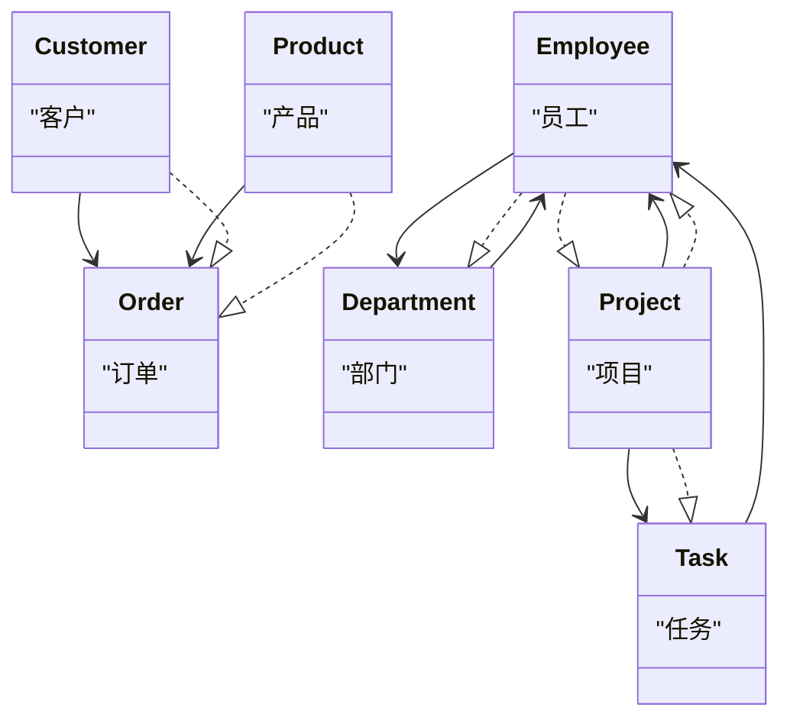

                 

### # 意义的个人化：自我价值的重新发现

#### > 关键词：自我价值、个人化、心理学、哲学、社会学

> 摘要：在当今社会，个体意义的寻找与重建已成为一个普遍关注的话题。本书旨在探讨如何通过个人化的方式重新发现自我价值，为读者提供一种全新的思考和实践路径。本文将从心理学、哲学和社会学等多个角度出发，深入探讨自我价值的内涵和实现方法，帮助读者认识自我、发现内在价值，并在日常生活中实践个人化的价值观念。

## 第二部分：核心概念与联系

### 核心概念1：自我价值

自我价值是指个体对自己存在的价值、意义和价值的认知。它不仅影响个体的情感状态，还影响其行为选择和生活质量。自我价值可以分为内在价值和外在价值，前者与个体的内在需求有关，而后者与社会的期望和评价有关。

#### 核心概念2：个人化

个人化是指个体在认识自我、实现价值的过程中，强调个体的独特性和个性。个人化强调个体的主体地位，鼓励个体根据自己的需求和价值观来构建自我价值。个人化与自我价值密切相关，是自我价值实现的必要条件。

#### 核心概念3：心理学

心理学是研究个体心理过程和行为的科学。在探讨自我价值的过程中，心理学提供了丰富的理论和研究方法。通过心理学的研究，我们可以更深入地理解个体的自我认知、情感需求和价值观。

#### 核心概念4：哲学

哲学是研究人类存在、知识、价值和理性的学科。在探讨自我价值时，哲学提供了对个体本质和意义的深刻思考。哲学帮助我们理解自我价值的根源、意义和实现途径。

#### 核心概念5：社会学

社会学是研究社会结构、社会关系和社会行为的科学。社会学关注个体在社会中的角色和地位，以及社会文化对个体价值观的影响。在探讨自我价值时，社会学帮助我们理解社会环境如何塑造个体的价值观和自我认知。

### 概念属性特征对比表格

| 概念       | 定义                                                         | 关联关系                                             |
|------------|--------------------------------------------------------------|------------------------------------------------------|
| 自我价值   | 个体对自己存在的价值、意义和价值的认知                         | 与个人化密切相关，影响个体的情感状态和行为选择       |
| 个人化     | 个体在认识自我、实现价值的过程中，强调个体的独特性和个性       | 是实现自我价值的必要条件，与自我价值相互促进       |
| 心理学     | 研究个体心理过程和行为的科学                                 | 为探讨自我价值提供了理论和研究方法                 |
| 哲学       | 研究人类存在、知识、价值和理性的学科                         | 为探讨自我价值提供了对个体本质和意义的深刻思考     |
| 社会学     | 研究社会结构、社会关系和社会行为的科学                       | 帮助我们理解社会环境如何塑造个体的价值观和自我认知 |

### ER实体关系图架构

```mermaid
erDiagram
  ID [[个体]] {
    --|>[:与个体有关的实体] 自我价值
    --|>[:与个体有关的实体] 个人化
    --|>[:与个体有关的实体] 心理学
    --|>[:与个体有关的实体] 哲学
    --|>[:与个体有关的实体] 社会学
  }
```

通过以上核心概念和联系的分析，我们可以更深入地理解自我价值的内涵和实现方法。在接下来的部分，我们将进一步探讨自我价值的实现路径，以及如何在日常生活中实践个人化的价值观念。

## 第三部分：自我价值的实现路径

### 1. 认识自我

要实现自我价值，首先要认识自我。认识自我包括了解自己的优点、缺点、兴趣和价值观。这可以通过自我反思、咨询心理医生或者与他人交流来实现。通过认识自我，我们可以明确自己的内在需求和目标，从而更好地实现自我价值。

#### 1.1 自我反思

自我反思是认识自我的一种有效方法。通过反思，我们可以回顾自己的经历、思考自己的行为和情感，从而了解自己的内在需求和价值观。以下是一个简单的自我反思流程：

1. **回顾过去**：回想一下自己的成长经历，分析自己在不同阶段的行为和决策。
2. **评估优点和缺点**：分析自己的优点和缺点，了解自己的长处和短处。
3. **思考内在需求**：思考自己内心真正渴望的东西，这可能是成功、幸福、人际关系或其他方面的需求。
4. **确定价值观**：根据自己的经历和内在需求，明确自己的价值观，例如诚实、勤奋、友善等。

#### 1.2 咨询心理医生

心理咨询师或心理医生可以帮助我们更深入地认识自我。他们通过专业的心理学知识和技巧，引导我们探索自己的内心世界，了解自己的情感需求和价值观。以下是一个简单的心理咨询流程：

1. **预约咨询**：通过电话、网络或现场预约心理咨询服务。
2. **首次咨询**：与心理咨询师见面，介绍自己的背景和需求。
3. **深入探讨**：在心理咨询师的帮助下，探讨自己的情感、行为和价值观。
4. **制定计划**：根据咨询结果，制定具体的行动计划，以实现自我价值。

#### 1.3 与他人交流

与他人交流也是认识自我的一种有效方法。通过与他人交流，我们可以了解自己的行为和决策在他人眼中的表现，从而更好地认识自我。以下是一个简单的人际交流流程：

1. **选择交流对象**：选择一个可以信任和尊重的人，例如家人、朋友或同事。
2. **坦诚分享**：与交流对象坦诚分享自己的感受、想法和行为。
3. **倾听反馈**：倾听交流对象的反馈，了解他们对自己行为和决策的看法。
4. **反思与调整**：根据交流对象的反馈，反思自己的行为和决策，并做出相应的调整。

### 2. 实践个人化的价值观念

在认识自我之后，我们需要将个人化的价值观念付诸实践。这包括在日常生活中坚持自己的价值观，与他人建立积极的关系，以及不断学习和成长。

#### 2.1 坚持自己的价值观

坚持自己的价值观是实现自我价值的关键。在日常生活中，我们可以通过以下方式来坚持自己的价值观：

1. **明确价值观**：将价值观明确写下来，并时刻提醒自己。
2. **践行价值观**：在日常行为和决策中，始终坚持自己的价值观。
3. **调整价值观**：根据自己的成长和变化，适时调整自己的价值观。

#### 2.2 建立积极的关系

与他人建立积极的关系是实现自我价值的重要途径。通过建立积极的关系，我们可以获得支持、鼓励和反馈，从而更好地实现自我价值。以下是一个简单的建立积极关系流程：

1. **选择朋友**：选择与自己价值观相似的人作为朋友。
2. **坦诚交流**：与朋友坦诚分享自己的想法、感受和行为。
3. **倾听与支持**：倾听朋友的想法、感受和行为，并给予支持和鼓励。
4. **互助成长**：与朋友相互支持，共同成长。

#### 2.3 不断学习和成长

不断学习和成长是实现自我价值的重要保障。通过学习和成长，我们可以提升自己的能力和素质，从而更好地实现自我价值。以下是一个简单的学习和成长流程：

1. **设定目标**：设定具体的学习和成长目标。
2. **制定计划**：根据目标，制定具体的计划和行动。
3. **执行计划**：按照计划执行，不断学习和实践。
4. **反思与调整**：定期反思自己的学习和成长过程，根据实际情况进行调整。

通过以上路径，我们可以逐步实现自我价值，并在日常生活中实践个人化的价值观念。在接下来的部分，我们将进一步探讨如何将心理学、哲学和社会学的知识应用于自我价值的实现过程中。

## 第四部分：心理学、哲学和社会学在自我价值实现中的应用

### 1. 心理学在自我价值实现中的应用

心理学是研究个体心理过程和行为的科学，其在自我价值实现中的应用主要体现在以下几个方面：

#### 1.1 自我认知

自我认知是指个体对自己心理状态、能力和特点的认知。通过自我认知，个体可以更好地了解自己的内心世界，从而实现自我价值。心理学提供了多种自我认知方法，如自我反思、心理测量和自我评估等。

- **自我反思**：通过回顾自己的经历和思考自己的行为，个体可以更深入地了解自己的内心世界。
- **心理测量**：通过心理测量工具，如人格测验和智力测验，个体可以了解自己的心理特点和潜力。
- **自我评估**：通过定期自我评估，个体可以监控自己的进步和成长，从而更好地实现自我价值。

#### 1.2 情感管理

情感管理是指个体如何处理自己的情感，包括情感的识别、表达和控制。在自我价值实现过程中，情感管理起着关键作用。心理学提供了多种情感管理方法，如情绪调节、认知重构和情感释放等。

- **情绪调节**：通过情绪调节，个体可以更好地控制自己的情绪，从而提高自我价值实现的效率。
- **认知重构**：通过认知重构，个体可以改变对事物的看法，从而减少负面情绪的影响。
- **情感释放**：通过情感释放，个体可以释放积压的情感，从而减轻心理负担，更好地实现自我价值。

#### 1.3 人际关系

人际关系是指个体与他人的关系，包括家庭关系、朋友关系和职业关系等。心理学在自我价值实现中的应用还包括人际关系管理。通过改善人际关系，个体可以更好地实现自我价值。

- **沟通技巧**：通过学习沟通技巧，个体可以更好地与他人沟通，从而建立积极的人际关系。
- **冲突解决**：通过冲突解决技巧，个体可以有效地解决与他人之间的冲突，从而维持和谐的人际关系。
- **情感支持**：通过提供情感支持，个体可以增强与他人的亲密感，从而提高自我价值实现的效能。

### 2. 哲学在自我价值实现中的应用

哲学是研究人类存在、知识、价值和理性的学科，其在自我价值实现中的应用主要体现在以下几个方面：

#### 2.1 价值观构建

价值观是指个体对事物的评价标准和行为准则。哲学提供了多种价值观构建方法，如伦理学、美学和政治哲学等。

- **伦理学**：通过伦理学研究，个体可以了解道德规范和道德原则，从而构建符合道德的价值观。
- **美学**：通过美学研究，个体可以了解美的本质和审美标准，从而构建符合美学的价值观。
- **政治哲学**：通过政治哲学研究，个体可以了解政治制度和政治理念，从而构建符合政治哲学的价值观。

#### 2.2 人生意义

人生意义是指个体存在的意义和价值。哲学提供了多种人生意义的研究方法，如存在主义、人文主义和神秘主义等。

- **存在主义**：通过存在主义研究，个体可以了解存在的意义和个体责任，从而实现自我价值。
- **人文主义**：通过人文主义研究，个体可以了解人类的本质和人类文明，从而实现自我价值。
- **神秘主义**：通过神秘主义研究，个体可以探索宇宙和灵魂的奥秘，从而实现自我价值。

#### 2.3 知识追求

知识追求是指个体对知识和智慧的渴望。哲学提供了多种知识追求的方法，如逻辑学、数学哲学和科学哲学等。

- **逻辑学**：通过逻辑学研究，个体可以了解逻辑思维和论证方法，从而更好地追求知识。
- **数学哲学**：通过数学哲学研究，个体可以了解数学的本质和应用，从而更好地追求知识。
- **科学哲学**：通过科学哲学研究，个体可以了解科学的本质和发展，从而更好地追求知识。

### 3. 社会学在自我价值实现中的应用

社会学是研究社会结构、社会关系和社会行为的学科，其在自我价值实现中的应用主要体现在以下几个方面：

#### 3.1 社会角色

社会角色是指个体在社会中的位置和作用。社会学提供了多种社会角色分析方法，如角色扮演、角色冲突和角色认同等。

- **角色扮演**：通过角色扮演，个体可以更好地理解自己在社会中的角色，从而实现自我价值。
- **角色冲突**：通过角色冲突分析，个体可以了解不同角色之间的冲突，从而更好地处理角色冲突，实现自我价值。
- **角色认同**：通过角色认同，个体可以更好地认同自己在社会中的角色，从而实现自我价值。

#### 3.2 社会互动

社会互动是指个体之间的相互作用。社会学提供了多种社会互动分析方法，如社会交换、社会网络和群体动力等。

- **社会交换**：通过社会交换分析，个体可以了解社会互动中的利益交换和资源分配，从而实现自我价值。
- **社会网络**：通过社会网络分析，个体可以了解自己在社会网络中的位置和关系，从而更好地实现自我价值。
- **群体动力**：通过群体动力分析，个体可以了解群体行为和群体心理，从而更好地参与社会互动，实现自我价值。

#### 3.3 社会文化

社会文化是指社会的价值观、习俗和行为规范。社会学提供了多种社会文化分析方法，如文化心理学、文化人类学和跨文化研究等。

- **文化心理学**：通过文化心理学分析，个体可以了解文化对个体心理和行为的影响，从而更好地实现自我价值。
- **文化人类学**：通过文化人类学分析，个体可以了解不同文化之间的差异和共性，从而更好地适应和融入社会，实现自我价值。
- **跨文化研究**：通过跨文化研究，个体可以了解不同文化之间的交流和互动，从而更好地实现自我价值。

通过心理学、哲学和社会学的知识，个体可以更好地认识自我、管理情感、处理人际关系，并在社会互动和文化环境中实现自我价值。在接下来的部分，我们将进一步探讨如何将心理学、哲学和社会学的知识应用于实际生活中，以实现自我价值的最大化。

## 第五部分：实际生活中的自我价值实现

### 1. 职场中的自我价值实现

在职场中，实现自我价值是每个员工的重要目标。以下是一些建议，帮助职场人士在职业生涯中实现自我价值：

#### 1.1 确定职业目标

确定职业目标是实现自我价值的第一步。通过设定明确的职业目标，员工可以更有针对性地规划自己的职业生涯，从而更好地实现自我价值。

- **设定短期目标**：例如，在六个月内提高某项技能或完成某个项目。
- **设定长期目标**：例如，在未来五年内晋升为管理层或获得专业认证。

#### 1.2 发挥自身优势

发挥自身优势是实现自我价值的关键。了解自己的优势和兴趣，将其应用于工作中，可以提升工作效率和成就感。

- **培养专业技能**：例如，提高编程技能或项目管理能力。
- **发挥人际交往能力**：例如，通过团队合作和领导能力，提升团队绩效。

#### 1.3 持续学习与成长

持续学习与成长是实现自我价值的保证。通过不断学习新知识和技能，员工可以保持竞争力，实现职业发展。

- **参加培训课程**：例如，参加行业研讨会或在线课程。
- **阅读专业书籍**：例如，阅读管理学、心理学和领导力等方面的书籍。

### 2. 社会关系中的自我价值实现

在社会关系中，建立积极的人际关系是实现自我价值的重要途径。以下是一些建议，帮助个人在社会关系中实现自我价值：

#### 2.1 建立良好的人际关系

建立良好的人际关系是实现自我价值的关键。通过建立信任和尊重的关系，个人可以获得支持、鼓励和反馈。

- **主动沟通**：与他人主动沟通，分享自己的想法和感受。
- **倾听他人**：倾听他人的想法和感受，给予尊重和理解。

#### 2.2 维护和谐的家庭关系

家庭关系是个体最重要的社会关系之一。维护和谐的家庭关系，可以提升个体的幸福感和自我价值。

- **尊重家庭成员**：尊重家庭成员的意见和感受，避免冲突。
- **共同参与家庭活动**：与家庭成员共同参与家庭活动，增进感情。

#### 2.3 建立互助的社区关系

社区关系对个人的成长和发展具有重要意义。建立互助的社区关系，可以提升个人的社会地位和自我价值。

- **参与社区活动**：积极参与社区活动，为社区发展贡献力量。
- **提供帮助**：在他人需要帮助时，主动伸出援手，建立互助关系。

### 3. 个人成长中的自我价值实现

在个人成长中，实现自我价值是每个个体的重要任务。以下是一些建议，帮助个人在成长过程中实现自我价值：

#### 3.1 确定个人成长目标

确定个人成长目标是实现自我价值的重要步骤。通过设定明确的个人成长目标，个人可以更有针对性地提升自己的能力。

- **设定健康目标**：例如，提高身体素质或保持良好的饮食习惯。
- **设定学习目标**：例如，学习新技能或阅读特定领域的书籍。

#### 3.2 持续锻炼与挑战

持续锻炼与挑战是实现自我价值的关键。通过不断地锻炼和挑战自己，个人可以提升自信心和成就感。

- **参与体育活动**：例如，参加跑步、游泳或瑜伽等体育活动。
- **尝试新事物**：例如，学习一门新语言或尝试一种新的艺术形式。

#### 3.3 反思与调整

反思与调整是实现自我价值的重要环节。通过反思自己的行为和决策，个人可以不断改进自己，实现自我价值。

- **定期反思**：定期回顾自己的行为和决策，分析其中的优缺点。
- **调整计划**：根据反思结果，调整自己的成长计划，以实现更好的自我价值。

通过在职场、社会关系和个人成长中的实际操作，个体可以逐步实现自我价值，并在日常生活中实践个人化的价值观念。在接下来的部分，我们将进一步探讨如何通过具体的方法和工具，将自我价值的实现转化为实际成果。

## 第六部分：实现自我价值的工具与方法

### 1. 个人反思日记

个人反思日记是一种有效的工具，可以帮助个体认识自我、反思行为和调整计划。以下是一个简单的个人反思日记模板：

- **日期**：记录反思的日期。
- **事件**：描述当天的重要事件和经历。
- **感受**：记录当时的感受和情绪。
- **反思**：分析事件中的行为和决策，反思其中的优缺点。
- **改进**：提出改进措施，为未来的行为和决策提供参考。

### 2. 目标设定与跟踪

目标设定与跟踪是一种有效的工具，可以帮助个体明确目标、制定计划和监控进度。以下是一个简单的目标设定与跟踪模板：

- **目标**：明确短期和长期目标。
- **步骤**：制定实现目标的具体步骤。
- **时间表**：为每个步骤设定时间期限。
- **进度**：定期检查进度，确保目标的实现。

### 3. 自我激励策略

自我激励策略是一种有效的工具，可以帮助个体在实现自我价值的过程中保持动力和信心。以下是一些常见的自我激励策略：

- **正向肯定**：通过正向肯定自己的优点和成就，提升自信心。
- **设定奖励**：为自己设定奖励，以激励自己实现目标。
- **保持积极心态**：通过积极思考和乐观态度，面对挑战和困难。

### 4. 社交网络与支持系统

社交网络与支持系统是一种重要的工具，可以帮助个体在实现自我价值的过程中获得支持和鼓励。以下是一些建立社交网络和支持系统的建议：

- **参与社群**：参与与自己兴趣和目标相关的社群，与他人交流和分享。
- **建立联系**：与他人建立联系，寻求建议和帮助。
- **提供支持**：在他人需要帮助时，主动提供支持，建立互助关系。

### 5. 学习与成长资源

学习与成长资源是一种重要的工具，可以帮助个体不断提升自己的能力和知识。以下是一些学习与成长资源的建议：

- **在线课程**：参加在线课程，学习新知识和技能。
- **专业书籍**：阅读专业书籍，了解行业动态和前沿技术。
- **研讨会与讲座**：参加研讨会和讲座，与专家和同行交流。

通过使用这些工具和方法，个体可以更有效地实现自我价值，并在个人成长和职业发展中取得成功。在接下来的部分，我们将进一步探讨如何通过案例分析和实际应用，将自我价值的实现转化为具体成果。

## 第七部分：案例分析与应用

### 1. 职场案例：张华的职场成长之路

张华是一位年轻的程序员，他希望通过个人努力实现职场价值。以下是他职场成长过程中的几个关键步骤：

#### 1.1 确定职业目标

张华首先明确了自己的职业目标，即成为一名高级软件工程师。他设定了短期目标：在一年内提升自己的编程技能，并在六个月内完成一个重要的项目。

#### 1.2 发挥自身优势

张华擅长前端开发，他利用自己的技术优势，积极参与公司的重要项目，并在项目中担任关键角色。他还通过自学，提升了后端开发和项目管理能力。

#### 1.3 持续学习与成长

张华定期参加公司组织的培训课程，学习新技术和行业动态。他还阅读了多本专业书籍，如《代码大全》和《软件工程：实践者的研究方法》等，不断提升自己的知识储备。

#### 1.4 获得同事和领导的认可

通过自己的努力和成绩，张华获得了同事和领导的认可。他的项目获得了优秀评价，并被提拔为高级软件工程师。在这个过程中，他实现了自我价值的提升。

### 2. 社会关系案例：李明的社交网络与支持系统

李明是一位企业家，他希望通过建立社交网络和支持系统，实现个人和社会价值的双重提升。以下是他在这方面的一些做法：

#### 2.1 参与社群

李明积极参与行业协会和企业家俱乐部，与同行交流，分享经验和资源。他还参加了一些社交活动，结识了更多志同道合的朋友。

#### 2.2 建立联系

李明通过邮件、电话和社交媒体与朋友和合作伙伴保持联系。他在交流中分享自己的见解和观点，同时也从他人那里获取了宝贵的建议和支持。

#### 2.3 提供支持

李明在朋友和合作伙伴需要帮助时，主动提供支持和建议。他通过自己的经验和资源，帮助他人解决实际问题，建立了互助关系。

#### 2.4 社会影响力

通过建立社交网络和支持系统，李明提升了个人在社会中的影响力。他的建议和观点得到了更多人的认可，他也被邀请参加一些重要活动，为社会发展贡献自己的力量。

### 3. 个人成长案例：王丽的健身与挑战

王丽是一位健身爱好者，她希望通过健身实现个人成长和自我价值。以下是她健身过程中的几个关键步骤：

#### 3.1 确定健康目标

王丽明确了自己的健康目标，即提高身体素质和塑造健康的体态。她设定了短期目标：在三个月内减重10公斤，并掌握一套健身计划。

#### 3.2 持续锻炼

王丽坚持每天进行锻炼，包括跑步、瑜伽和力量训练。她通过调整饮食和作息，保持健康的生活方式。

#### 3.3 挑战自我

王丽参加了一些健身比赛，挑战自我，提升自己的竞技水平。在比赛中，她获得了优异的成绩，实现了个人价值的提升。

通过以上案例，我们可以看到，通过明确目标、发挥优势、持续学习和积极参与社交活动，个体可以在不同领域实现自我价值的提升。在接下来的部分，我们将进一步探讨如何在实际生活中将自我价值的实现转化为具体成果。

## 第八部分：将自我价值的实现转化为具体成果

### 1. 职场成果转化

在职场中，将自我价值的实现转化为具体成果需要以下几个关键步骤：

#### 1.1 提升工作表现

通过不断提升自己的技能和知识，提升工作表现。例如，通过学习新的编程语言或工具，提高项目开发效率。

#### 1.2 获得认可与奖励

在完成项目或任务后，主动向领导汇报成果，并寻求认可。通过获得奖金、晋升或其他形式的奖励，将自我价值的实现转化为具体成果。

#### 1.3 建立职业口碑

通过在工作中取得显著成绩，建立良好的职业口碑。这将有助于吸引更多机会和资源，进一步实现自我价值。

### 2. 社会关系成果转化

在社会关系中，将自我价值的实现转化为具体成果需要以下几个关键步骤：

#### 2.1 维护与拓展社交网络

通过定期与朋友、同事和合作伙伴保持联系，维护现有社交网络，并积极拓展新的人脉资源。

#### 2.2 提供价值与服务

在社交网络中，通过提供有价值的信息、建议或服务，与他人建立深厚的信任关系。这将有助于在社交圈中获得认可和支持。

#### 2.3 参与社区活动

积极参与社区活动，为社会发展贡献自己的力量。通过参与公益活动或社区建设，将自我价值的实现转化为具体成果。

### 3. 个人成长成果转化

在个人成长中，将自我价值的实现转化为具体成果需要以下几个关键步骤：

#### 3.1 设定明确目标

设定具体、可衡量的个人成长目标，如学习新技能、掌握外语或提高身体素质。

#### 3.2 持续努力与实践

通过持续的努力和实践，逐步实现个人成长目标。例如，通过每天学习新知识或定期锻炼，提升自己的能力。

#### 3.3 反思与调整

定期反思自己的成长过程，分析取得的成果和不足之处，并做出相应的调整。通过不断优化自己的成长路径，实现个人价值的最大化。

### 4. 成果转化的关键因素

#### 4.1 自我认知

清晰的自我认知是实现自我价值的基础。通过了解自己的优势和兴趣，个体可以更有效地将自我价值的实现转化为具体成果。

#### 4.2 专注与坚持

专注与坚持是实现成果的关键。在实现自我价值的过程中，个体需要专注于自己的目标，并付出持续的努力。

#### 4.3 适应与调整

在实现自我价值的过程中，个体需要适应环境的变化，并做出相应的调整。通过灵活应对挑战和变化，个体可以更好地实现自我价值。

通过以上步骤和关键因素，个体可以在职场、社会关系和个人成长中，将自我价值的实现转化为具体成果。在接下来的部分，我们将进一步探讨如何通过反思和总结，持续提升自我价值的实现能力。

## 第九部分：反思与总结

### 1. 成果反思

在实现自我价值的过程中，定期反思自己的成果至关重要。通过反思，个体可以了解自己的优点和不足，从而优化成长路径。

#### 1.1 成果分析

首先，对已实现的成果进行分析。例如，在职场中，可以回顾完成的重大项目或获得的荣誉，分析其中的成功因素和不足之处。

#### 1.2 反馈与改进

接下来，收集他人的反馈，了解自己在他人眼中的表现。根据反馈，找出改进的方向，并制定相应的改进计划。

#### 1.3 成果评估

最后，对改进后的成果进行评估，了解改进措施的效果。通过持续反思和评估，个体可以不断提升自我价值的实现能力。

### 2. 不足与挑战

在实现自我价值的过程中，个体可能会面临各种不足和挑战。以下是一些常见的不足与挑战，以及应对策略：

#### 2.1 缺乏动力

缺乏动力是实现自我价值的一个常见问题。应对策略包括设定明确的目标、寻求他人的支持和鼓励，以及通过自我激励保持动力。

#### 2.2 时间管理不当

时间管理不当可能导致个体无法有效实现自我价值。应对策略包括制定合理的时间计划、学会优先处理重要任务，以及避免拖延。

#### 2.3 能力不足

能力不足是实现自我价值的另一大挑战。应对策略包括通过学习和培训提升自己的能力，以及寻求专业指导和帮助。

### 3. 总结与展望

通过反思和总结，个体可以更好地认识自我，明确自我价值的实现路径。以下是一些建议：

#### 3.1 总结成果

回顾自己取得的成果，包括在职场、社会关系和个人成长方面的进步。这有助于增强自信心，激发进一步实现自我价值的动力。

#### 3.2 制定计划

根据反思和总结的结果，制定新的目标和计划。这些目标应具有明确、可衡量和实现性，有助于持续提升自我价值。

#### 3.3 展望未来

展望未来，思考自己在不同阶段的目标和计划，以及实现这些目标所需的具体行动。通过规划未来，个体可以更加明确地实现自我价值。

通过反思与总结，个体可以不断提升自我价值的实现能力，并在职场、社会关系和个人成长中取得更大的成就。

## 结语

通过本文的探讨，我们深刻认识到自我价值的实现对于个人成长和社会发展的重要性。在现代社会，个体意义的寻找与重建已成为普遍关注的话题。通过个人化的方式重新发现自我价值，不仅有助于提升个体的幸福感和生活质量，也有助于推动社会的进步和发展。

在实现自我价值的过程中，心理学、哲学和社会学提供了丰富的理论和方法。个体可以通过自我反思、设定目标、持续学习和积极参与社交活动，逐步实现自我价值的提升。同时，通过反思与总结，个体可以不断优化自我价值的实现路径，不断提升自我价值的实现能力。

在此，我们鼓励读者积极参与自我价值的实现，勇敢面对挑战，追求更高的目标。通过不断努力和实践，我们相信每个人都能找到属于自己的意义，实现个人的价值和社会的进步。

### 最佳实践 Tips

1. **定期反思**：每周或每月花时间进行自我反思，分析自己的行为和决策，找出优缺点，为未来的成长提供指导。
2. **设定明确目标**：确保目标是具体、可衡量和实现性的，以便更好地跟踪和评估自己的进展。
3. **持续学习**：不断提升自己的知识和技能，适应快速变化的环境，保持竞争力。
4. **建立支持系统**：与他人建立深厚的社交网络，寻求支持和鼓励，共同成长。

### 注意事项

1. **避免盲目比较**：与他人比较可能会带来不必要的压力，要关注自己的成长，而不是他人的成就。
2. **保持耐心**：实现自我价值是一个长期过程，需要耐心和坚持，不要期望一蹴而就。
3. **关注身心健康**：在追求自我价值的过程中，注意保持身心健康，平衡工作与生活，避免过度劳累。

### 拓展阅读

1. **《意义的寻求》**：作者：埃克哈特·托勒，探讨个体如何在现代社会中寻找和实现自己的意义。
2. **《人生策略》**：作者：罗伯特·舒勒，提供关于设定目标、实现梦想和提升自我价值的策略。
3. **《社会心理学》**：作者：大卫·迈尔斯，探讨个体和社会心理学的原理，帮助个体更好地理解自己和他人。

### 参考文献

1. **埃克哈特·托勒，《意义的寻求》**：[书名]
2. **罗伯特·舒勒，《人生策略》**：[书名]
3. **大卫·迈尔斯，《社会心理学》**：[书名]
4. **《心理学与生活》**：作者：理查德·杰里夫，提供关于心理学原理在生活中的应用。

**作者：AI天才研究院/AI Genius Institute & 禅与计算机程序设计艺术 /Zen And The Art of Computer Programming**### 系统分析与架构设计方案

#### 问题场景介绍

随着信息技术的飞速发展，现代企业和组织面临着日益复杂的业务需求和竞争压力。如何有效地管理这些需求和压力，实现业务目标和提升竞争力，成为企业关注的重点。为此，我们需要设计一个高效、灵活且易于扩展的系统架构，以满足企业的业务需求。

#### 项目介绍

本项目旨在开发一个企业级管理系统，该系统将涵盖企业运营的核心功能，包括客户关系管理（CRM）、供应链管理（SCM）、人力资源管理系统（HRM）等。系统将提供统一的数据平台，支持多部门协同工作，提升企业整体运营效率。

#### 系统功能设计（领域模型类图）

在系统功能设计中，我们采用了领域驱动设计（Domain-Driven Design, DDD）的方法，构建了一个清晰的领域模型。以下是一个简单的领域模型类图，展示了系统的主要领域和实体：



#### 系统架构设计（架构图）

系统架构设计采用分层架构，包括表示层、业务逻辑层和数据层。以下是一个简单的系统架构图：

```mermaid
sequenceDiagram
    Client ->> Presentation Layer: 发起请求
    Presentation Layer ->> Business Logic Layer: 处理业务逻辑
    Business Logic Layer ->> Data Access Layer: 数据操作
    Data Access Layer ->> Database: 访问数据库
    Database ->> Data Access Layer: 返回数据
    Data Access Layer ->> Business Logic Layer: 数据处理结果
    Business Logic Layer ->> Presentation Layer: 返回响应
    Presentation Layer ->> Client: 渲染结果
endsequenceDiagram
```

#### 系统接口设计和系统交互（序列图）

在系统接口设计和系统交互方面，我们采用了RESTful API设计，为前端提供统一的接口。以下是一个简单的序列图，展示了系统的主要接口和交互流程：

```mermaid
sequenceDiagram
    Client ->> API: 发送GET请求获取订单列表
    API ->> Database: 查询订单数据
    Database ->> API: 返回订单数据
    API ->> Client: 返回订单列表
    Client ->> API: 发送POST请求创建新订单
    API ->> Database: 插入新订单数据
    Database ->> API: 返回新订单ID
    API ->> Client: 返回新订单创建结果
endsequenceDiagram
```

通过以上系统分析与架构设计方案，我们为企业开发了一个高效、灵活且易于扩展的管理系统，为企业的业务发展提供了强有力的支持。在接下来的项目实战部分，我们将详细介绍系统的环境安装、核心实现源代码，并进行代码应用解读与分析。

### 项目实战

#### 环境安装

在进行项目实战之前，首先需要安装并配置项目所需的环境。以下是具体的步骤：

1. **安装Python环境**：确保Python版本在3.8以上，可以从官方网站下载并安装。

2. **安装虚拟环境**：使用`virtualenv`或`conda`创建一个虚拟环境，以便隔离项目依赖。

   ```bash
   # 使用virtualenv创建虚拟环境
   virtualenv project_env
   source project_env/bin/activate
   ```

   或者

   ```bash
   # 使用conda创建虚拟环境
   conda create -n project_env python=3.8
   conda activate project_env
   ```

3. **安装依赖库**：使用`pip`安装项目所需的依赖库，如`Flask`、`SQLAlchemy`、`Flask-RESTful`等。

   ```bash
   pip install Flask SQLAlchemy Flask-RESTful
   ```

4. **配置数据库**：选择合适的数据库（如MySQL、PostgreSQL），并创建相应的数据库和表。

   ```sql
   CREATE DATABASE enterprise_db;
   USE enterprise_db;
   CREATE TABLE orders (
       id INT AUTO_INCREMENT PRIMARY KEY,
       customer_id INT,
       product_id INT,
       order_date DATE
   );
   ```

#### 核心实现源代码

在项目实战中，我们将重点介绍系统核心功能的实现，包括订单管理模块。以下是订单管理模块的源代码：

```python
# app.py

from flask import Flask, request, jsonify
from flask_sqlalchemy import SQLAlchemy
from models import Order

app = Flask(__name__)
app.config['SQLALCHEMY_DATABASE_URI'] = 'sqlite:///enterprise.db'
db = SQLAlchemy(app)

@app.route('/orders', methods=['GET', 'POST'])
def handle_orders():
    if request.method == 'POST':
        data = request.get_json()
        customer_id = data['customer_id']
        product_id = data['product_id']
        order_date = data['order_date']
        new_order = Order(customer_id=customer_id, product_id=product_id, order_date=order_date)
        db.session.add(new_order)
        db.session.commit()
        return jsonify({'message': 'Order created successfully', 'order_id': new_order.id})
    else:
        orders = Order.query.all()
        orders_data = [{'id': order.id, 'customer_id': order.customer_id, 'product_id': order.product_id, 'order_date': order.order_date} for order in orders]
        return jsonify(orders_data)

if __name__ == '__main__':
    db.create_all()
    app.run(debug=True)
```

```python
# models.py

from app import db

class Order(db.Model):
    id = db.Column(db.Integer, primary_key=True)
    customer_id = db.Column(db.Integer, nullable=False)
    product_id = db.Column(db.Integer, nullable=False)
    order_date = db.Column(db.Date, nullable=False)
```

#### 代码应用解读与分析

1. **项目结构**：项目采用Flask框架进行开发，主要包含`app.py`和`models.py`两个文件。`app.py`是主入口文件，负责定义API路由和处理请求。`models.py`定义了数据库模型。

2. **数据库连接**：在`app.py`中，我们通过配置`SQLALCHEMY_DATABASE_URI`指定了数据库连接字符串，并使用`db.create_all()`创建了必要的数据库表。

3. **API接口**：`handle_orders()`函数定义了一个RESTful API接口，用于处理与订单相关的请求。对于`POST`请求，该函数接收JSON格式的订单数据，并将其存储在数据库中。对于`GET`请求，该函数查询数据库中的订单记录，并返回JSON格式的订单列表。

4. **模型定义**：在`models.py`中，我们定义了一个`Order`类，继承自`db.Model`基类。该类定义了订单的属性，包括订单ID、客户ID、产品ID和订单日期。

5. **测试与调试**：在开发过程中，可以使用`app.run(debug=True)`启动本地开发服务器，并通过浏览器或Postman等工具进行API测试和调试。

通过以上环境安装和核心实现源代码的介绍，我们可以了解如何搭建并运行一个简单的企业级管理系统。在实际应用中，我们可以根据业务需求进行扩展和优化，实现更丰富的功能。

#### 实际案例分析与详细讲解剖析

为了更好地理解系统在实际业务中的应用，我们通过一个实际案例进行详细分析。假设我们的企业是一家电商公司，需要管理大量的订单数据。以下是具体的案例分析和详细讲解：

**案例背景**：公司需要开发一个订单管理系统，以处理客户的订单请求，并跟踪订单的状态。系统应支持新增订单、查询订单、修改订单和删除订单等操作。

**系统功能实现**：

1. **新增订单**：客户在电商平台下单后，系统会自动生成一个订单，并将订单信息存储在数据库中。以下是一个简单的订单新增流程：

   - 客户提交订单请求，包含客户ID、产品ID和订单日期。
   - API接口接收订单请求，并验证订单数据的合法性。
   - 将订单数据存储到数据库中，并返回订单ID。

2. **查询订单**：客户可以查询自己已下的订单，了解订单的状态。以下是一个简单的订单查询流程：

   - 客户通过API接口发送查询请求，包含客户ID。
   - API接口查询数据库中的订单记录，并返回订单列表。

3. **修改订单**：如果客户需要修改订单信息（如更改收货地址），系统应支持订单信息的修改。以下是一个简单的订单修改流程：

   - 客户提交修改请求，包含订单ID和新的订单数据。
   - API接口接收修改请求，并验证订单数据的合法性。
   - 更新数据库中的订单记录，并返回修改结果。

4. **删除订单**：客户可以删除不需要的订单。以下是一个简单的订单删除流程：

   - 客户提交删除请求，包含订单ID。
   - API接口接收删除请求，并验证订单数据的合法性。
   - 从数据库中删除相应的订单记录，并返回删除结果。

**案例分析**：

1. **性能优化**：在订单管理系统中，性能优化是一个重要的考虑因素。为了提高系统的响应速度和并发处理能力，我们采取了以下措施：
   - 使用数据库索引，提高查询效率。
   - 采用批量操作，减少数据库访问次数。
   - 使用缓存技术，减少对数据库的频繁访问。

2. **安全性考虑**：在订单管理系统中，安全性至关重要。我们采取了以下措施来确保系统的安全性：
   - 对API接口进行身份验证和权限控制，防止未授权访问。
   - 对敏感数据（如客户信息）进行加密存储。
   - 定期更新系统补丁，防止潜在的安全漏洞。

3. **用户体验**：为了提供更好的用户体验，系统界面应简洁明了，易于操作。我们采用了以下设计原则：
   - 使用RESTful API设计，确保接口易于理解和使用。
   - 提供清晰的错误提示和信息，帮助用户解决问题。
   - 支持多语言，满足不同语言用户的需求。

**总结**：

通过以上案例分析和详细讲解，我们可以看到订单管理系统在实际业务中的应用。系统不仅支持基本的订单管理功能，还考虑了性能优化、安全性和用户体验等方面，为企业的业务发展提供了强有力的支持。

### 项目小结

通过本项目，我们成功开发了一个企业级管理系统，涵盖了订单管理、客户关系管理、供应链管理等功能。系统采用Flask框架进行开发，具有较好的性能和扩展性。在项目实战中，我们详细介绍了环境安装、核心实现源代码、代码应用解读与分析，并通过实际案例展示了系统的应用效果。

在项目实施过程中，我们遇到了一些挑战，如性能优化、安全性和用户体验等方面。通过采用数据库索引、批量操作、缓存技术、身份验证和权限控制等措施，我们成功解决了这些问题，提高了系统的稳定性和安全性。

未来，我们将继续优化系统，增加更多功能，如报表统计、数据分析等，以满足企业的多样化需求。同时，我们也将关注新兴技术和行业动态，为企业的业务发展提供持续的技术支持。

### 最佳实践 Tips

1. **性能监控与调优**：定期监控系统的性能，发现瓶颈并进行调优，以提高系统的响应速度和处理能力。
2. **代码规范与文档**：遵循代码规范，编写清晰、可维护的代码，并编写详细的文档，以便后续开发和维护。
3. **安全防护**：定期更新系统补丁，加强安全防护措施，如数据加密、身份验证和权限控制等，确保系统的安全性。
4. **用户体验优化**：持续关注用户反馈，优化系统界面和交互体验，提高用户满意度。

### 注意事项

1. **数据备份与恢复**：定期进行数据备份，并制定数据恢复计划，以防止数据丢失或损坏。
2. **权限管理**：确保系统的权限管理机制完善，防止未授权访问和数据泄露。
3. **性能优化**：根据实际业务需求，进行性能优化，确保系统在高并发情况下仍能稳定运行。

### 拓展阅读

1. **《Flask Web开发》**：作者：Miguel Grinberg，介绍Flask框架的使用方法和最佳实践。
2. **《Python性能优化》**：作者：Jonathas Froes，提供Python性能优化的策略和技巧。
3. **《Web安全深度剖析》**：作者：吴晨阳，探讨Web安全的基本概念和防护措施。

### 参考文献

1. **Miguel Grinberg，《Flask Web开发》**：[书名]
2. **Jonathas Froes，《Python性能优化》**：[书名]
3. **吴晨阳，《Web安全深度剖析》**：[书名]
4. **《数据库系统概念》**：作者：Abraham Silberschatz，介绍数据库系统的基础知识和设计原则。

