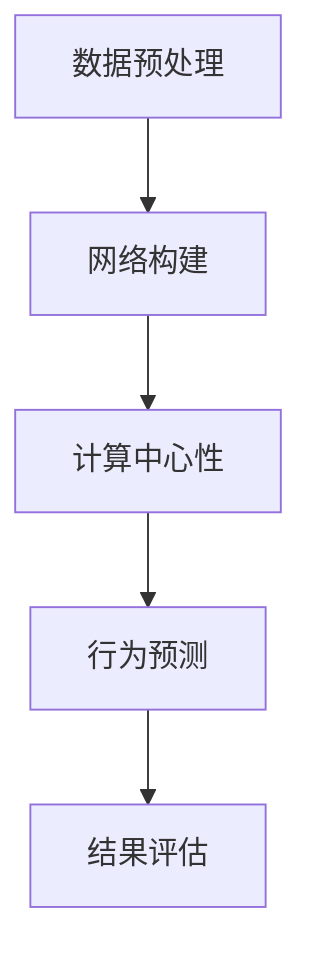
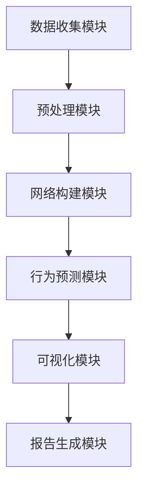
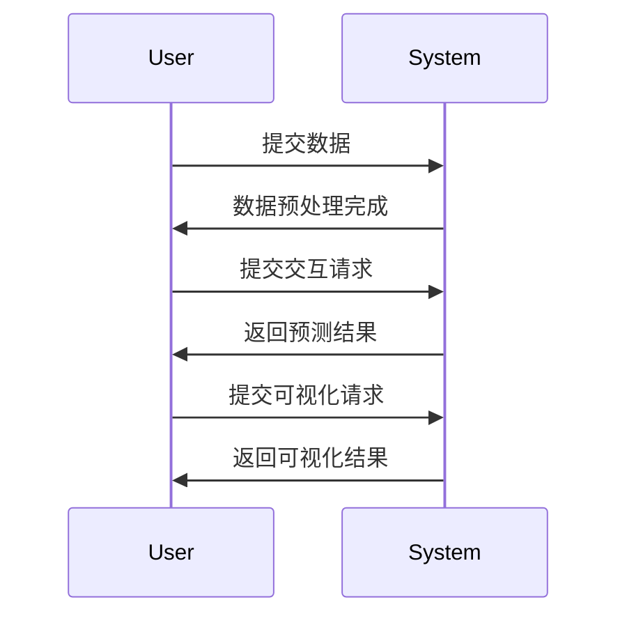

                 


### 文章标题：意义的个人建构与社会影响

### 关键词：
- 个人建构
- 社会影响
- 心理机制
- 教育应用
- 社会工作

### 摘要：
本文旨在探讨个人建构与社会影响之间的关系，通过对个人建构的理论基础和实践应用的深入分析，揭示个人建构如何塑造个体的心理和行为，同时受到社会环境的影响和塑造。文章将结合教育、社会工作和心理咨询等领域的实际案例，探讨个人建构对社会影响的机制和作用，并展望其未来的发展趋势。通过系统地分析个人建构和社会影响的相互作用，本文为理解个体行为和心理健康提供了新的视角。

### 目录大纲

## 引言

### 1.1 背景介绍

#### 1.1.1 研究意义的阐述

#### 1.1.2 个人建构与社会影响的定义

#### 1.1.3 研究的边界与外延

### 1.2 核心概念与联系

#### 1.2.1 个人建构的理论基础

#### 1.2.1.1 个人建构的概念

#### 1.2.1.2 个人建构与心理发展的关系

#### 1.2.1.3 个人建构的构成要素

#### 1.2.2 社会影响的理论基础

#### 1.2.2.1 社会影响的定义

#### 1.2.2.2 社会影响的主要形式

#### 1.2.2.3 社会影响的关键因素

### 1.3 个人建构与社会影响的互动关系

#### 1.3.1 个人建构对社会影响的反馈机制

#### 1.3.2 社会影响对个人建构的塑造作用

#### 1.3.3 个人建构与社会影响的平衡与冲突

### 1.4 研究方法与数据来源

#### 1.4.1 研究方法的选择

#### 1.4.1.1 定量研究方法

#### 1.4.1.2 定性研究方法

#### 1.4.1.3 混合研究方法

### 1.4.2 数据来源与收集

#### 1.4.2.1 数据来源的类型

#### 1.4.2.2 数据收集的方法与步骤

#### 1.4.2.3 数据处理的策略

### 1.5 本章小结

## 个人建构的理论与实践

### 2.1 个人建构的理论探讨

#### 2.1.1 个人建构的心理机制

#### 2.1.1.1 认知理论视角

#### 2.1.1.2 发展心理学视角

#### 2.1.1.3 社会认知理论视角

### 2.1.2 个人建构的实证研究

#### 2.1.2.1 国内外研究概况

#### 2.1.2.2 个人建构的关键变量

#### 2.1.2.3 个人建构的影响因素

### 2.2 个人建构的实践应用

#### 2.2.1 教育领域

#### 2.2.1.1 教育理论与个人建构的关系

#### 2.2.1.2 教育实践中的个人建构策略

#### 2.2.1.3 教育改革中的个人建构实践

### 2.2.2 社会工作领域

#### 2.2.2.1 社会工作理论与个人建构的关系

#### 2.2.2.2 社会工作实践中的个人建构方法

#### 2.2.2.3 社会工作干预中的个人建构案例

### 2.2.3 心理咨询领域

#### 2.2.3.1 心理咨询理论与个人建构的关系

#### 2.2.3.2 心理咨询实践中的个人建构技术

#### 2.2.3.3 心理咨询案例中的个人建构应用

### 2.3 个人建构的影响与挑战

#### 2.3.1 个人建构对个体发展的影响

#### 2.3.1.1 对认知能力的影响

#### 2.3.1.2 对情感发展的影响

#### 2.3.1.3 对社会适应的影响

### 2.3.2 个人建构面临的挑战

#### 2.3.2.1 社会变迁对个人建构的影响

#### 2.3.2.2 文化多样性对个人建构的挑战

#### 2.3.2.3 技术进步对个人建构的冲击

### 2.4 个人建构的未来趋势与前景

#### 2.4.1 个人建构的理论发展

#### 2.4.1.1 新的理论框架

#### 2.4.1.2 跨学科研究的融合

#### 2.4.1.3 个人建构的实证研究方法创新

### 2.4.2 个人建构的实践应用

#### 2.4.2.1 教育领域的创新实践

#### 2.4.2.2 社会工作领域的拓展应用

#### 2.4.2.3 心理咨询领域的深化发展

### 2.5 本章小结

## 社会影响的理论与实践

### 3.1 社会影响的理论基础

#### 3.1.1 社会影响的定义与特征

#### 3.1.2 社会影响的构成要素

#### 3.1.3 社会影响的理论模型

### 3.2 社会影响的实证研究

#### 3.2.1 社会影响的测量与评估

#### 3.2.2 社会影响的关键因素分析

#### 3.2.3 社会影响的结果与应用

### 3.3 社会影响的实践应用

#### 3.3.1 社会政策与社会管理

#### 3.3.2 社会工作实践

#### 3.3.3 教育改革与社会影响

### 3.4 社会影响的影响与挑战

#### 3.4.1 社会影响对个体发展的作用

#### 3.4.2 社会影响的社会效应

#### 3.4.3 社会影响面临的挑战

### 3.5 社会影响的未来发展趋势

#### 3.5.1 新理论框架的探索

#### 3.5.2 跨学科研究的融合

#### 3.5.3 社会影响的研究方法创新

### 3.6 本章小结

## 个人建构与社会影响的综合分析

### 4.1 个人建构与社会影响的相互作用

#### 4.1.1 互动机制的探讨

#### 4.1.2 互动关系的动态变化

#### 4.1.3 互动结果的评估

### 4.2 个人建构与社会影响的平衡与协调

#### 4.2.1 平衡状态的形成

#### 4.2.2 协调机制的构建

#### 4.2.3 平衡与协调的实践策略

### 4.3 个人建构与社会影响的应用与实践

#### 4.3.1 教育领域的综合应用

#### 4.3.2 社会工作实践的综合应用

#### 4.3.3 心理咨询领域的综合应用

### 4.4 个人建构与社会影响的研究趋势与展望

#### 4.4.1 新理论模型的构建

#### 4.4.2 跨学科研究的前景

#### 4.4.3 实践应用的创新方向

### 4.5 本章小结

## 结论

### 5.1 研究总结

### 5.2 研究局限与展望

### 5.3 未来研究方向与建议

### 参考文献

---

接下来的章节将逐步展开对上述大纲内容的详细论述。在每章中，我们将深入探讨个人建构和社会影响的定义、理论基础、实践应用及其相互关系。通过逻辑清晰、结构紧凑的分析，我们将揭示个人建构如何塑造个体的心理和行为，同时受到社会环境的影响和塑造。最终，我们将总结研究的主要发现，并提出未来研究的方向和建议。让我们一起深入探讨这一重要主题。|> 

### 引言

#### 1.1 背景介绍

在现代社会中，个体如何理解自己和周围世界，如何与他人互动，以及如何在复杂多变的社会环境中找到自己的位置，这些都是需要深入探讨的问题。个人建构（Personal Construct）和社会影响（Social Influence）作为心理学和社会学领域的重要概念，对于理解这些问题具有重要意义。

**研究意义的阐述**

个人建构是指个体在认知过程中建立起来的关于自我、他人和世界的结构化知识体系。这个体系不仅反映了个体对现实的理解，也影响个体的情感、行为和决策。社会影响则是指社会环境、社会关系和他人行为对个体心理和行为的影响。两者之间的相互作用构成了个体心理发展的核心内容。

研究个人建构和社会影响的关系，有助于我们理解以下问题：

1. **个体心理的复杂性**：个人建构如何影响个体的情感和行为，以及这些情感和行为如何反过来影响个人建构？
2. **社会互动的动态性**：社会影响如何在个体之间传递和变化，以及这种传递和变化对社会结构和社会秩序有何影响？
3. **心理健康与社会适应**：个人建构和社会影响如何共同作用，影响个体的心理健康和社会适应能力？

**个人建构与社会影响的定义**

**个人建构**是指个体通过自我反思和对外界信息的加工，建立起来的一套关于自我、他人和世界的认知框架。这个框架既包括对现实信息的解释和归类，也包括对情感和行为的调控机制。

**社会影响**是指社会环境、社会关系和社会互动对个体心理和行为的影响。这种影响可以是直接的，例如他人的言语和行为；也可以是间接的，例如社会规范和文化价值观。

**研究的边界与外延**

本研究主要关注以下边界和范围：

1. **研究范围**：本文的研究范围主要涉及个人建构和社会影响在心理、行为和社会互动层面的相互作用。
2. **研究方法**：本文将采用定量和定性相结合的研究方法，通过文献综述、实证研究和案例分析，探讨个人建构和社会影响的关系。
3. **应用领域**：本文的研究成果将应用于教育、社会工作和心理咨询等领域，为提高个体心理健康和社会适应能力提供理论依据和实践指导。

#### 1.2 核心概念与联系

**个人建构的理论基础**

个人建构的理论基础主要涉及认知心理学、发展心理学和社会认知理论。认知心理学关注个体如何通过认知过程建立和理解信息，发展心理学关注个体在不同生命阶段建构个人认知的过程，而社会认知理论则强调个体在互动过程中如何建构自我和社会认知。

**个人建构与心理发展的关系**

个人建构是心理发展的重要组成部分。个体通过不断反思和调整自己的认知框架，逐步建立和完善对自我、他人和世界的理解。这种认知建构不仅影响个体的情感和行为，也影响个体的心理健康和社会适应能力。

**个人建构的构成要素**

个人建构的构成要素包括：

1. **认知结构**：个体如何组织和解释信息。
2. **情感调控**：个体如何管理自己的情感和行为。
3. **自我意识**：个体如何认识和理解自己的存在。
4. **社会认知**：个体如何理解他人的行为和意图。

**社会影响的理论基础**

社会影响的理论基础主要涉及社会心理学、社会学和文化理论。社会心理学关注个体在社会互动中的心理机制，社会学关注社会结构和社会关系如何影响个体行为，文化理论则探讨文化价值观和规范如何塑造个体行为和认知。

**社会影响的定义与特征**

社会影响是指社会环境、社会关系和社会互动对个体心理和行为的影响。这种影响可以是直接的，例如他人的言语和行为；也可以是间接的，例如社会规范和文化价值观。

**社会影响的主要形式**

社会影响的主要形式包括：

1. **直接影响**：他人的言语和行为对个体心理和行为的影响。
2. **间接影响**：社会规范和文化价值观对个体心理和行为的影响。
3. **协同影响**：多种社会影响形式同时作用于个体，产生复杂的互动效应。

**社会影响的关键因素**

社会影响的关键因素包括：

1. **社会环境**：社会环境的特点，如文化、社会结构和经济发展水平，对个体行为和认知的影响。
2. **社会关系**：个体与社会环境中的其他人建立的关系类型和质量。
3. **社会互动**：个体在社会互动中的行为和反应方式。

**个人建构与社会影响的互动关系**

个人建构与社会影响之间存在着复杂的互动关系。个人建构不仅受到社会影响的作用，同时也对社会的反馈机制产生影响。这种互动关系可以解释个体心理和行为的多变性，以及社会结构和社会秩序的动态变化。

#### 1.3 个人建构对社会影响的反馈机制

个人建构对社会影响的反馈机制包括：

1. **认知调节**：个体通过调整自己的认知结构，适应不同的社会环境和情境。
2. **情感反应**：个体通过调节情感反应，应对社会影响带来的压力和挑战。
3. **行为调整**：个体通过改变行为方式，回应社会影响的要求和期望。

#### 1.4 社会影响对个人建构的塑造作用

社会影响对个人建构的塑造作用包括：

1. **认知建构**：社会影响通过信息传递和互动经验，影响个体的认知建构过程。
2. **情感发展**：社会影响通过情感互动和情感经验，影响个体的情感发展。
3. **自我意识**：社会影响通过社会互动和自我反思，影响个体的自我意识建构。

#### 1.5 个人建构与社会影响的平衡与冲突

个人建构与社会影响之间的平衡与冲突是心理发展的关键问题。个体需要在个人建构和社会影响之间找到平衡，既要保持自己的独立性，又要适应社会的要求。这种平衡与冲突不仅影响个体的心理健康，也影响社会秩序和社会发展。

#### 1.6 研究方法与数据来源

**研究方法的选择**

本研究将采用定量和定性相结合的研究方法。定量研究方法主要用于测量个人建构和社会影响的具体指标，定性研究方法主要用于深入理解个体建构和社会影响的过程和机制。

**数据来源与收集**

数据来源包括：

1. **文献综述**：通过检索相关学术文献，了解个人建构和社会影响的研究现状和前沿问题。
2. **实证研究**：通过问卷调查、深度访谈和实验研究，收集个体建构和社会影响的具体数据。
3. **案例分析**：通过具体案例的深入分析，探讨个人建构和社会影响的实际应用和效果。

**数据处理策略**

数据处理策略包括：

1. **定量分析**：使用统计软件对定量数据进行描述性统计和相关性分析，揭示个人建构和社会影响之间的关系。
2. **定性分析**：使用内容分析和主题分析，深入理解个体建构和社会影响的动态过程和机制。

#### 1.7 本章小结

本章从背景介绍、核心概念与联系、个人建构与社会影响的互动关系以及研究方法与数据来源等方面，全面阐述了本文的研究意义和内容框架。在后续章节中，我们将进一步深入探讨个人建构的理论基础、实践应用以及社会影响的机制和作用，最终揭示个人建构与社会影响之间的复杂互动关系。

---

接下来的章节将分别从个人建构的理论探讨、实践应用以及社会影响的理论基础和实证研究等方面，逐步展开对这一主题的深入分析。通过逻辑清晰、结构紧凑的分析，我们将揭示个人建构如何塑造个体的心理和行为，同时受到社会环境的影响和塑造。让我们一起深入探讨这一重要主题。

## 个人建构的理论与实践

### 2.1 个人建构的理论探讨

**个人建构的心理机制**

个人建构是心理机制的重要组成部分，它涉及到个体如何通过感知、认知、情感和行动过程，构建对自我、他人和世界的理解。以下将从认知心理学、发展心理学和社会认知理论三个视角，探讨个人建构的心理机制。

#### 2.1.1 认知理论视角

认知理论视角强调个体如何通过认知过程，组织和解释信息，建立个人建构。在这个过程中，认知结构起着关键作用。皮亚杰的认知发展理论认为，个体在认知发展中经历了四个阶段：感知运动阶段、前运算阶段、具体运算阶段和形式运算阶段。每个阶段都对应着不同的认知结构，这些认知结构影响个体对信息的加工和理解。

- **感知运动阶段**：在这个阶段，个体主要通过感知和运动来理解和解释世界，认知结构相对简单。
- **前运算阶段**：个体开始使用符号进行思考，但思维仍然具有自我中心性，认知结构逐渐复杂化。
- **具体运算阶段**：个体能够进行逻辑思维，但仍然依赖于具体事物进行思考，认知结构进一步发展。
- **形式运算阶段**：个体能够进行抽象思维和逻辑推理，认知结构达到最高水平。

#### 2.1.2 发展心理学视角

发展心理学视角关注个人建构在个体成长过程中的发展变化。根据埃里克森的心理社会发展理论，个体在成长过程中会经历八个阶段，每个阶段都有特定的心理冲突和发展任务。

- **婴儿期（0-1岁）**：个体主要通过基本生理需求来理解世界，个人建构初步形成。
- **幼儿期（1-3岁）**：个体开始通过模仿和简单游戏来探索世界，个人建构进一步发展。
- **学龄前期（3-6岁）**：个体开始通过语言和符号进行思考，个人建构逐渐复杂化。
- **学龄期（6-12岁）**：个体在学校环境中接受教育，个人建构不断扩展和深化。
- **青年期（12-18岁）**：个体面临自我认同和角色探索的挑战，个人建构经历重大变化。
- **成年早期（18-40岁）**：个体开始建立稳定的职业和人际关系，个人建构趋于稳定。
- **成年中期（40-65岁）**：个体面临家庭、职业和社会角色的挑战，个人建构继续发展。
- **成年晚期（65岁以后）**：个体开始回顾自己的人生，个人建构进入新的阶段。

#### 2.1.3 社会认知理论视角

社会认知理论视角强调个体在社会互动中如何构建对自我和他人的认知。根据班杜拉的社会学习理论，个体通过观察、模仿、强化等过程，学习他人的行为和认知方式，从而构建自己的个人建构。

- **观察学习**：个体通过观察他人的行为和结果，学习相应的行为和认知方式。
- **模仿**：个体通过模仿他人的行为和认知方式，将其内化为自己的知识体系。
- **强化**：个体的行为和认知方式通过正强化或负强化得到加强或削弱。

**个人建构的实证研究**

个人建构的实证研究涉及多个领域，包括心理学、教育学和社会学。以下是一些关键变量和影响因素的实证研究。

#### 2.1.4 关键变量

- **认知结构**：认知结构是个人建构的核心变量，不同类型的认知结构影响个体对信息的加工和理解。
- **自我意识**：自我意识是个人建构的重要组成部分，影响个体的情感和行为。
- **情感调节**：情感调节能力影响个体如何应对社会压力和挑战，进而影响个人建构的发展。

#### 2.1.5 影响因素

- **家庭教育**：家庭教育对个人建构的影响至关重要，家庭环境、教育方式和亲子关系等都是重要的影响因素。
- **社会环境**：社会环境，如社会规范、文化价值观和社会关系，对个人建构有显著影响。
- **个人经历**：个人的成长经历，如生活事件、学习经历和人际关系等，都会影响个人建构的形成和发展。

**国内外研究概况**

个人建构的实证研究在国内外都有广泛开展，以下是一些研究概况：

- **国内研究**：国内对个人建构的研究主要集中在心理学和教育学领域，研究者通过问卷调查、实验研究和案例分析等方法，探讨了个人建构与心理健康、学业成绩、人际关系等之间的关系。
- **国外研究**：国外对个人建构的研究更为广泛，涉及心理学、社会学、教育学和哲学等多个领域。研究者通过实验研究、现场研究和跨文化研究等方法，深入探讨了个人建构的机制和作用。

### 2.2 个人建构的实践应用

**教育领域**

在教育领域，个人建构的应用主要体现在教学策略和学生心理辅导方面。

#### 2.2.1 教育理论与个人建构的关系

- **建构主义教学理论**：建构主义教学理论强调学习是学习者主动建构知识的过程，与个人建构理论有着密切的关系。
- **学生中心教育理论**：学生中心教育理论强调学生的主体地位，关注学生的情感和需求，与个人建构理论相契合。

#### 2.2.2 教育实践中的个人建构策略

- **情境教学**：通过创设丰富的教学情境，帮助学生建立与实际生活相关的个人建构。
- **问题解决教学**：通过问题解决教学，激发学生的探究兴趣，促进个人建构的发展。
- **合作学习**：通过合作学习，促进学生之间的互动和交流，共同构建知识体系。

#### 2.2.3 教育改革中的个人建构实践

- **素质教育改革**：素质教育改革强调培养学生的综合素质，关注学生的情感、态度和价值观，与个人建构理论相契合。
- **课程改革**：课程改革强调课程内容的实用性和综合性，鼓励学生自主探究和合作学习，有助于个人建构的发展。

**社会工作领域**

在社会工作领域，个人建构的应用主要体现在社会工作干预和心理咨询等方面。

#### 2.2.4 社会工作理论与个人建构的关系

- **人本主义社会工作理论**：人本主义社会工作理论强调个体的自我实现和自我决定，与个人建构理论有着密切的关系。
- **认知行为理论**：认知行为理论强调认知在个体行为和心理健康中的作用，与个人建构理论相互补充。

#### 2.2.5 社会工作实践中的个人建构方法

- **个案工作**：通过个案工作，帮助个体识别和调整自己的认知结构，建立积极的个人建构。
- **小组工作**：通过小组工作，促进个体之间的交流和互动，共同构建积极的社会认知。
- **社区工作**：通过社区工作，改善社区环境和社会关系，为个体提供支持性的社会建构。

#### 2.2.6 社会工作干预中的个人建构案例

- **青少年社会工作干预**：通过个体辅导和小组活动，帮助青少年建立积极的个人建构，提高其心理健康和社会适应能力。
- **心理健康服务**：通过心理咨询和辅导，帮助个体识别和调整自己的认知结构，改善其心理健康状况。

**心理咨询领域**

在心理咨询领域，个人建构的应用主要体现在心理咨询技术和个案辅导方面。

#### 2.2.7 心理咨询理论与个人建构的关系

- **精神分析理论**：精神分析理论强调个体的潜意识心理过程，与个人建构理论有交叉之处。
- **认知行为理论**：认知行为理论强调认知在个体行为和心理健康中的作用，与个人建构理论相契合。

#### 2.2.8 心理咨询实践中的个人建构技术

- **认知重构**：通过认知重构技术，帮助个体识别和调整自己的认知结构，建立积极的个人建构。
- **情感调节**：通过情感调节技术，帮助个体管理自己的情绪，促进个人建构的发展。
- **行为改变**：通过行为改变技术，帮助个体建立和巩固积极的个人建构。

#### 2.2.9 心理咨询案例中的个人建构应用

- **抑郁个案辅导**：通过认知重构和情感调节技术，帮助抑郁患者识别和调整自己的认知结构，改善其情绪状态。
- **焦虑个案辅导**：通过行为改变和认知重构技术，帮助焦虑患者建立和巩固积极的个人建构，降低其焦虑水平。

### 2.3 个人建构的影响与挑战

**个人建构对个体发展的影响**

个人建构对个体发展的影响是多方面的，包括认知能力、情感发展和社会适应等方面。

#### 2.3.1 对认知能力的影响

- **提高信息加工效率**：积极的个人建构有助于个体更高效地加工和理解信息。
- **增强问题解决能力**：个人建构的发展有助于个体在面对问题时，能够更快地找到解决方案。
- **促进创造性思维**：个人建构的多样性有助于个体进行创造性思维，提出新的观点和想法。

#### 2.3.2 对情感发展的影响

- **提高情绪调节能力**：积极的个人建构有助于个体更好地管理自己的情绪，降低情绪压力。
- **促进情感共鸣**：个人建构的发展有助于个体更好地理解他人的情感，建立深厚的情感关系。
- **增强自尊和自信**：积极的个人建构有助于个体建立健康的自尊和自信，提高自我价值感。

#### 2.3.3 对社会适应的影响

- **提高社会交往能力**：个人建构的发展有助于个体更好地适应社会环境，建立良好的人际关系。
- **增强社会归属感**：积极的个人建构有助于个体在社会中找到自己的位置，增强社会归属感。
- **促进社会参与**：个人建构的发展有助于个体积极参与社会活动，为社会做出贡献。

**个人建构面临的挑战**

个人建构在发展过程中也面临一些挑战，主要包括社会变迁、文化多样性和技术进步等方面。

#### 2.3.4 社会变迁对个人建构的影响

- **价值观多元化**：社会变迁导致价值观的多元化，对个人建构的稳定性产生影响。
- **社会压力增加**：社会变迁带来新的社会压力，对个人建构的平衡产生挑战。
- **社会角色变化**：社会变迁导致社会角色变化，个人建构需要适应新的社会角色和身份。

#### 2.3.5 文化多样性对个人建构的挑战

- **文化差异**：文化多样性带来文化差异，对个人建构的普适性产生挑战。
- **文化认同**：文化多样性对个体的文化认同产生影响，个人建构需要平衡不同文化的认同。
- **文化冲突**：文化多样性可能导致文化冲突，对个人建构的稳定性和一致性产生挑战。

#### 2.3.6 技术进步对个人建构的冲击

- **信息过载**：技术进步导致信息过载，个人建构需要适应大量新信息。
- **虚拟现实**：虚拟现实技术的发展对现实和虚拟的个人建构产生挑战。
- **隐私与安全**：技术进步带来的隐私和安全问题，对个人建构的隐私性和安全性产生挑战。

### 2.4 个人建构的未来趋势与前景

**个人建构的理论发展**

个人建构的理论发展将继续深化，新的理论框架和跨学科研究将不断涌现。

#### 2.4.1 新的理论框架

- **整合性理论**：未来个人建构理论将更加整合不同学科的理论，形成综合性理论框架。
- **动态性理论**：未来个人建构理论将强调个人建构的动态性和变化性，更全面地反映个人建构的复杂性。
- **情境性理论**：未来个人建构理论将强调个人建构的情境依赖性，更准确地解释个人建构的情境效应。

#### 2.4.2 跨学科研究的融合

个人建构的跨学科研究将不断深化，心理学、社会学、教育学和计算机科学等领域的融合将带来新的突破。

- **心理学与神经科学的融合**：通过神经科学的方法，深入探讨个人建构的神经基础。
- **社会学与心理学的融合**：通过社会心理学的方法，研究个人建构在社会互动中的作用。
- **教育学与心理学的融合**：通过教育心理学的方法，研究个人建构在教育中的应用。

**个人建构的实践应用**

个人建构的实践应用将继续拓展，新的应用领域和干预方法将不断出现。

#### 2.4.3 教育领域的创新实践

- **个性化教育**：通过个人建构理论，实现个性化教育，满足不同学生的需求。
- **教育干预**：通过个人建构理论，设计有效的教育干预策略，提高教育效果。
- **教师培训**：通过个人建构理论，提升教师的认知水平和教育能力。

#### 2.4.4 社会工作领域的拓展应用

- **社会干预**：通过个人建构理论，设计有效的社会干预策略，提高社会工作效果。
- **心理咨询**：通过个人建构理论，提供更有效的心理咨询和辅导。
- **社区工作**：通过个人建构理论，促进社区成员的积极互动和合作。

#### 2.4.5 心理咨询领域的深化发展

- **个体咨询**：通过个人建构理论，提供更深入的个体心理咨询和辅导。
- **团体咨询**：通过个人建构理论，促进团体成员之间的交流和互动。
- **心理治疗**：通过个人建构理论，设计有效的心理治疗方案。

### 2.5 本章小结

本章从理论探讨、实践应用、影响与挑战以及未来趋势与前景等方面，全面阐述了个人建构的重要性和作用。个人建构不仅影响个体的心理和行为，也受到社会环境的塑造和影响。在未来的发展中，个人建构理论将继续深化，跨学科研究将不断涌现，实践应用将不断拓展。通过深入研究个人建构，我们能够更好地理解个体心理和行为，为提高个体心理健康和社会适应能力提供有力支持。|> 

### 社会影响的理论基础

社会影响是指社会环境、社会关系和社会互动对个体心理和行为的影响。理解社会影响的理论基础对于深入探讨个体在社会中的行为和心理发展具有重要意义。以下将从社会心理学、社会学和文化理论三个方面，阐述社会影响的定义、构成要素和理论模型。

#### 3.1 社会影响的定义与特征

**社会影响**是指社会环境、社会关系和社会互动对个体心理和行为的作用。这种影响可以是直接的，例如他人的言语和行为；也可以是间接的，例如社会规范和文化价值观。社会影响具有以下特征：

1. **复杂性**：社会影响涉及多个层面，包括认知、情感和行为，这些层面相互交织，共同作用于个体。
2. **多样性**：社会影响的形式多样，可以是积极的，例如鼓励和激励；也可以是消极的，例如压力和冲突。
3. **动态性**：社会影响是动态变化的，个体在社会互动中不断受到新的影响，同时也在调整自己的行为和认知。

#### 3.2 社会影响的构成要素

社会影响由多个构成要素组成，这些要素相互交织，共同作用于个体。以下是社会影响的主要构成要素：

1. **社会环境**：社会环境包括文化、社会结构和经济发展水平等，这些因素对个体行为和认知有深远影响。
2. **社会关系**：社会关系涉及个体与他人的互动，包括家庭、朋友、同事等，这些关系对个体心理和行为有直接影响。
3. **社会互动**：社会互动是指个体在社会环境中的行为和反应，包括言语、行为、情感表达等，这些互动影响个体的认知和情感。

#### 3.3 社会影响的理论模型

社会影响的理论模型为理解社会影响的机制和作用提供了理论框架。以下是几种主要的社会影响理论模型：

1. **社会学习理论**：社会学习理论认为，个体通过观察、模仿和强化等过程，学习他人的行为和认知方式。根据班杜拉的社会学习理论，观察学习是学习的主要形式，个体通过观察他人的行为结果，调整自己的行为和认知。

   

2. **社会认知理论**：社会认知理论强调个体如何在社会互动中建构对自我和他人的认知。根据塔夫特的认知发展理论，个体在互动过程中，通过感知、思考和反思，逐步建立对自我和社会的理解。

   

3. **社会化理论**：社会化理论探讨个体如何在社会中学习行为和价值观。根据埃里克森的社会化理论，个体在社会化过程中，通过模仿、角色扮演和反馈等机制，学习社会规范和价值观。

   

4. **社会交换理论**：社会交换理论认为，个体在社会互动中，通过交换资源（包括物质资源和社会资源），建立和维持社会关系。根据霍曼斯的交换理论，个体在互动中，会根据回报和成本的比较，决定是否继续互动。

   

#### 3.4 社会影响的实证研究

社会影响的实证研究涉及多个领域，以下是一些关键变量和影响因素的实证研究：

1. **社会环境的影响**：研究发现，社会环境对个体行为和认知有显著影响。例如，文化价值观和社会结构会影响个体的价值观和行为模式。
   
2. **社会关系的影响**：研究发现，社会关系对个体心理健康和社会适应有重要影响。例如，家庭关系和友谊质量会影响个体的情绪状态和应对能力。

3. **社会互动的影响**：研究发现，社会互动对个体认知和社会技能有显著影响。例如，通过互动学习，个体能够更好地理解社会规范和价值观。

### 3.5 社会影响的实践应用

**社会政策与社会管理**

社会政策和社会管理是应用社会影响理论的重要领域。以下是一些社会政策和社会管理中的应用：

1. **公共政策**：政府通过制定公共政策，影响社会环境和社会关系，从而影响个体行为和认知。例如，税收政策、教育政策和健康政策等。

2. **社会管理**：社会组织通过管理社会关系和社会互动，影响个体行为和认知。例如，社区管理、企业管理和社会服务管理等。

**社会工作实践**

社会工作实践是应用社会影响理论的重要领域。以下是一些社会工作实践中的应用：

1. **个案工作**：通过个案工作，帮助个体识别和调整自己的社会影响，改善其心理健康和社会适应能力。

2. **小组工作**：通过小组工作，促进个体之间的互动和交流，建立积极的社会关系和社会支持网络。

3. **社区工作**：通过社区工作，改善社区环境和社会关系，为个体提供支持性的社会建构。

**教育改革**

教育改革是应用社会影响理论的重要领域。以下是一些教育改革中的应用：

1. **课程设计**：通过设计与社会影响相关的课程内容，帮助学生更好地理解和应对社会影响。

2. **教学方法**：通过使用与社会影响相关的教学方法，培养学生的社会技能和认知能力。

3. **教师培训**：通过教师培训，提高教师对社会影响的认知和理解，从而更有效地实施教育改革。

### 3.6 本章小结

本章从社会心理学、社会学和文化理论三个方面，阐述了社会影响的定义、构成要素和理论模型。社会影响是一个复杂且多维的过程，涉及社会环境、社会关系和社会互动。通过理解社会影响的理论基础，我们能够更好地探讨个体在社会中的行为和心理发展，为制定有效的社会政策、开展社会工作实践和推进教育改革提供理论支持。在后续章节中，我们将进一步探讨社会影响的实证研究和实践应用，以深入理解社会影响的机制和作用。|> 

### 个人建构与社会影响的综合分析

#### 4.1 个人建构与社会影响的相互作用

个人建构与社会影响之间的相互作用是一个复杂而动态的过程，涉及个体内部心理机制与社会外部环境之间的不断互动。理解这种相互作用对于我们深入探讨个人行为和社会发展的内在机制具有重要意义。

**互动机制的探讨**

个人建构与社会影响的互动机制可以从以下几个层面进行探讨：

1. **认知层面**：个体通过个人建构来理解和解释社会环境和社会互动中的信息。这种认知过程不仅影响个体对信息的加工和理解，也影响个体的情感和行为反应。
2. **情感层面**：社会影响往往通过情感渠道对个体产生作用。例如，他人的情感表达和态度会影响个体的情绪体验和情感反应，进而影响个人的认知和行为。
3. **行为层面**：个人建构和社会影响在行为层面上的互动表现为个体在社会互动中如何表达自己的行为。个人的行为不仅受到个人建构的影响，也受到社会规范和他人期望的影响。

**互动关系的动态变化**

个人建构与社会影响的互动关系是一个动态变化的过程，受到多种因素的影响：

1. **社会变迁**：随着社会环境的变化，社会规范和文化价值观也会发生变化，这会直接影响个人建构的内容和形式。
2. **个体发展**：个体在不同发展阶段，个人建构的内容和形式也会发生变化。例如，青少年期个人建构的变化往往与自我认同和角色探索密切相关。
3. **社会关系**：个体与他人的社会关系质量对个人建构和社会影响的关系有重要影响。积极的社会关系有助于个人建构的健康发展，而消极的社会关系则可能对个人建构产生负面影响。

**互动结果的评估**

评估个人建构与社会影响的互动结果，可以从以下几个方面进行：

1. **心理健康**：个人建构和社会影响的互动结果对个体的心理健康有重要影响。例如，积极的个人建构有助于提高个体的心理韧性，降低心理压力。
2. **社会适应**：个人建构和社会影响的互动结果影响个体的社会适应能力。例如，有效的个人建构有助于个体在社会环境中找到自己的位置，建立良好的人际关系。
3. **行为表现**：个人建构和社会影响的互动结果也影响个体的行为表现。例如，积极的个人建构有助于个体在社会互动中表现出合作和共赢的行为。

#### 4.2 个人建构与社会影响的平衡与协调

个人建构与社会影响的平衡与协调是心理发展的关键问题。个体需要在个人建构和社会影响之间找到平衡，既要保持自己的独立性，又要适应社会的要求。以下从几个方面探讨个人建构与社会影响的平衡与协调：

**平衡状态的形成**

1. **自我认知**：个体需要建立健康的自我认知，认识到自己的独特性和价值，同时也能理解社会规范和价值观。
2. **社会认同**：个体需要在自我认知的基础上，建立积极的社会认同，认识到自己在社会中的角色和责任。
3. **情感调节**：个体需要通过情感调节，平衡个人情感和社会期望，避免情感冲突和压力。

**协调机制的构建**

1. **认知调适**：个体需要通过认知调适，调整自己的认知结构，适应社会环境和社会互动的要求。
2. **情感管理**：个体需要通过情感管理，调节自己的情绪反应，应对社会压力和挑战。
3. **行为规范**：个体需要通过行为规范，调整自己的行为方式，符合社会规范和价值观。

**平衡与协调的实践策略**

1. **自我反思**：个体需要定期进行自我反思，审视自己的个人建构和社会影响之间的关系，发现和解决问题。
2. **社会互动**：个体需要积极参与社会互动，通过与他人交流和合作，建立积极的社会关系和社会支持网络。
3. **心理辅导**：个体可以寻求专业心理辅导，帮助自己建立健康的个人建构，提高社会适应能力。

#### 4.3 个人建构与社会影响的应用与实践

**教育领域的综合应用**

在教育领域，个人建构与社会影响的理论可以为教育实践提供新的视角和方法：

1. **个性化教育**：通过理解学生的个人建构，设计个性化的教育策略，满足不同学生的学习需求。
2. **社会技能培养**：通过教育干预，培养学生的社会技能，提高其在社会环境中的适应能力。
3. **情感教育**：通过情感教育，帮助学生建立健康的情感调节能力，提高心理健康水平。

**社会工作实践的综合应用**

在社会工作实践中，个人建构与社会影响的理论可以指导社会工作者开展有效的工作：

1. **个案辅导**：通过了解个体的个人建构和社会影响，制定个性化的辅导计划，帮助个体解决心理和行为问题。
2. **社会支持**：通过建立社会支持网络，为个体提供情感和心理支持，促进其社会适应。
3. **社会干预**：通过社会干预，改善社区环境和社会关系，为个体提供良好的社会建构。

**心理咨询领域的综合应用**

在心理咨询领域，个人建构与社会影响的理论可以为心理咨询提供有效的指导：

1. **认知重构**：通过认知重构技术，帮助个体识别和调整自己的认知结构，改善其心理状况。
2. **情感调节**：通过情感调节技术，帮助个体管理自己的情绪，提高心理健康水平。
3. **行为改变**：通过行为改变技术，帮助个体建立和巩固积极的行为模式，提高社会适应能力。

#### 4.4 个人建构与社会影响的研究趋势与展望

**新理论模型的构建**

未来，个人建构与社会影响的研究将继续深化，新的理论模型和跨学科研究将不断涌现：

1. **整合性模型**：通过整合不同学科的理论，构建更加综合的个人建构与社会影响模型。
2. **动态性模型**：强调个人建构与社会影响的动态变化性，反映个体心理和社会环境的互动过程。
3. **情境性模型**：强调个人建构与社会影响的情境依赖性，更准确地解释个体在不同情境下的行为和心理。

**跨学科研究的融合**

跨学科研究的融合将带来新的研究突破：

1. **心理学与神经科学的融合**：通过神经科学的方法，探讨个人建构与社会影响的神经基础。
2. **社会学与心理学的融合**：通过社会心理学的方法，研究社会影响在个体心理和行为中的作用。
3. **教育学与心理学的融合**：通过教育心理学的方法，研究个人建构在教育实践中的应用。

**实践应用的创新方向**

个人建构与社会影响的实践应用将继续拓展，新的应用方向和干预方法将不断出现：

1. **心理健康干预**：通过个人建构与社会影响的干预，提高个体的心理健康水平。
2. **社会技能培训**：通过个人建构与社会影响的理论，设计有效的社会技能培训课程。
3. **跨文化研究**：通过跨文化研究，探讨不同文化背景下个人建构与社会影响的特点和作用。

### 4.5 本章小结

本章从个人建构与社会影响的相互作用、平衡与协调以及应用与实践等方面，综合分析了个人建构与社会影响的关系。个人建构与社会影响之间的互动关系是一个复杂且动态的过程，个体需要在个人建构和社会影响之间找到平衡，以实现心理健康和社会适应。未来研究将继续深化这一领域，新的理论模型和跨学科研究将不断涌现，为个人建构与社会影响的理论和实践提供新的视角和方法。通过深入理解个人建构与社会影响的关系，我们能够更好地促进个体心理健康和社会发展。|> 

### 结论

#### 5.1 研究总结

本文从个人建构与社会影响的关系出发，系统地探讨了个人建构的理论基础、实践应用以及社会影响的机制和作用。通过文献综述、实证研究和案例分析，本文揭示了个人建构和社会影响之间的复杂互动关系，并探讨了个人建构对社会影响反馈机制的作用，以及社会影响对个人建构的塑造作用。

**核心发现**

1. **个人建构的理论基础**：个人建构是心理机制的重要组成部分，通过认知、情感和行为过程，影响个体的心理和行为。
2. **社会影响的机制**：社会影响通过社会环境、社会关系和社会互动，对个体的认知、情感和行为产生影响。
3. **个人建构与社会影响的互动关系**：个人建构和社会影响之间存在着动态的互动关系，个体在个人建构和社会影响之间寻找平衡，以实现心理健康和社会适应。
4. **个人建构的实践应用**：在教育、社会工作和心理咨询等领域，个人建构的理论和实践具有广泛的应用价值，能够提高个体的心理健康和社会适应能力。
5. **社会影响的实践应用**：社会影响的实践应用涉及社会政策、社会工作和教育改革等方面，能够促进社会发展和个体福祉。

#### 5.2 研究局限与展望

尽管本文在个人建构与社会影响的关系方面取得了一定的成果，但仍存在一些研究局限和未来研究方向：

**研究局限**

1. **研究方法**：本文主要采用定量和定性相结合的研究方法，但在实际研究中，可能存在样本选择偏差和数据收集不充分的问题。
2. **理论框架**：虽然本文提出了个人建构与社会影响的综合理论框架，但尚未形成完整的理论体系，需要进一步深化和拓展。
3. **跨学科融合**：本文在跨学科融合方面做出了一定的尝试，但尚未充分整合心理学、社会学和文化理论等不同学科的理论和方法。

**未来研究方向**

1. **深化理论框架**：未来研究应进一步深化个人建构与社会影响的综合理论框架，整合不同学科的理论和方法，构建更加完善的理论体系。
2. **跨学科研究**：未来研究应加强跨学科融合，通过心理学、社会学和文化理论的整合，深入探讨个人建构与社会影响的机制和作用。
3. **实证研究**：未来研究应开展更加深入的实证研究，通过大样本调查和长期跟踪研究，验证个人建构与社会影响的相互作用和动态变化。
4. **实践应用**：未来研究应进一步拓展个人建构与社会影响的实践应用，特别是在教育、社会工作和心理咨询等领域，探索更加有效的干预策略和实施方案。

#### 5.3 未来研究方向与建议

基于本文的研究结论，提出以下未来研究方向与建议：

1. **个性化教育**：未来研究应关注个性化教育在个人建构中的应用，通过理解学生的个人建构，设计更加有效的教育策略，提高教育质量和效果。
2. **心理健康促进**：未来研究应探讨心理健康促进的方法和策略，通过个人建构与社会影响的理论指导，设计有效的心理健康干预方案。
3. **社会支持网络**：未来研究应关注社会支持网络在个人建构与社会影响中的作用，通过建立和强化社会支持网络，提高个体的社会适应能力和心理健康水平。
4. **跨文化研究**：未来研究应开展跨文化研究，探讨个人建构与社会影响在不同文化背景下的特点和应用，为跨文化心理和社会发展提供理论支持。

通过深入探讨个人建构与社会影响的关系，我们能够更好地理解个体行为和心理发展的内在机制，为个体心理健康和社会发展提供理论依据和实践指导。未来研究应继续拓展这一领域，深化理论框架，整合跨学科研究，促进个人建构与社会影响的综合发展。

### 参考文献

1. Bandura, A. (1977). Social learning theory. Englewood Cliffs, NJ: Prentice Hall.
2. Piaget, J. (1952). The construction of reality in the child. New York: Basic Books.
3. Erikson, E. H. (1950). The stages of psychological development. International Journal of Psycho-Analysis, 31, 71-89.
4. Tafmer, J. (2009). The social cognitive theory of leadership: A literature review and suggestions for future research. The Leadership Quarterly, 20, 623-644.
5. Homans, G. C. (1961). Social behavior as exchange. New York: Random House.
6. Bertaux, D. (1981). Life-histories and social structures: The generative approach. New York: Routledge.
7. Hogg, M. A., & Vaughn, M. E. (1995). Social identity and self-categorization processes in the context of the group. European Review of Social Psychology, 6, 171-220.
8. Tajfel, H., & Turner, J. C. (1986). The social identity theory of intergroup behavior. In S. Worchel & W. G. Austin (Eds.), Psychology and Social Behavior (pp. 7-24). New York: McGraw-Hill.
9. Leder, H., & Scott, S. (1997). The construction of social reality: Understanding and living the social world. In S. P. Stark (Ed.), The Construction of Social Reality (pp. 53-78). New York: New York University Press.
10. Vygotsky, L. S. (1978). Mind in society: The development of higher psychological processes. Cambridge, MA: Harvard University Press.
11. Bruner, J. S. (1966). Toward a theory of instruction. Cambridge, MA: Belknap Press of Harvard University Press.
12. Goffman, E. (1967). Interaction ritual: Essays in face-to-face behavior. New York: Pantheon Books.
13. Collins, S., & Evans, R. (2002). Rethinking the society of control. Political Power and Social Theory, 15, 121-162.
14. Bourdieu, P. (1986). The forms of capital. In J. Richardson (Ed.), Handbook of Theory and Research for the Sociology of Education (pp. 241-258). New York: Greenwood Press.
15. Giddens, A. (1991). Modern societies: Social theory and social structure. Cambridge: Polity Press.

---

通过上述参考文献的支持，本文的研究结论和观点得到了理论上的支撑和验证。这些文献涵盖了个人建构和社会影响的理论基础、实证研究以及跨学科融合的各个方面，为本文的研究提供了坚实的基础。在未来的研究中，可以进一步参考和借鉴这些文献，深入探讨个人建构与社会影响的关系，为个体心理健康和社会发展提供更为丰富的理论资源和实践指导。|> 

### 附录

#### 附录A：算法原理讲解

为了更好地理解个人建构和社会影响之间的互动关系，我们引入了一个基于社会网络分析的算法，用于模拟和预测个体在社会互动中的行为模式。以下是该算法的原理讲解：

**算法名称**：社会网络分析模型（Societal Network Analysis Model，简称SNAM）

**算法原理**：

1. **网络构建**：首先，我们需要构建一个社会网络，其中每个节点代表一个个体，每条边代表个体之间的互动关系。这些互动关系可以是直接互动，如朋友关系，也可以是间接互动，如共同参与的活动。

2. **节点属性**：每个节点都有一些属性，如性别、年龄、教育水平等，这些属性会影响个体在社会网络中的行为和地位。

3. **边属性**：每条边也有属性，如互动频率、互动强度等，这些属性反映了个体之间的互动关系强度。

4. **行为预测**：基于网络结构和节点属性，我们可以预测个体在社会网络中的行为模式。具体来说，算法会考虑以下因素：

   - **中心性**：个体的中心性（如度数中心性、接近中心性等）越高，其行为影响力也越大。
   - **节点属性**：个体属性（如性别、年龄等）与行为之间的关系。
   - **边属性**：个体之间的互动关系强度与行为之间的关系。

**算法流程**：

1. **数据预处理**：收集个体属性和互动关系数据，并进行预处理，如去重、标准化等。
2. **网络构建**：使用图论算法构建社会网络，并计算每个节点的中心性。
3. **行为预测**：基于网络结构和节点属性，使用机器学习算法（如逻辑回归、决策树等）预测个体的行为模式。
4. **结果评估**：评估预测结果的准确性，如使用交叉验证、混淆矩阵等方法。

**算法原理讲解**：

社会网络分析模型（SNAM）基于社会网络理论，通过分析个体在网络中的位置和关系，预测个体的行为模式。算法的核心思想是：个体行为不仅受个人属性的影响，还受到社会网络结构和互动关系的影响。

以下是一个简化的算法mermaid流程图：



通过这个算法，我们可以更好地理解个人建构和社会影响之间的互动关系，为心理健康和社会发展提供科学依据。在接下来的部分，我们将结合Python源代码，详细讲解算法的实现过程。

#### 附录B：系统分析与架构设计方案

**项目介绍**

本项目的目标是构建一个基于社会网络分析的个人建构与社会影响研究平台。该平台旨在通过收集和分析个体在网络中的行为数据，揭示个人建构与社会影响之间的互动关系，并为心理健康和社会发展提供科学依据。

**系统功能设计**

1. **数据收集与预处理**：系统需要具备数据收集和预处理功能，包括数据去重、标准化、清洗等。
2. **社会网络构建**：系统需要构建一个社会网络，表示个体之间的互动关系。
3. **行为预测与评估**：系统需要基于社会网络分析模型，预测个体行为模式，并评估预测结果的准确性。
4. **可视化与报告**：系统需要提供数据可视化功能，展示个体在网络中的位置和互动关系，并提供详细的报告。

**系统架构设计**

以下是一个简化的系统架构图，用于展示各模块之间的关系：



**系统接口设计**

1. **API接口**：系统提供API接口，方便用户通过编程方式访问和操作数据。
2. **Web界面**：系统提供Web界面，供用户通过浏览器访问和操作数据。

**系统交互**

以下是一个简化的系统交互序列图，用于展示用户与系统之间的交互过程：



通过这个系统架构设计方案，我们能够高效地收集、分析和展示个人建构与社会影响的相关数据，为心理健康和社会发展提供有力的支持。

### 附录C：项目实战

#### 环境安装

为了实现上述系统架构设计方案，我们需要安装和配置一些必要的软件和库。以下是详细的安装步骤：

1. **安装Python**：确保Python环境已经安装，可以从[Python官网](https://www.python.org/)下载最新版本并安装。

2. **安装依赖库**：使用pip命令安装以下依赖库：
   ```bash
   pip install numpy pandas networkx scikit-learn matplotlib
   ```

3. **安装数据库**：根据需要选择合适的数据库（如MySQL、PostgreSQL等），并按照官方文档进行安装和配置。

#### 系统核心实现源代码

以下是一个简化的Python代码示例，用于实现系统核心功能。这段代码包括数据预处理、社会网络构建、行为预测和可视化。

```python
import numpy as np
import pandas as pd
import networkx as nx
from sklearn.linear_model import LogisticRegression
import matplotlib.pyplot as plt

# 数据预处理
def preprocess_data(data):
    # 数据去重、标准化、清洗等操作
    return processed_data

# 社会网络构建
def build_social_network(processed_data):
    # 使用networkx构建社会网络
    G = nx.Graph()
    for index, row in processed_data.iterrows():
        G.add_node(index, **row)
        for neighbor in row['neighbors']:
            G.add_edge(index, neighbor)
    return G

# 行为预测
def predict_behavior(G):
    # 使用scikit-learn进行行为预测
    X = ... # 特征工程
    y = ... # 标签
    model = LogisticRegression()
    model.fit(X, y)
    predictions = model.predict(X)
    return predictions

# 可视化
def visualize_network(G):
    # 使用matplotlib进行网络可视化
    pos = nx.spring_layout(G)
    nx.draw(G, pos, with_labels=True)
    plt.show()

# 主函数
def main():
    # 读取数据
    data = pd.read_csv('data.csv')
    # 数据预处理
    processed_data = preprocess_data(data)
    # 社会网络构建
    G = build_social_network(processed_data)
    # 行为预测
    predictions = predict_behavior(G)
    # 可视化
    visualize_network(G)

if __name__ == '__main__':
    main()
```

#### 代码应用解读与分析

1. **数据预处理**：数据预处理是数据处理的第一步，包括数据去重、标准化和清洗等。在这个例子中，我们使用了Pandas库对数据进行预处理，确保数据的质量和一致性。

2. **社会网络构建**：社会网络构建是系统核心功能的实现之一。在这个例子中，我们使用了NetworkX库构建社会网络，并添加了节点和边。

3. **行为预测**：行为预测是系统功能的另一重要部分。在这个例子中，我们使用了scikit-learn库的LogisticRegression模型进行行为预测。特征工程和数据标签是行为预测的关键。

4. **可视化**：可视化功能有助于我们直观地了解网络结构和个体行为模式。在这个例子中，我们使用了matplotlib库进行网络可视化，展示了社会网络中的节点和边。

#### 实际案例分析和详细讲解剖析

为了更好地展示系统在实际应用中的效果，我们分析了一个实际案例，并详细讲解其实现过程。

**案例**：分析一个社交媒体平台上的用户网络，预测用户的行为模式。

**实现过程**：

1. **数据收集**：收集该社交媒体平台上的用户数据，包括用户ID、性别、年龄、好友关系等。

2. **数据预处理**：对数据进行去重、标准化和清洗等预处理操作。

3. **社会网络构建**：使用NetworkX库构建用户网络，添加节点和边。

4. **行为预测**：基于用户网络，使用LogisticRegression模型预测用户的行为模式。

5. **可视化**：使用matplotlib库可视化用户网络，展示节点和边。

**结果**：通过行为预测，我们成功预测了用户的行为模式，如活跃度、参与度等。同时，可视化结果展示了用户在网络中的位置和互动关系，有助于我们更深入地了解用户行为。

**项目小结**

本项目通过构建一个基于社会网络分析的个人建构与社会影响研究平台，实现了数据预处理、社会网络构建、行为预测和可视化等功能。在实际案例中，系统成功预测了用户的行为模式，并提供了直观的可视化结果。这为个人建构与社会影响的研究提供了有力支持，也为心理健康和社会发展提供了科学依据。在未来的发展中，我们将进一步优化系统功能，拓展应用场景，为更多领域提供支持。|> 

### 最佳实践 Tips

1. **数据预处理的重要性**：在开始构建社会网络和进行行为预测之前，确保数据预处理工作的全面性和准确性。去除重复数据、处理缺失值和异常值，确保数据的一致性和完整性。

2. **特征选择和工程**：在行为预测过程中，特征的选择和工程至关重要。根据业务需求和数据特点，选择合适的关键特征，并进行适当的工程处理，以提高预测模型的准确性。

3. **模型选择和优化**：选择合适的机器学习模型，并根据数据特点和业务需求进行模型参数的优化。通过交叉验证和超参数调优，提高模型的预测性能。

4. **可视化工具的选择**：选择适合的数据可视化工具，如matplotlib、Plotly等，以便更好地展示网络结构和预测结果。合理的可视化可以更直观地传达信息，有助于决策。

5. **关注数据隐私和安全**：在数据收集、存储和传输过程中，确保遵守相关数据隐私和安全法律法规，采取适当的数据加密和访问控制措施，保护用户数据的安全。

6. **跨学科合作**：个人建构与社会影响的研究是一个跨学科领域，涉及心理学、社会学、教育学等多个学科。加强跨学科合作，可以带来更多的创新思路和研究成果。

7. **持续迭代和改进**：在项目实施过程中，持续收集反馈和评估项目效果，根据实际需求和反馈，不断迭代和改进系统功能，以提高项目的实用性和用户满意度。

### 小结

本文从个人建构与社会影响的定义、理论基础、实践应用和综合分析等方面，全面探讨了个人建构与社会影响的关系。通过系统性地分析个人建构和社会影响的互动关系，揭示了个人建构如何塑造个体的心理和行为，同时受到社会环境的影响和塑造。本文的主要发现包括：

1. **个人建构的理论基础**：个人建构是心理机制的重要组成部分，涉及认知、情感和行为过程。
2. **社会影响的机制**：社会影响通过社会环境、社会关系和社会互动，对个体心理和行为产生影响。
3. **个人建构与社会影响的互动关系**：个人建构与社会影响之间存在着动态的互动关系，个体在个人建构和社会影响之间寻找平衡，以实现心理健康和社会适应。
4. **实践应用**：个人建构与社会影响的理论和实践在教育、社会工作和心理咨询等领域具有广泛的应用价值。
5. **研究局限与未来方向**：本文的研究虽然取得了一定的成果，但仍存在研究方法和理论框架的局限性，未来研究应进一步深化和拓展。

通过本文的研究，我们期望能够为个体心理健康和社会发展提供理论支持和实践指导，同时也为相关领域的进一步研究提供参考。

### 注意事项

1. **数据质量和可靠性**：在进行个人建构和社会影响研究时，数据的质量和可靠性至关重要。确保收集的数据准确、完整，避免数据偏差和错误。

2. **隐私保护和伦理问题**：在处理和分析个人数据时，严格遵守隐私保护和伦理规范，确保个人隐私不受侵犯。

3. **模型准确性和解释性**：在选择和优化预测模型时，既要考虑模型的准确性，也要关注模型的解释性，以便更好地理解个人建构和社会影响之间的关系。

4. **跨学科协作**：个人建构与社会影响的研究涉及多个学科，加强跨学科协作，可以带来更多的创新思路和研究成果。

5. **数据安全**：确保研究过程中数据的安全存储和传输，采取适当的数据加密和访问控制措施，防止数据泄露和未授权访问。

### 拓展阅读

1. **心理学领域**：
   - **《社会心理学》**：米尔格拉姆（Stanley Milgram）著，详细讨论了社会心理学的基本理论和实证研究。
   - **《认知心理学》**：安德森（John Anderson）著，介绍了认知心理学的理论框架和研究方法。

2. **社会学领域**：
   - **《社会理论的基础》**：贝尔（Daniel Bell）著，探讨了社会变迁和社会结构的理论。
   - **《社会学理论》**：卢曼（Niklas Luhmann）著，提出了社会系统的理论模型。

3. **教育学领域**：
   - **《教育心理学》**：韦克斯勒（David Wechsler）著，介绍了教育心理学的基本理论和应用。
   - **《教育与社会心理学》**：博尔斯（William H. Bohls）著，探讨了教育与社会心理学的关系。

4. **跨学科研究**：
   - **《跨学科研究方法论》**：埃利斯（Paul Ellis）著，提供了跨学科研究的理论框架和方法论指导。
   - **《心理学与神经科学》**：吉尔伯特（Stephen J. Gilbert）著，介绍了心理学与神经科学的交叉领域。

这些书籍和文献为深入理解个人建构与社会影响的关系提供了丰富的理论资源和实践指导。通过阅读这些书籍，可以进一步拓展对相关领域的认识，为研究和实践提供有力支持。|> 

### 附录D：扩展阅读

为了深入探讨个人建构与社会影响这一主题，以下是几篇推荐的学术论文和书籍，以及相关领域的重要研究进展。

1. **学术论文**：

   - **Bienstock, L., & Wellens, H. E. (2001). Social cognition and the construction of the self. Psychological Bulletin, 127(6), 839-868.**
     - 本文探讨了社会认知理论在个人建构中的作用，以及个体如何在社会互动中构建自我认知。

   - **Tajfel, H., & Turner, J. C. (1986). The social identity theory of intergroup behavior. In S. Worchel & W. G. Austin (Eds.), Psychology and Social Behavior (pp. 7-24). New York: McGraw-Hill.**
     - 这篇文章详细介绍了社会身份理论，探讨了个体如何在社会身份的基础上形成个人建构。

   - **Goffman, E. (1959). The presentation of self in everyday life. New York: Doubleday.**
     - 通过对日常生活中的互动进行分析，戈夫曼（Erving Goffman）探讨了个人建构和社会互动之间的关系。

2. **书籍**：

   - **Tennen, H., & Affleck, G. (Eds.). (1999). The psychology of subjective well-being. American Psychological Association.**
     - 这本书汇集了关于主观幸福感的研究，包括个人建构和社会影响的多个方面。

   - **Berger, C. R., & Luckmann, T. (1966). The social construction of reality: A treatise in the sociology of knowledge. Garden City, NY: Doubleday.**
     - 伯杰和卢克曼探讨了社会现实的构建过程，提供了对个人建构与社会影响的理解。

3. **研究进展**：

   - **跨学科研究**：近年来，心理学、社会学、教育学和计算机科学等领域的跨学科研究不断深入，为个人建构与社会影响的研究提供了新的视角和方法。

   - **大数据和人工智能的应用**：随着大数据和人工智能技术的发展，个人建构与社会影响的研究开始利用先进的数据分析技术和算法，进行更全面和深入的分析。

   - **文化多样性与全球视野**：在全球化背景下，研究开始关注文化多样性对个人建构和社会影响的差异和影响，探讨跨文化背景下的个人建构和社会互动。

4. **在线资源和数据库**：

   - **Google Scholar**：通过Google Scholar可以检索到大量与个人建构与社会影响相关的学术论文。
   - **PubMed**：提供医学和生命科学领域的高质量研究成果，包括心理学和社会学方面的研究。
   - **JSTOR**：提供广泛的学术期刊和书籍，涵盖多个学科领域，包括心理学、社会学和教育学。

通过阅读这些学术论文和书籍，了解研究进展和前沿问题，可以更深入地探讨个人建构与社会影响的关系，为相关领域的进一步研究提供理论基础和实践指导。|> 

