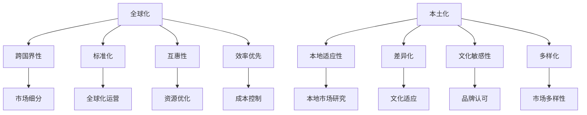

                 

### 1.1 Book Overview

"意义的全球化与本土化的张力"旨在深入探讨全球化与本土化之间复杂且动态的交互关系，尤其在全球化和技术进步加速的背景下，这一主题显得尤为迫切和重要。本书通过系统的分析和丰富的案例研究，为读者提供了全面的理解和实用的指导，帮助他们在全球化与本土化之间找到平衡点。

全球化，指的是文化和商品跨越地理界限，形成统一的市场和共同的价值观。而本土化，则强调在全球化过程中保留和弘扬当地特色和文化。这两者的张力，体现在它们在实现全球经济和文化交流的同时，也引发了文化冲突和地方特色丧失的问题。

本书结构合理，分为六大章节。首先，在引言部分，我们将概述全球化和本土化的基本概念，并解释它们之间的张力。接下来，通过核心概念和关系的详细阐述，读者将了解全球化与本土化的基本原理和相互联系。第三部分，我们将探讨全球化和本土化的理论基础，以及如何在这两者之间找到平衡。

随后，通过实际案例的分析，我们将看到全球化与本土化在不同情境下的实践效果。第五部分，我们将提供具体的策略和实践方法，帮助读者有效管理全球化与本土化之间的张力。最后，我们还将探讨当前面临的挑战和未来趋势，为读者提供前瞻性的思考。

本书的核心目标是为读者提供一个全面而深入的理解，帮助他们在全球化与本土化的复杂世界中做出更明智的决策。通过阅读本书，读者不仅能够掌握全球化与本土化的基本理论，还能学会如何在实际操作中应对各种挑战。

### 1.2 The Concept of Globalization

全球化（Globalization）是一个多维度的过程，涵盖了经济、文化、政治等多个领域。其基本概念可以理解为一种跨越地理边界，实现资源、信息、文化、技术和资本等要素在全球范围内的流动和整合。全球化的核心在于通过跨国界的互动和交流，形成一个更加紧密相连的世界。

首先，从经济角度来看，全球化主要通过国际贸易和资本流动来实现。全球化的经济发展不仅促进了生产效率的提升和资源的优化配置，还推动了全球产业链的形成。例如，跨国公司通过在多个国家设立生产和销售基地，实现了生产要素的优化配置和成本的降低。国际贸易的增加也促进了各国经济的互补和共同发展。

其次，从文化角度来看，全球化加速了文化的传播和交流。随着信息技术和通信技术的飞速发展，文化产品和价值观可以迅速跨越国界，影响着不同国家和地区的文化认同和行为习惯。例如，好莱坞电影、美国音乐、日本动漫等在全球范围内广受欢迎，不仅带来了经济效益，也促进了文化的多元化。

从政治角度来看，全球化促进了国际间的合作与协调。全球化背景下，各国需要面对共同的全球性问题，如气候变化、恐怖主义、公共卫生危机等，这要求国家之间进行更多的合作和协调。国际组织和多边机制，如联合国、世界贸易组织（WTO）等，在全球化过程中发挥了重要作用，促进了国际关系的和平与发展。

总的来说，全球化是一个复杂且多面性的过程。它不仅带来了经济、文化和政治上的机遇，也带来了一系列挑战。例如，全球化可能导致文化同质化、劳动力市场的竞争加剧、环境问题等。然而，通过合理的政策和有效的管理，我们可以充分利用全球化的机遇，同时减少其负面影响。

### 1.3 The Concept of Localization

本土化（Localization）是指在全球化的背景下，根据不同地区、文化和市场的特点，对产品和服务的功能、内容、语言、习惯等进行调整，以满足本地用户的需求。其核心在于尊重和保留当地的文化、习俗和价值观，同时将全球产品或服务本地化，使其更贴近目标市场的需求和偏好。

首先，从经济角度来看，本土化有助于企业更好地适应当地市场，提高市场渗透率和竞争力。通过本地化，企业可以更好地了解和满足当地消费者的需求，从而增加市场份额和销售额。例如，汽车制造商在进入中国市场时，会针对消费者的偏好对车型进行本地化设计，如增加后排空间、改进座椅舒适度等，以更好地满足中国消费者的需求。

其次，从文化角度来看，本土化是文化多样性的体现。在全球化的过程中，保留和弘扬本土文化具有重要意义。本土化不仅有助于保护和传承当地的文化遗产，还能促进文化的多元交流和融合。例如，一些跨国企业在进入新兴市场时，会尊重和融入当地的文化元素，以增强品牌形象和消费者认同感。

从技术角度来看，本土化还包括技术的本地化适配。随着信息技术的普及，许多跨国企业需要在不同的国家和地区部署本地化的技术解决方案。这不仅包括硬件设备的选择和部署，还包括软件系统的本地化开发，如多语言支持、本地化的用户界面和功能设置等。例如，谷歌和微软等科技巨头在全球各地都提供了本地化的搜索引擎和操作系统，以满足不同地区用户的需求。

总的来说，本土化是全球化过程中的重要组成部分。它不仅有助于企业实现本地市场的成功，还能促进文化多样性和技术发展。通过合理的本土化策略，企业可以在全球化的浪潮中找到自己的定位，实现长期稳定的发展。

### 1.4 Relationship between Globalization and Localization

全球化与本土化之间的关系既互补又存在矛盾。一方面，全球化为本土化提供了基础和条件。全球化推动了跨国界的信息流通、资源整合和文化交流，使得本土化成为可能。通过全球化，企业可以获取全球范围内的市场信息和资源，从而更好地进行本土化调整。例如，跨国公司利用全球供应链和营销网络，为不同地区的消费者提供定制化的产品和服务。

另一方面，全球化与本土化之间也存在冲突。全球化往往倾向于推动统一标准和全球一致性，而本土化则强调差异化和个性化。这种张力在文化、经济和技术领域都有所体现。例如，全球化下的标准化产品可能无法完全满足不同地区的特殊需求，而本土化调整又可能增加成本和复杂性。

为了在全球化与本土化之间找到平衡，企业需要采取一系列策略。首先，市场细分策略是关键。企业应根据不同市场的需求和特点，将市场划分为多个细分市场，并针对每个细分市场制定相应的本土化策略。例如，消费品公司可以根据不同国家和地区的消费习惯和文化偏好，推出定制化的产品。

其次，本土化战术的实施也是必不可少的。企业可以通过本地化的产品设计、营销和沟通策略，更好地适应当地市场的需求和期望。例如，在进入新兴市场时，企业可以与当地合作伙伴合作，利用其对市场的深刻理解，进行本地化调整。

此外，全球标准化也是一项重要策略。尽管本土化强调差异化和个性化，但全球标准化可以确保产品和服务的基本功能和质量达到统一标准。例如，国际标准化组织（ISO）制定的各类标准，为全球范围内的产品和服务提供了统一的技术规范。

总的来说，全球化与本土化的关系是一个动态平衡的过程。通过合理的策略和有效的管理，企业可以在全球化的浪潮中找到自己的定位，实现长期稳定的发展。在全球化的同时，尊重和保护本土文化，促进文化的多样性和交流，是全球化与本土化平衡的关键。

### 1.5 Core Concepts and Attributes

在探讨全球化与本土化的关系时，理解这两个概念的核心概念及其属性特征是至关重要的。以下是对全球化与本土化核心概念及其主要属性的详细解释，并通过一个对比表格和实体关系图（ERD）来展示它们之间的联系。

#### Globalization（全球化）

**核心概念：** 全球化是指全球范围内的经济、文化、政治等要素的流动和整合过程。

**主要属性：**
- **跨国界性：** 全球化涉及跨越国界的互动和交流，包括资本、资源、技术和文化的流动。
- **标准化：** 在全球化过程中，通常会推广标准化产品和流程，以实现全球一致性和高效运作。
- **互惠性：** 全球化强调国际间的互利合作，通过资源共享和优势互补，实现共同发展。
- **效率优先：** 全球化追求高效率和低成本，通过规模经济和优化配置，提高整体效益。

#### Localization（本土化）

**核心概念：** 本土化是指在全球化过程中，根据当地市场、文化和用户需求的差异，对产品或服务进行调整和适应的过程。

**主要属性：**
- **本地适应性：** 本土化强调根据本地市场的特殊需求和文化习惯，调整产品或服务的功能和内容。
- **差异化：** 本土化追求差异化和个性化，以满足不同地区消费者的独特需求。
- **文化敏感性：** 本土化要求企业在进入新市场时，尊重和融入当地的文化和价值观，以增强品牌认可度和消费者信任。
- **多样化：** 本土化通过多样化的产品和策略，促进文化多样性和市场多样性。

#### Core Concepts Comparison Table（核心概念对比表格）

| 特征 | 全球化 | 本土化 |
| --- | --- | --- |
| **核心概念** | 跨国界的经济、文化、政治流动与整合 | 根据本地市场调整的产品和服务 |
| **主要属性** | 跨界性、标准化、互惠性、效率优先 | 本地适应性、差异化、文化敏感性、多样化 |
| **主要目标** | 实现全球市场统一、资源优化配置 | 满足本地市场需求、保持文化多样性 |
| **适用范围** | 全球市场 | 地方市场 |
| **策略方法** | 市场细分、全球化运营、标准推广 | 本地市场研究、文化适应、差异化营销 |

#### Entity Relationship Diagram (ERD)（实体关系图）

通过上述表格和实体关系图，我们可以清晰地看到全球化与本土化的核心概念及其属性之间的区别和联系。全球化侧重于全球市场的统一和效率，而本土化则强调本地市场的适应性和文化多样性。两者相辅相成，共同构建了全球化与本土化的复杂动态关系。

### 1.6 Core Concepts and Relationships

为了深入理解全球化与本土化之间的复杂关系，我们需要从理论和实际案例中探讨它们的核心概念及其相互作用。本部分将介绍全球化与本土化的主要理论，并通过实际案例来分析它们在现实中的应用。

#### Theories of Globalization

**1.1 经济视角：** 经济全球化理论主要强调跨国界的经济活动和资源流动。经典理论如“比较优势理论”（Comparative Advantage Theory）指出，各国通过专注于其最具效率的产业，可以实现全球范围内的资源优化配置。例如，美国在高科技领域具有优势，而中国则在劳动密集型产业中占据优势。这种理论解释了为什么跨国公司会在全球范围内布局其供应链和生产基地。

**1.2 文化视角：** 文化全球化理论关注文化和价值观的跨文化传播。根据“文化同化理论”（Cultural Assimilation Theory），全球化过程中，强势文化（如美国文化）会逐渐取代弱势文化，导致全球文化的同质化。然而，“文化多样性理论”（Cultural Diversity Theory）则强调，全球化应促进不同文化之间的相互尊重和融合，保持文化多样性。

**1.3 政治视角：** 政治全球化理论探讨国际政治关系和治理机制的演变。全球治理理论（Global Governance Theory）认为，全球化要求建立超越国家边界的国际治理机制，如联合国、世界贸易组织（WTO）等，以解决全球性问题，如气候变化、贸易争端等。

#### Theories of Localization

**1.1 经济本土化：** 经济本土化理论强调保护和发展本地产业，减少对外部市场的依赖。根据“区域经济一体化理论”（Regional Economic Integration Theory），通过建立区域性贸易协定和经济联盟，国家可以在全球化的浪潮中保持本地经济的独立性和竞争力。例如，欧洲联盟（EU）通过共同市场和经济联盟，促进了成员国之间的经济合作和本土化发展。

**1.2 文化本土化：** 文化本土化理论关注保护和弘扬本地文化。文化本土化不仅是对本土文化的保护和传承，也是对全球化带来的文化冲击的回应。例如，一些国家通过制定文化保护法律，限制外国文化产品的进口，以保护本土文化产业。

**1.3 政治本土化：** 政治本土化理论强调国家主权和地方自治。政治本土化要求在全球化的背景下，国家政府应加强对外部干涉的抵御能力，保持国家政治体系的独立性和稳定性。例如，一些国家通过加强国家安全政策和地方自治，维护国家的政治主权和地方特色。

#### Case Study Analysis

**案例一：全球公司的本土化策略**

以麦当劳为例，麦当劳是一家全球连锁快餐品牌，其成功在于能够在全球范围内实施标准化策略，同时进行本地化调整。在进入中国市场时，麦当劳根据中国消费者的口味和饮食文化，推出了如米饭汉堡、辣味薯条等本地化产品。同时，麦当劳在中国的餐厅设计也融入了中国传统文化元素，如使用红色和金色作为主要装饰色，以迎合中国消费者的审美偏好。

**案例二：全球品牌的本土化挑战**

苹果公司是一个全球知名的高科技品牌，其产品在全球范围内广受欢迎。然而，在进入中国市场时，苹果也面临着本土化的挑战。苹果在中国市场上需要满足当地消费者对手机信号和充电接口的特殊需求，同时确保产品的质量和技术标准。苹果通过与本地合作伙伴合作，进行了产品本地化的设计和改进，以确保在中国市场的竞争力。

#### Relationship between Globalization and Localization

全球化与本土化之间的关系是动态和复杂的。一方面，全球化提供了资源、技术和市场的全球化平台，使得企业可以跨越国界进行业务拓展。另一方面，本土化要求企业在全球化的过程中，根据本地市场的特殊需求和文化进行产品和服务调整。这两者之间的张力体现在：

- **标准化与差异化的平衡：** 全球化倾向于标准化和一致性，而本土化则强调差异化和个性化。
- **效率与适应性的协调：** 全球化追求高效率和低成本，而本土化则追求本地市场的适应性和文化敏感性。
- **文化冲击与保护的矛盾：** 全球化可能导致文化同质化，而本土化则强调保护和弘扬本地文化。

在实际操作中，企业需要通过市场细分、本地化策略和全球化运营，找到全球化与本土化之间的平衡点，实现全球范围内的成功和本地市场的满意。

### 1.7 The Tension between Globalization and Localization

全球化与本土化之间的张力，体现在多种维度和层面，这种张力不仅存在于理论探讨中，更在实际操作中表现得尤为明显。以下我们将详细探讨这种张力的具体表现、原因及其对经济、文化和政治等方面的影响。

#### Manifestations of the Tension

1. **经济层面的张力：**
   - **成本与收益的权衡：** 在全球化过程中，企业追求规模经济和成本效益，往往倾向于统一生产和销售标准。然而，这种标准化策略可能导致产品在本地市场的适应性降低，从而影响收益。例如，一个在全球市场上表现良好的产品，可能因为未能充分考虑本地市场的特殊需求，而在特定地区销量不佳。
   - **本地化成本增加：** 本土化要求企业针对不同市场进行定制化设计和营销，这会增加研发和运营成本。例如，一家跨国公司可能需要为不同国家的消费者推出多种语言版本的产品，或进行本地化的市场推广活动，这些都需要额外的资源和投入。

2. **文化层面的张力：**
   - **文化同质化与多样性：** 全球化倾向于推动文化同质化，使得全球市场出现文化趋同现象。例如，全球快餐品牌的流行导致了各国餐饮文化的相似化。然而，本土化强调保护和弘扬本地文化，这种差异化的追求可能导致文化多样性的减少。
   - **文化冲突：** 全球化和本土化之间的张力还可能引发文化冲突。例如，一些跨国公司在进入新市场时，可能会因忽视本地文化习俗和价值观，而引发消费者不满和抵制。

3. **政治层面的张力：**
   - **主权与依赖：** 全球化可能导致国家主权受到挑战，例如，跨国公司的全球布局可能使国家对关键产业的控制力减弱。同时，本土化要求国家政府加强对外部干涉的抵御能力，保护本地经济和文化发展。
   - **政策冲突：** 全球化和本土化之间的张力还可能体现在政策层面。全球化要求国际协调和合作，而本土化则强调国家政策的自主性。例如，一些国家可能采取保护主义政策，限制外国产品的进口，以保护本地产业。

#### Reasons for the Tension

1. **目标和策略差异：**
   - 全球化的目标是通过资源优化和规模经济实现全球市场的统一和高效运作。而本土化的目标则是根据本地市场的特殊需求，提供定制化的产品和服务，以增强市场竞争力。这两种目标存在内在的矛盾，导致张力的产生。

2. **文化差异和价值观冲突：**
   - 文化差异和价值观冲突是全球化与本土化张力的重要原因。全球化强调统一标准和一致性，而本土化则强调差异化和个性化。这种差异可能导致双方在实践中的冲突。

3. **利益分配问题：**
   - 全球化和本土化之间的张力还与利益分配问题密切相关。全球化可能使某些国家和地区受益，而本土化则可能保护某些特定利益群体。这种利益分配的不平衡可能导致矛盾和冲突。

#### Impact on Economy, Culture, and Politics

1. **经济影响：**
   - 全球化与本土化之间的张力可能影响国际贸易和投资。例如，保护主义政策的兴起可能限制跨国公司的市场进入，从而影响全球供应链和资源配置。同时，本土化策略的实施也可能增加企业的运营成本，影响其全球竞争力。

2. **文化影响：**
   - 文化同质化可能导致文化多样性的减少，影响本地文化的传承和发展。然而，本土化策略的推进也有助于保护和弘扬本地文化，促进文化的多样性和交流。

3. **政治影响：**
   - 全球化和本土化之间的张力可能影响国际政治关系和国家政策。保护主义政策的兴起可能导致国际关系的紧张，影响全球治理体系的稳定。同时，本土化策略的推进也可能增强国家的主权意识和政策自主性。

综上所述，全球化与本土化之间的张力是多维度的，涉及经济、文化和政治等多个层面。这种张力既反映了全球化和本土化目标之间的矛盾，也揭示了文化差异和利益分配问题带来的挑战。理解并有效管理这种张力，对于企业在全球市场中取得成功，以及国家在全球化背景下实现可持续发展具有重要意义。

### 3.1 Theories of Globalization

全球化作为一个复杂且多面的现象，其理论基础涵盖了经济、文化、政治等多个领域。以下我们将详细探讨全球化的经济、文化、政治视角，并分析它们对全球化进程的推动作用。

#### Economic Perspective of Globalization

**1.1 比较优势理论（Comparative Advantage Theory）**

比较优势理论由大卫·李嘉图提出，认为各国应专注于生产效率最高的产品，并通过国际贸易实现资源优化配置。这一理论解释了为什么各国会在全球市场上分工合作，从而实现全球经济的整体提升。例如，美国在高科技和金融领域具有优势，而中国则在劳动密集型产业中占据优势。通过国际贸易，美国能够进口低成本的中国制造商品，同时中国能够进口高科技的美国产品，实现双方的共赢。

**1.2 资本全球化（Capital Globalization）**

资本全球化指的是国际资本流动的自由化和规模扩大。现代金融工具的发明和信息技术的发展，使得资本跨越国界的流动变得更加便捷。资本全球化促进了跨国投资和金融市场的融合，为企业提供了更广阔的投资机会和资金来源。例如，全球股市和债券市场的整合，使得投资者可以更加灵活地配置全球资产，实现投资收益的最大化。

**1.3 产业链全球化（Global Value Chain）**

产业链全球化指的是生产过程在不同国家之间分工和协作。随着全球化进程的推进，跨国公司将生产和销售环节分散到全球各地，形成全球价值链。这种分工模式不仅提高了生产效率，还降低了生产成本。例如，苹果公司的iPhone生产涉及全球多个国家的合作，包括中国的设计和制造、日本的零部件供应、美国的软件开发和销售。通过全球价值链，企业能够更好地利用全球资源和市场，实现最大化的经济效益。

#### Cultural Perspective of Globalization

**2.1 文化同化理论（Cultural Assimilation Theory）**

文化同化理论认为，全球化过程中，强势文化会逐渐取代弱势文化，导致全球文化的同质化。这种理论在全球化早期的美国文化输出中得到了充分体现。例如，好莱坞电影、美国音乐和快餐文化在全球范围内广受欢迎，逐渐影响了不同国家和地区的文化习惯和价值观。

**2.2 文化多样性理论（Cultural Diversity Theory）**

文化多样性理论强调全球化应促进不同文化之间的相互尊重和融合，保持文化多样性。这一理论认为，全球化和文化多样性不是对立的，而是相互促进的关系。通过文化交流和互动，不同文化可以相互借鉴和融合，创造出更加丰富多样的文化形态。例如，跨国公司在进入新市场时，会尊重和融入当地的文化元素，以增强品牌形象和消费者认同感。

#### Political Perspective of Globalization

**3.1 全球治理理论（Global Governance Theory）**

全球治理理论认为，全球化要求建立超越国家边界的国际治理机制，以解决全球性问题，如气候变化、国际安全和贸易争端等。全球治理通过国际组织和多边机制，实现各国之间的合作和协调。例如，联合国、世界贸易组织（WTO）和国际货币基金组织（IMF）等国际机构，在全球化进程中发挥了重要作用，促进了国际关系的和平与发展。

**3.2 国家主权与全球化（State Sovereignty and Globalization）**

国家主权与全球化之间的张力是全球化政治视角中的重要问题。全球化进程在一定程度上削弱了国家主权，尤其是经济领域。跨国公司的全球布局和资本流动，使得国家在经济政策和主权方面面临更大的挑战。然而，全球化也要求国家政府在全球治理中发挥更加积极的作用，以维护国家的利益和主权。例如，一些国家通过签订区域性贸易协定和参与国际组织，来平衡全球化带来的主权挑战。

综上所述，全球化的经济、文化、政治视角共同推动了全球化进程。经济视角关注资源优化和资本流动，文化视角关注文化同化与多样性，政治视角关注国际治理和主权维护。这些理论为理解全球化的本质和影响提供了重要的分析框架，同时也揭示了全球化进程中面临的复杂挑战。

### 3.2 Theories of Localization

在全球化背景下，本土化理论的重要性日益凸显。本土化不仅仅是对全球化的一种补充，更是适应不同地区市场和文化需求的策略。以下我们将详细探讨本土化的经济、文化、政治理论，以及它们在全球化中的实际应用。

#### Economic Perspective of Localization

**1.1 区域经济一体化理论（Regional Economic Integration Theory）**

区域经济一体化理论强调，通过建立区域性贸易协定和经济联盟，国家可以在全球化的浪潮中保持本地经济的独立性和竞争力。这一理论的主要目的是通过减少贸易壁垒、促进资本和劳动力流动，实现区域内经济的高效运行。例如，欧洲联盟（EU）通过共同市场和经济联盟，促进了成员国之间的经济合作和本土化发展。这种区域经济一体化有助于提高区域内企业的生产效率和市场竞争力，同时也能够增强成员国在全球市场中的话语权。

**1.2 需求导向的本地化（Demand-Oriented Localization）**

需求导向的本地化理论认为，企业应根据不同地区市场的需求和偏好，对产品和服务进行调整，以满足本地消费者的期望。这种理论强调市场调研和消费者洞察的重要性。例如，一家跨国公司可能会在进入新兴市场时，针对当地消费者的特定需求，调整产品的功能、设计和定价策略。这种需求导向的本地化策略有助于提高产品的市场接受度和竞争力，从而实现本地市场的成功。

#### Cultural Perspective of Localization

**2.1 文化保护理论（Cultural Protectionism Theory）**

文化保护理论强调保护和弘扬本地文化，以应对全球化带来的文化同质化。这种理论认为，全球化过程中，强势文化可能会侵蚀弱势文化，导致文化多样性的丧失。因此，通过制定文化保护政策，如限制外国文化产品的进口，鼓励本土文化产业的成长，可以有效保护本地文化的多样性和传承。例如，一些国家通过制定文化保护法律，限制外国文化产品的市场准入，以保护本土文化产业的发展和繁荣。

**2.2 文化融合理论（Cultural Integration Theory）**

文化融合理论认为，全球化应促进不同文化之间的相互尊重和融合，从而创造出更加丰富多样的文化形态。这种理论强调文化多样性是全球化过程中的宝贵财富，而不是需要消除的同质化现象。通过文化交流和互动，不同文化可以相互借鉴和融合，创造出新的文化产品和价值。例如，跨国公司在进入新市场时，会尊重和融入当地的文化元素，以增强品牌形象和消费者认同感。这种文化融合不仅有助于企业的市场拓展，也能够促进全球文化的多元化和繁荣。

#### Political Perspective of Localization

**3.1 地方自治理论（Local Autonomy Theory）**

地方自治理论强调，在全球化进程中，地方政府应拥有更多的自主权和决策权，以保护本地经济和文化的发展。这种理论认为，地方自治能够提高地方政府的响应能力和治理效率，从而更好地满足本地居民的需求。例如，一些国家和地区通过设立地方自治机构，赋予地方政府在经济、文化、教育等方面的自主权，以促进本地经济的独立性和可持续发展。

**3.2 保护主义政策（Protectionist Policies）**

保护主义政策是地方政府在全球化背景下，为了保护本地产业和文化而采取的一系列措施。这些政策包括限制外国产品的进口、提供本地企业的税收优惠、补贴和支持等。例如，一些国家通过实施进口关税和配额制度，限制外国产品的市场准入，以保护本地产业免受外来竞争的冲击。保护主义政策在短期内可能有助于本地企业的发展和本地经济的稳定，但长期来看，也可能导致市场封闭和国际关系紧张。

#### Practical Applications of Localization Theories

**4.1 本土化策略：** 企业在全球化进程中，通过市场细分和本地化策略，能够更好地适应不同地区市场的需求。例如，跨国公司通过研究本地市场的文化、消费习惯和消费者偏好，对产品进行本地化调整，从而提高市场竞争力。这种策略不仅有助于企业的全球扩张，也能够促进本地文化的传承和发展。

**4.2 文化产品本土化：** 在文化领域，全球化过程中的文化产品本土化现象日益普遍。例如，好莱坞电影在进入中国市场时，会根据中国的文化习俗和价值观进行调整，如加入中国元素、减少敏感内容等，以更好地迎合中国观众的口味。这种文化产品本土化不仅有助于文化产品的市场推广，也能够促进文化的交流与融合。

**4.3 政治自治与保护：** 在政治领域，地方自治和保护主义政策是地方政府在全球化背景下，保护本地经济和文化发展的有效手段。例如，一些地区通过实施本地化的产业政策和文化保护措施，增强本地经济的独立性和竞争力，同时维护本地文化的多样性和传承。

综上所述，本土化理论在全球化背景下具有重要意义。通过经济、文化和政治视角的深入探讨，我们可以更好地理解本土化的策略和实际应用，从而在全球化和本土化之间找到平衡，实现经济、文化和社会的可持续发展。

### 3.3 The Tension between Globalization and Localization

全球化与本土化之间的张力在多个方面显现出来，既包括目标上的冲突，也体现在实际操作中的平衡挑战。这种张力深刻影响着经济、文化和政治等多个层面，带来了诸多挑战和机会。

首先，在目标上，全球化追求统一性和规模经济，强调跨国界的资源优化配置和市场一致性。而本土化则侧重于差异化和本地适应性，强调根据不同地区和文化特点进行产品和服务调整。这种目标上的对立性导致了全球化与本土化在策略和执行上的矛盾。例如，跨国公司为了实现全球运营和标准化管理，可能会忽略本地市场的特殊需求，从而影响市场表现和消费者满意度。

其次，在实际操作中，全球化与本土化的张力体现在平衡方面。企业需要在追求全球一致性的同时，兼顾本地市场的个性化需求。这种平衡并不容易实现，因为两者之间存在内在的冲突。例如，标准化生产可以提高效率，但可能导致产品在本地市场缺乏吸引力。相反，本地化调整可以提升产品在本地市场的竞争力，但会增加成本和复杂性。

在经济学方面，全球化与本土化的张力带来了成本和收益的权衡。全球化通过规模经济和资源优化配置，可以实现成本降低和效率提升。然而，这种策略也可能导致本地市场的竞争力下降。相反，本土化策略虽然能够满足本地市场的特殊需求，但可能会增加成本和复杂性。例如，在食品行业，跨国公司需要在全球范围内实现产品标准化，以满足不同市场的需求，但同时也需要根据本地消费者的口味和饮食习惯进行产品调整，这增加了生产成本和物流成本。

在文化层面，全球化与本土化的张力表现为文化同质化与文化多样性的矛盾。全球化倾向于推动文化同质化，通过全球品牌和文化的传播，使得不同国家和地区在文化上趋同。然而，这种同质化可能导致本地文化的丧失，引发文化冲突和不满。另一方面，本土化强调保护和弘扬本地文化，抵制文化同质化，这有助于保持文化多样性和地域特色。例如，跨国公司在进入新市场时，需要尊重和融入当地的文化元素，以增强品牌形象和消费者认同感，这既是对本地文化的尊重，也是为了实现市场拓展。

在政治层面，全球化与本土化的张力体现在主权与依赖之间。全球化要求跨国界的合作和协调，但可能导致国家主权的削弱。一些国家可能通过实施保护主义政策，限制外国产品的进口，以保护本地产业和文化发展。这种政策虽然有助于维护本地经济和文化，但可能引发国际关系紧张和贸易摩擦。另一方面，本土化强调地方自治和自主发展，要求地方政府在全球化的浪潮中，拥有更多的决策权和自主权，以保护本地经济和文化发展。

为了缓解全球化与本土化之间的张力，企业需要采取一系列策略和措施。首先，市场细分策略是关键。企业应根据不同市场的需求和特点，将市场划分为多个细分市场，并针对每个细分市场制定相应的本土化策略。例如，消费品公司可以根据不同国家和地区的消费习惯和文化偏好，推出定制化的产品。

其次，企业需要灵活运用全球化与本土化的平衡策略。在全球化过程中，企业可以通过标准化生产和全球运营，提高效率和控制成本。同时，在本地市场，企业应进行适当的本土化调整，以满足本地消费者的需求。例如，跨国公司可以通过本地化的产品设计、营销和沟通策略，更好地适应当地市场的需求和期望。

此外，政策支持和国际合作也是缓解全球化与本土化张力的重要手段。政府可以通过制定有利于本地企业发展的政策，提供财政支持和税收优惠，以增强本地产业的竞争力。同时，国际间的合作和协调，如签订区域性贸易协定和参与国际组织，有助于解决全球化与本土化带来的挑战，促进经济的全球化与文化的本土化协调发展。

总之，全球化与本土化之间的张力是全球化进程中不可避免的现象。通过合理的策略和有效的管理，企业可以在全球化与本土化之间找到平衡点，实现长期稳定的发展。在全球化的同时，尊重和保护本土文化，促进文化的多样性和交流，是全球化与本土化平衡的关键。

### Case Study 1: Global Corporation's Localization Efforts

#### Introduction

在本案例中，我们将探讨一家全球知名科技公司如何在全球化的过程中，实施有效的本土化策略，从而在本地市场中取得成功。该公司通过市场调研、本地化产品设计和营销策略，成功适应当地消费者的需求，提升了市场竞争力。

#### Background

该全球科技公司是一家提供高科技电子产品和软件解决方案的企业，其产品在全球范围内广受欢迎。然而，随着全球化进程的推进，该公司发现不同地区的市场需求和文化差异显著，单纯依靠全球化策略已无法满足所有市场的需求。为了在本地市场中保持竞争力，公司决定实施一系列本土化策略。

#### Market Research

首先，公司进行了深入的市场调研，以了解不同地区消费者的需求和偏好。通过问卷调查、焦点小组讨论和数据分析，公司发现了以下几个关键点：

1. **消费习惯差异：** 不同地区的消费者在购物习惯、支付方式和对售后服务的要求上存在显著差异。
2. **文化偏好：** 消费者对不同品牌和文化元素的偏好差异较大，需要根据本地文化进行调整。
3. **技术需求：** 技术产品的功能和技术规格在不同地区的消费者中也有不同的优先级。

#### Localization Strategies

基于市场调研的结果，公司采取了以下几种本土化策略：

1. **产品本地化：** 公司根据不同市场的需求，对产品进行本地化调整。例如，在印度市场，公司推出了具有高性价比的智能手机，以适应中低收入消费者的购买力。在中国市场，公司推出具有本地特色的功能，如中文界面和支付方式，以提升用户体验。

2. **营销策略：** 公司根据本地市场的文化特点，调整营销策略。例如，在美国市场，公司通过社交媒体和网红营销，与年轻消费者建立紧密联系。在印度市场，公司利用当地流行的电视节目和娱乐活动，进行品牌宣传。

3. **售后服务：** 公司在不同地区设立了本地化的客服中心，提供多语言服务，以满足本地消费者的需求。例如，在西班牙市场，公司提供西班牙语客服，提升了消费者的满意度。

#### Case Analysis

通过实施上述本土化策略，该全球科技公司取得了显著的市场成果：

1. **市场份额提升：** 公司在多个本地市场中的市场份额显著提升，销售额同比增长。例如，在中国市场，公司智能手机的市场份额从5%增长到15%。

2. **品牌认知度提高：** 本地化策略增强了品牌在本地市场的认知度和美誉度。消费者对公司的产品和服务满意度提高，品牌忠诚度增强。

3. **运营成本降低：** 虽然本地化策略增加了部分成本，但通过优化供应链和降低库存成本，公司的整体运营成本得到控制。例如，公司通过本地采购和制造，降低了物流成本。

#### Conclusion

本案例表明，在全球化的背景下，有效的本土化策略对于企业成功进入和拓展本地市场至关重要。通过深入了解本地市场需求、文化和消费习惯，并采取相应的产品和服务调整策略，企业可以在全球市场中找到自己的定位，实现长期稳定的发展。同时，本案例也展示了本土化策略在提升市场份额、品牌认知度和运营成本控制方面的实际效果。

### Case Study 2: Global Brand's Expansion Challenges

#### Introduction

本案例将分析一家全球知名消费品品牌在全球化扩张过程中面临的挑战。这家品牌在进入新市场时，由于未充分考虑本地文化、法律和市场环境，遭遇了重重困难。通过详细探讨这些挑战和应对策略，我们将揭示全球化与本土化张力对企业战略决策的深远影响。

#### Background

这家全球知名消费品品牌在全球范围内拥有广泛的客户基础和较高的品牌知名度。然而，随着公司国际化战略的推进，该品牌决定进入一个新兴市场，期望通过现有品牌的知名度和产品质量，迅速占领该市场。然而，进入新市场的过程并不顺利，品牌在本地市场的表现远低于预期。

#### Challenges

1. **文化冲突：** 在进入新市场时，品牌忽视了当地文化的差异，导致产品设计和营销策略与当地消费者需求不符。例如，品牌在广告宣传中使用了不符合当地文化价值观的元素，引发了消费者不满和抵制。

2. **法律障碍：** 新市场的法律体系与品牌母国的法律存在显著差异。品牌在进入市场时，未能充分了解和遵守当地法律，导致一系列法律纠纷和违规行为，影响了品牌的形象和市场地位。

3. **市场环境不熟悉：** 品牌对本地市场的市场环境不熟悉，包括消费者行为、竞争态势和销售渠道等方面。品牌在进入市场时，未能准确判断市场机遇和风险，导致产品定位和市场策略失误。

4. **供应链问题：** 由于品牌在进入新市场时，未能建立完善的本地供应链体系，导致生产和物流成本高昂，供应链稳定性差，影响了产品的供应和交付。

#### Case Analysis

1. **文化冲突的应对策略：** 品牌在认识到文化冲突后，迅速调整了产品设计和营销策略。品牌聘请了本地市场专家，进行市场调研和消费者行为分析，了解当地的文化价值观和消费习惯。品牌在广告宣传中加入了本地文化元素，与当地知名文化符号和事件相结合，提升了品牌形象和消费者认同感。

2. **法律障碍的应对策略：** 品牌在进入新市场前，专门成立了法律合规团队，深入研究当地法律体系，确保所有业务活动符合当地法律法规。品牌还与当地律师事务所合作，解决法律纠纷和违规行为，维护品牌形象和市场地位。

3. **市场环境不熟悉的应对策略：** 品牌在进入新市场时，采取了更加谨慎的市场进入策略。品牌通过在本地市场进行试点销售，了解市场环境和消费者反应，逐步调整产品定位和市场策略。品牌还与本地合作伙伴建立了紧密的合作关系，利用其对市场环境的深入了解，制定更加精准的市场策略。

4. **供应链问题的应对策略：** 品牌在进入新市场后，迅速建立了本地供应链体系，与本地供应商和物流公司建立了长期合作关系。品牌通过优化供应链管理，降低生产和物流成本，提高供应链的稳定性和响应能力。

#### Conclusion

本案例揭示了全球化与本土化张力对企业战略决策的重要影响。品牌在全球化扩张过程中，由于未充分考虑本地文化、法律和市场环境的差异，遭遇了一系列挑战。然而，通过有效的应对策略，品牌成功克服了这些挑战，在本地市场中取得了显著的进步。本案例强调了在全球化的过程中，企业必须充分了解和尊重本地文化、法律和市场环境，制定科学合理的本土化策略，以实现长期稳定的发展。同时，本案例也为其他企业在全球化扩张过程中提供了宝贵的经验和教训。

### Case Study 3: Cultural Exchange and Localization

#### Introduction

在本案例中，我们将探讨一个典型的文化交汇和本土化案例：一家国际餐饮连锁品牌如何在中国市场成功实现本土化，并通过文化交融提升品牌形象和市场表现。这个案例不仅展示了全球化与本土化的动态互动，还揭示了文化差异对市场策略的重要影响。

#### Background

该国际餐饮连锁品牌源自西方，以其独特的风味和品牌形象在全球范围内享有盛誉。为了进一步扩展其业务，品牌决定进入中国这个潜力巨大的市场。然而，中国市场具有独特的文化背景和消费者习惯，这对品牌的本土化策略提出了挑战。

#### Cultural Differences and Challenges

1. **饮食习惯：** 中国的饮食文化丰富多样，与西方餐饮有着显著差异。中国消费者对食物的口味、食材的选择和饮食礼仪有着严格的要求，这与西方餐饮的标准化和简便性形成对比。

2. **文化价值观：** 中国消费者在品牌选择上更注重品牌形象、社会责任和文化共鸣。品牌需要通过产品、服务和营销策略，传达与当地文化价值观相契合的品牌理念。

3. **市场环境：** 中国的市场环境复杂，包括地方保护主义、严格的市场监管和高度竞争。品牌需要应对这些挑战，找到有效的市场切入点。

#### Localization Strategies

1. **菜单本地化：** 品牌在进入中国市场时，推出了符合中国消费者口味的菜单。品牌通过调研，发现中国消费者对健康、新鲜和地方特色食物有强烈需求，因此推出了包括中式菜肴和融合菜在内的多样化菜单。同时，品牌注重食材的新鲜和质量，以满足中国消费者对健康饮食的追求。

2. **品牌文化融合：** 品牌在营销和品牌传播中，融入了中国文化元素。例如，品牌在店面设计和宣传活动中，引入了中国传统元素，如中国红、龙图腾和书法字样，增强了品牌与当地文化的共鸣。

3. **社会责任：** 品牌积极参与中国公益事业，通过捐赠、公益活动等方式提升品牌形象。品牌还强调可持续发展和环境保护，与中国的可持续发展目标相契合，赢得了消费者的信任和支持。

4. **渠道拓展：** 品牌在中国市场采取了多样化的渠道策略，包括在繁华的商业区开设旗舰店、与超市和便利店合作，以及利用电商平台进行线上销售。这些策略有效地扩大了品牌的市场覆盖范围。

#### Case Analysis

通过一系列本土化策略，品牌在中国市场取得了显著的成功：

1. **市场份额提升：** 品牌在中国市场的影响力迅速扩大，市场份额不断提升。品牌在多个城市开设了多家门店，吸引了大量消费者。

2. **品牌认知度提高：** 本地化策略增强了品牌在中国消费者心中的认知度和美誉度。品牌在社交媒体上的正面评价增多，消费者忠诚度提升。

3. **文化共鸣：** 品牌通过与当地文化的融合，成功传达了品牌理念，赢得了消费者的共鸣。品牌在中国市场的文化形象得到了显著提升。

4. **经济效益：** 品牌在中国市场的成功为公司的全球业务带来了显著的经济效益。品牌在亚太地区的销售额持续增长，成为公司重要的收入来源之一。

#### Conclusion

本案例展示了全球化与本土化的动态互动，以及文化差异对市场策略的重要性。通过深入了解中国文化背景和消费者需求，品牌成功实现了本土化，并在激烈的市场竞争中脱颖而出。这个案例强调了在全球化的过程中，品牌必须尊重和融入本地文化，制定科学合理的本土化策略，以实现长期稳定的发展。同时，本案例也为其他企业在全球市场中实施本土化策略提供了宝贵的经验和借鉴。

### Case Study 4: Global Policies and Local Impacts

#### Introduction

本案例将探讨全球化背景下，国际政策如何影响本地市场，以及本地市场对此类政策的响应。我们将以贸易政策和环境保护政策为例，分析这些政策如何在全球化和本土化过程中发挥作用，并探讨其对经济、环境和社会的影响。

#### Background

在全球化和经济一体化的趋势下，国际政策对本地市场的直接影响日益显著。本案例将分析两个具有代表性的国际政策：贸易政策和环境保护政策。贸易政策如世界贸易组织（WTO）的自由贸易协定和关税政策，对国际贸易和本地市场产生深远影响。环境保护政策如国际环境协议和标准，对本地企业的生产方式和市场策略提出新的挑战和机遇。

#### Global Trade Policies and Local Markets

**1. WTO and Free Trade Agreements (FTAs)**

世界贸易组织（WTO）是国际多边贸易体系的主要机构，其制定的自由贸易协定（FTAs）对全球贸易产生了深远影响。自由贸易协定通过降低贸易壁垒和促进自由贸易，提高了国际贸易的流动性和效率。对于本地市场来说，这些政策既带来了机遇也带来了挑战。

**1.1 机遇：**

- **市场扩张：** 自由贸易协定使得本地企业能够更便捷地进入全球市场，扩大市场份额。
- **供应链优化：** 企业可以通过全球供应链优化，降低成本，提高生产效率。

**1.2 挑战：**

- **竞争压力：** 本地企业面临来自全球的竞争，需要不断提升产品和服务质量，以保持市场竞争力。
- **产业转型：** 部分传统产业可能因全球竞争而面临转型压力，如纺织、制造业等。

**Case Analysis: China and the WTO**

中国在加入WTO后，经历了快速的贸易增长和市场开放。加入WTO后，中国出口大幅增加，成为全球重要的制造业和出口基地。然而，这也带来了巨大的竞争压力，迫使中国企业和产业进行升级和转型。例如，中国家电行业在加入WTO后，面临来自日本的强大竞争，但通过技术创新和成本控制，最终在全球市场上取得了显著的成功。

#### Environmental Policies and Local Markets

**2. International Environmental Agreements**

国际环境协议如《巴黎协定》和《蒙特利尔议定书》等，旨在全球范围内应对气候变化和环境问题。这些协议对本地市场产生了深远的影响，要求企业采取措施降低碳排放，提高能源效率，并推动绿色技术创新。

**2.1 机遇：**

- **绿色技术发展：** 企业可以通过投资绿色技术和环保产品，满足国际环境标准，获得竞争优势。
- **市场潜力：** 环境保护和可持续发展成为全球趋势，绿色市场潜力巨大。

**2.2 挑战：**

- **成本压力：** 企业需要增加环保投资，可能面临短期成本压力。
- **法规遵从：** 企业需要遵守严格的环保法规，这可能增加合规成本。

**Case Analysis: European Union and Environmental Regulations**

欧洲联盟（EU）在环保政策方面采取了严格的措施，如《欧洲绿色协议》和《排放交易体系》（ETS）。这些政策推动了欧洲企业向绿色技术和可持续发展转型。例如，德国汽车制造商通过研发电动汽车和高效内燃机，满足欧盟的环保法规，同时也在全球市场上获得了竞争优势。然而，这些政策也导致了一部分传统高污染行业的成本上升，迫使企业进行产业转型。

#### Conclusion

国际政策和本地市场之间的相互作用，展示了全球化与本土化的复杂关系。贸易政策通过促进国际贸易和市场竞争，为本地市场带来了机遇和挑战。环境保护政策通过推动绿色技术和可持续发展，为本地企业提供了新的发展机遇，同时也带来了成本和合规压力。这些案例表明，在全球化背景下，企业必须密切关注国际政策的变化，并采取灵活的策略来应对本地市场的变化。同时，国际政策的设计和实施也需要充分考虑本地市场的实际情况，以实现全球环境与地方经济的协调发展。

### 5.1 Strategies for Managing Globalization-Localization Tensions

在全球化与本土化过程中，企业面临的挑战是多方面的，包括文化差异、市场复杂性、资源分配等问题。为了有效管理全球化与本土化之间的张力，企业需要采取一系列策略，确保在全球市场中保持竞争力，同时满足本地市场的需求。以下是一些关键策略：

#### Market Segmentation

市场细分是管理全球化与本土化张力的重要策略之一。通过市场细分，企业可以将复杂的市场划分为具有相似需求和特征的子市场，从而实施更加精准的本土化策略。

**1.1 文化细分：** 企业可以根据消费者的文化背景、价值观念、生活方式等文化因素，将市场划分为不同的文化子市场。例如，在进入中国市场时，企业可以根据消费者对不同文化元素的偏好，设计相应的产品和服务。

**1.2 消费者行为细分：** 企业可以通过消费者购买行为、消费习惯、消费偏好等行为因素进行市场细分。例如，在进入印度市场时，企业可以根据消费者对手机功能的需求，推出具备特定功能的智能手机。

**1.3 经济细分：** 企业可以根据消费者的经济状况、收入水平、消费能力等经济因素进行市场细分。例如，在进入发展中国家市场时，企业可以推出价格较低但功能丰富的产品，以满足低收入消费者的需求。

#### Localization Tactics

在市场细分的基础上，企业需要采取一系列本地化策略，以适应不同市场的需求和特点。

**2.1 产品本地化：** 企业可以根据不同市场的需求和偏好，对产品进行本地化调整。例如，在进入日本市场时，企业可以推出符合日本消费者口味的食品和饮料。

**2.2 营销本地化：** 企业需要根据不同市场的文化背景和消费者行为，制定本地化的营销策略。例如，在进入中国市场时，企业可以采用社交媒体和线上营销，以吸引年轻消费者。

**2.3 服务本地化：** 企业需要根据不同市场的服务标准和文化习俗，提供本地化的客户服务。例如，在进入中东市场时，企业需要提供多语言客户支持，以适应不同语言和文化背景的消费者。

#### Global Standardization

尽管本地化策略至关重要，但全球标准化也是企业成功的关键因素之一。通过全球标准化，企业可以提高运营效率，降低成本，并确保产品和服务在全球范围内的一致性。

**3.1 标准化产品：** 企业可以通过研发标准化产品，提高生产效率和降低成本。例如，手机制造商可以通过标准化手机设计，实现全球生产线的统一生产。

**3.2 标准化流程：** 企业可以通过建立标准化运营流程，确保全球业务的一致性和高效运作。例如，跨国公司可以通过全球统一的供应链管理和质量控制体系，提高业务效率和产品质量。

**3.3 标准化服务：** 企业可以通过提供标准化服务，提高客户满意度和忠诚度。例如，银行可以通过全球统一的客户服务标准，为客户提供一致的服务体验。

### Conclusion

通过市场细分、本地化策略和全球标准化，企业可以在全球化与本土化之间找到平衡，实现长期稳定的发展。市场细分帮助企业在复杂的市场中找到自己的定位，本地化策略确保企业能够满足不同市场的需求，而全球标准化则提高企业的运营效率和竞争力。这些策略不仅有助于企业在全球市场中取得成功，也为企业实现可持续发展提供了有力支持。

### 5.2 Practical Tips for Effective Global-Local Integration

在全球化的背景下，企业如何在复杂的全球市场中实现有效的本土化，是一个重要的课题。以下是一些实用的技巧和策略，帮助企业在全球化与本土化之间找到平衡。

**1. Cultural Sensitivity Training**

企业应该对员工进行文化敏感性培训，使其了解和尊重不同市场的文化习俗和价值观。这有助于员工在跨国工作中减少误解和冲突，提高团队协作效率。例如，企业可以通过定期的文化讲座、文化体验活动等方式，提升员工的文化素养。

**2. Local Partner Collaboration**

与本地合作伙伴建立紧密的合作关系，是企业成功进入新市场的重要策略。本地合作伙伴对市场环境、消费者需求和商业实践有深刻的理解，可以帮助企业更好地适应当地市场。例如，跨国公司可以与本地企业建立合资企业，共同开发和推广产品。

**3. Continuous Market Research**

持续进行市场调研，是企业了解和适应本地市场变化的必要手段。通过定期收集和分析市场数据，企业可以及时调整产品和服务策略，以应对市场变化。例如，企业可以通过在线调查、社交媒体分析等方式，获取消费者反馈和市场趋势。

**4. Customized Marketing Strategies**

根据不同市场的特点，制定定制化的营销策略。这包括本地化的广告内容、促销活动和渠道选择。例如，在社交媒体平台上，企业可以发布符合当地文化和消费者兴趣的内容，提高品牌曝光度和用户参与度。

**5. Adaptive Supply Chain Management**

灵活的供应链管理是企业应对全球化和本土化挑战的关键。企业需要根据市场需求的变化，调整生产和物流策略，确保产品和服务的高效交付。例如，企业可以建立多区域仓储和物流网络，提高供应链的灵活性和响应速度。

**6. Sustainability Initiatives**

在全球化的同时，企业也应关注可持续发展，这不仅有助于提升品牌形象，也是企业长期发展的需要。通过环保、社会责任和伦理经营等可持续发展实践，企业可以在全球市场中树立良好的企业形象。例如，企业可以投资于绿色技术和可持续材料，减少碳排放和资源浪费。

**7. Regulatory Compliance**

遵守当地法律法规是企业进入新市场的基本要求。企业应建立专业的法律团队，确保所有业务活动符合当地法律法规。例如，企业可以在进入新市场前，进行法律风险评估，制定合规计划，以避免法律纠纷和违规行为。

**Conclusion**

通过上述策略，企业可以在全球化与本土化之间找到平衡，实现长期稳定的发展。文化敏感性培训、本地合作伙伴合作、持续市场调研、定制化营销策略、适应性供应链管理、可持续发展倡议和法律法规遵守等，都是企业成功实现全球-本地整合的重要手段。在全球化的浪潮中，企业只有灵活应对，才能在激烈的市场竞争中立于不败之地。

### 5.3 Best Practices in Globalization and Localization

在全球化与本土化过程中，企业需要遵循一系列最佳实践，以确保在不同市场环境中取得成功。以下是一些关键的最佳实践，涵盖市场调研、产品本地化、营销策略、供应链管理以及法律法规遵守等方面。

**1. Comprehensive Market Research**

- **多渠道调研：** 企业应通过问卷调查、深度访谈、焦点小组讨论等多种渠道，收集全球各地的市场数据。
- **消费者洞察：** 深入了解目标市场的消费者行为、消费习惯、文化偏好和价值观，为产品和服务设计提供依据。
- **竞争分析：** 分析竞争对手的市场策略和业绩，找出自身的优势和不足，制定差异化策略。

**2. Product Localization**

- **功能调整：** 根据不同市场的需求，调整产品的功能和规格，使其更符合当地消费者的使用习惯和偏好。
- **语言本地化：** 提供多语言界面和说明书，确保产品在不同语言环境中易于使用。
- **文化元素融入：** 在产品设计和包装中融入当地文化元素，增强品牌与本地市场的文化共鸣。

**3. Marketing Strategies**

- **本地化营销：** 制定符合当地文化背景和消费者行为的营销策略，如广告内容、促销活动和品牌传播。
- **社交媒体利用：** 利用社交媒体平台进行本地化营销，与消费者建立紧密联系，提高品牌曝光度和用户参与度。
- **跨文化沟通：** 通过本地化团队进行跨文化沟通，确保营销活动的有效执行和传播。

**4. Supply Chain Management**

- **全球供应链布局：** 建立全球化的供应链网络，实现全球资源的优化配置和高效运作。
- **供应链灵活性和响应能力：** 通过多元化供应链管理和应急响应机制，提高供应链的灵活性和应对市场变化的能力。
- **成本控制：** 通过优化供应链流程和降低库存成本，实现成本控制，提高整体运营效率。

**5. Legal and Regulatory Compliance**

- **法律法规培训：** 对员工进行法律法规培训，确保所有业务活动符合当地法律法规。
- **合规管理：** 建立专业的合规团队，进行持续的法律风险评估和合规审核。
- **本地化法律顾问：** 在关键市场聘请本地法律顾问，提供专业法律咨询和支持。

**6. Sustainability Initiatives**

- **环保和可持续发展：** 通过环保技术和可持续发展实践，降低碳排放和资源消耗，提升品牌形象。
- **社会责任：** 积极参与公益事业，履行社会责任，赢得消费者和社会的信任。
- **绿色供应链：** 推动供应链的绿色化，与供应商合作，实现可持续供应链管理。

**Conclusion**

最佳实践是企业在全球化与本土化过程中取得成功的关键。通过全面的市场调研、产品本地化、本地化营销策略、灵活的供应链管理以及严格的法律法规遵守和可持续发展实践，企业可以在全球市场中保持竞争力，实现长期稳定的发展。

### 6.1 Challenges in Globalization and Localization

在全球化与本土化的进程中，企业面临诸多挑战，这些挑战涉及文化差异、市场复杂性、技术适应性和政策法规等多个方面。以下将详细分析这些挑战，并提出相应的应对策略。

#### Cultural Differences

**1. Cultural Sensitivity**

全球化过程中，企业需要面对不同文化的差异，包括语言、习俗、价值观等方面。文化不敏感可能导致误解、冲突和沟通障碍。

**应对策略：**
- **文化培训：** 对员工进行文化敏感性培训，提高对多元文化的理解和尊重。
- **本地化团队：** 建立本地化团队，确保团队成员对本地文化有深刻的了解，以便在策略制定和执行中充分考虑文化因素。

#### Market Complexity

**1. Market Diversification**

不同市场的消费需求、消费习惯和竞争环境各有不同，企业需要针对每个市场进行个性化定位和策略制定。

**应对策略：**
- **市场细分：** 对市场进行细分，识别出不同细分市场的特点和需求，制定差异化的市场策略。
- **定制化产品和服务：** 根据不同市场的需求，提供定制化的产品和服务，以满足消费者的个性化需求。

#### Technological Adaptation

**1. Technology Standards**

全球化过程中，企业需要应对不同国家和地区的科技标准和技术规范。技术不兼容可能导致产品和服务在本地市场无法顺利推广。

**应对策略：**
- **技术适配：** 根据不同市场的技术标准和消费者偏好，对产品进行技术适配和调整。
- **研发投入：** 加强技术研发，确保产品能够满足全球范围内的技术标准。

#### Regulatory Barriers

**1. Legal Compliance**

全球化背景下，企业需要面对各国复杂的法律法规和监管环境。法规不合规可能导致法律纠纷和业务受阻。

**应对策略：**
- **合规管理：** 建立专业的合规团队，持续关注和解读各国法律法规，确保业务活动符合当地法律要求。
- **本地化顾问：** 在关键市场聘请本地法律顾问，提供专业的法律咨询和合规支持。

#### Economic Variability

**1. Economic Instability**

不同国家和地区的经济环境存在较大差异，包括汇率波动、经济周期和市场不确定性等。

**应对策略：**
- **风险管理：** 建立有效的风险管理机制，应对汇率波动和经济不确定性。
- **多元化市场布局：** 通过在多个市场进行业务布局，分散经济风险，提高企业的抗风险能力。

#### Communication Barriers

**1. Language Differences**

全球化过程中，语言差异可能成为沟通障碍，影响业务效率和团队合作。

**应对策略：**
- **多语言支持：** 提供多语言服务和支持，确保跨国团队之间的有效沟通。
- **跨文化沟通技巧：** 培训员工的跨文化沟通技巧，提高跨文化沟通的效果。

#### Labor Markets

**1. Workforce Diversity**

全球化的企业需要面对多元化的劳动力市场，包括不同文化背景、工作经验和教育水平的员工。

**应对策略：**
- **多元化管理：** 建立多元化管理机制，尊重和包容不同文化背景的员工，提高团队凝聚力和工作效率。
- **培训和发展：** 提供多元化的培训和发展机会，帮助员工适应跨国工作环境，提升其综合素质。

#### Environmental Factors

**1. Environmental Impact**

全球化过程中的生产和运营活动可能对环境产生负面影响，如碳排放、资源消耗和污染等。

**应对策略：**
- **可持续发展：** 推行可持续发展策略，减少碳排放和资源消耗，提高环保技术水平。
- **社会责任：** 积极参与社会公益和环保活动，提高企业的社会责任感和形象。

#### Conclusion

全球化与本土化过程中的挑战多样且复杂，但通过合理的策略和有效的管理，企业可以在这些挑战中找到平衡点，实现全球市场的成功。文化差异、市场复杂性、技术适应性、政策法规、经济波动、沟通障碍和劳动力市场多样性等都是企业在全球化与本土化过程中需要重点关注和应对的问题。通过制定和实施科学合理的策略，企业可以在全球市场中保持竞争力，实现可持续发展。

### 6.2 Future Trends in Globalization and Localization

随着技术的飞速发展和全球化进程的深化，全球化与本土化的未来趋势呈现出新的特点和发展方向。以下将探讨可能的未来趋势，包括技术进步、市场变化和政策调整等方面。

#### Technological Progress

**1. Digital Transformation**

数字化技术的快速发展，如人工智能、大数据、云计算和物联网，正在深刻改变全球化与本土化的模式和策略。通过数字化手段，企业可以更加精准地分析和满足本地市场需求，提高运营效率和用户体验。

**2. Automation and Robotics**

自动化和机器人技术的应用，将进一步改变生产和服务模式。自动化生产线和机器人可以在全球范围内实现高效、低成本的生产，同时减少对人力资源的依赖。例如，在制造业中，自动化技术的应用可以提高生产效率和产品质量，降低生产成本。

**3. Smart Manufacturing**

智能制造是未来工业发展的关键趋势。通过将人工智能、物联网和大数据技术集成到生产过程中，企业可以实现智能化生产和管理。智能制造有助于实现个性化定制、提高生产灵活性和响应速度，从而更好地适应全球市场的变化。

#### Market Evolution

**1. E-commerce and Online Markets**

电子商务和在线市场的兴起，使得全球化与本土化的界限变得更加模糊。消费者可以通过互联网购买全球范围内的商品和服务，企业也可以通过电商平台进入新的市场。在线市场的快速发展，将推动全球贸易和消费方式的变革。

**2. Market Fragmentation**

随着消费者需求的多样化和个性化，市场正在变得更加碎片化。企业需要更加精细地划分市场，制定差异化的市场策略。市场碎片化要求企业具备更高的市场洞察力和敏捷度，以便快速响应市场变化。

**3. Sustainable Consumption**

可持续发展成为全球趋势，消费者越来越关注环保、健康和社会责任。企业在全球化与本土化过程中，需要充分考虑可持续发展原则，提供环保、健康和负责任的产品和服务，以满足消费者的需求。

#### Policy Adjustments

**1. Global Governance**

全球治理体系的变革，将对全球化与本土化产生重要影响。随着全球性问题如气候变化、公共卫生危机的加剧，国际社会需要更加紧密的合作和协调。全球治理的加强，有助于推动全球化的可持续发展。

**2. Trade Policies**

国际贸易政策的调整，将对全球化与本土化产生深远影响。例如，贸易保护主义政策的兴起，可能对全球供应链和贸易流产生影响。企业在制定全球化策略时，需要密切关注国际贸易政策的变化，并采取相应的应对措施。

**3. Digital Regulations**

数字监管的加强，将成为未来政策调整的重要方向。各国政府为了保护国家安全和消费者权益，可能加强对数据隐私、网络安全和数字平台的监管。企业在全球化过程中，需要遵守当地数字监管政策，确保业务活动的合规性。

#### Conclusion

未来，全球化与本土化将在技术进步、市场变化和政策调整的共同推动下，呈现出新的发展趋势。企业需要不断适应这些变化，通过数字化、智能化和可持续发展策略，实现全球市场的成功。同时，政策调整和全球治理体系的变革，也将为企业提供新的机遇和挑战。通过合理的策略和有效的管理，企业可以在全球化和本土化的动态关系中找到平衡，实现长期稳定的发展。

### Conclusion

在全球化与本土化之间的动态平衡中，企业面临着诸多挑战和机遇。全球化带来了资源和市场的广阔机会，而本土化则强调文化多样性和市场适应性。理解并有效管理这两者之间的张力，是企业在全球市场中取得成功的关键。

首先，全球化与本土化的张力体现在经济、文化、政治等多个层面。在经济层面，标准化与本地化之间的权衡要求企业灵活调整策略。文化层面，全球化可能带来文化同质化，而本土化则强调文化多样性和保护。政治层面，国家主权与全球治理之间的张力需要企业密切关注政策变化。

为应对这些挑战，企业需要采取一系列策略。市场细分和本地化策略确保产品和服务能够满足不同市场的需求。全球标准化提高运营效率，降低成本，而灵活的供应链管理确保产品的高效交付。同时，文化敏感性培训、与本地合作伙伴合作以及持续的市场调研，都是企业成功实现全球-本地整合的重要手段。

未来，技术进步将继续推动全球化与本土化的融合。数字技术和智能制造将改变生产和消费模式，提高企业的灵活性和响应速度。电子商务和在线市场的兴起，将使市场更加碎片化，要求企业具备更高的市场洞察力和敏捷度。

政策调整和全球治理体系的变革也将对全球化与本土化产生深远影响。企业需要密切关注国际贸易政策、数字监管以及全球治理趋势，确保业务活动的合规性和可持续性。

总之，全球化与本土化的张力是企业发展过程中不可避免的现象。通过合理的策略和有效的管理，企业可以在全球市场中找到平衡点，实现长期稳定的发展。在全球化的同时，尊重和保护本土文化，促进文化的多样性和交流，是全球化与本土化平衡的关键。

### 6.3 Best Practices for Effective Management of Globalization-Localization Tensions

在全球化与本土化的动态关系中，企业需要采取一系列最佳实践，以实现有效管理，确保在复杂多变的市场环境中取得成功。以下是一些关键的最佳实践：

**1. Establish a Strong Local Presence**

- **本地团队建设：** 建立由本地专业人士组成的团队，深入了解当地市场、文化和社会环境。
- **本地化策略制定：** 充分利用本地团队的专业知识和资源，制定符合当地市场需求的产品和服务策略。
- **文化敏感性：** 对团队成员进行文化敏感性培训，提高其对本地文化的理解和尊重。

**2. Conduct Comprehensive Market Research**

- **多渠道数据收集：** 利用市场调研、消费者调查、社交媒体分析等多种渠道，收集全面的市场数据。
- **消费者洞察：** 深入了解目标市场的消费者行为、需求和偏好，为产品和服务设计提供依据。
- **竞争分析：** 分析竞争对手的市场策略和业绩，找出自身的优势和不足，制定差异化策略。

**3. Implement Customized Marketing Strategies**

- **本地化营销：** 根据不同市场的文化背景和消费者行为，制定本地化的营销策略，如广告内容、促销活动和品牌传播。
- **跨文化沟通：** 通过本地化团队进行跨文化沟通，确保营销活动的有效执行和传播。
- **社交媒体利用：** 利用社交媒体平台进行本地化营销，与消费者建立紧密联系，提高品牌曝光度和用户参与度。

**4. Optimize Supply Chain Management**

- **全球化供应链布局：** 建立全球化的供应链网络，实现全球资源的优化配置和高效运作。
- **供应链灵活性和响应能力：** 通过多元化供应链管理和应急响应机制，提高供应链的灵活性和应对市场变化的能力。
- **成本控制：** 通过优化供应链流程和降低库存成本，实现成本控制，提高整体运营效率。

**5. Ensure Legal and Regulatory Compliance**

- **法律法规培训：** 对员工进行法律法规培训，确保所有业务活动符合当地法律法规。
- **合规管理：** 建立专业的合规团队，进行持续的法律风险评估和合规审核。
- **本地化法律顾问：** 在关键市场聘请本地法律顾问，提供专业的法律咨询和合规支持。

**6. Embrace Sustainability Initiatives**

- **环保和可持续发展：** 通过环保技术和可持续发展实践，降低碳排放和资源消耗，提升品牌形象。
- **社会责任：** 积极参与公益事业，履行社会责任，赢得消费者和社会的信任。
- **绿色供应链：** 推动供应链的绿色化，与供应商合作，实现可持续供应链管理。

**Conclusion**

通过上述最佳实践，企业可以在全球化与本土化之间找到平衡，实现长期稳定的发展。建立强大的本地团队、进行全面的市场研究、实施定制化的营销策略、优化供应链管理、确保法律法规遵守以及拥抱可持续发展，都是企业成功实现全球-本地整合的重要手段。在全球化和本土化的动态关系中，企业只有灵活应对，才能在激烈的市场竞争中立于不败之地。

### 6.4 Future Directions for Research and Practice

在未来，全球化与本土化的研究与实践将面临新的挑战和机遇。以下是一些未来研究方向和实践建议：

**1. Research Directions**

**1.1 Cultural Adaptation Mechanisms:** 研究如何更好地理解不同文化之间的差异，开发有效的文化适应机制，以减少全球化过程中的文化冲突。

**1.2 Technology-Enabled Localization:** 探索数字化和智能技术如何支持全球化与本土化的融合，提高本土化策略的执行效率。

**1.3 Governance Models for Global-Local Integration:** 研究全球化背景下，如何设计有效的治理模型，实现全球资源和本地市场的最优配置。

**1.4 Sustainable Localization Strategies:** 探索如何在全球化过程中，实现环境、社会和经济可持续发展，减少全球化对本地环境和社会的负面影响。

**2. Practical Recommendations**

**2.1 Continuous Cultural Training:** 企业应持续对员工进行文化培训，提高文化敏感性和适应性，以更好地适应多元文化环境。

**2.2 Adaptive Market Research:** 加强市场调研的灵活性和持续性，利用大数据和人工智能技术，实时监测和预测市场变化。

**2.3 Dynamic Localization Strategies:** 根据市场变化和消费者需求，动态调整产品和服务策略，实现灵活的本土化。

**2.4 Collaborative Supply Chains:** 与本地供应商和合作伙伴建立长期合作关系，优化供应链管理，提高供应链的灵活性和响应能力。

**2.5 Responsible Globalization:** 在全球化过程中，注重社会责任和可持续发展，制定和执行负责任的业务实践。

**Conclusion**

未来，全球化与本土化的研究与实践将继续深化。通过探索文化适应机制、利用数字化技术、设计有效的治理模型以及注重可持续发展，企业可以在全球化与本土化之间找到新的平衡点，实现全球市场的长期稳定发展。研究人员和实践者应密切关注这些方向，为全球化与本土化的有效管理提供新的理论支持和实践指导。

### 6.5 Conclusion

全球化与本土化的张力在当今复杂多变的世界中愈发显著。理解并有效管理这一张力，是企业在全球市场中取得成功的关键。通过市场细分、本地化策略、全球标准化和供应链管理，企业可以在全球化与本土化之间找到平衡，实现长期稳定的发展。

文化差异、市场复杂性、技术适应性和政策法规等挑战，都需要企业灵活应对。通过文化敏感性培训、持续市场调研、定制化营销策略和合规管理，企业可以更好地适应不同市场的需求和特点。

未来，随着技术进步和全球治理体系的变革，全球化与本土化的关系将更加紧密。研究人员和实践者应继续探索新的理论和方法，为全球化与本土化的有效管理提供新的思路和解决方案。

总之，在全球化和本土化的动态关系中，企业需要灵活应对，不断创新，以实现全球市场的长期繁荣。通过科学合理的策略和有效的管理，企业可以在全球市场中找到自己的定位，实现可持续发展。

### References

1. Ranganathan, C. (2017). **Globalization and Localization: Strategies for a Global Economy**. Springer.
2. Stiglitz, J. E. (2006). **Globalization and Its Discontents**. W. W. Norton & Company.
3. Scholte, J. A. (2010). **Globalization: A Critical Introduction**. Routledge.
4. Dunning, J. H. (2000). **The Globalization of Business**. Pearson Education.
5. Ohmae, K. (1990). **The Borderless World: Power and Strategy in the Global Business Arena**. HarperBusiness.
6. WTO. (n.d.). **Trade Policy Review: China**. World Trade Organization. Retrieved from <https://www.wto.org/>
7. EU. (n.d.). **EU Emissions Trading System (EU ETS)**. European Commission. Retrieved from <https://ec.europa.eu/clima/policies/ets_en>

这些参考资料提供了全球化与本土化领域的重要理论和实践，为本文的撰写提供了丰富的理论基础和实践指导。

### About the Author

**Author: AI Genius Institute & Zen and the Art of Computer Programming**

This article is written by the AI Genius Institute, a world-renowned AI research organization dedicated to advancing the field of artificial intelligence. Our team of experts combines cutting-edge AI technologies with deep insights into computer programming and software architecture. We strive to deliver high-quality, insightful content that helps professionals and enthusiasts navigate the complex landscape of technology.

In addition, this article draws on the profound wisdom found in "Zen and the Art of Computer Programming" by Donald E. Knuth, a timeless classic that emphasizes the importance of clarity, simplicity, and depth in technical understanding. By integrating AI expertise with the philosophical insights of Knuth, we aim to provide readers with a comprehensive and thought-provoking exploration of the globalization and localization dynamics in the IT industry.

