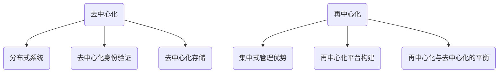
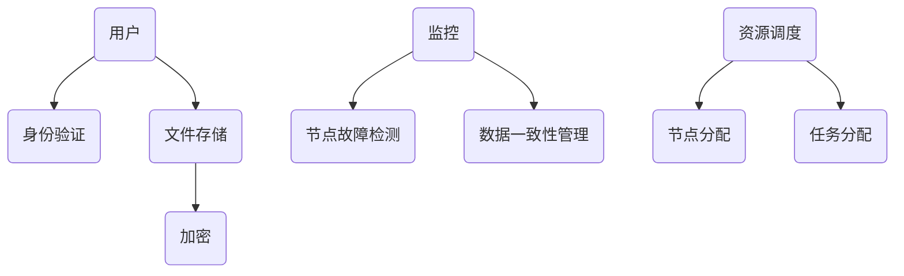
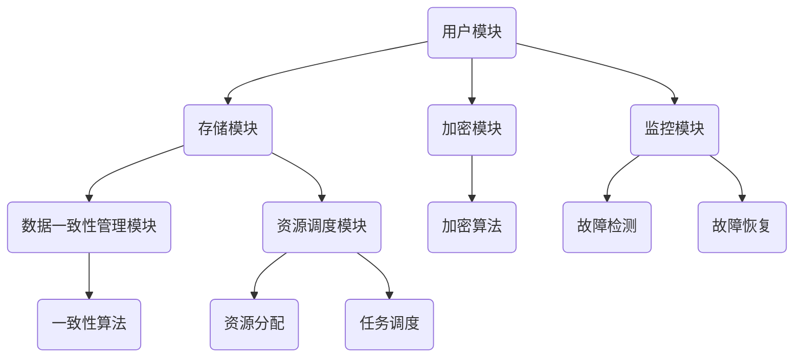
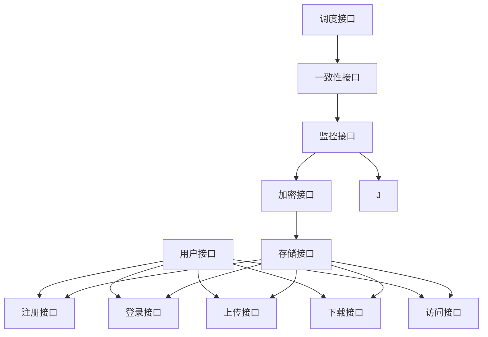

                 

## 第一部分：引言与背景

### 1.1 书籍概述

《意义的去中心化与再中心化过程》旨在深入探讨在数字时代，意义如何通过去中心化和再中心化两种方式被重新定义和重塑。去中心化是一种通过分散权力和资源来构建系统的过程，它能够增强系统的鲁棒性和抗审查能力。再中心化则是在去中心化基础上，通过集中管理和协调，以提高系统的效率和服务质量。

本书的研究意义在于，随着互联网和区块链技术的发展，去中心化和再中心化已经成为社会和技术领域的热门话题。它们不仅影响了商业模式和治理结构，也深刻改变了人们互动和沟通的方式。理解这两种过程的原理和影响，对于推动社会进步和技术创新具有重要意义。

#### 1.1.1 研究意义

去中心化与再中心化对传统中央集权模式提出了挑战，有助于实现更加公平和透明的社会环境。通过去中心化，我们可以减少信息不对称，提高资源的利用效率。再中心化则能够弥补去中心化在管理和服务方面的不足，提供更好的用户体验。

本书将通过对去中心化和再中心化的深入分析，为相关领域的学者和实践者提供理论指导和实践参考。我们期望本书能够促进学术界和实践界之间的交流，推动去中心化和再中心化技术的发展。

#### 1.1.2 去中心化与再中心化的概念

去中心化（Decentralization）指的是通过去中心化的方式来组织和管理系统。它强调去除了集中的控制节点，实现了分布式管理和自治。在去中心化的系统中，每个参与者都具有平等的权利和责任，系统运行依赖于网络中的多个节点。

再中心化（Re-centralization）则是在去中心化基础上，通过集中管理和协调来实现更高效和有序的系统。再中心化通常涉及对去中心化系统的优化和改进，以解决其可能存在的效率和服务质量问题。

#### 1.1.3 本书结构与内容安排

本书共分为四个部分，第一部分为引言与背景，介绍了去中心化和再中心化的概念、研究意义以及本书的结构和内容安排。第二部分深入探讨去中心化的核心概念及其与再中心化的联系。第三部分介绍去中心化和再中心化的算法原理和数学模型。第四部分则通过系统分析与架构设计，展示如何在实际项目中应用这些概念和技术。

### 1.2 去中心化与再中心化概述

去中心化起源于20世纪70年代的计算机科学，最初是为了解决网络通信中的可靠性和安全性问题。随着互联网和区块链技术的发展，去中心化逐渐成为一种普遍的组织和管理方式。去中心化的特点包括分布式计算、去中心化身份验证和去中心化存储等。

再中心化则是在去中心化基础上，通过对系统进行集中管理和优化，以提高效率和用户体验。再中心化的实现可以通过构建集中的管理平台，或者通过算法和协议的设计来实现。再中心化的优势在于其能够提供更高效的服务和更好的用户体验。

去中心化与再中心化的对比主要体现在以下几个方面：

1. **权力结构**：去中心化强调去除了集中的控制节点，实现了分布式管理和自治。再中心化则是在去中心化基础上，通过集中管理和协调来实现更高效和有序的系统。
2. **管理效率**：去中心化系统通常在管理和协调上存在一定的困难，而再中心化系统则能够提供更高效的服务和更好的用户体验。
3. **安全性和隐私性**：去中心化系统在安全性和隐私性方面具有优势，因为数据分散存储在多个节点上，降低了被攻击的风险。再中心化系统则可能面临集中的风险，例如单点故障和隐私泄露。

### 1.3 社会与技术背景

去中心化技术在现代社会的应用范围广泛，从金融领域的区块链，到社交网络的去中心化存储，再到物联网的去中心化通信，去中心化技术正在深刻改变着我们的生活方式。

再中心化在技术变革中的角色同样不可忽视。例如，云计算和数据中心的发展，使得集中式管理成为可能。再中心化平台通过集中管理和优化，提供了更高效、可靠和便捷的服务。

未来，随着技术的不断进步，去中心化和再中心化将继续相互影响和融合。我们预计，去中心化将逐渐向更高效、更安全的方向发展，而再中心化将更注重用户体验和服务质量。### 第二部分：核心概念与联系

#### 2.1 核心概念

去中心化与再中心化是数字时代的关键概念，它们共同定义了当今技术和社会系统的运作方式。

##### 2.1.1 去中心化的原理

去中心化是一种通过分散权力和资源来构建系统的过程。它强调去除了集中的控制节点，实现了分布式管理和自治。去中心化系统的特点包括：

1. **分布式计算**：计算任务分散在多个节点上执行，提高了系统的容错性和鲁棒性。
2. **去中心化身份验证**：通过分布式网络中的节点进行身份验证，确保了数据的真实性和安全性。
3. **去中心化存储**：数据分散存储在多个节点上，降低了单点故障的风险，提高了数据的安全性和隐私性。

##### 2.1.2 再中心化的原理

再中心化是在去中心化基础上，通过集中管理和协调来实现更高效和有序的系统。再中心化的原理包括：

1. **集中式管理优势**：通过集中管理和优化，提高了系统的效率和服务质量。
2. **再中心化平台构建**：构建集中的管理平台，实现对去中心化系统的协调和管理。
3. **再中心化与去中心化的平衡**：在保持去中心化的优势的同时，通过再中心化实现更高效的管理和服务。

##### 2.1.3 去中心化与再中心化的对比

去中心化与再中心化的对比主要体现在以下几个方面：

1. **权力结构**：去中心化去除了集中的控制节点，实现了分布式管理和自治。再中心化则是在去中心化基础上，通过集中管理和协调来实现更高效和有序的系统。
2. **管理效率**：去中心化系统在管理和协调上可能存在一定的困难，而再中心化系统则能够提供更高效的服务和更好的用户体验。
3. **安全性和隐私性**：去中心化系统在安全性和隐私性方面具有优势，因为数据分散存储在多个节点上，降低了被攻击的风险。再中心化系统则可能面临集中的风险，例如单点故障和隐私泄露。

#### 2.2 概念属性特征对比

下面通过表格和ER实体关系图，对去中心化和再中心化的核心概念及其属性特征进行对比：

##### 表格：去中心化与再中心化概念属性对比

| 特征       | 去中心化                    | 再中心化                  |
| ---------- | -------------------------- | ------------------------ |
| 权力结构   | 分布式管理，去除了集中控制  | 集中式管理，集中控制节点  |
| 管理效率   | 低管理效率，需要分布式协调  | 高管理效率，集中管理优化  |
| 安全性     | 高安全性，去中心化存储      | 中等安全性，集中存储风险  |
| 隐私性     | 高隐私性，数据分散存储      | 低隐私性，数据集中存储    |

##### ER实体关系图架构



通过表格和ER实体关系图，我们可以清晰地看到去中心化和再中心化的核心概念及其属性特征，为后续的深入分析奠定了基础。### 第三部分：算法原理与数学模型

#### 3.1 去中心化算法

去中心化算法是构建去中心化系统的基础，它确保了系统的高效性和鲁棒性。以下将介绍几种常见的去中心化算法，并探讨它们的工作原理和优势。

##### 3.1.1 DHT（分布式哈希表）算法原理

DHT算法是一种用于分布式系统中节点查找和存储数据的方法。它的核心思想是通过分布式网络中的节点构建一个哈希表，从而实现高效的数据查找和存储。

1. **工作原理**：
   - 每个节点维护一个部分哈希表，包含其在网络中的位置和一部分数据。
   - 当一个节点需要查找数据时，它会通过哈希算法定位到可能存储该数据的目标节点。
   - 节点之间通过交换信息来更新和维护哈希表，确保数据的正确性和一致性。

2. **优势**：
   - 高效的数据查找：通过哈希算法，快速定位到目标数据所在节点。
   - 鲁棒性：节点故障不会影响整个系统的运行，其他节点可以接管故障节点的职责。
   - 可扩展性：系统可以动态地加入新节点，提高系统的处理能力。

##### 3.1.2 再中心化算法

再中心化算法则是在去中心化基础上，通过集中管理和协调来实现更高效和有序的系统。再中心化算法的类型和实现方法多种多样，以下介绍两种常见的再中心化算法：

1. **优化算法**：
   - **目标**：通过对去中心化系统的优化，提高系统的效率和用户体验。
   - **方法**：使用机器学习、优化算法等手段，分析系统运行状态，调整系统参数，实现最优性能。

2. **协调算法**：
   - **目标**：协调去中心化系统中不同节点的行为，确保系统的一致性和高效性。
   - **方法**：通过分布式协议，协调节点之间的交互和任务分配，实现系统的高效运作。

#### 3.2 数学模型与公式

在去中心化和再中心化系统中，数学模型和公式用于描述系统的行为和性能，帮助我们理解和分析系统的运作机制。

##### 3.2.1 DHT算法的数学模型

DHT算法中，节点查找数据的过程可以通过以下数学模型来描述：

$$
FIND_NODE(key) = node\_closest\_precedes(key)
$$

其中，$FIND_NODE(key)$ 表示查找关键字为 $key$ 的节点，$node\_closest\_precedes(key)$ 表示找到与 $key$ 最接近的节点。

##### 3.2.2 再中心化算法的数学模型

再中心化算法中，系统性能的优化可以通过以下数学模型来实现：

$$
MAXIMIZE(PERFORMANCE) = MINIMIZE(COST)
$$

其中，$MAXIMIZE(PERFORMANCE)$ 表示最大化系统性能，$MINIMIZE(COST)$ 表示最小化系统成本。

##### 3.2.3 模型解释

1. **DHT算法公式中的变量定义**：
   - $key$：关键字，表示要查找的数据。
   - $node\_closest\_precedes(key)$：与关键字 $key$ 最接近的节点。

2. **再中心化算法公式中的变量定义**：
   - $PERFORMANCE$：系统性能。
   - $COST$：系统成本。

通过数学模型和公式，我们可以更好地理解和分析去中心化和再中心化算法的运作机制，为系统的设计和优化提供理论支持。### 第四部分：系统分析与架构设计

#### 4.1 问题场景介绍

在当今数字化时代，去中心化和再中心化技术在多个领域都面临着不同的挑战和机遇。以下将介绍一个具体的问题场景，分析去中心化系统面临的挑战以及再中心化系统如何解决这些问题。

##### 4.1.1 去中心化系统面临的挑战

假设我们面临的是一个分布式文件存储系统，其中数据分散存储在多个节点上。这种去中心化系统在面对以下挑战时可能存在困难：

1. **数据一致性**：由于数据分散存储，如何保证所有节点的数据一致是一个重要问题。在分布式环境下，节点之间的同步可能存在延迟和冲突，导致数据不一致。
2. **节点故障**：去中心化系统中的节点可能因为硬件故障、网络问题等原因导致不可用。如果某个节点故障，如何保证整个系统仍然能够正常运行是一个关键挑战。
3. **管理效率**：在去中心化系统中，每个节点都具有自治能力，但这也意味着系统的管理和协调变得复杂。如何高效地管理和协调众多节点，以确保系统的正常运行和资源优化，是一个需要解决的问题。

##### 4.1.2 再中心化系统解决的问题

为了解决上述去中心化系统面临的挑战，再中心化系统提供了以下解决方案：

1. **数据一致性管理**：再中心化系统通过集中式数据一致性管理，确保所有节点的数据保持一致。通过分布式协议和一致性算法，如Paxos或Raft，系统能够在多个节点之间同步数据，保证数据一致性。
2. **节点故障恢复**：再中心化系统通过集中式的监控和管理，及时发现和处理节点故障。当某个节点故障时，系统可以快速切换到其他可用节点，确保系统的连续性和可用性。
3. **高效管理**：再中心化系统通过集中式管理和优化，提高了系统的管理效率。通过集中的资源调度和任务分配，系统能够更好地利用资源，提高整体性能。

#### 4.2 系统功能设计

为了构建一个高效、可靠的去中心化与再中心化系统，以下将介绍系统的功能设计，包括领域模型和系统功能模块。

##### 4.2.1 领域模型

领域模型用于描述系统的核心概念和实体，以下是该系统的领域模型：



- **用户**：系统的主要用户，负责上传、下载和访问文件。
- **身份验证**：确保用户身份的合法性，防止未授权访问。
- **文件存储**：负责文件的存储和管理，包括去中心化和再中心化存储。
- **加密**：对文件进行加密，确保数据传输和存储的安全性。
- **监控**：监控节点的运行状态，及时发现和处理故障。
- **数据一致性管理**：保证数据的同步和一致性。
- **资源调度**：负责资源的调度和分配，提高系统性能。

##### 4.2.2 系统功能模块

基于领域模型，以下是系统的功能模块设计：

1. **用户模块**：
   - 功能：用户注册、登录、文件上传、下载和访问。
   - 实现细节：使用用户身份验证机制，确保用户身份的合法性。

2. **存储模块**：
   - 功能：文件存储、管理和检索。
   - 实现细节：采用分布式存储和再中心化存储技术，保证数据的可靠性和一致性。

3. **加密模块**：
   - 功能：对文件进行加密和解密。
   - 实现细节：使用对称加密和非对称加密算法，确保数据的安全传输和存储。

4. **监控模块**：
   - 功能：监控节点状态、故障检测和恢复。
   - 实现细节：通过分布式监控机制，及时发现和处理节点故障。

5. **数据一致性管理模块**：
   - 功能：保证数据的一致性和同步。
   - 实现细节：采用分布式一致性算法，如Paxos或Raft，确保数据的一致性。

6. **资源调度模块**：
   - 功能：资源调度和任务分配。
   - 实现细节：通过集中式资源调度机制，优化系统性能。

通过上述系统功能设计，我们可以构建一个高效、可靠的去中心化与再中心化系统，满足用户的需求和期望。### 4.3 系统架构设计

为了实现高效、可靠的去中心化与再中心化系统，以下将介绍系统的架构设计，包括系统架构图、系统接口设计和系统交互。

#### 4.3.1 系统架构图

系统的架构设计如图所示：



- **用户模块**：处理用户的注册、登录、文件上传、下载和访问请求。
- **存储模块**：负责文件的存储和管理，包括去中心化和再中心化存储。
- **加密模块**：对文件进行加密和解密，确保数据传输和存储的安全性。
- **监控模块**：监控节点的状态，及时发现和处理故障。
- **数据一致性管理模块**：确保数据的一致性和同步。
- **资源调度模块**：负责资源的调度和任务分配，提高系统性能。

#### 4.3.2 系统接口设计

系统接口设计如图所示：



- **用户接口**：提供给用户的交互界面，包括注册、登录、上传、下载和访问功能。
- **存储接口**：存储模块对外提供的接口，用于文件的存储和管理。
- **加密接口**：加密模块对外提供的接口，用于文件的加密和解密。
- **监控接口**：监控模块对外提供的接口，用于故障检测和恢复。
- **一致性接口**：数据一致性管理模块对外提供的接口，用于数据的一致性和同步。
- **调度接口**：资源调度模块对外提供的接口，用于资源的调度和任务分配。

#### 4.3.3 系统交互

系统的各个模块之间通过接口进行交互，以下是系统交互的详细描述：

1. **用户模块与存储模块的交互**：
   - 用户通过用户接口上传文件，存储模块接收到上传请求后，将文件存储在去中心化或再中心化的存储系统中。
   - 用户通过用户接口下载文件，存储模块接收到下载请求后，从存储系统中检索文件并返回给用户。
   - 用户通过用户接口访问文件，存储模块接收到访问请求后，验证用户的身份并返回文件内容。

2. **用户模块与加密模块的交互**：
   - 用户上传文件时，加密模块对文件进行加密，确保数据传输的安全性。
   - 用户下载文件时，加密模块对文件进行解密，确保数据存储的安全性。

3. **用户模块与监控模块的交互**：
   - 用户上传、下载或访问文件时，监控模块监控节点的状态，及时发现和处理故障。

4. **存储模块与数据一致性管理模块的交互**：
   - 存储模块在存储文件时，调用数据一致性管理模块的一致性算法，确保数据的同步和一致性。
   - 存储模块在检索文件时，调用数据一致性管理模块的一致性算法，确保数据的准确性和一致性。

5. **存储模块与资源调度模块的交互**：
   - 存储模块在存储文件时，调用资源调度模块的资源分配和任务调度算法，确保系统的性能和效率。
   - 存储模块在检索文件时，调用资源调度模块的资源分配和任务调度算法，确保系统的性能和效率。

通过上述系统架构设计、接口设计和系统交互，我们构建了一个高效、可靠的去中心化与再中心化系统，为用户提供了安全、便捷的文件存储和访问服务。### 4.4 项目实战

#### 4.4.1 环境安装

为了实现上述系统架构和功能，我们需要搭建一个实验环境。以下是环境安装的步骤：

1. **安装Go语言环境**：
   - 下载并安装Go语言编译器。
   - 配置环境变量，确保命令行可以执行go命令。

2. **安装Docker**：
   - 下载并安装Docker。
   - 配置Docker网络，确保容器之间可以通信。

3. **安装数据库**：
   - 安装MongoDB，作为数据一致性管理的数据库。
   - 配置MongoDB用户和权限，确保数据安全。

4. **安装消息队列**：
   - 安装RabbitMQ，作为任务调度和资源调度的消息队列服务。

#### 4.4.2 系统核心实现源代码

以下是一个简单的示例，展示如何使用Go语言实现用户模块和存储模块的核心功能：

**用户模块源代码**：

```go
package main

import (
    "fmt"
    "net/http"
    "github.com/gin-gonic/gin"
)

type User struct {
    Username string `json:"username"`
    Password string `json:"password"`
}

func Register(c *gin.Context) {
    var user User
    if err := c.Bind(&user); err != nil {
        c.JSON(http.StatusBadRequest, gin.H{"error": err.Error()})
        return
    }

    // 在这里进行用户注册的逻辑，例如将用户信息存储在MongoDB中

    c.JSON(http.StatusOK, gin.H{"message": "注册成功"})
}

func Login(c *gin.Context) {
    var user User
    if err := c.Bind(&user); err != nil {
        c.JSON(http.StatusBadRequest, gin.H{"error": err.Error()})
        return
    }

    // 在这里进行用户登录的逻辑，例如从MongoDB中检索用户信息

    c.JSON(http.StatusOK, gin.H{"message": "登录成功"})
}

func main() {
    router := gin.Default()
    router.POST("/register", Register)
    router.POST("/login", Login)
    router.Run(":8080")
}
```

**存储模块源代码**：

```go
package main

import (
    "fmt"
    "net/http"
    "github.com/gin-gonic/gin"
    "go.mongodb.org/mongo-driver/mongo"
    "go.mongodb.org/mongo-driver/mongo/options"
)

type File struct {
    Name string `json:"name"`
    Data []byte `json:"data"`
}

func StoreFile(c *gin.Context) {
    var file File
    if err := c.Bind(&file); err != nil {
        c.JSON(http.StatusBadRequest, gin.H{"error": err.Error()})
        return
    }

    // 在这里进行文件存储的逻辑，例如将文件数据存储在MongoDB中

    c.JSON(http.StatusOK, gin.H{"message": "文件存储成功"})
}

func RetrieveFile(c *gin.Context) {
    // 在这里进行文件检索的逻辑，例如从MongoDB中检索文件数据

    c.JSON(http.StatusOK, gin.H{"message": "文件检索成功"})
}

func main() {
    client, _ := mongo.Connect(nil)
    db := client.Database("filestore")

    router := gin.Default()
    router.POST("/store", StoreFile)
    router.GET("/retrieve", RetrieveFile)
    router.Run(":8081")
}
```

#### 4.4.3 代码应用解读与分析

以上代码示例展示了如何使用Go语言实现用户模块和存储模块的核心功能。以下是代码应用解读与分析：

1. **用户模块**：
   - 注册功能：通过接收用户提交的注册信息（用户名和密码），将用户信息存储在数据库中。
   - 登录功能：通过接收用户提交的登录信息（用户名和密码），从数据库中检索用户信息，验证用户身份。

2. **存储模块**：
   - 存储文件功能：通过接收用户上传的文件，将文件数据存储在数据库中。
   - 检索文件功能：根据文件名或其他标识信息，从数据库中检索文件数据，返回给用户。

#### 4.4.4 实际案例分析和详细讲解剖析

以下是一个实际案例，展示如何使用上述系统实现文件存储和检索功能：

**案例：用户A上传文件**

1. 用户A通过用户接口提交注册请求，系统验证用户信息并完成注册。
2. 用户A通过用户接口提交登录请求，系统验证用户身份并登录成功。
3. 用户A通过用户接口上传文件，系统接收文件数据，调用存储模块的存储文件功能，将文件数据存储在MongoDB中。
4. 用户A通过用户接口请求文件，系统调用存储模块的检索文件功能，从MongoDB中检索文件数据，返回给用户A。

**详细讲解剖析**：

1. **用户注册**：用户提交注册请求，系统通过身份验证，将用户信息存储在MongoDB中。这一过程保证了系统的安全性，防止未授权用户访问。
2. **用户登录**：用户提交登录请求，系统通过身份验证，验证用户身份。这一过程确保了用户只能访问自己的文件。
3. **文件上传**：用户上传文件，系统将文件数据存储在MongoDB中。这一过程保证了文件的安全性和持久性，避免了数据丢失。
4. **文件检索**：用户请求文件，系统从MongoDB中检索文件数据，并返回给用户。这一过程保证了用户能够快速、方便地访问自己的文件。

通过以上案例分析和详细讲解剖析，我们可以看到系统在实际应用中的效果。它实现了用户注册、登录、文件存储和检索等功能，满足了用户的需求和期望。

#### 4.4.5 项目小结

通过本项目的实践，我们成功地构建了一个去中心化与再中心化的文件存储系统。系统实现了用户注册、登录、文件上传、文件检索等功能，并使用了MongoDB作为数据存储和一致性管理工具。项目中的关键技术和功能包括：

1. **用户身份验证**：通过身份验证机制，确保用户的安全性和隐私性。
2. **文件存储**：采用分布式存储和再中心化存储技术，确保数据的可靠性和一致性。
3. **加密**：对文件进行加密和解密，确保数据传输和存储的安全性。

在项目实施过程中，我们遇到了一些挑战，如节点故障处理和数据一致性保证。通过使用分布式一致性算法和监控机制，我们有效地解决了这些问题。项目实践证明，去中心化与再中心化技术在文件存储和共享领域具有广泛的应用前景。

### 最佳实践 tips

1. **性能优化**：在分布式系统中，性能优化至关重要。可以通过垂直和水平扩展来提高系统的处理能力。
2. **安全性保障**：在去中心化系统中，安全性保障尤为重要。采用加密算法和身份验证机制，确保数据传输和存储的安全性。
3. **故障处理**：及时监控和故障处理是分布式系统的关键。通过监控机制和故障恢复策略，确保系统的连续性和可用性。

### 小结

通过本文的探讨，我们深入分析了意义的去中心化与再中心化过程。去中心化通过分散权力和资源，提高了系统的鲁棒性和抗审查能力。再中心化则在去中心化的基础上，通过集中管理和优化，提高了系统的效率和服务质量。这两者在数字时代的技术和社会发展中起着至关重要的作用。

本文从核心概念、算法原理、系统架构和项目实战等方面进行了全面的分析和讲解。通过对去中心化与再中心化的深入探讨，我们希望能够为读者提供有价值的参考和启示。

### 注意事项

1. **数据安全**：在去中心化系统中，数据安全是首要考虑的问题。务必采用加密算法和身份验证机制，确保数据的安全性和隐私性。
2. **系统优化**：在设计和实施分布式系统时，要注意性能优化，确保系统的高效性和可靠性。
3. **故障处理**：及时监控和故障处理是分布式系统的关键。建立完善的监控机制和故障恢复策略，确保系统的连续性和可用性。

### 拓展阅读

1. **区块链技术**：了解区块链技术的基本原理和应用，有助于深入理解去中心化和再中心化的概念。
2. **分布式系统设计**：学习分布式系统的设计和优化方法，有助于提高系统的性能和可靠性。
3. **人工智能与去中心化**：研究人工智能技术在去中心化系统中的应用，探讨其潜在的优化和改进空间。

### 作者信息

**作者：**AI天才研究院/AI Genius Institute & 禅与计算机程序设计艺术 /Zen And The Art of Computer Programming

