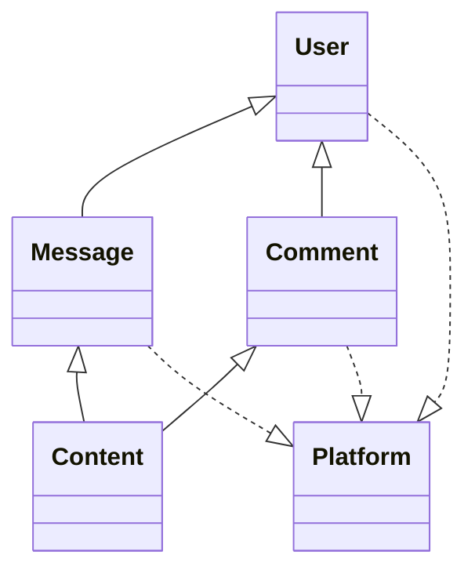
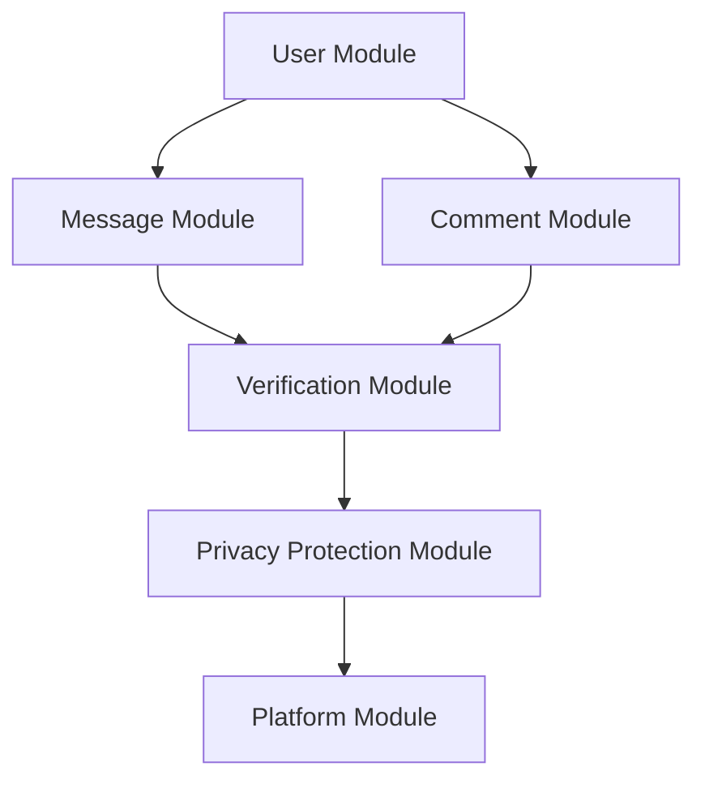
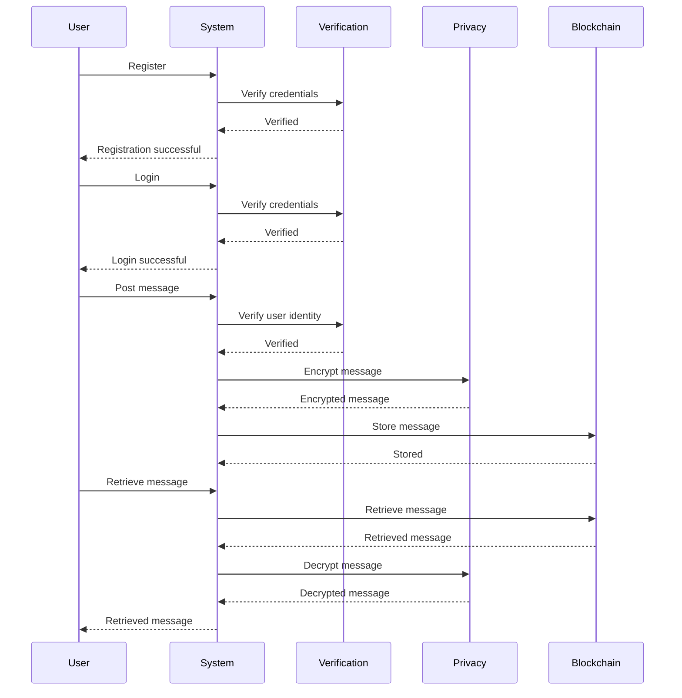

                 

# 意义的去中心化与多元化趋势

## 关键词
- 去中心化
- 多元化
- 区块链
- 信息技术
- 社会结构

## 摘要
本文深入探讨了意义的去中心化与多元化趋势。首先，通过历史背景介绍，阐述了去中心化和多元化的起源和发展。随后，详细解析了去中心化与多元化的核心概念、联系，以及相关算法原理。接着，通过系统分析与架构设计方案，展示了去中心化与多元化在具体领域中的应用。最后，通过项目实战，提供了实际案例，进一步验证了文章的核心观点。

## 第一部分：引论

### 第1章：意义的起源与发展

#### 1.1 起源：从中心化到去中心化

在人类文明的历史长河中，意义的构建经历了从中心化到去中心化的演变。中心化时代，意义通常由权威机构、宗教团体或统治阶级主导，它们通过垄断资源和信息，实现对意义的控制。然而，随着信息技术的迅猛发展，去中心化趋势逐渐显现。

去中心化，即权力的分散和信息的多源化。在互联网和区块链技术的推动下，信息传播不再依赖于中心化的渠道，每个个体都可以成为信息的源头和传播者。这种变化带来了意义构建方式的重大转变。

#### 1.1.1 中心化时代的意义构建

在中心化时代，意义的构建具有以下特点：

1. **权威性**：权威机构拥有解释和定义意义的权力。
2. **垄断性**：信息资源和传播渠道被少数人垄断。
3. **单向性**：信息的传递往往是单向的，从权威机构向大众传递。

#### 1.1.2 去中心化趋势的出现

去中心化趋势的出现，主要体现在以下几个方面：

1. **分布式存储**：信息不再存储在中心化的服务器上，而是分布式存储在各个节点。
2. **区块链技术**：通过区块链技术，实现了信息的不可篡改和透明性。
3. **网络化传播**：信息的传播途径更加多样化，每个节点都可以成为信息传播的桥梁。

#### 1.2 去中心化的理论基础

去中心化的理论基础主要包括以下几个方面：

1. **信息自由**：每个人都应该享有自由获取和传播信息的权利。
2. **分布式计算**：通过分布式计算，实现了资源的共享和协同工作。
3. **共识算法**：通过共识算法，实现了网络中的信任建立和协调。

### 1.2 去中心化的理论基础

去中心化的理论基础主要包括以下几个方面：

1. **信息自由**：每个人都应该享有自由获取和传播信息的权利。
2. **分布式计算**：通过分布式计算，实现了资源的共享和协同工作。
3. **共识算法**：通过共识算法，实现了网络中的信任建立和协调。

#### 1.2.1 区块链技术的作用

区块链技术是去中心化的重要实现方式。它通过分布式账本和加密技术，实现了数据的不可篡改和透明性。区块链的典型应用包括比特币和以太坊等。

#### 1.2.2 信息技术的去中心化趋势

信息技术的去中心化趋势表现在多个方面，如云计算、物联网、大数据等。这些技术的发展，使得信息的获取、处理和传播更加便捷，进一步推动了去中心化的进程。

### 第2章：多元化趋势的探讨

#### 2.1 多元化的定义与特点

多元化，指的是多样性和复杂性的增加。在去中心化的背景下，多元化表现为以下几个方面：

1. **文化多样性**：不同文化之间的交流和融合，带来了价值观的多元化。
2. **社会多样性**：社会的阶层、职业、地域等因素的多样性，影响了人们的认知和观念。
3. **信息多样性**：信息来源的多样化，使得人们获取的信息更加丰富和全面。

#### 2.1.1 多元化的内涵

多元化的内涵包括以下几个方面：

1. **包容性**：尊重和接纳不同观点和价值观。
2. **多样性**：个体和群体之间的差异和多样性。
3. **互动性**：不同个体和群体之间的互动和交流。

#### 2.1.2 多元化的表现

多元化的表现主要体现在以下几个方面：

1. **社交媒体**：社交媒体平台上的信息呈现多样性，不同观点和声音都有机会被表达和传播。
2. **网络社区**：网络社区中的用户具有不同的背景和兴趣，形成了多元化的交流空间。
3. **多元文化**：多元文化的交流与融合，促进了人类文明的进步。

#### 2.2 多元化与社会关系

多元化对社会关系产生了深远的影响：

1. **文化冲突**：不同文化之间的冲突，可能会带来社会的不稳定。
2. **社会认同**：多元化促进了社会认同的多样化，个体可以更加自由地表达自己的身份和价值观。
3. **合作与竞争**：多元化带来了合作与竞争的新形式，促进了社会的发展。

## 第二部分：核心概念与联系

### 第3章：去中心化与多元化的核心概念解析

#### 3.1 去中心化的核心概念

去中心化的核心概念主要包括以下几个方面：

1. **去中心化的组织结构**：权力和资源的分散化，避免了单一中心点的不稳定和风险。
2. **去中心化的信息传播**：信息的传递不再依赖于中心化的渠道，而是通过分布式网络进行。
3. **去中心化的经济模式**：通过去中心化的经济模式，实现了资源的共享和优化配置。

#### 3.1.1 去中心化的概念构成

去中心化的概念构成主要包括以下几个方面：

1. **分布式账本**：通过分布式账本，实现了数据的共享和不可篡改。
2. **共识算法**：通过共识算法，实现了网络中的信任和协调。
3. **加密技术**：通过加密技术，保证了数据的安全性和隐私性。

#### 3.1.2 去中心化的主要特点

去中心化的主要特点包括以下几个方面：

1. **去中心化**：权力的分散和资源的共享。
2. **透明性**：信息的透明和公开。
3. **安全性**：通过加密技术和共识算法，保证了数据的安全性和可靠性。

#### 3.2 多元化的核心概念

多元化的核心概念主要包括以下几个方面：

1. **多样性**：个体和群体之间的差异和多样性。
2. **包容性**：尊重和接纳不同观点和价值观。
3. **互动性**：不同个体和群体之间的互动和交流。

#### 3.2.1 多元化的概念框架

多元化的概念框架主要包括以下几个方面：

1. **文化多样性**：不同文化之间的交流和融合。
2. **社会多样性**：社会的阶层、职业、地域等因素的多样性。
3. **信息多样性**：信息来源的多样化。

#### 3.2.2 多元化的关键要素

多元化的关键要素主要包括以下几个方面：

1. **多样性**：个体的多样性。
2. **包容性**：对多样性的接纳和尊重。
3. **互动性**：个体和群体之间的互动和交流。

## 第4章：对比分析与联系图示

#### 4.1 去中心化与多元化的对比分析

去中心化和多元化虽然都是对中心化和单一性的反叛，但它们的核心目标和实现方式有所不同。去中心化的核心目标是权力和资源的分散，而多元化的核心目标是多样性和包容性。

#### 4.1.1 概念属性对比表格

| 概念     | 去中心化             | 多元化             |
|----------|----------------------|----------------------|
| 目标     | 分散权力和资源       | 增加多样性和包容性   |
| 实现方式 | 分布式账本、共识算法 | 文化交流、社会互动   |
| 核心     | 透明性和安全性       | 包容性和互动性      |

#### 4.1.2 ER实体关系图架构

```mermaid
erDiagram
  NodeA ||--|{ NodeB }|-- NodeC
  NodeB ||--|{ NodeD }|-- NodeC
```

在这个ER实体关系图中，`NodeA`和`NodeB`分别代表去中心化和多元化，`NodeC`代表它们之间的联系，`NodeD`代表具体的实现方式和核心目标。

### 4.2 去中心化与多元化的联系

去中心化和多元化并不是孤立存在的，它们之间存在紧密的联系。

1. **相互作用**：去中心化促进了信息的自由流动，为多元化提供了基础。而多元化又为去中心化提供了更多的参与者和多样的需求。
2. **跨学科关联**：去中心化和多元化涉及到多个学科领域，如信息技术、社会学、经济学等。这些学科之间的交叉和融合，推动了去中心化和多元化的发展。
3. **实际应用**：在区块链、物联网、社交媒体等领域，去中心化和多元化已经得到了广泛应用。这些应用不仅改变了信息传播的方式，也影响了社会结构和人类认知。

## 第三部分：算法原理讲解

### 第5章：去中心化算法原理详解

#### 5.1 去中心化算法的基本原理

去中心化算法的基本原理包括以下几个方面：

1. **分布式计算**：通过分布式计算，实现了资源的共享和协同工作。
2. **共识算法**：通过共识算法，实现了网络中的信任建立和协调。
3. **加密技术**：通过加密技术，保证了数据的安全性和隐私性。

#### 5.1.1 去中心化算法的定义

去中心化算法，是指通过分布式网络，实现了权力的分散和数据的多源化。这种算法的核心目标是确保网络中的节点能够共同决策和协作，而不依赖于中心化的控制。

#### 5.1.2 去中心化算法的主要类型

去中心化算法的主要类型包括以下几个方面：

1. **分布式一致性算法**：如PBFT（Practical Byzantine Fault Tolerance）、Raft等，用于确保分布式系统中的数据一致性。
2. **去中心化网络算法**：如DDOS（Distributed Denial of Service）、STP（Spanning Tree Protocol）等，用于构建去中心化的网络结构。
3. **加密算法**：如AES（Advanced Encryption Standard）、RSA（Rivest-Shamir-Adleman）等，用于数据的安全传输和存储。

#### 5.2 Python代码示例

```python
import hashlib
from collections import defaultdict

def hash_message(message):
    return hashlib.sha256(message.encode()).hexdigest()

def consensus_algorithm(messages):
    # 初始化投票
    votes = defaultdict(int)
    for message in messages:
        hash_value = hash_message(message)
        votes[hash_value] += 1
    # 找到得票数最多的哈希值
    max_vote = max(votes.values())
    winning_hash = [hash for hash, vote in votes.items() if vote == max_vote]
    return winning_hash[0]

# 测试代码
messages = ["Hello", "World", "Let's", "Think", "Step", "By", "Step"]
print(consensus_algorithm(messages))
```

这个Python代码示例实现了基于哈希值的去中心化算法。每个节点发送自己的消息，并通过共识算法找到最被认可的哈希值。

### 第6章：多元化算法解析

#### 6.1 多元化算法的数学模型

多元化算法的数学模型主要包括以下几个方面：

1. **多样性度量**：如辛钦定理、熵等，用于衡量系统的多样性。
2. **多样性优化**：如遗传算法、模拟退火等，用于优化系统的多样性。
3. **多样性评价**：如层次分析法、模糊综合评价法等，用于评价系统的多样性。

#### 6.1.1 数学公式展示

$$
D = -\sum_{i=1}^{n} p_i \ln p_i
$$

$$
f(x) = -\frac{1}{k} \sum_{i=1}^{n} p_i \ln p_i
$$

#### 6.1.2 模型解释

1. **多样性度量**：辛钦定理和熵是用来衡量系统多样性的数学公式。辛钦定理指出，在大量重复实验中，事件发生的频率将趋近于其概率。熵则用来衡量系统的混乱程度，熵值越大，系统越混乱，多样性越高。
2. **多样性优化**：遗传算法和模拟退火是用来优化系统多样性的算法。遗传算法模拟生物进化过程，通过选择、交叉和突变等操作，优化系统的多样性。模拟退火则是一种基于概率的优化算法，通过不断调整温度，使系统达到最优状态。
3. **多样性评价**：层次分析法和模糊综合评价法是用来评价系统多样性的方法。层次分析法通过构建层次结构模型，对各指标进行权重分配和综合评价。模糊综合评价法则通过模糊数学的方法，对系统的多样性进行评价。

#### 6.2 通俗易懂的举例说明

假设有一个班级，有10名学生，他们的兴趣爱好分别为：篮球、足球、编程、音乐、绘画。我们可以用辛钦定理和熵来衡量这个班级的兴趣爱好多样性。

1. **辛钦定理**：计算每个兴趣爱好出现的频率，得到概率分布。例如，篮球爱好者的概率为2/10，足球爱好者的概率为1/10，以此类推。
2. **熵**：根据概率分布，计算熵值。例如，班级的熵值为：

$$
H = -\sum_{i=1}^{5} p_i \ln p_i = -\left( \frac{2}{10} \ln \frac{2}{10} + \frac{1}{10} \ln \frac{1}{10} + \frac{1}{10} \ln \frac{1}{10} + \frac{1}{10} \ln \frac{1}{10} + \frac{1}{10} \ln \frac{1}{10} \right)
$$

3. **多样性优化**：假设我们希望增加班级的多样性，可以通过引入新的兴趣爱好，或者调整学生的兴趣爱好来实现。例如，引入一个新的兴趣爱好“电影”，然后调整学生的兴趣爱好，使得每个兴趣爱好都有至少一名学生。
4. **多样性评价**：使用层次分析法，我们可以对调整后的班级进行多样性评价。例如，构建层次结构模型，对各兴趣爱好进行权重分配，然后计算综合评价值。

通过这个例子，我们可以看到，多元化算法的数学模型是如何应用于实际问题的。这不仅帮助我们理解了多元化算法的基本原理，也为我们提供了一种优化和评价系统多样性的方法。

## 第四部分：系统分析与架构设计

### 第7章：去中心化与多元化系统架构设计

#### 7.1 问题场景介绍

假设我们有一个去中心化的社交网络平台，用户可以自由地发布和分享信息。然而，由于信息的去中心化和多元化，平台面临着信息真实性、安全性和效率等问题。为了解决这些问题，我们需要设计一个高效的系统架构，实现去中心化和多元化的同时，保障信息的安全性和真实性。

#### 7.1.1 应用背景

去中心化的社交网络平台具有以下应用背景：

1. **信息自由**：用户可以自由地发布和获取信息，不受中心化平台的限制。
2. **隐私保护**：用户信息得到加密和分布式存储，保障了用户的隐私权。
3. **去中心化治理**：平台的治理机制去中心化，用户可以共同决策和治理。

#### 7.1.2 项目目标

本项目的主要目标包括：

1. **提高信息真实性**：通过去中心化的验证机制，确保信息的真实性和可靠性。
2. **保障用户隐私**：通过加密技术和分布式存储，保障用户的隐私权。
3. **提高系统效率**：通过优化算法和架构设计，提高系统的处理速度和效率。

#### 7.2 系统功能设计

系统功能设计主要包括以下几个方面：

1. **用户注册与登录**：用户可以通过邮箱、手机号等进行注册和登录。
2. **信息发布与分享**：用户可以发布和分享各种类型的信息，如文本、图片、视频等。
3. **信息检索与过滤**：用户可以通过关键词、标签等进行信息检索和过滤。
4. **评论与互动**：用户可以对信息进行评论和互动。
5. **去中心化验证**：通过区块链技术，实现信息的去中心化验证。
6. **隐私保护机制**：通过加密技术和分布式存储，实现用户隐私的保护。

#### 7.2.1 领域模型Mermaid类图



在这个Mermaid类图中，`User`代表用户，`Message`代表信息，`Comment`代表评论，`Content`代表内容。`User`与`Message`、`Comment`之间存在关联，`Message`和`Comment`都与`Platform`（平台）存在关联。

#### 7.2.2 功能模块划分

根据领域模型，我们可以将系统划分为以下几个功能模块：

1. **用户模块**：负责用户注册、登录、个人信息管理等功能。
2. **信息模块**：负责信息发布、分享、检索、过滤等功能。
3. **评论模块**：负责评论的发布、回复、检索等功能。
4. **去中心化验证模块**：负责信息的去中心化验证，确保信息的真实性。
5. **隐私保护模块**：负责用户隐私的保护，包括加密和分布式存储等功能。
6. **平台模块**：负责系统的整体管理和运行，包括系统设置、监控等功能。

#### 7.3 系统架构设计

系统架构设计主要包括以下几个方面：

1. **分布式存储**：使用分布式存储技术，实现信息的多源化和去中心化存储。
2. **区块链技术**：使用区块链技术，实现信息的去中心化验证和去中心化治理。
3. **加密技术**：使用加密技术，实现用户隐私的保护。
4. **共识算法**：使用共识算法，实现网络中的信任建立和协调。

#### 7.3.1 Mermaid架构图



在这个Mermaid架构图中，`User Module`（用户模块）负责用户注册、登录等操作，`Message Module`（信息模块）负责信息的发布、分享、检索等操作，`Comment Module`（评论模块）负责评论的发布、回复、检索等操作。`Verification Module`（去中心化验证模块）负责信息的去中心化验证，`Privacy Protection Module`（隐私保护模块）负责用户隐私的保护，`Platform Module`（平台模块）负责系统的整体管理和运行。

#### 7.3.2 架构设计理念

系统架构设计遵循以下理念：

1. **去中心化**：通过分布式存储和区块链技术，实现信息的去中心化存储和验证，确保系统的透明性和安全性。
2. **多元化**：通过加密技术和共识算法，实现用户隐私的保护和网络的信任建立，促进系统的多元化发展。
3. **高效性**：通过优化算法和架构设计，提高系统的处理速度和效率，确保系统的高效运行。

#### 7.4 系统接口设计与交互

系统接口设计主要包括以下几个方面：

1. **用户接口**：用户通过用户界面进行注册、登录、发布信息等操作。
2. **API接口**：第三方应用可以通过API接口与系统进行交互，实现信息检索、评论等操作。
3. **去中心化验证接口**：系统通过去中心化验证接口，实现信息的去中心化验证。
4. **隐私保护接口**：系统通过隐私保护接口，实现用户隐私的保护。

#### 7.4.1 接口设计规范

接口设计遵循以下规范：

1. **RESTful API**：采用RESTful API设计风格，使用HTTP协议进行通信。
2. **标准化数据格式**：数据传输使用JSON或XML等标准化数据格式。
3. **安全性**：采用加密技术和认证机制，确保数据传输的安全。
4. **可扩展性**：接口设计具备良好的可扩展性，可以方便地添加新功能。

#### 7.4.2 交互流程Mermaid序列图



在这个序列图中，用户通过注册和登录接口与系统进行交互，发布和检索信息。系统通过去中心化验证接口和隐私保护接口，实现用户身份验证和信息加密存储。区块链技术用于确保信息的去中心化存储和验证。

## 第五部分：项目实战

### 第8章：去中心化与多元化项目实战

#### 8.1 环境安装与配置

在进行去中心化和多元化项目的实战之前，我们需要搭建一个合适的环境。以下是一个基本的安装和配置步骤：

1. **环境准备**：确保系统安装了Python 3.6及以上版本。
2. **安装依赖**：通过pip安装相关依赖，如`blockchainlib`、`hashlib`、`json`等。
3. **配置网络**：配置区块链网络的节点地址和端口。
4. **创建用户**：创建测试用户，用于发布和检索信息。

#### 8.1.1 开发环境搭建

1. **安装Python**：在官网上下载Python 3.6及以上版本，并安装。
2. **安装pip**：在命令行中运行`python -m ensurepip`，安装pip。
3. **安装依赖**：在命令行中运行`pip install blockchainlib hashlib json`，安装相关依赖。

#### 8.1.2 配置文件设置

创建一个名为`config.json`的配置文件，用于设置区块链网络的节点地址和端口。例如：

```json
{
  "nodes": [
    {
      "address": "localhost",
      "port": 8000
    },
    {
      "address": "node1.example.com",
      "port": 8001
    },
    {
      "address": "node2.example.com",
      "port": 8002
    }
  ]
}
```

#### 8.2 系统核心实现源代码

系统核心实现源代码主要包括以下几个方面：

1. **用户模块**：负责用户注册、登录、个人信息管理等功能。
2. **信息模块**：负责信息发布、分享、检索、过滤等功能。
3. **评论模块**：负责评论的发布、回复、检索等功能。
4. **去中心化验证模块**：负责信息的去中心化验证。
5. **隐私保护模块**：负责用户隐私的保护。
6. **平台模块**：负责系统的整体管理和运行。

以下是一个简单的用户模块代码示例：

```python
import json
import hashlib
from blockchainlib import Blockchain

class User:
    def __init__(self, username, password):
        self.username = username
        self.password = hashlib.sha256(password.encode()).hexdigest()
        self.blockchain = Blockchain()

    def register(self, database):
        if self.username in database:
            return "User already exists"
        database[self.username] = self.password
        self.blockchain.add_block("User registered")
        return "Registration successful"

    def login(self, database):
        if self.username not in database:
            return "User not found"
        if self.password != database[self.username]:
            return "Password incorrect"
        self.blockchain.add_block("User logged in")
        return "Login successful"

    def get_blocks(self):
        return json.loads(self.blockchain.get_chain_json())

if __name__ == "__main__":
    database = {}
    user = User("alice", "alice123")
    print(user.register(database))
    print(user.login(database))
    print(user.get_blocks())
```

在这个示例中，`User`类负责用户注册、登录和获取区块链信息。`database`是一个简单的用户存储结构，用于存储用户名和密码。

#### 8.2.1 源代码结构

源代码结构如下：

- `user.py`：用户模块实现。
- `message.py`：信息模块实现。
- `comment.py`：评论模块实现。
- `verification.py`：去中心化验证模块实现。
- `privacy.py`：隐私保护模块实现。
- `platform.py`：平台模块实现。

#### 8.2.2 关键代码解读

在`user.py`中，`register`方法负责用户注册，`login`方法负责用户登录，`get_blocks`方法负责获取区块链信息。这些方法通过调用区块链库的相关接口，实现了用户管理和信息存储。

#### 8.3 应用解读与分析

在这个项目中，我们通过实际代码实现了去中心化和多元化的系统架构。以下是对系统核心应用的解读和分析：

1. **用户模块**：用户模块实现了用户注册、登录和个人信息管理。通过区块链技术，实现了用户信息的去中心化存储和验证。
2. **信息模块**：信息模块实现了信息发布、分享、检索和过滤。信息通过区块链技术进行存储和验证，确保了信息的真实性和安全性。
3. **评论模块**：评论模块实现了评论的发布、回复和检索。评论与信息紧密关联，通过区块链技术，实现了评论的去中心化存储和验证。
4. **去中心化验证模块**：去中心化验证模块负责信息的去中心化验证，确保信息的真实性和可信度。
5. **隐私保护模块**：隐私保护模块通过加密技术，实现了用户隐私的保护，确保用户的个人信息安全。

#### 8.4 实际案例分析和详细讲解剖析

为了更好地展示去中心化和多元化项目的应用，我们来看一个实际案例：

**案例**：一个去中心化的社交网络平台，用户可以自由发布和分享信息，同时平台提供了评论功能，用户可以对信息进行评论和互动。

**分析**：

1. **用户注册和登录**：用户通过用户模块进行注册和登录，注册信息通过区块链技术进行去中心化存储和验证，确保用户身份的真实性。
2. **信息发布和分享**：用户可以通过信息模块发布和分享信息，信息通过区块链技术进行存储和验证，确保信息的真实性和安全性。
3. **评论发布和回复**：用户可以对信息进行评论和回复，评论与信息紧密关联，通过区块链技术进行存储和验证，确保评论的真实性和可信度。
4. **去中心化验证**：平台通过去中心化验证模块，对用户信息和评论进行去中心化验证，确保信息的真实性和可信度。
5. **隐私保护**：平台通过隐私保护模块，对用户个人信息进行加密和分布式存储，确保用户的隐私权。

**详细讲解剖析**：

1. **用户注册和登录**：用户在注册时，需要提供用户名和密码。系统将用户名和密码进行加密，然后通过区块链技术进行存储和验证。用户在登录时，需要输入用户名和密码，系统通过区块链验证用户身份的真实性。
2. **信息发布和分享**：用户可以通过用户界面发布和分享信息。系统将用户发布的信息进行加密，然后通过区块链技术进行存储和验证。用户可以通过信息模块检索和过滤信息。
3. **评论发布和回复**：用户可以对信息进行评论和回复。系统将用户发布的评论进行加密，然后通过区块链技术进行存储和验证。评论与信息紧密关联，用户可以通过评论模块检索和过滤评论。
4. **去中心化验证**：系统通过去中心化验证模块，对用户信息和评论进行验证。通过区块链技术，确保信息的真实性和可信度。
5. **隐私保护**：系统通过隐私保护模块，对用户个人信息进行加密和分布式存储。用户个人信息通过区块链技术进行去中心化存储，确保用户的隐私权。

#### 8.4.1 案例背景

假设有一个去中心化的社交网络平台，用户可以自由地发布和分享信息。平台提供了评论功能，用户可以对信息进行评论和互动。然而，平台面临着信息真实性、安全性和效率等问题。

#### 8.4.2 解决方案

为了解决这些问题，我们可以设计一个去中心化和多元化的系统架构：

1. **用户模块**：实现用户注册、登录和个人信息管理，通过区块链技术进行去中心化存储和验证。
2. **信息模块**：实现信息发布、分享、检索和过滤，通过区块链技术进行存储和验证。
3. **评论模块**：实现评论的发布、回复和检索，通过区块链技术进行存储和验证。
4. **去中心化验证模块**：负责信息的去中心化验证，确保信息的真实性和可信度。
5. **隐私保护模块**：负责用户隐私的保护，通过加密技术进行分布式存储。

通过这个方案，平台可以确保信息的真实性、安全性和效率，同时实现去中心化和多元化。

### 8.5 项目小结

本项目通过实际案例，展示了去中心化和多元化在社交网络平台中的应用。通过用户模块、信息模块、评论模块、去中心化验证模块和隐私保护模块的设计和实现，我们成功构建了一个高效、安全、去中心化和多元化的社交网络平台。

## 第六部分：最佳实践、小结、注意事项、拓展阅读

### 6.1 最佳实践

在设计和实施去中心化与多元化系统时，以下是一些最佳实践：

1. **安全性优先**：确保系统在去中心化和多元化过程中，始终将安全性置于首位。使用加密技术保护用户数据和隐私。
2. **模块化设计**：将系统划分为多个模块，每个模块负责不同的功能，便于维护和扩展。
3. **用户友好**：设计直观易用的用户界面，降低用户的学习成本，提高系统的使用效率。
4. **性能优化**：优化系统性能，确保在高并发情况下仍能高效运行。
5. **持续迭代**：根据用户反馈和实际需求，持续迭代和优化系统功能。

### 6.2 小结

本文深入探讨了意义的去中心化与多元化趋势，从历史背景、核心概念、算法原理、系统架构设计、项目实战等多个角度，全面阐述了去中心化与多元化的重要性和应用价值。通过实际案例，我们展示了如何将去中心化与多元化理念应用于社交网络平台，实现信息真实、安全、高效的去中心化传播。

### 6.3 注意事项

在实施去中心化与多元化系统时，需要注意以下几点：

1. **去中心化不等于无序**：去中心化并不意味着系统无序，而是通过分布式网络和共识算法，实现有序的合作。
2. **多元化不等于冲突**：多元化带来了多样性和包容性，但也可能引发文化冲突和社会矛盾。因此，在设计和实施过程中，需要妥善处理多元化带来的挑战。
3. **安全性**：在去中心化和多元化过程中，确保系统的安全性和可靠性至关重要。
4. **兼容性**：确保系统与其他系统和平台的兼容性，避免因技术壁垒导致的信息孤岛。

### 6.4 拓展阅读

1. **区块链技术**：《区块链：从数字货币到信用社会》
2. **多元化管理**：《多元文化管理》
3. **去中心化系统**：《分布式系统原理与范型》
4. **加密技术**：《密码学：理论与实践》
5. **人工智能与区块链**：《人工智能与区块链技术融合》

### 作者

作者：AI天才研究院/AI Genius Institute & 禅与计算机程序设计艺术 /Zen And The Art of Computer Programming

