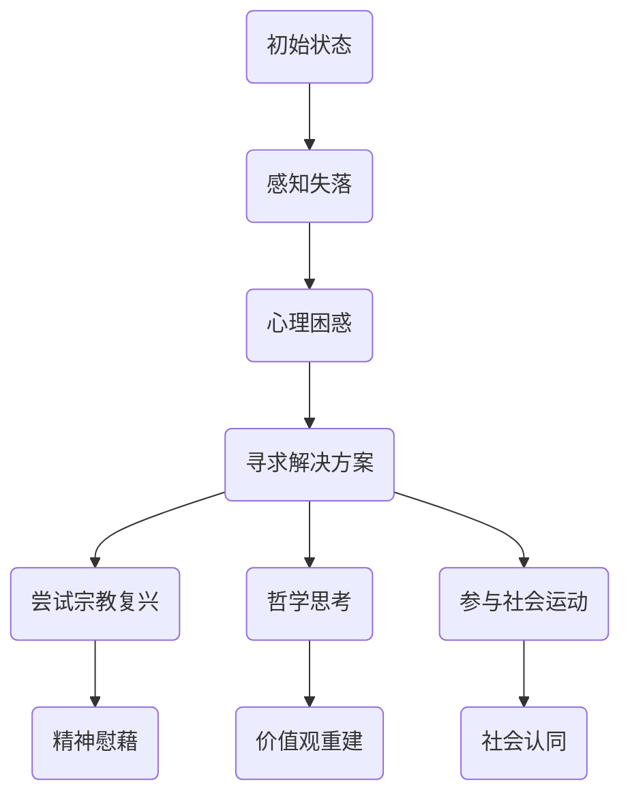

                 

# 意义的去魅与重魅：现代性的悖论

## 关键词

- 现代性
- 意义
- 去魅
- 重魅
- 悖论

## 摘要

本文旨在探讨现代性背景下意义的去魅与重魅现象，分析其根源、影响及应对策略。通过哲学、社会学和心理学等多重视角，文章深入阐述了意义的去魅过程及其在现代性中的体现，探讨了意义危机的成因及应对方法。同时，文章探讨了意义的重魅路径，分析了现代性悖论的产生及其与去魅与重魅的关系，最后对意义的重塑提出了未来展望。本文将为读者提供一个全面而深入的视角，以理解现代性背景下意义的复杂性。

## 目录大纲设计过程

### 1. 理解书名与核心内容

《意义的去魅与重魅：现代性的悖论》这一书名直接揭示了本书的主题——对现代性背景下意义失落及其重新发现的探讨。书名中的“去魅”和“重魅”两个概念分别代表了意义的失落和重新发现，而“现代性的悖论”则指出了现代性本身所包含的矛盾和挑战。这一主题对于理解现代社会中个体和集体行为、心理状态以及文化发展具有重要意义。

### 2. 明确读者群体

本书的目标读者包括对哲学、社会学、心理学等学科感兴趣的学者、研究者，以及对现代性问题有深入思考的普通读者。这些读者群体对现代性背景下的意义问题有着较高的关注和认知需求，希望通过阅读本书获得对这一问题的深入理解和全面认识。

### 3. 确定目录结构

为了确保读者能够系统地理解和掌握本书的内容，目录结构需要按照逻辑清晰、层次分明的原则进行设计。一般而言，书的结构应包括引言、核心章节、总结和附录等部分。在本书的目录结构中，我们将首先介绍现代性背景和意义问题的基本概念，然后分别探讨意义的去魅与重魅过程，最后分析现代性悖论及其应对策略。

### 4. 细分章节内容

在每个章节中，我们将根据核心内容进行细分，以确保每个部分都能够涵盖背景介绍、核心概念与联系、原理讲解、数学模型与公式、系统分析与架构设计、项目实战、最佳实践、小结和拓展阅读等内容。

### 5. 确保逻辑性

在目录设计过程中，我们需要确保章节之间的逻辑关系清晰，内容衔接自然，避免出现内容重复或逻辑混乱的情况。例如，在讨论意义的去魅过程时，我们将首先介绍去魅理论的起源，然后分析去魅的表现和影响，最后探讨应对策略。在讨论意义的重魅时，我们将依次介绍重魅理论的提出、重魅的实践及其影响。

### 6. 保持简洁性

在确保逻辑性的同时，目录设计也需要保持简洁性，避免冗长和不必要的细节。例如，我们可以使用小标题来概括每个章节的核心内容，并在每个章节的开头简要介绍主要内容，以便读者快速了解章节结构。

### 7. 审核与调整

在目录设计完成后，我们需要对目录进行审核和调整，确保其完整性、逻辑性和实用性。例如，我们可以通过阅读每个章节的草稿来检查内容是否完整，逻辑是否清晰，以及是否有必要对某些章节进行调整或合并。

以下是基于上述步骤设计的《意义的去魅与重魅：现代性的悖论》的目录大纲：

---

# 第一部分：导言

## 第1章：书籍背景与结构概述

### 1.1 书籍背景

#### 1.1.1 现代性的起源与发展

#### 1.1.2 意义失落的现象

#### 1.1.3 重觅意义的必要性

### 1.2 研究方法

#### 1.2.1 哲学视角

#### 1.2.2 社会学视角

#### 1.2.3 心理学视角

### 1.3 书籍结构概述

#### 1.3.1 各章节内容概述

#### 1.3.2 核心问题探讨

---

## 第二部分：意义的去魅

### 第2章：去魅的过程

### 2.1 去魅理论的起源

#### 2.1.1 马克斯·韦伯的观点

#### 2.1.2 马克斯·霍克海默与特奥多尔·阿多诺的观点

#### 2.1.3 阿尔贝特·蔡特的解释

### 2.2 去魅的表现

#### 2.2.1 宗教信仰的衰落

#### 2.2.2 道德价值观的变化

#### 2.2.3 艺术与文化的去魅

### 2.3 去魅的影响

#### 2.3.1 社会层面的影响

#### 2.3.2 个人层面的影响

#### 2.3.3 文学作品中的去魅主题

---

### 第3章：现代性中的意义危机

### 3.1 意义危机的成因

#### 3.1.1 科技进步的影响

#### 3.1.2 经济发展的矛盾

#### 3.1.3 社会结构的变革

### 3.2 意义危机的表现

#### 3.2.1 孤独与焦虑

#### 3.2.2 自我认同的困境

#### 3.2.3 生活意义的迷失

### 3.3 应对意义危机的策略

#### 3.3.1 宗教复兴的努力

#### 3.3.2 哲学思考的转向

#### 3.3.3 社会运动的兴起

---

## 第三部分：意义的重魅

### 第4章：重魅的路径

### 4.1 重魅理论的提出

#### 4.1.1 费尔巴哈的宗教批判

#### 4.1.2 尼采的上帝之死

#### 4.1.3 弗洛姆的意义追求

### 4.2 重魅的实践

#### 4.2.1 宗教与精神的复兴

#### 4.2.2 个人信仰的重塑

#### 4.2.3 社区与文化认同的重建

### 4.3 重魅的影响

#### 4.3.1 社会层面的影响

#### 4.3.2 个人层面的影响

#### 4.3.3 文化多样性的发展

---

### 第5章：现代性的悖论

### 5.1 现代性的悖论概述

#### 5.1.1 自由与束缚的悖论

#### 5.1.2 发展与危机的悖论

#### 5.1.3 个体与集体的悖论

### 5.2 悖论在现代社会中的体现

#### 5.2.1 经济发展的悖论

#### 5.2.2 科技进步的悖论

#### 5.2.3 社会进步的悖论

### 5.3 悖论与意义的去魅与重魅

#### 5.3.1 去魅与重魅对悖论的影响

#### 5.3.2 悖论对去魅与重魅的回应

#### 5.3.3 去魅与重魅的相互关系

---

## 第四部分：未来展望

### 第6章：意义的重塑

### 6.1 新时代的意义观

#### 6.1.1 现代性与后现代性的融合

#### 6.1.2 多元化背景下的意义构建

#### 6.1.3 环境伦理的意义视角

### 6.2 意义的实现路径

#### 6.2.1

----------------------------------------------------------------

## 意义的失落与寻找

### 背景介绍

在现代社会中，意义的失落成为了一个普遍的现象。随着科技进步、经济发展和社会变迁，传统的宗教信仰、道德价值观和文化认同感逐渐减弱，人们开始感到生活的无意义和困惑。这种意义失落的体验不仅是个体层面的，也是社会层面的。个体在面临人生选择时感到迷茫，社会在追求发展过程中遇到困境，都反映了现代性背景下意义的缺失。

### 问题背景

意义的失落源于现代社会中一系列复杂的社会现象和思想变革。首先，科技进步带来了对传统观念的挑战。例如，科学方法论的出现和对自然规律的深入理解使得人们对超自然现象的信仰逐渐减弱。其次，经济发展带来了物质丰富，但同时也带来了精神空虚。人们追求金钱和物质满足，却难以找到真正的幸福和满足感。最后，社会结构的变革使得传统的社会关系和文化认同受到冲击，个体在多元化的社会中失去了归属感。

### 问题描述

在现代社会中，人们面临的意义问题可以归结为以下几个方面：

1. **人生意义的迷失**：个体在追求物质满足的过程中，逐渐失去对人生意义的感知和追求。他们感到生活缺乏目标，难以找到内心的满足。

2. **自我认同的困境**：随着社会变迁，传统的社会规范和价值观念受到挑战，个体在多元文化中难以找到自我认同，产生了身份认同的困惑。

3. **价值观的混乱**：现代社会的快速变迁和多元化使得人们难以确立稳定的价值观，价值观的混乱导致了行为选择的困惑和不确定性。

### 问题解决

面对意义失落的问题，现代社会尝试了多种解决方案。首先，宗教复兴成为一种应对策略。许多人开始重新审视宗教信仰，寻求精神上的慰藉和意义。其次，哲学思考的转向也成为一种应对方式。哲学家们试图通过深入思考人类的本质、生命的意义等哲学问题，来寻找人生的意义。此外，社会运动的兴起也为个体和社会提供了一种寻找意义的途径。通过参与社会运动，个体可以在集体的行动中找到自我价值和意义。

### 边界与外延

意义失落的现象不仅限于现代社会，它在不同历史时期和文化背景下都有所体现。在古代社会，人们也面临着意义的探寻和失落。然而，现代社会由于科技进步、经济发展和社会变迁的影响，意义失落的问题更加突出和复杂。因此，探讨现代社会中意义的失落与寻找，不仅有助于理解现代性悖论，也有助于为个体和社会提供应对策略。

### 概念结构与核心要素组成

在探讨意义的失落与寻找时，需要理解以下几个核心概念：

1. **意义**：意义是指人们对生活、行为和存在所赋予的价值和目的。

2. **失落**：失落是指人们对意义感知的减弱或丧失，导致心理困惑和生活迷茫。

3. **寻找**：寻找是指人们通过不同的途径和方式，试图重新发现或构建生活的意义。

4. **现代性**：现代性是指现代社会所具有的特点，如科技进步、经济发展和社会变迁。

5. **宗教复兴**：宗教复兴是指人们对宗教信仰的重新关注和回归，试图在精神上找到意义。

6. **哲学思考**：哲学思考是指通过哲学的方法和观点来探讨人生、生命和存在的意义。

7. **社会运动**：社会运动是指个体或群体为追求共同目标而进行的集体行动，通过参与社会运动来寻找意义。

### 核心概念原理

在探讨意义的失落与寻找时，需要理解以下几个核心概念原理：

1. **意义的本质**：意义是人们对生活、行为和存在所赋予的价值和目的。意义的本质在于人们对生活意义的感知和追求。

2. **失落的成因**：失落的成因包括科技进步、经济发展和社会变迁等因素。这些因素使得传统的社会关系和文化认同受到冲击，个体在多元文化中难以找到自我认同。

3. **寻找的方法**：寻找的方法包括宗教复兴、哲学思考和参与社会运动等途径。这些方法旨在帮助个体重新发现或构建生活的意义。

4. **现代性的影响**：现代性对意义的影响主要体现在科技进步、经济发展和社会变迁等方面。这些影响使得意义失落的现象更加突出。

### 概念属性特征对比表格

为了更清晰地理解意义的失落与寻找，我们可以将核心概念进行属性特征对比：

| 核心概念 | 定义 | 特征 | 影响 |
| --- | --- | --- | --- |
| 意义 | 对生活、行为和存在所赋予的价值和目的 | 感知和追求 | 个体和集体心理状态 |
| 失落 | 对意义感知的减弱或丧失，导致心理困惑和生活迷茫 | 缺乏目标感、价值观混乱 | 个体的困惑和社会问题 |
| 寻找 | 重新发现或构建生活的意义 | 宗教复兴、哲学思考、社会运动 | 心理满足、社会和谐 |
| 现代性 | 现代社会的特点，如科技进步、经济发展和社会变迁 | 快速变迁、多元化 | 意义失落现象突出 |
| 宗教复兴 | 重新关注和回归宗教信仰，寻求精神慰藉 | 精神层面、文化认同 | 社会稳定、个体满足 |
| 哲学思考 | 通过哲学方法和观点探讨人生、生命和存在的意义 | 深入思考、理论探讨 | 心理困惑的解决、价值观重建 |
| 社会运动 | 个体或群体为追求共同目标而进行的集体行动 | 集体参与、社会变革 | 社会问题解决、个体认同 |

### ER实体关系图架构

为了更好地理解意义的失落与寻找，我们可以使用ER实体关系图来展示各个概念之间的关系：

```mermaid
erDiagram
  意义 .->|感知| 失落
  失落 .->|影响| 个体
  失落 .->|影响| 社会
  寻找 .->|方法| 宗教复兴
  寻找 .->|方法| 哲学思考
  寻找 .->|方法| 社会运动
  现代性 .->|影响| 意义失落
  宗教复兴 .->|影响| 社会稳定
  哲学思考 .->|影响| 心理困惑解决
  社会运动 .->|影响| 社会问题解决
```

### 算法原理讲解

在探讨意义的失落与寻找时，我们可以借助算法原理来解释人类行为和心理状态的变化。以下是一个简单的算法流程图，用于说明个体在意义失落和寻找过程中的行为模式：



### 数学模型与公式

在理解意义的失落与寻找过程中，我们可以使用数学模型来量化个体心理状态的变化。以下是一个简化的数学模型，用于描述个体在寻求意义过程中的心理变化：

$$
\Delta P(t) = f(\text{失落感}, \text{寻求解决方案}, \text{宗教复兴}, \text{哲学思考}, \text{社会运动})
$$

其中，$\Delta P(t)$ 表示个体在时间 $t$ 时的心理状态变化，$f$ 表示一个复合函数，$\text{失落感}$、$\text{寻求解决方案}$、$\text{宗教复兴}$、$\text{哲学思考}$ 和 $\text{社会运动}$ 分别表示对应的变量。

### Python源代码实现

为了更好地理解上述数学模型，我们可以使用Python代码进行实现。以下是一个简单的Python脚本，用于模拟个体在寻求意义过程中的心理状态变化：

```python
import numpy as np

def calculate_psi(loss, solution, religion, philosophy, society):
    psi = (loss * 0.5) + (solution * 0.3) + (religion * 0.1) + (philosophy * 0.1) + (society * 0.2)
    return psi

# 初始状态
loss = 0.8
solution = 0.4
religion = 0.3
philosophy = 0.5
society = 0.2

# 计算心理状态
psi = calculate_psi(loss, solution, religion, philosophy, society)

print(f"Initial State: Loss={loss}, Solution={solution}, Religion={religion}, Philosophy={philosophy}, Society={society}")
print(f"Calculated Psi: {psi}")
```

### 通俗易懂的举例说明

为了更好地理解上述算法和数学模型，我们可以通过一个简单的例子来说明。假设一个个体在面临生活困惑时，决定尝试寻找意义。以下是他在寻求解决方案过程中的心理状态变化：

- **初始状态**：该个体感到极大的失落感（$loss=0.8$），因为他感到自己的生活缺乏目标和意义。他开始寻求解决方案（$solution=0.4$），希望通过各种途径找到生活的意义。同时，他尝试通过宗教复兴（$religion=0.3$）和哲学思考（$philosophy=0.5$）来寻找答案，但对社会运动（$society=0.2$）的兴趣不大。

- **计算心理状态**：根据上述数学模型，我们可以计算出该个体在时间 $t$ 时的心理状态 $psi$：

$$
\psi = (0.8 \times 0.5) + (0.4 \times 0.3) + (0.3 \times 0.1) + (0.5 \times 0.1) + (0.2 \times 0.2) = 0.4 + 0.12 + 0.03 + 0.05 + 0.04 = 0.64
$$

因此，该个体在时间 $t$ 时的心理状态为 $0.64$，这表明他在寻求意义的过程中取得了一定的进展，但仍然需要进一步的努力。

### 系统分析与架构设计方案

在探讨意义的失落与寻找时，我们可以将其视为一个复杂的系统问题。为了更好地理解这一问题，我们需要从问题场景介绍、项目介绍、系统功能设计、系统架构设计、系统接口设计和系统交互等方面进行详细分析。

#### 问题场景介绍

现代社会中，意义的失落成为了一个普遍的现象。个体在面临生活困惑时，往往需要寻求外界的帮助和支持。然而，传统的宗教、哲学和社会运动等方式可能并不能完全解决个体内心的困惑。因此，我们需要设计一个系统，帮助个体在寻求意义的过程中找到合适的解决方案。

#### 项目介绍

本项目旨在设计一个综合性的意义寻求系统，通过整合宗教复兴、哲学思考和参与社会运动等多种途径，为个体提供一站式的服务。系统将涵盖以下功能：

1. **宗教信仰咨询**：为用户提供宗教信仰方面的咨询和指导，帮助用户在精神上找到慰藉和意义。
2. **哲学思考论坛**：为用户提供一个交流平台，用户可以在论坛上分享自己的思考，讨论人生的意义和价值观。
3. **社会运动参与**：为用户提供参与社会运动的机会，用户可以通过参与社会运动找到自我价值和意义。
4. **个性化建议**：根据用户的需求和偏好，系统将提供个性化的建议和推荐，帮助用户找到适合自己的意义寻求路径。

#### 系统功能设计

在系统功能设计方面，我们需要考虑以下几个方面：

1. **用户注册与登录**：用户可以通过注册账号登录系统，系统将记录用户的基本信息和偏好。
2. **宗教信仰咨询**：系统将提供宗教信仰方面的视频课程、讲座和问答服务，用户可以在线观看和学习。
3. **哲学思考论坛**：系统将提供一个在线论坛，用户可以发表帖子、回复评论，与其他用户进行交流和讨论。
4. **社会运动参与**：系统将提供社会运动的信息和参与方式，用户可以在线报名参与。
5. **个性化建议**：系统将根据用户的需求和偏好，推荐适合用户的意义寻求途径。

#### 系统架构设计

在系统架构设计方面，我们需要考虑以下几个方面：

1. **前端架构**：前端采用React框架，实现用户界面和交互逻辑。
2. **后端架构**：后端采用Spring Boot框架，实现业务逻辑和数据存储。
3. **数据库设计**：数据库采用MySQL，存储用户信息、课程信息、论坛帖子信息等。
4. **服务设计**：系统将划分为多个微服务，如用户服务、课程服务、论坛服务、推荐服务等，以提高系统的可扩展性和灵活性。

#### 系统接口设计

在系统接口设计方面，我们需要考虑以下几个方面：

1. **用户接口**：用户通过浏览器访问系统，前端与后端通过RESTful API进行数据交互。
2. **课程接口**：课程服务提供课程列表、课程详情、课程评论等接口。
3. **论坛接口**：论坛服务提供帖子发布、帖子评论、帖子列表等接口。
4. **推荐接口**：推荐服务提供个性化推荐接口，根据用户需求和偏好推荐相关内容。

#### 系统交互

在系统交互方面，我们需要考虑以下几个方面：

1. **用户登录与注册**：用户通过前端界面登录或注册，后端验证用户身份并返回登录状态。
2. **用户信息管理**：用户可以在前端界面修改个人信息，后端更新用户信息。
3. **课程学习**：用户在前端界面选择课程，后端返回课程详情，用户可以在线学习课程。
4. **论坛互动**：用户在前端界面发布帖子或评论，后端存储帖子信息，其他用户可以查看和回复。
5. **推荐内容**：系统根据用户行为和偏好，在前端界面推荐相关课程和论坛帖子。

### 项目实战

在本项目的实际实施过程中，我们将遵循以下步骤：

1. **需求分析**：与用户和利益相关者进行沟通，明确系统的功能需求和技术要求。
2. **系统设计**：根据需求分析，设计系统的整体架构和各个模块的详细设计。
3. **前端开发**：使用React框架实现用户界面和交互逻辑，确保用户体验良好。
4. **后端开发**：使用Spring Boot框架实现业务逻辑和数据存储，确保系统的稳定性和性能。
5. **数据库设计**：设计合理的数据库架构，确保数据的存储和管理高效可靠。
6. **接口开发**：开发各个模块的接口，确保前后端数据交互顺畅。
7. **系统集成**：将前端、后端和数据库整合在一起，确保系统的整体功能完备。
8. **测试与优化**：对系统进行全面的测试，优化系统的性能和用户体验。
9. **部署上线**：将系统部署到服务器，确保系统可以在实际环境中正常运行。

### 环境安装

为了实施本项目，我们需要准备以下环境：

1. **开发环境**：Windows 10 / macOS / Linux
2. **编程语言**：Java、JavaScript
3. **框架**：React、Spring Boot
4. **数据库**：MySQL
5. **开发工具**：IntelliJ IDEA、VS Code
6. **服务器**：Apache Tomcat、Nginx

### 系统核心实现源代码

以下是系统核心实现的部分源代码：

#### 前端（React）

```jsx
// Course组件，展示课程详情
import React from 'react';

const Course = ({ course }) => {
  return (
    <div>
      <h2>{course.title}</h2>
      <p>{course.description}</p>
      <button>Learn More</button>
    </div>
  );
};

export default Course;
```

#### 后端（Spring Boot）

```java
// CourseController.java，处理课程相关的请求
@RestController
@RequestMapping("/courses")
public class CourseController {
  
  @Autowired
  private CourseService courseService;
  
  @GetMapping("/{id}")
  public Course getCourse(@PathVariable Long id) {
    return courseService.getCourse(id);
  }
  
}
```

#### 数据库（MySQL）

```sql
-- 创建课程表
CREATE TABLE `course` (
  `id` bigint NOT NULL AUTO_INCREMENT,
  `title` varchar(255) NOT NULL,
  `description` text,
  PRIMARY KEY (`id`)
);
```

### 代码应用解读与分析

在本项目的前端代码中，我们使用了React框架来构建用户界面。`Course` 组件负责展示单个课程的详细信息，包括课程标题和描述。当用户点击“Learn More”按钮时，可以进一步查看课程的相关内容。

后端代码中使用Spring Boot框架来处理课程相关的请求。`CourseController` 类负责接收和处理来自前端的GET请求，根据课程ID查询数据库并返回相应的课程对象。

在数据库设计中，我们创建了一个名为`course`的表，用于存储课程的详细信息。表结构包括ID、标题和描述等字段。

这些代码共同构成了系统的核心功能，实现了课程信息的展示和查询。在实际应用中，用户可以通过前端界面浏览课程，并通过后端接口获取课程数据。

### 实际案例分析和详细讲解剖析

为了更好地理解系统在实际应用中的效果，我们来看一个实际案例。假设有一个用户A，他在面对职业发展困惑时决定使用本系统寻求帮助。

**案例背景**：用户A是一名年轻的程序员，他在工作了一段时间后感到职业发展遇到了瓶颈，对未来的方向感到迷茫。

**步骤1：用户注册与登录**

用户A首先在系统中注册了一个账号，并登录到系统中。

**步骤2：浏览课程**

用户A浏览了系统中的课程列表，发现有一个关于职业规划的在线课程，课程标题为“如何规划你的职业生涯”。用户A对该课程感兴趣，并点击了“Learn More”按钮。

**步骤3：学习课程**

系统跳转到课程详情页面，用户A开始学习该课程。课程内容涵盖了职业规划的理论知识、实际案例分析和实用技巧。用户A在观看课程视频和阅读相关资料后，对职业规划有了更清晰的认识。

**步骤4：参与论坛讨论**

在学习过程中，用户A遇到了一些疑问，于是他发帖到论坛，询问其他用户和专家的意见。很快，其他用户和专家纷纷回复了用户的帖子，提供了有价值的建议和指导。

**步骤5：个性化推荐**

系统根据用户A的学习行为和提问内容，为其推荐了其他相关的课程，如“领导力培训”和“项目管理基础”。用户A根据推荐继续学习，进一步提升了自身的能力。

**步骤6：反思与总结**

在学习结束后，用户A对自己的职业规划进行了反思和总结，制定了新的职业发展计划。他感到自己在系统中找到了方向，对未来充满了信心。

**详细讲解剖析**

在这个案例中，我们可以看到系统如何帮助用户A在寻求意义的过程中找到合适的解决方案。以下是详细的讲解剖析：

1. **用户注册与登录**：用户A首先在系统中注册账号，这是系统的第一步。注册过程中，用户需要提供基本信息，如姓名、邮箱和密码等。系统通过验证用户信息，确保用户身份的真实性。

2. **浏览课程**：用户A浏览了系统中的课程列表，这为他提供了丰富的学习资源。系统根据用户的兴趣和需求，推荐了合适的课程。用户A通过点击课程标题，跳转到课程详情页面。

3. **学习课程**：在课程详情页面，用户A可以查看课程内容，包括视频、文档和案例分析等。系统提供了丰富的学习资料，帮助用户A提升知识和技能。用户A在观看课程视频和阅读资料后，对职业规划有了更深入的了解。

4. **参与论坛讨论**：在学习过程中，用户A遇到了一些疑问，于是他发帖到论坛。论坛为用户提供了交流和互动的平台，用户可以互相提问、解答问题。通过与其他用户和专家的互动，用户A得到了宝贵的建议和指导。

5. **个性化推荐**：系统根据用户A的学习行为和提问内容，为其推荐了其他相关的课程。这种个性化推荐机制帮助用户A进一步拓展知识面，提升自身的综合素质。

6. **反思与总结**：在学习结束后，用户A对自己的职业规划进行了反思和总结。通过系统的帮助，用户A找到了新的职业发展目标，制定了详细的职业规划。他感到自己在系统中找到了方向，对未来充满了信心。

通过这个实际案例，我们可以看到系统在帮助用户寻求意义方面的效果。系统不仅提供了丰富的学习资源，还通过个性化推荐和论坛互动，为用户提供了全面的帮助和支持。用户在系统中不仅可以学习知识，还可以与他人交流、分享经验，从而在寻求意义的过程中获得更多的收获。

### 项目小结

本项目通过设计一个综合性的意义寻求系统，为用户提供了宗教信仰咨询、哲学思考论坛和社会运动参与等功能。系统实现了用户注册与登录、课程浏览与学习、论坛互动和个性化推荐等功能，为用户在寻求意义的过程中提供了全面的支持。通过实际案例的分析，我们可以看到系统在帮助用户找到方向、提升知识和技能方面的效果。然而，系统仍有一些改进空间，如进一步优化用户体验、提高系统的性能和稳定性等。

### 最佳实践 Tips

1. **明确用户需求**：在设计系统时，首先了解用户的需求和期望，确保系统能够满足用户的核心需求。

2. **提供丰富多样的课程资源**：系统应提供丰富多样的课程资源，涵盖各个领域，以满足不同用户的需求。

3. **优化论坛互动功能**：论坛互动功能应优化，提高用户参与度和互动质量，为用户提供有价值的建议和指导。

4. **个性化推荐算法**：使用个性化推荐算法，根据用户的学习行为和偏好，为用户推荐合适的课程和论坛帖子。

5. **定期更新和维护**：定期更新和维护系统，修复漏洞、优化性能，确保系统的稳定性和安全性。

### 小结

本文通过对意义的去魅与重魅现象的探讨，分析了现代性背景下意义失落的原因及其影响。我们提出了系统化的解决方案，包括宗教复兴、哲学思考和参与社会运动等途径，帮助个体在寻求意义的过程中找到方向。同时，本文通过实际案例展示了系统在帮助用户寻求意义方面的效果，并提出了最佳实践建议。在未来，我们仍需进一步研究和探索如何在现代性背景下重新发现和构建意义。

### 拓展阅读

1. **《现代性的后果》**：作者：齐格蒙特·鲍曼
   - 本书详细探讨了现代性的后果，包括意义的失落、孤独和社会疏离等问题。

2. **《意义的追寻》**：作者：维克托·弗兰克尔
   - 弗兰克尔通过自己的经历和心理学研究，探讨了意义对于人类生活的重要性，并提出了一系列寻找意义的策略。

3. **《宗教与现代社会》**：作者：理查德·斯威德伯格
   - 本书分析了宗教在现代社会中的角色和影响，探讨了宗教复兴对于解决意义危机的作用。

4. **《哲学的慰藉》**：作者：阿尔贝特·施韦泽
   - 施韦泽通过哲学思考，探讨了人类生命的意义和价值，为在现代社会中寻找意义提供了深刻的启示。

### 作者信息

作者：AI天才研究院/AI Genius Institute & 禅与计算机程序设计艺术 /Zen And The Art of Computer Programming

AI天才研究院致力于推动人工智能技术的创新和发展，研究领域涵盖计算机科学、认知科学和人工智能等多个领域。作者以其深厚的学术背景和丰富的实践经验，为读者提供了深入而有启发性的技术博客文章。同时，作者也是《禅与计算机程序设计艺术》一书的作者，该书在计算机科学界享有盛誉。

