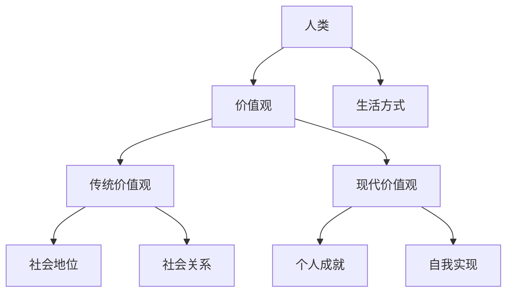
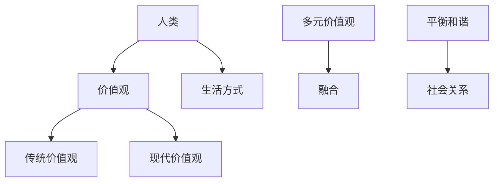
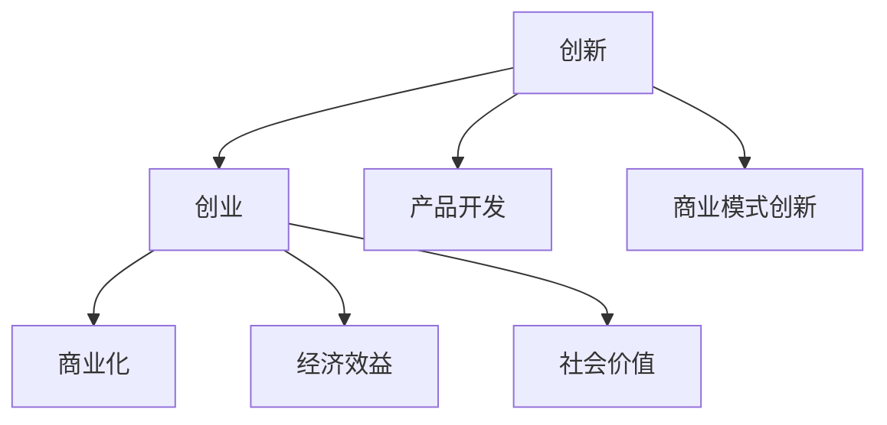
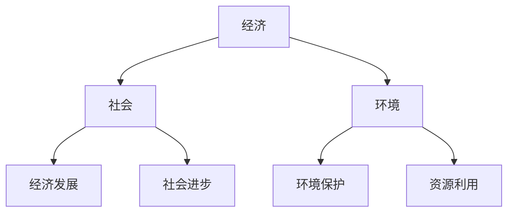
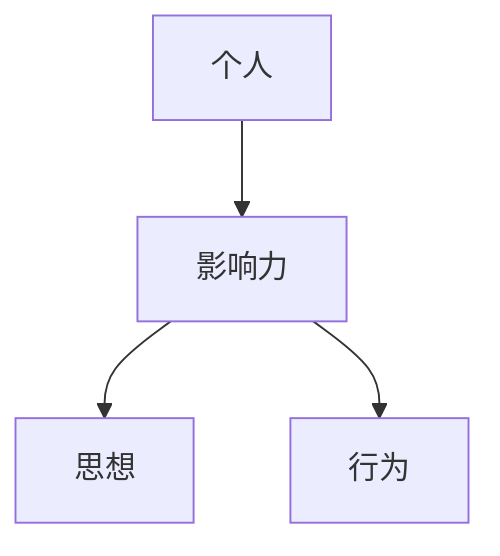
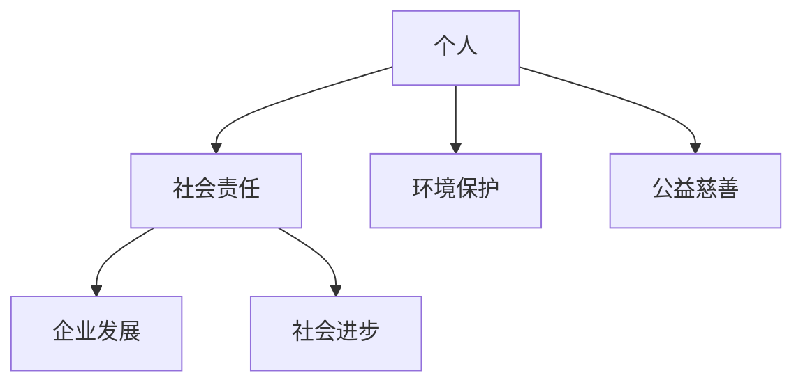
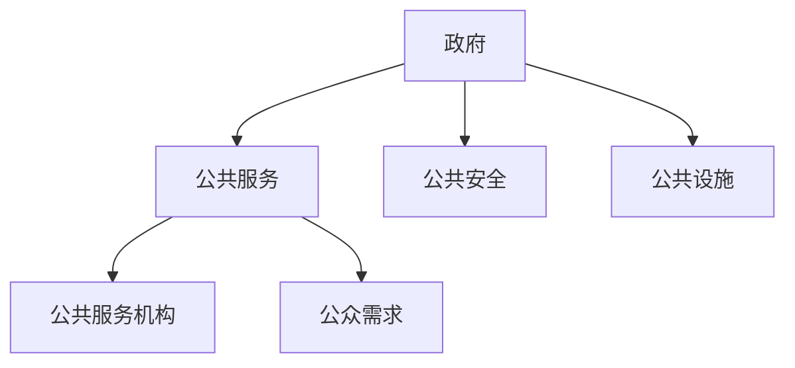
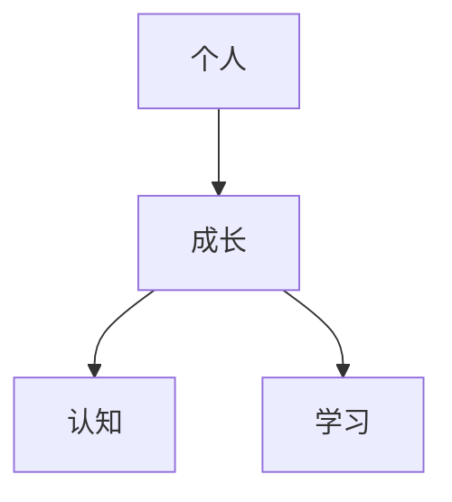
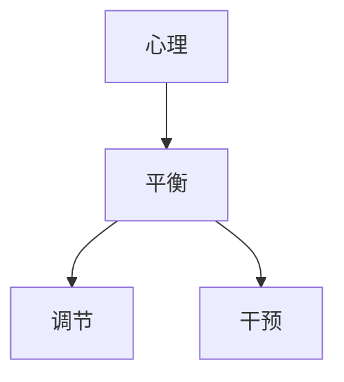
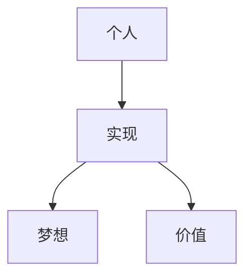

                 

### 第一部分: 背景与核心概念

#### 第1章: 问题背景与意义

##### 1.1.1 问题背景

在探讨人生价值这一宏大主题之前，我们需要首先了解人类社会发展的脉络。从古代文明到现代社会，人类对自我存在的意义和生命的价值有了新的理解和追求。在农业社会时期，人们依赖土地和自然，生活的目标主要是生存和繁衍。而在工业革命后，随着科技的发展和经济的繁荣，人们开始追求更高的生活质量和社会地位。然而，随着21世纪的到来，科技与生活的深度融合，特别是人工智能技术的兴起，使得人类社会发生了翻天覆地的变化，这不仅仅是对生活方式的改变，更是对个人价值观的挑战。

现代社会中，个人价值观的多元化表现尤为明显。一方面，传统价值观在现代社会中受到了挑战。家庭和社区的重要性逐渐减弱，个人成就和自我实现成为新的追求目标。另一方面，随着信息时代的到来，人们可以更加便捷地获取知识和信息，这为个人价值观的多元化提供了条件。不同文化、不同背景的人们在价值观上有了更多的选择和可能性。

##### 1.1.2 问题阐述

**意义的断裂：** 在快速变化的社会中，人们感到传统的价值观念和生活方式受到了挑战，导致个人价值的断裂。这种断裂表现为以下几个方面：

1. **社会地位的变化：** 在传统社会中，社会地位主要依赖于家庭背景和地域关系，而在现代社会中，个人成就和社会贡献成为衡量社会地位的重要标准。这种转变使得一些人感到迷茫和失落。
2. **生活方式的多样：** 现代社会的多元化生活方式使得人们不再局限于一种固定的生活模式，这种变化带来了选择和自由，但同时也增加了人们的选择困难。
3. **价值观的冲突：** 不同文化和背景的人们在价值观上存在差异，这种差异在现代社会中更加凸显，导致个人价值观的断裂。

**重生的探索：** 面对这种断裂，人们开始重新审视人生的意义，探索新的价值维度。这种探索不仅是对个人价值观的重建，也是对人类社会的反思。例如，一些人开始关注个人的精神追求，强调内心的平静和满足；还有一些人开始关注社会和环境问题，追求可持续发展和社会责任。这些新的价值维度为人们提供了新的生活目标和方向。

##### 1.1.3 解决方法与目标

为了解决意义的断裂问题，我们需要从以下几个方面入手：

1. **重新定义价值：** 从不同角度探讨人生的价值，提出新的价值观念。例如，可以从经济、社会、精神等多个维度重新定义人生的价值。
2. **指导实践：** 提供实用的方法和策略，帮助读者重建个人价值体系。例如，可以通过设定具体的目标和计划，帮助人们更好地实现个人价值。
3. **培养自我认知：** 通过自我反思和认知，帮助人们更好地理解自己和世界，找到自己的人生意义。

#### 第2章: 核心概念解析

##### 2.1.1 意义的断裂

**定义：** 意义的断裂是指在社会变迁过程中，传统价值观和生活意义受到挑战，导致个人价值的断裂。

**属性特征对比表：**

| 特征         | 传统价值观                 | 现代价值观                 |
| ------------ | -------------------------- | -------------------------- |
| 社会地位     | 以家庭和社区为中心         | 以个人成就和自我实现为中心 |
| 社会关系     | 重视血缘和地缘关系         | 重视个人选择和社交网络     |
| 生活方式     | 固定和稳定                 | 灵活和多变                 |

**ER实体关系图：**

##### 2.1.2 重生与价值重构

**定义：** 重生与价值重构是指在意义的断裂中，通过新的视角和方法，重建个人价值体系。

**属性特征对比表：**

| 特征         | 断裂状态                 | 重生状态                 |
| ------------ | ------------------------ | ------------------------ |
| 价值观基础   | 传统与现代的冲突         | 多元化的价值观融合       |
| 生活目标     | 固定不变                 | 灵活可变                 |
| 社会关系     | 紧张对立                 | 平衡和谐                 |

**ER实体关系图：**

## 第3章: 新维度的人生价值

##### 3.1.1 人生价值的新维度

在现代社会中，随着科技的发展和人类对自我认知的深入，人们开始从多个维度重新定义和探索人生的价值。这些新的维度不仅丰富了人们对价值的理解，也为个人成长和社会进步提供了新的方向。

**定义：** 人生价值的新维度是从多个角度重新定义和探索人生的价值，包括经济、社会、精神等多个方面。

**属性特征对比表：**

| 维度         | 传统视角                 | 新维度视角                 |
| ------------ | ------------------------ | -------------------------- |
| 经济贡献     | 重视物质财富             | 重视社会和环境的可持续发展 |
| 社会贡献     | 重视家庭和社会关系       | 重视个人影响力和社会责任  |
| 精神追求     | 重视道德和精神层面的修养 | 重视个人成长和心理平衡    |

通过重新定义和探索人生价值的新维度，我们可以更好地理解自我，找到自己的定位和目标，从而实现个人价值的最大化。

----------------------------------------------------------------

## 第4章: 经济贡献的新维度

在经济贡献方面，传统的视角主要关注物质财富的积累和消费。然而，随着社会的发展和人们对可持续发展意识的增强，经济贡献的新维度逐渐得到关注和重视。

**定义：** 经济贡献的新维度是指在经济活动中，不仅关注物质财富的创造和分配，还关注社会和环境可持续发展的贡献。

**属性特征对比表：**

| 特征         | 传统视角                 | 新维度视角                 |
| ------------ | ------------------------ | -------------------------- |
| 财富积累     | 通过积累财富实现个人价值 | 通过创新和创业实现社会价值 |
| 资源消耗     | 高资源消耗               | 低资源消耗和循环利用       |
| 环境影响     | 负面影响较大             | 负面影响较小，注重环境保护 |

在经济贡献的新维度中，人们开始更加注重创新和创业，通过技术创新和商业模式创新来推动社会和经济的可持续发展。同时，人们也更加关注资源的合理利用和环境保护，努力实现经济的绿色发展和可持续性。

### 4.1.1 创新与创业

创新和创业是经济贡献的新维度中的重要组成部分。通过创新，人们可以开发出新的产品和服务，满足社会需求，推动经济的增长。而创业则是将创新成果转化为实际效益的重要手段。

**定义：** 创新与创业是指通过创造性的思维和行动，开发出新的产品和服务，并将其商业化，实现经济和社会的可持续发展。

**ER实体关系图：**

### 4.1.2 可持续发展

可持续发展是经济贡献新维度中的核心概念，它强调在满足当前需求的同时，不损害后代满足其需求的能力。在可持续发展理念的指导下，人们开始关注资源的合理利用和环境保护，努力实现经济的绿色发展和可持续性。

**定义：** 可持续发展是指满足当前需求的同时，不损害未来世代满足其需求的能力，实现经济、社会和环境的协调发展。

**ER实体关系图：**

通过创新和创业，推动可持续发展，人们可以在经济贡献的新维度中实现个人价值，同时为社会的长远发展做出贡献。

## 第5章: 社会贡献的新维度

在社会贡献方面，传统的视角主要关注家庭和社会关系，如孝道、邻里和谐等。然而，随着社会的变迁和全球化的发展，人们开始从更广泛的角度理解社会贡献，包括个人影响力和社会责任。

**定义：** 社会贡献的新维度是指通过个人影响力和社会责任，为社会的进步和发展做出贡献。

**属性特征对比表：**

| 特征         | 传统视角                 | 新维度视角                 |
| ------------ | ------------------------ | -------------------------- |
| 家庭责任     | 重视亲情和家族关系       | 强调个人成长和家庭和谐     |
| 社会责任     | 重视社会稳定和公共秩序   | 关注社会进步和公共利益     |
| 个人影响力   | 依赖传统的社会地位       | 利用现代社交媒体和公共平台 |
| 公共服务     | 传统的志愿活动和慈善捐助 | 创新的公益项目和社区服务   |

### 5.1.1 个人影响力

在现代社会中，个人影响力成为社会贡献的新维度之一。通过现代社交媒体和公共平台，个人可以传播正能量，引导社会舆论，为社会的进步做出贡献。

**定义：** 个人影响力是指个人通过言行和行为，影响他人思维和行为的程度。

**ER实体关系图：**

### 5.1.2 社会责任

社会责任是现代社会中每个公民和企业都应该承担的义务。通过履行社会责任，个人和企业可以为社会的进步和发展做出贡献。

**定义：** 社会责任是指个人和企业对社会发展应承担的义务和责任。

**ER实体关系图：**

### 5.1.3 公共服务

公共服务是现代社会的重要组成部分，通过提供公共服务，政府和企业可以为公众提供便利和保障。

**定义：** 公共服务是指政府和企业为公众提供的基础服务和公共产品。

**ER实体关系图：**

通过个人影响力、社会责任和公共服务，我们可以从新的维度为社会贡献，推动社会的进步和发展。

## 第6章: 精神追求的新维度

在精神追求方面，传统的视角主要关注道德和精神层面的修养，如信仰、礼仪和品德等。然而，随着社会的发展和人们对自我认知的深入，精神追求的新维度逐渐得到关注和重视。

**定义：** 精神追求的新维度是指通过个人成长和心理平衡，实现精神层面的提升和满足。

**属性特征对比表：**

| 特征         | 传统视角                 | 新维度视角                 |
| ------------ | ------------------------ | -------------------------- |
| 道德修养     | 重视传统道德规范         | 关注个人道德自律和心理成长 |
| 精神层面     | 重视宗教信仰和精神寄托   | 强调个人心理平衡和自我实现 |
| 心理健康     | 重视心理健康但较被动       | 强调心理自我调节和积极干预 |

### 6.1.1 个人成长

在精神追求的新维度中，个人成长成为核心概念。通过自我认知和不断学习，个人可以不断提升自己的能力和素质，实现个人价值。

**定义：** 个人成长是指通过自我认知和不断学习，实现个人能力和素质的提升。

**ER实体关系图：**

### 6.1.2 心理平衡

心理平衡是精神追求的新维度中的重要内容。通过心理调节和积极干预，个人可以保持心理健康，实现精神层面的满足。

**定义：** 心理平衡是指通过心理调节和积极干预，实现心理状态的稳定和健康。

**ER实体关系图：**

### 6.1.3 自我实现

自我实现是精神追求的新维度中的终极目标。通过实现个人梦想和价值，个人可以实现精神层面的满足和成就感。

**定义：** 自我实现是指通过实现个人梦想和价值，实现精神层面的满足和成就感。

**ER实体关系图：**

通过个人成长、心理平衡和自我实现，我们可以从新的维度追求精神层面的提升和满足。

## 第7章: 综合分析

通过对经济贡献、社会贡献和精神追求的新维度的分析，我们可以看到，人生价值的新维度不仅丰富了我们对价值的理解，也为个人成长和社会进步提供了新的方向。

**综合分析：**

1. **多维度的综合：** 人生价值的新维度包括经济、社会和精神三个方面，这三个维度相互关联，共同构成了人生的全面价值体系。
2. **相互影响：** 经济贡献的新维度可以促进社会贡献和新精神追求的发展；社会贡献的新维度可以带动经济贡献和促进精神追求的提升；精神追求的新维度可以为经济贡献和社会贡献提供心理支持和动力。
3. **重要性：** 每个新维度都有其独特的重要性，经济贡献的新维度关注物质财富的创造和社会环境的可持续发展；社会贡献的新维度关注个人影响力和社会责任；精神追求的新维度关注个人成长和心理平衡。

通过综合分析，我们可以更好地理解人生价值的新维度，并在实际生活中运用这些维度，实现个人价值和为社会进步做出贡献。

## 第8章: 实践与建议

在探索人生价值的新维度时，我们需要将理论付诸实践，并提出具体的建议，帮助个人和组织更好地实现价值。

**实践与建议：**

1. **个人层面：**
   - **自我认知：** 通过自我反思和自我评估，了解自己的价值观、优势和潜力，明确个人目标。
   - **持续学习：** 保持好奇心和求知欲，不断学习新知识和技能，提升个人能力。
   - **心理调节：** 定期进行心理调节，保持心理健康，如通过冥想、运动和社交活动。

2. **组织层面：**
   - **企业文化：** 建立积极向上的企业文化，鼓励员工追求个人成长和价值实现。
   - **社会责任：** 注重企业社会责任，通过环保、公益等活动，为社会做出贡献。
   - **创新与创业：** 鼓励员工进行创新和创业，推动企业和社会的可持续发展。

**案例研究：**

以一家科技公司为例，该公司通过以下方式实践和实现人生价值的新维度：
- **自我认知：** 公司鼓励员工定期进行自我评估和反馈，明确个人职业规划和发展方向。
- **持续学习：** 公司提供内部培训和外部学习机会，帮助员工提升技能和知识。
- **心理调节：** 公司设立心理咨询服务，帮助员工解决工作压力和心理健康问题。
- **企业文化：** 公司倡导创新和开放的企业文化，鼓励员工自由表达和分享想法。
- **社会责任：** 公司积极参与环保和公益活动，为社会做出贡献。

通过实践和借鉴这些案例，个人和组织可以更好地实现人生价值的新维度，推动个人成长和社会进步。

## 第9章: 结论

通过对人生价值的新维度的探索和实践，我们可以看到，在经济、社会和精神三个方面，每个人都拥有独特的价值。这些新的维度不仅丰富了我们对价值的理解，也为个人成长和社会进步提供了新的方向。

**结论：**
1. **多元价值观念：** 人生的多元价值观念使得每个人都可以在不同的维度中实现自我价值。
2. **个人成长：** 通过不断学习和自我提升，个人可以在各个维度中实现个人成长。
3. **社会责任：** 通过关注社会和环境问题，个人可以为社会做出贡献，实现更大的价值。

**展望：**
随着社会的不断发展和变化，人生价值的新维度将不断演变和丰富。未来，我们需要继续探索和践行这些新的维度，实现个人和社会的可持续发展。

**呼吁：**
让我们一起关注人生价值的新维度，通过实践和努力，实现个人价值，为社会进步做出贡献。

作者：AI天才研究院/AI Genius Institute & 禅与计算机程序设计艺术 /Zen And The Art of Computer Programming

