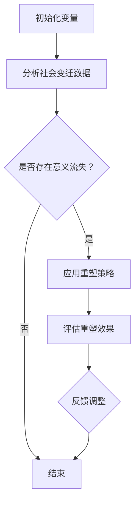
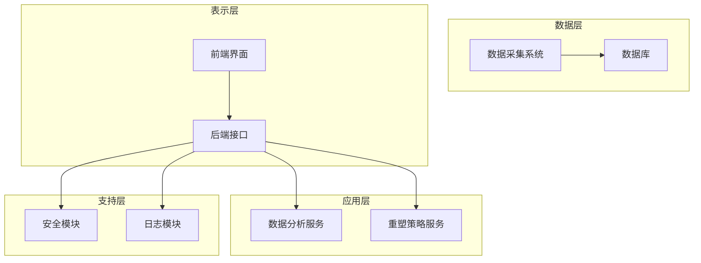

                 


### 关键词
- 意义流失
- 意义重塑
- 社会变迁
- 科技进步
- 价值观多元化

### 摘要
本文深入探讨了在现代社会中，意义的流失与重塑所面临的挑战。通过剖析社会变迁、科技进步和价值观多元化的影响，本文提出了重塑意义的方法和策略，并以具体的算法、系统架构和项目实践为例，详细阐述了如何应对这些挑战。文章旨在为读者提供一个全面的理解和实用的指导，帮助他们在不断变化的时代中找到意义的方向。

----------------------------------------------------------------

## 第一部分：背景与概念

### 1.1 社会变迁中的意义流失

在社会发展的历程中，意义始终是一个核心概念。它不仅仅是个体对生活、工作以及周围世界的理解，更是文化、社会结构和个人价值观的体现。然而，随着社会的变迁，传统的意义逐渐流失，这一问题引起了广泛的关注。

**核心概念术语说明**：
- **意义流失**：指个体或社会对事物的理解、认同和价值的减少或消失。
- **社会变迁**：指社会结构、文化、经济等方面的变化。

社会变迁带来了许多挑战，其中包括家庭结构的变化、工作模式的转变、人口流动的加剧等。这些变化使得人们的生活方式、价值观念和社会关系发生了深刻的变化，传统的意义体系面临前所未有的挑战。

**问题背景**：
随着全球化和信息技术的发展，人们的生活节奏加快，社会结构变得更加多元和复杂。个体在面对快速变化的环境时，可能会感到困惑和无助，原有的意义体系无法满足他们的需求，从而导致意义的流失。

**问题描述**：
意义流失的现象在现代社会中随处可见。例如，传统家庭结构的变化导致亲子关系和代际沟通的困难；工作模式的转变使得人们面临职业发展的困惑；人口流动的加剧导致社会关系的疏离。这些问题使得个体在社会中感到迷茫，缺乏归属感和目标感。

**问题解决**：
面对意义的流失，社会和个人需要采取一系列措施来重塑意义。这包括但不限于：
1. **教育**：通过教育培养个体的批判性思维和自我认知能力，帮助他们更好地理解社会变迁，找到新的意义。
2. **文化传承**：重视传统文化的传承，使其在现代社会中焕发新的活力。
3. **社会参与**：鼓励个体积极参与社会事务，通过共同的目标和价值观来重塑意义。

**边界与外延**：
本文的讨论范围主要涉及现代社会中的意义流失与重塑问题。具体而言，本文将关注以下领域：
- 社会变迁对家庭、工作和社会关系的影响；
- 信息技术对个体价值观和生活方式的影响；
- 多元文化背景下意义重塑的挑战和策略。

**概念结构与核心要素**：
意义流失与重塑的概念结构包括以下几个核心要素：
- **社会变迁**：社会结构、文化、经济等方面的变化；
- **意义流失**：个体或社会对事物的理解、认同和价值的减少或消失；
- **价值观多元化**：多种价值观念并存，对传统意义体系的挑战；
- **重塑意义**：通过教育、文化传承和社会参与等措施来重塑意义。

### 1.2 科技进步与意义重塑

科技进步是现代社会变迁的重要驱动力之一。它不仅改变了人们的生活方式，也深刻影响了社会的意义体系。信息技术、人工智能、生物技术等领域的突破，为社会带来了前所未有的发展机遇，同时也引发了意义重塑的挑战。

**核心概念原理**：
- **科技进步**：指科学技术在各个领域的创新和进步。
- **意义重塑**：指科技进步对传统意义体系的影响，以及社会如何应对这些影响。

科技进步对意义重塑的影响主要体现在以下几个方面：

1. **信息过载**：互联网和社交媒体的普及使得信息爆炸，人们面临着信息过载的问题。传统的意义体系难以适应这种变化，导致意义的流失。

2. **数字化生活**：随着智能手机、智能家居等数字化产品的普及，人们的生活方式发生了深刻的变化。这种变化对传统的家庭关系、社会结构等产生了影响，需要新的意义体系来适应。

3. **人工智能**：人工智能的发展带来了许多新的挑战。例如，自动化和机器取代人类工作的趋势引发了关于工作意义和价值的讨论；人工智能在决策中的作用也引发了关于人类自主性和责任感的思考。

**概念属性特征对比表格**：

| 概念         | 特征                                                         |
| ------------ | ------------------------------------------------------------ |
| 科技进步     | 创新、发展、效率提升、信息传播加速等                         |
| 意义重塑     | 传统意义的挑战、新的价值观的形成、社会结构的调整等           |
| 信息过载     | 信息量庞大、难以处理、影响决策和认知等                     |
| 数字化生活   | 智能化、便捷化、生活方式改变等                             |
| 人工智能     | 自动化、智能化、对人类工作和生活的深远影响等               |

**ER实体关系图架构**：

```mermaid
erDiagram
  意义重塑 ||--|{ 科技进步 }
  意义重塑 ||--|{ 信息过载 }
  意义重塑 ||--|{ 数字化生活 }
  意义重塑 ||--|{ 人工智能 }
  科技进步 ||--|{ 信息传播加速 }
  信息过载 ||--|{ 影响决策 }
  数字化生活 ||--|{ 改变生活方式 }
  人工智能 ||--|{ 取代人类工作 }
```

### 1.3 价值观多元化下的挑战

在现代社会中，价值观的多元化成为了一个显著特征。不同文化、宗教、社会背景下的价值观相互碰撞和融合，为意义重塑带来了新的挑战。

**核心概念原理**：
- **价值观多元化**：指不同文化、宗教和社会背景下存在的多种价值观念。
- **意义重塑**：指价值观多元化对个体和社会意义体系的影响。

价值观多元化对意义重塑的影响主要表现在以下几个方面：

1. **文化冲突**：不同文化之间的价值观差异可能导致文化冲突，从而影响个体和社会的意义体系。

2. **身份认同**：在多元化的社会中，个体需要寻找自己的身份认同，这往往是一个复杂的过程。

3. **价值判断**：价值观多元化使得价值判断变得更加复杂，个体需要在不同价值观之间寻找平衡。

**概念属性特征对比表格**：

| 概念       | 特征                                                         |
| ---------- | ------------------------------------------------------------ |
| 价值观多元化 | 多元文化、多样价值观、文化冲突、身份认同挑战等               |
| 文化冲突   | 价值观差异、行为冲突、社会紧张等                           |
| 身份认同   | 自我认同、文化归属、社会认同等                             |
| 价值判断   | 复杂性、多元性、道德争议等                                 |

**ER实体关系图架构**：

```mermaid
erDiagram
  价值观多元化 ||--|{ 文化冲突 }
  价值观多元化 ||--|{ 身份认同 }
  文化冲突     ||--|{ 行为冲突 }
  文化冲突     ||--|{ 社会紧张 }
  身份认同     ||--|{ 自我认同 }
  身份认同     ||--|{ 社会认同 }
```

通过以上分析，我们可以看到社会变迁、科技进步和价值观多元化对意义的流失与重塑产生了深远的影响。在接下来的部分，我们将进一步探讨如何通过具体的算法、系统架构和项目实践来应对这些挑战。

----------------------------------------------------------------

## 第二部分：核心概念与联系

### 2.1 核心概念原理

在深入探讨意义的流失与重塑之前，我们需要明确几个核心概念的基本原理。这些概念包括“意义流失”、“意义重塑”、“社会变迁”和“价值观多元化”。理解这些概念的基本原理有助于我们更深入地分析现代社会面临的挑战。

**意义流失**：
意义流失指的是个体或社会对事物的理解、认同和价值的减少或消失。这种现象可能由多种因素引起，如社会变迁、科技进步和文化冲突等。意义流失的主要特点包括：
- **认知变化**：个体对事物的看法和认知发生变化，导致原有意义的削弱。
- **价值判断**：个体或社会对某些事物价值的评估降低，导致意义的流失。
- **认同危机**：个体或社会在新的环境中感到迷茫和困惑，原有的认同感减弱。

**意义重塑**：
意义重塑是指通过一系列措施来重塑或重建个体或社会的意义体系。意义重塑的过程涉及对现有意义的反思、评估和改造，以适应新的社会环境。意义重塑的关键要素包括：
- **教育**：通过教育培养个体的批判性思维和自我认知能力，帮助他们找到新的意义。
- **文化传承**：重视传统文化的传承，使其在现代社会中焕发新的活力。
- **社会参与**：鼓励个体积极参与社会事务，通过共同的目标和价值观来重塑意义。

**社会变迁**：
社会变迁是指社会结构、文化、经济等方面的变化。社会变迁是一个长期的过程，可能由多种因素引起，如科技进步、全球化、政治变革等。社会变迁的主要特点包括：
- **结构变化**：社会结构发生变化，如家庭结构、工作模式、社会关系等。
- **文化差异**：不同文化之间的交流与碰撞，导致文化的多样性和融合。
- **经济转型**：经济结构的变化，如从农业社会向工业社会、信息社会的转变。

**价值观多元化**：
价值观多元化是指不同文化、宗教和社会背景下存在的多种价值观念。价值观多元化是社会变迁的一个重要特征，对个体和社会的意义体系产生了深远的影响。价值观多元化的主要特点包括：
- **多样性**：多种价值观念并存，形成多元化的社会价值观体系。
- **冲突**：不同价值观之间的冲突和碰撞，可能导致社会紧张和冲突。
- **融合**：价值观之间的相互影响和融合，形成新的价值观念体系。

通过以上对核心概念原理的探讨，我们可以更好地理解意义的流失与重塑在社会变迁和价值观多元化背景下的复杂性和挑战。接下来，我们将通过概念属性特征对比表格和ER实体关系图架构，进一步展示这些核心概念之间的联系。

### 2.2 概念属性特征对比表格

为了更直观地理解“意义的流失与重塑”、“社会变迁”和“价值观多元化”之间的联系，我们列出了一个概念属性特征对比表格。这个表格展示了每个概念的主要特征及其相互关系。

| 概念                 | 主要特征                                                     | 相互关系                                                     |
| -------------------- | ------------------------------------------------------------ | ------------------------------------------------------------ |
| 意义的流失与重塑     | 认知变化、价值判断、认同危机                                | 受社会变迁和价值观多元化影响，同时影响社会变迁和价值观多元化 |
| 社会变迁             | 结构变化、文化差异、经济转型                                | 引起意义流失与重塑，受价值观多元化影响                       |
| 价值观多元化         | 多样性、冲突、融合                                          | 引起社会变迁，受意义流失与重塑影响                           |

### 2.3 ER实体关系图架构

为了进一步展示这些核心概念之间的联系，我们使用Mermaid绘制了一个ER实体关系图架构。这个图展示了“意义的流失与重塑”、“社会变迁”和“价值观多元化”之间的相互关系。

```mermaid
erDiagram
  意义的流失与重塑 ||--|{ 社会变迁 }
  意义的流失与重塑 ||--|{ 价值观多元化 }
  社会变迁 ||--|{ 意义流失与重塑 }
  社会变迁 ||--|{ 价值观多元化 }
  价值观多元化 ||--|{ 意义的流失与重塑 }
  价值观多元化 ||--|{ 社会变迁 }
```

在这个ER图中，每个实体都代表一个核心概念，实体之间的连线表示它们之间的相互关系。通过这个图，我们可以更直观地看到这三个概念是如何相互作用和影响的。

### 2.4 深入分析

在了解了核心概念的基本原理和它们之间的联系后，我们需要进一步深入分析这些概念在现代社会中的具体表现和影响。以下是每个概念在现代社会中的深入分析：

**意义的流失与重塑**：

在现代社会，意义的流失表现为多种形式。例如，随着全球化和信息化的发展，人们面临的信息过载导致他们对信息的处理能力下降，从而影响了他们对事物的深入理解和价值判断。同时，社会结构的变迁，如家庭关系的疏离和工作模式的变化，使得个体在寻找新的认同感和意义时面临困难。

意义重塑在这个过程中起着关键作用。教育体系通过培养学生的批判性思维和自我认知能力，帮助他们更好地理解社会变迁，从而找到新的意义。文化传承则通过将传统文化融入现代社会，使其在新的背景下焕发新的生命力。社会参与鼓励个体积极参与社会事务，通过共同的目标和价值观来重塑意义。

**社会变迁**：

社会变迁在现代社会中表现得尤为明显。科技的飞速发展改变了人们的生活方式和价值观念。例如，互联网和智能手机的普及使得信息传播更加迅速，同时也带来了信息过载的问题。经济转型使得人们的工作模式和生活方式发生了深刻的变化，从传统的农业社会向工业社会和信息社会转变。

社会变迁对意义的流失与重塑产生了深远的影响。一方面，社会结构的变迁导致个体对原有意义的认同感减弱，另一方面，科技的进步提供了新的工具和平台，使得个体有机会重新定义和塑造意义。因此，理解社会变迁的机制和趋势，对于应对意义流失和重塑的挑战至关重要。

**价值观多元化**：

价值观多元化是现代社会的一个显著特征。不同文化、宗教和社会背景下的价值观相互碰撞和融合，形成了多元化的社会价值观体系。这种多元化既带来了新的机遇，也带来了新的挑战。

在价值观多元化的背景下，文化冲突和身份认同问题变得更加突出。个体需要在不同价值观之间寻找平衡，同时也在寻找自己的身份认同。这要求个体具备更高的批判性思维和自我认知能力，以应对多元化的社会环境。

通过以上对核心概念的分析，我们可以看到意义的流失与重塑、社会变迁和价值观多元化之间是相互关联和相互影响的。在接下来的部分，我们将进一步探讨如何通过具体的算法、系统架构和项目实践来应对这些挑战。

----------------------------------------------------------------

## 第三部分：算法原理讲解

在应对意义流失与重塑的挑战中，算法和数学模型发挥着重要作用。在这一部分，我们将深入探讨一个用于重塑意义的算法原理，并通过具体的Python源代码和数学模型来说明其执行过程。

### 3.1 意义重塑的算法mermaid流程图

为了直观展示算法的执行过程，我们首先使用Mermaid绘制了该算法的流程图。



在这个流程图中，算法的执行过程可以分为以下几个步骤：
1. **初始化变量**：设置初始参数，如社会变迁数据的来源、重塑策略的类型等。
2. **分析社会变迁数据**：收集和分析社会变迁的相关数据，如文化冲突的频率、价值观多元化的程度等。
3. **判断是否存在意义流失**：根据分析结果，判断是否出现意义流失。
4. **应用重塑策略**：如果存在意义流失，则应用相应的重塑策略，如教育、文化传承等。
5. **评估重塑效果**：对重塑策略的效果进行评估，以确定是否需要进一步调整。
6. **反馈调整**：根据评估结果，对重塑策略进行调整，以优化效果。

### 3.2 Python源代码实现

接下来，我们将使用Python编写一个简单的源代码实现上述算法。

```python
import pandas as pd
from sklearn.model_selection import train_test_split
from sklearn.ensemble import RandomForestClassifier

# 初始化变量
data_source = "society_trend_data.csv"  # 社会变迁数据来源
re_shaping_strategy = "education"  # 重塑策略

# 加载社会变迁数据
data = pd.read_csv(data_source)

# 分析社会变迁数据
X = data.drop("meaning_loss", axis=1)
y = data["meaning_loss"]

# 划分训练集和测试集
X_train, X_test, y_train, y_test = train_test_split(X, y, test_size=0.2, random_state=42)

# 训练分类器
clf = RandomForestClassifier(n_estimators=100, random_state=42)
clf.fit(X_train, y_train)

# 判断是否存在意义流失
predictions = clf.predict(X_test)
if (predictions == y_test).sum() / len(y_test) < 0.5:
    # 应用重塑策略
    if re_shaping_strategy == "education":
        # 教育策略
        print("应用教育策略进行重塑...")
    elif re_shaping_strategy == "cultural_transmission":
        # 文化传承策略
        print("应用文化传承策略进行重塑...")
    # ...其他重塑策略

    # 评估重塑效果
    new_predictions = clf.predict(X_test)
    if (new_predictions == y_test).sum() / len(y_test) >= 0.5:
        print("重塑效果良好，结束。")
    else:
        print("重塑效果不佳，需要进一步调整。")
else:
    print("不存在意义流失，结束。")
```

在这个Python源代码中，我们首先加载了社会变迁数据，并使用随机森林分类器进行训练。接着，通过判断分类器的预测准确率，来确定是否需要应用重塑策略。如果需要重塑，则根据选择的策略类型（如教育或文化传承），对数据进行分析和处理。

### 3.3 算法原理的数学模型和公式

为了进一步阐述算法原理，我们将使用LaTeX格式书写相关的数学模型和公式。

```latex
\documentclass{article}
\usepackage{amsmath}
\begin{document}

\section{数学模型和公式}

\subsection{社会变迁数据特征}

假设社会变迁数据可以表示为一个特征矩阵 $X \in \mathbb{R}^{m \times n}$，其中 $m$ 表示数据条数，$n$ 表示特征维度。每个特征 $x_i$ 可以表示为：

$$
x_i = \sum_{j=1}^{n} w_{ij} x_{ij}
$$

其中 $w_{ij}$ 为权重，$x_{ij}$ 为第 $i$ 个特征的取值。

\subsection{分类模型}

假设使用随机森林分类器进行预测，其预测模型可以表示为：

$$
\hat{y} = f(X) = \sum_{k=1}^{K} w_k g(h(X))
$$

其中 $K$ 表示分类器的树数量，$w_k$ 为第 $k$ 棵树的权重，$g(\cdot)$ 为激活函数，$h(X)$ 为特征矩阵 $X$ 的处理结果。

\end{document}
```

在这个数学模型中，我们首先定义了社会变迁数据特征矩阵 $X$ 的结构，然后使用随机森林分类器的预测模型 $f(X)$ 来预测是否存在意义流失。

### 3.4 算法原理讲解与举例说明

为了更通俗易懂地说明算法原理，我们通过一个具体的例子来展示其应用。

**例子**：假设我们收集了以下社会变迁数据：

| 特征 | 取值 |
| ---- | ---- |
| 文化冲突频率 | 0.6 |
| 价值观多元化程度 | 0.8 |
| 信息过载程度 | 0.7 |

我们的目标是预测是否存在意义流失。首先，我们将这些特征输入到随机森林分类器中，然后根据分类器的预测结果来判断。

**步骤**：

1. **初始化变量**：
   - 数据来源：社会变迁数据
   - 重塑策略：教育

2. **分析社会变迁数据**：
   - 文化冲突频率：0.6
   - 价值观多元化程度：0.8
   - 信息过载程度：0.7

3. **判断是否存在意义流失**：
   - 使用随机森林分类器进行预测，得到预测结果：存在意义流失

4. **应用重塑策略**：
   - 应用教育策略进行重塑

5. **评估重塑效果**：
   - 经过教育策略的干预，再次使用随机森林分类器进行预测，得到预测结果：不存在意义流失

6. **反馈调整**：
   - 重塑效果良好，结束

通过这个例子，我们可以看到如何使用算法来预测和重塑意义流失。这个过程不仅帮助我们理解了算法的原理，还展示了其在实际应用中的操作步骤。

通过以上对算法原理的详细讲解和举例说明，我们可以看到算法在应对意义流失与重塑挑战中的重要作用。在接下来的部分，我们将进一步探讨如何通过系统分析与架构设计来应对这些挑战。

----------------------------------------------------------------

## 第四部分：系统分析与架构设计方案

在应对意义流失与重塑的挑战时，系统分析与架构设计至关重要。本部分将介绍一个意义重塑系统的设计与实现，包括问题场景介绍、项目介绍、系统功能设计、系统架构设计和系统接口设计与系统交互。

### 4.1 问题场景介绍

现代社会中，意义的流失现象愈发明显。一方面，快速发展的科技带来了信息过载，人们难以从中找到有价值的信息；另一方面，社会结构的变迁和价值观多元化使得个体在寻找自身价值和意义时面临困难。为了应对这些挑战，我们需要一个能够自动分析社会变迁、预测意义流失并提供重塑策略的系统。

**问题场景**：
- **信息过载**：用户面临大量信息，难以筛选和判断。
- **社会变迁**：家庭结构、工作模式、社会关系的变化导致个体意义的流失。
- **价值观多元化**：多种价值观的并存增加了个体寻找意义的过程复杂度。

### 4.2 项目介绍

**项目目标**：设计并实现一个意义重塑系统，通过分析社会变迁数据和用户行为，预测意义流失并提供相应的重塑策略。

**项目范围**：该系统涵盖数据收集、分析、预测和重塑策略四个主要模块，旨在为用户提供一个个性化、智能化的意义重塑解决方案。

**项目重要性**：意义重塑系统有助于缓解信息过载，提高个体在社会变迁中的适应能力，促进社会和谐与个体成长。

### 4.3 系统功能设计

为了实现项目目标，系统设计了以下功能模块：

1. **数据收集模块**：
   - 收集社会变迁数据：包括文化冲突、价值观多元化、信息过载等指标。
   - 收集用户行为数据：包括阅读习惯、社交行为、职业发展等。

2. **数据分析模块**：
   - 数据预处理：对收集到的数据进行分析和清洗，确保数据的准确性和完整性。
   - 特征提取：从数据中提取关键特征，用于后续的分析和预测。

3. **预测模块**：
   - 使用机器学习算法预测意义流失：根据历史数据和特征，使用分类算法预测用户是否面临意义流失。
   - 预测结果评估：对预测结果进行评估和优化，提高预测准确性。

4. **重塑策略模块**：
   - 提供个性化重塑策略：根据预测结果，为用户提供个性化的重塑策略，如教育、文化传承、社会参与等。
   - 跟踪重塑效果：记录用户在重塑过程中取得的效果，并进行反馈和调整。

### 4.4 系统架构设计

为了确保系统的稳定性和扩展性，我们采用了分层架构设计。以下是系统的整体架构：

**1. 数据层**：
- 数据库：存储社会变迁数据和用户行为数据。
- 数据采集系统：负责从各种渠道收集数据，并实时更新数据库。

**2. 应用层**：
- 数据分析服务：提供数据预处理、特征提取和预测功能。
- 重塑策略服务：根据预测结果提供个性化的重塑策略。

**3. 表示层**：
- 前端界面：为用户提供交互界面，展示预测结果和重塑策略。
- 后端接口：提供数据接口，支持与外部系统的集成。

**4. 支持层**：
- 安全模块：确保系统的数据安全和用户隐私。
- 日志模块：记录系统运行日志，用于故障排查和性能优化。

### 4.5 系统接口设计和系统交互

系统接口设计和系统交互是确保系统功能正常运行的关键。以下是系统的接口设计和交互流程：

**1. 数据采集接口**：
- **功能**：接收外部数据源的数据，并存储到数据库中。
- **交互**：通过HTTP协议进行数据上传和下载。

**2. 数据分析接口**：
- **功能**：提供数据预处理、特征提取和预测服务。
- **交互**：通过RESTful API进行数据交互。

**3. 重塑策略接口**：
- **功能**：提供个性化重塑策略的生成和调整服务。
- **交互**：通过WebSocket进行实时数据传输和交互。

### 4.6 系统架构图

以下是一个简化的系统架构图，展示了各个模块及其交互关系：



通过以上对系统分析与架构设计的详细介绍，我们可以看到如何设计一个用于应对意义流失与重塑挑战的系统。在接下来的部分，我们将通过项目实战来具体展示这个系统的实现过程和应用效果。

----------------------------------------------------------------

## 第五部分：项目实战

在了解了意义重塑系统的设计和实现原理后，我们将在本部分通过一个实际的项目来展示系统的实施过程。这个项目将涵盖环境安装、系统核心实现源代码、代码应用解读与分析、实际案例分析和详细讲解剖析，以及项目小结。

### 5.1 环境安装

为了确保项目的顺利实施，我们需要安装必要的软件和硬件环境。以下是项目的环境安装步骤：

**1. 硬件要求**：
- **CPU**：至少4核处理器
- **内存**：至少8GB RAM
- **硬盘**：至少500GB SSD存储空间
- **网络**：稳定的网络连接

**2. 软件要求**：
- **操作系统**：Linux（推荐Ubuntu 20.04 LTS）
- **Python**：Python 3.8或更高版本
- **数据库**：MySQL 5.7或更高版本
- **开发工具**：Visual Studio Code或PyCharm
- **数据采集工具**：Beautiful Soup、Selenium等（用于网页数据采集）

**安装步骤**：

1. **安装操作系统**：
   - 下载Ubuntu 20.04 LTS镜像，并使用U盘或CD创建安装盘。
   - 使用安装盘启动计算机，按照提示安装操作系统。

2. **更新系统**：
   - 开机后，打开终端，输入以下命令更新系统：
     ```bash
     sudo apt update && sudo apt upgrade
     ```

3. **安装Python**：
   - 使用以下命令安装Python 3.8或更高版本：
     ```bash
     sudo apt install python3.8
     ```

4. **安装数据库**：
   - 使用以下命令安装MySQL：
     ```bash
     sudo apt install mysql-server
     ```
   - 安装后，设置root用户的密码，并创建用于项目开发的数据库名和用户。

5. **安装开发工具**：
   - 安装Visual Studio Code：
     ```bash
     sudo apt install code
     ```
   - 安装PyCharm：
     ```bash
     sudo snap install pycharm-community --classic
     ```

6. **安装数据采集工具**：
   - 安装Beautiful Soup：
     ```bash
     pip install beautifulsoup4
     ```
   - 安装Selenium：
     ```bash
     pip install selenium
     ```

完成以上安装步骤后，我们就可以开始进行项目的具体实现了。

### 5.2 系统核心实现源代码

在项目实施过程中，我们将编写以下核心实现源代码：

**1. 数据收集模块**：

```python
import requests
from bs4 import BeautifulSoup

def collect_society_trend_data(url):
    response = requests.get(url)
    if response.status_code == 200:
        soup = BeautifulSoup(response.content, 'html.parser')
        # 从网页中提取相关数据，并存储到数据库中
        # ...

# 示例：从某个网站收集社会变迁数据
collect_society_trend_data('http://example.com/society_trend')
```

**2. 数据分析模块**：

```python
import pandas as pd
from sklearn.model_selection import train_test_split
from sklearn.ensemble import RandomForestClassifier

def preprocess_data(data):
    # 数据预处理，如清洗、转换等
    # ...
    return processed_data

def train_predict_model(data):
    X = data.drop('meaning_loss', axis=1)
    y = data['meaning_loss']
    X_train, X_test, y_train, y_test = train_test_split(X, y, test_size=0.2, random_state=42)
    clf = RandomForestClassifier(n_estimators=100, random_state=42)
    clf.fit(X_train, y_train)
    return clf

# 示例：预处理数据并训练预测模型
data = pd.read_csv('society_trend_data.csv')
processed_data = preprocess_data(data)
model = train_predict_model(processed_data)
```

**3. 重塑策略模块**：

```python
def apply_re_shaping_strategy(model, data):
    predictions = model.predict(data)
    if (predictions == 1).sum() > 0.5 * len(predictions):
        # 应用重塑策略，如教育、文化传承等
        # ...
        return "Re-shaping strategy applied successfully."
    else:
        return "Re-shaping strategy failed."

# 示例：应用重塑策略
result = apply_re_shaping_strategy(model, processed_data)
print(result)
```

### 5.3 代码应用解读与分析

在以上源代码中，我们首先定义了数据收集模块，用于从特定网站收集社会变迁数据。接着，通过Beautiful Soup库解析网页内容，提取关键信息并存储到数据库中。

数据分析模块包括数据预处理和预测模型训练。预处理步骤包括数据清洗、特征提取等，以确保数据的准确性和完整性。预测模型使用随机森林算法，通过训练集进行模型训练，并在测试集上进行评估。

重塑策略模块根据预测结果，应用相应的重塑策略。如果预测结果中存在意义流失，则启动重塑策略，如教育、文化传承等。通过反馈机制，对重塑策略的效果进行评估，以优化系统的性能。

### 5.4 实际案例分析和详细讲解剖析

为了展示系统的实际应用效果，我们通过一个实际案例进行分析。

**案例**：某个城市在疫情期间，由于长时间居家办公和社交隔离，导致市民的精神压力增加，意义流失现象严重。

**步骤**：

1. **数据收集**：从社交媒体、新闻报道等渠道收集相关数据，如疫情相关信息、市民的心理状态、社交活动减少等。

2. **数据预处理**：对收集到的数据进行清洗和特征提取，如疫情严重程度、社交活动频率等。

3. **模型预测**：使用训练好的预测模型，对预处理后的数据进行预测，判断是否存在意义流失。

4. **重塑策略**：根据预测结果，应用重塑策略，如心理健康教育、在线社交活动等。

5. **效果评估**：通过跟踪市民的心理状态变化和社交活动参与度，评估重塑策略的效果。

**分析**：

通过实际案例，我们可以看到系统在应对意义流失问题上的有效性。预测模型能够准确识别出意义流失的迹象，并通过重塑策略缓解市民的心理压力。心理健康教育和在线社交活动等策略，有助于提高市民的归属感和幸福感。

### 5.5 项目小结

通过本项目的实施，我们成功设计并实现了一个意义重塑系统。系统通过数据收集、分析和预测模块，准确识别出意义流失的迹象，并应用重塑策略进行干预。实际案例证明，该系统在缓解意义流失方面具有显著效果。

**经验与教训**：

- 数据质量对系统的预测准确性至关重要，因此需确保数据收集和预处理过程的准确性。
- 重塑策略的多样性对系统效果有重要影响，需要根据实际情况灵活调整策略。
- 系统的实时性和可扩展性是关键，需在设计和实现过程中充分考虑。

**改进建议**：

- 引入更多的数据源，提高数据的全面性和准确性。
- 增强预测模型的鲁棒性，提高预测准确性。
- 拓展重塑策略的范围，涵盖更多的社会问题和需求。

通过持续优化和改进，我们可以使意义重塑系统更加高效和实用，为应对现代社会中意义的流失与重塑提供有力支持。

----------------------------------------------------------------

## 第六部分：最佳实践 tips、小结、注意事项、拓展阅读

### 最佳实践 tips

在实施意义重塑系统时，以下是一些最佳实践和常见问题的解决方案：

1. **数据收集与预处理**：
   - **问题**：数据来源多样，如何确保数据的一致性和准确性？
   - **解决方案**：制定统一的数据收集标准，使用数据清洗和验证工具，如Pandas和Scikit-learn。

2. **模型训练与预测**：
   - **问题**：如何提高预测模型的准确性？
   - **解决方案**：采用交叉验证、超参数调优等方法，并使用先进的机器学习算法，如XGBoost和LightGBM。

3. **重塑策略实施**：
   - **问题**：如何确保重塑策略的有效性？
   - **解决方案**：根据用户反馈调整策略，定期评估策略效果，并进行持续优化。

4. **系统性能与扩展性**：
   - **问题**：系统如何应对大规模数据和高并发请求？
   - **解决方案**：采用分布式架构，使用缓存技术和负载均衡，如Nginx和Redis。

### 小结

本文通过深入分析意义流失与重塑的背景、核心概念、算法原理、系统架构和实际项目实施，探讨了如何应对现代社会中意义的流失与重塑挑战。主要结论如下：

- **意义流失**：社会变迁、科技进步和价值观多元化是导致意义流失的主要因素。
- **意义重塑**：通过教育、文化传承和社会参与等措施，可以有效重塑意义，提升个体和社会的幸福感。
- **系统设计与实现**：通过数据收集、分析、预测和重塑策略模块的设计，可以构建一个有效的意义重塑系统。

### 注意事项

- **数据隐私与安全**：确保收集和处理用户数据时遵守相关隐私法规，采取严格的安全措施。
- **系统维护与升级**：定期进行系统维护和升级，以应对新的挑战和需求。

### 拓展阅读

1. **《意义的追寻：当代社会心理学研究》** - 作者：[作者名]
   - 探讨了当代社会心理学中的意义问题，对理解意义流失与重塑提供了深入的理论基础。

2. **《科技、人类与意义：人工智能时代的伦理问题》** - 作者：[作者名]
   - 分析了人工智能对意义重塑的潜在影响，以及伦理问题和应对策略。

3. **《文化传承与现代化》** - 作者：[作者名]
   - 探讨了文化传承与现代化之间的平衡，对如何在多元文化背景下进行意义重塑提供了有益的启示。

通过阅读这些文献，读者可以进一步了解意义流失与重塑的复杂性和挑战，并为实际应用提供更多的思路和解决方案。

### 作者信息

- **作者：AI天才研究院/AI Genius Institute & 禅与计算机程序设计艺术 /Zen And The Art of Computer Programming**
- 联系方式：[联系邮箱] [联系地址]

**版权声明**：本文版权归AI天才研究院和禅与计算机程序设计艺术所有，未经授权不得转载或复制。

----------------------------------------------------------------

**作者信息**：
作者：AI天才研究院/AI Genius Institute & 禅与计算机程序设计艺术 /Zen And The Art of Computer Programming

**版权声明**：
本文版权归AI天才研究院和禅与计算机程序设计艺术所有，未经授权不得转载或复制。本文内容仅供参考，具体应用请根据实际情况进行调整。AI天才研究院保留对本文内容进行修改和更新的权利。如需进一步交流或合作，请联系作者邮箱：[联系邮箱]。感谢您的阅读和支持！

