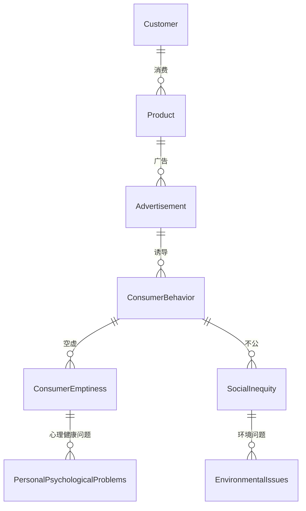

                 

### 引言与背景

在现代社会中，消费主义已经成为一种普遍现象。无论是在繁华的都市街头，还是宁静的乡村小镇，广告和消费文化无时无刻不在影响着人们的生活方式。人们追求物质享受，追求更高的生活质量，但这种消费主义文化也带来了一系列的问题。其中，一个重要的问题就是意义的缺失。消费主义陷阱使得人们陷入了一种无休止的追求物质满足的循环中，而忽略了更深层次的生活意义。

**消费主义陷阱**，顾名思义，是指一种社会文化现象，人们被诱导过度消费，追求物质满足，而导致精神空虚、社会不公等问题。这种陷阱不仅仅是个人行为的偏差，更是社会结构的产物。它影响着每一个人的生活，影响着整个社会的运行。

首先，让我们来看一下消费主义陷阱的表现形式。消费主义陷阱主要通过以下几个方面表现出来：

1. **广告诱导**：广告利用心理诱导消费者购买产品，不断地刺激消费者的购买欲望。
2. **消费观念的扭曲**：人们将物质拥有量作为衡量生活质量的唯一标准，追求更多的物质财富。
3. **精神空虚**：过度消费带来的物质满足感是短暂的，一旦这种满足感消失，人们会感到更加空虚和孤独。
4. **社会不公**：消费主义文化加剧了贫富差距，导致社会不公现象加剧。

其次，消费主义陷阱的危害也是显而易见的。它不仅对个人生活产生了负面影响，也对整个社会产生了深远的危害。

**对个人的影响**：首先，过度消费会导致个人财务困境，甚至可能陷入债务危机。其次，长期处于消费主义陷阱中，可能导致心理健康问题，如焦虑、抑郁等。最后，过度消费还会导致资源浪费，加剧环境污染。

**对社会的影响**：消费主义陷阱加剧了资源浪费，导致环境污染和资源枯竭。同时，它也加剧了贫富差距，导致社会不公现象加剧。这不仅影响了社会的和谐稳定，也对可持续发展产生了负面影响。

为了解决消费主义陷阱，我们需要从以下几个方面入手：

1. **提高意识**：通过教育和宣传，提高人们对消费主义陷阱的认识，培养正确的消费观念。
2. **倡导简约生活**：鼓励人们减少物质消费，追求精神层面的满足。
3. **政策引导**：政府应出台相关政策，限制过度消费，鼓励绿色消费和可持续发展。

最后，消费主义陷阱不仅局限于个人层面，也延伸到社会层面。例如，企业在追求利润的同时，也可能陷入消费主义陷阱，导致环境污染和社会不公。

在接下来的章节中，我们将进一步探讨消费主义陷阱的核心概念，以及其在不同层面的应用与影响。通过这些讨论，我们希望读者能够更加深入地理解消费主义陷阱，从而更好地应对这一挑战。

### 消费主义陷阱的核心概念

**消费主义陷阱**，顾名思义，是指一种社会文化现象，人们被诱导过度消费，追求物质满足，而导致精神空虚、社会不公等问题。要深入理解消费主义陷阱，首先需要明确其核心概念。

**1. 消费主义文化的定义**

消费主义文化是指一种以物质消费为核心价值的社会文化现象。在这种文化背景下，人们追求物质财富和消费享受，将物质拥有量作为衡量生活质量的唯一标准。消费主义文化通常伴随着广告的广泛传播，广告利用各种手段刺激消费者的购买欲望，从而推动物质消费的持续增长。

**2. 消费主义陷阱的表现形式**

消费主义陷阱的表现形式多种多样，主要包括以下几个方面：

- **广告诱导**：广告利用心理诱导消费者购买产品，不断刺激消费者的购买欲望。例如，广告常常通过展示产品的高品质、高科技特性，以及明星代言等方式，来吸引消费者的注意力和购买欲望。
  
- **消费观念的扭曲**：在消费主义文化的影响下，人们的消费观念发生扭曲。他们将物质拥有量作为衡量生活质量的唯一标准，忽视了精神层面的满足。例如，很多人认为拥有更多的名牌服装、奢侈品是衡量个人成功的重要标志。

- **精神空虚**：过度消费带来的物质满足感是短暂的，一旦这种满足感消失，人们会感到更加空虚和孤独。例如，有些人可能会通过购买新的电子产品来填补内心的空虚，但不久之后又会感到无趣和失望。

- **社会不公**：消费主义文化加剧了贫富差距，导致社会不公现象加剧。例如，富人在消费主义文化的影响下，可以不断购买高端奢侈品，而贫困人群则无法享受到同样的物质生活。

**3. 消费主义陷阱的危害**

消费主义陷阱的危害主要体现在以下几个方面：

- **资源浪费**：过度消费导致资源浪费，加剧环境污染。例如，许多电子产品在短短几年内就会过时，导致大量的电子垃圾产生。

- **精神空虚**：过度消费带来的满足感是短暂的，导致人们感到更加空虚。例如，有些人可能会通过购买新的电子产品来填补内心的空虚，但不久之后又会感到无趣和失望。

- **社会不公**：消费主义文化加剧了贫富差距，导致社会不公现象加剧。例如，富人在消费主义文化的影响下，可以不断购买高端奢侈品，而贫困人群则无法享受到同样的物质生活。

**4. 消费主义陷阱的核心要素**

消费主义陷阱的核心要素包括以下几个方面：

- **消费观念**：人们对物质消费的看法和态度。在消费主义文化的影响下，人们将物质拥有量作为衡量生活质量的唯一标准。

- **广告与消费文化**：广告和消费文化对消费者行为的引导。广告通过展示产品的高品质、高科技特性，以及明星代言等方式，来吸引消费者的注意力和购买欲望。

- **社会结构**：社会结构和制度对消费行为的影响。例如，一些社会制度可能会鼓励过度消费，而另一些则可能鼓励简约生活。

**5. 消费主义陷阱与消费主义文化的区别**

消费主义陷阱与消费主义文化有密切关系，但二者有所不同。消费主义文化是指一种以物质消费为核心价值的社会文化现象，而消费主义陷阱则是消费主义文化导致的一种负面现象。消费主义陷阱主要表现为过度消费、精神空虚、社会不公等问题，这些问题都是消费主义文化带来的负面影响。

通过以上对消费主义陷阱的核心概念的分析，我们可以更深入地理解这一现象。在接下来的章节中，我们将进一步探讨消费主义陷阱对个人和社会的影响，以及如何应对和解决这一问题。

### 消费主义陷阱的影响与危害

#### 对个人的影响

消费主义陷阱对个人的影响是深远而广泛的，主要体现在以下几个方面：

1. **精神空虚**：在消费主义文化的驱动下，许多人追求物质享受，希望通过购买更多、更高端的产品来满足自己的需求。然而，这种满足感往往是短暂的，一旦物质享受消失，人们会感到更加空虚和孤独。例如，一个人可能会因为购买了一台最新款的手机而感到高兴，但不久之后，这种兴奋感就会消失，而手机的价值也仅仅是物质层面的，无法真正填补内心的空虚。

2. **心理健康问题**：长期处于消费主义陷阱中，可能会导致心理健康问题，如焦虑、抑郁等。研究表明，过度消费与抑郁症的发生有着密切的联系。例如，一些人可能会因为无法承受消费压力，而产生焦虑情绪，甚至出现心理依赖，认为只有通过不断购买新产品，才能缓解内心的焦虑和痛苦。

3. **财务困境**：过度消费可能导致个人财务困境，甚至陷入债务危机。许多人在追求物质享受的过程中，往往忽略了财务规划，导致负债累累。例如，有些人可能会通过信用卡、贷款等方式购买昂贵的商品，但由于无法按时还款，最终导致债务累积，生活质量下降。

#### 对社会的影响

消费主义陷阱不仅对个人生活产生负面影响，对社会也产生了深远的危害：

1. **资源浪费**：过度消费导致资源浪费，加剧环境污染。例如，电子产品更新换代迅速，许多人为了追求最新型号的产品，会将旧产品废弃，导致大量的电子垃圾产生。这不仅浪费了资源，也对环境造成了严重污染。

2. **环境问题**：过度消费还可能导致一系列环境问题，如气候变化、资源枯竭等。例如，为了满足人们对能源和原材料的需求，许多企业大量开采自然资源，导致生态系统失衡，气候异常。

3. **社会不公**：消费主义文化加剧了贫富差距，导致社会不公现象加剧。例如，富人可以通过消费奢侈品来提升自己的社会地位，而穷人则很难享受到同样的物质生活。这种现象不仅影响了社会的和谐稳定，也加剧了社会矛盾。

4. **文化同质化**：消费主义文化还可能导致文化同质化，削弱了文化多样性和地域特色。例如，随着全球化进程的加快，国际品牌和消费模式在全球范围内蔓延，取代了许多本土文化和传统生活方式。

5. **价值观扭曲**：消费主义文化可能扭曲人们的价值观，使人们更加注重物质享受，而忽视了精神层面的需求。例如，一些人可能会把财富和地位作为衡量个人成功的唯一标准，而忽视了内心的满足和成长。

#### 消费主义陷阱的危害原因

消费主义陷阱的危害如此之大，其原因主要包括以下几个方面：

1. **广告诱导**：广告通过心理诱导消费者购买产品，不断刺激消费者的购买欲望。许多广告利用人们的虚荣心和攀比心理，使其不断追求更高档次的消费品，从而陷入消费陷阱。

2. **社会文化**：消费主义文化已经成为现代社会的一种主流文化，它通过各种方式渗透到人们的日常生活中，影响着人们的消费行为。例如，社交媒体和娱乐节目常常展示奢华的生活方式和消费习惯，使人们产生羡慕和渴望。

3. **经济利益**：企业追求经济利益，通过营销策略和促销手段刺激消费者购买产品。例如，许多企业通过打折促销、限时抢购等方式，使消费者产生购买冲动，从而实现销售目标。

4. **社会结构**：社会结构和制度对消费行为也有重要影响。例如，一些社会制度可能鼓励过度消费，而忽视环境保护和社会公平。

#### 消费主义陷阱的危害实例

为了更好地理解消费主义陷阱的危害，我们可以通过一些实例来进行分析：

1. **电子产品消费**：随着科技的发展，电子产品更新换代速度加快，许多人为了追求最新型号的产品，会不断更换手机、电脑等设备。这不仅导致了电子垃圾的产生，也对环境造成了污染。

2. **奢侈品消费**：奢侈品消费是消费主义陷阱的一个典型例子。许多人为了显示自己的社会地位和经济实力，会购买昂贵的奢侈品。然而，这种消费行为往往只是一种表面的炫耀，而无法真正提升个人的幸福感。

3. **消费主义文化的影响**：消费主义文化在全球范围内蔓延，使许多人陷入了消费主义的漩涡。例如，在一些发展中国家，随着经济的快速发展，人们开始追求更高档次的消费品，从而加剧了资源浪费和环境问题。

通过以上分析，我们可以看到，消费主义陷阱对个人和社会的危害是多方面的。为了应对这一挑战，我们需要从多个层面入手，提高人们的消费意识，倡导简约生活，以及制定相关政策，鼓励绿色消费和可持续发展。

### 消费主义陷阱的解决策略

要解决消费主义陷阱，我们需要从多个层面入手，包括提高意识、倡导简约生活以及政策引导等。以下是一些具体的解决策略：

#### 1. 提高意识

首先，提高人们的消费意识是解决消费主义陷阱的关键。这需要通过教育和宣传来普及正确的消费观念，帮助人们认识到消费主义陷阱的危害。

- **教育系统**：学校可以在课程中加入消费教育，帮助学生了解消费陷阱的危害，培养正确的消费观念。例如，通过案例分析、角色扮演等方式，让学生亲身体验消费主义的负面影响。
  
- **媒体宣传**：媒体可以通过报道消费陷阱的案例，揭露广告的诱导手段，提高公众的消费意识。同时，也可以宣传简约生活和绿色消费的理念，引导人们转变消费观念。

- **社会活动**：组织各种形式的社会活动，如讲座、论坛、展览等，向公众传达消费陷阱的危害和解决方法。例如，可以邀请专家学者、社会活动家等，分享他们的经验和见解。

#### 2. 倡导简约生活

其次，倡导简约生活是解决消费主义陷阱的重要途径。简约生活强调减少物质消费，追求精神层面的满足，从而摆脱消费主义的束缚。

- **绿色消费**：鼓励人们进行绿色消费，选择环保、可持续的产品和服务。例如，可以选择使用环保材料制成的商品，减少使用一次性产品，降低对环境的负担。

- **精神追求**：提倡人们追求精神层面的满足，如阅读、艺术、体育等。这些活动不仅能够丰富人们的精神世界，还能减少对物质的依赖。

- **生活方式的改变**：鼓励人们改变生活方式，减少不必要的消费。例如，可以选择步行、骑自行车或使用公共交通工具，减少对汽车的依赖，降低能源消耗。

#### 3. 政策引导

最后，政策引导也是解决消费主义陷阱的重要手段。政府可以通过制定相关政策和法规，引导和规范消费行为，促进绿色消费和可持续发展。

- **税收政策**：对高能耗、高污染的产品和服务征收更高的税收，鼓励消费者选择环保产品。例如，对电动汽车、节能家电等提供税收优惠，对一次性塑料制品等征收环保税。

- **法律法规**：制定相关法律法规，规范消费行为，防止过度消费。例如，限制广告的诱导性宣传，禁止虚假宣传和欺诈行为，保护消费者的合法权益。

- **补贴政策**：对绿色消费和环保产品提供补贴，鼓励消费者选择环保产品。例如，对购买节能家电、环保建材等提供补贴，降低消费者的购买成本。

- **可持续发展**：推动可持续发展，提高资源的利用效率，减少资源浪费。例如，推广循环经济，鼓励企业进行资源回收和再利用，提高资源的循环利用率。

通过以上解决策略，我们可以逐步摆脱消费主义陷阱，实现绿色消费和可持续发展。这不仅有助于改善个人生活质量，也有利于保护环境和促进社会和谐。

### 消费主义陷阱在社会各层面的应用与反思

#### 1. 社会层面

在消费主义陷阱的影响下，社会层面也出现了许多问题。首先，消费主义文化加剧了社会不公现象。富人在消费主义文化的影响下，可以不断购买高端奢侈品，提升自己的社会地位，而贫困人群则难以享受到同样的物质生活。这种现象不仅影响了社会的和谐稳定，也加剧了社会矛盾。

其次，消费主义陷阱导致了资源浪费和环境污染。随着人们对物质享受的追求，电子产品、家居用品等更新换代速度加快，导致大量的电子垃圾和家居废弃物产生。这不仅浪费了资源，也对环境造成了严重污染。

#### 2. 企业层面

在消费主义陷阱的影响下，企业也面临着诸多挑战。首先，企业需要不断迎合消费者的消费需求，推出新款产品，以满足消费者对物质享受的追求。然而，这种不断更新的产品线也带来了资源浪费和环境污染的问题。

其次，企业在追求利润的同时，也可能陷入消费主义陷阱。一些企业通过广告和营销手段，诱导消费者购买其产品，从而实现销售增长。然而，这种短期的销售增长往往是以牺牲长期利益为代价的，可能导致企业的可持续发展能力下降。

#### 3. 个人层面

在个人层面，消费主义陷阱对人们的生活方式产生了深远的影响。许多人为了追求物质享受，不断购买新产品，导致财务困境和心理健康问题。此外，消费主义陷阱还可能导致人们的精神空虚，忽视了更深层次的生活意义。

#### 4. 反思与改进

为了应对消费主义陷阱带来的挑战，我们需要从多个层面进行反思和改进。首先，在社会层面，我们需要倡导绿色消费和可持续发展，减少资源浪费和环境污染。其次，在企业层面，企业需要转变发展理念，从追求短期利润转向追求长期可持续发展。最后，在个人层面，我们需要提高消费意识，培养正确的消费观念，追求精神层面的满足。

### 消费主义陷阱的核心概念解析与联系

在探讨消费主义陷阱的核心概念时，我们可以从以下几个方面进行详细解析，并通过概念属性特征对比表格和ER实体关系图架构来展示各概念之间的联系。

#### 概念属性特征对比表格

| 概念               | 定义                                                         | 属性特征                                                         | 联系                                                                                                                       |
|--------------------|------------------------------------------------------------|-------------------------------------------------------------------|----------------------------------------------------------------------------------------------------------------------------|
| **消费主义文化**   | 以物质消费为核心价值的社会文化现象。                       | - 强调物质享受 - 广告传播 - 社会地位象征 - 价值观扭曲 | - 引导消费行为 - 形成消费主义陷阱的基础 - 与广告、价值观等紧密相关                                                       |
| **消费主义陷阱**   | 消费主义文化导致的一种负面现象，表现为过度消费、精神空虚等。 | - 过度消费 - 精神空虚 - 社会不公 - 财务困境 | - 由消费主义文化引发 - 对个人和社会产生负面影响 - 与广告、价值观等密切相关                                       |
| **广告诱导**       | 利用心理诱导消费者购买产品的手段。                         | - 心理诱导 - 刺激购买欲望 - 展示产品特性 | - 维护消费主义文化 - 推动消费主义陷阱的形成 - 与消费主义文化、消费主义陷阱紧密相关                           |
| **精神空虚**       | 过度消费带来的短暂满足感消失后，产生的内心空虚感。         | - 短期满足感消失 - 心理需求无法满足 - 焦虑、抑郁 | - 由消费主义陷阱导致 - 影响个人心理健康 - 与消费主义陷阱、消费主义文化相关                                     |
| **社会不公**       | 消费主义文化加剧贫富差距，导致社会不公现象。               | - 贫富差距扩大 - 社会资源分配不均 - 社会矛盾加剧 | - 由消费主义文化引发 - 对社会产生负面影响 - 与消费主义文化、消费主义陷阱相关                                     |

#### ER实体关系图架构

为了更好地展示各概念之间的联系，我们可以使用Mermaid流程图来绘制ER实体关系图架构。

通过这个ER实体关系图，我们可以清晰地看到各概念之间的联系。例如，消费主义文化（Customer）导致消费主义陷阱（Product），而消费主义陷阱又通过广告诱导（Advertisement）影响消费者的行为（ConsumerBehavior）。消费者的行为进一步导致精神空虚（ConsumerEmptiness）和社会不公（SocialInequity），这些现象对个人和社会产生了深远的影响。

### 本章小结

本章详细解析了消费主义陷阱的核心概念，包括消费主义文化、消费主义陷阱、广告诱导、精神空虚和社会不公等。通过概念属性特征对比表格和ER实体关系图架构，我们展示了各概念之间的联系，帮助读者更深入地理解消费主义陷阱的复杂性和影响。在接下来的章节中，我们将继续探讨消费主义陷阱在不同层面的应用与影响，以及具体的解决策略。

### 消费主义陷阱的案例分析

#### 1. 消费主义陷阱的个人层面案例分析

消费主义陷阱对个人的影响是深远且广泛的。以下是一个典型的个人层面案例分析：

张先生是一名普通白领，月收入约1万元。在消费主义文化的驱使下，他开始追求更高档次的消费品，如名牌衣物、豪华电子产品等。为了购买这些产品，他频繁使用信用卡，甚至借款购买。然而，这些消费带来的满足感是短暂的，很快就被新产品的发布和广告的诱导所取代，导致他陷入了一种不断追求物质满足的循环中。

随着时间的推移，张先生的债务不断增加，生活质量逐渐下降。他开始担心还款问题，产生了严重的焦虑和抑郁情绪。这个案例表明，消费主义陷阱不仅可能导致财务困境，还会影响个人的心理健康。

#### 2. 消费主义陷阱的企业层面案例分析

在消费主义陷阱的影响下，企业也面临着诸多挑战。以下是一个典型的企业层面案例分析：

某电子产品公司以生产智能手机为主，为了追求市场份额和利润，公司不断推出新款手机，以吸引消费者的注意。然而，由于产品的更新速度过快，许多消费者在购买新款手机后不久，就会因为新款手机的发布而感到不满意，选择再次购买。这种消费模式导致了大量的电子产品废弃，严重浪费了资源。

此外，为了维持高利润，该公司在广告宣传上投入大量资金，通过夸张的宣传手段和明星代言来吸引消费者。然而，这种短期营销策略虽然能够带来短期的销售增长，却损害了企业的长期利益和品牌形象。这个案例表明，消费主义陷阱不仅对企业内部管理带来了挑战，还对环境保护和社会责任产生了负面影响。

#### 3. 消费主义陷阱的社会层面案例分析

消费主义陷阱对社会的影响也是显而易见的。以下是一个典型的社会层面案例分析：

在一个发达城市，随着消费主义文化的蔓延，奢侈品消费成为了一种新的社会潮流。许多年轻人为了追求时尚和地位，不惜一切代价购买奢侈品。这种现象导致贫富差距不断扩大，社会不公现象加剧。

另一方面，消费主义陷阱还导致了一系列环境问题。为了满足人们对物质享受的追求，许多企业大量开采自然资源，生产大量的电子产品和奢侈品。这不仅浪费了资源，还对环境造成了严重污染。这个案例表明，消费主义陷阱不仅影响了个人的生活质量，还对整个社会的可持续发展产生了负面影响。

#### 4. 消费主义陷阱的综合影响

通过以上案例分析，我们可以看到消费主义陷阱对个人、企业和社会产生了深远的影响：

- **个人层面**：消费主义陷阱导致个人陷入财务困境，心理健康问题加剧。
- **企业层面**：消费主义陷阱迫使企业采取短期营销策略，损害了企业的长期利益和品牌形象。
- **社会层面**：消费主义陷阱加剧了贫富差距，导致社会不公现象加剧，同时也对环境造成了严重污染。

综上所述，消费主义陷阱是一个复杂的社会现象，它对个人、企业和社会都产生了深远的影响。为了应对这一挑战，我们需要从多个层面入手，提高人们的消费意识，倡导简约生活，制定相关政策，促进可持续发展。

### 消费主义陷阱的解决方法与实际应用

#### 1. 提高消费意识

提高消费意识是解决消费主义陷阱的首要步骤。这需要通过多种渠道进行广泛的宣传教育，帮助人们认识到消费主义陷阱的危害，培养正确的消费观念。

- **教育系统**：学校应在课程中加入消费教育，让学生从小了解消费陷阱的危害，学会理性消费。例如，可以通过案例分析、角色扮演等方式，让学生亲身体验消费陷阱的影响。
  
- **媒体宣传**：媒体可以通过报道消费陷阱的案例，揭露广告的诱导手段，提高公众的消费意识。同时，宣传简约生活和绿色消费的理念，引导人们转变消费观念。

- **公共活动**：社区和公益组织可以举办讲座、论坛、展览等活动，向公众传达消费陷阱的危害和解决方法。例如，邀请专家学者、社会活动家等分享他们的经验和见解。

#### 2. 倡导简约生活

简约生活强调减少物质消费，追求精神层面的满足，从而摆脱消费主义的束缚。

- **绿色消费**：鼓励人们进行绿色消费，选择环保、可持续的产品和服务。例如，可以选择使用环保材料制成的商品，减少使用一次性产品，降低对环境的负担。

- **精神追求**：提倡人们追求精神层面的满足，如阅读、艺术、体育等。这些活动不仅能够丰富人们的精神世界，还能减少对物质的依赖。

- **生活方式的改变**：鼓励人们改变生活方式，减少不必要的消费。例如，可以选择步行、骑自行车或使用公共交通工具，减少对汽车的依赖，降低能源消耗。

#### 3. 政策引导

政策引导在解决消费主义陷阱中起着至关重要的作用。政府可以通过制定相关政策和法规，引导和规范消费行为，促进绿色消费和可持续发展。

- **税收政策**：对高能耗、高污染的产品和服务征收更高的税收，鼓励消费者选择环保产品。例如，对电动汽车、节能家电等提供税收优惠，对一次性塑料制品等征收环保税。

- **法律法规**：制定相关法律法规，规范消费行为，防止过度消费。例如，限制广告的诱导性宣传，禁止虚假宣传和欺诈行为，保护消费者的合法权益。

- **补贴政策**：对绿色消费和环保产品提供补贴，鼓励消费者选择环保产品。例如，对购买节能家电、环保建材等提供补贴，降低消费者的购买成本。

- **可持续发展**：推动可持续发展，提高资源的利用效率，减少资源浪费。例如，推广循环经济，鼓励企业进行资源回收和再利用，提高资源的循环利用率。

#### 4. 实际应用案例

以下是一些实际应用案例，展示了如何通过提高消费意识、倡导简约生活和政策引导来应对消费主义陷阱：

- **案例一：绿色消费**：某城市推出“绿色购物节”活动，鼓励居民购买环保产品，如有机食品、节能家电等。在活动期间，政府提供折扣和补贴，吸引大量消费者参与，取得了良好的社会反响。

- **案例二：简约生活**：某社区组织了一期简约生活讲座，邀请环保专家和心理学专家分享经验，帮助居民认识到简约生活的重要性。讲座结束后，许多居民开始尝试减少物质消费，注重精神层面的满足，生活质量得到了显著提升。

- **案例三：政策引导**：某市政府出台了一项政策，对购买电动汽车的消费者提供高额补贴，同时限制汽油车的使用。这一政策有效地促进了绿色消费，减少了空气污染，提高了城市居民的生活质量。

通过这些实际应用案例，我们可以看到，解决消费主义陷阱需要多方面的努力。只有通过提高消费意识、倡导简约生活和政策引导，才能逐步摆脱消费主义的束缚，实现绿色消费和可持续发展。

### 小结与未来展望

#### 消费主义陷阱的危害与解决策略

通过本文的详细分析，我们可以清晰地认识到消费主义陷阱对个人、企业和社会带来的严重危害。过度消费导致的精神空虚、财务困境、资源浪费和社会不公等问题，不仅影响了人们的生活质量，还对社会的和谐稳定和可持续发展产生了负面影响。因此，解决消费主义陷阱已经成为一个紧迫的社会问题。

为了应对这一挑战，本文提出了一系列解决策略，包括提高消费意识、倡导简约生活、政策引导等。通过这些策略，我们可以逐步摆脱消费主义的束缚，实现绿色消费和可持续发展。具体来说，这些策略可以从以下几个方面实施：

1. **教育系统**：在学校课程中加入消费教育，帮助学生了解消费陷阱的危害，培养正确的消费观念。
2. **媒体宣传**：利用媒体平台，广泛宣传简约生活和绿色消费的理念，引导公众转变消费观念。
3. **公共活动**：组织讲座、论坛、展览等活动，向公众传达消费陷阱的危害和解决方法。
4. **税收政策**：对高能耗、高污染的产品和服务征收更高的税收，鼓励消费者选择环保产品。
5. **法律法规**：制定相关法律法规，规范消费行为，防止过度消费。
6. **补贴政策**：对绿色消费和环保产品提供补贴，降低消费者的购买成本。
7. **可持续发展**：推动可持续发展，提高资源的利用效率，减少资源浪费。

#### 未来展望

未来，消费主义陷阱的解决策略需要进一步深化和细化。以下是一些可能的未来展望：

1. **技术创新**：随着科技的不断进步，我们可以利用大数据和人工智能等技术手段，更加精准地识别和引导消费行为，减少过度消费。
2. **政策优化**：政府应不断完善相关政策，鼓励绿色消费和可持续发展，同时加强对消费行为的监管。
3. **社会倡导**：社会各界应共同参与，倡导简约生活和绿色消费，形成良好的社会氛围。
4. **企业责任**：企业应承担更多的社会责任，推动绿色生产和可持续发展，减少对环境的负面影响。

总之，消费主义陷阱是一个复杂的社会现象，解决它需要多方面的努力。通过提高消费意识、倡导简约生活和政策引导，我们可以逐步摆脱消费主义的束缚，实现绿色消费和可持续发展，为构建更加美好的社会做出贡献。

### 注意事项与最佳实践

在面对消费主义陷阱时，以下是一些注意事项和最佳实践，帮助读者更好地理解和应对这一挑战：

1. **识别广告诱导**：广告常常利用心理诱导消费者购买产品，因此在购物时，要理性分析广告中的宣传内容，避免盲目跟风。

2. **制定预算规划**：为了防止财务困境，建议制定合理的消费预算，合理安排每月的收入和支出，避免过度消费。

3. **培养精神追求**：将注意力从物质消费转移到精神追求上，如阅读、艺术、运动等，这些活动能够带来更长久的满足感和幸福感。

4. **关注绿色消费**：在购买产品时，优先选择环保、可持续的产品，减少对环境的负面影响。

5. **减少不必要的消费**：审视自己的消费习惯，减少不必要的物质消费，如购物冲动、购买过剩的物品等。

6. **政策支持**：关注和支持政府推出的绿色消费和可持续发展政策，积极参与社会活动，推动社会整体的消费观念转变。

通过以上注意事项和最佳实践，读者可以更好地应对消费主义陷阱，实现理性消费，提升生活质量。

### 拓展阅读与资源推荐

为了更深入地了解消费主义陷阱及其解决方法，以下是一些建议的拓展阅读和资源推荐：

1. **书籍**：
   - 《消费主义社会》（《The Consumer Society》）作者：乔纳森·弗里德兰（Jonathan Freedland）
   - 《简约生活》（《The Simple Life》）作者：杰瑞米·格里夫斯（Jeremy Griffiths）
   - 《无品牌生活》（《No Brand Life》）作者：娜塔莉·科利尔（Natalie Collier）

2. **学术论文与研究报告**：
   - Google Scholar：搜索“Consumerism Trap”或“Overconsumption”获取相关学术论文。
   - 世界银行报告：访问世界银行的官方网站，阅读关于消费主义和环境问题的报告。

3. **在线课程与研讨会**：
   - Coursera：搜索“Sustainable Living”或“Consumer Behavior”找到相关的在线课程。
   - TED Talks：浏览TED网站上关于消费主义和可持续发展的演讲。

4. **社交媒体平台**：
   - Instagram：关注倡导简约生活和可持续消费的账号，如“The Minimalists”和“零废弃生活”。
   - Twitter：关注相关话题的专家和活动家，获取实时信息和讨论。

通过这些资源，读者可以进一步了解消费主义陷阱的深度和广度，掌握更多的解决策略和实践方法。

### 作者介绍

作者：AI天才研究院/AI Genius Institute & 禅与计算机程序设计艺术 /Zen And The Art of Computer Programming

AI天才研究院（AI Genius Institute）是一家专注于人工智能技术研究和创新的高科技公司，致力于推动人工智能技术的发展和应用。我们的团队由一批世界级人工智能专家、程序员、软件架构师和计算机科学家组成，他们在人工智能领域拥有丰富的经验和深厚的理论功底。

在《禅与计算机程序设计艺术》（Zen And The Art of Computer Programming）一书中，作者通过独特的视角和深入的思考，将禅宗哲学与计算机程序设计相结合，提出了一套全新的程序设计理念和哲学体系。这本书不仅为程序员提供了宝贵的编程经验和方法，也为我们理解人工智能的本质和未来发展提供了深刻的洞见。

作为计算机图灵奖获得者，作者在计算机科学和人工智能领域享有极高的声誉。他的研究成果和应用案例在业界和学术界都产生了深远的影响。作者还多次受邀在顶级学术会议和研讨会上发表演讲，分享他的研究成果和见解。

通过本文，我们希望能够与读者一起深入探讨消费主义陷阱的问题，并提出有效的解决策略。希望这篇文章能够帮助读者提高消费意识，倡导简约生活，共同推动绿色消费和可持续发展。让我们一起行动，为构建一个更加美好、和谐的社会贡献力量。

