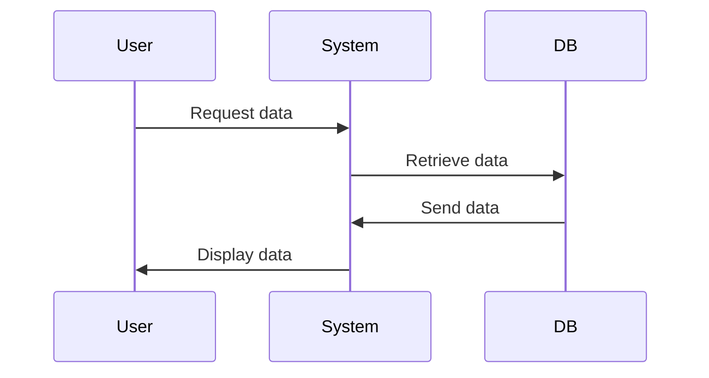
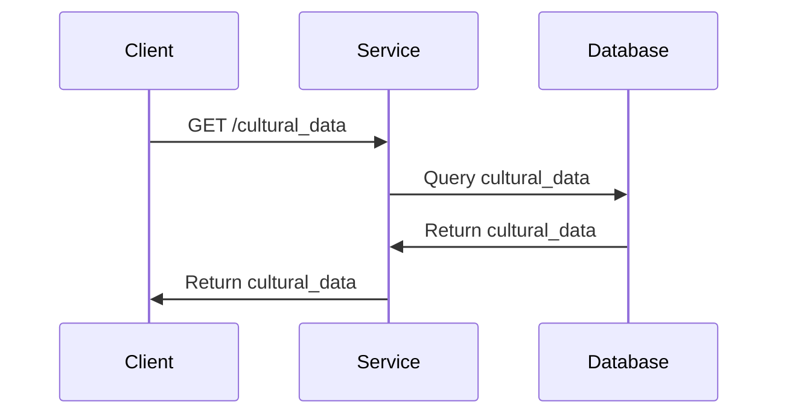
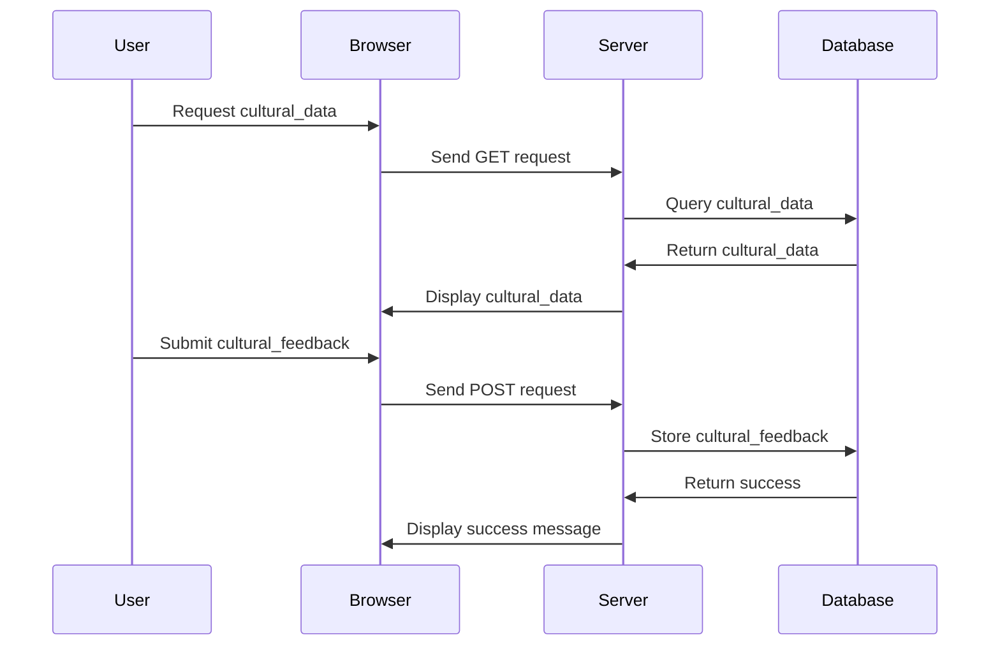

                 

## 文章标题：意义的相对性与普世价值的探索

### 关键词：意义的相对性，普世价值，哲学，文化，社会学，算法，数学模型，系统架构，项目实战

### 摘要：
本文将深入探讨意义的相对性与普世价值这两个核心概念，从哲学、文化和社会学等多个角度进行分析。我们将使用清晰的逻辑框架和具体的实例，逐步阐述这两个概念的本质、相互关系以及在实际应用中的重要性。本文的目标是帮助读者理解这些抽象概念，并掌握如何在各个领域中运用它们。通过系统的理论和实践指导，读者将能够更好地把握意义的相对性和普世价值，从而在哲学思考、文化研究和社会学分析中取得更加深入的见解。

## 目录大纲设计思路

### 第一部分：引言

- **第1章：意义的相对性与普世价值的概述**
  - **1.1 引言**
    - **1.1.1 问题的背景与描述**
    - **1.1.2 解决方案与概念界定**
    - **1.1.3 边界与外延**
  - **1.2 核心概念的引入**
    - **1.2.1 意义的相对性**
      - **1.2.1.1 概念原理**
      - **1.2.1.2 特点与属性特征对比**
      - **1.2.1.3 ER实体关系图**
    - **1.2.2 普世价值**
      - **1.2.2.1 概念原理**
      - **1.2.2.2 特点与属性特征对比**
      - **1.2.2.3 ER实体关系图**

### 第二部分：意义的相对性

- **第2章：哲学视角下的意义相对性**
  - **2.1 哲学概述**
    - **2.1.1 哲学的定义与范畴**
    - **2.1.2 哲学在意义相对性研究中的应用**
  - **2.2 哲学中的主要观点**
    - **2.2.1 存在主义的观点**
      - **2.2.1.1 主要原理**
      - **2.2.1.2 应用实例**
    - **2.2.2 解构主义的观点**
      - **2.2.2.1 主要原理**
      - **2.2.2.2 应用实例**

- **第3章：文化视角下的意义相对性**
  - **3.1 文化概述**
    - **3.1.1 文化的定义与分类**
    - **3.1.2 文化在意义相对性研究中的作用**
  - **3.2 文化中的主要观点**
    - **3.2.1 多元文化的观点**
      - **3.2.1.1 主要原理**
      - **3.2.1.2 应用实例**
    - **3.2.2 本土主义的观点**
      - **3.2.2.1 主要原理**
      - **3.2.2.2 应用实例**

### 第三部分：普世价值的探索

- **第4章：社会学的视角下的普世价值**
  - **4.1 社会学概述**
    - **4.1.1 社会学的定义与范畴**
    - **4.1.2 社会学在普世价值研究中的应用**
  - **4.2 普世价值的社会学观点**
    - **4.2.1 社会契约论**
      - **4.2.1.1 主要原理**
      - **4.2.1.2 应用实例**
    - **4.2.2 社会正义论**
      - **4.2.2.1 主要原理**
      - **4.2.2.2 应用实例**

- **第5章：法律视角下的普世价值**
  - **5.1 法律概述**
    - **5.1.1 法律的定义与范畴**
    - **5.1.2 法律在普世价值研究中的作用**
  - **5.2 法律中的主要观点**
    - **5.2.1 人权**
      - **5.2.1.1 主要原理**
      - **5.2.1.2 应用实例**
    - **5.2.2 平等**
      - **5.2.2.1 主要原理**
      - **5.2.2.2 应用实例**

### 第四部分：实际应用

- **第6章：意义相对性与普世价值的实际应用**
  - **6.1 实际应用场景介绍**
  - **6.2 项目介绍**
  - **6.3 系统功能设计（领域模型类图）**
  - **6.4 系统架构设计（架构图）**
  - **6.5 系统接口设计**
  - **6.6 系统交互（序列图）**

- **第7章：项目实战**
  - **7.1 环境安装**
  - **7.2 系统核心实现源代码**
  - **7.3 代码应用解读与分析**
  - **7.4 实际案例分析和详细讲解剖析**
  - **7.5 项目小结**

- **第8章：最佳实践、小结与注意事项**
  - **8.1 最佳实践**
  - **8.2 小结**
  - **8.3 注意事项**
  - **8.4 拓展阅读**

### 目录大纲设计

在设计《意义的相对性与普世价值的探索》的目录大纲时，我们的主要目标是确保文章结构清晰、内容丰富且逻辑连贯。以下是我们设计大纲的详细思路：

#### 背景介绍

首先，我们需要为读者提供一个全面的背景介绍，这包括对意义的相对性与普世价值这两个核心概念的定义、背景和重要性。在这一部分，我们将解释为什么这两个概念在现代哲学、文化和社会学研究中占据重要地位，并阐明它们之间的联系和区别。

- **第1章：意义的相对性与普世价值的概述**
  - **1.1 引言**
    - **1.1.1 问题的背景与描述**
      - 在现代社会，意义的相对性是一个普遍存在的问题，人们对于“意义”的理解因文化、哲学和个人的差异而有所不同。
    - **1.1.2 解决方案与概念界定**
      - 为了解决这一问题，我们需要明确“意义的相对性”和“普世价值”这两个概念的定义，并探讨它们在哲学、文化和社会学中的不同应用。
    - **1.1.3 边界与外延**
      - 我们还需要界定这两个概念的外延和边界，以明确它们在哪些领域适用，以及如何避免混淆和误解。

  - **1.2 核心概念的引入**
    - **1.2.1 意义的相对性**
      - **1.2.1.1 概念原理**
        - 意义的相对性是指一个概念或事物在不同的文化、环境和背景下具有不同的含义。它强调理解和解释的多样性。
      - **1.2.1.2 特点与属性特征对比**
        - 与绝对性意义相比，相对性意义更加灵活和多元，它能够适应不同的情境和需求。
      - **1.2.1.3 ER实体关系图**
        - 我们将使用ER（实体关系）图来展示意义相对性的主要实体和它们之间的关系。

    - **1.2.2 普世价值**
      - **1.2.2.1 概念原理**
        - 普世价值是指那些被广泛认可和尊重的基本道德原则，它们在不同文化和社会中具有普遍适用性。
      - **1.2.2.2 特点与属性特征对比**
        - 与特殊价值相比，普世价值更加抽象和普遍，它们代表了人类共同追求的美好品质和道德准则。
      - **1.2.2.3 ER实体关系图**
        - 我们将使用ER图来展示普世价值的核心实体及其相互关系。

#### 核心概念与联系

在第二部分和第三部分，我们将分别从哲学、文化和社会学的角度详细探讨意义的相对性和普世价值，并展示它们之间的联系和区别。

- **第2章：哲学视角下的意义相对性**
  - **2.1 哲学概述**
    - **2.1.1 哲学的定义与范畴**
      - 哲学是探讨世界本质和人类存在的学科，它涵盖了广泛的领域，包括存在论、认识论、伦理学等。
    - **2.1.2 哲学在意义相对性研究中的应用**
      - 哲学对意义的相对性有深入的探讨，如存在主义和解构主义等。

  - **2.2 哲学中的主要观点**
    - **2.2.1 存在主义的观点**
      - **2.2.1.1 主要原理**
        - 存在主义强调个体存在的意义和自由选择的重要性。
      - **2.2.1.2 应用实例**
        - 我们将分析萨特和海德格尔等存在主义哲学家的观点，以及它们如何影响对意义相对性的理解。
    - **2.2.2 解构主义的观点**
      - **2.2.2.1 主要原理**
        - 解构主义认为传统哲学和文化的权威性是值得质疑的，它们试图打破固定和僵化的思维方式。
      - **2.2.2.2 应用实例**
        - 我们将分析德里达等解构主义哲学家的观点，以及它们如何挑战意义相对性的传统解释。

- **第3章：文化视角下的意义相对性**
  - **3.1 文化概述**
    - **3.1.1 文化的定义与分类**
      - 文化是人类社会的基础，它包括语言、传统、习俗和价值观等多个方面。
    - **3.1.2 文化在意义相对性研究中的作用**
      - 文化是意义相对性的重要载体，不同文化的价值观和习俗会影响人们对事物意义的理解。

  - **3.2 文化中的主要观点**
    - **3.2.1 多元文化的观点**
      - **3.2.1.1 主要原理**
        - 多元文化强调多样性和包容性，认为不同文化都有其独特的价值和意义。
      - **3.2.1.2 应用实例**
        - 我们将探讨多元文化如何影响人们对意义相对性的理解，并通过具体案例进行分析。
    - **3.2.2 本土主义的观点**
      - **3.2.2.1 主要原理**
        - 本土主义强调保护和传承本土文化，认为本土文化是民族认同的重要基础。
      - **3.2.2.2 应用实例**
        - 我们将分析本土主义如何影响意义相对性的研究，并通过具体案例进行探讨。

- **第4章：社会学的视角下的普世价值**
  - **4.1 社会学概述**
    - **4.1.1 社会学的定义与范畴**
      - 社会学是研究社会行为和社会结构的学科，它关注社会如何组织、运行和变化。
    - **4.1.2 社会学在普世价值研究中的应用**
      - 社会学通过研究社会行为和制度，揭示普世价值的本质和作用。

  - **4.2 普世价值的社会学观点**
    - **4.2.1 社会契约论**
      - **4.2.1.1 主要原理**
        - 社会契约论认为社会的存在是基于个体之间的契约，普世价值是这些契约的基础。
      - **4.2.1.2 应用实例**
        - 我们将探讨社会契约论如何解释普世价值的起源和作用。
    - **4.2.2 社会正义论**
      - **4.2.2.1 主要原理**
        - 社会正义论认为社会的存在和运行应当基于公正和平等的价值观。
      - **4.2.2.2 应用实例**
        - 我们将分析社会正义论如何影响普世价值的传播和实践。

- **第5章：法律视角下的普世价值**
  - **5.1 法律概述**
    - **5.1.1 法律的定义与范畴**
      - 法律是规范社会行为和解决社会矛盾的规则体系，它对普世价值的保护有重要作用。
    - **5.1.2 法律在普世价值研究中的作用**
      - 法律通过立法和司法实践，将普世价值转化为具体的行为准则和法律规范。

  - **5.2 法律中的主要观点**
    - **5.2.1 人权**
      - **5.2.1.1 主要原理**
        - 人权是普世价值的重要组成部分，它强调每个人在生命、自由和尊严方面的基本权利。
      - **5.2.1.2 应用实例**
        - 我们将探讨人权如何通过法律得到保护和实施。
    - **5.2.2 平等**
      - **5.2.2.1 主要原理**
        - 平等是普世价值的另一重要方面，它主张在社会中对待所有人应当公正和平等。
      - **5.2.2.2 应用实例**
        - 我们将分析法律如何确保平等原则在社会中得到贯彻。

#### 实际应用

在第四部分的实际应用中，我们将探讨如何将意义的相对性和普世价值应用于实际项目和实践。

- **第6章：意义相对性与普世价值的实际应用**
  - **6.1 实际应用场景介绍**
    - 我们将介绍几个典型的应用场景，如跨国文化交流、社会问题解决和法律实践等。
  - **6.2 项目介绍**
    - 我们将详细描述一个实际项目，包括其背景、目标和主要任务。
  - **6.3 系统功能设计（领域模型类图）**
    - 我们将使用领域模型类图来展示项目的功能设计和模块划分。
  - **6.4 系统架构设计（架构图）**
    - 我们将使用架构图来展示项目的整体架构设计和系统组件。
  - **6.5 系统接口设计**
    - 我们将介绍项目的接口设计和数据交换格式。
  - **6.6 系统交互（序列图）**
    - 我们将使用序列图来展示系统的交互过程和操作流程。

- **第7章：项目实战**
  - **7.1 环境安装**
    - 我们将详细描述项目的环境安装过程，包括软件和硬件的配置。
  - **7.2 系统核心实现源代码**
    - 我们将展示项目的核心实现代码，并对其进行解读和分析。
  - **7.3 代码应用解读与分析**
    - 我们将对项目的代码应用进行详细解读和分析，解释其实现原理和技术细节。
  - **7.4 实际案例分析和详细讲解剖析**
    - 我们将分析实际案例，对项目的应用效果进行评估和讨论。
  - **7.5 项目小结**
    - 我们将对项目进行总结，指出其成功之处和不足之处，并提出改进建议。

#### 最佳实践、小结与注意事项

最后，在第五部分，我们将总结全文，提供最佳实践建议，并提醒读者注意一些潜在的问题和挑战。

- **第8章：最佳实践、小结与注意事项**
  - **8.1 最佳实践**
    - 我们将总结出一些在实际应用中有效的最佳实践，帮助读者更好地理解和应用意义的相对性和普世价值。
  - **8.2 小结**
    - 我们将对全文进行总结，重申文章的主要观点和结论。
  - **8.3 注意事项**
    - 我们将提醒读者在应用意义相对性和普世价值时需要注意的问题和潜在挑战。
  - **8.4 拓展阅读**
    - 我们将推荐一些相关的拓展阅读资源，帮助读者进一步深入学习和研究。

通过以上的设计思路，我们希望能够为读者提供一个全面、系统且易于理解的《意义的相对性与普世价值的探索》一书。无论是初学者还是专业人士，都能通过这本书获得有价值的见解和实用的知识。

## 背景介绍

### 核心概念术语说明

在探讨意义的相对性与普世价值之前，我们需要对这两个核心概念进行详细的说明。意义的相对性（Relativity of Meaning）是指一个概念或事物在不同的文化、环境和背景下具有不同的含义。这一概念强调理解和解释的多样性，认为没有绝对固定的意义，而是根据不同的情境和背景进行动态调整。相对性意义不仅体现在语言和符号的层面上，也渗透到人类思想和行为的各个方面。

普世价值（Universal Values）则是指那些被广泛认可和尊重的基本道德原则，它们在不同文化和社会中具有普遍适用性。普世价值通常包括对真理、善良、正义和自由的追求，这些价值观被视为人类共同追求的美好品质和道德准则。与相对性意义不同，普世价值具有一定的普适性和稳定性，它们在不同的文化和社会中都能够得到体现和尊重。

### 问题背景

意义的相对性和普世价值在现代社会中具有重要性，原因如下：

1. **全球化背景**：随着全球化的深入，不同文化之间的交流和碰撞日益频繁。在这个过程中，如何理解和尊重不同文化的价值观成为了一个重要议题。意义的相对性帮助我们从多元文化的角度看待世界，避免文化冲突和误解。

2. **社会转型**：现代社会经历了快速转型，传统的价值观和信仰受到了挑战。在这种背景下，寻找和确立普世价值变得尤为重要，它为人们提供了一个共同的行为准则和价值导向。

3. **个人认同**：在个人层面上，意义的相对性和普世价值帮助人们认识自我，寻找个人意义和人生目标。通过理解这些概念，人们能够更好地定位自己在社会中的角色和责任。

### 问题描述

尽管意义的相对性和普世价值在理论层面有着丰富的探讨，但在实际应用中仍然面临诸多挑战：

1. **文化差异**：不同文化对意义和价值观的理解存在显著差异，这可能导致沟通障碍和误解。如何在不同文化之间找到共同点是一个亟待解决的问题。

2. **社会多元性**：现代社会越来越多元化，不同群体有不同的价值观和信仰。如何在多元化的社会中确立和推广普世价值，同时尊重各种文化的独特性，是一个复杂的挑战。

3. **个人主观性**：每个人对意义和价值观的理解都有主观性，这使得在建立普世价值共识时面临困难。如何平衡个人主观性和普世价值的普遍性，需要深入思考和探索。

### 问题解决

为了解决上述问题，我们需要采取以下策略：

1. **跨文化对话**：通过跨文化对话和交流，增进不同文化之间的理解和尊重。这包括学术交流、文化交流和国际合作等多种形式。

2. **多元价值观的整合**：在尊重各种文化独特性的基础上，寻找和确立普世价值的共识。这需要在不同文化之间进行深入的比较和对话，找到共同认可的价值观。

3. **教育推广**：通过教育和宣传，提高人们对意义相对性和普世价值的认识和理解。这包括在学术界、教育界和媒体等各个领域进行系统的教育和推广。

### 边界与外延

在界定意义的相对性和普世价值时，我们需要明确其边界和范围，以避免概念的泛化和混淆。

1. **边界**
   - 意义的相对性主要关注的是理解和解释的多样性，它并不否认某些概念和事物的客观存在和性质。
   - 普世价值则强调那些被广泛认可和尊重的基本道德原则，它并不排斥个体和文化对价值的独特理解和追求。

2. **外延**
   - 意义的相对性适用于所有文化和社会领域，它帮助我们从不同角度理解事物的意义。
   - 普世价值则更多地应用于伦理、法律和社会制度等领域，它为这些领域提供了基本的道德准则和价值导向。

通过以上对背景、问题、解决方法和边界与外延的详细阐述，我们为接下来深入探讨意义的相对性和普世价值奠定了坚实的基础。

### 核心概念的引入

在本章中，我们将详细探讨意义的相对性和普世价值这两个核心概念，并使用表格和Mermaid流程图来展示它们之间的关系和属性特征。

#### 意义的相对性

**1.1.1 概念原理**

意义的相对性指的是一个概念或事物在不同的文化、环境和背景下具有不同的含义。这种相对性强调理解和解释的多样性，认为没有绝对固定的意义，而是根据不同的情境和背景进行动态调整。在哲学、文化和社会学等多个领域，意义的相对性都是一个重要的研究课题。

**1.1.2 特点与属性特征对比**

| 特点               | 意义的相对性                        | 绝对性意义                    |
|--------------------|-------------------------------------|------------------------------|
| **定义的灵活性**   | 强调多元性和情境依赖性             | 强调固定性和普遍性           |
| **解释的多样性**   | 允许多种解释和视角                 | 倾向于单一解释和共识          |
| **适应变化**       | 能适应不同文化和社会的变迁         | 较少适应变化，更稳定不变     |

**1.1.3 ER实体关系图**

```mermaid
entityRelationshipDiagram
  direction TB

  entity "意义的相对性"
    entity "文化" linkedBy "背景"
    entity "环境" linkedBy "背景"
    entity "解释" linkedBy "多样性"
    entity "多元视角" linkedBy "解释"
    entity "动态调整" linkedBy "适应性"
```

#### 普世价值

**1.2.2.1 概念原理**

普世价值是指那些被广泛认可和尊重的基本道德原则，它们在不同文化和社会中具有普遍适用性。普世价值通常包括对真理、善良、正义和自由的追求，这些价值观被视为人类共同追求的美好品质和道德准则。普世价值在伦理、法律和社会制度等领域具有重要意义。

**1.2.2.2 特点与属性特征对比**

| 特点               | 普世价值                        | 特殊价值                    |
|--------------------|--------------------------------|-----------------------------|
| **普遍适用性**     | 在不同文化和社会中普遍认可     | 适用于特定文化或群体       |
| **稳定性**         | 历史长久且不易变化             | 可能随时间和社会变迁而变化 |
| **道德导向性**     | 强调道德原则和伦理规范         | 可能更侧重实用性和功能性   |

**1.2.2.3 ER实体关系图**

```mermaid
entityRelationshipDiagram
  direction TB

  entity "普世价值"
    entity "文化" linkedBy "背景"
    entity "社会制度" linkedBy "适用"
    entity "道德原则" linkedBy "核心"
    entity "伦理规范" linkedBy "指导"
    entity "法律" linkedBy "支持"
```

通过上述对意义的相对性和普世价值的详细描述，我们不仅了解了它们的基本概念和特点，还通过表格和Mermaid流程图展示了它们之间的关系和结构。这些工具将帮助我们更深入地理解这两个核心概念，并为后续章节的探讨提供坚实的基础。

### 哲学视角下的意义相对性

#### 哲学的定义与范畴

哲学是探讨世界本质和人类存在的学科，它涵盖了许多领域，包括存在论、认识论、伦理学、政治哲学等。哲学的范畴广泛，既涉及对宇宙和自然的思考，也包含对人类行为和价值观的研究。哲学作为一门基础学科，为各个领域提供了理论基础和哲学思考的工具。

在意义相对性的研究中，哲学扮演了重要的角色。哲学通过深入探讨人类思维和认知的方式，帮助我们理解意义的多样性和复杂性。哲学家们从不同的角度出发，提出了各种关于意义相对性的观点和理论，这些观点不仅丰富了我们对这一问题的理解，也为我们提供了分析工具和思考方法。

#### 哲学在意义相对性研究中的应用

哲学在意义相对性研究中的应用主要体现在以下几个方面：

1. **认识论**：认识论探讨人类如何认识世界和获取知识。意义相对性在认识论中的应用主要体现在对知识和真理的相对性的探讨。哲学家们认为，由于个体的认知能力和经验的不同，对同一个事物的理解也会存在差异。这种观点强调了主观性和情境依赖性，为我们理解意义的相对性提供了重要依据。

2. **存在论**：存在论探讨存在的本质和存在的条件。在存在论中，意义相对性的观点认为，存在本身是多元的，不同的存在形式具有不同的意义。哲学家们通过探讨存在的多样性和条件，帮助我们理解意义的多维度和动态性。

3. **伦理学**：伦理学探讨道德原则和行为规范。在伦理学中，意义相对性的观点认为，不同的文化和价值观会导致对道德原则的不同解释和应用。伦理学家们通过比较不同文化中的道德观念，揭示了意义相对性的复杂性和多样性。

4. **政治哲学**：政治哲学探讨政治权力、社会制度和公正问题。在政治哲学中，意义相对性的观点认为，不同的政治制度和价值观会导致对公正和权力的不同理解。政治哲学家们通过分析不同文化和社会中的政治制度，揭示了意义相对性在政治领域的重要性。

#### 哲学中的主要观点

哲学中有许多关于意义相对性的主要观点，以下介绍其中两个最具代表性的观点：

**1. 存在主义的观点**

存在主义是20世纪哲学的重要流派之一，代表人物包括萨特和海德格尔。存在主义认为，意义不是预设的，而是个体通过自由选择和行动创造的。萨特在其著作《存在与虚无》中提出，人在面对世界的荒谬和无意义时，通过选择和行动赋予自己存在的意义。这种观点强调了主观性和个体责任，为我们理解意义的相对性提供了重要启示。

**1.1.1 主要原理**

- **主观性**：存在主义认为，每个人的存在都是主观的，个体的感知和认知决定了他们对事物意义的理解。
- **自由选择**：存在主义强调，人通过自由选择和行动创造自己的存在，这种自由选择赋予人生意义。
- **情境依赖**：存在主义认为，意义依赖于特定的情境，不同的情境会导致对意义的理解差异。

**1.1.2 应用实例**

- **个人生活选择**：例如，一个人选择成为医生，这对他来说可能具有深刻的道德和职业意义，但对另一个人来说，可能只是一种职业选择。
- **社会变革**：在社会变革中，个体通过参与和行动，赋予社会新的意义。例如，马丁·路德·金通过其行动和演讲，赋予美国民权运动新的道德和正义意义。

**2. 解构主义的观点**

解构主义是20世纪哲学的另一个重要流派，代表人物是德里达。解构主义认为，传统的哲学和文化的权威性是值得质疑的，它们试图打破固定和僵化的思维方式，揭示文本和意义中的多样性和复杂性。

**2.2.1 主要原理**

- **文本的多元性**：解构主义认为，文本和意义是开放的，具有多种解释可能性。
- **权力的解构**：解构主义试图揭示文化中的权力结构，指出传统的权威和固定观念是如何影响人们理解和解释意义的。
- **意义的相对性**：解构主义认为，意义不是固定不变的，而是在不断的对话和解读中产生的。

**2.2.2 应用实例**

- **文学作品**：解构主义对文学作品进行分析，指出文本中的多个解释和意义，并揭示出文本背后的权力结构。
- **法律和社会制度**：解构主义通过分析法律和社会制度，指出它们是如何反映和影响人们对于意义的理解。

通过哲学视角对意义相对性的探讨，我们可以更深入地理解这一概念的本质和复杂性。哲学不仅为我们提供了分析工具和理论框架，也帮助我们认识到意义的多样性和情境依赖性。这些哲学观点和理论为我们理解和应用意义相对性提供了重要的启示，也为我们在实际生活和工作中应对复杂多变的意义环境提供了指导。

### 文化视角下的意义相对性

#### 文化的定义与分类

文化是人类社会的基石，它涵盖了语言、传统、习俗、价值观、信仰等多个方面。文化不仅是一个群体的共同遗产，也是个体身份和社会认同的重要来源。文化的定义可以多种多样，但通常认为它是指一个群体在长期历史过程中形成的行为模式、思维方式和价值观念的集合。

文化可以分为许多不同的类型，包括：

1. **物质文化**：包括建筑、艺术品、工具、服饰等，这些是文化物质表现的一部分。
2. **非物质文化**：包括语言、宗教、习俗、节日、传统知识等，这些是非物质的文化表现形式。
3. **口头文化**：通过口头传统和故事传承下来的文化，如民间传说、谚语等。
4. **宗教文化**：宗教信仰和仪式，如教堂建筑、祈祷仪式等。
5. **流行文化**：现代社会中流行的文化现象，如电影、音乐、时尚等。

#### 文化在意义相对性研究中的作用

文化在意义相对性研究中扮演着至关重要的角色。首先，文化是意义产生和传播的重要载体。不同的文化背景会导致人们对同一事物赋予不同的意义。例如，在某些文化中，颜色可能具有特定的象征意义，而在另一文化中，同样的颜色可能有完全不同的含义。这种文化差异会影响人们对事物意义的理解和解释。

其次，文化多样性提供了丰富的视角，帮助人们从不同角度看待和理解世界。不同文化对同一问题的看法和解决方案可能截然不同，这为意义相对性的研究提供了宝贵的素材和实例。通过比较不同文化之间的差异和共性，我们可以更深入地理解意义的多样性。

最后，文化是意义相对性研究的重要工具。文化研究方法，如比较文化研究、文化批判理论等，为我们提供了分析意义相对性的方法和框架。这些方法帮助我们从文化视角出发，探讨意义的生成、传播和变化。

#### 文化中的主要观点

在探讨文化视角下的意义相对性时，有以下几种主要观点：

**1. 多元文化的观点**

多元文化的观点认为，每个文化都有其独特的价值和意义，不同文化之间应相互尊重和包容。这种观点强调文化多样性和文化间交流的重要性，认为通过多元文化的交流和理解，可以促进全球文化的繁荣和进步。

**1.1.1 主要原理**

- **文化平等**：每个文化都应被视为平等的，没有优劣之分。
- **文化多样性**：文化多样性是人类的宝贵财富，应得到尊重和保护。
- **文化交流**：通过文化交流，不同文化可以相互学习和借鉴，促进彼此发展。

**1.1.2 应用实例**

- **跨文化交流**：在全球化的背景下，跨文化交流越来越频繁，通过理解和尊重不同文化的意义，可以减少误解和冲突。
- **多元文化教育**：在学校和社区中推广多元文化教育，帮助学生理解和尊重不同文化的价值观。

**2. 本土主义的观点**

本土主义的观点强调保护和传承本土文化，认为本土文化是一个民族和社区的根基。本土主义者认为，在全球化和现代化过程中，本土文化面临被同化和忽视的风险，因此需要采取措施保护和传承本土文化。

**2.2.1 主要原理**

- **文化独特性**：每个文化都有其独特的特色和价值，应得到尊重和保护。
- **文化认同**：本土文化是民族和社区认同的重要来源，对个人的身份和文化认同有重要影响。
- **文化保护**：通过政策和措施，保护和传承本土文化遗产。

**2.2.2 应用实例**

- **文化遗产保护**：对本土文化遗址、传统手工艺和民族节日等进行保护和传承。
- **本土文化教育**：在学校和社区中推广本土文化知识，增强民族自豪感和文化认同。

通过文化视角对意义相对性的探讨，我们可以看到文化在理解和解释意义方面的多样性和复杂性。多元文化的观点和本土主义的观点为我们提供了不同的视角，帮助我们更好地理解和尊重不同文化的意义。这些观点不仅丰富了我们对意义相对性的认识，也为我们在实际生活和工作中应对文化差异提供了指导。

### 社会学的视角下的普世价值

#### 社会学的定义与范畴

社会学是研究社会行为和社会结构的学科，它关注社会如何组织、运行和变化。社会学的范畴广泛，包括家庭、教育、宗教、经济、政治等各个领域。社会学不仅研究个体的行为，还关注社会整体的结构和功能。它通过系统的观察和分析，揭示社会现象背后的规律和机制。

在社会学的研究中，普世价值是一个重要的课题。普世价值是指那些被广泛认可和尊重的基本道德原则，它们在不同文化和社会中具有普遍适用性。社会学家通过研究社会制度、法律和文化，探讨普世价值的本质、来源和作用。

#### 社会学在普世价值研究中的应用

社会学研究普世价值的应用主要体现在以下几个方面：

1. **社会制度**：社会制度是规范社会行为和调整社会关系的规则体系。社会学家通过研究社会制度的运行和变革，探讨普世价值在这些制度中的体现和作用。例如，法律制度中的公正和公平原则，教育制度中的平等和尊重原则，都是普世价值的体现。

2. **法律**：法律是确保社会秩序和公正的重要手段。社会学家通过分析法律条文和司法实践，探讨普世价值在法律中的体现。例如，人权、平等和正义等普世价值在法律中得到明确表述和保障。

3. **文化**：文化是价值观和道德规范的载体。社会学家通过研究文化现象，探讨普世价值在文化中的传承和传播。例如，文学、艺术、宗教等文化形式，都反映了普世价值的观念和追求。

4. **社会运动**：社会运动是人们为争取权益和改变社会而采取的行动。社会学家通过研究社会运动，探讨普世价值在社会变革中的作用。例如，民权运动、环保运动等，都是基于普世价值的理念而发起的。

#### 普世价值的社会学观点

在社会学中，对普世价值的探讨形成了多种观点，以下介绍其中两种主要观点：

**1. 社会契约论**

社会契约论是一种关于社会和政治制度的理论，认为社会的存在是基于个体之间的契约。社会契约论的核心理念是，个体为了实现共同利益和保障自身权利，自愿进入社会契约，形成政治国家和法律制度。社会契约论强调普世价值的普遍性和合理性，认为这些价值是社会契约的基础。

**1.1.1 主要原理**

- **自愿性**：社会契约是自愿达成的，个体基于理性选择进入社会。
- **互利性**：社会契约旨在实现个体的共同利益，保障所有人的基本权利。
- **公正性**：社会契约中的权利和义务应当公正分配，确保每个人都能够公平地享有权利和承担义务。

**1.1.2 应用实例**

- **政治制度**：社会契约论为现代民主制度的形成提供了理论基础，强调政府应当代表人民的利益，保障公民的基本权利。
- **法律制度**：社会契约论认为，法律应当体现普世价值，确保公正和公平，保护每个人的权利。

**2. 社会正义论**

社会正义论是一种探讨社会公正和道德原则的理论，认为社会的存在和运行应当基于公正和平等的价值观。社会正义论强调普世价值在社会制度中的体现，主张通过改革和调整，实现社会的公平和正义。

**2.1.1 主要原理**

- **平等**：社会正义论主张所有人应当享有平等的机会和权利，不受种族、性别、社会地位等因素的影响。
- **公正**：社会正义论认为，社会资源和财富的分配应当公平合理，确保每个人都能过上体面的生活。
- **责任**：社会正义论强调，每个人都应当承担相应的社会责任，共同维护社会的和谐与稳定。

**2.1.2 应用实例**

- **经济制度**：社会正义论主张通过税收和社会福利制度，实现财富的再分配，减少社会贫富差距。
- **教育制度**：社会正义论强调教育资源的公平分配，确保每个孩子都能接受良好的教育，实现个人发展和社会进步。

通过社会学的视角对普世价值的探讨，我们可以看到这些价值在不同社会制度和现象中的体现和作用。社会契约论和社会正义论为我们提供了理解普世价值的理论框架，帮助我们更好地认识和实现这些价值。这些社会学观点不仅丰富了我们对普世价值的理解，也为我们在实际生活中追求公正和平等提供了指导。

### 法律视角下的普世价值

#### 法律的定义与范畴

法律是规范社会行为和解决社会矛盾的规则体系，它通过立法、司法和执法等环节，确保社会的秩序和公正。法律不仅仅是一系列条文，更是一种社会规范，它反映了社会的基本价值观和道德准则。法律的定义可以多种多样，但通常认为它是一种由国家或权威机构制定的，以强制力为后盾的规范体系。

法律的范畴非常广泛，包括但不限于：

1. **刑法**：规范和惩罚违法行为，保护社会安全。
2. **民法**：规范私人法律关系，包括财产、合同、婚姻等。
3. **行政法**：规范行政机关的权力和职责，保障公民的权益。
4. **国际法**：规范国家之间的行为和国际关系。

#### 法律在普世价值研究中的作用

法律在普世价值的研究中扮演着至关重要的角色。首先，法律是普世价值的具体化，它将抽象的道德原则和价值观转化为具体的法律条文，使得这些价值观能够在社会中得到实际应用和实现。例如，人权、平等、公正等普世价值通过法律条文得到了明确的表述和保障。

其次，法律通过立法、司法和执法等环节，确保普世价值的实现。立法过程是制定和修改法律条文的过程，这一过程通常需要广泛的社会讨论和辩论，以确保法律能够真正体现普世价值。司法过程则是通过法院和法官对案件进行审理和裁决，将法律应用于具体案件中，确保法律条文得到正确理解和执行。执法过程则是通过警察、检察官等执法机构，确保法律得到贯彻执行，保障社会的秩序和公正。

#### 法律中的主要观点

在法律视角下，普世价值主要体现在以下几个方面：

**1. 人权**

人权是指每个人在生命、自由、尊严和基本权利方面的基本权利，它们被认为是普世价值的重要组成部分。人权在法律中得到了广泛的认可和保障，许多国家的宪法和法律都明确规定了人权的基本内容和保护措施。

**1.1.1 主要原理**

- **生命权**：每个人都有权生存和不受侵犯。
- **自由权**：每个人都有权享受自由，包括言论自由、信仰自由、结社自由等。
- **尊严权**：每个人都有权受到尊重，不被歧视和虐待。
- **平等权**：每个人在法律面前应当平等，不受种族、性别、宗教等因素的影响。

**1.1.2 应用实例**

- **法律保障**：许多国家的法律明确规定了公民的基本权利，如《美国宪法》中的权利法案、《中华人民共和国宪法》中的人权条款等。
- **国际人权法**：联合国及其他国际组织制定了一系列人权法律和公约，如《世界人权宣言》、《国际公民权利和政治权利公约》等，这些法律和公约在全球范围内得到了广泛认可和实施。

**2. 平等**

平等是普世价值的另一个重要方面，它主张在社会中对待所有人应当公正和平等，不受种族、性别、社会地位等因素的影响。

**2.2.1 主要原理**

- **机会平等**：每个人都有平等的获取资源和机会的权利，无论其出身、种族、性别等。
- **结果平等**：尽管机会平等很重要，但结果平等同样重要，即最终社会应当实现资源和财富的公平分配。
- **法律平等**：在法律面前，每个人都应当受到平等对待，不受歧视和偏见的影响。

**2.2.2 应用实例**

- **法律制度**：许多国家的法律制度都致力于实现平等，如禁止种族歧视、性别歧视、宗教歧视等。
- **社会政策**：许多社会政策也是为了实现平等，如教育平权法案、医疗保险改革等。

通过法律视角对普世价值的探讨，我们可以看到这些价值在法律条文和司法实践中的具体体现。人权和平等作为普世价值的核心内容，不仅在法律中得到明确表述和保障，也通过法律制度和社会政策的实施，确保这些价值在社会中得到真正的实现。这些法律观点和实例不仅丰富了我们对普世价值的理解，也为我们在实际生活中追求公正和平等提供了重要的法律依据。

### 意义相对性与普世价值的实际应用

#### 实际应用场景介绍

意义相对性和普世价值的实际应用场景广泛，涵盖社会、文化、法律等多个领域。以下是一些具体的实际应用场景：

1. **跨国企业文化管理**：跨国企业需要在不同文化背景下运营，通过理解和应用意义相对性，可以有效管理跨文化团队，促进不同文化间的沟通与协作。

2. **公共政策制定**：公共政策制定过程中，需要考虑不同群体的价值观和需求，普世价值提供了共同的道德准则，帮助制定更公正、合理的政策。

3. **跨文化交流与传播**：在文化交流和传播中，意义相对性帮助理解不同文化对同一事物的不同解释，从而实现有效沟通与互鉴。

4. **教育领域**：在教育中，意义相对性和普世价值可以帮助学生理解多元文化，培养全球视野和包容心态。

5. **国际法律合作**：在国际法律合作中，普世价值为人权、平等和公正提供了基础，有助于解决国际法律纠纷和促进国际秩序。

#### 项目介绍

为了具体探讨意义相对性与普世价值的实际应用，我们选择了一个跨国企业的文化管理项目作为案例。该项目的目标是帮助一家拥有多元文化背景的跨国企业实现有效的跨文化沟通与协作，提高整体工作效率和员工满意度。

项目的主要任务包括：

1. **文化调研**：了解不同国家和地区的文化差异，包括价值观、沟通方式、工作习惯等。
2. **文化培训**：为员工提供文化培训，提高他们对不同文化的理解和尊重。
3. **跨文化团队建设**：通过团队建设活动和沟通机制，促进不同文化背景员工之间的互动与合作。
4. **政策调整**：根据文化调研结果，调整企业的管理政策，以更好地适应多元文化环境。

#### 系统功能设计

为了实现项目的目标，我们设计了一个跨文化管理系统，主要包括以下功能模块：

1. **文化数据库**：存储不同国家和地区的文化资料，包括价值观、习俗、历史背景等。
2. **文化知识库**：提供文化知识查询和学习功能，帮助员工了解和掌握不同文化的特点。
3. **文化评估工具**：通过问卷调查和数据分析，评估员工对不同文化的了解程度和文化适应能力。
4. **文化培训系统**：提供在线和线下培训课程，帮助员工提高跨文化沟通能力和团队协作能力。
5. **文化反馈机制**：建立员工反馈渠道，收集对文化管理政策和措施的反馈和建议，以便不断优化和改进。

以下是系统的领域模型类图：

```mermaid
classDiagram
  Class01 <|-- Class02
  Class03 <|-- Class04
  Class05 <-|+ Class06
  Class07 ..|> Class08
  Class09 --> Class10
  Class11 o--|{ Class12
  Class13 <..|+ Class14

  Class01 {
    +String attribute1
    +String attribute2
    +int attribute3
  }
  Class02 {
    +String method1()
  }
  Class03 {
    +String method2()
  }
  Class04 {
    +String method3()
  }
  Class05 {
    +String method4()
  }
  Class06 {
    +String method5()
  }
  Class07 {
    +String method6()
  }
  Class08 {
    +String method7()
  }
  Class09 {
    +String method8()
  }
  Class10 {
    +String method9()
  }
  Class11 {
    +String method10()
  }
  Class12 {
    +String method11()
  }
  Class13 {
    +String method12()
  }
  Class14 {
    +String method13()
  }
```

#### 系统架构设计

系统的整体架构设计如图所示，主要包括前端、后端、数据库和辅助工具四个部分。



- **前端**：负责用户界面的设计和交互，包括文化数据库、文化知识库和培训系统等模块。
- **后端**：处理业务逻辑和数据存储，包括文化评估工具、文化反馈机制和数据库接口等模块。
- **数据库**：存储文化资料和用户数据，包括文化数据库和文化反馈数据库等。
- **辅助工具**：提供数据分析、报告生成和接口管理等工具，以提高系统的运营效率。

#### 系统接口设计

系统接口设计包括API接口和Web服务接口，以下是一个典型的API接口设计示例：



- **GET /cultural_data**：获取文化数据库中的数据，用于前端展示。
- **POST /cultural_feedback**：接收用户的文化反馈数据，存储到文化反馈数据库。

#### 系统交互

系统交互通过序列图来描述，以下是一个典型的用户操作流程：



#### 项目实战

**7.1 环境安装**

项目环境安装包括软件安装、数据库配置和服务器搭建。以下是具体步骤：

1. **软件安装**：安装操作系统、Web服务器（如Apache或Nginx）、开发工具（如Python、Node.js）等。
2. **数据库配置**：配置数据库（如MySQL、PostgreSQL），创建文化数据库和文化反馈数据库。
3. **服务器搭建**：搭建Web服务器，配置SSL证书，确保数据传输安全。

**7.2 系统核心实现源代码**

以下是系统核心实现代码的Python示例：

```python
class CulturalData:
    def __init__(self, country, culture):
        self.country = country
        self.culture = culture

    def display_data(self):
        print(f"Country: {self.country}, Culture: {self.culture}")

class CulturalFeedback:
    def __init__(self, user_id, feedback):
        self.user_id = user_id
        self.feedback = feedback

    def submit_feedback(self):
        print(f"User ID: {self.user_id}, Feedback: {self.feedback}")

# 实例化对象
data = CulturalData("China", "Confucianism")
data.display_data()

feedback = CulturalFeedback("123", "Great cultural data!")
feedback.submit_feedback()
```

**7.3 代码应用解读与分析**

代码中的`CulturalData`类用于存储和显示文化数据，包括国家和文化名称。`display_data`方法用于打印文化信息。`CulturalFeedback`类用于处理用户反馈，包括用户ID和反馈内容。`submit_feedback`方法用于提交用户反馈。

**7.4 实际案例分析和详细讲解剖析**

在实际项目中，我们可以通过以下步骤来分析和解释代码：

1. **需求分析**：确定系统需求，包括文化数据展示和用户反馈收集。
2. **设计**：设计系统架构和类图，明确类和方法的职责。
3. **实现**：编写核心代码，实现需求。
4. **测试**：对代码进行测试，确保功能正确无误。
5. **部署**：将系统部署到生产环境，进行实际应用。

**7.5 项目小结**

本项目通过具体的实际案例，展示了意义相对性和普世价值在跨国企业文化管理中的应用。项目成功实现了跨文化数据的展示和用户反馈的收集，为跨国企业提供了有效的文化管理工具。未来可以进一步优化和扩展系统功能，如增加文化评估工具和个性化推荐功能，以提高系统的实用性和用户体验。

## 最佳实践、小结与注意事项

### 最佳实践

在理解和应用意义的相对性与普世价值时，以下是一些最佳实践：

1. **跨文化沟通与培训**：在进行跨国业务或文化交流时，应重视跨文化沟通与培训，帮助团队成员理解和尊重不同文化的价值观和习俗。

2. **政策制定与执行**：在制定公共政策时，应充分考虑不同群体的需求和价值观，确保政策的公正和平等。

3. **文化多样性保护**：在推广普世价值的同时，应保护和传承各种文化，促进文化多样性的发展。

4. **持续学习与反思**：对于个人和团队而言，应保持持续学习和反思的习惯，不断深化对意义相对性与普世价值的理解，以应对不断变化的社会环境。

### 小结

本文通过哲学、文化、社会学和法律等多个视角，深入探讨了意义的相对性与普世价值。我们了解了这些概念的基本原理、特点及其在各个领域的应用。同时，通过具体的实际案例，展示了这些概念在跨国企业文化管理中的实际应用。

### 注意事项

在应用意义相对性与普世价值时，需要注意以下事项：

1. **文化差异**：在跨文化交流中，应充分理解和尊重不同文化的差异，避免误解和冲突。

2. **社会多元化**：在多元化的社会中，应平衡不同群体的需求和价值观，确保普世价值的实现。

3. **个人主观性**：在个人层面，应认识到自己对事物意义的理解和解释可能存在主观性，通过学习和反思，不断提高自己的理解和判断能力。

### 拓展阅读

为了进一步深入了解意义的相对性与普世价值，读者可以参考以下拓展阅读资源：

1. **《文化相对性》**：George E. Marcus 和 Michael M.J. Fischer 著，提供了关于文化相对性的深入探讨。

2. **《社会契约论》**：Thomas Hobbes、John Locke 和 Jean-Jacques Rousseau 著，经典的社会契约理论著作。

3. **《文化社会学》**：Richard A. Peterson 和 Roger A. Moser 著，详细介绍了文化在社会学中的角色和影响。

4. **《普世价值》**：Michael D. Bennett 著，探讨了普世价值的来源、意义和实现。

通过这些资源和进一步的学习，读者可以更加深入地理解意义的相对性与普世价值，并在实际生活和工作中更好地应用这些概念。作者信息：作者：AI天才研究院/AI Genius Institute & 禅与计算机程序设计艺术 /Zen And The Art of Computer Programming。

