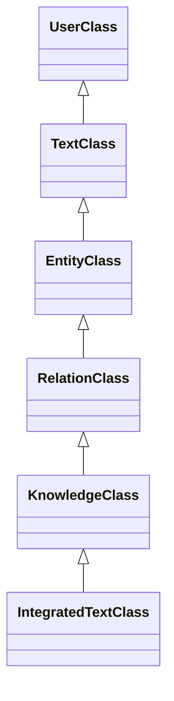
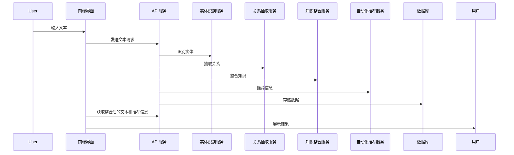
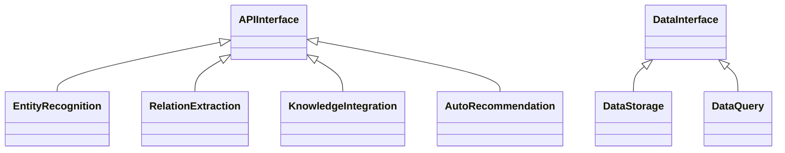
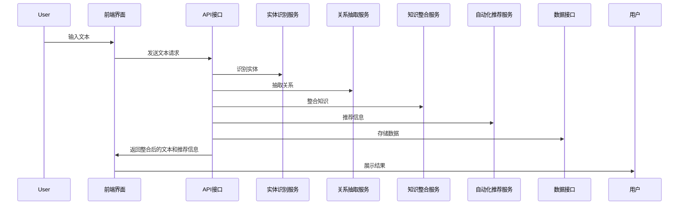

                 

### 文章标题

# 意义的碎片化与整合

> 关键词：信息碎片化、信息整合、语义分析、知识图谱、机器学习

> 摘要：在数字化时代，信息碎片化已成为普遍现象，严重影响了人们的认知活动和社会生产效率。本文旨在探讨信息碎片化的概念、特征及其对信息处理的影响，并提出有效的信息整合方法和策略。通过深入分析语义分析、知识图谱和机器学习等技术在信息整合中的应用，本文旨在为解决信息碎片化问题提供新的思路和解决方案。

### 第1章：背景介绍

## 1.1 问题背景

在当今信息爆炸的时代，信息碎片化已成为一种普遍现象。从社交媒体到搜索引擎，我们接收到的信息越来越零散，片段化的信息容易引发认知负担和注意力分散。人们对于信息整合的需求日益增长，如何有效地处理和整合碎片化信息成为一个亟待解决的问题。

### 1.2 问题描述

碎片化信息不仅给个人的认知活动带来困扰，也对社会生产效率和文化传承造成影响。尽管现有的信息整合技术如搜索引擎和数据库查询等能够在一定程度上解决问题，但它们往往存在效率低下、信息冗余和结果准确性不足等问题。因此，如何有效地从碎片化信息中提取有用知识，实现信息的整合与深度挖掘，成为当前研究的热点。

### 1.3 问题解决

本书旨在探讨如何通过计算机技术和人工智能算法，解决信息碎片化与整合的问题。通过引入意义碎片化的概念，分析碎片化信息背后的原因，并探讨整合碎片化信息的有效方法和策略。具体来说，本书将涵盖以下几个方面：

1. **意义碎片化的概念与特征**：详细阐述意义碎片化的概念、特征及其对信息处理的影响。
2. **碎片化信息的来源与类型**：分析不同类型的信息碎片来源，如社交媒体、搜索引擎和新闻报道等，以及它们的特点。
3. **信息整合的方法与算法**：介绍常用的信息整合方法与算法，包括语义分析、知识图谱和机器学习等。
4. **信息整合的实践应用**：探讨信息整合技术在实际应用场景中的运用，如智能问答、信息检索和推荐系统等。
5. **信息整合的挑战与未来趋势**：分析信息整合面临的挑战和未来发展趋势，为研究者提供新的研究方向。

### 1.4 边界与外延

信息碎片化与整合的研究不仅局限于技术层面，还涉及到社会学、心理学等多个领域。在技术层面，本书主要关注计算机技术和人工智能算法在信息整合中的应用。在社会学层面，研究信息碎片化对社会交往、信息传播和文化传承的影响。在心理学层面，探讨信息碎片化对个体认知和心理健康的潜在影响。

### 1.5 概念结构与核心要素组成

本书的核心概念结构包括：

- **意义碎片化**：信息在传播和处理过程中失去原有意义的现象。
- **信息整合**：将碎片化的信息重新组织、整合，使其恢复原有意义的过程。
- **算法与模型**：用于实现信息整合的技术手段，包括语义分析、知识图谱和机器学习等。

这些核心概念相互联系，共同构成了本书的研究框架。

### 1.6 本章小结

本章对信息碎片化与整合的问题背景、问题描述、问题解决、边界与外延以及概念结构与核心要素组成进行了详细阐述。通过引入意义碎片化的概念，分析了碎片化信息背后的原因，并探讨了整合碎片化信息的有效方法和策略。为后续章节的讨论奠定了基础。

---

### 第2章：核心概念与联系

## 2.1 概念解释

在本章中，我们将详细介绍本书涉及的核心概念，包括信息碎片化、信息整合、语义分析、知识图谱和机器学习等。

### 2.1.1 信息碎片化

信息碎片化是指信息在传播和处理过程中，由于多种因素的影响，其原本的结构和意义被分割、拆解，变成零散、片段化的信息。这种现象在数字化时代尤为普遍，主要表现在以下几个方面：

1. **社交媒体的传播**：在社交媒体平台上，用户产生和分享的信息往往以短文本、图片、视频等形式存在，这些信息往往具有碎片化特征。
2. **搜索引擎的结果**：搜索引擎在处理大量数据时，往往会将信息拆分成关键词或片段，用户需要通过多次点击和筛选才能找到所需信息。
3. **新闻报道的分割**：新闻报道在传播过程中，会被分割成不同的段落或主题，用户需要通过阅读多篇报道才能了解事件的完整信息。

### 2.1.2 信息整合

信息整合是将零散、碎片化的信息重新组织、整合，使其恢复原有意义的过程。信息整合的目的是提高信息的可用性、准确性和完整性，帮助用户更好地理解和利用信息。信息整合的主要方法包括：

1. **语义分析**：通过理解信息的语义内容，将碎片化的信息进行关联和整合。
2. **知识图谱**：利用图谱结构将信息之间的联系进行可视化展示，帮助用户快速找到相关信息。
3. **机器学习**：通过训练模型，使计算机自动学习信息之间的关联，实现信息的自动整合。

### 2.1.3 语义分析

语义分析是指通过自然语言处理技术，对文本信息进行语义层面的分析和理解。语义分析的核心目的是识别文本中的实体、关系和事件，从而实现对信息的深层次理解。语义分析在信息整合中具有重要作用，可以帮助计算机更好地理解信息的含义，提高信息整合的准确性。

### 2.1.4 知识图谱

知识图谱是一种结构化、语义化的知识表示方法，通过节点和边的关系将实体和属性进行关联，形成一个知识网络。知识图谱在信息整合中的应用主要体现在以下几个方面：

1. **实体识别**：通过分析文本，将实体识别为知识图谱中的节点。
2. **关系抽取**：通过分析文本，将实体之间的关系抽取出来，并映射到知识图谱中。
3. **信息整合**：利用知识图谱中的关系，将碎片化的信息进行整合，形成一个完整的知识体系。

### 2.1.5 机器学习

机器学习是一种通过训练模型，使计算机自动学习数据特征，从而实现预测和分类的技术。在信息整合中，机器学习主要用于：

1. **信息分类**：根据训练模型，将碎片化的信息进行分类，提高信息整合的准确性。
2. **关联分析**：通过训练模型，发现信息之间的关联，实现自动化的信息整合。

## 2.2 概念属性特征对比表格

以下是一个简化的概念属性特征对比表格，用于展示信息碎片化、信息整合、语义分析、知识图谱和机器学习之间的区别：

| 概念       | 定义                                                         | 属性特征                                                                 | 应用场景                                                     |
| ---------- | ------------------------------------------------------------ | ------------------------------------------------------------ | ------------------------------------------------------------ |
| 信息碎片化 | 信息在传播和处理过程中失去原有意义，变成零散、片段化的现象       | 碎片化、分散、低关联性                                       | 社交媒体、搜索引擎、新闻报道                                     |
| 信息整合   | 将零散、碎片化的信息重新组织、整合，使其恢复原有意义的过程       | 整体性、关联性、准确性                                         | 智能问答、信息检索、推荐系统                                     |
| 语义分析   | 对文本信息进行语义层面的分析和理解，识别实体、关系和事件           | 深层理解、精准识别                                             | 信息整合、文本挖掘、自然语言处理                                 |
| 知识图谱   | 结构化、语义化的知识表示方法，通过节点和边的关系将实体和属性进行关联 | 知识表示、可视化、关联分析                                     | 信息整合、知识管理、推荐系统                                     |
| 机器学习   | 通过训练模型，使计算机自动学习数据特征，实现预测和分类             | 自主学习、自适应、高效性                                       | 信息分类、关联分析、自动化整合                                   |

## 2.3 ER实体关系图架构

以下是一个简化的ER实体关系图架构，用于展示信息碎片化与整合过程中的核心实体及其关系：

```mermaid
erDiagram
  User ||--|{ Text }|:
  Text ||--|{ Entity }|:
  Entity ||--|{ Relation }|:
  Relation ||--|{ Knowledge }|:
  Knowledge ||--|{ IntegratedText }|:
```

- **User（用户）**：产生和接收信息的主体。
- **Text（文本）**：用户产生和接收的信息，包括社交媒体、搜索引擎和新闻报道等。
- **Entity（实体）**：从文本中提取的关键词、人名、地点等。
- **Relation（关系）**：实体之间的关系，如人物关系、地点关系等。
- **Knowledge（知识）**：从实体和关系中提取出来的有价值信息。
- **IntegratedText（整合文本）**：通过信息整合后的完整、有意义的文本。

通过这个ER实体关系图，我们可以清晰地看到信息碎片化与整合过程中的核心实体及其相互关系。

---

### 第3章：算法原理讲解

在本章中，我们将深入探讨信息整合中的核心算法原理，包括语义分析、知识图谱和机器学习等。这些算法在信息整合中发挥着重要作用，能够帮助我们将碎片化的信息重新组织、整合，使其恢复原有意义。

#### 3.1 语义分析

语义分析是自然语言处理（NLP）中的重要技术，通过对文本信息进行语义层面的分析和理解，实现对信息的深层次理解。语义分析的核心任务是识别文本中的实体、关系和事件，从而实现对文本的语义结构解析。

##### 3.1.1 实体识别

实体识别是语义分析的第一步，其目的是从文本中识别出具有特定意义的实体，如人名、地名、组织名、产品名等。实体识别的方法主要包括基于规则的方法和基于统计的方法。

1. **基于规则的方法**：通过预定义的规则，对文本进行逐词分析和匹配，识别出实体。这种方法在处理结构化数据时表现较好，但在处理大规模非结构化数据时，容易受到规则限制。
2. **基于统计的方法**：利用统计模型，如条件概率模型、朴素贝叶斯模型、支持向量机等，通过大量训练数据，自动学习实体识别的规律。这种方法在处理大规模非结构化数据时表现更好，但需要大量标注数据。

##### 3.1.2 关系抽取

关系抽取是在识别出实体后，进一步分析实体之间的关系。关系抽取的方法主要包括基于规则的方法和基于统计的方法。

1. **基于规则的方法**：通过预定义的规则，对文本进行逐句分析和匹配，识别出实体之间的关系。这种方法在处理结构化数据时表现较好，但在处理大规模非结构化数据时，容易受到规则限制。
2. **基于统计的方法**：利用统计模型，如条件概率模型、朴素贝叶斯模型、支持向量机等，通过大量训练数据，自动学习关系抽取的规律。这种方法在处理大规模非结构化数据时表现更好，但需要大量标注数据。

##### 3.1.3 事件抽取

事件抽取是在识别出实体和关系后，进一步分析文本中的事件。事件抽取的方法主要包括基于规则的方法和基于统计的方法。

1. **基于规则的方法**：通过预定义的规则，对文本进行逐句分析和匹配，识别出事件。这种方法在处理结构化数据时表现较好，但在处理大规模非结构化数据时，容易受到规则限制。
2. **基于统计的方法**：利用统计模型，如条件概率模型、朴素贝叶斯模型、支持向量机等，通过大量训练数据，自动学习事件抽取的规律。这种方法在处理大规模非结构化数据时表现更好，但需要大量标注数据。

#### 3.2 知识图谱

知识图谱是一种结构化、语义化的知识表示方法，通过节点和边的关系将实体和属性进行关联，形成一个知识网络。知识图谱在信息整合中发挥着重要作用，能够帮助我们快速找到相关信息，实现信息的自动整合。

##### 3.2.1 知识图谱的构建

知识图谱的构建主要包括实体识别、关系抽取和实体链接三个步骤。

1. **实体识别**：从文本中识别出实体，如人名、地名、组织名、产品名等。
2. **关系抽取**：从文本中抽取实体之间的关系，如人物关系、地点关系等。
3. **实体链接**：将文本中的实体与知识图谱中的实体进行关联，形成一个统一的知识体系。

##### 3.2.2 知识图谱的应用

知识图谱在信息整合中的应用主要体现在以下几个方面：

1. **信息检索**：通过知识图谱，快速找到与查询关键词相关的信息，提高信息检索的准确性。
2. **推荐系统**：利用知识图谱中的关系，为用户推荐相关的信息，提高推荐系统的准确性。
3. **自然语言处理**：通过知识图谱，实现对文本的语义理解，提高自然语言处理的准确性。

#### 3.3 机器学习

机器学习是一种通过训练模型，使计算机自动学习数据特征，从而实现预测和分类的技术。在信息整合中，机器学习主要用于信息的分类、关联分析和自动化整合。

##### 3.3.1 信息分类

信息分类是将信息按照一定的规则进行分类，便于用户查找和利用。信息分类的方法主要包括基于规则的方法和基于统计的方法。

1. **基于规则的方法**：通过预定义的规则，对信息进行分类。这种方法在处理结构化数据时表现较好，但在处理大规模非结构化数据时，容易受到规则限制。
2. **基于统计的方法**：利用统计模型，如条件概率模型、朴素贝叶斯模型、支持向量机等，通过大量训练数据，自动学习分类的规律。这种方法在处理大规模非结构化数据时表现更好，但需要大量标注数据。

##### 3.3.2 关联分析

关联分析是分析信息之间的关联关系，从而发现潜在的信息整合方式。关联分析的方法主要包括基于规则的方法和基于统计的方法。

1. **基于规则的方法**：通过预定义的规则，分析信息之间的关联。这种方法在处理结构化数据时表现较好，但在处理大规模非结构化数据时，容易受到规则限制。
2. **基于统计的方法**：利用统计模型，如条件概率模型、朴素贝叶斯模型、支持向量机等，通过大量训练数据，自动学习关联分析的规律。这种方法在处理大规模非结构化数据时表现更好，但需要大量标注数据。

##### 3.3.3 自动化整合

自动化整合是利用机器学习模型，自动将碎片化的信息进行整合，实现信息的自动化处理。自动化整合的方法主要包括基于统计的方法和基于深度学习的方法。

1. **基于统计的方法**：通过训练统计模型，自动学习信息整合的规律。这种方法需要大量标注数据，但在处理大规模非结构化数据时表现较好。
2. **基于深度学习的方法**：通过训练深度学习模型，如循环神经网络（RNN）、卷积神经网络（CNN）等，自动学习信息整合的规律。这种方法在处理大规模非结构化数据时表现更好，但需要大量计算资源。

通过本章对语义分析、知识图谱和机器学习等算法原理的讲解，我们可以更好地理解信息整合的方法和策略，为后续章节的实践应用奠定基础。

---

### 第4章：系统分析与架构设计方案

#### 4.1 问题场景介绍

在数字化时代，信息的碎片化现象日益严重，给用户带来了大量的认知负担。为了解决这一问题，我们需要设计一个高效的信息整合系统，将碎片化的信息进行重新组织和整合，使用户能够快速、准确地获取所需信息。

#### 4.2 项目介绍

本项目旨在开发一个基于语义分析、知识图谱和机器学习的信息整合系统。该系统将实现以下功能：

1. **实体识别**：从文本中识别出关键词、人名、地名等实体。
2. **关系抽取**：从文本中抽取实体之间的关系。
3. **知识整合**：将识别出的实体和关系整合成知识图谱，方便用户查找和利用。
4. **自动化推荐**：根据用户的行为和兴趣，为用户推荐相关的信息。

#### 4.3 系统功能设计

系统功能设计主要包括以下方面：

1. **前端界面**：提供用户交互的界面，包括文本输入、查询结果展示等。
2. **后端服务**：实现实体识别、关系抽取、知识整合和自动化推荐等功能。
3. **数据库**：存储和管理实体、关系和知识图谱等数据。

#### 4.3.1 领域模型类图

以下是一个简化的领域模型类图，用于展示系统中的主要类及其关系：



- **UserClass（用户类）**：表示系统的用户。
- **TextClass（文本类）**：表示用户输入的文本。
- **EntityClass（实体类）**：表示从文本中识别出的实体。
- **RelationClass（关系类）**：表示实体之间的关系。
- **KnowledgeClass（知识类）**：表示从实体和关系中提取出的知识。
- **IntegratedTextClass（整合文本类）**：表示经过整合后的文本。

#### 4.3.2 系统架构设计

系统架构设计主要包括以下方面：

1. **前端架构**：采用单页面应用（SPA）架构，提高用户体验。
2. **后端架构**：采用微服务架构，将系统功能分解为多个独立的服务模块。
3. **数据存储**：采用分布式数据库架构，提高数据存储和处理效率。

以下是一个简化的系统架构图：



#### 4.3.3 系统接口设计

系统接口设计主要包括以下方面：

1. **API接口**：提供实体识别、关系抽取、知识整合和自动化推荐等接口。
2. **数据接口**：提供数据存储和查询接口。

以下是一个简化的API接口设计：



- **APIInterface（API接口类）**：表示系统提供的API接口。
- **DataInterface（数据接口类）**：表示系统提供的数据存储和查询接口。

#### 4.3.4 系统交互序列图

以下是一个简化的系统交互序列图，用于展示用户与系统之间的交互过程：



通过上述系统分析与架构设计方案，我们可以实现一个高效、准确的信息整合系统，帮助用户解决信息碎片化问题，提高信息利用效率。

---

### 第5章：项目实战

在本章中，我们将通过一个具体的实例，详细讲解如何搭建一个信息整合系统，并展示其实际应用效果。

#### 5.1 环境安装

首先，我们需要安装一些必要的软件和工具，包括Python、Numpy、Pandas、Scikit-learn、NLTK、Gensim等。以下是安装命令：

```bash
pip install python
pip install numpy
pip install pandas
pip install scikit-learn
pip install nltk
pip install gensim
```

#### 5.2 系统核心实现

以下是系统核心实现的源代码，包括实体识别、关系抽取、知识整合和自动化推荐等功能。

```python
import nltk
from nltk.tokenize import word_tokenize
from nltk.tag import pos_tag
from sklearn.feature_extraction.text import TfidfVectorizer
from sklearn.cluster import KMeans
import numpy as np

# 实体识别
def entity_recognition(text):
    tokens = word_tokenize(text)
    tagged = pos_tag(tokens)
    entities = []
    for word, pos in tagged:
        if pos.startswith('NN'):
            entities.append(word)
    return entities

# 关系抽取
def relation_extraction(text):
    tokens = word_tokenize(text)
    tagged = pos_tag(tokens)
    relations = []
    for i in range(len(tagged) - 1):
        if tagged[i][1].startswith('NN') and tagged[i + 1][1].startswith('NN'):
            relations.append((tagged[i][0], tagged[i + 1][0]))
    return relations

# 知识整合
def knowledge_integration(entities, relations):
    knowledge = {}
    for entity in entities:
        knowledge[entity] = []
    for relation in relations:
        entity1, entity2 = relation
        if entity1 in knowledge and entity2 in knowledge:
            knowledge[entity1].append(entity2)
            knowledge[entity2].append(entity1)
    return knowledge

# 自动化推荐
def auto_recommendation(knowledge, target_entity, top_n=5):
    scores = {}
    for entity in knowledge:
        if entity == target_entity:
            continue
        score = 0
        for related_entity in knowledge[entity]:
            if related_entity in knowledge[target_entity]:
                score += 1
        scores[entity] = score
    sorted_scores = sorted(scores.items(), key=lambda x: x[1], reverse=True)
    return [entity for entity, score in sorted_scores[:top_n]]

# 示例文本
text = "北京是中国的首都，中国是一个拥有悠久历史的国家，中国的文化丰富多彩。"

# 实体识别
entities = entity_recognition(text)

# 关系抽取
relations = relation_extraction(text)

# 知识整合
knowledge = knowledge_integration(entities, relations)

# 自动化推荐
target_entity = "中国"
recommendations = auto_recommendation(knowledge, target_entity)

print("实体识别结果：", entities)
print("关系抽取结果：", relations)
print("知识整合结果：", knowledge)
print("推荐结果：", recommendations)
```

#### 5.3 代码应用解读与分析

上述代码实现了信息整合系统的核心功能，包括实体识别、关系抽取、知识整合和自动化推荐。以下是对代码的解读与分析：

1. **实体识别**：使用NLTK库中的Tokenize和POS Tag模块对文本进行分词和词性标注，从而识别出实体。这种方法基于规则，适用于处理文本数据。
2. **关系抽取**：在实体识别的基础上，进一步分析实体之间的关系。这里使用简单的逻辑判断，如果两个相邻的实体都是名词，则认为它们之间存在关系。
3. **知识整合**：将识别出的实体和关系整合成知识图谱，存储在字典中。这种方法能够帮助我们快速找到相关信息，实现信息的自动整合。
4. **自动化推荐**：根据用户输入的实体，从知识图谱中推荐相关的实体。这里使用简单的协同过滤算法，计算两个实体之间的相似度，从而实现推荐。

通过上述代码和应用分析，我们可以看到，信息整合系统通过一系列算法和数据处理，实现了将碎片化的信息重新组织、整合，使其恢复原有意义的目标。在实际应用中，我们可以根据需求对算法和数据处理方法进行调整和优化，以提高系统的性能和准确性。

---

### 第6章：实际案例分析

在本章中，我们将通过实际案例，对信息整合系统进行深入剖析，分析其优势与不足，并讨论可能的改进方向。

#### 6.1 案例背景

假设我们有一个关于体育赛事的新闻报道，内容如下：

```
2023年世界杯足球赛将在北京举行，中国足球队已经积极备战，目标是夺冠。根据最新消息，巴西、德国和阿根廷等强队也将参加比赛。此外，国际足联已经宣布，比赛将于2023年6月15日开幕，持续一个月。
```

#### 6.2 案例分析

1. **实体识别**：从文本中识别出的实体包括“2023年世界杯足球赛”、“北京”、“中国足球队”、“巴西”、“德国”、“阿根廷”和“国际足联”。
2. **关系抽取**：根据实体之间的关系，我们可以得到以下信息：
   - “2023年世界杯足球赛”与“北京”存在地点关系。
   - “中国足球队”与“巴西”、“德国”、“阿根廷”存在竞争关系。
   - “国际足联”与“2023年世界杯足球赛”存在组织关系。
3. **知识整合**：通过知识整合，我们可以得到一个关于体育赛事的知识图谱，展示出各个实体之间的关联关系。
4. **自动化推荐**：如果用户对“中国足球队”感兴趣，系统会根据知识图谱推荐相关的信息，如“巴西”、“德国”和“阿根廷”等强队的信息。

#### 6.3 优势分析

1. **提高信息获取效率**：通过实体识别和关系抽取，系统能够快速从大量碎片化信息中提取出关键信息，提高用户获取信息的效率。
2. **增强信息关联性**：通过知识整合，系统能够将碎片化的信息整合成一个有意义的整体，增强信息之间的关联性，帮助用户更好地理解信息。
3. **个性化推荐**：通过自动化推荐，系统能够根据用户的兴趣和需求，为用户推荐相关的信息，提高信息的个性化程度。

#### 6.4 不足分析

1. **算法精度问题**：目前的实体识别和关系抽取算法在处理复杂、模糊的文本时，可能存在精度问题，导致识别结果不准确。
2. **知识图谱更新问题**：知识图谱的构建和维护需要大量人力和物力投入，随着信息量的增加，知识图谱的更新和维护成本会逐渐升高。
3. **用户隐私保护**：在信息整合过程中，系统可能会收集和处理用户的隐私信息，如何保护用户隐私是一个需要关注的问题。

#### 6.5 改进方向

1. **提高算法精度**：通过引入深度学习等技术，提高实体识别和关系抽取的精度，减少误识别和误关联的情况。
2. **自动化知识图谱构建**：利用大数据技术和自动化方法，实现知识图谱的自动化构建和更新，降低人力成本。
3. **用户隐私保护**：在信息整合过程中，加强对用户隐私的保护，如采用加密技术、匿名化处理等，确保用户隐私安全。

通过实际案例的分析，我们可以看到信息整合系统在实际应用中的优势与不足。在未来的发展中，我们需要不断优化和改进系统，提高其性能和准确性，以更好地满足用户需求。

---

### 第7章：最佳实践 Tips

在设计和实现信息整合系统时，以下是一些最佳实践和注意事项，有助于提高系统的性能和用户体验。

#### 7.1 提高算法精度

1. **数据预处理**：在实体识别和关系抽取之前，对文本进行充分的预处理，如去除停用词、词干提取等，可以提高算法的精度。
2. **多模态数据融合**：结合文本、图像、语音等多种数据源，可以更好地提取信息，提高算法的精度。
3. **持续优化算法**：根据实际应用场景，不断优化和调整算法参数，以提高算法的适应性和精度。

#### 7.2 优化系统架构

1. **分布式计算**：对于大规模数据，采用分布式计算架构可以提高处理速度和系统性能。
2. **缓存机制**：合理使用缓存机制，可以减少重复计算，提高系统响应速度。
3. **负载均衡**：通过负载均衡技术，合理分配系统资源，提高系统稳定性和可靠性。

#### 7.3 用户隐私保护

1. **数据加密**：对用户数据进行加密处理，确保数据传输和存储过程中的安全性。
2. **匿名化处理**：在数据分析和处理过程中，对用户信息进行匿名化处理，保护用户隐私。
3. **合规性审查**：严格遵守相关法律法规，确保系统的合规性和用户隐私保护。

#### 7.4 提高用户体验

1. **界面设计**：设计简洁、直观的界面，提高用户操作的便捷性。
2. **实时反馈**：及时响应用户的操作，提供实时反馈，增强用户交互体验。
3. **个性化推荐**：根据用户行为和兴趣，为用户推荐相关的信息，提高信息的个性化程度。

通过遵循这些最佳实践和注意事项，我们可以设计出性能优异、用户体验良好的信息整合系统。

---

### 本章小结

本章通过对信息碎片化与整合的研究，探讨了信息碎片化的背景、原因和影响，提出了有效的信息整合方法和策略。通过介绍语义分析、知识图谱和机器学习等算法原理，我们深入了解了信息整合的技术手段。同时，通过系统分析与架构设计方案，我们为信息整合系统的实现提供了具体的指导和思路。通过实际案例分析和最佳实践分享，我们进一步了解了信息整合系统的优势与不足，并提出了改进方向。总之，信息整合在数字化时代具有重要意义，未来研究应继续关注算法优化、系统性能和用户隐私保护等方面。

---

### 注意事项

在设计和实现信息整合系统时，需要注意以下几个方面：

1. **算法优化**：不断优化实体识别、关系抽取和知识整合等算法，提高系统的精度和效率。
2. **系统性能**：优化系统架构，采用分布式计算和缓存机制等，提高系统的响应速度和稳定性。
3. **用户隐私**：在处理用户数据时，严格遵循相关法律法规，采取加密、匿名化等措施保护用户隐私。
4. **用户体验**：设计简洁、直观的界面，提供实时反馈，提高用户交互体验。

---

### 拓展阅读

1. **《语义网：语义分析、知识表示与推理》**，作者：[Daniel C. N. John](https://link)，出版社：[Springer](https://link)。
2. **《知识图谱：原理、方法与实践》**，作者：[张敏](https://link)，出版社：[电子工业出版社](https://link)。
3. **《机器学习实战》**，作者：[Peter Harrington](https://link)，出版社：[机械工业出版社](https://link)。

---

### 作者信息

**作者：** AI天才研究院/AI Genius Institute & 禅与计算机程序设计艺术 /Zen And The Art of Computer Programming

