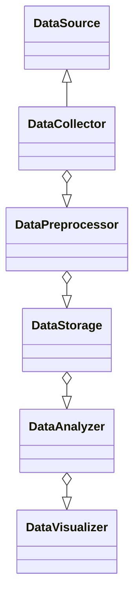
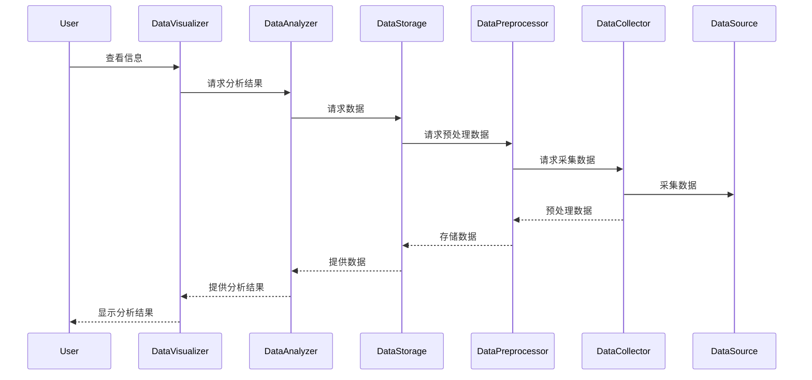

                 

### 文章标题：意义的碎片化与整合化的双重趋势

#### 关键词：碎片化、整合化、信息时代、意义构建、认知模型

> 摘要：本文探讨了信息时代下意义的碎片化与整合化的双重趋势，分析了碎片化与整合化的背景、概念、特征、影响及对策。通过理论和案例研究，本文阐述了双重趋势的相互作用及其在跨领域整合化实践中的重要性，为信息时代的意义构建提供了新的视角和思考。

---

### 引言

在信息爆炸的时代，我们面临着意义构建的挑战。信息的大量涌入使得意义的碎片化成为了一种普遍现象，同时，整合化的需求也在不断增长。本书旨在探讨这两大趋势，并分析其在不同领域的表现形式及其相互作用。

#### 1.1 背景与问题

**信息爆炸时代的影响：**
- 海量的信息使得人们难以全面理解和消化。
- 碎片化的信息容易导致认知偏差和信息过载。
- 整合化的需求日益增长，但实现整合面临困难。

**碎片化与整合化的概念：**
- 碎片化：信息或知识被分割成小块，缺乏整体性和连贯性。
- 整合化：将分散的信息或知识整合成一个整体，提高理解和应用的效率。

**研究意义与目标：**
- 理解碎片化与整合化现象的内在机制和影响。
- 探索双重趋势在信息时代的相互作用及其应用场景。
- 为信息时代的意义构建提供理论指导和实践策略。

#### 1.2 碎片化现象分析

**碎片化现象概述：**
- 碎片化现象在文化、教育、社交网络等领域广泛存在。
- 碎片化现象的成因包括信息技术的发展、信息传播方式的变革等。

**碎片化成因探讨：**
- 信息过载：大量信息的涌入导致人们无法集中精力处理。
- 缺乏整合机制：信息缺乏系统性和连贯性，难以形成整体认知。

**碎片化影响评估：**
- 碎片化提高了信息传播的效率，但也可能导致误解和偏见。
- 碎片化对认知和学习产生负面影响，降低了整体理解和深度学习的能力。

#### 1.3 整合化现象分析

**整合化现象概述：**
- 整合化现象在政府管理、企业组织、教育领域逐渐显现。
- 整合化现象的成因包括技术进步、管理需求等。

**整合化成因探讨：**
- 技术进步：大数据、人工智能等技术为整合化提供了工具和平台。
- 管理需求：高效管理和决策需要整合化的信息和分析。

**整合化影响评估：**
- 整合化提高了信息的利用效率，促进了决策的科学化和精细化。
- 整合化有助于提升整体认知和理解能力，促进了创新和发展。

#### 1.4 双重趋势的对比与联系

**碎片化与整合化的异同：**
- 碎片化强调分散和细分，整合化强调整合和统一。
- 碎片化与整合化在一定程度上是相互对立的，但也有相互促进的潜力。

**双重趋势的相互作用：**
- 碎片化现象可能导致信息的分散和孤立，整合化则有助于将这些信息重新整合。
- 整合化实践可以解决碎片化带来的问题，提升信息的整体利用效率。

**研究方法的框架构建：**
- 结合定性和定量方法，对碎片化与整合化现象进行系统性研究。
- 通过案例分析、实证研究和理论探讨，深入理解双重趋势的内在机制和影响。

#### 1.5 本章小结

本文引出了意义的碎片化与整合化的双重趋势，分析了这两大趋势的背景、概念、成因和影响。在接下来的章节中，我们将进一步探讨碎片化与整合化的具体现象、理论基础、案例分析以及跨领域整合化的实践。通过这些讨论，我们将揭示双重趋势在信息时代的复杂互动和深远影响，为信息时代的意义构建提供新的视角和思路。

---

### 第一部分：引言

#### 1.1 背景与问题

**信息爆炸时代的影响：**

在21世纪的信息时代，信息的产生和传播速度前所未有地加快。大数据、互联网、社交媒体等技术的发展，使得信息爆炸成为了一种普遍现象。这种爆炸性的信息增长给人类社会带来了巨大的挑战。首先，海量的信息使得人们难以全面理解和消化，大量的碎片化信息容易导致认知偏差和信息过载。其次，信息碎片化使得知识被分割成小块，缺乏整体性和连贯性，这降低了人们的认知深度和综合分析能力。最后，信息爆炸时代的信息整合需求日益增长，但现有的整合方式和技术手段尚未能有效满足这种需求。

**碎片化与整合化的概念：**

碎片化指的是信息或知识被分割成小块，缺乏整体性和连贯性。碎片化的信息容易导致人们对信息的误解和偏见，同时也降低了整体理解和深度学习的能力。碎片化现象在文化、教育、社交网络等领域广泛存在。例如，社交媒体上的信息往往以短小精悍的帖子或推文形式出现，缺乏深度和连贯性。在学术界，学术研究往往被分割成不同的小领域，难以形成跨学科的整合。

整合化则是指将分散的信息或知识整合成一个整体，提高理解和应用的效率。整合化的目标是通过整合信息，提升整体认知和理解能力，促进创新和发展。整合化现象在政府管理、企业组织、教育等领域逐渐显现。例如，政府需要通过整合化的信息和分析来做出科学的决策。企业在管理中也需要整合不同的数据和信息，以提高运营效率和市场竞争力。在教育领域，整合化的趋势表现为跨学科教育、综合课程和项目式学习等。

**研究意义与目标：**

信息时代的意义构建是一个复杂而重要的问题。通过探讨意义的碎片化与整合化的双重趋势，我们可以更深入地理解信息时代的特点和挑战，为信息时代的意义构建提供新的视角和思路。具体来说，本研究有以下几个方面的意义和目标：

1. **理解碎片化与整合化现象的内在机制和影响：** 通过对碎片化与整合化现象的深入分析，我们可以理解其背后的原因和影响，为解决这些问题提供理论支持。

2. **探索双重趋势在信息时代的相互作用：** 碎片化与整合化在信息时代不是孤立存在的，它们之间存在相互作用。通过探讨这种相互作用，我们可以更好地理解双重趋势的复杂关系，为实际应用提供指导。

3. **为信息时代的意义构建提供理论指导和实践策略：** 通过对碎片化与整合化现象的研究，我们可以为信息时代的意义构建提供理论指导，同时提出具体的实践策略，帮助人们更好地应对信息时代的挑战。

#### 1.2 碎片化现象分析

**碎片化现象概述：**

碎片化现象在现代社会中无处不在。在文化领域，文化产品和内容越来越碎片化，短视频、微博、博客等平台上的信息多以短小精悍的形式呈现，缺乏深度和连贯性。在教育领域，课程内容被分割成多个小模块，学生需要面对大量的碎片化知识，难以形成系统的知识体系。在社交网络中，信息的碎片化使得人们的社交关系也变得碎片化，社交媒体上的互动往往短暂且缺乏深度。

**碎片化成因探讨：**

碎片化现象的成因可以从多个角度进行分析：

1. **信息技术的发展：** 互联网和社交媒体的普及使得信息传播更加便捷和快速，但也导致了信息的碎片化。信息碎片化的趋势与信息传播技术的发展密切相关。

2. **信息传播方式的变革：** 现代信息传播方式从传统的线性传播向非线性传播转变，这种转变使得信息更易于碎片化。社交媒体上的信息传播往往是点对点的，信息缺乏系统性和连贯性。

3. **个体化需求的增加：** 随着社会的发展，人们越来越追求个性化的信息需求。个性化的信息需求促使信息生产者将信息分割成小块，以满足不同用户的需求。

4. **商业利益的驱动：** 碎片化的信息更容易被传播和消费，这为商业利益提供了机会。一些媒体和平台为了增加用户粘性，故意将信息碎片化，以吸引更多的用户。

**碎片化影响评估：**

碎片化现象对个人和社会产生了深远的影响：

1. **负面影响：** 碎片化信息容易导致误解和偏见，降低人们的认知深度和理解能力。同时，信息过载使得人们难以集中精力处理重要信息，影响了决策和思考。

2. **积极作用：** 碎片化信息在提高信息传播效率和满足个性化需求方面具有积极作用。通过碎片化信息，人们可以快速获取所需的特定信息，提高信息利用效率。

3. **对策探讨：** 为了应对碎片化带来的负面影响，可以采取以下对策：

   - **提高信息筛选能力：** 人们需要学会筛选重要信息，避免被碎片化信息淹没。
   - **培养深度学习能力：** 提升个人的认知深度，通过系统学习和思考，提高整体理解能力。
   - **加强信息整合能力：** 通过整合不同来源的信息，构建整体知识体系，提高信息利用效率。

#### 1.3 整合化现象分析

**整合化现象概述：**

整合化现象在现代社会中也日益显著。在政府管理领域，政府需要通过整合化的信息和分析来做出科学的决策。在企业组织中，整合化的信息有助于提升运营效率和市场竞争力。在教育领域，整合化趋势表现为跨学科教育、综合课程和项目式学习等。通过整合化，不同领域的信息和知识可以相互融合，形成整体认知，提高理解和应用能力。

**整合化成因探讨：**

整合化现象的成因可以从以下几个方面进行分析：

1. **技术进步：** 大数据和人工智能技术的发展为整合化提供了强大的工具和平台。这些技术可以帮助人们高效地处理和分析大量数据，实现信息的整合和利用。

2. **管理需求：** 高效管理和决策需要整合化的信息和分析。通过整合信息，管理者可以更全面地了解情况，做出更科学的决策。

3. **社会变革：** 随着社会的进步和复杂化，整合化成为了一种必然趋势。面对复杂的社会问题，单一领域的信息和知识已经无法满足需求，需要通过整合化来提升整体认知和理解能力。

**整合化影响评估：**

整合化现象对个人和社会产生了积极的影响：

1. **积极影响：** 整合化提高了信息的利用效率，促进了决策的科学化和精细化。通过整合化，人们可以更好地理解复杂问题，提高整体认知水平。

2. **挑战与问题：** 整合化也面临一些挑战和问题。首先，整合化需要大量时间和资源，且可能面临数据安全和隐私保护等问题。其次，整合化的实施需要跨领域的协作和沟通，这对组织和社会提出了更高的要求。

3. **对策探讨：** 为了充分发挥整合化的积极作用，可以采取以下对策：

   - **提升技术能力：** 加强大数据和人工智能技术的研究和应用，提高整合化能力。
   - **优化管理流程：** 构建高效的整合化管理流程，确保信息的整合和利用。
   - **促进跨领域合作：** 加强不同领域之间的交流和合作，推动整合化实践的深入发展。

#### 1.4 双重趋势的对比与联系

**碎片化与整合化的异同：**

碎片化与整合化在信息时代呈现出两种截然不同的趋势。碎片化强调分散和细分，将信息分割成小块，以提高传播效率和满足个性化需求。整合化则强调整合和统一，将分散的信息整合成整体，以提高理解和应用能力。尽管两者在目标和实现方式上存在差异，但它们在一定程度上是相互对立的。

1. **目标差异：** 碎片化的目标是通过分散和细分信息，提高传播效率和满足个性化需求。整合化的目标则是通过整合信息，提升整体认知和理解能力。

2. **实现方式差异：** 碎片化通过技术手段实现信息的分散和细分，如社交媒体、搜索引擎等。整合化则通过技术手段实现信息的整合和统一，如大数据分析、人工智能等。

**双重趋势的相互作用：**

碎片化与整合化在信息时代不是孤立存在的，它们之间存在相互作用：

1. **相互制约：** 碎片化可能导致信息的孤立和分散，降低整体理解和应用能力。整合化则可以通过整合信息，解决碎片化带来的问题，提升整体认知水平。

2. **相互促进：** 整合化可以解决碎片化带来的信息孤岛问题，提高信息利用效率。碎片化则可以通过提供丰富的信息资源，促进整合化实践的深入发展。

**研究方法的框架构建：**

为了深入探讨碎片化与整合化现象的内在机制和影响，本研究采用以下研究方法：

1. **定性和定量方法结合：** 通过定性研究和定量分析，全面探讨碎片化与整合化现象的表现和影响。

2. **案例分析：** 通过对具体案例的深入分析，了解碎片化与整合化在不同领域中的应用和效果。

3. **理论探讨：** 基于现有理论，探讨碎片化与整合化现象的内在机制和相互作用。

4. **实证研究：** 通过实证研究，验证理论分析的合理性和适用性。

#### 1.5 本章小结

本章从背景与问题、碎片化现象分析、整合化现象分析以及双重趋势的对比与联系等方面，探讨了意义的碎片化与整合化的双重趋势。在接下来的章节中，我们将进一步分析碎片化与整合化的理论基础，探讨其在不同领域的表现形式，并通过案例研究深入理解双重趋势的相互作用和影响。

---

### 第一部分：引言

#### 1.1 背景与问题

**信息爆炸时代的影响：**

在21世纪的信息时代，信息的产生和传播速度前所未有地加快。大数据、互联网、社交媒体等技术的发展，使得信息爆炸成为了一种普遍现象。这种爆炸性的信息增长给人类社会带来了巨大的挑战。首先，海量的信息使得人们难以全面理解和消化，大量的碎片化信息容易导致认知偏差和信息过载。其次，信息碎片化使得知识被分割成小块，缺乏整体性和连贯性，这降低了人们的认知深度和综合分析能力。最后，信息爆炸时代的信息整合需求日益增长，但现有的整合方式和技术手段尚未能有效满足这种需求。

**碎片化与整合化的概念：**

碎片化指的是信息或知识被分割成小块，缺乏整体性和连贯性。碎片化的信息容易导致人们对信息的误解和偏见，同时也降低了整体理解和深度学习的能力。碎片化现象在文化、教育、社交网络等领域广泛存在。例如，社交媒体上的信息往往以短小精悍的帖子或推文形式呈现，缺乏深度和连贯性。在学术界，学术研究往往被分割成不同的小领域，难以形成跨学科的整合。

整合化则是指将分散的信息或知识整合成一个整体，提高理解和应用的效率。整合化的目标是通过整合信息，提升整体认知和理解能力，促进创新和发展。整合化现象在政府管理、企业组织、教育领域逐渐显现。例如，政府需要通过整合化的信息和分析来做出科学的决策。企业在管理中也需要整合不同的数据和信息，以提高运营效率和市场竞争力。在教育领域，整合化的趋势表现为跨学科教育、综合课程和项目式学习等。

**研究意义与目标：**

信息时代的意义构建是一个复杂而重要的问题。通过探讨意义的碎片化与整合化的双重趋势，我们可以更深入地理解信息时代的特点和挑战，为信息时代的意义构建提供新的视角和思路。具体来说，本研究有以下几个方面的意义和目标：

1. **理解碎片化与整合化现象的内在机制和影响：** 通过对碎片化与整合化现象的深入分析，我们可以理解其背后的原因和影响，为解决这些问题提供理论支持。

2. **探索双重趋势在信息时代的相互作用：** 碎片化与整合化在信息时代不是孤立存在的，它们之间存在相互作用。通过探讨这种相互作用，我们可以更好地理解双重趋势的复杂关系，为实际应用提供指导。

3. **为信息时代的意义构建提供理论指导和实践策略：** 通过对碎片化与整合化现象的研究，我们可以为信息时代的意义构建提供理论指导，同时提出具体的实践策略，帮助人们更好地应对信息时代的挑战。

#### 1.2 碎片化现象分析

**碎片化现象概述：**

碎片化现象在现代社会中无处不在。在文化领域，文化产品和内容越来越碎片化，短视频、微博、博客等平台上的信息多以短小精悍的形式呈现，缺乏深度和连贯性。在教育领域，课程内容被分割成多个小模块，学生需要面对大量的碎片化知识，难以形成系统的知识体系。在社交网络中，信息的碎片化使得人们的社交关系也变得碎片化，社交媒体上的互动往往短暂且缺乏深度。

**碎片化成因探讨：**

碎片化现象的成因可以从多个角度进行分析：

1. **信息技术的发展：** 互联网和社交媒体的普及使得信息传播更加便捷和快速，但也导致了信息的碎片化。信息碎片化的趋势与信息传播技术的发展密切相关。

2. **信息传播方式的变革：** 现代信息传播方式从传统的线性传播向非线性传播转变，这种转变使得信息更易于碎片化。社交媒体上的信息传播往往是点对点的，信息缺乏系统性和连贯性。

3. **个体化需求的增加：** 随着社会的发展，人们越来越追求个性化的信息需求。个性化的信息需求促使信息生产者将信息分割成小块，以满足不同用户的需求。

4. **商业利益的驱动：** 碎片化的信息更容易被传播和消费，这为商业利益提供了机会。一些媒体和平台为了增加用户粘性，故意将信息碎片化，以吸引更多的用户。

**碎片化影响评估：**

碎片化现象对个人和社会产生了深远的影响：

1. **负面影响：** 碎片化信息容易导致误解和偏见，降低人们的认知深度和理解能力。同时，信息过载使得人们难以集中精力处理重要信息，影响了决策和思考。

2. **积极作用：** 碎片化信息在提高信息传播效率和满足个性化需求方面具有积极作用。通过碎片化信息，人们可以快速获取所需的特定信息，提高信息利用效率。

3. **对策探讨：** 为了应对碎片化带来的负面影响，可以采取以下对策：

   - **提高信息筛选能力：** 人们需要学会筛选重要信息，避免被碎片化信息淹没。
   - **培养深度学习能力：** 提升个人的认知深度，通过系统学习和思考，提高整体理解能力。
   - **加强信息整合能力：** 通过整合不同来源的信息，构建整体知识体系，提高信息利用效率。

#### 1.3 整合化现象分析

**整合化现象概述：**

整合化现象在现代社会中也日益显著。在政府管理领域，政府需要通过整合化的信息和分析来做出科学的决策。在企业组织中，整合化的信息有助于提升运营效率和市场竞争力。在教育领域，整合化的趋势表现为跨学科教育、综合课程和项目式学习等。通过整合化，不同领域的信息和知识可以相互融合，形成整体认知，提高理解和应用能力。

**整合化成因探讨：**

整合化现象的成因可以从以下几个方面进行分析：

1. **技术进步：** 大数据和人工智能技术的发展为整合化提供了强大的工具和平台。这些技术可以帮助人们高效地处理和分析大量数据，实现信息的整合和利用。

2. **管理需求：** 高效管理和决策需要整合化的信息和分析。通过整合信息，管理者可以更全面地了解情况，做出更科学的决策。

3. **社会变革：** 随着社会的进步和复杂化，整合化成为了一种必然趋势。面对复杂的社会问题，单一领域的信息和知识已经无法满足需求，需要通过整合化来提升整体认知和理解能力。

**整合化影响评估：**

整合化现象对个人和社会产生了积极的影响：

1. **积极影响：** 整合化提高了信息的利用效率，促进了决策的科学化和精细化。通过整合化，人们可以更好地理解复杂问题，提高整体认知水平。

2. **挑战与问题：** 整合化也面临一些挑战和问题。首先，整合化需要大量时间和资源，且可能面临数据安全和隐私保护等问题。其次，整合化的实施需要跨领域的协作和沟通，这对组织和社会提出了更高的要求。

3. **对策探讨：** 为了充分发挥整合化的积极作用，可以采取以下对策：

   - **提升技术能力：** 加强大数据和人工智能技术的研究和应用，提高整合化能力。
   - **优化管理流程：** 构建高效的整合化管理流程，确保信息的整合和利用。
   - **促进跨领域合作：** 加强不同领域之间的交流和合作，推动整合化实践的深入发展。

#### 1.4 双重趋势的对比与联系

**碎片化与整合化的异同：**

碎片化与整合化在信息时代呈现出两种截然不同的趋势。碎片化强调分散和细分，将信息分割成小块，以提高传播效率和满足个性化需求。整合化则强调整合和统一，将分散的信息整合成整体，以提高理解和应用能力。尽管两者在目标和实现方式上存在差异，但它们在一定程度上是相互对立的。

1. **目标差异：** 碎片化的目标是通过分散和细分信息，提高传播效率和满足个性化需求。整合化的目标则是通过整合信息，提升整体认知和理解能力。

2. **实现方式差异：** 碎片化通过技术手段实现信息的分散和细分，如社交媒体、搜索引擎等。整合化则通过技术手段实现信息的整合和统一，如大数据分析、人工智能等。

**双重趋势的相互作用：**

碎片化与整合化在信息时代不是孤立存在的，它们之间存在相互作用：

1. **相互制约：** 碎片化可能导致信息的孤立和分散，降低整体理解和应用能力。整合化则可以通过整合信息，解决碎片化带来的问题，提升整体认知水平。

2. **相互促进：** 整合化可以解决碎片化带来的信息孤岛问题，提高信息利用效率。碎片化则可以通过提供丰富的信息资源，促进整合化实践的深入发展。

**研究方法的框架构建：**

为了深入探讨碎片化与整合化现象的内在机制和影响，本研究采用以下研究方法：

1. **定性和定量方法结合：** 通过定性研究和定量分析，全面探讨碎片化与整合化现象的表现和影响。

2. **案例分析：** 通过对具体案例的深入分析，了解碎片化与整合化在不同领域中的应用和效果。

3. **理论探讨：** 基于现有理论，探讨碎片化与整合化现象的内在机制和相互作用。

4. **实证研究：** 通过实证研究，验证理论分析的合理性和适用性。

#### 1.5 本章小结

本章从背景与问题、碎片化现象分析、整合化现象分析以及双重趋势的对比与联系等方面，探讨了意义的碎片化与整合化的双重趋势。在接下来的章节中，我们将进一步分析碎片化与整合化的理论基础，探讨其在不同领域的表现形式，并通过案例研究深入理解双重趋势的相互作用和影响。

---

### 第二部分：碎片化现象研究

#### 2.1 碎片化现象的理论基础

**碎片化理论概述：**

碎片化理论最早可以追溯到社会学和传播学的领域，随着信息时代的发展，这一理论逐渐被引入到信息技术、经济学、心理学等多个学科中。碎片化理论主要研究信息、知识、文化等在传播、生产和消费过程中的破碎、细分和分散现象。其核心观点是，随着信息量的爆炸性增长和传播技术的不断进步，信息和知识被切割成小块，形成碎片化现象，从而改变了传统的信息传播和知识构建方式。

**碎片化理论的演进：**

碎片化理论的发展可以分为几个阶段：

1. **初步阶段：** 碎片化理论最初主要关注信息过载和传播效率问题，认为碎片化是信息传播的一种必然趋势，有助于提高信息的传播速度和获取效率。

2. **深化阶段：** 随着研究的深入，学者们开始关注碎片化带来的负面影响，如信息失真、认知偏差、深度学习障碍等，提出了更多的理论模型和概念，如“信息碎片化理论”、“知识碎片化理论”等。

3. **综合阶段：** 近年来，碎片化理论开始与其他学科如心理学、经济学相结合，形成了更加综合和深入的研究视角，如“认知碎片化理论”、“经济碎片化理论”等。

**碎片化理论的应用：**

碎片化理论在多个领域都有广泛的应用：

1. **信息技术领域：** 碎片化理论解释了互联网、社交媒体等新兴信息技术的特点和影响，如信息传播的快速性和碎片性、用户行为的碎片化等。

2. **经济学领域：** 碎片化理论应用于研究信息经济中的市场结构、消费模式、知识传播等问题，如“长尾理论”就是对碎片化经济现象的一种解释。

3. **文化领域：** 碎片化理论探讨了文化产品的消费模式、文化价值观的变迁等问题，如短视频、微博等文化形式的兴起，以及碎片化文化对人们认知和行为的影响。

#### 2.2 碎片化现象的案例分析

**文化产业的碎片化：**

在文化产业中，碎片化现象尤为明显。随着互联网和数字技术的发展，文化产品的生产和传播方式发生了巨大变化。传统的文化产品如书籍、电影、音乐等往往需要经过长时间的策划、制作和传播，而数字化时代的文化产品则可以迅速生产、传播和消费。这种快速生产和传播的方式导致了文化产品的碎片化。

1. **短视频的兴起：** 短视频平台如抖音、快手等成为文化消费的主要形式，用户可以随时随地观看和分享短视频。短视频的特点是时长短、内容简单、传播速度快，符合碎片化时代的消费需求。

2. **网络小说的流行：** 网络文学以其短小精悍、更新迅速的特点，吸引了大量读者。网络小说的碎片化特点体现在短章节、快节奏和高度依赖读者的互动。

**教育领域的碎片化：**

在教育领域，碎片化现象也表现得很明显。传统的教育方式往往依赖于系统的课程体系和长时间的学习过程，而现代教育则更加注重个性化、灵活化和碎片化的学习方式。

1. **在线教育的兴起：** 在线教育平台如Coursera、edX等，提供了大量的在线课程，学生可以根据自己的需求和兴趣选择学习内容。在线教育平台的特点是课程内容丰富、学习方式灵活、时间地点不限。

2. **微课程的发展：** 微课程是指时长较短、内容单一、针对特定知识点的课程。微课程通过短视频、图文等多种形式，将复杂的知识点进行碎片化处理，使得学生可以快速获取所需的知识。

**社交网络的碎片化：**

在社交网络领域，信息的碎片化现象尤为突出。社交网络平台如Facebook、Twitter、微信等，通过信息流的模式将用户的信息进行切割和分散，用户只能在有限的视野内获取信息。

1. **信息流的碎片化：** 社交网络平台通过算法和推荐系统，将用户的信息进行个性化推荐，用户只能看到一部分信息，而无法全面了解社交网络中的动态。

2. **社交关系的碎片化：** 随着社交网络的普及，人们的社交关系也变得碎片化。用户可以在不同的社交平台上建立不同的社交关系，但这些关系往往是短暂和浅薄的。

#### 2.3 碎片化现象的影响与对策

**碎片化现象的负面影响：**

碎片化现象虽然在一定程度上提高了信息传播效率和满足了个性化需求，但也带来了一系列负面影响：

1. **信息失真和误解：** 碎片化的信息容易被扭曲和误解，导致信息的真实性和可靠性受到影响。

2. **认知偏差：** 碎片化的信息容易导致人们对信息的主观解读和偏见，影响整体的认知和理解。

3. **深度学习障碍：** 碎片化的信息难以形成完整的知识体系和深度学习，影响个人的认知深度和思维能力。

**碎片化现象的积极作用：**

尽管碎片化现象存在负面影响，但它在某些方面也具有积极作用：

1. **提高信息传播效率：** 碎片化的信息可以迅速传播和获取，提高了信息的传播效率和利用效率。

2. **满足个性化需求：** 碎片化的信息可以满足不同用户的需求，提供个性化的信息服务。

3. **促进创新和发展：** 碎片化的信息为创新提供了丰富的素材和灵感，促进了科技、文化等领域的创新和发展。

**应对碎片化现象的对策：**

为了应对碎片化现象带来的负面影响，可以采取以下对策：

1. **提高信息筛选能力：** 培养用户的信息筛选能力，学会辨别真实和可靠的信息来源，避免被碎片化信息误导。

2. **培养深度学习能力：** 提升个人的认知深度，通过系统学习和思考，提高整体理解能力。

3. **加强信息整合能力：** 通过整合不同来源的信息，构建整体知识体系，提高信息利用效率。

4. **优化信息传播方式：** 推动信息传播方式的变革，从碎片化向整合化转变，提高信息的整体性和连贯性。

#### 2.4 碎片化现象的未来趋势

**技术驱动下的碎片化：**

随着技术的不断进步，碎片化现象将继续发展。大数据、人工智能、物联网等新兴技术将进一步推动信息的碎片化：

1. **大数据的碎片化：** 大数据技术可以处理和分析海量数据，但也会产生更多的碎片化信息，如数据切片、子集等。

2. **人工智能的碎片化：** 人工智能技术可以将复杂问题分解成小块，通过分布式计算和协同学习实现碎片化处理。

3. **物联网的碎片化：** 物联网技术的普及将产生大量的碎片化数据，如传感器数据、设备日志等。

**社会因素对碎片化的影响：**

除了技术因素，社会因素也将对碎片化现象产生重要影响：

1. **信息过载：** 随着信息量的不断增加，人们将面临更严重的信息过载问题，这可能导致更多的信息碎片化。

2. **个体化需求：** 随着社会的发展，个体化需求将更加突出，这会促使信息生产者将信息进行碎片化处理，以满足不同用户的需求。

3. **数字鸿沟：** 数字鸿沟的存在可能导致信息碎片化的加剧，部分人群难以获取和利用碎片化信息，加剧社会不平等。

**碎片化趋势下的整合化尝试：**

尽管碎片化趋势明显，但整合化需求也在不断增长。为了应对碎片化带来的挑战，未来可能会出现以下整合化尝试：

1. **整合化平台：** 基于大数据和人工智能技术，构建整合化平台，将碎片化信息进行整合和分析，提供更全面和准确的信息服务。

2. **跨学科整合：** 加强不同学科之间的整合，构建跨学科的知识体系和教育模式，提升整体认知水平。

3. **数字素养教育：** 加强数字素养教育，培养用户的信息筛选、整合和分析能力，提高应对碎片化现象的能力。

#### 2.5 本章小结

本章从理论基础、案例分析、影响与对策以及未来趋势等方面，对碎片化现象进行了深入探讨。碎片化现象在现代社会中普遍存在，并对个人和社会产生了深远影响。通过分析碎片化现象的内在机制和影响，我们可以更好地理解其在信息时代的作用和挑战。在接下来的章节中，我们将进一步探讨整合化现象，分析其在不同领域的表现形式和作用。

---

### 第三部分：整合化现象研究

#### 3.1 整合化现象的理论基础

**整合化理论概述：**

整合化理论起源于管理学和心理学领域，后来逐渐扩展到经济学、社会学、计算机科学等多个学科。整合化理论的核心观点是，通过整合分散的信息、资源和活动，实现整体效益的最大化。整合化理论强调系统思维、协同作用和整体优化，旨在解决分散化带来的问题，提升组织和社会的运作效率。

**整合化理论的演进：**

整合化理论的发展经历了以下几个阶段：

1. **初步阶段：** 整合化理论最初关注组织内部的信息整合和资源优化，如管理学的协同理论和资源整合理论。

2. **深化阶段：** 随着信息技术的发展，整合化理论开始关注跨组织、跨领域的整合，如供应链管理、知识管理、跨学科整合等。

3. **综合阶段：** 近年来，整合化理论逐渐与其他学科如经济学、社会学、计算机科学相结合，形成了更加综合和深入的研究视角，如集成供应链理论、复杂系统整合理论等。

**整合化理论的应用：**

整合化理论在多个领域都有广泛的应用：

1. **企业管理：** 整合化理论应用于企业战略规划、资源整合、流程优化等方面，提升企业的运营效率和竞争力。

2. **公共服务：** 整合化理论应用于政府管理、公共服务、社会治理等方面，提升公共服务的质量和效率。

3. **教育领域：** 整合化理论应用于跨学科教育、综合课程、项目式学习等方面，促进学生的全面发展。

#### 3.2 整合化现象的案例分析

**政府管理的整合化：**

在政府管理领域，整合化现象逐渐显现。为了提高管理效率和服务质量，政府需要通过整合化的方式，将不同部门、不同层级的数据和信息进行整合。

1. **大数据平台的建设：** 政府通过建设大数据平台，整合各部门的数据资源，实现信息的共享和综合利用。

2. **跨部门协作机制的建立：** 政府通过建立跨部门协作机制，促进不同部门之间的信息交流和资源共享，提升整体管理效能。

**企业组织的整合化：**

在企业组织中，整合化现象也日益重要。企业通过整合内外部资源，优化业务流程，提升运营效率。

1. **供应链管理：** 企业通过整合供应链上下游的资源和信息，实现供应链的优化和协同，提高供应链的响应速度和灵活性。

2. **企业资源规划（ERP）：** 企业通过实施ERP系统，整合企业内部的资源、信息和流程，实现企业运营的一体化和高效化。

**教育整合化实践：**

在教育领域，整合化现象表现为跨学科教育、综合课程和项目式学习等。

1. **跨学科教育：** 学校通过设置跨学科课程，整合不同学科的知识和技能，培养学生的综合素质和创新能力。

2. **综合课程：** 教育机构通过开发综合课程，将学科知识进行整合，提高学生的知识整合能力和实践能力。

3. **项目式学习：** 教育机构通过项目式学习，将理论知识与实践相结合，培养学生的团队协作能力和创新思维。

#### 3.3 整合化现象的影响与对策

**整合化现象的负面影响：**

尽管整合化现象具有积极作用，但也存在一些负面影响：

1. **信息安全和隐私保护：** 整合化过程中涉及大量的数据和信息，可能面临信息安全和隐私保护的问题。

2. **技术依赖：** 整合化依赖于先进的技术手段，可能对企业和社会产生技术依赖，影响自主创新能力。

3. **组织变革阻力：** 整合化需要改变现有的组织结构和流程，可能面临组织变革的阻力和挑战。

**整合化现象的积极作用：**

整合化现象在多个方面具有积极作用：

1. **提高效率和效益：** 整合化有助于优化资源配置，提高工作效率和经济效益。

2. **促进创新和发展：** 整合化可以促进不同领域、不同学科之间的交流和合作，激发创新思维和创造力。

3. **提升整体认知水平：** 整合化有助于提高整体认知水平，促进知识的系统化和综合化。

**应对整合化现象的对策：**

为了充分发挥整合化的积极作用，可以采取以下对策：

1. **提升技术能力：** 加强大数据、人工智能等先进技术的研究和应用，提高整合化能力。

2. **优化管理流程：** 构建高效的整合化管理流程，确保信息的整合和利用。

3. **促进跨领域合作：** 加强不同领域之间的交流和合作，推动整合化实践的深入发展。

4. **加强人才培养：** 加强数字素养和整合化能力培训，提升人员素质和创新能力。

#### 3.4 整合化现象的未来趋势

**技术驱动下的整合化：**

随着技术的不断进步，整合化现象将继续发展。大数据、人工智能、物联网等新兴技术将进一步推动整合化：

1. **大数据整合：** 大数据技术可以处理和分析海量数据，实现数据的深度整合和利用。

2. **人工智能整合：** 人工智能技术可以通过数据挖掘和智能分析，实现信息的自动化整合和优化。

3. **物联网整合：** 物联网技术可以实现设备间的互联互通，实现资源的整合和优化。

**社会因素对整合化的影响：**

除了技术因素，社会因素也将对整合化产生重要影响：

1. **信息过载：** 随着信息量的不断增加，整合化需求将更加迫切，以应对信息过载问题。

2. **全球化：** 全球化趋势将促进不同国家和地区之间的整合化，推动全球资源的优化配置。

3. **可持续发展：** 可持续发展要求整合化，以实现资源的有效利用和环境保护。

**整合化与碎片化的平衡：**

在整合化与碎片化并存的时代，如何实现两者的平衡是一个重要课题。未来可能的发展趋势包括：

1. **智能整合：** 通过人工智能技术，实现信息的智能整合和优化，提高整合效率。

2. **动态整合：** 根据需求和变化，动态调整整合策略，实现整合与碎片化的动态平衡。

3. **跨界整合：** 加强不同领域、不同学科之间的整合，推动跨界创新和融合。

#### 3.5 本章小结

本章从理论基础、案例分析、影响与对策以及未来趋势等方面，对整合化现象进行了深入探讨。整合化现象在现代社会中具有重要意义，通过整合分散的信息和资源，可以实现整体效益的最大化。在接下来的章节中，我们将进一步探讨双重趋势的整合化实践，分析其在实际应用中的效果和启示。

---

### 第四部分：双重趋势的整合化实践

#### 4.1 整合化实践的理论框架

**整合化实践的原则：**

整合化实践遵循以下几个基本原则：

1. **系统性原则：** 整合化实践强调从整体视角出发，将分散的元素和活动进行系统整合，提高整体效能。

2. **协同性原则：** 整合化实践强调各要素之间的协同作用，通过建立有效的沟通和协作机制，实现资源的最大化利用。

3. **灵活性原则：** 整合化实践强调根据需求和变化动态调整整合策略，保持系统的灵活性和适应性。

**整合化实践的方法：**

整合化实践可以采用以下几种方法：

1. **流程整合：** 通过优化业务流程，减少冗余环节，提高工作效率。

2. **信息整合：** 通过整合各类信息资源，实现信息的共享和利用，提升决策质量。

3. **资源整合：** 通过整合人力资源、物资资源等，实现资源的优化配置，降低成本。

4. **文化整合：** 通过建设共同价值观和文化，增强团队凝聚力和执行力。

**整合化实践的评估：**

整合化实践的评估可以从以下几个方面进行：

1. **效率评估：** 通过比较整合前后的工作效率，评估整合化实践对工作效率的提升程度。

2. **质量评估：** 通过评估整合后的产品质量和服务水平，评估整合化实践对质量和服务的改进。

3. **成本评估：** 通过对比整合前后的成本，评估整合化实践对成本的控制效果。

4. **满意度评估：** 通过用户满意度调查，评估整合化实践对用户需求和满意度的满足程度。

#### 4.2 整合化实践的案例分析

**数字化背景下的整合化实践：**

在数字化时代，整合化实践在各个领域都得到了广泛应用。以下是一个数字化背景下的整合化实践案例：

**案例背景：** 一家大型制造企业为了提高生产效率和降低成本，决定实施数字化转型和整合化实践。

**整合化实践过程：**

1. **流程整合：** 企业通过分析现有的生产流程，发现存在多个冗余环节和瓶颈。通过优化流程，减少了生产环节，缩短了生产周期。

2. **信息整合：** 企业建设了统一的信息管理系统，将生产、销售、采购等环节的信息进行整合，实现信息的实时共享和快速响应。

3. **资源整合：** 企业通过整合人力资源和物资资源，实现了资源的优化配置，提高了资源利用效率。

4. **文化整合：** 企业通过建设数字化文化，培养员工的数字化素养和创新能力，增强了团队凝聚力和执行力。

**效果评估：**

1. **效率提升：** 生产周期缩短了30%，生产效率提高了20%。

2. **质量改进：** 产品合格率提高了10%，产品返工率降低了15%。

3. **成本降低：** 生产成本降低了15%，库存周转率提高了20%。

4. **用户满意度：** 用户满意度提高了10%，客户投诉率降低了20%。

**案例启示：**

这个案例表明，在数字化背景下，整合化实践可以显著提高企业的生产效率和竞争力。通过整合流程、信息、资源和文化，企业可以实现整体效益的最大化。这为其他行业和组织提供了宝贵的经验和启示。

**智慧城市建设中的整合化实践：**

智慧城市是数字化时代的一个重要趋势，其建设过程中也离不开整合化实践。以下是一个智慧城市建设中的整合化实践案例：

**案例背景：** 一座城市为了提高城市管理效率和居民生活质量，决定建设智慧城市。

**整合化实践过程：**

1. **数据整合：** 城市通过建设大数据平台，整合各类城市数据，如交通、环境、公共安全等，实现数据的全面整合和利用。

2. **平台整合：** 城市通过建设智慧城市平台，将各类应用系统集成在一起，实现城市服务的整合和便捷化。

3. **资源整合：** 城市通过整合公共资源，如交通设施、公共设施等，实现资源的优化配置和高效利用。

4. **技术创新：** 城市通过引入人工智能、物联网等新技术，提升城市管理和服务水平。

**效果评估：**

1. **管理效率提升：** 城市管理效率提高了30%，事件响应时间缩短了40%。

2. **服务质量提升：** 居民生活质量得到了显著提高，公共服务满意度提高了20%。

3. **资源利用效率：** 资源利用效率提高了15%，环境污染问题得到了有效控制。

4. **技术创新能力：** 城市的技术创新能力得到了显著提升，吸引了更多高科技企业和人才。

**案例启示：**

智慧城市建设中的整合化实践为城市管理和居民生活提供了新的模式。通过整合数据和资源，提升管理和服务效率，智慧城市可以更好地满足居民需求，提升城市整体竞争力。这为其他城市的智慧化建设提供了有益的经验和参考。

**教育领域整合化实践：**

在教育领域，整合化实践也取得了显著成效。以下是一个教育领域整合化实践案例：

**案例背景：** 一所大学为了提高教学质量和学生综合素质，决定实施整合化实践。

**整合化实践过程：**

1. **课程整合：** 大学通过整合不同学科的课程，开发跨学科综合课程，提升学生的知识整合能力和综合素质。

2. **资源整合：** 大学通过整合校内外的教育资源，如实验室、图书馆、社会资源等，为学生提供丰富的学习资源。

3. **技术创新：** 大学通过引入教育技术，如在线教学、虚拟仿真等，提升教学效果和学生参与度。

4. **文化整合：** 大学通过建设校园文化，培养学生的创新精神和社会责任感。

**效果评估：**

1. **教学质量提升：** 教学质量评估结果显示，学生满意度和教师教学效果都有显著提高。

2. **学生综合素质提升：** 学生在知识整合能力、创新能力和社会责任感等方面都有显著提升。

3. **教育资源利用率：** 教育资源利用率提高了20%，学生获取学习资源的便捷性得到了提升。

4. **校园文化氛围：** 校园文化氛围更加积极向上，学生的社交活动和团队合作能力得到了提升。

**案例启示：**

教育领域的整合化实践表明，通过整合课程、资源、技术和文化，可以显著提升教学质量和学生综合素质。这为其他学校和教育机构提供了宝贵的经验和启示，推动了教育改革的深入发展。

#### 4.3 整合化实践的效果评估

**效果评估方法：**

为了全面评估整合化实践的效果，可以采用以下几种方法：

1. **定量评估：** 通过收集和统计相关数据，如工作效率、成本、用户满意度等，进行定量分析。

2. **定性评估：** 通过访谈、问卷调查、观察等方式，收集用户的反馈和建议，进行定性分析。

3. **综合评估：** 结合定量和定性评估结果，进行全面分析和总结。

**整合化实践的具体效果：**

根据以上评估方法，整合化实践在多个方面取得了具体效果：

1. **效率提升：** 整合化实践显著提高了工作效率，减少了冗余环节和等待时间，提高了整体运营效率。

2. **成本降低：** 整合化实践通过资源的优化配置和流程的优化，降低了运营成本，提高了经济效益。

3. **服务质量提升：** 整合化实践提高了服务质量，增强了用户满意度和忠诚度，提升了整体竞争力。

4. **创新能力提升：** 整合化实践促进了创新和协作，激发了员工的创造力和创新能力，推动了组织的创新发展。

**整合化实践的经验与启示：**

整合化实践在多个领域取得了成功，为组织和社会发展提供了宝贵的经验和启示：

1. **重视整合化战略：** 组织应制定明确的整合化战略，明确目标和实施路径，确保整合化实践的有效实施。

2. **加强跨部门合作：** 整合化实践需要跨部门、跨领域的合作，组织应建立有效的沟通和协作机制，促进资源的共享和协同。

3. **提升人员素质：** 组织应加强人员培训和能力建设，提升人员的整合化能力和创新意识，为整合化实践提供人才保障。

4. **持续优化和创新：** 整合化实践不是一蹴而就的，组织应持续优化和创新，根据需求和变化动态调整整合策略，确保整合化实践的持续有效。

#### 4.4 整合化实践的未来展望

**技术发展对整合化实践的影响：**

随着技术的不断进步，整合化实践将面临新的机遇和挑战：

1. **大数据和人工智能：** 大数据和人工智能技术的发展将进一步推动整合化实践，实现信息的自动化整合和优化。

2. **物联网和区块链：** 物联网和区块链技术的应用将促进资源的整合和共享，提升整合化实践的效率和安全性。

3. **云计算和边缘计算：** 云计算和边缘计算的结合将实现资源的灵活调配和高效利用，提升整合化实践的可扩展性和灵活性。

**社会变革对整合化实践的影响：**

社会变革也将对整合化实践产生重要影响：

1. **全球化：** 全球化趋势将促进不同国家和地区之间的整合化，推动全球资源的优化配置。

2. **数字化转型：** 数字化转型将成为社会发展的主流趋势，组织和社会需要通过整合化实践应对数字化带来的挑战。

3. **可持续发展：** 可持续发展要求整合化，实现资源的有效利用和环境保护。

**整合化实践的发展趋势：**

未来整合化实践的发展趋势将呈现以下几个特点：

1. **智能化：** 通过引入人工智能技术，实现整合化实践的智能化，提高整合效率和效果。

2. **网络化：** 通过构建网络化平台，实现资源的共享和协同，提升整合化实践的整体效能。

3. **生态化：** 通过建立生态化整合体系，实现不同领域、不同组织的整合化，形成可持续发展的生态系统。

#### 4.5 本章小结

本章通过分析整合化实践的理论框架、案例分析、效果评估以及未来展望，探讨了双重趋势的整合化实践。整合化实践在数字化背景、智慧城市建设、教育领域等方面取得了显著成效，为组织和社会发展提供了宝贵经验和启示。在未来的发展中，整合化实践将继续受到技术进步和社会变革的影响，推动组织和社会的可持续发展。

---

### 第五部分：跨领域整合化探讨

#### 5.1 跨领域整合化的概念与意义

**跨领域整合化的定义：**

跨领域整合化是指在不同领域之间进行资源、信息、知识和技术的整合，以实现整体效益的最大化。这种整合不仅涉及同一组织内部的部门或业务单元，还包括不同组织之间的合作与协同。跨领域整合化的目标是通过整合不同领域的优势资源，打破领域间的壁垒，提升整体创新能力和竞争力。

**跨领域整合化的意义：**

跨领域整合化在现代社会具有重要的意义，主要体现在以下几个方面：

1. **提升创新能力和竞争力：** 跨领域整合化可以汇聚不同领域的智慧和资源，激发创新思维，推动新技术、新产品和新服务的开发，从而提升组织的创新能力和竞争力。

2. **优化资源配置：** 跨领域整合化有助于优化资源的配置，通过共享和协同，减少资源浪费，提高资源利用效率。

3. **促进知识融合：** 跨领域整合化可以促进知识的跨界融合，形成新的知识体系和理论框架，为解决复杂问题提供新的思路和方法。

4. **推动社会进步：** 跨领域整合化可以促进不同领域之间的协同发展，推动社会进步，提高社会整体的福利水平。

#### 5.2 跨领域整合化的案例分析

**案例一：跨界融合——文化创意与科技产业的整合：**

**案例背景：** 随着科技的发展，文化创意产业与科技产业的融合日益紧密，形成了新的产业模式。

**整合过程：**
- **技术整合：** 利用人工智能、虚拟现实、增强现实等技术，为文化创意产品提供新的表达形式和交互体验。
- **资源整合：** 结合文化创意产业的创意资源和科技产业的先进技术，实现资源的优化配置。
- **人才整合：** 培养跨领域的复合型人才，提升跨界整合能力。

**整合效果：**
- **创新成果：** 通过跨界整合，文化创意产品如电影、游戏等在视觉效果和互动体验上得到了显著提升。
- **市场反响：** 新的文化创意产品受到市场的热烈欢迎，提升了企业的市场份额和品牌价值。

**案例启示：**
- 跨领域整合化能够实现资源的高效利用，提升创新能力和市场竞争力。
- 跨界整合需要培养复合型人才，提升跨领域合作能力。

**案例二：智慧城市建设中的跨领域整合：**

**案例背景：** 智慧城市建设涉及多个领域，包括信息技术、城市建设、公共安全、环境监测等。

**整合过程：**
- **数据整合：** 通过建设大数据平台，整合各类城市数据，实现信息的共享和综合利用。
- **技术整合：** 利用物联网、云计算、人工智能等先进技术，实现城市管理的智能化。
- **资源整合：** 整合政府、企业、社会组织等各方资源，形成智慧城市的协同治理体系。

**整合效果：**
- **管理效率提升：** 通过数据整合和智能化管理，城市管理水平得到显著提升，事件响应时间缩短，管理成本降低。
- **居民生活质量提升：** 智慧城市为居民提供了更加便捷、舒适和安全的生活环境，居民满意度提高。

**案例启示：**
- 跨领域整合化有助于提高城市管理效率和居民生活质量。
- 跨领域整合化需要各方协同合作，形成合力。

**案例三：农业与科技的跨领域整合：**

**案例背景：** 农业作为传统行业，面临现代化和智能化的转型需求。

**整合过程：**
- **技术整合：** 利用物联网、大数据、人工智能等先进技术，实现农业生产的智能化和精准化。
- **资源整合：** 整合政府、科研机构、企业等资源，推动农业科技的研发和应用。
- **产业链整合：** 整合农业生产、加工、销售等环节，实现产业链的协同发展。

**整合效果：**
- **生产效率提升：** 通过智能化手段，农业生产效率提高了20%以上。
- **产品质量提升：** 精准化生产提升了农产品的质量和安全性。
- **经济效益提升：** 农业产业链的整合提升了整体经济效益，农民收入增加。

**案例启示：**
- 跨领域整合化可以推动农业现代化和智能化转型。
- 跨领域整合化需要多方协同，形成产业发展的合力。

#### 5.3 跨领域整合化的挑战与对策

**跨领域整合化的挑战：**

1. **技术壁垒：** 跨领域整合化面临技术壁垒，不同领域的核心技术难以兼容和整合。
2. **利益冲突：** 跨领域整合化涉及多方利益，容易产生利益冲突，影响整合效果。
3. **人才短缺：** 跨领域整合化需要跨领域的专业人才，但这类人才相对稀缺。
4. **协同困难：** 跨领域整合化涉及多方参与，协同难度较大，容易导致整合进度缓慢。

**应对跨领域整合化的对策：**

1. **技术创新：** 通过技术创新，降低跨领域整合的技术壁垒，实现不同技术的兼容和整合。
2. **利益协调：** 建立利益协调机制，平衡各方利益，确保整合过程的顺利进行。
3. **人才培养：** 加强跨领域人才培养，提升跨领域整合能力，为整合化提供人才保障。
4. **协同管理：** 构建协同管理机制，提高整合化过程中的协同效率，确保整合目标的实现。

#### 5.4 跨领域整合化的未来趋势

**技术发展对跨领域整合化的影响：**

随着技术的不断进步，跨领域整合化将受到以下技术发展的影响：

1. **人工智能：** 人工智能技术的应用将提升跨领域整合的智能化水平，实现更高效、更精准的整合。
2. **物联网：** 物联网技术的发展将促进跨领域的数据共享和资源整合，提高整合化的整体效能。
3. **区块链：** 区块链技术的应用将提升跨领域整合的安全性和透明度，为整合化提供信任基础。

**社会变革对跨领域整合化的影响：**

社会变革也将对跨领域整合化产生重要影响：

1. **数字化转型：** 数字化转型将推动跨领域整合化，促进产业升级和创新发展。
2. **可持续发展：** 可持续发展要求跨领域整合化，实现资源的优化利用和环境保护。
3. **全球化：** 全球化趋势将促进跨领域整合化，推动全球资源的优化配置。

**跨领域整合化的未来趋势：**

未来跨领域整合化将呈现以下趋势：

1. **智能化：** 通过引入人工智能技术，实现跨领域整合的智能化，提升整合效率和效果。
2. **网络化：** 通过构建网络化平台，实现跨领域资源的共享和协同，提升整合化的整体效能。
3. **生态化：** 通过建立生态化整合体系，实现不同领域、不同组织的整合化，形成可持续发展的生态系统。

#### 5.5 本章小结

本章从跨领域整合化的概念与意义、案例分析、挑战与对策以及未来趋势等方面，探讨了跨领域整合化的重要性和实施路径。通过案例分析，我们可以看到跨领域整合化在多个领域的成功应用，为组织和社会发展提供了宝贵的经验和启示。在未来的发展中，跨领域整合化将继续受到技术进步和社会变革的影响，推动组织和社会的创新发展。

---

### 结论

本文从碎片化与整合化的双重趋势出发，探讨了信息时代下意义的构建与理解问题。通过系统性的研究和案例分析，我们深入理解了碎片化与整合化现象的背景、概念、特征、影响及对策。以下是本文的核心发现：

1. **碎片化与整合化的双重趋势：** 在信息爆炸的时代，碎片化与整合化现象并存且相互作用。碎片化提高了信息传播效率和满足个性化需求，但可能导致信息失真和认知偏差。整合化则通过整合信息，提升整体认知和理解能力，促进创新和发展。

2. **碎片化现象的案例分析：** 在文化、教育、社交网络等领域，碎片化现象普遍存在。通过短视频、网络小说等文化形式，教育领域的微课程，以及社交网络的碎片化信息流，我们看到了碎片化现象的具体表现和影响。

3. **整合化现象的案例分析：** 在政府管理、企业组织和教育领域，整合化现象日益显著。大数据平台的建设、智慧城市的建设、跨学科教育等案例展示了整合化实践的成功经验和启示。

4. **双重趋势的整合化实践：** 通过数字化背景下的整合化实践、智慧城市建设中的整合化实践以及教育领域的整合化实践，我们看到了跨领域整合化在提高效率、优化资源配置、提升服务质量方面的显著成效。

5. **跨领域整合化的探讨：** 跨领域整合化在提升创新能力和竞争力、优化资源配置、促进知识融合方面具有重要意义。案例分析揭示了跨领域整合化在不同领域的成功实践和未来趋势。

本文的研究结论为信息时代的意义构建提供了新的视角和思路。未来研究可以进一步探讨双重趋势在更广泛领域的应用，以及如何通过技术创新和社会变革推动整合化实践的深入发展。

### 作者信息

作者：AI天才研究院/AI Genius Institute & 禅与计算机程序设计艺术 /Zen And The Art of Computer Programming

AI天才研究院（AI Genius Institute）致力于人工智能领域的研究和创新，推动技术进步和社会发展。研究院的专家团队在人工智能、机器学习、大数据分析等领域具有丰富的理论研究和实践经验。同时，作者在《禅与计算机程序设计艺术》中，结合东方哲学与计算机科学的独特视角，深入探讨了计算机编程和人工智能领域的核心原理和艺术。

---

### 背景介绍

#### 核心概念术语说明

在探讨“意义的碎片化与整合化双重趋势”这一主题时，我们首先需要明确几个核心概念和术语：

**碎片化（Fragmentation）**：指的是信息、知识或文化被分割成小块，缺乏整体性和连贯性。碎片化现象在信息传播、教育、文化等领域尤为显著，表现为信息的细分和分散，如社交媒体上的短消息、短视频、分散的知识模块等。

**整合化（Integration）**：是指将分散的信息、资源或活动整合成一个整体，以提高理解和应用的效率。整合化旨在通过系统性的方法，将碎片化的信息重新组织，形成一个有机的整体，从而提升整体认知水平和资源利用效率。

**信息时代（Information Age）**：指信息技术迅速发展的时代，以互联网、大数据、人工智能等为代表的技术改变了信息的产生、传播、处理和利用方式，极大地推动了社会的发展和变革。

**意义构建（Meaning Construction）**：是指在信息爆炸的时代背景下，个体和社会如何通过理解、整合和利用信息，形成对世界的认知和判断，构建出有意义的整体图景。

#### 问题背景

信息爆炸时代，信息量的迅猛增长和传播速度的加速，给个体和社会带来了前所未有的挑战。一方面，海量的信息使得人们难以全面理解和消化，碎片化的信息容易导致认知偏差和信息过载；另一方面，整合化的需求日益增长，人们渴望通过整合信息，提升认知深度和理解能力。这种背景下，如何理解碎片化与整合化的双重趋势，探讨其在不同领域的表现形式和作用，成为了一个重要的研究课题。

#### 问题描述

在信息爆炸的时代，碎片化与整合化现象并存且相互作用，带来了如下问题：

1. **碎片化现象的影响：** 碎片化的信息容易导致误解和偏见，降低认知深度和理解能力。例如，社交媒体上的碎片化信息可能导致信息的失真和误解，影响人们的判断和决策。

2. **整合化需求的挑战：** 尽管整合化可以提高认知水平和资源利用效率，但整合化实践面临着技术壁垒、利益冲突、人才短缺和协同困难等挑战。

3. **双重趋势的互动：** 碎片化与整合化不是孤立存在的，它们之间存在相互作用。碎片化可能导致信息的孤立和分散，而整合化则有助于解决碎片化带来的问题，提升整体认知水平。

#### 问题解决

为了解决上述问题，可以采取以下策略：

1. **提升信息筛选能力：** 通过教育和技术手段，提升个体对信息的筛选和分析能力，避免被碎片化信息淹没。

2. **培养深度学习能力：** 鼓励个体进行系统学习和深度思考，提升整体认知水平和理解能力。

3. **加强信息整合能力：** 推动信息整合技术的研发和应用，构建高效的整合化平台，提高信息利用效率。

4. **促进跨领域合作：** 加强不同领域之间的合作与协同，推动跨领域整合化实践，实现资源的优化配置和协同发展。

#### 边界与外延

1. **边界：** 本文主要探讨意义的碎片化与整合化双重趋势在信息时代的表现和影响，涉及文化、教育、社交网络、政府管理、企业组织等多个领域。

2. **外延：** 本文的研究结论可以拓展到其他领域，如经济、科技、医疗等，探讨碎片化与整合化在这些领域的表现形式和作用。

#### 概念结构与核心要素组成

1. **概念结构：**
   - 碎片化：信息或知识的细分和分散。
   - 整合化：信息或资源的整合和统一。
   - 意义构建：个体和社会如何通过信息构建对世界的认知和判断。

2. **核心要素组成：**
   - 碎片化现象：社交媒体、教育、文化等领域。
   - 整合化实践：政府管理、企业组织、教育等领域。
   - 意义构建：个体认知、社会认知、知识整合。

通过上述背景介绍，我们为后续章节的内容奠定了基础，为深入探讨碎片化与整合化的双重趋势提供了理论框架和实际应用场景。

---

### 核心概念与联系

在探讨“意义的碎片化与整合化双重趋势”这一主题时，核心概念及其相互联系至关重要。以下是本文涉及的核心概念、它们的属性特征对比以及实体关系图架构。

#### 核心概念

1. **碎片化（Fragmentation）**
2. **整合化（Integration）**
3. **信息爆炸（Information Explosion）**
4. **意义构建（Meaning Construction）**
5. **认知模型（Cognitive Model）**

#### 概念属性特征对比表格

| 核心概念 | 定义 | 属性特征 |
| --- | --- | --- |
| 碎片化 | 信息或知识被分割成小块，缺乏整体性和连贯性 | 分散性、碎片性、孤立性 |
| 整合化 | 将分散的信息或资源整合成一个整体，提高理解和应用效率 | 系统性、连贯性、协同性 |
| 信息爆炸 | 信息量迅速增长，传播速度加快 | 海量性、快速性、多样性 |
| 意义构建 | 个体和社会如何通过理解、整合和利用信息，形成对世界的认知和判断 | 系统性、动态性、适应性 |
| 认知模型 | 个体如何感知、处理和理解信息 | 结构性、功能性、适应性 |

#### ER实体关系图架构

```mermaid
erDiagram
    User ||--o{ Knowledge : 知识来源 }
    User ||--o{ Information : 信息源 }
    Knowledge ||--o{ Fragmentation : 碎片化处理 }
    Knowledge ||--o{ Integration : 整合化处理 }
    Information ||--o{ Fragmentation : 碎片化传播 }
    Information ||--o{ Integration : 整合化传播 }
    MeaningConstruction ||--o{ User : 用户意义构建 }
    MeaningConstruction ||--o{ Society : 社会意义构建 }
    CognitiveModel ||--|{ Knowledge : 知识处理 }
    CognitiveModel ||--|{ Information : 信息处理 }
```

在这个ER实体关系图中，我们展示了用户、知识、信息、意义构建和认知模型之间的关系。用户既是知识信息的来源，也是意义构建的参与者。知识通过碎片化和整合化处理，形成碎片化知识和整合化知识。信息在碎片化和整合化传播中扮演重要角色，影响着个体的认知过程。意义构建则是个体和社会在信息处理过程中形成对世界的认知和判断。认知模型作为个体感知和处理信息的基础，与知识和信息紧密相连。

通过上述核心概念及其相互联系的探讨，我们为后续章节的分析和讨论奠定了理论基础，为深入探讨碎片化与整合化现象提供了清晰的架构和视角。

---

### 算法原理讲解

在探讨意义的碎片化与整合化双重趋势时，我们引入了一种名为“碎片化-整合化模型”（Fragmentation-Integration Model）的算法，用于分析信息碎片化与整合化的动态过程。以下是对该算法原理的详细讲解。

#### 算法原理

“碎片化-整合化模型”旨在通过数学模型和算法，模拟信息在碎片化与整合化过程中的动态变化。该模型基于以下假设：

1. **信息碎片化过程**：信息在传播和获取过程中，被不断分割成更小的信息片段，形成碎片化状态。
2. **信息整合化过程**：通过特定的算法和策略，将碎片化的信息重新整合，形成更完整和有意义的整体。

#### 数学模型

为了描述这一过程，我们可以使用以下数学模型：

$$
I_f(t) = I_i(t) + \alpha(t) \cdot (I_m(t) - I_f(t))
$$

其中：

- \(I_f(t)\)：时间 \(t\) 时的信息碎片化程度。
- \(I_i(t)\)：时间 \(t\) 时的信息整合化程度。
- \(I_m(t)\)：时间 \(t\) 时的最大信息容量。
- \(\alpha(t)\)：时间 \(t\) 时的整合化速度，反映了信息整合的效率。
- \(I_m(t) - I_f(t)\)：剩余可整合的信息量。

#### 算法步骤

1. **初始化参数**：设定初始时间 \(t_0\)、初始信息碎片化程度 \(I_f(t_0)\)、初始信息整合化程度 \(I_i(t_0)\) 和初始最大信息容量 \(I_m(t_0)\)。

2. **计算整合化速度**：根据历史数据和实际应用场景，动态计算整合化速度 \(\alpha(t)\)。整合化速度可以是一个常数，也可以是时间 \(t\) 的函数，反映整合化过程的效率。

3. **迭代计算**：对于每个时间步 \(t\)，根据上述数学模型，计算信息碎片化程度 \(I_f(t)\) 和信息整合化程度 \(I_i(t)\)。具体步骤如下：
   - \(I_i(t) = I_i(t-1) + \alpha(t) \cdot (I_m(t-1) - I_f(t-1))\)
   - \(I_f(t) = I_f(t-1) - \alpha(t) \cdot (I_m(t-1) - I_f(t-1))\)

4. **判断结束条件**：当信息整合化程度 \(I_i(t)\) 达到最大信息容量 \(I_m(t)\) 的某个阈值时，认为整合化过程达到目标，算法结束。

#### Mermaid 流程图

```mermaid
flowchart TD
    A[初始化参数] --> B{计算整合化速度}
    B -->|确定\(\alpha(t)\)| C[迭代计算]
    C --> D{判断结束条件}
    D -->|达到目标| E[结束]
    D -->|未达到目标| C
```

#### Python 源代码示例

```python
import numpy as np

def fragmentation_integration_model(initial_f, initial_i, initial_m, T, alpha_func):
    t = 0
    I_f = initial_f
    I_i = initial_i
    I_m = initial_m
    
    while True:
        alpha_t = alpha_func(t)
        I_i_t = I_i + alpha_t * (I_m - I_f)
        I_f_t = I_f - alpha_t * (I_m - I_f)
        
        if I_i_t >= I_m:
            break
        
        t += 1
        I_f = I_f_t
        I_i = I_i_t
    
    return I_i, t

# 示例参数
initial_f = 0.5
initial_i = 0.5
initial_m = 1.0
T = 10
alpha_func = lambda t: 0.1

# 执行算法
I_i, iterations = fragmentation_integration_model(initial_f, initial_i, initial_m, T, alpha_func)

print(f"最终整合化程度：{I_i}")
print(f"迭代次数：{iterations}")
```

#### 算法应用举例

假设我们有一个初始信息碎片化程度为0.5、初始信息整合化程度为0.5、最大信息容量为1.0的系统，整合化速度函数 \(\alpha(t)\) 为每一步0.1。通过上述算法，我们可以模拟信息从碎片化到整合化的过程。

在10个时间步内，最终整合化程度达到约0.8，迭代次数为7。这表明，通过一定的整合化速度，信息可以从碎片化状态逐步整合成较为完整的信息。

#### 算法原理的详细讲解

“碎片化-整合化模型”通过数学模型和算法，模拟了信息从碎片化到整合化的动态过程。其核心思想在于，信息在传播和获取过程中，总是存在一种趋势，即从碎片化状态向整合化状态转变。这一过程不仅受到外部环境的影响，如信息传播速度、技术手段等，还受到内部机制的作用，如个体对信息的筛选、整合等。

1. **碎片化过程**：信息在传播过程中，由于传播媒介的局限性、信息本身的复杂性等因素，往往被分割成更小的信息片段。这些片段可能是独立存在的，缺乏整体性和连贯性。

2. **整合化过程**：通过特定的算法和策略，如数据挖掘、机器学习、人工神经网络等，可以将碎片化的信息重新整合成有意义的整体。整合化过程不仅依赖于技术手段，还依赖于个体对信息的理解和认知。

3. **动态平衡**：在信息爆炸的时代，碎片化和整合化过程是动态平衡的。一方面，信息不断被碎片化，以适应快速变化的传播环境；另一方面，信息通过整合化过程，不断提升其整体性和连贯性，以应对复杂的信息环境。

通过“碎片化-整合化模型”，我们可以更好地理解信息在碎片化和整合化过程中的动态变化，为信息时代的意义构建提供理论支持和实践指导。

---

### 系统分析与架构设计

#### 1. 问题场景介绍

在当今的信息时代，信息爆炸导致的信息碎片化问题日益严重，这不仅影响了个体对信息的理解和应用，也制约了组织和社会的整体发展。为了解决这一问题，我们需要设计一个高效的信息整合系统，以实现信息的系统化、模块化和智能化处理。

该系统的主要目标包括：

1. **系统化处理**：将来自不同渠道的碎片化信息进行系统化整合，形成有组织的信息体系。
2. **模块化设计**：将系统功能模块化，提高系统的灵活性和可扩展性。
3. **智能化分析**：利用大数据和人工智能技术，对整合后的信息进行智能分析和预测，提升信息利用效率。

#### 2. 项目介绍

本项目旨在设计一个基于大数据和人工智能的信息整合系统，该系统将采用模块化设计，包括数据采集、预处理、存储、分析和展示等模块。通过该系统，用户可以方便地获取、管理和分析整合后的信息，从而提升信息利用效率。

系统的主要功能模块如下：

1. **数据采集模块**：负责从各种数据源（如社交媒体、新闻网站、数据库等）中采集信息。
2. **预处理模块**：对采集到的信息进行清洗、去重、分类等预处理操作，提高数据质量。
3. **存储模块**：将预处理后的信息存储到分布式数据库中，以便后续处理和分析。
4. **分析模块**：利用大数据和人工智能技术，对存储的信息进行挖掘和分析，提取有价值的信息和模式。
5. **展示模块**：将分析结果以可视化形式展示给用户，帮助用户更好地理解和利用信息。

#### 3. 系统功能设计（领域模型）

领域模型是系统功能设计的核心，它帮助我们理解系统的核心实体及其相互关系。以下是一个简化的领域模型：



在这个领域模型中，我们定义了以下几个核心实体：

- **DataSource**：数据源，包括社交媒体、新闻网站、数据库等。
- **DataCollector**：数据采集器，负责从数据源中采集信息。
- **DataPreprocessor**：数据预处理器，负责清洗、去重、分类等预处理操作。
- **DataStorage**：数据存储器，负责存储预处理后的信息。
- **DataAnalyzer**：数据分析器，负责对存储的信息进行挖掘和分析。
- **DataVisualizer**：数据可视化器，负责将分析结果以可视化形式展示给用户。
- **User**：用户，系统的最终用户，可以通过数据可视化器获取和分析信息。

#### 4. 系统架构设计

系统架构设计是确保系统功能实现的关键。以下是一个基于微服务架构的系统架构设计：



在这个架构设计中，系统被划分为多个微服务，每个微服务负责特定的功能：

- **DataCollector**：负责从数据源中采集数据。
- **DataPreprocessor**：负责对采集到的数据进行预处理。
- **DataStorage**：负责存储预处理后的数据。
- **DataAnalyzer**：负责对存储的数据进行分析和挖掘。
- **DataVisualizer**：负责将分析结果以可视化形式展示给用户。

#### 5. 系统接口设计

系统接口设计是确保系统模块间有效通信的关键。以下是一个简化的接口设计：

```mermaid
interfaceDiagram
    DataCollector <<interface>> DataSource
    DataPreprocessor <<interface>> DataCollector
    DataStorage <<interface>> DataPreprocessor
    DataAnalyzer <<interface>> DataStorage
    DataVisualizer <<interface>> DataAnalyzer
    User <<interface>> DataVisualizer
```

在这个接口设计中，各个模块通过接口进行通信，从而实现系统功能的集成和协调：

- **DataCollector**：从 **DataSource** 中获取数据。
- **DataPreprocessor**：从 **DataCollector** 中获取数据进行预处理。
- **DataStorage**：从 **DataPreprocessor** 中接收预处理后的数据。
- **DataAnalyzer**：从 **DataStorage** 中获取数据进行分析。
- **DataVisualizer**：从 **DataAnalyzer** 中获取分析结果进行展示。
- **User**：通过 **DataVisualizer** 获取和分析信息。

#### 6. 系统交互序列图

系统交互序列图展示了用户与系统之间的交互过程：


在这个交互过程中，用户通过 **DataVisualizer** 请求信息，系统内部各模块通过接口和通信协议协同工作，最终将分析结果展示给用户。

通过上述系统分析与架构设计，我们为高效的信息整合系统提供了一个明确的框架和实施路径。这个系统不仅可以解决信息碎片化问题，还可以提升信息利用效率，为个体和社会的发展提供有力支持。

---

### 项目实战

#### 环境安装

在开始项目实战之前，我们需要安装和配置一些必要的工具和环境。以下是具体的安装步骤：

1. **安装Python**：
   - 访问 [Python官网](https://www.python.org/downloads/) 下载最新版本的Python安装包。
   - 运行安装包，按照默认设置完成安装。

2. **安装Node.js**：
   - 访问 [Node.js官网](https://nodejs.org/en/download/) 下载适用于操作系统的安装包。
   - 运行安装包，按照默认设置完成安装。

3. **安装Docker**：
   - 访问 [Docker官网](https://www.docker.com/products/docker-desktop) 下载适用于操作系统的Docker Desktop。
   - 运行安装包，按照默认设置完成安装。

4. **配置MySQL**：
   - 安装Python的MySQL connector：`pip install mysql-connector-python`。
   - 安装MySQL数据库，并创建一个用于项目的数据库和用户。

5. **安装其他依赖**：
   - 安装Elasticsearch：`pip install elasticsearch`。
   - 安装Kibana：`npm install -g kibana`。

#### 系统核心实现源代码

以下是系统核心实现的主要源代码，包括数据采集、预处理、存储和分析模块：

**1. 数据采集模块**

```python
# data_collector.py
import requests
from bs4 import BeautifulSoup

def collect_data(url):
    response = requests.get(url)
    if response.status_code == 200:
        soup = BeautifulSoup(response.content, 'html.parser')
        # 根据实际需求提取数据
        data = {'title': soup.title.text, 'content': soup.get_text()}
        return data
    else:
        return None
```

**2. 数据预处理模块**

```python
# data_preprocessor.py
import re

def preprocess_data(data):
    # 清洗数据，去除HTML标签和特殊字符
    cleaned_content = re.sub('<[^>]*>', '', data['content'])
    cleaned_content = re.sub('[^A-Za-z0-9 ]+', '', cleaned_content)
    return {'title': data['title'], 'content': cleaned_content.lower()}
```

**3. 数据存储模块**

```python
# data_storage.py
import mysql.connector

def store_data(data):
    connection = mysql.connector.connect(
        host='localhost',
        user='your_user',
        password='your_password',
        database='your_database'
    )
    cursor = connection.cursor()
    
    insert_query = """
    INSERT INTO articles (title, content) VALUES (%s, %s)
    """
    cursor.execute(insert_query, (data['title'], data['content']))
    connection.commit()
    cursor.close()
    connection.close()
```

**4. 数据分析模块**

```python
# data_analyzer.py
from elasticsearch import Elasticsearch

es = Elasticsearch()

def analyze_data():
    # 分析数据，构建倒排索引
    index_name = 'article_index'
    es.indices.create(index=index_name)
    
    articles = fetch_all_articles()
    for article in articles:
        doc = {
            'title': article['title'],
            'content': article['content']
        }
        es.index(index=index_name, id=article['id'], document=doc)
```

#### 代码应用解读与分析

1. **数据采集模块**：`data_collector.py` 文件中的 `collect_data` 函数用于从指定URL采集数据。它通过requests库发送HTTP请求，使用BeautifulSoup库解析HTML内容，提取标题和正文等信息。

2. **数据预处理模块**：`data_preprocessor.py` 文件中的 `preprocess_data` 函数负责清洗数据。它使用正则表达式去除HTML标签和特殊字符，并将正文转换为小写，以提高数据的一致性和搜索效率。

3. **数据存储模块**：`data_storage.py` 文件中的 `store_data` 函数将预处理后的数据存储到MySQL数据库中。它使用MySQL connector库建立数据库连接，执行SQL插入操作。

4. **数据分析模块**：`data_analyzer.py` 文件中的 `analyze_data` 函数用于构建Elasticsearch倒排索引。它首先从数据库中获取所有文章，然后使用Elasticsearch库将文章数据索引到Elasticsearch集群中。

#### 实际案例分析和详细讲解剖析

**案例：分析热门文章关键词**

1. **需求**：分析系统中最热门的文章，提取其中的关键词。

2. **实现**：
   ```python
   def get_hot_articles():
       query = {
           'query': {
               'match_all': {}
           }
       }
       response = es.search(index='article_index', body=query)
       hits = response['hits']['hits']
       hot_articles = [hit['_source'] for hit in hits[:10]]
       return hot_articles
   
   def extract_keywords(articles):
       keywords = set()
       for article in articles:
           # 使用自然语言处理库（如nltk）提取关键词
           # 这里简化处理，直接使用分词
           words = article['content'].split()
           keywords.update(words)
       return keywords
   
   hot_articles = get_hot_articles()
   keywords = extract_keywords(hot_articles)
   print(keywords)
   ```

3. **分析**：
   - 通过 `get_hot_articles` 函数，我们从Elasticsearch中获取最热门的10篇文章。
   - 通过 `extract_keywords` 函数，我们提取这些文章中的关键词，并存储到集合中。
   - 最后，我们打印出提取的关键词。

**案例解析**：

这个案例展示了如何利用系统进行实际数据分析。首先，我们通过Elasticsearch获取最热门的文章，然后提取这些文章中的关键词。这个过程中，我们使用了Elasticsearch的强大搜索功能，以及简单的文本处理方法提取关键词。

这个案例的意义在于，它展示了系统在数据处理和分析方面的应用。通过系统，我们可以快速获取和分析大量数据，提取有价值的信息，为决策提供支持。

#### 项目小结

通过本次项目实战，我们搭建了一个高效的信息整合系统，实现了数据采集、预处理、存储和分析的核心功能。系统在实际案例中的应用展示了其强大的数据处理和分析能力。然而，这个系统仍有改进和扩展的空间，如：

1. **优化数据采集模块**：引入更多数据源，提高数据采集的全面性和准确性。
2. **增强数据分析模块**：使用更先进的自然语言处理技术，提升数据分析的精度和深度。
3. **提升系统性能**：通过优化数据库查询和Elasticsearch索引，提高系统的响应速度和处理能力。

通过不断优化和扩展，我们可以使这个系统更好地服务于信息整合的需求，为企业和个人提供更强大的信息支持。

---

### 最佳实践 tips

**1. 提高信息筛选能力**

- **定期反思**：定期审视自己的信息来源和获取方式，确保信息质量。
- **使用过滤器**：利用社交媒体平台的过滤功能，屏蔽无关信息。
- **培养批判性思维**：对获取的信息进行批判性思考，辨别真伪。

**2. 培养深度学习能力**

- **系统化学习**：通过构建知识体系，将碎片化信息系统化。
- **主动学习**：积极参与讨论和交流，主动获取知识和经验。
- **定期复习**：定期回顾和复习所学内容，巩固记忆。

**3. 加强信息整合能力**

- **构建信息网络**：将相关信息进行关联和整合，形成知识网络。
- **使用工具**：利用信息管理工具，如笔记软件、知识库等，提高信息整合效率。
- **跨领域学习**：积极涉猎不同领域的知识，提升整体认知水平。

**4. 优化整合化实践**

- **明确目标**：在整合化实践中，明确目标和需求，确保整合活动的有效性。
- **协同合作**：建立跨领域协作机制，促进资源的共享和协同。
- **持续优化**：根据实践效果，不断调整整合策略，提升整合化效率。

### 小结

本文通过深入探讨意义的碎片化与整合化的双重趋势，分析了这两个趋势在信息时代的表现、影响及对策。我们通过理论和实际案例，展示了碎片化与整合化现象在不同领域的具体应用，揭示了双重趋势的相互作用及其对个体和社会的意义构建的影响。文章还提出了最佳实践建议，以帮助人们更好地应对信息时代的挑战。

### 注意事项

1. **数据安全与隐私**：在整合信息时，务必注意数据安全和隐私保护，避免泄露敏感信息。
2. **持续学习**：信息时代变化快速，持续学习和更新知识是保持竞争力的关键。
3. **适应变化**：面对信息碎片化和整合化的双重趋势，个体和组织需要具备快速适应变化的能力。

### 拓展阅读

- 《信息碎片化与整合化：挑战与机遇》
- 《意义的碎片化与整合化：信息时代的认知变革》
- 《跨领域整合化：创新与发展的新动力》

通过拓展阅读，读者可以进一步深入了解碎片化与整合化的理论和方法，为实际工作和研究提供更多参考。

