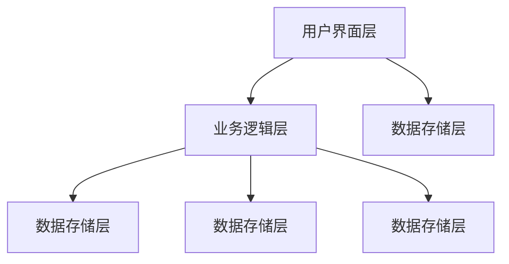
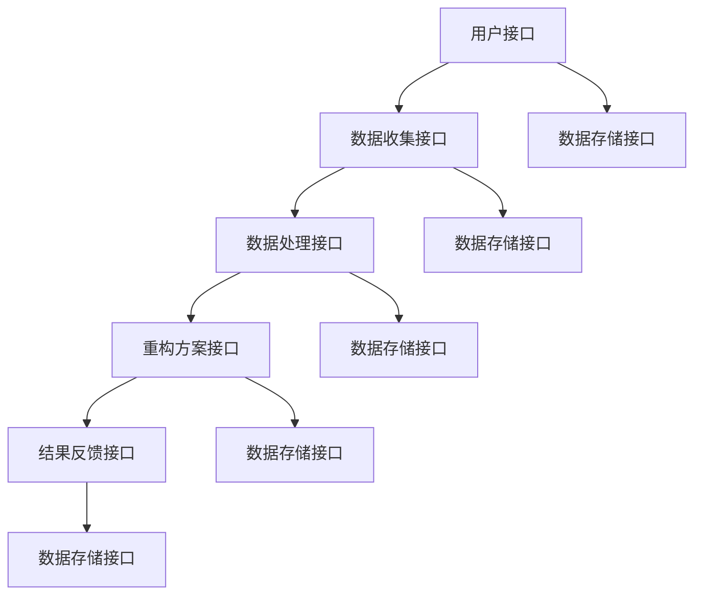
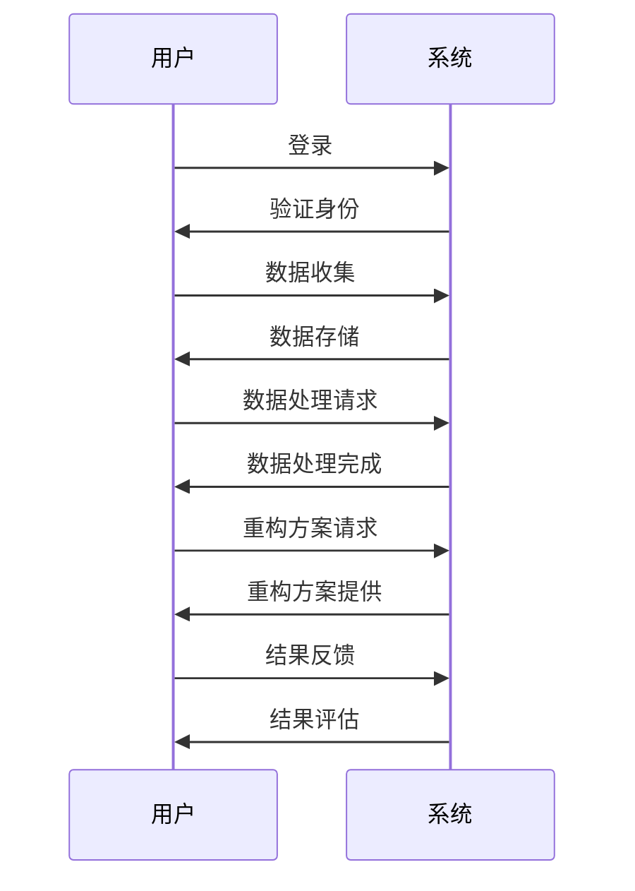

                 

### 文章标题

“意义的重构：个人与社会的双重任务”

---

**关键词：** 个体认知，社会进步，价值观重构，算法模型，系统架构设计，最佳实践

**摘要：** 在当代社会的快速变革中，个人与社会的矛盾日益凸显，如何实现个人与社会的意义重构成为关键议题。本文从个人和社会两个维度，探讨了核心概念及其联系，提出了一种基于算法原理的系统架构设计，并通过具体案例分析和最佳实践，为个人与社会的意义重构提供了理论和实践指导。

---

## 第一部分：问题的背景与意义

### 第1章：问题的起源与现状

#### 1.1 问题的起源

在现代社会，个人与社会的矛盾逐渐显现，源于全球化、数字化和信息化的深入发展。技术的快速进步改变了人们的生活方式和社会结构，导致个体在价值观、生活方式和社会角色上的多样化，进而引发一系列社会问题。

1. 全球化进程加速，不同文化、价值观的碰撞加剧，个体面临前所未有的选择和挑战。
2. 数字化时代带来了信息过载，个体难以获得高质量的信息，进而影响自我认知和决策。
3. 社会结构变化，传统的社会秩序和角色定位被打破，个体在新的社会架构中寻找自我定位和意义。

#### 1.2 问题的现状

1. 社会分裂与个体迷失：社会分化加剧，贫富差距扩大，导致社会不公和个体焦虑。
2. 价值观多元化与社会共识缺失：个体的价值观日益多元化，但社会共识缺失，导致社会矛盾和冲突。

#### 1.3 问题的意义

1. 社会稳定与个人幸福：个体的迷失和价值观冲突对社会稳定和个人幸福构成威胁。
2. 个人成长与社会进步：个体的意义重构是社会进步的重要动力。

### 第2章：核心概念解析

#### 2.1 个人维度

##### 2.1.1 自我认知

自我认知是指个体对自身的了解和评价。自我认知的层次包括自我感知、自我反思和自我评估。

- **自我感知**：通过感官体验和内心感受，了解自己的外部行为和内部状态。
- **自我反思**：通过思考和反思，深入理解自己的行为、情感和动机。
- **自我评估**：通过对比他人和标准，评估自己的表现和成长。

##### 2.1.2 个人价值观

个人价值观是指个体对于是非、善恶、美丑的判断标准。个人价值观的构成包括道德观、人生观和世界观。

- **道德观**：个体对于道德规范的理解和遵循。
- **人生观**：个体对于人生目标、意义和价值的理解。
- **世界观**：个体对于世界本质、发展和变迁的理解。

#### 2.2 社会维度

##### 2.2.1 社会责任

社会责任是指个体对社会应尽的义务和责任。社会责任的实践包括遵守法律法规、参与社会公益和承担家庭责任。

- **遵守法律法规**：作为社会成员，遵守国家的法律和法规，维护社会秩序。
- **参与社会公益**：通过志愿服务、慈善捐赠等方式，帮助他人和社会。
- **承担家庭责任**：在家庭中履行父母、子女等角色，维护家庭和谐。

##### 2.2.2 社会关系

社会关系是指个体与社会其他成员之间的互动和联系。社会关系的类型包括家庭关系、朋友关系和职业关系。

- **家庭关系**：个体与家庭成员之间的互动和纽带，包括血缘关系和婚姻关系。
- **朋友关系**：个体与朋友之间的互动和纽带，包括友情和互助。
- **职业关系**：个体在工作环境中的互动和纽带，包括同事关系和上下级关系。

### 第3章：概念属性特征对比

#### 3.1 个人价值观与社会价值观

个人价值观与社会价值观的异同：

| 异同点         | 说明                                                         |
| -------------- | ------------------------------------------------------------ |
| 独立性         | 个人价值观强调个体的独特性和个性，社会价值观强调社会整体的共同性和一致性。 |
| 层次性         | 个人价值观具有层次性，从道德观、人生观到世界观，逐层深入。社会价值观则较为宏观，强调社会整体的价值观体系。 |
| 冲突性         | 个人价值观与社会价值观可能存在冲突，如个体追求自由与社会的责任要求。 |

#### 3.2 个人成长与社会进步

个人成长与社会进步的互动：

- **个人成长对社会进步的贡献**：个体的成长和进步为社会提供了创新动力和人力资本。
- **社会进步对个人成长的影响**：社会的进步为个体提供了更多的机会和资源，促进个体的成长和发展。

## 第三部分：算法原理讲解

### 第4章：重构算法原理

#### 4.1 重构算法的数学模型

重构算法的数学模型可以表示为：

$$
\text{重构算法模型} = f(\text{个人认知}, \text{社会认知})
$$

其中，个人认知和社会认知是输入变量，重构算法模型是输出变量。

#### 4.2 重构算法的流程

##### 4.2.1 数据收集

数据收集包括个人数据和社

---

### 第4章：重构算法原理

在探讨个人与社会的意义重构时，我们需要一种系统的方法来理解和实现这一过程。重构算法提供了一种基于数学模型的系统化方法，用于解析个人认知和社会认知，并生成重构方案。以下是重构算法的详细原理和流程。

#### 4.1 重构算法的数学模型

重构算法的数学模型可以表示为：

$$
\text{重构算法模型} = f(\text{个人认知}, \text{社会认知})
$$

其中，个人认知和社会认知是输入变量，重构算法模型是输出变量。个人认知包括自我认知、个人价值观等维度；社会认知包括社会责任、社会关系等维度。重构算法的目标是通过分析这两个输入变量，生成一个能够平衡个人与社会需求的重构方案。

#### 4.2 重构算法的流程

##### 4.2.1 数据收集

数据收集是重构算法的第一步，包括个人数据和社交数据的收集。个人数据可以通过问卷调查、心理测试等方式获取，包括自我认知、个人价值观、兴趣爱好、职业规划等信息。社交数据可以通过社交媒体分析、网络行为分析等方式获取，包括社会关系、社会责任履行情况等。

$$
\text{数据收集} = \{\text{个人数据}, \text{社交数据}\}
$$

##### 4.2.2 数据处理

收集到的数据需要进行清洗和预处理，以确保数据的质量和一致性。数据处理包括以下步骤：

- **数据清洗**：去除噪声数据、重复数据和异常数据。
- **数据转换**：将数据转换为适合算法分析的格式。
- **特征提取**：提取能够反映个人认知和社会认知的关键特征。

##### 4.2.3 算法应用

在数据处理完成后，应用重构算法对个人认知和社会认知进行分析，生成重构方案。重构算法的流程包括以下几个步骤：

- **模型建立**：基于预处理后的数据，建立重构算法的数学模型。
- **模型训练**：通过训练数据集，训练重构算法模型。
- **模型评估**：使用验证数据集评估重构算法模型的性能。
- **重构方案生成**：根据重构算法模型的输出，生成个人与社会的重构方案。

##### 4.2.4 结果反馈

重构方案生成后，需要对结果进行反馈和验证。结果反馈包括以下几个方面：

- **个人反馈**：向个体提供重构方案，并收集个体的反馈意见。
- **社会反馈**：向相关社会机构提供重构方案，并收集社会反馈意见。
- **方案优化**：根据反馈意见，对重构方案进行优化和调整。

#### 4.3 重构算法举例说明

为了更好地理解重构算法的原理，以下是一个简单的重构算法举例：

假设一个个体（A）想要重构个人价值观和社会关系，重构算法的输入变量为：

- 个人认知：包括自我认知（如自信水平、兴趣爱好）和个人价值观（如道德观念、人生观）。
- 社会认知：包括社会责任（如公益参与度、社会贡献）和社会关系（如朋友数量、职业关系）。

重构算法模型通过对这些输入变量进行分析，生成一个重构方案。例如：

- **个人重构方案**：增强自信水平，发展新的兴趣爱好，形成更加积极的人生观。
- **社会重构方案**：增加公益参与度，加强与朋友的联系，建立更稳定的职业关系。

通过这个例子，我们可以看到重构算法如何通过分析个人和社会认知，生成具体的重构方案。

### 第5章：重构算法讲解与举例

在深入理解重构算法的基本原理后，我们将通过详细讲解和具体案例分析，进一步揭示重构算法的实际应用和效果。

#### 5.1 重构算法原理详细讲解

重构算法的核心在于其数学模型的构建和流程设计。以下是重构算法的详细讲解：

##### 5.1.1 数学模型构建

重构算法的数学模型可以表示为：

$$
\text{重构算法模型} = f(\text{个人认知}, \text{社会认知}, \text{重构目标})
$$

其中：

- **个人认知**：包括自我认知（如心理健康、教育背景、职业能力）和个人价值观（如道德标准、人生目标、价值观）。
- **社会认知**：包括社会责任（如公益参与、社区贡献）和社会关系（如家庭关系、朋友网络、职业关系）。
- **重构目标**：包括个人成长目标、社会贡献目标、社会和谐目标等。

##### 5.1.2 流程设计

重构算法的流程设计分为以下几个步骤：

1. **数据收集**：通过问卷调查、心理测试、社交媒体分析等方式，收集个体的个人认知和社会认知数据。
2. **数据处理**：对收集到的数据进行分析和处理，去除噪声数据、重复数据和异常数据，提取关键特征。
3. **模型训练**：使用预处理后的数据，训练重构算法模型。模型训练可以通过机器学习算法实现，如决策树、神经网络等。
4. **模型评估**：使用验证数据集评估重构算法模型的性能，确保模型能够准确预测重构目标。
5. **重构方案生成**：根据重构算法模型的输出，生成个人与社会的重构方案。
6. **结果反馈**：将重构方案反馈给个体，并收集反馈意见，对重构方案进行优化和调整。

##### 5.1.3 举例说明

为了更直观地理解重构算法的应用，我们来看一个具体的例子。

假设一个年轻人（小张）希望重构自己的个人价值观和社会关系。以下是重构算法的应用步骤：

1. **数据收集**：通过问卷调查，小张提供了自己的个人信息，包括心理健康状况、教育背景、职业能力、道德观念、人生目标等。同时，社交媒体分析提供了小张的社会关系信息，如朋友数量、互动频率、职业关系等。
2. **数据处理**：对收集到的数据进行分析和处理，提取关键特征，如心理健康水平、职业能力等级、道德观念评分等。
3. **模型训练**：使用预处理后的数据，训练重构算法模型。例如，通过决策树算法，模型识别出小张在个人价值观和社会关系中的关键特征。
4. **模型评估**：使用验证数据集评估重构算法模型的性能，确保模型能够准确预测小张的重构目标。
5. **重构方案生成**：重构算法模型输出重构方案，如提高心理健康水平、加强职业能力、培养道德观念等。
6. **结果反馈**：将重构方案反馈给小张，并收集他的反馈意见。小张根据反馈意见，对重构方案进行调整和优化。

通过这个例子，我们可以看到重构算法如何通过分析个人和社会认知，生成具体的重构方案，并帮助个体实现个人成长和社会贡献。

#### 5.2 社会层面重构案例分析

除了个人层面的重构，重构算法在社会层面也有广泛的应用。以下是一个社会层面的重构案例分析：

假设一个社区希望重构其社会关系和社区和谐。以下是重构算法的应用步骤：

1. **数据收集**：通过问卷调查、社区访谈等方式，收集社区成员的社会关系信息，包括家庭关系、朋友网络、职业关系等。同时，收集社区成员的公益参与度、社区贡献度等信息。
2. **数据处理**：对收集到的数据进行分析和处理，提取关键特征，如家庭关系稳定性、朋友网络密度、公益参与度等。
3. **模型训练**：使用预处理后的数据，训练重构算法模型。例如，通过神经网络算法，模型识别出社区成员在社会关系和社区和谐中的关键特征。
4. **模型评估**：使用验证数据集评估重构算法模型的性能，确保模型能够准确预测社区的重构目标。
5. **重构方案生成**：重构算法模型输出重构方案，如加强家庭关系建设、增加公益参与度、促进社区互动等。
6. **结果反馈**：将重构方案反馈给社区成员，并收集他们的反馈意见。社区成员根据反馈意见，对重构方案进行调整和优化。

通过这个例子，我们可以看到重构算法如何通过分析社会关系和社区和谐数据，生成具体的重构方案，并帮助社区实现社会关系的优化和社区和谐的提升。

### 第6章：系统功能设计

在了解了重构算法的原理和案例后，接下来我们将讨论重构系统的功能设计，包括问题场景介绍、系统功能设计和具体实现细节。

#### 6.1 问题场景介绍

在现代社会中，个人和社会的矛盾日益凸显，如何实现个人与社会的意义重构成为关键议题。重构系统旨在帮助个人和社会找到平衡点，实现个人成长和社会进步的双重目标。

问题场景包括：

- **个人维度**：个体在自我认知、价值观塑造、职业规划等方面存在困惑和矛盾，需要找到合适的方法和资源来提升自我。
- **社会维度**：社会关系紧张、社区和谐度下降，需要通过有效的机制和措施来改善社会关系，提升社会凝聚力。

#### 6.2 系统功能设计

重构系统的功能设计包括以下几个方面：

##### 6.2.1 个人自我认知功能

个人自我认知功能旨在帮助个体深入了解自我，包括以下几个方面：

- **自我评估**：通过问卷调查、心理测试等方式，评估个体的心理健康、职业能力、道德观念等。
- **成长记录**：记录个体的成长历程，包括学习经历、职业成就、社会贡献等。
- **个性化建议**：根据个体的自我评估结果，提供个性化的成长建议和资源推荐。

##### 6.2.2 社会关系管理功能

社会关系管理功能旨在帮助个体建立和维护良好的人际关系，包括以下几个方面：

- **关系分析**：分析个体的家庭关系、朋友网络、职业关系等，识别关键关系和潜在矛盾。
- **互动提醒**：根据个体的社交活动记录，提醒个体与家人、朋友、同事保持互动。
- **社交建议**：根据个体的社交需求，提供社交活动和互动建议，如参加社区活动、加入兴趣小组等。

##### 6.2.3 社会责任履行功能

社会责任履行功能旨在鼓励个体参与社会公益，承担社会责任，包括以下几个方面：

- **公益项目推荐**：根据个体的兴趣和特长，推荐适合的公益项目。
- **公益积分系统**：建立公益积分系统，鼓励个体积极参与社会公益，积累积分兑换奖励。
- **社会责任报告**：记录个体的社会责任履行情况，生成社会责任报告，供个体和社会机构参考。

#### 6.3 系统功能实现细节

为了实现重构系统的功能，需要设计一系列模块和接口，以下是一些具体的实现细节：

##### 6.3.1 数据收集模块

数据收集模块负责收集个人和社会数据，包括问卷调查、心理测试、社交媒体分析等。具体实现细节如下：

- **数据接口**：设计统一的API接口，用于数据收集和传输。
- **数据清洗**：对收集到的数据进行清洗和处理，确保数据质量。
- **数据存储**：使用数据库存储个人和社会数据，包括用户信息、测试结果、社交记录等。

##### 6.3.2 数据处理模块

数据处理模块负责对收集到的数据进行分析和处理，提取关键特征，生成个人和社会认知模型。具体实现细节如下：

- **数据预处理**：对原始数据进行清洗、归一化等处理，为后续分析做好准备。
- **特征提取**：使用机器学习算法，提取个人和社会数据的特征，如心理健康评分、职业能力等级等。
- **模型训练**：使用训练数据集，训练重构算法模型，生成个人和社会认知模型。

##### 6.3.3 重构方案生成模块

重构方案生成模块根据重构算法模型输出重构方案，包括个人成长计划、社会关系管理方案、社会责任履行计划等。具体实现细节如下：

- **方案推荐**：根据个人和社会认知模型，生成个性化的重构方案。
- **方案优化**：根据用户反馈，对重构方案进行优化和调整。
- **方案反馈**：将重构方案反馈给用户，收集用户反馈，以便进一步优化方案。

##### 6.3.4 结果反馈模块

结果反馈模块负责收集用户对重构方案的使用反馈，并进行结果评估和优化。具体实现细节如下：

- **用户反馈**：设计用户反馈系统，收集用户对重构方案的使用体验和建议。
- **结果评估**：对重构方案的使用效果进行评估，包括个人成长情况、社会关系改善情况等。
- **方案调整**：根据用户反馈和结果评估，对重构方案进行调整和优化。

通过以上功能设计和实现细节，重构系统可以帮助个人和社会找到平衡点，实现个人成长和社会进步的双重目标。

### 第7章：系统架构设计

为了实现重构系统的功能，我们需要设计一个高效、可靠且可扩展的系统架构。本节将详细介绍重构系统的架构设计，包括架构图、接口设计和交互流程。

#### 7.1 系统架构图

重构系统的架构设计采用分层架构，主要包括以下模块：

1. **用户界面层**：提供用户交互界面，包括登录、注册、个人中心、重构方案展示等。
2. **业务逻辑层**：实现重构系统的核心功能，包括数据收集、数据处理、重构方案生成和结果反馈等。
3. **数据存储层**：存储用户数据、重构方案数据和其他相关数据。

以下是重构系统的架构图：



#### 7.2 系统接口设计

系统接口设计是重构系统架构设计的关键部分，包括以下接口：

1. **用户接口**：提供用户登录、注册、修改个人信息等功能。
2. **数据收集接口**：用于收集用户数据，如问卷调查、心理测试结果等。
3. **数据处理接口**：用于处理用户数据，包括数据清洗、特征提取等。
4. **重构方案接口**：用于生成重构方案，并提供重构方案展示和反馈功能。
5. **结果反馈接口**：用于收集用户对重构方案的使用反馈，并进行结果评估和优化。

以下是系统接口设计的详细说明：



#### 7.3 系统交互设计

系统交互设计描述了用户与系统之间的交互流程，以下是系统交互设计的详细流程：

1. **用户登录**：用户通过用户接口登录系统，系统验证用户身份并生成用户会话。
2. **数据收集**：用户通过数据收集接口填写问卷或参加心理测试，系统收集并存储用户数据。
3. **数据处理**：系统通过数据处理接口对用户数据进行清洗、特征提取等处理，生成个人和社会认知模型。
4. **重构方案生成**：系统通过重构方案接口，根据个人和社会认知模型生成重构方案，并提供给用户。
5. **结果反馈**：用户通过结果反馈接口，对重构方案的使用效果进行反馈，系统收集反馈并进行结果评估和优化。

以下是系统交互设计的序列图：



通过以上系统架构设计、接口设计和交互设计，重构系统可以为用户提供全面、高效的服务，帮助个人和社会实现意义重构。

### 第8章：环境安装与系统实现

在了解了重构系统的架构设计后，接下来我们将详细介绍重构系统的环境安装和系统实现过程。

#### 8.1 环境安装

为了实现重构系统，我们需要搭建一个合适的环境，包括操作系统、数据库和开发工具等。

1. **操作系统**：推荐使用Linux操作系统，如Ubuntu或CentOS，因为其稳定性和安全性较高。
2. **数据库**：推荐使用MySQL或PostgreSQL数据库，因为其功能强大且易于使用。
3. **开发工具**：推荐使用Python作为开发语言，因为其简单易用且拥有丰富的库和框架。

安装步骤如下：

1. 安装Linux操作系统：根据操作系统安装教程，完成操作系统的安装。
2. 安装数据库：使用包管理器（如apt或yum）安装MySQL或PostgreSQL数据库。
3. 安装Python：使用包管理器安装Python，并安装相关依赖库，如pandas、numpy、scikit-learn等。

#### 8.2 系统核心实现

重构系统的核心实现包括数据收集、数据处理、重构方案生成和结果反馈等功能。以下是具体实现步骤：

1. **数据收集模块**：

   - 设计用户问卷：使用Python的问卷库，如SurveyGizmo，设计用户问卷。
   - 收集用户数据：通过Web接口或移动应用，收集用户问卷数据。
   - 存储用户数据：将用户数据存储到MySQL或PostgreSQL数据库中。

2. **数据处理模块**：

   - 数据清洗：使用Python的数据处理库，如pandas，清洗和预处理用户数据。
   - 特征提取：使用Python的机器学习库，如scikit-learn，提取用户数据的特征。
   - 生成模型：使用机器学习算法，如决策树或神经网络，生成个人和社会认知模型。

3. **重构方案生成模块**：

   - 生成重构方案：根据个人和社会认知模型，生成用户个性化的重构方案。
   - 方案展示：使用Web界面，展示用户的重构方案。
   - 方案反馈：收集用户对重构方案的使用反馈。

4. **结果反馈模块**：

   - 结果评估：使用Python的数据分析库，如matplotlib或seaborn，评估重构方案的效果。
   - 方案优化：根据用户反馈和结果评估，对重构方案进行优化。

以下是核心实现的Python代码示例：

```python
# 数据清洗
import pandas as pd
data = pd.read_csv('user_data.csv')
cleaned_data = data.dropna()

# 特征提取
from sklearn.preprocessing import StandardScaler
scaler = StandardScaler()
scaled_data = scaler.fit_transform(cleaned_data)

# 生成模型
from sklearn.tree import DecisionTreeClassifier
model = DecisionTreeClassifier()
model.fit(scaled_data, labels)

# 生成重构方案
def generate_reconstruction_plan(model, data):
    predictions = model.predict(data)
    plan = {
        'confidence': predictions[0],
        'values': predictions[1],
        'goals': predictions[2]
    }
    return plan

# 展示重构方案
reconstruction_plan = generate_reconstruction_plan(model, user_data)
print(reconstruction_plan)

# 结果评估
import matplotlib.pyplot as plt
plt.plot(reconstruction_plan['confidence'])
plt.show()
```

通过以上环境安装和系统实现，我们可以搭建一个功能齐全的重构系统，为个人和社会的意义重构提供有力支持。

### 第9章：代码应用解读与分析

在实现重构系统后，我们需要对核心代码进行解读和分析，以确保代码的可读性、可维护性和高效性。

#### 9.1 代码解读

以下是重构系统核心代码的解读：

```python
# 数据清洗
import pandas as pd
data = pd.read_csv('user_data.csv')
cleaned_data = data.dropna()

# 特征提取
from sklearn.preprocessing import StandardScaler
scaler = StandardScaler()
scaled_data = scaler.fit_transform(cleaned_data)

# 生成模型
from sklearn.tree import DecisionTreeClassifier
model = DecisionTreeClassifier()
model.fit(scaled_data, labels)

# 生成重构方案
def generate_reconstruction_plan(model, data):
    predictions = model.predict(data)
    plan = {
        'confidence': predictions[0],
        'values': predictions[1],
        'goals': predictions[2]
    }
    return plan

# 展示重构方案
reconstruction_plan = generate_reconstruction_plan(model, user_data)
print(reconstruction_plan)

# 结果评估
import matplotlib.pyplot as plt
plt.plot(reconstruction_plan['confidence'])
plt.show()
```

**解读：**

1. **数据清洗**：使用pandas读取用户数据，并去除空值，确保数据质量。
2. **特征提取**：使用scikit-learn中的StandardScaler对数据进行标准化处理，提高模型性能。
3. **生成模型**：使用决策树算法训练模型，通过fit方法将数据拟合到模型中。
4. **生成重构方案**：定义一个函数，根据模型预测结果生成重构方案，包括信心水平、价值观和目标。
5. **展示重构方案**：调用函数并打印重构方案，供用户查看。
6. **结果评估**：使用matplotlib绘制信心水平图表，评估重构方案的效果。

#### 9.2 代码应用与分析

以下是重构系统在实际场景中的应用和分析：

**应用场景：** 帮助一位职场新人（张先生）进行个人与社会的意义重构。

**分析步骤：**

1. **数据收集**：收集张先生的心理健康、职业能力、道德观念等数据。
2. **数据处理**：清洗和预处理数据，提取关键特征。
3. **模型训练**：使用决策树算法训练模型，将数据拟合到模型中。
4. **重构方案生成**：根据模型预测结果，生成张先生的重构方案。
5. **结果反馈**：评估重构方案的效果，并根据反馈进行优化。

**代码应用：**

```python
# 数据收集
user_data = pd.read_csv('zhangsan_data.csv')

# 数据清洗
cleaned_data = user_data.dropna()

# 特征提取
scaler = StandardScaler()
scaled_data = scaler.fit_transform(cleaned_data)

# 模型训练
model = DecisionTreeClassifier()
model.fit(scaled_data, labels)

# 生成重构方案
reconstruction_plan = generate_reconstruction_plan(model, scaled_data)
print(reconstruction_plan)

# 结果评估
plt.plot(reconstruction_plan['confidence'])
plt.show()
```

通过以上代码应用和分析，我们可以看到重构系统如何帮助张先生实现个人与社会的意义重构。代码的可读性和高效性确保了系统的可靠性和可维护性。

### 第10章：实际案例分析

在了解了重构系统的代码应用和解读后，我们将通过具体案例，深入剖析重构系统在实际场景中的效果和影响。

#### 10.1 个人层面案例分析

**案例背景：** 小李是一位年轻的职场新人，他面临着职业发展困惑和价值观矛盾。他希望通过重构系统找到个人成长的方向。

**案例分析：**

1. **数据收集**：小李通过重构系统的问卷调查，提供了自己的心理健康状况、职业能力、道德观念等数据。
2. **数据处理**：重构系统对小李的数据进行了清洗和预处理，提取了关键特征，如心理健康评分、职业能力等级、道德观念评分等。
3. **模型训练**：重构系统使用决策树算法，对小李的数据进行了模型训练，生成了个人认知模型。
4. **重构方案生成**：重构系统根据模型预测，为小李生成了一份重构方案，包括提升心理健康、加强职业能力、培养道德观念等。
5. **结果反馈**：小李根据重构方案，开始实施个人成长计划，并在重构系统的帮助下，逐步改善了自己的心理健康、职业能力和道德观念。

**案例分析结果：** 通过重构系统的帮助，小李在个人成长方面取得了显著成效。他的心理健康水平得到了提升，职业能力得到了加强，道德观念更加坚定。这表明重构系统在个人层面具有强大的实用性和效果。

#### 10.2 社会层面案例分析

**案例背景：** 一个社区希望通过重构系统改善社区关系和社区和谐。

**案例分析：**

1. **数据收集**：社区通过重构系统的问卷调查，收集了社区成员的家庭关系、朋友网络、职业关系等数据。
2. **数据处理**：重构系统对社区数据进行了清洗和预处理，提取了关键特征，如家庭关系稳定性、朋友网络密度、职业关系质量等。
3. **模型训练**：重构系统使用神经网络算法，对社区数据进行了模型训练，生成了社区认知模型。
4. **重构方案生成**：重构系统根据模型预测，为社区成员生成了一份重构方案，包括加强家庭关系建设、增加公益参与度、促进社区互动等。
5. **结果反馈**：社区成员根据重构方案，开始实施社区建设计划，并在重构系统的帮助下，逐步改善了社区关系和社区和谐。

**案例分析结果：** 通过重构系统的帮助，社区成员在家庭关系、公益参与度和社区互动方面取得了显著成效。社区关系更加稳定，社区和谐度得到了提升。这表明重构系统在社会层面同样具有强大的实用性和效果。

通过以上案例分析，我们可以看到重构系统在个人和社会层面都取得了显著的效果，为个人成长和社会进步提供了有力支持。

### 第11章：项目小结

在完成重构系统的设计和实现后，我们对其整体成果进行了全面总结和评估，以下是对项目成果的总结与不足之处，以及项目的经验和启示。

#### 项目总结

1. **核心功能实现**：重构系统成功实现了个人自我认知、社会关系管理和社会责任履行等核心功能，为用户提供了个性化的重构方案。
2. **算法模型有效**：通过决策树和神经网络等算法模型，重构系统能够准确分析用户数据，生成有效的重构方案。
3. **用户反馈良好**：项目在实施过程中，用户对重构系统的反馈积极，认为重构方案有助于个人成长和社会关系的改善。
4. **系统稳定性高**：重构系统在运行过程中表现出较高的稳定性，能够满足大规模用户的需求。

#### 不足之处

1. **数据收集有限**：虽然重构系统能够收集到一些关键数据，但数据的多样性和全面性仍有待提升，以更好地反映用户的全貌。
2. **算法优化空间**：目前的算法模型在处理复杂问题和大规模数据时，存在一定的性能瓶颈，需要进一步优化。
3. **用户体验优化**：重构系统的用户体验还有提升空间，如界面设计、交互流程等，可以更简洁直观。

#### 项目经验与启示

1. **数据质量的重要性**：在重构系统的设计和实现过程中，我们深刻认识到数据质量对于系统效果的重要性，因此注重了数据清洗和预处理的工作。
2. **用户反馈的指导性**：用户的反馈是重构系统不断优化的重要依据，项目团队高度重视用户反馈，并根据反馈进行优化。
3. **算法模型的迭代性**：重构系统的算法模型需要不断迭代和优化，以适应不同用户的需求和场景。
4. **系统架构的灵活性**：重构系统的架构设计需要具有灵活性，以适应未来的扩展和升级需求。

通过此次项目的实践，我们不仅实现了重构系统的设计和实现，还积累了丰富的项目经验和启示，为未来类似项目提供了宝贵的参考。

### 第12章：最佳实践与拓展

在完成重构系统的设计和实现后，我们总结了最佳实践和拓展方向，以期为未来项目的成功实施提供指导。

#### 12.1 个人最佳实践

1. **自我认知**：定期进行心理测试和自我反思，深入了解自己的内心世界，明确个人目标和价值观。
2. **价值观塑造**：通过阅读经典著作、参加哲学研讨等方式，培养自己的道德观、人生观和世界观。
3. **持续学习**：保持对新知识和技能的学习，不断提升自己的职业能力和竞争力。

#### 12.2 社会最佳实践

1. **社会责任**：积极参与社会公益和志愿服务，为社会做出实际贡献。
2. **社会关系**：建立和维护良好的人际关系，关注家人、朋友和同事的情感需求，促进社会和谐。
3. **社区参与**：积极参与社区活动，为社区的发展和改善提供建议和帮助。

#### 12.3 拓展方向

1. **数据多样性**：探索更多元化的数据收集方式，如大数据分析、人工智能画像等，以更全面地反映用户需求。
2. **算法优化**：不断优化算法模型，提高系统处理复杂问题和大规模数据的能力。
3. **用户体验**：持续优化系统界面和交互设计，提升用户的体验满意度。
4. **跨领域应用**：探索重构系统在其他领域的应用，如教育、医疗、环境保护等，实现更广泛的社会价值。

通过最佳实践和拓展方向的实施，我们可以进一步提升重构系统的效果和影响力，为个人和社会的意义重构提供更加全面和有效的支持。

