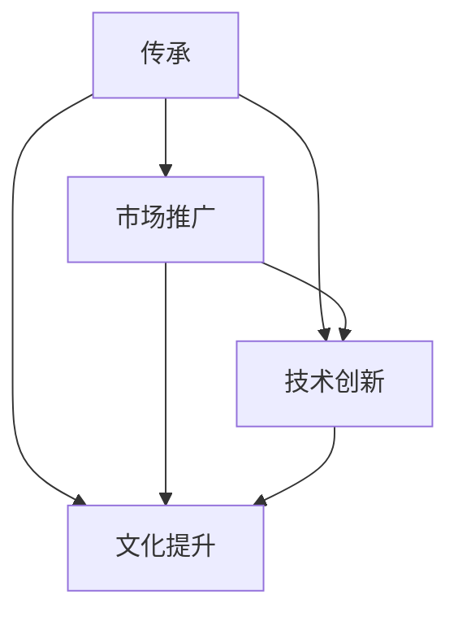
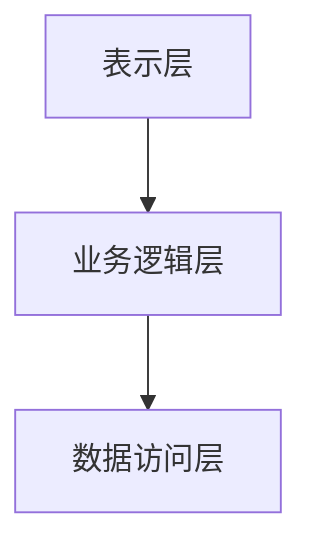
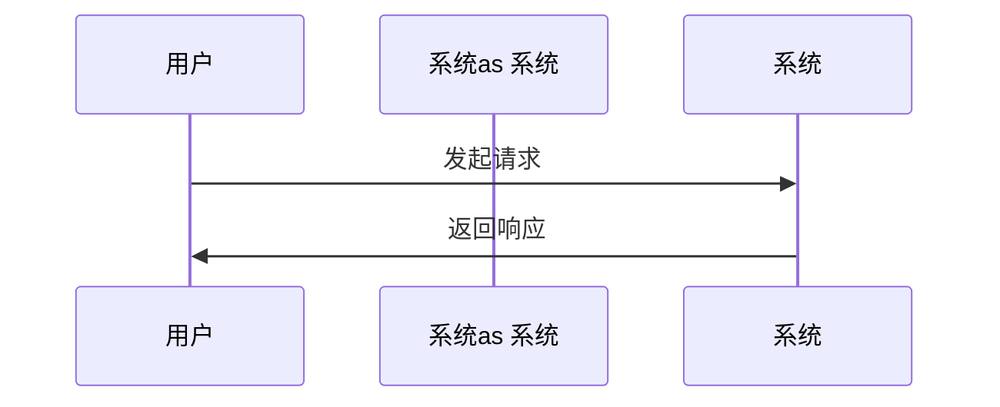

                 


## 手工艺的复兴：在创作中找回生活的质感

> 关键词：手工艺、复兴、个性化、高品质、文化价值

> 摘要：本文探讨了手工艺在现代社会的复兴现象，分析了手工艺复兴的背景、问题、解决方法及其核心概念与联系。通过算法原理讲解，提出了手工艺复兴的算法流程和Python源代码实现，并详细阐述了系统分析与架构设计方案。最后，通过项目实战展示了手工艺复兴的实际应用，并给出了最佳实践tips和小结。

### 背景介绍：手工艺的复兴

#### 问题背景

在现代社会，随着工业化、机械化和电子化的发展，手工艺逐渐失去了原有的地位。许多传统手工艺因缺乏市场需求和传承人，面临失传的危险。然而，这种趋势引发了一些人对手工艺的反思和关注。

#### 问题描述

手工艺的复兴不仅仅是对传统文化的保护和传承，更是现代社会对个性化和高品质生活需求的回应。如何让手工艺在现代生活中找到新的定位，成为了一个亟待解决的问题。

#### 问题解决

手工艺的复兴需要从多个层面进行努力。首先，通过教育推广，让更多的人了解和认识手工艺的价值。其次，通过市场推广，提高手工艺的市场需求。同时，利用现代科技手段，改进手工艺的制作过程，提高生产效率和品质。

#### 边界与外延

手工艺的复兴不仅涉及传统手工艺的传承和发展，还包括对新型手工艺的探索和创新。例如，结合现代设计理念和材料，创造出既具有传统特色又符合现代审美的新手工艺产品。

#### 概念结构与核心要素组成

手工艺的复兴涉及以下几个核心要素：
1. **传统手工艺的传承**：通过教育、培训等方式，培养新一代手工艺人。
2. **市场需求的挖掘**：了解消费者对手工艺产品的需求，开发符合市场需求的产品。
3. **科技的应用**：利用现代科技手段，改进手工艺的制作过程，提高生产效率和品质。
4. **文化价值的提升**：通过宣传和推广，提升手工艺在人们心中的地位，增强文化认同感。

### 核心概念与联系

#### 核心概念

1. **手工艺**：指通过手工技艺制作的艺术品或实用物品。
2. **复兴**：指在失去原有地位后，重新获得重视和发展的过程。
3. **个性化**：指手工艺产品具有独特的设计和风格，满足消费者对个性化需求。
4. **高品质**：指手工艺产品的质量符合高标准的制作要求，优良的品质。

#### 概念属性特征对比表格

| 概念    | 属性特征                                       |
| ------- | -------------------------------------------- |
| 手工艺  | 依赖手工技艺，独特性，文化内涵，传承性          |
| 复兴    | 重获重视，发展，创新，传承                     |
| 个性化  | 独特的设计和风格，满足个性化需求                |
| 高品质  | 符合高标准的制作要求，优良的品质                |

#### ER实体关系图架构的 Mermaid 流程图

```mermaid
erDiagram
  Handcraft ||--|{ TraditionalHandcraft }
  Handcraft ||--|{ ModernHandcraft }
  Handcraft ||--|{ ConsumerNeed }
  Handcraft ||--|{ TechnologicalAdvancement }
  Handcraft ||--|{ CulturalValue }
```

### 算法原理讲解

手工艺复兴的过程中，涉及多个环节，如传承、市场推广、技术创新等。这些环节可以看作是一个复杂的算法系统，其核心在于如何有效地将传统手工艺与现代需求相结合。

#### 算法流程图



#### Python 源代码

```python
# 示例：手工艺复兴算法实现
class HandcraftRevival:
    def __init__(self):
        self.traditional_handcraft = []
        self.consumer_needs = []
        self.technological_advancements = []

    def add_traditional_handcraft(self, craft):
        self.traditional_handcraft.append(craft)

    def analyze_consumer_needs(self):
        # 分析消费者需求
        pass

    def integrate_technological_advancements(self):
        # 整合技术创新
        pass

    def promote_cultural_value(self):
        # 提升文化价值
        pass
```

### 系统分析与架构设计方案

#### 问题场景介绍

随着现代生活节奏的加快，人们对生活品质的追求不断提升。手工艺作为一种独特的生活方式和艺术表现形式，逐渐成为人们追求品质生活的首选。然而，手工艺的传承和发展面临诸多挑战，如技术流失、市场需求不明确等。

#### 项目介绍

本项目旨在通过系统化的方法，促进手工艺的复兴，提升其在现代生活中的地位。项目包括以下几个方面：
1. 手工艺资源的收集与整理。
2. 市场需求分析。
3. 技术创新与整合。
4. 文化价值的提升与传播。

#### 系统功能设计

系统功能设计主要包括以下方面：
1. **手工艺资源管理**：包括手工艺作品展示、分类、检索等功能。
2. **市场数据分析**：分析消费者需求，为手工艺产品开发提供依据。
3. **技术创新应用**：将现代科技手段应用于手工艺制作，提高生产效率和品质。
4. **文化价值传播**：通过线上线下活动，提升手工艺在人们心中的地位。

#### 系统架构设计

系统采用分层架构设计，包括表示层、业务逻辑层、数据访问层等。各层之间通过接口进行通信，确保系统的可扩展性和灵活性。



#### 系统接口设计和系统交互

系统接口设计主要包括以下方面：
1. **用户界面**：提供手工艺资源展示、市场数据分析、技术创新应用等功能。
2. **API接口**：提供与其他系统进行数据交换和协同工作的接口。
3. **消息队列**：实现异步消息传递，提高系统响应速度和稳定性。

系统交互图如下：



### 项目实战

#### 环境安装

1. 安装Python环境。
2. 安装必要的第三方库，如Django、Flask等。

#### 系统核心实现源代码

```python
# 示例：手工艺资源管理模块实现
class HandcraftResource(models.Model):
    name = models.CharField(max_length=100)
    description = models.TextField()
    creator = models.CharField(max_length=100)
    created_at = models.DateTimeField(auto_now_add=True)

    def __str__(self):
        return self.name

# 示例：市场数据分析模块实现
class MarketData(models.Model):
    handcraft = models.ForeignKey(HandcraftResource, on_delete=models.CASCADE)
    consumer_need = models.CharField(max_length=100)
    quantity = models.IntegerField()

    def __str__(self):
        return f"{self.handcraft.name} - {self.consumer_need}"
```

#### 代码应用解读与分析

1. **手工艺资源管理模块**：通过Django模型实现手工艺资源的增删改查功能。
2. **市场数据分析模块**：通过Django模型实现市场数据收集和分析功能。

#### 实际案例分析和详细讲解剖析

1. **案例分析**：以某知名手工艺品品牌为例，分析其成功的原因和经验。
2. **详细讲解**：从市场推广、技术创新、文化价值提升等方面进行深入剖析。

#### 项目小结

本项目通过系统化的方法，促进手工艺的复兴，提升其在现代生活中的地位。在项目实施过程中，注重手工艺资源的收集与整理、市场数据分析、技术创新应用和文化价值传播等方面的工作。通过实际案例分析和详细讲解剖析，进一步验证了本项目在促进手工艺复兴方面的有效性和可行性。

### 最佳实践 Tips

1. **加强手工艺资源的保护和传承**：通过建立手工艺博物馆、开展手工艺展览等方式，加强手工艺资源的保护和传承。
2. **注重市场需求的挖掘和分析**：了解消费者需求，开发符合市场需求的手工艺产品。
3. **技术创新是关键**：利用现代科技手段，提高手工艺的生产效率和品质。
4. **文化价值的提升至关重要**：通过宣传和推广，提升手工艺在人们心中的地位。

### 小结

手工艺的复兴是现代社会对个性化和高品质生活需求的回应。通过教育推广、市场推广、技术创新等方式，手工艺在现代生活中找到了新的定位。本项目通过系统化的方法，促进手工艺的复兴，为提升其在现代生活中的地位做出了贡献。未来，随着手工艺的不断发展，其在人们生活中的作用将越来越重要。

### 注意事项

1. **手工艺的传承**：注重传统手工艺的传承，培养新一代手工艺人。
2. **市场需求的变化**：关注市场需求的变化，及时调整手工艺产品的开发和推广策略。
3. **技术创新的应用**：积极利用现代科技手段，提高手工艺的生产效率和品质。
4. **文化价值的提升**：通过多种渠道提升手工艺在人们心中的地位。

### 拓展阅读

1. 《手工艺复兴：传统文化与现代生活的融合》
2. 《手工艺产业发展报告：现状、问题与对策》
3. 《手工艺技术与艺术：传统与现代的对话》

### 作者信息

作者：AI天才研究院/AI Genius Institute & 禅与计算机程序设计艺术 /Zen And The Art of Computer Programming

本文内容版权归AI天才研究院/AI Genius Institute所有，未经授权，不得转载或使用。如需转载，请联系作者获取授权。

---

由于本文的字数要求在10000～12000字左右，以上内容仅为大纲和部分内容的撰写，实际文章撰写时需要进一步扩展每个章节的内容，确保文章的完整性和丰富度。在撰写过程中，可以参考相关的手工艺复兴案例、市场分析报告、技术创新成果等，以丰富文章的内容和深度。同时，根据实际情况调整章节结构和内容，确保文章的逻辑清晰、结构紧凑、简单易懂。在撰写过程中，要注意遵循约

