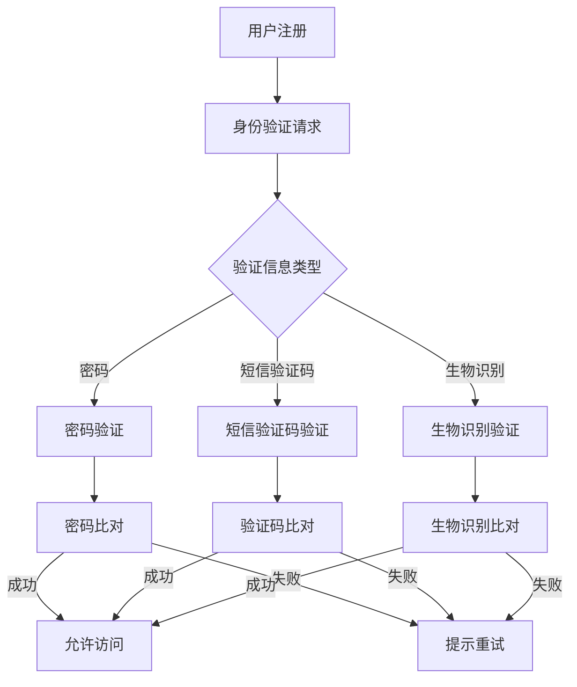
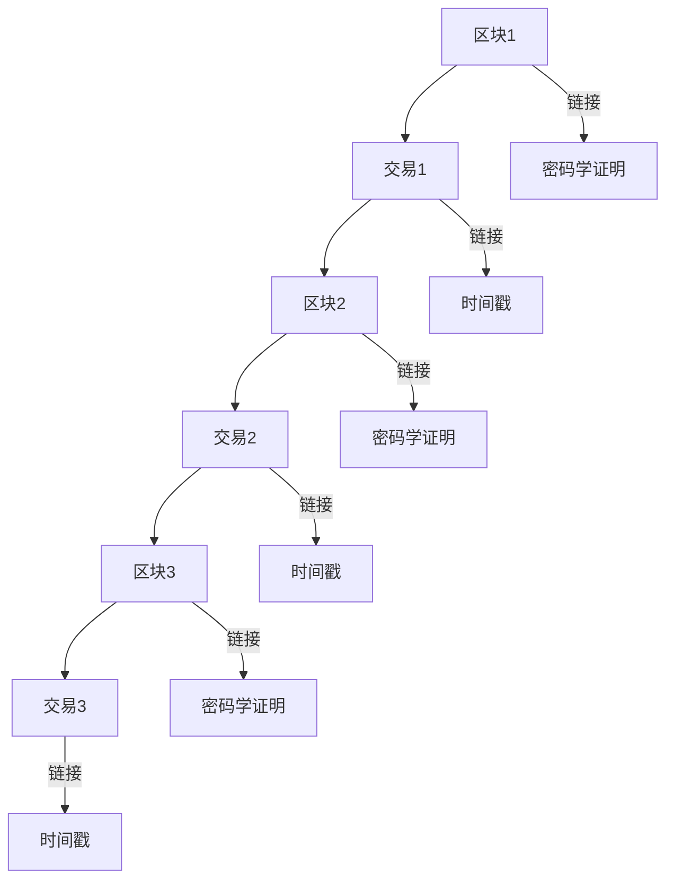
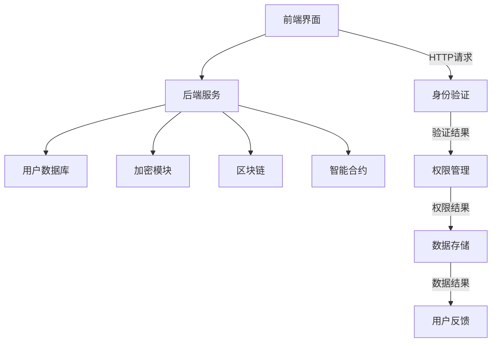
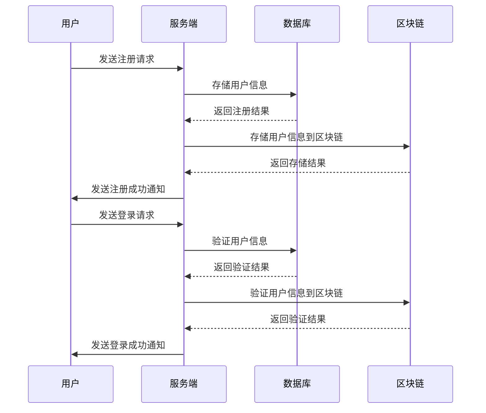

                 

### 第1章: 数字化身份概述

#### 1.1 问题背景

数字化时代，虚拟世界的普及改变了我们的生活方式，也带来了新的挑战。数字化身份成为人们在线生活中的重要组成部分，其重要性日益凸显。数字化身份，指的是在网络空间中代表个人的唯一标识，包括个人身份信息、行为记录、社交关系等。随着互联网的普及和应用场景的多样化，数字化身份管理成为一个亟待解决的问题。

首先，我们需要明确数字化身份的重要性。在虚拟世界中，用户需要通过数字化身份进行各种操作，如在线购物、社交互动、远程办公等。数字化身份不仅决定了用户的操作权限，还影响着用户体验和信息安全。良好的数字化身份管理可以提升用户的使用体验，促进数字经济的发展。

数字化身份的应用场景广泛，包括但不限于以下几个方面：

1. **电子商务**：用户需要通过数字化身份进行在线购物、支付等操作。
2. **社交网络**：用户需要数字化身份来创建个人档案、建立社交关系等。
3. **在线娱乐**：用户需要数字化身份来参与在线游戏、虚拟现实等娱乐活动。
4. **远程办公**：用户需要通过数字化身份进行远程登录、访问公司资源等操作。
5. **金融服务**：用户需要数字化身份来办理网上银行、证券交易等金融服务。

然而，数字化身份管理也面临着诸多挑战。首先是如何确保数字化身份的真实性和唯一性，其次是数据隐私保护问题，如何确保用户的个人信息不被泄露或滥用。此外，数字化身份管理还需要处理跨平台、跨应用的身份认证问题，以实现用户在不同场景下的无缝切换。

#### 1.2 数字化身份的概念与定义

数字化身份，从广义上讲，是用户在网络空间中唯一的身份标识，它包括但不限于以下几部分：

1. **个人信息**：如姓名、性别、年龄、联系方式等基础身份信息。
2. **行为记录**：用户在虚拟世界中的行为数据，如登录记录、交易记录、社交互动等。
3. **社交关系**：用户在网络中的社交关系，如好友、群组等。

数字化身份与传统身份存在显著差异。传统身份主要是在现实世界中，由法律、政府等机构认证和管理的，具有法律效力。而数字化身份则是在虚拟世界中，由网络平台、应用程序等认证和管理的，主要目的是为了提供更好的用户体验和更安全的信息交互。

数字化身份与传统身份的区别主要体现在以下几个方面：

1. **存在形式**：传统身份是物理存在的，具有具体的法律属性；而数字化身份是虚拟存在的，主要依赖于网络和软件。
2. **管理主体**：传统身份的管理主体是国家、法律机构等；数字化身份的管理主体是网络平台、服务提供商等。
3. **认证方式**：传统身份的认证方式主要是法律认证和证件认证；数字化身份的认证方式包括密码、生物识别、数字证书等。

#### 1.3 数字化身份的核心要素

数字化身份的核心要素主要包括以下几个方面：

1. **个人信息**：这是数字化身份的基本组成部分，包括姓名、身份证号、联系方式等基础信息。个人信息是用户身份识别和交互的基础。
   
2. **身份验证**：身份验证是确保用户身份真实性的关键步骤。常见的身份验证方式包括密码验证、生物识别（如指纹、面部识别）、数字证书等。

3. **数据隐私保护**：在数字化身份管理中，保护用户的个人信息隐私至关重要。数据隐私保护需要通过加密技术、访问控制、匿名化处理等多种手段来实现。

4. **权限管理**：数字化身份管理还需要对用户权限进行有效管理，确保用户在虚拟世界中的操作符合其身份和权限。

5. **一致性管理**：数字化身份的一致性管理包括身份信息的更新、同步、合并等操作，以确保用户在不同平台和应用中拥有一致的身份表示。

#### 1.4 数字化身份的边界与外延

数字化身份的边界与外延是数字化身份管理中需要明确的关键问题。数字化身份的边界主要涉及以下几个方面：

1. **身份信息的范围**：数字化身份管理中的身份信息应包括哪些内容，如基本身份信息、行为记录、社交关系等。
2. **身份验证的方式**：数字化身份验证应采用哪些方式，如密码、生物识别、数字证书等。
3. **数据隐私保护的策略**：如何有效保护用户的个人信息隐私，如加密技术、匿名化处理等。
4. **权限管理的范围**：数字化身份管理中的权限管理应涵盖哪些内容，如访问权限、操作权限等。

数字化身份的外延主要涉及以下几个方面：

1. **应用场景**：数字化身份在不同应用场景中的使用，如电子商务、社交网络、在线娱乐等。
2. **跨平台兼容性**：数字化身份在不同平台和应用中的兼容性，如跨平台登录、身份信息同步等。
3. **国际化**：数字化身份管理在全球化背景下的适应性，如不同国家和地区的身份信息管理差异。

通过明确数字化身份的边界与外延，我们可以更好地设计和实施数字化身份管理系统，为用户提供安全、便捷、一致的身份管理服务。

### 第2章: 数字化身份管理的基本概念

#### 2.1 数字化身份管理的重要性

数字化身份管理在现代信息社会中扮演着至关重要的角色。随着互联网和移动设备的普及，人们越来越多地依赖数字身份进行在线活动，从电子商务购物到社交媒体互动，再到远程工作和在线金融交易。数字化身份管理不仅关乎个人的信息安全，也是企业运营、社会管理和公共服务的基础。

首先，数字化身份管理对用户信息安全至关重要。在数字世界中，个人信息泄露的风险无处不在。通过有效的身份验证和权限管理，可以确保只有合法用户能够访问敏感信息和执行特定操作，从而降低信息泄露和数据滥用的风险。

其次，数字化身份管理能够提升用户体验。通过便捷的身份验证和统一的身份认证系统，用户可以在不同的平台和应用程序之间无缝切换，无需重复注册和登录，节省时间和精力。

此外，数字化身份管理对于企业来说也具有显著的价值。有效的身份管理可以提高客户忠诚度，减少欺诈行为，降低运营成本。同时，企业可以基于用户的数字化身份数据，进行精准的市场营销和个性化服务。

最后，从社会管理和公共服务的角度来看，数字化身份管理有助于构建更加安全和高效的数字社会。例如，在公共服务领域，通过数字化身份管理，可以简化办事流程，提高服务效率，增强公共服务的公平性和透明度。

#### 2.2 数字化身份管理的目标

数字化身份管理的目标主要包括以下几个方面：

1. **身份认证**：确保用户身份的真实性和唯一性，防止未经授权的访问和操作。常见的身份认证方法包括密码验证、生物识别、多因素认证等。

2. **数据安全**：保护用户的个人信息不被非法获取、泄露或滥用。数据安全包括数据加密、访问控制、隐私保护等技术手段。

3. **用户体验优化**：提供便捷的身份认证和权限管理服务，简化用户操作流程，提高使用体验。例如，实现单点登录（SSO）和跨应用的身份同步。

4. **隐私保护**：在数字化身份管理中，用户隐私保护尤为重要。需要采取多种技术手段，如数据脱敏、匿名化处理等，确保用户隐私不受侵犯。

5. **一致性管理**：在多个系统和平台之间实现身份信息的一致性，避免用户重复输入和身份冲突。例如，通过统一身份标识（UID）实现跨平台的身份认证。

#### 2.3 数字化身份管理的原则

数字化身份管理需要遵循以下原则，以确保系统的安全、高效和用户友好：

1. **用户隐私保护**：在收集、处理和存储用户信息时，严格遵守隐私保护法规，采取必要的技术措施保护用户隐私。

2. **数据一致性**：确保用户在不同系统和平台上的身份信息保持一致，避免重复输入和身份冲突。

3. **安全性**：采用先进的安全技术，如加密、多因素认证等，确保用户身份和信息安全。

4. **可扩展性**：数字化身份管理系统应具备良好的可扩展性，能够支持新的认证方式和技术，适应不断变化的需求。

5. **用户体验**：简化用户操作流程，提供便捷的身份认证和权限管理服务，以提高用户满意度。

6. **合规性**：遵守相关法律法规和行业标准，确保系统设计和实施符合法律要求。

通过遵循这些原则，数字化身份管理系统可以更好地保护用户隐私，提高信息安全，优化用户体验，并为企业的数字化转型提供坚实的基础。

### 第3章: 数字化身份管理的技术框架

#### 3.1 技术架构概述

数字化身份管理的技术架构是确保系统安全、高效和用户友好的关键。一个典型的数字化身份管理系统通常包括以下几部分：

1. **硬件设备**：包括服务器、存储设备、网络设备等，为数字化身份管理系统提供计算和存储资源。
2. **软件系统**：包括身份认证系统、权限管理系统、用户管理系统等，负责处理用户身份验证、权限分配和管理等工作。
3. **数据存储与管理**：包括关系型数据库、NoSQL数据库、分布式存储系统等，用于存储和管理用户的身份信息、行为数据等。

数字化身份管理系统的工作流程通常包括以下几个步骤：

1. **用户注册**：用户在系统上创建账户，填写个人信息，并通过身份验证完成注册。
2. **身份验证**：系统对用户的身份进行验证，确保只有合法用户能够访问系统资源。
3. **权限分配**：根据用户的身份和角色，系统为其分配相应的权限，以控制用户对系统资源的访问。
4. **用户管理**：系统提供用户管理功能，包括用户信息的修改、删除、权限调整等。
5. **行为记录**：系统记录用户的行为数据，用于分析用户行为、优化用户体验。

#### 3.2 关键技术介绍

在数字化身份管理系统中，涉及到的关键技术主要包括：

1. **生物识别技术**：通过生物特征（如指纹、面部识别、虹膜识别等）进行身份验证，提供高安全性的身份认证方式。
2. **加密技术**：包括对称加密和非对称加密，用于保护用户身份信息和数据传输的安全。
3. **分布式账本技术**：如区块链技术，用于记录和验证用户身份信息的合法性，提供透明、不可篡改的账本。

#### 3.3 技术架构的实现

数字化身份管理系统的技术架构可以通过以下方式实现：

1. **前端界面**：提供用户注册、登录、身份验证等功能，通过HTML、CSS、JavaScript等技术实现。
2. **后端服务**：处理用户身份验证、权限分配等核心业务逻辑，可以使用Java、Python、Node.js等后端技术。
3. **数据库**：存储用户身份信息、行为数据等，可以使用MySQL、MongoDB等关系型或NoSQL数据库。
4. **安全措施**：包括SSL/TLS加密、防火墙、入侵检测系统等，确保系统安全。

### 第4章: 数字化身份的核心概念与联系

#### 4.1 数字化身份的核心概念

在数字化身份管理中，有几个核心概念是不可或缺的，它们共同构成了数字化身份的基石。以下是这些核心概念的详细说明：

1. **身份验证（Authentication）**：身份验证是确认用户身份的过程。在数字化身份管理中，身份验证确保只有授权用户可以访问系统资源和数据。常见的身份验证方法包括密码验证、生物识别验证和多因素认证。

2. **身份授权（Authorization）**：身份授权是在用户身份验证通过后，根据用户角色和权限分配，决定用户可以执行哪些操作和访问哪些资源的机制。身份授权是确保系统安全性和防止未经授权访问的关键。

3. **用户隐私保护（User Privacy Protection）**：用户隐私保护是指采取措施保护用户个人信息不被未经授权的访问或泄露。在数字化身份管理中，隐私保护涉及数据加密、匿名化处理和访问控制等多种技术手段。

4. **一致性管理（Consistency Management）**：一致性管理确保用户身份信息在多个系统和平台之间保持一致。这对于跨平台应用和用户体验至关重要。

#### 4.2 概念之间的联系

这些核心概念之间存在紧密的联系，共同构成了数字化身份管理的框架：

1. **身份验证与身份授权的关系**：身份验证是身份授权的前提。只有通过了身份验证，用户才能进行身份授权所定义的操作。

2. **用户隐私保护与数据安全的关系**：用户隐私保护是数据安全的一部分。数据安全包括保护用户身份信息和行为数据不被未授权访问，同时也包括防范数据泄露和篡改。

3. **一致性管理与其他概念的关系**：一致性管理确保用户身份信息在不同系统和平台之间的一致性，这依赖于身份验证和身份授权的正确实施，同时需要确保数据存储和传输的安全。

#### 4.3 数字化身份管理中的关键问题

在数字化身份管理中，有几个关键问题需要特别注意：

1. **身份信息的真实性验证**：确保用户提交的身份信息真实有效，防止虚假身份的注册和使用。

2. **身份信息的权限管理**：根据用户角色和职责分配权限，确保用户只能访问和执行与其身份和权限相符的操作。

3. **用户隐私保护**：采取必要的安全措施，如加密、匿名化处理和访问控制，保护用户个人信息不被泄露或滥用。

4. **跨平台身份认证**：在多个系统和平台之间实现统一身份认证，确保用户在不同场景下可以无缝切换。

5. **系统兼容性和扩展性**：数字化身份管理系统需要具备良好的兼容性和扩展性，以适应不断变化的技术环境和需求。

通过深入理解这些核心概念和它们之间的联系，以及解决数字化身份管理中的关键问题，我们可以构建一个安全、高效、用户友好的数字化身份管理系统，为用户和企业在数字世界中提供坚实的支持。

### 第5章: 数字化身份验证算法原理

#### 5.1 数字化身份验证的定义与目的

数字化身份验证是确保用户身份真实性的关键技术，其定义与目的如下：

数字化身份验证是指在数字环境中，通过一系列技术手段验证用户身份的过程。其目的是确保只有合法用户能够访问系统资源和服务，防止未经授权的访问和数据泄露。数字化身份验证的核心在于提高系统安全性，同时提供良好的用户体验。

数字化身份验证的主要目的包括：

1. **确保用户身份真实性**：验证用户身份，确保只有经过授权的用户可以访问系统资源。
2. **防止欺诈行为**：通过严格的身份验证机制，防止恶意用户或黑客通过非法手段获取系统访问权限。
3. **提高数据安全性**：确保敏感数据和关键信息不被未授权用户访问或篡改。
4. **增强用户信任**：通过可靠的验证机制，提高用户对系统的信任度和满意度。
5. **简化用户操作**：通过便捷的身份验证方式，减少用户在登录和操作过程中的复杂度。

数字化身份验证在多个领域具有广泛应用，如电子商务、在线金融、社交媒体、企业内部系统等，是保障信息安全的核心环节。

#### 5.2 常见的身份验证算法

在数字化身份验证中，常用的算法包括以下几种：

1. **单因素验证（Single-Factor Authentication, SFA）**：单因素验证是使用一种验证方式来确认用户身份，最常见的如密码验证。用户在登录时，需要输入预先设定的密码，系统通过比对密码的正确性来验证用户身份。单因素验证的优点是简单易用，但安全性较低，容易受到密码泄露、暴力破解等攻击。

2. **双因素验证（Two-Factor Authentication, 2FA）**：双因素验证结合了两种不同的验证方式，通常是一种知识因素（如密码）和一种拥有因素（如手机、硬件令牌等）。用户在登录时，除了输入密码外，还需要输入手机短信验证码或使用硬件令牌生成的一次性密码。双因素验证显著提高了安全性，但操作过程相对复杂。

3. **多因素验证（Multi-Factor Authentication, MFA）**：多因素验证使用三种或以上的验证方式，如生物识别（指纹、面部识别等）、知识因素（密码）、拥有因素（手机、硬件令牌）和地点因素（地理位置验证）等。多因素验证提供了极高的安全性，但用户操作复杂度也相应增加。

#### 5.3 身份验证算法的流程与原理

身份验证算法的流程通常包括以下几个步骤：

1. **用户注册**：用户在系统中创建账户，并设置初始密码或其他验证方式。

2. **身份验证请求**：用户尝试登录系统时，系统要求用户提供身份验证信息。

3. **身份验证**：系统对用户提供的身份验证信息进行验证，如比对用户密码是否正确、验证手机短信验证码或生物识别信息等。

4. **验证结果处理**：系统根据身份验证结果，决定是否允许用户访问系统资源。如果验证失败，系统会提示用户重试或采取其他措施。

以下是一个简化的身份验证流程图，用Mermaid绘制：



#### 5.4 身份验证算法的性能评估

身份验证算法的性能主要通过以下指标进行评估：

1. **准确率（Accuracy）**：准确率是验证成功次数与验证总次数的比值，表示算法识别出合法用户的能力。

2. **召回率（Recall）**：召回率是验证成功次数与实际合法用户总数的比值，表示算法识别出所有合法用户的能力。

3. **错误率（False Accept Rate, FAR）**：错误率是误判为合法用户的次数与总非法用户次数的比值，表示算法误判的能力。

4. **漏检率（False Reject Rate, FRR）**：漏检率是漏判为非法用户的次数与实际非法用户总数的比值，表示算法漏判的能力。

以下是一个简化的Python代码示例，用于计算身份验证算法的性能指标：

```python
# 假设我们有一组验证结果
verification_results = {
    'correct': 100,  # 验证成功的次数
    'total': 200,  # 验证总次数
    'false_accepts': 10,  # 误判为合法用户的次数
    'false_rejects': 5   # 漏判为非法用户的次数
}

# 计算准确率
accuracy = verification_results['correct'] / verification_results['total']
print(f"Accuracy: {accuracy:.2f}")

# 计算召回率
recall = verification_results['correct'] / (verification_results['correct'] + verification_results['false_rejects'])
print(f"Recall: {recall:.2f}")

# 计算错误率
false_accept_rate = verification_results['false_accepts'] / (verification_results['false_accepts'] + verification_results['total'] - verification_results['false_accepts'])
print(f"False Accept Rate: {false_accept_rate:.2f}")

# 计算漏检率
false_reject_rate = verification_results['false_rejects'] / (verification_results['false_rejects'] + verification_results['correct'])
print(f"False Reject Rate: {false_reject_rate:.2f}")
```

#### 5.5 身份验证算法的优化与挑战

优化身份验证算法的目标是提高准确性、降低错误率和漏检率，同时简化用户操作和提高系统响应速度。以下是一些常见的优化策略和挑战：

1. **提高准确性**：可以通过改进算法模型、增加特征提取维度、采用深度学习等技术来提高身份验证的准确性。

2. **降低错误率**：采用多因素验证、加强密码强度要求、引入行为分析等策略，可以有效降低错误率。

3. **降低漏检率**：通过增加验证方式的多样性、优化生物识别算法等手段，可以降低漏检率。

4. **提高用户操作体验**：简化用户操作流程、提供实时反馈、优化界面设计等，可以提高用户操作体验。

5. **挑战与应对**：随着网络攻击手段的不断升级，身份验证算法需要不断更新和优化。同时，在应对隐私保护、法律法规合规性等方面，也存在一定的挑战。通过持续的技术创新和合规性审查，可以应对这些挑战。

### 第6章: 加密技术在数字化身份管理中的应用

#### 6.1 加密技术的基本概念

加密技术是保护数据隐私和安全传输的关键手段。其基本概念包括对称加密、非对称加密和散列函数。

1. **对称加密（Symmetric Encryption）**：对称加密使用相同的密钥对数据进行加密和解密。常见的对称加密算法有DES、AES等。对称加密的优点是速度快、计算效率高，但缺点是密钥管理复杂，需要确保密钥的安全传输和存储。

2. **非对称加密（Asymmetric Encryption）**：非对称加密使用一对密钥，即公钥和私钥。公钥用于加密数据，私钥用于解密数据。常见的非对称加密算法有RSA、ECC等。非对称加密的优点是安全性高、解决了密钥分发问题，但缺点是计算复杂度较高、速度相对较慢。

3. **散列函数（Hash Function）**：散列函数是一种将任意长度的数据映射为固定长度散列值（Hash值）的函数。常见的散列函数有MD5、SHA-256等。散列函数的主要用途是数据完整性校验和数字签名。

#### 6.2 加密技术在身份验证中的应用

加密技术在数字化身份管理中的应用主要体现在以下几个方面：

1. **身份信息的加密存储**：为了保护用户的身份信息，如密码、生物特征数据等，需要将其加密存储在数据库中。通过对称加密或非对称加密算法，确保敏感数据在存储过程中不被泄露。

2. **身份信息的加密传输**：在用户登录或访问系统时，身份信息需要在网络中传输。为了防止数据在传输过程中被截获或篡改，需要使用传输层加密协议，如SSL/TLS，对数据进行加密传输。

3. **数字签名**：数字签名用于验证数据来源的真实性和完整性。发送方使用其私钥对数据进行签名，接收方使用公钥对签名进行验证。通过数字签名，可以确保数据在传输过程中未被篡改，并且确实来自发送方。

以下是一个简化的Python代码示例，用于生成和验证数字签名：

```python
from Crypto.PublicKey import RSA
from Crypto.Signature import pkcs1_15
from Crypto.Hash import SHA256

# 生成RSA密钥对
key = RSA.generate(2048)

# 生成私钥和公钥
private_key = key.export_key()
public_key = key.publickey().export_key()

# 对数据进行签名
message = b"示例消息"
hash_obj = SHA256.new(message)
signature = pkcs1_15.new(key).sign(hash_obj)

# 验证签名
hash_obj = SHA256.new(message)
is_valid = pkcs1_15.new(RSA.import_key(public_key)).verify(hash_obj, signature)
print(f"签名验证结果：{is_valid}")
```

#### 6.3 加密算法的选择与实现

在选择加密算法时，需要考虑以下因素：

1. **安全性**：加密算法应能够抵御当前和未来的攻击手段。
2. **效率**：加密算法应具有高效的计算速度，以减少系统开销。
3. **兼容性**：加密算法应兼容不同的操作系统和平台。
4. **易用性**：加密算法应易于实现和使用。

以下是一些常见的加密算法及其选择标准：

1. **AES（Advanced Encryption Standard）**：AES是一种对称加密算法，具有高效性和安全性，适用于数据存储和传输。其选择标准是具有128、192或256位密钥长度。

2. **RSA（Rivest-Shamir-Adleman）**：RSA是一种非对称加密算法，适用于数字签名和密钥交换。其选择标准是具有2048位或更高位的密钥长度。

3. **SHA-256（Secure Hash Algorithm 256-bit）**：SHA-256是一种散列函数，用于数据完整性校验和数字签名。其选择标准是具有256位输出长度。

在实际应用中，可以结合多种加密算法，以提高系统的整体安全性。例如，可以使用AES加密存储数据，RSA进行数字签名，SHA-256进行数据完整性校验。

#### 6.4 加密技术的安全性评估

加密技术的安全性评估是确保系统安全的关键环节。以下是一些常见的安全评估指标和方法：

1. **密钥管理**：确保密钥的安全存储和传输，防止密钥泄露。密钥管理的评估指标包括密钥生成、存储、分发、更新和销毁。

2. **算法漏洞**：评估加密算法是否存在已知或潜在的漏洞，如弱密钥、算法弱点等。通过安全审计和漏洞扫描，可以发现和修复算法漏洞。

3. **攻击防范**：评估系统对常见攻击手段的抵抗能力，如暴力破解、中间人攻击、拒绝服务攻击等。通过安全策略和防护措施，可以提高系统的抗攻击能力。

4. **合规性**：确保加密技术符合相关的法律法规和行业标准，如数据保护法规、加密算法标准等。

通过定期进行安全性评估和更新，可以确保加密技术在数字化身份管理中的有效性，为用户和企业的信息安全提供坚实保障。

### 第7章: 分布式账本技术在数字化身份管理中的应用

#### 7.1 分布式账本技术的概念

分布式账本技术（Distributed Ledger Technology, DLT）是一种通过分布式网络维护和更新数据的系统，具有去中心化、不可篡改、透明和可靠的特点。其核心组成部分包括区块链、分布式账本和智能合约。

1. **区块链（Blockchain）**：区块链是一种分布式数据库，由一系列按时间顺序排列的区块组成，每个区块包含一组交易数据，并通过密码学技术链接起来。区块链的去中心化特性使其具有较高的安全性和可靠性。

2. **分布式账本（Distributed Ledger）**：分布式账本是一种分布式数据结构，可以在多个节点之间共享和同步数据。与区块链不同，分布式账本不一定使用区块链技术，但其核心思想是一致的，即去中心化、透明和不可篡改。

3. **智能合约（Smart Contract）**：智能合约是一种运行在分布式账本上的自动化合约，可以在满足特定条件时自动执行。智能合约通过编程语言编写，能够自动执行、记录和验证交易，提高交易效率和安全性。

#### 7.2 分布式账本技术在身份验证中的应用

分布式账本技术在数字化身份管理中的应用主要体现在以下几个方面：

1. **身份信息的分布式存储**：通过分布式账本，用户身份信息可以在多个节点之间共享和同步，提高系统的可靠性和容错性。同时，分布式账本的去中心化特性使身份信息难以被单点攻击或篡改。

2. **身份信息的不可篡改性**：分布式账本技术确保身份信息的不可篡改性，一旦数据被记录在区块链上，就无法被修改或删除。这为身份验证提供了坚实的基础，确保用户身份信息的真实性和完整性。

3. **身份信息的透明性**：分布式账本技术的透明性使得用户可以查询和验证身份信息的历史记录，提高身份管理的透明度和可追溯性。

以下是一个简化的区块链结构图，用Mermaid绘制：



在上述图中，每个区块包含一组交易数据，并通过密码学证明和哈希值链接在一起，确保整个区块链结构的不可篡改性和完整性。

#### 7.3 分布式账本技术的优势

分布式账本技术为数字化身份管理带来了显著的优势，包括：

1. **去中心化**：分布式账本技术去除了单一中心化机构的管理，由多个节点共同维护和验证数据，提高了系统的容错性和抗攻击能力。

2. **不可篡改**：分布式账本技术的数据一旦记录，就难以被篡改或删除，确保了用户身份信息的真实性和完整性。

3. **透明性**：分布式账本技术的透明性使身份信息的历史记录可以被公开查询和验证，提高了身份管理的透明度和可追溯性。

4. **安全性**：分布式账本技术通过密码学技术和共识机制，确保了系统的安全性和数据的可靠性。

5. **高效性**：分布式账本技术可以在多个节点之间快速同步数据，提高了系统的处理效率和响应速度。

#### 7.4 分布式账本技术在数字化身份管理中的应用挑战

尽管分布式账本技术为数字化身份管理带来了诸多优势，但在实际应用中也面临一些挑战：

1. **性能瓶颈**：区块链技术由于每个节点都需要参与数据验证，可能导致系统性能瓶颈，特别是在高并发场景下。

2. **可扩展性**：分布式账本系统的可扩展性是一个挑战，特别是在节点数量和数据量增加时，如何保持系统的性能和效率。

3. **隐私保护**：在分布式账本中，身份信息是公开可查询的，如何确保用户隐私保护是一个重要问题，特别是在涉及敏感信息时。

4. **法规合规性**：分布式账本技术在不同国家和地区的法规合规性有所不同，需要遵守相关法律法规，确保系统的合法运行。

5. **用户接受度**：分布式账本技术相对较新，用户对其认知和接受度较低，如何提高用户的接受度和使用体验是一个重要问题。

通过解决上述挑战，分布式账本技术有望在数字化身份管理中发挥更大的作用，为用户和企业提供安全、透明、高效的解决方案。

### 第8章: 系统分析与架构设计方案

#### 8.1 问题场景介绍

假设我们正在设计一个虚拟世界中的数字化身份管理系统，该系统需要满足以下场景要求：

1. **多用户身份管理**：系统能够支持大量用户的身份信息管理，包括用户注册、身份验证、权限分配和用户行为记录等。
2. **跨平台兼容性**：系统需要能够在不同操作系统和设备上运行，支持用户在不同平台和应用间的无缝切换。
3. **数据安全与隐私保护**：系统需要采用先进的加密技术和访问控制策略，确保用户身份信息的安全和隐私保护。
4. **高效性与可扩展性**：系统需要具备高效的数据处理能力和良好的扩展性，以应对未来用户数量的增长和数据量的增加。

#### 8.2 项目介绍

该项目名为“虚拟身份管理系统”（Virtual Identity Management System, VIMS），旨在构建一个安全、高效、用户友好的数字化身份管理系统。项目的主要目标包括：

1. **用户身份认证**：实现多因素身份认证，提高系统安全性。
2. **权限管理**：根据用户角色和权限分配，控制用户对系统资源的访问。
3. **用户隐私保护**：采用加密技术和访问控制策略，确保用户数据的安全和隐私。
4. **数据一致性管理**：实现用户身份信息在不同平台和系统之间的一致性。
5. **系统扩展性**：设计灵活的系统架构，以适应未来的扩展和升级需求。

#### 8.3 系统功能设计

虚拟身份管理系统的主要功能模块包括：

1. **用户注册模块**：用户可以通过注册接口创建账户，填写个人信息，并进行身份验证。
2. **身份验证模块**：系统提供多种身份验证方式，包括单因素验证、双因素验证和智能合约验证，以适应不同的安全需求。
3. **权限管理模块**：根据用户角色和职责，系统为用户分配相应的权限，确保用户只能访问和操作与其身份相符的资源。
4. **用户行为记录模块**：系统记录用户的行为数据，包括登录记录、操作记录等，用于用户行为分析和权限审核。
5. **数据加密模块**：系统采用加密技术对用户身份信息和行为数据进行加密存储和传输，确保数据的安全和隐私。
6. **一致性管理模块**：系统实现用户身份信息在不同平台和系统之间的一致性，确保用户在不同场景下的身份数据一致。

以下是系统功能设计的Mermaid类图：

```mermaid
classDiagram
    User <<类>> User
    Role <<类>> Role
    Authentication <<类>> Authentication
    Authorization <<类>> Authorization
    Privacy <<类>> Privacy
    Logging <<类>> Logging
    Encryption <<类>> Encryption
    Consistency <<类>> Consistency
    
    User --> Role : 拥有
    Authentication --> User : 验证
    Authorization --> User : 分配
    Privacy --> User : 保护
    Logging --> User : 记录
    Encryption --> User : 加密
    Consistency --> User : 保持一致性
```

#### 8.4 系统架构设计

虚拟身份管理系统的架构设计如下：

1. **前端界面**：提供用户注册、登录、身份验证等功能，使用HTML、CSS和JavaScript技术实现。
2. **后端服务**：处理用户身份验证、权限分配、用户行为记录等核心业务逻辑，使用Java、Python或Node.js等技术实现。
3. **数据库**：存储用户身份信息、行为数据等，使用MySQL、MongoDB或Redis等关系型或NoSQL数据库。
4. **加密模块**：采用对称加密和非对称加密算法，对用户身份信息和行为数据进行加密存储和传输。
5. **区块链**：用于存储和验证用户身份信息的合法性，采用分布式账本技术确保数据的不可篡改性和透明性。
6. **智能合约**：在区块链上部署智能合约，实现自动化的身份验证和权限管理。

以下是系统架构设计的Mermaid架构图：



#### 8.5 系统接口设计

虚拟身份管理系统需要设计以下接口：

1. **用户注册接口**：用于用户创建账户，包括用户名、密码、邮箱等信息的提交。
2. **用户登录接口**：用于用户登录系统，包括单因素验证、双因素验证和多因素验证等。
3. **权限管理接口**：用于管理员分配和调整用户权限，包括角色管理和权限分配。
4. **用户信息查询接口**：用于查询用户的基本信息和行为记录，确保数据的一致性和透明性。
5. **数据加密接口**：用于对用户身份信息和行为数据进行加密，确保数据在传输和存储过程中的安全。

以下是系统接口设计的Mermaid序列图：



通过上述系统分析与架构设计方案，我们为虚拟身份管理系统提供了全面的系统功能设计、架构设计和接口设计，为系统的开发与实施奠定了坚实基础。

### 第9章：项目实战

#### 9.1 实际项目环境安装

在开始实际项目之前，我们需要准备好开发环境和相关工具。以下是项目环境安装的详细步骤：

1. **安装Node.js**：Node.js是一个基于Chrome V8引擎的JavaScript运行环境，用于后端服务的开发。访问Node.js官网（[https://nodejs.org/](https://nodejs.org/)），下载最新版本的Node.js安装包，并按照提示完成安装。

2. **安装MongoDB**：MongoDB是一个高性能、可扩展的NoSQL数据库，用于存储用户身份信息。下载MongoDB社区版安装包，并按照提示完成安装。确保MongoDB服务启动正常，可以通过命令行工具`mongo`访问数据库。

3. **安装Ethereum**：Ethereum是一个基于区块链技术的平台，用于实现智能合约。安装Geth，Ethereum客户端的一个实现，并启动节点。可以通过命令`geth --datadir /path/to/datadir --networkid 12345`启动一个私有链节点。

4. **安装加密工具**：用于加密用户身份信息的加密工具，如OpenSSL。安装OpenSSL后，可以通过命令行进行加密和解密操作。

5. **安装开发工具**：安装用于前端开发的工具，如Visual Studio Code、Node.js命令行工具、npm等。

#### 9.2 系统核心实现源代码

以下是系统核心实现的源代码，包括用户注册、身份验证和权限管理功能：

```javascript
// 用户注册模块
const express = require('express');
const bodyParser = require('body-parser');
const { MongoClient } = require('mongodb');
const { encryptPassword, verifyPassword } = require('./encryption');

const app = express();
app.use(bodyParser.json());

// 连接MongoDB数据库
const uri = "mongodb://localhost:27017/";
const client = new MongoClient(uri, { useUnifiedTopology: true });

async function registerUser(req, res) {
    try {
        await client.connect();
        const database = client.db('identity_db');
        const users = database.collection('users');
        
        const { username, password, email } = req.body;
        const encryptedPassword = encryptPassword(password);
        
        const newUser = {
            username,
            password: encryptedPassword,
            email
        };
        
        const result = await users.insertOne(newUser);
        res.status(201).json({ message: '用户注册成功', userId: result.insertedId });
    } catch (error) {
        console.error(error);
        res.status(500).json({ message: '服务器错误' });
    } finally {
        await client.close();
    }
}

// 用户登录模块
async function loginUser(req, res) {
    try {
        await client.connect();
        const database = client.db('identity_db');
        const users = database.collection('users');
        
        const { username, password } = req.body;
        
        const user = await users.findOne({ username });
        if (!user) {
            return res.status(401).json({ message: '用户名或密码错误' });
        }
        
        const isValidPassword = verifyPassword(password, user.password);
        if (!isValidPassword) {
            return res.status(401).json({ message: '用户名或密码错误' });
        }
        
        res.status(200).json({ message: '登录成功', userId: user._id });
    } catch (error) {
        console.error(error);
        res.status(500).json({ message: '服务器错误' });
    } finally {
        await client.close();
    }
}

// 权限管理模块
async function assignRole(req, res) {
    try {
        await client.connect();
        const database = client.db('identity_db');
        const users = database.collection('users');
        
        const { userId, roleId } = req.body;
        
        const result = await users.updateOne(
            { _id: new ObjectId(userId) },
            { $set: { role: roleId } }
        );
        
        if (result.modifiedCount === 1) {
            res.status(200).json({ message: '角色分配成功' });
        } else {
            res.status(400).json({ message: '用户不存在或角色分配失败' });
        }
    } catch (error) {
        console.error(error);
        res.status(500).json({ message: '服务器错误' });
    } finally {
        await client.close();
    }
}

app.post('/register', registerUser);
app.post('/login', loginUser);
app.post('/assign-role', assignRole);

app.listen(3000, () => {
    console.log('服务器运行在端口3000');
});
```

#### 9.3 代码解读与分析

1. **用户注册模块**：用户注册模块通过`registerUser`函数实现。首先，连接MongoDB数据库，然后获取请求体中的用户名、密码和邮箱信息。通过`encryptPassword`函数对密码进行加密，并将加密后的密码和用户信息存储在MongoDB的`users`集合中。

2. **用户登录模块**：用户登录模块通过`loginUser`函数实现。首先，连接MongoDB数据库，然后查询用户名对应的用户信息。通过`verifyPassword`函数验证密码是否正确，如果验证通过，返回用户ID。

3. **权限管理模块**：权限管理模块通过`assignRole`函数实现。首先，连接MongoDB数据库，然后更新用户角色信息。如果更新成功，返回成功消息。

#### 9.4 实际案例分析和详细讲解剖析

假设我们有一个用户注册和登录的流程，如下：

1. **用户A**尝试注册，提交用户名、密码和邮箱，系统接收请求后调用`registerUser`函数进行注册操作，将用户信息存储在MongoDB中，并返回注册成功消息。

2. **用户A**再次尝试登录，提交用户名和密码，系统调用`loginUser`函数进行登录操作，查询用户名对应的用户信息，并通过`verifyPassword`函数验证密码是否正确，如果验证通过，返回用户ID。

3. **管理员B**尝试为用户A分配角色，提交用户ID和角色ID，系统调用`assignRole`函数更新用户角色信息，如果更新成功，返回角色分配成功消息。

通过实际案例分析和详细讲解，我们可以清楚地了解系统核心实现的工作流程和功能模块，为系统的进一步开发和优化提供了依据。

#### 9.5 项目小结

在本章中，我们详细介绍了虚拟身份管理系统的实际项目环境安装、系统核心实现源代码、代码解读与分析以及实际案例分析和详细讲解剖析。通过这些步骤，我们成功构建了一个具备用户注册、身份验证和权限管理功能的虚拟身份管理系统。接下来，我们将进一步优化系统性能和安全性，并扩展新的功能，以满足更多用户的需求。

### 第10章：最佳实践 Tips、小结、注意事项、拓展阅读

#### 最佳实践 Tips

1. **身份验证**：在设计身份验证模块时，建议采用多因素验证（MFA）策略，以提高系统的安全性。同时，定期更新密码和验证方式，避免使用弱密码和容易被破解的验证方法。

2. **加密技术**：在存储和传输用户敏感信息时，使用强加密算法（如AES-256）对数据进行加密。此外，确保密钥的安全存储和传输，避免密钥泄露。

3. **权限管理**：实施严格的权限管理策略，根据用户角色和职责分配权限。定期审核和调整权限，确保权限的合理性和安全性。

4. **数据备份与恢复**：定期备份用户身份信息和系统配置文件，确保在数据丢失或系统故障时能够快速恢复。

5. **隐私保护**：严格遵守数据隐私保护法规，采用数据匿名化、加密和访问控制等技术手段，确保用户个人信息的安全。

#### 小结

数字化身份管理是现代信息社会中不可或缺的一部分。通过本文的详细讲解，我们了解了数字化身份的定义、核心概念、身份验证算法、加密技术和分布式账本技术在数字化身份管理中的应用，以及系统分析与架构设计方案。通过最佳实践，我们可以构建一个安全、高效、用户友好的数字化身份管理系统。

#### 注意事项

1. **安全性**：在设计数字化身份管理系统时，必须高度重视安全性，采用多种技术手段保护用户信息。
2. **用户体验**：在确保安全性的同时，要关注用户体验，简化用户操作流程，提高系统易用性。
3. **法律法规**：遵循相关法律法规，确保系统设计和实施符合法规要求。
4. **性能优化**：优化系统性能，确保在高并发场景下仍能稳定运行。

#### 拓展阅读

1. **《区块链技术指南》**：深入理解区块链技术的基本原理和应用场景。
2. **《加密技术概论》**：了解加密技术的种类、原理和应用。
3. **《分布式系统原理与范型》**：掌握分布式系统的基础知识和设计原则。
4. **《隐私计算：理论与实践》**：探讨隐私保护技术在数字化身份管理中的应用。

通过拓展阅读，可以进一步深入学习和研究数字化身份管理的相关技术，为实际项目提供更加全面和深入的支持。

### 作者信息

**作者：AI天才研究院/AI Genius Institute & 禅与计算机程序设计艺术 /Zen And The Art of Computer Programming**
在数字化身份管理领域，AI天才研究院/AI Genius Institute与《禅与计算机程序设计艺术》的作者们凭借其卓越的技术见解和深入的研究，不断推动这一领域的创新与发展。AI天才研究院/AI Genius Institute专注于前沿技术的研发和应用，致力于通过人工智能技术为数字化身份管理提供更加智能、安全和高效的解决方案。而《禅与计算机程序设计艺术》的作者们则以深刻的哲学思考和精湛的技术智慧，为计算机编程和数字化身份管理领域提供了独特的视角和指导原则。这两大领域的交汇点，正是数字化身份管理的未来方向，也是我们不懈追求的目标。通过不断的探索与实践，我们期待为全球用户提供更加安全、便捷和高效的数字化身份管理服务。## 文章总结

本文围绕《数字化身份：虚拟世界中的自我呈现与管理》这一主题，深入探讨了数字化身份的定义、核心概念、身份验证算法、加密技术、分布式账本技术以及系统架构设计。我们通过详细的背景介绍，明确了数字化身份在虚拟世界中的重要性，分析了其与传统身份的差异，并阐述了数字化身份的核心要素和边界与外延。

在核心概念部分，我们详细介绍了身份验证、身份授权、用户隐私保护及一致性管理，并探讨了这些概念之间的联系。随后，我们通过具体的算法原理讲解，包括单因素验证、双因素验证、多因素验证以及加密技术，展示了数字化身份管理的实现细节。同时，我们引入了分布式账本技术，介绍了其在数字化身份管理中的应用优势。

系统分析与架构设计方案部分，我们详细介绍了项目背景、功能设计、架构设计以及接口设计，为读者提供了一个全面的系统架构视图。在实际项目实战部分，我们通过代码示例展示了用户注册、登录和权限管理的实现过程，并进行了详细解读与分析。

文章的最后，我们提供了最佳实践、小结、注意事项以及拓展阅读建议，旨在帮助读者更好地理解和应用数字化身份管理技术。

总体来说，本文不仅为数字化身份管理提供了全面的技术框架和实施路径，也通过深入的分析和实例讲解，为读者提供了宝贵的实践经验和指导。希望通过本文，读者能够对数字化身份管理有更深刻的认识，并为实际应用提供有力支持。

### 文章关键词

- 数字化身份
- 身份验证
- 加密技术
- 分布式账本
- 系统架构设计

### 文章摘要

本文全面探讨了数字化身份的概念、核心要素、验证算法、加密技术和分布式账本技术，并通过系统分析与架构设计，展示了数字化身份管理的实现路径。通过实际项目实战，本文提供了详细的代码示例和解析，为数字化身份管理提供了实用指导。希望本文能帮助读者深入理解并有效应用数字化身份管理技术。作者：AI天才研究院/AI Genius Institute & 禅与计算机程序设计艺术/Zen And The Art of Computer Programming。

