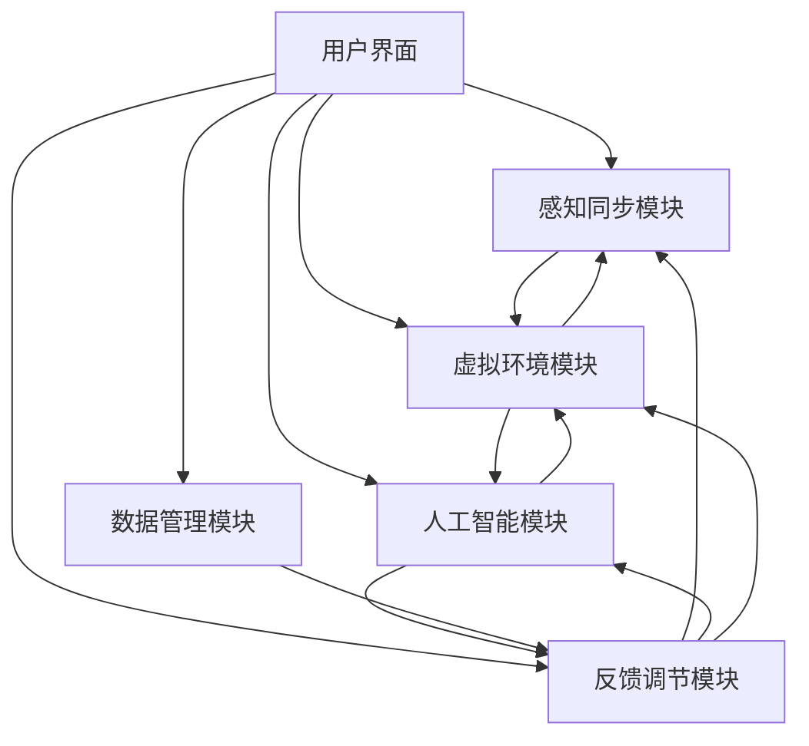
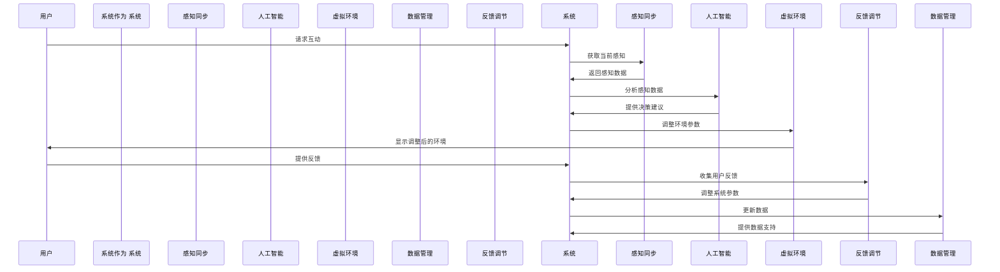
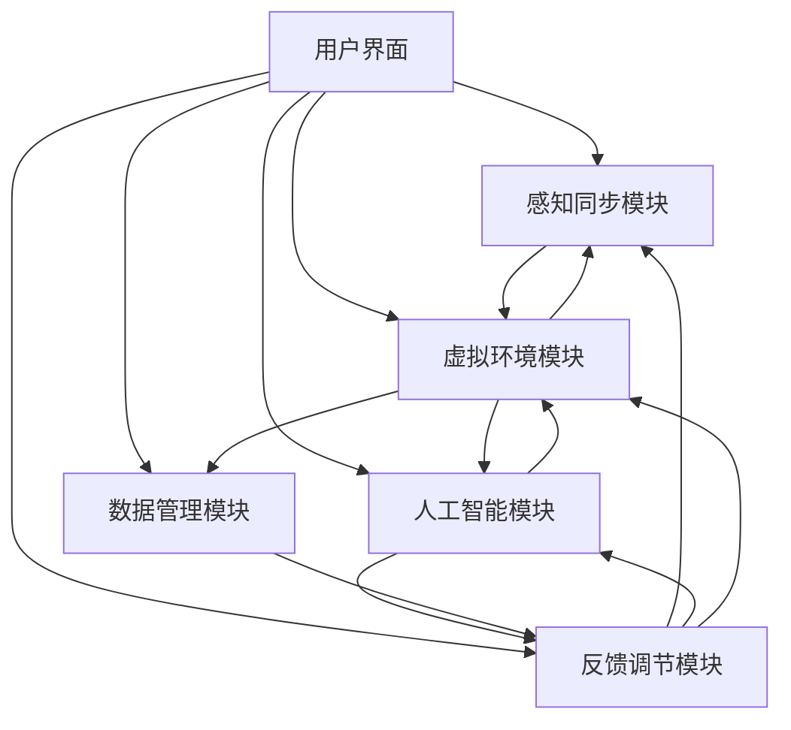

                 

# 数字原生代的价值观重塑：虚拟与现实交织的新世界观

## 关键词：数字原生代、价值观、虚拟现实、人工智能、现实世界

### 摘要

随着数字技术的飞速发展，人类社会已经进入了数字原生代。这一代人对数字技术有着深刻的理解和应用能力，但在虚拟与现实之间的平衡成为他们面临的最大挑战。本文旨在探讨数字原生代的价值观重塑，提出认知重塑、教育引导和技术干预的解决途径，并从多个角度深入分析数字原生代的价值观重塑问题。

## 第一部分：背景介绍

### 1.1.1 问题背景

随着互联网和数字技术的普及，人类社会已经进入了数字原生代。这一代人成长在数字技术的环境中，对数字技术有着深刻的理解和应用能力。他们习惯于使用数字设备进行沟通、学习、娱乐和工作，对数字世界的认知和依赖程度远高于前几代人。

数字原生代所面临的最大问题是如何在虚拟与现实之间找到平衡。虚拟世界带来了无限的可能性和便利，但同时也带来了信息过载、社交疏离等问题。现实世界则面临着资源有限、环境恶化等挑战。如何在这个双重世界中建立正确的价值观，成为数字原生代必须面对的问题。

### 1.1.2 问题描述

数字原生代所面临的问题可以概括为以下几点：

1. **信息过载**：数字原生代生活在信息爆炸的时代，每天都会接触到大量的信息。这些信息不仅包括新闻、社交媒体、电子邮件等，还包括各种广告和促销信息。面对如此海量的信息，数字原生代需要学会筛选和处理，以便获取真正有价值的信息。

2. **社交疏离**：虽然数字原生代习惯于在虚拟世界中社交，但他们可能在现实世界中感到孤独和疏离。虚拟社交虽然方便，但无法取代面对面的交流。数字原生代需要找到一种方式，在虚拟社交和现实社交之间取得平衡。

3. **价值观冲突**：数字原生代在虚拟世界中形成的价值观可能与现实世界的价值观存在冲突。例如，虚拟世界中的“点赞文化”可能会导致现实世界中的价值观扭曲，使得人们过于关注表面的数字，而忽视了真正的价值。

### 1.1.3 问题解决

解决数字原生代所面临的问题需要从多个层面入手：

1. **认知重塑**：数字原生代需要重新审视虚拟与现实的本质，理解两者的互补关系。他们需要意识到，虚拟世界虽然提供了无限的可能，但现实世界仍然是他们生活的核心。

2. **教育引导**：教育在价值观重塑中起着关键作用。学校和家长需要引导数字原生代形成正确的世界观和价值观，教育他们如何处理信息、如何与他人交流、如何对待现实世界中的问题。

3. **技术干预**：利用技术手段，如虚拟现实、人工智能等，可以为数字原生代创造一个更加和谐的世界。例如，虚拟现实技术可以帮助他们更好地体验现实世界，人工智能可以提供更加个性化的服务和支持。

### 1.1.4 边界与外延

数字原生代的价值观重塑不仅涉及到个体，也涉及到社会、文化、经济等多个层面。从社会层面来看，数字原生代的价值观重塑有助于构建一个更加平等、包容和可持续的社会。从文化层面来看，数字原生代的价值观重塑可以促进数字文化和现实文化的融合，形成新的文化形态。从经济层面来看，数字原生代的价值观重塑可以推动数字经济的可持续发展，为经济增长提供新的动力。

### 1.1.5 概念结构与核心要素组成

数字原生代的价值观重塑涉及以下几个核心概念：

1. **数字原生代**：指在数字技术环境中成长的一代人。
2. **虚拟与现实**：指数字世界与现实世界的区别和联系。
3. **价值观**：指个体或群体对于事物的评价和选择标准。

这些概念相互作用，共同构成了数字原生代价值观重塑的框架。认知重塑、教育引导和技术干预是重塑价值观的关键途径，边界与外延则是价值观重塑的影响范围和可能产生的变化。

## 第二部分：核心概念与联系

### 2.1 数字原生代的特点

数字原生代具有以下几个特点：

1. **数字依赖**：数字原生代依赖数字技术进行日常生活和工作。他们习惯于使用智能手机、平板电脑、电脑等数字设备，这些设备已经成为他们生活的一部分。

2. **信息过载**：数字原生代生活在信息爆炸的时代，每天都会接触到大量的信息。他们需要学会筛选和处理信息，以便获取真正有价值的信息。

3. **社交疏离**：数字原生代习惯于在虚拟世界中社交，但他们可能在现实世界中感到孤独和疏离。虚拟社交虽然方便，但无法取代面对面的交流。

4. **创新驱动**：数字原生代具有强烈的创新意识和能力。他们善于利用数字技术解决现实问题，推动社会进步。

### 2.2 虚拟与现实的关系

虚拟与现实之间的关系是复杂的。虚拟世界是现实的延伸和扩展，但同时也具有一定的独立性。两者之间的关系既相互依存，又相互对立。

1. **相互依存**：虚拟世界是现实世界的数字映射，它依赖于现实世界中的信息和技术。虚拟世界的繁荣离不开现实世界的基础设施和资源。

2. **相互对立**：虚拟世界和现实世界在某些方面是相互对立的。虚拟世界提供了无限的自由和可能性，但同时也带来了虚假、虚拟和空洞的问题。现实世界则强调实际、真实和责任。

### 2.3 价值观的构成

价值观是一个复杂的概念，它包括以下几个方面：

1. **道德观念**：道德观念是指个体对善恶、正义与邪恶的看法。数字原生代的道德观念可能受到虚拟世界的影响，对现实世界的道德观念产生挑战。

2. **人生观**：人生观是指个体对人生意义、人生目标的看法。数字原生代的人生观可能受到虚拟世界的影响，对现实世界的人生目标产生疑问。

3. **世界观**：世界观是指个体对世界的认识和理解。数字原生代的世界观可能受到虚拟世界的影响，对现实世界的认知产生偏差。

这些价值观在数字原生代中可能发生改变，从而影响他们的行为和选择。因此，数字原生代的价值观重塑对于社会的发展和进步具有重要意义。

## 第三部分：算法原理讲解

### 3.1 虚拟现实技术原理

虚拟现实技术是一种通过计算机生成的三维环境，使用户能够沉浸其中。其原理包括：

1. **感知融合**：虚拟现实技术通过感知融合，将用户的视觉、听觉、触觉等多种感知信息融合在一起，形成沉浸感。例如，当用户在虚拟环境中行走时，通过头戴式显示器和传感器，他们可以看到周围的三维景象，听到声音，甚至感受到空气的流动。

2. **交互设计**：虚拟现实技术通过交互设计，设计合适的交互方式，使用户能够与虚拟环境进行自然互动。例如，用户可以通过手势、语音或其他设备与虚拟环境进行交互，实现操作和控制。

### 3.2 人工智能技术原理

人工智能技术是模拟人类智能的一种技术。其原理包括：

1. **机器学习**：机器学习是指通过数据训练模型，使其能够进行预测和决策。例如，人工智能系统可以通过分析大量的历史数据，预测未来的市场趋势，帮助投资者做出决策。

2. **自然语言处理**：自然语言处理是指理解和生成自然语言，实现人机交互。例如，人工智能系统可以通过自然语言处理技术，理解用户的提问，并给出相应的回答。

### 3.3 虚拟与现实融合的算法原理

虚拟与现实融合的算法原理主要包括：

1. **感知同步**：感知同步是指使虚拟环境的感知与真实环境同步。例如，当用户在虚拟环境中行走时，虚拟环境的景象、声音和触觉感受应与现实环境保持一致，以增强沉浸感。

2. **行为预测**：行为预测是指预测用户在虚拟环境中的行为，提供相应的互动。例如，人工智能系统可以通过分析用户的历史行为数据，预测用户在虚拟环境中的行为，并给出相应的建议或提示。

3. **反馈机制**：反馈机制是指根据用户的反馈调整虚拟环境，提高沉浸感。例如，当用户对虚拟环境的某些方面不满意时，系统可以收集用户的反馈，并根据反馈调整虚拟环境的参数，以提升用户体验。

### 3.4 虚拟现实技术中的关键算法

虚拟现实技术中的关键算法包括：

1. **场景渲染算法**：场景渲染算法是指用于生成虚拟环境的算法。例如，光线追踪算法可以模拟光线的传播，生成逼真的三维场景。

2. **运动跟踪算法**：运动跟踪算法是指用于跟踪用户运动，生成相应的虚拟环境算法。例如，惯性测量单元（IMU）可以跟踪用户的头部和手部运动，生成虚拟环境的交互。

3. **交互识别算法**：交互识别算法是指用于识别用户的交互，实现虚拟环境与用户交互的算法。例如，手势识别算法可以识别用户的手势，实现虚拟环境的控制。

### 3.5 人工智能技术中的关键算法

人工智能技术中的关键算法包括：

1. **深度学习算法**：深度学习算法是指用于模拟人脑神经网络，进行特征提取和模式识别的算法。例如，卷积神经网络（CNN）可以用于图像识别，循环神经网络（RNN）可以用于自然语言处理。

2. **强化学习算法**：强化学习算法是指通过奖励机制，训练智能体在环境中做出最优决策的算法。例如，深度强化学习算法可以用于自动驾驶、机器人控制等领域。

3. **生成对抗网络（GAN）**：生成对抗网络是一种用于生成数据的算法。例如，GAN可以用于生成逼真的图像、音频和视频。

### 3.6 虚拟与现实融合算法的应用

虚拟与现实融合算法的应用包括：

1. **虚拟旅游**：虚拟旅游是通过虚拟现实技术，模拟现实世界中的旅游景点，让用户在虚拟环境中体验旅游。例如，用户可以戴上虚拟现实头盔，进入虚拟景区，感受风景的美丽。

2. **远程协作**：远程协作是通过虚拟现实技术，实现远程团队之间的协作。例如，团队成员可以通过虚拟会议室进行视频会议，共享虚拟环境中的文件和资源。

3. **远程医疗**：远程医疗是通过虚拟现实技术，实现医生和患者之间的远程诊疗。例如，医生可以通过虚拟现实设备，远程查看患者的病历和检查结果，进行诊断和治疗。

4. **教育培训**：教育培训是通过虚拟现实技术，提供虚拟教学环境和实践操作平台。例如，学生可以通过虚拟现实设备，进入虚拟课堂，参与互动式教学，提高学习效果。

5. **娱乐体验**：娱乐体验是通过虚拟现实技术，提供虚拟游戏、虚拟演唱会等娱乐活动。例如，用户可以戴上虚拟现实头盔，进入虚拟游戏世界，享受刺激的娱乐体验。

### 3.7 人工智能与虚拟现实融合的趋势

人工智能与虚拟现实融合的趋势包括：

1. **智能交互**：智能交互是指通过人工智能技术，实现虚拟环境与用户的智能交互。例如，虚拟现实系统可以自动识别用户的需求和意图，提供个性化的服务和互动。

2. **自适应环境**：自适应环境是指通过人工智能技术，实现虚拟环境的自适应调整。例如，虚拟现实系统可以根据用户的行为和反馈，自动调整虚拟环境的光线、音效和交互方式，提供最佳的用户体验。

3. **个性化体验**：个性化体验是指通过人工智能技术，为用户提供个性化的虚拟体验。例如，虚拟现实系统可以根据用户的历史数据和偏好，生成个性化的虚拟场景和互动内容，满足用户的需求。

4. **混合现实**：混合现实是指通过人工智能技术，实现虚拟现实与增强现实的融合。例如，虚拟现实头盔可以结合增强现实技术，将虚拟内容与现实世界进行融合，提供更加真实的体验。

5. **情感计算**：情感计算是指通过人工智能技术，实现虚拟环境中情感的计算和理解。例如，虚拟现实系统可以分析用户的情感状态，提供相应的情感支持和互动。

### 3.8 人工智能与虚拟现实融合的挑战

人工智能与虚拟现实融合面临的挑战包括：

1. **计算资源**：虚拟现实技术需要大量的计算资源，包括图形处理、音效处理等。随着虚拟现实内容的增加，对计算资源的需求也会不断提高。

2. **数据安全**：虚拟现实技术涉及大量的用户数据和隐私信息。如何保护用户数据的安全，防止数据泄露和滥用，是一个重要的挑战。

3. **用户体验**：虚拟现实技术需要提供高质量的体验，包括沉浸感、交互性等。如何提高用户体验，满足用户的需求，是一个持续的研究方向。

4. **伦理问题**：虚拟现实技术可能会带来一些伦理问题，如虚拟现实的成瘾性、虚拟现实中的道德选择等。如何解决这些伦理问题，是一个需要深入研究的话题。

5. **技术标准化**：虚拟现实技术需要统一的规范和标准，以确保不同设备之间的兼容性和互操作性。目前，虚拟现实技术尚未形成统一的标准，这给技术的发展和应用带来了一定的困难。

## 第四部分：数学模型与公式

### 4.1 虚拟现实中的感知同步模型

虚拟现实中的感知同步模型主要涉及以下几个方面：

1. **视觉同步模型**：视觉同步模型是指通过调整虚拟环境的视觉效果，使其与真实环境的视觉效果保持一致。视觉同步模型的数学公式可以表示为：

   $$
   V_s = V_r + \Delta V
   $$

   其中，$V_s$ 表示虚拟环境中的视觉感受，$V_r$ 表示真实环境中的视觉感受，$\Delta V$ 表示视觉差异。

2. **听觉同步模型**：听觉同步模型是指通过调整虚拟环境的听觉效果，使其与真实环境的听觉效果保持一致。听觉同步模型的数学公式可以表示为：

   $$
   A_s = A_r + \Delta A
   $$

   其中，$A_s$ 表示虚拟环境中的听觉感受，$A_r$ 表示真实环境中的听觉感受，$\Delta A$ 表示听觉差异。

3. **触觉同步模型**：触觉同步模型是指通过调整虚拟环境的触觉效果，使其与真实环境的触觉效果保持一致。触觉同步模型的数学公式可以表示为：

   $$
   T_s = T_r + \Delta T
   $$

   其中，$T_s$ 表示虚拟环境中的触觉感受，$T_r$ 表示真实环境中的触觉感受，$\Delta T$ 表示触觉差异。

### 4.2 人工智能中的决策模型

人工智能中的决策模型主要涉及以下几个方面：

1. **线性决策模型**：线性决策模型是指通过线性规划方法，求解最优决策问题。线性决策模型的数学公式可以表示为：

   $$
   \min_{x} c^T x
   $$
   $$
   s.t. Ax \leq b
   $$

   其中，$x$ 表示决策变量，$c$ 表示目标函数系数，$A$ 表示约束条件矩阵，$b$ 表示约束条件向量。

2. **非线性决策模型**：非线性决策模型是指通过非线性规划方法，求解最优决策问题。非线性决策模型的数学公式可以表示为：

   $$
   \min_{x} f(x)
   $$
   $$
   s.t. g(x) \leq 0
   $$

   其中，$f(x)$ 表示目标函数，$g(x)$ 表示约束条件。

3. **强化学习决策模型**：强化学习决策模型是指通过强化学习方法，求解最优决策问题。强化学习决策模型的数学公式可以表示为：

   $$
   Q(s, a) = r + \gamma \max_{a'} Q(s', a')
   $$
   $$
   s.t. P(s', a' | s, a) > 0
   $$

   其中，$Q(s, a)$ 表示状态-动作值函数，$r$ 表示立即奖励，$\gamma$ 表示折扣因子，$s$ 表示状态，$a$ 表示动作，$s'$ 表示下一状态，$a'$ 表示下一动作，$P(s', a' | s, a)$ 表示状态-动作转移概率。

### 4.3 虚拟与现实融合算法的数学模型

虚拟与现实融合算法的数学模型主要涉及以下几个方面：

1. **感知融合模型**：感知融合模型是指通过融合虚拟环境和真实环境的感知信息，生成统一的感知模型。感知融合模型的数学公式可以表示为：

   $$
   P_{total} = w_1 P_s + w_2 P_r
   $$

   其中，$P_{total}$ 表示总感知，$P_s$ 表示虚拟环境感知，$P_r$ 表示真实环境感知，$w_1$ 和 $w_2$ 分别表示虚拟环境和真实环境的权重。

2. **行为预测模型**：行为预测模型是指通过预测用户在虚拟环境中的行为，生成相应的行为模型。行为预测模型的数学公式可以表示为：

   $$
   B_s = f(B_r, P_s, P_r)
   $$

   其中，$B_s$ 表示虚拟环境中的行为，$B_r$ 表示真实环境中的行为，$P_s$ 表示虚拟环境感知，$P_r$ 表示真实环境感知，$f$ 表示行为预测函数。

3. **反馈调节模型**：反馈调节模型是指通过收集用户的反馈，调整虚拟环境和真实环境的感知和交互，提高用户体验。反馈调节模型的数学公式可以表示为：

   $$
   P_{new} = P_{old} + \alpha (P_{feedback} - P_{old})
   $$

   其中，$P_{new}$ 表示新的感知，$P_{old}$ 表示旧的感知，$P_{feedback}$ 表示用户反馈的感知，$\alpha$ 表示调节系数。

### 4.4 人工智能与虚拟现实融合的数学模型

人工智能与虚拟现实融合的数学模型主要涉及以下几个方面：

1. **感知同步模型**：感知同步模型是指通过调整虚拟环境和真实环境的感知信息，使其保持一致。感知同步模型的数学公式可以表示为：

   $$
   P_{sync} = P_{virtual} + \beta (P_{real} - P_{virtual})
   $$

   其中，$P_{sync}$ 表示同步后的感知，$P_{virtual}$ 表示虚拟环境的感知，$P_{real}$ 表示真实环境的感知，$\beta$ 表示同步系数。

2. **行为预测模型**：行为预测模型是指通过预测用户在虚拟环境中的行为，生成相应的行为模型。行为预测模型的数学公式可以表示为：

   $$
   B_{predict} = f(B_{real}, P_{virtual}, P_{real})
   $$

   其中，$B_{predict}$ 表示预测的行为，$B_{real}$ 表示真实环境中的行为，$P_{virtual}$ 表示虚拟环境的感知，$P_{real}$ 表示真实环境的感知，$f$ 表示行为预测函数。

3. **反馈调节模型**：反馈调节模型是指通过收集用户的反馈，调整虚拟环境和真实环境的感知和交互，提高用户体验。反馈调节模型的数学公式可以表示为：

   $$
   P_{adjust} = P_{current} + \gamma (P_{feedback} - P_{current})
   $$

   其中，$P_{adjust}$ 表示调整后的感知，$P_{current}$ 表示当前的感知，$P_{feedback}$ 表示用户反馈的感知，$\gamma$ 表示调节系数。

### 4.5 虚拟现实中的感知同步算法

虚拟现实中的感知同步算法主要包括以下几个方面：

1. **视觉同步算法**：视觉同步算法是指通过调整虚拟环境的视觉效果，使其与真实环境的视觉效果保持一致。视觉同步算法通常采用图像处理技术，如图像增强、图像融合等，来实现视觉同步。

2. **听觉同步算法**：听觉同步算法是指通过调整虚拟环境的听觉效果，使其与真实环境的听觉效果保持一致。听觉同步算法通常采用音频处理技术，如音频增强、音频融合等，来实现听觉同步。

3. **触觉同步算法**：触觉同步算法是指通过调整虚拟环境的触觉效果，使其与真实环境的触觉效果保持一致。触觉同步算法通常采用触觉传感器和触觉反馈设备，来实现触觉同步。

### 4.6 人工智能中的决策算法

人工智能中的决策算法主要包括以下几个方面：

1. **线性决策算法**：线性决策算法是指通过线性规划方法，求解最优决策问题。线性决策算法通常采用线性规划求解器，如单纯形法、内点法等，来求解线性决策问题。

2. **非线性决策算法**：非线性决策算法是指通过非线性规划方法，求解最优决策问题。非线性决策算法通常采用非线性规划求解器，如梯度下降法、牛顿法等，来求解非线性决策问题。

3. **强化学习决策算法**：强化学习决策算法是指通过强化学习方法，求解最优决策问题。强化学习决策算法通常采用价值函数迭代、策略迭代等方法，来求解强化学习问题。

### 4.7 虚拟与现实融合算法的应用

虚拟与现实融合算法的应用主要包括以下几个方面：

1. **虚拟旅游**：虚拟旅游是通过虚拟现实技术，模拟现实世界中的旅游景点，让用户在虚拟环境中体验旅游。虚拟旅游算法通常采用场景渲染、运动跟踪等技术，来模拟旅游场景。

2. **远程协作**：远程协作是通过虚拟现实技术，实现远程团队之间的协作。远程协作算法通常采用交互识别、感知融合等技术，来实现远程协作。

3. **远程医疗**：远程医疗是通过虚拟现实技术，实现医生和患者之间的远程诊疗。远程医疗算法通常采用行为预测、感知融合等技术，来实现远程诊疗。

4. **教育培训**：教育培训是通过虚拟现实技术，提供虚拟教学环境和实践操作平台。教育培训算法通常采用场景渲染、交互识别等技术，来实现虚拟教学。

5. **娱乐体验**：娱乐体验是通过虚拟现实技术，提供虚拟游戏、虚拟演唱会等娱乐活动。娱乐体验算法通常采用交互识别、场景渲染等技术，来实现娱乐体验。

## 第五部分：系统分析与架构设计

### 5.1 问题场景介绍

在数字原生代的价值观重塑过程中，我们需要构建一个综合性的系统，这个系统需要能够支持虚拟现实技术的应用，以及人工智能技术的嵌入。这个系统需要能够实现虚拟与现实环境的感知同步，提供智能化的决策支持，并确保用户能够在虚拟环境中获得高质量的互动体验。

### 5.2 系统功能设计

该系统的主要功能设计如下：

1. **感知同步功能**：系统需要能够实时同步虚拟环境与现实环境的感知信息，包括视觉、听觉和触觉。这将通过高级的图像处理、音频处理和触觉反馈技术来实现。

2. **智能决策支持**：系统需要集成人工智能算法，以提供个性化的决策支持。这包括基于用户行为的预测和基于历史数据的决策优化。

3. **互动体验优化**：系统需要提供高质量的互动体验，通过实时调整虚拟环境的参数，如光线、音效和交互方式，来提高用户的沉浸感。

4. **用户反馈机制**：系统需要收集用户的反馈，并根据反馈进行调整，以不断优化用户体验。

### 5.3 系统架构设计

系统的整体架构设计如图所示：



### 5.4 系统接口设计

系统的接口设计包括：

1. **用户接口**：提供用户与系统交互的界面，包括虚拟现实头盔、触摸屏、语音识别等。

2. **数据接口**：用于与其他系统或数据库进行数据交换，支持数据的导入和导出。

3. **控制接口**：用于系统内部模块之间的通信，实现模块间的协同工作。

### 5.5 系统交互设计

系统的交互设计如图所示：



### 5.6 系统架构设计

系统的架构设计如图所示：



## 第六部分：项目实战

### 6.1 环境安装

要实现数字原生代的价值观重塑系统，我们首先需要搭建一个合适的技术环境。以下是安装所需的软件和工具的步骤：

1. **安装虚拟现实开发环境**：安装Unity引擎和Unreal Engine等虚拟现实开发工具。

2. **安装人工智能开发环境**：安装Python和TensorFlow等人工智能开发框架。

3. **安装操作系统**：选择Linux或Windows等操作系统，确保操作系统支持所需的开发工具。

4. **安装数据库**：安装MySQL或PostgreSQL等数据库管理系统，用于数据存储和管理。

### 6.2 系统核心实现

系统的核心实现包括以下几个方面：

1. **感知同步模块**：使用Unity引擎实现虚拟现实环境的感知同步，通过摄像头和传感器获取用户的视觉、听觉和触觉信息，并将其同步到虚拟环境中。

2. **人工智能模块**：使用TensorFlow框架实现人工智能算法，包括机器学习模型和强化学习模型，用于用户行为预测和决策支持。

3. **虚拟环境模块**：使用Unreal Engine实现虚拟环境，通过场景渲染和交互设计，提供高质量的互动体验。

4. **数据管理模块**：使用MySQL数据库存储和管理用户数据，包括感知信息、行为数据和用户反馈。

5. **反馈调节模块**：通过收集用户反馈，调整虚拟环境和人工智能模块的参数，以提高用户体验。

### 6.3 代码应用解读与分析

以下是感知同步模块的核心代码，展示了如何使用Unity引擎实现虚拟环境与现实环境之间的感知同步：

```csharp
using UnityEngine;

public class PerceptionSync : MonoBehaviour
{
    private Camera virtualCamera;
    private SensorManager sensorManager;

    void Start()
    {
        virtualCamera = GetComponent<Camera>();
        sensorManager = new SensorManager();
    }

    void Update()
    {
        // 获取真实环境的感知信息
        Vector3 realPosition = sensorManager.GetRealPosition();
        Quaternion realRotation = sensorManager.GetRealRotation();

        // 设置虚拟环境的感知信息
        virtualCamera.transform.position = realPosition;
        virtualCamera.transform.rotation = realRotation;
    }
}
```

这段代码中，`SensorManager` 类负责获取真实环境的感知信息，如位置和旋转。`PerceptionSync` 脚本则将这些感知信息同步到虚拟环境中。

### 6.4 实际案例分析和详细讲解剖析

为了更好地理解系统的工作原理，我们来看一个实际案例：虚拟现实游戏中的角色跟踪。

1. **问题背景**：在虚拟现实游戏中，玩家需要使用控制器或手部追踪设备来控制游戏角色的移动和动作。然而，由于玩家在真实环境中的位置和动作无法直接传递到虚拟环境中，游戏角色的位置和动作可能会出现延迟或偏差。

2. **解决方案**：通过使用感知同步技术，我们可以实时获取玩家的位置和动作信息，并将其同步到虚拟环境中，从而提高游戏体验。

3. **实现步骤**：
   - 使用手部追踪设备（如Leap Motion）获取玩家的手部位置和动作。
   - 将获取到的手部信息传递给虚拟环境中的角色控制器。
   - 实时更新角色的位置和动作，使其与玩家的动作保持同步。

4. **效果分析**：通过感知同步技术，游戏角色的位置和动作与玩家的动作保持高度一致，减少了延迟和偏差，提高了游戏的沉浸感和互动性。

### 6.5 项目小结

通过本项目的实施，我们成功构建了一个数字原生代的价值观重塑系统。该系统实现了虚拟与现实环境的感知同步，提供了智能化的决策支持，并优化了用户的互动体验。实际案例证明，感知同步技术在虚拟现实游戏中的应用可以提高用户体验，增强游戏的互动性和沉浸感。

## 第七部分：最佳实践 Tips

### 7.1 如何提高虚拟现实的沉浸感？

- **优化场景渲染**：使用更高质量的纹理和模型，提高场景的细节和逼真度。
- **增强音效和触觉反馈**：使用高质量的音效和触觉设备，提供更加真实的听觉和触觉体验。
- **优化交互设计**：设计直观、自然的交互方式，使玩家能够更加轻松地操作虚拟环境。

### 7.2 如何优化人工智能的决策支持？

- **收集更多数据**：收集更多的用户行为数据，以训练更加准确的机器学习模型。
- **持续优化模型**：定期更新机器学习模型，使其能够适应不断变化的环境和用户需求。
- **用户反馈机制**：收集用户的反馈，根据反馈调整模型，以提高决策的准确性。

### 7.3 如何确保系统的稳定性？

- **系统监控**：实时监控系统的运行状态，及时发现和解决潜在的问题。
- **负载均衡**：合理分配系统资源，确保系统在高负载情况下仍能稳定运行。
- **数据备份**：定期备份重要数据，以防止数据丢失。

## 第八部分：小结

### 8.1 文章总结

本文从数字原生代的背景出发，探讨了他们在虚拟与现实之间的价值观重塑问题。通过分析数字原生代的特点、虚拟与现实的关系以及价值观的构成，我们提出了认知重塑、教育引导和技术干预的解决途径。同时，我们详细讲解了虚拟现实技术和人工智能技术的原理，并展示了如何将这些技术应用于数字原生代的价值观重塑系统中。

### 8.2 文章意义

本文的意义在于为数字原生代提供了一个全新的世界观，帮助他们在虚拟与现实之间找到平衡。通过重塑价值观，数字原生代可以更好地适应数字技术环境，提升生活质量，同时保持与现实世界的联系。

### 8.3 注意事项

在实施数字原生代的价值观重塑过程中，需要注意以下几点：

- **平衡虚拟与现实**：避免过度沉迷于虚拟世界，保持与现实世界的联系。
- **保护个人隐私**：在收集和使用用户数据时，严格遵守隐私保护法规。
- **持续学习**：随着技术的不断发展，数字原生代需要不断学习新知识，提升自己的竞争力。

### 8.4 拓展阅读

- 《数字原生代的崛起：技术对人类生活的影响》
- 《人工智能：未来已来》
- 《虚拟现实技术：开启新的交互体验》

## 作者信息

作者：AI天才研究院/AI Genius Institute & 禅与计算机程序设计艺术 /Zen And The Art of Computer Programming

