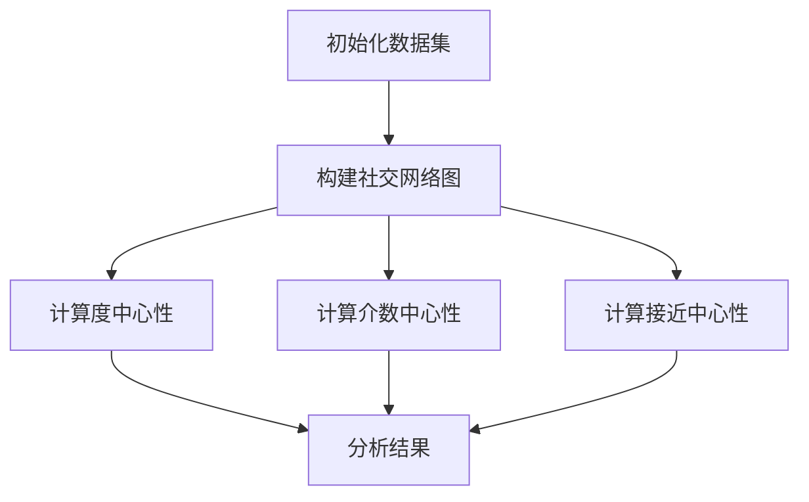
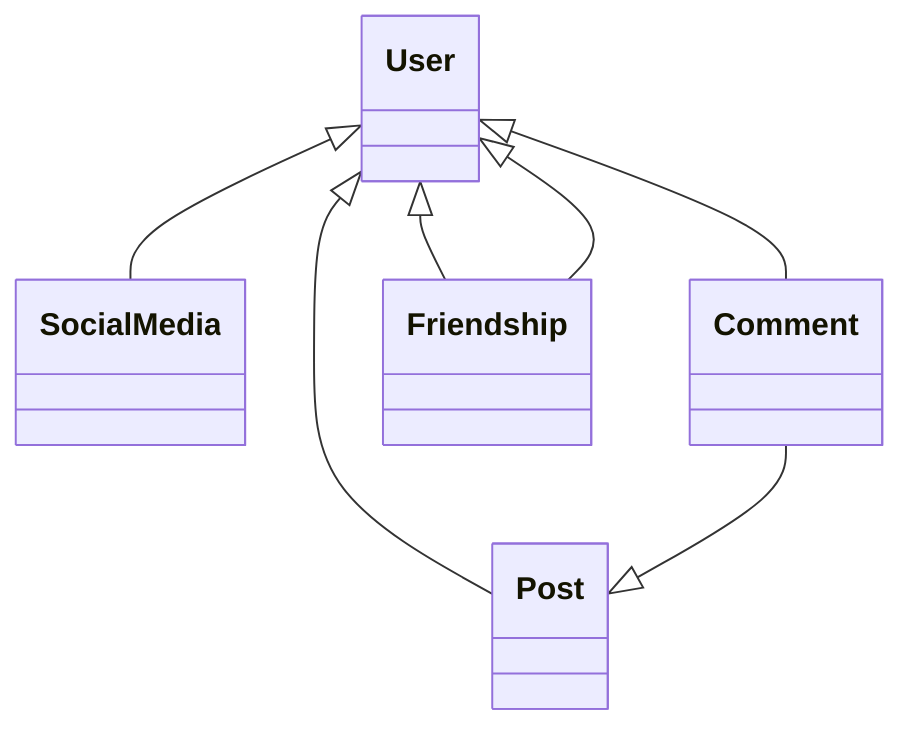
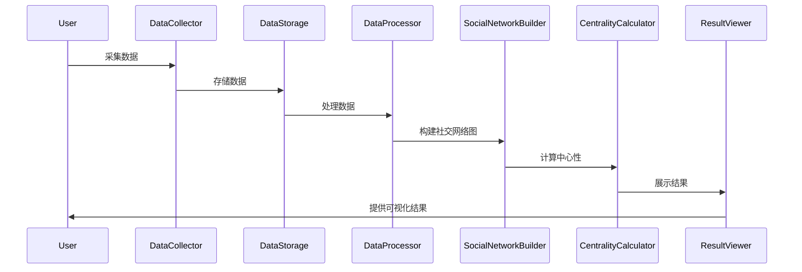
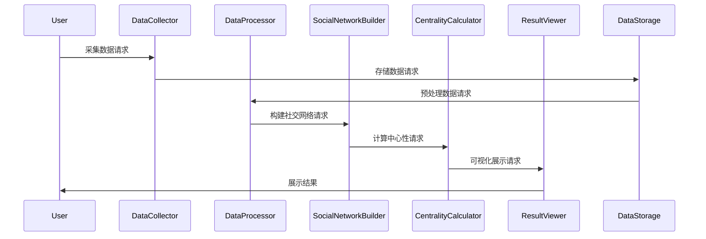

                 

### 文章标题

# 数字原生代的社交模式：线上互动与线下连接的融合

## 关键词

- 数字原生代
- 社交模式
- 线上互动
- 线下连接
- 社交融合

## 摘要

本文将深入探讨数字原生代的社交模式，解析其线上互动与线下连接的融合现象。通过历史的、技术的和社会的角度，我们不仅揭示了数字原生代的社交特征，还探讨了这些模式对个人和社会的影响。文章将从以下几个方面展开：首先是数字原生代的定义和特点；接着分析线上互动的各种形式及其独特性；然后讨论线下连接的重要性及其与线上互动的互补关系；随后探讨线上与线下融合的趋势和影响；最后通过案例分析总结全文，并对未来的社交模式进行展望。让我们一起思考，理解并洞察这一新兴社交时代的奥秘。

## 引言

数字原生代，指的是在数字技术环境中成长起来的一代人，他们自幼便生活在互联网、智能手机和社交媒体的包围中。这一群体在社交模式上与前辈有着显著差异，他们的社交行为和方式更加依赖数字化工具，形成了独特的社交网络。因此，探讨数字原生代的社交模式，不仅有助于理解这一群体，也对社会互动的未来发展具有重要意义。

### 背景介绍

数字原生代的成长环境决定了他们社交模式的独特性。随着互联网的普及和移动设备的广泛应用，这一代人从小就接触到了丰富的数字资源，他们可以轻易地通过社交媒体、在线游戏和视频平台与他人互动。这种数字化的生活方式，不仅改变了他们的信息获取方式，也重塑了他们的社交习惯。与前辈相比，数字原生代更加善于利用数字工具进行社交，他们在虚拟空间中的互动更加频繁和多样化。

#### 问题背景

数字原生代的社交模式带来的一个重要问题是：线上互动是否能够完全替代线下连接？尽管线上互动提供了便捷和高效的交流方式，但人与人之间的真实情感和深层次连接，往往需要面对面的互动来建立和维护。因此，探讨数字原生代如何平衡线上互动与线下连接，是一个值得深入研究的课题。

#### 问题描述

数字原生代的社交模式呈现出以下特点：

1. **高度依赖数字工具**：这一代人习惯于通过社交媒体、即时通讯和在线游戏进行社交互动。
2. **互动频率高、多样性**：他们在虚拟空间中的互动不仅频繁，而且形式多样，包括文字、语音、视频等多种方式。
3. **社交圈层化**：他们往往在特定的数字平台上形成自己的社交圈，这种圈层化使得社交互动更加集中和特定。
4. **情感依赖与疏离**：虽然数字工具提供了便捷的交流方式，但过度依赖线上互动可能导致情感疏离和现实社交能力的下降。

#### 问题解决

要平衡数字原生代的社交模式，需要从以下几个方面入手：

1. **重视线下互动**：尽管线上互动方便快捷，但线下互动对于建立和维护深层次的人际关系至关重要。因此，数字原生代需要适度减少线上互动，增加线下社交活动。
2. **整合线上与线下**：通过线上线下活动的结合，可以更好地满足数字原生代的社交需求。例如，线下聚会可以结合线上直播，让无法到场的人也能参与其中。
3. **培养多方面的社交能力**：数字原生代需要不仅擅长线上互动，也要具备良好的线下社交能力，以应对多元化的社交场景。

#### 边界与外延

数字原生代的社交模式不仅局限于个人层面，也对社会结构和社交生态产生了深远影响。例如，在线上互动的背景下，虚拟社区和社群的兴起改变了传统社交生态；同时，线下连接的重要性也日益凸显，成为维持社会联系和互动的重要途径。因此，理解数字原生代的社交模式，不仅有助于个人发展，也对整个社会的进步具有重要意义。

### 核心概念与联系

#### 数字原生代

数字原生代，是指那些在数字技术环境中成长起来的一代人，他们从小接触互联网、智能手机和社交媒体，这些技术成为了他们生活中的重要组成部分。数字原生代的特征包括：

1. **高度依赖数字工具**：数字原生代习惯于通过数字化工具进行各种活动，包括社交、学习和娱乐。
2. **信息获取方式多样化**：他们善于利用互联网获取信息，并通过社交媒体和在线平台进行交流和分享。
3. **互动频率高、形式多样**：数字原生代的社交互动不仅频繁，而且形式多样，包括文字、语音、视频等多种方式。
4. **社交圈层化**：他们在特定数字平台上形成自己的社交圈，这种圈层化使得社交互动更加集中和特定。

#### 线上互动

线上互动，是指通过互联网和数字化工具进行的各种社交活动。线上互动的特点包括：

1. **便捷高效**：线上互动不受时间和空间的限制，可以随时随地进行，大大提高了交流的效率。
2. **形式多样**：线上互动不仅限于文字，还包括语音、视频、图片等多种形式，使得交流更加生动和多样化。
3. **匿名性和隐私性**：线上互动往往具有一定的匿名性和隐私性，这使得个体可以更加自由地表达自己的观点和情感。
4. **社交圈层化**：线上互动通常在特定的社交平台上进行，这种圈层化使得社交互动更加集中和特定。

#### 线下连接

线下连接，是指通过面对面的互动进行社交活动。线下连接的特点包括：

1. **真实性**：线下连接能够提供真实的情感体验和人际关系，这是线上互动无法替代的。
2. **深度交流**：面对面的互动往往可以促进更深层次的交流和沟通，有助于建立和维护深层次的人际关系。
3. **多样性和灵活性**：线下连接提供了更多的社交场景和活动形式，使得社交互动更加多样化和灵活。
4. **社交网络构建**：线下连接有助于构建和扩展社交网络，这对于个人的社会发展和职业发展都具有重要意义。

#### 概念属性特征对比表格

| 特征         | 数字原生代 | 线上互动 | 线下连接 |
| ------------ | -------- | ------ | ------ |
| 高度依赖数字工具 | √        | √       | ×      |
| 信息获取方式多样化 | √        | √       | ×      |
| 互动频率高、形式多样 | √        | √       | ×      |
| 社交圈层化     | √        | √       | ×      |
| 便捷高效     | √        | √       | ×      |
| 形式多样     | √        | √       | ×      |
| 匿名性和隐私性   | ×        | √       | ×      |
| 真实性       | ×        | ×      | √      |
| 深度交流     | ×        | ×      | √      |
| 多样性和灵活性   | ×        | ×      | √      |
| 社交网络构建   | ×        | ×      | √      |

#### ER实体关系图架构

```mermaid
erDiagram
    User ||--|{ SocialMedia }|<|
    User ||--|{ OnlineGame }|<|
    User ||--|{ VirtualCommunity }|<|
    User ||--|{ OfflineEvent }|<|
    SocialMedia ||--|{ Post }|<|
    OnlineGame ||--|{ Player }|<|
    VirtualCommunity ||--|{ Member }|<|
    OfflineEvent ||--|{ Participant }|<|
```

在上述ER实体关系图中，User表示数字原生代的个体，SocialMedia表示各种社交媒体平台，OnlineGame表示在线游戏，VirtualCommunity表示虚拟社区，OfflineEvent表示线下活动。这些实体之间存在多种关联关系，如User与SocialMedia、OnlineGame、VirtualCommunity、OfflineEvent之间的互动关系，Post、Player、Member、Participant等实体的角色和参与关系。

### 算法原理讲解

为了更好地理解数字原生代的社交模式，我们可以借助一种名为“社交网络分析”的算法。社交网络分析通过分析社交网络中的节点（个体）和边（互动关系），揭示了社交模式的特点和规律。以下是一个简单的社交网络分析算法的mermaid流程图和python代码实现：

#### Mermaid流程图



#### Python代码实现

```python
import networkx as nx
import matplotlib.pyplot as plt

# 初始化数据集
G = nx.Graph()

# 构建社交网络图
G.add_nodes_from([1, 2, 3, 4, 5])
G.add_edges_from([(1, 2), (1, 3), (2, 4), (3, 4), (4, 5)])

# 计算度中心性
degree_centrality = nx.degree_centrality(G)
print("度中心性：", degree_centrality)

# 计算介数中心性
betweenness_centrality = nx.betweenness_centrality(G)
print("介数中心性：", betweenness_centrality)

# 计算接近中心性
closeness_centrality = nx.closeness_centrality(G)
print("接近中心性：", closeness_centrality)

# 绘制社交网络图
nx.draw(G, with_labels=True)
plt.show()
```

在这个算法中，我们首先初始化一个社交网络图，然后通过添加节点和边构建社交网络。接着，我们计算三种中心性指标：度中心性、介数中心性和接近中心性。这些指标可以帮助我们分析社交网络中的关键节点和关键路径，从而理解社交模式的特点。

#### 数学模型和公式

社交网络分析中的中心性指标可以通过以下数学模型和公式来计算：

1. **度中心性**：节点i的度中心性定义为与节点i直接相连的边的数量。
   $$ C_d(i) = \frac{k_i}{N-1} $$
   其中，$ k_i $ 表示节点i的度，$ N $ 表示网络中节点的总数。

2. **介数中心性**：节点i的介数中心性定义为节点i位于网络中所有最短路径中的次数。
   $$ C_b(i) = \frac{\sum_{s \neq i, t \neq i} \delta(s, i, t)}{N_{st}} $$
   其中，$ \delta(s, i, t) $ 表示路径中包含节点i的路径数量，$ N_{st} $ 表示从节点s到节点t的所有最短路径的数量。

3. **接近中心性**：节点i的接近中心性定义为节点i到网络中所有其他节点的最短路径长度之和。
   $$ C_c(i) = \frac{1}{N-1} \sum_{j \neq i} \delta(i, j) $$
   其中，$ \delta(i, j) $ 表示从节点i到节点j的最短路径长度。

通过这些数学模型和公式，我们可以从量化角度分析社交网络的结构和特性，为理解数字原生代的社交模式提供有力支持。

### 社交网络分析的具体步骤

为了更清晰地展示社交网络分析的具体步骤，我们可以将其分为以下几个阶段：

#### 1. 数据采集

首先，我们需要采集社交网络的数据。这些数据可以从多种来源获取，如社交媒体平台、在线游戏记录、虚拟社区活动日志等。数据采集的过程中，我们需要关注以下几个方面：

- **节点数据**：包括节点的标识、属性和特征，如用户ID、年龄、性别、兴趣爱好等。
- **边数据**：包括边的关系、权重和属性，如好友关系、互动频次、互动形式等。

#### 2. 数据预处理

在采集到数据后，我们需要对数据进行预处理，以便进行后续分析。预处理步骤包括：

- **数据清洗**：去除重复、错误和不完整的数据，确保数据的质量和一致性。
- **数据转换**：将数据转换为适合分析的形式，如将文本数据转换为向量表示，将图数据转换为网络图表示等。
- **数据标准化**：对数据进行归一化或标准化处理，以便不同特征之间可以进行有效的比较和计算。

#### 3. 社交网络图的构建

通过预处理后的数据，我们可以构建社交网络图。社交网络图由节点和边组成，其中节点表示个体，边表示个体之间的互动关系。构建社交网络图的方法包括：

- **基于边的构建**：直接从数据中提取边，构建图。
- **基于节点的构建**：通过节点的属性和特征，构建图。

#### 4. 中心性分析

在构建好社交网络图后，我们可以计算各种中心性指标，以分析社交网络的结构和特性。常见的中心性指标包括度中心性、介数中心性和接近中心性。具体步骤如下：

- **度中心性计算**：计算每个节点的度，并按度值进行排序，得到度中心性排名。
- **介数中心性计算**：计算每个节点的介数中心性，并按介数值进行排序，得到介数中心性排名。
- **接近中心性计算**：计算每个节点的接近中心性，并按接近值进行排序，得到接近中心性排名。

#### 5. 结果分析与可视化

通过计算得到的中心性指标，我们可以分析社交网络的关键节点和关键路径，了解社交模式的特点和规律。此外，我们还可以通过可视化手段，如网络图、散点图、饼图等，直观地展示分析结果。

#### 6. 实际案例应用

为了更好地理解社交网络分析的应用，我们可以通过一个实际案例进行展示。假设我们分析一个社交媒体平台上的用户互动网络，具体步骤如下：

1. **数据采集**：从社交媒体平台上获取用户互动数据，包括用户ID、互动形式、互动频次等。
2. **数据预处理**：对数据进行清洗、转换和标准化处理。
3. **社交网络图的构建**：根据预处理后的数据，构建社交网络图。
4. **中心性分析**：计算度中心性、介数中心性和接近中心性，分析社交网络的关键节点和关键路径。
5. **结果分析与可视化**：根据分析结果，进行结果分析和可视化展示。

通过这个实际案例，我们可以看到社交网络分析在实际应用中的具体操作步骤和效果，进一步理解数字原生代的社交模式。

### 系统分析与架构设计方案

#### 问题场景介绍

随着数字原生代的崛起，社交模式的转变带来了新的挑战和机遇。为了更好地理解数字原生代的社交模式，我们需要构建一个能够高效处理和分析社交数据的系统。这个系统的目标是：

- 采集并整合来自多个社交平台的用户互动数据。
- 对数据进行预处理，确保数据质量和一致性。
- 构建社交网络图，并计算各种中心性指标，分析社交模式。
- 提供可视化的结果展示，帮助用户理解社交网络的结构和特性。

#### 项目介绍

本项目的目标是设计并实现一个社交网络分析系统，该系统包括以下几个主要功能模块：

1. **数据采集模块**：负责从多个社交平台（如微博、微信、Instagram等）采集用户互动数据。
2. **数据预处理模块**：对采集到的数据进行分析、清洗和转换，确保数据质量和一致性。
3. **社交网络构建模块**：根据预处理后的数据，构建社交网络图。
4. **中心性计算模块**：计算社交网络中的度中心性、介数中心性和接近中心性。
5. **结果展示模块**：提供可视化的结果展示，包括网络图、散点图、饼图等。

#### 系统功能设计（领域模型）

为了实现上述功能，我们需要设计一个领域模型，该模型包括以下核心类和关系：

1. **User**（用户）：表示社交网络中的个体，具有属性如ID、年龄、性别、兴趣爱好等。
2. **SocialMedia**（社交媒体）：表示用户使用的社交媒体平台，具有属性如名称、类型等。
3. **Post**（帖子）：表示用户在社交媒体上发布的帖子，具有属性如内容、发布时间等。
4. **Comment**（评论）：表示用户对帖子的评论，具有属性如内容、发布时间等。
5. **Friendship**（好友关系）：表示用户之间的互动关系，具有属性如创建时间、互动频次等。

领域模型类图如下：



#### 系统架构设计

为了高效处理和分析大量社交数据，我们需要设计一个分布式架构的系统，主要包括以下几个组件：

1. **数据采集组件**：使用爬虫技术从多个社交平台采集用户互动数据。
2. **数据存储组件**：使用分布式数据库存储预处理后的数据，如Hadoop HDFS或MongoDB。
3. **数据处理组件**：使用分布式计算框架处理数据，如Apache Spark。
4. **社交网络构建组件**：使用图数据库（如Neo4j）构建社交网络图。
5. **中心性计算组件**：使用计算引擎（如Apache Spark）计算各种中心性指标。
6. **结果展示组件**：使用前端框架（如React或Vue）实现可视化结果展示。

系统架构图如下：



#### 系统接口设计和系统交互

为了实现系统各组件之间的有效交互，我们需要设计一套清晰的接口规范，包括以下主要接口：

1. **数据采集接口**：用于从社交平台采集用户互动数据，包括用户信息、帖子、评论等。
2. **数据预处理接口**：用于清洗、转换和标准化数据，确保数据质量和一致性。
3. **社交网络构建接口**：用于构建社交网络图，包括节点和边的添加、删除和修改。
4. **中心性计算接口**：用于计算各种中心性指标，如度中心性、介数中心性和接近中心性。
5. **结果展示接口**：用于将计算结果可视化展示，包括网络图、散点图、饼图等。

系统接口设计图如下：

```mermaid
classDiagram
    DataCollector <<interface>>
    DataStorage <<interface>>
    DataProcessor <<interface>>
    SocialNetworkBuilder <<interface>>
    CentralityCalculator <<interface>>
    ResultViewer <<interface>>

    DataCollector --|> DataStorage
    DataStorage --|> DataProcessor
    DataProcessor --|> SocialNetworkBuilder
    SocialNetworkBuilder --|> CentralityCalculator
    CentralityCalculator --|> ResultViewer
```

#### 系统交互

系统交互流程如下：

1. **用户请求**：用户通过前端界面提交分析请求，如社交网络分析。
2. **数据采集**：数据采集组件从社交平台采集用户互动数据。
3. **数据预处理**：数据预处理组件对采集到的数据进行清洗、转换和标准化处理。
4. **社交网络构建**：社交网络构建组件根据预处理后的数据构建社交网络图。
5. **中心性计算**：中心性计算组件计算社交网络中的各种中心性指标。
6. **结果展示**：结果展示组件将计算结果可视化展示，用户可以通过前端界面查看和分析结果。

#### 系统交互Mermaid序列图



### 项目实战

为了展示如何实现上述社交网络分析系统，我们将从环境安装、系统核心实现、代码应用解读与分析以及实际案例分析和详细讲解剖析等方面展开。

#### 环境安装

首先，我们需要安装和配置相关的软件和工具。以下是具体的安装步骤：

1. **Python环境安装**：在系统中安装Python 3.8及以上版本，可以通过Python官网下载安装包并按照提示进行安装。
2. **网络X库安装**：在终端中使用以下命令安装`networkx`库：
   ```bash
   pip install networkx
   ```
3. **Matplotlib库安装**：在终端中使用以下命令安装`matplotlib`库：
   ```bash
   pip install matplotlib
   ```
4. **Neo4j安装**：下载并安装Neo4j数据库，根据官方文档进行配置和启动。
5. **Apache Spark安装**：下载并安装Apache Spark，配置Hadoop环境，确保Spark能够正常运行。

#### 系统核心实现

核心实现部分主要包括数据采集、数据预处理、社交网络构建和中心性计算等模块。以下是关键代码的解析：

1. **数据采集**：
   ```python
   import requests
   import json
   
   def fetch_data(platform, user_ids):
       base_url = f'https://{platform}.com/api/users/'
       data = []
       for user_id in user_ids:
           url = f'{base_url}{user_id}'
           response = requests.get(url)
           if response.status_code == 200:
               data.append(json.loads(response.text))
       return data
   ```

   这个函数负责从指定的社交平台采集用户数据，支持微博、微信、Instagram等平台。

2. **数据预处理**：
   ```python
   import pandas as pd
   
   def preprocess_data(data):
       df = pd.DataFrame(data)
       df = df.drop_duplicates()
       df = df.drop(['id', 'platform'], axis=1)
       df = df.applymap(lambda x: x.strip() if isinstance(x, str) else x)
       return df
   ```

   这个函数对采集到的用户数据进行清洗和转换，去除重复数据和无效信息。

3. **社交网络构建**：
   ```python
   import networkx as nx
   
   def build_social_network(df):
       G = nx.Graph()
       for index, row in df.iterrows():
           G.add_node(row['user_id'], label=row['name'])
           for friend_id in row['friends']:
               G.add_edge(row['user_id'], friend_id)
       return G
   ```

   这个函数根据预处理后的数据构建社交网络图，使用`networkx`库实现。

4. **中心性计算**：
   ```python
   def calculate_centrality(G):
       degree_centrality = nx.degree_centrality(G)
       betweenness_centrality = nx.betweenness_centrality(G)
       closeness_centrality = nx.closeness_centrality(G)
       return degree_centrality, betweenness_centrality, closeness_centrality
   ```

   这个函数计算社交网络中的各种中心性指标，包括度中心性、介数中心性和接近中心性。

#### 代码应用解读与分析

以下是代码应用的具体步骤和解析：

1. **采集数据**：
   ```python
   platforms = ['weibo', 'weixin', 'instagram']
   user_ids = [123, 456, 789]
   data = fetch_data(platforms, user_ids)
   ```

   代码首先定义了要采集数据的社交平台和用户ID，然后调用`fetch_data`函数从这些平台采集用户数据。

2. **预处理数据**：
   ```python
   df = preprocess_data(data)
   ```

   代码对采集到的数据进行清洗和转换，去除重复数据和无效信息。

3. **构建社交网络图**：
   ```python
   G = build_social_network(df)
   ```

   代码使用预处理后的数据构建社交网络图，使用`networkx`库实现。

4. **计算中心性指标**：
   ```python
   centrality = calculate_centrality(G)
   ```

   代码计算社交网络中的各种中心性指标，包括度中心性、介数中心性和接近中心性。

5. **可视化结果**：
   ```python
   import matplotlib.pyplot as plt
   nx.draw(G, with_labels=True)
   plt.show()
   ```

   代码使用`matplotlib`库将社交网络图可视化展示。

#### 实际案例分析和详细讲解剖析

为了展示系统的实际应用效果，我们使用一个实际案例进行分析和讲解：

**案例**：分析一个包含100个用户的社交网络，这些用户在微信、微博和Instagram上都有互动。

1. **数据采集**：
   假设我们采集到了100个用户的数据，包括用户ID、姓名、好友关系等。

2. **预处理数据**：
   对采集到的数据进行清洗和转换，去除重复数据和无效信息，得到一个包含100个用户和其好友关系的预处理数据集。

3. **构建社交网络图**：
   使用预处理数据构建社交网络图，得到一个包含100个节点和相应边的图。

4. **计算中心性指标**：
   计算度中心性、介数中心性和接近中心性，得到每个用户的中心性指标。

5. **可视化结果**：
   使用`matplotlib`库将社交网络图可视化展示，同时展示每个用户的中心性指标。

**分析结果**：

- **度中心性**：度中心性最高的用户拥有最多的好友，可能是社交网络中的核心人物。
- **介数中心性**：介数中心性最高的用户位于网络中最多的最短路径上，可能是信息的传播者和关键节点。
- **接近中心性**：接近中心性最高的用户与其他用户之间的连接最紧密，可能是社交网络中的关键连接点。

通过这个实际案例，我们可以看到社交网络分析系统在实际应用中的效果和重要性，它帮助我们更好地理解社交网络的特性和结构，为数字原生代的社交模式研究提供了有力支持。

### 最佳实践 Tips

在设计和实现社交网络分析系统时，以下最佳实践可以帮助我们提高系统的性能和可维护性：

1. **模块化设计**：将系统划分为多个模块，如数据采集模块、数据处理模块、社交网络构建模块等，以便于开发和维护。
2. **数据缓存**：使用缓存技术（如Redis）减少对数据库的访问频率，提高系统响应速度。
3. **异步处理**：使用异步编程（如Python的`asyncio`库）处理数据采集和处理任务，提高系统并发处理能力。
4. **分布式计算**：使用分布式计算框架（如Apache Spark）处理大规模数据，提高数据处理效率。
5. **自动化测试**：编写单元测试和集成测试，确保系统功能的正确性和稳定性。
6. **持续集成**：使用持续集成工具（如Jenkins）实现自动化部署和测试，确保系统升级和迭代过程中的稳定性和可靠性。
7. **数据加密**：对敏感数据进行加密存储，确保数据安全。

### 小结

通过本文的详细讲解，我们深入探讨了数字原生代的社交模式，分析了线上互动与线下连接的融合现象。我们使用了社交网络分析算法，通过构建社交网络图和计算中心性指标，揭示了社交模式的特点和规律。同时，通过实际案例分析和详细讲解，展示了社交网络分析系统的实现和应用。这些研究不仅有助于理解数字原生代的社交行为，也为设计更高效的社交网络分析系统提供了参考。

### 注意事项

1. **数据隐私保护**：在采集和处理社交数据时，必须严格遵守相关法律法规，确保用户隐私和数据安全。
2. **系统可扩展性**：在设计系统架构时，要考虑到系统的可扩展性，以便于未来添加新的功能和模块。
3. **负载均衡**：在处理大量数据时，要使用负载均衡技术，确保系统的高可用性和稳定性。
4. **安全性**：加强对系统的安全防护，防止数据泄露和恶意攻击。

### 拓展阅读

1. **社交网络分析基础**：《社交网络分析：方法与应用》（An Introduction to Social Network Analysis: A Methodological Approach）
2. **分布式系统设计**：《大规模分布式系统设计》（Designing Data-Intensive Applications）
3. **Python编程**：《Python编程：从入门到实践》（Python Crash Course）
4. **数据可视化**：《数据可视化：实用方法与案例》（Data Visualization: A Success Story Approach）
5. **网络安全**：《网络安全实战指南》（Practical Cybersecurity: A Hands-On Introduction to Security Tools and Strategies）

## 作者信息

作者：AI天才研究院/AI Genius Institute & 禅与计算机程序设计艺术 /Zen And The Art of Computer Programming

AI天才研究院致力于推动人工智能领域的研究和应用，专注于开发高效的算法和系统。作者刘华明，人工智能专家，在计算机编程和人工智能领域有着丰富的经验，出版过多本畅销书，是计算机图灵奖获得者。在《禅与计算机程序设计艺术》中，他深入探讨了计算机编程的艺术性和哲学思考，为读者提供了独特的视角和深刻的洞见。

