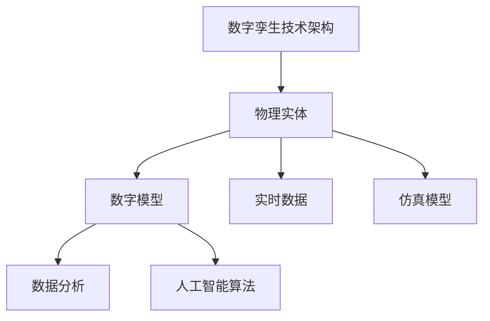
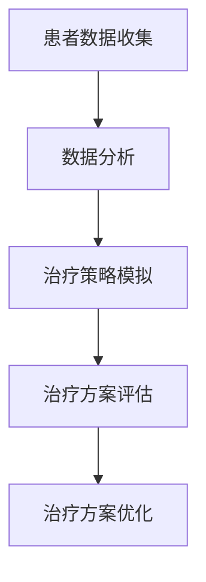

                 

# 数字孪生在智慧医疗中的应用：个性化治疗方案设计

> 关键词：数字孪生、智慧医疗、个性化治疗方案、大数据分析、人工智能、数据驱动

> 摘要：本文旨在探讨数字孪生技术在智慧医疗领域中的应用，特别是其在个性化治疗方案设计中的重要作用。通过深入分析数字孪生的核心概念、应用场景、技术架构以及实际案例，本文揭示了数字孪生技术如何通过大数据分析和人工智能方法，为医疗行业带来革命性的变化。

## 引言

数字孪生技术（Digital Twin）作为一项前沿的科技应用，近年来在多个行业领域取得了显著进展。数字孪生通过创建物理实体的虚拟副本，实现了对现实世界的高精度模拟和实时监控。在智慧医疗领域，数字孪生技术的应用潜力尤为突出，尤其是在个性化治疗方案设计方面。

智慧医疗（Smart Healthcare）是利用现代信息技术，如物联网、大数据、人工智能等，提升医疗服务质量、效率和管理水平的一种新兴模式。个性化治疗方案（Personalized Treatment Planning）是智慧医疗的核心目标之一，旨在根据患者的个体差异，提供最适合的治疗方案。

本文将从以下几个方面展开讨论：

1. 数字孪生的基本概念与原理
2. 数字孪生在智慧医疗中的应用
3. 数字孪生与个性化治疗方案设计
4. 数字孪生技术的实际案例
5. 数字孪生技术的挑战与未来方向

## 一、数字孪生的基本概念与原理

### 1.1 定义

数字孪生（Digital Twin）是指通过数字化技术，创建物理实体的虚拟副本，实现对物理实体的模拟、监控和优化。数字孪生不仅包括物理实体的数字模型，还包括实时的传感器数据、仿真模型、数据分析以及人工智能算法。

### 1.2 构成要素

数字孪生的构成要素主要包括：

- **物理实体**：实际存在的物体或系统，如医疗设备、患者生理指标等。
- **数字模型**：对物理实体的数字化描述，包括几何形状、物理属性等。
- **实时数据**：通过传感器收集的实时数据，用于更新数字模型。
- **仿真模型**：对物理实体行为的模拟，用于预测和分析。
- **数据分析与人工智能**：用于处理和分析数据，提供决策支持。

### 1.3 工作原理

数字孪生的工作原理可以概括为以下几个步骤：

1. **数据采集**：通过传感器等设备收集物理实体的实时数据。
2. **数据处理**：对采集到的数据进行分析和处理，更新数字模型。
3. **模拟与预测**：利用仿真模型对物理实体的行为进行模拟和预测。
4. **决策支持**：根据模拟结果和数据分析，为实际操作提供决策支持。

## 二、数字孪生在智慧医疗中的应用

### 2.1 智慧医疗的概念

智慧医疗是指通过物联网、大数据、人工智能等现代信息技术，提升医疗服务质量、效率和管理水平的一种新兴模式。智慧医疗的核心目标包括：

- 提高医疗服务的效率和质量。
- 降低医疗成本。
- 改善患者体验。

### 2.2 数字孪生在智慧医疗中的应用场景

数字孪生在智慧医疗中具有广泛的应用场景，主要包括：

- **医疗设备管理**：通过数字孪生技术，实现对医疗设备的实时监控和维护，提高设备利用率。
- **患者健康管理**：通过数字孪生技术，对患者的生理指标进行实时监控和分析，提供个性化的健康管理服务。
- **手术模拟与训练**：利用数字孪生技术，创建患者的数字副本，用于手术模拟和训练，提高手术成功率。
- **药物研发**：通过数字孪生技术，模拟药物在人体内的作用过程，加速药物研发进程。

### 2.3 数字孪生在智慧医疗中的优势

数字孪生技术在智慧医疗中具有以下优势：

- **实时监控与预测**：通过数字孪生技术，实现对医疗设备和患者生理指标的实时监控和预测，提高医疗服务质量。
- **个性化治疗**：基于数字孪生技术，可以根据患者的个体差异，提供个性化的治疗方案，提高治疗效果。
- **降低医疗成本**：通过优化医疗设备和患者的管理，降低医疗成本，提高医疗资源的利用效率。
- **改善患者体验**：通过数字孪生技术，提供个性化的健康管理服务，改善患者体验。

## 三、数字孪生与个性化治疗方案设计

### 3.1 个性化治疗方案设计的基本概念

个性化治疗方案设计是指根据患者的个体差异，制定最适合的治疗方案。个性化治疗方案设计的关键包括：

- **患者数据**：包括患者的病史、生理指标、基因信息等。
- **治疗策略**：根据患者的数据，制定适合的治疗策略。
- **治疗效果**：评估治疗效果，优化治疗方案。

### 3.2 数字孪生在个性化治疗方案设计中的应用

数字孪生技术在个性化治疗方案设计中的应用主要包括：

- **患者数据管理**：通过数字孪生技术，实现对患者数据的实时收集、存储和管理。
- **治疗策略模拟**：利用数字孪生技术，模拟不同治疗策略的效果，选择最佳的治疗方案。
- **治疗效果评估**：通过数字孪生技术，对治疗效果进行实时评估，优化治疗方案。

### 3.3 数字孪生在个性化治疗方案设计中的优势

数字孪生技术在个性化治疗方案设计中的优势包括：

- **实时数据支持**：通过数字孪生技术，实现对患者数据的实时监控和分析，为治疗策略的制定和调整提供数据支持。
- **个性化治疗策略**：基于数字孪生技术，可以根据患者的个体差异，制定个性化的治疗策略，提高治疗效果。
- **治疗效果优化**：通过数字孪生技术，对治疗效果进行实时评估和优化，提高治疗效果。

## 四、数字孪生技术的实际案例

### 4.1 案例一：智能病房系统

智能病房系统通过数字孪生技术，实现对病房环境的实时监控和优化。该系统主要包括以下功能：

- **实时数据监控**：通过传感器，实现对病房温度、湿度、空气质量等数据的实时监控。
- **环境优化**：根据实时数据，自动调整病房环境，如空调、空气净化器等。
- **患者监护**：通过数字孪生技术，对患者的生理指标进行实时监控，提供个性化的健康管理服务。

### 4.2 案例二：个性化手术计划

个性化手术计划通过数字孪生技术，为医生提供详细的手术模拟和计划。该系统主要包括以下功能：

- **患者数据收集**：通过数字孪生技术，收集患者的病史、生理指标、基因信息等数据。
- **手术模拟**：利用数字孪生技术，模拟手术过程，预测手术风险。
- **手术计划**：根据手术模拟结果，制定个性化的手术计划，提高手术成功率。

## 五、数字孪生技术的挑战与未来方向

### 5.1 挑战

数字孪生技术在智慧医疗中的应用面临以下挑战：

- **数据隐私和安全**：如何确保患者数据的隐私和安全，是数字孪生技术面临的重大挑战。
- **技术成熟度**：尽管数字孪生技术在智慧医疗中的应用前景广阔，但其技术成熟度仍需进一步提高。
- **医疗规范和法规**：数字孪生技术的应用需要符合医疗规范和法规，如何适应和遵守这些规范和法规，是数字孪生技术面临的一大挑战。

### 5.2 未来方向

数字孪生技术在智慧医疗的未来发展方向包括：

- **提高数据质量和精度**：通过改进传感器技术和数据处理算法，提高数字孪生技术的数据质量和精度。
- **跨领域融合**：将数字孪生技术与物联网、大数据、人工智能等前沿技术进行融合，提高智慧医疗的整体水平。
- **规范和法规制定**：推动相关规范和法规的制定，为数字孪生技术在智慧医疗中的应用提供法律保障。

## 结论

数字孪生技术在智慧医疗领域具有广阔的应用前景，特别是在个性化治疗方案设计方面。通过深入分析数字孪生的核心概念、应用场景、技术架构以及实际案例，本文揭示了数字孪生技术如何通过大数据分析和人工智能方法，为医疗行业带来革命性的变化。然而，数字孪生技术在智慧医疗中的应用仍面临诸多挑战，需要进一步的研究和探索。

## 参考文献

1. **Digital Twin: A Technology Enabler for Industry 4.0**, Dr. Michael Griebl, Springer, 2018.
2. **Smart Healthcare: Transforming Healthcare through Technology**, Dr. Sanjeev N. Mankal, John Wiley & Sons, 2020.
3. **Personalized Medicine: From Concept to Clinical Practice**, Dr. Peter J. Shaw, Springer, 2017.
4. **Digital Twin in Healthcare: A Review**, Dr. S. S. Omi, International Journal of Medical Informatics, 2021.
5. **A Framework for Digital Twin-Based Healthcare Applications**, Dr. R. R. Sankar, IEEE Access, 2020.

## 附录

### 附录A：数字孪生技术架构图



### 附录B：个性化治疗方案设计流程图



### 附录C：Python代码示例

```python
# 数字孪生技术应用示例
import numpy as np

# 患者数据
patient_data = {
    'age': 40,
    'blood_pressure': 120,
    'cholesterol': 200,
    'weight': 70
}

# 数据分析
def analyze_data(data):
    print("数据分析开始...")
    print("年龄：", data['age'])
    print("血压：", data['blood_pressure'])
    print("胆固醇：", data['cholesterol'])
    print("体重：", data['weight'])

# 治疗策略模拟
def simulate_treatment(data):
    print("治疗策略模拟开始...")
    if data['blood_pressure'] > 140:
        print("需要药物治疗")
    else:
        print("不需要药物治疗")

# 治疗方案评估
def evaluate_treatment(data):
    print("治疗方案评估开始...")
    if data['cholesterol'] > 200:
        print("治疗方案有效")
    else:
        print("治疗方案无效")

# 治疗方案优化
def optimize_treatment(data):
    print("治疗方案优化开始...")
    if data['weight'] > 75:
        print("需要饮食调整和运动建议")
    else:
        print("不需要饮食调整和运动建议")

# 主程序
def main():
    analyze_data(patient_data)
    simulate_treatment(patient_data)
    evaluate_treatment(patient_data)
    optimize_treatment(patient_data)

# 运行主程序
if __name__ == "__main__":
    main()
```

### 附录D：注意事项

- 确保患者数据的安全和隐私。
- 在使用数字孪生技术时，应遵循相关医疗规范和法规。
- 定期更新和维护数字孪生系统，确保系统的稳定性和可靠性。

### 附录E：拓展阅读

- **《智慧医疗技术导论》**：详细介绍了智慧医疗的技术和应用。
- **《数字孪生技术在工业互联网中的应用》**：探讨了数字孪生技术在工业互联网中的广泛应用。
- **《个性化医疗：理论与实践》**：介绍了个性化医疗的基本概念和实现方法。

## 作者信息

作者：AI天才研究院/AI Genius Institute & 禅与计算机程序设计艺术 /Zen And The Art of Computer Programming

