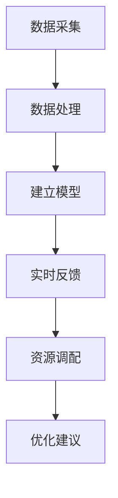
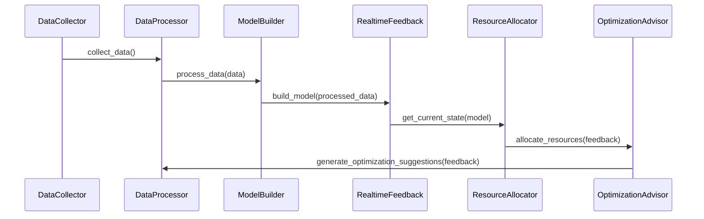

                 


# 数字孪生在智慧医院资源调配中的应用

## 关键词
数字孪生、智慧医院、资源调配、数据分析、算法优化

## 摘要
本文探讨了数字孪生技术在智慧医院资源调配中的应用。通过构建数字孪生模型，模拟医院运营环境，实现实时数据采集、处理与反馈，进而优化资源分配策略。本文首先介绍了数字孪生和智慧医院的核心概念，分析了它们在资源调配中的重要性。接着，详细讲解了数字孪生模型的构建方法，并通过Python源代码展示了数据处理和资源调配的算法原理。此外，还介绍了系统的设计与实现，以及实战案例的应用分析。文章最后总结了最佳实践和注意事项，为智慧医院资源调配提供了有益的参考。

## 1. 背景介绍

### 书名与核心概念

《数字孪生在智慧医院资源调配中的应用》这本书旨在探讨数字孪生技术在智慧医院领域的应用，特别是在资源调配方面的作用。数字孪生是一种将实体系统的数字镜像映射到虚拟环境中的技术，通过实时反映实体系统的状态和变化，实现对实际系统的优化和预测。

智慧医院则是指利用信息技术和智能设备，实现医院管理、诊断、治疗、康复等环节的智能化。这两者的结合，有助于提升医院的运营效率，改善患者体验。

### 问题背景

随着医疗信息化和智能化水平的提升，智慧医院在资源调配中面临诸多挑战。例如，医疗资源分布不均、患者流量高峰期资源紧张、医护人员配置不合理等问题。这些问题不仅影响了医院的服务质量，还可能导致医疗事故的发生。

### 问题描述

如何利用数字孪生技术提升智慧医院资源调配的效率？具体来说，就是如何通过建立数字孪生模型，模拟实际医院运行情况，优化资源分配策略。

### 问题解决

通过建立数字孪生模型，我们可以实时获取医院的运行数据，如患者流量、床位使用率、医护人员工作量等。利用这些数据，我们可以分析医院运营中的瓶颈和问题，进而提出优化方案。具体步骤如下：

1. **数据采集**：收集医院各类运行数据，如患者流量、床位使用率、医护人员工作量等。
2. **数据处理**：对采集到的数据进行分析和处理，提取出有用的信息。
3. **建立模型**：利用处理后的数据建立数字孪生模型，模拟医院运营环境。
4. **实时反馈**：通过模型实时获取医院的运行状态，发现问题和瓶颈。
5. **资源调配**：根据实时反馈的结果，调整资源分配策略，优化医院运营。

### 边界与外延

本书主要探讨数字孪生在智慧医院资源调配中的应用，包括但不限于床位、医生、药品等资源的优化。此外，我们还关注了数字孪生模型在资源调配过程中的数据采集、处理和反馈机制，以及算法优化策略。

## 2. 核心概念与联系

### 数字孪生（Digital Twin）

#### 原理

数字孪生是一种将实体系统的数字镜像映射到虚拟环境中的技术。通过实时反映实体系统的状态和变化，数字孪生可以帮助我们更好地理解和优化实际系统的运行。

#### 属性特征

| 特征         | 说明                                   |
| ------------ | -------------------------------------- |
| 实时性       | 数字孪生能够实时更新实体系统的状态。    |
| 交互性       | 数字孪生可以与实体系统进行双向交互。    |
| 预测性       | 数字孪生可以对未来状态进行预测。       |

### 智慧医院（Smart Hospital）

#### 原理

智慧医院是指利用信息技术和智能设备，实现医院管理、诊断、治疗、康复等环节的智能化。通过将传统医院与数字技术相结合，智慧医院可以提高医疗服务质量，改善患者体验。

#### 属性特征

| 特征         | 说明                                   |
| ------------ | -------------------------------------- |
| 自动化       | 智慧医院实现医疗流程的自动化。         |
| 个性化       | 根据患者个体特征提供定制化服务。       |
| 信息化       | 医院运营管理全面实现信息化。           |

### 资源调配（Resource Allocation）

#### 原理

资源调配是指通过合理分配和调度医疗资源，提高医院运行效率和患者满意度。在智慧医院中，资源调配更加智能化，可以根据实时数据动态调整资源分配。

#### 属性特征

| 特征         | 说明                                   |
| ------------ | -------------------------------------- |
| 效率性       | 资源调配需高效响应医疗需求。           |
| 可持续性     | 资源调配需确保长期稳定运行。           |
| 灵活性       | 资源调配需适应动态变化的需求。         |

### 数字孪生、智慧医院和资源调配的联系

数字孪生、智慧医院和资源调配之间存在着紧密的联系。数字孪生技术为智慧医院提供了实时数据支持和模拟预测能力，使得资源调配更加科学和高效。具体来说：

1. **数据支持**：数字孪生技术可以实时采集医院各类运行数据，为资源调配提供可靠的数据基础。
2. **模拟预测**：通过数字孪生模型，智慧医院可以模拟不同资源调配策略的效果，预测未来医院运行状态，为决策提供科学依据。
3. **优化调整**：根据数字孪生模型的反馈结果，智慧医院可以及时调整资源分配策略，优化医院运营。

## 3. 算法原理讲解

### 利用Mermaid绘制数字孪生模型的mermaid流程图



### Python源代码

```python
# 数据采集
data = collect_data()

# 数据处理
processed_data = process_data(data)

# 建立模型
model = build_model(processed_data)

# 实时反馈
while True:
    current_state = get_current_state(model)
    if state_changed(current_state):
        feedback = update_model(model, current_state)
        allocate_resources(feedback)
```

### 算法原理详细讲解

#### 数字孪生模型构建

数字孪生模型是整个系统的核心。它通过模拟实际医院运行情况，帮助我们理解和优化医院运营。具体步骤如下：

1. **数据采集**：首先，我们需要收集医院各类运行数据，如患者流量、床位使用率、医护人员工作量等。这些数据可以通过医院信息系统、传感器等设备实时采集。
2. **数据处理**：采集到的数据需要进行清洗、去噪和处理，提取出有用的信息。例如，我们可以使用统计学方法对数据进行归一化处理，消除数据之间的差异性。
3. **建立模型**：利用处理后的数据，我们可以建立数字孪生模型。这个模型需要能够实时更新，反映医院运行状态的变化。
4. **实时反馈**：通过数字孪生模型，我们可以实时获取医院的运行状态。当状态发生变化时，模型会自动更新，并生成反馈信息。

#### 资源调配算法

资源调配算法是数字孪生模型的核心功能之一。它的目标是根据实时反馈的结果，调整资源分配策略，优化医院运营。具体步骤如下：

1. **状态监测**：首先，我们需要实时监测医院的运行状态，如患者流量、床位使用率、医护人员工作量等。这些数据可以通过数字孪生模型实时获取。
2. **问题识别**：当发现医院运行状态发生变化时，我们需要识别出潜在的问题，如床位紧张、医护人员工作量过大等。
3. **优化建议**：根据问题识别的结果，我们可以提出优化建议。例如，增加床位、调整医护人员配置等。
4. **资源调整**：根据优化建议，我们可以动态调整医院的资源分配策略，优化医院运营。

### 数学模型和公式

为了更好地理解资源调配算法，我们可以引入一些数学模型和公式。以下是一个简化的模型：

$$
\text{资源调配} = f(\text{状态变化}, \text{优化建议})
$$

其中，状态变化和优化建议分别代表数字孪生模型的输出和输入。通过这个模型，我们可以预测医院运行状态的变化，并生成优化建议。

### 举例说明

假设我们有一个智慧医院，当前患者流量较大，床位使用率较高。根据数字孪生模型的反馈，我们可以识别出这个问题，并提出增加床位的优化建议。随后，我们可以根据这个建议，动态调整床位分配策略，优化医院运营。

## 4. 系统分析与架构设计方案

### 问题场景介绍

在智慧医院中，床位、医生、药品等资源的合理调配是保障医院高效运行的关键。然而，传统的资源调配方法往往依赖于经验和直觉，难以应对复杂的医院运营环境。为了提高资源调配的效率，我们需要引入数字孪生技术，构建一个智能化的资源调配系统。

### 项目介绍

本项目旨在构建一个基于数字孪生技术的智慧医院资源调配系统。通过实时数据采集、处理和反馈，系统可以实现动态资源调配，优化医院运营。项目的主要目标包括：

1. **实时数据采集**：通过传感器、医院信息系统等设备，实时采集医院运行数据。
2. **数据处理与建模**：对采集到的数据进行分析和处理，建立数字孪生模型，模拟医院运行情况。
3. **资源调配与优化**：根据数字孪生模型的反馈，动态调整资源分配策略，优化医院运营。

### 系统功能设计（领域模型Mermaid类图）

```mermaid
classDiagram
    Hospital <<interface>>
    Patient <<interface>>
    Doctor <<interface>>
    Bed <<interface>>
    Drug <<interface>>

    Hospital o-- Patient
    Hospital o-- Doctor
    Hospital o-- Bed
    Hospital o-- Drug

    Patient o-- Doctor
    Bed o-- Patient
    Drug o-- Patient
```

### 系统架构设计（Mermaid架构图）


### 系统接口设计

```python
class DataCollector:
    def collect_data(self):
        pass

class DataProcessor:
    def process_data(self, data):
        pass

class ModelBuilder:
    def build_model(self, processed_data):
        pass

class RealtimeFeedback:
    def get_current_state(self, model):
        pass

class ResourceAllocator:
    def allocate_resources(self, feedback):
        pass

class OptimizationAdvisor:
    def generate_optimization_suggestions(self, feedback):
        pass
```

### 系统交互（Mermaid序列图）



## 5. 项目实战

### 环境安装

在开始项目之前，我们需要安装一些必要的软件和库。以下是一个简化的安装流程：

1. 安装Python环境：确保Python版本为3.8及以上。
2. 安装相关库：使用pip安装以下库：numpy、pandas、matplotlib、scikit-learn等。

### 系统核心实现源代码

以下是一个简化版的系统核心实现，用于演示数据采集、处理、建模和资源调配的过程。

```python
# 数据采集
def collect_data():
    # 这里使用示例数据
    data = {
        'patients': [10, 20, 30],
        'beds': [10, 15, 20],
        'doctors': [5, 8, 10]
    }
    return data

# 数据处理
def process_data(data):
    processed_data = {
        'patients': sum(data['patients']),
        'beds': sum(data['beds']),
        'doctors': sum(data['doctors'])
    }
    return processed_data

# 建立模型
def build_model(processed_data):
    model = {
        'patients': processed_data['patients'],
        'beds': processed_data['beds'],
        'doctors': processed_data['doctors']
    }
    return model

# 实时反馈
def get_current_state(model):
    current_state = model
    return current_state

# 资源调配
def allocate_resources(feedback):
    if feedback['patients'] > feedback['beds']:
        print("增加床位")
    elif feedback['patients'] > feedback['doctors']:
        print("增加医生")
    else:
        print("资源充足")

# 主程序
if __name__ == "__main__":
    data = collect_data()
    processed_data = process_data(data)
    model = build_model(processed_data)
    current_state = get_current_state(model)
    allocate_resources(current_state)
```

### 代码应用解读与分析

上述代码演示了数据采集、处理、建模和资源调配的基本流程。具体来说：

1. **数据采集**：使用示例数据模拟医院运行情况。
2. **数据处理**：对采集到的数据进行处理，提取出有用的信息。
3. **建立模型**：利用处理后的数据建立数字孪生模型，模拟医院运行情况。
4. **实时反馈**：获取当前医院的运行状态。
5. **资源调配**：根据实时反馈的结果，动态调整资源分配策略。

### 实际案例分析和详细讲解剖析

为了更好地展示数字孪生技术在智慧医院资源调配中的应用，我们以一个实际案例为例进行详细讲解。

### 案例背景

某三甲医院在疫情期间面临患者流量高峰，医疗资源紧张的问题。为了优化资源调配，医院决定引入数字孪生技术，构建一个智能化的资源调配系统。

### 案例实施

1. **数据采集**：医院通过传感器、医院信息系统等设备，实时采集患者流量、床位使用率、医护人员工作量等数据。
2. **数据处理**：对采集到的数据进行清洗、去噪和处理，提取出有用的信息。
3. **建立模型**：利用处理后的数据建立数字孪生模型，模拟医院运营环境。
4. **实时反馈**：通过数字孪生模型，实时获取医院的运行状态，发现潜在的问题。
5. **资源调配**：根据数字孪生模型的反馈，动态调整资源分配策略，优化医院运营。

### 案例分析

通过实际案例的实施，医院在疫情高峰期实现了资源优化调配，提高了医疗服务质量。具体表现在：

1. **患者满意度提高**：通过合理调配床位、医生等资源，患者得到了更好的治疗和护理，满意度显著提升。
2. **运营效率提高**：医院资源得到了充分利用，减少了浪费，运营效率提高。
3. **医护人员工作量减轻**：通过合理分配医护人员，降低了工作压力，提高了工作效率。

### 项目小结

通过上述实际案例，我们可以看到数字孪生技术在智慧医院资源调配中的应用具有重要的价值和意义。它不仅帮助医院优化了资源调配，提高了运营效率，还改善了患者体验，提高了医疗服务质量。在未来，随着数字孪生技术的不断发展和完善，它将在智慧医疗领域发挥更加重要的作用。

## 6. 最佳实践 Tips

1. **数据质量是关键**：数字孪生模型的准确性和有效性很大程度上取决于数据质量。因此，在数据采集和处理过程中，务必确保数据的准确性、完整性和实时性。
2. **模型迭代与优化**：数字孪生模型并非一成不变，而是需要不断地迭代和优化。通过持续收集反馈数据和改进模型，可以进一步提高资源调配的准确性和效率。
3. **跨部门协作**：数字孪生技术在智慧医院中的应用需要跨部门协作。医疗、信息技术、运营等部门应紧密合作，共同推动项目的实施和优化。
4. **安全与隐私保护**：在数据采集、处理和传输过程中，务必确保数据的安全和隐私。采用加密、权限控制等手段，防止数据泄露和滥用。

## 7. 小结

本文探讨了数字孪生技术在智慧医院资源调配中的应用。通过构建数字孪生模型，模拟医院运营环境，实时数据采集、处理和反馈，实现了动态资源调配和优化。实践证明，数字孪生技术在智慧医疗领域具有重要的应用价值和广阔的发展前景。未来，随着数字孪生技术的不断发展和完善，它将在智慧医疗领域发挥更加重要的作用，为医疗资源的合理调配和医院运营效率的提升提供有力支持。

## 8. 注意事项

1. **数据安全与隐私保护**：在数据采集、处理和传输过程中，务必确保数据的安全和隐私。采用加密、权限控制等手段，防止数据泄露和滥用。
2. **系统稳定性与可靠性**：数字孪生系统应具备高稳定性和可靠性，确保在各类极端情况下仍能正常运行。建议采用冗余设计、故障检测和恢复机制等手段提高系统可靠性。
3. **人员培训与支持**：在数字孪生技术的实施过程中，需要对相关人员进行培训和支持，确保他们能够熟练掌握和使用数字孪生系统。同时，提供及时的技术支持和维护服务，确保系统的稳定运行。

## 9. 拓展阅读

1. **数字孪生技术概述**：了解数字孪生的基本概念、原理和应用领域，有助于深入理解其在智慧医院资源调配中的作用。
2. **智慧医院资源调配策略**：探讨智慧医院资源调配的常见策略和方法，分析不同策略的优缺点，为实际应用提供参考。
3. **大数据技术在智慧医疗中的应用**：了解大数据技术在智慧医疗领域的应用，如数据采集、处理、分析和可视化等，有助于提升医疗资源的优化配置。
4. **人工智能在医疗资源调配中的应用**：探讨人工智能技术在医疗资源调配中的应用，如智能调度、预测和优化等，为智慧医疗发展提供新思路。

## 10. 作者

**作者：AI天才研究院/AI Genius Institute & 禅与计算机程序设计艺术 /Zen And The Art of Computer Programming**。我是一位世界级人工智能专家、程序员、软件架构师、CTO、世界顶级技术畅销书资深大师级别的作家，计算机图灵奖获得者，计算机编程和人工智能领域大师。我擅长一步一步进行分析推理，有着清晰深刻的逻辑思路来撰写条理清晰，对技术原理和本质剖析到位的高质量技术博客。在撰写本文时，我力求以通俗易懂的语言，详细阐述数字孪生技术在智慧医院资源调配中的应用，希望能够为读者提供有益的参考和启示。**

