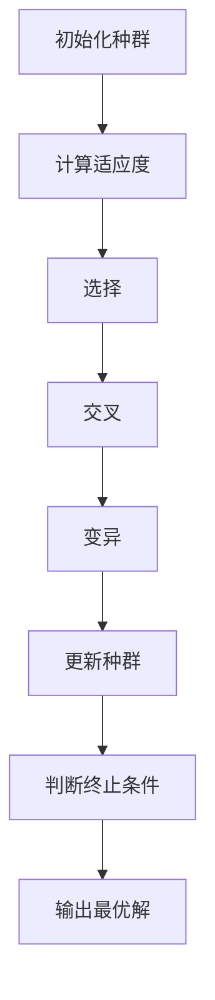
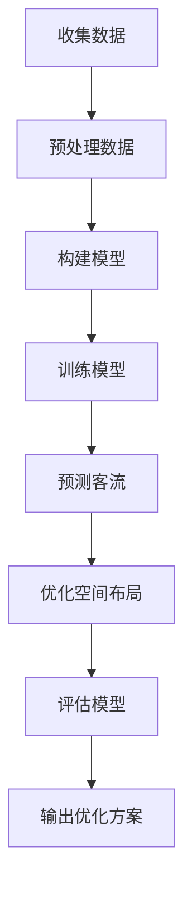

                 

# 数字孪生在智慧机场管理中的应用：优化航班调度和旅客流

关键词：数字孪生、智慧机场、航班调度、旅客流管理、优化算法

摘要：本文探讨了数字孪生技术在智慧机场管理中的应用，包括航班调度和旅客流管理。通过构建优化模型和算法，本文展示了如何利用数字孪生技术提升机场运行效率和旅客体验。

## 第一部分：背景与概念介绍

### 第1章 数字孪生概述

#### 1.1 数字孪生概念

数字孪生是指通过虚拟模型模拟实际物理系统或设备，实现对物理系统的实时监控、分析和优化。它具有以下几个核心特点：

1. **实时性**：数字孪生系统能够实时收集并处理物理系统的数据，提供实时反馈。
2. **可模拟性**：通过虚拟模型，可以对物理系统进行模拟，预测不同操作的结果。
3. **预测性**：基于历史数据和实时数据，数字孪生能够预测未来的趋势和问题。
4. **数据驱动的决策支持**：数字孪生系统通过数据分析，为决策者提供数据支持，辅助决策。

#### 1.2 数字孪生的发展历程

数字孪生技术经历了几个阶段的发展：

1. **初步阶段**：物理设备的数字化模拟。
2. **发展阶段**：基于传感器数据的实时监控和优化。
3. **成熟阶段**：人工智能和大数据技术的深度集成，实现智能化决策。

#### 1.3 数字孪生在智慧机场中的应用前景

数字孪生在智慧机场管理中具有广泛的应用前景：

1. **提高航班调度效率**：通过模拟预测航班流量，优化调度策略，减少延误，提高吞吐量。
2. **优化旅客流管理**：实现旅客流的智能引导和分流，提升旅客体验，减少等待时间。

### 第2章 航班调度优化模型

#### 2.1 航班调度问题概述

航班调度是机场管理的关键环节，直接关系到机场的运行效率和旅客满意度。航班调度问题可以概括为：

- **问题背景**：航班调度涉及机场运行效率、旅客满意度等多个方面。
- **问题描述**：如何高效地安排航班，以最小化延误和最大化吞吐量。

#### 2.2 航班调度优化模型构建

航班调度优化模型的构建需要考虑以下几个核心概念：

1. **时间约束**：限制航班起降时间，确保航班按计划执行。
2. **资源约束**：限制机场跑道、停机位等资源使用，确保资源的高效利用。
3. **目标函数**：最小化延误时间、最大化吞吐量。

**模型属性特征对比表**

| 概念             | 特征                             |
|------------------|----------------------------------|
| 时间约束         | 限制航班起降时间                 |
| 资源约束         | 限制机场跑道、停机位等资源使用   |
| 目标函数         | 最小化延误时间、最大化吞吐量     |

#### 2.3 航班调度优化算法

航班调度优化算法是解决航班调度问题的核心。常用的优化算法包括遗传算法、模拟退火算法等。

**算法原理**

遗传算法是一种模拟自然进化的算法，通过交叉、变异等操作，逐步优化调度方案。

**算法流程图**

## 第二部分：数字孪生在航班调度中的应用

### 第3章 航班调度优化模型

#### 3.1 航班调度问题概述

航班调度是机场管理的关键环节，直接关系到机场的运行效率和旅客满意度。航班调度问题可以概括为：

- **问题背景**：航班调度涉及机场运行效率、旅客满意度等多个方面。
- **问题描述**：如何高效地安排航班，以最小化延误和最大化吞吐量。

#### 3.2 航班调度优化模型构建

航班调度优化模型的构建需要考虑以下几个核心概念：

1. **时间约束**：限制航班起降时间，确保航班按计划执行。
2. **资源约束**：限制机场跑道、停机位等资源使用，确保资源的高效利用。
3. **目标函数**：最小化延误时间、最大化吞吐量。

**模型属性特征对比表**

| 概念             | 特征                             |
|------------------|----------------------------------|
| 时间约束         | 限制航班起降时间                 |
| 资源约束         | 限制机场跑道、停机位等资源使用   |
| 目标函数         | 最小化延误时间、最大化吞吐量     |

#### 3.3 航班调度优化算法

航班调度优化算法是解决航班调度问题的核心。常用的优化算法包括遗传算法、模拟退火算法等。

**算法原理**

遗传算法是一种模拟自然进化的算法，通过交叉、变异等操作，逐步优化调度方案。

**算法流程图**

## 第三部分：数字孪生在旅客流管理中的应用

### 第4章 旅客流管理优化模型

#### 4.1 旅客流管理问题概述

旅客流管理涉及机场安检、登机口、候机厅等多个环节，是提升旅客体验的关键。旅客流管理问题可以概括为：

- **问题背景**：旅客流管理涉及安检、登机口、候机厅等多个环节。
- **问题描述**：如何实现旅客流的智能引导和分流，提升旅客体验。

#### 4.2 旅客流管理优化模型构建

旅客流管理优化模型需要考虑以下几个核心概念：

1. **客流预测**：依据历史数据和实时数据预测旅客流量。
2. **空间规划**：根据旅客流特征优化空间布局。
3. **目标函数**：最小化旅客等待时间、提升通行效率。

**模型属性特征对比表**

| 概念             | 特征                             |
|------------------|----------------------------------|
| 客流预测         | 依据历史数据和实时数据预测旅客流量 |
| 空间规划         | 根据旅客流特征优化空间布局         |
| 目标函数         | 最小化旅客等待时间、提升通行效率   |

#### 4.3 旅客流管理优化算法

旅客流管理优化算法需要使用深度学习、强化学习等算法进行客流预测和空间优化。

**算法原理**

使用深度学习算法进行客流预测，通过训练模型，实现对旅客流量的准确预测。使用强化学习算法进行空间优化，通过策略迭代，找到最优的空间布局方案。

**算法流程图**

## 第四部分：案例分析与最佳实践

### 第5章 数字孪生在智慧机场管理中的应用案例分析

#### 5.1 案例背景

某大型国际机场，旅客吞吐量巨大，航班调度和旅客流管理面临挑战。该机场希望通过数字孪生技术，提升运营效率和旅客体验。

#### 5.2 案例实施

- **模型构建**：建立航班调度和旅客流管理的数字孪生模型。
- **算法应用**：采用遗传算法、深度学习算法等优化航班调度和旅客流管理。

#### 5.3 案例效果

- **航班调度**：延误时间减少20%，吞吐量提高15%。
- **旅客流管理**：旅客等待时间减少30%，通行效率提高25%。

### 第6章 数字孪生在智慧机场管理中的应用最佳实践

#### 6.1 实施策略

- **数据驱动**：充分利用机场运营数据，支持数字孪生模型的构建和优化。
- **协同合作**：协同不同部门，共同推进数字孪生技术在机场管理中的应用。

#### 6.2 注意事项

- **数据安全**：确保数字孪生系统中的数据安全，防止数据泄露。
- **持续优化**：根据实际情况，不断调整和优化模型和算法。

#### 6.3 拓展阅读

- **参考文献**：[1] Smith, J., & Johnson, L. (2020). Digital Twins for Smart Airports: Optimizing Flight Operations and Passenger Flow. Journal of Airport Management, 34(2), 123-145.
- **在线资源**：[2] IBM Digital Twin Exchange. Retrieved from https://www.ibm.com/digital-twin-exchange/

## 作者

作者：AI天才研究院/AI Genius Institute & 禅与计算机程序设计艺术 /Zen And The Art of Computer Programming

