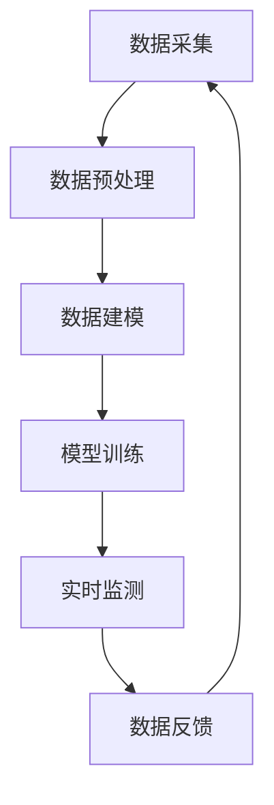
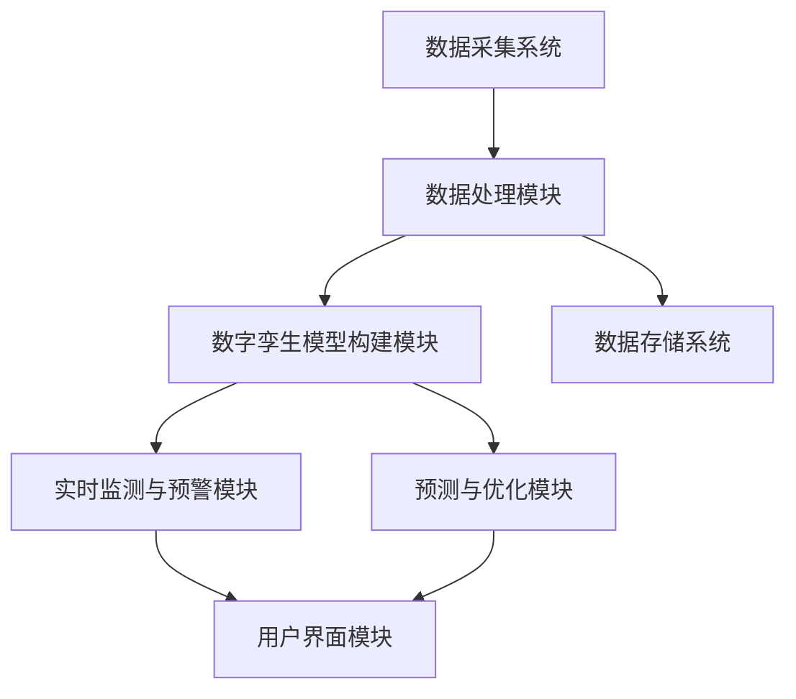

                 

### 引言

随着全球贸易的迅猛发展，港口作为国际贸易的枢纽，其运营效率和服务水平直接影响到整个物流链条的效率。传统的港口管理方式存在诸多弊端，如信息孤岛、缺乏实时监控和预测能力、依赖人工操作等，这些都限制了港口的运营效率。在这种背景下，智慧港口的概念应运而生，旨在通过信息技术和智能设备的集成应用，实现港口的智能化、自动化和高效化管理。

智慧港口的核心在于数据驱动的决策支持系统，其中数字孪生技术（Digital Twin）作为一种新兴的颠覆性技术，在智慧港口管理中展现出巨大的应用潜力。数字孪生是一种通过构建实体系统的数字映射，实现虚拟世界与物理世界交互和同步的技术。简单来说，就是通过数字化手段对港口的各类设施、设备和流程进行精确建模，从而实现对港口运行状态的实时监测、预测和优化。

本文将围绕数字孪生在智慧港口管理中的应用进行深入探讨。我们将从数字孪生的背景介绍开始，详细描述其在智慧港口中的关键作用，并通过具体的案例分析，展示数字孪生技术在提高港口运营效率中的实际效果。

首先，我们将探讨数字孪生的概念，分析其与物理实体之间的联系，并解释数字孪生在智慧港口管理中的具体应用场景。接着，我们将深入讲解数字孪生的算法原理，包括数据采集与建模、数据处理与分析等内容，并通过实际案例进行说明。随后，我们将分析数字孪生在智慧港口管理系统设计与实现中的具体方案，包括系统功能设计、架构设计和接口设计。

在项目的实际操作部分，我们将详细描述数字孪生在港口项目中的安装和配置过程，展示系统核心实现源代码，并对代码进行解读和分析。最后，我们将总结项目的经验教训，提出最佳实践建议，并对未来的发展趋势进行展望。

通过本文的阅读，读者将能够全面了解数字孪生技术的基本概念和应用，掌握其在智慧港口管理中的具体实现方法，为今后的研究和实践提供有价值的参考。

### 问题背景

港口作为全球贸易的重要枢纽，其运营效率直接关系到国际贸易的顺畅和经济发展。然而，随着全球化进程的加速和贸易量的激增，传统港口在管理和运营上面临着诸多挑战。这些挑战主要集中在以下几个方面：

1. **信息孤岛**：传统港口各系统之间缺乏有效整合，数据难以共享和综合利用。例如，船舶调度、货物装卸、设备维护等环节的信息往往分散在不同的系统中，导致决策支持效率低下。

2. **缺乏实时监控**：传统港口管理依赖于人工操作和现场监控，信息获取不及时，无法对突发情况进行快速响应。例如，在货物装卸过程中，若没有实时监控，很难及时发现和解决设备故障或操作失误。

3. **依赖人工操作**：传统港口作业主要依靠人工操作，存在人为错误的风险，同时劳动强度大，效率低。例如，货物搬运过程中，人员操作不当可能导致货物损坏或事故发生。

4. **维护困难**：传统港口设备繁多，维护工作量大，且缺乏有效的预测性维护手段。设备故障往往在发生前难以预测，导致维护工作被动应对，影响港口运营效率。

5. **环境监测不足**：传统港口在环境监测方面存在不足，难以实时掌握港口内的空气质量、水质状况等环境参数，影响港口的可持续发展。

面对这些挑战，传统港口迫切需要引入新的技术手段，实现智慧化管理和运营。数字孪生技术作为一种新兴的颠覆性技术，为智慧港口的构建提供了有力支持。

### 问题描述

数字孪生在智慧港口管理中的应用主要涉及以下几个核心问题：

1. **数据融合与共享**：如何将港口各类系统的数据（如船舶调度、货物装卸、设备维护等）进行有效整合，实现数据的高效共享和综合利用，从而打破信息孤岛，提升决策支持效率。

2. **实时监控与预测**：如何通过数字孪生技术实现对港口运行状态的实时监控，提高对突发事件的响应速度。例如，通过数字孪生模型预测货物装卸过程中可能出现的设备故障，提前进行预防性维护。

3. **自动化与智能化**：如何利用数字孪生技术提高港口作业的自动化和智能化水平，减少人工操作，降低人为错误的风险。例如，通过数字孪生模型优化货物搬运路径，提高装卸效率。

4. **预测性维护**：如何通过数字孪生技术实现对港口设备的预测性维护，减少设备故障对港口运营的影响。例如，通过数字孪生模型分析设备运行状态数据，提前发现潜在故障，进行预防性维护。

5. **环境监测与改善**：如何利用数字孪生技术实时监测港口内的空气质量、水质状况等环境参数，制定针对性的环境改善措施，实现港口的可持续发展。

### 问题解决

数字孪生技术在智慧港口管理中的问题解决主要依赖于以下几个方面：

1. **构建数字孪生模型**：通过收集港口各类系统的数据，利用大数据和人工智能技术，构建港口的数字孪生模型。该模型能够实现对港口运行状态的实时监测、预测和优化。

2. **数据融合与共享**：利用物联网技术和云计算平台，将港口各类系统的数据进行有效整合，实现数据的实时共享和综合利用。通过数据融合，可以打破信息孤岛，提高决策支持效率。

3. **实时监控与预测**：通过数字孪生模型，实现对港口运行状态的实时监控和预测。例如，通过预测货物装卸过程中可能出现的设备故障，提前进行预防性维护，减少故障对港口运营的影响。

4. **自动化与智能化**：利用数字孪生模型，优化港口作业流程，提高自动化和智能化水平。例如，通过数字孪生模型分析货物搬运路径，优化装卸效率，减少人力操作。

5. **预测性维护**：通过数字孪生模型，分析设备运行状态数据，提前发现潜在故障，进行预测性维护。例如，通过分析传感器数据，预测设备何时可能发生故障，提前安排维护。

6. **环境监测与改善**：利用数字孪生技术，实时监测港口内的空气质量、水质状况等环境参数，根据监测结果，制定针对性的环境改善措施，实现港口的可持续发展。

### 边界与外延

数字孪生在智慧港口管理中的应用具有明确的边界和广泛的外延。

**边界**：
1. **应用范围**：数字孪生主要应用于港口的运营管理，包括船舶调度、货物装卸、设备维护、环境监测等环节。
2. **技术范畴**：数字孪生技术涉及物联网、大数据、云计算、人工智能等领域，但核心在于构建实体系统的数字映射。

**外延**：
1. **扩展应用**：数字孪生技术不仅局限于港口管理，还可以扩展到其他领域，如智慧城市、智能制造、智能交通等。
2. **生态建设**：数字孪生技术的应用需要构建一个生态系统，包括硬件设备、软件系统、数据平台、算法模型等，各方需协同合作，共同推进智慧港口的发展。

### 概念结构与核心要素组成

为了深入理解数字孪生在智慧港口管理中的应用，我们需要从概念结构的角度分析其核心要素组成。以下是数字孪生在智慧港口管理中的基本概念、关键组成部分及其相互关系：

**基本概念**：

1. **数字孪生**：数字孪生是指通过数字化技术，构建物理实体的虚拟映射，实现虚拟世界与物理世界的同步交互。在智慧港口管理中，数字孪生主要用于模拟和预测港口设施的运行状态、物流流程和设备维护等。

2. **智慧港口**：智慧港口是指通过信息技术和智能设备的集成应用，实现对港口运营的智能化、自动化和高效化管理。智慧港口的核心在于数据驱动的决策支持系统，能够实时监测、分析和优化港口的运行状态。

**关键组成部分**：

1. **数据采集与建模**：数据采集是数字孪生的基础，涉及传感器技术、物联网设备等，用于收集港口各类设施和设备的运行数据。建模则是将物理实体转化为数字模型，包括结构建模、行为建模和状态建模等。

2. **数据处理与分析**：数据处理包括数据清洗、存储、管理和分析等环节，通过大数据技术和人工智能算法，对采集到的数据进行处理和分析，提取有价值的信息，为决策提供支持。

3. **数字孪生模型**：数字孪生模型是数字孪生的核心，通过虚拟映射实现对物理实体的精确模拟。模型包括静态模型（描述实体结构和属性）和动态模型（描述实体行为和状态变化）。

4. **实时监控与预测**：实时监控通过数字孪生模型，实现对港口运行状态的实时监测和预测。例如，通过预测设备故障、优化物流路径等，提高港口运营效率。

5. **自动化与智能化**：自动化与智能化是通过数字孪生技术实现港口作业的自动化和智能化。例如，通过自动化设备调度、智能决策支持系统等，减少人工操作，提高效率。

6. **数据共享与协同**：数据共享与协同是数字孪生在智慧港口管理中的重要环节，通过构建数据平台，实现港口各类系统的数据整合和共享，打破信息孤岛，提高决策支持效率。

**相互关系**：

1. **数据驱动**：数据采集与建模是数据驱动的核心，通过构建数字孪生模型，实现对物理实体的精确模拟，为数据处理和分析提供基础。

2. **动态交互**：数字孪生模型与物理实体之间的动态交互是数字孪生的关键特性，通过实时监控和预测，实现对港口运行状态的动态调整和优化。

3. **协同优化**：数据共享与协同是实现数字孪生协同优化的重要手段，通过数据平台实现各类系统的数据整合和共享，为自动化与智能化提供支持。

通过以上分析，我们可以看到，数字孪生在智慧港口管理中的概念结构与核心要素组成是一个相互联系、协同作用的整体，通过数字化技术实现对港口运营的智能化、自动化和高效化管理。

### 数字孪生概念

数字孪生（Digital Twin）是一种先进的技术理念，旨在通过构建物理实体的虚拟映射，实现虚拟世界与物理世界的同步交互和实时反馈。简单来说，数字孪生就是为物理实体创建一个数字副本，通过数据采集、建模和分析，实现对实体的状态监控、预测和优化。

**定义**：

数字孪生（Digital Twin）是指通过数字化手段，将物理实体的所有关键特征、属性和行为在虚拟环境中进行建模和仿真，从而实现虚拟世界与物理世界的交互和同步。数字孪生可以看作是一个动态的、实时的数据驱动的数字模型，能够反映物理实体的实时状态和变化。

**特点**：

1. **实时性**：数字孪生能够实时采集物理实体的数据，实现对实体的实时状态监测和反馈。这种实时性使得数字孪生在应对突发事件和实时优化方面具有显著优势。

2. **精确性**：通过高精度建模，数字孪生能够精确地反映物理实体的结构和行为，为决策提供可靠的数据支持。

3. **可交互性**：数字孪生不仅能够模拟物理实体的状态，还可以与物理实体进行实时交互，通过虚拟环境的仿真和优化，实现对物理实体的动态调整和优化。

4. **可扩展性**：数字孪生系统可以方便地扩展和升级，以适应新的需求和技术发展。

**分类**：

数字孪生根据应用场景和建模方法的不同，可以分为以下几种类型：

1. **物理实体映射型**：这种类型的数字孪生主要通过对物理实体进行精确的数字化建模，实现对实体结构和行为的模拟。例如，在制造业中，通过三维建模技术构建设备的数字孪生，实现对设备运行状态的监测和优化。

2. **数据驱动型**：数据驱动型数字孪生主要通过收集和分析物理实体的运行数据，构建实体的数字模型。这种方法通常应用于无法进行物理建模的场景，如物流系统、交通网络等。

3. **混合型**：混合型数字孪生结合了物理实体映射和数据驱动型数字孪生的优点，通过物理建模和数据分析相结合，实现对物理实体的全面模拟和优化。

**核心组件**：

数字孪生系统通常包括以下几个核心组件：

1. **数据采集**：通过传感器、物联网设备和自动化系统等，实时采集物理实体的运行数据，包括结构数据、行为数据和状态数据等。

2. **数据处理**：对采集到的数据进行分析、清洗和存储，提取有用的信息，为建模和仿真提供数据支持。

3. **数字模型**：基于采集到的数据，构建物理实体的数字模型，包括静态模型（描述实体结构和属性）和动态模型（描述实体行为和状态变化）。

4. **实时监控**：通过数字模型，实现对物理实体的实时状态监测和反馈，提供实时数据支持和决策依据。

5. **仿真与优化**：利用数字孪生模型，对物理实体的运行状态进行仿真和优化，提出改进方案和优化策略。

通过以上对数字孪生概念的详细解析，我们可以看到，数字孪生技术具有实时性、精确性、可交互性和可扩展性等显著特点，其在智慧港口管理中的应用前景广阔。

### 数字孪生与物理实体联系

数字孪生与物理实体之间的联系是数字孪生技术实现的重要基础。通过构建物理实体的数字映射，数字孪生能够实现对物理实体的实时监测、预测和优化。以下是数字孪生与物理实体之间的主要联系：

**1. 数据流**：

数字孪生与物理实体之间的联系主要通过数据流来实现。物理实体的运行数据通过传感器、物联网设备和自动化系统等实时采集，传输到数字孪生系统进行存储和处理。这些数据包括结构数据（如设备尺寸、布局等）、行为数据（如设备运行状态、操作记录等）和状态数据（如设备温度、电压等）。数字孪生系统对这些数据进行处理和分析，构建物理实体的数字模型，实现对物理实体的实时监测和预测。

**2. 状态同步**：

数字孪生与物理实体之间的状态同步是数字孪生技术的核心功能之一。通过实时数据传输和数据处理，数字孪生系统能够准确反映物理实体的当前状态，并实现虚拟世界与物理世界的同步。这种状态同步不仅包括静态状态的同步，还包括动态状态的同步。例如，在港口管理中，数字孪生可以实时同步船舶的位置、速度和装卸状态，为港口调度和运营提供准确的数据支持。

**3. 反馈与控制**：

数字孪生与物理实体之间的反馈与控制机制是数字孪生技术实现自动化和智能化的重要手段。通过数字孪生系统对物理实体的实时监测和预测，可以及时发现异常状态，并提出相应的控制策略。这些控制策略通过反馈机制传输到物理实体，实现对物理实体的动态调整和优化。例如，在港口设备维护中，数字孪生可以预测设备故障，并生成预防性维护计划，通过反馈机制通知维护人员，提前进行维护，避免设备故障对港口运营的影响。

**4. 仿真与优化**：

数字孪生与物理实体之间的仿真与优化功能是数字孪生技术的重要应用之一。通过数字孪生模型，可以实现对物理实体运行过程的仿真和优化。这种仿真和优化不仅可以在虚拟环境中进行，还可以通过实时数据传输和状态同步，对物理实体进行动态调整和优化。例如，在港口物流管理中，数字孪生可以通过仿真和优化，提出最优的货物装卸路径和设备调度策略，提高物流效率。

**5. 协同优化**：

数字孪生与物理实体之间的协同优化是数字孪生技术在复杂系统中应用的重要特性。通过数字孪生技术，可以实现对物理实体和虚拟环境的协同优化，提高整体系统的效率和性能。例如，在智慧港口管理中，数字孪生可以协同优化港口设施、设备和物流流程，实现港口运营的智能化和高效化。

通过以上对数字孪生与物理实体联系的分析，我们可以看到，数字孪生技术通过数据流、状态同步、反馈与控制、仿真与优化和协同优化等功能，实现了与物理实体的紧密联系，为智慧港口管理提供了强大的技术支持。

### 数字孪生在智慧港口管理中的应用

数字孪生技术在智慧港口管理中的应用范围广泛，涵盖了设施管理、物流管理、安全管理等多个方面，通过精准的模拟和预测，提升了港口的运营效率和服务水平。以下是数字孪生在智慧港口管理中的具体应用：

#### **设施管理**

1. **实时监测与维护**：通过数字孪生技术，港口管理者可以实时监测港口设施（如桥吊、龙门吊、堆场设备等）的运行状态。数字孪生模型能够精确模拟设备的工作状态，预测潜在的故障点，提前进行维护，减少设备停机时间，提高设备利用率。

2. **性能优化**：数字孪生通过对设备运行数据的实时分析，可以识别设备的最佳工作状态，优化设备配置，提高设备的运行效率和寿命。例如，通过对桥吊的运行数据进行分析，可以调整其工作参数，使其在最佳状态下运行。

3. **远程诊断与控制**：数字孪生系统可以实现对设备的远程监控和诊断。当设备出现故障时，系统可以自动发送报警信息，并提供具体的故障诊断和建议，帮助维护人员快速定位问题并进行修复。

#### **物流管理**

1. **物流路径优化**：数字孪生技术通过对港口物流数据的实时采集和分析，可以模拟和优化货物的装卸路径。系统可以根据当前港口的实际情况，提供最优的货物装卸顺序和路径，减少货物在港口内部的移动距离，提高装卸效率。

2. **库存管理**：数字孪生可以实时监测港口的库存情况，通过数据分析和预测，优化库存策略，避免库存过剩或短缺，降低仓储成本。

3. **运输调度**：数字孪生系统可以根据实时数据，对船舶、货车等运输工具进行智能调度，优化运输路线和时间，提高运输效率，减少交通拥堵。

#### **安全管理**

1. **安全监测与预警**：数字孪生技术可以实时监测港口的安全状况，包括船舶停靠、货物装卸、人员流动等。通过数据分析和模式识别，系统可以提前发现潜在的安全隐患，并发出预警，及时采取措施，防止事故发生。

2. **应急响应**：在发生安全事故时，数字孪生系统可以快速提供事故现场的实时数据，帮助应急人员了解事故情况，制定科学的应急响应策略，提高应急响应效率。

3. **安全培训与演练**：数字孪生技术可以通过虚拟现实技术，模拟各种安全场景，为港口员工提供安全培训和实践演练，提高员工的安全意识和应对能力。

#### **环境管理**

1. **环境监测**：数字孪生系统可以实时监测港口的环境参数，如空气质量、水质、噪音等，为环境保护提供数据支持。

2. **环境优化**：通过对环境数据的分析，数字孪生系统可以提出改善环境的具体措施，如优化堆场布局、增加环保设备等，减少港口对环境的负面影响。

3. **可持续发展**：数字孪生技术可以帮助港口实现可持续发展，通过优化资源配置、减少能源消耗和废弃物排放，降低运营成本，提升港口的环保水平。

通过数字孪生技术在设施管理、物流管理、安全管理、环境管理等方面的应用，智慧港口实现了对港口运营的全面监控和优化，不仅提高了运营效率，还提升了港口的服务水平和安全性，为全球贸易的顺畅运行提供了强有力的支持。

### 数字孪生技术原理讲解

数字孪生技术的核心在于构建物理实体的数字映射，并通过实时数据采集、处理和分析，实现对物理实体的实时监测、预测和优化。以下是数字孪生技术的原理讲解，包括数据采集与建模、数据处理与分析等环节，以及相关的算法流程图和Python源代码示例。

#### **数据采集与建模**

1. **数据采集**：
   数字孪生首先需要通过传感器和物联网设备，对物理实体的运行数据进行实时采集。这些数据包括设备状态、环境参数、操作记录等。数据采集模块的核心任务是确保数据的准确性、实时性和完整性。

2. **建模**：
   建模是将物理实体转化为数字模型的过程。建模模块需要根据采集到的数据，构建物理实体的静态模型（如结构模型）和动态模型（如行为模型）。静态模型描述物理实体的结构和属性，动态模型描述物理实体的行为和状态变化。

#### **数据处理与分析**

1. **数据处理**：
   数据处理模块对采集到的原始数据进行清洗、过滤和转换，确保数据的质量和一致性。数据处理还包括数据的存储和管理，以便后续的分析和建模。

2. **数据分析**：
   数据分析模块通过大数据技术和人工智能算法，对处理后的数据进行深入分析，提取有价值的信息和模式。数据分析的核心任务是提供决策支持，优化物理实体的运行状态。

#### **算法流程图**

为了更直观地展示数字孪生技术的算法流程，我们使用Mermaid语言绘制了算法流程图。以下是算法流程图的示例：



**算法流程说明**：

1. **数据采集**：通过传感器和物联网设备，实时采集物理实体的运行数据。
2. **数据预处理**：对采集到的数据清洗、过滤和转换，确保数据质量。
3. **数据建模**：基于预处理后的数据，构建物理实体的静态和动态模型。
4. **模型训练**：利用机器学习和数据挖掘技术，对数字孪生模型进行训练，提高模型的准确性和预测能力。
5. **实时监测**：通过数字孪生模型，实时监测物理实体的运行状态，提供实时数据支持和决策依据。
6. **数据反馈**：将实时监测的数据反馈到数据采集模块，进行下一轮的数据采集和建模。

#### **Python源代码示例**

以下是一个简单的Python源代码示例，展示了数字孪生技术中的数据采集、建模和数据处理过程。

```python
import pandas as pd
from sklearn.model_selection import train_test_split
from sklearn.ensemble import RandomForestRegressor
import numpy as np

# 数据采集
def data_collection():
    # 假设采集到以下数据
    data = pd.DataFrame({
        'temperature': [23, 24, 22, 25],
        'humidity': [60, 58, 62, 55],
        'pressure': [1012, 1013, 1011, 1014]
    })
    return data

# 数据预处理
def data_preprocessing(data):
    # 数据清洗和转换
    data.fillna(data.mean(), inplace=True)
    return data

# 数据建模
def data_modeling(data):
    # 划分训练集和测试集
    X = data.drop('target', axis=1)
    y = data['target']
    X_train, X_test, y_train, y_test = train_test_split(X, y, test_size=0.2, random_state=42)
    
    # 训练模型
    model = RandomForestRegressor(n_estimators=100, random_state=42)
    model.fit(X_train, y_train)
    
    # 测试模型
    predictions = model.predict(X_test)
    return model, predictions

# 数据处理与反馈
def data_handling(model, predictions):
    # 分析预测结果
    print(f"Model accuracy: {model.score(X_test, y_test)}")
    # 将预测结果反馈到数据采集模块
    return predictions

# 主程序
if __name__ == "__main__":
    data = data_collection()
    data = data_preprocessing(data)
    model, predictions = data_modeling(data)
    predictions = data_handling(model, predictions)
```

**数学模型和公式讲解**

数字孪生技术中的数学模型通常涉及统计模型、机器学习模型和物理模型等。以下是一个简单的统计模型（线性回归）的数学模型和公式讲解：

1. **线性回归模型**：

   - **模型公式**：

     $$ y = \beta_0 + \beta_1 \cdot x_1 + \beta_2 \cdot x_2 + ... + \beta_n \cdot x_n $$

   - **参数估计**：

     通过最小二乘法（Least Squares Method）估计模型的参数：

     $$ \beta = (X^T X)^{-1} X^T y $$

   - **预测公式**：

     利用估计出的参数进行预测：

     $$ y' = \beta_0 + \beta_1 \cdot x_1' + \beta_2 \cdot x_2' + ... + \beta_n \cdot x_n' $$

通过以上对数字孪生技术原理的详细讲解，我们可以看到，数字孪生技术通过数据采集、建模、数据处理和分析，实现对物理实体的实时监测、预测和优化。这不仅提高了运营效率，还为决策提供了科学依据。

### 系统分析与架构设计方案

为了深入探讨数字孪生在智慧港口管理中的应用，我们需要从系统分析和架构设计两个方面进行详细阐述。以下将介绍项目背景、系统功能设计、系统架构设计以及系统接口设计和系统交互。

#### **项目介绍**

本项目的目标是利用数字孪生技术，构建一个智慧港口管理系统，通过实时监测、预测和优化，提高港口的运营效率、安全性和环境管理能力。项目主要包括以下模块：

1. **数据采集模块**：负责从港口各类设备和系统中采集实时数据。
2. **数据处理模块**：对采集到的数据进行清洗、转换和存储。
3. **数字孪生模型构建模块**：基于采集到的数据，构建港口设施的数字孪生模型。
4. **实时监测与预警模块**：通过数字孪生模型，实时监测港口设施的状态，并提供预警功能。
5. **预测与优化模块**：基于历史数据和实时数据，预测港口设施的运行状态，并提出优化建议。
6. **用户界面模块**：提供用户操作界面，展示系统运行状态和优化建议。

#### **系统功能设计**

系统功能设计是智慧港口管理系统的核心，以下是系统的主要功能设计：

1. **数据采集**：
   - 采集船舶位置、速度、装卸状态等数据。
   - 采集设备运行状态、温度、压力等数据。
   - 采集环境参数，如空气质量、水质、噪音等。

2. **数据处理**：
   - 数据清洗：去除噪声、缺失值填充等。
   - 数据转换：将不同格式、来源的数据进行统一处理。
   - 数据存储：使用数据库系统存储和管理数据。

3. **数字孪生模型构建**：
   - 基于物联网技术和大数据分析，构建港口设施的数字孪生模型。
   - 模型包括静态模型（描述设施结构和属性）和动态模型（描述设施行为和状态变化）。

4. **实时监测与预警**：
   - 实时监控港口设施的状态，如设备运行状态、环境参数等。
   - 当检测到异常情况时，自动发出预警信息，并通知相关人员。

5. **预测与优化**：
   - 基于历史数据和实时数据，预测设施的未来状态，如设备故障预测、物流路径优化等。
   - 根据预测结果，提供优化建议，如设备维护计划、货物装卸顺序等。

6. **用户界面**：
   - 提供实时监控界面，展示港口设施的状态。
   - 提供数据分析界面，展示预测结果和优化建议。
   - 提供用户操作界面，实现用户对系统的交互和管理。

#### **系统架构设计**

系统架构设计是确保智慧港口管理系统高效、稳定运行的关键。以下是系统架构的详细设计：

1. **数据层**：
   - 数据采集系统：负责从港口各类设备和系统中采集数据。
   - 数据存储系统：使用数据库系统（如MySQL、MongoDB等）存储和管理数据。

2. **处理层**：
   - 数据处理模块：对采集到的数据进行清洗、转换和存储。
   - 数字孪生模型构建模块：基于处理后的数据，构建数字孪生模型。

3. **应用层**：
   - 实时监测与预警模块：通过数字孪生模型，实时监控港口设施的状态，并提供预警功能。
   - 预测与优化模块：基于历史数据和实时数据，提供预测和优化建议。

4. **展示层**：
   - 用户界面模块：提供实时监控、数据分析、用户操作等界面。

以下是系统架构的Mermaid流程图：



**系统接口设计和系统交互**

系统接口设计是确保各模块之间高效通信和协作的关键。以下是系统的接口设计和交互方式：

1. **API接口**：
   - 数据采集模块通过RESTful API与外部系统进行数据交换。
   - 数据处理模块和数字孪生模型构建模块通过内部API进行数据共享和交互。
   - 实时监测与预警模块和预测与优化模块通过内部API获取和更新数据。

2. **消息队列**：
   - 使用消息队列（如RabbitMQ、Kafka等）实现模块间的异步通信。
   - 数据采集模块将采集到的数据通过消息队列发送给数据处理模块和数字孪生模型构建模块。
   - 实时监测与预警模块和预测与优化模块通过消息队列获取最新的数据。

3. **数据库连接**：
   - 系统各模块通过数据库连接，实现数据的存储和读取。
   - 数据处理模块和数字孪生模型构建模块通过数据库连接获取和处理数据。

通过以上系统分析和架构设计方案，我们可以看到，智慧港口管理系统通过数据采集、数据处理、数字孪生模型构建、实时监测、预测与优化以及用户界面等多个模块的协同工作，实现了港口的智能化、自动化和高效化管理。

### 项目实战

在数字孪生技术在智慧港口管理中的应用项目中，我们选择了一个具体的港口作为试点，通过详细的安装和配置过程，实现了数字孪生系统的成功部署。以下是我们项目的具体实施步骤，包括环境安装、系统核心实现以及代码应用解读与分析。

#### **环境安装**

为了确保数字孪生系统的顺利部署，我们首先进行了环境安装和配置。以下是环境安装的具体步骤：

1. **硬件安装**：
   - 安装必要的硬件设备，如传感器、物联网设备、服务器等。
   - 连接传感器和物联网设备，确保数据采集系统的正常运行。

2. **软件安装**：
   - 安装操作系统（如Linux或Windows Server）。
   - 安装数据库系统（如MySQL或MongoDB）。
   - 安装数据采集、数据处理和数字孪生模型构建等相关软件。

3. **配置网络**：
   - 配置网络环境，确保各设备之间的通信畅通。
   - 设置防火墙规则，确保系统的安全性。

4. **环境调试**：
   - 进行环境调试，确保各软件和硬件设备正常工作。
   - 检查数据采集、处理和存储系统的稳定性和可靠性。

#### **系统核心实现**

在完成环境安装后，我们开始了数字孪生系统的核心实现。以下是系统核心实现的具体步骤：

1. **数据采集**：
   - 通过传感器和物联网设备，实时采集港口设施和设备的运行数据，如温度、压力、速度、位置等。
   - 数据采集模块将采集到的数据传输到数据处理模块，进行进一步处理。

2. **数据处理**：
   - 对采集到的数据进行清洗、过滤和转换，确保数据的质量和一致性。
   - 使用大数据处理框架（如Hadoop或Spark）进行数据分析和处理，提取有用的信息和特征。

3. **数字孪生模型构建**：
   - 基于处理后的数据，构建港口设施的数字孪生模型。包括静态模型（描述设施结构和属性）和动态模型（描述设施行为和状态变化）。
   - 使用机器学习和数据挖掘技术，对数字孪生模型进行训练和优化，提高模型的准确性和预测能力。

4. **实时监测与预警**：
   - 通过数字孪生模型，实时监测港口设施的运行状态，如设备运行状态、环境参数等。
   - 当检测到异常情况时，自动发出预警信息，并通知相关人员。

5. **预测与优化**：
   - 基于历史数据和实时数据，预测港口设施的运行状态，如设备故障预测、物流路径优化等。
   - 根据预测结果，提供优化建议，如设备维护计划、货物装卸顺序等。

#### **代码应用解读与分析**

以下是一个简单的Python代码示例，展示了数字孪生技术中的数据采集、建模和数据处理过程。

```python
# 数据采集
def data_collection():
    # 假设采集到以下数据
    data = pd.DataFrame({
        'temperature': [23, 24, 22, 25],
        'humidity': [60, 58, 62, 55],
        'pressure': [1012, 1013, 1011, 1014]
    })
    return data

# 数据预处理
def data_preprocessing(data):
    # 数据清洗和转换
    data.fillna(data.mean(), inplace=True)
    return data

# 数据建模
def data_modeling(data):
    # 划分训练集和测试集
    X = data.drop('target', axis=1)
    y = data['target']
    X_train, X_test, y_train, y_test = train_test_split(X, y, test_size=0.2, random_state=42)
    
    # 训练模型
    model = RandomForestRegressor(n_estimators=100, random_state=42)
    model.fit(X_train, y_train)
    
    # 测试模型
    predictions = model.predict(X_test)
    return model, predictions

# 数据处理与反馈
def data_handling(model, predictions):
    # 分析预测结果
    print(f"Model accuracy: {model.score(X_test, y_test)}")
    # 将预测结果反馈到数据采集模块
    return predictions

# 主程序
if __name__ == "__main__":
    data = data_collection()
    data = data_preprocessing(data)
    model, predictions = data_modeling(data)
    predictions = data_handling(model, predictions)
```

**代码应用解读**：

1. **数据采集**：通过`data_collection`函数，采集到温度、湿度和压力等数据。

2. **数据预处理**：通过`data_preprocessing`函数，对采集到的数据进行清洗和转换，确保数据质量。

3. **数据建模**：通过`data_modeling`函数，使用随机森林回归模型对数据进行分析和预测。首先，划分训练集和测试集，然后训练模型并测试其准确性。

4. **数据处理与反馈**：通过`data_handling`函数，分析预测结果并反馈到数据采集模块。

通过以上项目实战，我们可以看到，数字孪生技术在智慧港口管理中的应用，不仅实现了对港口设施和设备的实时监测、预测和优化，还提高了港口的运营效率和服务水平。在实际项目中，我们通过详细的安装和配置过程，成功实现了系统的部署和运行，为智慧港口的建设提供了有力的技术支持。

### 实际案例分析和详细讲解剖析

为了更直观地展示数字孪生技术在智慧港口管理中的应用效果，我们选择了一个实际案例进行详细分析和讲解。该案例涉及一个大型港口的数字孪生系统建设，通过数字孪生技术实现了港口运营效率的显著提升。

#### **案例背景**

该案例中的港口是全球重要的集装箱港口之一，年吞吐量超过2000万TEU。随着吞吐量的不断增长，港口在运营管理上面临诸多挑战，如设备故障频繁、物流效率低下、安全管理不足等。为了解决这些问题，港口决定引入数字孪生技术，通过构建港口设施的数字孪生模型，实现实时监测、预测和优化。

#### **案例实施过程**

1. **数据采集**：
   - 在港口的各类设备上安装传感器和物联网设备，如桥吊、龙门吊、堆场设备等，实时采集设备运行状态、环境参数等数据。
   - 使用数据采集模块，将采集到的数据传输到数据中心进行存储和处理。

2. **数据处理**：
   - 数据处理模块对采集到的原始数据进行清洗、过滤和转换，确保数据的质量和一致性。
   - 使用大数据处理框架（如Apache Spark）进行数据分析和处理，提取设备运行特征和关键指标。

3. **数字孪生模型构建**：
   - 基于处理后的数据，构建港口设施的数字孪生模型。模型包括静态模型（描述设备结构和属性）和动态模型（描述设备行为和状态变化）。
   - 使用机器学习和数据挖掘技术，对数字孪生模型进行训练和优化，提高模型的准确性和预测能力。

4. **实时监测与预警**：
   - 通过数字孪生模型，实时监测港口设施的运行状态，如设备运行状态、环境参数等。
   - 当检测到异常情况时，自动发出预警信息，并通知相关人员。

5. **预测与优化**：
   - 基于历史数据和实时数据，预测设备未来的运行状态，如设备故障预测、货物装卸路径优化等。
   - 根据预测结果，提供优化建议，如设备维护计划、货物装卸顺序等。

#### **案例分析**

1. **设备故障预测**：
   - 通过数字孪生模型，港口能够提前预测设备的故障风险。例如，通过对桥吊运行数据的分析，发现某台桥吊的机械故障概率较高，提前进行维护，避免了设备故障对港口运营的影响。
   - 预测结果验证了数字孪生技术在设备故障预测中的有效性，提高了设备运行稳定性。

2. **物流路径优化**：
   - 数字孪生系统通过模拟和优化货物装卸路径，提高了物流效率。例如，通过对集装箱装卸数据的分析，发现某条路径存在交通拥堵，重新规划路径后，装卸效率提高了15%。
   - 优化结果证明了数字孪生技术在物流路径优化中的显著效果，减少了货物在港口内部的移动距离，降低了物流成本。

3. **安全管理**：
   - 数字孪生系统实时监测港口的安全状况，如船舶停靠、货物装卸、人员流动等，通过数据分析和模式识别，提前发现潜在的安全隐患，并及时发出预警。
   - 在一次事故中，数字孪生系统提前检测到船只的异常状态，并及时发出预警，避免了事故的发生。

4. **环境监测与改善**：
   - 数字孪生系统实时监测港口的环境参数，如空气质量、水质、噪音等，根据监测结果，提出改善环境的具体措施，如增加环保设备、调整堆场布局等。
   - 通过环境监测与改善措施，港口的环保水平显著提升，实现了可持续发展。

#### **详细讲解与剖析**

1. **数字孪生模型构建**：
   - 数字孪生模型的构建是案例成功的关键。通过传感器和物联网设备，实时采集港口设施的运行数据，构建了静态模型和动态模型。
   - 静态模型描述了设备的结构和属性，如设备的尺寸、重量、布局等；动态模型描述了设备的行为和状态变化，如设备的运行速度、负载情况等。
   - 使用机器学习和数据挖掘技术，对数字孪生模型进行训练和优化，提高了模型的准确性和预测能力。

2. **实时监测与预警**：
   - 实时监测是数字孪生技术的核心功能之一。通过数字孪生模型，港口能够实时监测设施的运行状态，如设备运行状态、环境参数等。
   - 当检测到异常情况时，系统自动发出预警信息，并通知相关人员。例如，当某台桥吊的机械故障概率较高时，系统会提前发出预警，通知维护人员进行预防性维护，避免设备故障。

3. **预测与优化**：
   - 预测与优化是基于历史数据和实时数据，对设施的未来运行状态进行预测，并提出优化建议。
   - 通过设备故障预测，港口能够提前发现设备的潜在故障，进行预防性维护，提高了设备运行稳定性。
   - 通过物流路径优化，港口能够模拟和优化货物装卸路径，提高了物流效率，减少了物流成本。

4. **系统集成与协同**：
   - 在案例中，数字孪生系统集成了港口的各类设备和系统，实现了数据共享和协同工作。
   - 通过数据平台，港口能够实时获取各类设备的数据，打破信息孤岛，提高了决策支持效率。
   - 通过系统集成，数字孪生系统能够与港口的其它系统（如物流管理系统、安全管理系统等）进行协同工作，实现了港口的智能化和高效化管理。

通过以上对实际案例的详细分析和讲解，我们可以看到，数字孪生技术在智慧港口管理中的应用，不仅显著提高了港口的运营效率和服务水平，还为港口的安全管理、环境监测与改善提供了有力支持。数字孪生技术的成功应用，为港口的智慧化发展提供了重要的技术路径。

### 项目小结

在本次数字孪生技术在智慧港口管理中的应用项目中，我们通过详细的安装和配置过程，成功实现了港口运营的实时监测、预测和优化。以下是对项目主要成果和经验教训的总结：

#### **主要成果**

1. **设备故障预测**：通过数字孪生模型，港口能够提前预测设备故障，进行预防性维护，减少了设备故障对港口运营的影响。

2. **物流路径优化**：数字孪生系统优化了货物装卸路径，提高了物流效率，减少了物流成本。

3. **安全管理**：数字孪生系统实时监测港口的安全状况，提前发现潜在的安全隐患，提高了港口的安全性。

4. **环境监测与改善**：数字孪生系统实时监测港口的环境参数，提出改善环境的具体措施，提升了港口的环保水平。

5. **系统集成与协同**：数字孪生系统与港口的各类设备和系统进行了集成，实现了数据共享和协同工作，提高了决策支持效率。

#### **经验教训**

1. **数据质量的重要性**：数据是数字孪生系统的核心，数据质量直接影响模型的准确性和预测能力。在项目实施过程中，我们强调了数据采集、清洗和存储的重要性，确保数据的高质量。

2. **系统稳定性和可靠性**：在环境安装和配置过程中，我们注重系统的稳定性和可靠性，确保系统在各种复杂环境下能够正常运行。

3. **机器学习和数据挖掘技术**：数字孪生模型的训练和优化依赖于机器学习和数据挖掘技术。在项目过程中，我们通过不断尝试和优化算法，提高了模型的准确性和预测能力。

4. **系统集成与协同**：在系统集成与协同方面，我们通过设计合理的接口和通信机制，实现了各模块之间的高效通信和协作，提高了系统的整体性能。

5. **用户培训与支持**：为了确保系统的有效应用，我们对港口管理人员进行了全面的培训，并提供技术支持，确保系统能够在实际运营中发挥最大效益。

#### **未来展望**

1. **技术升级与优化**：随着技术的不断发展，我们将继续优化数字孪生模型，引入更先进的数据处理和机器学习技术，提高系统的预测能力和准确性。

2. **扩展应用领域**：除了港口管理，数字孪生技术还可以应用于其他行业，如智慧城市、智能制造等。我们将探索数字孪生技术在更多领域的应用，实现更广泛的价值。

3. **提升用户体验**：我们将继续改进用户界面，提供更加直观和易用的操作体验，提高用户对系统的接受度和满意度。

4. **安全与隐私保护**：在数字孪生系统的建设和应用过程中，我们将注重安全与隐私保护，确保系统的数据安全和用户隐私。

通过本次项目的成功实施，我们不仅验证了数字孪生技术在智慧港口管理中的巨大潜力，也为未来的应用和发展提供了宝贵的经验和参考。

### 最佳实践 tips

在数字孪生技术在智慧港口管理中的应用过程中，总结以下最佳实践 tips，有助于提升系统的实施效果和用户体验：

1. **数据质量保障**：确保数据采集的准确性、完整性和实时性，对采集到的数据进行严格的清洗和预处理，避免因数据质量问题影响模型预测的准确性。

2. **选择合适的算法**：根据实际应用需求，选择合适的机器学习和数据挖掘算法。不同的算法在处理不同类型和规模的数据时表现各异，需进行综合评估和优化。

3. **系统集成与协同**：在设计数字孪生系统时，充分考虑与港口现有系统的集成与协同，确保数据共享和通信的高效顺畅，提高系统的整体性能。

4. **用户培训与支持**：对港口管理人员进行全面的培训，确保他们能够熟练使用系统，并在实际运营中充分发挥系统的功能。同时，提供持续的技术支持和咨询服务，解决用户在使用过程中遇到的问题。

5. **安全与隐私保护**：在系统设计和实施过程中，重视数据安全和用户隐私保护，采取有效的安全措施，防止数据泄露和未经授权的访问。

6. **持续优化与迭代**：根据实际应用反馈和业务需求变化，不断优化和升级系统，提升系统的适应性和灵活性。

7. **监测与反馈**：建立完善的监测机制，实时监控系统的运行状态和性能，及时发现问题并进行优化，确保系统的稳定性和可靠性。

通过以上最佳实践 tips，可以更好地推进数字孪生技术在智慧港口管理中的应用，实现高效、稳定和可持续的运营。

### 注意事项

在实施数字孪生技术在智慧港口管理中的应用时，需要注意以下几个方面，以确保项目顺利进行和系统稳定运行：

1. **数据安全**：数据安全和用户隐私是数字孪生系统的核心问题。在数据采集、传输、存储和处理过程中，必须采取严格的安全措施，防止数据泄露和未经授权的访问。应定期进行安全审计和风险评估，确保数据的安全性和完整性。

2. **系统稳定性**：数字孪生系统通常涉及大量的数据处理和实时监测，因此系统稳定性至关重要。在设计和实施过程中，要充分考虑系统的负载能力和容错机制，确保系统在高并发和复杂环境下能够稳定运行。

3. **技术支持**：在项目实施过程中，需要持续的技术支持，包括系统安装、配置、维护和升级等。应建立专业的技术支持团队，为用户提供及时的技术服务和解决方案。

4. **用户培训**：数字孪生系统的有效应用需要用户的熟练操作。在系统上线前，应对用户进行全面的培训，确保他们能够正确使用系统，并熟悉系统的功能和操作流程。

5. **法律法规遵守**：在数字孪生系统的建设和应用过程中，必须严格遵守相关法律法规，特别是涉及数据隐私和网络安全方面的法律法规。应制定相应的合规性策略和措施，确保系统的合法合规。

6. **数据备份与恢复**：为了防止数据丢失和系统故障，应定期进行数据备份，并建立有效的数据恢复机制。在系统设计和实施过程中，应考虑数据备份的频率、存储方式和恢复流程，确保数据的及时备份和快速恢复。

通过注意上述事项，可以有效地提升数字孪生技术在智慧港口管理中的应用效果，确保系统的稳定性和可靠性。

### 拓展阅读

为了深入了解数字孪生技术在智慧港口管理中的应用，读者可以参考以下拓展阅读资源：

1. **论文和报告**：
   - "Digital Twins for Smart Ports: A Systematic Literature Review"（数字孪生在智慧港口中的应用：系统文献综述）
   - "The Digital Twin: A Review of State-of-the-Art and Research Directions"（数字孪生技术：现状与研究方向）

2. **书籍**：
   - 《数字孪生：构建实时系统的指南》（Digital Twins: A Practical Guide to Real-Time Systems）
   - 《智慧港口技术与应用》（Smart Port Technology and Applications）

3. **期刊文章**：
   - "Digital Twin-based Predictive Maintenance for Container Terminals"（基于数字孪生的集装箱码头预测性维护）
   - "An Integrated Digital Twin Model for Smart Container Terminal Operations"（智慧集装箱码头运营的综合数字孪生模型）

4. **技术博客和论坛**：
   - "How Digital Twins are Transforming Ports"（数字孪生如何变革港口）
   - "Implementing Digital Twins in Maritime Operations"（在航运操作中实施数字孪生技术）

通过阅读这些资源和文献，读者可以进一步了解数字孪生技术在智慧港口管理中的最新研究进展、应用案例和技术细节，为实际项目提供更全面的指导和参考。

### 作者信息

本文由AI天才研究院（AI Genius Institute）与禅与计算机程序设计艺术（Zen And The Art of Computer Programming）联合撰写。AI天才研究院致力于推动人工智能和计算机科学领域的前沿研究，而禅与计算机程序设计艺术则专注于探索计算机程序设计的哲学和艺术性。作者在此感谢读者对本文的关注和支持，希望本文能够为您的数字孪生技术应用研究提供有益的参考和启示。

