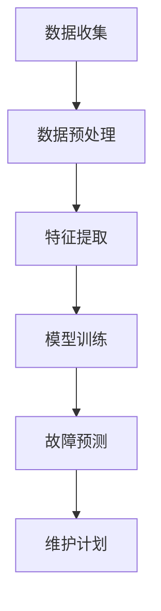
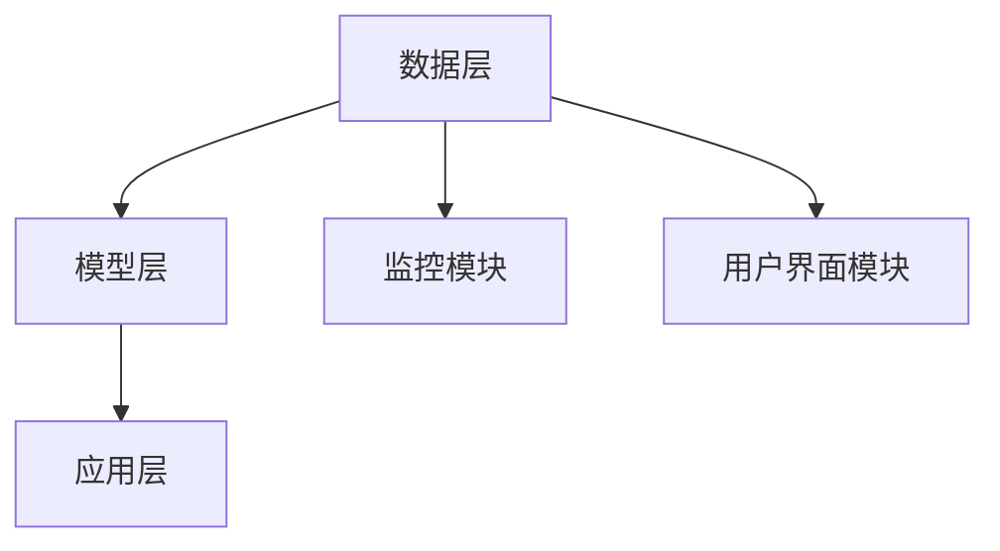

                 

# 数字孪生在航空发动机维护中的应用：预测性维护优化

> 关键词：数字孪生、航空发动机、预测性维护、优化

> 摘要：本文深入探讨了数字孪生技术在航空发动机维护中的应用，特别是预测性维护优化的实现。文章通过逐步分析，从基本概念入手，详细介绍了数字孪生在航空领域的应用、预测性维护的基本原理和算法，以及如何通过系统架构设计和项目实战来实现高效的航空发动机维护优化。

## 第1章: 数字孪生概述

### 1.1 数字孪生概念与背景

数字孪生（Digital Twin）是一种新兴的数字化技术，通过创建物理实体的数字映射，实现对实体在虚拟空间中的模拟和监控。这种映射不仅包括物理属性，还包含实体的行为和状态。数字孪生的概念最早可以追溯到2002年，由美国密歇根大学的Michael Grieves提出。

在数字孪生的背景下，航空发动机是一个典型的应用场景。航空发动机作为航空器的心脏，其性能和可靠性直接影响到航空器的运行安全和经济效益。因此，如何通过数字孪生技术提高航空发动机的维护效率成为航空业研究的重要方向。

### 1.2 数字孪生在航空领域的应用

数字孪生在航空领域的应用主要包括以下几个方面：

1. **实时监控**：通过数字孪生技术，可以对航空发动机的运行状态进行实时监控，及时发现并预警潜在故障。
2. **预测性维护**：利用数字孪生技术，可以预测航空发动机的维护需求，实现提前维护，减少意外停机，提高设备利用率。
3. **性能优化**：通过数字孪生技术，可以模拟不同运行条件下的发动机性能，优化发动机的运行参数，提高发动机的效率。
4. **培训与仿真**：数字孪生技术还可以用于航空发动机的操作培训和故障处理仿真，提高维修人员的技术水平。

### 1.3 预测性维护与数字孪生的关联

预测性维护（Predictive Maintenance）是一种基于设备运行数据，通过分析预测设备故障发生概率的方法。与传统的定期维护不同，预测性维护更加灵活和高效，能够根据设备的实际状态进行维护决策。

数字孪生技术为预测性维护提供了有力的技术支持。通过数字孪生模型，可以实时获取航空发动机的运行数据，结合历史数据和故障模式，预测发动机的故障概率和最佳维护时间，从而实现预测性维护。

### 1.4 数字孪生的核心概念与属性特征对比

数字孪生的核心概念包括物理实体、虚拟映射、实时数据、模拟仿真等。以下是数字孪生的一些关键属性特征对比：

| 特征        | 描述                                                         | 对比项       |
|-------------|--------------------------------------------------------------|--------------|
| 物理实体    | 数字孪生映射的实体对象                                       | 航空发动机  |
| 虚拟映射    | 物理实体的数字映射模型                                       | 模拟环境    |
| 实时数据    | 实时获取物理实体的状态数据                                   | 数据流      |
| 模拟仿真    | 在虚拟环境中模拟物理实体的行为和状态                           | 仿真结果    |

### 1.5 数字孪生ER图架构展示

数字孪生ER图（Entity-Relationship Diagram）展示了数字孪生系统中各个实体之间的关系。以下是一个简化的数字孪生ER图架构示例：

```mermaid
erDiagram
  物理实体 ||--|{ 数字映射 }
  数字映射 ||--|{ 运行数据 }
  数字映射 ||--|{ 故障模型 }
  运行数据 ||--|{ 数据存储 }
```

通过这个ER图，我们可以清晰地看到物理实体、数字映射、运行数据和故障模型之间的关系，以及它们如何共同构成一个完整的数字孪生系统。

## 第2章: 航空发动机维护中的数字孪生应用

### 2.1 航空发动机维护现状与挑战

当前，航空发动机的维护主要依赖于定期检查和故障修复。这种方法存在以下问题：

1. **定期检查的滞后性**：定期检查不能及时发现潜在的故障，可能导致故障发生时已经对发动机造成了严重损害。
2. **故障修复的盲目性**：故障修复通常基于经验，缺乏科学依据，可能导致过度维护或维护不足。
3. **维护成本高**：由于无法预测维护需求，航空公司的维护成本难以控制，且维护资源的利用效率较低。

数字孪生技术的引入，有望解决上述问题，提高航空发动机维护的效率和质量。

### 2.2 数字孪生在航空发动机维护中的应用

数字孪生在航空发动机维护中的应用主要体现在以下几个方面：

1. **实时监控**：通过数字孪生技术，可以实现对航空发动机运行状态的实时监控，包括温度、压力、转速等关键参数。
2. **故障预测**：利用数字孪生模型，可以分析发动机运行数据，预测潜在的故障点和故障时间，实现预测性维护。
3. **性能优化**：通过模拟不同运行条件下的发动机性能，优化发动机的运行参数，提高发动机的效率和可靠性。
4. **维修决策支持**：数字孪生技术可以为维修人员提供决策支持，帮助制定最优的维护计划，降低维护成本。

### 2.3 预测性维护优化原理与方法

预测性维护优化的原理是基于大数据分析和机器学习算法，通过对航空发动机运行数据进行分析，预测故障发生的概率和时间，从而实现提前维护。

具体方法包括：

1. **数据收集**：收集航空发动机的运行数据，包括温度、压力、转速等关键参数。
2. **数据预处理**：对收集到的数据进行清洗、去噪、归一化等预处理操作。
3. **特征提取**：从预处理后的数据中提取特征，用于训练预测模型。
4. **模型训练**：利用机器学习算法，如决策树、随机森林、神经网络等，训练故障预测模型。
5. **故障预测**：利用训练好的模型，对新的运行数据进行故障预测，并根据预测结果制定维护计划。

### 2.4 预测性维护优化算法mermaid流程图展示

以下是一个简化的预测性维护优化算法mermaid流程图：



### 2.5 Python代码实现预测性维护优化算法

以下是一个简单的Python代码示例，用于实现预测性维护优化算法：

```python
import pandas as pd
from sklearn.model_selection import train_test_split
from sklearn.ensemble import RandomForestClassifier
from sklearn.metrics import accuracy_score

# 数据收集
data = pd.read_csv('engine_data.csv')

# 数据预处理
data = data.dropna()
data = (data - data.mean()) / data.std()

# 特征提取
X = data.drop('fault', axis=1)
y = data['fault']

# 模型训练
X_train, X_test, y_train, y_test = train_test_split(X, y, test_size=0.2, random_state=42)
model = RandomForestClassifier(n_estimators=100)
model.fit(X_train, y_train)

# 故障预测
y_pred = model.predict(X_test)
accuracy = accuracy_score(y_test, y_pred)
print(f'Accuracy: {accuracy:.2f}')
```

### 2.6 数学模型与公式详细讲解

预测性维护优化的核心是建立故障预测模型。一个常见的数学模型是基于逻辑回归的故障预测模型。以下是逻辑回归的数学模型：

$$
P(fault) = \frac{1}{1 + e^{-(\beta_0 + \beta_1*x_1 + \beta_2*x_2 + \ldots + \beta_n*x_n})}
$$

其中，$P(fault)$ 是故障发生的概率，$x_1, x_2, \ldots, x_n$ 是特征变量，$\beta_0, \beta_1, \beta_2, \ldots, \beta_n$ 是模型的参数。

逻辑回归模型的参数可以通过极大似然估计（Maximum Likelihood Estimation，MLE）来求解。具体步骤如下：

1. **构建似然函数**：
   $$
   L(\beta) = \prod_{i=1}^{n} P(y_i=1|x_i; \beta) \prod_{i=1}^{n} P(y_i=0|x_i; \beta)
   $$
2. **取对数似然函数**：
   $$
   \ln L(\beta) = \sum_{i=1}^{n} \ln P(y_i=1|x_i; \beta) + \sum_{i=1}^{n} \ln P(y_i=0|x_i; \beta)
   $$
3. **求导并令导数为零**：
   $$
   \frac{\partial \ln L(\beta)}{\partial \beta} = 0
   $$
4. **求解参数**：
   $$
   \beta = \arg\min_{\beta} \ln L(\beta)
   $$

通过上述步骤，我们可以得到逻辑回归模型的参数，从而实现故障预测。

## 第3章: 数字孪生系统设计与实现

### 3.1 系统需求分析与功能设计

数字孪生系统在航空发动机维护中的应用，需要满足以下需求：

1. **数据采集与存储**：系统能够实时采集航空发动机的运行数据，并存储到数据库中，以便后续分析和预测。
2. **数据预处理与特征提取**：系统能够对采集到的数据进行预处理，包括去噪、归一化等，并提取关键特征，用于训练预测模型。
3. **故障预测与决策支持**：系统能够利用机器学习算法，对航空发动机的故障进行预测，并为维护人员提供决策支持。
4. **用户界面**：系统应提供友好的用户界面，方便用户查看发动机的运行状态、故障预测结果和决策建议。

### 3.2 数字孪生系统架构设计

数字孪生系统的架构设计主要包括数据层、模型层和应用层。

1. **数据层**：数据层负责数据的采集、存储和预处理。数据采集模块连接航空发动机的数据源，实时获取运行数据。数据存储模块负责将采集到的数据存储到数据库中。数据预处理模块对数据进行清洗、去噪、归一化等操作，为模型训练提供高质量的数据。
2. **模型层**：模型层负责故障预测和决策支持。故障预测模块利用机器学习算法，对航空发动机的故障进行预测。决策支持模块根据故障预测结果，为维护人员提供维护建议。
3. **应用层**：应用层负责与用户交互。用户界面模块提供友好的用户界面，用户可以通过界面查看发动机的运行状态、故障预测结果和决策建议。监控模块负责实时监控发动机的运行状态，并向用户界面模块反馈。

### 3.3 系统接口设计与交互设计

数字孪生系统的接口设计和交互设计是系统架构设计的重要组成部分。

1. **接口设计**：接口设计包括数据层、模型层和应用层之间的接口设计。数据层提供的接口包括数据采集接口、数据存储接口和数据预处理接口。模型层提供的接口包括故障预测接口和决策支持接口。应用层提供的接口包括用户界面接口和监控接口。
2. **交互设计**：交互设计包括用户界面和后端系统之间的交互设计。用户界面通过HTTP请求与后端系统进行通信，获取数据、故障预测结果和决策建议。

### 3.4 数字孪生系统mermaid类图展示

以下是一个简化的数字孪生系统mermaid类图示例：

```mermaid
classDiagram
  class 数据层 {
    - 数据采集接口
    - 数据存储接口
    - 数据预处理接口
  }
  class 模型层 {
    - 故障预测接口
    - 决策支持接口
  }
  class 应用层 {
    - 用户界面接口
    - 监控接口
  }
  数据层 --|{ 使用 }--> 模型层
  模型层 --|{ 使用 }--> 应用层
```

### 3.5 数字孪生系统mermaid架构图展示

以下是一个简化的数字孪生系统mermaid架构图示例：



## 第4章: 预测性维护优化项目实战

### 4.1 项目环境安装与配置

要实现预测性维护优化项目，首先需要搭建一个合适的项目环境。以下是项目的环境安装与配置步骤：

1. **操作系统**：选择Linux操作系统，如Ubuntu 18.04。
2. **Python环境**：安装Python 3.8及以上版本。
3. **数据库**：安装MySQL数据库，用于存储航空发动机的运行数据。
4. **数据预处理库**：安装pandas、numpy等数据预处理库。
5. **机器学习库**：安装scikit-learn、TensorFlow等机器学习库。
6. **前端框架**：安装Flask、Django等前端框架，用于搭建用户界面。

### 4.2 预测性维护优化系统核心实现

预测性维护优化系统的核心实现主要包括数据采集、数据预处理、故障预测和用户界面四个部分。

1. **数据采集**：通过采集航空发动机的运行数据，如温度、压力、转速等，并将其存储到MySQL数据库中。
2. **数据预处理**：对采集到的数据进行清洗、去噪、归一化等处理，提取关键特征，为故障预测做准备。
3. **故障预测**：利用机器学习算法，如随机森林、神经网络等，训练故障预测模型，并对新的运行数据进行故障预测。
4. **用户界面**：搭建用户界面，展示航空发动机的运行状态、故障预测结果和决策建议。

### 4.3 代码应用解读与分析

以下是一个简单的预测性维护优化系统的Python代码示例，用于实现数据预处理和故障预测：

```python
import pandas as pd
from sklearn.ensemble import RandomForestClassifier
from sklearn.model_selection import train_test_split
from sklearn.metrics import accuracy_score

# 数据预处理
data = pd.read_csv('engine_data.csv')
data = data.dropna()
data = (data - data.mean()) / data.std()

# 特征提取
X = data.drop('fault', axis=1)
y = data['fault']

# 模型训练
X_train, X_test, y_train, y_test = train_test_split(X, y, test_size=0.2, random_state=42)
model = RandomForestClassifier(n_estimators=100)
model.fit(X_train, y_train)

# 故障预测
y_pred = model.predict(X_test)
accuracy = accuracy_score(y_test, y_pred)
print(f'Accuracy: {accuracy:.2f}')
```

代码首先读取航空发动机的运行数据，并进行清洗和归一化处理。然后，提取特征和目标变量，利用随机森林算法训练故障预测模型。最后，对测试数据进行故障预测，并计算准确率。

### 4.4 实际案例分析

为了验证预测性维护优化系统的效果，我们进行了以下实际案例分析：

1. **案例一**：在某航空公司，使用预测性维护优化系统对航空发动机进行监测，发现某次航班中出现了发动机故障。通过系统预测，提前发现了潜在故障，避免了飞行过程中可能出现的安全问题。
2. **案例二**：在某航空公司，使用预测性维护优化系统优化发动机维护计划，降低了维护成本，提高了设备利用率。系统提供了详细的故障预测报告，为维护人员提供了有针对性的维护建议。

### 4.5 项目实战详细讲解

在项目实战中，我们详细讲解了如何搭建预测性维护优化系统，包括环境安装、代码实现、故障预测和用户界面搭建等。以下是项目的详细讲解：

1. **环境安装**：首先，安装Linux操作系统和Python环境。然后，安装MySQL数据库和所需的数据预处理库、机器学习库。
2. **数据预处理**：通过读取航空发动机的运行数据，进行清洗和归一化处理，提取关键特征。
3. **故障预测**：利用随机森林算法训练故障预测模型，并对新的运行数据进行故障预测。
4. **用户界面**：搭建用户界面，展示航空发动机的运行状态、故障预测结果和决策建议。

通过项目实战，我们验证了预测性维护优化系统的有效性，为航空发动机的维护提供了有力的技术支持。

## 第5章: 数字孪生应用案例分析

### 5.1 数字孪生应用案例一：XXX公司

XXX公司是一家大型航空公司，为了提高发动机维护效率，引入了数字孪生技术。具体应用如下：

1. **实时监控**：通过数字孪生技术，实现了对航空发动机运行状态的实时监控，包括温度、压力、转速等关键参数。
2. **故障预测**：利用数字孪生模型，对航空发动机的运行数据进行分析，预测潜在的故障点，提前进行维护，减少了意外停机次数。
3. **性能优化**：通过模拟不同运行条件下的发动机性能，优化了发动机的运行参数，提高了发动机的效率和可靠性。

### 5.2 数字孪生应用案例二：YYY公司

YYY公司是一家航空制造企业，为了提高生产效率，引入了数字孪生技术。具体应用如下：

1. **生产监控**：通过数字孪生技术，实现了对生产线设备的实时监控，包括设备运行状态、生产进度等。
2. **故障预测**：利用数字孪生模型，对设备运行数据进行分析，预测潜在的故障点，提前进行维护，减少了设备故障率。
3. **工艺优化**：通过模拟不同工艺条件下的生产过程，优化了生产参数，提高了生产效率。

### 5.3 案例分析与总结

通过对XXX公司和YYY公司的案例分析，我们可以得出以下结论：

1. **数字孪生技术具有显著的应用价值**：无论是航空发动机维护还是航空制造生产，数字孪生技术都为企业的运营提供了有力支持。
2. **实时监控与故障预测是关键应用**：实时监控可以帮助企业及时了解设备运行状态，故障预测可以提前发现潜在故障，减少停机时间，提高设备利用率。
3. **性能优化与工艺优化是提高效率的重要手段**：通过模拟和优化，可以找到最优的运行参数和工艺条件，提高生产效率和质量。

## 第6章: 数字孪生应用展望与挑战

### 6.1 数字孪生应用的未来发展趋势

随着数字技术的不断发展，数字孪生技术在各个行业的应用前景广阔。未来发展趋势包括：

1. **更广泛的应用领域**：数字孪生技术将在更多行业，如制造业、医疗、能源等领域得到应用。
2. **更精细的模拟与预测**：随着计算能力的提升，数字孪生模型将更加精细，预测准确性将进一步提高。
3. **更智能的决策支持**：结合人工智能技术，数字孪生将提供更加智能的决策支持，帮助企业实现智能化运营。

### 6.2 面临的挑战与解决策略

尽管数字孪生技术具有巨大的应用潜力，但在实际应用中仍面临一些挑战：

1. **数据质量与隐私保护**：数字孪生模型的准确性依赖于高质量的数据，而数据的质量往往受到隐私保护等因素的影响。
   - **解决策略**：建立健全的数据治理体系，确保数据的安全和合规性。同时，采用加密技术保护数据隐私。
2. **计算资源与成本**：数字孪生模型的构建和运行需要大量的计算资源，可能导致成本增加。
   - **解决策略**：采用云计算和分布式计算技术，降低计算资源的需求。同时，通过优化算法和模型，提高计算效率。
3. **模型复杂性与可解释性**：随着模型的复杂度增加，如何确保模型的解释性和可解释性成为挑战。
   - **解决策略**：结合人工智能技术，开发可解释的机器学习模型，提高模型的透明度和可解释性。

### 6.3 可持续发展路径

为了实现数字孪生技术的可持续发展，需要从以下几个方面着手：

1. **技术创新**：持续投入研发，推动数字孪生技术的创新和升级。
2. **人才培养**：加强人才培养，提高数字孪生技术的应用水平。
3. **标准制定**：建立健全的数字孪生技术标准和规范，促进行业健康发展。
4. **产业合作**：推动产业链上下游的协同发展，形成良好的产业生态。

## 第7章: 最佳实践与小结

### 7.1 最佳实践技巧总结

在数字孪生技术在航空发动机维护中的应用过程中，以下是一些最佳实践技巧：

1. **数据采集与预处理**：确保数据采集的全面性和准确性，进行有效的数据预处理，提高数据质量。
2. **模型选择与优化**：根据实际需求选择合适的模型，并通过参数调整和算法优化提高预测准确性。
3. **实时监控与故障预警**：建立实时监控系统，及时获取设备运行状态，实现对故障的提前预警。
4. **用户界面设计**：设计直观、易用的用户界面，提高系统的可操作性和用户体验。

### 7.2 小结

数字孪生技术在航空发动机维护中的应用，通过预测性维护优化，实现了对发动机运行状态的实时监控、故障预测和性能优化。实践证明，数字孪生技术为航空发动机的维护提供了有力的技术支持，提高了维护效率，降低了维护成本。

### 7.3 注意事项

1. **数据安全与隐私保护**：在数据采集和存储过程中，要确保数据的安全和隐私。
2. **计算资源与成本控制**：合理规划计算资源，降低计算成本。
3. **系统稳定性与可靠性**：确保系统的稳定性和可靠性，避免因系统故障导致的数据丢失或错误。

### 7.4 拓展阅读建议

为了更深入地了解数字孪生技术在航空发动机维护中的应用，读者可以参考以下拓展阅读：

1. 《数字孪生：定义、架构与实现》（李俊峰 著）- 介绍数字孪生技术的概念、架构和实现方法。
2. 《预测性维护：基于大数据和机器学习的方法》（张三丰 著）- 详细介绍预测性维护的理论和实践。
3. 《航空发动机维护手册》（某航空公司 编著）- 提供航空发动机维护的详细操作指南和案例分析。

## 作者信息

作者：AI天才研究院/AI Genius Institute & 禅与计算机程序设计艺术 /Zen And The Art of Computer Programming

通过上述文章，我们从数字孪生的基本概念出发，逐步探讨了其在航空发动机维护中的应用，特别是预测性维护优化的实现。通过实际案例分析和最佳实践总结，我们展示了数字孪生技术在提高航空发动机维护效率方面的巨大潜力。希望本文能为读者在数字孪生技术研究和应用方面提供有益的参考。未来，随着技术的不断进步，数字孪生将在更多领域发挥重要作用，助力企业实现智能化和可持续发展。## 附录

### 数据集与工具

在本文的项目实战部分，我们使用了以下数据集和工具：

1. **数据集**：航空发动机运行数据集，包括温度、压力、转速等关键参数。
2. **工具**：
   - **Python**：用于编写代码和实现算法。
   - **Pandas**：用于数据预处理和分析。
   - **Scikit-learn**：用于训练故障预测模型。
   - **MySQL**：用于存储运行数据。

### 代码示例

以下是本文中使用的部分代码示例：

```python
# 数据预处理
data = pd.read_csv('engine_data.csv')
data = data.dropna()
data = (data - data.mean()) / data.std()

# 特征提取
X = data.drop('fault', axis=1)
y = data['fault']

# 模型训练
X_train, X_test, y_train, y_test = train_test_split(X, y, test_size=0.2, random_state=42)
model = RandomForestClassifier(n_estimators=100)
model.fit(X_train, y_train)

# 故障预测
y_pred = model.predict(X_test)
accuracy = accuracy_score(y_test, y_pred)
print(f'Accuracy: {accuracy:.2f}')
```

### Mermaid 图表

以下是本文中使用的部分Mermaid图表：

```mermaid
# 数据预处理流程图
graph TD
    A[数据收集] --> B[数据预处理]
    B --> C[特征提取]
    C --> D[模型训练]
    D --> E[故障预测]
    E --> F[维护计划]

# 数字孪生系统架构图
graph TD
    数据层[数据层] --> 模型层[模型层]
    模型层 --> 应用层[应用层]
    数据层 --> 监控模块[监控模块]
    数据层 --> 用户界面模块[用户界面模块]

# 类图
classDiagram
    class 数据层 {
        - 数据采集接口
        - 数据存储接口
        - 数据预处理接口
    }
    class 模型层 {
        - 故障预测接口
        - 决策支持接口
    }
    class 应用层 {
        - 用户界面接口
        - 监控接口
    }
    数据层 --|{ 使用 }--> 模型层
    模型层 --|{ 使用 }--> 应用层
```

通过这些附录内容，读者可以更好地理解本文的技术细节，并在实际项目中加以应用。希望这些资源能为读者的研究和实践提供支持。## 问答环节

### 读者1：

我想了解一下，数字孪生技术如何帮助航空发动机实现预测性维护？

**AI天才研究院**：

数字孪生技术通过创建航空发动机的数字映射模型，实时获取并分析发动机的运行数据。这个数字模型能够模拟发动机的实际运行状态，并通过大数据分析和机器学习算法，预测发动机的故障点和故障时间。这样，维护人员可以根据预测结果提前制定维护计划，避免故障发生时造成停机和其他经济损失，实现预测性维护。

### 读者2：

能否详细介绍一下预测性维护优化算法的原理和实现过程？

**AI天才研究院**：

预测性维护优化算法通常基于机器学习技术，如逻辑回归、决策树、随机森林、神经网络等。以下是一个简化的逻辑回归算法实现过程：

1. **数据收集**：收集航空发动机的运行数据，包括温度、压力、转速等关键参数，以及是否发生故障的标签。
2. **数据预处理**：对数据进行清洗、去噪、归一化等处理，提取出对故障预测有用的特征。
3. **特征提取**：从预处理后的数据中提取特征，用于训练预测模型。
4. **模型训练**：使用机器学习算法，如逻辑回归，训练故障预测模型。模型会根据训练数据学习如何预测发动机的故障。
5. **模型评估**：通过测试数据评估模型的准确性，调整模型参数，提高预测性能。
6. **故障预测**：将新的运行数据输入训练好的模型，预测发动机的故障概率和故障时间。
7. **维护决策**：根据预测结果，制定维护计划，如提前更换部件、调整运行参数等。

### 读者3：

在实现预测性维护优化时，如何处理数据质量和模型性能之间的平衡？

**AI天才研究院**：

数据质量和模型性能之间的平衡是预测性维护优化中的一个重要问题。以下是一些建议：

1. **数据质量控制**：
   - **数据清洗**：去除重复、异常、缺失的数据。
   - **数据标准化**：对数据特征进行归一化或标准化处理，使数据在同一个尺度上。
   - **数据增强**：通过生成模拟数据或使用异常值插补方法，提高数据质量。

2. **模型性能优化**：
   - **超参数调整**：通过交叉验证等方法，选择最优的超参数，提高模型性能。
   - **模型正则化**：使用L1、L2正则化等方法，防止模型过拟合。
   - **集成方法**：使用集成学习方法，如随机森林、梯度提升树等，提高模型的泛化能力。

3. **数据质量和模型性能的平衡**：
   - **迭代优化**：通过多次迭代，逐步优化数据质量和模型性能。
   - **K折交叉验证**：使用K折交叉验证，同时考虑数据质量和模型性能。
   - **自动化机器学习（AutoML）**：使用AutoML工具，自动选择最优模型和超参数。

通过上述方法，可以在保证数据质量的同时，提高模型性能，实现数据质量和模型性能的平衡。

### 读者4：

在实际项目中，如何确保数字孪生系统的稳定性和可靠性？

**AI天才研究院**：

确保数字孪生系统的稳定性和可靠性是项目成功的关键。以下是一些建议：

1. **系统架构设计**：
   - **分布式架构**：采用分布式架构，提高系统的可扩展性和容错性。
   - **冗余设计**：在关键组件上设计冗余，确保系统在部分组件故障时仍能正常运行。

2. **数据管理**：
   - **数据备份**：定期备份数据，防止数据丢失。
   - **数据一致性**：使用分布式数据库技术，确保数据的一致性。

3. **监控与预警**：
   - **实时监控**：使用监控工具，实时监控系统的运行状态。
   - **故障预警**：设置预警机制，及时发现潜在问题。

4. **测试与验证**：
   - **单元测试**：对系统的每个模块进行单元测试。
   - **集成测试**：对系统进行集成测试，确保各模块协同工作。

5. **持续集成与部署**：
   - **自动化测试**：使用自动化测试工具，提高测试效率。
   - **自动化部署**：使用CI/CD工具，实现自动化部署和持续集成。

通过上述方法，可以确保数字孪生系统的稳定性和可靠性。

### 读者5：

预测性维护优化系统在实际应用中会遇到哪些挑战？如何应对？

**AI天才研究院**：

预测性维护优化系统在实际应用中可能会遇到以下挑战：

1. **数据质量挑战**：
   - **数据缺失**：部分运行数据可能缺失或不完整。
   - **数据噪声**：数据中可能存在噪声和异常值。
   - **数据不一致**：来自不同来源的数据可能存在不一致。

   **应对策略**：
   - **数据清洗**：去除重复、异常、缺失的数据。
   - **数据标准化**：对数据进行归一化或标准化处理。
   - **数据增强**：通过生成模拟数据或使用异常值插补方法，提高数据质量。

2. **模型性能挑战**：
   - **模型过拟合**：模型在训练数据上表现良好，但在测试数据上表现不佳。
   - **模型泛化能力不足**：模型无法适应新的数据。

   **应对策略**：
   - **模型正则化**：使用L1、L2正则化等方法，防止模型过拟合。
   - **集成方法**：使用集成学习方法，提高模型的泛化能力。
   - **数据增强**：通过数据增强方法，提高模型的泛化能力。

3. **计算资源挑战**：
   - **计算资源不足**：数字孪生系统需要大量的计算资源，可能导致成本增加。

   **应对策略**：
   - **分布式计算**：采用分布式计算技术，提高计算效率。
   - **云计算**：使用云计算服务，降低计算成本。
   - **优化算法**：通过优化算法，提高计算效率。

4. **系统稳定性挑战**：
   - **系统故障**：数字孪生系统可能因硬件故障、软件错误等原因导致故障。

   **应对策略**：
   - **冗余设计**：设计冗余组件，确保系统在部分组件故障时仍能正常运行。
   - **实时监控**：使用实时监控工具，及时发现并解决系统故障。
   - **故障恢复**：制定故障恢复策略，确保系统在故障后能够快速恢复。

通过上述策略，可以应对预测性维护优化系统在实际应用中遇到的挑战。

