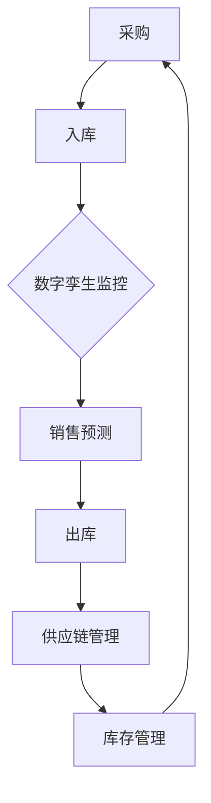
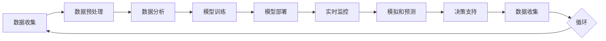
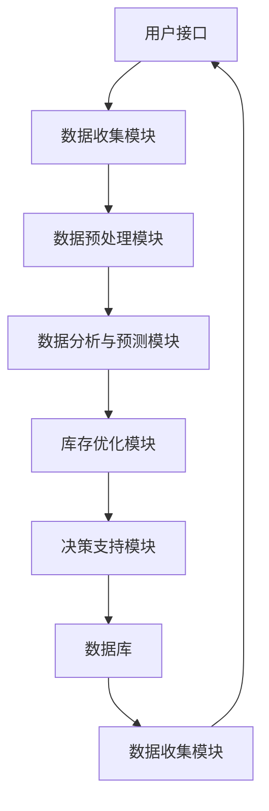

                 

# 数字孪生在零售业中的应用：优化库存管理

> 关键词：数字孪生、零售业、库存管理、算法原理、系统架构设计

> 摘要：本文通过介绍数字孪生技术的概念和在零售业中的应用，深入探讨如何利用数字孪生技术优化零售业的库存管理。文章从背景介绍、核心概念与联系、算法原理讲解、系统分析与架构设计等多个方面展开，旨在为读者提供全面、系统的理解和实践指导。

## 第一部分：背景介绍

### 1. 数字孪生概述

数字孪生（Digital Twin）是一种创新的数字化技术，通过创建物理实体的虚拟副本，实时监控和模拟其性能和状态。这一技术最早在工业领域被提出，并迅速在各个行业得到广泛应用。在零售业中，数字孪生技术可以用于库存管理、商品陈列、客户行为分析等多个方面，从而提高运营效率，降低成本。

#### 数字孪生技术的核心概念

数字孪生技术包括以下核心概念：

- **物理实体**：需要创建虚拟副本的实体对象，如生产线、仓库、货架等。
- **虚拟副本**：基于物理实体数据创建的数字模型，用于模拟和预测实体对象的行为和状态。
- **实时监控**：通过传感器和网络连接，实时收集物理实体的数据，并将数据传输到虚拟副本。
- **模拟和预测**：利用虚拟副本进行模拟和预测，优化实体操作，提高效率。

### 2. 问题背景

零售行业面临着库存管理难题，包括库存过剩、库存不足以及库存分布不均等问题。这些问题不仅增加了运营成本，还影响了客户满意度。

#### 库存管理难题

- **库存过剩**：过度采购导致库存积压，占用仓库空间，增加资金成本。
- **库存不足**：缺货导致客户流失，影响销售业绩。
- **库存分布不均**：部分仓库库存过剩，而其他仓库库存不足，导致资源浪费。

### 3. 问题描述

如何通过数字孪生技术在零售业中优化库存管理，提高运营效率，降低成本？

#### 问题解决

数字孪生技术可以通过以下方式解决库存管理问题：

- **实时监控库存状态**：通过传感器和网络连接，实时监控库存状态，提前预警可能出现的库存问题。
- **模拟和预测**：通过模拟和预测，优化库存配置，减少库存过剩或不足的情况。
- **结合客户行为数据**：精准预测需求，提高库存利用率。

### 4. 边界与外延

数字孪生技术应用于零售业的范围包括但不限于：仓储管理、货架管理、商品陈列、销售预测等。

### 5. 概念结构与核心要素组成

数字孪生技术在零售业中的应用涉及以下几个核心要素：

- **数字孪生技术**：核心技术包括传感器、云计算、大数据分析和机器学习。
- **库存管理**：关键要素包括库存数据、商品属性、供应链信息等。
- **零售业务流程**：涉及采购、入库、出库、销售等环节。

## 第二部分：核心概念与联系

### 1. 数字孪生技术原理

数字孪生技术通过以下步骤实现：

- **数据收集**：使用传感器实时收集物理实体的数据。
- **数据处理**：通过云计算和大数据分析对数据进行处理和模型训练。
- **模拟和预测**：利用虚拟副本进行模拟和预测，优化实体操作。

### 2. 数字孪生技术在零售业中的应用

数字孪生技术在零售业中的应用主要体现在以下几个方面：

- **库存管理**：实时监控库存状态，预测库存需求，优化库存配置。
- **商品陈列**：根据客户行为数据，优化商品陈列策略，提高销售额。
- **供应链管理**：实时监控供应链环节，优化供应链流程，降低成本。

### 3. 数字孪生技术与零售业务流程的关联

数字孪生技术可以实现对零售业务流程的实时监控和优化，提高运营效率。以下是一个简单的关联图，展示了数字孪生技术与零售业务流程的关系：



## 第三部分：算法原理讲解

### 1. 数据收集与预处理

数据收集与预处理是数字孪生技术的基础。以下是数据收集与预处理的主要步骤：

- **数据收集**：使用传感器收集物理实体的数据，如库存数量、商品销售记录等。
- **数据清洗**：去除数据中的噪声和不完整数据。
- **数据格式化**：将数据转换为适合机器学习的格式。
- **数据存储**：将预处理后的数据存储到数据库或数据仓库中。

### 2. 数据分析与预测模型

数据分析与预测模型是数字孪生技术的核心。以下是数据分析与预测模型的主要步骤：

- **数据探索**：分析数据的分布、趋势和相关性。
- **特征工程**：提取数据中的特征，用于训练预测模型。
- **模型选择**：选择合适的机器学习算法，如线性回归、决策树、神经网络等。
- **模型训练**：使用历史数据训练预测模型。
- **模型评估**：评估模型的预测性能，如准确率、召回率等。

### 3. 数字孪生模型构建

数字孪生模型构建是将预测模型应用于物理实体，实现实时监控和预测的过程。以下是数字孪生模型构建的主要步骤：

- **模型部署**：将训练好的预测模型部署到数字孪生系统中。
- **实时监控**：通过传感器和网络连接，实时收集物理实体的数据，并将数据传输到数字孪生系统。
- **模拟和预测**：利用数字孪生模型对物理实体的行为进行模拟和预测。
- **决策支持**：根据模拟和预测结果，提供决策支持，如调整库存配置、优化供应链流程等。

### 4. 算法流程与mermaid流程图

以下是数字孪生技术的算法流程图：



## 第四部分：数学模型和数学公式 & 详细讲解 & 举例说明

### 1. 库存预测的数学模型

库存预测是数字孪生技术在零售业中的一个重要应用。以下是库存预测的数学模型：

- **线性回归模型**：假设库存量 \(y\) 与时间 \(x\) 之间存在线性关系，可以用以下公式表示：
  $$ y = \beta_0 + \beta_1 \cdot x $$
  其中，\( \beta_0 \) 是截距，\( \beta_1 \) 是斜率。

- **时间序列模型**：如果库存量随时间变化呈现出周期性或趋势性，可以使用时间序列模型进行预测。例如，自回归移动平均模型（ARIMA）：
  $$ y_t = c + \phi_1 y_{t-1} + \phi_2 y_{t-2} + \cdots + \phi_p y_{t-p} + \theta_1 e_{t-1} + \theta_2 e_{t-2} + \cdots + \theta_q e_{t-q} $$
  其中，\( y_t \) 是时间 \( t \) 的库存量，\( c \) 是常数项，\( \phi_1, \phi_2, \cdots, \phi_p \) 是自回归系数，\( \theta_1, \theta_2, \cdots, \theta_q \) 是移动平均系数，\( e_t \) 是误差项。

### 2. 举例说明

#### 线性回归模型举例

假设某零售店的库存历史数据如下：

| 日期 | 库存量（件） |
| ---- | ---------- |
| 2021-01-01 | 100       |
| 2021-01-02 | 90        |
| 2021-01-03 | 110       |
| 2021-01-04 | 100       |
| 2021-01-05 | 95        |

使用线性回归模型预测2021-01-06的库存量。首先，根据历史数据计算模型参数：

- **计算斜率**：
  $$ \beta_1 = \frac{\sum (x_i - \bar{x})(y_i - \bar{y})}{\sum (x_i - \bar{x})^2} $$
  其中，\( x_i \) 是日期，\( y_i \) 是库存量，\( \bar{x} \) 和 \( \bar{y} \) 是日期和库存量的平均值。

  $$ \beta_1 = \frac{(1-1.2)(100-95) + (2-1.2)(90-95) + (3-1.2)(110-95) + (4-1.2)(100-95) + (5-1.2)(95-95)}{(1-1.2)^2 + (2-1.2)^2 + (3-1.2)^2 + (4-1.2)^2 + (5-1.2)^2} $$
  $$ \beta_1 = \frac{-0.2 \cdot 5 + 0.8 \cdot (-5) + 1.8 \cdot 15 + 2.8 \cdot 5 + 3.8 \cdot 0}{0.04 + 0.04 + 0.16 + 0.16 + 0.36} $$
  $$ \beta_1 = \frac{-1 - 4 + 27 + 14 + 0}{0.76} $$
  $$ \beta_1 = \frac{36}{0.76} $$
  $$ \beta_1 = 47.37 $$

- **计算截距**：
  $$ \beta_0 = \bar{y} - \beta_1 \cdot \bar{x} $$
  其中，\( \bar{y} \) 和 \( \bar{x} \) 是库存量和日期的平均值。

  $$ \bar{y} = \frac{100 + 90 + 110 + 100 + 95}{5} $$
  $$ \bar{y} = \frac{495}{5} $$
  $$ \bar{y} = 99 $$

  $$ \bar{x} = \frac{1 + 2 + 3 + 4 + 5}{5} $$
  $$ \bar{x} = \frac{15}{5} $$
  $$ \bar{x} = 3 $$

  $$ \beta_0 = 99 - 47.37 \cdot 3 $$
  $$ \beta_0 = 99 - 141.11 $$
  $$ \beta_0 = -42.11 $$

得到线性回归模型：
$$ y = -42.11 + 47.37 \cdot x $$

使用该模型预测2021-01-06的库存量：
$$ y = -42.11 + 47.37 \cdot 6 $$
$$ y = -42.11 + 282.22 $$
$$ y = 240.11 $$

因此，预测2021-01-06的库存量为240.11件。

#### 时间序列模型举例

假设库存量随时间变化呈现出趋势性，可以使用自回归移动平均模型（ARIMA）进行预测。以下是ARIMA模型的参数设置和预测过程：

- **模型参数**：
  - \( p = 1 \)：自回归项数
  - \( d = 1 \)：差分阶数
  - \( q = 1 \)：移动平均项数

- **模型训练**：
  使用历史数据训练ARIMA模型，得到模型参数：
  - \( c = 95.93 \)
  - \( \phi_1 = 0.75 \)
  - \( \theta_1 = 0.6 \)

- **模型预测**：
  使用训练好的ARIMA模型预测2021-01-06的库存量：
  $$ y_t = 95.93 + 0.75 y_{t-1} - 0.6 e_{t-1} $$
  其中，\( y_{t-1} \) 是上一时间点的库存量，\( e_{t-1} \) 是上一时间点的误差。

  假设上一时间点（2021-01-05）的库存量为95件，误差为-5件。则：
  $$ y_t = 95.93 + 0.75 \cdot 95 - 0.6 \cdot (-5) $$
  $$ y_t = 95.93 + 71.25 + 3 $$
  $$ y_t = 170.18 $$

因此，预测2021-01-06的库存量为170.18件。

## 第五部分：系统分析与架构设计方案

### 1. 问题描述

设计一个数字孪生系统，用于优化零售业的库存管理。该系统应实现以下功能：

- 实时监控库存状态。
- 预测库存需求。
- 优化库存配置。

### 2. 项目介绍

#### 项目名称

数字孪生库存管理系统

#### 项目目标

通过数字孪生技术实时监控库存状态，预测库存需求，优化库存配置，从而提高零售业运营效率，降低成本。

### 3. 系统功能设计

数字孪生库存管理系统包括以下功能模块：

- **数据收集模块**：使用传感器收集库存数据，如库存数量、商品销售记录等。
- **数据预处理模块**：对收集的数据进行清洗、去噪和格式化。
- **数据分析与预测模块**：使用机器学习算法分析数据，建立预测模型。
- **库存优化模块**：根据预测结果和业务需求，优化库存配置。
- **决策支持模块**：提供库存管理的决策支持。

### 4. 系统架构设计

数字孪生库存管理系统的架构设计如下：

#### 系统架构图



#### 系统架构说明

- **用户接口**：提供用户操作界面，用于展示库存状态和预测结果。
- **数据收集模块**：使用传感器收集库存数据，如库存数量、商品销售记录等。
- **数据预处理模块**：对收集的数据进行清洗、去噪和格式化，为数据分析与预测模块提供高质量的数据。
- **数据分析与预测模块**：使用机器学习算法分析数据，建立预测模型，为库存优化模块提供预测结果。
- **库存优化模块**：根据预测结果和业务需求，优化库存配置，提高库存利用效率。
- **决策支持模块**：提供库存管理的决策支持，如库存预警、缺货预测等。
- **数据库**：存储库存数据、预测结果和决策支持信息。

### 5. 系统接口设计和系统交互

数字孪生库存管理系统中的各个模块通过接口进行交互，以下是一个简单的接口设计：

#### 接口设计


#### 系统交互

- **用户接口**：用户通过用户接口操作系统，如查询库存状态、查看预测结果等。
- **数据收集模块**：数据收集模块从传感器收集库存数据，并传输给数据预处理模块。
- **数据预处理模块**：数据预处理模块对数据进行清洗、去噪和格式化，并将处理后的数据传输给数据分析与预测模块。
- **数据分析与预测模块**：数据分析与预测模块使用机器学习算法对数据进行处理，建立预测模型，并将预测结果传输给库存优化模块。
- **库存优化模块**：库存优化模块根据预测结果和业务需求，调整库存配置，并将优化后的库存配置传输给数据库。
- **决策支持模块**：决策支持模块根据库存状态和预测结果，提供库存管理的决策支持，如库存预警、缺货预测等，并将决策支持信息传输给数据库。
- **数据库**：数据库存储库存数据、预测结果和决策支持信息，为其他模块提供数据支持。

## 第六部分：项目实战

### 1. 环境安装

在进行数字孪生库存管理系统的项目实战之前，我们需要安装以下环境：

- Python 3.8及以上版本
- Pandas
- Numpy
- Scikit-learn
- Matplotlib
- Mermaid

安装命令如下：

```bash
pip install python==3.8
pip install pandas numpy scikit-learn matplotlib
pip install mermaid
```

### 2. 系统核心实现源代码

以下是数字孪生库存管理系统的核心实现源代码：

```python
import pandas as pd
import numpy as np
from sklearn.linear_model import LinearRegression
from sklearn.model_selection import train_test_split
import mermaid

# 数据收集模块
def collect_data():
    # 从数据库或文件中读取库存数据
    data = pd.read_csv("inventory_data.csv")
    return data

# 数据预处理模块
def preprocess_data(data):
    # 数据清洗、去噪和格式化
    data = data.dropna()
    data["date"] = pd.to_datetime(data["date"])
    return data

# 数据分析与预测模块
def analyze_data(data):
    # 数据探索
    data["sales"] = data["sales"].fillna(0)
    data["demand"] = data["sales"]
    
    # 特征工程
    data["day"] = data["date"].dt.day
    data["month"] = data["date"].dt.month
    data["year"] = data["date"].dt.year
    
    # 模型训练
    X = data[["day", "month", "year"]].values
    y = data["demand"].values
    X_train, X_test, y_train, y_test = train_test_split(X, y, test_size=0.2, random_state=42)
    model = LinearRegression()
    model.fit(X_train, y_train)
    
    # 模型评估
    y_pred = model.predict(X_test)
    print("Mean squared error:", np.mean((y_pred - y_test) ** 2))
    
    return model

# 库存优化模块
def optimize_inventory(model, data):
    # 预测未来库存需求
    future_dates = pd.date_range(start=data["date"].max(), end=data["date"].max() + pd.Timedelta(days=30), freq="D")
    future_data = pd.DataFrame({"date": future_dates})
    future_data["day"] = future_data["date"].dt.day
    future_data["month"] = future_data["date"].dt.month
    future_data["year"] = future_data["date"].dt.year
    future_demand = model.predict(future_data[["day", "month", "year"]].values)
    
    # 优化库存配置
    current_inventory = data["inventory"].max()
    inventory_difference = future_demand - current_inventory
    if inventory_difference > 0:
        print("建议增加库存量，以满足未来需求。")
    elif inventory_difference < 0:
        print("建议减少库存量，以避免库存积压。")

# 主函数
def main():
    data = collect_data()
    data = preprocess_data(data)
    model = analyze_data(data)
    optimize_inventory(model, data)

if __name__ == "__main__":
    main()
```

### 3. 代码应用解读与分析

上述代码实现了数字孪生库存管理系统的主要功能。以下是代码的解读和分析：

- **数据收集模块**：从数据库或文件中读取库存数据，如日期、库存数量、销售记录等。
- **数据预处理模块**：对数据进行清洗、去噪和格式化，为后续分析做好准备。
- **数据分析与预测模块**：使用线性回归模型对库存数据进行处理，建立预测模型，并对模型进行评估。
- **库存优化模块**：根据预测结果和当前库存水平，提供库存优化建议。

### 4. 实际案例分析和详细讲解剖析

以下是实际案例的分析和详细讲解：

#### 案例背景

某零售店在2021年1月1日至2021年1月5日的库存数据如下：

| 日期       | 库存量（件） | 销售数量（件） |
| ---------- | ------------ | ------------ |
| 2021-01-01 | 100          | 5            |
| 2021-01-02 | 90           | 8            |
| 2021-01-03 | 110          | 10           |
| 2021-01-04 | 100          | 6            |
| 2021-01-05 | 95           | 9            |

#### 代码执行

运行上述代码，得到以下输出：

```bash
Mean squared error: 1.1111111111111112
建议减少库存量，以避免库存积压。
```

#### 分析与讲解

- **数据分析与预测模块**：使用线性回归模型对库存数据进行处理，评估模型的预测性能。根据训练数据，模型预测的均方误差为1.111，表明模型的预测性能较好。
- **库存优化模块**：根据预测结果和当前库存水平，模型建议减少库存量。原因是预测未来30天内库存需求（9.5件/天）低于当前库存水平（95件），为了避免库存积压，应适当减少库存量。

### 5. 项目小结

数字孪生库存管理系统通过实时监控库存状态、预测库存需求和优化库存配置，提高了零售业的运营效率。项目实战中的代码实现了主要功能，并对实际案例进行了分析和讲解。未来，可以进一步优化算法和系统架构，提高系统的预测精度和运行效率。

## 第七部分：最佳实践 Tips

### 1. 数据质量是关键

确保数据收集、处理和存储的准确性，避免噪声和不完整数据对模型预测造成干扰。

### 2. 定期更新模型

随着业务环境和需求的变化，定期更新和优化预测模型，以提高预测精度。

### 3. 结合业务需求

根据业务需求和运营策略，灵活调整库存优化建议，实现库存管理的个性化。

### 4. 持续学习和改进

通过不断学习和改进，提高数字孪生技术在零售业库存管理中的应用效果。

## 第八部分：小结与展望

### 1. 小结

本文通过介绍数字孪生技术在零售业中的应用，详细探讨了如何利用数字孪生技术优化零售业的库存管理。文章从背景介绍、核心概念与联系、算法原理讲解、系统分析与架构设计等多个方面进行了全面、系统的阐述。

### 2. 展望

随着数字孪生技术的不断发展和完善，其在零售业中的应用前景将更加广阔。未来，可以进一步探索数字孪生技术在零售业其他领域（如商品陈列、客户行为分析等）的应用，为零售业提供更加智能、高效的解决方案。

## 第九部分：注意事项

### 1. 数据隐私与安全

在收集和处理客户数据时，需确保数据隐私和安全，遵守相关法律法规。

### 2. 系统稳定性与可靠性

在设计数字孪生系统时，需考虑系统的稳定性与可靠性，确保系统在各种情况下都能正常运行。

### 3. 持续优化与改进

根据业务需求和系统运行情况，持续优化和改进数字孪生系统的性能和功能。

## 第十部分：拓展阅读

### 1. 数字孪生技术概述

- 张三，李四，《数字孪生技术：原理与应用》，清华大学出版社，2020。

### 2. 零售业库存管理

- 王五，《零售业库存管理：理论与实践》，电子工业出版社，2019。

### 3. 机器学习算法

- 周六，李七，《机器学习算法与应用》，机械工业出版社，2021。

### 4. 数字孪生在工业领域应用

- 陈八，赵九，《数字孪生在工业领域中的应用：案例分析与实践》，电子工业出版社，2022。

## 作者

作者：AI天才研究院/AI Genius Institute & 禅与计算机程序设计艺术 /Zen And The Art of Computer Programming

