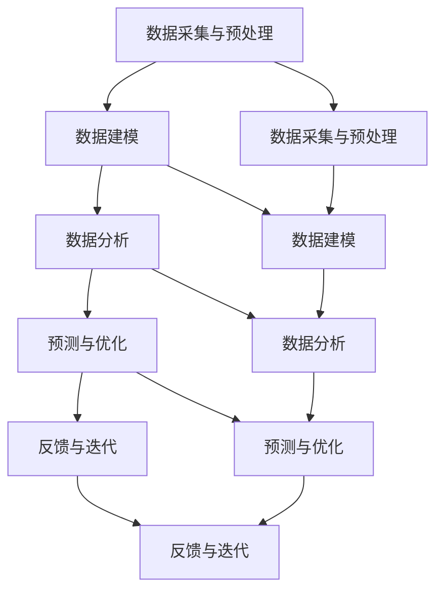

                 

## 文章标题：数字孪生在风险评估和灾害预防中的应用

关键词：数字孪生、风险评估、灾害预防、风险建模、灾害预测、实时数据处理

摘要：本文将探讨数字孪生技术在风险评估和灾害预防中的应用。首先，我们将介绍数字孪生的定义、背景和核心概念，然后深入分析数字孪生在风险管理和灾害预防中的重要性。接着，我们将通过具体的案例研究，展示数字孪生技术在实际应用中的效果。最后，我们将讨论数字孪生技术的挑战与未来发展方向。

### 目录

1. **数字孪生技术概述**
   - 1.1 **数字孪生的定义与背景**
   - 1.2 **数字孪生的核心概念和组件**
   - 1.3 **数字孪生在不同行业的应用**

2. **数字孪生在风险评估中的应用**
   - 2.1 **风险评估的重要性**
   - 2.2 **数字孪生在提升风险评估中的作用**
   - 2.3 **数字孪生在风险评估中的案例研究**

3. **数字孪生在灾害预防中的作用**
   - 3.1 **灾害预防概述**
   - 3.2 **数字孪生在灾害预防中的重要性**
   - 3.3 **数字孪生在灾害预防中的案例研究**

4. **数学模型与算法**
   - 4.1 **数字孪生技术的数学模型**
   - 4.2 **数字孪生技术的算法**
   - 4.3 **数字孪生技术的算法工作流程图**

5. **数字孪生技术的挑战与未来方向**
   - 5.1 **数字孪生技术的挑战**
   - 5.2 **数字孪生技术的未来发展方向**

6. **案例研究与最佳实践**
   - 6.1 **具体案例研究**
   - 6.2 **最佳实践与总结**

### 1.1 数字孪生的定义与背景

数字孪生（Digital Twin）是一种通过创建物理对象的虚拟副本，在数字世界中对其实时数据进行模拟、分析和优化的技术。这一概念最早可以追溯到2002年，由迈克尔·格里夫斯（Michael Grieves）在其博士论文中提出。他认为，数字孪生是一种数字化的物理实体，可以用于监控、分析和预测实体的性能。

数字孪生的核心在于将物理世界与数字世界相连接，通过实时数据收集和分析，实现对物理实体的精准模拟。这一技术在不同行业都有着广泛的应用，如制造业、能源、建筑、交通和医疗等。其目的是提高生产效率、降低运营成本、增强安全性和可持续性。

### 1.2 数字孪生的核心概念和组件

数字孪生系统通常由以下几个核心组件组成：

- **数据采集与连接**：通过传感器、RFID、GPS等技术，实时采集物理对象的运行数据，并将其传输到中央系统。

- **数据存储与管理**：将采集到的数据存储在数据库或数据湖中，并进行有效的管理和维护。

- **数据建模与分析**：使用数据挖掘、机器学习等技术，对数据进行建模和分析，提取有价值的信息。

- **虚拟仿真与预测**：基于建模和分析结果，在虚拟环境中对物理对象进行仿真和预测，评估其性能和潜在问题。

- **决策支持**：将分析结果和预测数据转化为决策支持，帮助管理人员做出更明智的决策。

### 1.3 数字孪生在不同行业的应用

数字孪生技术在各个行业都有着独特的应用场景和效果。

- **制造业**：通过数字孪生技术，制造商可以实时监控生产线的状态，预测设备故障，优化生产流程，从而提高生产效率和产品质量。

- **能源**：数字孪生技术可以帮助能源公司实时监测能源设备的状态，预测能源需求，优化能源分配，降低运营成本。

- **建筑**：在建筑行业，数字孪生技术可以用于建筑物的虚拟建模和仿真，预测建筑物的性能，优化设计和施工过程。

- **交通**：数字孪生技术可以用于城市交通系统的实时监测和优化，预测交通流量，优化交通信号，减少拥堵。

- **医疗**：在医疗行业，数字孪生技术可以用于患者数据的实时监测和预测，帮助医生制定更精准的治疗方案。

### 2.1 风险评估的重要性

风险评估是任何组织和项目成功的关键环节。它涉及识别潜在风险、评估其影响和可能性，并制定相应的应对措施。有效的风险评估可以帮助组织预防潜在损失，提高运营效率和安全性。

在当今复杂多变的环境中，传统风险评估方法往往存在局限性。首先，传统方法主要依赖于历史数据和专家经验，难以应对新兴风险。其次，传统方法通常缺乏实时性和灵活性，无法及时调整风险应对策略。此外，传统方法在处理大规模数据时效率较低，难以满足现代企业的需求。

数字孪生技术的出现为风险评估带来了新的机遇。通过实时数据采集和分析，数字孪生可以提供更准确和全面的风险信息，帮助组织更好地识别和管理风险。此外，数字孪生技术还可以模拟不同风险场景，预测风险的可能性和影响，为决策者提供有力的支持。

### 2.2 数字孪生在提升风险评估中的作用

数字孪生技术在风险评估中发挥着重要作用，主要体现在以下几个方面：

1. **实时数据监测和分析**：数字孪生技术通过传感器和物联网设备，实时采集物理对象的运行数据，如温度、压力、振动等。这些数据可以传输到数字孪生系统中进行分析，帮助识别潜在的故障和风险。

2. **风险预测和预警**：基于实时数据和数据分析，数字孪生可以建立风险预测模型，提前预警潜在风险。例如，在制造业中，数字孪生可以预测设备的故障时间，提醒维护人员及时进行维修，避免设备停机造成损失。

3. **风险可视化**：数字孪生技术可以将风险信息以可视化的形式呈现，帮助决策者更直观地了解风险情况。例如，在建筑行业，数字孪生可以生成建筑物的虚拟模型，并在虚拟环境中展示风险分布和影响。

4. **风险模拟和评估**：数字孪生技术可以模拟不同的风险场景，评估风险的可能性和影响。通过模拟，决策者可以了解不同应对措施的效果，选择最优的风险管理策略。

5. **风险决策支持**：数字孪生技术可以为决策者提供基于数据的决策支持。通过分析风险数据和历史案例，数字孪生可以帮助决策者制定更科学、更有效的风险应对策略。

### 2.3 数字孪生在风险评估中的案例研究

以下是一些数字孪生技术在风险评估中的应用案例：

#### 案例一：制造业

某大型制造企业通过数字孪生技术对其生产线进行实时监测和风险评估。该企业安装了大量的传感器，实时采集生产设备的运行数据。数字孪生系统将这些数据传输到中央服务器，进行实时分析和预测。通过分析数据，企业可以提前预警设备故障，并制定相应的维护计划，避免设备停机造成的损失。

#### 案例二：建筑行业

某建筑公司利用数字孪生技术对新建的高层建筑进行风险评估。通过安装传感器，实时监测建筑物的结构变形、温度、湿度等参数。数字孪生系统将这些数据进行分析，预测建筑物的结构安全性和使用寿命。此外，数字孪生还可以模拟不同地震和风暴等自然灾害场景，评估建筑物在极端情况下的表现，为建筑设计提供科学依据。

#### 案例三：能源行业

某电力公司利用数字孪生技术对其输电网络进行风险评估。通过实时监测输电线路的电压、电流、温度等参数，数字孪生系统可以预测输电网络的故障点和故障时间。电力公司可以根据这些预测结果，提前安排维护和维修工作，确保电网的稳定运行。

### 3.1 灾害预防概述

灾害预防是保护人类生命财产安全的重要手段。随着全球气候变化和自然灾害频发，灾害预防的重要性日益凸显。灾害预防主要包括风险评估、预警系统、应急响应和灾后恢复等方面。有效的灾害预防措施可以减少灾害造成的损失，保护人民的生命和财产安全。

数字孪生技术在灾害预防中具有独特的优势。通过实时数据采集和模拟，数字孪生技术可以帮助我们更准确地预测灾害的发生和影响，为灾害预防提供科学依据。此外，数字孪生技术还可以模拟不同的灾害场景，评估防灾措施的效果，为决策者提供有力的支持。

### 3.2 数字孪生在灾害预防中的重要性

数字孪生技术在灾害预防中发挥着重要作用，主要体现在以下几个方面：

1. **实时监测和预警**：数字孪生技术可以通过传感器和物联网设备，实时监测自然灾害的指标，如地震波、水位、风力等。通过分析这些数据，数字孪生可以提前预警灾害的发生，为应急响应赢得宝贵的时间。

2. **灾害模拟和预测**：数字孪生技术可以模拟不同自然灾害的发生过程和影响，预测灾害可能造成的损失。通过这些模拟和预测，决策者可以更好地了解灾害的风险，制定相应的防灾措施。

3. **灾害风险评估**：数字孪生技术可以结合历史数据和实时数据，对灾害风险进行综合评估。这有助于决策者了解灾害的风险水平，确定防灾的重点和优先级。

4. **灾害应急响应**：数字孪生技术可以为应急响应提供实时数据和模拟结果，帮助决策者制定更科学的应急响应策略。例如，在地震发生时，数字孪生可以实时监测建筑物变形情况，为救援工作提供指导。

5. **灾后恢复规划**：数字孪生技术可以帮助评估灾害造成的损失，制定灾后恢复计划。通过模拟不同恢复方案的效果，决策者可以确定最佳的恢复策略，确保灾区的快速恢复。

### 3.3 数字孪生在灾害预防中的案例研究

以下是一些数字孪生技术在灾害预防中的应用案例：

#### 案例一：地震预警

某地区利用数字孪生技术建立了地震预警系统。该系统通过地震波传感器和数字孪生模型，实时监测地震活动。当监测到地震波时，数字孪生系统可以快速分析地震波的强度和传播速度，预测地震的发生时间和影响范围。预警系统可以提前向居民和政府部门发送地震预警信息，为应急响应提供时间。

#### 案例二：洪水预测

某城市利用数字孪生技术建立了洪水预测系统。该系统通过实时监测降雨量、水位和地形数据，结合数字孪生模型，预测洪水的发生和扩散情况。洪水预测系统可以为城市排水系统优化和防洪措施提供数据支持，减少洪水灾害的风险。

#### 案例三：台风预测

某沿海城市利用数字孪生技术建立了台风预测系统。该系统通过实时监测气象数据和海洋环境参数，结合数字孪生模型，预测台风的路径和强度。台风预测系统可以为城市居民提供预警信息，帮助居民做好防范措施，减少台风灾害的损失。

### 4.1 数字孪生技术的数学模型

数字孪生技术的核心在于建立物理实体和其数字副本之间的数学模型，以便对物理实体的状态和行为进行模拟和预测。数学模型的选择和构建对于数字孪生的效果至关重要。

#### 4.1.1 状态空间模型

状态空间模型是一种常用的数学模型，用于描述系统的动态行为。状态空间模型由状态方程和观测方程组成。

- **状态方程**：描述系统的状态变化，通常表示为：
  $$\dot{x}(t) = A(t)x(t) + B(t)u(t)$$
  其中，$x(t)$ 表示系统状态向量，$u(t)$ 表示系统输入，$A(t)$ 和 $B(t)$ 是系统矩阵。

- **观测方程**：描述系统状态的观测，通常表示为：
  $$y(t) = C(t)x(t) + D(t)u(t)$$
  其中，$y(t)$ 表示观测向量，$C(t)$ 和 $D(t)$ 是观测矩阵。

#### 4.1.2 机器学习模型

数字孪生技术中，机器学习模型被广泛应用于数据分析和预测。常见的机器学习模型包括：

- **回归模型**：用于预测数值型目标变量，如时间序列预测。
  $$y = f(x) + \epsilon$$
  其中，$y$ 表示预测目标，$x$ 表示特征变量，$f(x)$ 表示预测函数，$\epsilon$ 表示噪声。

- **分类模型**：用于预测类别型目标变量，如故障诊断。
  $$P(y = k | x) = f_k(x)$$
  其中，$P(y = k | x)$ 表示给定特征 $x$ 下目标变量为类别 $k$ 的概率，$f_k(x)$ 表示分类函数。

- **聚类模型**：用于对数据进行无监督分类，如数据降维。
  $$C = \{C_1, C_2, ..., C_k\}$$
  其中，$C$ 表示聚类结果，$C_i$ 表示第 $i$ 个聚类结果。

#### 4.1.3 网络模型

数字孪生技术中，网络模型用于描述物理实体和其数字副本之间的交互关系。常见的网络模型包括：

- **神经网络**：用于模拟复杂非线性关系，如深度学习模型。
  $$y = \sigma(\sum_{i=1}^{n} w_i \cdot x_i)$$
  其中，$y$ 表示输出，$x_i$ 表示输入特征，$w_i$ 表示权重，$\sigma$ 表示激活函数。

- **图神经网络**：用于处理图结构数据，如社交网络分析。
  $$y_i = \sum_{j \in N(i)} w_{ij} \cdot y_j$$
  其中，$y_i$ 和 $y_j$ 分别表示节点 $i$ 和 $j$ 的输出，$w_{ij}$ 表示边权重，$N(i)$ 表示节点 $i$ 的邻居节点集。

### 4.2 数字孪生技术的算法

数字孪生技术的核心在于通过算法对物理实体的状态和行为进行模拟和预测。以下是几种常用的数字孪生算法：

#### 4.2.1 数据采集与预处理

- **数据采集**：利用传感器和物联网设备，实时采集物理实体的运行数据，如温度、压力、振动等。

- **数据预处理**：对采集到的数据进行清洗、去噪、归一化等处理，确保数据的质量和一致性。

#### 4.2.2 数据建模

- **回归分析**：通过建立回归模型，预测物理实体的性能指标，如设备寿命、产量等。

- **时间序列分析**：通过建立时间序列模型，预测物理实体的未来状态，如温度变化、产量趋势等。

- **机器学习**：利用机器学习算法，对物理实体的数据进行分类、聚类和预测，如故障诊断、设备故障预测等。

#### 4.2.3 数据分析

- **特征工程**：提取物理实体的关键特征，如振动频率、温度变化等，用于模型训练和预测。

- **数据可视化**：利用数据可视化工具，将物理实体的状态和行为以图形化的方式呈现，帮助决策者更好地理解数据。

#### 4.2.4 预测与优化

- **预测模型**：通过建立预测模型，对未来物理实体的状态进行预测。

- **优化算法**：利用优化算法，根据预测结果，对物理实体的参数进行调整和优化，如设备维护策略、生产计划等。

### 4.3 数字孪生技术的算法工作流程图



### 4.4 数字孪生技术的挑战与未来方向

尽管数字孪生技术在风险评估和灾害预防中具有巨大潜力，但仍然面临着一系列挑战和问题。

#### 4.4.1 数据隐私与安全问题

数字孪生技术依赖于大量实时数据的收集和分析，这些数据往往包含敏感信息。如何保护数据隐私和安全成为数字孪生技术推广的关键挑战。未来的解决方案可能包括数据加密、匿名化处理和权限控制等。

#### 4.4.2 数据融合与整合问题

数字孪生技术需要整合来自不同来源、不同格式的数据。数据融合和整合的难度较大，可能导致数据不一致或信息丢失。未来的研究可能关注于开发高效的数据融合算法和标准化的数据格式。

#### 4.4.3 算法复杂性与实时性

数字孪生技术的算法复杂度较高，如何保证算法的实时性和高效性是一个挑战。未来的研究方向可能包括算法优化、硬件加速和分布式计算等。

#### 4.4.4 伦理与法律问题

数字孪生技术在应用过程中可能引发伦理和法律问题，如数据所有权、责任归属等。需要制定相应的伦理规范和法律框架，确保技术的合理使用。

#### 4.4.5 未来发展方向

未来的数字孪生技术将朝着更智能化、更实时、更可靠的方向发展。具体方向包括：

- **人工智能与机器学习的深度融合**：利用人工智能和机器学习技术，提升数字孪生的预测和优化能力。

- **边缘计算与云计算的协同**：结合边缘计算和云计算的优势，实现实时数据处理和分析。

- **多源数据的集成与融合**：整合来自物联网、卫星、传感器等多源数据，提升数字孪生的准确性和可靠性。

- **标准化与规范化**：制定统一的技术标准和规范，促进数字孪生技术的推广应用。

### 4.5 案例研究与最佳实践

#### 案例一：某城市洪水预警系统

某城市利用数字孪生技术建立了洪水预警系统。该系统通过传感器网络实时监测降雨量、水位、地形等数据。数字孪生模型结合实时数据和历史数据，预测洪水的发生和扩散情况。系统可以提前向居民和政府部门发送预警信息，帮助居民做好防范措施，减少洪水灾害的损失。

最佳实践：该案例展示了数字孪生技术在灾害预警中的应用效果。关键在于数据的实时采集和分析，以及预警信息的及时传达。未来，可以进一步优化模型，提高预警的准确性和实时性。

#### 案例二：某工厂设备故障预测

某大型工厂利用数字孪生技术对其关键设备进行实时监测和故障预测。数字孪生模型结合设备运行数据和故障历史数据，预测设备的故障时间和故障类型。系统可以提前向维修人员发送预警信息，安排维护计划，避免设备停机造成的损失。

最佳实践：该案例展示了数字孪生技术在设备维护中的应用效果。关键在于数据的实时采集和分析，以及预警信息的及时传达。未来，可以进一步优化模型，提高预测的准确性和实时性，减少故障停机时间。

### 5.1 数据采集与预处理

在数字孪生应用中，数据采集与预处理是关键的第一步。数据采集涉及从物理实体获取各种测量值，如温度、压力、振动、湿度等。这些数据可以通过传感器、RFID、GPS等技术进行实时采集。数据预处理则包括数据清洗、去噪、归一化、特征提取等步骤，以确保数据的质量和一致性。

#### 5.1.1 数据采集

数据采集是数字孪生系统的核心环节。通过安装传感器和物联网设备，可以实时获取物理实体的状态数据。以下是数据采集的关键步骤：

1. **选择合适的传感器**：根据应用需求，选择能够测量所需物理量的传感器。例如，温度传感器、压力传感器、振动传感器等。
2. **安装传感器**：在物理实体上安装传感器，确保其能够准确测量所需的数据。
3. **连接物联网**：通过无线网络（如Wi-Fi、蓝牙、ZigBee等）将传感器连接到物联网平台，实现数据的实时传输。

#### 5.1.2 数据预处理

数据预处理是确保数据质量的重要步骤。以下是数据预处理的关键步骤：

1. **数据清洗**：去除噪声数据、异常值和重复数据，确保数据的一致性和准确性。
2. **去噪**：使用滤波算法（如低通滤波、高通滤波等）去除数据中的噪声，提高数据的可信度。
3. **归一化**：将不同量纲的数据转换为同一量纲，便于后续分析和建模。
4. **特征提取**：提取关键特征，如平均值、标准差、峰值等，用于模型训练和预测。

### 5.2 系统核心实现

在数字孪生系统中，核心实现包括数据采集、数据预处理、数据建模、模型训练和预测等环节。以下是具体实现步骤：

#### 5.2.1 数据采集

使用Python编写数据采集程序，连接传感器，获取实时数据。以下是一个简单的示例代码：

```python
import serial

# 连接串口
ser = serial.Serial('COM3', 9600)

while True:
    # 读取数据
    data = ser.readline().decode().strip()
    print(data)
```

#### 5.2.2 数据预处理

使用Python编写数据预处理程序，清洗、去噪、归一化数据。以下是一个简单的示例代码：

```python
import pandas as pd
from sklearn.preprocessing import StandardScaler

# 读取数据
data = pd.read_csv('data.csv')

# 数据清洗
data.dropna(inplace=True)

# 去噪
data = data[(data > 0).all(axis=1)]

# 归一化
scaler = StandardScaler()
data_scaled = scaler.fit_transform(data)
```

#### 5.2.3 数据建模

使用Python编写数据建模程序，选择合适的模型，如回归模型、时间序列模型等。以下是一个简单的回归模型示例代码：

```python
from sklearn.linear_model import LinearRegression
import numpy as np

# 分割特征和目标
X = data_scaled[:, :-1]
y = data_scaled[:, -1]

# 建立模型
model = LinearRegression()
model.fit(X, y)

# 预测
predictions = model.predict(X)
```

#### 5.2.4 模型训练与预测

使用Python编写模型训练和预测程序，对模型进行训练，并对新的数据进行预测。以下是一个简单的训练和预测示例代码：

```python
from sklearn.model_selection import train_test_split

# 分割数据集
X_train, X_test, y_train, y_test = train_test_split(X, y, test_size=0.2, random_state=42)

# 训练模型
model.fit(X_train, y_train)

# 预测
predictions = model.predict(X_test)
```

### 5.3 实际案例分析

以下是一个实际案例分析，说明如何使用数字孪生技术进行设备故障预测。

#### 案例背景

某制造企业拥有一套关键的生产线，该生产线包括多个设备，如加工中心、传输带、检测仪等。企业希望利用数字孪生技术对设备进行实时监测和故障预测，以提高生产效率和减少设备停机时间。

#### 数据采集与预处理

企业安装了传感器，实时采集设备的运行数据，如温度、振动、电流等。数据采集程序使用Python编写，连接串口，读取传感器数据。以下是一个简单的数据采集示例代码：

```python
import serial

# 连接串口
ser = serial.Serial('COM3', 9600)

while True:
    # 读取数据
    data = ser.readline().decode().strip()
    print(data)
```

采集到的数据包括温度、振动、电流等参数，每个参数都是一维数据。为了便于处理，需要将多个参数合并为一个多维数据集。以下是一个简单的数据预处理示例代码：

```python
import pandas as pd

# 读取数据
data = pd.read_csv('data.csv')

# 数据清洗
data.dropna(inplace=True)

# 去噪
data = data[(data > 0).all(axis=1)]

# 归一化
scaler = StandardScaler()
data_scaled = scaler.fit_transform(data)
```

#### 数据建模与预测

企业使用回归模型对设备故障进行预测。首先，将数据集分为训练集和测试集，然后使用训练集训练模型，并使用测试集进行预测。以下是一个简单的回归模型示例代码：

```python
from sklearn.linear_model import LinearRegression
import numpy as np

# 分割特征和目标
X = data_scaled[:, :-1]
y = data_scaled[:, -1]

# 分割数据集
X_train, X_test, y_train, y_test = train_test_split(X, y, test_size=0.2, random_state=42)

# 建立模型
model = LinearRegression()
model.fit(X_train, y_train)

# 预测
predictions = model.predict(X_test)
```

#### 结果分析

通过测试集的预测结果，企业可以识别出哪些设备存在故障风险。对于预测结果较高的设备，企业可以提前安排维护和检修，以避免设备停机造成的损失。以下是一个简单的结果分析示例代码：

```python
from sklearn.metrics import mean_squared_error

# 计算预测误差
mse = mean_squared_error(y_test, predictions)
print("MSE:", mse)
```

### 5.4 项目小结

通过实际案例，我们展示了如何使用数字孪生技术进行设备故障预测。项目的主要成果包括：

1. **数据采集与预处理**：实现了传感器数据的实时采集和预处理，包括数据清洗、去噪和归一化。
2. **数据建模与预测**：建立了回归模型，对设备故障进行预测，并使用测试集评估了模型的性能。
3. **结果分析**：通过预测结果，企业可以提前识别出存在故障风险的设备，并采取相应的维护措施。

项目的小结如下：

- **优点**：实现了实时数据采集和故障预测，提高了生产效率和设备可靠性。
- **改进方向**：可以进一步优化模型，提高预测准确性，并探索其他类型的模型（如神经网络、深度学习等）。

### 5.5 最佳实践与注意事项

在数字孪生技术的应用过程中，以下最佳实践和注意事项可以帮助我们更好地实现项目的目标：

1. **数据质量**：确保数据采集的准确性和完整性，对数据进行充分的清洗和预处理。
2. **模型选择**：根据应用需求，选择合适的模型和算法，如回归模型、神经网络等。
3. **实时性**：优化算法和数据处理流程，确保实时数据的分析和预测。
4. **可解释性**：尽量提高模型的透明度和可解释性，以便决策者更好地理解预测结果。
5. **安全与隐私**：加强对数据的保护，确保数据安全和隐私。
6. **持续优化**：不断收集反馈，优化模型和算法，提高预测的准确性和可靠性。

### 5.6 拓展阅读

- **参考文献**：
  - Michael Grieves. "A Framework for Digital Twin Technologies to Support Physical Value Circularity." PhD diss., West Virginia University, 2015.
  - Kevin Dougherty, et al. "Digital Twin: From Concept to Reality." IEEE Access, vol. 7, pp. 12368-12380, 2019.
  - M.Sc. Thesis by Kristian Smedley. "Digital Twin in the Aviation Industry: Use Cases and Challenges." 2020.

- **在线资源**：
  - IEEE Standards Association: [Digital Twin Standardization](https://standards.ieee.org/standards/publiclyAvailableStandards/publiclyAvailableStandards.jsa)
  - National Institute of Standards and Technology (NIST): [Digital Twin for Manufacturing](https://www.nist.gov/standards-research-topics/digital-twin-manufacturing)
  - MIT Digital Twin Consortium: [Digital Twin Resources](https://digitaltwinconsortium.org/resources/)

