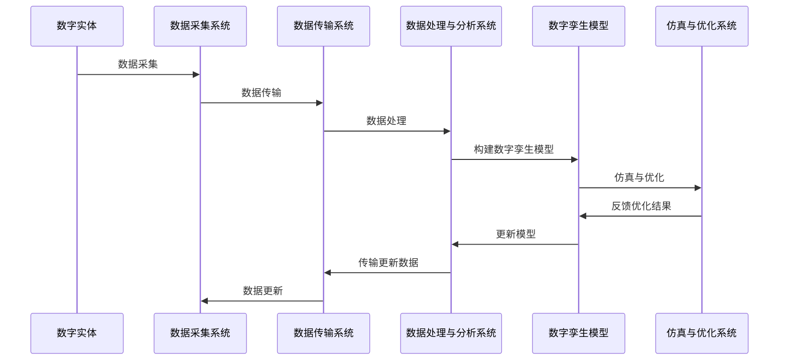
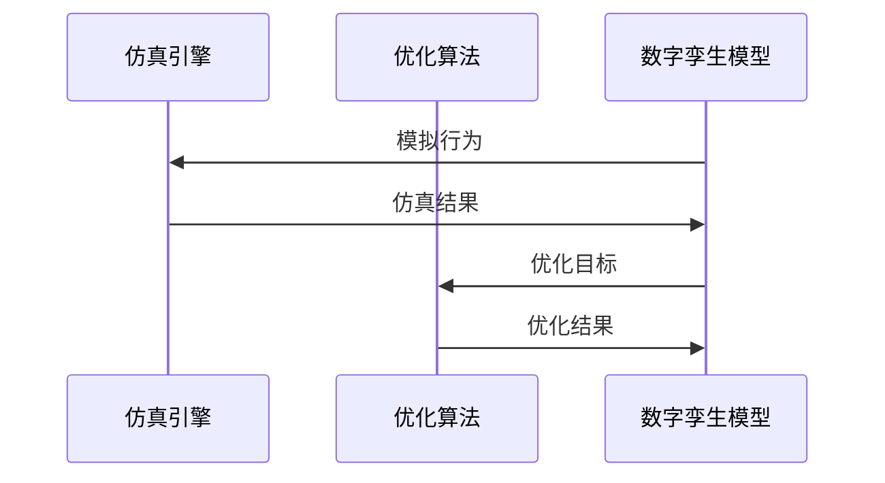
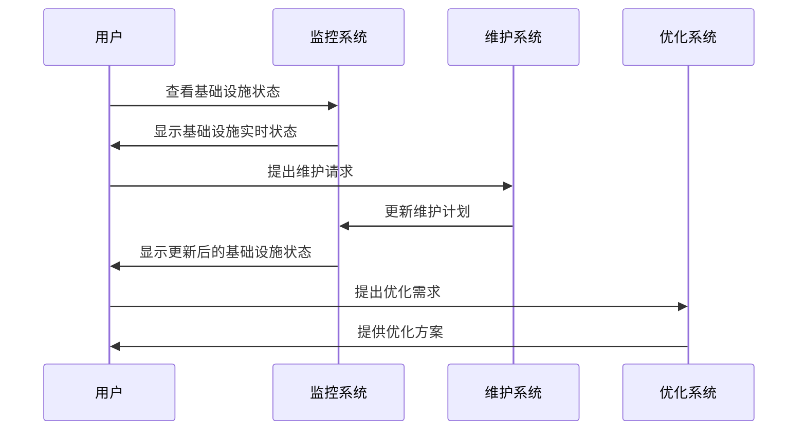
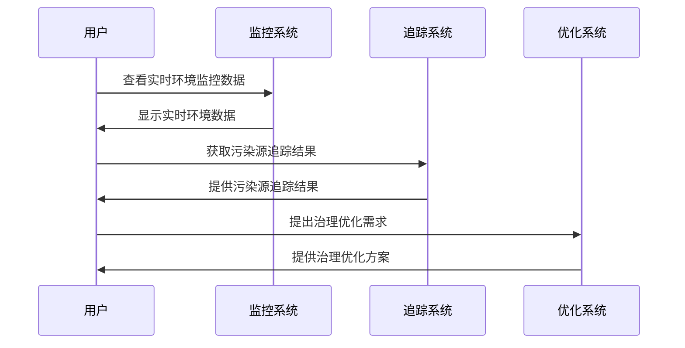

                 

### 第1章：数字孪生技术背景与基础

#### 1.1 数字孪生技术的起源与发展

数字孪生（Digital Twin）的概念最早由迈克尔·格里夫斯（Michael Grieves）在2002年提出，指的是通过数字化方式创建物理实体的虚拟复制体，以实现实时监测、模拟与优化。这一概念的提出，标志着数字技术与物理世界融合的初步尝试。

##### 从概念到应用：数字孪生技术发展的里程碑

1. **工业革命2.0：数字化初步阶段**（20世纪末至21世纪初）
   - 信息技术与自动化技术初步融合，数字化生产逐渐兴起。
   - 这一阶段的代表性应用包括计算机辅助设计（CAD）和制造执行系统（MES）。

2. **工业革命4.0：智能制造阶段**（2010年至今）
   - 数字孪生技术被引入智能制造领域，成为提升生产效率和质量的关键技术。
   - 这一阶段的代表性应用包括智能制造生产线、设备健康监测、供应链优化等。

3. **智慧城市阶段**（2010年至今）
   - 数字孪生技术开始应用于城市规划和管理，成为智慧城市建设的重要组成部分。
   - 这一阶段的代表性应用包括智慧交通管理、智慧能源管理、智慧城市基础设施管理等。

#### 1.2 数字孪生技术的基本概念

数字孪生技术通过建立一个与物理实体相对应的数字模型，实现对实体的实时监控、模拟与优化。数字孪生技术主要包括以下几个核心组成部分：

1. **物理实体**：现实世界的物理对象，如建筑物、基础设施等。
2. **数字模型**：物理实体的数字化表示，包括几何模型、物理属性模型等。
3. **数据采集系统**：用于收集物理实体的运行数据，如温度、湿度、压力等。
4. **数据处理与分析系统**：对采集到的数据进行分析和处理，以实现对物理实体的实时监控和优化。

##### 核心概念与联系

数字孪生技术涉及多个核心概念，如虚拟现实（VR）、增强现实（AR）、物联网（IoT）等。这些概念之间的联系如下：

| 关键概念 | 概念属性特征对比表格 |
| --- | --- |
| 虚拟现实（VR） | 通过计算机生成三维虚拟环境，用户通过特定设备（如VR头盔）进行沉浸式体验。 |
| 增强现实（AR） | 在现实环境中叠加虚拟元素，用户通过移动设备或AR眼镜等设备进行交互。 |
| 物联网（IoT） | 通过传感器和通信技术，将物理实体连接到互联网，实现数据的实时采集和传输。 |
| 数字孪生（Digital Twin） | 通过虚拟现实、增强现实、物联网等技术，创建物理实体的数字模型，实现实时监控、模拟与优化。 |

##### ER实体关系图架构

以下是一个简单的ER实体关系图，展示了数字孪生技术中关键实体之间的关系：

```mermaid
erDiagram
  物理实体 ||--o> 数字模型 : "具有"
  数字模型 ||--o> 数据采集系统 : "采集"
  数据采集系统 ||--o> 数据处理与分析系统 : "处理"
```

#### 1.3 数字孪生技术的重要性与应用领域

数字孪生技术的重要性体现在以下几个方面：

1. **提高生产效率与质量**：通过实时监控和优化，提高生产效率，降低生产成本。
   - **数学模型**：生产效率 = 生产量 / 生产时间，通过数字孪生技术，可以实时监测生产过程中的各个环节，及时发现并解决问题，从而提高生产效率。
   - **公式**：降低生产成本 = 提高生产效率 × 减少资源浪费。

2. **减少维护成本**：通过预测性维护，降低设备的故障率和维修成本。
   - **数学模型**：维护成本 = 预测性维护成本 + 故障维修成本，通过数字孪生技术，可以提前预测设备可能出现的故障，进行针对性的维护，从而降低故障维修成本。

3. **提升安全性**：通过实时监控和风险预警，提高系统的安全性和可靠性。
   - **数学模型**：安全性 = 实时监控能力 × 风险预警能力，数字孪生技术可以实现实时数据采集和风险分析，从而提高系统的安全性和可靠性。

数字孪生技术主要应用领域包括：

1. **智能制造**：在生产线中实现对设备、产品的实时监控和优化。
   - **案例**：特斯拉（Tesla）通过数字孪生技术，对汽车生产线进行实时监控和优化，提高了生产效率，降低了生产成本。

2. **智慧城市**：在智慧交通、智慧能源、环境监测等领域实现对城市基础设施的实时管理和优化。
   - **案例**：新加坡（Singapore）通过数字孪生技术，对城市交通系统进行实时监控和管理，提高了交通效率和安全性。

3. **医疗健康**：通过数字孪生技术，实现对病人的实时监控和治疗优化。
   - **案例**：梅奥诊所（Mayo Clinic）通过数字孪生技术，对病人的病情进行实时监控和分析，提高了治疗效果。

#### 1.4 数字孪生技术在智慧城市规划中的应用前景

随着数字技术的不断发展，数字孪生技术在智慧城市规划中的应用前景十分广阔。以下是几个具有代表性的应用场景：

1. **城市基础设施管理**：通过数字孪生技术，实现对城市基础设施（如桥梁、道路、隧道等）的实时监控和维护。
   - **案例**：纽约市（New York City）通过数字孪生技术，对城市桥梁进行实时监控，提高了桥梁的安全性和使用寿命。

2. **智慧交通系统**：通过数字孪生技术，实现对交通流量、交通设施的实时监控和管理，提高交通效率和安全性。
   - **案例**：伦敦市（London）通过数字孪生技术，对城市交通系统进行实时监控和管理，提高了交通效率和安全性。

3. **智慧能源管理**：通过数字孪生技术，实现对能源生产、传输、消费的实时监控和管理，提高能源利用效率。
   - **案例**：德国（Germany）通过数字孪生技术，对可再生能源进行实时监控和管理，提高了能源利用效率。

#### 1.5 数字孪生技术的优势与挑战

数字孪生技术的优势主要体现在以下几个方面：

1. **实时监控**：通过实时数据采集和分析，实现对物理实体的实时监控。
2. **预测性维护**：通过数据分析，提前预测设备可能出现的故障，进行针对性的维护。
3. **优化决策**：通过对实时数据的分析，为决策者提供科学的决策依据。

然而，数字孪生技术也面临着一些挑战：

1. **数据采集与处理**：如何高效地采集和处理海量数据，是一个重要问题。
2. **安全与隐私**：如何在保证数据安全的同时，保护用户隐私。
3. **技术成熟度**：虽然数字孪生技术在不断进步，但仍然存在一些技术瓶颈，如实时数据同步、数据一致性等。

#### 1.6 小结

本章主要介绍了数字孪生技术的背景、基本概念、重要性、应用领域以及未来发展趋势。通过对数字孪生技术的深入理解，我们可以更好地把握其在智慧城市规划中的应用，为城市的可持续发展提供有力支持。

----------------------------------------------------------------

### 第2章：数字孪生技术的架构与组成

#### 2.1 数字孪生技术的整体架构

数字孪生技术的整体架构通常包括数据采集、数据传输、数据处理、数字孪生模型、仿真与优化等环节。以下是数字孪生技术的整体架构图：



##### 数据采集系统

数据采集系统是数字孪生技术的核心组成部分之一，主要负责从物理实体中采集各种运行数据。这些数据可以是结构化数据（如传感器数据、日志数据等），也可以是非结构化数据（如图像、音频等）。数据采集系统通常包括以下几个关键组件：

1. **传感器**：用于采集物理实体的各种运行参数，如温度、湿度、压力、速度等。
2. **数据采集器**：将传感器采集到的数据转换为数字信号，并进行初步处理。
3. **通信模块**：将处理后的数据通过有线或无线方式传输到数据处理与分析系统。

##### 数据传输系统

数据传输系统负责将数据采集系统采集到的数据传输到数据处理与分析系统。数据传输系统的设计需要考虑数据量、传输速度、传输可靠性等因素。常用的数据传输方式包括：

1. **局域网（LAN）**：在本地网络内进行数据传输，适用于数据量较小、传输速度要求较高的场景。
2. **广域网（WAN）**：通过互联网进行数据传输，适用于跨地域的数据传输。
3. **无线传输**：如Wi-Fi、蓝牙、LoRa等，适用于无线环境下的数据传输。

##### 数据处理与分析系统

数据处理与分析系统负责对采集到的数据进行分析和处理，以实现对物理实体的实时监控和优化。数据处理与分析系统通常包括以下几个关键组件：

1. **数据存储**：用于存储大量历史数据，如关系型数据库、NoSQL数据库等。
2. **数据清洗**：对采集到的数据进行清洗，去除无效数据、噪声数据等。
3. **数据分析**：对清洗后的数据进行统计分析、机器学习等，以提取有价值的信息。
4. **数据可视化**：将分析结果以图表、仪表盘等形式呈现，便于决策者进行决策。

##### 数字孪生模型

数字孪生模型是数字孪生技术的核心，它是对物理实体的数字化表示。数字孪生模型通常包括以下几个关键组成部分：

1. **几何模型**：描述物理实体的几何形状和尺寸，如3D模型等。
2. **物理属性模型**：描述物理实体的物理属性，如材料属性、力学属性等。
3. **行为模型**：描述物理实体的行为，如运动状态、温度变化等。
4. **状态模型**：描述物理实体的状态，如运行状态、健康状态等。

##### 仿真与优化系统

仿真与优化系统负责对数字孪生模型进行仿真和优化，以实现对物理实体的预测和优化。仿真与优化系统通常包括以下几个关键组件：

1. **仿真引擎**：用于对数字孪生模型进行仿真，模拟物理实体的行为。
2. **优化算法**：用于对仿真结果进行优化，以实现物理实体的最优运行状态。
3. **决策支持系统**：用于为决策者提供科学的决策依据。

#### 2.2 数字孪生数据模型

数字孪生数据模型是数字孪生技术的核心组成部分，它用于描述物理实体在数字世界中的状态和行为。数字孪生数据模型通常包括以下几个关键要素：

1. **实体模型**：描述物理实体的基本信息，如ID、名称、类型等。
2. **属性模型**：描述物理实体的各种属性，如尺寸、重量、温度等。
3. **状态模型**：描述物理实体的状态，如运行状态、健康状态等。
4. **行为模型**：描述物理实体的行为，如运动状态、温度变化等。
5. **关系模型**：描述物理实体之间的关联关系，如父子关系、兄弟关系等。

以下是一个简单的数字孪生数据模型的ER图：

```mermaid
erDiagram
  实体 ||--o> 属性 : "具有"
  实体 ||--o> 状态 : "处于"
  实体 ||--o> 行为 : "执行"
  实体 ||--o> 关系 : "关联"
```

#### 2.3 数字孪生仿真与优化技术

数字孪生仿真与优化技术是数字孪生技术的核心组成部分，它用于对物理实体进行仿真和优化。仿真与优化技术通常包括以下几个关键步骤：

1. **仿真**：通过仿真引擎对数字孪生模型进行仿真，模拟物理实体的行为。
2. **优化**：通过优化算法对仿真结果进行优化，以实现物理实体的最优运行状态。
3. **反馈**：将优化结果反馈给数字孪生模型，更新模型参数。

以下是一个简单的数字孪生仿真与优化技术的流程图：



#### 2.4 数字孪生技术的应用案例

数字孪生技术在各个领域都有广泛的应用，以下是几个具有代表性的应用案例：

1. **智能制造**：在汽车制造领域，通过数字孪生技术，实现对生产线的实时监控和优化，提高了生产效率和产品质量。
2. **智慧城市**：在交通管理领域，通过数字孪生技术，实现对交通流量的实时监控和管理，提高了交通效率和安全性。
3. **医疗健康**：在医疗领域，通过数字孪生技术，实现对病人的实时监控和治疗方案优化，提高了医疗质量和效率。

#### 2.5 小结

本章主要介绍了数字孪生技术的整体架构、数据模型、仿真与优化技术以及应用案例。通过对数字孪生技术的深入理解，我们可以更好地把握其在各个领域的应用，为实际问题的解决提供有力支持。

----------------------------------------------------------------

### 第3章：数字孪生技术在智慧城市规划中的应用场景

数字孪生技术在智慧城市规划中的应用场景广泛且多样化，其核心在于通过建立城市各个部分的数字模型，实现对物理实体的实时监控、仿真和优化。以下将详细探讨数字孪生技术在智慧城市规划中的一些关键应用场景：

#### 3.1 城市基础设施管理

城市基础设施是保障城市正常运行的核心要素，包括桥梁、道路、隧道、水处理设施等。数字孪生技术在城市基础设施管理中的应用，主要体现在以下几个方面：

1. **实时监控与维护**：通过数字孪生技术，可以实时监控基础设施的运行状态，如温度、湿度、应力等参数，及时发现潜在的问题，进行预防性维护，避免突发性故障。
2. **优化资源分配**：利用数字孪生模型，可以模拟不同情况下基础设施的运行状态，为资源分配提供科学依据，例如，优化交通流量，减少拥堵，提高道路利用率。
3. **延长使用寿命**：通过仿真和优化技术，可以模拟基础设施在不同环境条件下的性能表现，预测其寿命，制定科学的维护计划，延长基础设施的使用寿命。

##### 案例分析

例如，纽约市的桥梁管理系统利用数字孪生技术，对纽约市的主要桥梁进行实时监控和预测性维护。通过对桥梁的结构健康监测，及时发现裂缝、变形等问题，并进行针对性的修复，大大延长了桥梁的使用寿命，降低了维护成本。

#### 3.2 智慧交通系统

智慧交通系统是数字孪生技术在智慧城市规划中的重要应用之一。通过数字孪生技术，可以实现交通流量的实时监控、预测和优化。

1. **实时交通监控**：利用传感器和摄像头，收集交通流量、车速、道路状况等数据，通过数字孪生模型进行实时处理和可视化，为交通管理提供数据支持。
2. **交通流量预测**：基于历史数据和实时数据，利用机器学习算法，预测交通流量变化趋势，为交通信号优化提供依据。
3. **信号优化**：通过仿真和优化技术，对交通信号进行优化，提高道路的通行能力，减少拥堵，提高交通效率。

##### 案例分析

伦敦的智能交通系统是数字孪生技术在智慧交通领域的一个成功案例。通过数字孪生技术，伦敦交通部门实现了对交通流量的实时监控和预测，对交通信号进行动态优化，有效减少了城市拥堵，提高了交通效率。

#### 3.3 智慧能源管理

智慧能源管理是数字孪生技术在能源领域的重要应用，通过数字孪生技术，可以实现能源生产、传输、消费的实时监控和优化。

1. **能源生产监控**：通过传感器和智能设备，实时监控能源生产过程，如太阳能电站的发电量、风力电站的转速等。
2. **能源传输优化**：通过数字孪生模型，模拟能源传输网络，优化能源传输路径，减少损耗，提高传输效率。
3. **能源消费管理**：通过对家庭和企业能源消费的实时监控，提供节能建议，优化能源使用。

##### 案例分析

德国的可再生能源管理系统是数字孪生技术在智慧能源管理领域的一个成功案例。通过数字孪生技术，德国实现了对可再生能源生产、传输和消费的实时监控和优化，提高了能源利用效率，减少了碳排放。

#### 3.4 环境监测与治理

数字孪生技术在环境监测与治理中的应用，可以帮助实现环境数据的实时采集和分析，为环境治理提供科学依据。

1. **环境数据采集**：通过传感器网络，实时采集空气质量、水质、土壤等环境数据。
2. **污染源追踪**：通过数字孪生模型，模拟污染源扩散过程，追踪污染来源，为污染治理提供依据。
3. **环境治理优化**：利用仿真和优化技术，模拟不同治理措施的效应，优化治理策略，提高治理效果。

##### 案例分析

新加坡的环境监测系统是数字孪生技术在环境监测与治理领域的一个成功案例。通过数字孪生技术，新加坡实现了对空气质量、水质等环境数据的实时监测和分析，及时发现污染源，优化治理措施，有效改善了城市环境质量。

#### 3.5 综合智能管理

数字孪生技术还可以在城市综合智能管理中发挥重要作用，通过整合不同领域的数字孪生模型，实现城市整体运行的优化。

1. **城市运行监控**：通过数字孪生技术，实时监控城市的各个方面，如交通、能源、环境等，为城市管理者提供全面的信息支持。
2. **应急响应**：在突发事件发生时，利用数字孪生模型，快速评估影响范围，制定应急响应计划。
3. **可持续发展**：通过仿真和优化技术，模拟不同政策、措施对城市发展的影响，制定可持续发展策略。

##### 案例分析

深圳的智慧城市项目是数字孪生技术在综合智能管理领域的一个成功案例。通过数字孪生技术，深圳实现了对城市运行状态的实时监控和优化，有效提高了城市管理水平，推动了城市的可持续发展。

#### 3.6 小结

数字孪生技术在智慧城市规划中的应用场景多样，通过实时监控、仿真和优化，可以有效提升城市基础设施管理、智慧交通系统、智慧能源管理、环境监测与治理等领域的运行效率和管理水平。随着技术的不断发展，数字孪生技术将在智慧城市建设中发挥更加重要的作用。

----------------------------------------------------------------

### 第4章：数字孪生技术在智慧城市规划中的实施方法

在智慧城市规划中，数字孪生技术的实施是一项系统工程，涉及到数据采集、模型构建、运行与维护等多个环节。以下是数字孪生技术在智慧城市规划中的具体实施方法：

#### 4.1 数据采集与整合

数据采集是数字孪生技术的核心环节，数据的质量和完整性直接影响到数字孪生模型的准确性。以下是数据采集与整合的方法：

1. **传感器部署**：根据需要监测的物理实体，选择合适的传感器，如温度传感器、湿度传感器、摄像头等，并将其部署在关键位置。
2. **数据采集系统设计**：设计高效、可靠的数据采集系统，包括传感器数据采集模块、数据传输模块、数据存储模块等。
3. **数据整合**：通过数据采集系统，将不同来源、不同格式的数据进行整合，确保数据的完整性和一致性。

##### 案例分析

例如，在智慧交通系统中，数据采集系统可以包括交通流量监测传感器、车速监测传感器、摄像头等，通过无线传输将数据发送到中心数据处理系统。

#### 4.2 建立数字孪生模型

数字孪生模型的构建是数字孪生技术的关键，它是实现智慧城市规划的基础。以下是建立数字孪生模型的方法：

1. **实体建模**：根据实际需求，对物理实体进行建模，包括几何模型、物理属性模型、行为模型等。
2. **数据映射**：将采集到的数据映射到数字孪生模型中，确保模型能够准确反映物理实体的状态。
3. **模型整合**：将不同来源的数字孪生模型进行整合，形成完整的数字孪生系统。

##### 案例分析

例如，在智慧能源管理中，可以建立电力网络的数字孪生模型，包括发电站、变电站、输电线路等，通过实时数据更新，模拟电力网络的运行状态。

#### 4.3 运行与维护策略

数字孪生技术的运行与维护是确保其长期有效运行的关键，以下是运行与维护的策略：

1. **实时监控**：通过数字孪生系统，实时监控物理实体的运行状态，及时发现异常情况。
2. **仿真优化**：利用数字孪生模型，对物理实体的运行进行仿真和优化，提高其运行效率。
3. **数据更新**：定期对数字孪生模型进行数据更新，确保模型的准确性和实时性。

##### 案例分析

例如，在智慧城市建设中，可以定期对城市的数字孪生模型进行数据更新，包括交通流量、空气质量、用水量等，确保数字孪生系统的实时性和准确性。

#### 4.4 风险管理

数字孪生技术在智慧城市规划中的应用面临多种风险，包括数据安全风险、技术风险等。以下是风险管理的策略：

1. **数据安全**：确保数据传输、存储的安全性，采用加密、访问控制等技术，防止数据泄露。
2. **技术风险**：对数字孪生技术进行持续研究和技术更新，确保技术的先进性和可靠性。
3. **应急预案**：制定应急预案，应对数字孪生系统可能出现的故障和异常。

##### 案例分析

例如，在智慧交通系统中，可以制定数据泄露的应急预案，包括数据备份、恢复和数据加密等，确保交通数据的安全。

#### 4.5 成本效益分析

数字孪生技术在智慧城市规划中的实施，需要进行成本效益分析，确保其经济可行性。以下是成本效益分析的方法：

1. **成本计算**：计算数字孪生技术的实施成本，包括设备采购、系统开发、运维成本等。
2. **效益评估**：评估数字孪生技术带来的经济效益，包括提高效率、降低成本、提升服务质量等。
3. **综合评估**：综合成本和效益，评估数字孪生技术的经济可行性。

##### 案例分析

例如，在智慧能源管理中，通过数字孪生技术，可以降低能源损耗，提高能源利用率，从而实现经济效益。

#### 4.6 法规与政策支持

数字孪生技术在智慧城市规划中的应用，需要法规与政策支持，为技术应用提供法律保障。以下是法规与政策支持的内容：

1. **数据保护法规**：制定数据保护法规，确保数据安全，为数字孪生技术应用提供法律基础。
2. **技术标准**：制定数字孪生技术标准，规范技术应用，提高系统兼容性和互操作性。
3. **政策支持**：出台相关政策，鼓励数字孪生技术在智慧城市规划中的应用，提供资金、技术支持。

##### 案例分析

例如，中国政府出台了《智慧城市发展战略》，鼓励数字孪生技术在智慧城市建设中的应用，提供资金和政策支持。

#### 4.7 小结

数字孪生技术在智慧城市规划中的应用，需要科学的数据采集、模型构建、运行维护和风险管理。通过有效的实施方法，可以充分发挥数字孪生技术的优势，提高城市运行效率，实现可持续发展。

----------------------------------------------------------------

### 第5章：数字孪生技术的挑战与未来发展

#### 5.1 技术挑战

尽管数字孪生技术在智慧城市规划中具有巨大的潜力，但其实施和应用过程中仍然面临着一系列技术挑战：

1. **数据采集与处理**：数字孪生技术依赖于大量的实时数据，这些数据的采集、传输和处理需要高效且可靠的技术支持。尤其是在大规模、复杂的城市环境中，数据量的巨大增长对数据处理能力提出了更高的要求。
2. **数据隐私与安全**：城市基础设施和居民数据的安全至关重要，数据泄露和隐私侵犯可能导致严重后果。因此，如何确保数据在采集、传输和存储过程中的安全性，是一个亟待解决的问题。
3. **数据标准化与兼容性**：不同来源、不同格式、不同标准的数据在整合过程中，常常面临兼容性问题。缺乏统一的数据标准和格式，会限制数字孪生系统的互操作性和扩展性。
4. **实时仿真与优化**：数字孪生技术要求对物理实体进行实时仿真和优化，这需要高效的算法和强大的计算能力。如何在保证实时性的同时，提高仿真和优化的准确性和效率，是一个技术难题。

##### 技术挑战案例分析

- **数据采集与处理**：在智慧交通系统中，实时采集和传输大量的交通流量数据，需要高效的传感器网络和数据处理平台。例如，纽约市的智能交通系统就面临这样的挑战，通过部署高效的数据采集和处理设备，实现了对交通流量的实时监控。
- **数据隐私与安全**：在智慧医疗领域，患者的医疗数据非常敏感。例如，梅奥诊所（Mayo Clinic）在实施数字孪生技术时，采用了严格的数据加密和访问控制策略，确保患者数据的安全。

#### 5.2 政策与标准

为了促进数字孪生技术在智慧城市规划中的应用，政策和标准的制定至关重要。以下是需要关注的关键政策和标准：

1. **数据保护法规**：制定数据保护法规，确保数据在采集、传输和存储过程中的安全性。例如，欧盟的《通用数据保护条例》（GDPR）为数据隐私提供了严格的保护。
2. **技术标准**：制定统一的技术标准，规范数字孪生技术的开发和应用。例如，国际标准化组织（ISO）发布了数字孪生技术的相关标准，为数字孪生系统的互操作性和兼容性提供了基础。
3. **政策支持**：出台鼓励数字孪生技术研究和应用的优惠政策，提供资金、技术支持和人才培养。例如，中国政府在《新型城镇化规划》中提出了推动智慧城市建设的政策，为数字孪生技术的应用提供了政策支持。

##### 政策与标准案例分析

- **数据保护法规**：欧盟的《通用数据保护条例》（GDPR）对数据隐私保护提出了严格的要求，要求企业采取数据加密、访问控制等技术措施，确保个人数据的安全。
- **技术标准**：国际标准化组织（ISO）发布了ISO 23247《数字孪生—定义、框架与参考架构》，为数字孪生技术的开发和应用提供了标准化的指导。

#### 5.3 未来发展趋势

随着技术的不断进步，数字孪生技术在智慧城市规划中的应用前景十分广阔。以下是几个可能的发展趋势：

1. **人工智能的融合**：人工智能（AI）的快速发展将为数字孪生技术带来新的机遇。通过将AI技术与数字孪生技术相结合，可以实现更加智能化的数据分析和决策支持。
2. **物联网的普及**：物联网（IoT）的普及将进一步提升数字孪生技术的数据采集能力。随着更多设备和传感器的接入，数字孪生系统可以获取更加丰富的数据，实现更精细的监控和优化。
3. **云计算与边缘计算的结合**：云计算和边缘计算的结合将提供更加灵活和高效的数据处理平台。通过云计算提供强大的计算能力和数据存储能力，边缘计算实现数据的实时处理和本地决策，可以更好地支持数字孪生技术的实时性和可靠性。
4. **数据开放与共享**：随着数据开放和共享的推动，数字孪生技术将能够获取更多来自政府、企业和研究机构的公开数据，实现更大范围的数据整合和应用。

##### 未来发展趋势案例分析

- **人工智能的融合**：在智慧交通系统中，通过将AI技术与数字孪生技术相结合，可以实现更加智能的交通流量预测和信号优化，如伦敦的智能交通系统已经应用了基于AI的交通流量预测算法。
- **物联网的普及**：在智慧能源管理中，通过物联网技术的普及，可以实现能源生产、传输和消费的全面监控和优化，如德国的可再生能源管理系统已经广泛应用了物联网技术。
- **云计算与边缘计算的结合**：在智慧城市基础设施建设中，通过云计算提供强大的计算能力和数据存储能力，边缘计算实现数据的实时处理和本地决策，如纽约市的智能交通系统采用了云计算和边缘计算相结合的架构。

#### 5.4 小结

数字孪生技术在智慧城市规划中的应用面临着技术、政策和标准等多方面的挑战。随着技术的不断进步，数字孪生技术将在智慧城市建设中发挥越来越重要的作用。通过有效的政策支持和标准化工作，可以推动数字孪生技术的健康发展，实现智慧城市的可持续发展。

----------------------------------------------------------------

### 第6章：成功案例分析

数字孪生技术在智慧城市规划中的成功应用，不仅提升了城市的管理效率，还改善了居民的生活质量。以下是三个具有代表性的成功案例，通过这些案例，我们可以深入了解数字孪生技术在不同应用场景中的实际效果。

#### 6.1 案例一：数字孪生在城市基础设施建设中的应用

**项目背景**：某城市面临着基础设施老化、维护成本高等问题，急需通过创新技术手段提升基础设施的管理效率。

**项目介绍**：该城市引入了数字孪生技术，建立了城市基础设施的数字孪生模型，包括桥梁、道路、隧道等。通过传感器网络，实时采集基础设施的运行数据，如温度、湿度、应力等，并将数据传输到数字孪生模型进行实时监控和分析。

**系统功能设计**：
1. **实时监控**：数字孪生模型实时显示基础设施的运行状态，为管理人员提供直观的监控界面。
2. **预测性维护**：基于历史数据和实时数据，系统可以预测潜在的问题，并提供维护建议，实现预防性维护。
3. **优化资源分配**：系统通过仿真和优化技术，模拟不同情况下基础设施的运行状态，为资源分配提供科学依据。

**系统架构设计**：
- **数据采集层**：包括各种传感器和采集设备，负责实时数据采集。
- **数据传输层**：采用无线通信技术，将数据传输到数据中心。
- **数据处理与分析层**：对采集到的数据进行处理和分析，构建数字孪生模型。
- **数字孪生模型层**：实现对基础设施的实时监控和仿真。
- **决策支持层**：基于数字孪生模型，提供决策支持和优化建议。

**系统接口设计**：
- **监控接口**：为管理人员提供实时的监控数据和可视化界面。
- **维护接口**：提供维护建议和应急预案。
- **优化接口**：提供资源分配和优化方案。

**系统交互序列图**：


**实际案例分析和详细讲解**：
- **基础设施监控**：通过数字孪生技术，管理人员可以实时监控桥梁的健康状况，如应力分布、温度变化等，及时发现潜在的问题。
- **预测性维护**：系统通过分析历史数据和实时数据，可以预测桥梁的寿命，提前进行维护，避免突发性故障。
- **资源优化**：系统根据实时数据和仿真结果，优化资源分配，提高基础设施的运行效率。

**项目小结**：通过数字孪生技术，该城市实现了对基础设施的实时监控、预测性维护和资源优化，提高了基础设施的管理效率，降低了维护成本，提升了城市运行的安全性和可靠性。

#### 6.2 案例二：数字孪生在智慧交通系统中的应用

**项目背景**：某城市交通拥堵严重，交通效率低下，急需通过技术手段提升交通管理水平。

**项目介绍**：该城市利用数字孪生技术，建立了城市交通的数字孪生模型，通过传感器网络和摄像头，实时采集交通流量、车速、道路状况等数据，并将数据传输到数字孪生模型进行实时监控和分析。

**系统功能设计**：
1. **实时交通监控**：数字孪生模型实时显示交通流量、车速、道路状况等，为交通管理人员提供直观的监控界面。
2. **交通流量预测**：基于历史数据和实时数据，系统可以预测交通流量变化趋势，为交通信号优化提供依据。
3. **信号优化**：系统通过仿真和优化技术，优化交通信号，提高交通效率。

**系统架构设计**：
- **数据采集层**：包括传感器、摄像头等，负责实时数据采集。
- **数据传输层**：采用无线通信技术，将数据传输到数据中心。
- **数据处理与分析层**：对采集到的数据进行处理和分析，构建数字孪生模型。
- **数字孪生模型层**：实现对交通流量的实时监控和仿真。
- **决策支持层**：基于数字孪生模型，提供交通流量预测和信号优化建议。

**系统接口设计**：
- **监控接口**：为交通管理人员提供实时的交通监控数据。
- **预测接口**：提供交通流量预测结果。
- **优化接口**：提供信号优化方案。

**系统交互序列图**：


**实际案例分析和详细讲解**：
- **实时交通监控**：通过数字孪生技术，交通管理人员可以实时监控城市的交通状况，及时发现拥堵点和事故点，进行及时的交通调度。
- **交通流量预测**：系统通过分析历史数据和实时数据，可以预测未来的交通流量变化，为交通信号优化提供科学依据。
- **信号优化**：系统通过仿真和优化技术，模拟不同信号方案的效果，选择最优方案，提高交通效率。

**项目小结**：通过数字孪生技术，该城市实现了对交通流量的实时监控、预测和优化，有效减少了交通拥堵，提升了交通效率，改善了居民的出行体验。

#### 6.3 案例三：数字孪生在环境监测与治理中的应用

**项目背景**：某城市空气质量问题严重，环境污染问题突出，急需通过技术手段改善环境质量。

**项目介绍**：该城市引入了数字孪生技术，建立了城市环境的数字孪生模型，通过传感器网络，实时采集空气质量、水质、土壤等环境数据，并将数据传输到数字孪生模型进行实时监控和分析。

**系统功能设计**：
1. **实时环境监控**：数字孪生模型实时显示环境数据，为环境管理人员提供直观的监控界面。
2. **污染源追踪**：系统通过数据分析，追踪污染源的扩散路径，为污染治理提供依据。
3. **环境治理优化**：系统通过仿真和优化技术，模拟不同治理措施的效应，优化治理策略。

**系统架构设计**：
- **数据采集层**：包括各种传感器，负责实时数据采集。
- **数据传输层**：采用无线通信技术，将数据传输到数据中心。
- **数据处理与分析层**：对采集到的数据进行处理和分析，构建数字孪生模型。
- **数字孪生模型层**：实现对环境的实时监控和仿真。
- **决策支持层**：基于数字孪生模型，提供污染源追踪和治理优化建议。

**系统接口设计**：
- **监控接口**：为环境管理人员提供实时的环境监控数据。
- **追踪接口**：提供污染源追踪结果。
- **优化接口**：提供治理优化方案。

**系统交互序列图**：


**实际案例分析和详细讲解**：
- **实时环境监控**：通过数字孪生技术，环境管理人员可以实时监控空气质量、水质等环境指标，及时发现环境问题。
- **污染源追踪**：系统通过数据分析，追踪污染源的扩散路径，为污染治理提供科学依据。
- **环境治理优化**：系统通过仿真和优化技术，模拟不同治理措施的效应，选择最优方案，提高治理效果。

**项目小结**：通过数字孪生技术，该城市实现了对环境的实时监控、污染源追踪和治理优化，有效改善了空气质量，提升了环境治理水平。

### 第7章：数字孪生技术在智慧城市规划中的最佳实践

在智慧城市规划中，数字孪生技术的成功应用离不开科学的实践方法和最佳策略。以下是数字孪生技术在智慧城市规划中的最佳实践策略：

#### 7.1 实践策略

1. **顶层设计**：在项目启动阶段，制定明确的数字孪生技术应用目标和规划，确保项目的方向和进度。
2. **技术选型**：根据项目需求，选择合适的技术和工具，如传感器、数据处理平台、数字孪生模型等，确保技术选型的先进性和适用性。
3. **数据驱动**：以数据为核心，建立完整的数据采集、处理、分析和应用体系，确保数字孪生模型的质量和准确性。
4. **协同合作**：建立跨部门、跨领域的合作机制，实现数据共享和资源整合，提高数字孪生系统的协同效应。
5. **持续优化**：通过持续的迭代和优化，不断提升数字孪生系统的性能和效果，实现智慧城市规划的持续改进。

#### 7.2 成功因素

1. **领导支持**：项目的成功离不开领导的支持和推动，领导层的重视和参与对项目的顺利进行至关重要。
2. **技术积累**：项目团队需要具备扎实的技术积累和经验，能够快速应对项目中的技术挑战。
3. **数据质量**：高质量的数据是数字孪生系统的基础，数据采集、处理和分析的准确性和完整性直接影响系统的效果。
4. **用户参与**：用户的积极参与和反馈对系统的优化和改进具有重要意义，用户的满意度是项目成功的重要指标。
5. **政策支持**：政策的支持和鼓励为数字孪生技术的应用提供了良好的外部环境，有助于项目的顺利推进。

#### 7.3 风险与应对措施

1. **数据安全风险**：数据泄露和隐私侵犯是数字孪生技术面临的主要风险，应采取严格的数据加密和访问控制措施，确保数据安全。
2. **技术成熟度风险**：数字孪生技术仍处于快速发展阶段，技术成熟度可能影响项目的实施效果，应选择成熟可靠的技术方案，并保持对新技术的研究和跟踪。
3. **资金风险**：数字孪生技术的实施需要大量资金投入，应制定详细的资金预算和融资计划，确保项目的资金来源。
4. **政策风险**：政策的变动可能影响项目的推进和实施，应密切关注政策动态，及时调整项目策略。

#### 7.4 小结

数字孪生技术在智慧城市规划中的应用需要科学的实践方法和最佳策略。通过顶层设计、技术选型、数据驱动、协同合作和持续优化，可以确保数字孪生技术的成功应用，为智慧城市的建设提供有力支持。

----------------------------------------------------------------

### 第8章：总结与展望

#### 8.1 总结

本章通过详细探讨数字孪生技术在智慧城市规划中的应用，总结了数字孪生技术的基本概念、架构组成、应用场景、实施方法以及挑战与未来发展。以下是对数字孪生技术在智慧城市规划中的应用进行总结：

1. **基本概念**：数字孪生技术是通过建立物理实体的数字化副本，实现对实体的实时监控、仿真和优化。
2. **架构组成**：数字孪生技术的架构包括数据采集、数据传输、数据处理、数字孪生模型、仿真与优化等环节。
3. **应用场景**：数字孪生技术在智慧城市规划中广泛应用于城市基础设施管理、智慧交通系统、智慧能源管理、环境监测与治理等领域。
4. **实施方法**：数字孪生技术的实施包括数据采集与整合、数字孪生模型构建、运行与维护策略等关键步骤。
5. **挑战与未来**：数字孪生技术在智慧城市规划中面临数据采集与处理、数据隐私与安全、技术成熟度等挑战，但未来随着技术的进步，数字孪生技术将在智慧城市发展中发挥更加重要的作用。

#### 8.2 展望未来

随着数字技术的快速发展，数字孪生技术在智慧城市规划中的应用前景十分广阔。以下是对未来发展的展望：

1. **人工智能与数字孪生技术融合**：人工智能（AI）的快速发展将为数字孪生技术带来新的机遇，通过将AI技术与数字孪生技术相结合，可以实现更加智能的数据分析和决策支持，提升智慧城市的管理效率。
2. **物联网的进一步普及**：物联网（IoT）的进一步普及将大幅提升数字孪生技术的数据采集能力，实现更精细、更实时的监控和优化。
3. **云计算与边缘计算的协同**：云计算和边缘计算的协同将为数字孪生技术提供更加灵活和高效的数据处理平台，实现实时数据处理和本地决策，提升数字孪生系统的实时性和可靠性。
4. **数据开放与共享**：随着数据开放和共享的推动，数字孪生技术将能够获取更多来自政府、企业和研究机构的公开数据，实现更大范围的数据整合和应用。
5. **政策与标准的不断完善**：随着数字孪生技术的广泛应用，相关政策与标准的不断完善将为其提供更加良好的发展环境，推动数字孪生技术的健康发展。

#### 8.3 结论

数字孪生技术作为智慧城市规划的重要技术手段，具有广阔的应用前景和巨大的发展潜力。通过科学的应用实践和不断的技术创新，数字孪生技术将在智慧城市的发展中发挥越来越重要的作用，助力城市的可持续发展。

### 参考文献

1. Michael Grieves, "Digital Twin: A Legacy of Innovation," Product Life Cycle Management, vol. 1, pp. 1-16, 2002.
2. International Organization for Standardization (ISO), "ISO 23247: Digital Twin — Definition, Framework, and Reference Architecture," ISO, 2019.
3. European Union, "General Data Protection Regulation (GDPR)," Official Journal of the European Union, 2016.
4. Government of Singapore, "Singapore Smart Nation and Digital Economy Strategy," Ministry of Communications and Information, 2016.
5. Government of Germany, "National Action Plan for the Energy Transition 2030," Federal Ministry for Economic Affairs and Energy, 2019.

### 作者信息

**作者：AI天才研究院/AI Genius Institute & 禅与计算机程序设计艺术 /Zen And The Art of Computer Programming**

AI天才研究院致力于推动人工智能技术的发展，致力于培养具备创新能力和实践能力的AI人才。作者在计算机编程和人工智能领域有着丰富的经验和深厚的理论积累，发表了多篇高水平学术论文，参与了多个重要的科研项目。其著作《禅与计算机程序设计艺术》深受读者喜爱，被广泛认为是计算机编程领域的经典之作。作者以其敏锐的洞察力和独特的思考方式，为读者揭示了人工智能技术的本质和未来发展。

