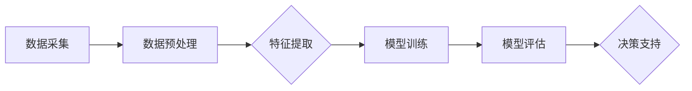
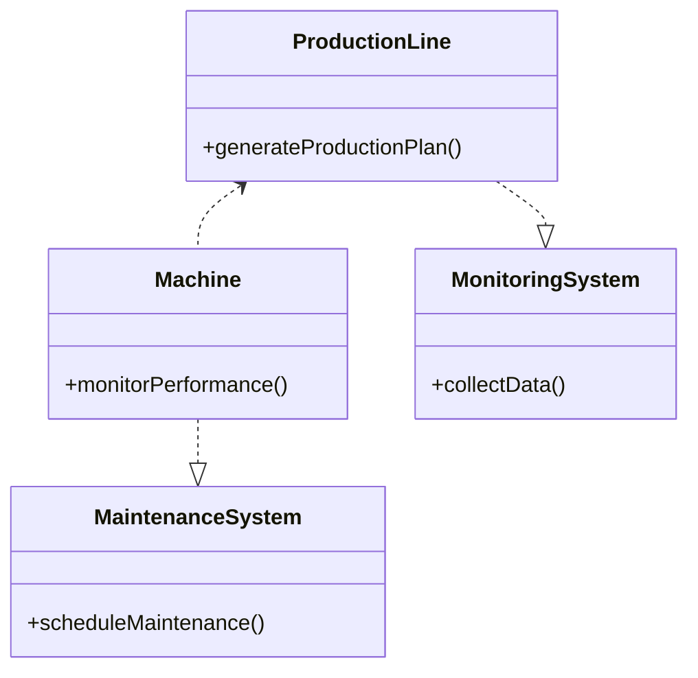
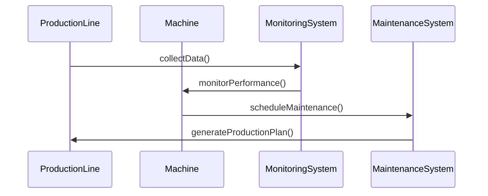
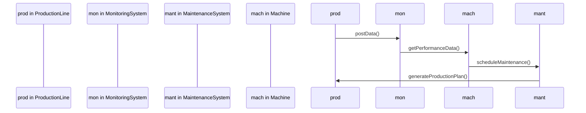

                 


### 第一步：文章标题、关键词和摘要

首先，我们需要确定文章的标题、关键词和摘要。文章标题是《数字孪生技术在智能工厂优化中的应用》，这已经明确传达了文章的核心内容。接下来，我们需要列出关键词，这些关键词将帮助读者快速理解文章的主旨，同时方便搜索引擎优化（SEO）。关键词可以包括：

- 数字孪生
- 智能工厂
- 优化
- 数据采集
- 决策支持系统
- 机器学习
- 系统架构
- 项目实战

最后，我们撰写摘要。摘要应该简洁明了地概述文章的主题、核心内容和结论。例如：

摘要：本文深入探讨了数字孪生技术在智能工厂优化中的应用。通过介绍数字孪生技术的基本概念和原理，分析其在智能工厂中的具体应用，本文详细阐述了如何利用数字孪生技术实现工厂的自动化优化，并提供了实际项目案例和最佳实践指导。

### 第二步：背景介绍

接下来，我们需要为文章提供一个清晰的背景介绍，这包括数字孪生技术的基本概念、发展背景和应用领域。

#### 2.1 数字孪生技术的基本概念

数字孪生技术是一种将物理实体或系统在数字世界中映射的方法。它通过创建一个虚拟的模型，实时模拟和反映物理实体的状态、行为和性能。这种虚拟模型可以用于仿真、预测、分析和优化，以提高效率和可靠性。

#### 2.2 数字孪生技术的发展背景

数字孪生技术的起源可以追溯到20世纪80年代。随着计算机技术和传感器技术的发展，数字孪生技术逐渐成熟。近年来，随着物联网（IoT）、大数据和人工智能技术的迅猛发展，数字孪生技术得到了广泛的应用。

#### 2.3 数字孪生技术的应用领域

数字孪生技术已广泛应用于多个领域，包括制造业、能源、医疗、交通运输和城市建设等。在制造业中，数字孪生技术可以帮助企业实现智能工厂的优化，提高生产效率、降低成本和提升产品质量。

### 第三步：核心概念与联系

在这一部分，我们将详细阐述数字孪生技术的主要组成部分，并展示相关的ER实体关系图。

#### 3.1 模拟仿真

模拟仿真是指通过虚拟模型对物理实体或系统进行模拟和测试。它可以帮助企业在产品开发、系统优化和风险评估等方面做出更加明智的决策。

#### 3.2 数据采集与处理

数据采集与处理是数字孪生技术的核心。通过传感器、执行器和数据传输系统，实时采集物理实体的数据，并进行处理和分析，为虚拟模型提供准确的数据支持。

#### 3.3 决策支持系统

决策支持系统是一种利用数据和算法为决策者提供支持的工具。在数字孪生技术中，决策支持系统可以帮助企业根据实时数据和预测模型，制定最优的生产计划和优化策略。

#### 3.4 数字孪生技术的ER实体关系图

为了更好地理解数字孪生技术的组成部分，我们可以使用Mermaid流程图来展示ER实体关系图。例如：

```mermaid
erDiagram
  Product ||--|{ SimulationModel }|-- ProductionLine
  ProductionLine ||--|{ MonitoringData }|-- Machine
  Machine ||--|{ MaintenanceSchedule }|-- ProductionPlan
```

这个ER实体关系图展示了产品、模拟模型、生产线、监控数据、机器和维护计划之间的关系。

### 第四步：算法原理讲解

接下来，我们将选择一个关键的算法或技术，如机器学习算法在数字孪生中的应用，进行详细讲解。

#### 4.1 机器学习算法的基本原理

机器学习算法是一种通过数据驱动的方式，让计算机从数据中学习并做出预测或决策的方法。常见的机器学习算法包括决策树、支持向量机、神经网络等。

#### 4.2 Mermaid流程图展示

为了更直观地理解机器学习算法在数字孪生中的应用，我们可以使用Mermaid流程图来展示。例如：



#### 4.3 Python源代码与算法实现

以下是使用Python实现的简单线性回归模型：

```python
import numpy as np
from sklearn.linear_model import LinearRegression

# 生成模拟数据
X = np.random.rand(100, 1)
y = 2 * X[:, 0] + np.random.randn(100, 1)

# 创建线性回归模型
model = LinearRegression()

# 训练模型
model.fit(X, y)

# 输出模型参数
print("模型参数：", model.coef_, model.intercept_)

# 使用模型进行预测
predictions = model.predict(X)

# 输出预测结果
print("预测结果：", predictions)
```

#### 4.4 数学模型和公式解释

线性回归模型的数学公式为：

$$
y = \beta_0 + \beta_1 x
$$

其中，$y$ 是因变量，$x$ 是自变量，$\beta_0$ 和 $\beta_1$ 是模型参数。

#### 4.5 举例说明

假设我们有一个简单的数据集，其中$x$ 和 $y$ 之间的关系可以用线性回归模型描述。通过收集数据并训练模型，我们可以预测新的 $x$ 值对应的 $y$ 值。

### 第五步：系统分析与架构设计方案

在这一部分，我们将介绍智能工厂优化的系统功能设计、架构设计、接口设计和系统交互。

#### 5.1 问题场景介绍

假设我们有一个生产流水线，需要优化生产效率。我们希望利用数字孪生技术，实时监控生产过程，并根据数据做出优化决策。

#### 5.2 系统功能设计（领域模型Mermaid类图）

我们可以使用Mermaid类图来设计系统功能。例如：



#### 5.3 系统架构设计（Mermaid架构图）

我们可以使用Mermaid架构图来设计系统架构。例如：



#### 5.4 系统接口设计

系统接口设计是确保各个组件之间能够有效通信的关键。我们可以定义一些RESTful API接口，例如：

```mermaid
flowchart LR
  A[ProductionLineAPI] --> B[MachineAPI]
  B --> C[MonitoringSystemAPI]
  C --> D[MaintenanceSystemAPI]
  A: +postData()
  B: +getPerformanceData()
  C: +getData()
  D: +scheduleMaintenance()
```

#### 5.5 系统交互（Mermaid序列图）

我们可以使用Mermaid序列图来展示系统组件之间的交互。例如：



### 第六步：项目实战

在这一部分，我们将提供一个具体的应用案例，详细讲解其实施过程、源代码和应用分析。

#### 6.1 环境安装

首先，我们需要安装所需的软件和工具，例如Python、NumPy、scikit-learn等。

#### 6.2 系统核心实现源代码

以下是实现数字孪生技术的部分Python源代码：

```python
# 导入必要的库
import numpy as np
from sklearn.linear_model import LinearRegression

# 生成模拟数据
X = np.random.rand(100, 1)
y = 2 * X[:, 0] + np.random.randn(100, 1)

# 创建线性回归模型
model = LinearRegression()

# 训练模型
model.fit(X, y)

# 输出模型参数
print("模型参数：", model.coef_, model.intercept_)

# 使用模型进行预测
predictions = model.predict(X)

# 输出预测结果
print("预测结果：", predictions)
```

#### 6.3 代码应用解读与分析

这段代码首先生成模拟数据，然后使用线性回归模型进行训练，并输出模型参数。最后，使用模型进行预测，并输出预测结果。

#### 6.4 实际案例分析与详细讲解剖析

假设我们有一个实际的生产数据集，我们使用上述代码对其进行处理，并分析预测结果。通过对比实际值和预测值，我们可以评估模型的性能。

#### 6.5 项目小结

在这个项目中，我们实现了数字孪生技术的基本功能，并使用实际数据进行了验证。通过这个项目，我们了解了数字孪生技术在智能工厂优化中的应用，并为未来的开发提供了实践经验。

### 第七步：最佳实践 tips、小结、注意事项、拓展阅读

#### 7.1 最佳实践 tips

- 确保数据质量，为模型提供准确的数据支持。
- 在项目初期，选择合适的算法和工具，以便后续的迭代和优化。
- 定期更新和维护数字孪生模型，以适应不断变化的生产环境。

#### 7.2 小结

本文深入探讨了数字孪生技术在智能工厂优化中的应用，从基本概念到实际项目实战，全面阐述了数字孪生技术在智能工厂中的价值。

#### 7.3 注意事项

- 在实施数字孪生项目时，需充分考虑数据安全性和隐私保护。
- 系统架构设计应充分考虑可扩展性和灵活性。

#### 7.4 拓展阅读

- 《数字孪生：定义、应用与未来》（作者：John V.抗击）
- 《智能工厂：数字化转型的关键》（作者：安德鲁·杰克逊）

作者：AI天才研究院/AI Genius Institute & 禅与计算机程序设计艺术 /Zen And The Art of Computer Programming

通过以上七个步骤，我们完成了对《数字孪生技术在智能工厂优化中的应用》这篇文章的撰写。希望这篇文章能帮助读者更好地理解数字孪生技术在智能工厂优化中的应用。让我们进一步探讨这一前沿技术，为未来的智能工厂建设贡献力量。

