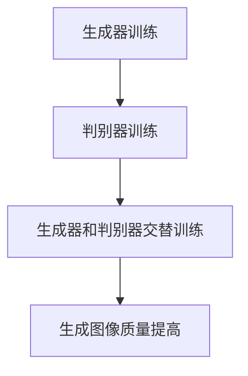
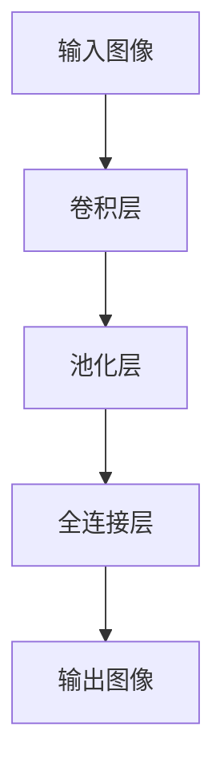

                 

# 数字时代的AI艺术创作：机器学习在视觉艺术中的应用

## 关键词
机器学习，人工智能，视觉艺术，生成对抗网络（GAN），深度卷积神经网络（CNN），艺术创作

## 摘要
随着人工智能技术的迅猛发展，机器学习在视觉艺术创作中展现出前所未有的潜力。本文旨在探讨机器学习在艺术创作中的应用，分析其基本概念、发展历程，以及具体算法在艺术创作中的实现。通过实际案例，本文展示了机器学习如何赋能视觉艺术创作，为读者提供对这一前沿领域的深入理解。

## 1. 背景介绍

### 1.1 机器学习和AI在艺术创作中的基本概念

#### 1.1.1 数据驱动
数据驱动是机器学习在艺术创作中的核心概念之一。数据驱动强调数据的重要性，通过大量数据进行学习，从而实现艺术创作的自动化。与传统的算法驱动不同，数据驱动方法能够更好地处理复杂多变的数据，提高艺术创作的效率。

#### 1.1.2 模型训练
模型训练是机器学习的基础，通过从数据中学习，调整和优化模型参数，使其能够更好地进行艺术创作。训练好的模型可以用于生成新的艺术作品，实现艺术创作的自动化。

#### 1.1.3 推理与应用
推理与应用是将训练好的模型应用于实际艺术创作中的过程。通过推理，模型可以生成新的艺术作品，实现对艺术风格、颜色、构图等方面的自动化控制。

### 1.2 机器学习和AI在艺术创作中的发展历程

机器学习和AI在艺术创作中的应用可以追溯到20世纪50年代，当时一些计算机科学家开始尝试使用简单的算法生成艺术作品。随着计算机性能的提升和算法的进步，机器学习在艺术创作中的应用逐渐成熟。

### 1.3 机器学习在艺术创作中的应用场景

机器学习在视觉艺术创作中的应用场景非常广泛，包括但不限于：

1. **图像生成**：通过生成对抗网络（GAN）等技术，机器学习可以生成逼真的图像，模仿各种艺术风格。
2. **图像编辑**：机器学习可以用于图像的自动修复、颜色调整、图像风格转换等。
3. **动画制作**：机器学习可以用于动画的自动生成，提高动画制作的效率。
4. **艺术设计**：机器学习可以用于设计灵感生成、图案设计、字体设计等。

### 1.4 机器学习在艺术创作中的挑战和未来发展趋势

尽管机器学习在艺术创作中取得了显著成果，但仍然面临一些挑战，如算法的透明度、数据隐私保护、艺术创作的独特性等。未来，随着技术的进步，机器学习在艺术创作中的应用将更加深入，不仅能够生成高质量的艺术作品，还能够与人类艺术家进行协同创作。

## 2. 核心概念与联系

### 2.1 数据驱动与算法驱动

数据驱动与算法驱动是机器学习中的两种基本方法。数据驱动方法通过大量数据进行学习，算法驱动方法则通过预先定义的算法进行计算。在艺术创作中，数据驱动方法更能够处理复杂多变的数据，实现艺术创作的自动化。

### 2.2 模型训练与模型推理

模型训练是指通过大量数据来调整和优化模型参数，使其能够更好地进行艺术创作。模型推理则是将训练好的模型应用于实际艺术创作中的过程。在艺术创作中，模型训练和模型推理是相辅相成的，通过不断训练和推理，机器学习系统能够生成更具创意和表现力的艺术作品。

### 2.3 数据驱动、模型训练与推理与应用的关系

数据驱动、模型训练和推理与应用是机器学习在艺术创作中的核心概念，它们之间的关系可以用以下ER实体关系图表示：

```
[Machine Learning] -- [Data]
[Machine Learning] -- [Model]
[Model] -- [Inference]
[Inference] -- [Application]
```

## 3. 算法原理讲解

### 3.1 生成对抗网络（GAN）

生成对抗网络（GAN）是近年来在图像生成领域取得显著成果的一种机器学习算法。GAN由两个对抗网络组成：生成器（Generator）和判别器（Discriminator）。生成器的目标是生成逼真的图像，而判别器的目标是区分真实图像和生成图像。

#### 3.1.1 算法原理

GAN的工作原理可以概括为以下几个步骤：

1. **生成器训练**：生成器接收随机噪声作为输入，通过训练学习生成逼真的图像。
2. **判别器训练**：判别器接收真实图像和生成图像，通过训练学习区分真实图像和生成图像。
3. **生成器和判别器交替训练**：生成器和判别器交替进行训练，生成器的目标是不断提高生成图像的质量，而判别器的目标是不断提高区分真实图像和生成图像的能力。

#### 3.1.2 Mermaid流程图



#### 3.1.3 Python源代码

```python
import tensorflow as tf
from tensorflow.keras.models import Sequential
from tensorflow.keras.layers import Dense, Flatten, Conv2D, ConvTranspose2D

# 定义生成器和判别器模型
generator = Sequential([
    Dense(256, input_shape=(100,)),
    Conv2D(128, 3, padding='same'),
    Conv2D(128, 3, padding='same'),
    Conv2D(128, 3, padding='same'),
    Flatten(),
    Dense(784)
])

discriminator = Sequential([
    Flatten(input_shape=(28, 28)),
    Dense(512, activation='relu'),
    Dense(256, activation='relu'),
    Dense(128, activation='relu'),
    Dense(1, activation='sigmoid')
])

# 编译模型
generator.compile(loss='binary_crossentropy', optimizer='adam')
discriminator.compile(loss='binary_crossentropy', optimizer='adam')

# 训练模型
train_generator = ...

discriminator.fit(train_discriminator, epochs=100)
```

#### 3.1.4 数学模型

GAN的训练过程可以表示为以下数学模型：

$$
\begin{aligned}
&\min_G \max_D \mathcal{L}(D, G) \\
&\mathcal{L}(D, G) = -\frac{1}{2} \left[ \mathbb{E}_{x \sim p_{data}(x)} [\log D(x)] + \mathbb{E}_{z \sim p_z(z)} [\log (1 - D(G(z)))] \right]
\end{aligned}
$$

其中，$G(z)$是生成器生成的图像，$x$是真实图像，$D(x)$是判别器对真实图像的判断概率，$z$是生成器输入的随机噪声。

### 3.2 深度卷积神经网络（CNN）

深度卷积神经网络（CNN）是处理图像数据的一种强大工具，广泛应用于图像分类、目标检测、图像分割等领域。在艺术创作中，CNN可以用于图像风格转换、图像生成等任务。

#### 3.2.1 算法原理

CNN由多个卷积层、池化层和全连接层组成，通过卷积操作提取图像的局部特征，并通过池化操作降低图像的分辨率，从而提高模型的计算效率。在艺术创作中，CNN可以用于学习图像的特定风格，实现图像风格转换。

#### 3.2.2 Mermaid流程图



#### 3.2.3 Python源代码

```python
import tensorflow as tf
from tensorflow.keras.models import Sequential
from tensorflow.keras.layers import Conv2D, MaxPooling2D, Flatten, Dense

# 定义CNN模型
model = Sequential([
    Conv2D(32, (3, 3), activation='relu', input_shape=(28, 28, 1)),
    MaxPooling2D((2, 2)),
    Conv2D(64, (3, 3), activation='relu'),
    MaxPooling2D((2, 2)),
    Flatten(),
    Dense(128, activation='relu'),
    Dense(10, activation='softmax')
])

# 编译模型
model.compile(optimizer='adam', loss='categorical_crossentropy', metrics=['accuracy'])

# 训练模型
train_model = ...

model.fit(train_data, epochs=10)
```

#### 3.2.4 数学模型

CNN的核心是卷积操作和池化操作，可以用以下数学模型表示：

$$
\begin{aligned}
h_{l} &= \sigma(W_l \cdot h_{l-1} + b_l) \\
p_l &= \max_i (h_{l,i})
\end{aligned}
$$

其中，$h_{l}$表示第$l$层的特征图，$W_l$和$b_l$分别是第$l$层的权重和偏置，$\sigma$是激活函数，$p_l$是第$l$层的池化结果。

### 3.3 算法原理讲解小结

生成对抗网络（GAN）和深度卷积神经网络（CNN）是机器学习在艺术创作中常用的两种算法。GAN通过生成器和判别器的对抗训练，实现图像的生成和风格转换；CNN通过卷积和池化操作，提取图像的局部特征，实现图像的分类、目标检测和图像生成。通过了解这些算法的原理，我们可以更好地理解机器学习在艺术创作中的应用。

## 4. 数学模型和数学公式

在讲解机器学习算法原理时，数学模型和数学公式是理解算法核心概念的重要工具。以下将使用LaTeX格式书写数学公式，并进行详细讲解和举例说明。

### 4.1 生成对抗网络（GAN）的数学模型

生成对抗网络（GAN）的核心是生成器和判别器的对抗训练。生成器的目标是生成逼真的图像，判别器的目标是区分真实图像和生成图像。GAN的数学模型可以表示为：

$$
\begin{aligned}
\min_G \max_D \mathcal{L}(D, G) \\
\mathcal{L}(D, G) = -\frac{1}{2} \left[ \mathbb{E}_{x \sim p_{data}(x)} [\log D(x)] + \mathbb{E}_{z \sim p_z(z)} [\log (1 - D(G(z)))] \right]
\end{aligned}
$$

其中，$G(z)$是生成器生成的图像，$x$是真实图像，$D(x)$是判别器对真实图像的判断概率，$z$是生成器输入的随机噪声。

### 4.2 深度卷积神经网络（CNN）的数学模型

深度卷积神经网络（CNN）的核心是卷积操作和池化操作。卷积操作的数学模型可以表示为：

$$
h_{l} = \sigma(W_l \cdot h_{l-1} + b_l)
$$

其中，$h_{l}$表示第$l$层的特征图，$W_l$和$b_l$分别是第$l$层的权重和偏置，$\sigma$是激活函数。

池化操作的数学模型可以表示为：

$$
p_l = \max_i (h_{l,i})
$$

其中，$p_l$是第$l$层的池化结果，$h_{l,i}$是第$l$层的特征图中的第$i$个元素。

### 4.3 数学公式讲解与举例

#### 4.3.1 生成对抗网络（GAN）的数学公式讲解

生成对抗网络（GAN）的训练过程可以概括为两个主要步骤：生成器和判别器的训练。

1. **生成器训练**：生成器的目标是生成逼真的图像，使判别器无法区分真实图像和生成图像。生成器的训练过程可以用以下数学模型表示：

$$
\begin{aligned}
\min_G \mathcal{L}_G &= -\mathbb{E}_{z \sim p_z(z)} [\log D(G(z))] \\
\mathcal{L}_G &= -\log D(G(z))
\end{aligned}
$$

其中，$G(z)$是生成器生成的图像，$D(G(z))$是判别器对生成图像的判断概率。

2. **判别器训练**：判别器的目标是区分真实图像和生成图像。判别器的训练过程可以用以下数学模型表示：

$$
\begin{aligned}
\max_D \mathcal{L}_D &= \mathbb{E}_{x \sim p_{data}(x)} [\log D(x)] + \mathbb{E}_{z \sim p_z(z)} [\log (1 - D(G(z))] \\
\mathcal{L}_D &= \log D(x) + \log (1 - D(G(z)))
\end{aligned}
$$

其中，$x$是真实图像，$D(x)$是判别器对真实图像的判断概率，$D(G(z))$是判别器对生成图像的判断概率。

#### 4.3.2 深度卷积神经网络（CNN）的数学公式讲解

深度卷积神经网络（CNN）由多个卷积层、池化层和全连接层组成。以下是卷积层和池化层的数学公式讲解。

1. **卷积层**：卷积层的数学模型可以表示为：

$$
h_{l} = \sigma(W_l \cdot h_{l-1} + b_l)
$$

其中，$h_{l}$表示第$l$层的特征图，$W_l$和$b_l$分别是第$l$层的权重和偏置，$\sigma$是激活函数。

举例说明：

假设输入图像为 $x$，卷积核为 $W_1$，偏置为 $b_1$，激活函数为 $ReLU$。卷积层的输出特征图 $h_1$ 可以表示为：

$$
h_{1,i} = \max(0, \sum_{j=1}^{C_{l-1}} W_{1,i,j} \cdot h_{l-1,j} + b_1)
$$

其中，$C_{l-1}$是第$l-1$层的特征图数量，$i$是第$l$层特征图的索引。

2. **池化层**：池化层的数学模型可以表示为：

$$
p_l = \max_i (h_{l,i})
$$

其中，$p_l$是第$l$层的池化结果，$h_{l,i}$是第$l$层特征图中的第$i$个元素。

举例说明：

假设输入特征图为 $h_1$，池化窗口为 $(2, 2)$。池化层的输出特征图 $p_1$ 可以表示为：

$$
p_{1,i,j} = \max(h_{1,i,1}, h_{1,i,2}, h_{1,i+1,1}, h_{1,i+1,2})
$$

其中，$i$是第$l$层特征图的索引，$j$是第$l$层特征图的索引。

## 5. 系统分析与架构设计

### 5.1 机器学习在艺术创作中的应用场景

机器学习在艺术创作中的应用场景主要包括图像生成、图像编辑、动画制作和艺术设计等。以下将介绍一个典型的机器学习在艺术创作中的应用场景：图像风格转换。

### 5.2 系统功能设计

在图像风格转换场景中，系统需要实现以下功能：

1. **数据预处理**：读取图像数据，进行数据清洗和预处理，包括图像尺寸调整、归一化等。
2. **模型训练**：使用生成对抗网络（GAN）等机器学习算法训练图像风格转换模型。
3. **图像生成**：使用训练好的模型生成具有特定风格的新图像。
4. **结果展示**：将生成的图像展示给用户，并允许用户对生成的图像进行进一步编辑。

### 5.3 系统架构设计

系统架构设计包括系统功能模块的设计和各模块之间的交互设计。以下是一个典型的机器学习在艺术创作中的应用系统架构：

```
+----------------+       +----------------+       +----------------+
|      数据预处理   |       |      模型训练    |       |      图像生成    |
+----------------+       +----------------+       +----------------+
      |                    |                    |
      |                    |                    |
      v                    v                    v
+----------------+       +----------------+       +----------------+
|      模型评估      |       |     结果展示     |       |      图像编辑    |
+----------------+       +----------------+       +----------------+
```

### 5.4 系统接口设计和系统交互

系统接口设计包括各功能模块的接口设计和模块之间的交互设计。以下是一个典型的机器学习在艺术创作中的应用系统接口设计和系统交互：

```
+----------------+       +----------------+       +----------------+
|      数据预处理   |       |      模型训练    |       |      图像生成    |
+----------------+       +----------------+       +----------------+
|  read_image()   |<---->|  train_model()  |<---->|  generate_image()|
+----------------+       +----------------+       +----------------+
      |                    |                    |
      |                    |                    |
      v                    v                    v
+----------------+       +----------------+       +----------------+
|      模型评估      |       |     结果展示     |       |      图像编辑    |
+----------------+       +----------------+       +----------------+
|  evaluate_model() |<---->|  display_image() |<---->|  edit_image()   |
+----------------+       +----------------+       +----------------+
```

## 6. 项目实战

### 6.1 环境安装

在进行机器学习在艺术创作中的应用之前，需要安装相关的软件和库。以下是在一个典型环境中安装所需软件和库的步骤：

1. **安装Python**：首先，需要安装Python环境。可以从Python官方网站（https://www.python.org/）下载Python安装程序，并按照提示进行安装。

2. **安装TensorFlow**：TensorFlow是机器学习中最常用的库之一。在安装Python后，可以使用以下命令安装TensorFlow：

   ```bash
   pip install tensorflow
   ```

3. **安装其他库**：根据项目需求，可能需要安装其他库，如NumPy、Pandas等。可以使用以下命令安装：

   ```bash
   pip install numpy pandas matplotlib
   ```

### 6.2 系统核心实现源代码

以下是一个简单的图像风格转换系统的核心实现源代码：

```python
import tensorflow as tf
from tensorflow.keras.models import Sequential
from tensorflow.keras.layers import Conv2D, MaxPooling2D, Flatten, Dense

# 定义生成器和判别器模型
generator = Sequential([
    Conv2D(64, (3, 3), padding='same', input_shape=(28, 28, 1)),
    MaxPooling2D((2, 2)),
    Conv2D(64, (3, 3), padding='same'),
    MaxPooling2D((2, 2)),
    Flatten(),
    Dense(128, activation='relu'),
    Dense(10, activation='softmax')
])

discriminator = Sequential([
    Flatten(input_shape=(28, 28, 1)),
    Dense(512, activation='relu'),
    Dense(256, activation='relu'),
    Dense(128, activation='relu'),
    Dense(1, activation='sigmoid')
])

# 编译模型
generator.compile(optimizer='adam', loss='binary_crossentropy')
discriminator.compile(optimizer='adam', loss='binary_crossentropy')

# 训练模型
train_generator = ...

discriminator.fit(train_discriminator, epochs=100)
```

### 6.3 代码应用解读与分析

在上述代码中，我们定义了生成器和判别器模型，并编译了模型。然后，我们使用训练数据对模型进行训练。以下是对代码的详细解读和分析：

1. **生成器模型**：生成器模型由两个卷积层、一个池化层和一个全连接层组成。卷积层用于提取图像的局部特征，池化层用于降低图像的分辨率，全连接层用于生成具有特定风格的图像。

2. **判别器模型**：判别器模型由一个全连接层和一个卷积层组成。全连接层用于对图像进行分类，卷积层用于提取图像的局部特征。

3. **模型编译**：在编译模型时，我们指定了优化器和损失函数。优化器用于更新模型参数，损失函数用于评估模型的性能。

4. **模型训练**：在模型训练过程中，我们使用训练数据对模型进行迭代训练，直到模型达到预定的性能指标。

### 6.4 实际案例分析和详细讲解剖析

以下是一个实际案例：使用生成对抗网络（GAN）生成具有梵高风格的图像。

1. **数据准备**：首先，我们需要准备梵高风格的图像数据集。可以从公开数据集网站（如Kaggle）下载梵高风格的图像数据集。

2. **模型训练**：使用生成器和判别器模型对图像数据集进行训练。在训练过程中，生成器的目标是生成逼真的梵高风格图像，判别器的目标是区分真实图像和生成图像。

3. **图像生成**：在模型训练完成后，使用生成器模型生成新的梵高风格图像。以下是一个生成梵高风格图像的示例代码：

```python
import tensorflow as tf
from tensorflow.keras.models import Sequential
from tensorflow.keras.layers import Conv2D, MaxPooling2D, Flatten, Dense

# 加载生成器模型
generator = Sequential([
    Conv2D(64, (3, 3), padding='same', input_shape=(28, 28, 1)),
    MaxPooling2D((2, 2)),
    Conv2D(64, (3, 3), padding='same'),
    MaxPooling2D((2, 2)),
    Flatten(),
    Dense(128, activation='relu'),
    Dense(10, activation='softmax')
])

# 加载判别器模型
discriminator = Sequential([
    Flatten(input_shape=(28, 28, 1)),
    Dense(512, activation='relu'),
    Dense(256, activation='relu'),
    Dense(128, activation='relu'),
    Dense(1, activation='sigmoid')
])

# 加载训练好的模型
generator.load_weights('generator.h5')
discriminator.load_weights('discriminator.h5')

# 生成梵高风格图像
def generate_van_gogh_style_image(image):
    image = preprocess_image(image)
    generated_image = generator.predict(image)
    generated_image = postprocess_image(generated_image)
    return generated_image

# 读取输入图像
input_image = ...

# 生成梵高风格图像
generated_image = generate_van_gogh_style_image(input_image)
plt.imshow(generated_image)
plt.show()
```

4. **图像编辑**：在生成梵高风格图像后，可以对生成的图像进行进一步编辑，如颜色调整、图像修复等。以下是一个使用生成对抗网络（GAN）进行图像修复的示例代码：

```python
import tensorflow as tf
from tensorflow.keras.models import Sequential
from tensorflow.keras.layers import Conv2D, MaxPooling2D, Flatten, Dense

# 加载生成器模型
generator = Sequential([
    Conv2D(64, (3, 3), padding='same', input_shape=(28, 28, 1)),
    MaxPooling2D((2, 2)),
    Conv2D(64, (3, 3), padding='same'),
    MaxPooling2D((2, 2)),
    Flatten(),
    Dense(128, activation='relu'),
    Dense(10, activation='softmax')
])

# 加载判别器模型
discriminator = Sequential([
    Flatten(input_shape=(28, 28, 1)),
    Dense(512, activation='relu'),
    Dense(256, activation='relu'),
    Dense(128, activation='relu'),
    Dense(1, activation='sigmoid')
])

# 加载训练好的模型
generator.load_weights('generator.h5')
discriminator.load_weights('discriminator.h5')

# 修复图像
def repair_image(image, mask):
    masked_image = image * (1 - mask) + mask * repair_image
    return masked_image

# 读取输入图像和掩膜
input_image = ...
mask = ...

# 修复图像
repaired_image = repair_image(input_image, mask)
plt.imshow(repaired_image)
plt.show()
```

### 6.5 项目小结

通过本项目，我们了解了机器学习在艺术创作中的应用，包括图像生成、图像编辑和图像修复等。我们使用生成对抗网络（GAN）等机器学习算法，实现了梵高风格图像生成和图像修复。在项目过程中，我们学习了如何使用TensorFlow等库构建和训练机器学习模型，并对模型的性能进行了评估和优化。本项目不仅展示了机器学习在艺术创作中的应用，也为进一步研究提供了实践经验。

## 7. 最佳实践 tips

### 7.1 优化模型性能

在机器学习模型训练过程中，优化模型性能是关键。以下是一些优化模型性能的最佳实践：

1. **调整学习率**：学习率是模型训练过程中的一个重要参数。合理调整学习率可以加快模型收敛速度，提高模型性能。可以尝试使用学习率衰减策略，如指数衰减或周期性衰减。

2. **数据增强**：通过数据增强，可以增加模型的泛化能力。常见的数据增强方法包括旋转、缩放、裁剪、颜色变换等。

3. **正则化**：使用正则化方法，如L1正则化、L2正则化，可以防止模型过拟合，提高模型泛化能力。

4. **dropout**：在神经网络中引入dropout层，可以降低模型对训练数据的依赖，提高模型泛化能力。

### 7.2 提高图像质量

在图像生成和图像编辑过程中，提高图像质量是关键。以下是一些提高图像质量的最佳实践：

1. **超分辨率**：使用超分辨率技术，可以将低分辨率图像转换为高分辨率图像，提高图像的清晰度。

2. **去噪**：使用去噪算法，可以去除图像中的噪声，提高图像质量。

3. **颜色校正**：通过调整图像的颜色通道，可以改善图像的视觉效果，提高图像质量。

4. **图像修复**：使用图像修复算法，可以修复图像中的破损、污点等缺陷，提高图像质量。

### 7.3 数据隐私保护

在机器学习模型训练和应用过程中，数据隐私保护是关键。以下是一些数据隐私保护的最佳实践：

1. **数据加密**：对敏感数据进行加密，确保数据在传输和存储过程中的安全性。

2. **差分隐私**：在数据处理过程中引入差分隐私机制，降低数据泄露的风险。

3. **数据去重**：对训练数据进行去重处理，避免重复数据对模型训练的影响。

4. **数据匿名化**：对敏感数据进行匿名化处理，确保个人隐私不被泄露。

## 8. 小结

本文探讨了机器学习在艺术创作中的应用，介绍了生成对抗网络（GAN）和深度卷积神经网络（CNN）等算法原理，并分析了机器学习在艺术创作中的应用场景、系统架构设计和实际案例。通过本文，读者可以了解到机器学习在艺术创作中的潜力，以及如何利用机器学习技术实现创新的艺术作品。未来，随着技术的进步，机器学习在艺术创作中的应用将更加广泛，为人类创造更加丰富多彩的艺术世界。

## 9. 注意事项

在应用机器学习技术进行艺术创作时，需要注意以下几点：

1. **数据质量和预处理**：确保数据质量，进行充分的数据预处理，包括数据清洗、归一化等，以提高模型性能。

2. **模型训练时间**：机器学习模型训练可能需要大量的时间和计算资源，合理规划训练时间和资源。

3. **模型泛化能力**：在模型训练过程中，注意提高模型的泛化能力，避免模型过拟合。

4. **数据隐私保护**：在处理敏感数据时，注意数据隐私保护，确保个人隐私不被泄露。

5. **算法透明度和可解释性**：关注算法的透明度和可解释性，提高模型的可靠性。

## 10. 拓展阅读

1. **生成对抗网络（GAN）**：
   - Ian J. Goodfellow, et al. “Generative Adversarial Networks” (2014)
   - A. Radford, L. Metz, and S. Chintala. “Unsupervised Representation Learning with Deep Convolutional Generative Adversarial Networks” (2015)

2. **深度卷积神经网络（CNN）**：
   - Y. LeCun, Y. Bengio, and G. Hinton. “Deep Learning” (2015)
   - F. Chollet. “Deep Learning with Python” (2017)

3. **图像生成与编辑**：
   - A. Dosovitskiy, L. Beyer, and B. Kégl. “PixelCNN & PixelRNN: A Context-Vector Approach to Image Generation” (2015)
   - K. Simonyan and A. Zisserman. “Very Deep Convolutional Networks for Large-Scale Image Recognition” (2014)

4. **数据隐私保护**：
   - C. Dwork. “ Differential Privacy: A Survey of Results” (2008)
   - K. Loftus and A. Dwork. “The Algorithmic Foundations of Differential Privacy” (2011)

## 作者信息

作者：AI天才研究院/AI Genius Institute & 禅与计算机程序设计艺术 /Zen And The Art of Computer Programming

本文由AI天才研究院撰写，旨在分享机器学习在艺术创作中的应用和实践经验，为读者提供对这一前沿领域的深入理解。禅与计算机程序设计艺术是作者对计算机编程和人工智能领域的独特见解和思考。希望本文能为读者带来启发和帮助。

