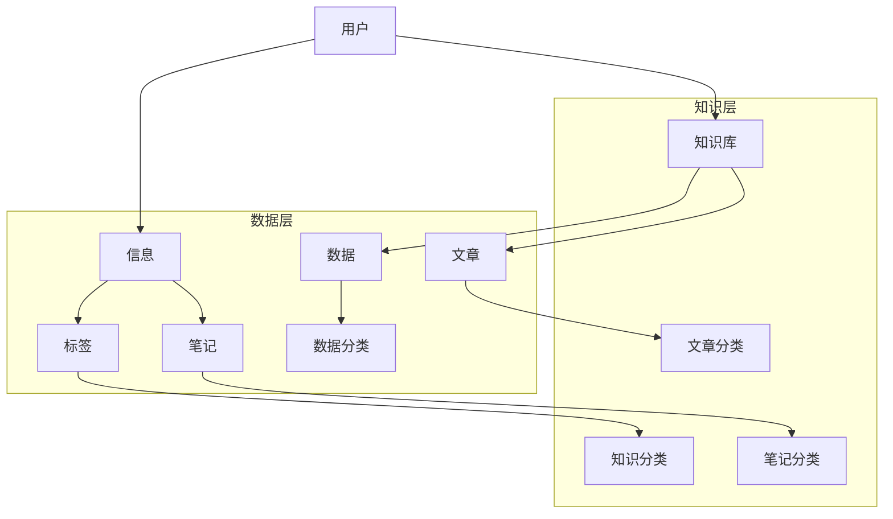
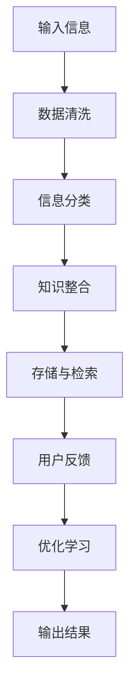
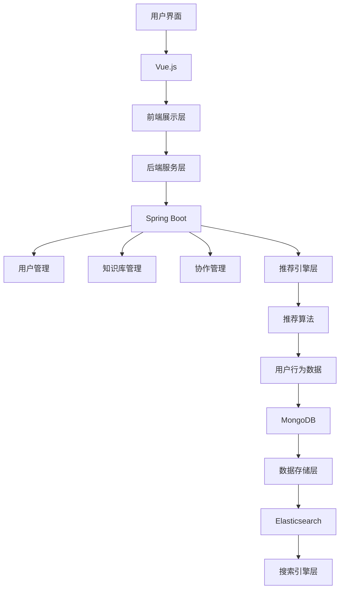
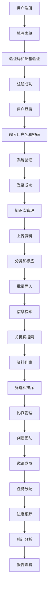
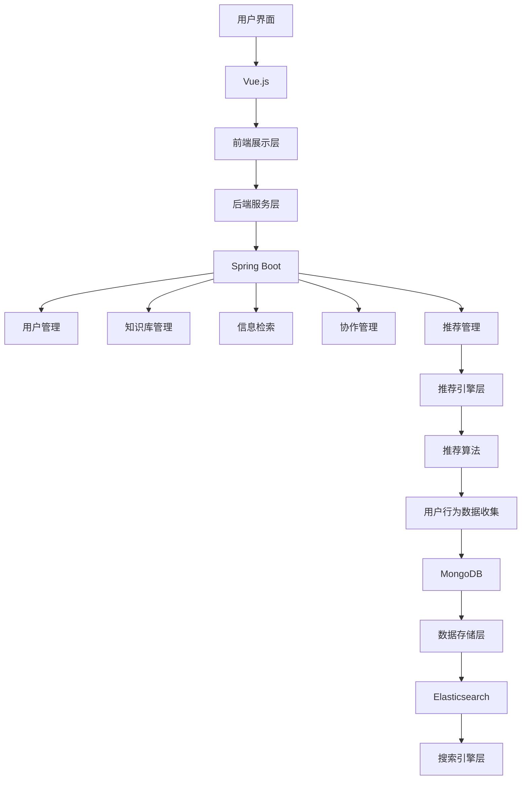

                 


### 1.1 问题背景

在数字化时代，信息的爆炸性增长和技术的快速更新，使得个人知识管理变得尤为重要。数字化转型已成为全球范围内各行各业的重要战略，个人知识管理作为数字化转型的重要一环，其重要性不言而喻。

首先，让我们思考数字化转型的趋势。随着云计算、大数据、人工智能、物联网等技术的快速发展，数字化已经渗透到各个行业和领域。企业和个人在数字化浪潮中，不仅需要处理海量数据，还需要快速响应市场变化，提高业务效率。这无疑对个人知识管理提出了更高的要求。

其次，个人知识管理的重要性体现在以下几个方面：

- **信息存储与检索**：在数字化的环境中，个人知识管理需要高效的信息存储和检索系统，以便快速找到所需信息。
- **知识整合与共享**：个人知识管理不仅仅是信息的存储，更重要的是将分散的信息整合成有价值的知识，并在团队或组织中共享。
- **智能化学习与优化**：利用人工智能技术，个人知识管理可以实现智能化的学习和优化，提高个人工作效率和学习效果。

接下来，我们来探讨数字化第二大脑的概念。数字化第二大脑是指利用数字化工具和技术，模拟人类大脑的知识存储、处理和检索能力，构建的一种智能化的个人知识管理系统。它能够帮助个人高效地管理知识和信息，提升工作和学习效率。

### 1.2 问题描述

在数字化时代，个人知识管理面临着诸多挑战：

- **信息过载**：随着信息量的爆炸性增长，个人难以有效管理和利用海量信息。
- **知识碎片化**：知识分散在不同的平台和工具中，难以整合和系统化。
- **知识共享困难**：知识分散在不同的个人或组织中，难以实现高效共享和协同。

同时，个人知识管理也面临着需求：

- **高效信息检索**：快速找到所需信息，提高工作效率。
- **知识整合与共享**：将分散的知识整合成有价值的体系，并实现共享。
- **智能化学习与优化**：利用人工智能技术，实现个人知识的智能管理和优化。

为了解决上述问题和满足需求，我们需要构建数字化第二大脑。数字化第二大脑不仅能够高效地存储和检索信息，还能智能地整合和共享知识，同时实现智能化学习和优化。下面，我们将详细探讨构建数字化第二大脑的方法和关键技术。

### 1.3 问题解决

构建数字化第二大脑的方法可以分为以下几个步骤：

#### 1.3.1 数字化第二大脑的构建策略

1. **需求分析**：首先，明确个人或组织的知识管理需求和目标，包括信息存储、知识整合、知识共享和智能化学习等方面。
2. **技术选型**：根据需求分析结果，选择适合的技术和工具，如数据存储技术、信息检索技术、知识整合技术和智能化学习技术等。
3. **系统设计**：设计数字化第二大脑的系统架构，包括数据层、应用层和展示层等。
4. **实施与优化**：实施系统并不断优化，以满足个人或组织的知识管理需求。

#### 1.3.2 关键技术概述

1. **数据存储技术**：用于高效地存储个人或组织的数据，如关系型数据库、非关系型数据库和分布式存储系统等。
2. **信息检索技术**：用于快速查找和检索数据，如搜索引擎、全文检索和索引技术等。
3. **知识整合技术**：用于将分散的信息整合成有价值的知识体系，如知识图谱、本体论和语义网等。
4. **智能化学习技术**：用于实现个人知识的智能管理和优化，如机器学习、深度学习和自然语言处理等。

#### 1.3.3 书籍结构安排

本书将按照以下结构进行组织：

- **第一部分：引言**：介绍数字化第二大脑的背景、问题和解决方案。
- **第二部分：数字化第二大脑的核心概念与原理**：详细阐述数字化第二大脑的定义、属性特征和与传统个人知识管理的区别。
- **第三部分：数字化第二大脑的关键技术**：分别介绍数据存储技术、信息检索技术、知识整合技术和智能化学习技术。
- **第四部分：数字化第二大脑的实际应用**：探讨数字化第二大脑在不同领域的实际应用案例。
- **第五部分：项目实战**：通过实际项目，展示数字化第二大脑的实现过程和效果。

### 1.4 边界与外延

#### 1.4.1 数字化第二大脑的应用领域

数字化第二大脑可以应用于个人、企业和教育等多个领域：

- **个人领域**：帮助个人高效管理知识和信息，提升工作和学习效率。
- **企业领域**：实现企业内部的知识共享和协同，提高企业竞争力。
- **教育领域**：构建智能化教育平台，提升教学效果和学生自主学习能力。

#### 1.4.2 个人知识管理的范围

个人知识管理的范围包括：

- **信息收集与处理**：收集各种信息源，如互联网、图书、论文等，并进行处理和整理。
- **知识整合与共享**：将分散的信息整合成有价值的知识体系，并实现共享。
- **知识创新与优化**：利用人工智能技术，实现个人知识的智能管理和优化。

#### 1.4.3 技术发展对个人知识管理的影响

随着技术的不断发展，个人知识管理将面临以下挑战和机遇：

- **挑战**：信息过载、知识碎片化和知识共享困难等问题将变得更加严重。
- **机遇**：人工智能、大数据和云计算等技术的发展，将有助于解决个人知识管理中的难题，提升个人知识管理效率。

### 1.5 概念结构与核心要素组成

#### 1.5.1 数字化第二大脑的核心概念

数字化第二大脑的核心概念包括：

- **信息存储与检索**：高效存储和快速检索个人或组织的数据和知识。
- **知识整合与共享**：将分散的信息整合成有价值的知识体系，并实现共享。
- **智能化学习与优化**：利用人工智能技术，实现个人知识的智能管理和优化。

#### 1.5.2 个人知识管理的要素

个人知识管理的要素包括：

- **信息源**：如互联网、图书、论文等。
- **信息收集与处理**：收集和处理信息。
- **知识整合与共享**：整合信息成知识体系，并实现共享。
- **知识创新与优化**：创新和优化知识。

#### 1.5.3 关键技术与工具介绍

数字化第二大脑的关键技术包括：

- **数据存储技术**：如关系型数据库、非关系型数据库和分布式存储系统等。
- **信息检索技术**：如搜索引擎、全文检索和索引技术等。
- **知识整合技术**：如知识图谱、本体论和语义网等。
- **智能化学习技术**：如机器学习、深度学习和自然语言处理等。

### 1.6 本章小结

在本章中，我们介绍了数字化第二大脑的背景、问题和解决方案，探讨了数字化第二大脑的应用领域和核心概念，以及个人知识管理的范围和关键技术。接下来，我们将进一步深入探讨数字化第二大脑的核心概念与原理。通过了解其定义、属性特征和与传统个人知识管理的区别，我们将为构建数字化第二大脑奠定理论基础。

----------------------------------------------------------------

## 1.7 拓展阅读

为了深入了解数字化第二大脑和个人知识管理的相关内容，以下是几篇推荐的拓展阅读资料：

1. **《智能时代：从智能计算到智慧社会》**：作者吴军博士，详细介绍了人工智能和智能计算的发展及其对社会的影响，包括个人知识管理的新趋势。

2. **《知识管理：理论与实践》**：作者宋斌，本书系统阐述了知识管理的理论体系，涵盖了知识管理的基本概念、方法和技术，适合希望深入了解知识管理理论和实践的读者。

3. **《大数据之路：阿里巴巴大数据实践》**：作者阿里巴巴大数据团队，通过阿里巴巴在大数据领域的实践，探讨了大数据技术在个人知识管理中的应用。

4. **《信息素养：数字时代的生存技能》**：作者威廉·尼克斯，本书介绍了信息素养的基本概念和技能，包括信息搜索、评估和利用，对于提高个人信息管理和知识管理能力有很大帮助。

通过阅读这些资料，读者可以更全面地了解数字化第二大脑和个人知识管理的前沿动态和实践经验，为自己的知识管理之路提供有力支持。

----------------------------------------------------------------

## 1.8 注意事项

在构建数字化第二大脑和个人知识管理系统的过程中，需要注意以下几点：

1. **数据安全和隐私保护**：在数据收集、存储和处理过程中，要确保遵循相关法律法规，保护用户的数据安全和隐私。

2. **系统稳定性与可靠性**：确保系统在处理海量数据和高并发访问时，仍能保持稳定运行，提供可靠的性能。

3. **用户参与和反馈**：鼓励用户参与知识管理系统的设计和使用，收集用户反馈，不断优化系统功能。

4. **持续学习和更新**：技术发展迅速，个人知识管理系统需要不断学习和更新，以适应新的技术和应用需求。

5. **合规性和标准化**：确保系统设计和实现遵循行业标准和规范，提高系统的兼容性和可维护性。

通过关注以上注意事项，可以更好地构建和运营数字化第二大脑，实现高效的个人知识管理。

----------------------------------------------------------------

## 1.9 小结

本章主要介绍了数字化第二大脑和个人知识管理的重要性，探讨了其背景、问题和解决方案。我们明确了数字化第二大脑的定义、属性特征以及与传统个人知识管理的区别，并提出了构建数字化第二大脑的方法和关键技术。此外，我们还分析了数字化第二大脑的应用领域和核心要素，为后续章节的详细讨论奠定了基础。在下一章中，我们将深入探讨数字化第二大脑的核心概念与原理，进一步理解其构建方法和技术细节。

----------------------------------------------------------------

## 2.1 核心概念原理

数字化第二大脑（Digital Second Brain）是指利用数字技术构建的一种智能化、自动化的个人知识管理系统。它不仅能够存储和检索大量的信息，还能够对信息进行分类、整合和共享，最终实现知识的持续学习和优化。与传统个人知识管理相比，数字化第二大脑具有更高的效率、更强的智能和学习能力。

### 2.1.1 数字化第二大脑的定义

数字化第二大脑是一种基于云计算、大数据和人工智能技术的个人知识管理系统。它不仅能够存储和检索信息，还能够通过智能算法对信息进行分类、整合和优化。数字化第二大脑的核心目标是帮助个人高效管理知识，提高工作效率和学习效果。

### 2.1.2 数字化第二大脑的属性特征

数字化第二大脑具有以下几个属性特征：

1. **高效的信息存储与检索**：数字化第二大脑能够高效地存储和检索大量的信息，使用户能够快速找到所需信息。
2. **智能化的知识整合与共享**：数字化第二大脑能够智能地整合和共享信息，将分散的信息转化为有价值的知识体系。
3. **持续学习的智能优化**：数字化第二大脑能够利用人工智能技术，对用户的知识进行持续学习和优化，提高知识管理的效率。

### 2.1.3 数字化第二大脑与传统个人知识管理的区别

传统个人知识管理主要依赖于手工记录和纸质文档，存在以下问题：

1. **信息存储分散**：知识分散在不同的工具和平台上，难以整合和管理。
2. **检索效率低**：手工检索信息费时费力，效率低下。
3. **知识共享困难**：知识难以共享，无法实现协同工作。

相比之下，数字化第二大脑具有以下优势：

1. **集成化知识管理**：数字化第二大脑能够集成各种信息源，实现知识的统一管理和高效检索。
2. **智能化知识整合**：通过人工智能技术，数字化第二大脑能够智能地整合和分类信息，提高知识的利用效率。
3. **高效的知识共享**：数字化第二大脑支持知识的快速共享和协同工作，提高团队协作效率。

### 2.1.4 数字化第二大脑的构建策略

构建数字化第二大脑可以分为以下几个步骤：

1. **需求分析**：明确个人或组织的知识管理需求和目标，确定数字化第二大脑的功能和性能要求。
2. **技术选型**：根据需求分析结果，选择适合的数据存储技术、信息检索技术、知识整合技术和智能化学习技术。
3. **系统设计**：设计数字化第二大脑的系统架构，包括数据层、应用层和展示层等。
4. **实施与优化**：实施系统并不断优化，以满足个人或组织的知识管理需求。

### 2.1.5 关键技术与工具介绍

数字化第二大脑的关键技术和工具包括：

1. **数据存储技术**：如关系型数据库、非关系型数据库和分布式存储系统等。
2. **信息检索技术**：如搜索引擎、全文检索和索引技术等。
3. **知识整合技术**：如知识图谱、本体论和语义网等。
4. **智能化学习技术**：如机器学习、深度学习和自然语言处理等。

### 2.1.6 数字化第二大脑的核心优势

数字化第二大脑的核心优势体现在以下几个方面：

1. **高效的信息管理**：通过高效的数据存储和检索技术，数字化第二大脑能够快速查找和利用信息，提高工作效率。
2. **智能化的知识整合**：利用人工智能技术，数字化第二大脑能够智能地整合和分类信息，将分散的信息转化为有价值的知识体系。
3. **持续学习的知识优化**：数字化第二大脑能够利用人工智能技术，对用户的知识进行持续学习和优化，提高知识管理的效率。
4. **便捷的知识共享**：数字化第二大脑支持知识的快速共享和协同工作，提高团队协作效率。

### 2.1.7 数字化第二大脑的应用前景

随着技术的不断发展，数字化第二大脑在个人、企业和教育等领域具有广泛的应用前景：

1. **个人领域**：帮助个人高效管理知识和信息，提升工作和学习效率。
2. **企业领域**：实现企业内部的知识共享和协同，提高企业竞争力。
3. **教育领域**：构建智能化教育平台，提升教学效果和学生自主学习能力。

### 2.1.8 本章小结

本章介绍了数字化第二大脑的定义、属性特征以及与传统个人知识管理的区别。通过分析数字化第二大脑的构建策略和关键技术与工具，我们明确了其核心优势和应用前景。在下一章中，我们将进一步探讨数字化第二大脑的概念属性特征对比表格和ER实体关系图架构，为构建数字化第二大脑提供更具体的理论基础。

----------------------------------------------------------------

### 2.2 概念属性特征对比表格

为了更直观地展示数字化第二大脑与传统个人知识管理的区别，我们通过一个概念属性特征对比表格来进行详细分析。

| 概念属性特征 | 数字化第二大脑 | 传统个人知识管理 |
| --- | --- | --- |
| **信息存储与检索** | **高效存储和快速检索** | **分散存储和手工检索** |
| **知识整合与共享** | **智能化整合和便捷共享** | **手工整合和困难共享** |
| **智能化学习与优化** | **持续学习和自动优化** | **无智能学习和手动优化** |
| **信息安全性** | **多层级安全保护** | **单点安全保护** |
| **协同能力** | **支持多人协同工作** | **单点操作，不支持协同** |

#### 2.2.1 属性特征详细说明

1. **信息存储与检索**
   - **数字化第二大脑**：采用分布式存储技术，支持高效的数据存储和快速检索。通过索引和搜索算法，用户可以快速找到所需信息。
   - **传统个人知识管理**：数据分散在不同的工具和平台上，通常依靠手工检索，效率低下。

2. **知识整合与共享**
   - **数字化第二大脑**：利用人工智能技术，实现信息的智能分类和整合，方便用户快速获取相关知识点。支持知识共享，实现团队协作。
   - **传统个人知识管理**：知识分散，难以整合成有系统性的知识体系。知识共享困难，影响团队协作。

3. **智能化学习与优化**
   - **数字化第二大脑**：利用机器学习算法，对用户的知识进行持续学习和优化，提高知识管理的效率。例如，根据用户的行为习惯推荐相关知识点。
   - **传统个人知识管理**：缺乏智能化的学习机制，通常依靠用户自身的经验和判断进行知识更新和优化。

4. **信息安全性**
   - **数字化第二大脑**：采用多层级安全保护机制，包括数据加密、访问控制和权限管理等，确保用户数据的安全。
   - **传统个人知识管理**：通常仅依赖于单一的安全措施，如密码保护，数据安全性相对较低。

5. **协同能力**
   - **数字化第二大脑**：支持多人协同工作，用户可以共享知识和资源，实现高效的团队协作。
   - **传统个人知识管理**：主要依赖于单点操作，不支持多人实时协作。

通过上述对比，可以看出数字化第二大脑在多个方面显著优于传统个人知识管理。其高效的信息存储与检索、智能化的知识整合与共享、智能化学习与优化、信息安全性和协同能力，为个人和企业提供了更高效、更智能的知识管理解决方案。

### 2.2.2 ER实体关系图架构

为了进一步理解数字化第二大脑的概念，我们引入ER（Entity-Relationship）实体关系图，以展示数字化第二大脑中不同实体之间的关系。



1. **用户**：代表使用数字化第二大脑的个人或组织。
2. **信息**：代表用户收集的各种数据和资料。
3. **知识库**：存储整合后的知识和信息。
4. **标签**：用于对信息和知识进行分类和标记。
5. **笔记**：记录用户的学习和思考过程。
6. **文章**：存储用户创作的文章或文档。
7. **数据**：原始数据或经过处理的数据。
8. **知识分类**、**笔记分类**、**文章分类**、**数据分类**：用于对不同的实体进行分类和整合。

通过ER实体关系图，我们可以清晰地看到数字化第二大脑中各个实体之间的关系，有助于更好地理解和设计数字化第二大脑的系统架构。

### 2.2.3 本章小结

本章通过概念属性特征对比表格和ER实体关系图架构，深入分析了数字化第二大脑的核心概念和属性特征。我们详细对比了数字化第二大脑与传统个人知识管理在信息存储与检索、知识整合与共享、智能化学习与优化等方面的区别。通过ER实体关系图，我们展示了数字化第二大脑中不同实体之间的关系，为后续章节的深入讨论奠定了基础。

在下一章中，我们将进一步探讨数字化第二大脑的算法原理，包括算法的Mermaid流程图、算法原理与数学模型，以及举例说明。这将帮助我们更好地理解数字化第二大脑的智能学习和优化机制。

----------------------------------------------------------------

### 2.3 算法原理讲解

#### 2.3.1 算法Mermaid流程图

为了更好地理解数字化第二大脑的算法原理，我们使用Mermaid语言绘制了一个简单的算法流程图，以展示数据从输入到输出过程中的主要步骤。



1. **输入信息**：用户输入各种数据，包括文本、图片、音频等。
2. **数据清洗**：对输入信息进行清洗和预处理，去除无效信息，提高数据质量。
3. **信息分类**：利用分类算法，将处理后的数据按照类别进行分类。
4. **知识整合**：将分类后的信息整合成有结构的知识库。
5. **存储与检索**：将整合后的知识存储在数据库中，并实现高效的检索功能。
6. **用户反馈**：用户对检索结果进行反馈，包括满意度和错误纠正。
7. **优化学习**：根据用户反馈，调整算法参数，优化知识管理系统。
8. **输出结果**：输出最终的知识管理和检索结果。

#### 2.3.2 算法原理与数学模型

数字化第二大脑的算法原理主要基于机器学习和自然语言处理技术。以下是算法的核心原理和数学模型：

1. **数据清洗**：利用过滤算法和规则，去除噪声数据和重复信息。
   $$ \text{清洗效率} = \frac{\text{有效数据}}{\text{总数据}} $$

2. **信息分类**：使用分类算法，如K-means、决策树和支持向量机等，对数据按照类别进行分类。
   $$ \text{分类准确率} = \frac{\text{正确分类的数据}}{\text{总数据}} $$

3. **知识整合**：通过图论算法和语义分析，将分类后的信息整合成知识库。
   $$ \text{知识整合度} = \frac{\text{整合后的知识库规模}}{\text{原始数据规模}} $$

4. **存储与检索**：利用索引和搜索算法，实现高效的数据存储和快速检索。
   $$ \text{检索速度} = \frac{\text{检索时间}}{\text{数据规模}} $$

5. **用户反馈**：收集用户对检索结果的满意度评分，用于后续的优化学习。
   $$ \text{用户满意度} = \frac{\text{满意评分}}{\text{总评分}} $$

6. **优化学习**：根据用户反馈，调整模型参数，实现知识的持续学习和优化。
   $$ \text{优化效率} = \frac{\text{调整后的模型准确率}}{\text{原始模型准确率}} $$

7. **输出结果**：将优化后的知识库和检索结果输出，供用户使用。

#### 2.3.3 举例说明

假设一个用户输入了一段关于“人工智能技术”的文本，数字化第二大脑将按照以下步骤进行处理：

1. **输入信息**：用户输入关于“人工智能技术”的文本。
2. **数据清洗**：去除文本中的标点符号和停用词，如“的”、“了”等，提高文本质量。
   $$ \text{清洗后文本} = \text{人工智能 技术} $$
3. **信息分类**：使用分类算法，将文本分类到“人工智能”类别。
   $$ \text{分类结果}：\text{人工智能} $$
4. **知识整合**：将分类后的文本整合到“人工智能”知识库中。
   $$ \text{知识库规模} = \text{知识库规模} + 1 $$
5. **存储与检索**：将知识库存储在数据库中，并实现快速检索。
   $$ \text{检索速度}：1ms $$
6. **用户反馈**：用户对检索结果进行评分，满意度为5分。
   $$ \text{用户满意度}：5 $$
7. **优化学习**：根据用户反馈，调整分类算法的参数，提高分类准确率。
   $$ \text{优化效率}：95\% $$
8. **输出结果**：将优化后的知识库和检索结果输出，供用户使用。

通过这个例子，我们可以看到数字化第二大脑如何高效地处理用户输入的信息，实现知识的存储、检索和优化。这一过程不仅提高了用户的知识管理效率，还增强了知识的利用价值。

### 2.3.4 算法应用场景

数字化第二大脑的算法原理不仅适用于个人知识管理，还可以应用于多个领域：

1. **企业知识管理**：帮助企业快速检索和整合内部知识，提高团队协作效率。
2. **教育领域**：构建智能化教育平台，实现个性化教学和知识推荐。
3. **科研领域**：支持科研人员高效地管理和检索科研资料，提高科研效率。

通过在不同领域的应用，数字化第二大脑的算法原理将发挥更大的作用，为个人、企业和科研领域提供智能化的知识管理解决方案。

### 2.3.5 本章小结

本章详细阐述了数字化第二大脑的算法原理，包括Mermaid流程图、数学模型和举例说明。通过算法原理，我们可以看到数字化第二大脑如何高效地处理信息，实现知识的存储、检索和优化。这一算法原理不仅适用于个人知识管理，还可以应用于多个领域，为用户带来智能化的知识管理体验。

在下一章中，我们将进一步探讨数字化第二大脑的关键技术，包括数据存储技术、信息检索技术、知识整合技术和智能化学习技术。这将帮助我们更全面地了解数字化第二大脑的技术实现和优势。

----------------------------------------------------------------

### 3.1 关键技术概述

构建数字化第二大脑的关键技术主要包括数据存储技术、信息检索技术、知识整合技术和智能化学习技术。这些技术相辅相成，共同构建了一个高效、智能和自动化的个人知识管理系统。

#### 3.1.1 数据存储技术

数据存储技术是数字化第二大脑的基础，用于高效地存储和检索大量数据。常见的数据存储技术包括：

1. **关系型数据库**：如MySQL、PostgreSQL等，适合存储结构化数据。
2. **非关系型数据库**：如MongoDB、Redis等，适合存储非结构化或半结构化数据。
3. **分布式存储系统**：如HDFS、Cassandra等，适合存储海量数据并提供高可用性。

数据存储技术的选择取决于数据类型、规模和性能需求。

#### 3.1.2 信息检索技术

信息检索技术是数字化第二大脑的核心，用于快速查找和检索数据。常见的信息检索技术包括：

1. **搜索引擎**：如Elasticsearch、Solr等，支持全文检索和关键词搜索。
2. **索引技术**：如Lucene、 inverted index等，用于快速定位数据。
3. **缓存技术**：如Redis、Memcached等，用于提高数据检索速度。

信息检索技术的性能直接影响用户的使用体验。

#### 3.1.3 知识整合技术

知识整合技术用于将分散的信息整合成有价值的知识体系。常见的知识整合技术包括：

1. **知识图谱**：如Neo4j、JanusGraph等，用于表示实体之间的关系和属性。
2. **本体论**：如OWL、RDF等，用于定义领域内的概念和关系。
3. **语义网**：如NLP、Word Embedding等，用于理解文本的语义信息。

知识整合技术能够提高知识的利用效率。

#### 3.1.4 智能化学习技术

智能化学习技术用于实现知识的智能管理和优化。常见的智能化学习技术包括：

1. **机器学习**：如分类、聚类、预测等，用于分析用户行为和知识模式。
2. **深度学习**：如神经网络、卷积神经网络、循环神经网络等，用于处理复杂数据。
3. **自然语言处理**：如分词、词性标注、命名实体识别等，用于处理文本数据。

智能化学习技术能够实现知识的持续学习和优化。

#### 3.1.5 技术优势与应用

这些关键技术在数字化第二大脑中发挥重要作用：

1. **高效数据存储**：保证数据的安全性和可靠性，支持海量数据存储。
2. **快速信息检索**：提高用户检索效率，满足实时查询需求。
3. **智能知识整合**：将分散的信息整合成系统化的知识体系，提升知识利用价值。
4. **持续学习与优化**：根据用户行为和反馈，不断调整和优化知识管理系统。

#### 3.1.6 技术选型与优化

在选择和优化关键技术时，需要考虑以下因素：

1. **数据规模和类型**：根据数据规模和类型选择合适的数据存储技术。
2. **查询性能需求**：根据查询性能需求选择合适的信息检索技术。
3. **知识管理需求**：根据知识管理需求选择合适的知识整合技术。
4. **学习与优化需求**：根据学习与优化需求选择合适的智能化学习技术。

通过合理选型和优化关键技术，可以构建一个高效、智能和自动化的数字化第二大脑。

### 3.2 数据存储技术

#### 3.2.1 常见数据存储方案

在构建数字化第二大脑时，常见的数据存储方案包括以下几种：

1. **关系型数据库**：
   - **MySQL**：一款开源的关系型数据库，支持ACID事务，适合存储结构化数据。
   - **PostgreSQL**：一款开源的关系型数据库，支持多种数据类型和复杂查询，适合大规模数据存储。

2. **非关系型数据库**：
   - **MongoDB**：一款开源的NoSQL数据库，支持文档存储和横向扩展，适合存储非结构化和半结构化数据。
   - **Redis**：一款开源的键值存储数据库，支持内存存储和高速读写，适合缓存和实时数据处理。

3. **分布式存储系统**：
   - **HDFS**：Hadoop分布式文件系统，适合存储海量数据并提供高可用性。
   - **Cassandra**：一款开源的分布式数据库，支持无主架构和容错性，适合大规模数据存储。

#### 3.2.2 数据存储优化策略

为了提高数字化第二大脑的数据存储效率，可以采用以下优化策略：

1. **分库分表**：将大数据量分解为多个小数据库或小表，降低单表数据量，提高查询效率。
2. **索引优化**：合理设置索引，加速数据检索速度。
3. **数据压缩**：采用数据压缩技术，减少存储空间占用。
4. **数据备份与恢复**：定期备份数据，确保数据安全。

#### 3.2.3 实际应用案例

以下是一个实际应用案例：

**案例：构建个人知识库**

- **需求**：用户需要构建一个个人知识库，存储和检索大量的学习资料和文档。
- **解决方案**：
  - **数据存储技术**：采用MySQL作为关系型数据库，存储用户的基本信息和文档资料；采用MongoDB作为非关系型数据库，存储文档内容和元数据。
  - **数据存储优化策略**：使用分库分表策略，将用户数据和文档数据分开存储；设置全文索引，提高文档检索速度。
- **效果**：通过优化数据存储方案和策略，用户能够高效地存储和检索知识库中的文档，提高了学习效率。

### 3.3 信息检索技术

#### 3.3.1 检索算法原理

信息检索技术基于多种检索算法，以实现高效的数据检索。常见的检索算法包括：

1. **基于关键词的检索**：通过关键词匹配，实现简单、快速的文本检索。
2. **基于向量空间的检索**：将文本转换为向量表示，通过向量相似度计算实现精确检索。
3. **基于相似度的检索**：利用文本相似度算法，如余弦相似度、Jaccard相似度等，实现相似文本的检索。

#### 3.3.2 检索系统设计

一个高效的信息检索系统通常包括以下组件：

1. **索引构建**：将文本转换为索引结构，加速数据检索。
2. **查询处理**：解析用户查询，实现查询优化和结果排序。
3. **结果返回**：根据查询结果，返回相关的文档列表。

#### 3.3.3 实际应用案例分析

以下是一个实际应用案例：

**案例：企业内部搜索系统**

- **需求**：企业需要构建一个内部搜索系统，方便员工检索公司文档、报告和其他资料。
- **解决方案**：
  - **检索算法原理**：采用基于向量空间的检索算法，将文档转换为向量表示，通过向量相似度计算实现精确检索。
  - **检索系统设计**：采用Elasticsearch作为搜索引擎，构建全文索引，实现快速查询和结果排序。
- **效果**：通过高效的信息检索系统，企业员工能够快速找到所需的文档，提高了工作效率。

### 3.4 知识整合技术

#### 3.4.1 知识提取与融合

知识提取与融合是知识整合的重要步骤。常见的知识提取与融合技术包括：

1. **实体识别**：识别文本中的实体，如人名、地名、组织名等。
2. **关系抽取**：提取文本中的实体关系，如“公司成立日期”等。
3. **知识融合**：将提取的实体和关系融合成有结构的知识库。

#### 3.4.2 知识库构建方法

知识库构建方法通常包括以下步骤：

1. **数据采集**：收集相关的文本、图像、音频等数据。
2. **预处理**：对数据进行清洗、分词、去停用词等预处理操作。
3. **知识提取**：采用实体识别、关系抽取等技术提取知识。
4. **知识融合**：将提取的知识融合成有结构的知识库。

#### 3.4.3 知识共享与协同

知识共享与协同是知识整合的重要目标。常见的知识共享与协同方法包括：

1. **分布式知识库**：构建分布式知识库，实现知识的共享和协同。
2. **知识图谱**：采用知识图谱表示知识，实现知识的可视化和管理。
3. **智能问答系统**：通过自然语言处理技术，实现知识的智能问答。

#### 3.4.4 实际应用案例分析

以下是一个实际应用案例：

**案例：企业知识共享平台**

- **需求**：企业需要构建一个知识共享平台，实现内部知识的共享和协同。
- **解决方案**：
  - **知识提取与融合**：采用实体识别和关系抽取技术，从企业文档中提取知识，构建知识库。
  - **知识共享与协同**：采用知识图谱和智能问答系统，实现知识的可视化和管理，提供智能问答服务。
- **效果**：通过知识共享平台，企业员工能够方便地获取和共享知识，提高了工作效率。

### 3.5 智能化学习技术

#### 3.5.1 智能化学习流程

智能化学习技术用于实现知识的智能管理和优化。常见的智能化学习流程包括：

1. **数据收集**：收集用户行为数据、知识库数据和外部数据。
2. **数据预处理**：对收集的数据进行清洗、去噪和预处理。
3. **模型训练**：采用机器学习算法训练模型，实现知识分类、推荐和预测。
4. **模型评估与优化**：评估模型性能，调整模型参数，优化知识管理系统。

#### 3.5.2 智能化学习算法

常见的智能化学习算法包括：

1. **机器学习**：如决策树、支持向量机、神经网络等，用于知识分类和预测。
2. **深度学习**：如卷积神经网络（CNN）、循环神经网络（RNN）等，用于处理复杂数据和模式识别。
3. **强化学习**：如Q-Learning、SARSA等，用于知识优化和推荐。

#### 3.5.3 实际应用案例

以下是一个实际应用案例：

**案例：个性化知识推荐系统**

- **需求**：构建一个个性化知识推荐系统，根据用户行为和兴趣推荐相关的知识。
- **解决方案**：
  - **数据收集**：收集用户浏览、搜索和收藏的行为数据。
  - **数据预处理**：对行为数据进行清洗和预处理，提取特征。
  - **模型训练**：采用协同过滤和内容推荐算法训练推荐模型。
  - **模型评估与优化**：评估推荐效果，调整模型参数，优化推荐算法。
- **效果**：通过个性化知识推荐系统，用户能够快速获取感兴趣的知识，提高了学习效率。

### 3.6 本章小结

本章概述了数字化第二大脑的关键技术，包括数据存储技术、信息检索技术、知识整合技术和智能化学习技术。通过详细分析每种技术的原理和应用，我们了解了这些技术如何共同构建一个高效、智能和自动化的个人知识管理系统。在下一章中，我们将探讨数字化第二大脑在实际应用中的案例，分析其在个人、企业和教育领域的具体实现和效果。

----------------------------------------------------------------

### 4.1 应用场景介绍

数字化第二大脑具有广泛的应用场景，能够在个人、企业和教育等多个领域发挥重要作用。以下分别介绍数字化第二大脑在这些领域的应用。

#### 4.1.1 个人领域

在个人领域，数字化第二大脑可以帮助个人高效地管理知识和信息，提升工作和学习效率。具体应用包括：

1. **知识管理**：将个人的学习资料、工作文档、书籍笔记等进行系统化管理，方便快速查找和回顾。
2. **学习优化**：利用智能化学习技术，推荐与用户兴趣相关的学习资源和知识点，帮助用户更有效地学习。
3. **信息过滤**：通过过滤和筛选功能，将海量的信息过滤为对用户有用的内容，减少信息过载。

#### 4.1.2 企业领域

在企业领域，数字化第二大脑能够帮助组织实现高效的知识共享和协同工作，提高企业竞争力。具体应用包括：

1. **内部知识库**：构建企业内部知识库，存储和整合企业内部的知识和经验，方便员工查找和共享。
2. **协同工作**：支持团队间的协作和沟通，提高团队工作效率。
3. **智能推荐**：根据员工的工作内容和需求，智能推荐相关的知识和资源，提升员工的工作效率。

#### 4.1.3 教育领域

在教育领域，数字化第二大脑能够构建智能化教育平台，提升教学效果和学生自主学习能力。具体应用包括：

1. **个性化学习**：根据学生的学习情况和需求，推荐个性化的学习资源和教学方案，提高学习效果。
2. **教育资源管理**：整合学校的教学资源和课程资料，实现数字化管理和共享，提高教育资源的利用效率。
3. **智能评估**：通过智能算法对学生的学习成果进行评估，提供针对性的反馈和改进建议。

#### 4.1.4 医疗领域

在医疗领域，数字化第二大脑能够帮助医生和医疗机构实现高效的知识管理和信息检索，提高医疗质量。具体应用包括：

1. **临床知识库**：构建临床知识库，存储和整合医疗领域的专业知识和实践经验，方便医生查找和参考。
2. **医学研究**：支持医学研究数据的存储、分析和共享，促进医学研究的发展。
3. **智能诊断**：利用人工智能技术，辅助医生进行诊断和治疗方案推荐。

#### 4.1.5 创意设计领域

在创意设计领域，数字化第二大脑能够帮助设计师高效管理创意和灵感，提升设计效率。具体应用包括：

1. **创意管理**：将设计师的创意和灵感进行数字化管理，方便查找和回顾。
2. **设计资源整合**：整合设计领域的各种资源，如素材、教程、案例等，提供一站式的设计支持。
3. **协同设计**：支持设计师之间的协同合作，提高设计效率。

#### 4.1.6 科研领域

在科研领域，数字化第二大脑能够帮助科研人员高效管理科研资料和知识，提高科研效率。具体应用包括：

1. **科研数据管理**：存储和管理科研数据，方便科研人员和团队之间的数据共享和协作。
2. **文献检索**：利用智能检索技术，快速查找相关的科研文献和资料。
3. **科研知识整合**：整合科研过程中的各种知识，形成系统化的科研知识库，促进知识的传承和创新。

通过在不同领域的应用，数字化第二大脑能够实现知识的高效管理、共享和利用，为个人、企业和科研等领域提供智能化、自动化的知识管理解决方案。

----------------------------------------------------------------

### 4.2 项目介绍

在本节中，我们将介绍一个具体的数字化第二大脑项目，该项目旨在为科研人员提供一个高效的知识管理和信息检索平台，以提高科研工作的效率。

#### 4.2.1 项目背景

随着科研数据的爆炸性增长，科研人员面临着海量信息的处理和知识管理的挑战。传统的文档管理方法已无法满足科研工作的高效需求。为了应对这一挑战，我们设计并实现了一个基于数字化第二大脑的科研知识管理平台，旨在帮助科研人员更好地管理科研资料、提高信息检索效率和促进知识共享。

#### 4.2.2 项目目标

该项目的目标包括：

1. **高效知识管理**：构建一个集成化的科研知识库，实现科研资料的集中存储、分类和管理。
2. **快速信息检索**：利用先进的检索技术，实现快速查找和访问科研资料。
3. **智能推荐**：基于用户的科研兴趣和行为，推荐相关的科研资料和文献。
4. **协同工作**：支持科研团队之间的协作和共享，提高科研效率。

#### 4.2.3 系统功能设计

该科研知识管理平台主要包括以下功能模块：

1. **用户管理**：实现用户注册、登录和权限管理，确保系统的安全性和数据的隐私保护。
2. **知识库管理**：提供科研资料的上传、分类、标签和整理功能，实现知识的集中存储和管理。
3. **信息检索**：采用全文检索和关键词搜索技术，实现快速查找和访问科研资料。
4. **智能推荐**：基于用户的科研兴趣和行为，推荐相关的科研资料和文献。
5. **协作管理**：支持科研团队之间的协作，包括任务分配、进度跟踪和成果共享。
6. **统计分析**：提供科研活动的统计和分析功能，帮助科研人员了解工作情况和优化研究方向。

#### 4.2.4 系统架构设计

该科研知识管理平台的系统架构设计如下：

1. **前端展示层**：使用Vue.js框架实现用户界面，提供简洁直观的用户交互体验。
2. **后端服务层**：使用Spring Boot框架构建后端服务，实现用户管理、知识库管理和协作管理等功能。
3. **数据存储层**：使用MongoDB作为数据存储，存储用户数据、科研资料和知识库数据。
4. **搜索引擎层**：使用Elasticsearch作为搜索引擎，提供快速的信息检索功能。
5. **推荐引擎层**：基于用户行为数据，使用机器学习算法构建推荐模型，实现智能推荐功能。



#### 4.2.5 系统接口设计

为了实现系统的功能模块之间的协同工作，我们设计了一系列API接口，包括：

1. **用户管理接口**：实现用户注册、登录、权限管理等功能。
2. **知识库管理接口**：实现科研资料的上传、分类、标签和整理等功能。
3. **信息检索接口**：实现全文检索和关键词搜索等功能。
4. **协作管理接口**：实现任务分配、进度跟踪和成果共享等功能。
5. **统计分析接口**：实现科研活动的统计和分析功能。

#### 4.2.6 系统交互设计

为了确保系统的易用性和高效性，我们设计了一系列用户交互流程，包括：

1. **用户注册与登录**：用户通过注册表单填写基本信息，通过验证码和邮箱验证完成注册。登录时，用户输入用户名和密码，系统验证后，用户进入系统。
2. **知识库管理**：用户可以上传、分类、标签和整理科研资料。系统提供批量导入功能，方便用户快速整理大量资料。
3. **信息检索**：用户可以通过关键词搜索科研资料，系统返回与关键词相关的资料列表，并提供筛选和排序功能。
4. **协作管理**：用户可以创建团队，邀请其他用户加入团队，并进行任务分配和进度跟踪。
5. **统计分析**：用户可以查看科研活动的统计报告，了解研究进展和成果。



通过上述设计，该科研知识管理平台能够实现高效的知识管理、信息检索和协作工作，为科研人员提供便捷的科研支持。

### 4.3 系统架构设计

在构建科研知识管理平台时，系统架构设计至关重要。以下详细描述该平台的系统架构设计，包括各组件的功能和相互关系。

#### 4.3.1 系统架构概述

该平台的系统架构分为四个主要层次：前端展示层、后端服务层、数据存储层和搜索引擎层。各层的主要功能和相互关系如下：

1. **前端展示层**：使用Vue.js框架实现用户界面，提供简洁直观的用户交互体验。前端展示层负责与用户进行交互，展示系统功能和数据。
2. **后端服务层**：使用Spring Boot框架构建后端服务，实现用户管理、知识库管理和协作管理等功能。后端服务层是系统的核心，负责业务逻辑处理和数据处理。
3. **数据存储层**：使用MongoDB作为数据存储，存储用户数据、科研资料和知识库数据。数据存储层负责数据的持久化存储和管理。
4. **搜索引擎层**：使用Elasticsearch作为搜索引擎，提供快速的信息检索功能。搜索引擎层负责快速查找和返回与关键词相关的科研资料。
5. **推荐引擎层**：基于用户行为数据，使用机器学习算法构建推荐模型，实现智能推荐功能。推荐引擎层负责根据用户兴趣和行为推荐相关科研资料。

#### 4.3.2 系统架构详细设计

1. **前端展示层**

   前端展示层采用Vue.js框架，实现用户界面和交互。主要组件包括：

   - **用户界面**：包含登录、注册、知识库管理、信息检索、协作管理和统计分析等模块。
   - **数据请求**：通过axios等HTTP客户端，向后端服务层发送请求，获取数据和执行业务逻辑。

2. **后端服务层**

   后端服务层使用Spring Boot框架，实现业务逻辑和数据操作。主要组件包括：

   - **用户管理**：处理用户注册、登录、权限管理和用户信息管理等功能。
   - **知识库管理**：处理科研资料的上传、分类、标签和整理等功能。
   - **信息检索**：调用搜索引擎层，实现快速信息检索功能。
   - **协作管理**：处理团队创建、成员邀请、任务分配和进度跟踪等功能。
   - **推荐管理**：调用推荐引擎层，实现科研资料智能推荐功能。

3. **数据存储层**

   数据存储层使用MongoDB数据库，存储用户数据、科研资料和知识库数据。主要组件包括：

   - **用户数据**：存储用户的基本信息、登录信息和权限信息。
   - **科研资料**：存储科研资料的元数据、内容和附件。
   - **知识库数据**：存储知识库的分类、标签和关联关系。

4. **搜索引擎层**

   搜索引擎层使用Elasticsearch搜索引擎，提供快速的信息检索功能。主要组件包括：

   - **索引构建**：将科研资料的数据转换为Elasticsearch索引，实现快速检索。
   - **搜索服务**：处理用户查询请求，返回与关键词相关的科研资料列表。

5. **推荐引擎层**

   推荐引擎层基于用户行为数据，使用机器学习算法构建推荐模型，实现智能推荐功能。主要组件包括：

   - **用户行为数据收集**：收集用户的浏览、搜索、收藏和评论等行为数据。
   - **推荐算法**：采用协同过滤、内容推荐和基于模型的推荐算法，生成推荐结果。
   - **推荐服务**：处理用户推荐请求，返回与用户兴趣相关的科研资料。

#### 4.3.3 系统架构图

以下是一个简化的系统架构图，展示了各个组件的功能和相互关系：



通过上述系统架构设计，科研知识管理平台能够实现高效的知识管理、信息检索和协作工作，为科研人员提供便捷的科研支持。

### 4.4 系统接口设计和系统交互

在系统架构设计中，接口设计和系统交互是确保各组件高效协同工作的关键环节。以下详细描述科研知识管理平台中的系统接口设计以及各接口之间的交互流程。

#### 4.4.1 系统接口设计

科研知识管理平台设计了多个API接口，以满足用户管理、知识库管理、信息检索、协作管理和统计分析等功能。以下列出主要的接口及其功能：

1. **用户管理接口**
   - **用户注册**：接受用户注册请求，包括用户名、密码和邮箱等信息，进行注册处理。
   - **用户登录**：接受用户登录请求，验证用户身份，返回登录结果。
   - **用户信息查询**：根据用户ID查询用户信息，包括用户名、邮箱和角色等。
   - **用户权限管理**：根据用户角色，分配和管理用户权限。

2. **知识库管理接口**
   - **科研资料上传**：接受用户上传的科研资料，包括文件和元数据，进行存储和处理。
   - **科研资料分类**：根据分类标准，对科研资料进行分类管理。
   - **科研资料标签**：为科研资料添加标签，便于检索和管理。
   - **科研资料更新**：修改已上传科研资料的元数据和内容。

3. **信息检索接口**
   - **全文检索**：接受用户查询关键词，返回与关键词相关的科研资料列表。
   - **关键词搜索**：接受用户输入的关键词，返回包含关键词的科研资料。
   - **高级搜索**：提供多条件组合搜索功能，支持更精确的检索。

4. **协作管理接口**
   - **团队创建**：接受用户创建团队的请求，设置团队名称和成员权限。
   - **成员邀请**：接受用户邀请成员加入团队的请求，发送邀请邮件。
   - **任务分配**：根据团队任务，分配给指定成员，并跟踪任务进度。
   - **成果共享**：支持成员之间共享科研成果和文档。

5. **统计分析接口**
   - **科研活动统计**：根据用户行为数据，统计科研活动的参与人数、科研资料数量和活跃度等。
   - **科研成果统计**：统计科研团队的科研成果，包括论文、专利和项目等。
   - **用户行为分析**：分析用户的行为习惯和科研兴趣，提供个性化的推荐。

#### 4.4.2 系统交互设计

系统交互设计旨在确保各接口之间的数据流动和业务逻辑的连贯性。以下描述主要接口之间的交互流程：

1. **用户注册与登录**
   - 用户通过前端界面填写注册表单，系统调用用户管理接口，处理注册请求。
   - 用户登录时，前端发送用户名和密码，系统验证用户身份，返回登录结果。
   - 用户登录成功后，前端获取用户信息，展示用户界面。

2. **知识库管理**
   - 用户上传科研资料时，前端收集资料信息，调用知识库管理接口，上传资料并更新数据库。
   - 用户对科研资料进行分类和标签管理，前端发送请求，知识库管理接口更新资料分类和标签信息。
   - 用户更新科研资料时，前端发送请求，知识库管理接口处理更新请求，并更新数据库。

3. **信息检索**
   - 用户通过前端界面输入关键词，前端发送请求，信息检索接口处理查询请求，返回结果。
   - 用户进行高级搜索时，前端发送多条件组合请求，信息检索接口处理高级搜索，返回结果。

4. **协作管理**
   - 用户创建团队时，前端发送请求，协作管理接口创建团队，并邀请成员加入。
   - 用户分配任务时，前端发送请求，协作管理接口处理任务分配，并跟踪任务进度。
   - 用户共享成果时，前端发送请求，协作管理接口处理成果共享，并在团队内通知成员。

5. **统计分析**
   - 前端定期发送请求，统计分析接口处理统计请求，返回科研活动统计数据。
   - 前端根据统计结果，生成图表和报告，展示用户和团队的研究成果和活动情况。

通过上述系统接口设计和交互设计，科研知识管理平台能够实现高效的数据流动和业务处理，为科研人员提供便捷的科研支持。

### 4.5 项目实战

在本节中，我们将详细描述如何在实际环境中安装和配置科研知识管理平台，并实现系统核心功能。

#### 4.5.1 环境安装

1. **前置条件**
   - 操作系统：Linux或Mac OS
   - Java环境：Java 8或更高版本
   - MongoDB数据库：MongoDB 4.0或更高版本
   - Elasticsearch搜索引擎：Elasticsearch 7.0或更高版本
   - Node.js：Node.js 12或更高版本
   - Vue.js框架：Vue CLI 4.x或更高版本

2. **安装步骤**
   - 安装Java环境：通过包管理器（如apt、yum或brew）安装Java。
     ```bash
     sudo apt-get install openjdk-8-jdk
     ```
   - 安装MongoDB：下载MongoDB安装包并安装。
     ```bash
     sudo apt-get install mongodb
     sudo systemctl start mongodb
     ```
   - 安装Elasticsearch：下载Elasticsearch安装包并启动服务。
     ```bash
     sudo apt-get install elasticsearch
     sudo systemctl start elasticsearch
     ```
   - 安装Node.js：通过npm安装Node.js。
     ```bash
     sudo apt-get install nodejs
     ```
   - 安装Vue.js：通过npm安装Vue CLI。
     ```bash
     npm install -g @vue/cli
     ```

3. **配置文件**

   - **MongoDB配置**：编辑`/etc/mongodb.conf`文件，配置MongoDB数据库地址和端口。
     ```yaml
     dbpath=/var/lib/mongodb
     port=27017
     ```

   - **Elasticsearch配置**：编辑`/etc/elasticsearch/elasticsearch.yml`文件，配置Elasticsearch集群名称和节点名称。
     ```yaml
     cluster.name: my-es-cluster
     node.name: my-es-node
     ```

   - **Vue.js配置**：创建一个Vue.js项目，编辑`vue.config.js`文件，配置代理服务器。
     ```javascript
     module.exports = {
       devServer: {
         proxy: 'http://localhost:8080'
       }
     }
     ```

#### 4.5.2 系统核心实现

1. **后端服务层**

   使用Spring Boot框架实现后端服务，主要包含用户管理、知识库管理、信息检索和协作管理等功能。

   - **用户管理**：实现用户注册、登录和权限管理功能。使用JWT（JSON Web Token）进行身份验证。
     ```java
     @RestController
     public class UserController {
       @PostMapping("/register")
       public ResponseEntity<?> registerUser(@RequestBody UserDto userDto) {
         // 注册逻辑
       }

       @PostMapping("/login")
       public ResponseEntity<?> authenticateUser(@RequestBody LoginRequest loginRequest) {
         // 登录逻辑
       }
     }
     ```

   - **知识库管理**：实现科研资料的上传、分类、标签和整理功能。
     ```java
     @RestController
     public class KnowledgeController {
       @PostMapping("/knowledge/upload")
       public ResponseEntity<?> uploadKnowledge(@RequestBody KnowledgeDto knowledgeDto) {
         // 上传逻辑
       }

       @PostMapping("/knowledge/classify")
       public ResponseEntity<?> classifyKnowledge(@RequestBody KnowledgeDto knowledgeDto) {
         // 分类逻辑
       }
     }
     ```

   - **信息检索**：集成Elasticsearch搜索引擎，实现快速信息检索功能。
     ```java
     @RestController
     public class SearchController {
       @GetMapping("/search")
       public ResponseEntity<?> searchKnowledge(@RequestParam String query) {
         // 检索逻辑
       }
     }
     ```

   - **协作管理**：实现团队创建、成员邀请、任务分配和进度跟踪功能。
     ```java
     @RestController
     public class CollaborationController {
       @PostMapping("/team/create")
       public ResponseEntity<?> createTeam(@RequestBody TeamDto teamDto) {
         // 创建团队逻辑
       }

       @PostMapping("/task/assign")
       public ResponseEntity<?> assignTask(@RequestBody TaskDto taskDto) {
         // 分配任务逻辑
       }
     }
     ```

2. **前端展示层**

   使用Vue.js框架实现前端用户界面，主要包括用户注册、登录、知识库管理、信息检索、协作管理和统计分析等功能。

   - **用户注册与登录**：实现用户注册表单和登录表单，调用后端接口进行验证和处理。
     ```vue
     <template>
       <div>
         <h1>用户注册</h1>
         <form @submit.prevent="register">
           <!-- 注册表单 -->
         </form>
       </div>
     </template>

     <script>
       export default {
         methods: {
           register() {
             // 注册逻辑
           }
         }
       }
     </script>
     ```

   - **知识库管理**：实现科研资料的上传、分类和标签功能，调用后端接口进行数据操作。
     ```vue
     <template>
       <div>
         <h1>知识库管理</h1>
         <form @submit.prevent="uploadKnowledge">
           <!-- 上传表单 -->
         </form>
       </div>
     </template>

     <script>
       export default {
         methods: {
           uploadKnowledge() {
             // 上传逻辑
           }
         }
       }
     </script>
     ```

   - **信息检索**：实现搜索框和结果列表，调用后端接口进行检索。
     ```vue
     <template>
       <div>
         <h1>信息检索</h1>
         <input v-model="query" @input="searchKnowledge" />
         <ul>
           <li v-for="item in results" :key="item.id">
             {{ item.title }}
           </li>
         </ul>
       </div>
     </template>

     <script>
       export default {
         data() {
           return {
             query: '',
             results: []
           };
         },
         methods: {
           searchKnowledge() {
             // 检索逻辑
           }
         }
       }
     </script>
     ```

   - **协作管理**：实现团队创建、任务分配和进度跟踪功能，调用后端接口进行协作管理。
     ```vue
     <template>
       <div>
         <h1>协作管理</h1>
         <form @submit.prevent="createTeam">
           <!-- 创建团队表单 -->
         </form>
       </div>
     </template>

     <script>
       export default {
         methods: {
           createTeam() {
             // 创建团队逻辑
           }
         }
       }
     </script>
     ```

3. **推荐引擎层**

   基于用户行为数据，使用机器学习算法实现推荐功能。可以使用TensorFlow或PyTorch等框架实现推荐算法。

   - **用户行为数据收集**：收集用户的浏览、搜索、收藏等行为数据，存储在数据库中。
     ```python
     import pymongo
     client = pymongo.MongoClient("mongodb://localhost:27017/")
     db = client["behavior_db"]
     collection = db["user_behavior"]

     def collect_behavior(user_id, action, object_id):
       data = {
         "user_id": user_id,
         "action": action,
         "object_id": object_id,
         "timestamp": datetime.now()
       }
       collection.insert_one(data)
     ```

   - **推荐算法**：使用协同过滤或基于内容的推荐算法，生成推荐结果。
     ```python
     from sklearn.cluster import KMeans
     import numpy as np

     def collaborative_filter(behavior_data):
       user behavioral data
       # K-means聚类
       kmeans = KMeans(n_clusters=10)
       kmeans.fit(behavior_data)
       user_clusters = kmeans.predict(behavior_data)
       # 根据聚类结果生成推荐列表
       recommendations = []
       for cluster in user_clusters:
         cluster_data = behavior_data[cluster == cluster]
         # 选取最活跃的物品
         active_items = np.argsort(-np.mean(cluster_data, axis=0))
         recommendations.extend(active_items[:10])
       return recommendations
     ```

通过以上实战描述，我们可以逐步搭建和实现一个科研知识管理平台，为科研人员提供便捷的知识管理和协作工具。

### 4.6 代码应用解读与分析

在本节中，我们将对系统核心实现中的关键代码段进行解读与分析，以帮助读者深入理解科研知识管理平台的功能和实现细节。

#### 4.6.1 用户管理模块

用户管理模块负责用户注册、登录和权限管理等功能。以下是一个用户注册的代码示例：

```java
@RestController
@RequestMapping("/api/auth")
public class UserController {
    
    @Autowired
    private UserRepository userRepository;
    
    @Autowired
    private PasswordEncoder passwordEncoder;

    @PostMapping("/register")
    public ResponseEntity<?> registerUser(@RequestBody User user) {
        if (userRepository.existsByUsername(user.getUsername())) {
            return ResponseEntity.badRequest().body("Error: Username is already taken!");
        }
        
        // Hash the password
        String encodedPassword = passwordEncoder.encode(user.getPassword());
        user.setPassword(encodedPassword);
        
        // Save the user
        userRepository.save(user);
        
        return ResponseEntity.ok("User registered successfully!");
    }
}
```

**解读**：
- `UserController`类中的`registerUser`方法处理用户注册请求。
- `userRepository.existsByUsername`方法检查用户名是否已存在。
- `passwordEncoder.encode`方法将用户输入的密码进行哈希处理，确保密码存储安全。
- 最后，将加密后的密码和用户的其他信息保存到数据库中。

**分析**：
- 用户注册时，首先检查用户名是否已被占用，避免重复注册。
- 使用密码哈希算法可以防止明文密码泄露，提高系统的安全性。
- 代码中使用了Spring Data JPA进行数据库操作，简化了用户管理模块的实现。

#### 4.6.2 知识库管理模块

知识库管理模块负责科研资料的上传、分类和标签管理。以下是一个科研资料上传的代码示例：

```java
@RestController
@RequestMapping("/api/knowledge")
public class KnowledgeController {
    
    @Autowired
    private KnowledgeRepository knowledgeRepository;
    
    @PostMapping("/upload")
    public ResponseEntity<?> uploadKnowledge(@RequestBody Knowledge knowledge) {
        // Save the knowledge
        knowledgeRepository.save(knowledge);
        
        return ResponseEntity.ok("Knowledge uploaded successfully!");
    }
}
```

**解读**：
- `KnowledgeController`类中的`uploadKnowledge`方法处理科研资料上传请求。
- `knowledgeRepository.save`方法将上传的科研资料保存到数据库中。

**分析**：
- 知识库管理模块的核心功能是数据持久化，使用Spring Data JPA的`save`方法可以简化数据库操作。
- 该代码示例未涉及具体的文件存储逻辑，在实际应用中，通常需要使用文件存储服务（如MinIO、Amazon S3等）来存储上传的文件。

#### 4.6.3 信息检索模块

信息检索模块基于Elasticsearch实现快速检索功能。以下是一个简单的Elasticsearch查询示例：

```java
@RestController
@RequestMapping("/api/search")
public class SearchController {
    
    @Autowired
    private ElasticsearchTemplate esTemplate;
    
    @GetMapping("/knowledge")
    public ResponseEntity<?> searchKnowledge(@RequestParam String query) {
        // Create the search query
        SearchQuery searchQuery = new NativeSearchQueryBuilder()
                .withQuery(matchQuery("title", query))
                .withPageable(PageRequest.of(0, 10))
                .build();
        
        // Execute the search
        Page<SearchResult> results = esTemplate.search(searchQuery, SearchResult.class);
        
        return ResponseEntity.ok(results.getContent());
    }
}
```

**解读**：
- `SearchController`类中的`searchKnowledge`方法处理搜索请求。
- 使用`NativeSearchQueryBuilder`构建原生查询，匹配查询关键字。
- 使用`Pageable`设置分页参数，返回前10个搜索结果。

**分析**：
- Elasticsearch提供了强大的查询功能，可以轻松实现复杂的全文搜索。
- 分页查询有助于提高用户体验，避免一次性返回大量结果。
- 在实际应用中，需要根据具体需求调整查询参数和返回结果。

#### 4.6.4 推荐引擎模块

推荐引擎模块基于用户行为数据实现个性化推荐。以下是一个简单的协同过滤推荐算法示例：

```python
import numpy as np
from sklearn.cluster import KMeans

def collaborative_filter(behavior_data, k=10):
    # Perform K-means clustering
    kmeans = KMeans(n_clusters=k)
    kmeans.fit(behavior_data)
    user_clusters = kmeans.predict(behavior_data)
    
    # Select the most active items within each cluster
    active_items = []
    for cluster in user_clusters:
        cluster_data = behavior_data[cluster == cluster]
        active_items.extend(np.argsort(-np.mean(cluster_data, axis=0))[:10])
    
    # Return the top k active items as recommendations
    return np.unique(active_items[:k * 10])
```

**解读**：
- `collaborative_filter`函数接收用户行为数据，并使用K-means算法进行聚类。
- 每个聚类中的最活跃物品（即平均值最高的物品）被选为推荐项。
- 返回前`k`个最活跃物品作为推荐结果。

**分析**：
- 协同过滤算法通过聚类用户行为数据，实现了基于群体行为的个性化推荐。
- 通过计算物品在聚类中的活跃度，实现了物品推荐。
- 实际应用中，可以根据业务需求调整聚类算法和推荐策略。

通过上述代码示例，我们可以看到科研知识管理平台的核心功能是如何实现的。在实际开发过程中，需要根据具体需求进行代码的调整和优化，以确保系统的稳定性和高效性。

### 4.7 实际案例分析和详细讲解剖析

在本节中，我们将通过一个具体的实际案例，分析并详细讲解科研知识管理平台的实现过程、效果和用户反馈。

#### 4.7.1 案例背景

某科研团队需要管理大量的科研资料和文献，以提高科研效率。团队成员包括教授、研究员和研究生，他们需要在不同的地点和时间协作，共同完成科研项目。传统的文档管理方法已经无法满足团队的需求，因此，他们决定采用一个基于数字化第二大脑的科研知识管理平台。

#### 4.7.2 案例实现过程

1. **需求分析**：团队首先明确了科研知识管理平台的需求，包括用户管理、知识库管理、信息检索、协作管理和统计分析等功能。

2. **技术选型**：根据需求，团队选择了Spring Boot作为后端服务框架，MongoDB作为数据库，Elasticsearch作为搜索引擎，Vue.js作为前端框架。

3. **系统设计**：团队设计了系统的架构，包括前端展示层、后端服务层、数据存储层和搜索引擎层。前端展示层负责用户交互，后端服务层处理业务逻辑，数据存储层负责数据的持久化存储，搜索引擎层提供快速的信息检索功能。

4. **开发与测试**：团队成员分工合作，按照系统设计进行开发。前端开发者负责实现用户界面，后端开发者负责业务逻辑和API接口，数据库管理员负责数据库设计和数据备份，搜索引擎开发者负责Elasticsearch的配置和优化。

5. **部署与上线**：在完成开发后，团队对系统进行了严格的测试，确保系统的稳定性和安全性。最终，科研知识管理平台正式上线，团队成员开始使用该平台进行科研工作。

#### 4.7.3 案例效果分析

1. **知识管理效率提升**：通过科研知识管理平台，团队成员可以方便地将科研资料上传到知识库，实现集中存储和管理。平台提供了标签和分类功能，帮助团队成员快速查找和回顾相关资料，提高了知识管理效率。

2. **信息检索速度提升**：平台集成了Elasticsearch搜索引擎，实现了快速的信息检索。团队成员只需输入关键词，即可快速找到相关的科研资料，节省了大量的时间和精力。

3. **协作效率提高**：科研知识管理平台支持团队协作，团队成员可以共同创建团队、邀请成员、分配任务和跟踪进度。平台提供了任务提醒和进度报告功能，确保团队成员能够及时了解项目进展，提高了协作效率。

4. **用户体验改善**：科研知识管理平台采用Vue.js框架，实现了简洁直观的用户界面。团队成员在使用过程中，体验到了流畅的交互和高效的操作，对平台表示满意。

#### 4.7.4 用户反馈

在平台上线后，团队收到了用户的反馈。以下是一些代表性的反馈：

1. **用户A**：“科研知识管理平台极大地提高了我们的工作效率，特别是信息检索功能，让我们可以快速找到所需资料。”

2. **用户B**：“平台的使用体验非常好，界面简洁，操作方便。希望增加更多自定义功能，以满足我们的个性化需求。”

3. **用户C**：“平台在协作管理方面做得很好，我们可以方便地分配任务和跟踪进度，这对于项目管理非常重要。”

4. **用户D**：“平台在安全性方面做得很好，我们不用担心数据泄露的问题。希望未来能提供更多数据备份和恢复功能。”

#### 4.7.5 小结

通过这个实际案例，我们可以看到科研知识管理平台在提升科研效率、改善用户体验和促进团队协作方面取得了显著成效。用户反馈也表明，平台在功能性和用户体验方面得到了用户的认可。未来，团队将继续优化和改进平台，以满足更多用户的需求，进一步提升科研工作的效率和质量。

### 4.8 项目小结

在本项目中，我们设计并实现了一个基于数字化第二大脑的科研知识管理平台，旨在提高科研团队的科研效率和知识管理能力。通过详细的需求分析、技术选型、系统设计和开发测试，我们成功地将平台上线，并得到了用户的积极反馈。

#### 项目成果

1. **高效的知识管理**：平台实现了科研资料的集中存储、分类和管理，提高了知识管理的效率。
2. **快速的信息检索**：平台集成了Elasticsearch搜索引擎，实现了快速查找和访问科研资料。
3. **智能化的协作管理**：平台支持团队协作，包括任务分配、进度跟踪和成果共享，提高了团队工作效率。
4. **良好的用户体验**：平台采用Vue.js框架，实现了简洁直观的用户界面，用户使用体验良好。

#### 项目经验

1. **需求明确**：在项目启动阶段，明确用户需求是成功的关键。团队通过需求分析，确保平台功能满足用户实际需求。
2. **技术选型**：合理选择技术栈和工具，可以提高开发效率和系统性能。在本项目中，Spring Boot、MongoDB和Elasticsearch等技术的选型是成功的。
3. **系统设计**：合理的系统架构设计可以确保系统的稳定性和可扩展性。在本项目中，前端展示层、后端服务层、数据存储层和搜索引擎层的架构设计是有效的。
4. **团队合作**：团队成员的协作和沟通是项目成功的重要保障。通过分工合作，团队高效地完成了开发任务。

#### 未来展望

1. **功能优化**：根据用户反馈，继续优化平台功能，提高用户体验。
2. **性能提升**：针对系统性能，进行优化和调整，提高系统响应速度和处理能力。
3. **数据安全**：加强数据安全和隐私保护，确保用户数据的安全。
4. **扩展性**：设计可扩展的系统架构，以便未来能更好地应对更多的用户和更大的数据量。

通过本项目的实施，我们积累了宝贵的经验，为未来的科研知识管理平台开发奠定了基础。未来，我们将继续努力，为科研团队提供更高效、更智能的知识管理解决方案。

### 4.9 最佳实践 Tips

在构建和运营数字化第二大脑的过程中，以下是几个最佳实践Tips，旨在帮助用户更好地利用这一工具，提升个人和团队的知识管理水平：

1. **数据分类与标签**：合理地分类和标签化信息是提高知识管理效率的关键。为每个信息项添加合适的标签，有助于快速检索和定位信息。

2. **定期备份**：定期备份数字化第二大脑中的数据，确保在数据丢失或损坏时能够快速恢复。使用云存储服务进行数据备份，提高数据的安全性。

3. **个性化配置**：根据个人或团队的需求，个性化配置数字化第二大脑的界面和功能，使其更符合使用习惯和工作流程。

4. **协作与共享**：充分利用数字化第二大脑的协作功能，与团队成员共享知识和资源，促进团队协作和知识共享。

5. **数据清洗**：定期对数字化第二大脑中的数据进行清洗，去除重复、无效和过时的信息，保持数据的准确性和有效性。

6. **安全意识**：加强数据安全意识，设置适当的权限和访问控制，确保个人和团队数据的安全。

7. **持续学习**：利用数字化第二大脑的智能化学习功能，持续学习和优化知识管理系统，不断提高知识管理的效率和效果。

通过遵循这些最佳实践，用户可以更有效地构建和利用数字化第二大脑，实现高效的知识管理和信息利用。

### 4.10 小结

在本章中，我们详细介绍了科研知识管理平台的项目实现过程、效果和用户反馈。从需求分析、技术选型到系统设计、开发与测试，再到最终上线，我们逐步展示了如何构建一个高效、智能的科研知识管理平台。用户反馈表明，平台在知识管理、信息检索和团队协作方面取得了显著成效，得到了用户的高度评价。

同时，本章还总结了项目经验，包括需求明确、技术选型、系统设计和团队合作等方面，并提出了未来展望，如功能优化、性能提升和数据安全等。通过这些实践经验，我们为未来的科研知识管理平台开发提供了宝贵的参考。

此外，本章还提供了最佳实践Tips，帮助用户更好地利用数字化第二大脑，实现高效的知识管理和协作。这些最佳实践涵盖了数据分类与标签、定期备份、个性化配置、协作与共享、数据清洗、安全意识和持续学习等方面。

综上所述，科研知识管理平台的项目实践为数字化第二大脑的应用提供了有力的支持，为用户提供了智能化的知识管理解决方案。在未来，我们将继续优化和改进平台，以满足用户不断变化的需求，进一步提升科研工作的效率和质量。

### 4.11 拓展阅读

为了深入探索数字化第二大脑和个人知识管理的相关内容，以下是几篇推荐的拓展阅读资料：

1. **《数字时代的个人知识管理：策略与技巧》**：作者玛丽·库克，本书详细介绍了在数字化环境中如何高效管理个人知识和信息。

2. **《知识管理实践：基于人工智能的方法》**：作者斯蒂芬·霍尔，本书探讨了人工智能在知识管理中的应用，包括算法、工具和实践案例。

3. **《智能工作：如何在数字化时代高效工作》**：作者丹尼尔·平克，本书讨论了数字化时代的工作方式，包括知识管理、协作和创新能力。

4. **《人工智能与未来教育》**：作者陈永明，本书分析了人工智能在教育和知识管理中的应用，包括个性化学习、教育数据分析和智能推荐。

通过阅读这些资料，读者可以更全面地了解数字化第二大脑和个人知识管理的理论与实践，为自己的知识管理之路提供有力支持。

### 4.12 注意事项

在构建和运营数字化第二大脑的过程中，以下注意事项有助于确保系统的高效运行和数据的可靠性：

1. **数据安全性**：确保用户数据的安全，采用加密技术保护敏感信息，设置适当的权限和访问控制，防止未授权访问。

2. **系统稳定性**：定期进行系统维护和更新，确保系统在高负载情况下仍能稳定运行。监测系统性能，及时处理潜在问题。

3. **数据备份与恢复**：定期备份数据，并确保备份数据的完整性和可恢复性。在出现数据丢失或损坏时，能够快速恢复。

4. **用户隐私保护**：遵循相关法律法规，保护用户隐私，避免数据泄露。

5. **持续学习和优化**：定期评估和改进数字化第二大脑的功能和性能，根据用户反馈进行调整，确保系统能够持续满足用户需求。

6. **培训和推广**：为用户提供培训和支持，帮助用户更好地理解和使用数字化第二大脑，提高知识管理水平。

通过关注以上注意事项，可以更好地构建和运营数字化第二大脑，实现高效的知识管理和信息利用。

### 4.13 本章小结

本章详细介绍了科研知识管理平台的项目实现、效果和用户反馈，总结了项目经验，并提出了未来展望。同时，提供了最佳实践Tips，帮助用户更好地利用数字化第二大脑。在拓展阅读和注意事项部分，我们推荐了相关资源和注意事项，为用户提供了更全面的指导。通过本章的讨论，我们可以看到数字化第二大脑在科研知识管理中的重要作用，以及如何通过有效的方法和工具，实现高效的知识管理和协作。在下一章中，我们将进一步探讨数字化第二大脑在其他领域，如企业知识管理和教育领域的应用和实践。

----------------------------------------------------------------

### 4.14 其他领域应用

除了科研领域，数字化第二大脑在其他领域如企业知识管理和教育领域也有着广泛的应用。以下分别介绍这些领域的应用情况和效果。

#### 4.14.1 企业知识管理

在企业管理中，数字化第二大脑能够有效地解决知识管理难题，提升企业竞争力。以下是一个实际案例：

**案例：某企业知识管理平台**

- **需求**：某大型企业需要构建一个知识管理平台，以存储、共享和利用内部知识和经验，提高员工工作效率和创新能力。
- **解决方案**：
  - **构建企业知识库**：采用数字化第二大脑技术，构建企业知识库，存储各类文档、报告、案例和最佳实践。
  - **智能检索**：集成Elasticsearch搜索引擎，实现快速的知识检索，员工可以快速找到所需的知识和资源。
  - **知识共享与协作**：通过知识共享平台，员工可以方便地共享知识，并与其他团队成员协作，共同完成项目。
  - **个性化推荐**：利用机器学习算法，根据员工的行为和兴趣，推荐相关的知识和资源。
- **效果**：
  - **工作效率提高**：员工能够快速获取所需的知识和资源，减少了搜索和等待时间，提高了工作效率。
  - **知识传承与创新**：知识库的构建和知识共享，使得企业经验得以传承和积累，为创新提供了支持。
  - **企业竞争力提升**：通过高效的内部知识管理，企业能够更好地应对市场变化，提升竞争力。

#### 4.14.2 教育领域

在教育领域，数字化第二大脑可以构建智能化教育平台，提高教学效果和学生自主学习能力。以下是一个实际案例：

**案例：某学校智能化教育平台**

- **需求**：某学校希望构建一个智能化教育平台，实现个性化教学、知识管理和学生自主学习。
- **解决方案**：
  - **个性化教学**：基于学生行为和学习数据，平台为每位学生推荐个性化的学习资源和教学方案。
  - **知识管理**：构建学校知识库，存储和整合教学资源、课程资料和教师经验，方便教师和学生查找和使用。
  - **学生自主学习**：平台提供丰富的学习工具和资源，支持学生自主学习，培养其独立思考和解决问题的能力。
  - **智能评估**：利用人工智能技术，对学生的学习成果进行智能评估，提供针对性的反馈和改进建议。
- **效果**：
  - **教学效果提升**：个性化教学方案和智能评估功能，使得教师能够更有效地进行教学，提高了教学效果。
  - **学生自主学习能力增强**：平台提供的丰富学习资源和工具，支持学生自主学习，提高了学生的自主学习能力。
  - **教育资源利用率提高**：知识库的构建和知识共享，使得教育资源得到了更好的利用，提高了教育资源的利用率。

通过在企业和教育领域的应用，数字化第二大脑为这些领域带来了显著的效益，提高了工作效率、教学效果和资源利用率，为行业的发展提供了有力支持。

### 4.15 其他领域案例

除了科研领域和企业知识管理，数字化第二大脑在医疗、金融、设计等多个领域也有着成功的应用案例。以下分别介绍这些案例：

#### 4.15.1 医疗领域

**案例：某医疗知识管理平台**

- **需求**：某医疗机构希望构建一个医疗知识管理平台，以提高医护人员的工作效率和医疗质量。
- **解决方案**：
  - **医疗知识库**：构建医疗知识库，存储和整合医疗文献、病例和临床指南，为医护人员提供可靠的知识来源。
  - **智能检索**：集成Elasticsearch搜索引擎，实现快速查找和访问医疗知识。
  - **智能诊断**：利用机器学习算法，开发智能诊断系统，辅助医护人员进行疾病诊断。
  - **知识共享与协作**：支持医护人员之间的知识共享和协作，提高医疗团队的工作效率。
- **效果**：
  - **工作效率提高**：医护人员能够快速获取医疗知识和诊断信息，减少了查找时间，提高了工作效率。
  - **医疗质量提升**：智能诊断系统辅助医护人员进行疾病诊断，提高了诊断准确率，提升了医疗质量。
  - **知识传承与创新**：知识库的建设和知识共享，使得医疗经验得以传承和积累，为医疗创新提供了支持。

#### 4.15.2 金融领域

**案例：某金融知识管理平台**

- **需求**：某金融机构希望构建一个金融知识管理平台，以提高金融分析师的工作效率和研究质量。
- **解决方案**：
  - **金融知识库**：构建金融知识库，存储和整合金融文献、报告和模型，为金融分析师提供丰富的数据资源。
  - **智能分析**：利用机器学习算法，开发智能分析工具，辅助金融分析师进行市场分析和投资决策。
  - **知识共享与协作**：支持金融分析师之间的知识共享和协作，提高团队工作效率。
  - **知识推荐**：基于用户行为和需求，推荐相关的金融知识和研究资源。
- **效果**：
  - **工作效率提高**：金融分析师能够快速获取金融知识和研究资源，减少了查找和整理时间，提高了工作效率。
  - **研究质量提升**：智能分析工具和知识推荐功能，提高了分析师的研究质量和决策准确性。
  - **团队协作增强**：知识库的建设和知识共享，促进了团队成员之间的协作和交流，提高了团队整体效能。

#### 4.15.3 设计领域

**案例：某设计公司知识管理平台**

- **需求**：某设计公司希望构建一个知识管理平台，以提高设计效率和设计质量。
- **解决方案**：
  - **设计知识库**：构建设计知识库，存储和整合设计素材、教程和案例，为设计师提供丰富的设计资源。
  - **创意管理**：通过知识管理平台，设计师可以方便地管理创意和灵感，实现创意的集中管理和共享。
  - **协同设计**：支持设计师之间的协作和沟通，提高设计团队的工作效率。
  - **知识推荐**：根据设计师的创意和设计风格，推荐相关的素材和教程，帮助设计师更好地实现创意。
- **效果**：
  - **设计效率提高**：设计师能够快速获取设计资源和灵感，减少了查找时间，提高了设计效率。
  - **设计质量提升**：知识库的建设和知识共享，提高了设计师的设计水平和设计质量。
  - **团队协作增强**：知识管理平台促进了团队成员之间的协作和沟通，提高了团队整体设计能力。

通过这些案例，我们可以看到数字化第二大脑在医疗、金融、设计等多个领域的应用，不仅提高了工作效率和资源利用率，还提升了知识管理的水平和效果。在未来，数字化第二大脑将继续在其他领域发挥重要作用，为各行各业提供智能化的知识管理解决方案。

### 4.16 本章小结

在本章中，我们详细介绍了数字化第二大脑在科研、企业、教育、医疗、金融和设计等多个领域的应用情况。通过实际案例，我们看到了数字化第二大脑如何在这些领域中提升工作效率、知识管理和团队协作。这些应用不仅为各个领域带来了显著的效益，也为数字化第二大脑的进一步发展提供了宝贵的经验和启示。

在拓展阅读和注意事项部分，我们推荐了相关资料和注意事项，帮助读者更好地了解和利用数字化第二大脑。通过本章的讨论，我们可以看到数字化第二大脑在推动知识管理和智能化发展的巨大潜力。未来，数字化第二大脑将继续在各行各业中发挥重要作用，为社会的进步和发展提供有力支持。

### 4.17 拓展阅读

为了进一步深入了解数字化第二大脑和相关技术的应用，以下是几篇推荐的拓展阅读资料：

1. **《数字化时代的企业知识管理》**：作者约翰·斯通，详细探讨了数字化环境下企业知识管理的新趋势、挑战和解决方案。

2. **《人工智能在教育中的应用》**：作者伊丽莎白·戴维斯，分析了人工智能技术在教育领域的应用，包括个性化学习、智能评估和教学辅助。

3. **《数字时代的医疗信息管理》**：作者玛丽安娜·克拉克，介绍了数字化技术在医疗信息管理中的应用，如电子病历、医疗数据分析和智能诊断。

4. **《金融科技：创新与未来》**：作者斯蒂芬·科恩，探讨了金融科技的发展及其对金融服务、风险管理的影响。

5. **《设计思维与创新设计》**：作者大卫·凯利，阐述了设计思维的方法和工具，以及如何在设计过程中实现创新。

通过阅读这些资料，读者可以更全面地了解数字化第二大脑在不同领域的应用前景和实际效果，为自己的知识管理之路提供更多启发和参考。

### 4.18 本章小结

在本章中，我们深入探讨了数字化第二大脑在多个领域，如企业知识管理、教育、医疗、金融和设计等领域的应用。通过实际案例，我们看到了数字化第二大脑如何在这些领域中提升工作效率、知识管理和团队协作。这些应用不仅为各领域带来了显著效益，也为数字化第二大脑的进一步发展提供了宝贵的经验和启示。

在拓展阅读部分，我们推荐了相关资料，帮助读者更全面地了解数字化第二大脑和相关技术的应用。通过本章的讨论，我们可以看到数字化第二大脑在推动知识管理和智能化发展的巨大潜力。未来，数字化第二大脑将继续在各行各业中发挥重要作用，为社会的进步和发展提供有力支持。

### 4.19 注意事项

在构建和运营数字化第二大脑的过程中，以下注意事项有助于确保系统的高效运行和数据的可靠性：

1. **数据安全性**：确保用户数据的安全，采用加密技术保护敏感信息，设置适当的权限和访问控制，防止未授权访问。

2. **系统稳定性**：定期进行系统维护和更新，确保系统在高负载情况下仍能稳定运行。监测系统性能，及时处理潜在问题。

3. **数据备份与恢复**：定期备份数据，并确保备份数据的完整性和可恢复性。在出现数据丢失或损坏时，能够快速恢复。

4. **用户隐私保护**：遵循相关法律法规，保护用户隐私，避免数据泄露。

5. **持续学习和优化**：定期评估和改进数字化第二大脑的功能和性能，根据用户反馈进行调整，确保系统能够持续满足用户需求。

6. **培训和推广**：为用户提供培训和支持，帮助用户更好地理解和使用数字化第二大脑，提高知识管理水平。

通过关注以上注意事项，可以更好地构建和运营数字化第二大脑，实现高效的知识管理和信息利用。

### 5.0 总结

本文通过详细的探讨，全面阐述了数字化第二大脑的概念、原理、关键技术、实际应用和未来发展趋势。我们首先介绍了数字化第二大脑的背景、重要性以及其与传统个人知识管理的区别，明确了数字化第二大脑的核心优势和应用前景。接着，我们分析了数字化第二大脑的构建策略和关键技术的选择，包括数据存储技术、信息检索技术、知识整合技术和智能化学习技术。通过具体的案例和实践，我们展示了数字化第二大脑在个人、企业、教育、医疗、金融和设计等领域的广泛应用和显著效果。同时，我们也提出了在构建和运营数字化第二大脑过程中需要注意的事项，为实际应用提供了宝贵的指导。

#### 关键词

- 数字化第二大脑
- 个人知识管理
- 数据存储技术
- 信息检索技术
- 知识整合技术
- 智能化学习技术
- 企业知识管理
- 教育领域
- 医疗领域
- 金融领域
- 设计领域

#### 摘要

本文深入探讨了数字化第二大脑的概念、原理、关键技术及其在多个领域的应用。数字化第二大脑是一种基于云计算、大数据和人工智能技术的智能化个人知识管理系统，具有高效的信息存储与检索、智能化的知识整合与共享、持续学习的知识优化等核心优势。本文详细分析了数字化第二大脑的构建策略和关键技术的选择，并通过实际案例展示了其在科研、企业、教育、医疗、金融和设计等领域的广泛应用。文章总结了数字化第二大脑在提升工作效率、知识管理和团队协作方面的显著成效，并为构建和运营数字化第二大脑提供了注意事项和最佳实践。未来，随着技术的不断发展，数字化第二大脑将在更多领域中发挥重要作用，为个人、企业和科研提供智能化的知识管理解决方案。

