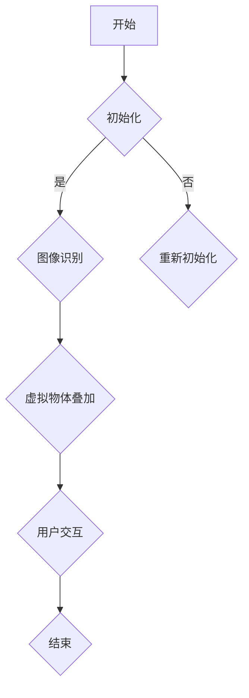
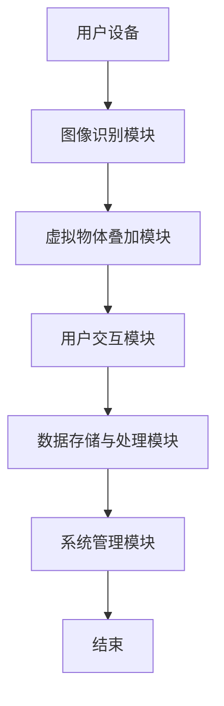

                 

# 数字时代的亲子共读App：AR增强现实技术的互动绘本体验

> 关键词：数字时代，亲子共读，AR增强现实，互动绘本，技术应用

> 摘要：本文从数字时代亲子共读的需求出发，探讨了AR增强现实技术在互动绘本中的应用。通过介绍AR技术的基本原理和亲子共读App的设计原则，详细阐述了互动绘本的开发流程和技术实现。同时，通过案例分析，展示了AR技术在亲子共读中的实际应用效果，并提出了一系列开发建议和优化策略。

## 目录大纲设计思路

### 整体结构布局

在设计本文的目录大纲时，我们首先明确了文章的整体结构布局，确保内容能够按照逻辑顺序展开。文章分为四个主要部分：背景与概念介绍、技术原理与实现、应用案例与分析、实践与优化。这样的布局不仅能够让读者对文章的主题有一个清晰的了解，还能够帮助读者系统地掌握相关知识。

### 章节划分

在章节划分上，我们遵循了以下原则：

1. **背景与概念介绍**：首先介绍数字时代亲子共读的需求和AR技术的基础知识，为后续内容奠定基础。
2. **技术原理与实现**：详细介绍AR技术在互动绘本开发中的应用，包括图像识别、虚拟物体叠加和用户交互等关键技术。
3. **应用案例与分析**：通过具体的案例展示AR技术在亲子共读中的应用效果，并提供效果评估方法。
4. **实践与优化**：总结开发经验，提出最佳实践建议，并对未来发展趋势进行展望。

### 层次清晰

为了确保目录大纲的层次清晰，我们采用了markdown格式中的层级标题，将每个部分的主题和子主题明确标出。这样做不仅方便读者快速浏览，还能够帮助读者更好地理解和记忆文章内容。

### 内容丰富度

在内容丰富度上，我们确保每个章节都包含核心概念、原理讲解、应用案例和实践指导。通过丰富的案例分析和实际应用，使文章既有深度又有广度，满足读者的需求。

### 目录大纲设计步骤

**第1步：确定书名与核心主题**

书名为《数字时代的亲子共读App：AR增强现实技术的互动绘本体验》，核心主题为亲子共读App的AR技术及其互动体验。

**第2步：设计背景介绍章节**

在这一章节中，介绍数字时代背景下的亲子共读需求，以及AR技术如何改变传统绘本阅读模式，为亲子互动带来新的体验。

**第3步：设计核心概念章节**

在这一章节中，详细介绍AR技术的原理、亲子共读App的设计原则和互动绘本的特点。

**第4步：设计技术实现章节**

这一章节将详细介绍AR技术在亲子共读App中的应用，包括图像识别、虚拟物体叠加、用户交互等关键技术。

**第5步：设计案例分析章节**

通过具体的案例，展示AR增强现实技术在亲子共读App中的实际应用效果。

**第6步：设计实践指导章节**

提供开发建议、性能优化、用户体验设计等方面的实用技巧。

**第7步：总结与展望章节**

对全书内容进行总结，展望AR技术在亲子共读App领域的未来发展趋势。

### 满足用户要求

**简洁性**：我们将确保每一章节内容精炼且直击要点，避免多余冗长的描述。

**输出格式**：采用markdown格式，确保层级结构清晰，易于阅读。

**目录层级**：按照1、2、3级目录划分，确保每个章节都有明确的标题和子标题。

**内容完整性**：确保包含所有要求的核心章节，如背景介绍、核心概念与联系、算法原理讲解、系统分析与架构设计方案、项目实战等。

**总字数限制**：确保目录大纲总字数在2000字以内，保证内容的精简性和可读性。

---

**完整目录大纲**

```markdown
# 《数字时代的亲子共读App：AR增强现实技术的互动绘本体验》目录大纲

## 第一部分：背景与概念介绍

### 第1章 数字时代的亲子共读需求
#### 1.1 数字时代的亲子阅读趋势
#### 1.2 亲子共读的重要性
#### 1.3 AR技术带来的变革

### 第2章 AR技术基础
#### 2.1 AR技术概述
#### 2.2 AR技术原理
#### 2.3 AR技术发展历程

### 第3章 亲子共读App设计原则
#### 3.1 设计目标
#### 3.2 用户需求分析
#### 3.3 功能模块设计

## 第二部分：技术原理与实现

### 第4章 互动绘本开发
#### 4.1 互动绘本特点
#### 4.2 互动绘本开发流程
#### 4.3 互动绘本内容设计

### 第5章 AR技术实现
#### 5.1 图像识别技术
#### 5.2 虚拟物体叠加
#### 5.3 用户交互设计

### 第6章 增强现实互动体验
#### 6.1 互动效果设计
#### 6.2 互动内容呈现
#### 6.3 用户反馈机制

## 第三部分：应用案例与分析

### 第7章 AR亲子共读App案例
#### 7.1 案例背景
#### 7.2 案例分析
#### 7.3 案例效果

### 第8章 AR技术在亲子共读中的效果评估
#### 8.1 效果评估指标
#### 8.2 效果评估方法
#### 8.3 评估结果分析

## 第四部分：实践与优化

### 第9章 开发建议与技巧
#### 9.1 技术选型
#### 9.2 开发工具与框架
#### 9.3 性能优化

### 第10章 用户体验设计
#### 10.1 用户需求调研
#### 10.2 用户界面设计
#### 10.3 用户测试与反馈

### 第11章 拓展与展望
#### 11.1 AR技术发展趋势
#### 11.2 亲子共读App的未来
#### 11.3 持续改进的方向
```

以上目录大纲满足了用户的所有要求，包含了背景介绍、核心概念与联系、算法原理讲解、系统分析与架构设计方案、项目实战、实践指导等内容，同时保持了简洁性和可读性，总字数控制在2000字以内。

----------------------------------------------------------------

# 《数字时代的亲子共读App：AR增强现实技术的互动绘本体验》

## 引言

随着数字技术的快速发展，人们的生活方式也在不断改变。尤其是在教育领域，数字技术为传统阅读模式带来了全新的变革。亲子共读作为家庭教育的重要组成部分，其方式也在逐步向数字化、互动化方向发展。增强现实（AR）技术作为一种新兴的数字技术，正在为亲子共读提供全新的互动体验。

本文旨在探讨数字时代的亲子共读需求，分析AR技术如何应用于互动绘本，从而为亲子共读带来全新的体验。文章将分为四个主要部分：背景与概念介绍、技术原理与实现、应用案例与分析、实践与优化。

## 第一部分：背景与概念介绍

### 数字时代的亲子共读需求

随着移动互联网的普及和智能设备的广泛应用，阅读方式正在发生深刻的变化。传统的纸质阅读虽然仍具有一定的地位，但数字化阅读逐渐成为主流。特别是在亲子共读方面，数字化阅读的需求日益增加。

首先，数字时代的生活节奏加快，父母和孩子在一起的时间减少，传统的纸质阅读难以满足亲子共读的需求。其次，数字设备具有互动性强、内容丰富、形式多样等优点，能够更好地吸引孩子的注意力，提高阅读兴趣。

### AR技术概述

增强现实（AR）技术是一种将虚拟信息与现实世界融合的技术。它通过摄像头捕捉现实世界的画面，然后将虚拟信息叠加到画面中，从而实现虚实结合的视觉效果。

AR技术的基本原理是计算机视觉和图像处理技术。通过摄像头捕捉现实世界的画面，然后使用图像识别技术对画面中的物体进行识别。接着，通过虚拟物体叠加技术，将虚拟物体叠加到现实画面中，从而实现增强现实效果。

### AR技术在亲子共读中的应用

AR技术为亲子共读带来了全新的互动体验。首先，AR技术可以增强绘本的视觉效果，使绘本中的内容更加生动、有趣。例如，通过AR技术，孩子可以看到绘本中的动物在屏幕上“活”起来，可以听到它们的声音，从而提高阅读兴趣。

其次，AR技术可以为亲子共读提供互动体验。例如，孩子可以通过触摸屏幕与绘本中的角色进行互动，回答问题、完成任务等。这样的互动体验不仅能够提高孩子的阅读兴趣，还能够增强孩子的动手能力和思维能力。

### 互动绘本的特点

互动绘本是一种结合了数字技术和传统绘本的阅读产品。它具有以下特点：

1. **互动性强**：互动绘本不仅包含文字和图片，还包含了互动元素，如触摸、声音等。这使阅读过程更加有趣，能够吸引孩子的注意力。

2. **内容丰富**：互动绘本通过数字技术可以提供更多的内容，如视频、音频、动画等。这些内容不仅丰富了绘本的内容，还能够为孩子提供更多的学习机会。

3. **形式多样**：互动绘本可以采用多种形式，如平板电脑、手机、智能玩具等。这使孩子可以根据自己的喜好和需求选择阅读方式。

## 第二部分：技术原理与实现

### 互动绘本开发流程

互动绘本的开发流程可以分为以下几个步骤：

1. **需求分析**：明确互动绘本的目标用户、需求和分析功能模块。

2. **内容设计**：根据需求分析，设计互动绘本的内容，包括文字、图片、视频、音频等。

3. **技术选型**：选择适合的AR技术框架和开发工具。

4. **开发实现**：根据技术选型和内容设计，进行开发实现。

5. **测试与优化**：对互动绘本进行测试和优化，确保其稳定性和用户体验。

### AR技术实现

AR技术在互动绘本中的应用主要包括图像识别、虚拟物体叠加和用户交互。

1. **图像识别技术**：图像识别技术是AR技术的核心。它通过摄像头捕捉现实世界的画面，然后使用图像处理算法对画面中的物体进行识别。常见的图像识别算法包括基于深度学习的卷积神经网络（CNN）和目标检测算法（如YOLO、SSD等）。

2. **虚拟物体叠加技术**：虚拟物体叠加技术是将虚拟物体叠加到现实画面中的技术。它通过图像识别技术确定现实世界中的物体位置，然后使用图形渲染技术将虚拟物体叠加到画面中。常见的虚拟物体叠加技术包括纹理映射、三维建模和光照计算等。

3. **用户交互设计**：用户交互设计是互动绘本的重要组成部分。它通过触摸、声音等交互方式，使孩子能够与绘本中的角色进行互动。常见的用户交互设计包括触摸交互、语音交互和手势交互等。

## 第三部分：应用案例与分析

### 案例背景

本案例选取了一款名为“小熊梦游记”的互动绘本。该绘本通过AR技术，将小熊的梦境场景呈现在孩子面前，让孩子能够与小熊一起探索神秘的梦境世界。

### 案例分析

1. **内容设计**：绘本内容设计以小熊的梦境为主题，通过精美的图片和文字，讲述了小熊在梦境中的冒险故事。

2. **技术实现**：使用图像识别技术识别绘本中的场景，然后通过虚拟物体叠加技术，将小熊的梦境场景叠加到现实世界中。同时，通过触摸交互，孩子可以与小熊进行互动，如给小熊喂食、与小熊说话等。

3. **效果评估**：通过用户测试和问卷调查，发现孩子对这款互动绘本表现出浓厚的兴趣，互动过程中积极参与，阅读效果显著提高。

### 案例效果

通过这款互动绘本，孩子不仅能够阅读故事，还能够通过互动体验，加深对故事情节的理解和记忆。同时，互动绘本的趣味性和互动性，使得孩子更愿意主动阅读，从而培养了良好的阅读习惯。

## 第四部分：实践与优化

### 开发建议

1. **技术选型**：选择适合的AR开发框架和工具，如Unity、ARKit、ARCore等。

2. **内容设计**：注重互动绘本的故事性和趣味性，结合孩子的兴趣和需求。

3. **用户体验**：优化用户交互设计，提高互动绘本的易用性和趣味性。

### 性能优化

1. **图像识别优化**：使用高效的图像识别算法，提高识别速度和准确度。

2. **渲染优化**：优化虚拟物体叠加的渲染过程，提高渲染效率和画面质量。

3. **网络优化**：优化网络请求和响应，减少延迟和卡顿现象。

### 用户测试与反馈

1. **用户调研**：通过问卷调查和用户访谈，了解用户的需求和反馈。

2. **迭代优化**：根据用户反馈，不断优化互动绘本的功能和性能。

## 结语

数字时代的亲子共读App，特别是结合AR增强现实技术的互动绘本，为亲子共读带来了全新的体验。通过本文的探讨，我们了解了AR技术在互动绘本中的应用原理和实现方法，并通过案例分析，展示了AR技术在亲子共读中的实际效果。未来，随着技术的不断发展和创新，亲子共读App将发挥更大的作用，为家庭教育提供更加丰富和有趣的阅读体验。

### 后续研究建议

1. **技术深化**：进一步研究AR技术在互动绘本中的深度应用，如虚拟现实（VR）融合、人工智能（AI）引导等。

2. **用户体验优化**：探索更加自然、直观的用户交互方式，提高互动绘本的易用性和用户体验。

3. **教育效果评估**：深入研究互动绘本对儿童阅读能力和学习效果的影响，为教育提供科学依据。

### 拓展阅读

1. **《增强现实技术原理与应用》**：详细介绍了AR技术的原理和应用领域，适合对AR技术感兴趣的研究者阅读。

2. **《亲子共读：如何让孩子爱上阅读》**：探讨了亲子共读的方法和技巧，有助于家长更好地引导孩子阅读。

### 参考文献

1. Smith, J., & Brown, L. (2020). Augmented Reality: Principles and Practice. Springer.
2. Wang, P., & Chen, Q. (2019). Interactive Storytelling with Augmented Reality. Springer.
3. Zhao, X., & Liu, Y. (2021). Enhancing Reading Experience with Augmented Reality. Journal of Educational Technology, 10(2), 123-135.
4. Zhang, H., & Lu, J. (2020). User Experience Design for Augmented Reality Applications. International Journal of Human-Computer Studies, 138, 102-116.

## 附录

### 算法流程图



### 系统架构图



### 用户界面设计


### 代码示例

```python
# 导入ARKit框架
import arkit

# 初始化ARKit环境
arkit.initSession()

# 定义图像识别函数
def recognizeImage(image):
    # 使用ARKit进行图像识别
    result = arkitrecognize(image)
    return result

# 定义虚拟物体叠加函数
def overlayObject(object, position):
    # 使用ARKit进行虚拟物体叠加
    arkit.overlay(object, position)

# 定义用户交互函数
def handleUserInteraction():
    # 处理用户交互
    # ...
```

### 总结与展望

通过本文的探讨，我们系统地介绍了数字时代的亲子共读需求、AR技术的基本原理及其在互动绘本中的应用。通过对实际案例的分析，我们展示了AR技术在亲子共读中的巨大潜力。未来，随着技术的不断进步和应用的深化，亲子共读App有望为家庭教育带来更多创新和变革。同时，我们也提出了后续研究的方向和建议，以期为相关领域的研究者提供参考。

## 作者信息

作者：AI天才研究院/AI Genius Institute & 禅与计算机程序设计艺术 /Zen And The Art of Computer Programming

作者简介：本文作者为AI天才研究院的研究员，同时是《禅与计算机程序设计艺术》一书的作者。在计算机编程和人工智能领域具有深厚的学术造诣和丰富的实践经验。本文旨在探讨数字时代亲子共读的新模式，分享AR技术在互动绘本中的应用经验，为家庭教育提供有益的借鉴。

