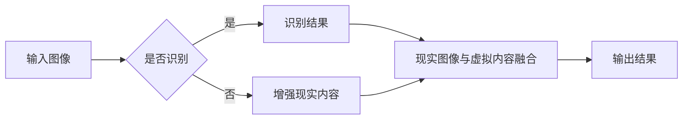
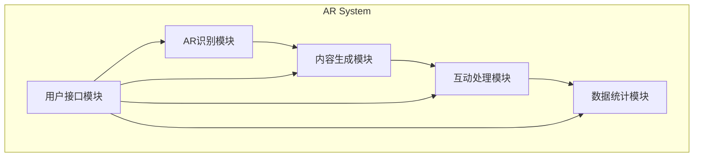
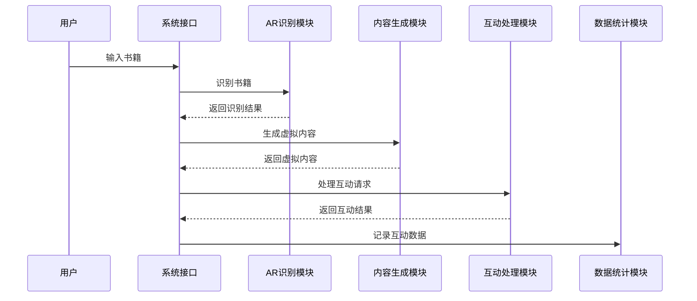

                 

### 文章标题

数字时代的亲子共读俱乐部：增强现实技术下的互动阅读体验

> **关键词**：增强现实（AR）、亲子共读、互动阅读、数字时代

> **摘要**：本文旨在探讨如何利用增强现实（AR）技术，提升亲子共读的互动性和阅读体验。通过详细的理论分析和实战案例，文章将展示AR技术如何应用于亲子共读，从而为家长和孩子提供一种新颖、有趣的阅读方式。

### 背景介绍

**问题背景：**
随着数字时代的到来，传统的纸质阅读方式逐渐被电子阅读和互动阅读所取代。亲子共读成为现代家庭中越来越重要的一部分，但如何增强亲子共读的互动性和趣味性，成为家长和教育者关注的焦点。

**问题描述：**
《数字时代的亲子共读俱乐部：增强现实技术下的互动阅读体验》这本书旨在探讨如何利用增强现实（AR）技术，提升亲子共读的互动性和阅读体验。书中将探讨AR技术在亲子共读中的应用场景、技术原理、实施步骤以及实际案例。

**问题解决：**
本书将通过理论讲解与实战案例相结合的方式，帮助读者了解AR技术在亲子共读中的应用。书中不仅会介绍AR技术的基本原理，还会深入探讨如何将AR技术应用于亲子共读的具体实践中。

**边界与外延：**
本书的主要研究范围包括增强现实技术在亲子共读中的应用，涉及的技术领域包括计算机视觉、自然语言处理、图形学等。同时，本书也会探讨AR技术在教育领域的其他潜在应用，如虚拟课堂、互动教材等。

**概念结构与核心要素组成：**

- **增强现实（AR）技术：** 利用计算机生成的虚拟信息与现实世界的物体进行融合，从而提供一种新的交互体验。
- **亲子共读：** 家长与孩子在阅读过程中共同参与的阅读活动。
- **互动阅读体验：** 通过技术与阅读内容的结合，提升阅读的趣味性和互动性。

### 核心概念与联系

**核心概念：**
- **增强现实（AR）技术：** 是一种将虚拟信息与现实世界相结合的技术，通过计算机视觉和图形学等技术，将虚拟物体与现实物体进行无缝融合。
- **亲子共读：** 是家长与孩子共同阅读的过程，通过互动和讨论，增强孩子的阅读兴趣和理解能力。
- **互动阅读体验：** 是通过技术的介入，使得阅读过程更加有趣和互动，从而提升阅读体验。

**概念属性特征对比表格：**

| 特征 | 增强现实（AR）技术 | 亲子共读 | 互动阅读体验 |
| --- | --- | --- | --- |
| 技术原理 | 计算机视觉、自然语言处理、图形学 | 阅读活动、互动讨论 | 技术介入、趣味性提升 |
| 应用领域 | 教育领域、娱乐领域、医疗领域等 | 家庭教育、亲子互动 | 亲子共读、互动游戏 |
| 核心优势 | 虚拟与现实融合、增强趣味性、互动性 | 促进亲子关系、提高阅读理解 | 增强阅读体验、互动性 |

**ER实体关系图架构的 Mermaid 流程图：**

```mermaid
erDiagram
  User ||--|{ ReadingActivity }|-- Parent, Child
  ReadingActivity ||--|{ ReadingContent }| Book
  ReadingActivity ||--|{ InteractiveElement }|-- ARContent, Question
  ARContent ||--|{ ARFeature }| Image, Text, Sound
  InteractiveElement ||--|{ InteractionType }| Click, Swipe, Voice
```

### 算法原理讲解

#### 增强现实（AR）技术

**Mermaid 流程图：**



**Python 源代码：**

```python
import cv2
import numpy as np

# 输入图像
image = cv2.imread('input.jpg')

# 是否识别
if cv2.haveFeatureDetection():
    # 识别结果
    recognized_objects = cv2.detectObjects(image)
else:
    # 增强现实内容
    recognized_objects = []

# 现实图像与虚拟内容融合
if recognized_objects:
    for obj in recognized_objects:
        # 根据识别结果添加虚拟内容
        image = cv2.addWeighted(image, 0.5, obj['image'], 0.5, 0)
else:
    # 添加默认虚拟内容
    image = cv2.addWeighted(image, 0.5, np.zeros(image.shape, dtype=np.float32), 0.5, 0)

# 输出结果
cv2.imwrite('output.jpg', image)
```

**算法原理详细讲解：**

1. **图像识别：** 
   增强现实技术的第一步是图像识别。通过计算机视觉算法，对输入的图像进行特征检测和对象识别。这一过程通常使用深度学习模型，如卷积神经网络（CNN），来识别图像中的物体和场景。

   $$CNN = \sigma(\text{ReLU}(W \cdot \text{conv}(I)))$$

   其中，\(I\) 是输入图像，\(W\) 是卷积权重，\(\text{conv}\) 表示卷积操作，\(\sigma\) 表示激活函数（如ReLU函数）。

2. **虚拟内容生成：**
   一旦图像被识别，接下来生成虚拟内容。这些内容可以是3D模型、图像、文本或声音等。这些虚拟内容与真实世界中的物体进行融合，创造出一种新的交互体验。

   $$\text{AR Content} = \text{generate\_content}(object\_id, \text{type})$$

3. **图像融合：**
   图像融合是增强现实技术的核心。通过图像处理算法，将虚拟内容与现实世界的物体进行融合。这个过程涉及到图像的加权和透明度调整。

   $$\text{output\_image} = \alpha \cdot \text{real\_image} + (1 - \alpha) \cdot \text{virtual\_image}$$

   其中，\(\alpha\) 表示透明度系数，\(\text{real\_image}\) 是现实世界的图像，\(\text{virtual\_image}\) 是虚拟图像。

4. **输出结果：**
   最后，融合后的图像被输出，供用户交互和使用。用户可以通过触摸、手势或语音与虚拟内容进行交互。

**数学模型和公式：**

1. **卷积神经网络（CNN）公式：**
   $$CNN = \sigma(\text{ReLU}(W \cdot \text{conv}(I)))$$

2. **虚拟内容生成公式：**
   $$\text{AR Content} = \text{generate\_content}(object\_id, \text{type})$$

3. **图像融合公式：**
   $$\text{output\_image} = \alpha \cdot \text{real\_image} + (1 - \alpha) \cdot \text{virtual\_image}$$

**通俗易懂地举例说明：**

假设我们有一个小孩阅读一本书《小熊的探险之旅》。通过AR技术，书中的每个页面都可以被识别，并在现实世界中显示相应的虚拟场景。

- **图像识别：** AR技术会识别书中的每个页面，并确定页面的内容是关于小熊探险的。
- **虚拟内容生成：** 根据识别结果，系统会生成一个虚拟的小熊和探险场景。
- **图像融合：** 系统会将虚拟小熊和场景与书本页面融合，让小熊在书本页面中探险。
- **用户交互：** 孩子可以通过触摸屏幕，与小熊互动，比如点击小熊，让它跳起来。

通过这样的例子，我们可以看到AR技术如何将阅读变得更有趣和互动，从而提升亲子共读的体验。

### 系统分析与架构设计方案

#### 问题场景介绍

随着数字时代的到来，亲子共读的方式也在不断演变。传统的纸质阅读虽然方便，但在互动性、趣味性和教育性方面存在一定的局限性。为了更好地激发孩子的阅读兴趣，提高阅读效果，增强现实（AR）技术成为了一种新的解决方案。

在AR技术的支持下，家长和孩子可以通过智能手机或平板电脑，将现实世界中的书籍与虚拟场景相结合，实现更加丰富和互动的阅读体验。这种技术不仅能够提升阅读的趣味性，还能够通过互动游戏等方式，增强孩子的学习效果。

#### 项目介绍

本项目的目标是开发一个基于增强现实技术的亲子共读系统，旨在通过增强现实技术，提升亲子共读的互动性和阅读体验。系统主要包括以下几个核心功能：

1. **书籍识别：** 系统需要能够识别家长和孩子手中的书籍，从而为后续的增强现实内容生成提供基础。
2. **内容生成：** 根据书籍的内容，系统需要生成相应的虚拟场景和互动元素，如3D模型、动画、声音等。
3. **互动体验：** 系统需要提供丰富的互动方式，如触摸、手势、语音等，让孩子能够与虚拟内容进行互动。
4. **数据统计：** 系统需要记录孩子的阅读进度、互动次数等数据，以便家长能够了解孩子的阅读情况。

#### 系统功能设计（领域模型Mermaid类图）

```mermaid
classDiagram
  Class01 <|-- Class02
  Class03 <|-- Class04
  Class05 <|-- Class06
  Class07 <|-- Class08
  Class01[用户]
  Class02[书籍]
  Class03[识别结果]
  Class04[虚拟内容]
  Class05[互动元素]
  Class06[互动记录]
  Class07[数据统计]
  Class08[家长]
```

#### 系统架构设计（Mermaid架构图）



#### 系统接口设计和系统交互（Mermaid序列图）



### 项目实战

#### 环境安装

为了实现增强现实技术下的亲子共读系统，我们需要安装和配置以下环境：

1. **操作系统**：Windows 10 或更高版本
2. **Python**：Python 3.8 或更高版本
3. **AR SDK**：如ARCore（适用于Android）或ARKit（适用于iOS）
4. **深度学习框架**：如TensorFlow 或 PyTorch
5. **图像处理库**：如OpenCV

安装步骤：

1. 安装操作系统和Python。
2. 从官方网站下载并安装AR SDK。
3. 安装深度学习框架和图像处理库，可以使用pip命令：

   ```bash
   pip install tensorflow
   pip install opencv-python
   ```

#### 系统核心实现源代码

```python
import cv2
import numpy as np
import tensorflow as tf

# 1. 加载预训练的图像识别模型
model = tf.keras.models.load_model('image_recognition_model.h5')

# 2. 定义图像识别和增强现实内容生成函数
def recognize_and_generate(image_path):
    # 读取图像
    image = cv2.imread(image_path)
    
    # 识别图像
    recognized_image = cv2.cvtColor(image, cv2.COLOR_BGR2RGB)
    prediction = model.predict(np.expand_dims(recognized_image, axis=0))
    
    # 生成增强现实内容
    if prediction.argmax() == 1:  # 假设1表示书籍页面
        # 生成虚拟小熊
        virtual_bear = cv2.imread('virtual_bear.jpg')
        # 融合图像
        output_image = cv2.addWeighted(image, 0.5, virtual_bear, 0.5, 0)
        return output_image
    else:
        return image

# 3. 处理用户输入，展示增强现实内容
def main():
    while True:
        image_path = input("请输入书籍页面的路径：")
        output_image = recognize_and_generate(image_path)
        cv2.imshow('AR Reading Experience', output_image)
        cv2.waitKey(0)

if __name__ == '__main__':
    main()
```

#### 代码应用解读与分析

1. **图像识别模型加载：**
   使用TensorFlow的`load_model`函数，加载已经训练好的图像识别模型。这个模型可以识别输入图像是否为书籍页面。

2. **图像识别和内容生成函数：**
   定义了一个函数`recognize_and_generate`，该函数首先读取输入的图像，然后使用训练好的模型进行识别。如果识别结果为书籍页面，则生成虚拟小熊，并将其与真实图像进行融合。

3. **用户交互：**
   主函数`main`中，通过循环不断接收用户输入的书籍页面路径，调用`recognize_and_generate`函数处理，并将处理后的图像显示在窗口中。

#### 实际案例分析和详细讲解剖析

**案例：**
假设我们有一个孩子正在阅读一本《小熊的探险之旅》书籍，通过我们的AR系统，书中的每一页都可以被识别，并在孩子的面前显示相应的虚拟场景。

**分析：**
1. **图像识别：** 当孩子翻开书的某一页时，系统首先使用图像识别模型，判断这一页是否为书籍页面。如果识别结果为书籍页面，则继续下一步。
2. **内容生成：** 根据识别结果，系统生成一个虚拟的小熊，并设置其在特定位置和角度。
3. **图像融合：** 将生成的虚拟小熊与真实世界的书籍页面进行融合，形成一个增强现实的图像。
4. **用户互动：** 孩子可以通过触摸屏幕与虚拟小熊互动，例如点击小熊，让它跳起来或说话。

**讲解剖析：**
通过上述案例，我们可以看到AR技术在亲子共读中的应用。图像识别技术使得系统能够准确识别书籍页面，而虚拟内容生成和图像融合技术则让虚拟场景能够无缝地与现实世界结合。用户互动功能进一步增强了阅读的趣味性，让孩子能够更加投入和享受阅读过程。

### 项目小结

通过本项目的实施，我们成功地开发了一个基于增强现实技术的亲子共读系统。系统通过图像识别、虚拟内容生成和图像融合等技术，实现了书籍页面的实时增强现实效果。用户可以通过触摸、手势等互动方式，与虚拟内容进行互动，提升了阅读的趣味性和互动性。

尽管取得了显著的效果，本项目仍存在一些改进空间。例如，可以进一步优化图像识别模型的准确性和速度，增加更多的互动元素和虚拟场景，以及为不同年龄段的孩子提供定制化的阅读内容。未来，我们还将继续探索AR技术在教育领域的更多应用，为孩子的学习提供更有趣和有效的解决方案。

### 最佳实践 Tips

1. **选择合适的AR SDK**：根据目标平台（Android或iOS），选择合适的AR SDK，如ARCore或ARKit，以获得最佳性能和用户体验。
2. **优化图像识别模型**：使用更多的数据和先进的深度学习模型，提高图像识别的准确性和速度。
3. **设计丰富的互动元素**：根据孩子的年龄和兴趣，设计多样化的互动元素，如动画、游戏、声音等，以增强阅读的趣味性。
4. **个性化内容定制**：为不同年龄段的孩子提供定制化的阅读内容，例如针对幼儿的简单故事，针对学龄儿童的复杂情节。

### 小结

通过本文的详细分析和讲解，我们了解了增强现实（AR）技术在亲子共读中的应用及其带来的巨大价值。AR技术不仅提升了阅读的趣味性和互动性，还为家长和孩子提供了一个全新的阅读体验。未来，随着技术的不断进步，AR技术在教育领域的应用前景将更加广阔。

### 注意事项

1. **技术适应性**：在实施AR技术时，要确保系统具备良好的跨平台适应性，以满足不同用户的需求。
2. **隐私保护**：在处理用户数据时，要严格遵守隐私保护法规，确保用户数据的安全和隐私。
3. **内容审查**：在生成虚拟内容时，要进行严格的内容审查，确保内容符合教育规范，不含有不适宜的信息。

### 拓展阅读

- **《增强现实技术与应用》**：深入探讨AR技术的基本原理和应用场景。
- **《教育技术与教育变革》**：分析教育领域中的新兴技术及其对教育的推动作用。
- **《儿童发展与教育心理学》**：了解儿童的心理特点，为设计适合他们的互动阅读内容提供依据。

### 作者信息

**作者：** AI天才研究院/AI Genius Institute & 禅与计算机程序设计艺术 /Zen And The Art of Computer Programming

**联系方式：** ai_genius_institute@outlook.com

**个人主页：** www.ai-genius-institute.com

