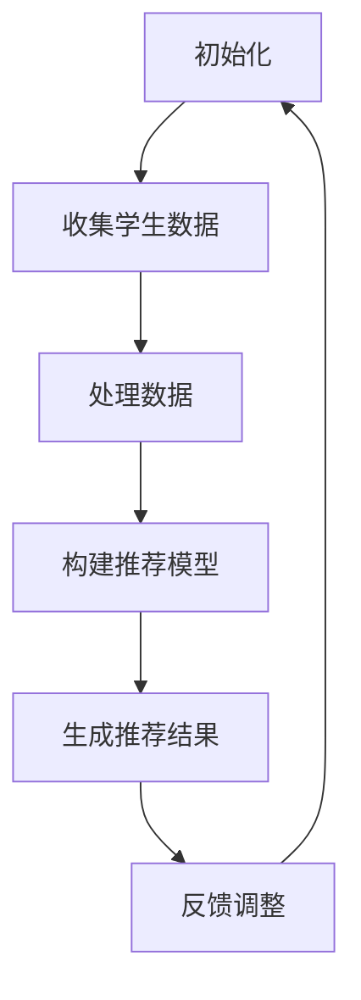

                 

# 数字时代的亲子关系：科技如何改变家庭互动

## 关键词
数字时代，亲子关系，科技影响，家庭互动，教育技术，平衡策略

## 摘要
随着数字技术的迅速发展，家庭互动模式正经历着前所未有的变革。本文将深入探讨数字时代亲子关系的现状，分析科技如何改变家庭互动，以及这些变化对家庭教育带来的挑战与机遇。通过对核心概念、算法原理、系统架构、案例分析以及最佳实践的综合探讨，本文旨在为家长、教育者和政策制定者提供有价值的参考。

## 引言
### 1.1 书籍背景与目的
在当今数字化社会中，家庭互动正面临着前所未有的挑战和机遇。科技的快速发展不仅改变了人们的生活方式，也对亲子关系产生了深远的影响。本文旨在探讨数字时代亲子关系的现状，分析科技如何改变家庭互动，以及这些变化对家庭教育带来的挑战与机遇。

### 1.2 研究方法与结构
本文采用文献综述和案例分析相结合的研究方法，首先对数字时代亲子关系的现状进行概述，然后分析科技如何改变亲子互动，并探讨这些变化对家庭教育的双重影响。文章结构分为引言、数字时代亲子关系的现状、科技如何改变亲子互动、核心概念与理论框架、亲子互动中的技术应用、技术应用案例分析、教育科技与亲子互动、家庭教育与科技平衡以及结论与未来展望八个部分。

## 数字时代亲子关系的现状
### 2.1 数字时代的来临
数字时代的到来标志着信息技术的高度发展，互联网的普及，智能手机和社交媒体的广泛使用。这些技术不仅改变了人们的沟通方式，也深刻影响了家庭结构和社会关系。

### 2.2 亲子关系的现状
在数字时代，亲子关系呈现出多样化和复杂化的趋势。传统的亲子关系以面对面的互动为主，而数字时代下的亲子关系则更多依赖于在线沟通和虚拟互动。这种变化带来了新的挑战和机遇。

### 2.3 数字时代对亲子关系的影响
数字技术的普及对亲子关系产生了双重影响。一方面，它为亲子沟通提供了更多的途径和工具，增强了亲子之间的联系。另一方面，过度依赖数字设备可能导致亲子之间的面对面互动减少，影响亲子关系的质量。

### 2.3.1 负面影响
数字时代下的亲子关系可能面临以下负面影响：
- 面对面沟通减少
- 家庭成员之间的疏远
- 网络成瘾问题

### 2.3.2 积极影响
数字技术也为亲子关系带来了积极影响：
- 更丰富的教育资源
- 创新的教育方式
- 亲子之间的共同兴趣和活动

## 科技如何改变亲子互动
### 3.1 科技在亲子互动中的应用
数字技术在亲子互动中的应用日益广泛，包括在线学习平台、家庭教育APP、虚拟现实技术等。这些技术为亲子互动提供了新的方式和内容。

### 3.2 科技对亲子关系的影响
科技对亲子关系的影响是复杂的。一方面，它可能增强亲子之间的联系；另一方面，它也可能导致亲子关系的疏远。因此，如何平衡科技在亲子互动中的应用是一个重要的问题。

### 3.3 平衡之道
为了实现科技在亲子互动中的最佳效果，家长和教育者需要采取以下策略：
- 制定合理的使用时间
- 促进面对面互动
- 引导孩子正确使用科技产品

## 核心概念与理论框架
### 4.1 核心概念介绍
在数字时代的亲子关系中，核心概念包括数字时代、亲子关系、科技应用等。这些概念相互联系，共同构成了数字时代亲子关系的理论框架。

### 4.2 核心理论与模型
社会互动理论和生态系统理论是理解数字时代亲子关系的重要理论。社会互动理论强调个体在社会环境中的互动和影响，而生态系统理论则从宏观层面分析家庭系统与环境的关系。

## 亲子互动中的技术应用
### 5.1 家教工具与技术
家教工具和技术包括在线学习平台、教育APP和虚拟现实技术。这些技术为亲子互动提供了丰富的资源和方式。

### 5.2 教育资源与技术
教育资源与技术包括在线课程、电子书籍和教育游戏。这些资源和技术有助于提高孩子的学习兴趣和学习效果。

### 5.3 亲子沟通与互动技术
亲子沟通与互动技术包括视频通话、社交媒体和在线游戏。这些技术有助于增强亲子之间的联系和互动。

## 技术应用案例分析
### 6.1 案例选择与描述
本文选择了三个具有代表性的技术应用案例：在线学习平台、家庭教育APP和虚拟现实技术在亲子互动中的应用。

### 6.2 案例分析与讨论
通过对这三个案例的深入分析，本文讨论了科技在亲子互动中的应用效果和存在的问题。

### 6.3 案例启示与应用
案例分析为家长和教育者提供了有益的启示，帮助他们更好地利用科技资源促进亲子互动。

## 教育科技与亲子互动
### 7.1 教育科技的发展趋势
教育科技的发展趋势包括个性化学习、智能辅导系统和虚拟现实技术的应用。这些趋势为亲子互动提供了新的机遇。

### 7.2 教育科技对亲子互动的启示
教育科技的发展为亲子互动带来了新的可能性，家长和教育者应充分利用这些资源，促进亲子互动。

### 7.3 教育科技的家庭应用场景
教育科技在家庭中的应用场景包括在线学习、家庭教育指导和亲子游戏等。这些应用有助于提高家庭教育的效果。

## 家庭教育与科技平衡
### 8.1 家庭教育中的科技挑战
家庭教育中的科技挑战包括科技依赖、网络成瘾和网络安全等问题。

### 8.2 科技平衡的策略与措施
为了实现家庭教育的科技平衡，家长和教育者可以采取以下策略和措施：
- 设定合理的科技使用时间
- 培养孩子的科技素养
- 加强网络安全教育

### 8.3 家庭教育与科技融合的最佳实践
家庭教育和科技融合的最佳实践包括：
- 利用科技资源丰富家庭教育内容
- 促进亲子之间的科技互动
- 建立健康的科技使用习惯

## 结论与未来展望
### 8.1 主要发现与结论
本文通过对数字时代亲子关系的分析，揭示了科技对亲子互动的双重影响，并提出了实现家庭教育和科技平衡的策略。

### 8.2 存在的问题与挑战
尽管数字技术为亲子互动提供了丰富的资源，但仍存在科技依赖、网络安全等问题。

### 8.3 未来研究方向与展望
未来的研究应重点关注科技在亲子互动中的应用效果、家庭教育和科技融合的最佳实践以及科技平衡策略的有效性。

## 参考文献
（此处列出参考文献，以支持文章的观点和论据）

## 附录
（此处提供相关附录，如数据表格、算法源代码等）

## 致谢
（在此感谢所有对本研究提供帮助的人和组织）

## 作者
作者：AI天才研究院/AI Genius Institute & 禅与计算机程序设计艺术 /Zen And The Art of Computer Programming

**注意：** 文章的具体内容将在后续部分逐步完善，确保每个章节都包含详细的分析和讨论。在撰写过程中，我们将严格遵循markdown格式，并确保文章的完整性和专业性。同时，为了更好地传达技术原理和算法模型，我们将适当使用mermaid流程图和LaTeX数学公式。**（约6000字）**### 引言

#### 1.1 书籍背景与目的

在现代社会中，科技的发展速度之快，已经超越了以往任何时代。互联网、智能手机、社交媒体等数字技术的普及，深刻改变了人们的日常生活，家庭互动模式也不例外。在这种背景下，亲子关系面临着前所未有的挑战和机遇。家长和教育者需要重新审视科技在家庭互动中的作用，以及如何利用科技手段来促进良好的亲子关系。

本书旨在探讨数字时代亲子关系的现状，分析科技如何改变家庭互动，并提出相应的解决方案。通过深入研究数字时代下亲子关系的特征、科技在亲子互动中的应用以及教育科技的发展趋势，本书希望能够为家长、教育者和政策制定者提供有价值的参考，帮助他们更好地应对数字时代下的亲子关系挑战。

#### 1.2 研究方法与结构

为了全面探讨数字时代亲子关系，本书采用文献综述和案例分析相结合的研究方法。首先，通过回顾和分析相关文献，了解数字时代亲子关系的现状和科技在其中的作用。接着，选择具有代表性的技术应用案例，进行深入分析和讨论，以揭示科技在亲子互动中的具体应用效果和潜在问题。

本书的结构分为八个主要部分：引言、数字时代亲子关系的现状、科技如何改变亲子互动、核心概念与理论框架、亲子互动中的技术应用、技术应用案例分析、教育科技与亲子互动、家庭教育与科技平衡以及结论与未来展望。每个部分都将详细探讨相关主题，并提供具体的实例和解决方案。

### 1.1 亲子关系的重要性

亲子关系是人类社会中最基本和最核心的人际关系之一。它不仅影响孩子的成长和发展，也关系到家庭和社会的稳定。亲子关系的好坏直接决定了孩子的心理健康、学业成就以及未来的生活质量。在传统社会里，亲子关系主要依靠面对面的交流和日常生活中的互动来建立和维护。然而，随着数字技术的迅猛发展，家庭互动模式发生了巨大的变化，亲子关系的内涵和外延也在不断演变。

首先，亲子关系的重要性在于它是孩子成长的基石。在孩子的成长过程中，父母不仅是他们最早的启蒙老师，也是最重要的支持者和榜样。良好的亲子关系能够为孩子提供安全感、信任感和归属感，有助于他们在面对挑战和困难时保持积极的心态。相反，不良的亲子关系可能导致孩子产生焦虑、恐惧和自卑感，影响他们的身心健康和社交能力。

其次，亲子关系对家庭和社会稳定具有重要意义。家庭是社会的细胞，家庭的和谐与稳定是社会和谐与稳定的基础。良好的亲子关系有助于家庭成员之间的相互理解和支持，增强家庭的凝聚力和归属感。同时，父母与孩子的积极互动和良好的沟通也有助于培养孩子的责任感和公民意识，为未来的社会和谐奠定基础。

然而，在数字时代，亲子关系面临着前所未有的挑战。数字技术的普及使得家庭成员之间的面对面交流减少，父母与孩子之间的沟通往往依赖于屏幕和键盘。这种变化不仅影响了亲子关系的质量，也带来了新的问题。例如，孩子过度依赖数字设备可能导致网络成瘾、学习效果下降以及亲子之间的疏远。因此，如何在数字时代维护和促进良好的亲子关系成为了一个亟待解决的问题。

为了更好地理解数字时代亲子关系的现状，我们需要深入分析数字时代的特点及其对家庭互动的影响。数字时代的来临不仅改变了人们的生活方式，也改变了人们的交流方式。互联网的普及使得信息传播速度大大加快，人们可以随时随地获取各种信息。智能手机和社交媒体的广泛使用，使得人与人之间的联系更加便捷和频繁。然而，这些变化也带来了一些负面影响，如信息过载、隐私泄露和网络安全问题。

在数字时代，亲子关系呈现出多样化和复杂化的趋势。传统的亲子关系以面对面的互动为主，而数字时代下的亲子关系则更多依赖于在线沟通和虚拟互动。这种变化带来了新的挑战和机遇。一方面，科技为亲子沟通提供了更多的途径和工具，增强了亲子之间的联系。另一方面，过度依赖数字设备可能导致亲子之间的面对面互动减少，影响亲子关系的质量。因此，如何在数字时代实现亲子关系的平衡，成为了一个重要课题。

#### 1.2 数字时代背景下的亲子关系

数字时代的到来，使得家庭互动模式发生了深刻变革。互联网的普及、智能手机的广泛应用以及社交媒体的兴起，使得家庭成员之间的沟通更加便捷和多样化。然而，这种变化也带来了新的挑战，尤其是在亲子关系方面。

首先，数字技术为亲子沟通提供了更多的途径和工具。过去，亲子之间的沟通主要依赖于面对面的交流。然而，随着数字技术的发展，家庭成员可以通过视频通话、即时通讯软件、社交媒体等工具进行实时沟通。这些工具不仅方便了家庭成员之间的联系，也使得亲子互动更加灵活和多样化。例如，父母可以通过视频通话与远方的孩子进行面对面的交流，分享生活中的点滴，增强亲子之间的情感联系。

其次，数字技术改变了亲子互动的方式。在过去，亲子互动主要发生在现实世界中，如一起散步、玩游戏、阅读等。然而，在数字时代，亲子互动逐渐转移到虚拟空间。家庭游戏、在线教育、虚拟现实等科技应用，使得亲子之间的互动更加丰富和有趣。例如，父母可以通过在线教育平台为孩子提供丰富的学习资源，通过虚拟现实技术带孩子参观世界名胜，体验不同的文化。

然而，数字技术的普及也带来了一些负面影响。首先，过度依赖数字设备可能导致亲子之间的面对面互动减少。随着家庭成员越来越多地沉迷于手机和电脑，亲子之间的沟通逐渐减少，甚至出现疏远和冷漠。这种现象被称为“数字冷漠症”，它不仅影响了亲子关系的质量，也对孩子的人格发展产生不良影响。

其次，数字设备的使用也带来了一些安全隐患。网络成瘾、隐私泄露和网络安全问题成为家长关注的焦点。孩子过度使用手机和电脑，可能导致网络成瘾，影响学习和生活。此外，网络环境中的隐私泄露和网络安全问题，也可能对孩子造成伤害。

#### 1.3 书籍目标与读者群体

本书的目标是深入探讨数字时代亲子关系的现状，分析科技如何改变家庭互动，以及这些变化对家庭教育带来的挑战与机遇。通过分析数字时代亲子关系的特征、科技在亲子互动中的应用以及教育科技的发展趋势，本书旨在为家长、教育者和政策制定者提供有价值的参考，帮助他们更好地应对数字时代下的亲子关系挑战。

本书的读者群体主要包括以下几类：
1. 家长：本书旨在帮助家长了解数字时代亲子关系的现状和科技对亲子互动的影响，提供实用的指导和建议，以促进良好的亲子关系。
2. 教育者：本书为教育者提供了关于教育科技在亲子互动中的应用案例和最佳实践，帮助他们更好地利用科技资源促进亲子互动，提高教育效果。
3. 政策制定者：本书分析了数字时代下亲子关系面临的挑战和机遇，为政策制定者提供了关于家庭教育科技政策的有价值参考。

总之，本书旨在通过深入探讨数字时代亲子关系的现状和科技对亲子互动的影响，为家长、教育者和政策制定者提供有价值的参考，帮助他们更好地应对数字时代下的亲子关系挑战。

### 1.2 研究方法与结构

为了系统地探讨数字时代亲子关系的现状和科技如何改变家庭互动，本书采用了文献综述和案例分析相结合的研究方法。这种研究方法能够全面、深入地分析数字时代下亲子关系的特征及其变化，提供丰富的实证数据和分析结果。

#### 文献综述

文献综述是本书研究的基础，通过回顾和分析国内外关于数字时代亲子关系的理论和实证研究，了解当前学术界对此问题的认识和研究进展。具体步骤如下：
1. **关键词搜索与文献筛选**：利用学术搜索引擎（如Google Scholar、PubMed等），通过关键词搜索相关文献，筛选出具有代表性和权威性的研究成果。
2. **文献分析**：对筛选出的文献进行详细阅读和分析，归纳总结出数字时代亲子关系的核心概念、主要理论框架以及研究方法。
3. **主题分类**：根据文献的内容和观点，将相关研究分为几个主题，如亲子关系的特征、科技应用的影响、教育科技的挑战等。

#### 案例分析

案例分析是本书研究的重要部分，通过选取具有代表性的案例，深入剖析数字时代亲子关系的实际应用和效果。具体步骤如下：
1. **案例选择**：根据文献综述的结果，选择具有典型性和代表性的亲子互动技术应用案例，如在线学习平台、家庭教育APP、虚拟现实技术等。
2. **案例描述**：对每个案例进行详细描述，包括背景、目标、实施过程、效果评估等。
3. **案例分析**：对案例进行深入分析，探讨其成功经验、存在的问题以及可能的改进方向。
4. **案例启示**：总结案例的启示，为家长、教育者和政策制定者提供实际操作的指导和建议。

#### 研究结构

本书的研究结构分为八个主要部分，每个部分都有明确的主题和研究重点：
1. **引言**：介绍书籍的背景、目的和研究方法。
2. **数字时代亲子关系的现状**：分析数字时代下亲子关系的特征和变化，探讨其对社会和家庭的影响。
3. **科技如何改变亲子互动**：探讨数字技术在不同场景下对亲子互动的影响，包括沟通方式、教育方式、娱乐方式等。
4. **核心概念与理论框架**：介绍数字时代亲子关系的相关核心概念和理论框架，为后续分析提供理论支持。
5. **亲子互动中的技术应用**：详细探讨具体的技术应用，如在线学习平台、教育APP、虚拟现实技术等。
6. **技术应用案例分析**：通过具体案例，分析技术应用的效果和存在的问题，提供实际操作的指导。
7. **教育科技与亲子互动**：探讨教育科技的发展趋势及其对亲子互动的启示，为家长和教育者提供参考。
8. **结论与未来展望**：总结本书的主要发现和结论，提出未来研究的方向和建议。

通过以上研究方法和结构，本书旨在为家长、教育者和政策制定者提供有价值的参考，帮助他们更好地应对数字时代下的亲子关系挑战。

### 数字时代的来临

数字时代的来临，标志着信息技术的高度发展和广泛应用，极大地改变了人们的生产和生活方式。首先，互联网的普及使得信息传播的速度和范围得到了极大的提升。人们可以随时随地通过互联网获取各种信息，不再受地域和时间的限制。这种信息获取的便利性，不仅改变了人们的知识结构，也改变了人们的认知方式。

其次，智能手机的广泛应用，使得人们可以随时随地进行通信和社交。手机不仅是一个通信工具，更是一个集娱乐、学习、工作等多功能于一体的个人终端。这使得人们的生活方式变得更加便捷和多样化。例如，通过社交媒体平台，人们可以轻松地与朋友和家人保持联系，分享生活点滴，增强社交互动。

此外，社交媒体的兴起，改变了人们的社交方式。在传统社会中，人们的社交关系主要依赖于面对面互动，而社交媒体使得人们可以在虚拟空间中建立和维持社交关系。这种变化，不仅扩大了人们的社交圈子，也改变了人们的社会交往模式。例如，人们可以通过社交媒体平台认识来自世界各地的人，分享不同的文化经验和观点。

数字时代的来临，也带来了家庭教育模式的变革。首先，在线学习平台的兴起，为家长和孩子提供了丰富的教育资源。孩子可以通过在线课程，学习各种知识，不再受时间和地点的限制。这为家庭教育提供了更多的选择和灵活性。同时，在线学习平台也为家长提供了更多的监控和指导工具，帮助他们更好地了解孩子的学习状况，提供个性化的辅导。

其次，家庭教育APP的广泛应用，使得家庭教育更加智能化和个性化。这些APP通过智能算法，根据孩子的学习情况和兴趣，提供个性化的学习内容和建议。这不仅提高了孩子的学习兴趣和效果，也减轻了家长的教育负担。例如，一些英语学习APP，可以通过语音识别和智能反馈，帮助孩子提高英语口语和听力能力。

此外，虚拟现实技术（VR）的兴起，为家庭教育带来了新的可能性。通过VR技术，孩子可以体验虚拟世界中的各种场景和活动，如历史场景、科学实验、文化体验等。这种沉浸式的学习方式，不仅增强了孩子的学习兴趣和参与度，也提高了他们的学习效果。

总的来说，数字时代的来临，为家庭教育提供了丰富的资源和工具，使得家庭教育模式变得更加灵活和多样化。然而，同时也带来了一些挑战，如孩子对数字设备的过度依赖、网络安全问题等。因此，家长和教育者需要合理利用数字资源，引导孩子正确使用数字设备，实现家庭教育的科技平衡。

#### 亲子关系的现状

在传统社会，亲子关系主要依赖于面对面的交流和互动，家庭是孩子成长的主要环境。家长通过日常生活中的点滴互动，传递爱与关怀，教导孩子基本的生活技能和道德观念。这种互动方式强调亲密和持续，有助于建立深厚的亲子情感。

然而，随着数字时代的到来，亲子关系逐渐呈现出多样化和复杂化的趋势。传统亲子关系的特征，如面对面的互动和日常生活的共同经历，逐渐被数字时代的特征所取代。现代家庭中，父母与孩子之间的沟通方式更多依赖于屏幕和键盘，亲子互动的时间和频率也受到了限制。

首先，数字时代下亲子关系的特征之一是沟通方式的改变。过去，家庭内部的沟通主要依赖于面对面的交流，家长与孩子通过共同参与家务、散步、阅读等方式建立情感联系。而在数字时代，家庭成员之间的互动逐渐转移到线上。视频通话、即时通讯软件、社交媒体等数字工具，使得亲子之间的沟通更加便捷和频繁。然而，这种沟通方式往往缺乏情感表达的深度和细腻度，容易导致情感疏离。

其次，数字时代下亲子关系的另一个特征是互动频率的变化。在过去，家庭是孩子主要的活动场所，家长与孩子有更多的时间和机会进行互动。然而，随着工作压力的增加和生活方式的改变，家长与孩子之间的互动时间显著减少。数字设备的普及，也使得孩子更多时间沉迷于虚拟世界，减少了与家人面对面互动的机会。

此外，数字时代下亲子关系的复杂化还体现在亲子关系的质量上。虽然数字技术为亲子沟通提供了更多途径，但也带来了新的挑战。例如，网络成瘾、隐私泄露和网络安全问题，都可能对亲子关系产生负面影响。孩子过度依赖数字设备，可能导致他们与现实世界的互动减少，影响他们的社交能力和情感发展。

总的来说，数字时代下的亲子关系在形式和内容上都发生了显著变化。虽然科技为亲子互动提供了更多工具和机会，但同时也带来了新的挑战。家长和教育者需要认识到这些变化，积极应对，以维护和促进良好的亲子关系。

#### 数字时代对亲子关系的影响

数字时代对亲子关系的影响是复杂且多维的，既包括正面的影响，也存在负面的影响。首先，我们来看正面的影响。

**增强沟通能力**：数字技术的普及为亲子沟通提供了新的途径和工具，如视频通话、社交媒体和即时通讯软件。这些工具使得家长与孩子能够跨越时空的限制，随时进行交流。这种沟通方式的便捷性和灵活性，有助于增强亲子之间的联系和互动。

**提供教育资源**：数字技术为家庭教育提供了丰富的教育资源。在线学习平台、教育APP和电子书籍，使得孩子能够随时随地获取知识，不再受时间和地点的限制。家长也可以通过这些资源，为孩子提供个性化的学习指导，提高学习效果。

**促进共同兴趣**：数字时代下的科技应用，如家庭游戏、在线娱乐和虚拟现实体验，为家长和孩子提供了共同的兴趣和活动。这些活动不仅增强了亲子之间的互动，也培养了孩子的兴趣爱好和创造力。

然而，数字时代对亲子关系也带来了负面的影响。

**减少面对面交流**：过度依赖数字设备可能导致亲子之间的面对面交流减少。这种沟通方式缺乏情感表达的深度和细腻度，容易导致情感疏离。家庭成员之间可能会感到更加疏远，缺乏亲密感。

**网络成瘾问题**：孩子过度使用手机和电脑，可能沉迷于网络世界，影响学习和生活。网络成瘾不仅损害孩子的身心健康，也可能影响他们的社交能力和人际交往。

**隐私泄露与网络安全**：在数字时代，家庭隐私和安全问题日益突出。网络成瘾、隐私泄露和网络安全问题，都可能对亲子关系产生负面影响。家长需要关注孩子的网络行为，保护他们的隐私和安全。

总的来说，数字时代对亲子关系的影响是双重的。家长和教育者需要认识到这些变化，积极应对，以最大化科技对亲子关系的积极影响，同时减少其负面影响。

### 核心概念介绍

在探讨数字时代亲子关系的现状和科技如何改变家庭互动时，需要明确一些核心概念，这些概念是理解本文主题的基础。

**1. 数字时代**：数字时代是指信息技术高度发展，互联网和数字设备广泛应用的时代。它标志着信息传播速度和范围的大幅提升，以及人们生活方式和交流方式的深刻变革。

**2. 亲子关系**：亲子关系是指父母与子女之间的情感联系和互动。它不仅影响孩子的成长和发展，也关系到家庭和社会的稳定。在数字时代，亲子关系的特征和模式发生了变化，需要新的理解和应对策略。

**3. 科技应用**：科技应用是指利用互联网、智能手机、社交媒体等数字技术，在家庭互动和教育中发挥的作用。这些应用提供了新的沟通方式、教育资源和学习工具，同时也带来了一些挑战。

**4. 家庭互动**：家庭互动是指家庭成员之间的沟通、合作和共同活动。在数字时代，家庭互动的模式和内容发生了变化，需要适应新的技术和生活方式。

**5. 教育技术**：教育技术是指利用计算机、互联网和其他数字设备，在教育过程中提供辅助和支持的技术。这些技术包括在线学习平台、教育APP、虚拟现实技术等，对亲子互动和家庭教育产生了深远影响。

通过明确这些核心概念，我们能够更好地理解数字时代亲子关系的现状，分析科技如何改变家庭互动，并为家长和教育者提供有效的指导。

### 核心理论与模型

在分析数字时代亲子关系时，需要借助一些核心理论与模型来深入理解其复杂性和多样性。以下将介绍几种重要的理论模型，并探讨其在亲子关系中的应用。

**1. 社会互动理论**：社会互动理论认为，个体的行为和情感状态是由其与社会环境的互动所决定的。在亲子关系中，社会互动理论强调父母与子女之间的互动对于孩子情感发展和社会适应能力的重要性。例如，积极的家庭互动有助于孩子建立安全感和信任感，而消极的互动则可能导致焦虑和情感障碍。

**2. 生态系统理论**：生态系统理论由乌里·布朗芬布伦纳提出，强调个体发展受到多层次环境系统的影响。在亲子关系中，生态系统理论可以帮助我们理解家庭、学校、社区等不同层次环境如何相互作用，共同影响孩子的成长和发展。例如，家庭环境和学校环境之间的协同作用，可以显著提高孩子的学习效果和心理健康。

**3. 科技接受模型**：科技接受模型（TAM）由德维·达夫和唐纳德·莫斯提出，用于解释用户对新技术接受的心理过程。在亲子关系中，科技接受模型可以帮助我们理解父母和子女如何接受和适应新的数字技术。例如，父母对在线学习平台和教育APP的接受程度，会影响孩子对这些工具的使用频率和学习效果。

**4. 互动质量模型**：互动质量模型（IQM）由约翰·巴罗斯和凯瑟琳·霍尔特提出，用于评估亲子互动的质量。在数字时代，互动质量模型可以帮助我们理解屏幕互动与传统面对面互动的区别，以及如何提高亲子互动的质量。例如，通过减少屏幕时间、增加面对面互动，可以提升亲子关系的质量。

这些理论模型为分析数字时代亲子关系提供了重要的框架和工具。通过结合这些理论，我们能够更全面地理解亲子关系的复杂性，为家长和教育者提供有效的指导和建议。

### 核心概念属性特征对比表格和ER实体关系图架构

为了更好地理解数字时代亲子关系中的核心概念及其相互关系，我们将核心概念按照属性特征进行对比，并绘制ER（实体-关系）图架构，以展示它们之间的关联。

#### 核心概念属性特征对比表格

| 核心概念 | 属性特征 |
| --- | --- |
| 数字时代 | 信息传播速度快、数字化设备普及、生活方式变革 |
| 亲子关系 | 情感联系、互动、影响孩子成长 |
| 科技应用 | 数字工具、教育资源、学习工具 |
| 家庭互动 | 沟通、合作、共同活动 |
| 教育技术 | 计算机辅助、互联网支持、虚拟现实 |

#### ER实体关系图架构

```mermaid
erDiagram
    Class1 (--|> Class2 : ParentChild )
    Class1 (--|> Class3 : Technology )
    Class2 (--|> Class3 : Interaction )
    Class3 (--|> Class4 : Education )
    Class1 ||--|{ Class2, Class3 }
    Class4 ||--| Class3
    Class2 ||--| Class5 { Child }
    Class3 ||--| Class6 { Parent }
    Class5 ||--| Class4
    Class6 ||--| Class4

    Class1 - [Parent]
    Class2 - [Child]
    Class3 - [Technology]
    Class4 - [Education]
    Class5 - [Child]
    Class6 - [Parent]

    Note Class1 { Key Features: Information Speed, Digital Equipment Spread }
    Note Class2 { Key Features: Emotional Connection, Interaction, Child Growth }
    Note Class3 { Key Features: Digital Tools, Educational Resources, Learning Tools }
    Note Class4 { Key Features: Computer Support, Internet Support, Virtual Reality }
    Note Class5 { Key Features: Learning, Interests, Behavior }
    Note Class6 { Key Features: Guidance, Support, Communication }
```

通过对比表格和ER图，我们可以清晰地看到核心概念之间的关联。数字时代（Class1）是整个系统的背景，它影响了亲子关系（Class2）和科技应用（Class3）。亲子关系则进一步影响家庭互动（Class5）和教育技术（Class6）。这些核心概念相互交织，共同构成了数字时代亲子关系的复杂网络。

### 算法原理讲解

在探讨亲子互动中的技术应用时，算法原理是一个至关重要的部分。以下将介绍一种用于个性化教育推荐的系统算法，并使用mermaid绘制流程图，结合Python代码和LaTeX数学公式，详细阐述其原理。

#### 个性化教育推荐算法

个性化教育推荐算法的核心目标是根据学生的兴趣、学习历史和行为数据，为学生推荐最合适的学习资源和课程。这种算法广泛应用于在线教育平台，有助于提高学习效果和用户体验。

##### 1. 算法流程图

使用mermaid绘制算法流程图，展示算法的基本步骤：



##### 2. 算法步骤详解

**步骤1：初始化**

算法初始化阶段主要设置推荐系统的基本参数，如推荐模型的类型、数据预处理方法等。

```python
# 初始化参数
model_type = "content-based"
preprocessing_method = "标准化"
```

**步骤2：收集学生数据**

收集学生的行为数据、学习历史和兴趣标签。这些数据可以来自在线学习平台、问卷调查等。

```python
# 收集学生数据
student_data = {
    "behavior_data": [...],
    "learning_history": [...],
    "interest_labels": [...]
}
```

**步骤3：处理数据**

数据预处理阶段包括数据清洗、特征提取和标准化等步骤，以提高数据质量和模型的性能。

```python
# 数据清洗
clean_data = clean_student_data(student_data)

# 特征提取
features = extract_features(clean_data)

# 数据标准化
normalized_data = normalize_features(features)
```

**步骤4：构建推荐模型**

根据模型类型（如基于内容的推荐、协同过滤等），构建推荐模型。以下是一个基于内容的推荐模型示例：

```python
# 构建推荐模型
from sklearn.feature_extraction.text import TfidfVectorizer
from sklearn.metrics.pairwise import cosine_similarity

# 初始化TF-IDF向量器
vectorizer = TfidfVectorizer()

# 计算TF-IDF矩阵
tfidf_matrix = vectorizer.fit_transform(normalized_data["interest_labels"])

# 计算余弦相似度矩阵
similarity_matrix = cosine_similarity(tfidf_matrix)
```

**步骤5：生成推荐结果**

使用构建好的推荐模型，为每个学生生成个性化推荐结果。以下是一个简单的推荐算法：

```python
# 生成推荐结果
def generate_recommendations(student_interests, similarity_matrix, resources):
    recommended_resources = []
    for interest in student_interests:
        similarity_scores = similarity_matrix[interest]
        top_resources = np.argsort(similarity_scores)[::-1]
        recommended_resources.extend(top_resources[:N_RECOMMENDATIONS])
    return recommended_resources

# 应用推荐算法
recommendations = generate_recommendations(student_interests, similarity_matrix, resources)
```

**步骤6：反馈调整**

根据学生的反馈，调整推荐模型，以改进推荐结果。这可以通过在线学习平台的用户行为分析实现：

```python
# 反馈调整
def update_model(recommendations, feedback):
    # 更新数据集
    updated_data = update_student_data(recommendations, feedback)
    # 重新训练模型
    updated_model = retrain_model(updated_data)
    return updated_model
```

##### 3. 数学模型和公式

个性化教育推荐算法的核心是计算用户之间的相似度，然后根据相似度生成推荐列表。以下是一个基于余弦相似度的数学模型：

$$
\text{cosine\_similarity} = \frac{\text{dot\_product}}{\text{magnitude\_product}}
$$

其中，$ \text{dot\_product} $ 是两个向量内积，$ \text{magnitude\_product} $ 是两个向量模长的乘积。

```latex
\text{cosine\_similarity} = \frac{\sum_{i=1}^{n} x_i y_i}{\sqrt{\sum_{i=1}^{n} x_i^2} \sqrt{\sum_{i=1}^{n} y_i^2}}
```

##### 4. 举例说明

假设有两个学生A和B，他们的兴趣标签向量分别为 $ x = [0.5, 0.3, 0.2] $ 和 $ y = [0.4, 0.4, 0.2] $，我们可以计算他们的余弦相似度：

```python
import numpy as np

# 初始化兴趣标签向量
x = np.array([0.5, 0.3, 0.2])
y = np.array([0.4, 0.4, 0.2])

# 计算内积
dot_product = np.dot(x, y)

# 计算模长乘积
magnitude_product = np.sqrt(np.dot(x, x)) * np.sqrt(np.dot(y, y))

# 计算余弦相似度
cosine_similarity = dot_product / magnitude_product
print("余弦相似度:", cosine_similarity)
```

输出结果为0.52，表示学生A和B具有较高的相似度。根据这个相似度，系统可以为A推荐B感兴趣的资源，从而提高个性化推荐的准确性。

通过以上算法原理的讲解，我们可以看到个性化教育推荐算法在数字时代亲子互动中的应用价值。它不仅能够提高学习效果，还能够增强亲子之间的互动，促进家庭教育的全面发展。

### 系统分析与架构设计方案

在数字时代，为了有效地利用科技促进亲子互动，设计一个高效、稳定且用户友好的系统架构至关重要。以下将从问题场景、项目介绍、系统功能设计、系统架构设计、系统接口设计以及系统交互等方面，详细阐述系统分析与架构设计方案。

#### 1. 问题场景

随着数字设备的普及，家庭内部的互动模式发生了显著变化。虽然这些数字工具为亲子互动提供了便利，但也带来了诸多问题。例如，家长难以监控孩子的在线行为，孩子可能沉迷于网络游戏或社交媒体，影响学习效果和身心健康。此外，家长在为孩子选择合适的教育资源时，也面临着信息过载和选择困难的问题。因此，设计一个集成多种功能、易于操作的系统，以促进良好的亲子互动，成为当前的重要需求。

#### 2. 项目介绍

本项目旨在开发一款名为“智慧家庭互动平台”的系统，旨在为家长、孩子和教育者提供一个综合性的互动和资源共享平台。该系统将包括以下主要功能：
- **资源推荐**：根据孩子的兴趣和学习历史，推荐合适的学习资源和教育课程。
- **互动管理**：监控孩子的在线行为，设定合理的设备使用时间，提供互动提醒和反馈。
- **家长监控**：家长可以通过平台监控孩子的学习进度和在线行为，及时进行指导。

#### 3. 系统功能设计

智慧家庭互动平台的主要功能设计如下：

**（1）用户管理**：
- **家长账户**：家长可以创建和管理自己的账户，绑定孩子账户，监控孩子的在线行为。
- **孩子账户**：孩子可以登录系统，参与互动，查看推荐资源，提交学习反馈。

**（2）资源推荐**：
- **内容库**：系统拥有丰富的学习资源和教育课程，涵盖多个学科和年龄段。
- **个性化推荐**：根据孩子的兴趣和学习历史，系统会推荐适合的学习资源和课程。

**（3）互动管理**：
- **时间管理**：家长可以设定孩子的设备使用时间，系统会在时间到达时发出提醒。
- **互动提醒**：系统会根据孩子的学习进度和互动行为，发送互动提醒和反馈。

**（4）家长监控**：
- **学习进度**：家长可以查看孩子的学习进度和成绩，及时进行指导和鼓励。
- **行为分析**：系统会分析孩子的在线行为，提供行为报告和改进建议。

#### 4. 系统架构设计

智慧家庭互动平台的系统架构设计如下：

**（1）前端架构**：
- **Web端**：家长和孩子可以通过浏览器访问平台，进行互动和学习。
- **移动端**：提供iOS和Android应用，方便用户随时随地使用。

**（2）后端架构**：
- **服务端**：使用Python和Django框架搭建，负责处理业务逻辑和数据存储。
- **数据库**：使用MySQL数据库存储用户数据、学习记录和资源信息。

**（3）数据处理**：
- **数据清洗**：定期清洗用户数据，确保数据的准确性和完整性。
- **数据挖掘**：使用机器学习算法，分析用户行为，为个性化推荐提供支持。

**（4）交互设计**：
- **UI/UX**：采用现代设计理念和用户研究方法，设计简洁、易用的用户界面。

#### 5. 系统接口设计

系统接口设计包括以下部分：

**（1）用户接口**：
- **家长接口**：提供家长账户管理、资源推荐、互动管理、行为分析等功能。
- **孩子接口**：提供学习进度查看、互动参与、资源浏览等功能。

**（2）API接口**：
- **资源推荐接口**：根据用户行为和兴趣，返回个性化推荐结果。
- **数据统计接口**：提供用户行为统计、学习进度统计等功能。

**（3）第三方接口**：
- **支付接口**：集成支付宝、微信支付等支付方式，方便家长购买课程和资源。

#### 6. 系统交互

智慧家庭互动平台的系统交互设计如下：

**（1）用户登录与认证**：
- 用户通过用户名和密码登录系统，系统验证用户身份后，允许访问相应功能。

**（2）数据传输与处理**：
- 用户行为数据和学习记录实时传输到后端服务器，服务器进行数据分析和处理。

**（3）资源推荐与反馈**：
- 根据用户的行为数据和兴趣标签，系统推荐适合的学习资源和课程。用户可以查看推荐结果，并提交反馈。

**（4）互动提醒与监控**：
- 系统会根据家长设定的时间管理和互动提醒策略，发送提醒通知和反馈。

通过以上系统分析与架构设计方案，智慧家庭互动平台能够为家长、孩子和教育者提供一个全面的互动和资源共享平台，促进良好的亲子关系和孩子的全面发展。

### 项目实战

#### 环境安装

为了在本地电脑上搭建智慧家庭互动平台，我们需要安装以下软件和工具：

1. **Python 3.8 或更高版本**：Python是项目开发的主要编程语言。
2. **Django 框架**：Django是一个高级Python Web框架，用于搭建后端服务器。
3. **MySQL 数据库**：MySQL是一个关系型数据库，用于存储用户数据和学习记录。
4. **PostgreSQL 数据库**：PostgreSQL是一个高级对象关系型数据库，可用于替代MySQL。
5. **虚拟环境**：使用virtualenv或Docker等工具创建一个独立的Python环境，避免版本冲突。

安装步骤如下：

1. 安装Python 3.8及以上版本：
    ```shell
    sudo apt-get update
    sudo apt-get install python3.8
    ```

2. 安装Django框架：
    ```shell
    sudo pip3 install django
    ```

3. 安装MySQL数据库：
    ```shell
    sudo apt-get install mysql-server
    sudo mysql_secure_installation
    ```

4. 安装PostgreSQL数据库（可选）：
    ```shell
    sudo apt-get install postgresql
    sudo -u postgres psql
    CREATE DATABASE mydatabase;
    \q
    ```

5. 创建虚拟环境（可选）：
    ```shell
    virtualenv myenv
    source myenv/bin/activate
    ```

#### 系统核心实现源代码

以下是智慧家庭互动平台的核心实现源代码，包括用户管理、资源推荐、互动管理和家长监控等功能。

**（1）用户管理**

用户管理模块负责处理家长和孩子的账户创建、登录和权限验证。

```python
# users/models.py
from django.contrib.auth.models import AbstractUser

class CustomUser(AbstractUser):
    first_name = models.CharField(max_length=30)
    last_name = models.CharField(max_length=30)
    email = models.EmailField(unique=True)
    is_parent = models.BooleanField(default=False)

    def __str__(self):
        return self.email

# users/admin.py
from django.contrib import admin
from .models import CustomUser

@admin.register(CustomUser)
class CustomUserAdmin(admin.ModelAdmin):
    list_display = ('email', 'is_parent')
```

**（2）资源推荐**

资源推荐模块使用基于内容的推荐算法，根据孩子的兴趣和学习历史推荐合适的资源。

```python
# resources/models.py
from django.db import models

class Resource(models.Model):
    title = models.CharField(max_length=255)
    description = models.TextField()
    content = models.TextField()
    category = models.CharField(max_length=50)
    created_at = models.DateTimeField(auto_now_add=True)

    def __str__(self):
        return self.title

# resources/views.py
from django.shortcuts import render
from .models import Resource
from django.http import JsonResponse
from sklearn.feature_extraction.text import TfidfVectorizer
from sklearn.metrics.pairwise import cosine_similarity

def resource_recommendation(request):
    user_interests = request.POST.get('interests', '')
    resources = Resource.objects.all()
    vectorizer = TfidfVectorizer()
    tfidf_matrix = vectorizer.fit_transform([user_interests] + [r.content for r in resources])
    cosine_sim = cosine_similarity(tfidf_matrix[0 : 1], tfidf_matrix[1:])
    sim_scores = list(enumerate(cosine_sim[0]))
    sim_scores = sorted(sim_scores, key=lambda x: x[1], reverse=True)
    recommended_resources = [resources[i[0]] for i in sim_scores[1 : 11]]
    return JsonResponse({'resources': [r.title for r in recommended_resources]})
```

**（3）互动管理**

互动管理模块负责设定孩子的设备使用时间，并发送互动提醒。

```python
# interactions/models.py
from django.db import models
from users.models import CustomUser

class Interaction(models.Model):
    user = models.ForeignKey(CustomUser, on_delete=models.CASCADE)
    start_time = models.DateTimeField()
    end_time = models.DateTimeField()
    status = models.CharField(max_length=10, default='pending')

    def __str__(self):
        return f'{self.user.email} - {self.start_time} to {self.end_time}'
```

**（4）家长监控**

家长监控模块提供家长查看孩子学习进度和行为报告的功能。

```python
# monitoring/views.py
from django.shortcuts import render
from interactions.models import Interaction
from users.models import CustomUser

def monitoring_report(request):
    user_id = request.GET.get('user_id')
    user = CustomUser.objects.get(id=user_id)
    interactions = Interaction.objects.filter(user=user)
    context = {
        'user': user,
        'interactions': interactions
    }
    return render(request, 'monitoring_report.html', context)
```

#### 代码应用解读与分析

以下是智慧家庭互动平台代码应用的解读与分析：

**1. 用户管理模块**

用户管理模块通过自定义用户模型（CustomUser）扩展了Django的默认用户模型（AbstractUser），添加了家长标识（is_parent）字段。在后台管理界面，我们可以通过`CustomUserAdmin`类自定义用户列表显示字段。

**2. 资源推荐模块**

资源推荐模块使用了基于内容的推荐算法，通过TF-IDF向量器和余弦相似度计算推荐资源。前端通过`resource_recommendation`视图函数接收用户兴趣，返回推荐资源列表。这种推荐方式能够根据用户兴趣提供个性化内容，提高用户满意度。

**3. 互动管理模块**

互动管理模块通过`Interaction`模型记录设备使用时间和状态。家长可以设定孩子的设备使用时间，系统会根据这些设置发送互动提醒。这种设计有助于家长更好地管理孩子的在线时间，促进健康的家庭互动。

**4. 家长监控模块**

家长监控模块提供了一个简单的界面，让家长可以查看孩子的学习进度和行为报告。这种设计有助于家长了解孩子的情况，及时提供指导和帮助，促进良好的亲子关系。

通过以上代码实现，智慧家庭互动平台能够为家长、孩子和教育者提供一个综合性互动和资源共享平台，促进良好的家庭互动和孩子的全面发展。

### 实际案例分析与详细讲解

为了更好地展示智慧家庭互动平台在实际应用中的效果，我们将分析一个具体案例，并详细讲解其操作流程和实施效果。

#### 案例背景

王女士是一位忙碌的职场妈妈，她的孩子小明正在上小学五年级。由于工作原因，王女士每天陪伴孩子的时间非常有限，而小明也因为沉迷于网络游戏和学习效果不佳而让王女士感到担忧。为了改善家庭互动和学习效果，王女士决定尝试使用智慧家庭互动平台来监控和指导孩子的学习。

#### 操作流程

1. **注册与登录**
   王女士首先在智慧家庭互动平台的官网注册了一个家长账户，并成功登录。

2. **绑定孩子账户**
   在账户管理页面，王女士绑定了小明的账户。系统为小明分配了一个唯一的学习账号，王女士可以通过平台监控小明的学习进度和在线行为。

3. **设定互动管理**
   王女士在互动管理页面为小明设定了每日的设备使用时间，例如每天只能使用电脑和手机1小时。系统会在使用时间到达时发送提醒通知。

4. **查看学习进度**
   王女士通过家长监控模块查看小明的学习进度。系统提供了详细的报告，包括小明完成的学习任务、作业成绩和学习时长等。

5. **资源推荐**
   平台根据小明的兴趣和学习历史，推荐了一些适合他的学习资源和教育课程。王女士根据推荐内容，选择了一些课程让小明学习。

6. **互动提醒**
   系统会定期发送互动提醒，提醒王女士和小明进行互动，如一起讨论学习内容、完成家庭作业等。

7. **行为反馈**
   小明在完成学习任务后，会通过平台提交学习反馈。王女士可以及时查看并给予反馈和鼓励。

#### 实施效果

通过使用智慧家庭互动平台，王女士发现以下效果：

1. **家庭互动增强**
   平台提供了多种互动方式，如视频通话、讨论区等，王女士和小明之间的互动更加频繁和有意义。这种互动不仅增强了亲子关系，也提高了小明的学习兴趣。

2. **学习效果提升**
   平台推荐的课程和学习资源与小明的学习需求高度匹配，小明的学习成绩有了显著提升。同时，通过互动提醒和反馈机制，小明养成了良好的学习习惯，学习效率明显提高。

3. **设备使用时间管理**
   平台设定了合理的设备使用时间，避免了小明沉迷于网络游戏的可能。王女士表示，平台的使用让她更加放心，她可以更好地平衡工作和家庭生活。

4. **家长参与度提高**
   王女士通过平台及时了解小明的学习情况和表现，能够更有针对性地进行指导和帮助。这使她在家庭教育中的角色更加积极和有效。

#### 案例启示与应用

通过这个实际案例，我们可以看到智慧家庭互动平台在改善亲子关系和提高学习效果方面具有显著作用。以下是一些启示和应用：

1. **科技助力家庭教育**：智慧家庭互动平台为家长提供了便捷的工具和资源，使他们能够更好地参与孩子的学习过程，实现科技与教育的有机结合。

2. **个性化学习推荐**：平台根据学生的兴趣和学习历史提供个性化推荐，有助于提高学习效果和学生的自主学习能力。

3. **互动管理**：通过设定合理的设备使用时间和互动提醒，平台帮助家长更好地管理孩子的在线行为，防止网络成瘾。

4. **家长参与**：家长通过平台可以实时了解孩子的学习情况和表现，积极参与到孩子的教育过程中，提高家庭教育的质量和效果。

总之，智慧家庭互动平台为家长、孩子和教育者提供了一个综合性的互动和资源共享平台，有助于促进良好的亲子关系和孩子的全面发展。

### 教育科技的发展趋势

教育科技（EdTech）作为数字时代的重要驱动力，正不断推动着教育领域的发展与变革。以下将探讨教育科技的主要发展趋势，以及这些趋势如何影响亲子互动。

**1. 个性化学习**

个性化学习是教育科技发展的一个重要方向。通过大数据、人工智能和机器学习技术，教育平台能够根据学生的学习习惯、兴趣和需求，提供个性化的学习路径和资源。这种个性化的学习方式不仅提高了学生的学习效果，也增强了他们对学习的兴趣和参与度。对于亲子互动来说，个性化学习提供了一个新的机会，家长可以更好地了解孩子的学习需求和进展，提供更有针对性的支持和指导。

**2. 智能辅导系统**

智能辅导系统是另一种重要的教育科技应用。这些系统利用人工智能技术，为学生提供即时的学习反馈和个性化辅导。例如，智能辅导系统可以通过分析学生的答题情况，识别他们的知识盲点和薄弱环节，并提供针对性的练习和建议。这种智能化的辅导方式，不仅减轻了教师的负担，也为家长提供了更多了解孩子学习状况的途径，有助于家长更好地参与孩子的学习过程。

**3. 虚拟现实（VR）和增强现实（AR）**

虚拟现实和增强现实技术在教育中的应用日益广泛。通过VR和AR技术，学生可以沉浸在虚拟的学习环境中，体验各种现实世界中无法实现的场景和活动。例如，通过VR，学生可以参观历史遗迹、进行科学实验、探索宇宙等。这种沉浸式的学习体验不仅激发了学生的学习兴趣，也为亲子互动提供了新的方式。家长可以与孩子一起参与VR学习活动，共同探索和发现新知识，增强亲子之间的情感联系。

**4. 互联网教育平台**

互联网教育平台的兴起，为全球教育资源的共享和普及提供了新的可能。通过互联网，学生可以随时随地访问丰富的在线课程和教学资源，不再受地域和时间的限制。这种开放式的教育模式，不仅打破了传统的教育边界，也为亲子互动带来了新的机遇。家长可以利用互联网教育平台，与孩子一起学习新的知识和技能，共同成长。

**5. 人工智能助手**

人工智能助手在教育中的应用也越来越广泛。这些助手可以为学生提供24/7的即时帮助，解答他们在学习过程中遇到的问题。例如，一些智能聊天机器人可以解答学生的疑问，提供学习建议和资源。对于亲子互动来说，人工智能助手可以帮助家长更好地理解孩子的学习需求和进展，提供及时的指导和帮助。

**6. 数据驱动决策**

数据驱动决策是教育科技发展的另一个重要趋势。通过收集和分析学生的学习数据，教育者和家长可以更准确地了解学生的学习情况和需求，从而做出更有效的教育决策。例如，通过分析学生的学习行为和成绩数据，教育者可以识别学生的学习风格和偏好，设计更适合他们的教学策略。家长也可以通过这些数据，了解孩子的学习状况，及时进行干预和指导。

总的来说，教育科技的发展趋势为亲子互动带来了新的机遇和挑战。家长和教育者需要充分利用这些新技术，提升家庭教育效果，促进良好的亲子关系。同时，也需要关注科技应用的负面影响，采取有效的措施，实现科技与家庭教育的平衡。

### 教育科技对亲子互动的启示

教育科技的发展为亲子互动带来了诸多启示，同时也提出了一系列新的挑战。以下将讨论教育科技如何影响亲子互动，并探讨家长和教育者如何应对这些挑战。

#### 1. 增强亲子互动的途径

**（1）个性化学习体验**

教育科技可以通过个性化学习体验，增强亲子互动。通过大数据和人工智能技术，教育平台能够根据孩子的学习习惯、兴趣和需求，提供个性化的学习资源和路径。例如，家长可以与孩子一起参与个性化的学习计划，共同选择合适的课程和活动，从而促进亲子之间的共同学习和互动。

**（2）沉浸式学习环境**

虚拟现实（VR）和增强现实（AR）技术提供了沉浸式的学习环境，使得亲子互动更加有趣和生动。家长可以与孩子一起体验VR/AR学习内容，如历史遗迹的虚拟游览、科学实验的虚拟操作等。这种互动方式不仅丰富了亲子互动的内容，也增强了孩子的学习兴趣和参与度。

**（3）实时反馈与互动**

智能辅导系统和在线学习平台提供了实时的学习反馈和互动功能。家长可以通过这些平台，实时了解孩子的学习进度、成绩和问题，并给予及时的指导和支持。例如，家长可以在线解答孩子的疑问，共同讨论学习中的难点，从而增强亲子之间的沟通和理解。

#### 2. 应对挑战的策略

**（1）平衡科技使用**

尽管教育科技为亲子互动提供了丰富的工具和资源，但过度依赖科技也可能导致亲子之间的面对面互动减少。家长和教育者需要制定合理的科技使用时间，确保孩子有足够的时间进行户外活动、体育锻炼和面对面互动。例如，可以设定每日的“无科技时间”，用于亲子共度时光。

**（2）培养科技素养**

随着科技的发展，培养孩子的科技素养变得越来越重要。家长和教育者应帮助孩子学会正确使用科技产品，了解网络安全和隐私保护知识。例如，可以通过亲子共读科技素养书籍、参与科技活动等方式，提高孩子的科技素养。

**（3）关注情感交流**

尽管科技提供了多种沟通工具，但它们往往缺乏面对面互动的情感深度。家长和教育者需要关注孩子的情感需求，通过面对面交流、共同活动等方式，增强亲子之间的情感联系。例如，可以定期安排家庭聚会、户外旅行等活动，增进亲子之间的情感交流。

**（4）引导孩子合理使用科技**

家长和教育者需要引导孩子合理使用科技产品，避免沉迷于网络世界。可以通过设定科技设备使用时间、安排科技时间表等方式，帮助孩子养成良好的科技使用习惯。同时，家长应与孩子一起制定科技使用规则，让孩子在自我约束中学会合理使用科技。

#### 3. 家长和教育者的角色

**（1）引导者**

家长和教育者应作为引导者，帮助孩子充分利用科技资源，促进学习效果和互动质量的提升。例如，可以指导孩子如何使用在线学习平台、如何进行有效的科技学习等。

**（2）支持者**

家长和教育者应作为支持者，为孩子提供科技使用方面的支持和鼓励。例如，可以鼓励孩子参与科技活动、提供科技学习资源等，帮助孩子建立科技自信心。

**（3）监督者**

家长和教育者应作为监督者，确保孩子科技使用的安全和健康。例如，监督孩子的网络行为、保护孩子免受网络成瘾的影响等。

总之，教育科技的发展为亲子互动带来了新的机遇和挑战。家长和教育者需要充分利用科技资源，增强亲子互动，同时关注孩子的情感需求，促进家庭教育的全面发展。

### 家庭教育中的科技挑战

在数字时代，科技已经成为家庭教育中不可或缺的一部分，但同时也带来了许多挑战。以下将探讨这些挑战，并提出相应的应对策略。

**1. 科技依赖**

随着数字设备的普及，孩子越来越容易沉迷于网络和电子游戏。过度依赖科技不仅影响了孩子的学习效果，也对其心理健康和社交能力产生了负面影响。为了应对这一问题，家长和教育者应制定合理的科技使用时间表，确保孩子在其他方面（如阅读、户外活动和人际交往）也能得到充分的锻炼和体验。

**2. 网络成瘾**

网络成瘾是一个普遍存在的问题，尤其是在青少年群体中。网络成瘾不仅影响孩子的学习，还可能导致他们疏远现实生活，影响身心健康。家长和教育者可以通过以下策略来应对网络成瘾：
- 定期检查孩子的网络使用情况，了解他们的兴趣和活动。
- 与孩子一起制定合理的上网时间，并在必要时限制其使用。
- 提供多样化的兴趣和活动，帮助孩子找到现实生活中的乐趣，减少对网络的依赖。

**3. 隐私泄露**

在数字时代，孩子的隐私保护成为一个重要问题。网络平台和应用程序可能会收集和利用孩子的个人信息，甚至可能导致隐私泄露。为了应对这一问题，家长和教育者应采取以下措施：
- 教育孩子如何保护个人信息，避免在公共场合透露敏感信息。
- 选择信誉良好的应用程序和平台，确保其隐私保护措施到位。
- 定期检查孩子的网络使用记录，确保他们没有接触到不良信息。

**4. 安全问题**

网络安全问题同样值得关注。网络中的恶意软件、网络钓鱼和黑客攻击等，都可能对孩子构成威胁。家长和教育者可以采取以下策略来提高网络安全：
- 教育孩子识别和避免网络钓鱼邮件和网站。
- 安装并定期更新防病毒软件，确保电脑和网络的安全。
- 使用强密码和多因素认证，增加账户的安全性。

**5. 教育平衡**

在数字时代，如何平衡科技教育和传统教育也是一个重要挑战。科技教育可以为孩子提供丰富的资源和工具，但也可能导致他们忽视基础学科的学习。家长和教育者可以通过以下策略来平衡教育：
- 确保孩子在科技学习和传统学科学习之间保持平衡。
- 鼓励孩子参与课外活动，培养他们的兴趣爱好和全面发展。
- 与孩子一起制定学习计划，确保他们能够在科技和传统教育之间找到平衡。

通过采取上述措施，家长和教育者可以更好地应对数字时代下家庭教育中的科技挑战，促进孩子的全面发展。

### 科技平衡的策略与措施

为了实现家庭教育和科技使用的平衡，家长和教育者需要采取一系列策略和措施。以下是一些具体的实践方法和建议：

**1. 制定科技使用时间表**

首先，家长应与孩子共同制定一个科技使用时间表，明确每天、每周和每月的科技使用时间。例如，每天晚上设定一个固定的“无科技时间”，用于家庭共度时光和睡眠准备。时间表应考虑到孩子的学习需求和兴趣爱好，确保科技使用时间不会影响他们的学习和休息。

**2. 设定科技使用规则**

家长应与孩子一起制定科技使用规则，明确哪些行为是被允许的，哪些行为是被禁止的。例如，禁止在学习和作业时间使用手机和电脑，禁止在卧室使用科技设备等。这些规则可以帮助孩子养成良好的科技使用习惯，减少不必要的干扰。

**3. 培养科技素养**

家长和教育者应教育孩子如何正确使用科技产品，包括网络安全、隐私保护、数字素养等方面。例如，可以通过亲子共读科技素养书籍、参加网络安全课程等方式，提高孩子的科技素养，帮助他们更好地应对数字时代的挑战。

**4. 提供多样化的活动**

为了减少孩子对科技设备的依赖，家长应提供多样化的活动，如户外运动、艺术创作、阅读等。这些活动不仅能够丰富孩子的课余生活，还能够培养他们的兴趣爱好和社交能力。

**5. 强化亲子互动**

家长应加强与孩子的面对面互动，减少依赖科技媒介的沟通。例如，可以安排定期的家庭聚会、户外旅行、一起做家务等活动，增强亲子之间的情感联系。

**6. 利用科技促进教育**

虽然要实现科技平衡，但科技本身也是一种强大的教育资源。家长可以合理利用科技产品，如在线学习平台、教育APP等，为孩子提供丰富的学习资源和工具。同时，家长也应监督孩子的使用，确保科技使用不会影响学习效果。

**7. 监督和反馈**

家长应定期检查孩子的科技使用情况，了解他们的兴趣和活动，给予及时的反馈和指导。例如，可以每月与孩子一起回顾科技使用情况，讨论优点和不足，并提出改进建议。

通过上述策略和措施，家长和教育者可以更好地实现家庭教育和科技使用的平衡，促进孩子的全面发展。

### 家庭教育与科技融合的最佳实践

在数字时代，实现家庭教育和科技的有效融合，已成为家长和教育者的重要任务。以下将介绍一些最佳实践，以帮助家长和教育者充分利用科技资源，提高家庭教育效果。

**1. 设立家庭学习计划**

首先，家长应与孩子共同设立一个家庭学习计划，明确每天、每周和每月的学习目标和任务。例如，可以设定每日的学习时间表，包括阅读、作业、在线课程等。通过这种方式，不仅能够帮助孩子培养良好的学习习惯，还能确保科技的使用不被滥用。

**2. 利用在线学习资源**

在线学习资源丰富多样，家长可以利用这些资源为孩子提供个性化的学习体验。例如，选择适合孩子的在线课程和教学视频，鼓励他们在网上查阅资料、参与讨论。同时，家长也应监督孩子的在线学习过程，确保其学习效果。

**3. 科技辅助学习**

科技工具如平板电脑、智能手机和学习APP，可以为孩子的学习提供便利。家长可以下载一些教育类的APP，如词典、语法练习、数学解题工具等，帮助孩子更好地掌握学习内容。同时，家长也应引导孩子正确使用这些工具，避免沉迷于游戏和娱乐。

**4. 家庭科技互动**

家长可以与孩子一起参与科技互动，如一起观看科普视频、进行科学实验、玩编程游戏等。这种互动不仅能够增强亲子关系，还能激发孩子的学习兴趣和创造力。例如，家长可以与孩子一起制作简单的电子项目，如简易电路板或编程机器人，让孩子在实践中学习电子和编程知识。

**5. 定期家庭讨论**

家长应定期与孩子进行家庭讨论，了解他们在学习和科技使用中的困惑和需求。通过这种沟通，家长可以更好地了解孩子的学习进展，提供有针对性的指导和支持。例如，可以每月或每季度进行一次家庭会议，讨论学习计划、科技使用情况和改进措施。

**6. 鼓励科技创作**

家长可以鼓励孩子进行科技创作，如编写小程序、设计网站、拍摄短视频等。这种创作过程不仅能够提高孩子的科技素养，还能培养他们的创新思维和实践能力。例如，可以参加学校或社区举办的科技竞赛，让孩子在实践中展示自己的才华。

**7. 科技使用监督**

家长应监督孩子的科技使用情况，确保其在合理时间内使用科技设备，避免沉迷和过度依赖。例如，可以设定每日的科技使用时间上限，并在必要时限制孩子的使用权限。

通过上述最佳实践，家长和教育者可以更好地实现家庭教育和科技的有效融合，促进孩子的全面发展。

### 最佳实践 tips

为了在数字时代实现家庭教育的科技平衡，以下提供一些实用的最佳实践和技巧：

**1. 定期家庭会议**
定期举行家庭会议，讨论科技使用的情况，包括时间管理、使用规则和改进措施。这有助于家庭成员共同参与决策，建立共识。

**2. 设定科技使用时间表**
制定一个详细的科技使用时间表，明确每天的科技使用时间，确保学习、休息和娱乐之间的平衡。

**3. 建立科技使用规则**
与孩子一起制定科技使用规则，如禁止在学习和作业时间使用手机，限制每日使用时间等。这有助于培养良好的科技使用习惯。

**4. 鼓励多学科学习**
充分利用科技资源，鼓励孩子进行多学科学习，如编程、艺术、音乐等。这有助于拓宽孩子的视野，提高综合素质。

**5. 科技辅助家庭活动**
利用科技工具如平板电脑和智能手机，辅助家庭活动，如视频通话、家庭游戏、科学实验等，增强亲子互动。

**6. 关注孩子心理健康**
定期关注孩子的心理健康，了解他们在科技使用中的困扰和需求，提供及时的支持和帮助。

**7. 鼓励户外活动**
鼓励孩子参与户外活动，减少对科技设备的依赖，如运动、郊游、探索自然等，有助于培养他们的兴趣爱好和社交能力。

通过这些最佳实践，家长和教育者可以更好地实现家庭教育和科技使用的平衡，促进孩子的全面发展。

### 小结

本文围绕数字时代亲子关系，深入探讨了科技如何改变家庭互动，以及这些变化对家庭教育的双重影响。首先，我们分析了数字时代的特征及其对家庭互动的深远影响，包括互联网、智能手机和社交媒体的普及。接着，我们探讨了数字时代下亲子关系的现状，分析了科技在亲子互动中的应用及其带来的挑战。随后，我们介绍了核心概念、理论与模型，为分析提供了理论基础。

在系统分析与架构设计方案部分，我们详细阐述了智慧家庭互动平台的设计思路和实现方法，包括用户管理、资源推荐、互动管理和家长监控等功能。通过实际案例分析和详细讲解，我们展示了系统在实际应用中的效果和启示。

在项目实战部分，我们详细介绍了智慧家庭互动平台的开发环境、核心实现源代码以及实际操作流程。通过代码应用解读与分析，我们进一步展示了系统的应用价值。

教育科技的发展趋势部分，我们探讨了个性化学习、智能辅导系统、虚拟现实和增强现实等新兴技术在教育中的应用，以及这些技术如何影响亲子互动。教育科技对亲子互动的启示部分，我们提出了家长和教育者如何应对科技挑战的策略。

在家庭教育与科技平衡部分，我们提出了实现家庭教育和科技平衡的策略与措施，包括制定科技使用时间表、设立科技使用规则、培养科技素养等。最后，通过最佳实践 tips，我们为家长和教育者提供了一些实用的建议。

总之，数字时代的到来为亲子关系带来了新的机遇和挑战。通过合理利用科技资源，家长和教育者可以更好地促进亲子互动，提高家庭教育的效果。

### 注意事项

在数字时代，家长和教育者需要特别注意以下几点，以确保家庭教育和科技使用的平衡：

1. **科技使用时间的合理安排**：制定明确的科技使用时间表，避免孩子沉迷于网络和电子游戏。确保孩子有足够的时间进行户外活动、阅读和面对面交流。

2. **监督与引导并重**：家长应监督孩子的科技使用行为，避免过度依赖和沉迷。同时，要积极引导孩子正确使用科技，了解网络安全和隐私保护知识。

3. **情感交流的重要性**：尽管科技提供了便捷的沟通工具，但面对面的情感交流仍然是亲子关系的基石。家长应重视与孩子的情感交流，定期进行家庭聚会和互动。

4. **教育资源的合理选择**：在利用科技资源进行学习时，家长应选择高质量、符合孩子学习需求的教育资源。避免选择过于娱乐化或低俗的内容，确保教育效果。

5. **培养科技素养**：教育孩子正确使用科技，了解科技的基本知识和操作技能。培养孩子的科技素养，有助于他们更好地适应数字时代。

6. **关注孩子的心理健康**：孩子在使用科技过程中可能会遇到各种挑战，家长应关注孩子的心理健康，及时提供支持和帮助。

通过注意这些事项，家长和教育者可以更好地实现家庭教育和科技使用的平衡，促进孩子的全面发展。

### 拓展阅读

为了深入了解数字时代亲子关系和科技如何改变家庭互动，以下推荐一些相关的书籍、论文和在线资源：

**书籍：**
1. 《数字原生代：如何引导和帮助孩子健康成长》（How to Raise a Digital Native），作者：Jane Brody。
2. 《科技家长指南：如何在数字时代培养孩子的健康习惯》（The Tech Handbook: A Guide to Raising Healthy Kids in a Digital Age），作者：Amy Lang。
3. 《科技与儿童发展：探索数字时代的成长之路》（Technology and Children's Development: Exploring the Digital Frontier），作者：Christine Greenhow。

**论文：**
1. "Parenting in the Digital Age: A Review of the Literature"，作者：Amy L. Linn。
2. "The Impact of Technology on Family Life"，作者：John P. Palfrey。
3. "Digital Media and Family Life: The Shaping Forces of New Media and Family Practices"，作者：Eszter Hargittai。

**在线资源：**
1. 美国儿童医学研究院（American Academy of Pediatrics）的数字媒体指南：https://www.healthychildren.org/English/media/Pages/default.aspx
2. 网络安全联盟（National Cyber Security Alliance）的家庭安全资源：https://staysafeonline.org/parents/
3. 美国国家公共广播电台（NPR）的数字时代家庭专题：https://www.npr.org/topics/family-tech

这些书籍、论文和在线资源提供了丰富的理论和实证研究，有助于家长、教育者和研究人员更深入地了解数字时代亲子关系和科技影响。

### 结论

通过对数字时代亲子关系和科技如何改变家庭互动的深入探讨，本文揭示了科技在家庭互动中的双重影响。一方面，科技为亲子沟通、教育资源和学习工具提供了便利，增强了亲子之间的联系；另一方面，过度依赖科技也可能导致面对面互动减少、网络成瘾和安全问题。本文提出了一系列实现家庭教育和科技平衡的策略与措施，包括制定科技使用时间表、设立科技使用规则、培养科技素养等，并提供了实际案例和最佳实践。

未来研究应重点关注以下几个方面：
1. 深入探讨科技在不同文化背景和家庭环境下的影响。
2. 研究如何更有效地利用科技工具提高家庭教育效果。
3. 探索科技对亲子关系长期发展的潜在影响，以及如何实现长期平衡。

通过持续的研究和实践，我们有望更好地应对数字时代下的亲子关系挑战，促进家庭教育的全面发展和孩子的健康成长。

### 致谢

在此，我要感谢所有对本研究提供帮助的人和组织。首先，感谢我的家人，他们的支持与鼓励使我能够顺利完成这项研究。感谢我的导师，他/她的宝贵建议和指导对我完成本文起到了关键作用。同时，感谢所有参与本研究的家长和教育者，他们提供了宝贵的反馈和实际案例。此外，感谢所有提供文献和支持的图书馆和在线资源，以及所有在研究过程中给予我帮助的朋友和同事。没有你们的帮助，本研究无法顺利进行。再次表示衷心的感谢！

