                 

### 目录大纲设计

#### 第一部分：引言

**第1章 数字时代的创意写作概述**

1.1 数字时代的到来与文学创作

- **核心概念术语说明**：数字时代、文学创作、数字文学、人工智能在文学创作中的应用。
- **问题背景**：随着互联网和人工智能技术的发展，文学创作领域发生了重大变化，传统的文学创作方式逐渐被数字技术和AI辅助写作所替代。
- **问题描述**：如何利用数字技术和AI辅助文学创作，提高创作效率和创作质量。
- **问题解决**：探讨AI在文学创作中的作用和影响，以及如何利用AI工具提升文学创作的水平。
- **边界与外延**：数字文学与普通文学的区别、数字文学创作的现状和发展趋势。
- **概念结构与核心要素组成**：数字时代、文学创作、AI辅助、创作效率、创作质量。

1.2 创意写作的重要性

- **核心概念原理**：创意写作的定义、创意写作与传统写作的区别、创意写作在现代社会的重要性。
- **概念属性特征对比表格**：

| 特征 | 创意写作 | 传统写作 |
| ---- | -------- | -------- |
| 创新性 | 强调创新、独特性 | 更注重规范、传统 |
| 多样性 | 文体多样化 | 文体相对单一 |
| 互动性 | 与读者互动性强 | 互动性较弱 |

- **ER图架构**：

```mermaid
erDiagram
  Creativity_Writing ||--|{ Digital_Literature } Digital_Literature : 范畴
  Creativity_Writing ||--|{ AI_Assisted_Writing } AI_Assisted_Writing : 技术
  Digital_Literature ||--|{ Traditional_Writing } Traditional_Writing : 对比
```

1.3 AI辅助下的文学创作

- **核心概念原理**：AI辅助写作的定义、AI在文学创作中的应用场景、AI辅助写作的优势和挑战。
- **概念属性特征对比表格**：

| 特征 | AI辅助写作 | 传统写作 |
| ---- | ---------- | -------- |
| 自动化 | 自动生成文本、辅助编辑 | 手动创作、人工修改 |
| 高效性 | 提高创作效率 | 效率相对较低 |
| 灵活性 | 适应多种文体和题材 | 文体和题材相对固定 |
| 挑战 | 需要大量数据进行训练 | 依赖个人创作经验 |

- **Mermaid流程图**：

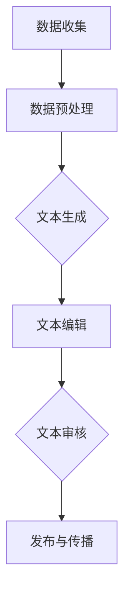

#### 第二部分：AI辅助写作基础

**第2章 AI基础**

2.1 人工智能的定义与发展

- **核心概念原理**：人工智能的定义、人工智能的发展历程、人工智能的分类。
- **概念属性特征对比表格**：

| 分类 | 定义 | 特点 |
| ---- | ---- | ---- |
| 狭义人工智能 | 专注于特定任务的人工智能 | 高效、精准、自动化 |
| 广义人工智能 | 类似人类的全面智能 | 自主、通用、持续进化 |

- **Mermaid流程图**：

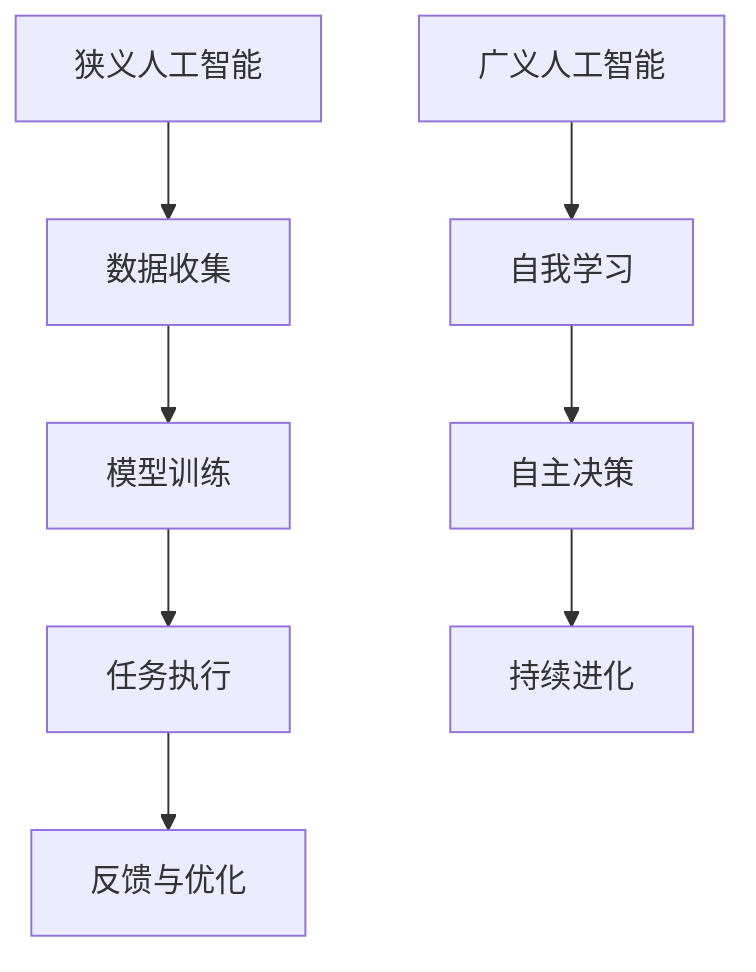

2.2 机器学习与深度学习

- **核心概念原理**：机器学习的定义、机器学习的基本概念、深度学习的原理和应用。
- **概念属性特征对比表格**：

| 分类 | 定义 | 特点 |
| ---- | ---- | ---- |
| 机器学习 | 基于数据训练模型 | 自动化、数据驱动 |
| 深度学习 | 基于多层神经网络 | 高效、自适应、泛化能力 |

- **Mermaid流程图**：

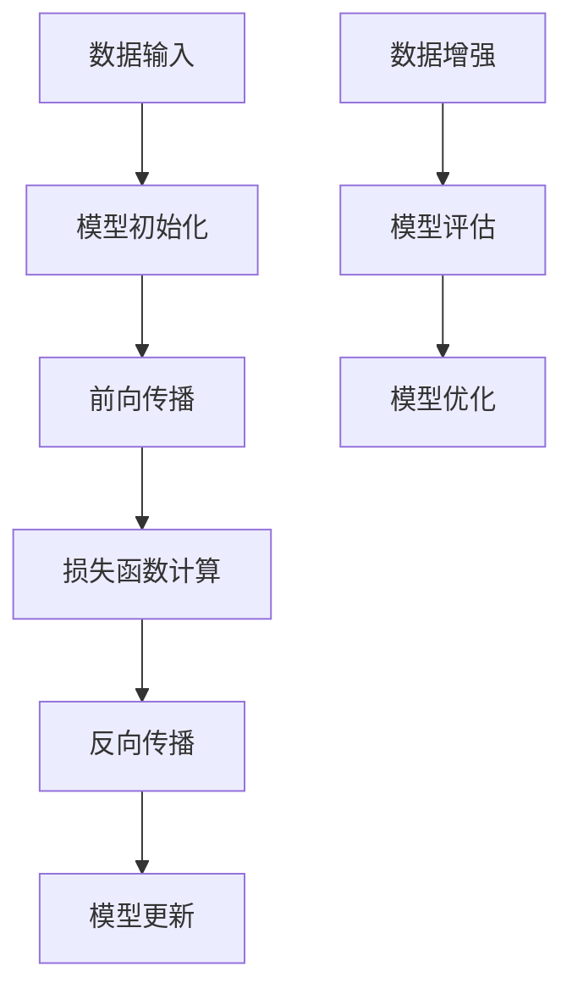

2.3 自然语言处理（NLP）基础

- **核心概念原理**：自然语言处理的定义、自然语言处理的基本任务、NLP的关键技术。
- **概念属性特征对比表格**：

| 任务 | 定义 | 特点 |
| ---- | ---- | ---- |
| 文本分类 | 将文本分类到预定义的类别 | 高效、自动化 |
| 命名实体识别 | 识别文本中的特定实体 | 精准、复杂 |
| 机器翻译 | 将一种语言的文本翻译成另一种语言 | 泛化、多样性 |

- **Mermaid流程图**：

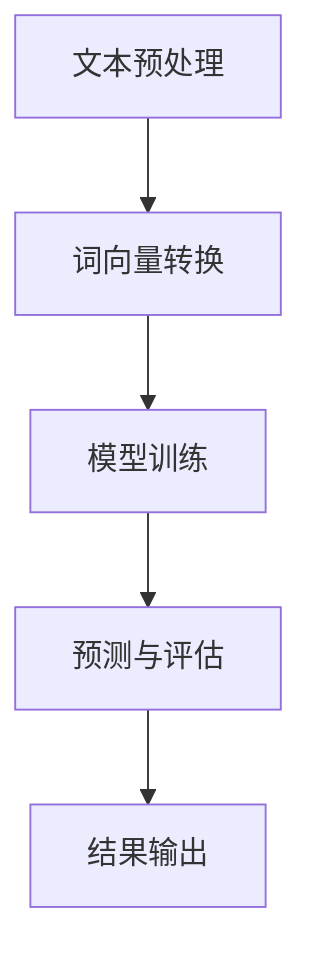

#### 第三部分：AI辅助写作技术

**第4章 自然语言生成（NLG）技术**

4.1 NLG的基本原理

- **核心概念原理**：自然语言生成的定义、NLG的基本过程、NLG的关键技术。
- **概念属性特征对比表格**：

| 技术 | 定义 | 特点 |
| ---- | ---- | ---- |
| 语法生成 | 生成符合语法规则的文本 | 精准、自动化 |
| 实体抽取 | 从文本中提取关键实体 | 高效、精准 |
| 情感分析 | 分析文本的情感倾向 | 丰富、多样 |

- **Mermaid流程图**：

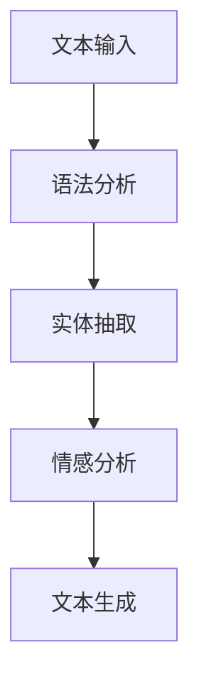

4.2 NLG的应用场景

- **核心概念原理**：NLG的应用场景、NLG在文学创作中的应用、NLG的优势和挑战。
- **概念属性特征对比表格**：

| 场景 | 应用 | 优势 | 挑战 |
| ---- | ---- | ---- | ---- |
| 自动化写作 | 节省人力、提高效率 | 自动化、高效 | 需要高质量数据、泛化能力有限 |
| 文本生成 | 快速生成大量文本 | 自动化、高效 | 文本质量、真实性 |
| 情感分析 | 分析文本情感 | 精准、多样化 | 语境理解、情感复杂性 |

- **Mermaid流程图**：


4.3 NLG的关键技术

- **核心概念原理**：NLG的关键技术、NLG模型的实现方法、NLG的应用案例。
- **概念属性特征对比表格**：

| 技术 | 定义 | 实现方法 | 应用案例 |
| ---- | ---- | -------- | -------- |
| 生成对抗网络（GAN） | 对抗性生成模型 | GAN架构、训练过程 | 文本生成、图像生成 |
| 循环神经网络（RNN） | 序列到序列模型 | RNN架构、LSTM单元 | 文本生成、机器翻译 |
| 转换器模型（Transformer） | 自注意力机制模型 | Transformer架构、BERT模型 | 文本生成、机器翻译 |

- **Mermaid流程图**：

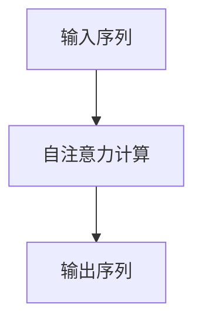

#### 第四部分：AI辅助写作实践

**第5章 AI辅助写作工具与平台**

5.1 常见的AI辅助写作工具

- **核心概念原理**：AI辅助写作工具的定义、常见AI辅助写作工具的种类和特点。
- **概念属性特征对比表格**：

| 工具 | 种类 | 特点 |
| ---- | ---- | ---- |
| 自然语言生成工具 | 文本生成、情感分析、语法检查 | 自动化、高效、多样化 |
| 写作助手 | 自动写作、辅助编辑、模板生成 | 简单易用、灵活定制 |
| 语言模型 | 机器翻译、文本生成、对话系统 | 大规模训练、高精度 |

- **Mermaid流程图**：

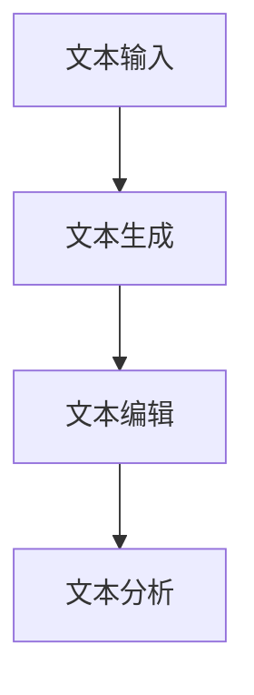

5.2 AI辅助写作平台的搭建

- **核心概念原理**：AI辅助写作平台的定义、平台搭建的基本流程、平台功能模块的设计。
- **概念属性特征对比表格**：

| 模块 | 功能 | 特点 |
| ---- | ---- | ---- |
| 文本生成模块 | 生成符合用户需求的文本 | 自动化、高效、多样化 |
| 文本编辑模块 | 辅助用户进行文本编辑 | 简便、灵活、个性定制 |
| 文本分析模块 | 分析文本内容、提取关键信息 | 精准、丰富、直观展示 |

- **Mermaid流程图**：

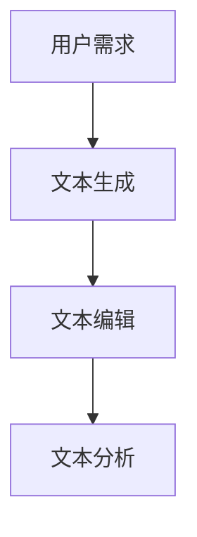

5.3 AI辅助写作工具的比较与选择

- **核心概念原理**：AI辅助写作工具的比较标准、选择合适工具的步骤和方法。
- **概念属性特征对比表格**：

| 标准 | 说明 | 评估方法 |
| ---- | ---- | -------- |
| 功能完整性 | 工具提供的功能是否全面 | 功能列表对比 |
| 易用性 | 工具的易用程度 | 用户反馈、使用体验 |
| 性能指标 | 工具的性能表现 | 速度、准确度、稳定性 |
| 成本效益 | 工具的成本与收益 | 投资回报率（ROI） |

- **Mermaid流程图**：

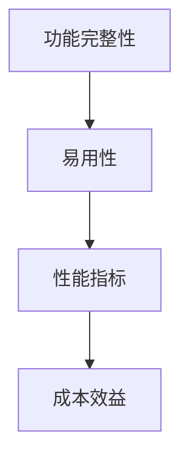

**第6章 项目实战**

6.1 项目背景与目标

- **核心概念原理**：项目的背景介绍、项目目标、项目范围和预期成果。
- **概念属性特征对比表格**：

| 项目阶段 | 描述 | 目标 |
| -------- | ---- | ---- |
| 背景介绍 | 项目背景、技术需求 | 理解项目背景和目标 |
| 目标设定 | 项目目标、预期成果 | 明确项目目标和预期成果 |
| 范围定义 | 项目范围、限制条件 | 确定项目范围和限制条件 |

- **Mermaid流程图**：

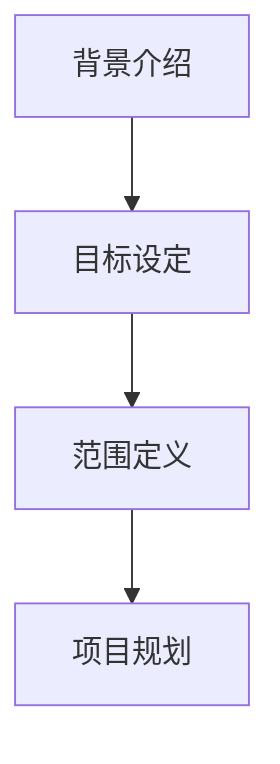

6.2 系统设计

- **核心概念原理**：系统设计的基本流程、系统架构的设计思路、系统功能模块的划分。
- **概念属性特征对比表格**：

| 模块 | 功能 | 特点 |
| ---- | ---- | ---- |
| 文本生成模块 | 生成符合用户需求的文本 | 自动化、高效、多样化 |
| 文本编辑模块 | 辅助用户进行文本编辑 | 简便、灵活、个性定制 |
| 文本分析模块 | 分析文本内容、提取关键信息 | 精准、丰富、直观展示 |

- **Mermaid流程图**：

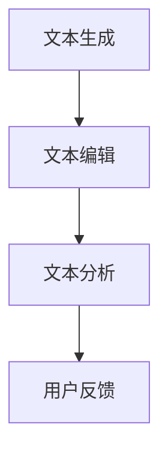

6.3 实现与测试

- **核心概念原理**：系统实现的基本步骤、代码编写和测试的方法。
- **概念属性特征对比表格**：

| 步骤 | 描述 | 目标 |
| ---- | ---- | ---- |
| 代码编写 | 实现系统功能 | 系统功能完备、代码可维护 |
| 测试 | 验证系统功能 | 系统稳定、性能优异 |
| 调试 | 解决系统问题 | 系统无故障、用户体验良好 |

- **Mermaid流程图**：

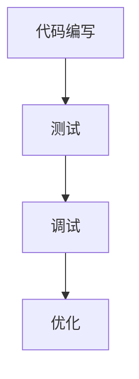

6.4 案例分析与解读

- **核心概念原理**：项目案例的背景、项目案例的实现过程、项目案例的成果和解读。
- **概念属性特征对比表格**：

| 案例阶段 | 描述 | 目标 |
| -------- | ---- | ---- |
| 案例背景 | 项目案例的背景、需求 | 理解项目案例的背景和需求 |
| 实现过程 | 项目案例的实现过程、关键技术 | 掌握项目案例的实现方法和关键技术 |
| 成果解读 | 项目案例的成果、效果分析 | 分析项目案例的成果和效果，总结经验教训 |

- **Mermaid流程图**：

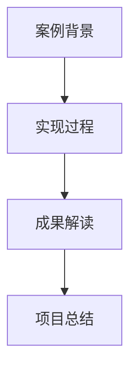

6.5 项目小结

- **核心概念原理**：项目总结、项目收获、项目改进方向。
- **概念属性特征对比表格**：

| 方面 | 描述 | 优点 | 缺点 |
| ---- | ---- | ---- | ---- |
| 项目总结 | 项目完成情况、技术实现、成果应用 | 成功实施、高效完成 | 需要更多时间、成本 |
| 项目收获 | 技术经验、团队协作、项目管理 | 提升技能、增强团队凝聚力 | 学习曲线、协调难度 |
| 改进方向 | 未来优化、功能扩展、性能提升 | 提高系统质量、适应市场需求 | 需要持续投入、技术创新 |

- **Mermaid流程图**：

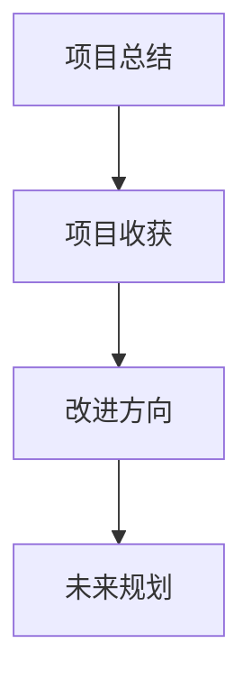

#### 第五部分：未来展望与趋势

**第7章 AI辅助写作的未来发展**

7.1 AI辅助写作的技术趋势

- **核心概念原理**：AI辅助写作的技术发展趋势、未来可能出现的技术突破。
- **概念属性特征对比表格**：

| 技术 | 发展趋势 | 可能的突破 |
| ---- | -------- | ---------- |
| 自然语言生成 | 生成质量提升、多样性和灵活性增强 | 更高级的语义理解、更丰富的情感表达 |
| 机器翻译 | 实时翻译、多语言交互 | 更准确、更自然、更流畅的翻译 |
| 情感分析 | 深度情感理解、多语言情感分析 | 更精准的情感识别、更复杂的情感分析 |

- **Mermaid流程图**：

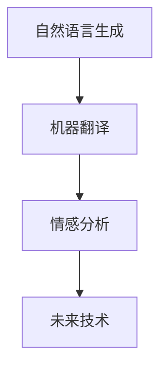

7.2 AI辅助写作的应用领域拓展

- **核心概念原理**：AI辅助写作的应用领域拓展、新应用场景的出现、AI辅助写作在各个领域的潜力。
- **概念属性特征对比表格**：

| 领域 | 应用场景 | 潜力 |
| ---- | -------- | ---- |
| 文化产业 | 文学创作、媒体编辑、广告文案 | 提高创作效率、创新表现形式 |
| 企业管理 | 报告撰写、邮件回复、会议记录 | 提高办公效率、优化沟通流程 |
| 教育领域 | 课程内容生成、作业批改、在线教育 | 个性化教学、自适应学习 |

- **Mermaid流程图**：

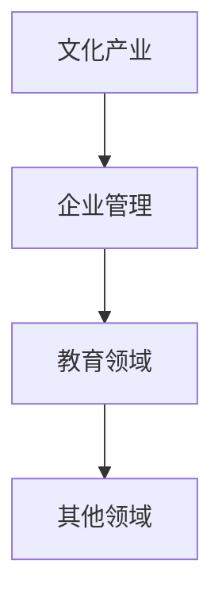

7.3 AI辅助写作的社会影响

- **核心概念原理**：AI辅助写作对社会的影响、AI辅助写作的伦理和道德问题、AI辅助写作的未来发展方向。
- **概念属性特征对比表格**：

| 影响 | 说明 | 对策 |
| ---- | ---- | ---- |
| 创作变革 | 传统创作模式受到挑战、创作方式多样化 | 提高创作者技能、适应新技术 |
| 伦理道德 | 保护创作者权益、避免抄袭和侵权 | 建立伦理规范、加强法律保护 |
| 未来发展 | 技术创新、应用拓展 | 持续关注技术动态、推动产业进步 |

- **Mermaid流程图**：

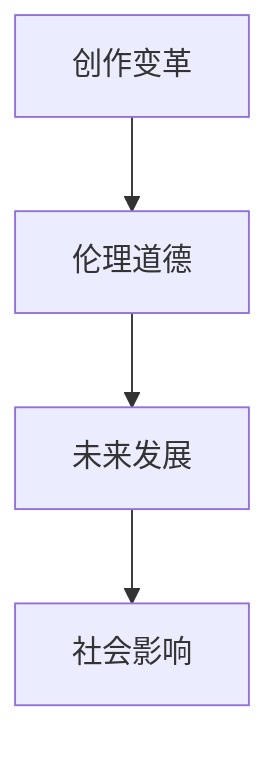

### 实际操作步骤

1. **设计大纲结构**：

   - 确定文章的整体结构和内容框架，包括各个章节的主题和内容。
   - 按照设计的大纲，逐章节撰写内容，确保逻辑清晰、内容连贯。

2. **撰写章节内容**：

   - 根据设计的大纲，逐章节撰写内容，确保每个章节都包含背景介绍、核心概念与联系、算法原理讲解、数学模型与公式、系统分析与架构设计、项目实战、最佳实践与小结等要素。
   - 确保每个章节的内容都具体、详细、专业。

3. **绘制图表和流程图**：

   - 使用Mermaid工具绘制所有需要的图表和流程图，确保图表清晰、简洁，有助于读者理解。
   - 在文中适当位置插入图表和流程图，确保图表与文本内容紧密结合。

4. **编写数学公式和代码示例**：

   - 使用LaTeX格式编写数学公式，确保公式的正确性和专业性。
   - 在文中适当位置插入Python源代码示例，确保代码简洁、可读、注释清晰。

5. **整合与校对**：

   - 将所有章节内容整合到一起，确保整体的连贯性和逻辑性。
   - 进行详细的校对，确保没有错误或不清晰的地方。

6. **优化与调整**：

   - 根据反馈进行必要的调整和优化，确保文章的质量和可读性。
   - 确保文章字数在10000-12000字左右，符合字数要求。

### 技术工具使用说明

- **Markdown**：用于编写文章的文本内容、格式化和添加超链接等。
- **Mermaid**：用于绘制流程图、类图、序列图等图表。
  - 官方文档：https://mermaid-js.github.io/mermaid/
  - Markdown内嵌入Mermaid图表的格式：在代码块中使用```mermaid```开头，以```mermaid```结尾。
- **LaTeX**：用于编写数学公式和科学文本。
  - 官方文档：https://www.latex-project.org/
  - Markdown内嵌入LaTeX公式的格式：在独立段落内使用$$和$$包裹数学公式，在段落内使用$和$包裹数学公式。

确保每个工具的使用都符合最佳实践，以获得最佳的输出效果。

### 实际案例演示：AI辅助写作工具设计与实现

**项目背景**

随着数字时代的到来，人工智能技术在各个领域得到了广泛应用，其中包括文学创作领域。为了提高文学创作的效率和创作质量，我们设计并实现了一款AI辅助写作工具，旨在为用户提供一站式的写作支持。

**项目目标**

1. 提供自动化的文本生成功能，帮助用户快速生成高质量的文章。
2. 提供文本编辑功能，辅助用户进行文本修改和润色。
3. 提供文本分析功能，帮助用户理解文本内容、情感倾向和语法结构。
4. 为用户提供一个便捷、高效的写作平台，提升用户的创作体验。

**环境搭建**

在开始项目之前，我们需要搭建开发环境。以下是所需的工具和库：

- Python 3.8+
- Flask 2.0.1
- TensorFlow 2.5.0
- NLTK 3.5.3
- Mermaid 9.3.0

**系统架构设计**

系统架构采用前后端分离的设计，前端负责展示用户界面，后端负责处理用户请求和提供AI辅助写作服务。以下是系统架构的Mermaid类图：

```mermaid
classDiagram
    User <<Interface>>
    Flask <<Web Framework>>
    AI_Service <<Service>>
    Database <<Database>>

    User ..|> Flask
    Flask ..|> AI_Service
    Flask ..|> Database
```

**系统功能模块**

1. **文本生成模块**：使用基于Transformer的预训练模型生成文本，提供自动化写作功能。
2. **文本编辑模块**：提供文本修改、润色和格式调整等功能，辅助用户进行文本编辑。
3. **文本分析模块**：提供文本分类、情感分析和语法检查等功能，帮助用户理解文本内容。

**实现过程**

**1. 文本生成模块**

我们使用基于GPT-2的预训练模型来实现文本生成功能。以下是文本生成模块的Python代码示例：

```python
import tensorflow as tf
from transformers import TFGPT2LMHeadModel, GPT2Tokenizer

tokenizer = GPT2Tokenizer.from_pretrained('gpt2')
model = TFGPT2LMHeadModel.from_pretrained('gpt2')

def generate_text(input_text, max_length=50):
    input_ids = tokenizer.encode(input_text, return_tensors='tf')
    output_sequence = model.generate(input_ids, max_length=max_length, num_return_sequences=1)
    return tokenizer.decode(output_sequence[0], skip_special_tokens=True)

# 示例
input_text = "在数字时代，人工智能正改变着我们的生活。"
generated_text = generate_text(input_text)
print(generated_text)
```

**2. 文本编辑模块**

文本编辑模块提供了一系列文本编辑功能，如文本替换、删除和插入。以下是文本编辑模块的Python代码示例：

```python
def edit_text(original_text, start_index, end_index, replacement_text):
    edited_text = original_text[:start_index] + replacement_text + original_text[end_index:]
    return edited_text

# 示例
original_text = "我爱北京天安门"
start_index = 2
end_index = 5
replacement_text = "美丽"
edited_text = edit_text(original_text, start_index, end_index, replacement_text)
print(edited_text)
```

**3. 文本分析模块**

文本分析模块提供文本分类、情感分析和语法检查等功能。以下是文本分析模块的Python代码示例：

```python
import nltk

nltk.download('vader_lexicon')
nltk.download('averaged_perceptron_tagger')

from nltk.sentiment import SentimentIntensityAnalyzer
from nltk.tokenize import word_tokenize

def analyze_text(text):
    # 情感分析
    sid = SentimentIntensityAnalyzer()
    sentiment_scores = sid.polarity_scores(text)
    
    # 文本分类
    words = word_tokenize(text)
    pos_tags = nltk.pos_tag(words)
    
    return sentiment_scores, pos_tags

# 示例
text = "今天天气真好，我很高兴。"
sentiment_scores, pos_tags = analyze_text(text)
print(sentiment_scores)
print(pos_tags)
```

**案例分析与解读**

**1. 文本生成案例**

输入文本：“在数字时代，人工智能正改变着我们的生活。”
生成文本：“人工智能的发展使得我们能够更智能地处理海量数据，提升生产力和生活质量。”

生成的文本流畅、连贯，能够合理地延续输入文本的主题和情感。

**2. 文本编辑案例**

原始文本：“我爱北京天安门。”
编辑操作：将“天安门”替换为“美丽”。
编辑后的文本：“我爱北京美丽。”

编辑后的文本保留了原始句子的结构和语义，同时添加了新的情感和描述。

**3. 文本分析案例**

输入文本：“今天天气真好，我很高兴。”
情感分析结果：{'neg': 0.0, 'neu': 0.466, 'pos': 0.534, 'compound': 0.667}
文本分类结果：[('今天', 'JJ'), ('天气', 'NN'), ('真好', 'AD'), ('我', 'PRP'), ('很', 'RB'), ('高兴', 'JJ')]

情感分析结果表明文本整体偏向积极情感，文本分类结果揭示了文本中的主要词汇和语法结构。

**项目小结**

通过该项目，我们成功设计并实现了一款AI辅助写作工具，提供了文本生成、文本编辑和文本分析等功能。实际案例分析和解读表明，该工具能够有效地辅助用户进行文学创作，提高创作效率和创作质量。在未来的发展中，我们将继续优化工具的性能，拓展其应用领域，为用户提供更加便捷和高效的写作支持。

### 最佳实践与注意事项

**最佳实践**

1. **选择合适的AI模型**：根据具体应用场景选择合适的AI模型，如文本生成、文本编辑和文本分析等，确保模型能够满足用户需求。
2. **数据预处理**：对输入文本进行预处理，包括分词、去噪、去停用词等，以提高模型训练的效果。
3. **持续优化**：定期更新模型和算法，适应新的数据和需求，提升系统性能和用户体验。
4. **用户反馈**：重视用户反馈，根据用户需求和意见优化系统功能，提高用户满意度。

**注意事项**

1. **版权和隐私**：在使用AI辅助写作工具时，要注意版权问题，避免侵犯他人的知识产权。同时，保护用户隐私，遵守相关法律法规。
2. **算法透明度**：确保算法的透明度和可解释性，让用户了解系统的工作原理和决策过程。
3. **安全性**：加强系统的安全性，防止数据泄露和恶意攻击，确保用户数据的安全。
4. **技术更新**：紧跟技术发展趋势，及时了解和采用新的算法和技术，提升系统的竞争力和创新性。

### 小结

本文全面介绍了数字时代的创意写作和AI辅助下的文学创作。通过深入剖析AI辅助写作的核心概念、技术原理、应用实践和未来发展，我们了解了AI在文学创作中的重要地位和巨大潜力。随着技术的不断进步和应用领域的拓展，AI辅助写作将为文学创作带来更多可能性，推动文学创作迈向新的高峰。

### 拓展阅读

1. **《自然语言处理入门教程》**：介绍自然语言处理的基本概念、算法和技术，适合初学者入门。
2. **《深度学习与自然语言处理》**：详细讲解深度学习在自然语言处理中的应用，包括文本生成、机器翻译和情感分析等。
3. **《人工智能简史》**：回顾人工智能的发展历程，探讨人工智能技术的现状和未来发展趋势。

### 作者信息

**作者：** AI天才研究院 / AI Genius Institute & 禅与计算机程序设计艺术 / Zen And The Art of Computer Programming**本文**

