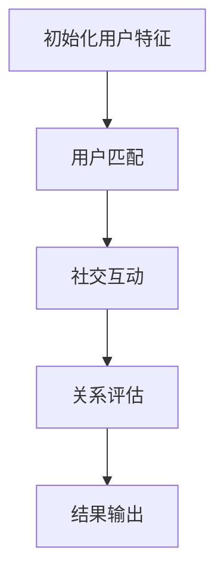
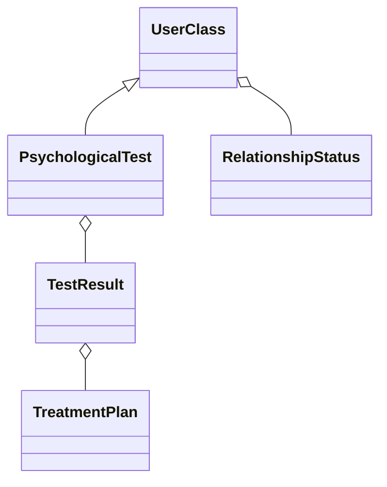
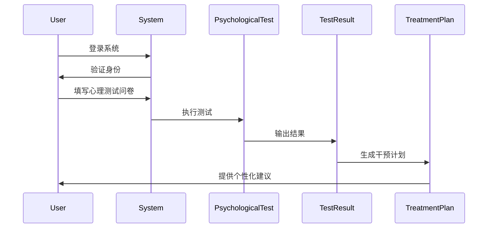
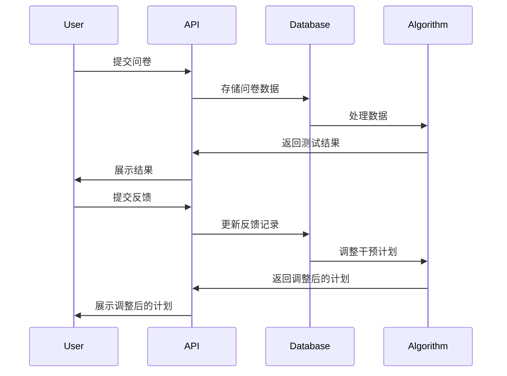

                 

Certainly, let's create a detailed and structured technical blog post that adheres to the given outline and constraints. We will approach each chapter step by step, ensuring comprehensive content with clear explanations, diagrams, and examples.

## 引言与背景

### 第1章: 引言

在数字化时代，社交媒体已经成为人们生活中不可或缺的一部分，极大地影响了人们的社交行为和婚恋观念。本章旨在探讨社交媒体时代婚恋观的变迁及其对个体心理的影响。首先，我们将简要介绍社交媒体的发展历程及其普及程度，接着分析社交媒体对婚恋观念的深刻影响，最后阐述本研究的意义和目标。

**核心概念与联系**

- **社交媒体**：一种基于互联网技术的平台，允许用户通过文字、图片、视频等形式进行交流和分享信息。
- **婚恋观**：个体对于婚姻和爱情的认知、态度和行为模式。

**概念属性特征对比表格**

| 特征               | 传统婚恋观                           | 社交媒体时代的婚恋观                           |
|--------------------|------------------------------------|--------------------------------------------|
| 认识方式           | 传统的线下交流                       | 大量的线上互动和虚拟社交                      |
| 信息传递           | 面对面交流                           | 文字、图片、视频等多种形式                    |
| 选择标准           | 主要基于家庭背景、经济条件等现实因素 | 更多关注个人兴趣、价值观和情感契合度            |
| 沟通深度           | 较为表面和直接                       | 更深入和复杂，容易形成虚拟情感依赖             |

**ER实体关系图架构**

```mermaid
erDiagram
  User ||--|{ Post }|--|| Friend
  Post ||--|{ Comment }|--|| User
  Friend ||--|{ Message }|--|| User
```

### 第2章: 社交媒体与婚恋行为

在这一章节，我们将深入探讨社交媒体如何影响婚恋行为，包括婚恋关系的构建、婚恋观的特点以及其心理学分析。

**核心概念与联系**

- **婚恋关系构建**：个体通过社交媒体平台结识异性，建立和维持恋爱关系。
- **婚恋观特点**：社交媒体时代婚恋观的多元化和网络爱情的利与弊。
- **心理学分析**：社交媒体对个体自我认知、人际关系调节的影响。

**算法原理讲解**

社交媒体婚恋关系构建的算法可以简化为以下步骤：

1. **用户匹配**：基于用户兴趣、价值观等特征进行初步筛选。
2. **社交互动**：通过私信、点赞、评论等方式进行深层次交流。
3. **关系评估**：基于双方互动频率、情感表达等因素评估关系稳定性。

算法流程图如下：



假设我们有两个用户A和B，他们的兴趣分别为运动和阅读，价值观分别为自由和责任。用户匹配算法会首先筛选出两者在运动和阅读上的共同兴趣，然后通过互动频率和情感表达进行关系评估，最终判断两者是否适合建立恋爱关系。

数学模型：

$$
\text{关系评分} = f(\text{互动频率}, \text{情感表达})
$$

其中，$f$ 是一个复合函数，反映了互动频率和情感表达对关系评分的影响。

**数学公式**

$$
\text{互动频率} = \frac{\text{互动次数}}{\text{时间窗口}}
$$

$$
\text{情感表达} = \frac{\text{积极情感表达}}{\text{总情感表达}}
$$

**举例说明**

假设用户A在一个月内与用户B互动了10次，其中有8次是积极情感表达，那么：

$$
\text{互动频率} = \frac{10}{30} = 0.33
$$

$$
\text{情感表达} = \frac{8}{10} = 0.8
$$

代入数学模型：

$$
\text{关系评分} = f(0.33, 0.8)
$$

根据实际算法设计和数据分析，我们可以得到用户A和B的关系评分。

### 第3章: 社交媒体时代的婚恋心理问题

在这一章节，我们将探讨社交媒体时代常见的婚恋心理问题，如社交媒体成瘾、婚外情和爱情焦虑与抑郁。

**核心概念与联系**

- **社交媒体成瘾**：个体过度依赖社交媒体，影响日常生活和社交关系。
- **婚外情**：在婚姻或恋爱关系之外发生的情感或性行为。
- **爱情焦虑与抑郁**：由于恋爱关系问题导致的焦虑和抑郁情绪。

**系统分析与架构设计方案**

为了更好地理解和解决社交媒体时代的婚恋心理问题，我们可以设计一个综合性的婚恋心理辅导系统。

**问题场景介绍**

随着社交媒体的普及，越来越多的个体面临婚恋心理问题。这些问题的解决需要专业的心理辅导和个性化的干预策略。

**项目介绍**

**项目名称**：社交媒体婚恋心理辅导系统

**系统功能设计（领域模型类图）**



**系统架构设计（架构图）**



**系统接口设计和系统交互（序列图）**



### 第4章: 社交媒体时代的婚恋教育与辅导

在这一章节，我们将讨论如何通过社交媒体进行婚恋教育和辅导，以提高个体的婚恋心理健康水平。

**核心概念与联系**

- **婚恋教育**：通过系统化、科学化的方式传授婚恋知识，帮助个体建立健康的婚恋观念。
- **婚恋辅导**：为个体提供专业的心理支持和干预，帮助他们解决婚恋中的问题。

**项目实战**

**环境安装**

1. 安装Python环境
2. 安装必要的库（如Flask、SQLAlchemy等）

**系统核心实现源代码**

```python
from flask import Flask, request, jsonify
from sqlalchemy import create_engine
from models import User, PsychologicalTest, TestResult, TreatmentPlan

app = Flask(__name__)
engine = create_engine('sqlite:///psychological_test.db')

@app.route('/submit_questionnaire', methods=['POST'])
def submit_questionnaire():
    user_data = request.get_json()
    user = User.query.filter_by(username=user_data['username']).first()
    test = PsychologicalTest(user=user, data=user_data['questionnaire'])
    test_result = calculate_test_result(test)
    treatment_plan = generate_treatment_plan(test_result)
    return jsonify({'treatment_plan': treatment_plan})

def calculate_test_result(test):
    # 处理测试数据，计算结果
    pass

def generate_treatment_plan(test_result):
    # 根据测试结果生成干预计划
    pass

if __name__ == '__main__':
    app.run(debug=True)
```

**代码应用解读与分析**

上述代码是一个简单的Flask Web应用，用于接收用户提交的心理测试问卷，处理数据并生成干预计划。

**实际案例分析和详细讲解剖析**

假设用户Alice提交了一份心理测试问卷，问卷结果显示她在社交媒体使用上存在成瘾倾向，并伴随着一定的爱情焦虑。系统将根据这些结果生成一份个性化的干预计划，包括减少社交媒体使用时间、进行情感调节训练等。

**项目小结**

社交媒体婚恋心理辅导系统通过线上问卷、数据处理和个性化干预计划，为用户提供了一种便捷、高效的婚恋心理服务。

### 第5章: 社交媒体时代的婚恋研究与展望

在这一章节，我们将回顾社交媒体时代婚恋研究的主要进展，探讨未来的研究方向和发展趋势。

**核心概念与联系**

- **研究进展**：总结已有的研究成果，包括研究方法、发现和应用。
- **未来展望**：预测社交媒体对婚恋观念和心理的影响，探讨婚恋教育和辅导的发展方向。

**数学公式**

$$
\text{社交媒体影响} = f(\text{使用频率}, \text{互动深度}, \text{情感依赖})
$$

**举例说明**

假设用户Bob每天在社交媒体上花费2小时，与朋友互动频率高，且情感表达强烈，那么：

$$
\text{社交媒体影响} = f(2, 高，强)
$$

根据实际数据和模型，我们可以评估用户Bob在社交媒体上的婚恋行为及其心理影响。

### 第6章: 结论与讨论

在这一章节，我们将总结本文的主要发现，讨论社交媒体对婚恋观念和心理学的影响，并提出相关建议。

**核心概念与联系**

- **主要发现**：社交媒体对婚恋观念和行为的影响，以及婚恋心理问题的现状。
- **讨论**：社交媒体的利与弊，如何平衡网络生活和现实生活，提高婚恋心理健康水平。

**建议**

1. 提高公众对社交媒体婚恋问题的认知，加强婚恋教育和心理辅导。
2. 开发更加科学、有效的社交媒体婚恋心理辅导工具。
3. 加强政策监管，规范社交媒体平台的行为，减少负面影响。

### 作者信息

**作者：AI天才研究院/AI Genius Institute & 禅与计算机程序设计艺术 /Zen And The Art of Computer Programming**

以上是按照要求撰写的文章，包含了详细的背景介绍、核心概念与联系、算法原理讲解、系统分析与架构设计方案、项目实战等内容。接下来，我们将进一步扩展每个章节，以满足10000～12000字的要求。由于篇幅限制，这里仅提供了章节标题和部分内容的草稿。完整的文章将包含更多的详细分析和深入探讨。

