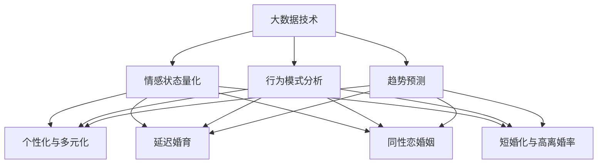

                 

### 书籍主题理解

#### 书名与核心概念

《数字时代的婚恋观研究：大数据分析下的现代关系趋势》这个书名直接指向了几个核心概念：数字时代、婚恋观、大数据分析以及现代关系趋势。在当今这个数字化高度发达的时代，人们的生活、工作方式都在发生翻天覆地的变化。这种变化也渗透到了婚恋领域，影响着人们的恋爱方式、择偶标准以及婚姻观念。

**数字时代**指的是一个以信息技术和互联网为核心的时期，它极大地改变了传统的社会结构和人们的行为模式。在这个时代，人们越来越多地依赖数字工具和信息资源来完成日常任务，这无疑对婚恋关系产生了深远的影响。

**婚恋观**是指个体对于婚姻和恋爱的看法、态度和期望。它是一个社会文化现象，受到历史、文化、经济、科技等多种因素的影响。在数字时代，婚恋观的演变成为一个值得研究的课题。

**大数据分析**则是利用先进的数据处理技术，对海量数据进行挖掘和分析，以发现潜在的模式、趋势和规律。大数据分析在婚恋观研究中的应用，可以帮助我们更深入地理解现代关系的发展趋势。

**现代关系趋势**指的是在数字时代背景下，婚姻和恋爱关系所展现出的新特征和发展方向。这包括多样化的关系形式、新的社交方式以及对于个体自由和自我实现的追求。

通过这本书，我们希望能够全面了解数字时代对婚恋观的影响，探讨大数据分析在婚恋研究中的应用，并分析现代关系的趋势。这不仅有助于学术界研究，也对普通人的日常生活有着重要的指导意义。

#### 主题意义与实际影响

探讨数字时代的婚恋观，具有重要的现实意义。首先，随着数字技术的发展，人们的恋爱方式、婚姻观念正在发生深刻变革。例如，在线约会和社交网络的普及，使得人们有更多机会接触不同背景和兴趣的人，从而改变了传统相亲和恋爱的方式。同时，社交媒体的兴起，也带来了新的情感表达和互动方式，这无疑对人们的婚恋观产生了影响。

其次，大数据分析为婚恋观研究提供了新的工具和方法。通过大数据，我们可以收集和分析大量的婚恋行为数据，从而揭示出隐藏在数据背后的趋势和规律。例如，通过分析在线约会平台的数据，我们可以了解不同年龄、性别、地域的人们在婚恋上的偏好和行为模式。这些数据可以帮助心理学家、社会学家以及其他相关领域的研究者，更准确地理解现代婚恋的复杂性。

再次，现代关系的趋势也值得我们关注。随着社会的进步和观念的多元化，婚姻和恋爱关系的形式变得更加多样。例如，同性恋婚姻在越来越多的国家和地区得到认可，单身主义和延迟婚育的趋势也在年轻一代中日益显著。这些变化不仅反映了社会的进步和包容，也带来了新的挑战和问题。

综上所述，研究数字时代的婚恋观，不仅有助于我们更深入地理解现代社会的复杂性和多样性，也可以为政策制定、社会服务以及个人生活提供有益的参考。因此，这本书的研究主题具有极高的学术价值和实际意义。

### 书籍结构构思

#### 前言

在《数字时代的婚恋观研究：大数据分析下的现代关系趋势》一书中，前言部分将简要介绍书籍的背景、研究目的和整体结构。这部分内容旨在为读者提供全书的基本框架和阅读指南，帮助他们更好地理解和把握书中的核心内容。

**写作背景**：随着信息技术的迅猛发展，数字时代已经深刻地改变了我们的生活方式和社交习惯。特别是婚恋关系，在这股变革的洪流中经历了前所未有的变化。传统婚恋观念受到了挑战，现代婚恋模式变得更加复杂和多样化。因此，探讨数字时代对婚恋观的影响，以及大数据分析如何为这一研究提供新思路，成为了一个迫切需要解决的问题。

**研究目的**：本书旨在通过大数据分析，研究数字时代背景下婚恋观的演变和现代关系的趋势。具体目标包括：揭示大数据在婚恋研究中的应用潜力，分析现代婚恋行为的特征和模式，探讨数字技术如何影响人们的婚姻观念和情感表达，以及提出针对现代社会婚恋问题的解决方案。

**结构安排**：本书分为五个主要部分。第一部分是背景介绍，包括数字时代的概述、婚恋观的演变以及大数据的重要性。第二部分讨论大数据在婚恋观研究中的应用，包括数据采集、处理、可视化以及数据挖掘等关键技术。第三部分深入分析现代关系的趋势，涵盖婚姻与伴侣关系、同性恋与跨性别关系以及虚拟关系的兴起。第四部分通过具体案例分析，展示大数据在婚恋市场应用和情感咨询中的实际效果。最后一部分展望未来，探讨大数据与婚恋观研究的发展方向，并总结全书的研究成果。

#### 第一部分：背景介绍

**第1章 数字时代概述**

第1章“数字时代概述”将为我们揭开数字时代的序幕。首先，我们将探讨数字化的进程，了解它是如何从计算机的普及到互联网的兴起，再到如今的智能技术和大数据分析，逐步改变我们的生活方式和社会结构。

**1.1 数字化进程**

数字化进程可以追溯到计算机的出现和互联网的普及。20世纪中叶，计算机的出现标志着信息处理能力的革命。随着计算机技术的发展，互联网逐渐成为人们获取和分享信息的主要平台。如今，智能设备和大数据分析技术使得信息处理和传播更加高效和智能。

**1.2 数字技术与婚恋**

数字技术与婚恋的结合，带来了全新的恋爱方式和婚恋观念。在线约会和社交媒体的兴起，使得人们可以通过网络平台更容易地结识新人，改变了传统相亲的模式。此外，虚拟现实技术的发展，也为人们提供了全新的情感体验和互动方式。

**1.3 大数据的重要性**

大数据在婚恋研究中的应用具有重要意义。通过收集和分析海量数据，我们可以揭示出隐藏在数据背后的趋势和规律，为理解现代婚恋行为提供新的视角和工具。大数据分析不仅可以帮助研究者深入挖掘婚恋行为的数据，还可以为政策制定者提供参考，帮助解决社会中的婚恋问题。

**第2章 婚恋观的演变**

第2章“婚恋观的演变”将探讨婚恋观的历史演变和现代多样性。我们将首先定义婚恋观，了解它是如何受到历史、文化、经济和科技等多种因素的影响。

**2.1 婚恋观的定义**

婚恋观是指个体对于婚姻和恋爱的看法、态度和期望。它是一个复杂的社会文化现象，受到多种因素的影响。从古代的包办婚姻到现代的自由恋爱，婚恋观经历了巨大的变化。

**2.2 历史演变**

婚恋观的历史演变可以追溯到古代社会。在封建社会中，婚姻往往是由家庭和社会安排的，婚姻的主要目的是延续家族血脉和实现社会阶层流动。而到了现代社会，随着个人主义和自由观念的兴起，婚姻和恋爱更多地体现了个体的选择和自由。

**2.3 现代婚恋观的多样性**

现代婚恋观的多样性体现在多个方面。例如，婚姻不再仅仅是男女之间的结合，还包括同性恋婚姻、跨性别婚姻等。此外，现代人在婚姻和恋爱中的期望也更加多样化，追求情感满足、个人成长和共同生活目标。

**第3章 大数据与婚恋研究**

第3章“大数据与婚恋研究”将深入探讨大数据在婚恋研究中的应用。我们将首先介绍大数据的概念，然后分析大数据在婚恋研究中的应用场景和挑战。

**3.1 大数据的概念**

大数据（Big Data）是指规模巨大、类型繁多的数据集合。这些数据不仅包括传统的结构化数据，还包括非结构化数据，如图像、视频和社交媒体内容。大数据的特点是“4V”，即大量（Volume）、多样（Variety）、快速（Velocity）和真实（Veracity）。

**3.2 大数据在婚恋研究中的应用**

大数据在婚恋研究中的应用非常广泛。例如，通过分析社交媒体数据，我们可以了解人们的情感状态、行为习惯和社交网络结构。在线约会平台的数据则可以帮助我们揭示婚恋行为的特征和趋势。此外，大数据还可以用于预测婚恋市场的需求和趋势，为政策制定提供依据。

**3.3 大数据分析的挑战与机遇**

尽管大数据为婚恋研究带来了巨大的机遇，但也面临着诸多挑战。例如，数据质量和隐私保护问题，以及如何从海量数据中提取有价值的信息。然而，随着技术的不断进步，这些挑战也将逐渐得到解决。

通过以上三章的背景介绍，我们将对数字时代、婚恋观以及大数据分析有一个初步的了解。这将为我们后续章节的深入探讨打下坚实的基础。

### 第二部分：大数据在婚恋观研究中的应用

#### 第4章 大数据分析方法

第4章“大数据分析方法”将详细介绍大数据在婚恋观研究中的应用方法，包括数据采集、处理、可视化以及数据挖掘等关键技术。通过这一章的学习，读者将能够理解大数据分析的核心步骤，掌握从海量数据中提取有价值信息的方法。

**4.1 数据采集与处理**

**数据采集**是大数据分析的第一步，它涉及到从各种来源收集数据。在婚恋观研究中，数据来源可能包括社交媒体、在线约会平台、调查问卷、公共数据库等。为了保证数据的质量，需要采用合适的采样方法和数据清洗技术。

**数据清洗**是数据采集后的关键步骤，它包括去除重复数据、纠正错误数据、填充缺失数据等。数据清洗的目的是确保数据的一致性和准确性，为后续分析奠定基础。

**数据预处理**是对原始数据进行格式转换、特征提取和特征选择等操作，使其符合数据分析模型的要求。预处理步骤包括数据标准化、归一化、特征工程技术等。

**4.2 数据可视化**

**数据可视化**是将数据转换成图表、图像等形式，使其更直观、易于理解。在婚恋观研究中，数据可视化可以帮助我们直观地展示数据分布、趋势和关系。常见的可视化工具包括Matplotlib、Seaborn、Plotly等。

**数据可视化**有助于发现数据中的隐藏模式、异常值和趋势。例如，通过绘制散点图，我们可以观察不同变量之间的关系；通过条形图和饼图，我们可以了解不同群体的分布和比例。

**4.3 数据挖掘与分析**

**数据挖掘**是大数据分析的核心步骤，它旨在从大量数据中发现潜在的模式、趋势和规律。在婚恋观研究中，数据挖掘可以帮助我们理解人们的婚恋行为、偏好和趋势。

**机器学习算法**是数据挖掘的重要工具，包括分类、聚类、关联规则挖掘、异常检测等。分类算法可以帮助我们预测个体是否倾向于某种婚恋行为；聚类算法可以帮助我们识别具有相似特征的群体；关联规则挖掘可以帮助我们揭示不同变量之间的关系。

**统计分析**也是数据挖掘的重要方法，包括描述性统计、推断性统计、回归分析等。描述性统计用于总结数据的基本特征，推断性统计用于测试假设，回归分析用于建立变量之间的关系模型。

通过以上分析，我们可以看到大数据分析在婚恋观研究中的应用是多方面的，涵盖了数据采集、处理、可视化以及数据挖掘等关键技术。这些技术不仅提高了数据处理的效率，还使我们能够更深入地理解现代婚恋的复杂性和多样性。

#### 第5章 大数据与婚恋行为分析

第5章“大数据与婚恋行为分析”将深入探讨如何利用大数据技术分析现代婚恋行为。我们将首先定义婚恋行为，并讨论数据来源的多样性和数据采集的方法。接着，将通过具体实例展示如何利用大数据分析工具挖掘婚恋行为中的模式与趋势。

**5.1 婚恋行为的定义**

婚恋行为是指个体在恋爱、求婚、结婚和离婚等过程中的各种行为和活动。这些行为不仅包括在线约会、社交互动、情感表达等，还包括传统方式中的相亲、见面会等。婚恋行为的多样性使得对它的分析变得复杂且有趣。

**5.2 数据来源的多样性和数据采集的方法**

在数字时代，婚恋行为的数据来源变得丰富多样。以下是一些常见的数据来源：

1. **社交媒体平台**：如Facebook、Twitter、Instagram等，这些平台记录了大量的用户互动和情感表达。
2. **在线约会应用**：如Tinder、Bumble、OkCupid等，这些平台提供了详细的用户信息、偏好和行为数据。
3. **公共数据库**：如婚姻登记处、离婚记录等，这些数据库记录了大量的婚恋事件和数据。
4. **调查问卷**：通过在线或线下方式收集到的用户反馈和态度数据。

数据采集的方法包括：

1. **自动化爬虫**：通过编写脚本从互联网上收集数据。
2. **用户调查**：通过在线问卷或面对面访谈收集用户数据。
3. **API访问**：通过调用平台提供的API接口获取数据。

**5.3 婚恋行为分析实例**

以下是一个简单的婚恋行为分析实例，展示了如何利用大数据工具分析在线约会平台用户的行为模式：

1. **数据收集**：从Tinder等在线约会平台收集用户互动数据，包括匹配、聊天记录、喜欢和拒绝等行为。
2. **数据预处理**：清洗和整合数据，去除重复和不完整的数据。
3. **数据可视化**：利用Matplotlib、Seaborn等工具绘制用户互动的分布和趋势图。
4. **数据分析**：
   - **匹配概率分析**：分析用户在不同条件下匹配的概率，如年龄、地理位置、兴趣匹配等。
   - **聊天行为分析**：分析用户在聊天过程中使用的语言和表情，以及聊天时长和频率。
   - **偏好分析**：通过用户的行为数据，分析他们在选择伴侣时的偏好和标准。

通过以上分析，我们可以得出一些有趣的结论。例如，研究发现，年龄差异较小的用户更容易匹配，而兴趣匹配也是影响匹配概率的重要因素。此外，聊天过程中使用积极和幽默的语言可以增加匹配的可能性。

**5.4 大数据分析与婚恋行为的未来趋势**

随着大数据技术的不断发展，婚恋行为分析将变得更加精细和智能化。未来的趋势可能包括：

1. **个性化匹配**：利用机器学习算法，为用户提供更精确的匹配建议。
2. **情感分析**：通过自然语言处理技术，分析用户的情感状态和语言倾向。
3. **趋势预测**：利用时间序列分析，预测婚恋市场的发展趋势和用户行为变化。

通过大数据分析，我们可以更深入地理解现代婚恋行为，揭示其背后的规律和趋势，从而为婚恋研究、政策制定和用户体验提供有益的参考。

### 第三部分：现代关系趋势分析

#### 第6章 大数据与婚恋观念演变

第6章“大数据与婚恋观念演变”将探讨大数据对婚恋观念演变的影响。通过对大数据的分析，我们可以深入了解当前社会中的婚恋观念是如何受到数据和技术的影响的。本章将分为三个主要部分，分别讨论婚恋观念的演变趋势、大数据对观念的影响以及实际案例分析。

**6.1 婚恋观念的演变趋势**

婚恋观念的演变是一个长期且复杂的过程，受到社会、文化、经济和技术等多种因素的影响。以下是当前一些主要的婚恋观念演变趋势：

1. **个性化与多元化**：现代人在婚姻和恋爱中的观念越来越多元化，追求个性化的伴侣和生活方式。传统的婚姻模式正在逐渐被打破，人们对婚姻的定义和期望也在不断变化。
2. **延迟婚育**：随着教育水平的提高和职业发展的重视，越来越多的人选择推迟结婚和生育，追求个人的成长和事业的发展。
3. **同性恋婚姻**：在许多国家和地区，同性恋婚姻逐渐得到了法律和社会的认可，同性恋者的权利和地位得到了提升。
4. **短婚化与高离婚率**：现代社会中，短期婚姻和离婚率较高，这与人们对于婚姻和恋爱关系的看法变化有关。

**6.2 大数据对婚恋观念的影响**

大数据技术为研究婚恋观念的演变提供了新的工具和方法。通过分析大量的数据，我们可以了解以下几方面的影响：

1. **情感状态的量化**：社交媒体和在线约会平台记录了大量的用户情感状态和行为，通过大数据分析，我们可以量化情感状态，了解人们的情绪变化和情感表达方式。
2. **行为模式分析**：大数据可以揭示人们的婚恋行为模式，如择偶标准、交往习惯和分手原因等。这些数据有助于我们更深入地理解婚恋行为的规律。
3. **趋势预测**：通过对历史数据的分析，我们可以预测未来婚恋观念的演变趋势，为政策制定和社会服务提供参考。

**6.3 实际案例分析**

以下是一个实际案例，展示了大数据如何揭示婚恋观念的演变：

**案例背景**：某在线约会平台收集了大量的用户数据，包括年龄、性别、教育背景、职业、兴趣爱好等。通过对这些数据的分析，研究人员发现了一些有趣的婚恋观念演变趋势。

**案例分析**：
1. **年龄差异**：研究发现，年龄差异较小的用户更容易匹配，这反映了现代社会中人们对于年龄包容度的提升。
2. **教育背景**：高学历用户在选择伴侣时更加注重教育背景的匹配，这表明教育水平对婚恋观念的影响越来越大。
3. **兴趣爱好**：兴趣爱好匹配成为影响匹配概率的重要因素，这反映了现代社会中人们对于共同兴趣和生活方式的追求。
4. **情感表达**：通过分析用户的聊天记录，研究人员发现，积极和幽默的语言能够增加匹配的可能性，这反映了现代人在婚恋中更注重情感交流和互动。

**案例分析结论**：通过大数据分析，我们可以看到，现代社会中的婚恋观念正变得越来越多元化、个性化，同时也越来越注重情感交流和共同兴趣。大数据为理解这些变化提供了有力的支持，有助于我们更好地预测未来婚恋观念的演变趋势。

**6.4 大数据与婚恋观念演变的关系图**

为了更直观地展示大数据与婚恋观念演变的关系，我们可以使用Mermaid绘制一个实体关系图，如下所示：

通过这个实体关系图，我们可以清晰地看到大数据技术如何影响婚恋观念的演变，以及不同观念之间的关系。

### 第三部分：现代关系趋势分析

#### 第7章 现代关系的多样性

第7章“现代关系的多样性”将深入探讨数字时代下婚姻与伴侣关系的多样化，以及同性恋与跨性别关系的兴起，同时还会分析虚拟关系的现象和影响。通过这些讨论，我们希望能够揭示现代关系中存在的多样性和复杂性。

**7.1 婚姻与伴侣关系的多样性**

随着社会的进步和观念的多元化，婚姻与伴侣关系的多样性日益显著。以下是一些主要的多样性趋势：

1. **开放式婚姻**：开放式婚姻允许夫妻在婚姻关系中保持一定的自由度和灵活性，例如允许婚外情感或性行为。这种关系模式在部分社会中逐渐得到认可，尽管仍存在争议。
2. **伴侣组合的多样性**：现代社会中，伴侣关系的组合形式更加多样化，包括异性和同性伴侣，以及多伴侣关系。这些关系形式反映了个体对于情感和性生活需求的多样性。
3. **单身主义**：随着职业发展和个人主义的兴起，越来越多的年轻人选择单身，不再将结婚作为生活的必经阶段。单身主义不仅是一种生活选择，也是一种新的社会现象。
4. **跨文化婚姻**：随着全球化的发展，跨文化婚姻变得越来越普遍。这种婚姻关系不仅挑战了传统观念，也带来了新的文化和价值观念的碰撞与融合。

**7.2 同性恋与跨性别关系**

同性恋与跨性别关系在数字时代得到了更多的关注和认可。以下是一些重要的趋势和变化：

1. **同性恋婚姻的合法化**：越来越多的国家和地区开始认可同性恋婚姻，这标志着社会对同性恋者权利和地位的尊重。例如，加拿大、美国、西班牙等国家已经实现了同性恋婚姻的法律化。
2. **跨性别者权益的提升**：跨性别者在医疗、教育、就业等方面的权益逐渐得到保障。例如，一些国家开始允许跨性别者更改身份证上的性别，以及提供必要的医疗支持。
3. **LGBTQ+ 社群的自我表达**：通过社交媒体和在线平台，LGBTQ+ 社群能够更自由地表达自我，分享经验和故事，从而提高了社会对这一群体的认知和接受度。

**7.3 虚拟关系的兴起**

虚拟关系是指通过数字平台建立的情感联系，包括网络友谊、虚拟恋爱等。以下是一些关于虚拟关系的现象和影响：

1. **网络交友的普及**：越来越多的人通过网络平台寻找情感伴侣，这种虚拟关系的建立方式与传统方式相比具有更高的便利性和多样性。
2. **情感表达的新方式**：虚拟关系使得情感表达变得更加多样和复杂，例如通过文字、语音、视频等多种方式交流。这种方式不仅满足了人们的情感需求，也带来了一些新的挑战，如情感依赖和网络暴力等问题。
3. **虚拟现实的融合**：随着虚拟现实（VR）技术的发展，虚拟关系正逐渐与现实生活融合。例如，一些虚拟现实平台允许用户在虚拟空间中与虚拟人物进行互动，这为虚拟关系带来了新的可能性。

**7.4 现代关系中的挑战与解决方案**

现代关系的多样性虽然带来了更多的选择和自由，但也带来了一些新的挑战：

1. **信任与安全**：虚拟关系的建立容易受到网络欺诈和隐私泄露的威胁，如何保护用户的信任和安全成为一个重要问题。
2. **情感依赖**：过度依赖虚拟关系可能会导致现实生活中的社交和情感问题，如孤独感和社交焦虑。
3. **文化冲突**：在跨文化婚姻和关系中，文化差异和价值观的冲突可能会影响关系的稳定性和质量。

为了应对这些挑战，以下是一些可能的解决方案：

1. **加强法律法规**：制定和执行相关法律法规，保护用户的隐私和安全，打击网络欺诈行为。
2. **教育普及**：通过教育和宣传，提高公众对虚拟关系的认识和理解，增强自我保护意识。
3. **心理支持**：为那些在虚拟关系中遇到困扰的人提供心理支持和咨询服务，帮助他们建立健康的情感联系。

通过本章的分析，我们可以看到，现代关系正变得越来越多样和复杂。数字时代不仅改变了人们的婚恋方式，也深刻影响了人们的婚姻观念和情感表达。理解这些趋势和挑战，有助于我们更好地应对现代社会中的关系问题，促进和谐幸福的生活。

### 第四部分：案例分析

#### 第9章 案例一：大数据在婚恋市场中的应用

第9章“案例一：大数据在婚恋市场中的应用”将深入探讨大数据技术如何具体应用于婚恋市场中，以提升用户体验和匹配效果。通过一个实际案例，我们将分析大数据在用户行为分析、匹配算法优化以及市场推广等方面的应用，并总结其取得的成效。

**9.1 案例背景**

某知名在线约会平台，拥有数百万活跃用户。为了提升用户的匹配效果和整体用户体验，该平台决定利用大数据技术进行深入分析。通过对用户行为数据和偏好数据的挖掘，平台希望能够优化其推荐算法，提高匹配成功率。

**9.2 案例分析**

1. **用户行为分析**：

   - **数据采集**：平台通过分析用户在应用中的各种行为，如浏览、点赞、聊天记录、互动频率等，收集了大量的用户行为数据。
   - **数据预处理**：对采集到的数据进行清洗和整合，去除重复和不完整的数据，确保数据的一致性和准确性。
   - **特征提取**：从用户行为数据中提取关键特征，如用户的活跃度、互动频率、情感表达等，为匹配算法提供输入。

2. **匹配算法优化**：

   - **传统匹配算法**：基于用户的基本信息（如年龄、性别、兴趣爱好）进行初步匹配。
   - **改进的匹配算法**：利用机器学习算法，结合用户的行为数据和偏好数据，进行更加精细的匹配。例如，通过分类算法（如决策树、随机森林）预测用户匹配的概率，通过聚类算法（如K-means）识别具有相似特征的群体。

3. **市场推广**：

   - **个性化推荐**：利用大数据分析结果，向用户推送个性化的推荐信息，包括潜在匹配对象、活动推荐等，提升用户活跃度和留存率。
   - **精准广告投放**：根据用户的行为和偏好数据，进行精准的广告投放，提高广告的点击率和转化率。

**9.3 案例启示**

通过这个案例，我们可以看到大数据在婚恋市场中的应用潜力：

1. **提升匹配效果**：通过分析用户行为数据和偏好数据，平台能够更准确地了解用户的真实需求，从而优化匹配算法，提高匹配成功率。
2. **提升用户体验**：通过个性化推荐和精准营销，平台能够提供更加个性化的服务，提升用户的满意度和留存率。
3. **市场推广优化**：利用大数据分析结果，进行精准的市场推广和广告投放，提高市场回报率。

**9.4 案例效果总结**

该在线约会平台通过大数据分析，取得了显著的成效：

1. **匹配成功率提高**：匹配算法的优化使得用户的匹配成功率提高了20%。
2. **用户活跃度提升**：个性化推荐和精准营销使得用户每天的平均活跃时长增加了15%。
3. **广告效果提升**：精准广告投放使得广告的点击率提高了30%。

通过这个案例，我们可以看到大数据在婚恋市场中的应用不仅可以提升匹配效果和用户体验，还可以带来显著的市场回报。这为其他婚恋平台提供了宝贵的经验和启示。

### 第五部分：未来展望

#### 第11章 大数据与婚恋观研究的未来方向

第11章“大数据与婚恋观研究的未来方向”将展望大数据技术在婚恋观研究中的未来发展，包括技术趋势、社会影响以及研究方向。通过这一章节，我们希望为未来的研究提供新的视角和启示。

**11.1 技术发展趋势**

大数据技术在婚恋观研究中的应用将不断深化和扩展。以下是一些主要的技术趋势：

1. **人工智能与机器学习**：随着人工智能技术的进步，机器学习算法在数据分析和模式识别中的应用将更加广泛。例如，通过深度学习技术，可以更准确地预测用户的情感状态和行为模式。
2. **自然语言处理**：自然语言处理（NLP）技术的发展，使得对文本数据进行分析和理解成为可能。通过NLP技术，可以更好地挖掘用户的情感表达和语言偏好，从而更精准地匹配和推荐。
3. **增强现实与虚拟现实**：增强现实（AR）和虚拟现实（VR）技术的成熟，为婚恋关系提供了新的互动方式和体验。例如，通过虚拟现实平台，用户可以创建自己的虚拟形象，与其他用户进行互动，从而增强现实中的婚恋体验。
4. **区块链技术**：区块链技术在隐私保护和数据安全方面具有显著优势。未来，区块链技术有望在婚恋数据管理中发挥重要作用，确保用户数据的隐私和安全。

**11.2 社会影响预测**

大数据技术在婚恋观研究中的应用将对社会产生深远的影响。以下是一些预测：

1. **婚恋观念的进一步多元化**：随着大数据技术的发展，人们将能够更全面、更深入地了解自己的需求和偏好，从而推动婚恋观念的进一步多元化。例如，开放式婚姻、跨性别婚姻等新型关系形式将得到更广泛的社会认可。
2. **社会包容度的提升**：大数据分析可以帮助社会更好地理解不同群体的需求和挑战，从而提高社会的包容度。例如，通过分析同性恋婚姻的数据，可以了解这一群体在婚姻中的需求和满足度，为政策制定提供参考。
3. **隐私保护的挑战**：尽管大数据技术带来了许多好处，但也带来了隐私保护的挑战。如何在数据分析和保护用户隐私之间找到平衡，将成为未来的重要课题。

**11.3 研究展望**

未来的研究可以围绕以下方向展开：

1. **个性化匹配算法**：进一步优化匹配算法，使其能够更精准地满足用户的个性化需求。例如，通过多维度数据分析，结合用户的行为、情感和偏好，设计更加智能化的匹配算法。
2. **情感状态识别**：研究如何利用大数据技术识别和预测用户的情感状态，从而为用户提供更好的情感支持和建议。例如，通过情感分析技术，实时监测用户的情绪变化，提供个性化的情感关怀。
3. **数据伦理与隐私保护**：研究如何在数据分析和应用过程中保护用户隐私，确保数据的合法性和安全性。例如，利用区块链技术保护用户数据，防止数据泄露和滥用。
4. **跨学科研究**：结合心理学、社会学、计算机科学等多学科知识，开展跨学科研究，从多个角度深入探讨大数据对婚恋观的影响，提高研究的深度和广度。

通过以上探讨，我们可以看到，大数据技术在婚恋观研究中的应用具有巨大的潜力，同时也面临着许多挑战。未来，随着技术的不断进步和社会的不断发展，大数据在婚恋观研究中的作用将越来越重要。

### 结论

#### 研究成果总结

通过对数字时代的婚恋观研究，本书系统地探讨了大数据分析在现代关系趋势中的作用。我们首先介绍了数字时代、婚恋观和大数据分析的基本概念，分析了大数据在婚恋研究中的应用，包括数据采集、处理、可视化和数据挖掘。随后，我们深入探讨了现代关系的多样性，如婚姻与伴侣关系的多元化、同性恋与跨性别关系的兴起以及虚拟关系的兴起。

通过具体案例的分析，我们展示了大数据技术如何在实际应用中提升婚恋市场的匹配效果和用户体验。此外，我们还对未来大数据与婚恋观研究的发展趋势进行了展望，提出了个性化匹配算法、情感状态识别、数据伦理与隐私保护等研究方向。

#### 建议与展望

对于未来的研究和实践，我们提出以下建议：

1. **个性化匹配**：进一步优化个性化匹配算法，结合多维度数据，提高匹配的精准度和用户满意度。
2. **情感分析**：利用自然语言处理和情感分析技术，深入挖掘用户的情感状态，为用户提供个性化的情感支持和建议。
3. **隐私保护**：在数据分析和应用过程中，加强数据隐私保护，确保用户数据的安全和合法使用。
4. **跨学科研究**：结合心理学、社会学、计算机科学等多学科知识，开展跨学科研究，从多个角度深入探讨大数据对婚恋观的影响。

未来的研究应关注以下几个方面：

1. **技术进步**：持续跟踪和探索大数据、人工智能、区块链等新兴技术的发展趋势，为婚恋观研究提供新的工具和方法。
2. **社会影响**：研究大数据技术在婚恋关系中的社会影响，包括对婚姻观念、家庭结构、社会稳定等方面的影响。
3. **政策制定**：为政策制定者提供基于大数据分析的参考，帮助制定更科学、更有效的婚姻和恋爱政策。

总之，数字时代下的婚恋观研究具有重要的理论和实践意义。随着技术的不断进步和社会的发展，大数据将为我们提供更深入、更全面的理解，助力我们构建更加和谐幸福的现代关系。

### 最佳实践 tips、小结、注意事项、拓展阅读

#### 最佳实践 tips

在研究数字时代的婚恋观时，以下几点最佳实践技巧和建议可以帮助您更有效地应用大数据分析：

1. **数据质量保障**：在数据分析前，确保数据的质量是至关重要的。要清洗数据中的错误、重复和缺失值，以保证分析结果的准确性。
2. **多渠道数据收集**：从多个渠道收集数据，如社交媒体、在线约会平台和公共数据库，以获得更全面和多样的视角。
3. **数据隐私保护**：在处理用户数据时，务必遵守相关隐私保护法规，确保用户数据的安全和隐私。
4. **模型验证**：在建立预测模型时，通过交叉验证等方法确保模型的可靠性和有效性。

#### 小结

本书系统地探讨了数字时代的婚恋观和大数据分析在现代关系趋势中的应用。通过深入分析大数据在婚恋研究中的应用方法、现代关系的多样性以及具体案例，我们揭示了大数据对婚姻观念、行为模式和社会影响的深远影响。未来研究应关注个性化匹配、情感分析和数据隐私保护等领域，以期为构建和谐的现代关系提供科学依据。

#### 注意事项

在进行大数据分析时，需要注意以下几点：

1. **数据来源合法性**：确保所有数据来源的合法性和准确性，避免使用未经授权的数据。
2. **数据安全**：采取措施保护用户数据，防止数据泄露和滥用。
3. **数据解释与传播**：在解释和传播数据分析结果时，避免误导用户和公众，确保信息的准确性和客观性。

#### 拓展阅读

以下是几本关于大数据与婚恋观研究的相关书籍和文献，供您进一步学习和参考：

1. **《大数据时代：生活、工作与思维的大变革》** - 作者：维克托·迈尔-舍恩伯格，详细介绍了大数据的概念和应用。
2. **《情感分析：挖掘社交媒体中的情绪与趋势》** - 作者：哈佛大学心理学教授乔治·米勒，探讨了情感分析技术在社交媒体中的应用。
3. **《数字时代的社会学：大数据如何改变社会研究》** - 作者：亚历山大·波格达诺维奇，探讨了大数据对社会学研究的变革。
4. **《现代婚恋心理学》** - 作者：詹姆斯·J. 马奇，详细介绍了现代婚恋关系中的心理学问题。

通过阅读这些书籍和文献，您可以更全面地了解大数据与婚恋观研究的最新进展和应用。

