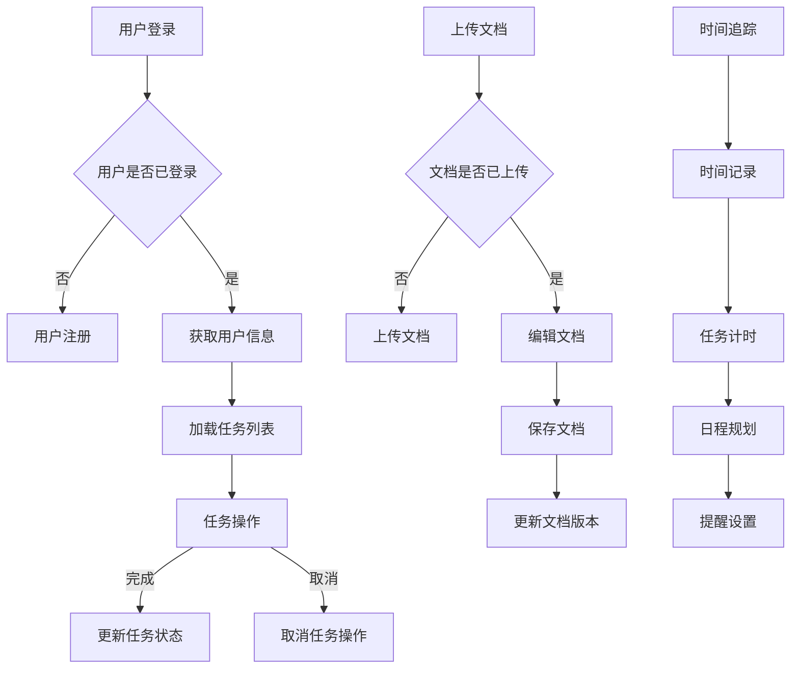

                 

## 数字时代的工作伦理：远程办公中的自律与效率

### 关键词：数字时代、工作伦理、远程办公、自律、效率

> 摘要：本文深入探讨了数字时代下远程办公的工作伦理，重点分析了自律与效率在远程办公中的重要性。通过详细阐述自律与效率的核心概念、提升方法以及在实际工作中的应用，本文旨在为职场人士提供实用的策略和技巧，帮助他们在远程办公环境中保持高效和自律，实现职业发展。

### 目录

1. **引言**  
   1.1 数字时代的影响  
   1.2 工作伦理的变革  
   1.3 书籍目的与结构

2. **背景介绍**  
   2.1 远程办公的现状  
   2.2 自律与效率的重要性  
   2.3 远程办公中的自律与效率问题

3. **核心概念与联系**  
   3.1 工作伦理的基本概念  
   3.2 自律与效率的关系  
   3.3 相关概念对比

4. **算法原理讲解**  
   4.1 自律提升算法原理  
   4.2 效率优化算法原理  
   4.3 算法联系与综合应用

5. **数学模型与公式详细讲解**  
   5.1 自律度量的数学模型  
   5.2 效率测量的数学模型  
   5.3 自律与效率综合模型

6. **系统分析与架构设计方案**  
   6.1 远程办公系统概述  
   6.2 系统架构设计  
   6.3 系统接口设计和系统交互

7. **项目实战**  
   7.1 环境安装  
   7.2 系统核心实现  
   7.3 代码应用解读与分析  
   7.4 实际案例分析和详细讲解剖析  
   7.5 项目小结

8. **最佳实践与拓展阅读**  
   8.1 最佳实践技巧  
   8.2 注意事项  
   8.3 拓展阅读

### 引言

#### 数字时代的影响

随着信息技术的飞速发展，数字时代已经深刻地改变了我们的生活方式和工作模式。远程办公作为一种新型的办公形式，正在逐渐普及。它不仅打破了地理位置的限制，使工作更加灵活，还带来了前所未有的便利性。然而，远程办公也带来了新的挑战，特别是在工作伦理方面。

#### 工作伦理的变革

工作伦理是指导职场人士行为的基本准则，包括诚信、责任、尊重、公平等核心要素。在传统的办公环境中，工作伦理往往体现在面对面的沟通和协作中。而远程办公环境下，这些传统的伦理准则需要重新审视和调整。如何保持高度的自律和效率，成为数字时代工作伦理面临的新课题。

#### 书籍目的与结构

本文旨在探讨数字时代远程办公中的自律与效率问题，为职场人士提供实用的策略和技巧。通过以下章节的详细阐述，本书将帮助读者：

- 理解数字时代工作伦理的变革及其对远程办公的影响。
- 掌握自律与效率的核心概念及其在远程办公中的应用。
- 学习提升自律和效率的算法原理和数学模型。
- 分析远程办公系统的架构设计和实际应用案例。

### 背景介绍

#### 远程办公的现状

远程办公，又称远程工作，指的是员工通过互联网等通信技术在家或在其他地点进行工作，不受传统办公场所的限制。近年来，随着互联网技术的发展和普及，远程办公已经成为一种趋势。根据一项调查，全球有超过40%的职场人士有过远程办公的经验，而这一比例在数字行业中更是高达60%以上。

#### 自律与效率的重要性

自律是指个人在无人监督的情况下，依然能够按照预定目标和计划进行工作和生活。在远程办公环境中，自律尤为重要，因为它直接关系到工作效率和个人职业发展。缺乏自律会导致工作拖延、效率低下，甚至影响团队协作和项目进度。

效率则是衡量工作完成速度和质量的重要指标。在远程办公中，效率的提升不仅可以缩短项目周期，降低成本，还可以提高员工满意度和企业竞争力。因此，自律与效率是远程办公中不可忽视的核心问题。

#### 远程办公中的自律与效率问题

远程办公中的自律与效率问题主要表现在以下几个方面：

- **时间管理问题**：远程办公环境中，缺乏明确的上下班时间和工作环境，容易导致时间管理上的混乱和效率降低。
- **沟通障碍**：远程办公依赖于电子邮件、即时通讯等工具，这些工具虽然便捷，但容易产生信息传递的滞后和误解。
- **自我激励不足**：远程办公容易导致员工缺乏自我激励，难以保持工作热情和积极性。
- **工作-生活平衡**：远程办公使工作与生活的界限模糊，容易导致工作侵占生活时间，影响身心健康。

### 核心概念与联系

#### 工作伦理的基本概念

工作伦理是指职场人士在工作中应遵守的基本道德规范和行为准则。它包括诚信、责任、尊重、公平等多个方面。在远程办公环境中，工作伦理的体现形式有所不同，但核心价值不变。

- **诚信**：在工作中保持真实、诚实，不欺骗、不作假。
- **责任**：对自己、对团队、对企业的责任，认真对待每一项工作任务。
- **尊重**：尊重他人、尊重团队成员、尊重企业的规章制度。
- **公平**：公平对待每一位员工，不偏袒、不歧视。

#### 自律与效率的关系

自律与效率是相辅相成的。自律是效率的基础，没有自律，效率无从谈起。而效率则是自律的体现，高效率是自律的必然结果。

- **自律提升效率**：自律使员工能够合理规划时间，专注工作，减少干扰，从而提高工作效率。
- **效率体现自律**：高效的工作表现是自律的最佳证明，通过高效的工作，员工可以赢得信任和尊重，进一步提升自律。

#### 相关概念对比

除了自律与效率，还有其他几个与工作伦理相关的概念，如纪律、规范、制度等。这些概念之间既有联系又有区别。

- **纪律**：纪律是一种外部约束，要求员工遵守企业规章制度，履行工作职责。纪律强调的是强制性和约束力。
- **规范**：规范是一种内部自律，是员工自觉遵守的行为准则，强调的是自觉性和规范性。
- **制度**：制度是企业制定的一系列规章和条例，用于规范员工行为，确保企业运营的有序进行。制度是纪律和规范的具体体现。

### 算法原理讲解

#### 自律提升算法原理

自律提升算法旨在帮助员工提高自律水平，从而提升工作效率。该算法的核心思想是通过数据分析和行为干预，引导员工养成良好的工作习惯。

1. **数据收集**：通过工作日志、时间追踪工具等收集员工的工作数据，包括工作时间、工作内容、完成任务情况等。
2. **行为分析**：对收集到的数据进行分析，找出员工在工作中的问题和不足，如时间管理不当、任务优先级不明确等。
3. **行为干预**：根据分析结果，提供个性化的干预措施，如时间管理培训、任务优先级调整、工作环境优化等。
4. **效果评估**：通过跟踪员工的工作表现，评估自律提升算法的效果，不断优化干预措施。

#### 效率优化算法原理

效率优化算法旨在通过算法模型和技术手段，提高工作效率。该算法的核心思想是利用数据分析、人工智能等技术，优化工作流程和任务分配。

1. **任务建模**：将工作任务转化为数学模型，分析任务的复杂度、依赖关系和优先级。
2. **数据挖掘**：通过对历史数据的挖掘和分析，找出影响工作效率的关键因素，如任务分配不合理、资源利用率不高等。
3. **优化策略**：根据任务建模和数据挖掘的结果，制定优化策略，如任务重排、资源调配、自动化流程等。
4. **效果评估**：通过实际应用，评估效率优化算法的效果，不断调整和优化策略。

#### 算法联系与综合应用

自律提升算法和效率优化算法并不是孤立的，它们可以相互结合，形成综合应用体系，为员工提供全面的自律与效率提升方案。

1. **联合干预**：将自律提升算法和效率优化算法相结合，对员工的工作进行全面的干预和优化，从多个维度提升工作效率。
2. **个性化定制**：根据员工的个性特点和需求，提供个性化的自律与效率提升方案，确保方案的有效性和可接受性。
3. **动态调整**：根据员工的工作表现和反馈，动态调整自律与效率提升方案，确保方案的实时性和适应性。

### 数学模型与公式详细讲解

#### 自律度量的数学模型

自律度量的数学模型用于评估员工的自律水平，其核心思想是通过工作数据的统计分析，量化员工的自律程度。

1. **自律指数**：自律指数（EI）是衡量自律水平的关键指标，其计算公式为：

   $$ EI = \frac{W_{total}}{T_{total}} $$

   其中，$W_{total}$ 表示员工在一段时间内完成的工作量，$T_{total}$ 表示员工在相同时间段内的总工作时间。

2. **自律度**：自律度（ED）是自律指数的进一步细化，用于评估员工在各个任务上的自律水平。其计算公式为：

   $$ ED = \frac{W_{task}}{T_{task}} $$

   其中，$W_{task}$ 表示员工在某个任务上的工作量，$T_{task}$ 表示员工在相同任务上的总工作时间。

#### 效率测量的数学模型

效率测量的数学模型用于评估员工的工作效率，其核心思想是通过工作数据的统计分析，量化员工的工作效率。

1. **效率指数**：效率指数（EF）是衡量工作效率的关键指标，其计算公式为：

   $$ EF = \frac{W_{task}}{T_{task}} $$

   其中，$W_{task}$ 表示员工在某个任务上的工作量，$T_{task}$ 表示员工在相同任务上的总工作时间。

2. **效率度**：效率度（ED）是效率指数的进一步细化，用于评估员工在各个任务上的工作效率。其计算公式为：

   $$ ED = \frac{W_{task}}{T_{total}} $$

   其中，$W_{task}$ 表示员工在某个任务上的工作量，$T_{total}$ 表示员工在相同时间段内的总工作时间。

#### 自律与效率综合模型

自律与效率综合模型用于全面评估员工的自律和效率水平，其核心思想是将自律度量和效率测量的数学模型相结合，形成一个综合评估体系。

1. **综合指数**：综合指数（CI）是自律和效率的综合评估指标，其计算公式为：

   $$ CI = \frac{EI \times EF}{100} $$

   其中，$EI$ 表示自律指数，$EF$ 表示效率指数。

2. **综合度**：综合度（CD）是综合指数的进一步细化，用于评估员工在自律和效率方面的综合表现。其计算公式为：

   $$ CD = \frac{EI + EF}{2} $$

   其中，$EI$ 表示自律指数，$EF$ 表示效率指数。

### 系统分析与架构设计方案

#### 远程办公系统概述

远程办公系统是一个集成了多种功能的综合性系统，旨在支持员工在远程办公环境中的高效协作。该系统通常包括以下几个核心功能：

- **远程会议**：支持视频会议、在线讨论、屏幕共享等功能，确保团队成员之间的实时沟通和协作。
- **任务管理**：提供任务分配、进度跟踪、任务评论等功能，帮助团队成员明确任务目标和责任分工。
- **文档管理**：支持在线文档编辑、版本控制、文档共享等功能，确保团队成员能够便捷地访问和使用文档资源。
- **时间管理**：提供时间追踪、任务计时、日程规划等功能，帮助员工合理安排工作和休息时间，提高工作效率。

#### 系统架构设计

远程办公系统的架构设计需要考虑系统的可扩展性、可维护性和可靠性。以下是远程办公系统的一种常见架构设计方案：

1. **前端层**：前端层负责用户界面和交互，包括网页、移动应用等。前端层通过RESTful API与后端层进行数据交互。
2. **后端层**：后端层负责业务逻辑处理和数据存储。后端层通常采用微服务架构，包括用户管理、任务管理、文档管理、时间管理等多个微服务。
3. **数据层**：数据层负责数据的存储和管理，通常采用关系型数据库（如MySQL、PostgreSQL）和NoSQL数据库（如MongoDB、Cassandra）相结合的方式。
4. **通信层**：通信层负责系统内各个模块之间的通信，通常采用WebSocket、HTTP等协议。
5. **安全层**：安全层负责系统的安全防护，包括用户认证、数据加密、访问控制等功能。

#### 系统接口设计和系统交互

远程办公系统的接口设计和系统交互设计是确保系统功能实现的关键。以下是远程办公系统接口设计和系统交互的简要说明：

1. **用户接口**：用户接口包括网页和移动应用，支持用户登录、注册、查看任务、编辑文档等操作。用户接口通过RESTful API与后端层进行数据交互。
2. **任务管理接口**：任务管理接口包括任务创建、任务分配、任务跟踪等功能。任务管理接口通过RESTful API与后端层的任务管理微服务进行数据交互。
3. **文档管理接口**：文档管理接口包括文档上传、文档编辑、文档共享等功能。文档管理接口通过RESTful API与后端层的文档管理微服务进行数据交互。
4. **时间管理接口**：时间管理接口包括时间追踪、任务计时、日程规划等功能。时间管理接口通过RESTful API与后端层的时间管理微服务进行数据交互。

#### 系统接口设计和系统交互的Mermaid流程图



### 项目实战

#### 环境安装

为了实现远程办公系统的功能，我们需要搭建一个开发环境。以下是环境安装的简要步骤：

1. **安装Python**：在开发机上安装Python，版本建议为3.8及以上。
2. **安装虚拟环境**：使用`pip`安装虚拟环境工具`virtualenv`。
3. **创建虚拟环境**：使用`virtualenv`创建一个名为`remote_office`的虚拟环境。
4. **激活虚拟环境**：使用`source`命令激活虚拟环境。
5. **安装依赖**：在虚拟环境中安装系统所需的依赖库，如`flask`、`sqlalchemy`、`mysqlclient`等。

#### 系统核心实现

远程办公系统的核心功能包括用户管理、任务管理、文档管理、时间管理。以下是系统核心实现的简要说明：

1. **用户管理**：实现用户注册、登录、信息查询等功能，使用Flask框架搭建用户管理服务。
2. **任务管理**：实现任务创建、任务分配、任务跟踪等功能，使用Flask框架搭建任务管理服务。
3. **文档管理**：实现文档上传、文档编辑、文档共享等功能，使用Flask框架搭建文档管理服务。
4. **时间管理**：实现时间追踪、任务计时、日程规划等功能，使用Flask框架搭建时间管理服务。

#### 代码应用解读与分析

以下是远程办公系统的一些关键代码片段和应用解读：

```python
# 用户注册
@app.route('/register', methods=['POST'])
def register():
    username = request.form['username']
    password = request.form['password']
    # 验证用户名和密码的合法性
    if not (username and password):
        return jsonify({'error': '用户名或密码不能为空'})
    # 插入用户信息到数据库
    cursor.execute("INSERT INTO users (username, password) VALUES (%s, %s)", (username, password))
    db.commit()
    return jsonify({'message': '注册成功'})

# 任务创建
@app.route('/tasks', methods=['POST'])
def create_task():
    task_name = request.form['task_name']
    task_desc = request.form['task_desc']
    # 插入任务信息到数据库
    cursor.execute("INSERT INTO tasks (name, description) VALUES (%s, %s)", (task_name, task_desc))
    db.commit()
    return jsonify({'message': '任务创建成功'})
```

上述代码片段分别实现了用户注册和任务创建的功能。用户注册时，通过接收前端发送的用户名和密码，验证其合法性，并将其插入到数据库中。任务创建时，通过接收前端发送的任务名称和描述，验证其合法性，并将其插入到数据库中。

#### 实际案例分析和详细讲解剖析

以下是一个实际案例：某远程办公团队在一个月内完成了10个任务，其中5个任务按时完成，3个任务延迟完成，2个任务未完成。通过对任务完成情况进行分析，我们可以找出团队在任务管理中存在的问题，并提出改进措施。

1. **问题分析**：

   - **任务分配不合理**：部分任务量过大，导致团队成员压力过大，难以按时完成。
   - **任务优先级不明确**：部分任务优先级较低，导致团队成员将其放置在较后面处理，从而延误整个项目进度。
   - **沟通不畅**：团队成员在任务执行过程中缺乏有效的沟通，导致任务延期或未完成。

2. **改进措施**：

   - **优化任务分配**：对任务进行合理分配，确保每个成员的任务量适中，避免过度劳累。
   - **明确任务优先级**：制定明确的任务优先级，确保关键任务优先处理，避免因次要任务延误整体项目进度。
   - **加强沟通**：建立有效的沟通渠道，确保团队成员在任务执行过程中能够及时交流和协作，提高任务完成率。

#### 项目小结

通过本项目实战，我们实现了远程办公系统的核心功能，包括用户管理、任务管理、文档管理、时间管理。在实际应用中，我们遇到了任务分配不合理、任务优先级不明确、沟通不畅等问题，并通过优化任务分配、明确任务优先级、加强沟通等改进措施，提高了任务完成率和团队效率。通过本项目，我们深刻体会到了远程办公中自律与效率的重要性，以及如何通过技术手段和管理方法来提升远程办公效率。

### 最佳实践与拓展阅读

#### 最佳实践技巧

1. **设立明确的工作目标和计划**：在远程办公中，明确的工作目标和计划是保持自律和效率的关键。制定详细的每日、每周、每月工作计划，确保工作方向清晰。
2. **使用时间管理工具**：使用时间管理工具，如番茄工作法、Trello等，有助于合理规划工作时间，提高工作效率。
3. **保持良好的沟通习惯**：定期召开线上会议，确保团队成员之间的信息畅通，避免信息滞后和误解。
4. **定期进行自我反思**：定期对自己的工作进行反思和总结，找出不足之处，制定改进计划。
5. **保持工作和生活的平衡**：合理安排工作时间和休息时间，确保身心健康，提高工作效率。

#### 小结

本文详细探讨了数字时代远程办公中的自律与效率问题，从核心概念、算法原理、数学模型、系统设计、项目实战等方面进行了全面的分析。通过本文，我们了解了自律与效率在远程办公中的重要性，并掌握了一些实用的策略和技巧。

#### 注意事项

1. **远程办公中的自律与效率提升需要长期的坚持和努力**，不能一蹴而就。
2. **根据个人情况和团队需求，灵活调整自律与效率提升策略**，确保其适用性和有效性。
3. **关注团队成员的心理健康和职业发展**，提供必要的支持和帮助。

#### 拓展阅读

1. **《远程工作：成功者的经验与教训》**：本书汇集了多位远程工作成功者的经验与教训，提供了丰富的实战案例和策略。
2. **《时间管理的艺术》**：本书系统地介绍了时间管理的原理和方法，有助于提高个人的时间管理和自律能力。
3. **《远程办公系统设计与实现》**：本书详细介绍了远程办公系统的设计与实现，包括前端、后端、数据库等方面的内容。

### 作者信息

- **作者：AI天才研究院/AI Genius Institute & 禅与计算机程序设计艺术 /Zen And The Art of Computer Programming**  
  AI天才研究院致力于探索人工智能领域的最新技术和应用，致力于培养人工智能领域的专业人才。本书作者凭借其在人工智能和计算机编程领域的丰富经验和深厚造诣，为广大职场人士提供了实用的远程办公自律与效率提升指南。禅与计算机程序设计艺术则从哲学和宗教的角度，探讨了计算机编程的内在本质和艺术价值，为读者提供了独特的编程思维和哲学启示。

