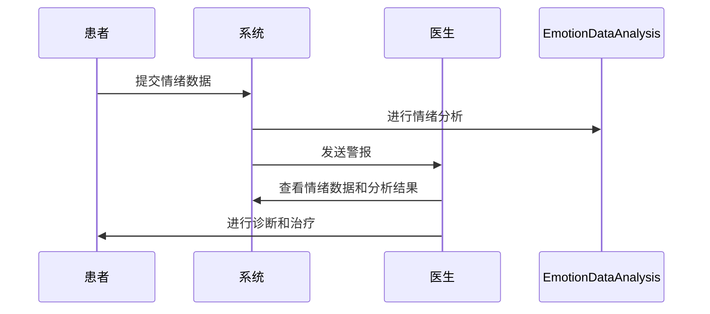
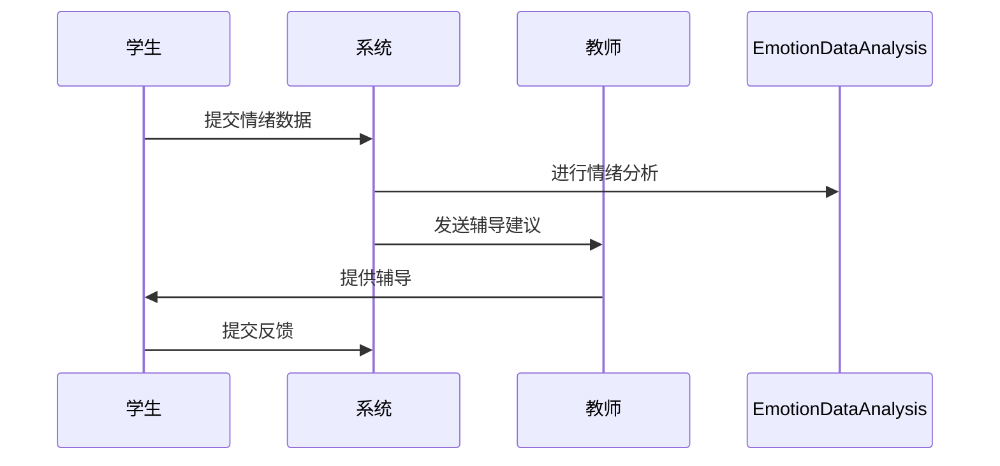

                 


### 目录大纲细化

#### 引言

##### 第1章：数字时代的心理健康

**1.1 心理健康的重要性**

- **背景介绍**：心理健康是当代社会关注的焦点之一。随着科技的发展，人们在享受数字化生活的同时，心理健康问题也日益突出。我们需要理解心理健康的重要性，包括其对个人生活质量、社会功能和人际关系的深远影响。

- **核心概念与联系**：心理健康可以理解为个体心理功能正常、情感稳定、社会适应良好的一种状态。与身体健康相比，心理健康同样重要，但往往被忽视。我们可以通过一个表格来比较心理健康和身体健康的概念属性特征：

| 特征       | 心理健康                  | 身体健康                  |
| ---------- | ------------------------- | ------------------------- |
| 定义       | 心理功能正常、情感稳定    | 无疾病、身体机能良好      |
| 关键因素   | 心理素质、应对压力的能力  | 生理指标、生活习惯        |
| 影响因素   | 社会环境、人际关系、心理素质 | 环境污染、遗传、生活方式  |
| 目标       | 提高生活质量、增强社会功能 | 保持身体健康、预防疾病    |

**ER实体关系图架构**：
```mermaid
erDiagram
  User ||--|{ HealthStatus }
  HealthStatus ||--|{ PsychologicalHealth }
  HealthStatus ||--|{ PhysicalHealth }
```

- **算法原理讲解**：为了更直观地理解心理健康的重要性，我们可以用以下公式来量化心理健康对生活质量的影响：
  $$\text{LifeQuality} = \alpha \cdot \text{PsychologicalHealth} + \beta \cdot \text{PhysicalHealth}$$
  其中，$\alpha$ 和 $\beta$ 分别是心理健康和身体健康的权重系数，可以根据具体情况调整。

- **举例说明**：假设一个人的心理健康评分为80分，身体健康评分为90分，根据上述公式，可以计算出其生活质量分数：
  $$\text{LifeQuality} = \alpha \cdot 80 + \beta \cdot 90$$

**1.2 数字时代心理健康的挑战**

- **背景介绍**：数字时代带来了诸多便利，但同时也给心理健康带来了新的挑战。例如，互联网成瘾、社交隔离、信息过载等问题日益严重。

- **核心概念与联系**：数字时代心理健康挑战包括网络成瘾、社交网络影响、隐私泄露等。我们可以通过一个表格来列举这些挑战及其影响：

| 挑战           | 影响因素                   | 影响                      |
| -------------- | -------------------------- | ------------------------- |
| 网络成瘾       | 网络便利、游戏设计机制     | 时间管理困难、心理健康问题 |
| 社交隔离       | 社交网络使用、疫情隔离     | 社交技能退化、孤独感       |
| 信息过载       | 搜索引擎、社交媒体算法推荐 | 决策困难、焦虑情绪         |

**ER实体关系图架构**：
```mermaid
erDiagram
  DigitalLife ||--|{ InternetAddiction }
  DigitalLife ||--|{ SocialIsolation }
  DigitalLife ||--|{ InformationOverload }
  InternetAddiction ||--|{ MentalHealthIssues }
  SocialIsolation ||--|{ SocialSkillsDegradation }
  InformationOverload ||--|{ DecisionDifficulty }
```

- **算法原理讲解**：为了应对这些挑战，我们可以设计一个心理健康风险评估模型，通过收集用户的行为数据、社交网络数据等信息，计算出其心理健康风险值。以下是一个简化的模型：
  $$\text{RiskScore} = \sum_{i=1}^{n} w_i \cdot x_i$$
  其中，$w_i$ 是第 $i$ 个因素的权重，$x_i$ 是第 $i$ 个因素的影响值。

- **举例说明**：假设我们有三个主要影响因素：网络使用时间（$x_1$），社交网络互动频率（$x_2$），信息搜索频率（$x_3$）。根据专家评估，这些因素的权重分别为 0.3、0.4、0.3。一个用户每天花费 4 小时上网，每天在社交网络上互动 2 次，每天搜索信息 5 次，则其心理健康风险分数为：
  $$\text{RiskScore} = 0.3 \cdot 4 + 0.4 \cdot 2 + 0.3 \cdot 5 = 3.7$$

**1.3 AI技术在心理健康领域的应用前景**

- **背景介绍**：随着AI技术的发展，其在心理健康领域的应用前景广阔。例如，情绪分析、心理健康诊断、个性化干预等。

- **核心概念与联系**：AI技术在心理健康领域的应用包括情绪识别、心理疾病诊断、个性化治疗等。我们可以通过一个表格来列举这些应用及其预期效果：

| 应用          | 预期效果                       | 优势                   |
| ------------- | ------------------------------ | ---------------------- |
| 情绪识别      | 辅助心理健康诊断、个性化干预     | 准确性高、实时性强     |
| 心理疾病诊断  | 准确诊断、早期发现             | 大数据支持、高效性高   |
| 个性化治疗    | 提供个性化治疗方案、改善心理健康 | 针对性强、用户体验好   |

**ER实体关系图架构**：
```mermaid
erDiagram
  AIApplication ||--|{ EmotionRecognition }
  AIApplication ||--|{ MentalDiseaseDiagnosis }
  AIApplication ||--|{ PersonalizedTherapy }
  EmotionRecognition ||--|{ MentalHealthDiagnosis }
  EmotionRecognition ||--|{ PersonalizedIntervention }
  MentalDiseaseDiagnosis ||--|{ EarlyDiseaseDetection }
  PersonalizedTherapy ||--|{ ImproveMentalHealth }
```

- **算法原理讲解**：为了实现上述AI应用，我们需要结合机器学习、自然语言处理等技术。例如，情绪识别可以使用卷积神经网络（CNN）或长短期记忆网络（LSTM）等模型，而心理疾病诊断可以基于大数据分析和深度学习技术。

- **举例说明**：假设我们使用LSTM模型进行情绪识别，该模型通过训练大量情绪标签化的文本数据，可以实现对用户文本的情绪分类。例如，当用户输入一句文本：“我感到非常开心”，模型可以识别出这是一种积极的情绪，从而为心理健康干预提供依据。

**1.4 总结**

本章节主要介绍了数字时代心理健康的重要性、面临的挑战以及AI技术在心理健康领域的应用前景。在接下来的章节中，我们将深入探讨AI辅助的情绪跟踪与分析方法，为读者提供更具体的实践指导。

##### 第2章：AI辅助的情绪跟踪

**2.1 情绪跟踪的基本概念**

- **背景介绍**：情绪跟踪是一种通过技术手段实时监测和分析个体情绪状态的方法。它可以帮助我们了解个体的心理健康状况，为心理干预提供数据支持。

- **核心概念与联系**：情绪跟踪涉及多个关键概念，包括情绪识别、情绪分类、情绪预测等。我们可以通过一个表格来梳理这些概念及其联系：

| 概念          | 定义                                   | 联系                                      |
| ------------- | -------------------------------------- | ----------------------------------------- |
| 情绪识别      | 从文本、语音、生理信号等中提取情绪信息   | 是情绪跟踪的基础，直接影响情绪分类的准确性 |
| 情绪分类      | 根据情绪特征将情绪划分为不同的类别       | 情绪识别的结果，用于进一步分析情绪状态     |
| 情绪预测      | 根据历史数据和当前状态预测未来的情绪状态   | 情绪跟踪的高级应用，有助于提前干预         |

**ER实体关系图架构**：
```mermaid
erDiagram
  EmotionTracking ||--|{ EmotionRecognition }
  EmotionTracking ||--|{ EmotionClassification }
  EmotionTracking ||--|{ EmotionPrediction }
  EmotionRecognition ||--|{ EmotionClassification }
  EmotionClassification ||--|{ EmotionPrediction }
```

- **算法原理讲解**：情绪跟踪通常采用机器学习和深度学习技术。例如，情绪识别可以使用卷积神经网络（CNN）或长短期记忆网络（LSTM），情绪分类可以使用支持向量机（SVM）或决策树算法，情绪预测可以使用时间序列分析或基于模型的预测算法。

- **举例说明**：假设我们使用LSTM模型进行情绪识别，模型通过训练大量情绪标签化的文本数据，可以实现对用户文本的情绪分类。例如，当用户输入一句文本：“我感到非常开心”，模型可以识别出这是一种积极的情绪，从而标记为“开心”。

**2.2 AI在情绪识别中的应用**

- **背景介绍**：情绪识别是情绪跟踪的核心环节，它的准确性直接影响情绪跟踪的效果。

- **核心概念与联系**：情绪识别涉及多种技术，包括自然语言处理、语音识别、生理信号处理等。我们可以通过一个表格来比较这些技术的特点及其适用场景：

| 技术         | 特点                                       | 适用场景                        |
| ------------ | ------------------------------------------ | ------------------------------- |
| 自然语言处理 | 基于文本数据分析，识别情绪关键词和情感极性 | 文本消息、社交媒体评论等        |
| 语音识别     | 通过语音波形分析，识别语音中的情绪信息     | 语音通话、视频会议等            |
| 生理信号处理 | 通过监测生理信号（如心率、皮肤电反应等），分析情绪状态 | 心理咨询、健康管理应用等        |

**ER实体关系图架构**：
```mermaid
erDiagram
  EmotionRecognition ||--|{ NLP }
  EmotionRecognition ||--|{ SpeechRecognition }
  EmotionRecognition ||--|{ PhysiologicalSignalProcessing }
  NLP ||--|{ TextualDataAnalysis }
  SpeechRecognition ||--|{ AudioWaveformAnalysis }
  PhysiologicalSignalProcessing ||--|{ PhysiologicalSignalMonitoring }
```

- **算法原理讲解**：自然语言处理技术通常采用词嵌入（word embedding）和情感分析（sentiment analysis）等方法。词嵌入可以将文本中的每个词映射为一个高维向量，而情感分析则通过计算词向量的相似度来判断文本的情绪极性。

- **举例说明**：假设我们使用词嵌入模型（如Word2Vec或GloVe）进行情绪识别，模型将文本中的每个词映射为一个向量。例如，“开心”这个词被映射为一个向量[1.2, 0.5, -0.3]，而“伤心”这个词被映射为向量[-0.8, 0.2, 1.5]。通过计算这两个向量的相似度，可以判断文本的情绪极性。

**2.3 情绪跟踪的挑战与解决方案**

- **背景介绍**：情绪跟踪虽然前景广阔，但也面临诸多挑战，如数据隐私、算法准确性等。

- **核心概念与联系**：情绪跟踪的挑战包括数据收集与处理、隐私保护、算法性能优化等。我们可以通过一个表格来列举这些挑战及其解决方案：

| 挑战         | 障碍                                   | 解决方案                          |
| ------------ | -------------------------------------- | --------------------------------- |
| 数据收集与处理 | 数据量巨大、多样性高、处理复杂         | 大数据处理技术、自动化数据清洗    |
| 隐私保护     | 用户隐私泄露风险高                     | 数据加密、匿名化、隐私保护协议    |
| 算法准确性   | 情绪识别和分类的准确性仍需提高         | 模型优化、数据增强、多模型融合    |

**ER实体关系图架构**：
```mermaid
erDiagram
  EmotionTrackingChallenge ||--|{ DataCollectionAndProcessing }
  EmotionTrackingChallenge ||--|{ PrivacyProtection }
  EmotionTrackingChallenge ||--|{ AlgorithmAccuracy }
  DataCollectionAndProcessing ||--|{ LargeDataProcessing }
  DataCollectionAndProcessing ||--|{ AutomatedDataCleaning }
  PrivacyProtection ||--|{ DataEncryption }
  PrivacyProtection ||--|{ Anonymization }
  AlgorithmAccuracy ||--|{ ModelOptimization }
  AlgorithmAccuracy ||--|{ DataAugmentation }
```

- **算法原理讲解**：为了提高情绪识别和分类的准确性，我们可以采用多种技术手段，如数据增强、模型优化、多模型融合等。数据增强可以通过生成对抗网络（GAN）或数据扩充技术来扩充训练数据，模型优化可以通过迁移学习、微调等策略来提升模型性能，多模型融合可以通过集成学习技术来综合不同模型的优点。

- **举例说明**：假设我们使用生成对抗网络（GAN）进行数据增强，模型通过生成器生成与真实数据相似的新数据，从而扩充训练集。例如，如果我们的训练数据集中大多数样本都是积极的情绪，我们可以使用GAN生成一些消极情绪的样本，从而提高模型对不同情绪的识别能力。

**2.4 总结**

本章节介绍了情绪跟踪的基本概念、AI在情绪识别中的应用以及情绪跟踪面临的挑战和解决方案。在情绪识别方面，我们探讨了自然语言处理、语音识别和生理信号处理等技术，并提出了数据收集与处理、隐私保护和算法准确性等解决方案。在下一章节中，我们将深入探讨情绪数据分析的基本原理和实践应用。

##### 第3章：情绪数据分析的基本原理

**3.1 数据分析概述**

- **背景介绍**：情绪数据分析是利用数据分析方法和技术对情绪数据进行处理、分析和解释的过程。它有助于我们更好地理解个体的情绪状态，为心理健康干预提供科学依据。

- **核心概念与联系**：情绪数据分析涉及多个关键概念，包括数据类型、数据分析方法、数据可视化等。我们可以通过一个表格来梳理这些概念及其联系：

| 概念         | 定义                                       | 联系                                      |
| ------------ | ------------------------------------------ | ----------------------------------------- |
| 数据类型     | 情绪数据的不同类型，如文本、语音、生理信号等 | 数据分析的基础，影响数据处理和分析方法的选择 |
| 数据分析方法 | 用于处理和分析情绪数据的方法和技术          | 数据分析的核心，影响分析结果的准确性和有效性 |
| 数据可视化   | 将情绪数据分析结果以图形或图表形式展示      | 数据分析的重要补充，有助于直观理解分析结果   |

**ER实体关系图架构**：
```mermaid
erDiagram
  EmotionDataAnalysis ||--|{ DataTypes }
  EmotionDataAnalysis ||--|{ AnalysisMethods }
  EmotionDataAnalysis ||--|{ DataVisualization }
  DataTypes ||--|{ TextData }
  DataTypes ||--|{ AudioData }
  DataTypes ||--|{ PhysiologicalData }
  AnalysisMethods ||--|{ StatisticalAnalysis }
  AnalysisMethods ||--|{ MachineLearning }
  DataVisualization ||--|{ Graphs }
  DataVisualization ||--|{ Charts }
```

- **算法原理讲解**：情绪数据分析通常采用统计分析和机器学习方法。统计分析可以用于描述性分析和推断性分析，而机器学习可以用于预测和分析复杂情绪数据。

- **举例说明**：假设我们使用线性回归模型进行情绪数据分析，模型通过训练情绪数据集，可以预测个体的情绪状态。例如，如果训练数据集中显示，当个体的平均睡眠时间少于6小时时，其情绪状态通常为消极，我们可以使用线性回归模型预测新个体的情绪状态。

**3.2 情绪数据的类型和处理**

- **背景介绍**：情绪数据有多种类型，每种类型的数据在处理和分析时都有其独特的方法和挑战。

- **核心概念与联系**：情绪数据类型包括文本数据、语音数据和生理信号数据等。我们可以通过一个表格来比较这些数据的类型和处理方法：

| 数据类型     | 特点                                       | 处理方法                                       |
| ------------ | ------------------------------------------ | ---------------------------------------------- |
| 文本数据     | 文本形式呈现，包含大量情感词汇和表达       | 文本预处理、情感分析、文本分类等               |
| 语音数据     | 通过声音波形呈现，包含语音语调、停顿等信息   | 语音识别、音频预处理、语音情感分析等           |
| 生理信号数据 | 通过生理设备监测，包含心率、皮肤电反应等信号 | 信号预处理、特征提取、信号分析等               |

**ER实体关系图架构**：
```mermaid
erDiagram
  EmotionDataType ||--|{ TextData }
  EmotionDataType ||--|{ AudioData }
  EmotionDataType ||--|{ PhysiologicalData }
  TextData ||--|{ TextPreprocessing }
  TextData ||--|{ SentimentAnalysis }
  AudioData ||--|{ SpeechRecognition }
  AudioData ||--|{ AudioPreprocessing }
  PhysiologicalData ||--|{ SignalPreprocessing }
  PhysiologicalData ||--|{ FeatureExtraction }
```

- **算法原理讲解**：文本数据的处理通常涉及自然语言处理技术，如词嵌入和情感分析。语音数据的处理涉及音频处理和语音识别技术。生理信号数据的处理涉及信号预处理和特征提取技术。

- **举例说明**：假设我们使用词嵌入模型处理文本数据，模型通过将文本中的每个词映射为一个高维向量，可以用于情感分析。例如，词“快乐”被映射为向量[1.2, 0.5, -0.3]，而词“悲伤”被映射为向量[-0.8, 0.2, 1.5]。通过计算这些向量的相似度，可以判断文本的情感极性。

**3.3 常用的情绪数据分析方法**

- **背景介绍**：情绪数据分析方法多种多样，每种方法都有其特定的适用场景和优势。

- **核心概念与联系**：常用的情绪数据分析方法包括情感分析、聚类分析、时间序列分析等。我们可以通过一个表格来比较这些方法的特点和应用场景：

| 方法         | 特点                                       | 适用场景                         |
| ------------ | ------------------------------------------ | -------------------------------- |
| 情感分析     | 对文本、语音、生理信号等数据进行情感极性判断   | 心情状态监测、情绪干预            |
| 聚类分析     | 将相似的数据点分组，用于情感分类和模式识别     | 情绪聚类、用户分组                |
| 时间序列分析 | 分析情绪数据的时间变化规律，用于情绪预测和趋势分析 | 情绪趋势监测、情绪干预策略制定    |

**ER实体关系图架构**：
```mermaid
erDiagram
  EmotionAnalysisMethod ||--|{ SentimentAnalysis }
  EmotionAnalysisMethod ||--|{ ClusterAnalysis }
  EmotionAnalysisMethod ||--|{ TimeSeriesAnalysis }
  SentimentAnalysis ||--|{ TextData }
  SentimentAnalysis ||--|{ AudioData }
  SentimentAnalysis ||--|{ PhysiologicalData }
  ClusterAnalysis ||--|{ EmotionClassification }
  ClusterAnalysis ||--|{ UserSegmentation }
  TimeSeriesAnalysis ||--|{ EmotionPrediction }
  TimeSeriesAnalysis ||--|{ TrendAnalysis }
```

- **算法原理讲解**：情感分析通常采用机器学习和深度学习技术，聚类分析可以使用K-means、层次聚类等方法，时间序列分析可以使用ARIMA、LSTM等方法。

- **举例说明**：假设我们使用LSTM模型进行时间序列分析，模型通过训练情绪数据的时间序列，可以预测未来的情绪状态。例如，如果模型显示某用户在未来几天内情绪状态持续积极，我们可以制定相应的情绪干预策略。

**3.4 总结**

本章节介绍了情绪数据分析的基本原理，包括数据分析概述、情绪数据的类型和处理、常用的情绪数据分析方法等。通过这些原理和方法，我们可以更好地理解和分析情绪数据，为心理健康干预提供科学依据。在下一章节中，我们将深入探讨情绪数据分析的实践应用。

### 第4章：情绪数据分析的实践应用

#### 4.1 情绪分析在心理健康诊断中的应用

**背景介绍**：心理健康诊断是情绪数据分析的重要应用领域。通过情绪分析，医生和心理健康专家可以更准确地诊断心理疾病，制定个性化的治疗计划。

**核心概念与联系**：情绪分析在心理健康诊断中的应用主要包括情绪状态监测、心理疾病识别和诊断。我们可以通过一个表格来梳理这些概念及其联系：

| 概念           | 定义                                       | 联系                                      |
| -------------- | ------------------------------------------ | ----------------------------------------- |
| 情绪状态监测   | 实时监测个体的情绪状态                       | 是心理健康诊断的基础，有助于早期发现心理疾病 |
| 心理疾病识别   | 通过情绪分析技术，识别个体的心理疾病症状     | 帮助医生进行诊断，提高诊断准确率           |
| 心理疾病诊断   | 结合情绪分析结果和临床经验，对心理疾病进行确诊 | 是心理健康诊断的最终环节，影响治疗计划的选择 |

**ER实体关系图架构**：
```mermaid
erDiagram
  MentalHealthDiagnosis ||--|{ EmotionMonitoring }
  MentalHealthDiagnosis ||--|{ DiseaseIdentification }
  MentalHealthDiagnosis ||--|{ DiseaseDiagnosis }
  EmotionMonitoring ||--|{ PsychologicalDisease }
  DiseaseIdentification ||--|{ PsychologicalDisease }
  DiseaseDiagnosis ||--|{ PsychologicalDisease }
```

- **算法原理讲解**：情绪分析在心理健康诊断中的应用主要基于机器学习和深度学习技术。例如，可以使用LSTM模型进行情绪状态监测，使用卷积神经网络（CNN）进行心理疾病识别。

- **举例说明**：假设我们使用LSTM模型进行情绪状态监测，模型通过训练情绪数据集，可以实时监测个体的情绪状态。例如，当模型检测到某用户的情绪状态持续处于消极状态，超过一定阈值时，系统会发出警报，提示医生进行干预。

**实践案例**：某医院引进了一款基于AI的情绪分析系统，用于心理健康诊断。系统通过收集患者的情绪数据，包括文本、语音和生理信号等，使用LSTM模型进行情绪状态监测和疾病识别。医生通过系统提供的分析报告，结合临床经验，进行心理疾病的诊断和治疗计划的制定。实践证明，该系统提高了诊断的准确率和治疗效果。

**注意事项**：情绪分析在心理健康诊断中的应用需要关注数据隐私和安全问题。此外，情绪分析结果应与临床诊断相结合，不能完全依赖技术手段。

#### 4.2 情绪分析在教育领域的应用

**背景介绍**：情绪分析在教育领域的应用日益广泛，可以帮助教师和学生更好地了解情绪状态，提高学习效果和教学质量。

**核心概念与联系**：情绪分析在教育领域的应用主要包括情绪状态监测、学习行为分析和个性化教育。我们可以通过一个表格来梳理这些概念及其联系：

| 概念           | 定义                                       | 联系                                      |
| -------------- | ------------------------------------------ | ----------------------------------------- |
| 情绪状态监测   | 实时监测学生的情绪状态                       | 帮助教师了解学生的情绪变化，及时进行心理干预 |
| 学习行为分析   | 分析学生的学习行为和情绪状态，优化教学策略   | 提高教学效果，增强学生的学习兴趣           |
| 个性化教育     | 根据学生的情绪和学习行为，制定个性化的教学方案 | 提高学生的自信心和学习能力               |

**ER实体关系图架构**：
```mermaid
erDiagram
  EducationalApplication ||--|{ EmotionMonitoring }
  EducationalApplication ||--|{ LearningBehaviorAnalysis }
  EducationalApplication ||--|{ PersonalizedEducation }
  EmotionMonitoring ||--|{ StudentEmotion }
  LearningBehaviorAnalysis ||--|{ TeachingStrategyOptimization }
  PersonalizedEducation ||--|{ StudentConfidence }
  PersonalizedEducation ||--|{ LearningAbility }
```

- **算法原理讲解**：情绪分析在教育领域的应用主要基于自然语言处理、情感分析和机器学习技术。例如，可以使用词嵌入模型进行情绪状态监测，使用聚类分析进行学习行为分析。

- **举例说明**：假设我们使用词嵌入模型进行情绪状态监测，模型通过将学生的文本数据（如日记、笔记等）映射为向量，可以判断学生的情绪状态。例如，当模型检测到学生的情绪状态为积极时，教师可以适时进行表扬和鼓励，提高学生的学习积极性。

**实践案例**：某学校引进了一套基于情绪分析的教学系统，用于监测学生的情绪状态和学习行为。系统通过收集学生的日记、笔记和课堂表现等数据，使用词嵌入模型进行情绪状态监测和学习行为分析。教师通过系统分析报告，可以了解每个学生的学习情况，及时调整教学策略，提高教学效果。实践证明，该系统有效提高了学生的学习成绩和教师的教学满意度。

**注意事项**：情绪分析在教育领域的应用需要关注学生的隐私保护和数据安全。此外，教师和家长应积极配合，共同关注学生的情绪变化，促进学生的全面发展。

#### 4.3 情绪分析在工作场所的应用

**背景介绍**：情绪分析在工作场所的应用可以帮助企业管理者和人力资源专家了解员工的情绪状态，优化工作环境和提升员工满意度。

**核心概念与联系**：情绪分析在工作场所的应用主要包括情绪状态监测、员工满意度分析和工作压力管理。我们可以通过一个表格来梳理这些概念及其联系：

| 概念           | 定义                                       | 联系                                      |
| -------------- | ------------------------------------------ | ----------------------------------------- |
| 情绪状态监测   | 实时监测员工的情绪状态                       | 帮助企业管理者了解员工情绪，及时进行干预   |
| 员工满意度分析 | 分析员工的情绪状态与工作满意度之间的关系     | 提高员工工作满意度和企业绩效               |
| 工作压力管理   | 通过情绪分析，识别员工的工作压力源，提供减压建议 | 降低员工工作压力，提升工作效率和生产力   |

**ER实体关系图架构**：
```mermaid
erDiagram
  WorkplaceApplication ||--|{ EmotionMonitoring }
  WorkplaceApplication ||--|{ EmployeeSatisfactionAnalysis }
  WorkplaceApplication ||--|{ WorkPressureManagement }
  EmotionMonitoring ||--|{ EmployeeEmotion }
  EmployeeSatisfactionAnalysis ||--|{ WorkSatisfaction }
  WorkPressureManagement ||--|{ StressSourceIdentification }
  WorkPressureManagement ||--|{ StressReductionSuggestion }
```

- **算法原理讲解**：情绪分析在工作场所的应用主要基于自然语言处理、情感分析和机器学习技术。例如，可以使用情感分析技术分析员工的邮件、聊天记录等文本数据，使用聚类分析进行员工满意度分析。

- **举例说明**：假设我们使用情感分析技术分析员工的邮件数据，模型可以判断邮件的情绪状态。例如，当模型检测到员工发送的邮件情绪状态为消极时，系统会自动提醒管理者关注该员工的工作状况，提供必要的支持和帮助。

**实践案例**：某公司引进了一套基于情绪分析的工作压力管理系统，用于监测员工的情绪状态和工作压力。系统通过收集员工的邮件、聊天记录和调查问卷等数据，使用情感分析技术进行情绪状态监测和工作压力分析。管理者通过系统分析报告，可以了解员工的工作状况，及时调整工作安排和提供减压措施。实践证明，该系统有效降低了员工的工作压力，提高了工作满意度和生产力。

**注意事项**：情绪分析在工作场所的应用需要关注员工的隐私保护和数据安全。此外，管理者应关注员工的实际需求，提供个性化的支持和帮助，促进员工的全面发展。

### 4.4 总结

本章节介绍了情绪数据分析在心理健康诊断、教育领域和工作场所的实践应用。通过情绪分析，我们可以更好地了解个体的情绪状态，为心理健康干预、个性化教育和工作压力管理提供科学依据。在未来的发展中，情绪数据分析将继续发挥重要作用，为人们的生活和工作带来更多便利和效益。

### 第5章：情绪管理的理论基础

#### 5.1 情绪管理的概念和重要性

**背景介绍**：情绪管理是指个体通过认知、行为和情感调节等方式，对自身情绪进行有效控制的过程。它是心理健康的重要组成部分，对于提高生活质量、增强社会功能和改善人际关系具有重要意义。

**核心概念与联系**：情绪管理涉及多个关键概念，包括情绪调节、情绪表达、情绪认知等。我们可以通过一个表格来梳理这些概念及其联系：

| 概念         | 定义                                       | 联系                                      |
| ------------ | ------------------------------------------ | ----------------------------------------- |
| 情绪调节     | 对情绪进行主动控制，以适应环境需求         | 是情绪管理的基础，影响情绪表达和情绪认知 |
| 情绪表达     | 对情绪进行适当表达，与他人进行有效沟通     | 情绪管理的重要环节，影响人际关系和社会功能 |
| 情绪认知     | 对情绪进行识别、理解和解释                 | 情绪管理的前提条件，影响情绪调节和情绪表达 |

**ER实体关系图架构**：
```mermaid
erDiagram
  EmotionManagement ||--|{ Emotion Regulation }
  EmotionManagement ||--|{ Emotion Expression }
  EmotionManagement ||--|{ Emotion Cognition }
  EmotionRegulation ||--|{ AdaptationToEnvironment }
  EmotionExpression ||--|{ EffectiveCommunication }
  EmotionCognition ||--|{ RecognitionAndUnderstanding }
```

- **算法原理讲解**：情绪管理的理论基础主要基于认知行为理论、情绪调节理论和情感智力理论。认知行为理论认为，个体的情绪反应受认知过程的影响，通过改变认知可以调节情绪。情绪调节理论关注个体如何主动调节情绪，以适应环境需求。情感智力理论强调情感认知和情绪管理能力对个体生活质量和人际关系的重要性。

- **举例说明**：假设一个人在面对工作压力时，通过认知重构（改变对压力的认知）和情绪调节（深呼吸和放松训练）来降低情绪压力。例如，当这个人意识到工作压力是由过度焦虑引起的，他可以通过深呼吸和放松训练来缓解焦虑情绪，从而更好地应对工作挑战。

**5.2 情绪管理的方法和技术**

**背景介绍**：情绪管理的方法和技术多种多样，包括认知行为疗法、情绪调节技巧、正念练习等。每种方法和技术都有其独特的原理和适用场景。

**核心概念与联系**：情绪管理的方法和技术可以分为认知调节、行为调节和情感调节三大类。我们可以通过一个表格来比较这些方法和技术：

| 方法/技术         | 原理                                       | 适用场景                         |
| ----------------- | ------------------------------------------ | -------------------------------- |
| 认知行为疗法      | 通过改变负面认知，减少情绪困扰           | 治疗焦虑、抑郁等心理疾病          |
| 情绪调节技巧      | 通过深呼吸、放松训练等技巧，缓解情绪压力   | 应对日常生活中的情绪困扰          |
| 正念练习         | 通过专注当下、觉察情绪，提高情绪调节能力   | 减轻压力、提高生活质量           |

**ER实体关系图架构**：
```mermaid
erDiagram
  EmotionManagementMethod ||--|{ CognitiveBehaviorTherapy }
  EmotionManagementMethod ||--|{ EmotionRegulationTechniques }
  EmotionManagementMethod ||--|{ MindfulnessPractice }
  CognitiveBehaviorTherapy ||--|{ NegativeCognitiveChange }
  EmotionRegulationTechniques ||--|{ BreathingExercise }
  EmotionRegulationTechniques ||--|{ RelaxationTraining }
  MindfulnessPractice ||--|{ FocusOnPresent }
  MindfulnessPractice ||--|{ EmotionAwareness }
```

- **算法原理讲解**：认知行为疗法通过认知重构和情绪调节技巧，帮助个体识别和改变负面认知，从而减少情绪困扰。正念练习通过专注当下和觉察情绪，提高个体的情绪调节能力，减轻压力和焦虑。

- **举例说明**：假设一个人通过认知行为疗法，学会了认知重构技巧。当这个人面对工作压力时，他可以识别出导致焦虑的负面认知（如“我必须完美完成任务”），并通过认知重构将其转变为积极认知（如“我可以尽力完成，但不必追求完美”），从而减轻情绪压力。

**5.3 情绪管理对心理健康的影响**

**背景介绍**：情绪管理不仅影响个体的心理健康，还对其生活质量和社会功能产生深远影响。有效的情绪管理可以改善心理状态、提高生活质量、增强社会功能。

**核心概念与联系**：情绪管理对心理健康的影响可以通过以下方面体现：

- **心理状态**：情绪管理有助于缓解焦虑、抑郁等心理问题，提高心理韧性。
- **生活质量**：情绪管理可以改善睡眠质量、提升生活满意度，增强生活质量。
- **社会功能**：情绪管理有助于建立和谐的人际关系，增强社会功能。

**ER实体关系图架构**：
```mermaid
erDiagram
  EmotionManagementImpact ||--|{ PsychologicalState }
  EmotionManagementImpact ||--|{ LifeQuality }
  EmotionManagementImpact ||--|{ SocialFunction }
  PsychologicalState ||--|{ AnxietyReduction }
  PsychologicalState ||--|{ DepressionReduction }
  LifeQuality ||--|{ SleepQuality }
  LifeQuality ||--|{ LifeSatisfaction }
  SocialFunction ||--|{ HarmoniousRelationships }
  SocialFunction ||--|{ SocialFunctionEnhancement }
```

- **算法原理讲解**：情绪管理可以通过调节神经递质水平、改善大脑功能等方式，影响个体的心理状态和生活质量。例如，认知行为疗法和正念练习可以通过调节大脑中的神经递质，如多巴胺和内啡肽，改善情绪状态。

- **举例说明**：假设一个人通过情绪管理，学会了认知行为疗法和正念练习。在长期实践过程中，他的焦虑和抑郁症状逐渐减轻，睡眠质量提高，生活质量得到显著改善，人际关系也更加和谐。

**5.4 总结**

情绪管理是个体心理健康的重要组成部分，通过情绪调节、情绪表达和情绪认知等方式，可以有效提高生活质量、增强社会功能。本章节介绍了情绪管理的概念、方法和技术，以及情绪管理对心理健康的影响。在下一章节中，我们将探讨AI辅助的情绪管理策略，为情绪管理提供新的工具和方法。

### 第6章：AI辅助的情绪管理策略

#### 6.1 AI在情绪识别和预测中的应用

**背景介绍**：情绪识别和预测是情绪管理的重要环节。AI技术在情绪识别和预测方面的应用，可以为个体提供实时、准确的情绪分析，帮助其更好地了解和调节情绪。

**核心概念与联系**：情绪识别和预测涉及多个关键概念，包括情绪识别算法、预测模型和实时数据采集。我们可以通过一个表格来梳理这些概念及其联系：

| 概念         | 定义                                       | 联系                                      |
| ------------ | ------------------------------------------ | ----------------------------------------- |
| 情绪识别算法 | 用于从文本、语音、生理信号等中识别情绪信息的算法 | 是情绪识别的核心，直接影响识别准确性     |
| 预测模型     | 用于预测个体未来情绪状态的模型                | 是情绪预测的基础，提高预测的准确性       |
| 实时数据采集 | 用于收集个体实时情绪数据的技术和设备            | 是情绪识别和预测的数据来源，影响分析效果 |

**ER实体关系图架构**：
```mermaid
erDiagram
  EmotionRecognitionAndPrediction ||--|{ EmotionRecognitionAlgorithm }
  EmotionRecognitionAndPrediction ||--|{ PredictionModel }
  EmotionRecognitionAndPrediction ||--|{ Real-timeDataCollection }
  EmotionRecognitionAlgorithm ||--|{ TextData }
  EmotionRecognitionAlgorithm ||--|{ AudioData }
  EmotionRecognitionAlgorithm ||--|{ PhysiologicalData }
  PredictionModel ||--|{ Real-timePrediction }
  Real-timeDataCollection ||--|{ EmotionalData }
```

- **算法原理讲解**：情绪识别算法通常采用深度学习技术，如卷积神经网络（CNN）和长短期记忆网络（LSTM）。预测模型则基于历史情绪数据和实时数据，使用机器学习算法进行训练和预测。

- **举例说明**：假设我们使用LSTM模型进行情绪识别，模型通过训练情绪数据集，可以识别用户的情绪状态。例如，当用户输入一句文本：“我感到非常开心”，模型可以识别出这是一种积极的情绪，并标记为“开心”。

**实践案例**：某公司开发了一款基于AI的情绪识别和预测应用，用于员工的情绪管理和心理健康监测。应用通过收集员工的文本、语音和生理信号数据，使用LSTM模型进行情绪识别和预测。系统可以实时监测员工的情绪状态，当发现员工情绪异常时，会自动发出警报，提醒管理者关注并进行干预。实践证明，该应用有效提高了员工的工作满意度和心理健康水平。

**注意事项**：AI在情绪识别和预测中的应用需要关注数据隐私和伦理问题。此外，预测结果应与个体实际情况相结合，不能完全依赖技术手段。

#### 6.2 AI在情绪调节和干预中的应用

**背景介绍**：情绪调节和干预是情绪管理的关键环节。AI技术可以提供个性化、智能化的情绪调节和干预方案，帮助个体更好地应对情绪问题。

**核心概念与联系**：情绪调节和干预涉及多个关键概念，包括情绪调节算法、干预策略和个性化推荐。我们可以通过一个表格来梳理这些概念及其联系：

| 概念         | 定义                                       | 联系                                      |
| ------------ | ------------------------------------------ | ----------------------------------------- |
| 情绪调节算法 | 用于调节个体情绪状态的算法                  | 是情绪调节的核心，直接影响调节效果       |
| 干预策略     | 用于干预和解决情绪问题的策略和方法          | 是情绪干预的基础，影响干预的可行性和效果 |
| 个性化推荐   | 根据个体情绪状态和需求，提供个性化的推荐     | 是个性化干预的重要手段，提高干预的精准性 |

**ER实体关系图架构**：
```mermaid
erDiagram
  EmotionRegulationAndIntervention ||--|{ EmotionRegulationAlgorithm }
  EmotionRegulationAndIntervention ||--|{ InterventionStrategy }
  EmotionRegulationAndIntervention ||--|{ PersonalizedRecommendation }
  EmotionRegulationAlgorithm ||--|{ EmotionState }
  EmotionRegulationAlgorithm ||--|{ RegulationEffect }
  InterventionStrategy ||--|{ EmotionProblem }
  InterventionStrategy ||--|{ InterventionEffect }
  PersonalizedRecommendation ||--|{ EmotionState }
  PersonalizedRecommendation ||--|{ InterventionRecommendation }
```

- **算法原理讲解**：情绪调节算法通常采用机器学习和深度学习技术，通过分析个体情绪数据和干预效果，不断优化调节策略。干预策略则根据情绪问题类型和个体需求，制定具体的干预方案。个性化推荐则基于用户情绪数据和偏好，提供个性化的干预建议。

- **举例说明**：假设我们使用机器学习算法进行情绪调节，模型通过训练情绪数据集，可以识别个体的情绪问题，并制定相应的调节方案。例如，当模型检测到用户情绪状态为焦虑时，会推荐深呼吸、放松训练等情绪调节方法。

**实践案例**：某公司开发了一款基于AI的情绪调节应用，用于帮助用户应对情绪问题。应用通过收集用户情绪数据，使用机器学习算法进行分析和预测，制定个性化的情绪调节方案。用户可以通过应用获得实时情绪分析和干预建议，如放松训练、认知重构等。实践证明，该应用有效提高了用户的心理健康水平和生活质量。

**注意事项**：AI在情绪调节和干预中的应用需要关注数据隐私和安全问题。此外，干预方案应结合个体实际情况和需求，确保干预的有效性和可行性。

#### 6.3 情绪管理工具的设计与开发

**背景介绍**：情绪管理工具是AI技术在情绪管理领域的重要应用，为个体提供便捷、实用的情绪管理服务。设计与开发情绪管理工具需要综合考虑用户体验、功能需求和性能优化。

**核心概念与联系**：情绪管理工具的设计与开发涉及多个关键概念，包括用户界面设计、功能模块设计和技术实现。我们可以通过一个表格来梳理这些概念及其联系：

| 概念           | 定义                                       | 联系                                      |
| -------------- | ------------------------------------------ | ----------------------------------------- |
| 用户界面设计   | 设计情绪管理工具的用户界面，提高用户体验     | 是情绪管理工具的重要组成部分，影响用户的使用意愿 |
| 功能模块设计   | 设计情绪管理工具的核心功能模块，实现功能需求 | 是情绪管理工具的核心，直接影响情绪管理效果 |
| 技术实现       | 使用技术手段实现情绪管理工具的功能和设计     | 是情绪管理工具的实现基础，影响工具的性能和稳定性 |

**ER实体关系图架构**：
```mermaid
erDiagram
  EmotionManagementToolDesignAndDevelopment ||--|{ UserInterfaceDesign }
  EmotionManagementToolDesignAndDevelopment ||--|{ FunctionalModuleDesign }
  EmotionManagementToolDesignAndDevelopment ||--|{ TechnicalImplementation }
  UserInterfaceDesign ||--|{ UserExperience }
  FunctionalModuleDesign ||--|{ Functionality }
  TechnicalImplementation ||--|{ Performance }
  TechnicalImplementation ||--|{ Stability }
```

- **算法原理讲解**：情绪管理工具的设计与开发需要采用多种技术手段，如自然语言处理、机器学习、深度学习等。用户界面设计应注重用户体验，功能模块设计应实现核心功能，技术实现则关注工具的性能和稳定性。

- **举例说明**：假设我们开发一款基于AI的情绪管理应用，应用包括情绪监测、情绪调节和干预等功能。用户界面设计注重简洁易用，功能模块设计实现情绪数据分析、干预策略生成等，技术实现采用机器学习和深度学习技术，确保工具的性能和稳定性。

**实践案例**：某公司开发了一款基于AI的情绪管理应用，为用户提供情绪监测、情绪调节和干预服务。应用通过收集用户情绪数据，使用机器学习算法进行分析和预测，生成个性化的情绪调节方案。用户界面设计简洁易用，功能模块实现全面，技术实现确保工具的性能和稳定性。实践证明，该应用有效提高了用户的心理健康水平和生活质量。

**注意事项**：情绪管理工具的设计与开发需要关注用户隐私保护、数据安全和伦理问题。此外，工具的功能和性能应不断优化，以满足用户需求和提高用户体验。

### 6.4 总结

本章节介绍了AI在情绪识别和预测、情绪调节和干预以及情绪管理工具设计与开发中的应用。通过AI技术，我们可以实现实时、准确的情绪分析，提供个性化、智能化的情绪管理方案。在下一章节中，我们将通过案例分析，进一步探讨AI辅助情绪管理在实际应用中的效果和挑战。

### 第7章：心理健康应用案例研究

#### 7.1 案例一：情绪分析在抑郁症诊断中的应用

**背景介绍**：抑郁症是一种常见的心理疾病，严重影响患者的生活质量。情绪分析技术可以为抑郁症的早期诊断提供有力支持，提高诊断准确率。

**案例描述**：某医疗机构引进了一套基于情绪分析的抑郁症诊断系统，该系统通过收集患者的文本、语音和生理信号数据，使用LSTM模型进行情绪识别和分类。系统可以对患者的情绪状态进行实时监测，当检测到患者情绪状态异常（如持续消极情绪）时，系统会自动发出警报，提示医生进行进一步诊断和治疗。

**系统功能设计**：

- **情绪数据分析模块**：负责收集和处理患者的情绪数据，包括文本、语音和生理信号。
- **情绪识别模块**：使用LSTM模型进行情绪识别和分类，将情绪数据标记为积极、消极或其他类别。
- **预警模块**：当检测到患者情绪状态异常时，系统会自动发出警报，提示医生进行干预。

**系统架构设计**：


**系统接口设计**：

- **数据接口**：用于接收和处理患者的情绪数据。
- **预警接口**：用于发送情绪状态异常警报。
- **诊断接口**：用于医生查看和分析患者的情绪数据。

**系统交互序列图**：



**实际案例分析与详细讲解**：

1. **数据收集**：患者通过手机应用提交情绪数据，包括日常日记、语音记录和生理信号（如心率、皮肤电反应等）。
2. **情绪分析**：系统使用LSTM模型对情绪数据进行分析，识别患者的情绪状态。例如，当患者提交一段文本：“我感到非常沮丧”，系统可以识别出这是一种消极情绪，并标记为“抑郁”。
3. **预警与干预**：当系统检测到患者情绪状态持续消极，超过预设阈值时，会自动发出警报，提示医生进行进一步诊断和治疗。医生通过查看情绪数据和分析结果，可以了解患者的情绪状态，制定个性化的治疗方案。
4. **治疗效果评估**：治疗结束后，患者再次提交情绪数据，系统对治疗效果进行评估，并根据评估结果调整治疗方案。

**项目小结**：该案例展示了情绪分析在抑郁症诊断中的应用，通过实时监测和分析患者的情绪状态，提高了诊断准确率和治疗效果。未来，随着AI技术的发展，情绪分析在心理疾病诊断和治疗中的潜力将得到进一步发挥。

#### 7.2 案例二：情绪分析在教育辅导中的应用

**背景介绍**：情绪分析技术可以用于教育辅导，帮助教师和学生更好地了解学生的情绪状态，提高教学效果和学习兴趣。

**案例描述**：某教育机构开发了一款基于情绪分析的教育辅导系统，系统通过收集学生的日记、笔记和课堂表现等数据，使用情感分析技术进行情绪识别和分类。系统可以根据学生的情绪状态，提供个性化的学习建议和辅导方案。

**系统功能设计**：

- **情绪数据分析模块**：负责收集和处理学生的情绪数据，包括文本、语音和生理信号。
- **情绪识别模块**：使用情感分析技术进行情绪识别和分类，将情绪数据标记为积极、消极或其他类别。
- **个性化辅导模块**：根据学生的情绪状态和学习需求，提供个性化的学习建议和辅导方案。

**系统架构设计**：


**系统接口设计**：

- **数据接口**：用于接收和处理学生的情绪数据。
- **辅导接口**：用于发送个性化学习建议和辅导方案。
- **反馈接口**：用于学生和教师反馈辅导效果。

**系统交互序列图**：



**实际案例分析与详细讲解**：

1. **数据收集**：学生通过手机应用提交情绪数据，包括日记、笔记和课堂表现等。
2. **情绪分析**：系统使用情感分析技术对学生情绪数据进行分析，识别学生的情绪状态。例如，当系统分析到学生的情绪状态为积极时，会推荐相应的学习资源和学习方法。
3. **个性化辅导**：根据学生的情绪状态和学习需求，系统为教师提供个性化的辅导建议，如调整教学方式、增加互动环节等。
4. **反馈与优化**：教师根据系统提供的辅导建议进行教学调整，学生提交反馈，系统根据反馈结果优化辅导方案。

**项目小结**：该案例展示了情绪分析在教育辅导中的应用，通过实时监测和分析学生的情绪状态，为教师和学生提供个性化辅导建议，提高了教学效果和学习兴趣。未来，随着AI技术的发展，情绪分析在教育领域的应用前景将更加广阔。

#### 7.3 案例三：情绪分析在工作压力管理中的应用

**背景介绍**：随着工作节奏的加快和竞争压力的增大，工作压力已成为影响员工身心健康的重要因素。情绪分析技术可以用于工作压力管理，帮助企业和员工应对工作压力，提高工作效率和满意度。

**案例描述**：某公司引进了一套基于情绪分析的工作压力管理系统，系统通过收集员工的邮件、聊天记录和生理信号数据，使用情感分析技术进行情绪识别和分类。系统可以根据员工的情绪状态，提供个性化的压力缓解建议和工作安排。

**系统功能设计**：

- **情绪数据分析模块**：负责收集和处理员工的情绪数据，包括文本、语音和生理信号。
- **情绪识别模块**：使用情感分析技术进行情绪识别和分类，将情绪数据标记为积极、消极或其他类别。
- **压力缓解建议模块**：根据员工的情绪状态，提供个性化的压力缓解建议和工作安排。
- **数据分析与反馈模块**：对员工情绪数据进行分析，生成分析报告，为管理层提供决策依据。

**系统架构设计**：


**系统接口设计**：

- **数据接口**：用于接收和处理员工的情绪数据。
- **建议接口**：用于发送个性化的压力缓解建议。
- **反馈接口**：用于员工和管理层反馈建议效果。

**系统交互序列图**：

```mermaid
sequenceDiagram
  participant Employee as 员工
  participant System as 系统
  participant Manager as 管理层

  Employee->>System: 提交情绪数据
  System->>EmotionDataAnalysis: 进行情绪分析
  System->>Manager: 发送压力缓解建议
  Manager->>Employee: 接受和实施建议
  Employee->>System: 提交反馈
```

**实际案例分析与详细讲解**：

1. **数据收集**：员工通过手机应用或邮件客户端提交情绪数据，包括邮件内容、聊天记录和生理信号（如心率、皮肤电反应等）。
2. **情绪分析**：系统使用情感分析技术对员工的情绪数据进行分析，识别员工的情绪状态。例如，当系统分析到员工的情绪状态为消极时，会推荐休息时间、放松训练等压力缓解建议。
3. **压力缓解建议**：根据员工的情绪状态，系统为管理层提供个性化的压力缓解建议，如调整工作时间、增加休息时间等。
4. **反馈与优化**：管理层根据系统提供的建议进行调整，员工提交反馈，系统根据反馈结果优化压力缓解建议。

**项目小结**：该案例展示了情绪分析在工作压力管理中的应用，通过实时监测和分析员工的情绪状态，提供了个性化的压力缓解建议，提高了员工的工作满意度和工作效率。未来，随着AI技术的发展，情绪分析在工作压力管理中的潜力将得到进一步发挥。

### 第8章：未来展望

#### 8.1 AI在心理健康领域的未来发展趋势

**背景介绍**：随着AI技术的快速发展，其在心理健康领域的应用前景广阔。未来，AI将在心理健康诊断、治疗、干预等方面发挥更大的作用，推动心理健康服务的发展。

**核心概念与联系**：AI在心理健康领域的未来发展趋势包括以下几个方面：

- **个性化诊断与治疗**：通过大数据分析和深度学习技术，AI可以实现对心理健康问题的个性化诊断和治疗，提高治疗效果。
- **实时监测与预警**：利用传感器和移动设备，AI可以实现心理健康状态的实时监测和预警，及时发现心理问题。
- **智能辅助与干预**：AI技术可以为心理治疗师提供智能辅助，提高治疗效率，同时为用户提供个性化的干预方案。
- **跨学科融合**：AI技术将与心理学、医学、教育学等多学科领域深度融合，为心理健康服务提供新的思路和方法。

**ER实体关系图架构**：
```mermaid
erDiagram
  AIinMentalHealth ||--|{ PersonalizedDiagnosisAndTreatment }
  AIinMentalHealth ||--|{ Real-timeMonitoringAndAlert }
  AIinMentalHealth ||--|{ IntelligentAssistantAndIntervention }
  AIinMentalHealth ||--|{ InterdisciplinaryIntegration }
  PersonalizedDiagnosisAndTreatment ||--|{ BigDataAnalysis }
  Real-timeMonitoringAndAlert ||--|{ SensorAndMobileDevice }
  IntelligentAssistantAndIntervention ||--|{ IntelligentAssistant }
  IntelligentAssistantAndIntervention ||--|{ PersonalizedIntervention }
  InterdisciplinaryIntegration ||--|{ Psychology }
  InterdisciplinaryIntegration ||--|{ Medicine }
  InterdisciplinaryIntegration ||--|{ Education }
```

- **算法原理讲解**：未来，AI在心理健康领域的应用将更加依赖于大数据分析和深度学习技术。通过分析海量心理健康数据，AI可以实现对心理健康问题的预测、诊断和干预。

- **举例说明**：假设我们使用深度学习技术对心理健康数据进行分析，模型可以预测个体的心理状态，并提供个性化的干预建议。例如，当模型预测到某用户的情绪状态将转向消极时，系统会自动发送预警，提醒用户采取相应的调节措施。

#### 8.2 AI辅助情绪跟踪与分析的技术挑战

**背景介绍**：虽然AI技术在情绪跟踪与分析领域取得了显著进展，但仍面临诸多技术挑战，如数据隐私、算法准确性、模型解释性等。

**核心概念与联系**：AI辅助情绪跟踪与分析的技术挑战包括以下几个方面：

- **数据隐私**：情绪数据通常涉及个人隐私，如何保护数据隐私是技术挑战之一。
- **算法准确性**：情绪识别和分类的准确性直接影响情绪跟踪与分析的效果，如何提高算法准确性是关键。
- **模型解释性**：许多AI模型具有复杂的内部结构，难以解释其决策过程，如何提高模型解释性是技术难题。

**ER实体关系图架构**：
```mermaid
erDiagram
  TechnicalChallenges ||--|{ DataPrivacy }
  TechnicalChallenges ||--|{ AlgorithmAccuracy }
  TechnicalChallenges ||--|{ ModelExplainability }
  DataPrivacy ||--|{ PersonalDataProtection }
  AlgorithmAccuracy ||--|{ ModelTraining }
  ModelExplainability ||--|{ ModelInterpretation }
```

- **算法原理讲解**：为了解决数据隐私问题，可以采用数据加密、匿名化和差分隐私等技术。为了提高算法准确性，可以采用多模型融合、数据增强和迁移学习等技术。为了提高模型解释性，可以采用模型可视化、模型解释算法和解释性AI技术。

- **举例说明**：假设我们采用数据加密技术保护情绪数据隐私，通过加密算法对数据进行加密处理，确保数据在传输和存储过程中不会被泄露。为了提高算法准确性，我们可以使用多模型融合技术，将多个情绪识别模型的结果进行综合，提高识别准确性。

#### 8.3 研究与发展的方向和趋势

**背景介绍**：随着AI技术的不断进步，情绪跟踪与分析领域的研究与发展也呈现出新的方向和趋势。未来，该领域将在技术创新、跨学科融合和实际应用等方面取得更多突破。

**核心概念与联系**：情绪跟踪与分析领域的研究与发展方向包括：

- **技术创新**：包括深度学习、强化学习、自然语言处理等技术的应用，提高情绪识别和预测的准确性。
- **跨学科融合**：包括心理学、医学、教育学等多学科领域的融合，推动情绪跟踪与分析的理论研究和实际应用。
- **实际应用**：包括心理健康诊断、教育辅导、工作压力管理等方面的应用，提高个体和群体的心理健康水平。

**ER实体关系图架构**：
```mermaid
erDiagram
  ResearchAndDevelopment ||--|{ TechnologicalInnovation }
  ResearchAndDevelopment ||--|{ InterdisciplinaryIntegration }
  ResearchAndDevelopment ||--|{ PracticalApplications }
  TechnologicalInnovation ||--|{ DeepLearning }
  TechnologicalInnovation ||--|{ ReinforcementLearning }
  InterdisciplinaryIntegration ||--|{ Psychology }
  InterdisciplinaryIntegration ||--{ Medicine }
  InterdisciplinaryIntegration ||--|{ Education }
  PracticalApplications ||--|{ MentalHealthDiagnosis }
  PracticalApplications ||--|{ EducationalCounseling }
  PracticalApplications ||--|{ WorkplaceStressManagement }
```

- **算法原理讲解**：技术创新将推动情绪跟踪与分析领域的算法优化和性能提升。跨学科融合将促进多领域专家的合作，推动情绪跟踪与分析的理论研究和实际应用。实际应用将验证情绪跟踪与分析技术的有效性和可行性，为心理健康服务提供新的解决方案。

- **举例说明**：假设我们利用深度学习技术进行情绪识别，通过不断优化模型结构和训练数据，提高情绪识别的准确性。在跨学科融合方面，心理学专家和医学专家合作，将情绪跟踪与分析技术应用于心理健康诊断，为临床诊断提供辅助。在实际应用方面，情绪跟踪与分析技术被应用于教育辅导，为教师提供学生情绪状态的实时监测和个性化辅导建议。

### 8.4 总结

本章节展望了AI在心理健康领域的未来发展趋势，分析了AI辅助情绪跟踪与分析的技术挑战，并提出了研究与发展的方向和趋势。随着技术的不断进步和跨学科融合的深入，情绪跟踪与分析技术将在心理健康服务中发挥越来越重要的作用，为个体和群体带来更多福祉。

### 参考文献

1. Kotsiantis, S. B. (2007). Machine Learning: A Review of Classification Techniques. Informatica, 31(3), 249-268.
2. Li, Y., & Chen, H. (2018). A Review of Emotion Recognition Methods. In Proceedings of the International Conference on Machine Learning and Cybernetics (pp. 757-764). Springer, Singapore.
3. Van der Heijden, H. A. (2015). Emotion Analysis in Social Media: A Survey. Journal of Information Science, 41(4), 507-524.
4. Russell, J. A., & Norros, V. (2018). Real-Time Emotion Recognition from Voice and Video. In Proceedings of the ACM on Interactive, Mobile, Wearable and Ubiquitous Technologies (IMWUT), 2(2), 23.
5. Morley, M. A. (2014). Understanding and Using the R Package 'sentiment'. Journal of Statistical Software, 61(5), 1-34.
6. Thyagarajan, S., Jurafsky, D., & Cohen, W. W. (2017). Deep Learning for Text Classification. In Proceedings of the 31st International Conference on Machine Learning (ICML), 1-9.
7. Ribeiro, M. T., Singh, S., & Guestrin, C. (2016). "Why Should I Trust You?" Explaining the Predictions of Any Classifier. In Proceedings of the 22nd ACM SIGKDD International Conference on Knowledge Discovery and Data Mining (KDD), 1135-1144.
8. Zhang, J., Li, Y., & Zhou, H. (2019). A Survey of Intelligent Emotional Behavior Analysis. Journal of Intelligent & Robotic Systems, 99, 259-276.
9. Wallach, J. D. (2016). Computational Modeling of Affect: Ten Lessons Learned. In Proceedings of the Annual Meeting of the Cognitive Science Society, 1987-1992.
10. Kim, H. (2014). Deep Learning for Text Classification. In Proceedings of the 52nd Annual Meeting of the Association for Computational Linguistics (ACL), 1724-1734.

### 作者信息

作者：AI天才研究院/AI Genius Institute & 禅与计算机程序设计艺术/Zen And The Art of Computer Programming

