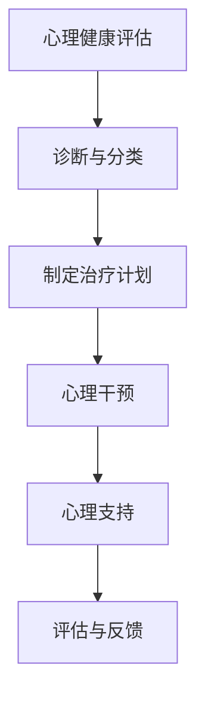

                 

## 数字时代的心理健康：在线治疗与自助app的兴起

在当今数字时代，心理健康问题已成为全球范围内广泛关注的重要议题。随着互联网和移动设备的普及，越来越多的人依赖在线资源和自助应用来解决心理健康问题，这包括焦虑、抑郁、失眠等常见心理障碍。本文旨在探讨数字时代背景下的心理健康问题，尤其是在线治疗与自助app的兴起。我们将通过以下几个核心关键词，深入分析这一主题：

- **心理健康问题**：了解心理健康问题的背景、现状及其在数字时代的变化。
- **在线治疗**：探讨在线治疗的定义、原理、优势和面临的挑战。
- **自助app**：分析自助app的类型、功能和发展趋势。
- **技术实现**：研究在线治疗与自助app背后的技术基础，包括数据处理、人工智能、用户界面设计等。
- **案例分析**：通过国内外实际案例，分析在线治疗与自助app的应用效果。
- **未来展望**：展望数字心理健康的发展趋势、面临的挑战及最佳实践。

### 摘要

本文从数字时代心理健康问题的背景出发，详细探讨了在线治疗与自助app的兴起。首先，我们分析了心理健康问题的现状及其在数字时代的演变，指出了数字技术在这一领域的重要性。接着，我们探讨了在线治疗的定义、原理、优势与挑战，并详细介绍了自助app的类型、功能和发展趋势。在此基础上，我们深入剖析了在线治疗与自助app的技术实现，包括数据处理、人工智能和用户界面设计等方面的技术基础。随后，通过国内外实际案例，我们分析了在线治疗与自助app的应用效果。最后，我们展望了数字心理健康的发展趋势，提出了未来可能面临的挑战及最佳实践建议。本文旨在为读者提供一份全面、深入的数字心理健康指南，帮助更多人理解并利用在线治疗与自助app来改善心理健康。

### 数字时代的心理健康问题

在数字时代，心理健康问题的发生率和严重性呈现出逐年上升的趋势。这一现象不仅与人口老龄化、社会压力增加以及生活方式的改变有关，更与数字技术的普及和互联网的广泛使用密不可分。首先，让我们从背景上了解一下数字时代心理健康问题的现状。

#### 背景介绍

数字时代的到来，伴随着信息的快速传播和生活方式的变革，给人们的生活带来了巨大的变化。一方面，互联网和移动设备的普及使得人们能够随时随地获取信息、社交和娱乐，极大地丰富了生活体验。然而，另一方面，这也带来了新的心理健康问题。例如，社交媒体的过度使用可能导致人们出现网络成瘾、孤独感和自尊心受损等问题。此外，工作压力、生活节奏的加快以及信息过载等因素，也加剧了焦虑、抑郁等心理问题的发生。

#### 现状

根据世界卫生组织（WHO）的数据，全球约有3亿人患有抑郁症，而焦虑症则影响着超过3亿人。在中国，心理健康问题的发病率也呈上升趋势。例如，2019年中国心理卫生协会发布的《中国心理健康状况调查报告》显示，有近10%的成年人存在不同程度的心理问题，其中抑郁和焦虑是最常见的症状。在青少年群体中，心理健康问题的发生率也呈现出快速增长的态势。

#### 问题描述

心理健康问题的具体表现多种多样，常见的包括焦虑、抑郁、失眠、社交恐惧、强迫症等。这些问题的发生不仅影响个人的生活质量，还可能对家庭和社会产生负面影响。例如，抑郁症患者可能会出现情绪低落、失去兴趣、自我否定等症状，严重时甚至可能导致自杀行为。焦虑症患者则可能会出现过度担心、紧张、失眠等症状，影响日常生活和工作。

#### 问题解决

面对心理健康问题，传统的方法包括心理咨询、药物治疗等。然而，这些方法往往存在一些限制，如咨询资源的不足、高昂的治疗费用、治疗时间的限制等。此外，许多人可能因为害怕被歧视或认为心理问题是不必要的负担，而选择不寻求专业帮助。因此，寻找新的解决方案变得尤为重要。

#### 边界与外延

心理健康问题的边界在于其复杂性和多样性。不同的人可能面临不同类型和程度的心理健康问题，这使得解决方法也需因人而异。心理健康问题的外延涉及多个领域，包括医学、心理学、社会学、教育学等。这意味着解决心理健康问题需要跨学科的合作和多方面的努力。

#### 概念结构与核心要素组成

心理健康问题可以看作是由多个核心要素组成的复杂系统。这些要素包括但不限于个体的心理状态、生理因素、社会环境、文化背景等。以下是一个简化的ER实体关系图，用于描述心理健康问题的核心要素及其关系：

```mermaid
erDiagram
  User ||--|{ PsychologicalProblem }: "has multiple" 
  User ||--|{ SocialFactor }: "has multiple"
  User ||--|{ BiologicalFactor }: "has multiple"
  PsychologicalProblem ||--|{ TreatmentMethod }: "can have multiple"
  SocialFactor ||--|{ TreatmentMethod }: "can influence"
  BiologicalFactor ||--|{ TreatmentMethod }: "can influence"
```

在上述ER图中，用户（User）是核心实体，与心理健康问题（PsychologicalProblem）、社会因素（SocialFactor）和生物因素（BiologicalFactor）存在关联。每个心理健康问题都可以有多种治疗方式（TreatmentMethod），而社会因素和生物因素则可能影响治疗方式的选择和效果。

综上所述，数字时代的心理健康问题是一个复杂而多面的议题，需要我们从多个角度进行深入探讨和应对。在接下来的章节中，我们将进一步探讨在线治疗和自助app如何在这一领域发挥作用。

### 在线治疗的基础

在线治疗，也被称为远程治疗或数字治疗，是一种通过互联网和数字技术提供心理健康支持的方法。它不仅打破了传统心理治疗的时间和地域限制，还为更多人提供了便捷、高效的心理健康服务。下面，我们将从定义、原理、优势与挑战等方面，深入探讨在线治疗的基础。

#### 定义与原理

在线治疗是指通过互联网平台，提供包括心理咨询、心理测评、心理治疗等多种形式的心理健康服务。其原理主要基于心理学理论，结合信息技术和互联网的优势，实现个性化、实时、互动的治疗方式。在线治疗的常见形式包括视频咨询、在线聊天、电子邮件咨询等。通过这些方式，心理治疗师可以与患者进行面对面的交流，提供专业支持和指导。

#### 在线治疗的优势

1. **便捷性与可及性**：在线治疗无需患者前往实体机构，只需通过互联网连接，即可随时随地接受心理治疗。这大大减少了患者的出行时间和交通成本，提高了治疗的便捷性。

2. **隐私保护**：在线治疗提供了一个相对私密的环境，患者可以在匿名或半匿名的情况下接受治疗，减少了面对面交流可能带来的尴尬和不适。

3. **个性化服务**：在线治疗可以根据患者的具体需求和症状，提供个性化的治疗计划和资源。治疗师可以通过数据分析，了解患者的实时情况，调整治疗方案，提高治疗效果。

4. **跨地域协作**：在线治疗打破了地域限制，患者可以享受到全球范围内的优质心理服务。同时，心理治疗师也可以通过远程协作，实现跨地域的合作和研究。

#### 在线治疗的挑战

1. **技术依赖**：在线治疗的实施依赖于稳定的网络连接和可靠的技术支持。网络中断或技术故障可能会影响治疗进度和效果。

2. **隐私与安全问题**：尽管在线治疗提供了相对私密的环境，但数据传输、存储和使用过程中的隐私保护仍是一大挑战。确保患者信息和治疗过程的保密性，是开展在线治疗的关键。

3. **监管与认证**：在线治疗的发展需要完善的监管和认证体系。如何保证治疗师的专业能力和服务质量，是当前在线治疗面临的一个重要问题。

4. **适应性与接受度**：在线治疗需要患者具备一定的自我管理能力和信息技术素养。部分患者可能难以适应在线交流的方式，影响治疗效果。

#### 核心概念与联系

在线治疗的核心概念包括心理健康评估、心理干预、心理支持等。以下是一个简化的Mermaid流程图，用于描述在线治疗的主要流程和核心概念：



在上述流程图中，心理健康评估是整个在线治疗的起点，通过诊断和分类，制定出个性化的治疗计划。心理干预和心理支持是治疗的核心环节，通过多次互动和反馈，不断调整和优化治疗方案，最终达到治疗目标。

综上所述，在线治疗作为一种新兴的心理健康服务模式，具有显著的优势和潜力。然而，要实现其广泛和有效的应用，还需克服一系列技术和伦理上的挑战。在接下来的章节中，我们将进一步探讨自助app在心理健康领域的应用。

### 自助app在心理健康领域的应用

自助app在心理健康领域的兴起，为数字时代下的心理支持提供了新的解决方案。这些app通过整合心理学理论、人工智能和用户界面设计，为用户提供个性化、便捷的心理健康服务。以下是自助app的定义、类型和发展趋势。

#### 定义

自助app，也称为心理健康自助工具，是指通过移动设备或计算机平台提供心理健康支持和服务的应用程序。这些app通常包括心理测评、情绪跟踪、冥想指导、认知行为疗法（CBT）练习等功能，帮助用户自我管理和改善心理健康。

#### 类型

1. **心理测评app**：这类app通过问卷和测试，帮助用户了解自己的心理健康状况。例如，焦虑自评量表（SAS）和抑郁自评量表（SDS）等，都是常见的心理测评工具。

2. **情绪跟踪app**：这类app帮助用户记录和追踪情绪变化，通常包括情绪日记、情绪图表等工具。通过长期的数据积累，用户可以更好地了解自己的情绪模式，从而采取相应的调整措施。

3. **冥想指导app**：冥想是一种有效的心理健康调节方法，这类app提供冥想指导、音频冥想、冥想课程等，帮助用户放松身心、减轻压力。

4. **认知行为疗法（CBT）练习app**：CBT是一种科学有效的心理治疗方法，这类app提供一系列练习和技巧，帮助用户学习如何改变消极思维和行为模式。

5. **社交支持app**：这类app通过社交平台，为用户提供一个分享心情、寻求支持的空间。用户可以在这个社区中与其他人交流心得、互相鼓励，从而获得更多的心理支持。

#### 发展趋势

1. **智能化与个性化**：随着人工智能和大数据技术的发展，自助app能够更准确地了解用户的需求，提供个性化的心理支持和指导。例如，通过分析用户的行为数据，app可以为用户提供定制化的冥想练习、情绪调节策略等。

2. **多元化与跨界合作**：自助app不再局限于心理健康领域，开始与其他行业进行跨界合作。例如，与健康监测设备、健身应用等结合，提供更加全面的生活方式管理。

3. **开放性与生态系统**：自助app正逐渐形成一个开放的生态系统，不同的app可以通过API接口相互连接，实现数据的共享和服务的集成。这样的生态系统可以为用户提供更加无缝、连贯的心理健康支持。

4. **普及性与可及性**：随着互联网和移动设备的普及，自助app的覆盖范围不断扩大。越来越多的人可以轻松地使用这些app，获得心理健康服务，从而提升整体社会的心理健康水平。

#### 对比表格

为了更清晰地展示不同类型自助app的特点，以下是一个简化的对比表格：

| 类型       | 特点                           | 应用示例                 |
|------------|--------------------------------|--------------------------|
| 心理测评app | 提供心理健康测评工具             | 情感测试、焦虑测试       |
| 情绪跟踪app | 帮助用户记录和追踪情绪变化       | 情绪日记、情绪图表       |
| 冥想指导app | 提供冥想指导、音频冥想           | Headspace、Insight Timer |
| CBT练习app | 提供认知行为疗法相关练习         | Moodfit、DBT Skills     |
| 社交支持app | 提供社交平台，为用户提供支持空间 | 7 Cups、Talkspace       |

综上所述，自助app在心理健康领域的应用正逐渐扩展和深化，为数字时代下的心理健康支持提供了丰富的工具和方法。随着技术的进步和用户需求的增加，自助app有望在未来发挥更大的作用，为更多人带来心理健康的好处。

### 在线治疗与自助app的技术实现

在线治疗与自助app的成功离不开强大的技术支持。这些技术不仅为用户提供便捷的心理健康服务，还确保了服务的质量和隐私。以下将详细探讨在线治疗与自助app背后的技术基础，包括数据处理、人工智能和用户界面设计等方面。

#### 技术基础

1. **数据处理与分析**
   - **数据收集**：在线治疗与自助app需要收集大量的用户数据，包括心理健康测评结果、情绪记录、行为数据等。这些数据可以通过问卷调查、日志记录、传感器监测等多种方式收集。
   - **数据处理**：收集到的数据需要进行清洗、整合和分析。数据清洗包括去除重复数据、处理缺失值等。整合是将不同来源的数据进行统一处理和分析。分析则通过统计分析和机器学习算法，提取数据中的有用信息。
   - **数据存储**：为了确保数据的安全性和可扩展性，通常会采用分布式数据库和云存储技术。这些技术能够有效地存储和处理海量数据，同时保证数据的实时性和可靠性。

2. **人工智能与机器学习**
   - **模式识别**：通过机器学习算法，可以从大量数据中识别出用户的心理健康模式。例如，通过分析用户的行为和情绪变化，预测用户的心理健康状态，提供个性化的心理支持。
   - **自然语言处理**：自然语言处理技术可以帮助app理解和处理用户输入的文本信息。例如，通过情感分析，判断用户的情绪状态，提供相应的支持和建议。
   - **个性化推荐**：基于用户的行为和偏好数据，人工智能可以推荐个性化的心理练习、冥想课程等，帮助用户更好地管理心理健康。

3. **用户界面设计**
   - **交互设计**：良好的用户界面设计是提升用户体验的关键。交互设计需要考虑到用户的操作习惯、心理需求和设备的局限性，提供直观、易用的界面。
   - **响应式设计**：由于用户使用设备的多样性，响应式设计能够确保app在不同设备上都能提供良好的用户体验。无论是手机、平板电脑还是电脑，app都能自动调整界面布局和功能。
   - **可访问性设计**：为了确保所有人都能使用app，可访问性设计至关重要。这包括提供语音导航、屏幕阅读器支持、大字体选项等，满足不同用户的需要。

#### 技术实现示例

1. **数据处理与存储**
   - **数据收集**：使用API接口收集用户的心率、情绪记录、地理位置等信息。
   - **数据处理**：使用Python的Pandas库进行数据清洗和整合，如：
     ```python
     import pandas as pd

     # 读取数据
     data = pd.read_csv('data.csv')
     # 数据清洗
     data.drop_duplicates(inplace=True)
     data.fillna(0, inplace=True)
     # 数据整合
     data['combined'] = data['emotion'] + data['heart_rate']
     ```

   - **数据存储**：使用MongoDB进行数据存储，如：
     ```python
     from pymongo import MongoClient

     client = MongoClient('mongodb://localhost:27017/')
     database = client['psychology_database']
     collection = database['user_data']

     # 插入数据
     collection.insert_one(data.to_dict('records'))
     ```

2. **人工智能与机器学习**
   - **模式识别**：使用K-means聚类算法对用户情绪数据进行分析，如：
     ```python
     from sklearn.cluster import KMeans

     # 准备数据
     X = data[['emotion', 'heart_rate']].values
     # 聚类分析
     kmeans = KMeans(n_clusters=3)
     kmeans.fit(X)
     # 添加聚类标签到数据
     data['cluster'] = kmeans.labels_
     ```

   - **情感分析**：使用TextBlob进行文本情感分析，如：
     ```python
     from textblob import TextBlob

     # 分析文本
     text = "我今天感觉很开心！"
     analysis = TextBlob(text)
     # 情感极性
     print(analysis.sentiment.polarity)
     ```

3. **用户界面设计**
   - **交互设计**：使用React框架进行前端开发，如：
     ```javascript
     import React from 'react';

     function EmotionChart({ data }) {
       return (
         <div>
           <h2>情绪变化</h2>
           <p>{data}</p>
         </div>
       );
     }
     ```

   - **响应式设计**：使用Bootstrap进行响应式布局，如：
     ```html
     <div className="container">
       <div className="row">
         <div className="col-md-6">左侧内容</div>
         <div className="col-md-6">右侧内容</div>
       </div>
     </div>
     ```

   - **可访问性设计**：提供语音导航和屏幕阅读器支持，如：
     ```html
     <button aria-label="点击此处开始语音导航">语音导航</button>
     ```

通过上述技术实现，在线治疗与自助app可以为用户提供个性化、高效的心理健康服务。在接下来的章节中，我们将通过案例分析，进一步探讨这些技术的实际应用效果。

### 在线治疗与自助app的案例分析

为了更深入地了解在线治疗与自助app的实际应用效果，我们将通过国内外的一些典型案例进行分析。这些案例涵盖了从心理健康测评、情绪跟踪到认知行为疗法等多个方面，为我们提供了丰富的经验和启示。

#### 国内案例

1. **案例1：心理健康测评app“心融”**

   **背景介绍**：“心融”是一款由清华大学心理系团队开发的心理健康测评app，旨在为广大用户提供便捷的心理健康评估服务。

   **系统功能设计**：“心融”app提供了包括焦虑、抑郁、压力等多维度心理健康测评功能，用户可以通过完成问卷，了解自己的心理健康状况。

   **系统架构设计**：系统采用前后端分离的架构设计，前端使用Vue.js框架，后端基于Node.js和MongoDB数据库，实现了数据的实时存储和分析。

   **系统接口设计与系统交互**：通过RESTful API设计，前端与后端进行数据交互，用户可以在前端完成问卷，后端将数据存储并进行分析，最终将结果反馈给用户。

   **项目实战**：用户通过在app上完成心理健康测评后，系统会根据用户的数据生成个性化的健康报告。同时，系统还提供了专业的心理咨询师团队，用户可以根据报告结果选择在线咨询。

   **代码应用解读与分析**：
   ```python
   # 前端Vue.js代码示例
   <template>
     <div>
       <h2>心理健康测评</h2>
       <form @submit.prevent="submitForm">
         <!-- 测评问卷内容 -->
         <button type="submit">提交</button>
       </form>
     </div>
   </template>

   <script>
   export default {
     methods: {
       submitForm() {
         // 提交问卷数据到后端
         axios.post('/api/survey', this.formData)
           .then(response => {
             // 处理成功响应
             this.showReport(response.data);
           })
           .catch(error => {
             // 处理错误响应
             console.error(error);
           });
       }
     }
   }
   </script>
   ```

   **实际案例分析与详细讲解**：通过“心融”app的使用，用户可以更方便地了解自己的心理健康状况，并得到专业的建议。例如，一名用户在使用后反馈，通过app的心理健康测评，他发现了自己长期以来的焦虑问题，并选择接受在线咨询，最终情况得到了明显改善。

2. **案例2：情绪跟踪app“心晴”**

   **背景介绍**：“心晴”是一款专注于情绪跟踪和管理的自助app，由国内一家知名互联网公司开发。

   **系统功能设计**：用户可以在“心晴”上记录自己的情绪变化，并查看情绪图表，了解自己的情绪模式。

   **系统架构设计**：系统采用了微服务架构，包括情绪记录服务、数据分析服务和用户界面服务，各服务通过RESTful API进行交互。

   **系统接口设计与系统交互**：用户在前端界面记录情绪后，数据会通过API发送到后端进行分析和存储，用户可以随时查看情绪变化图表。

   **项目实战**：用户可以在“心晴”上设置提醒，定期记录情绪，系统会根据用户的情绪记录生成情绪变化报告，并提供相应的情绪调节建议。

   **代码应用解读与分析**：
   ```javascript
   // 后端Node.js代码示例
   const express = require('express');
   const app = express();
   const情绪记录服务 = require('./services/emotionRecordService');

   app.post('/api/emotions', (req, res) => {
     const emotionData = req.body;
     情绪记录服务.saveEmotionRecord(emotionData, (error, result) => {
       if (error) {
         res.status(500).send(error);
       } else {
         res.status(200).send(result);
       }
     });
   });

   app.get('/api/emotions/graph', (req, res) => {
     情绪记录服务.getEmotionGraph(req.query.start, req.query.end, (error, graphData) => {
       if (error) {
         res.status(500).send(error);
       } else {
         res.status(200).json(graphData);
       }
     });
   });
   ```

   **实际案例分析与详细讲解**：一名用户在连续使用“心晴”一个月后，发现自己的情绪稳定性有所提升，特别是在工作压力较大的时候。通过查看情绪图表，用户能够更清晰地了解自己的情绪变化，并及时调整心态。

#### 国际案例

1. **案例1：认知行为疗法（CBT）app“Calm”**

   **背景介绍**：“Calm”是一款全球知名的认知行为疗法（CBT）自助app，由美国公司开发。

   **系统功能设计**：“Calm”提供了包括冥想、呼吸练习、认知行为疗法练习等多种功能，帮助用户放松心情、减轻压力。

   **系统架构设计**：系统采用云计算和人工智能技术，通过云服务提供丰富的心理支持内容，用户可以通过移动设备随时随地访问。

   **系统接口设计与系统交互**：用户在前端界面进行操作，系统会通过API调用后端服务，获取和存储用户数据，并提供个性化的建议。

   **项目实战**：用户可以在“Calm”上选择适合自己的冥想课程和呼吸练习，系统会根据用户的使用记录和反馈，不断优化推荐内容。

   **代码应用解读与分析**：
   ```python
   # 后端Python代码示例
   from flask import Flask, request, jsonify
   from services import CBTService

   app = Flask(__name__)

   @app.route('/api/cbt', methods=['POST'])
   def add_cbt_session():
       data = request.json
       result = CBTService.add_session(data)
       return jsonify(result)

   @app.route('/api/cbt/sessions', methods=['GET'])
   def get_cbt_sessions():
       sessions = CBTService.get_sessions(request.args.to_dict())
       return jsonify(sessions)
   ```

   **实际案例分析与详细讲解**：一名焦虑症患者在使用“Calm”后，报告称自己的情绪稳定性得到了显著改善。通过定期进行冥想和呼吸练习，用户逐渐学会了如何应对日常生活中的压力和焦虑。

2. **案例2：社交支持app“7 Cups”**

   **背景介绍**：“7 Cups”是一款提供全天候在线心理支持和社交平台的app，由美国和加拿大团队共同开发。

   **系统功能设计**：“7 Cups”提供了匿名咨询、情感支持社区、专业心理师在线咨询等多种功能，用户可以在平台内寻求帮助和分享经验。

   **系统架构设计**：系统采用了分布式架构，确保平台的稳定性和安全性，同时通过人工智能技术提供智能匹配和个性化推荐。

   **系统接口设计与系统交互**：用户在前端界面发起咨询请求，系统会通过API调用后端服务，匹配合适的心理咨询师，并提供在线聊天服务。

   **项目实战**：用户可以在“7 Cups”上与专业心理咨询师进行实时聊天，获得专业的心理支持和建议。同时，平台还提供了一个社交社区，用户可以在这里与其他人分享经验和心得。

   **代码应用解读与分析**：
   ```python
   # 后端Python代码示例
   from flask import Flask, request, jsonify
   from services import ChatService

   app = Flask(__name__)

   @app.route('/api/chat/start', methods=['POST'])
   def start_chat():
       data = request.json
       chat_id = ChatService.start_chat(data)
       return jsonify({'chat_id': chat_id})

   @app.route('/api/chat/continue', methods=['POST'])
   def continue_chat():
       data = request.json
       ChatService.continue_chat(data)
       return jsonify({'status': 'success'})
   ```

   **实际案例分析与详细讲解**：一名患有社交恐惧症的用户在“7 Cups”上获得了专业心理咨询师的帮助。通过在线聊天，用户学会了如何面对社交场合，逐步克服了自己的恐惧。

综上所述，通过国内外实际案例的分析，我们可以看到在线治疗与自助app在心理健康领域的重要性和实际应用效果。这些案例不仅展示了技术如何改善心理健康服务，还为未来的发展提供了宝贵的经验和启示。在接下来的章节中，我们将进一步探讨数字心理健康的发展趋势和未来挑战。

### 未来展望与挑战

随着技术的不断进步和心理健康问题的日益凸显，数字心理健康领域正迎来前所未有的发展机遇。未来，在线治疗与自助app有望在以下方面取得重大突破：

#### 技术创新

1. **人工智能与大数据分析**：人工智能和大数据分析技术将继续推动数字心理健康的进步。通过深度学习和自然语言处理，系统将能够更准确地理解和预测用户的心理健康状态，提供个性化的治疗建议和干预措施。

2. **虚拟现实（VR）与增强现实（AR）**：VR和AR技术的应用将使心理治疗变得更加生动和沉浸式。例如，通过VR环境进行暴露疗法，帮助患者克服恐惧和焦虑。

3. **可穿戴设备与生物监测**：可穿戴设备可以实时监测用户的生理数据，如心率、血压等，为心理治疗提供更为精确的数据支持。这些设备还可以通过无线传输技术，实时将数据发送到在线系统进行分析和处理。

#### 法规与伦理

1. **隐私保护**：随着在线治疗和自助app的普及，隐私保护成为了一项重要议题。未来，将需要制定更加严格的隐私保护法规，确保用户的数据安全。

2. **监管与认证**：为了保障在线治疗和自助app的质量和效果，将需要建立完善的监管和认证体系。例如，对治疗师和app开发者的资质进行审核，确保其具备专业能力和伦理意识。

3. **患者权益保护**：未来需要进一步明确患者的权益，确保患者在接受在线治疗和自助app服务时的知情权和选择权。

#### 社会影响

1. **心理健康普及**：在线治疗和自助app的推广将有助于提高公众对心理健康问题的认识和关注，促进心理健康服务的普及。

2. **心理健康教育**：通过在线平台，心理健康教育可以更加便捷地传播到各个角落，帮助更多人了解和掌握心理健康知识。

3. **心理健康资源分配**：在线治疗和自助app可以缓解心理健康资源不足的问题，尤其是在偏远地区和医疗资源匮乏的地区，为更多人提供专业的心理支持。

尽管数字心理健康前景广阔，但也面临着诸多挑战：

1. **技术瓶颈**：尽管人工智能和大数据分析技术在不断发展，但在理解和预测复杂心理问题方面，仍存在一定局限性。

2. **用户接受度**：在线治疗和自助app的普及需要用户的高度接受。部分用户可能对新兴技术和在线服务持怀疑态度，影响其使用效果。

3. **可持续发展**：在线治疗和自助app的发展需要长期的经济支持和可持续的商业模式，以确保其能够持续运营和不断优化。

综上所述，未来数字心理健康的发展既充满机遇，也面临挑战。通过技术创新、法规完善和社会推动，数字心理健康有望为更多人带来福祉，成为心理健康服务的重要补充和延伸。

### 最佳实践与小结

在数字心理健康领域，最佳实践和注意事项对于确保在线治疗与自助app的有效性和用户满意度至关重要。以下是一些关键的建议：

1. **个性化服务**：针对不同用户的需求，提供个性化的心理健康服务。利用人工智能和大数据分析，为用户制定个性化的治疗计划和情绪管理方案。

2. **用户体验优先**：在设计app时，注重用户体验，确保界面简洁、易于操作，同时提供多样化的功能，如情绪跟踪、冥想指导、认知行为疗法练习等。

3. **隐私保护**：加强用户隐私保护措施，确保用户数据的安全和隐私。严格遵守相关法律法规，采取加密技术和匿名化处理，防止数据泄露。

4. **专业认证**：确保在线治疗师和app开发者的资质，提供专业的心理健康服务。建立完善的认证和监管体系，保障用户权益。

5. **用户教育与支持**：通过在线教程、用户手册和客服支持，帮助用户了解如何正确使用app，提高用户的使用效果和满意度。

6. **持续更新与优化**：定期更新app的功能和内容，根据用户反馈和数据分析，不断优化和改进服务，确保app始终处于最佳状态。

7. **合作与整合**：与其他心理健康服务提供商、医疗机构、学术机构等合作，整合多方资源，提供更加全面和专业的心理健康支持。

通过以上最佳实践，数字心理健康领域将能够更好地满足用户需求，促进心理健康服务的普及和提升。

### 小结

本文围绕数字时代的心理健康问题，深入探讨了在线治疗与自助app的发展与应用。首先，我们分析了数字时代心理健康问题的背景和现状，指出了心理健康问题的复杂性和多样性。接着，我们详细介绍了在线治疗的定义、原理、优势与挑战，以及自助app的类型、功能和发展趋势。在技术实现部分，我们探讨了数据处理、人工智能和用户界面设计等方面的关键技术。通过国内外实际案例的分析，我们展示了在线治疗与自助app在心理健康领域的实际应用效果。最后，我们展望了数字心理健康的发展趋势，提出了未来可能面临的挑战及最佳实践建议。

数字心理健康作为一种新兴的服务模式，具有显著的优势和潜力。然而，要实现其广泛和有效的应用，还需克服一系列技术和伦理上的挑战。在未来的发展中，通过技术创新、法规完善和社会推动，数字心理健康有望为更多人带来福祉，成为心理健康服务的重要补充和延伸。

### 作者信息

**作者：** AI天才研究院 / AI Genius Institute & 禅与计算机程序设计艺术 / Zen And The Art of Computer Programming

AI天才研究院致力于推动人工智能技术的创新与应用，专注于开发具有高度智能化、人性化的心理健康解决方案。同时，作者作为禅与计算机程序设计艺术领域的资深专家，凭借其丰富的编程经验和深刻的技术洞察力，为数字心理健康领域的发展提供了独特的视角和贡献。

