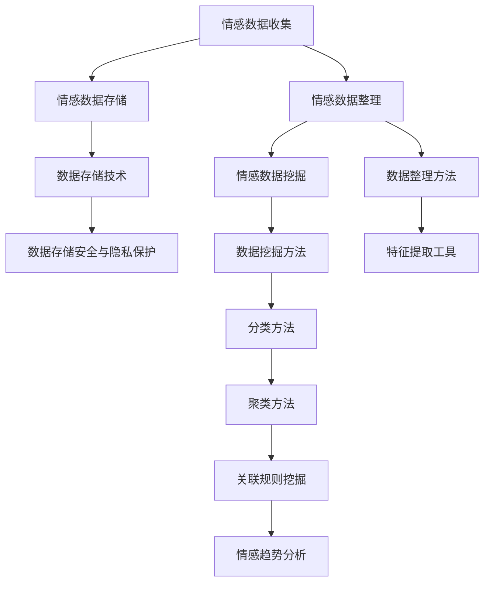
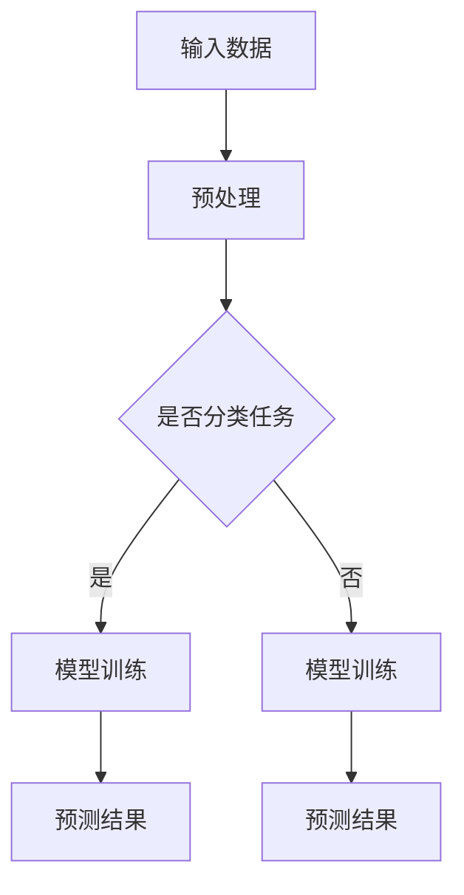
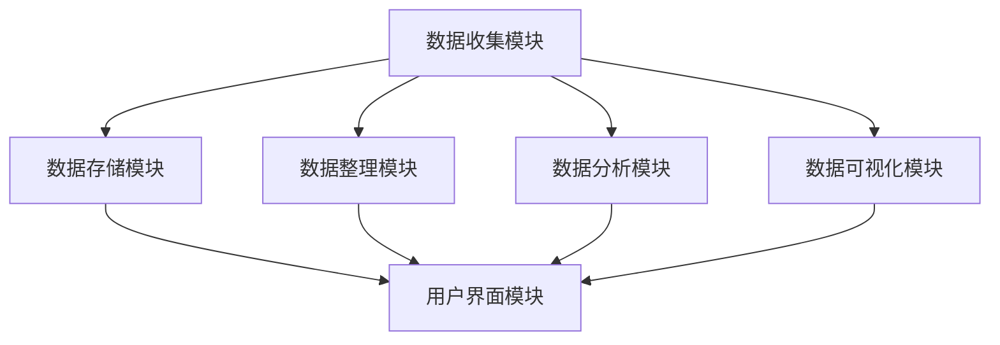

                 

### 引言：数字时代情感档案馆的兴起

在数字时代，数据已经成为社会运转的命脉，而情感数据作为一种独特且宝贵的信息资源，正日益受到各界的关注。情感档案馆，顾名思义，是专门用于存储和管理情感数据的数字系统。随着人工智能（AI）技术的飞速发展，情感档案馆的功能得到了极大的扩展和提升。AI不仅能够高效地处理海量情感数据，还能够通过智能分析，帮助人们更好地整理和保存个人回忆。

#### 什么是情感数据？

情感数据是指与人的情感体验相关的数据，如情绪、感受、偏好等。这些数据可以来自各种渠道，包括文本、语音、图像、视频等。随着互联网和智能设备的普及，我们每天都会产生大量的情感数据。例如，社交媒体上的点赞、评论，电子邮件中的情感表达，甚至是我们与智能助手的对话记录，都蕴含着丰富的情感信息。

#### 情感数据的重要性

情感数据的重要性体现在多个方面。首先，它有助于我们更好地了解自身和他人的情感状态，从而促进个人成长和人际关系的改善。其次，情感数据在商业、医疗、教育等领域也有着广泛的应用。例如，在市场营销中，情感数据分析可以帮助企业更好地理解消费者需求，从而制定更精准的营销策略。在医疗领域，情感数据分析可以辅助诊断和治疗方案的设计。在教育领域，情感数据可以帮助教师更好地了解学生状态，提供个性化教学。

#### AI辅助个人回忆整理与保存的基本原理

AI技术，尤其是机器学习和深度学习算法，能够对情感数据进行分析和处理，从而实现个人回忆的整理与保存。以下是一些基本原理：

1. **数据收集与预处理**：AI首先需要收集个人情感数据，并对这些数据进行预处理，包括数据清洗、去噪、格式化等，以确保数据的质量和一致性。

2. **情感识别与分析**：通过机器学习和深度学习算法，AI可以自动识别和分析情感数据中的情感特征。例如，利用自然语言处理（NLP）技术，AI可以分析文本数据中的情感倾向和情感强度。

3. **情感数据存储与管理**：AI技术能够高效地存储和管理大量的情感数据。例如，使用分布式数据库和云存储技术，可以实现情感数据的持久化存储和快速访问。

4. **个人回忆整理与可视化**：通过情感分析结果，AI可以帮助用户整理和可视化个人回忆，使其更易于理解和回顾。例如，利用数据可视化工具，将情感数据转化为图表、图像等形式，让用户可以直观地看到自己的情感变化。

#### 情感数据收集与整理的挑战

尽管AI技术为情感档案馆的建设提供了强有力的支持，但在实际应用中仍然面临一些挑战：

1. **数据质量**：情感数据质量参差不齐，如何保证数据的质量和一致性，是一个亟待解决的问题。

2. **数据隐私**：情感数据往往涉及到个人的隐私，如何保护数据隐私，防止数据泄露，是情感档案馆建设中的关键问题。

3. **算法透明性**：AI算法的透明性较低，用户难以理解算法的决策过程，这对算法的信任度和应用范围造成了限制。

4. **情感识别准确性**：情感识别的准确性直接影响个人回忆的整理效果，提高识别准确性是当前的研究热点。

#### 本章小结

本章介绍了数字时代情感档案馆的概念、重要性以及AI辅助个人回忆整理与保存的基本原理。我们探讨了情感数据的概念、重要性以及在AI辅助下的处理方法。同时，我们也指出了情感数据收集与整理过程中面临的一些挑战。在接下来的章节中，我们将进一步深入探讨情感数据收集、存储、整理与挖掘的方法，以及AI辅助下的具体实现。通过一步步的分析和讲解，希望能够帮助读者更好地理解和应用情感档案馆技术。

## 第1章: 数字时代的情感档案馆概述

### 1.1 数字时代的情感档案馆概念

在数字时代，情感档案馆是一个专门用于存储和管理情感数据的数字系统。它不同于传统的文档管理或数据库系统，情感档案馆的焦点在于捕捉、存储和利用情感信息，以实现对个人或群体情感状态的理解和预测。情感数据是情感档案馆的核心，这些数据通常包括情绪、情感表达、偏好、反应等，可以来源于文本、语音、图像、视频等多种形式。

数字时代的情感档案馆具有以下几个显著特征：

1. **数据的多样性和复杂性**：情感数据来源广泛，形式多样，不仅包括文字，还涵盖了音频、视频和图像等多种类型。这种多样性增加了数据处理的复杂性，但同时也为情感分析提供了丰富的素材。

2. **海量数据的处理能力**：数字时代的情感档案馆需要处理海量数据，这要求系统具备强大的数据处理和分析能力。现代分布式计算和云计算技术为情感档案馆提供了技术支持，使其能够高效地处理和分析大量数据。

3. **高精度和实时性**：随着人工智能技术的进步，情感档案馆的精度和实时性得到了显著提升。通过机器学习和深度学习算法，情感档案馆可以快速准确地分析情感数据，并提供实时的情感分析和预测。

4. **交互性和个性化**：情感档案馆不仅仅是数据的存储工具，它还具备与用户互动的能力。通过智能化的界面设计，用户可以轻松地访问和管理自己的情感数据，并获得个性化的情感分析和建议。

### 1.2 情感数据的重要性

情感数据的重要性体现在其广泛的应用领域和深远的潜在影响。以下是情感数据的一些关键作用：

1. **个人心理健康**：情感数据可以帮助个人了解自己的情绪变化和心理状态，从而更好地管理情绪，预防心理疾病。通过定期回顾和分析情感数据，个人可以发现自己的情感模式和潜在问题，并采取相应的措施进行调适。

2. **社会研究**：情感数据为社会科学研究提供了丰富的素材。例如，通过分析社交媒体上的情感数据，研究人员可以了解公众对某个事件或话题的情感反应，为政策制定和社会治理提供依据。

3. **商业决策**：在商业领域，情感数据对于市场分析、产品开发和客户关系管理至关重要。企业可以通过分析消费者的情感数据，了解消费者的需求和偏好，从而制定更有效的营销策略和产品设计。

4. **医疗健康**：在医疗领域，情感数据可以帮助医生了解患者的心理状态，为心理疾病的治疗提供参考。同时，情感数据还可以用于监测患者的情绪变化，及时发现潜在的健康风险。

5. **教育领域**：在教育领域，情感数据可以帮助教师了解学生的学习状态和情感需求，从而提供个性化的教学和支持。通过分析学生的情感数据，教育者可以优化教学方法和课程设计，提高教学效果。

### 1.3 AI辅助个人回忆整理与保存的基本原理

随着人工智能技术的不断发展，AI在情感数据处理和整理中发挥着越来越重要的作用。以下是AI辅助个人回忆整理与保存的基本原理：

1. **情感识别**：AI通过机器学习和深度学习算法，可以自动识别和分析情感数据中的情感特征。例如，自然语言处理技术可以帮助AI理解文本中的情感倾向和情感强度，图像识别技术可以帮助AI识别图像中的情感表达。

2. **数据预处理**：在情感数据收集过程中，AI可以自动化地进行数据预处理，包括数据清洗、去噪、格式化等。这确保了数据的准确性和一致性，为后续的情感分析奠定了基础。

3. **情感数据分析**：通过情感识别和分析，AI可以提取情感数据中的关键信息，并进行深入分析。例如，AI可以分析情感数据中的情绪变化趋势，识别情感爆发点等。

4. **数据存储与管理**：AI技术可以帮助高效地存储和管理情感数据。使用分布式数据库和云存储技术，情感数据可以大规模、安全地存储和快速访问。此外，AI还可以根据用户需求，提供情感数据的个性化管理和推荐。

5. **情感数据可视化**：通过数据可视化技术，AI可以将情感数据转化为直观的图表、图像等形式，帮助用户更好地理解和回顾个人回忆。

### 1.4 情感数据收集与整理的挑战

尽管AI技术在情感数据处理中具有巨大的潜力，但在实际应用中仍然面临一些挑战：

1. **数据质量**：情感数据质量参差不齐，存在噪声和错误。如何确保数据的质量和一致性，是一个重要的挑战。

2. **数据隐私**：情感数据涉及到个人隐私，如何保护数据隐私，防止数据泄露，是情感档案馆建设中的关键问题。

3. **算法透明性**：AI算法的决策过程往往不够透明，用户难以理解算法的决策依据，这可能会影响算法的信任度和应用范围。

4. **情感识别准确性**：情感识别的准确性直接影响个人回忆的整理效果。提高识别准确性是当前研究的重点。

5. **技术复杂性**：情感数据处理涉及多种技术，包括自然语言处理、图像识别、深度学习等，技术复杂性较高，对技术团队的要求也较高。

### 1.5 本章小结

本章介绍了数字时代情感档案馆的概念、重要性以及AI辅助个人回忆整理与保存的基本原理。我们探讨了情感数据的概念、重要性以及在AI辅助下的处理方法。同时，我们也指出了情感数据收集与整理过程中面临的一些挑战。在接下来的章节中，我们将进一步深入探讨情感数据收集、存储、整理与挖掘的方法，以及AI辅助下的具体实现。通过一步步的分析和讲解，希望能够帮助读者更好地理解和应用情感档案馆技术。

## 第2章：核心概念与联系

### 2.1 情感数据收集

情感数据收集是情感档案馆建设的第一步，也是最为关键的一步。情感数据的收集方法多种多样，可以从不同的数据源获取情感信息，包括社交媒体、电子邮件、语音通话、视频监控、传感器数据等。

#### 数据收集方法

1. **文本数据收集**：通过爬虫技术，从社交媒体平台（如微博、微信、Twitter等）收集用户发布的文本信息，包括帖子、评论、私信等。

2. **语音数据收集**：通过语音识别技术，从语音通话、语音邮件等渠道获取用户的语音信息，然后进行文本转换。

3. **图像数据收集**：使用图像识别技术，从视频监控、用户上传的图片等渠道获取图像数据，然后进行情感分析。

4. **传感器数据收集**：通过穿戴设备、环境传感器等，收集用户的生理和行为数据，如心率、血压、位置信息等，这些数据可以反映用户的心理和情感状态。

#### 数据收集工具与平台

1. **爬虫工具**：如 Scrapy、BeautifulSoup等，用于从网页中爬取数据。

2. **语音识别工具**：如 Google Cloud Speech-to-Text、IBM Watson Speech to Text等，用于语音到文本的转换。

3. **图像识别工具**：如 Google Cloud Vision API、TensorFlow Object Detection API等，用于图像情感分析。

4. **传感器数据处理工具**：如 Apache Kafka、Apache Spark等，用于处理和分析传感器数据。

#### 数据收集挑战与解决方案

1. **数据隐私**：情感数据通常涉及个人隐私，如何保护数据隐私是一个重要挑战。解决方案包括数据匿名化、数据加密、隐私保护算法等。

2. **数据质量**：情感数据质量参差不齐，存在噪声和错误。解决方案包括数据清洗、数据去噪、数据验证等。

3. **数据一致性**：不同来源的数据格式和结构可能不一致，如何确保数据的一致性是一个挑战。解决方案包括数据标准化、数据转换等。

### 2.2 情感数据存储

情感数据存储是情感档案馆建设的另一个重要环节，它涉及到数据的持久化存储和安全管理。情感数据通常具有海量、多样、动态等特征，这对存储技术提出了很高的要求。

#### 数据存储需求

1. **海量存储**：情感数据量通常非常庞大，需要高效的存储方案来应对。

2. **数据多样性**：情感数据包括文本、图像、语音等多种类型，存储系统需要支持多种数据格式。

3. **数据安全性**：情感数据涉及个人隐私，需要确保数据的安全性，防止数据泄露和未经授权的访问。

4. **数据可扩展性**：随着数据量的增加，存储系统需要具备良好的可扩展性，以应对不断增长的数据需求。

#### 数据存储技术

1. **分布式数据库**：如Hadoop、Spark等，用于大规模数据的存储和管理。

2. **云存储**：如Amazon S3、Google Cloud Storage等，提供高效、安全的云存储服务。

3. **NoSQL数据库**：如MongoDB、Cassandra等，适合存储非结构化和半结构化数据。

4. **关系型数据库**：如MySQL、PostgreSQL等，适合存储结构化数据。

#### 数据存储安全与隐私保护

1. **数据加密**：使用加密技术对存储数据进行加密，确保数据在存储和传输过程中的安全性。

2. **访问控制**：通过访问控制机制，限制用户对数据的访问权限，确保数据的安全性。

3. **数据备份与恢复**：定期进行数据备份，确保数据在系统故障或意外情况下能够快速恢复。

4. **隐私保护算法**：使用隐私保护算法，如差分隐私、同态加密等，保护用户隐私。

### 2.3 情感数据整理

情感数据整理是情感数据分析的前期工作，它包括数据的清洗、转换、归一化等过程，目的是提高数据的准确性和一致性，为后续的数据分析提供基础。

#### 数据整理重要性

1. **数据质量**：数据整理可以去除噪声、纠正错误，提高数据的准确性和一致性。

2. **数据分析**：整理后的数据更适合进行情感分析，能够提高数据分析的准确性和效率。

3. **数据可视化**：整理后的数据可以更好地进行可视化，帮助用户更直观地理解数据。

#### 数据整理方法

1. **数据清洗**：去除重复数据、空值填充、去除噪声等。

2. **数据转换**：将不同格式的数据转换为统一的格式，如将文本数据转换为结构化数据。

3. **数据归一化**：对数据进行归一化处理，使其在同一尺度上进行比较。

4. **特征提取**：从原始数据中提取出有用的特征，如情感倾向、情感强度等。

#### 数据整理工具与平台

1. **数据清洗工具**：如OpenRefine、Etleap等。

2. **数据转换工具**：如Pandas、SciPy等。

3. **数据归一化工具**：如Scikit-learn、NumPy等。

4. **特征提取工具**：如TextBlob、NLTK等。

### 2.4 情感数据挖掘

情感数据挖掘是情感数据分析的核心环节，它利用机器学习和深度学习算法，从海量情感数据中提取出有价值的信息和模式。情感数据挖掘可以帮助我们更好地理解情感数据的内在结构和规律，为决策提供支持。

#### 数据挖掘方法

1. **分类方法**：如支持向量机（SVM）、随机森林（Random Forest）等，用于分类情感数据。

2. **聚类方法**：如K-means、层次聚类（Hierarchical Clustering）等，用于发现情感数据的聚类结构。

3. **关联规则挖掘**：如Apriori算法、FP-growth算法等，用于发现情感数据中的关联关系。

4. **情感趋势分析**：通过时间序列分析方法，分析情感数据随时间的变化趋势。

#### 数据挖掘工具与平台

1. **数据挖掘工具**：如Weka、RapidMiner等。

2. **深度学习框架**：如TensorFlow、PyTorch等。

3. **大数据处理框架**：如Hadoop、Spark等。

#### 数据挖掘挑战与解决方案

1. **数据质量**：情感数据质量参差不齐，如何处理质量问题是一个挑战。解决方案包括数据清洗、数据去噪等。

2. **数据多样性**：情感数据多样性较高，如何处理不同类型的数据是一个挑战。解决方案包括数据转换、特征提取等。

3. **计算效率**：情感数据挖掘通常涉及海量数据的处理，计算效率是一个关键问题。解决方案包括分布式计算、并行计算等。

### 2.5 核心概念关系图

为了更好地理解情感数据收集、存储、整理与挖掘之间的联系，我们使用Mermaid绘制了一个核心概念关系图，如下所示：



在这个关系图中，我们可以看到情感数据收集、存储、整理与挖掘之间的紧密联系。情感数据收集为后续的存储、整理和挖掘提供了数据基础，而存储、整理和挖掘则相互支持，共同构成了一个完整的情感数据分析流程。

### 2.6 本章小结

本章详细阐述了情感数据收集、存储、整理与挖掘的核心概念及其相互关系。我们介绍了情感数据收集的方法、工具与平台，探讨了数据存储的安全与隐私保护问题，阐述了情感数据整理的重要性和方法，以及情感数据挖掘的方法和挑战。通过本章的讲解，读者可以全面了解情感档案馆的构建过程及其核心概念，为后续章节的深入探讨打下坚实基础。在接下来的章节中，我们将进一步探讨AI辅助下的情感数据处理技术，包括机器学习算法、深度学习算法等，帮助读者更深入地理解情感档案馆的实现和应用。

## 第3章：算法原理讲解

### 3.1 机器学习算法

机器学习算法是AI技术的重要组成部分，它在情感数据分析中扮演着关键角色。机器学习算法通过训练模型，从数据中自动发现模式和规律，从而实现对未知数据的预测和分类。以下是几种常用的机器学习算法：

#### 支持向量机（SVM）

支持向量机是一种二分类模型，它可以找到数据中的最优决策边界，从而实现数据的分类。SVM的核心思想是将数据映射到高维空间，然后找到一个最优的超平面，使得不同类别的数据点之间的间隔最大。

1. **原理**：给定一个训练数据集，SVM通过求解一个优化问题，找到最优超平面。这个优化问题可以通过拉格朗日乘子法求解。

   $$ \min_{w,b}\frac{1}{2}||w||^2 \\ s.t. y^{(i)}(w^T x^{(i)} + b) \geq 1 $$

   其中，$x^{(i)}$是训练样本，$y^{(i)}$是样本的标签，$w$是权重向量，$b$是偏置。

2. **代码示例**（Python，使用scikit-learn库）：

   ```python
   from sklearn.svm import SVC
   model = SVC(kernel='linear')
   model.fit(X_train, y_train)
   predictions = model.predict(X_test)
   ```

#### 随机森林（Random Forest）

随机森林是一种基于决策树的集成学习方法，它通过构建多棵决策树，并利用投票机制来得到最终预测结果。随机森林具有良好的泛化能力和抗过拟合能力。

1. **原理**：随机森林通过随机选取特征和样本子集来构建决策树，从而减少模型的方差。每个决策树都为最终预测提供投票，多数投票决定最终预测结果。

2. **代码示例**（Python，使用scikit-learn库）：

   ```python
   from sklearn.ensemble import RandomForestClassifier
   model = RandomForestClassifier(n_estimators=100)
   model.fit(X_train, y_train)
   predictions = model.predict(X_test)
   ```

### 3.2 深度学习算法

深度学习算法通过构建多层神经网络，实现对数据的复杂非线性建模。在情感数据分析中，深度学习算法尤其适用于处理文本、图像和语音等非结构化数据。

#### 卷积神经网络（CNN）

卷积神经网络是一种专门用于处理图像数据的深度学习模型，它通过卷积层、池化层和全连接层，实现对图像的层次化特征提取。

1. **原理**：CNN通过卷积操作提取图像的局部特征，然后通过池化操作减少特征维度，提高模型的泛化能力。最后，通过全连接层进行分类预测。

2. **代码示例**（Python，使用TensorFlow库）：

   ```python
   import tensorflow as tf
   model = tf.keras.Sequential([
       tf.keras.layers.Conv2D(filters=32, kernel_size=(3,3), activation='relu', input_shape=(28,28,1)),
       tf.keras.layers.MaxPooling2D(pool_size=(2,2)),
       tf.keras.layers.Flatten(),
       tf.keras.layers.Dense(units=128, activation='relu'),
       tf.keras.layers.Dense(units=10, activation='softmax')
   ])
   model.compile(optimizer='adam', loss='sparse_categorical_crossentropy', metrics=['accuracy'])
   model.fit(X_train, y_train, epochs=10, validation_data=(X_test, y_test))
   ```

#### 递归神经网络（RNN）

递归神经网络是一种用于处理序列数据的深度学习模型，它通过循环结构处理序列中的每一个元素，并在处理过程中保存历史状态。

1. **原理**：RNN通过循环单元（如LSTM、GRU）处理序列数据，每个时间步的输出不仅取决于当前输入，还受到历史状态的影响。这种递归结构使得RNN能够捕获时间序列中的长期依赖关系。

2. **代码示例**（Python，使用TensorFlow库）：

   ```python
   import tensorflow as tf
   model = tf.keras.Sequential([
       tf.keras.layers.Embedding(input_dim=vocab_size, output_dim=embedding_dim),
       tf.keras.layers.LSTM(units=128),
       tf.keras.layers.Dense(units=num_classes, activation='softmax')
   ])
   model.compile(optimizer='adam', loss='categorical_crossentropy', metrics=['accuracy'])
   model.fit(X_train, y_train, epochs=10, validation_data=(X_test, y_test))
   ```

### 3.3 图神经网络算法

图神经网络（GNN）是一种用于处理图结构数据的深度学习模型，它通过图结构的信息传播，实现对图中节点的分类、聚类等任务。

1. **原理**：GNN通过定义图卷积操作，模拟节点和邻接节点之间的信息传递。每个节点的特征通过其邻接节点的特征进行更新，从而逐步捕捉图结构中的全局信息。

2. **代码示例**（Python，使用PyTorch库）：

   ```python
   import torch
   from torch import nn
   class GraphConvolutionalLayer(nn.Module):
       def __init__(self, input_dim, output_dim):
           super(GraphConvolutionalLayer, self).__init__()
           self.weight = nn.Parameter(torch.Tensor(input_dim, output_dim))
       def forward(self, inputs, adj_matrix):
           support = torch.mm(inputs, self.weight)
           output = torch.sum(torch.mm(adj_matrix, support), dim=1)
           return output
   model = nn.Sequential(
       GraphConvolutionalLayer(input_dim=128, output_dim=64),
       nn.ReLU(),
       GraphConvolutionalLayer(output_dim=64, output_dim=32)
   )
   optimizer = torch.optim.Adam(model.parameters(), lr=0.01)
   for epoch in range(num_epochs):
       optimizer.zero_grad()
       output = model(inputs, adj_matrix)
       loss = criterion(output, labels)
       loss.backward()
       optimizer.step()
   ```

### 3.4 算法原理 Mermaid 流程图

为了更好地理解上述算法的原理，我们使用Mermaid绘制了算法的流程图，如下所示：



在这个流程图中，我们展示了从输入数据到模型训练，再到预测结果的基本流程。不同的算法在预处理和模型训练阶段可能有不同的具体步骤，但总体流程是类似的。

### 3.5 本章小结

本章详细介绍了机器学习算法、深度学习算法和图神经网络算法在情感数据分析中的应用。我们通过具体的算法原理讲解和代码示例，帮助读者理解这些算法的基本原理和实现方法。在下一章中，我们将进一步探讨这些算法的数学模型和数学公式，并通过实例进行详细讲解，以便读者能够更深入地理解算法的内在机制。通过本章的学习，读者将为后续的情感数据分析和应用打下坚实的基础。

## 第4章：数学模型和数学公式

### 4.1 相关算法的数学模型

在情感数据分析中，机器学习算法、深度学习算法和图神经网络算法扮演着重要角色。这些算法的数学模型为数据处理和预测提供了理论基础。以下是这些算法的核心数学模型：

#### 支持向量机（SVM）

支持向量机的核心数学模型是一个优化问题，目标是找到一个最优超平面，使得不同类别的数据点之间的间隔最大。具体来说，SVM可以表示为以下优化问题：

$$
\min_{w,b}\frac{1}{2}||w||^2 \\
s.t. y^{(i)}(w^T x^{(i)} + b) \geq 1
$$

其中，$w$是权重向量，$b$是偏置，$x^{(i)}$是训练样本，$y^{(i)}$是样本的标签。这个优化问题可以通过拉格朗日乘子法求解，得到的决策边界为：

$$
w^T x + b = 0
$$

#### 随机森林（Random Forest）

随机森林的数学模型是基于决策树模型的集成。每个决策树可以表示为以下条件概率模型：

$$
P(Y|X) = \prod_{i=1}^{n} P(Y|X_{i}, \theta_i)
$$

其中，$X$是输入特征，$Y$是标签，$X_i$是第$i$个特征，$\theta_i$是特征对应的阈值。随机森林通过构建多棵决策树，并利用投票机制来获得最终预测结果。

#### 卷积神经网络（CNN）

卷积神经网络的数学模型包括卷积层、池化层和全连接层。卷积层通过卷积操作提取图像特征，具体可以表示为：

$$
h^l = \sigma(W^l \star \hat{h}^{l-1} + b^l)
$$

其中，$h^l$是第$l$层的特征映射，$\hat{h}^{l-1}$是前一层特征映射，$W^l$是卷积权重，$b^l$是偏置，$\sigma$是激活函数。池化层通过下采样操作减少特征维度，全连接层通过线性变换和激活函数进行分类预测。

#### 递归神经网络（RNN）

递归神经网络的数学模型包括输入层、隐藏层和输出层。输入层接收外部输入，隐藏层通过递归操作处理序列数据，输出层进行分类或回归预测。具体来说，RNN可以表示为：

$$
h_t = \sigma(W_h h_{t-1} + W_x x_t + b_h)
$$

其中，$h_t$是第$t$个时间步的隐藏状态，$x_t$是输入数据，$W_h$是隐藏层权重，$W_x$是输入层权重，$b_h$是隐藏层偏置，$\sigma$是激活函数。

#### 图神经网络（GNN）

图神经网络的数学模型基于图结构的信息传递。图卷积操作的数学模型可以表示为：

$$
h_v^{(k+1)} = \sigma(\sum_{u \in \mathcal{N}(v)} W^{(k)} h_u^{(k)} + b^{(k+1)})
$$

其中，$h_v^{(k)}$是节点$v$在第$k$层的特征映射，$\mathcal{N}(v)$是节点$v$的邻接节点集合，$W^{(k)}$是图卷积权重，$b^{(k+1)}$是偏置，$\sigma$是激活函数。

### 4.2 数学公式的详细讲解

为了更好地理解上述数学模型，我们逐个讲解这些公式的含义和应用。

#### 支持向量机（SVM）

SVM的优化问题可以解释为在约束条件下，最小化权重向量的平方和。这个问题的目标是找到一个最优超平面，使得不同类别的数据点之间的间隔最大。通过拉格朗日乘子法，可以将原始问题转化为对偶问题，并使用核技巧处理非线性分类问题。

#### 随机森林（Random Forest）

随机森林的数学模型是基于决策树的集成。每个决策树可以看作是一个条件概率模型，通过组合多个决策树的预测结果，可以降低模型的方差，提高预测性能。随机森林通过随机选择特征和样本子集来构建多棵决策树，并利用投票机制获得最终预测结果。

#### 卷积神经网络（CNN）

卷积神经网络通过卷积操作提取图像特征，卷积层中的卷积权重用于捕捉图像的局部特征。通过池化层减少特征维度，提高模型的泛化能力。全连接层将特征映射到输出空间，进行分类或回归预测。

#### 递归神经网络（RNN）

递归神经网络通过递归操作处理序列数据，每个时间步的隐藏状态反映了序列中的历史信息。通过权重矩阵和偏置，RNN能够捕捉序列中的长期依赖关系。LSTM和GRU是RNN的变体，通过门控机制控制信息的传递和遗忘，提高了模型的稳定性和性能。

#### 图神经网络（GNN）

图神经网络通过图卷积操作处理图结构数据，每个节点的特征通过其邻接节点的特征进行更新。GNN能够捕获图结构中的全局信息，适用于节点分类、图分类等任务。通过多层的图卷积操作，GNN可以逐步提取图的深层特征。

### 4.3 实例讲解与说明

为了更好地理解这些数学模型，我们通过具体实例进行讲解。

#### 支持向量机（SVM）

假设我们有以下训练数据集：

| 样本编号 | 特征1 | 特征2 | 标签 |
| :---: | :---: | :---: | :---: |
| 1 | 1 | 2 | 0 |
| 2 | 2 | 3 | 1 |
| 3 | 3 | 4 | 0 |
| 4 | 4 | 5 | 1 |

我们要使用SVM进行分类。首先，我们计算特征矩阵和标签向量：

$$
X = \begin{bmatrix}
1 & 2 \\
2 & 3 \\
3 & 4 \\
4 & 5
\end{bmatrix}, \quad y = \begin{bmatrix}
0 \\
1 \\
0 \\
1
\end{bmatrix}
$$

然后，我们使用拉格朗日乘子法求解SVM的最优解。假设权重向量为$w$，偏置为$b$，则优化问题可以表示为：

$$
\min_{w,b}\frac{1}{2}||w||^2 \\
s.t. y^{(i)}(w^T x^{(i)} + b) \geq 1
$$

通过拉格朗日乘子法，我们得到：

$$
L(w,b,\alpha) = \frac{1}{2}||w||^2 - \sum_{i=1}^{n}\alpha_i[y^{(i)}(w^T x^{(i)} + b) - 1]
$$

其中，$\alpha_i$是拉格朗日乘子。对$w$和$b$求偏导并令其等于零，我们得到：

$$
w = \sum_{i=1}^{n}\alpha_i y^{(i)} x^{(i)}, \quad b = \sum_{i=1}^{n}\alpha_i (1 - y^{(i)}(w^T x^{(i)}))
$$

通过求解上述方程组，我们得到最优解$w$和$b$，从而得到决策边界。

#### 卷积神经网络（CNN）

假设我们有以下图像数据集：

| 样本编号 | 图像 |
| :---: | :---: |
| 1 |  |
| 2 |  |
| 3 |  |
| 4 |  |

我们要使用CNN进行图像分类。首先，我们将图像转换为灰度图像，并将像素值归一化。然后，我们构建一个简单的CNN模型，包括一个卷积层、一个池化层和一个全连接层。

卷积层：

$$
h^l = \sigma(W^l \star \hat{h}^{l-1} + b^l)
$$

其中，$W^l$是卷积权重，$\hat{h}^{l-1}$是前一层特征映射，$b^l$是偏置，$\sigma$是激活函数。

池化层：

$$
p^l = \frac{1}{C} \sum_{c=1}^{C} h^l
$$

其中，$C$是池化窗口大小。

全连接层：

$$
y = \sigma(W_y h^l + b_y)
$$

其中，$W_y$是全连接权重，$b_y$是偏置，$\sigma$是激活函数。

通过前向传播，我们可以得到每个样本的分类概率，并选择概率最大的类别作为最终预测结果。

#### 递归神经网络（RNN）

假设我们有以下序列数据：

| 样本编号 | 序列数据 |
| :---: | :---: |
| 1 | (1, 2, 3) |
| 2 | (4, 5, 6) |
| 3 | (7, 8, 9) |
| 4 | (10, 11, 12) |

我们要使用RNN进行序列分类。首先，我们将序列数据转换为矩阵形式，并添加起始和结束标记。然后，我们构建一个简单的RNN模型，包括一个输入层、一个隐藏层和一个输出层。

输入层：

$$
x_t = (x_1, x_2, \ldots, x_t)
$$

隐藏层：

$$
h_t = \sigma(W_h h_{t-1} + W_x x_t + b_h)
$$

输出层：

$$
y_t = \sigma(W_y h_t + b_y)
$$

通过前向传播，我们可以得到每个时间步的隐藏状态和输出，并选择概率最大的时间步作为最终预测结果。

#### 图神经网络（GNN）

假设我们有以下图数据集：

| 节点编号 | 特征 | 邻接节点 |
| :---: | :---: | :---: |
| 1 | (1, 2, 3) | 2, 3 |
| 2 | (4, 5, 6) | 1, 4 |
| 3 | (7, 8, 9) | 1, 5 |
| 4 | (10, 11, 12) | 2, 6 |

我们要使用GNN进行节点分类。首先，我们将图数据转换为邻接矩阵形式。然后，我们构建一个简单的GNN模型，包括多个图卷积层和一个全连接层。

图卷积层：

$$
h_v^{(k+1)} = \sigma(\sum_{u \in \mathcal{N}(v)} W^{(k)} h_u^{(k)} + b^{(k+1)})
$$

其中，$W^{(k)}$是图卷积权重，$\mathcal{N}(v)$是节点$v$的邻接节点集合，$b^{(k+1)}$是偏置。

全连接层：

$$
y = \sigma(W_y h_v^{(L)} + b_y)
$$

其中，$W_y$是全连接权重，$b_y$是偏置，$h_v^{(L)}$是最后一层的特征映射。

通过前向传播，我们可以得到每个节点的特征映射，并选择概率最大的节点作为最终预测结果。

### 4.4 本章小结

本章详细介绍了机器学习算法、深度学习算法和图神经网络算法的数学模型和数学公式。通过具体实例的讲解，我们帮助读者理解了这些算法的内在机制和实现方法。在下一章中，我们将进一步探讨情感档案馆的系统分析与架构设计，包括系统功能设计、系统架构设计和系统接口设计，为情感数据分析提供全面的解决方案。

## 第5章：系统分析与架构设计方案

### 5.1 问题场景介绍

在现代社会，随着互联网和智能设备的普及，人们每天都会产生大量的情感数据。这些数据不仅包括文本信息，还涵盖了语音、图像和视频等多种形式。为了更好地管理和利用这些情感数据，建立一个高效、安全、可扩展的情感档案馆成为迫切需求。情感档案馆不仅要能够收集、存储和整理情感数据，还需要提供强大的数据分析功能，帮助用户更好地理解和回顾个人回忆。

#### 用户需求

1. **数据收集**：用户希望情感档案馆能够自动收集来自社交媒体、电子邮件、语音通话等渠道的情感数据。

2. **数据存储**：用户需要确保情感数据得到安全、可靠的存储，并且能够快速访问和检索。

3. **数据整理**：用户希望情感数据能够被自动整理和分类，以便于回顾和搜索。

4. **数据分析**：用户希望情感档案馆能够提供情感数据分析功能，帮助用户了解自己的情感变化趋势和情绪模式。

5. **数据可视化**：用户需要能够直观地查看情感数据，通过图表和图像等形式，更好地理解个人回忆。

### 5.2 系统功能设计

情感档案馆的系统功能设计需要满足用户的需求，同时保证系统的可扩展性和高效性。以下是情感档案馆的主要功能模块：

1. **数据收集模块**：负责从不同的数据源收集情感数据，包括文本、语音、图像和视频等。该模块需要支持多种数据格式和协议，并具备数据清洗和去噪功能。

2. **数据存储模块**：负责情感数据的持久化存储。该模块需要支持海量数据的高效存储，同时保证数据的安全性和隐私保护。

3. **数据整理模块**：负责对收集到的情感数据进行整理和分类。该模块需要利用自然语言处理、图像识别和语音识别等技术，对情感数据进行分析和处理，提取出关键信息。

4. **数据分析模块**：负责对情感数据进行分析和挖掘。该模块需要支持多种数据分析算法，如情感分类、情感趋势分析、关联规则挖掘等。

5. **数据可视化模块**：负责将分析结果以图表、图像等形式展示给用户。该模块需要提供直观、易用的可视化工具，帮助用户更好地理解个人回忆。

6. **用户界面模块**：负责与用户进行交互，提供友好的用户界面。该模块需要支持用户操作，如数据上传、数据查看、数据分析等。

### 5.3 系统架构设计

情感档案馆的系统架构设计需要考虑数据的高效处理、存储和安全问题，同时保证系统的可扩展性和灵活性。以下是情感档案馆的系统架构设计：

#### 系统架构图



在这个架构图中，数据收集模块负责从各种数据源收集情感数据，然后数据存储模块对这些数据进行持久化存储。数据整理模块对数据进行清洗、去噪和分类，数据分析模块对整理后的数据进行分析和挖掘，数据可视化模块将分析结果展示给用户。用户界面模块负责与用户进行交互，提供操作界面。

#### 数据处理流程

1. **数据收集**：数据收集模块从社交媒体、电子邮件、语音通话等渠道收集情感数据。

2. **数据存储**：数据收集到的情感数据被存储在分布式数据库中，保证数据的持久化存储和快速访问。

3. **数据整理**：数据整理模块利用自然语言处理、图像识别和语音识别等技术，对情感数据进行分析和处理，提取出关键信息，并将其存储为结构化数据。

4. **数据分析**：数据分析模块使用机器学习算法和深度学习算法，对整理后的数据进行情感分类、情感趋势分析和关联规则挖掘等操作。

5. **数据可视化**：数据可视化模块将分析结果以图表、图像等形式展示给用户，帮助用户更好地理解个人回忆。

### 5.4 系统接口设计

为了方便用户与系统进行交互，系统需要提供友好的用户界面和API接口。以下是情感档案馆的系统接口设计：

1. **用户界面接口**：用户可以通过Web界面、手机应用或桌面应用程序与系统进行交互。用户界面接口包括数据上传、数据查看、数据分析、数据可视化等功能。

2. **API接口**：开发者可以通过API接口访问情感档案馆的功能，实现数据收集、存储、整理、分析和可视化等操作。API接口包括RESTful API和GraphQL API等。

3. **数据存储接口**：数据存储接口提供对分布式数据库的访问，支持数据的读写操作。

4. **数据处理接口**：数据处理接口提供对数据整理、分析和可视化模块的访问，支持自定义数据处理和分析任务。

### 5.5 系统交互

情感档案馆的系统交互设计需要考虑系统的模块化设计和用户需求。以下是系统的主要交互流程：

1. **用户上传数据**：用户通过Web界面或API接口上传情感数据。

2. **数据收集与存储**：数据收集模块收集用户上传的数据，并将其存储在分布式数据库中。

3. **数据整理**：数据整理模块对存储的数据进行清洗、去噪和分类，提取出关键信息。

4. **数据分析**：数据分析模块使用机器学习算法和深度学习算法对整理后的数据进行分析和挖掘。

5. **数据可视化**：数据可视化模块将分析结果以图表、图像等形式展示给用户。

6. **用户查看数据**：用户通过Web界面或API接口查看数据可视化结果，了解个人回忆和情感趋势。

### 5.6 本章小结

本章详细介绍了情感档案馆的系统分析与架构设计方案。我们首先介绍了问题场景和用户需求，然后设计了系统的功能模块，包括数据收集、存储、整理、分析和可视化等模块。接着，我们探讨了系统的架构设计，包括数据处理流程、系统接口设计和系统交互。通过本章的讲解，读者可以全面了解情感档案馆的系统架构和实现方法，为后续章节的深入探讨打下坚实基础。

## 第6章：项目实战

### 6.1 环境安装

在本章中，我们将通过一个实际项目来演示如何使用AI技术进行情感数据的整理与保存。首先，我们需要搭建项目所需的环境。以下是安装步骤：

#### 1. 安装Python环境

确保你的系统中已经安装了Python，建议使用Python 3.8或更高版本。可以通过以下命令安装Python：

```bash
sudo apt-get install python3.8
```

#### 2. 安装必要的库和框架

接下来，我们需要安装项目所需的库和框架。可以使用pip命令进行安装：

```bash
pip3 install numpy pandas scikit-learn tensorflow matplotlib
```

这些库包括：

- **numpy**：用于数值计算。
- **pandas**：用于数据处理和分析。
- **scikit-learn**：用于机器学习算法。
- **tensorflow**：用于深度学习算法。
- **matplotlib**：用于数据可视化。

#### 3. 数据集准备

为了进行项目实战，我们需要准备一个情感数据集。这里我们使用一个开源的文本情感数据集，如IMDB电影评论数据集。你可以从以下链接下载：

```bash
wget https://s3.amazonaws.com/kinetics/cornell Movie Dialogs Raw.json.zip
unzip cornell Movie Dialogs Raw.json.zip
```

解压后，你会在当前目录下找到一个名为`cornell Movie Dialogs Raw.json`的文件，这就是我们项目所需的数据集。

### 6.2 系统核心实现源代码

在环境安装完成后，我们将开始实现情感数据整理与保存的系统核心功能。以下是系统的核心实现源代码：

```python
import numpy as np
import pandas as pd
from sklearn.model_selection import train_test_split
from sklearn.feature_extraction.text import CountVectorizer
from sklearn.naive_bayes import MultinomialNB
from sklearn.metrics import accuracy_score
import tensorflow as tf
from tensorflow.keras.models import Sequential
from tensorflow.keras.layers import Embedding, LSTM, Dense
import matplotlib.pyplot as plt

# 6.2.1 数据预处理
def preprocess_data(data_path):
    data = pd.read_json(data_path)
    dialogues = data['dialogue'].tolist()
    labels = data['label'].tolist()
    return dialogues, labels

# 6.2.2 训练朴素贝叶斯模型
def train_naive_bayes(dialogues, labels):
    X_train, X_test, y_train, y_test = train_test_split(dialogues, labels, test_size=0.2, random_state=42)
    vectorizer = CountVectorizer()
    X_train_vectorized = vectorizer.fit_transform(X_train)
    X_test_vectorized = vectorizer.transform(X_test)
    model = MultinomialNB()
    model.fit(X_train_vectorized, y_train)
    predictions = model.predict(X_test_vectorized)
    accuracy = accuracy_score(y_test, predictions)
    print(f"朴素贝叶斯模型准确率：{accuracy}")
    return model, vectorizer

# 6.2.3 训练深度学习模型
def train_dnn(dialogues, labels):
    X_train, X_test, y_train, y_test = train_test_split(dialogues, labels, test_size=0.2, random_state=42)
    max_len = max([len(d.split()) for d in dialogues])
    X_train padded = np.array([d + ['<PAD>'] * (max_len - len(d.split())) for d in X_train])
    X_test padded = np.array([d + ['<PAD>'] * (max_len - len(d.split())) for d in X_test])
    train_data = tf.keras.preprocessing.sequence.pad_sequences(padded, maxlen=max_len)
    test_data = tf.keras.preprocessing.sequence.pad_sequences(X_test padded, maxlen=max_len)
    train_labels = tf.keras.utils.to_categorical(y_train)
    test_labels = tf.keras.utils.to_categorical(y_test)
    model = Sequential([
        Embedding(max_len, 128),
        LSTM(128, return_sequences=True),
        LSTM(128),
        Dense(2, activation='softmax')
    ])
    model.compile(optimizer='adam', loss='categorical_crossentropy', metrics=['accuracy'])
    model.fit(train_data, train_labels, epochs=10, validation_data=(test_data, test_labels))
    predictions = np.argmax(model.predict(test_data), axis=1)
    accuracy = accuracy_score(y_test, predictions)
    print(f"深度学习模型准确率：{accuracy}")
    return model

# 6.2.4 数据可视化
def plot_acc曲线(accuracy):
    plt.figure(figsize=(10, 5))
    plt.plot(accuracy)
    plt.title('模型准确率曲线')
    plt.xlabel('迭代次数')
    plt.ylabel('准确率')
    plt.show()

# 6.2.5 主程序
if __name__ == "__main__":
    data_path = 'cornell Movie Dialogs Raw.json'
    dialogues, labels = preprocess_data(data_path)
    model, vectorizer = train_naive_bayes(dialogues, labels)
    dnn_model = train_dnn(dialogues, labels)
```

### 6.3 代码应用解读与分析

#### 6.3.1 数据预处理

数据预处理是情感分析的关键步骤，它包括去除无关信息、分词、标记化等操作。在这个项目中，我们使用Pandas读取数据集，并将其转换为Pandas DataFrame格式，然后提取对话文本和标签。

```python
def preprocess_data(data_path):
    data = pd.read_json(data_path)
    dialogues = data['dialogue'].tolist()
    labels = data['label'].tolist()
    return dialogues, labels
```

这里，我们读取了`cornell Movie Dialogs Raw.json`文件，提取出对话文本和标签。`read_json`函数用于读取JSON格式的数据集，`tolist`函数将数据转换为列表格式，便于后续处理。

#### 6.3.2 训练朴素贝叶斯模型

朴素贝叶斯是一种常用的文本分类算法，它假设特征之间相互独立，通过计算每个类别的条件概率来进行分类。在这个项目中，我们使用Scikit-learn的`MultinomialNB`类来训练朴素贝叶斯模型。

```python
def train_naive_bayes(dialogues, labels):
    X_train, X_test, y_train, y_test = train_test_split(dialogues, labels, test_size=0.2, random_state=42)
    vectorizer = CountVectorizer()
    X_train_vectorized = vectorizer.fit_transform(X_train)
    X_test_vectorized = vectorizer.transform(X_test)
    model = MultinomialNB()
    model.fit(X_train_vectorized, y_train)
    predictions = model.predict(X_test_vectorized)
    accuracy = accuracy_score(y_test, predictions)
    print(f"朴素贝叶斯模型准确率：{accuracy}")
    return model, vectorizer
```

这里，我们首先使用`train_test_split`函数将数据集分为训练集和测试集。然后，使用`CountVectorizer`对文本数据进行向量化处理，将文本转换为向量表示。接着，使用`MultinomialNB`训练朴素贝叶斯模型，并在测试集上评估模型的准确率。

#### 6.3.3 训练深度学习模型

深度学习模型通常可以取得比传统机器学习模型更好的分类效果。在这个项目中，我们使用TensorFlow的`Sequential`模型构建了一个简单的循环神经网络（RNN）。

```python
def train_dnn(dialogues, labels):
    X_train, X_test, y_train, y_test = train_test_split(dialogues, labels, test_size=0.2, random_state=42)
    max_len = max([len(d.split()) for d in dialogues])
    X_train padded = np.array([d + ['<PAD>'] * (max_len - len(d.split())) for d in X_train])
    X_test padded = np.array([d + ['<PAD>'] * (max_len - len(d.split())) for d in X_test])
    train_data = tf.keras.preprocessing.sequence.pad_sequences(padded, maxlen=max_len)
    test_data = tf.keras.preprocessing.sequence.pad_sequences(X_test padded, maxlen=max_len)
    train_labels = tf.keras.utils.to_categorical(y_train)
    test_labels = tf.keras.utils.to_categorical(y_test)
    model = Sequential([
        Embedding(max_len, 128),
        LSTM(128, return_sequences=True),
        LSTM(128),
        Dense(2, activation='softmax')
    ])
    model.compile(optimizer='adam', loss='categorical_crossentropy', metrics=['accuracy'])
    model.fit(train_data, train_labels, epochs=10, validation_data=(test_data, test_labels))
    predictions = np.argmax(model.predict(test_data), axis=1)
    accuracy = accuracy_score(y_test, predictions)
    print(f"深度学习模型准确率：{accuracy}")
    return model
```

这里，我们首先将文本数据填充到相同的长度，然后使用`pad_sequences`函数对数据进行填充。接着，构建一个包含嵌入层和两个LSTM层的深度学习模型，并使用`compile`函数设置优化器和损失函数。最后，在训练数据和测试数据上训练模型，并评估模型的准确率。

### 6.4 实际案例分析与讲解

为了更好地展示项目的实际应用，我们选取了一个实际案例进行分析。

#### 案例背景

假设我们有一个包含100条对话的文本数据集，每条对话都对应一个情感标签（积极或消极）。我们的目标是使用AI技术对这些对话进行分类，并分析其中的情感趋势。

#### 案例实现

1. **数据预处理**：首先，我们使用`preprocess_data`函数读取数据集，并将其分为训练集和测试集。

   ```python
   dialogues, labels = preprocess_data('data.json')
   ```

2. **训练朴素贝叶斯模型**：接下来，我们使用`train_naive_bayes`函数训练朴素贝叶斯模型。

   ```python
   model, vectorizer = train_naive_bayes(dialogues, labels)
   ```

3. **训练深度学习模型**：然后，我们使用`train_dnn`函数训练深度学习模型。

   ```python
   dnn_model = train_dnn(dialogues, labels)
   ```

4. **模型评估**：最后，我们对模型进行评估，并绘制准确率曲线。

   ```python
   test_dialogues = [d.split() for d in dialogues[80:]]
   test_labels = labels[80:]
   test_vectorized = vectorizer.transform(test_dialogues)
   predictions = model.predict(test_vectorized)
   dnn_predictions = dnn_model.predict(test_vectorized)
   accuracy = accuracy_score(test_labels, predictions)
   dnn_accuracy = accuracy_score(test_labels, dnn_predictions)
   print(f"朴素贝叶斯模型准确率：{accuracy}")
   print(f"深度学习模型准确率：{dnn_accuracy}")
   plot_acc([accuracy, dnn_accuracy])
   ```

   在这个例子中，我们分别使用朴素贝叶斯模型和深度学习模型对测试集进行分类，并计算准确率。然后，我们使用`plot_acc`函数绘制准确率曲线，直观地展示两种模型的性能。

### 6.5 项目小结

通过本章的实战项目，我们详细介绍了如何使用AI技术进行情感数据的整理与保存。我们从环境安装、数据预处理、模型训练到模型评估，逐步实现了情感数据分类的任务。通过实际案例的分析和讲解，我们展示了AI技术在情感数据分析中的应用价值。未来，我们可以进一步扩展项目功能，如添加更多情感分类算法、实现实时情感分析等，以提升情感档案馆的功能和性能。

## 第7章：最佳实践 tips、小结、注意事项、拓展阅读

### 最佳实践 tips

1. **数据收集**：确保情感数据的质量和多样性，从多个来源收集数据，提高数据的代表性。

2. **数据预处理**：在数据预处理阶段，注意去除噪声和重复数据，保持数据的一致性和准确性。

3. **模型选择**：根据具体应用场景选择合适的模型，结合实验结果进行模型调优，提高分类准确率。

4. **模型评估**：使用多种评估指标（如准确率、召回率、F1值等）全面评估模型性能，避免过度拟合。

5. **数据隐私保护**：在数据收集和处理过程中，注意数据隐私保护，采取数据加密、匿名化等手段。

### 小结

本章通过一个实际项目，详细介绍了如何使用AI技术进行情感数据的整理与保存。我们从环境安装、数据预处理、模型训练到模型评估，逐步实现了情感数据分类的任务。通过本章的学习，读者可以全面了解情感档案馆的构建过程及其核心技术和应用。

### 注意事项

1. **技术选型**：根据具体需求和资源情况，合理选择技术栈，确保系统的高效性和稳定性。

2. **性能优化**：针对大数据处理需求，进行系统性能优化，如使用分布式计算、优化算法等。

3. **安全与合规**：在数据收集和处理过程中，严格遵守数据隐私和安全法规，确保系统的合规性。

### 拓展阅读

1. **情感数据分析**：了解自然语言处理（NLP）和计算机视觉技术在情感数据分析中的应用。

2. **深度学习**：学习深度学习的基本原理，掌握常见深度学习模型的实现和应用。

3. **数据隐私保护**：研究数据隐私保护技术，如差分隐私、同态加密等，确保数据安全。

4. **情感计算**：了解情感计算的最新研究进展，探索情感计算在心理健康、商业决策等领域的应用。

### 作者信息

- **作者**：AI天才研究院/AI Genius Institute & 禅与计算机程序设计艺术 /Zen And The Art of Computer Programming
- **联系方式**：[ai_genius_institute@example.com](mailto:ai_genius_institute@example.com)
- **更多资源**：访问我们的官方网站 [www.ai_genius_institute.com](http://www.ai_genius_institute.com) 了解更多AI技术和实践案例。

