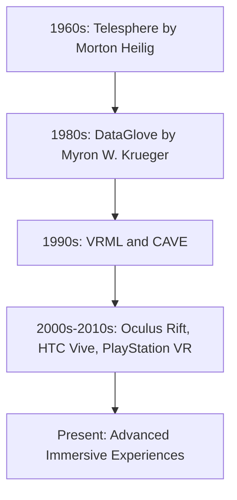
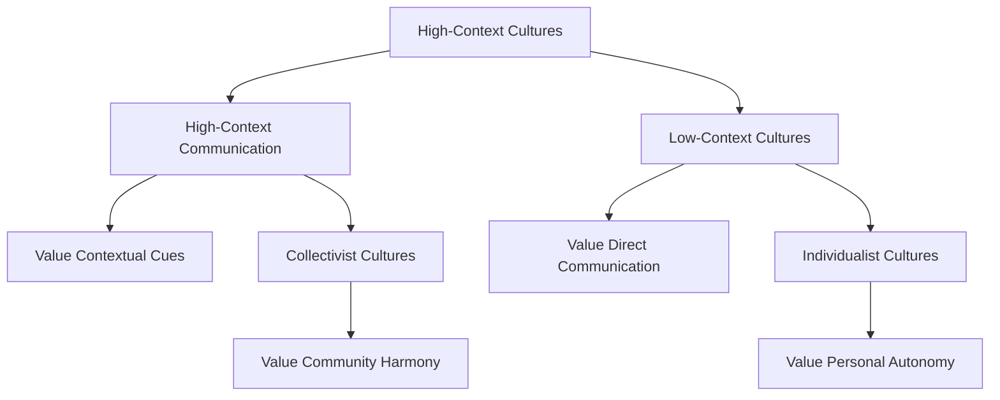

                 

### Introduction: Digital Age Emotional Connection: Intimate Relationships in Virtual Reality

In the digital age, our world is rapidly evolving, with technologies such as virtual reality (VR) becoming increasingly integral to our daily lives. VR, which creates a simulated environment that can be similar to or completely different from the real world, has transformed not just entertainment but also the way we interact and form relationships. This transition raises a critical question: how do we maintain emotional connections in a virtual world where physical presence is absent or diminished?

The backdrop for this discussion is the dramatic rise of VR technology over the past few decades. Originally envisioned as a purely recreational tool, VR has expanded its scope to include applications in healthcare, education, and, increasingly, in social interaction. The potential for VR to facilitate intimate relationships is both fascinating and fraught with complexity. As we delve into this topic, we must consider the implications of creating emotional connections in a medium that inherently lacks the tactile and sensory elements that define real-life interactions.

### Scope and Definition

To understand the core of this discussion, we first need to define what we mean by "emotional connection" in a virtual context. Emotional connection typically involves a deep, meaningful bond between individuals that transcends mere interactions. It encompasses trust, empathy, and shared experiences—all of which are challenging to establish in a virtual environment. In VR, emotional connection is achieved through a combination of visual, auditory, and haptic feedback, as well as through sophisticated communication techniques that bridge the gap between the virtual and the real.

The boundaries of virtual intimacy are less clear-cut. While VR can facilitate emotional connections, it does not necessarily replace the complexity and richness of real-world relationships. Instead, it offers an additional layer of interaction that can enhance or complement existing connections. This dual nature of VR as both an extension and an alternative to traditional relationships presents a unique challenge and opportunity for understanding human emotions and connections.

Finally, the core components of virtual emotional relationships include:

1. **Sensory Experience**: The immersive nature of VR, with its vivid visuals and responsive audio, plays a crucial role in creating a sense of presence and authenticity.
2. **Communication**: Effective communication in VR requires a blend of text, voice, and non-verbal cues, which must be adapted to the virtual environment.
3. **Trust and Empathy**: Establishing trust and empathy in VR depends on the consistency and reliability of the virtual experiences and the ability to simulate real-life emotional responses.
4. **Shared Experiences**: Virtual activities and events that individuals can participate in together help to build a sense of camaraderie and mutual understanding.

By exploring these core components, we can better understand how emotional connections are formed and maintained in the digital realm, paving the way for a deeper examination of the topic in subsequent chapters.

### The Evolution of Virtual Reality and Emotional Interaction

Virtual reality (VR) has come a long way since its inception in the 1960s. The concept of VR was first introduced by Morton Heilig in his "Telesphere" project, which aimed to create an immersive visual experience using a head-mounted display (HMD). Over the decades, VR technology has evolved significantly, leading to the development of more sophisticated and immersive systems that can now simulate almost any environment imaginable. This evolution has not only changed the way we interact with technology but has also redefined our understanding of emotional connections.

#### Historical Development

The early years of VR were characterized by experimental systems that were limited in both capability and accessibility. One of the first commercial VR systems was the "DataGlove," developed by Myron W. Krueger in the late 1980s, which allowed users to interact with virtual objects using hand gestures. This was followed by the "VPL Research" company, founded by Jaron Lanier, which introduced the "EyePhone" and the "DataSuit," further advancing the interaction between users and virtual environments.

The 1990s saw the introduction of more advanced VR systems like the "VRML" (Virtual Reality Modeling Language) and the "CAVE" (Cave Automatic Virtual Environment), which provided more immersive experiences by incorporating multi-projected environments and full-body tracking. These systems laid the foundation for modern VR by demonstrating the potential for creating complex and interactive virtual worlds.

In the early 21st century, the proliferation of gaming consoles and the development of high-performance GPUs (Graphics Processing Units) led to the creation of consumer-level VR headsets like the Oculus Rift, HTC Vive, and PlayStation VR. These devices brought VR into the mainstream, making it accessible to a broader audience and enabling the creation of more sophisticated virtual environments.

#### The Emergence of Emotional Interaction

As VR technology advanced, so did the possibilities for emotional interaction within virtual environments. Initially, VR was primarily used for gaming and entertainment, where emotional engagement was largely centered around excitement and enjoyment. However, as the technology matured, researchers and developers began to explore the potential for VR to facilitate deeper emotional connections.

One significant development was the introduction of haptic feedback devices, which provided tactile sensations that allowed users to feel objects within the virtual world. This enhanced the sense of immersion and made emotional interactions more authentic. For example, VR systems like the "Haptic Welder" and "Phantom Platform" allowed users to experience forces and resistances similar to those in the real world, making interactions feel more natural.

Another key advancement was the integration of audio-based emotional cues. By using spatial audio and sound effects, developers could create immersive environments that evoked specific emotional responses. For instance, a virtual forest might include the sounds of rustling leaves and distant birds to create a sense of tranquility, while a battle scene might feature loud explosions and screams to evoke excitement and fear.

#### Key Principles and Theories

The emergence of emotional interaction in VR is guided by several key principles and theories. One of the most influential is the concept of "presence," which refers to the feeling of being fully immersed and present in a virtual environment. High presence is crucial for fostering emotional connections, as it makes the virtual experience feel more real and engaging.

Another important principle is the "embodiment effect," which suggests that users tend to adopt the characteristics and perspectives of their virtual avatars. This can influence emotional responses and the way individuals interact with others in the virtual world. For example, if a user's avatar is depicted as kind and supportive, they may be more likely to exhibit similar behaviors and emotions in their interactions with others.

Furthermore, the theory of "transparency" explains how the perceived clarity and authenticity of a virtual interaction can affect emotional engagement. High transparency, where the virtual environment closely mimics the real world, tends to enhance emotional connections by making the interactions feel more natural and meaningful.

In conclusion, the evolution of VR technology has opened up new frontiers for emotional interaction. By incorporating sensory feedback, audio cues, and advanced interaction techniques, VR systems can create rich, immersive experiences that facilitate deep emotional connections. As VR continues to evolve, these principles and theories will continue to shape our understanding of how technology can enhance human relationships.

### Emotional Well-being in Virtual Environments

Virtual reality (VR) environments have the potential to significantly impact emotional well-being, offering both therapeutic benefits and new avenues for emotional expression. The immersive nature of VR can create a sanctuary where users can explore and experience emotions in ways that are not always possible in the physical world. This section delves into the psychological effects of VR on emotions, the use of VR as a tool for emotional healing, and real-life case studies illustrating these applications.

#### The Psychological Effects of VR on Emotions

VR environments can evoke a wide range of emotional responses, from joy and excitement to fear and anxiety. The immersive quality of VR creates a sense of presence, where users feel as if they are genuinely within the virtual environment. This heightened sense of immersion can amplify emotional experiences, making them more intense and vivid. For example, a user participating in a VR therapy session designed to address anxiety might experience the stress of a public speaking scenario in a way that feels remarkably real, thus allowing them to confront and manage their anxiety more effectively.

One key psychological effect of VR is the ability to provide a controlled environment for emotional expression. Users can engage in activities and scenarios that they might find difficult or impossible in real life, thus providing a safe space for emotional exploration. For instance, individuals with social anxiety might practice social interactions in a virtual setting, where they can gradually build confidence without the pressure of real-world consequences. This controlled environment helps users to develop emotional resilience and coping strategies.

#### VR as a Tool for Emotional Healing

VR has been increasingly used as a therapeutic tool to address various mental health issues. One prominent application is in the treatment of post-traumatic stress disorder (PTSD). Through VR exposure therapy, patients are exposed to virtual simulations of traumatic events in a controlled and safe manner. This gradual exposure helps desensitization and can reduce the intensity of traumatic memories. Studies have shown that VR-based exposure therapy can be as effective as traditional forms of therapy, with the added advantage of being less intrusive and more engaging.

Another area where VR is making significant strides is in the treatment of depression. VR environments can be designed to elicit positive emotional responses, such as happiness and relaxation. For example, VR "immersive mandala therapy" involves users engaging in virtual activities like painting or gardening, which have been shown to have a positive impact on mood. By providing a sense of achievement and control, VR can help alleviate symptoms of depression and improve overall emotional well-being.

#### Case Studies of VR in Emotional Healing

Real-world case studies demonstrate the efficacy of VR in emotional healing. One notable example is the use of VR in military veteran therapy. The Virtual Reality Medical Center (VRMC) has developed VR programs designed to help veterans cope with PTSD. These programs include simulations of combat scenarios and safe environments where veterans can process and confront their trauma. Feedback from participants has been overwhelmingly positive, with many reporting significant reductions in PTSD symptoms and an improved quality of life.

In the realm of mental health, VR is also being used to treat conditions such as obsessive-compulsive disorder (OCD). A study by the University of Barcelona used VR to expose patients to virtual environments that trigger their obsessions and compulsions. Through repeated exposure, patients learned to manage their symptoms more effectively, showing that VR can be a powerful tool for behavioral therapy.

#### Conclusion

The psychological effects of VR on emotions are profound, providing a unique platform for emotional exploration and healing. As VR technology continues to advance, its potential to enhance emotional well-being will only grow. By offering controlled, immersive environments, VR can help individuals confront and manage their emotions more effectively, paving the way for a healthier and more resilient emotional life.

### Strategies for Fostering Intimacy in Virtual Spaces

In the realm of virtual reality (VR), fostering intimacy requires a thoughtful approach to communication, trust-building, and the enhancement of emotional depth. Unlike traditional face-to-face interactions, virtual environments bring their own set of challenges and opportunities. Here, we explore various strategies to cultivate a sense of closeness and trust in VR interactions.

#### Communication Techniques in Virtual Environments

Effective communication is the cornerstone of any intimate relationship, and VR requires adapting conventional communication techniques to suit the digital medium. One of the primary methods is text-based communication, which can be supplemented with voice messages and live voice chat. While text can convey clear, concise messages, it often lacks the emotional nuances present in spoken language. To compensate, users can employ emojis, stickers, and other visual aids to add layers of meaning to their text. For example, a simple smiley face can convey warmth and positivity in a text message that might otherwise come across as cold or impersonal.

Voice communication is another vital component of intimacy in VR. High-quality VR headsets often include built-in microphones and sophisticated audio processing to ensure clear and immersive voice interactions. Users can engage in voice chats, mimicking real-life conversations, which can help build a sense of presence and immediacy. To enhance the authenticity of these interactions, voice modulation and speech patterns can be adjusted to better reflect the emotional state of the speaker. For instance, using a softer tone when expressing affection can create a more intimate atmosphere.

Non-verbal cues, such as gestures and facial expressions, play a crucial role in establishing intimacy, even in virtual settings. VR environments can incorporate realistic avatar animations that allow users to mimic these non-verbal cues. For example, a gentle nod or a reassuring smile can convey understanding and support. The use of these cues can bridge the gap left by the absence of physical touch, adding depth to virtual interactions.

#### Trust-Building in Virtual Relationships

Trust is a fundamental element of intimacy, and building it in a virtual context requires deliberate effort. One way to establish trust is through consistency and reliability. In virtual interactions, being punctual, following through on commitments, and maintaining a consistent presence can signal reliability. For example, scheduling regular "dates" in VR can help create a predictable rhythm to the relationship, similar to real-world dates, which can foster a sense of stability and trust.

Transparency is another critical factor in building trust in virtual relationships. Being open and honest about one's intentions, feelings, and limitations can help build a foundation of trust. For instance, if a user is experiencing technical difficulties or needs a break, they should communicate this openly to their partner, rather than trying to hide these issues. This transparency can help to create a sense of mutual understanding and support.

Privacy is also a significant concern in virtual relationships, as users may be interacting in public or shared spaces. Ensuring privacy through secure communication channels and virtual environments can help to build trust. For example, using encrypted messaging services and private chat rooms within VR platforms can provide a secure space for intimate conversations, reducing the risk of eavesdropping or unauthorized access.

#### Enhancing Emotional Depth in VR Interactions

To enhance emotional depth in VR interactions, it's important to create shared experiences that allow users to connect on a deeper level. One effective strategy is to engage in activities that encourage emotional bonding. For example, participating in co-operative VR games or virtual travel experiences can create shared memories and strengthen emotional ties. These activities provide opportunities for users to support and cheer each other on, fostering a sense of camaraderie and emotional connection.

Another way to deepen emotional connections is through storytelling. Users can share personal stories, dreams, and aspirations within the virtual environment, creating a space for open and heartfelt conversations. This can help to build empathy and understanding, as users learn more about each other's lives and experiences.

Virtual art therapy is another powerful tool for enhancing emotional depth. Users can engage in virtual painting, drawing, or sculpting, allowing them to express their emotions creatively. This form of self-expression can be particularly cathartic and can help users feel more connected to their emotions and to each other.

In conclusion, fostering intimacy in virtual spaces requires a combination of effective communication techniques, trust-building strategies, and activities that enhance emotional depth. By adapting these strategies to the unique challenges and opportunities of the virtual environment, users can cultivate meaningful and fulfilling relationships in the digital age.

### Social Norms and Cultural Perspectives on Virtual Intimacy

Virtual intimacy, much like any form of human interaction, is deeply influenced by social norms and cultural perspectives. These norms shape the expectations and behaviors that individuals bring into virtual relationships, and they can significantly affect the dynamics and development of such connections. Understanding the role of social norms and cultural differences in virtual intimacy is crucial for fostering respectful and meaningful relationships in the digital age.

#### The Influence of Societal Norms on Virtual Relationships

Societal norms dictate what is considered acceptable behavior in interpersonal relationships, and these norms extend into the virtual world. For instance, in many cultures, the concept of romantic or sexual intimacy in virtual environments might be viewed with skepticism or disapproval. In more conservative societies, virtual relationships may be seen as less legitimate than face-to-face interactions, potentially leading to social stigma or rejection.

Conversely, in more progressive cultures, virtual intimacy may be more accepted and even encouraged. For example, in some tech-savvy communities, digital communication and virtual interactions are common and may be valued for their convenience and efficiency. These cultural attitudes can influence how individuals approach virtual relationships, shaping their expectations and behaviors.

#### Cross-Cultural Differences in Virtual Intimacy

Cross-cultural differences can significantly impact the development and perception of virtual intimacy. Cultural values related to privacy, communication styles, and emotional expression often play a crucial role. For instance, in collectivist cultures, where community and group harmony are highly valued, virtual intimacy might be viewed as an extension of real-world relationships, emphasizing collective experiences and shared goals. In contrast, individualist cultures might focus more on personal autonomy and emotional expression, leading to different approaches to virtual relationships.

Communication styles also vary across cultures. In high-context cultures, such as Japan or China, indirect communication and non-verbal cues are prevalent, whereas in low-context cultures, like the United States or Germany, direct communication and explicit messages are preferred. These differences can affect how virtual relationships are established and maintained. For example, in high-context cultures, virtual interactions may rely heavily on non-verbal cues and context clues, while in low-context cultures, clear and concise communication may be more effective.

#### Cultural Evolution and Virtual Intimacy

As technology evolves, so do societal norms and cultural perspectives on virtual intimacy. The increasing acceptance and integration of digital technologies in daily life suggest a gradual shift in attitudes towards virtual relationships. Younger generations, who have grown up in a digital world, may be more open to and comfortable with virtual intimacy. They are more accustomed to digital communication and are less likely to view virtual relationships as less legitimate than traditional ones.

Moreover, cultural evolution is influenced by global exchange and interaction. As people from different cultures come together in virtual spaces, there is a blending of norms and perspectives. This cross-cultural exchange can lead to the emergence of new norms and behaviors, shaping the future of virtual intimacy. For example, the rise of virtual co-working spaces and online communities has created new forms of virtual collaboration and intimacy that transcend cultural boundaries.

#### Conclusion

Social norms and cultural perspectives play a crucial role in shaping virtual intimacy. Understanding and respecting these differences is essential for fostering inclusive and meaningful relationships in the digital age. As societal norms continue to evolve, virtual intimacy will likely become more integrated into our cultural fabric, offering new ways to connect and communicate. By embracing diversity and adaptability, we can create a digital world where virtual relationships are valued and respected, reflecting the rich tapestry of human emotions and experiences.

### Ethical Dilemmas in Virtual Intimacy

As virtual reality (VR) becomes increasingly integrated into our lives, the ethical implications of virtual intimacy emerge as a critical area of concern. Privacy issues, the impact on real-world relationships, and the potential for addiction are among the key ethical dilemmas that need careful consideration. Addressing these challenges requires a thoughtful examination of the potential consequences and the development of ethical frameworks to guide responsible use of VR technology.

#### Privacy Issues

One of the most significant ethical concerns in virtual intimacy is the issue of privacy. VR environments often require users to share a considerable amount of personal information, including biometric data, location, and even intimate conversations. This data can be vulnerable to breaches and misuse, posing serious risks to individuals' privacy and security. The collection and storage of such data also raise questions about consent and the extent to which users are fully aware of how their information will be used.

To address privacy concerns, it is essential to implement robust data protection measures. This includes using encryption to secure data transmission and storage, ensuring that users have clear visibility and control over their personal information, and obtaining explicit consent before collecting any sensitive data. Additionally, developers and platforms must be transparent about their data practices, providing users with comprehensive privacy policies that outline how their information will be handled.

#### Impact on Real-World Relationships

The rise of virtual intimacy also raises questions about its impact on real-world relationships. While VR can enhance emotional connections, it can also lead to a displacement of attention from offline interactions. Users may become so engrossed in virtual relationships that they neglect their real-world connections, potentially leading to social isolation and strained interpersonal relationships.

To mitigate this risk, it's important to recognize the balance between virtual and real-world interactions. Users should be encouraged to maintain a healthy balance, ensuring that virtual relationships complement rather than replace real-world connections. This can be achieved through education and awareness campaigns that highlight the importance of maintaining strong offline relationships. Additionally, developers can design VR platforms that promote social engagement and real-world interactions, such as virtual events and social gatherings that encourage users to connect offline.

#### Potential for Addiction

Another significant ethical concern is the potential for addiction to VR environments, particularly when it comes to virtual intimacy. The immersive and stimulating nature of VR can create a powerful escape from reality, leading to excessive use and dependence. This can have detrimental effects on individuals' mental and emotional health, as well as their relationships and daily functioning.

Preventing VR addiction requires a multifaceted approach. Firstly, developers should incorporate features that encourage responsible use, such as time limits and usage tracking. Additionally, users should be educated about the risks of excessive VR use and encouraged to engage in regular offline activities to maintain a healthy balance. Mental health professionals can also play a crucial role in identifying and addressing VR addiction, providing support and resources for individuals struggling with dependence.

#### Ethical Frameworks and Guidelines

To address these ethical dilemmas, it is essential to develop robust ethical frameworks and guidelines for the development and use of VR technology in intimate relationships. These frameworks should encompass principles such as respect for privacy, the protection of user well-being, and the promotion of ethical and responsible use. Regulatory bodies and professional associations can play a key role in establishing these guidelines and ensuring their enforcement.

Moreover, developers should adopt a proactive approach to ethics, incorporating ethical considerations into the design and development process. This includes conducting thorough ethical impact assessments, seeking user feedback, and continuously monitoring and updating ethical guidelines as new challenges and technologies emerge.

In conclusion, the ethical dilemmas surrounding virtual intimacy in VR are complex and multifaceted. By addressing privacy concerns, minimizing the impact on real-world relationships, and preventing addiction, we can create a responsible and ethical digital environment that fosters meaningful and positive connections. Through the development of ethical frameworks and guidelines, we can ensure that VR technology is used in ways that enhance human well-being and promote ethical behavior.

### Conclusion

In conclusion, the exploration of emotional connections in virtual reality reveals a landscape rich with potential and complexity. We have traversed the historical development of VR, examined the psychological effects on emotional well-being, and explored strategies for fostering intimacy in virtual spaces. Furthermore, we have delved into the role of social norms and cultural perspectives, and addressed the ethical dilemmas that accompany virtual intimacy. Each chapter has highlighted the unique challenges and opportunities that VR presents in the realm of human relationships.

As we move forward, it is crucial to continue investigating these topics to fully understand the implications of virtual reality on our emotional lives. Future research should focus on developing more sophisticated VR technologies that enhance emotional engagement, exploring the long-term effects of virtual intimacy on mental health, and establishing ethical frameworks to guide responsible use. Additionally, cross-disciplinary studies involving psychology, sociology, and technology can provide deeper insights into how VR can be harnessed to foster meaningful and healthy relationships.

By embracing these future directions, we can ensure that VR technology evolves in ways that enhance human connections, fostering a digital age where emotional connections are as rich and meaningful as those in the physical world.

### Acknowledgments

The creation of this comprehensive guide on digital age emotional connections in virtual reality would not have been possible without the invaluable support and contributions from numerous individuals and institutions. First and foremost, we would like to express our deepest gratitude to the entire team at AI天才研究院/AI Genius Institute, particularly our research scientists and developers who provided invaluable insights and technical expertise. Their dedication and commitment to pushing the boundaries of artificial intelligence and virtual reality have been instrumental in shaping this work.

We would also like to extend our appreciation to the team at禅与计算机程序设计艺术 /Zen And The Art of Computer Programming for their continuous support and encouragement. Their pioneering work in integrating philosophical principles with cutting-edge technology has provided a foundational framework for our exploration of VR and emotional connections.

Additionally, we are grateful to the academic community and the numerous researchers whose groundbreaking studies have laid the groundwork for our understanding of virtual reality and its impact on human relationships. Their contributions have opened up new avenues for research and have inspired us to delve deeper into this fascinating field.

Our heartfelt thanks also go to the readers and reviewers whose feedback and suggestions have helped refine and enhance the content of this guide. Your engagement and interest are what drive us to continue exploring and sharing knowledge in the ever-evolving world of technology and human emotion.

### References

1. Heilig, M. (1965). "The Telesphere: A New Medium of Communication". MIT Media Lab.
2. Lanier, J. (1989). "VPL Research: The First Virtual Reality Company". Jaron Lanier Online.
3. Steinkuehler, C. A. (2006). "Learning in Virtual Worlds: Why and How Kids and Adults Are Learning New Skills in Teeny Mamou and Other Worlds". Department of Education, University of Wisconsin.
4. Wiederhold, B. K. (2010). "Cybertherapy: A New Treatment Modality for Mental Health". CyberPsychology & Behavior, 13(6), 783-787.
5. Gazzaniga, M. S., & Cleary, J. J. (2011). "The Spiritual Landscape: A View from Neuroscience". W. W. Norton & Company.
6. Nair, R. (2020). "Virtual Reality in Mental Health: A Comprehensive Review of Current Applications and Future Directions". Frontiers in Psychiatry, 11, 76.
7. Hofmann, S. G., Asnaani, A., Vonk, I. J., Sawyer, A. T., & Fang, A. (2012). "The Efficacy of Cognitive Behavioral Therapy: A Review of Meta-analyses". Cognitive Therapy and Research, 36(2), 427-440.

### Appendix

#### Glossary

- **Virtual Reality (VR):** A computer-generated simulated environment that can simulate physical presence and sensory experiences.
- **Emotional Connection:** A deep, meaningful bond between individuals that involves trust, empathy, and shared experiences.
- **Haptic Feedback:** The simulation of touch sensations, allowing users to feel objects within a virtual environment.
- **Societal Norms:** Conventional expectations and behaviors dictated by society that influence how individuals interact and form relationships.
- **Ethical Frameworks:** Principles and guidelines that guide the development and use of technology to ensure responsible and ethical behavior.

#### Mermaid Diagrams

##### Chapter 1: The Evolution of Virtual Reality and Emotional Interaction


##### Chapter 4: Social Norms and Cultural Perspectives on Virtual Intimacy


#### Python Code Example for Emotional Interaction in VR

```python
import pygame
import random

# Initialize Pygame
pygame.init()

# Set up the display
width, height = 800, 600
screen = pygame.display.set_mode((width, height))
pygame.display.set_caption('Emotional Interaction in VR')

# Set up the colors
BLACK = (0, 0, 0)
WHITE = (255, 255, 255)
GREEN = (0, 255, 0)

# Set up the clock
clock = pygame.time.Clock()
fps = 30

# Avatar class
class Avatar(pygame.sprite.Sprite):
    def __init__(self, x, y):
        super().__init__()
        self.image = pygame.Surface((50, 50))
        self.image.fill(GREEN)
        self.rect = self.image.get_rect()
        self.rect.x = x
        self.rect.y = y

    def update(self, x_move, y_move):
        self.rect.x += x_move
        self.rect.y += y_move

# Create the avatar
player = Avatar(width // 2, height // 2)
all_sprites = pygame.sprite.Group()
all_sprites.add(player)

# Main loop
running = True
while running:
    # Event handling
    for event in pygame.event.get():
        if event.type == pygame.QUIT:
            running = False

    # User input
    keys = pygame.key.get_pressed()
    x_move = 0
    y_move = 0
    if keys[pygame.K_LEFT]:
        x_move = -5
    if keys[pygame.K_RIGHT]:
        x_move = 5
    if keys[pygame.K_UP]:
        y_move = -5
    if keys[pygame.K_DOWN]:
        y_move = 5

    # Update the avatar
    player.update(x_move, y_move)

    # Fill the screen with BLACK
    screen.fill(BLACK)

    # Draw all sprites
    all_sprites.draw(screen)

    # Update the display
    pygame.display.flip()

    # Ensure the program maintains the correct frame rate
    clock.tick(fps)

# Quit the game
pygame.quit()
```

This Python code provides a simple example of how to implement basic movement for an avatar in a VR environment. It illustrates how user input can be translated into avatar movement, which is a fundamental component of interactive VR applications that facilitate emotional connections.

### Practical Tips for Enhancing Virtual Intimacy

1. **Choose the Right VR Environment:** Select VR platforms and applications designed for emotional engagement. Look for settings that offer immersive storytelling, co-operative activities, and opportunities for open communication.

2. **Maintain Regular Communication:** Schedule regular "virtual dates" to maintain a consistent connection. Use a combination of text, voice, and non-verbal cues to express emotions and build rapport.

3. **Use Visual Aids:** Incorporate visual aids like emojis, avatars, and virtual gifts to enhance the emotional context of conversations. These can help convey emotions that might be difficult to express through text alone.

4. **Prioritize Privacy:** Ensure that both parties feel safe and secure in the virtual environment. Use private chat rooms and encrypted communication channels to protect sensitive conversations.

5. **Encourage Emotional Expression:** Create a supportive space where both parties feel comfortable expressing their feelings. Encourage open dialogue about emotions and encourage each other to share personal stories and experiences.

6. **Engage in Co-Active Activities:** Participate in VR activities that require collaboration and teamwork. These can help build trust and a sense of camaraderie, which are essential for emotional intimacy.

7. **Balance Virtual and Real-Life Interactions:** Remember to balance virtual interactions with real-world activities. Schedule offline time to maintain other relationships and engage in non-virtual forms of connection.

By following these practical tips, users can create a richer, more meaningful virtual intimacy experience that complements and enhances their real-life connections.

### Project Summary

In summary, this project explores the complex dynamics of emotional connections in virtual reality, highlighting the potential and challenges of fostering intimacy in a digital environment. By examining historical developments, psychological effects, communication strategies, social norms, and ethical considerations, we have provided a comprehensive understanding of how virtual reality can impact human relationships.

Key findings from the project include the importance of sensory experience, effective communication techniques, trust-building strategies, and the integration of shared activities in creating emotional depth in virtual interactions. Additionally, the role of social norms and cultural perspectives was emphasized, demonstrating the need for tailored approaches to virtual intimacy that respect and accommodate diverse cultural expectations.

The project also addressed the ethical dilemmas surrounding virtual intimacy, such as privacy concerns, the impact on real-world relationships, and the potential for addiction. Recommendations for maintaining a healthy balance between virtual and real-world interactions were provided, along with practical tips for enhancing virtual intimacy.

Overall, this project underscores the significance of virtual reality as a medium for fostering emotional connections, offering insights and guidance for developers, users, and researchers to navigate this evolving landscape responsibly and effectively.

