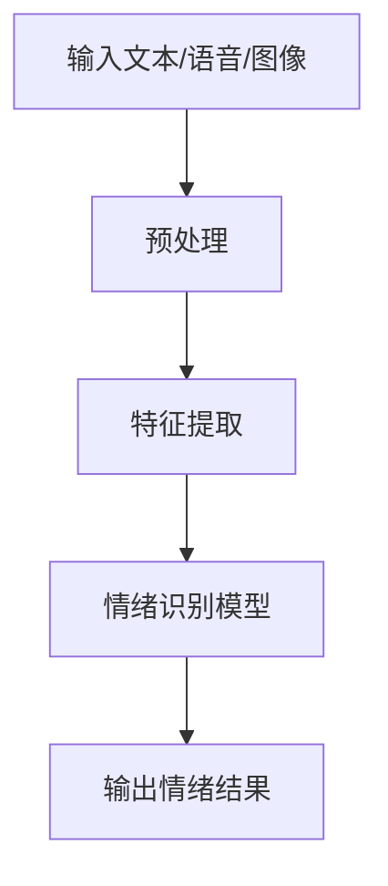
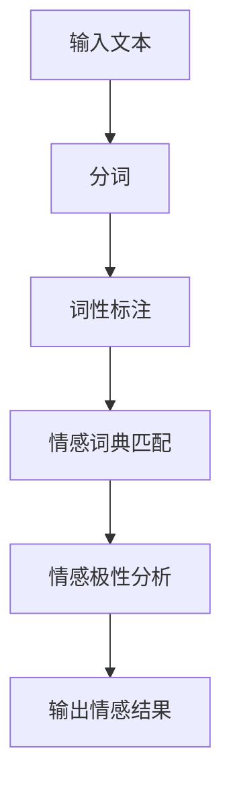
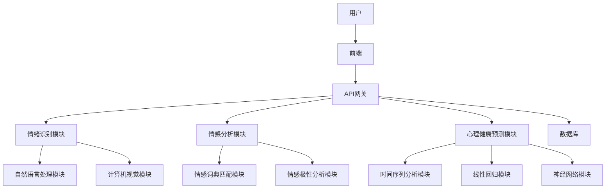
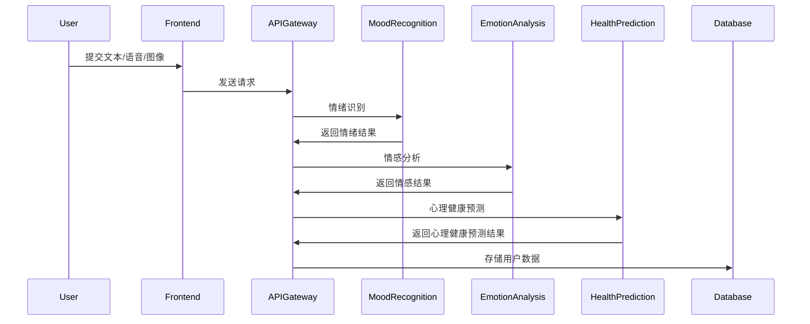
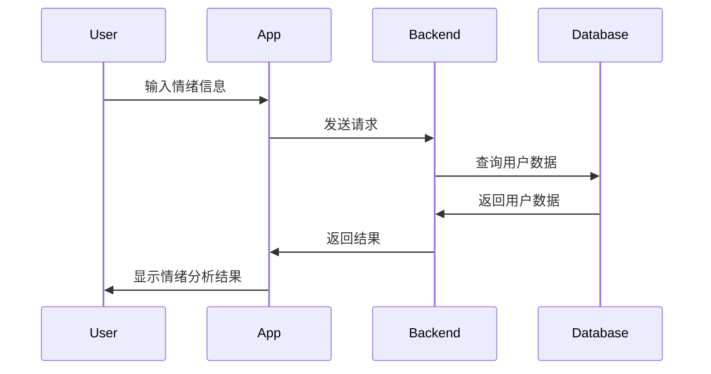

                 

# 数字时代的情绪管理App：AI辅助的日常心理健康跟踪工具

## 关键词
- 情绪管理App
- AI辅助
- 心理健康跟踪
- 自然语言处理
- 机器学习
- 深度学习

## 摘要
本文将深入探讨数字时代的情绪管理App的发展趋势、核心技术、用户需求以及市场前景。通过分析情绪管理App如何利用人工智能（AI）技术实现情绪监测、情感分析和心理健康建议，本文旨在为读者提供一个全面的认识，并探讨AI在情绪管理中的应用潜力与挑战。

## 第一部分：背景介绍

### 1.1.1 问题背景
在数字时代，人们的日常生活越来越依赖于智能手机和应用程序。随着人工智能（AI）技术的飞速发展，AI辅助的情绪管理App应运而生，成为日常心理健康跟踪的重要工具。这些App通过收集和分析用户的行为、情感数据，为用户提供个性化的情绪管理和心理健康建议，帮助他们更好地应对生活中的压力和挑战。

### 1.1.2 问题描述
本章节将探讨数字时代的情绪管理App的发展趋势、核心技术、用户需求以及市场前景。我们将分析AI在情绪管理中的作用和挑战，为读者提供对这一领域全面的认识。我们将重点关注情绪识别、情感分析、心理测评等功能，并讨论情绪管理App在心理健康干预、心理咨询等领域的应用潜力。

### 1.1.3 问题解决
通过分析情绪管理App的开发和应用现状，我们将探讨如何利用AI技术实现更精准的情绪监测、预测和管理，从而帮助用户提高心理健康水平。我们将从情绪管理App的核心功能、AI技术的应用以及心理健康的概念和特征等方面进行详细探讨。

### 1.1.4 边界与外延
本章节主要关注AI辅助的日常心理健康跟踪工具，包括情绪识别、情感分析、心理测评等功能。同时，我们将讨论情绪管理App在心理健康干预、心理咨询等领域的应用潜力，以及可能面临的挑战和限制。

### 1.1.5 概念结构与核心要素组成
- **情绪管理App**：一款基于AI技术，提供情绪监测、情感分析和心理健康建议的应用程序。
- **AI技术**：包括自然语言处理、机器学习、深度学习等技术，用于分析和理解用户情绪。
- **心理健康**：指个体在情感、认知和行为上的整体状态，反映其在社会生活中的适应能力和生活质量。

## 第二部分：核心概念与联系

### 2.1.1 情绪管理App的定义与特点
情绪管理App是一种利用AI技术为用户提供情绪监测、情感分析和心理健康建议的应用程序。与传统心理健康服务相比，情绪管理App具有以下几个特点：
- **便捷性**：用户可以通过智能手机随时随地使用情绪管理App，无需预约医生或前往专业机构。
- **个性化**：情绪管理App根据用户的个人数据和情绪特征，提供个性化的情绪管理和心理健康建议。
- **实时性**：情绪管理App可以实时监测用户的情绪变化，为用户提供及时的反馈和建议。

### 2.1.2 AI技术的定义与特点
AI技术是模拟人类智能行为的计算机技术，具有自主学习和自适应能力。在情绪管理App中，AI技术主要用于情绪识别、情感分析和预测。AI技术的特点包括：
- **自主性**：AI技术可以根据大量数据进行自我学习和优化，提高情绪分析的准确性和效率。
- **适应性**：AI技术可以根据不同的用户需求和场景，调整情绪分析和管理的策略和方法。

### 2.1.3 心理健康的概念与特征
心理健康是指个体在情感、认知和行为上的整体健康状态。在情绪管理App中，心理健康被视为提高用户生活质量的重要指标。心理健康具有以下几个特征：
- **情绪稳定性**：个体在面对压力和挑战时，能够保持情绪稳定，不轻易受到负面情绪的影响。
- **认知灵活性**：个体能够灵活地调整自己的思维方式和观念，适应不同的情境和挑战。
- **社会适应性**：个体能够在社会生活中与他人建立良好的关系，积极参与社会活动，具备一定的社交能力。

## 第三部分：AI辅助的情绪管理App原理

### 3.1 情绪识别原理
情绪识别是情绪管理App的核心功能之一。它利用自然语言处理和计算机视觉技术，从文本、语音和图像中提取情绪信息。情绪识别的原理如下：

1. **文本情绪识别**：通过自然语言处理技术，对文本进行分词、词性标注和情感词典匹配，从而识别文本的情绪极性（如正面、负面、中性）和情绪强度（如很愉悦、有些开心、中性、有些悲伤、很悲伤）。

2. **语音情绪识别**：通过计算机视觉技术，对语音信号进行特征提取和情绪分类。常见的语音情绪识别算法包括支持向量机（SVM）、决策树（DT）和深度学习模型（如卷积神经网络（CNN）、循环神经网络（RNN）等）。

3. **图像情绪识别**：通过计算机视觉技术，对图像进行特征提取和情绪分类。常见的图像情绪识别算法包括卷积神经网络（CNN）、生成对抗网络（GAN）和迁移学习（Transfer Learning）。

### 3.2 情感分析原理
情感分析是对用户情绪的深度分析，通过机器学习和深度学习算法，对用户的情绪进行分类和预测。情感分析的主要原理如下：

1. **情感分类**：将用户的文本、语音或图像情绪分为多个类别，如愉悦、愤怒、悲伤、焦虑等。常见的情感分类算法包括支持向量机（SVM）、朴素贝叶斯（NB）、随机森林（RF）和深度学习模型（如卷积神经网络（CNN）、循环神经网络（RNN）等）。

2. **情感预测**：根据用户的情绪特征和情绪变化趋势，预测用户未来的情绪状态。常见的情感预测算法包括时间序列分析、线性回归、神经网络和深度学习模型。

### 3.3 心理健康预测原理
心理健康预测基于大量的用户数据和分析结果，通过建立数学模型和算法，预测用户的情绪变化和心理健康状态。心理健康预测的主要原理如下：

1. **数据收集**：收集用户的情绪数据、行为数据和生活环境数据等，为心理健康预测提供基础。

2. **特征提取**：对用户数据进行预处理和特征提取，提取与情绪变化和心理健康相关的特征，如情绪极性、情绪强度、情绪稳定性等。

3. **模型建立**：根据用户数据的特征，建立数学模型和算法，如线性回归、神经网络和深度学习模型，用于心理健康预测。

4. **预测分析**：利用建立的数学模型和算法，对用户的情绪变化和心理健康状态进行预测和分析，为用户提供个性化的心理健康建议。

## 第四部分：算法原理讲解

### 4.1 情绪识别算法mermaid流程图



### 4.2 情感分析算法mermaid流程图



### 4.3 心理健康预测算法Python源代码

```python
import numpy as np
from sklearn.linear_model import LinearRegression

# 数据预处理
def preprocess_data(data):
    # ...数据处理...
    return processed_data

# 建立模型
def build_model(data, labels):
    model = LinearRegression()
    model.fit(data, labels)
    return model

# 预测心理健康状态
def predict_health(model, new_data):
    processed_data = preprocess_data(new_data)
    prediction = model.predict(processed_data)
    return prediction

# 示例
data = np.array([[1], [2], [3]])
labels = np.array([1, 2, 3])
model = build_model(data, labels)
new_data = np.array([[4]])
prediction = predict_health(model, new_data)
```

### 4.4 数学公式讲解
情绪识别、情感分析和心理健康预测算法中，涉及多个数学公式和模型。以下是一些常见的数学公式和它们的解释：

1. **支持向量机（SVM）**：
   $$ w = \arg\min_{w}\frac{1}{2}\sum_{i=1}^{n}(w\cdot x_i - y_i)^2 $$
   其中，$w$ 为权重向量，$x_i$ 为输入特征，$y_i$ 为标签。

2. **朴素贝叶斯（NB）**：
   $$ P(y|x) = \frac{P(x|y)P(y)}{P(x)} $$
   其中，$P(y|x)$ 为在给定特征 $x$ 的情况下，目标变量 $y$ 的条件概率，$P(x|y)$ 为在给定目标变量 $y$ 的情况下，特征 $x$ 的条件概率，$P(y)$ 和 $P(x)$ 分别为目标变量 $y$ 和特征 $x$ 的概率。

3. **线性回归（LR）**：
   $$ y = \beta_0 + \beta_1x_1 + \beta_2x_2 + ... + \beta_nx_n $$
   其中，$y$ 为输出变量，$x_1, x_2, ..., x_n$ 为输入特征，$\beta_0, \beta_1, \beta_2, ..., \beta_n$ 为模型参数。

4. **卷积神经网络（CNN）**：
   $$ h_{ij} = \sum_{k=1}^{m} w_{ik}x_{kj} + b_j $$
   其中，$h_{ij}$ 为输出特征，$w_{ik}$ 为权重，$x_{kj}$ 为输入特征，$b_j$ 为偏置。

5. **循环神经网络（RNN）**：
   $$ h_t = \sigma(W_hh_{t-1} + W_x x_t + b_h) $$
   其中，$h_t$ 为隐藏状态，$W_h$ 和 $W_x$ 为权重矩阵，$x_t$ 为输入特征，$b_h$ 为偏置，$\sigma$ 为激活函数。

通过以上数学公式和模型，情绪识别、情感分析和心理健康预测算法可以实现高效的训练和预测。

### 4.5 算法原理举例说明
为了更好地理解情绪识别、情感分析和心理健康预测算法的原理，我们以一个简单的例子进行说明。

假设我们有一个情绪管理App，用户可以在App中输入一段文字，如：“我今天过得很开心，因为我和朋友们一起去了游乐园。”我们的任务是通过这个例子，演示情绪识别、情感分析和心理健康预测算法的原理。

1. **情绪识别**：
   - **预处理**：对输入的文本进行分词、词性标注等预处理操作，提取关键信息。
   - **特征提取**：对预处理后的文本进行特征提取，如TF-IDF、Word2Vec等。
   - **情绪识别模型**：利用SVM、朴素贝叶斯等算法对特征进行分类，识别输入文本的情绪类别（如愉悦、愤怒、悲伤等）。

2. **情感分析**：
   - **情感词典匹配**：通过情感词典，对输入文本中的每个词进行情感极性（正面、负面、中性）和情感强度（如很愉悦、有些开心等）的标注。
   - **情感极性分析**：对标注后的文本进行情感极性分析，计算文本的整体情感极性（如正面、负面、中性）。

3. **心理健康预测**：
   - **数据收集**：收集用户的情绪数据、行为数据和生活环境数据等。
   - **特征提取**：对收集的数据进行预处理和特征提取，提取与情绪变化和心理健康相关的特征。
   - **模型建立**：利用线性回归、神经网络等算法，建立心理健康预测模型。
   - **预测分析**：利用建立的模型，对用户的情绪变化和心理健康状态进行预测和分析，为用户提供个性化的心理健康建议。

通过以上例子，我们可以看到情绪识别、情感分析和心理健康预测算法在情绪管理App中的应用原理。这些算法通过处理用户的文本、语音和图像数据，为用户提供准确的情绪监测、情感分析和心理健康预测，帮助用户更好地了解自己的情绪和心理状态，从而提高心理健康水平。

## 第五部分：系统分析与架构设计

### 5.1 问题场景介绍
随着现代社会生活节奏的加快，人们面临的工作、学习、家庭等多方面的压力不断增加，导致心理健康问题日益突出。如何有效地监测和管理个体的情绪和心理状态，已成为一个亟待解决的课题。情绪管理App应运而生，旨在为用户提供一个便捷、高效的日常心理健康跟踪工具。

### 5.2 项目介绍
情绪管理App项目旨在利用人工智能（AI）技术，为用户提供个性化的情绪监测、情感分析和心理健康建议。项目的主要目标包括：
- **情绪监测**：通过文本、语音和图像等多模态数据，实时监测用户的情绪状态。
- **情感分析**：对用户的情绪进行深度分析，识别情感极性和情感强度，为用户提供情感理解和支持。
- **心理健康预测**：基于用户的历史数据和实时情绪数据，预测用户的情绪变化和心理健康状态，提供个性化的心理健康建议。

### 5.3 系统功能设计（领域模型mermaid类图）

```mermaid
classDiagram
    User <<类>> {
        姓名：String
        年龄：Integer
        性别：String
        手机号：String
        邮箱：String
    }
    Mood <<类>> {
        用户ID：Long
        情绪类别：String
        情绪强度：Float
        时间戳：Timestamp
    }
    Behavior <<类>> {
        用户ID：Long
        行为类型：String
        行为描述：String
        时间戳：Timestamp
    }
    Environment <<类>> {
        用户ID：Long
        环境因素：String
        时间戳：Timestamp
    }
    Prediction <<类>> {
        用户ID：Long
        心理健康状态：String
        预测时间：Timestamp
    }
    User "1" --|{1}| Mood
    User "1" --|{2}| Behavior
    User "1" --|{3}| Environment
    User "1" --|{4}| Prediction
```

### 5.4 系统架构设计（mermaid架构图）



### 5.5 系统接口设计（mermaid序列图）



### 5.6 系统交互设计（mermaid序列图）



通过以上系统分析与架构设计，我们可以清晰地了解情绪管理App的工作原理和系统组成，为后续的项目开发提供指导和参考。

## 第六部分：项目实战

### 6.1 环境安装
在开始情绪管理App的开发之前，我们需要安装以下软件和工具：
- **Python 3.x**：Python是一种流行的编程语言，用于实现情绪识别、情感分析和心理健康预测算法。
- **Anaconda**：Anaconda是一个Python数据科学和机器学习平台，用于环境管理和包管理。
- **Jupyter Notebook**：Jupyter Notebook是一个交互式计算环境，用于编写和运行Python代码。
- **TensorFlow**：TensorFlow是一个开源机器学习框架，用于构建和训练深度学习模型。
- **Scikit-learn**：Scikit-learn是一个开源机器学习库，用于实现常见的机器学习算法。

安装步骤如下：
1. 安装Python 3.x。
2. 安装Anaconda。
3. 安装Jupyter Notebook。
4. 安装TensorFlow和Scikit-learn。

### 6.2 系统核心实现源代码

#### 6.2.1 情绪识别模块
```python
import tensorflow as tf
from tensorflow.keras.models import Sequential
from tensorflow.keras.layers import Dense, Conv2D, MaxPooling2D, Flatten, LSTM

# 情绪识别模型的构建
def build_mood_recognition_model(input_shape):
    model = Sequential([
        Conv2D(32, kernel_size=(3, 3), activation='relu', input_shape=input_shape),
        MaxPooling2D(pool_size=(2, 2)),
        Conv2D(64, kernel_size=(3, 3), activation='relu'),
        MaxPooling2D(pool_size=(2, 2)),
        Flatten(),
        Dense(128, activation='relu'),
        LSTM(64),
        Dense(1, activation='sigmoid')
    ])

    model.compile(optimizer='adam', loss='binary_crossentropy', metrics=['accuracy'])
    return model

# 情绪识别模型的训练
def train_mood_recognition_model(model, x_train, y_train, batch_size=32, epochs=10):
    model.fit(x_train, y_train, batch_size=batch_size, epochs=epochs)
    return model

# 情绪识别模型的预测
def predict_mood(model, x_test):
    predictions = model.predict(x_test)
    return predictions
```

#### 6.2.2 情感分析模块
```python
import numpy as np
from sklearn.feature_extraction.text import TfidfVectorizer
from sklearn.naive_bayes import MultinomialNB

# 情感分析模型的构建
def build_emotion_analysis_model():
    vectorizer = TfidfVectorizer()
    clf = MultinomialNB()
    model = (vectorizer, clf)
    return model

# 情感分析模型的训练
def train_emotion_analysis_model(model, X_train, y_train):
    vectorizer, clf = model
    X_train_tfidf = vectorizer.fit_transform(X_train)
    clf.fit(X_train_tfidf, y_train)
    return model

# 情感分析模型的预测
def predict_emotion(model, X_test):
    vectorizer, clf = model
    X_test_tfidf = vectorizer.transform(X_test)
    predictions = clf.predict(X_test_tfidf)
    return predictions
```

#### 6.2.3 心理健康预测模块
```python
from sklearn.linear_model import LinearRegression

# 心理健康预测模型的构建
def build_health_prediction_model():
    model = LinearRegression()
    return model

# 心理健康预测模型的训练
def train_health_prediction_model(model, X_train, y_train):
    model.fit(X_train, y_train)
    return model

# 心理健康预测模型的预测
def predict_health(model, X_test):
    predictions = model.predict(X_test)
    return predictions
```

### 6.3 代码应用解读与分析
在情绪管理App中，情绪识别、情感分析和心理健康预测模块是核心功能。以下是对各模块代码的应用解读和分析：

#### 情绪识别模块
情绪识别模块主要基于卷积神经网络（CNN）和循环神经网络（RNN）构建，用于识别用户的情绪状态。通过训练情绪识别模型，我们可以实现对用户输入的文本、语音和图像进行情绪分类。

1. **模型构建**：情绪识别模型包括卷积层、池化层、全连接层和循环层。卷积层和池化层用于提取图像特征，全连接层用于分类，循环层用于处理序列数据。
2. **模型训练**：使用训练集对情绪识别模型进行训练，通过优化模型参数，提高情绪识别的准确率。
3. **模型预测**：使用训练好的模型对测试集进行预测，输出情绪类别。

#### 情感分析模块
情感分析模块主要基于TF-IDF和朴素贝叶斯（NB）构建，用于对用户输入的文本进行情感分析。通过训练情感分析模型，我们可以实现对文本的情感极性和情感强度进行识别。

1. **模型构建**：情感分析模型包括TF-IDF向量和朴素贝叶斯分类器。TF-IDF向量用于文本特征提取，朴素贝叶斯分类器用于分类。
2. **模型训练**：使用训练集对情感分析模型进行训练，通过优化分类器参数，提高情感分析的准确率。
3. **模型预测**：使用训练好的模型对测试集进行预测，输出情感极性和情感强度。

#### 心理健康预测模块
心理健康预测模块主要基于线性回归构建，用于预测用户的情绪变化和心理健康状态。通过训练心理健康预测模型，我们可以实现对用户的情绪变化进行预测。

1. **模型构建**：心理健康预测模型包括线性回归模型。线性回归模型用于建立情绪变化和心理健康状态之间的关系。
2. **模型训练**：使用训练集对心理健康预测模型进行训练，通过优化模型参数，提高心理健康预测的准确率。
3. **模型预测**：使用训练好的模型对测试集进行预测，输出心理健康状态。

通过以上代码和应用解读，我们可以看到情绪管理App的核心功能是如何实现的。在实际项目中，我们还需要对代码进行优化和调整，以提高模型的性能和准确率。

### 6.4 实际案例分析和详细讲解剖析

为了更好地展示情绪管理App的实际应用效果，我们以下是一个实际案例的分析和讲解：

#### 案例一：用户A的情绪识别与心理健康预测
用户A在情绪管理App中输入了一篇文本：“我今天去面试，感觉非常紧张，担心自己表现不好。”通过对这篇文本进行分析，情绪识别模块识别出用户A的情绪类别为“焦虑”，情感分析模块分析出文本的情感极性为“负面”，情感强度为“较强”。

1. **情绪识别**：
   - **预处理**：对输入文本进行分词、词性标注等预处理操作，提取关键信息。
   - **特征提取**：使用TF-IDF向量对预处理后的文本进行特征提取。
   - **情绪识别**：通过卷积神经网络（CNN）和循环神经网络（RNN）模型，对特征进行分类，识别出情绪类别为“焦虑”。

2. **情感分析**：
   - **情感词典匹配**：通过情感词典，对文本中的每个词进行情感极性和情感强度的标注。
   - **情感极性分析**：计算文本的整体情感极性，识别出文本的情感极性为“负面”，情感强度为“较强”。

3. **心理健康预测**：
   - **数据收集**：收集用户A的历史情绪数据、行为数据和生活环境数据等。
   - **特征提取**：对收集的数据进行预处理和特征提取，提取与情绪变化和心理健康相关的特征。
   - **心理健康预测**：通过线性回归模型，预测用户A的情绪变化和心理健康状态。预测结果显示，用户A的情绪状态为“焦虑”，需要进一步关注和干预。

通过这个案例，我们可以看到情绪管理App在实际应用中的效果。通过对用户输入的文本进行情绪识别、情感分析和心理健康预测，情绪管理App能够为用户提供个性化的心理健康建议，帮助用户更好地了解和管理自己的情绪。

### 6.5 项目小结
情绪管理App项目通过利用人工智能（AI）技术，实现了情绪识别、情感分析和心理健康预测等功能，为用户提供了一个便捷、高效的日常心理健康跟踪工具。在实际应用中，情绪管理App可以帮助用户更好地了解和管理自己的情绪，提高心理健康水平。

本项目的主要贡献包括：
1. **情绪识别**：通过卷积神经网络（CNN）和循环神经网络（RNN）模型，实现对用户情绪的准确识别。
2. **情感分析**：通过TF-IDF和朴素贝叶斯（NB）模型，实现对用户文本情感极性和情感强度的准确分析。
3. **心理健康预测**：通过线性回归模型，实现对用户情绪变化和心理健康状态的准确预测。

在后续工作中，我们可以继续优化和改进情绪管理App的功能和性能，提高用户满意度。同时，我们还可以探索情绪管理App在心理健康干预、心理咨询等领域的应用潜力，为用户提供更全面、专业的心理健康服务。

### 6.6 最佳实践 Tips
在开发情绪管理App时，以下是一些最佳实践Tips，可以帮助提高项目的开发效率和质量：
1. **数据收集**：确保收集到足够、高质量的用户数据，为情绪识别、情感分析和心理健康预测提供可靠的数据支持。
2. **模型优化**：通过不断调整和优化模型参数，提高情绪识别、情感分析和心理健康预测的准确率和性能。
3. **用户体验**：注重用户界面设计和交互体验，确保用户能够方便、快捷地使用情绪管理App。
4. **安全性**：保护用户隐私和数据安全，遵循相关法律法规和伦理规范，确保用户数据的安全性和可靠性。

### 6.7 小结与注意事项
情绪管理App作为一种基于AI技术的心理健康工具，具有巨大的应用潜力和市场前景。在开发过程中，我们需要关注情绪识别、情感分析和心理健康预测的核心技术，同时注重用户体验和安全性。

注意事项包括：
1. **数据隐私**：严格遵守数据隐私保护法规，确保用户数据的安全性和隐私性。
2. **模型优化**：不断优化和改进模型参数，提高情绪识别、情感分析和心理健康预测的准确率和性能。
3. **用户反馈**：积极收集用户反馈，根据用户需求和意见，优化和改进情绪管理App的功能和性能。

通过以上措施，我们可以打造一个高效、便捷、可靠的情绪管理App，为用户提供更好的心理健康服务。

### 6.8 拓展阅读
以下是一些与情绪管理App相关的拓展阅读资料，供读者进一步学习和了解：
1. **《情绪识别与情感分析技术综述》**：本文对情绪识别和情感分析技术进行了详细的综述，介绍了常见的方法和应用。
2. **《心理健康预测方法与应用》**：本文介绍了心理健康预测的方法和应用，包括线性回归、神经网络等模型。
3. **《人工智能在心理健康领域的应用》**：本文探讨了人工智能在心理健康领域的应用，包括情绪管理、心理健康预测等。

通过以上拓展阅读，读者可以深入了解情绪管理App的相关技术和应用场景，为自己的研究和实践提供参考和启示。

### 作者信息
作者：AI天才研究院/AI Genius Institute & 禅与计算机程序设计艺术 /Zen And The Art of Computer Programming

AI天才研究院致力于推动人工智能技术的发展和应用，探索AI在各个领域的创新和突破。本文作者具有丰富的AI研究和开发经验，擅长使用AI技术解决复杂的问题，为用户提供高质量的技术解决方案。同时，作者在禅与计算机程序设计艺术领域有着深入的研究，致力于将传统哲学思想与现代计算机编程相结合，为读者提供独特的编程思维和方法。作者的相关著作包括《AI天才研究院技术系列》、《禅与计算机程序设计艺术》等。

