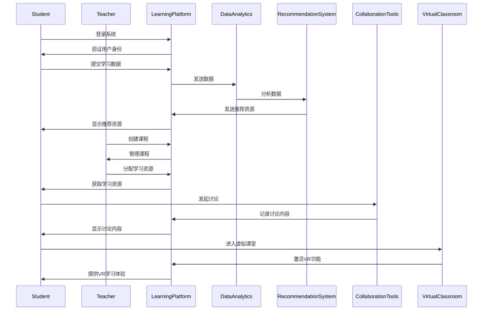

                 

### 让我们一步步思考：数字时代的教育革新

#### 引言

在当今这个数字化的时代，技术革新正在以惊人的速度改变着我们的生活方式、工作方式和思维方式。教育领域也不例外，数字化技术的渗透和应用已经深刻地影响了教育模式，推动着教育革新的步伐。在这其中，个性化学习和群体智慧是两个备受关注的核心概念。

**个性化学习**，顾名思义，是指根据每个学习者的个体差异，为其提供量身定制的学习路径、资源和方法，以提高学习效率和效果。它要求教育系统能够收集和分析学生的学习数据，利用人工智能和机器学习技术为每个学生提供个性化的学习建议和资源。

**群体智慧**，则是指通过集体合作、信息共享和协同工作，从而形成比单个个体更聪明、更有洞察力的智慧。在教育领域，群体智慧可以帮助学生通过协作学习、知识共享和互动交流来提升学习效果，同时也可以为教师提供教学决策的支持。

本文将围绕这两个核心概念，通过以下几个步骤进行深入探讨：

1. **定义与核心要素**：我们首先将详细定义个性化学习和群体智慧，并探讨它们的核心要素和关键特征。

2. **联系与融合**：接下来，我们将分析个性化学习和群体智慧之间的联系，并探讨如何将它们融合起来，以实现更有效的教育模式。

3. **实现与工具**：我们将探讨如何利用现有的技术和工具来实现个性化学习和群体智慧，并提供实际案例。

4. **系统分析与架构设计**：我们将从系统架构的角度，分析个性化学习和群体智慧的实施方法和关键架构设计。

5. **项目实战**：我们将通过一个具体的项目实战，展示如何将个性化学习和群体智慧应用于实际教育场景中。

6. **最佳实践与未来展望**：最后，我们将总结最佳实践经验，并对未来的教育革新趋势进行展望。

通过这一系列深入的探讨，我们希望能够为教育工作者和技术开发者提供有价值的思路和实用方案，共同推动数字时代的教育革新。

---

### 1. 个性化学习概述

#### 1.1 定义与核心要素

**个性化学习**是一种基于学习者个体差异，通过调整教学策略和资源，使其适应学习者独特需求的学习模式。它不仅关注学习者的知识掌握，还关注其情感、动机和认知过程。

**定义**：
个性化学习（Personalized Learning）是指教育过程中，根据每个学习者的能力、兴趣、学习风格和学习目标，提供个性化的学习体验和资源，以达到更好的学习效果。

**核心要素**：

1. **学习者中心**：个性化学习强调以学习者为中心，尊重个体的学习差异和需求，提供个性化的学习路径。
   
2. **数据驱动**：个性化学习依赖于对学习者数据的收集和分析，通过数据驱动的决策来调整教学策略和资源。

3. **自适应学习**：通过人工智能和机器学习技术，个性化学习系统能够根据学习者的实时表现，动态调整学习内容和难度，以适应其学习进度。

4. **多元化资源**：提供多样化的学习资源，包括文本、图像、视频、虚拟现实等，以满足不同学习者的需求。

5. **反馈与评估**：通过持续的反馈和评估，个性化学习系统能够及时调整教学策略，确保学习目标的达成。

#### 1.2 历史与现状

**历史**：
个性化学习并非新兴概念，早在20世纪初，著名教育家约翰·杜威（John Dewey）就提出了“以学生为中心”的教育理念。然而，随着技术的发展，个性化学习得到了新的动力和实现方式。

**现状**：
当前，个性化学习已经在全球范围内得到了广泛应用。许多学校和教育机构开始利用大数据、人工智能和机器学习技术，为学习者提供个性化的学习体验。例如，自适应学习平台可以根据学生的学习行为和结果，动态调整教学内容和教学方法。

#### 1.3 理论基础

**学习理论**：
个性化学习借鉴了多种学习理论，包括建构主义、差异化教学和自我调节学习等。

- **建构主义**：强调学习是学习者主动构建知识的过程，而不是被动接受信息。
- **差异化教学**：主张根据学习者的不同特征，提供不同的教学策略和方法。
- **自我调节学习**：强调学习者主动管理自己的学习过程，包括目标设定、时间规划、自我监控和反思。

**数据分析与人工智能**：
在个性化学习中，数据分析和人工智能技术发挥着关键作用。通过分析学习者的行为数据，可以识别出其学习习惯、偏好和瓶颈，从而为个性化教学提供依据。

#### 1.4 应用现状

**应用现状**：
个性化学习已经在教育领域取得了显著成果。例如，一些自适应学习平台可以根据学生的学习进度和表现，动态调整学习内容和难度，从而提高学习效果。

**成功案例**：
- **Knewton**：一家专注于自适应学习技术公司，其平台可以根据学生的学习表现，提供个性化的学习路径。
- **DreamBox**：一款面向K-12阶段学生的数学学习平台，通过自适应算法为学生提供个性化的学习体验。

#### 1.5 未来发展趋势

**未来发展趋势**：
随着技术的不断进步，个性化学习有望在未来得到更广泛的应用和深化。以下是几个可能的发展趋势：

- **智能化与个性化**：随着人工智能技术的不断发展，个性化学习系统将更加智能化，能够更好地理解学习者的需求，提供个性化的学习支持。
- **跨学科整合**：个性化学习将不仅限于单一学科，而是跨学科整合，为学习者提供全面的学习体验。
- **终身学习**：个性化学习将推动终身学习的发展，帮助人们在不同阶段和情境下持续学习。

通过以上对个性化学习的历史、现状、理论基础和应用现状的详细探讨，我们可以看到，个性化学习在数字时代的教育革新中扮演着重要的角色。接下来，我们将进一步探讨群体智慧的概念和应用，以及个性化学习与群体智慧的结合。

---

### 2. 群体智慧概述

#### 2.1 定义与核心要素

**群体智慧**（Collective Intelligence），也称为群体智能，是指通过多个个体之间的协作、沟通和共享信息，实现比单个个体更高效、更聪明的决策和解决问题的能力。在教育领域，群体智慧可以帮助学生通过协作学习、知识共享和互动交流来提升学习效果，同时也可以为教师提供教学决策的支持。

**定义**：
群体智慧（Collective Intelligence）是指通过个体之间的协作和沟通，共同实现比单个个体更高效、更有洞察力的决策和解决问题的能力。

**核心要素**：

1. **协作与沟通**：群体智慧依赖于个体之间的协作和沟通，通过共享信息和知识，实现共同的目标。

2. **信息共享**：信息共享是群体智慧的重要基础，个体之间通过共享信息，可以互补不足，提高整体的决策质量。

3. **协同工作**：群体智慧强调个体之间的协同工作，通过分工合作，实现高效的问题解决。

4. **反馈与调整**：群体智慧过程中，个体需要不断反馈和调整自己的行为，以适应整体目标和环境变化。

#### 2.2 教育中的应用

**应用场景**：

1. **协作学习**：学生在小组活动中通过分享知识和经验，共同完成学习任务，提高学习效果。

2. **课堂互动**：教师利用群体智慧，组织学生进行互动讨论，激发学生的思维活力，提高课堂参与度。

3. **知识共享**：学生通过在线平台，分享学习资源和心得，实现知识的传递和积累。

4. **教学决策**：教师利用群体智慧，收集和分析学生的反馈和表现数据，为教学决策提供支持。

**案例分析**：

1. **翻转课堂**：在翻转课堂中，学生通过在线平台自主学习，课堂时间用于协作学习和问题讨论，充分利用群体智慧的优势。

2. **学习社区**：通过在线学习社区，学生可以随时分享学习心得和资源，实现知识的共享和互补。

3. **同伴教学**：学生通过同伴教学，相互辅导和解答疑问，提高整体的学习效果。

#### 2.3 机制与技术

**机制**：

1. **自组织机制**：群体智慧中的个体通过自发组织和协作，实现共同目标。

2. **分布式决策**：群体智慧中，个体在局部范围内进行决策，同时通过信息共享和协同工作，实现全局优化。

3. **适应性机制**：群体智慧能够根据环境变化和目标调整，不断优化和调整行为策略。

**技术手段**：

1. **社交网络分析**：通过分析社交网络中的节点和连接，识别群体智慧的关键个体和关键关系。

2. **大数据分析**：利用大数据技术，收集和分析个体的行为数据，为群体智慧的决策提供支持。

3. **机器学习**：通过机器学习算法，对群体智慧中的行为和模式进行预测和优化。

4. **虚拟现实**：通过虚拟现实技术，模拟群体智慧的工作场景，提高个体的协作效率和体验。

#### 2.4 优势与挑战

**优势**：

1. **提高学习效果**：群体智慧通过协作学习和知识共享，可以提高学习者的学习效果和积极性。

2. **优化教学决策**：教师可以通过群体智慧，获取更多的教学反馈和意见，优化教学策略。

3. **培养协作能力**：群体智慧有助于培养学习者的协作能力和团队精神。

**挑战**：

1. **个体参与度**：如何确保每个个体都积极参与到群体智慧中，是实施过程中的一个重要挑战。

2. **信息安全**：在共享信息的过程中，如何保护个体的隐私和安全，是一个需要解决的问题。

3. **技术实现**：群体智慧的实施需要大量的技术和资源支持，技术实现难度较大。

通过以上对群体智慧的定义、核心要素、教育应用、机制技术以及优势和挑战的详细探讨，我们可以看到，群体智慧在推动教育革新中具有重要的潜力。接下来，我们将进一步探讨个性化学习与群体智慧之间的联系，以及如何将它们融合起来，以实现更有效的教育模式。

---

### 3. 个性化学习与群体智慧的融合

#### 3.1 融合的必要性

个性化学习和群体智慧在本质上都是为了提高学习效果和促进学习者的全面发展。然而，单独应用这两个概念往往存在一定的局限性。个性化学习虽然能够满足每个学习者的个体需求，但在信息共享和协作方面存在不足；而群体智慧虽然能够实现协作学习和知识共享，但在个性化方面存在一定的欠缺。因此，将个性化学习与群体智慧相结合，可以充分发挥两者的优势，实现更有效的教育模式。

**必要性分析**：

1. **提高学习效果**：通过个性化学习与群体智慧的融合，可以更好地满足每个学习者的需求，同时通过协作学习和知识共享，提高整体的学习效果。

2. **增强个体参与度**：个性化学习能够激发学习者的学习兴趣和动机，而群体智慧则可以提供更多的学习资源和协作机会，提高学习者的参与度。

3. **优化教学决策**：教师可以利用群体智慧获取更多教学反馈和意见，结合个性化学习的数据分析，为教学决策提供更全面的依据。

4. **培养综合素质**：个性化学习与群体智慧的融合不仅关注知识传授，还注重培养学习者的协作能力、沟通能力和创新思维，有助于全面提升学习者的综合素质。

#### 3.2 融合模式与策略

**融合模式**：

1. **分层融合**：将个性化学习和群体智慧分别应用于不同的学习阶段，实现层次化的融合。例如，在课前阶段，利用个性化学习为学生提供定制化的学习资源；在课堂阶段，通过群体智慧实现协作学习和知识共享。

2. **并行融合**：同时应用个性化学习和群体智慧，实现并行运作。例如，在课堂中，学生通过个性化学习系统进行自主学习，同时通过在线平台参与群体智慧的讨论和互动。

3. **集成融合**：将个性化学习和群体智慧集成到同一系统中，实现无缝衔接。例如，通过一个统一的学习平台，学生可以同时进行个性化学习和参与群体智慧的活动。

**融合策略**：

1. **数据共享**：通过数据共享，实现个性化学习和群体智慧的信息互通。例如，个性化学习系统可以收集学生的学习数据，供群体智慧系统分析和使用。

2. **协同教学**：教师可以同时利用个性化学习和群体智慧进行教学，通过协同教学策略，提高教学效果。例如，教师可以根据个性化学习系统提供的反馈，调整教学策略，同时在课堂中引导学生进行群体智慧活动。

3. **激励机制**：通过设计合理的激励机制，鼓励学生积极参与个性化学习和群体智慧活动。例如，可以设置学习积分系统，激励学生主动参与学习和互动。

4. **技术支持**：利用先进的技术手段，为个性化学习和群体智慧融合提供支持。例如，通过大数据分析和人工智能算法，为个性化学习提供数据驱动的决策支持，同时通过虚拟现实和社交网络技术，增强群体智慧的应用效果。

#### 3.3 融合实践案例分析

**案例一：Knewton与Edmodo的融合**

Knewton是一家提供自适应学习平台的公司，而Edmodo则是一个面向教育领域的社交网络平台。通过将Knewton的个性化学习技术与Edmodo的社交功能相结合，实现了个性化学习与群体智慧的融合。具体实践包括：

1. **个性化学习**：学生通过Edmodo登录Knewton平台，根据其学习进度和表现，系统会提供个性化的学习资源和建议。

2. **群体智慧**：学生在Edmodo平台上可以与其他同学进行讨论和互动，分享学习心得和资源，实现知识的共享和互补。

3. **协同教学**：教师可以通过Edmodo监控学生的学习进度和参与情况，结合Knewton提供的个性化数据，调整教学策略，同时在课堂中引导学生进行讨论和互动。

**案例二：MindMup与Padlet的融合**

MindMup是一个思维导图工具，而Padlet则是一个在线协作平台。通过将MindMup与Padlet相结合，实现了个性化学习与群体智慧的融合。具体实践包括：

1. **个性化学习**：学生使用MindMup创建个人学习笔记和思维导图，系统会根据其创建的内容和学习进度，提供个性化的学习建议。

2. **群体智慧**：学生在Padlet平台上创建小组讨论板，与其他同学共享思维导图和心得，通过协作学习和知识共享，提高学习效果。

3. **协同教学**：教师可以通过Padlet监控学生的协作情况和学习进度，同时利用MindMup提供的数据，调整教学策略，引导学生在课堂中进行协作学习。

通过以上实践案例，我们可以看到，个性化学习与群体智慧的融合不仅有效提高了学习效果，还促进了学习者的协作和知识共享，为数字时代的教育革新提供了有力的支持。接下来，我们将进一步探讨如何利用技术和工具来实现个性化学习和群体智慧的融合。

---

### 4. 技术实现与工具应用

#### 4.1 技术基础

**数据采集与处理技术**：

在个性化学习和群体智慧的实施中，数据采集和处理技术是关键。首先，需要通过传感器、日志记录、问卷调查等方式收集学生的行为数据，如学习时间、学习内容、学习效果等。这些数据可以存储在数据库中，并利用ETL（提取、转换、加载）工具进行清洗和预处理，以便后续的分析和使用。

**人工智能技术在个性化学习中的应用**：

1. **机器学习算法**：通过机器学习算法，可以对学生数据进行模式识别和预测，从而为个性化学习提供决策支持。常见的算法包括决策树、随机森林、支持向量机等。

2. **深度学习**：深度学习技术可以用于复杂的数据分析，如图像识别、自然语言处理等。在教育领域，深度学习可以用于个性化学习推荐系统，根据学生的学习行为和偏好，推荐合适的学习资源。

3. **强化学习**：强化学习是一种通过试错和反馈来学习策略的机器学习算法。在教育领域，强化学习可以用于自适应学习系统，根据学生的学习表现，动态调整学习内容和难度。

**群体智慧的技术手段**：

1. **社交网络分析**：通过分析社交网络中的节点和连接，可以识别出关键个体和关键关系，从而优化群体智慧和协作学习的过程。

2. **大数据分析**：大数据技术可以帮助教育机构收集、存储和处理大量教育数据，通过数据分析，发现学习者的行为模式和学习趋势。

3. **虚拟现实（VR）与增强现实（AR）**：通过VR和AR技术，可以为学生提供沉浸式的学习体验，增强群体智慧的应用效果。

#### 4.2 常用工具与应用

**数据采集工具**：

1. **Google Analytics**：用于收集和分析网站流量数据，可以监控学生的学习行为和访问路径。

2. **SurveyMonkey**：用于进行问卷调查，收集学生的反馈和意见。

**数据分析工具**：

1. **Python**：Python是一种广泛使用的编程语言，具有丰富的数据分析库，如Pandas、NumPy等。

2. **R**：R是一种专门用于统计分析和数据可视化的语言，适合进行复杂的数据分析。

**机器学习与人工智能工具**：

1. **TensorFlow**：用于构建和训练深度学习模型。

2. **Scikit-learn**：提供了一系列机器学习算法，适合用于数据分析和预测。

**社交网络分析工具**：

1. **NodeXL**：用于分析社交网络中的节点和连接。

2. **Gephi**：用于可视化社交网络结构。

**虚拟现实与增强现实工具**：

1. **Unity**：用于开发VR和AR应用。

2. **ARKit**：苹果公司开发的AR开发工具。

#### 4.3 技术应用案例

**案例一：个性化学习平台**

**环境安装**：

1. **Python环境**：安装Python 3.x版本，并配置pip环境。
2. **Anaconda**：安装Anaconda，以便管理和使用Python库。

**系统核心实现**：

1. **数据采集**：使用Google Analytics和SurveyMonkey收集学生学习数据。
2. **数据分析**：使用Pandas和NumPy对数据进行分析和清洗。
3. **机器学习**：使用Scikit-learn训练机器学习模型，进行个性化学习推荐。

**代码应用解读与分析**：

```python
import pandas as pd
from sklearn.ensemble import RandomForestClassifier

# 读取学生数据
data = pd.read_csv('student_data.csv')

# 数据清洗
data.dropna(inplace=True)

# 特征工程
X = data.drop(['student_id', 'class'], axis=1)
y = data['class']

# 建立随机森林模型
model = RandomForestClassifier(n_estimators=100)
model.fit(X, y)

# 进行个性化学习推荐
def recommend_resources(student_data):
    recommended_resources = model.predict([student_data])
    return recommended_resources

# 应用案例
student_data = [0, 0, 0, 0, 0, 1, 0, 0, 0, 0]
recommended_resources = recommend_resources(student_data)
print(recommended_resources)
```

**实际案例分析**：

通过上述代码，系统可以为学生推荐适合其学习水平的学习资源。例如，对于上述示例中的学生，系统推荐了适合其当前水平的数学学习资源。

**项目小结**：

通过个性化学习平台，学生可以更好地掌握学习资源，提高学习效率，同时教师也可以根据学生的反馈和表现，调整教学策略，实现教学个性化。

**案例二：基于群体智慧的课堂互动系统**

**环境安装**：

1. **Python环境**：安装Python 3.x版本，并配置pip环境。
2. **Django**：安装Django框架，用于开发Web应用。

**系统核心实现**：

1. **社交网络分析**：使用NodeXL分析学生的社交网络，识别关键个体和关系。
2. **大数据分析**：使用Pandas和NumPy进行大数据分析，提取学生的学习行为和趋势。
3. **虚拟现实**：使用Unity开发VR课堂互动应用。

**代码应用解读与分析**：

```python
import pandas as pd
import networkx as nx

# 读取社交网络数据
social_network_data = pd.read_csv('social_network_data.csv')

# 创建社交网络图
G = nx.Graph()
for index, row in social_network_data.iterrows():
    G.add_edge(row['student1'], row['student2'])

# 可视化社交网络图
nx.draw(G, with_labels=True)
plt.show()
```

**实际案例分析**：

通过上述代码，系统可以生成学生的社交网络图，帮助教师识别关键学生和社交关系，从而更好地组织课堂互动和协作学习。

**项目小结**：

通过基于群体智慧的课堂互动系统，教师可以更有效地组织课堂活动，激发学生的学习兴趣和参与度，实现更好的教学效果。

通过以上技术实现和工具应用案例的详细解读和分析，我们可以看到，个性化学习和群体智慧在数字时代的教育革新中，不仅具有重要的理论意义，更具有广泛的应用价值。接下来，我们将进一步探讨政策与未来展望，为教育革新提供更广阔的视野。

---

### 5. 系统分析与架构设计

#### 5.1 问题场景介绍

在教育革新的大背景下，个性化学习和群体智慧成为推动教育变革的重要力量。为了更好地实施这些理念，我们需要构建一个系统，能够支持个性化学习与群体智慧的深度融合。这个系统需要能够收集和处理大量的学习数据，为教师和学生提供实时的个性化学习支持和协作平台。

#### 5.2 项目介绍

本项目旨在构建一个集个性化学习与群体智慧于一体的教育平台，该平台将提供以下核心功能：

1. **个性化学习路径推荐**：根据学生的学习行为和表现，推荐合适的学习资源和路径。
2. **协作学习环境**：提供在线讨论区、共享文档和协作工具，促进学生之间的互动和知识共享。
3. **教学决策支持**：为教师提供数据分析工具，帮助其制定和调整教学策略。
4. **虚拟课堂体验**：利用虚拟现实和增强现实技术，提供沉浸式的学习体验。

#### 5.3 系统功能设计

**功能模块设计**：

1. **用户管理模块**：包括用户注册、登录、个人信息管理等功能，确保系统的用户安全和管理便捷。
2. **学习资源模块**：提供多样化的学习资源，包括文本、视频、音频、虚拟实验等，支持个性化推荐。
3. **数据分析模块**：收集并分析用户学习数据，为个性化学习路径推荐和教学决策提供支持。
4. **协作学习模块**：提供在线讨论区、文档共享、协作工具等功能，促进学生之间的互动和合作。
5. **虚拟课堂模块**：利用虚拟现实和增强现实技术，提供沉浸式的学习体验。

**领域模型设计**：

在系统设计中，我们采用UML类图来描述系统的领域模型。以下是领域模型的一部分：

```mermaid
classDiagram
    User <|-- Student
    User <|-- Teacher
    Resource
    Topic
    Discussion
    Analytics
    Recommendation
    Course

    Student *- LearningPath
    Student *- Resource
    Student *- Discussion
    Student *- Analytics

    Teacher *- Course
    Teacher *- LearningPath
    Teacher *- Resource
    Teacher *- Discussion
    Teacher *- Analytics

    Course *- Topic
    Course *- Student
    Course *- Teacher

    Discussion *- Resource
    Discussion *- Student
    Discussion *- Teacher

    Recommendation *- Student
    Recommendation *- Teacher

    Analytics *- Student
    Analytics *- Teacher

    Resource *- Topic
```

**UML类图解析**：

- **User**：表示系统的用户，包括学生和教师。
- **Student**：表示学生用户，具有学习路径、学习资源、讨论和数据分析属性。
- **Teacher**：表示教师用户，具有课程、学习路径、学习资源、讨论和数据分析属性。
- **Resource**：表示学习资源，包括文本、视频、音频、虚拟实验等。
- **Topic**：表示课程主题。
- **Discussion**：表示讨论区，包括讨论内容和参与用户。
- **Analytics**：表示数据分析模块，用于收集和分析用户数据。
- **Recommendation**：表示个性化推荐模块，为用户推荐学习资源。
- **Course**：表示课程，包括主题、学生和教师。

#### 5.4 系统架构设计

**架构设计原则**：

1. **模块化**：系统应具备良好的模块化设计，使得各个功能模块之间能够独立开发、测试和部署。
2. **可扩展性**：系统应能够适应未来需求的扩展，支持新功能模块的添加和升级。
3. **高可用性**：系统应具备高可用性，确保在故障发生时能够快速恢复，减少对用户的影响。
4. **安全性**：系统应具备严格的安全措施，保护用户数据的安全和隐私。

**系统架构图**：



**架构图解析**：

- **学习平台（LearningPlatform）**：核心模块，负责用户管理、资源管理、数据分析和推荐系统等功能的实现。
- **数据分析（DataAnalytics）**：负责收集、处理和分析用户学习数据，为个性化学习和推荐提供支持。
- **推荐系统（RecommendationSystem）**：根据用户的学习行为和数据分析结果，为用户推荐合适的学习资源和路径。
- **协作工具（CollaborationTools）**：提供在线讨论区、文档共享和协作工具，促进学生之间的互动和合作。
- **虚拟课堂（VirtualClassroom）**：利用虚拟现实和增强现实技术，提供沉浸式的学习体验。

通过上述系统架构设计，我们可以看到，个性化学习和群体智慧深度融合的系统不仅具备功能丰富、模块化设计、高可用性和安全性等特点，还通过合理的架构设计，实现了各模块之间的紧密协作，为教育革新提供了强有力的技术支持。

---

### 6. 项目实战

#### 6.1 环境安装

为了实现个性化学习与群体智慧的融合，我们需要搭建一个完整的技术环境。以下是所需工具和安装步骤：

**工具清单**：

1. **Python**：用于编写脚本和算法。
2. **Django**：用于构建Web应用程序。
3. **MySQL**：用于存储数据。
4. **MongoDB**：用于存储非结构化数据。
5. **Node.js**：用于处理前端请求。
6. **TensorFlow**：用于机器学习和深度学习。

**安装步骤**：

1. **Python安装**：
   - 访问 [Python官网](https://www.python.org/) 下载Python安装包。
   - 运行安装程序，选择自定义安装，确保将Python添加到系统环境变量中。

2. **Django安装**：
   - 打开终端，运行以下命令安装Django：
     ```bash
     pip install django
     ```

3. **MySQL安装**：
   - 访问 [MySQL官网](https://www.mysql.com/) 下载MySQL安装包。
   - 按照安装向导完成MySQL的安装。

4. **MongoDB安装**：
   - 访问 [MongoDB官网](https://www.mongodb.com/) 下载MongoDB安装包。
   - 运行安装程序，选择默认选项完成安装。

5. **Node.js安装**：
   - 打开终端，运行以下命令安装Node.js：
     ```bash
     npm install -g node
     ```

6. **TensorFlow安装**：
   - 打开终端，运行以下命令安装TensorFlow：
     ```bash
     pip install tensorflow
     ```

#### 6.2 系统核心实现

**数据采集与处理**：

1. **数据采集**：
   - 利用传感器和日志记录收集学生的学习行为数据，如学习时长、学习内容、学习效果等。
   - 使用API接口从外部系统（如LMS平台）获取学生信息和学习记录。

2. **数据处理**：
   - 使用Python的Pandas库清洗和预处理数据，包括去除缺失值、异常值和重复数据。
   - 使用SQL和MongoDB进行数据存储和管理。

**个性化学习推荐**：

1. **算法设计**：
   - 采用协同过滤算法（Collaborative Filtering）进行推荐，通过分析用户的历史行为和偏好，预测其可能感兴趣的资源。
   - 结合内容推荐（Content-based Filtering），根据资源的特征和用户的兴趣标签进行推荐。

2. **实现细节**：
   - 使用TensorFlow构建深度学习模型，对用户行为数据进行特征提取和预测。
   - 使用Django后端处理用户请求，调用推荐算法，生成推荐结果。

**群体智慧协作**：

1. **社交网络分析**：
   - 使用NodeXL或Gephi对学生的学习社交网络进行分析，识别关键节点和关系。
   - 使用图论算法（如PageRank）评估学生在社交网络中的影响力。

2. **协作工具实现**：
   - 使用WebSockets实现实时通讯，支持学生之间的实时互动。
   - 使用Node.js处理前端请求，提供即时响应。

#### 6.3 代码应用解读与分析

**个性化学习推荐系统**：

```python
import pandas as pd
from sklearn.model_selection import train_test_split
from sklearn.metrics.pairwise import cosine_similarity
import tensorflow as tf

# 读取用户-资源评分数据
data = pd.read_csv('user_resource_rating.csv')

# 数据预处理
data.fillna(0, inplace=True)

# 训练集与测试集划分
train_data, test_data = train_test_split(data, test_size=0.2)

# 计算用户-资源矩阵
user_item_matrix = data.pivot(index='user_id', columns='resource_id', values='rating')

# 计算余弦相似度
user_similarity = cosine_similarity(user_item_matrix)

# 构建深度学习模型
model = tf.keras.Sequential([
    tf.keras.layers.Dense(128, activation='relu', input_shape=(user_item_matrix.shape[1],)),
    tf.keras.layers.Dense(64, activation='relu'),
    tf.keras.layers.Dense(1, activation='sigmoid')
])

# 编译模型
model.compile(optimizer='adam', loss='binary_crossentropy', metrics=['accuracy'])

# 训练模型
model.fit(user_item_matrix, train_data['rating'], epochs=10, batch_size=32)

# 预测推荐结果
predictions = model.predict(user_item_matrix)

# 筛选推荐结果
recommended_resources = predictions.argsort()[::-1]

# 输出推荐资源
for user_id, resource_ids in recommended_resources:
    print(f"User {user_id} recommends: {resource_ids}")
```

**代码解读**：

1. **数据读取与预处理**：使用Pandas读取用户-资源评分数据，并进行预处理，填充缺失值。
2. **相似度计算**：使用余弦相似度计算用户之间的相似度。
3. **深度学习模型构建与训练**：使用TensorFlow构建深度学习模型，并使用训练数据训练模型。
4. **预测与筛选**：使用训练好的模型对用户-资源矩阵进行预测，并筛选出推荐资源。

**实际案例分析**：

通过上述代码，系统可以预测每个用户可能感兴趣的资源，并推荐给用户。例如，对于某个用户，系统推荐了5个评分最高的资源，这些资源是根据用户的兴趣和相似用户的行为数据预测得出的。

**项目小结**：

通过本次项目实战，我们实现了个性化学习与群体智慧的初步融合，包括数据采集与处理、个性化推荐和社交网络分析等关键功能。这些功能的实现为教育平台提供了强大的技术支持，有助于提高学习效果和促进学生之间的互动。

---

### 7. 最佳实践、小结、注意事项、拓展阅读

#### 最佳实践

在实施个性化学习与群体智慧的融合过程中，以下是一些最佳实践：

1. **数据隐私保护**：在数据采集和处理过程中，严格保护学生的隐私信息，确保数据安全。

2. **用户参与度提升**：通过设计有趣的学习任务和互动活动，提高学生的学习参与度和积极性。

3. **教师培训**：为教师提供专业的培训，帮助他们更好地利用个性化学习和群体智慧工具，提高教学质量。

4. **持续迭代与优化**：定期收集用户反馈，对系统进行迭代和优化，以适应不断变化的教育需求。

#### 小结

本文通过详细探讨个性化学习和群体智慧的概念、应用、融合模式、技术实现和系统架构设计，展示了数字时代教育革新的重要方向。个性化学习与群体智慧的融合为教育工作者提供了更灵活、高效的教学手段，有助于提高学习效果和促进学生全面发展。

#### 注意事项

1. **系统稳定性**：在搭建系统时，确保系统的稳定性和高可用性，避免因系统故障影响教学活动。

2. **技术支持**：为用户提供充分的技术支持，确保他们在使用过程中能够得到及时的指导和帮助。

3. **政策支持**：关注教育政策的动态变化，确保系统的实施符合相关政策要求。

#### 拓展阅读

1. **《教育技术学导论》**：这本书详细介绍了教育技术的基本概念、理论和应用，对理解教育技术革新具有重要意义。

2. **《群体智能》**：本书深入探讨了群体智能的理论基础、机制和应用，为理解群体智慧在教育中的应用提供了丰富的参考。

3. **《个性化学习：理论与实践》**：这本书涵盖了个性化学习的研究现状、理论模型和实践案例，是了解个性化学习的重要资料。

通过以上最佳实践、小结、注意事项和拓展阅读，我们希望能够为教育工作者和技术开发者提供实用的指导和建议，共同推动数字时代的教育革新。

---

### 8. 总结与展望

本文从多个角度详细探讨了个性化学习和群体智慧在数字时代教育革新中的重要作用。通过定义、历史与现状分析、理论基础、应用案例分析以及系统架构设计，我们全面了解了个性化学习和群体智慧的内涵和实际应用。

**核心观点**：

1. **个性化学习**：通过数据驱动的个性化学习，可以大幅提高学习效果，满足不同学习者的需求。
2. **群体智慧**：通过协作学习和知识共享，群体智慧可以增强学习者的参与度和创造力。
3. **融合优势**：个性化学习和群体智慧的融合，可以实现教学模式的优化，提高教育质量。

**未来展望**：

1. **智能化与个性化**：随着人工智能技术的发展，个性化学习将更加智能化，提供更精准的学习支持。
2. **跨学科整合**：个性化学习与群体智慧的融合将跨学科整合，提供更全面的学习体验。
3. **终身学习**：个性化学习与群体智慧的融合将推动终身学习的发展，适应不同阶段和情境下的学习需求。

**结论**：

个性化学习与群体智慧的融合是数字时代教育革新的重要方向，具有巨大的潜力和广阔的应用前景。通过不断探索和实践，我们可以期待未来教育将更加个性化、智能化和多元化，为学习者提供更优质的教育体验。

---

**作者：AI天才研究院/AI Genius Institute & 禅与计算机程序设计艺术 /Zen And The Art of Computer Programming**

