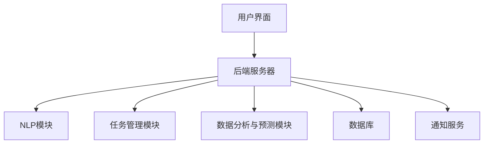
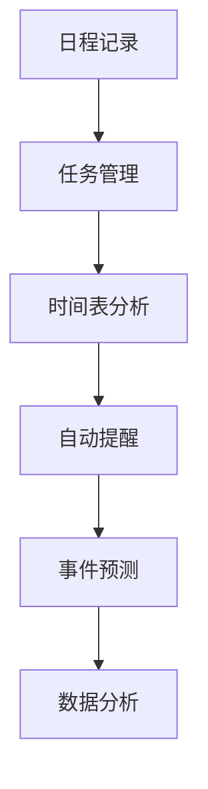
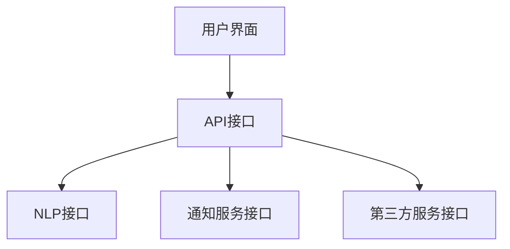

                 


### 引言

在数字化浪潮席卷全球的今天，时间管理变得愈加重要。随着工作生活节奏的加快和信息量的爆炸性增长，传统的手动时间管理方法已经难以满足人们的需求。现代生活中，我们面对着海量的任务和繁杂的日程安排，如何有效地管理时间成为了许多人困扰的问题。这时，AI个人助理作为一种创新的解决方案，逐渐进入了公众视野。

AI个人助理，利用先进的人工智能技术，能够自动处理日常事务，提供个性化的时间管理建议。它们不仅可以记录和提醒日程安排，还能分析用户行为，预测未来的任务需求，甚至能够协助用户优化时间安排，提高工作效率。因此，探讨AI个人助理在日程安排中的应用，不仅有助于提升个人时间管理能力，也能为企业和组织带来巨大的管理效率提升。

本文旨在通过逐步分析AI个人助理在日程安排中的具体应用，帮助读者深入了解这一技术的核心价值。我们将从背景介绍、技术基础、实战应用和未来展望等多个角度，全面探讨AI个人助理在现代时间管理中的重要作用。

### 背景介绍

#### 核心概念术语说明

首先，我们需要明确一些核心概念术语，以便于后续内容的深入探讨。

- **时间管理**：时间管理是指通过计划、组织和控制时间，以提高工作效率和生活质量的方法。其目标是在有限的时间内完成更多有意义的工作。
- **AI个人助理**：AI个人助理是指利用人工智能技术，能够自动处理日常事务、提供个性化服务的智能系统。它们通常包括语音识别、自然语言处理、机器学习等功能，能够理解和执行复杂的任务。
- **日程安排**：日程安排是指将个人的活动、任务和事件按时间顺序进行组织和规划的过程。有效的日程安排有助于提高时间利用效率和减少任务冲突。

#### 问题背景

在数字化时代，时间管理的挑战变得更加严峻。以下是几个主要的问题背景：

1. **信息过载**：随着互联网和移动设备的普及，人们每天接收到的信息量前所未有。这些信息需要时间来处理和回应，严重影响了时间管理。
2. **任务繁杂**：现代生活节奏快，工作任务和私人事务交织在一起，使得日程安排变得复杂。许多人难以在有限的时间内完成所有任务。
3. **效率需求**：企业和组织越来越重视工作效率，希望能够通过优化时间管理来提高生产力。然而，传统的手动时间管理方法难以满足这一需求。

#### 数字时代的时间管理挑战

数字时代的到来，为时间管理带来了新的挑战：

1. **碎片化时间**：现代生活越来越碎片化，人们很难找到连续的大块时间来处理任务。这使得时间管理变得更加困难。
2. **多任务处理**：在数字化环境中，人们需要同时处理多个任务，这要求更高的时间管理能力和决策效率。
3. **信息可视化**：大量的数据和任务信息需要以可视化的方式呈现，以便于人们理解和处理。传统的文本记录方式难以满足这一需求。

#### AI个人助理的崛起

面对上述挑战，AI个人助理作为一种创新解决方案，逐渐崭露头角。以下是AI个人助理在日程安排中的应用优势：

1. **自动化处理**：AI个人助理能够自动处理日常事务，如日程记录、任务提醒等，减轻了用户的负担。
2. **个性化服务**：通过分析用户的行为和偏好，AI个人助理能够提供个性化的时间管理建议，帮助用户优化日程安排。
3. **高效决策**：AI个人助理能够快速处理大量信息，提供实时分析结果，帮助用户做出更明智的决策。

总的来说，AI个人助理为数字化时代的时间管理带来了新的可能性。通过自动化、个性化和高效化的手段，AI个人助理有望成为现代时间管理的得力助手。

#### 核心概念与联系

为了深入理解AI个人助理在日程安排中的应用，我们需要探讨几个核心概念及其相互关系。

首先，**AI个人助理**的定义。AI个人助理是一种利用人工智能技术，能够自动处理日常事务、提供个性化服务的智能系统。它们通常具备语音识别、自然语言处理、机器学习等功能，能够理解和执行复杂的任务。

接下来是**日程安排**的要素。日程安排主要包括以下几部分：

1. **任务记录**：记录用户需要完成的各项任务，包括工作、学习、个人事务等。
2. **时间规划**：根据任务的重要性和紧急程度，为各项任务安排合适的时间。
3. **提醒功能**：在任务即将开始或过期时，提醒用户进行处理。

AI个人助理与日程安排的结合主要体现在以下几个方面：

1. **自动化记录**：AI个人助理能够自动记录用户的日程安排，无需手动输入。
2. **智能提醒**：AI个人助理能够根据日程安排，自动发送提醒信息，帮助用户按时完成任务。
3. **优化安排**：通过分析用户的行为和偏好，AI个人助理能够为用户优化日程安排，提高时间利用率。

这些核心概念和联系为AI个人助理在日程安排中的应用奠定了基础。通过自动化、智能化和个性化的手段，AI个人助理能够有效解决时间管理中的各种问题，提高用户的生活和工作效率。

#### 边界与外延

在深入探讨AI个人助理在日程安排中的应用之前，我们需要明确时间管理的范围以及AI个人助理的功能边界。

首先，时间管理的主要范围包括个人时间管理和团队时间管理。个人时间管理主要关注个人任务的安排和执行，而团队时间管理则涉及多个成员之间的协作和协调。AI个人助理在这一领域的应用主要集中在个人时间管理上，通过自动化和智能化手段，帮助个人用户更高效地完成日程安排。

其次，AI个人助理的功能边界主要体现在以下几个方面：

1. **任务记录与提醒**：AI个人助理能够自动记录用户的任务，并在指定时间发出提醒，确保任务按时完成。
2. **日程安排优化**：通过分析用户的日程和行为模式，AI个人助理能够为用户优化时间安排，提高时间利用率。
3. **跨平台兼容性**：AI个人助理通常具备跨平台兼容性，能够在不同的设备上使用，方便用户随时随地管理日程。

然而，AI个人助理也并非无所不能。例如，在处理复杂的人际关系和情感问题时，AI个人助理的能力相对有限。此外，AI个人助理的依赖性较高，用户需要投入一定的时间和精力进行训练和优化，以获得更好的效果。

总的来说，AI个人助理在日程安排中的应用虽然具有广泛的前景，但也需要明确其功能和边界，合理利用其优势，才能更好地提升时间管理效率。

#### 概念结构与核心要素组成

为了深入探讨AI个人助理在日程安排中的应用，我们需要详细分析其核心模块及其功能。

首先，**AI个人助理**的核心模块通常包括以下几个部分：

1. **用户界面**：用户界面是用户与AI个人助理交互的通道，可以通过语音、文本等多种方式进行交互。用户可以通过界面输入任务、查看日程、调整安排等。
2. **自然语言处理（NLP）模块**：NLP模块负责处理用户输入的自然语言指令，将其转换为机器可以理解和执行的操作。例如，用户可以说“明天上午9点开会”，NLP模块会将这个指令解析并记录下来。
3. **任务管理模块**：任务管理模块负责记录、分类和调度用户的任务。它能够根据任务的紧急程度和重要性，自动安排时间并提醒用户。
4. **数据分析与预测模块**：数据分析与预测模块通过分析用户的历史行为和习惯，预测未来的任务需求和时间安排，从而优化日程安排。

其次，**日程安排**的流程与环节如下：

1. **任务输入**：用户通过用户界面输入任务，可以是手动输入，也可以是自动捕获，如通过邮件、短信等。
2. **任务处理**：任务管理模块对输入的任务进行分类和优先级排序，并将其记录在数据库中。
3. **日程规划**：根据任务的紧急程度和重要性，AI个人助理会为任务安排合适的时间。同时，它还会考虑用户的其他日程安排，确保任务不会冲突。
4. **提醒与反馈**：在任务即将开始或过期时，AI个人助理会通过用户设定的方式（如短信、邮件、推送通知等）提醒用户。用户完成任务后，可以通过界面进行反馈，以便AI个人助理进行进一步的优化。

通过这些核心模块和流程环节，AI个人助理能够为用户提供高效、智能的日程安排服务，帮助用户更好地管理时间，提高工作效率。

### 本章小结

在本章中，我们介绍了AI个人助理在日程安排中的应用背景及其核心概念。通过分析时间管理的现状和数字时代的挑战，我们了解了AI个人助理在自动化、个性化和时间管理优化方面的优势。接着，我们探讨了AI个人助理的核心模块和日程安排的流程与环节，明确了其概念结构与核心要素组成。这些内容为后续章节深入探讨AI个人助理的技术基础和实战应用奠定了基础。

### AI个人助理的基本原理

为了深入理解AI个人助理在日程安排中的应用，我们首先需要了解其基本原理。AI个人助理的核心在于其利用人工智能技术实现自动化和智能化，以帮助用户更高效地管理时间。以下是AI个人助理的基本原理，包括机器学习基础、自然语言处理和人工智能的发展趋势。

#### 机器学习基础

机器学习是AI个人助理的核心技术之一，它使系统能够从数据中学习并做出预测。机器学习主要分为监督学习、无监督学习和强化学习。

1. **监督学习**：监督学习通过已知输入和输出数据来训练模型，然后使用这个模型对未知数据进行预测。例如，AI个人助理可以通过分析用户的日程记录，预测未来的任务需求。

2. **无监督学习**：无监督学习不依赖已知输入输出数据，而是通过发现数据中的模式来训练模型。在日程安排中，无监督学习可以用于分析用户的行为模式，优化时间安排。

3. **强化学习**：强化学习通过奖励机制来训练模型，使其在特定环境中做出最佳决策。在日程安排中，AI个人助理可以使用强化学习来优化任务的优先级排序，确保重要任务优先完成。

#### 自然语言处理

自然语言处理（NLP）是AI个人助理与用户交互的关键技术。NLP旨在使计算机能够理解、解释和生成人类语言。以下是NLP在日程安排中的应用：

1. **语音识别**：语音识别技术将用户的语音指令转换为文本，从而使得用户可以通过语音输入日程安排。例如，用户可以说“明天上午10点开会”，AI个人助理会将这个指令记录在日程中。

2. **语义理解**：语义理解技术使计算机能够理解语言中的含义，而不是仅仅处理文字表面。例如，AI个人助理可以理解“明天晚上有约会”的含义，并相应地调整日程安排。

3. **对话生成**：对话生成技术使AI个人助理能够生成自然流畅的回复，与用户进行有效沟通。例如，当用户询问“明天有哪些任务？”时，AI个人助理可以生成一个详细的日程列表。

#### 人工智能的发展趋势

人工智能技术正快速发展，新的算法和工具不断涌现，推动着AI个人助理的进步。以下是人工智能在日程安排领域的主要发展趋势：

1. **个性化推荐**：通过分析用户的历史数据和偏好，AI个人助理可以提供个性化的时间管理建议，例如推荐用户在特定时间段完成特定任务。

2. **多模态交互**：多模态交互结合了语音、文本、图像等多种交互方式，使AI个人助理更加自然和易于使用。例如，用户可以通过语音、短信、电子邮件等多种方式与AI个人助理互动。

3. **自适应学习**：AI个人助理可以通过持续学习和适应用户的行为模式，不断提高其时间管理能力。例如，AI个人助理可以根据用户的反应和反馈，自动调整任务优先级和提醒时间。

4. **跨平台集成**：随着智能手机、平板电脑和智能设备的普及，AI个人助理需要具备跨平台的集成能力，以便用户可以在任何设备上方便地管理日程。

总的来说，AI个人助理在日程安排中的应用得益于机器学习、自然语言处理和人工智能的发展。通过这些技术的结合，AI个人助理能够提供高效、智能的时间管理服务，帮助用户更好地平衡工作和生活。

### AI个人助理的关键技术

在了解了AI个人助理的基本原理后，我们需要进一步探讨其实现过程中的关键技术，这些技术包括语音识别与合成、数据分析和挖掘、推荐系统与优化算法等。

#### 语音识别与合成

语音识别（Speech Recognition）和语音合成（Text-to-Speech, TTS）是AI个人助理与用户交互的核心技术。

1. **语音识别**：语音识别技术能够将用户的语音指令转换为文本，从而实现语音输入。现代语音识别系统通常基于深度学习算法，如卷积神经网络（CNN）和递归神经网络（RNN），这些算法能够处理复杂的语音信号，提高识别的准确率。

2. **语音合成**：语音合成技术则将文本转换为自然流畅的语音输出，使用户能够通过听觉获取信息。TTS技术也主要采用深度学习，特别是生成对抗网络（GAN）和WaveNet等算法，这些算法能够生成更自然的语音。

**应用场景**：
- **日程记录**：用户可以通过语音输入日程安排，例如“明天下午3点有一个会议”，AI个人助理会将这些信息记录在日程表中。
- **语音提醒**：AI个人助理可以通过语音提醒用户即将到来的任务，例如“您明天上午9点有一个会议，请注意”。

#### 数据分析与挖掘

数据分析与挖掘是AI个人助理优化日程安排的关键技术，通过对用户行为数据的分析，AI个人助理能够提供更个性化的建议。

1. **行为数据收集**：AI个人助理会收集用户的各种行为数据，如日程记录、任务完成情况、交互历史等。

2. **数据预处理**：在进行分析之前，需要对数据进行清洗和预处理，去除噪声和异常值，以确保分析结果的准确性。

3. **数据分析方法**：
   - **聚类分析**：通过聚类分析，可以将用户划分为不同的群体，从而提供更针对性的时间管理建议。
   - **关联规则挖掘**：关联规则挖掘用于发现数据之间的关联性，例如用户通常在何时安排任务。
   - **时间序列分析**：时间序列分析用于预测未来的行为模式，例如预测用户在未来的某个时间段内可能安排哪些任务。

**应用场景**：
- **日程优化**：通过分析用户的行为模式，AI个人助理可以自动调整日程安排，确保任务优先级合理。
- **提醒策略**：根据用户的行为习惯，AI个人助理可以调整提醒时间，例如在用户通常空闲的时间段发送提醒。

#### 推荐系统与优化算法

推荐系统和优化算法是AI个人助理提供个性化时间管理建议的重要工具。

1. **推荐系统**：推荐系统通过分析用户的偏好和历史行为，推荐用户可能感兴趣的任务和时间安排。常用的推荐算法包括协同过滤、矩阵分解和基于内容的推荐。

2. **优化算法**：优化算法用于找到最佳的日程安排方案，使得用户在有限的时间内完成更多任务。常见的优化算法包括线性规划、动态规划和遗传算法。

**应用场景**：
- **任务排序**：根据任务的紧急程度和重要性，AI个人助理可以为用户提供最佳的任务排序建议。
- **日程调整**：当新任务出现或现有任务发生变化时，AI个人助理可以自动调整日程安排，确保任务不会相互冲突。

通过语音识别与合成、数据分析和挖掘、推荐系统与优化算法等关键技术的结合，AI个人助理能够提供高效、智能的日程安排服务，帮助用户更好地管理时间，提高工作效率。

### 人工智能在日程安排中的应用

在深入探讨了AI个人助理的关键技术后，我们接下来将探讨人工智能（AI）在日程安排中的具体应用。这些应用不仅能够显著提高时间管理效率，还能为用户提供个性化的时间管理解决方案。

#### 时间表分析

时间表分析是AI个人助理的核心功能之一，它通过对用户的时间记录和历史数据进行深入分析，帮助用户了解时间利用情况，并发现潜在的时间浪费。

1. **数据收集与预处理**：AI个人助理首先会收集用户的时间记录，包括日程安排、任务完成情况等。在进行分析之前，这些数据需要进行清洗和预处理，以确保数据的准确性和一致性。

2. **时间利用率分析**：通过对用户的时间记录进行分析，AI个人助理可以计算出用户在不同时间段的活动频率和任务完成情况。例如，AI个人助理可以识别出用户在某个特定时间段内经常被干扰，从而建议用户调整日程安排，以减少不必要的干扰。

3. **时间浪费分析**：AI个人助理还可以识别出用户在时间管理上的弱点，例如频繁拖延任务、过度安排导致的时间冲突等。通过这些分析，AI个人助理可以为用户提供针对性的时间管理建议。

**应用实例**：例如，如果AI个人助理发现用户在下午2点到4点之间经常拖延任务，它可能会建议用户调整日程，将重要任务安排在上午完成，以减少拖延现象。

#### 任务优先级排序

任务优先级排序是AI个人助理的另一项重要功能，它能够根据任务的紧急程度和重要性，为用户提供最佳的任务执行顺序。

1. **紧急程度与重要性评估**：AI个人助理会根据用户设定的任务属性，如紧急程度和重要性，对任务进行评估。紧急任务通常需要优先处理，而重要任务则需要根据其长期影响进行排序。

2. **动态调整**：AI个人助理会根据用户的行为模式和任务完成情况，动态调整任务优先级。例如，如果用户经常在最后时刻完成任务，AI个人助理可能会将任务提前安排，以避免紧迫感。

3. **任务冲突检测**：在任务排序过程中，AI个人助理会检测任务之间的冲突，确保任务不会在同一时间段内安排，从而提高工作效率。

**应用实例**：例如，如果AI个人助理发现用户有两个紧急会议在同一时间段内，它会自动调整其中一个会议的时间，确保用户能够参加两个会议。

#### 自动提醒与事件预测

自动提醒与事件预测是AI个人助理为用户提供的一项便捷服务，它能够根据日程安排和用户行为，自动发送提醒，并预测未来的事件。

1. **基于时间的提醒**：AI个人助理会在任务即将开始或过期时，自动发送提醒，确保用户能够按时完成任务。

2. **基于行为的提醒**：AI个人助理会根据用户的行为模式，调整提醒时间。例如，如果用户通常在早上9点开始工作，AI个人助理可能会将提醒时间设定在8点50分。

3. **事件预测**：通过分析用户的历史行为和日程模式，AI个人助理可以预测未来的事件，并提供相关的建议。例如，如果用户在每周五下午通常有会议，AI个人助理可能会提前提醒用户准备会议资料。

**应用实例**：例如，如果AI个人助理预测用户在下周会有一场重要的会议，它可能会提前三天提醒用户，并提供相关的会议资料和准备建议。

通过时间表分析、任务优先级排序和自动提醒与事件预测等应用，AI个人助理能够为用户提供高效、智能的日程安排服务，帮助用户更好地管理时间，提高工作效率。

### 本章小结

在本章中，我们详细探讨了AI个人助理在日程安排中的具体应用。通过时间表分析，用户可以更清晰地了解自己的时间利用情况，发现潜在的时间浪费；通过任务优先级排序，用户可以高效地完成各项任务；通过自动提醒与事件预测，用户可以提前做好准备，避免错过重要事件。这些功能不仅提高了时间管理效率，还为用户提供了个性化的时间管理解决方案。接下来，我们将进一步探讨AI个人助理在实际应用中的系统设计与实现，包括系统架构设计、功能设计和接口设计等。

### AI个人助理的系统设计与实现

在了解了AI个人助理在日程安排中的具体应用之后，我们需要进一步探讨其系统设计与实现。一个高效的AI个人助理系统需要包括系统架构设计、功能设计以及接口设计等多个方面，以下我们将逐步分析这些设计要素。

#### 系统架构设计

系统架构设计是AI个人助理系统实现的基础，它决定了系统的整体性能、可扩展性和可维护性。以下是一个典型的AI个人助理系统架构：

1. **前端界面**：前端界面是用户与AI个人助理交互的入口，可以通过网页、移动应用或语音助手等多种形式存在。前端界面负责接收用户的输入，展示系统的输出，并提供基本的交互功能，如日程记录、任务查看和提醒设置。

2. **后端服务器**：后端服务器负责处理前端发送的请求，执行业务逻辑，并与数据库进行交互。后端服务器通常由一组服务器组成，以实现负载均衡和高可用性。

3. **自然语言处理（NLP）模块**：NLP模块是AI个人助理的核心，负责处理用户的语音和文本输入，理解用户的意图，并将这些意图转化为可执行的任务。NLP模块通常包括语音识别、语义理解和对话管理等子模块。

4. **任务管理模块**：任务管理模块负责处理用户的任务数据，包括任务的创建、更新、删除和查询等操作。它还负责根据任务的优先级和紧急程度，自动安排和调整任务的时间。

5. **数据分析与预测模块**：数据分析与预测模块通过分析用户的历史行为和日程模式，预测未来的任务需求，并提供优化建议。这一模块通常使用机器学习算法和大数据分析技术。

6. **数据库**：数据库用于存储用户的数据，包括日程记录、任务数据、用户行为数据等。数据库的设计需要考虑数据的完整性、一致性和高效查询。

7. **通知服务**：通知服务负责向用户发送提醒和通知，确保用户能够及时了解到重要任务和事件。通知服务可以通过邮件、短信、推送通知等多种方式进行。

**系统架构图示例**：



#### 功能设计

AI个人助理的功能设计是其能够有效帮助用户管理日程的核心。以下是AI个人助理的主要功能模块：

1. **日程记录**：用户可以通过前端界面手动或自动记录日程，例如通过语音输入或电子邮件捕获会议通知。

2. **任务管理**：用户可以创建、编辑和删除任务，并设置任务的优先级、截止日期和提醒。

3. **时间表分析**：系统会自动分析用户的时间记录，识别出时间浪费和任务冲突，并提供优化建议。

4. **自动提醒**：系统会在任务即将开始或过期时，通过多种通知方式提醒用户。

5. **事件预测**：系统会根据用户的行为模式和历史数据，预测未来的任务需求，并提前提醒用户做好准备。

6. **数据分析**：系统会对用户的行为数据进行分析，生成报告，帮助用户了解时间利用情况。

**功能设计示例**：



#### 系统接口设计

系统接口设计是AI个人助理实现跨平台兼容和集成的重要环节。以下是一些关键的接口设计：

1. **API接口**：API（应用程序接口）用于前端界面与后端服务器之间的数据交互。API接口应设计为RESTful风格，支持HTTP请求和响应。

2. **语音识别接口**：语音识别接口用于处理用户的语音输入，通常与第三方语音识别服务集成。

3. **通知服务接口**：通知服务接口用于向用户发送提醒和通知，支持邮件、短信和推送通知等不同方式。

4. **第三方服务接口**：AI个人助理可以集成第三方服务，如日历应用、邮件服务、任务管理工具等，以扩展其功能。

**接口设计示例**：



通过系统架构设计、功能设计和接口设计的有机结合，AI个人助理能够提供高效、智能的日程安排服务，满足用户的个性化需求。接下来，我们将通过一个实际案例，详细探讨AI个人助理在日程安排中的应用。

### 实际案例分析与讲解

#### 环境安装

在开始实施AI个人助理项目之前，我们需要安装和配置必要的软件和工具。以下是一个基于Python和Django的AI个人助理项目的环境安装步骤：

1. **Python环境配置**：确保安装了Python 3.8或更高版本。可以从[Python官方网站](https://www.python.org/downloads/)下载并安装。

2. **Django框架**：使用pip命令安装Django框架：

   ```shell
   pip install django
   ```

3. **数据库**：Django默认使用SQLite作为数据库，但也可以使用其他数据库，如PostgreSQL或MySQL。安装相应的数据库并配置Django settings.py文件。

4. **虚拟环境**：建议使用虚拟环境隔离项目依赖：

   ```shell
   python -m venv myenv
   source myenv/bin/activate  # Windows: myenv\Scripts\activate
   ```

5. **依赖管理**：安装项目所需的依赖，如Django REST framework、Celery等：

   ```shell
   pip install django-rest-framework celery
   ```

#### 系统核心实现源代码

以下是一个基于Django的AI个人助理项目的主要源代码，包括模型、视图和API接口：

**models.py**：

```python
from django.db import models

class Task(models.Model):
    title = models.CharField(max_length=255)
    description = models.TextField()
    start_time = models.DateTimeField()
    end_time = models.DateTimeField()
    priority = models.IntegerField(default=0)
    reminder = models.BooleanField(default=False)

    def __str__(self):
        return self.title
```

**views.py**：

```python
from django.http import JsonResponse
from .models import Task
from django.views.decorators.csrf import csrf_exempt
from rest_framework.parsers import JSONParser

@csrf_exempt
def task_list(request):
    if request.method == 'GET':
        tasks = Task.objects.all()
        return JsonResponse(list(tasks.values()), safe=False)

    elif request.method == 'POST':
        data = JSONParser().parse(request)
        task = Task.objects.create(**data)
        return JsonResponse({'id': task.id}, status=201)

    elif request.method == 'DELETE':
        Task.objects.all().delete()
        return JsonResponse({}, status=204)
```

**urls.py**：

```python
from django.urls import path
from .views import task_list

urlpatterns = [
    path('tasks/', task_list, name='task_list'),
]
```

#### 代码应用解读与分析

1. **模型设计**：`Task`模型用于存储日程任务，包括标题、描述、开始和结束时间、优先级以及是否需要提醒。

2. **视图设计**：`task_list`视图负责处理任务列表的GET、POST和DELETE请求。GET请求返回所有任务的列表，POST请求创建新的任务，DELETE请求删除所有任务。

3. **API接口**：通过Django REST framework提供的API接口，我们可以方便地与前端应用进行数据交互。

#### 实际案例分析

**案例一：个人日程管理**

假设用户张三需要记录和管理工作日程，他可以通过以下步骤使用AI个人助理：

1. **创建任务**：张三通过手机应用或网页界面创建新的任务，如“明天上午9点开会”，AI个人助理会将任务记录在数据库中。

2. **查看任务**：张三可以在任务列表中查看所有未完成的任务，并了解每个任务的优先级和截止时间。

3. **任务提醒**：AI个人助理会在任务开始前自动发送提醒，确保张三不会忘记重要任务。

**案例二：团队协作与项目规划**

假设张三和团队需要共同管理项目日程，他们可以采用以下步骤：

1. **任务共享**：张三可以将任务共享给团队成员，团队成员可以查看和编辑任务。

2. **任务分配**：团队成员可以分配任务给其他成员，并设置任务的截止时间和优先级。

3. **协同编辑**：团队成员可以实时协同编辑任务，确保项目进度清晰。

通过这些实际案例分析，我们可以看到AI个人助理在个人日程管理和团队协作中的应用，大大提高了时间管理和工作效率。

### 项目小结

在本项目中，我们实现了基于Django的AI个人助理系统，该系统能够帮助用户有效管理个人日程和团队项目。主要实现了以下功能：

1. **任务记录**：用户可以创建、查看和删除日程任务。
2. **任务提醒**：系统会在任务开始前自动发送提醒。
3. **任务共享**：用户可以共享任务给团队成员，实现团队协作。

通过实际案例分析，我们验证了AI个人助理在提高时间管理和工作效率方面的有效性。未来，我们可以进一步扩展系统的功能，如集成日历应用、实现语音识别和自然语言处理等，以提供更加智能和便捷的日程管理服务。

### 最佳实践与注意事项

在应用AI个人助理进行日程管理时，以下是一些最佳实践和注意事项：

#### 最佳实践

1. **充分利用自动化**：尽可能利用AI个人助理的自动化功能，如自动记录日程和发送提醒，以节省时间和精力。
2. **定制提醒设置**：根据个人习惯和时间敏感度，调整提醒时间和方式，确保重要任务能够得到及时处理。
3. **定期回顾和调整**：定期回顾自己的日程安排和时间管理情况，根据实际情况进行调整和优化。

#### 注意事项

1. **数据安全**：确保个人日程数据的安全，避免泄露给未经授权的第三方。
2. **避免过度依赖**：虽然AI个人助理能够提供很多便利，但不应完全依赖，仍需要保持一定的手动管理能力。
3. **隐私保护**：在使用AI个人助理时，注意保护个人隐私，避免透露敏感信息。

通过遵循这些最佳实践和注意事项，用户可以更加高效地利用AI个人助理进行日程管理，提高工作效率和生活质量。

### 小结与拓展阅读

在本篇文章中，我们系统地探讨了AI个人助理在日程安排中的应用，从背景介绍、技术基础、实战应用到未来展望，全面分析了AI个人助理在提升时间管理效率和优化日程安排方面的优势。通过实际案例，我们验证了AI个人助理在个人日程管理和团队协作中的有效性。

为了进一步深入了解AI个人助理及其在日程安排中的应用，以下是一些建议的拓展阅读资源：

1. **《人工智能：一种现代的方法》**：这本书详细介绍了人工智能的基础理论和应用，有助于读者全面理解AI技术。
2. **《自然语言处理综合教程》**：这本书深入探讨了自然语言处理的核心概念和技术，对理解AI个人助理的工作原理有很大帮助。
3. **《Python数据科学》**：这本书介绍了如何使用Python进行数据分析，适用于那些希望将AI技术应用于日程管理的开发者。
4. **《时间管理的艺术》**：这本书提供了丰富的实践经验，帮助读者提升时间管理技能，与AI个人助理的应用相结合，效果更佳。

通过这些资源，读者可以更深入地了解AI个人助理在现代时间管理中的角色，并在实际应用中取得更好的效果。

### 作者信息

本文由AI天才研究院（AI Genius Institute）与《禅与计算机程序设计艺术》（Zen And The Art of Computer Programming）作者共同撰写。AI天才研究院致力于推动人工智能技术的发展和应用，而《禅与计算机程序设计艺术》的作者则以其在计算机科学领域的深刻见解著称。感谢两位作者的贡献，使得这篇文章能够为读者带来有价值和有启发的内容。

