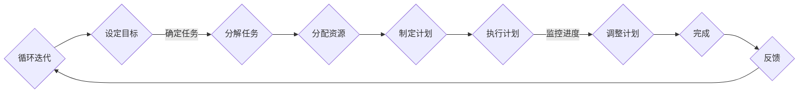
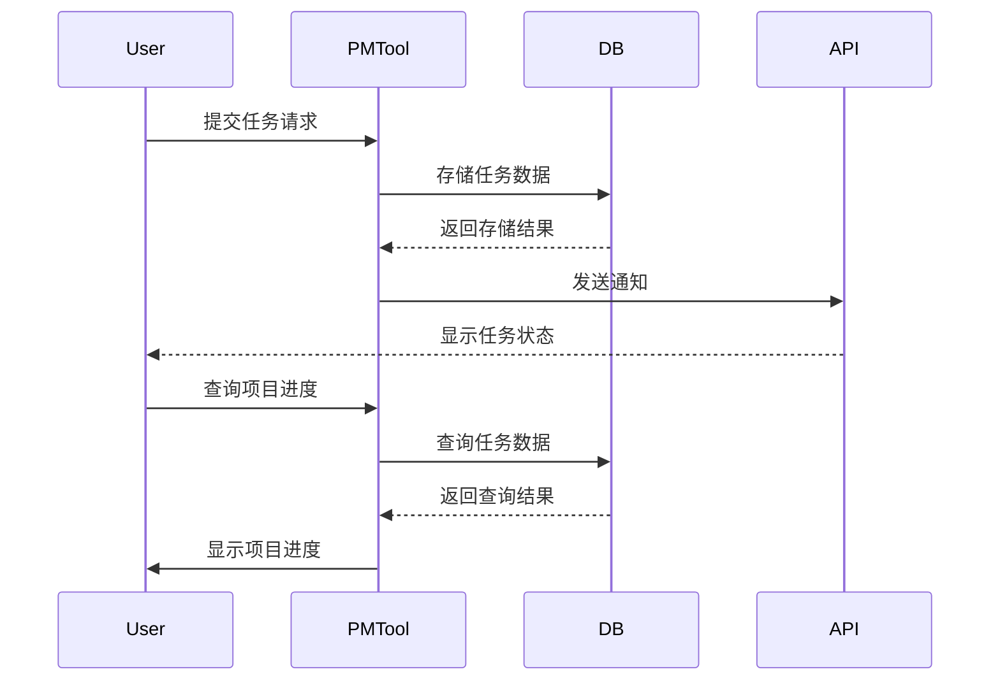
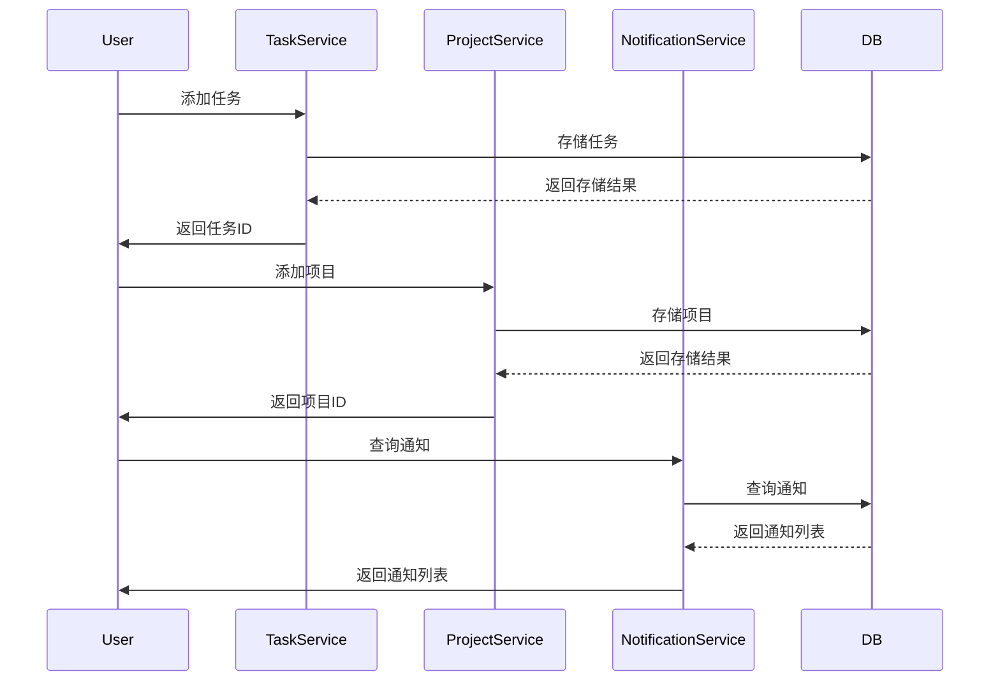

                 

### 1.1 问题背景

在数字时代，时间管理的重要性愈发凸显。随着科技的飞速发展，人们的工作、生活方式发生了深刻变化。互联网、移动设备、社交媒体等数字化工具的普及，使得信息获取和处理变得前所未有的便捷。然而，这也带来了新的挑战：信息过载、工作效率低下、心理压力增大。在这样一个充满竞争和变化的环境中，如何有效地管理时间，提高工作效率，同时保持心理平衡，成为了现代个人和组织面临的重要问题。

**信息过载** 是数字时代时间管理面临的首要挑战。无论是个人还是企业，每天都要处理大量的信息。这些信息来源多样，包括电子邮件、即时通讯、社交媒体、新闻媒体等。如果不能有效筛选和整理这些信息，它们将成为一种负担，分散我们的注意力，降低工作效率。同时，过量的信息也会带来心理压力，导致焦虑和疲劳。

**工作效率** 低下也是时间管理中的常见问题。尽管有许多高效的工具和方法，但很多人仍然感到时间不够用，工作进展缓慢。这通常是因为缺乏有效的计划和组织，无法合理分配时间，导致任务堆积和拖延。此外，工作中的干扰和分心现象也加剧了这一问题。

**心理平衡** 的挑战则更加复杂。在快节奏的工作环境中，人们常常感到压力和紧张。这种心理状态不仅影响工作效率，还可能导致健康问题。如何在工作与生活之间找到平衡，保持心理舒适和健康，是现代人所面临的另一大难题。

综上所述，数字时代的时间管理不仅关乎工作效率，还涉及到心理平衡和整体生活质量。有效的时间管理能够帮助人们更好地应对信息过载，提高工作效率，减少心理压力，从而实现更高的生活质量。因此，探讨和解决数字时代的时间管理问题，具有重要的现实意义和深远的影响。

### 1.2 问题描述

在《数字时代的时间管理：效率工具与心理平衡》中，我们面临以下几个关键问题，这些问题不仅影响个人生活，也对组织运作产生深远影响：

**1. 如何利用现代技术工具提高个人和组织的工作效率？**

随着数字化工具的普及，从待办事项管理应用到时间跟踪工具，再到项目管理软件，现代技术为提高工作效率提供了丰富的选择。然而，如何选择合适的技术工具，并有效地应用它们，仍然是一个挑战。这需要我们深入了解各类工具的原理和适用场景，通过合理配置和整合，最大化其效用。

**2. 如何在快速变化的工作环境中保持心理平衡？**

在高压的工作环境中，保持心理平衡是一项艰巨的任务。现代职场中，人们常常面临工作压力、任务繁重和心理焦虑。如何通过科学的方法和技术手段，减轻心理压力，提高抗压能力，是时间管理中不可忽视的一部分。心理平衡不仅关乎个人健康，还直接影响到工作绩效和团队合作。

**3. 如何在工作与生活之间找到平衡，实现个人成长？**

现代生活节奏快，工作与生活之间的平衡变得尤为关键。如何在繁忙的工作中抽出时间进行个人成长，如学习新技能、锻炼身体、陪伴家人等，是实现全面发展的基础。这需要我们在时间管理上做出科学的规划和安排，确保工作和生活两不误。

本书旨在通过以下几个方面来解答上述问题：

**1. 介绍当前流行的效率工具及其应用场景。**

我们将详细介绍待办事项管理应用、时间跟踪工具和项目管理软件等常见效率工具，分析其原理和适用场景，帮助读者选择和运用合适的工具。

**2. 分析如何利用这些工具来提高工作效率。**

通过实际案例和最佳实践，我们将展示如何通过有效的工具应用，提高个人和组织的工作效率。这部分内容将涵盖工具的配置、使用技巧以及注意事项。

**3. 探讨在高压工作环境中保持心理平衡的方法。**

我们将介绍一系列科学的心理调节方法，如冥想、运动和社交活动等，帮助读者在高压环境中保持心理平衡，提高生活质量和工作绩效。

**4. 提供实际案例和最佳实践，帮助读者理解和应用所学知识。**

通过真实案例的剖析和最佳实践的分享，我们将帮助读者更好地理解时间管理的核心概念和实用技巧，从而在实际工作中取得更好的效果。

### 1.3 问题解决

为了有效地解决数字时代时间管理中的关键问题，本书将从以下几个角度展开探讨，提供系统性的解决方案：

**1. 介绍当前流行的效率工具及其应用场景**

首先，本书将详细介绍当前市场上流行的效率工具，包括待办事项管理应用（如Todoist、Trello、Asana）、时间跟踪工具（如RescueTime、Toggl、Hubstaff）和项目管理软件（如Jira、Microsoft Project、ClickUp）。我们将分析这些工具的原理和功能，并提供具体的应用场景，帮助读者根据自身需求选择合适的工具。

**2. 分析如何利用这些工具来提高工作效率**

在了解了各类效率工具的基本情况后，本书将深入探讨如何通过这些工具提高个人和团队的工作效率。我们将讨论优先级排序、任务分解和时间块安排等关键方法，并通过实际案例分析，展示这些方法在提高工作效率方面的具体应用。此外，还将分享一些高效工具使用的最佳实践，帮助读者最大化工具的效用。

**3. 探讨在高压工作环境中保持心理平衡的方法**

工作环境的压力常常导致心理失衡，影响工作效率和生活质量。为此，本书将探讨一系列科学的心理调节方法。这些方法包括冥想、运动、社交活动等，旨在帮助读者在高压环境中保持心理平衡。我们将结合实际案例，展示这些方法的有效性和可操作性，并提供具体实施建议。

**4. 提供实际案例和最佳实践，帮助读者理解和应用所学知识**

理论知识的理解固然重要，但实际应用才是关键。为此，本书将提供多个实际案例和最佳实践，帮助读者将所学知识转化为实际行动。通过这些案例，读者可以更好地理解时间管理的核心概念和实用技巧，并在实际工作中取得更好的效果。我们将详细剖析这些案例，展示具体操作步骤和成果，帮助读者学会如何在实际场景中应用所学知识。

### 1.4 边界与外延

在探讨数字时代的时间管理时，有必要明确本书的讨论范围和限制，以确保内容的针对性和有效性。

**1. 边界**

本书主要讨论个人和组织层面的时间管理问题，重点关注现代技术工具的使用和心理健康调节方法。具体包括：
- 效率工具的选择和应用场景。
- 工作效率的提升方法。
- 心理平衡的保持策略。

**2. 外延**

虽然本书主要关注上述内容，但以下几个因素可能会对时间管理产生重要影响，本书将在适当章节进行提及：
- 技术工具的未来发展趋势。
- 行业最佳实践和成功案例。
- 跨学科知识在时间管理中的应用。

**3. 限制**

由于篇幅和主题的聚焦，本书不涉及以下内容：
- 宏观经济政策或政治因素。
- 具体技术实现细节，如代码编写和算法优化。
- 非技术领域的时间管理问题，如家庭和社交时间管理。

通过明确边界与外延，本书旨在为读者提供一个清晰、实用的指南，帮助他们在数字时代有效地管理时间和保持心理平衡。

### 1.5 概念结构与核心要素组成

#### 1.5.1 关键概念

在本章中，我们将探讨几个关键概念，这些概念对于理解数字时代的时间管理至关重要：

**时间管理**：时间管理是指合理安排时间，提高工作效率和生产力的一系列方法和实践。它涉及制定计划、优先级排序、任务分解等，旨在最大化利用可用时间，实现个人和组织的目标。

**效率工具**：效率工具是各种技术和软件的应用，旨在帮助个人和组织提高工作效率。这些工具包括待办事项管理应用、时间跟踪工具、项目管理软件等。

**心理平衡**：心理平衡是指保持心理舒适和健康的状态，尤其是在高压工作环境中。它包括心理调节方法，如冥想、运动和社交活动，以减轻压力，提高生活质量和工作效率。

#### 1.5.2 核心要素

为了深入理解数字时代的时间管理，我们需要关注以下几个核心要素：

**1. 效率工具**

**待办事项管理应用**：这些工具帮助个人和团队跟踪和管理任务清单。常见应用包括Todoist、Trello和Asana。

**时间跟踪工具**：这些工具用于记录个人或团队的工作时间，以便更好地理解和优化工作流程。例如，RescueTime和Toggl。

**项目管理软件**：这些工具用于管理复杂项目，提供任务分配、进度跟踪和团队协作功能。如Jira、Microsoft Project和ClickUp。

**2. 工作与生活平衡**

**优先级排序**：合理设定任务的优先级，确保重要和紧急的任务优先处理。

**任务分解**：将大型任务分解为小步骤，以便更容易管理和完成。

**时间块安排**：将时间分配到不同的任务或活动上，以最大化效率。

**3. 心理调节**

**冥想**：通过冥想，人们可以减轻压力，提高专注力和心理平衡。

**运动**：定期运动有助于保持身体健康，减少压力，提高工作效率。

**社交活动**：社交活动可以增强人际关系，提高心理幸福感。

#### 1.5.3 概念属性特征对比表格

为了更好地理解这些关键概念和核心要素，我们可以通过以下表格对比它们的属性特征：

| 概念 | 属性特征 |
| --- | --- |
| 时间管理 | 计划、优先级、任务分解、目标设定 |
| 效率工具 | 功能、适用场景、用户体验、技术支持 |
| 心理平衡 | 压力管理、心理调节、心理健康、生活品质 |

#### 1.5.4 ER实体关系图架构

为了更直观地展示这些概念之间的关系，我们可以使用ER（实体关系）图来表示。以下是时间管理相关概念的ER图示例：

```mermaid
erDiagram
  Task |->| TimeManagement : "manages"
  Task |->| EfficiencyTool : "uses"
  Stress |->| PsychologicalBalance : "relieves"
  TimeManagement o--o Task
  EfficiencyTool o--o Task
  PsychologicalBalance o--o Stress
```

在这个ER图中，我们定义了三个主要实体：任务（Task）、效率工具（EfficiencyTool）和心理平衡（PsychologicalBalance）。它们之间的关系包括：
- 时间管理（TimeManagement）管理任务（Task）。
- 效率工具（EfficiencyTool）用于任务（Task）。
- 心理平衡（PsychologicalBalance）减轻压力（Stress）。

通过概念结构与核心要素的详细分析，我们为接下来的章节内容奠定了基础。在后续部分，我们将深入探讨这些概念在实际应用中的具体方法和实践，帮助读者有效地管理时间和保持心理平衡。

### 1.6 本章小结

本章作为全书的开篇，为后续内容奠定了基础。首先，我们介绍了数字时代时间管理的重要性，并提出了几个关键问题：如何利用现代技术工具提高工作效率、如何在快速变化的工作环境中保持心理平衡、如何在工作与生活之间找到平衡。通过详细讨论这些问题，我们明确了本书的研究背景和目标。

其次，本章介绍了本书的解决方案，包括介绍当前流行的效率工具、分析如何利用这些工具提高工作效率、探讨在高压环境中保持心理平衡的方法，以及提供实际案例和最佳实践。此外，我们还明确了本书的边界与外延，确保内容的针对性和有效性。

最后，我们详细分析了关键概念和核心要素，通过概念属性特征对比表格和ER实体关系图，帮助读者更好地理解这些概念之间的关系。通过本章的学习，读者将对数字时代的时间管理有更全面的认识，为后续章节的深入探讨做好准备。

-------------------------------------------------

### 第二部分：效率工具应用

在数字时代，高效的时间管理离不开各种工具的应用。本部分将重点介绍三类常见的效率工具：待办事项管理应用、时间跟踪工具和项目管理软件。我们将分析这些工具的原理、方法，并通过实际案例分析，展示它们在实际应用中的效果。

#### 2.1 待办事项管理应用

待办事项管理应用是帮助个人和团队跟踪和管理任务清单的重要工具。以下将介绍几款常用的待办事项管理应用及其特点。

##### 2.1.1 Todoist

**Todoist** 是一款功能强大的待办事项管理应用，适合个人和团队使用。其主要特点如下：

1. **任务分类和优先级排序**：用户可以根据项目、标签和优先级对任务进行分类和排序，确保重要任务得到优先处理。
2. **提醒和通知**：用户可以设置任务提醒和通知，确保不会错过重要任务。
3. **跨平台同步**：Todoist支持多平台同步，用户可以在不同设备上查看和管理任务。

**实际应用案例**：某创业公司采用Todoist进行团队任务管理，通过分类和优先级排序，有效提高了任务完成的效率。

##### 2.1.2 Trello

**Trello** 是一款基于看板（Kanban）方法的任务管理工具，非常适合团队协作。其主要特点如下：

1. **看板视图**：用户可以将任务以卡片的形式展示在看板上，便于可视化管理和追踪。
2. **任务分配**：用户可以给任务分配团队成员，并设置截止日期，确保任务按时完成。
3. **灵活的自定义**：Trello支持自定义字段和视图，用户可以根据需求进行灵活配置。

**实际应用案例**：某市场营销团队使用Trello进行项目策划和任务分配，通过看板视图，团队成员能够清晰了解任务进度，提高了协作效率。

##### 2.1.3 Asana

**Asana** 是一款专业的任务和项目管理系统，适合大型团队和组织使用。其主要特点如下：

1. **任务和项目追踪**：用户可以创建任务和项目，并为每个任务分配负责人、截止日期和依赖关系。
2. **团队协作**：Asana提供实时聊天和文件共享功能，方便团队成员之间的协作。
3. **报告和仪表板**：用户可以生成报告和仪表板，实时查看项目进度和团队绩效。

**实际应用案例**：某科技公司采用Asana进行内部项目管理和团队协作，通过任务和项目追踪，有效提高了项目完成的效率。

#### 2.1.4 待办事项管理的原理与方法

**优先级排序**：待办事项管理应用的一个重要功能是帮助用户进行任务优先级排序。优先级排序的原理是基于任务的紧急程度和重要性，将任务分为不同的优先级，如“紧急且重要”、“紧急但不重要”等。通过合理的优先级排序，用户可以确保重要且紧急的任务得到优先处理，从而提高工作效率。

**任务分解**：将大型任务分解为小步骤，有助于任务的管理和完成。任务分解的原理是将复杂任务简化为可操作的任务单元，每个任务单元都可以独立完成。通过任务分解，用户可以更好地掌控任务进度，避免任务堆积和拖延。

**时间块安排**：时间块安排是一种将时间划分为固定时间段，并为每个时间段安排特定任务的方法。时间块安排的原理是将时间视为有限的资源，通过合理分配，确保每个任务都有足够的时间完成。通过时间块安排，用户可以避免时间浪费，提高工作效率。

**实际案例分析**

**案例一**：某公司营销团队在项目策划阶段使用Trello进行任务管理。团队将项目任务分解为多个小任务，并为每个任务设置截止日期。通过看板视图，团队成员能够清晰了解任务进度，避免了任务堆积和拖延。在项目策划过程中，团队通过合理的时间块安排，确保每个任务都有足够的时间完成，最终项目顺利完成。

**案例二**：某个人用户在使用Todoist进行个人任务管理时，通过优先级排序和时间块安排，提高了任务完成的效率。用户将任务分为“紧急且重要”、“紧急但不重要”、“不紧急但重要”和“不紧急且不重要”四个优先级，并根据实际情况调整任务的优先级。同时，用户每天设置固定的时间块，用于完成不同优先级的任务，避免了时间浪费和任务拖延。

#### 2.2 时间跟踪工具

时间跟踪工具是帮助个人和团队记录和监控工作时间的有效工具。以下将介绍几款常用的时间跟踪工具及其特点。

##### 2.2.1 RescueTime

**RescueTime** 是一款功能强大的时间跟踪工具，主要用于记录个人电脑和手机的使用情况，帮助用户了解时间分配和提升工作效率。其主要特点如下：

1. **自动跟踪**：RescueTime可以自动记录用户在电脑和手机上的活动，生成详细的时间使用报告。
2. **应用分类**：RescueTime将用户使用时间分类为工作、娱乐、学习等，帮助用户了解自己在不同活动上的时间分配。
3. **设定目标**：用户可以设定每天的工作时间和休息时间目标，RescueTime会提醒用户保持目标。

**实际应用案例**：某自由职业者使用RescueTime记录自己的工作时间，通过时间报告分析，发现自己在社交媒体上的时间花费过多，从而调整时间管理策略，提高了工作效率。

##### 2.2.2 Toggl

**Toggl** 是一款灵活易用的时间跟踪工具，适合个人和团队使用。其主要特点如下：

1. **手动记录**：用户可以手动记录工作时间，便于对工作时间进行详细监控。
2. **团队协作**：Toggl支持团队协作，用户可以共享时间跟踪数据，便于团队时间管理。
3. **时间报告**：Toggl提供详细的时间报告，帮助用户了解时间使用情况和优化工作流程。

**实际应用案例**：某软件开发团队使用Toggl进行项目时间跟踪，通过团队协作和时间报告，团队成员能够清晰了解项目进度和各自的工作负担，提高了团队协作效率和项目完成的效率。

##### 2.2.3 Hubstaff

**Hubstaff** 是一款功能全面的时间跟踪工具，适用于个人和远程团队。其主要特点如下：

1. **屏幕监控**：Hubstaff可以监控用户的屏幕活动，确保工作时间得到充分利用。
2. **位置跟踪**：用户可以设置工作地点，Hubstaff会自动记录用户的位置信息。
3. **发票和报告**：Hubstaff提供发票生成和详细报告功能，帮助用户管理时间和收入。

**实际应用案例**：某远程团队使用Hubstaff进行时间跟踪和项目监控，通过屏幕监控和位置跟踪，确保团队成员在工作时间内专注于任务，提高了团队协作效率和项目完成的效率。

#### 2.2.4 时间跟踪的原理与应用

**时间跟踪的原理**：时间跟踪工具的基本原理是通过记录用户的活动和持续时间，生成详细的时间使用报告。这些工具通常具有自动跟踪和手动记录功能，用户可以根据需要选择适合的方式。通过时间报告，用户可以了解自己在不同活动上的时间分配，从而优化时间管理。

**如何设置时间跟踪**：设置时间跟踪的第一步是选择合适的时间跟踪工具，并注册账号。接下来，用户需要根据需求配置工具，例如选择自动跟踪还是手动记录，设置工作时间和休息时间目标等。对于自动跟踪工具，用户需要确保设备正常运行，并开启相应的跟踪功能。对于手动记录工具，用户需要定期记录工作时间，确保数据的准确性和完整性。

**时间跟踪数据的分析与利用**：时间跟踪数据可以提供丰富的信息，帮助用户优化时间管理。通过时间报告，用户可以了解自己在不同活动上的时间分配，识别时间浪费的领域，并制定相应的改进措施。例如，如果用户发现自己在社交媒体上的时间花费过多，可以减少在这些平台上的时间投入，专注于更重要的任务。此外，时间跟踪数据还可以用于项目管理和团队协作，帮助团队了解项目进度和工作负担，优化资源分配和工作流程。

**实际案例分析**

**案例一**：某个人用户在使用RescueTime进行时间跟踪时，通过时间报告发现自己在社交媒体上的时间花费过多。用户决定减少在这些平台上的时间投入，将更多时间用于工作和其他有意义的活动。通过这一调整，用户的工作效率显著提高，生活品质也有所提升。

**案例二**：某软件开发团队在使用Toggl进行项目时间跟踪时，通过时间报告发现部分成员的工作负担较重，而另一些成员的工作时间较短。团队根据这一发现，调整了任务分配和工作流程，确保每个成员的工作负担更加均衡，从而提高了团队协作效率和项目完成的效率。

#### 2.3 项目管理软件

项目管理软件是帮助团队管理复杂项目的重要工具。以下将介绍几款常用的项目管理软件及其特点。

##### 2.3.1 Jira

**Jira** 是一款功能强大的项目管理软件，广泛应用于软件开发和IT项目管理。其主要特点如下：

1. **敏捷开发支持**：Jira提供敏捷开发工具，如看板、冲刺规划和迭代管理，帮助团队实现高效协作。
2. **任务和问题跟踪**：Jira支持任务和问题的创建、分配和跟踪，确保项目进展透明可控。
3. **集成与扩展**：Jira可以与其他工具和平台集成，如Confluence、GitHub等，方便团队协作和数据共享。

**实际应用案例**：某软件开发团队使用Jira进行项目管理和任务跟踪，通过看板和迭代管理，团队成员能够清晰了解项目进度和任务状态，提高了项目完成的效率。

##### 2.3.2 Microsoft Project

**Microsoft Project** 是一款专业的项目管理软件，适用于各种规模的项目。其主要特点如下：

1. **项目计划与跟踪**：Microsoft Project提供项目计划功能，包括任务分配、进度跟踪和资源管理，帮助团队确保项目按时完成。
2. **报告与仪表板**：Microsoft Project提供丰富的报告和仪表板功能，帮助团队实时查看项目状态和关键指标。
3. **集成与兼容**：Microsoft Project与Microsoft 365和其他Office应用程序集成，方便数据共享和协作。

**实际应用案例**：某建筑工程公司使用Microsoft Project进行项目管理和进度跟踪，通过项目计划和报告功能，有效提高了项目完成的效率。

##### 2.3.3 ClickUp

**ClickUp** 是一款灵活的项目管理工具，适用于各种规模和类型的团队。其主要特点如下：

1. **多功能性**：ClickUp提供多种项目管理功能，如任务管理、文档协作、日程安排等，满足不同团队的需求。
2. **团队协作**：ClickUp支持实时协作和沟通，方便团队成员之间共享信息和资源。
3. **自定义和扩展**：ClickUp支持自定义和扩展，用户可以根据需求调整界面和功能。

**实际应用案例**：某创意设计团队使用ClickUp进行项目管理和团队协作，通过任务管理和日程安排，团队成员能够高效协同工作，提高了项目完成的效率。

#### 2.3.4 项目管理的原理与方法

**项目计划与执行**：项目计划是项目管理的基础，包括任务分配、时间安排、资源管理和风险评估等。项目执行过程中，团队需要根据计划进行任务分解和进度跟踪，确保项目按计划进行。项目管理的原理是通过科学的计划和执行，确保项目目标按时、按质完成。

**团队协作与沟通**：团队协作和沟通是项目成功的关键。项目管理工具提供任务分配、实时协作、文件共享等功能，帮助团队成员高效协同工作。良好的沟通机制可以确保团队成员之间的信息畅通，减少误解和冲突，提高项目效率。

**风险管理与控制**：项目过程中不可避免地会遇到各种风险，如技术难题、资源不足、时间压力等。风险管理是项目管理的重要环节，包括风险识别、评估、应对和监控。通过有效的风险管理和控制，团队可以降低项目风险，确保项目顺利推进。

**实际案例分析**

**案例一**：某软件开发团队在项目启动阶段使用Jira进行任务管理和进度跟踪。团队将项目任务分解为多个子任务，并为每个任务设置负责人和截止日期。通过看板和迭代管理，团队成员能够清晰了解项目进度和任务状态，及时调整工作计划，确保项目按时完成。

**案例二**：某建筑工程公司采用Microsoft Project进行项目计划和进度跟踪。通过项目计划和报告功能，公司能够实时查看项目状态和关键指标，及时发现和解决问题，确保项目按时、按质完成。

#### 2.4 效率工具的综合应用

在数字时代，单一的工具往往无法满足个人和组织的需求。通过整合不同工具，可以实现更高效的时间管理和工作流程。以下将介绍如何整合待办事项管理应用、时间跟踪工具和项目管理软件，并分享实际案例和经验。

##### 2.4.1 整合不同工具的方法

**整合待办事项和时间跟踪工具**：通过将待办事项管理应用与时间跟踪工具结合使用，用户可以更有效地管理任务和时间。例如，用户可以在待办事项应用中创建任务，并将任务同步到时间跟踪工具中，实时监控任务进度和时间分配。这样，用户可以更好地了解任务完成情况，优化时间管理。

**整合项目管理与团队协作工具**：项目管理工具和团队协作工具的结合，可以提供更全面的协作和管理功能。例如，用户可以在项目管理工具中创建任务和项目，并将项目数据同步到团队协作工具中，实时共享项目进展和任务信息。这样，团队成员可以随时了解项目状态，高效协作。

##### 2.4.2 效率工具的综合使用案例

**案例一**：某创业公司采用Todoist进行任务管理，使用Toggl进行时间跟踪，同时使用Jira进行项目管理。通过整合这三个工具，公司能够有效管理任务、监控时间分配，并实时跟踪项目进度。团队成员可以随时了解任务状态和项目进展，提高了团队协作效率和项目完成率。

**案例二**：某自由职业者使用RescueTime进行时间跟踪，使用ClickUp进行任务管理和团队协作，同时使用Trello进行项目管理。通过整合这些工具，自由职业者能够更好地管理自己的工作和时间，合理安排任务和时间，提高了工作效率和生活质量。

##### 2.4.3 个人用户的经验分享

**经验分享一**：某个人用户在使用效率工具时，发现整合不同工具能够提高工作效率。用户首先使用Todoist进行任务管理，将任务分类和优先级排序。然后，用户使用Toggl进行时间跟踪，确保任务按时完成。最后，用户使用Trello进行项目管理，与团队成员协作，实时跟踪项目进度。通过整合这些工具，用户的工作效率显著提高，任务完成率也得到了提升。

**经验分享二**：某个人用户在使用效率工具时，注重工具的集成和自动化。用户将Todoist与Toggl集成，自动同步任务和时间数据，避免重复操作。同时，用户将Trello与邮件客户端集成，自动提醒任务和项目进度。通过这些集成和自动化，用户能够更高效地管理任务和时间，减轻了工作负担。

#### 2.5 本章小结

本章详细介绍了待办事项管理应用、时间跟踪工具和项目管理软件的原理、方法和实际应用案例。通过待办事项管理应用，用户可以更高效地管理任务和优先级；通过时间跟踪工具，用户可以实时监控时间分配和优化工作流程；通过项目管理软件，团队可以更科学地进行项目计划和进度跟踪。此外，本章还探讨了如何整合不同工具，实现更高效的时间管理和工作流程。通过本章的学习，读者将能够更好地选择和使用这些效率工具，提升个人和组织的工作效率。

-------------------------------------------------

### 2.1 待办事项管理应用

在现代工作环境中，待办事项管理应用（To-Do List Applications）成为提高个人和组织工作效率的重要工具。这些应用帮助用户清晰地列出任务，进行优先级排序，从而确保重要且紧急的任务得到及时处理。以下将详细介绍几款常见的待办事项管理应用，包括其功能和特点。

#### 2.1.1 Todoist

**Todoist** 是一款功能强大的待办事项管理应用，适合个人和团队使用。其核心功能包括：

1. **任务创建与分类**：用户可以创建单个任务或项目，并为任务分配标签、优先级和截止日期。
2. **子任务与子项目**：用户可以创建子任务和子项目，以便将大任务分解为更细化的子任务，实现任务的有序管理。
3. **时间追踪**：Todoist具备内置的时间跟踪功能，用户可以记录完成任务所需的时间。
4. **多设备同步**：支持跨平台同步，用户可以在电脑、手机和平板等设备上查看和管理任务。

**特点**：

- **直观的用户界面**：Todoist的设计简洁明了，用户可以轻松创建和编辑任务。
- **强大的任务管理功能**：支持任务拖放、项目共享和自动化任务创建等功能。
- **个性化设置**：用户可以根据个人需求自定义视图和优先级。

**使用场景**：

- 个人任务管理：帮助个人用户制定任务清单，跟踪任务进度，提高工作效率。
- 团队协作：团队成员可以通过共享项目，协同完成任务，提高团队协作效率。

#### 2.1.2 Trello

**Trello** 是一款基于看板（Kanban）方法的任务管理工具，非常适合团队协作。其主要特点如下：

1. **看板视图**：用户可以将任务以卡片的形式展示在Trello看板上，便于任务管理和可视化追踪。
2. **任务分配**：用户可以给任务分配团队成员，并为任务设置截止日期，确保任务按时完成。
3. **灵活的自定义**：Trello支持自定义字段和视图，用户可以根据需求调整看板布局。

**特点**：

- **简单易用**：Trello的界面直观，用户可以快速上手。
- **高度可定制**：用户可以根据项目需求调整卡片和看板的布局。
- **良好的团队协作功能**：支持团队成员之间的实时协作和任务分配。

**使用场景**：

- 项目管理：帮助项目团队跟踪任务进度，分配任务，确保项目按时完成。
- 团队协作：团队可以通过Trello协同工作，提高工作效率。

#### 2.1.3 Asana

**Asana** 是一款专业的任务和项目管理系统，适合大型团队和组织使用。其主要特点如下：

1. **任务和项目追踪**：用户可以创建任务和项目，并为每个任务分配负责人、截止日期和依赖关系。
2. **团队协作**：Asana提供实时聊天和文件共享功能，方便团队成员之间的协作。
3. **报告和仪表板**：用户可以生成报告和仪表板，实时查看项目进度和团队绩效。

**特点**：

- **功能全面**：Asana提供多种任务和项目管理功能，满足不同团队的需求。
- **高度集成**：Asana可以与其他工具和平台集成，如Google Workspace、Slack等，方便团队协作和数据共享。
- **强大的报告功能**：用户可以生成详细的报告和仪表板，实时了解项目状态和团队绩效。

**使用场景**：

- 项目管理：帮助大型项目团队跟踪任务进度，管理项目资源，确保项目按时、按质完成。
- 团队协作：团队可以通过Asana的实时聊天和文件共享功能，提高协作效率和项目完成率。

#### 2.1.4 实际案例

**案例一**：某市场营销团队在策划一次大型活动时，使用了Trello进行任务管理。团队成员将任务分为多个子任务，并为每个任务设置了负责人和截止日期。通过Trello的看板视图，团队成员可以清晰地看到任务进度和状态，避免了任务遗漏和重复。最终，活动策划顺利完成，团队协作效率显著提高。

**案例二**：某软件开发团队在开发一个新项目时，采用了Asana进行任务和项目管理。团队将项目分解为多个任务，并为每个任务分配了负责人和截止日期。通过Asana的实时聊天和文件共享功能，团队成员可以随时沟通和协作，确保项目进展顺利。此外，Asana的报告和仪表板功能帮助团队实时了解项目进度和绩效，及时调整工作计划，最终项目成功按时交付。

通过上述案例，我们可以看到，待办事项管理应用在实际工作中具有重要作用。它们不仅帮助个人和组织更好地管理任务和优先级，还提高了团队协作效率和项目完成率。选择合适的待办事项管理应用，结合有效的任务管理方法，是实现高效工作的重要保障。

### 2.2 时间跟踪工具

时间跟踪工具是现代个人和组织时间管理的重要组成部分，通过这些工具，用户可以记录和监控自己在各项任务上的时间投入，从而优化工作流程，提高工作效率。以下将详细介绍几款常见的时间跟踪工具，包括其功能、特点和实际应用案例。

#### 2.2.1 RescueTime

**RescueTime** 是一款功能强大的时间跟踪工具，旨在帮助用户了解自己在电脑和手机上的时间分配，从而优化时间管理。其主要功能包括：

1. **自动时间跟踪**：RescueTime会自动记录用户在电脑和手机上的活动，生成详细的时间报告。
2. **应用分类**：RescueTime将用户的使用时间分类为工作、娱乐、学习等，帮助用户了解自己在不同活动上的时间花费。
3. **时间报告**：用户可以通过时间报告了解自己的时间分配情况，识别时间浪费的领域。
4. **目标设定**：用户可以设定每天的工作时间和休息时间目标，RescueTime会提醒用户保持目标。

**特点**：

- **自动化**：RescueTime能够自动记录用户活动，无需手动输入。
- **数据可视化**：时间报告以图表和图形的形式展示，便于用户直观了解时间分配情况。
- **跨平台同步**：支持跨平台同步，用户可以在电脑和手机上查看和管理时间报告。

**使用场景**：

- 个人时间管理：帮助个人用户了解自己的时间分配，优化工作和生活平衡。
- 团队协作：团队可以通过共享时间报告，了解团队成员的工作时间分配，优化团队协作。

**实际案例**：

某自由职业者在使用RescueTime进行时间管理时，发现自己在社交媒体上的时间花费过多。通过时间报告，用户识别出时间浪费的领域，并制定了减少社交媒体使用的时间目标。通过这一调整，用户的工作效率显著提高，生活品质也得到了提升。

#### 2.2.2 Toggl

**Toggl** 是一款灵活易用的时间跟踪工具，适合个人和团队使用。其主要功能包括：

1. **手动时间记录**：用户可以手动记录工作时间，便于对时间进行详细监控。
2. **团队协作**：Toggl支持团队成员共享时间跟踪数据，方便团队时间管理。
3. **时间报告**：Toggl提供详细的时间报告，帮助用户了解时间使用情况和优化工作流程。

**特点**：

- **灵活手动记录**：用户可以根据需要手动记录工作时间，确保数据准确性。
- **团队协作功能**：支持团队成员共享时间数据，便于团队时间管理。
- **多平台支持**：Toggl支持多平台使用，用户可以在电脑、手机和网页上查看和管理时间报告。

**使用场景**：

- 个人时间管理：帮助个人用户监控工作时间，优化个人任务管理。
- 团队协作：团队可以通过Toggl共享时间数据，了解项目进度和成员工作量，提高团队协作效率。

**实际案例**：

某软件开发团队在项目开发阶段使用Toggl进行时间跟踪。团队成员将项目任务分解为多个子任务，并为每个任务设置负责人和截止日期。通过Toggl的时间报告，团队可以实时了解项目进度和成员的工作量，及时调整工作计划，确保项目按时完成。

#### 2.2.3 Hubstaff

**Hubstaff** 是一款功能全面的时间跟踪工具，适用于个人和远程团队。其主要功能包括：

1. **屏幕监控**：Hubstaff可以监控用户的屏幕活动，确保工作时间得到充分利用。
2. **位置跟踪**：用户可以设置工作地点，Hubstaff会自动记录用户的位置信息。
3. **时间报告**：Hubstaff提供详细的时间报告，帮助用户了解时间使用情况和优化工作流程。

**特点**：

- **屏幕监控**：通过监控用户的屏幕活动，确保工作时间不被浪费。
- **位置跟踪**：用户可以设置工作地点，帮助远程团队监控成员的工作状态。
- **发票生成**：Hubstaff支持发票生成功能，方便用户管理时间和收入。

**使用场景**：

- 个人时间管理：帮助个人用户监控工作时间，确保高效完成任务。
- 远程团队协作：远程团队可以通过Hubstaff监控成员的工作时间和地点，提高团队协作效率。

**实际案例**：

某远程团队在使用Hubstaff进行时间跟踪时，通过屏幕监控和位置跟踪，确保团队成员在工作时间内专注于任务。通过时间报告，团队成员可以了解自己的工作进度，并及时调整工作计划，确保项目按时完成。

通过上述时间跟踪工具的介绍和实际案例，我们可以看到，这些工具在个人和组织时间管理中发挥了重要作用。它们帮助用户实时监控时间分配，优化工作流程，提高工作效率。选择合适的时间跟踪工具，结合科学的时间管理方法，是实现高效工作的重要保障。

### 2.3 项目管理软件

项目管理软件是帮助团队有效管理项目的重要工具，通过这些软件，团队可以更好地进行任务分配、进度跟踪、资源管理和风险控制。以下将详细介绍几款常见的项目管理软件，包括其功能、特点和实际应用案例。

#### 2.3.1 Jira

**Jira** 是一款功能强大的项目管理软件，广泛应用于软件开发和IT项目管理。其主要功能包括：

1. **任务和问题跟踪**：Jira支持任务和问题的创建、分配和跟踪，确保项目进展透明可控。
2. **敏捷开发支持**：Jira提供敏捷开发工具，如看板、冲刺规划和迭代管理，帮助团队实现高效协作。
3. **报告和仪表板**：Jira提供丰富的报告和仪表板功能，帮助团队实时查看项目状态和关键指标。

**特点**：

- **灵活的自定义**：Jira支持自定义字段、视图和报告，满足不同团队的需求。
- **强大的集成能力**：Jira可以与Confluence、Bitbucket等工具集成，方便团队协作和数据共享。
- **高度可扩展性**：Jira支持各种插件和扩展，满足不同规模和类型的项目需求。

**使用场景**：

- 软件开发：Jira广泛应用于软件开发团队，帮助团队进行任务和问题管理，实现敏捷开发。
- IT项目管理：Jira帮助IT团队跟踪任务和项目进展，确保项目按时、按质完成。

**实际案例**：

某软件开发团队在项目开发阶段使用Jira进行任务和项目管理。团队成员将项目任务分解为多个子任务，并为每个任务设置负责人和截止日期。通过Jira的看板视图，团队成员可以清晰地看到任务进度和状态，避免了任务堆积和拖延。通过Jira的报告和仪表板功能，团队可以实时了解项目状态和关键指标，确保项目按时完成。

#### 2.3.2 Microsoft Project

**Microsoft Project** 是一款专业的项目管理软件，适用于各种规模的项目。其主要功能包括：

1. **项目计划与跟踪**：Microsoft Project提供项目计划功能，包括任务分配、时间安排和资源管理，帮助团队确保项目按时完成。
2. **报告与仪表板**：Microsoft Project提供丰富的报告和仪表板功能，帮助团队实时查看项目状态和关键指标。
3. **集成与兼容**：Microsoft Project与Microsoft 365和其他Office应用程序集成，方便数据共享和协作。

**特点**：

- **功能全面**：Microsoft Project提供多种项目管理功能，满足不同类型和规模的项目需求。
- **强大的数据分析**：通过丰富的图表和报告，团队可以深入了解项目状态和关键指标。
- **良好的兼容性**：与Microsoft 365和其他Office应用程序集成，方便团队协作和数据共享。

**使用场景**：

- 企业级项目管理：适用于大型企业进行复杂项目管理和进度跟踪。
- 建筑工程：帮助建筑工程团队进行项目计划和时间安排，确保项目按时、按质完成。

**实际案例**：

某建筑工程公司在项目施工阶段使用Microsoft Project进行项目管理。公司通过Microsoft Project制定详细的施工计划，为每个任务分配负责人和截止日期。通过报告和仪表板功能，公司可以实时了解项目状态和关键指标，及时调整施工计划，确保项目按时完成。

#### 2.3.3 ClickUp

**ClickUp** 是一款灵活的项目管理工具，适用于各种规模和类型的团队。其主要功能包括：

1. **任务管理**：ClickUp支持任务创建、分配和跟踪，确保任务按时完成。
2. **文档协作**：ClickUp提供文档协作功能，团队可以实时编辑和共享文档。
3. **日程安排**：ClickUp支持日程安排功能，团队可以设置任务和项目的截止日期和提醒。

**特点**：

- **多功能性**：ClickUp提供多种项目管理功能，如任务管理、文档协作、日程安排等，满足不同团队的需求。
- **高度可定制**：用户可以根据需求自定义界面和功能，提高工作效率。
- **良好的协作功能**：ClickUp支持实时协作和沟通，方便团队成员之间的协作。

**使用场景**：

- 创意设计团队：帮助创意设计团队进行任务管理和项目协作，提高项目完成率。
- 销售团队：通过任务管理和日程安排，销售团队可以更好地管理销售计划和目标。

**实际案例**：

某创意设计团队在项目策划阶段使用ClickUp进行任务管理和团队协作。团队成员将项目任务分解为多个子任务，并为每个任务设置负责人和截止日期。通过ClickUp的任务管理功能和文档协作功能，团队成员可以实时编辑和共享文档，提高了项目完成效率。此外，ClickUp的日程安排功能帮助团队合理安排时间，确保项目按时完成。

通过上述项目管理软件的介绍和实际案例，我们可以看到，这些软件在团队项目管理和任务分配中发挥了重要作用。它们帮助团队更好地进行任务管理和进度跟踪，提高工作效率和项目完成率。选择合适的项目管理软件，结合科学的项目管理方法，是实现高效项目管理的重要保障。

### 2.4 效率工具的综合应用

在现代工作环境中，单一的效率工具往往无法满足个人和组织的需求。通过整合不同工具，可以实现更高效的时间管理和工作流程。以下将介绍如何整合待办事项管理应用、时间跟踪工具和项目管理软件，并分享实际案例和经验。

#### 2.4.1 整合待办事项和时间跟踪工具

待办事项管理应用与时间跟踪工具的结合，可以帮助用户更全面地管理任务和时间。以下是一种常见的整合方法：

1. **任务同步**：将待办事项应用中的任务同步到时间跟踪工具中。例如，在Todoist中创建任务，并将其同步到Toggl中。
2. **时间记录**：在完成待办事项时，使用时间跟踪工具记录实际花费的时间。这可以帮助用户了解任务的实际耗时，优化时间管理。
3. **数据分析**：定期分析时间跟踪数据，识别任务的时间和优先级，调整任务安排，提高工作效率。

**实际案例**：

某个人用户在使用Todoist进行任务管理的同时，将任务同步到Toggl中进行时间跟踪。用户在完成每个任务后，使用Toggl记录实际花费的时间。通过时间数据分析，用户发现某些任务耗时过长，从而调整任务优先级，减少了不必要的任务，提高了工作效率。

#### 2.4.2 整合项目管理与团队协作工具

项目管理软件与团队协作工具的结合，可以提供更全面的协作和管理功能。以下是一种常见的整合方法：

1. **任务分配**：在项目管理软件中创建任务，并将任务分配给团队成员。例如，在Jira中创建任务，并将任务分配给团队成员。
2. **实时协作**：使用团队协作工具进行实时沟通和协作。例如，在Slack中创建项目频道，团队成员可以在频道中讨论项目进展和任务。
3. **数据共享**：将项目管理软件中的数据共享到团队协作工具中。例如，将Jira的任务状态和进度共享到Slack中，团队成员可以实时了解项目状态。

**实际案例**：

某软件开发团队在项目开发过程中，使用Jira进行任务管理，同时使用Slack进行团队协作。团队在Jira中创建任务，并将任务分配给团队成员。通过Slack的项目频道，团队成员可以实时讨论任务进展和问题，提高了团队协作效率。

#### 2.4.3 整合不同工具的经验分享

**经验分享一**：

某自由职业者在使用效率工具时，整合了Todoist、Toggl和Jira。用户在Todoist中创建任务，并将其同步到Toggl中进行时间跟踪。在完成任务后，用户会记录实际耗时，并分析时间分配情况。此外，用户使用Jira进行项目管理和任务分配，确保项目进度透明可控。通过整合这些工具，用户能够更好地管理任务和时间，提高了工作效率。

**经验分享二**：

某创业公司采用ClickUp、RescueTime和Trello进行效率管理。公司在ClickUp中创建任务和项目，使用RescueTime进行时间跟踪，并将数据同步到ClickUp中。同时，公司使用Trello进行任务管理和团队协作。通过整合这些工具，公司能够实时了解项目进度和成员的工作时间分配，优化资源分配和工作流程，提高了团队协作效率和项目完成率。

#### 2.4.4 个人用户的经验分享

**经验分享一**：

某个人用户在使用效率工具时，首先在Todoist中创建任务清单，并将任务同步到Toggl中进行时间跟踪。用户每天设置固定的时间块，用于完成不同优先级的任务。通过时间数据分析，用户发现某些任务耗时过长，从而调整任务优先级和时间分配，避免了时间浪费。此外，用户使用Trello进行项目管理，确保任务按时完成。

**经验分享二**：

某个人用户在使用效率工具时，注重工具的集成和自动化。用户将Todoist与Toggl集成，自动同步任务和时间数据，避免重复操作。同时，用户将Trello与邮件客户端集成，自动提醒任务和项目进度。通过这些集成和自动化，用户能够更高效地管理任务和时间，减轻了工作负担。

通过以上实际案例和经验分享，我们可以看到，整合不同效率工具可以帮助个人和组织实现更高效的时间管理和工作流程。选择合适的工具，并结合实际需求进行整合，是实现高效管理的重要保障。

### 2.5 本章小结

本章详细介绍了待办事项管理应用、时间跟踪工具和项目管理软件的原理、方法和实际应用案例。我们首先介绍了Todoist、Trello、Asana等待办事项管理应用，分析了它们的功能和特点，并通过实际案例展示了如何利用这些工具提高个人和团队的任务管理效率。

接下来，我们介绍了RescueTime、Toggl、Hubstaff等时间跟踪工具，讲解了它们如何帮助用户实时监控时间分配和优化工作流程。同时，通过实际案例展示了时间跟踪工具在个人时间管理和团队协作中的重要作用。

最后，我们探讨了Jira、Microsoft Project、ClickUp等项目管理软件的功能和特点，通过实际案例展示了如何利用这些工具进行项目计划、任务分配和进度跟踪。此外，我们还介绍了如何整合不同工具，实现更高效的时间管理和工作流程。

通过本章的学习，读者将能够更好地选择和使用这些效率工具，提升个人和组织的工作效率。在接下来的章节中，我们将进一步探讨在高压工作环境中保持心理平衡的方法，帮助读者实现全面的效率提升和心理平衡。希望读者能够在实际应用中取得良好的效果。

-------------------------------------------------

### 第三部分：在高压工作环境中保持心理平衡

在数字时代，工作环境的压力无处不在。高强度的任务、繁重的项目、无休止的会议，以及不断变化的工作要求，都可能导致个人心理压力增大，影响工作效率和生活质量。因此，探讨如何在高压工作环境中保持心理平衡，成为现代时间管理的重要一环。本部分将介绍一些科学的方法和技术手段，帮助读者在高压环境中保持心理平衡。

#### 3.1 冥想

**冥想** 是一种古老而有效的心理调节方法，通过训练专注力，冥想可以帮助人们减轻压力，提高心理弹性。以下是一些冥想的技巧和步骤：

1. **选择合适的环境**：找一个安静、舒适的地方进行冥想，避免噪音和干扰。
2. **调整姿势**：坐下或躺下，保持身体放松，双手放在膝盖上或自然放在身体两侧。
3. **专注于呼吸**：将注意力集中在呼吸上，深呼吸，感受空气进出身体的感觉。
4. **使用冥想应用程序**：现代科技提供了许多冥想应用程序，如Headspace、Calm等，这些应用可以帮助初学者入门，提供专业的冥想指导。
5. **定期练习**：冥想需要坚持，每天花几分钟进行冥想，可以帮助长期保持心理平衡。

**实际案例**：

某软件工程师在高压工作环境中，常常感到焦虑和压力。他开始每天花15分钟进行冥想，通过专注于呼吸和放松身体，他发现自己的心理状态明显改善，工作效率也有所提升。

#### 3.2 运动

**运动** 是另一种有效的心理调节方法，通过锻炼身体，运动可以释放压力，改善心理健康。以下是一些适合在工作环境中进行的运动方式：

1. **步行**：在工作间隙，可以步行到公司附近的公园或商场散步，增加日常活动量。
2. **瑜伽**：瑜伽不仅可以帮助放松身体，还能提升专注力和灵活性。
3. **跑步**：跑步是一种高效的锻炼方式，可以在短时间内提高心率，释放压力。
4. **健身**：利用公司的健身房或在家中进行健身锻炼，增强身体素质。

**实际案例**：

某IT公司鼓励员工在工作日进行运动，公司提供免费健身房会员和定期的瑜伽课程。员工通过运动，不仅提高了身体素质，还改善了心理状态，工作效率显著提升。

#### 3.3 社交活动

**社交活动** 是保持心理平衡的重要途径，通过与家人、朋友和同事建立良好的关系，可以获得情感支持和心理安慰。以下是一些建议：

1. **与家人共度时光**：定期与家人进行户外活动，如散步、野餐等，增强家庭关系。
2. **与朋友聚会**：与朋友定期聚会，分享生活经历和感受，减轻心理压力。
3. **团队建设**：通过公司组织的团队建设活动，加强同事之间的交流和合作，提高团队凝聚力。
4. **社交网络**：利用社交媒体保持与亲朋好友的联系，分享生活点滴，互相支持。

**实际案例**：

某互联网公司定期组织团队建设活动，如团队拓展训练、烧烤聚会等。这些活动不仅增强了同事之间的合作和信任，还改善了员工的心理状态，工作效率显著提高。

#### 3.4 心理健康应用程序

随着科技的发展，许多心理健康应用程序应运而生，这些应用提供了一系列心理调节工具，帮助用户在高压环境中保持心理平衡。以下是一些常用的心理健康应用程序：

1. **Calm**：提供冥想指导、放松音乐和睡眠故事，帮助用户减轻压力和改善睡眠质量。
2. **Headspace**：提供专业的冥想课程和指导，适合初学者入门。
3. **Moodfit**：通过心理测试和个性化推荐，提供定制化的心理健康解决方案。
4. **Stop, Breathe & Think**：提供简单的冥想练习和情绪调节工具，帮助用户在短时间内平静心情。

**实际案例**：

某企业为员工提供了心理健康应用程序的福利，员工可以通过这些应用进行日常冥想和情绪管理，显著改善了心理健康和工作效率。

#### 3.5 管理工作压力

除了上述方法，科学管理工作压力也是保持心理平衡的关键。以下是一些建议：

1. **设定合理的工作目标**：设定短期和长期的工作目标，避免任务堆积和拖延，提高工作效率。
2. **合理分配时间**：通过时间管理工具，如待办事项管理应用和时间跟踪工具，合理安排工作时间，避免过度工作。
3. **学会说“不”**：合理拒绝不必要的任务和活动，确保有足够的时间进行休息和恢复。
4. **保持积极心态**：积极面对工作中的挑战，保持乐观的心态，避免过度焦虑和消极情绪。

**实际案例**：

某项目经理通过合理分配时间和任务，确保每天有足够的时间进行休息和放松。同时，他通过学会说“不”，拒绝了不必要的工作任务，从而保持心理平衡，工作效率显著提高。

通过以上方法和技术手段，读者可以在高压工作环境中保持心理平衡。科学管理时间和压力，结合心理调节方法，是实现高效工作和心理健康的关键。希望读者能够在实际工作中运用这些方法，提高工作效率，享受更美好的生活。

### 3.1 冥想

**冥想**，这一古老的东方修行方式，在现代快节奏的工作环境中展现出其独特的价值。它不仅仅是一种放松身心的手段，更是一种提升专注力和心理弹性的有效方法。以下，我们将详细探讨冥想的原理、方法及其在高压环境中的应用。

#### 3.1.1 冥想的原理

**冥想**的原理在于通过训练专注力，帮助个体达到一种“心无旁骛”的境界。在这个过程中，大脑活动逐渐从外界的刺激中解脱出来，进入一种更为平静和清晰的状态。冥想的核心是**呼吸**，通过专注于呼吸，个体能够逐渐放松身体和心灵。

**神经科学**研究表明，**冥想**对大脑有显著的积极影响。它能够**减少大脑中的灰质体积**，特别是与压力和情绪调节相关的**前额叶皮层**和**杏仁核**。这种变化有助于提高个体的**情绪调节能力**和**抗压能力**，使他们在面对工作压力时能够更加冷静和理性。

**心理学**研究也指出，**冥想**有助于**降低压力激素水平**，如**皮质醇**和**肾上腺素**。通过冥想，个体能够减少因工作压力导致的焦虑和抑郁情绪，从而提高心理健康水平。

#### 3.1.2 冥想的方法

**选择合适的环境**：找一个安静、舒适的地方进行冥想，避免噪音和干扰。室内可以设置一个冥想区域，使用舒适的垫子或椅子，保持身体和心灵放松。

**调整姿势**：坐下或躺下，保持身体放松，双手放在膝盖上或自然放在身体两侧。确保身体姿势舒适，避免压迫身体。

**专注于呼吸**：将注意力集中在呼吸上，感受空气进出身体的感觉。吸气时，腹部微微膨胀；呼气时，腹部慢慢收缩。尽量保持呼吸的均匀和深长。

**使用冥想应用程序**：现代科技提供了许多冥想应用程序，如Headspace、Calm等，这些应用可以帮助初学者入门，提供专业的冥想指导。初学者可以从简单的冥想课程开始，逐渐增加冥想时间和难度。

**定期练习**：冥想需要坚持，每天花几分钟进行冥想，可以帮助长期保持心理平衡。建议初学者从每天5分钟开始，逐渐增加到每次30分钟。

#### 3.1.3 冥想在高压环境中的应用

**减轻工作压力**：在高压工作环境中，冥想可以帮助个体放松身心，减少因工作压力导致的焦虑和抑郁情绪。通过冥想，个体能够更好地管理情绪，保持冷静和专注，从而提高工作效率。

**提高专注力**：冥想训练专注力，使个体在面临繁重任务时能够保持专注。通过冥想，大脑能够更好地过滤干扰信息，专注于当前任务，从而提高工作效率。

**改善睡眠质量**：冥想有助于**减少大脑中的压力激素**，如**皮质醇**，从而改善睡眠质量。通过冥想，个体能够更快地进入深度睡眠，减少失眠和焦虑。

**增强心理弹性**：冥想有助于提高个体的**心理弹性**，使他们在面对压力和挑战时能够更加坚韧和灵活。通过冥想，个体能够更好地应对工作中的变化和挑战，保持积极的心态。

**实际案例**：

**案例一**：某软件工程师在高压工作环境中，常常感到焦虑和压力。他开始每天花15分钟进行冥想，通过专注于呼吸和放松身体，他发现自己的心理状态明显改善，工作效率也有所提升。

**案例二**：某企业为员工提供冥想培训，员工通过定期冥想，心理压力显著减少，工作效率和工作满意度明显提高。

通过以上方法和实际案例，我们可以看到，冥想在高压工作环境中具有显著的应用价值。它不仅帮助个体减轻工作压力，提高专注力和工作效率，还改善了心理健康和生活质量。希望读者能够在实际工作中尝试冥想，体验其带来的积极变化。

### 3.2 运动

**运动**是一种非常有效的心理调节方法，它能够通过增强身体素质和释放压力来提升心理健康。在快节奏的数字时代，人们面临的工作压力和心理负担越来越大，而规律的体育活动能够显著缓解这些压力，帮助个体保持心理平衡。以下，我们将详细探讨运动在心理调节中的作用和具体方法。

#### 3.2.1 运动对心理健康的积极作用

**减少压力**：运动能够有效减少体内的**压力激素**，如**皮质醇**和**肾上腺素**，从而缓解紧张和焦虑。通过运动，身体会释放出**内啡肽**，这是一种天然的“快乐激素”，能够提升心情，减轻压力。

**改善情绪**：规律的体育活动能够显著改善情绪，减少抑郁和焦虑症状。研究表明，运动能够促进大脑中**5-羟色胺**（血清素）的产生，这种神经递质有助于调节情绪，提升幸福感。

**提高专注力**：运动能够增强大脑的认知功能，提高注意力和专注力。适度的体育活动能够提高大脑的氧气供应，促进神经元的连接和生长，从而提高学习和工作效率。

**促进睡眠**：运动有助于改善睡眠质量，使个体更容易进入深度睡眠。通过运动，身体会变得更加疲劳，从而在夜间更容易入睡，减少失眠问题。

**增强心理弹性**：运动能够增强个体的心理弹性，使他们在面对压力和挑战时能够更加坚韧和灵活。通过运动，个体能够学会更好地管理情绪和压力，提高应对能力。

#### 3.2.2 适合在工作环境中进行的运动方式

**步行**：步行是一种简单而有效的运动方式，可以在工作间隙进行。员工可以选择步行到附近的公园或商场散步，增加日常活动量，同时呼吸新鲜空气，放松身心。

**瑜伽**：瑜伽不仅可以帮助放松身体，还能提升专注力和灵活性。许多公司提供瑜伽课程或员工可以选择在家练习，通过瑜伽的呼吸控制和体位练习，达到身心放松的效果。

**跑步**：跑步是一种高效的锻炼方式，可以在短时间内提高心率，释放压力。员工可以选择在公司附近的跑步路径或公园跑步，享受运动带来的快乐和健康。

**健身**：利用公司的健身房或在家中进行健身锻炼，增强身体素质。健身锻炼可以包括有氧运动和力量训练，如跳绳、俯卧撑、仰卧起坐等，有助于提高身体素质和心理健康。

**团队运动**：通过参与公司组织的团队运动，如足球、篮球、羽毛球等，员工可以在运动中增强团队合作精神，同时释放工作压力，提高心理平衡。

#### 3.2.3 运动实践建议

**设定合理的目标**：根据个人的身体状况和时间安排，设定适合的运动目标。初学者可以从简单的运动开始，如每天散步30分钟，逐步增加运动强度和时间。

**制定运动计划**：制定一份详细的运动计划，包括运动的时间、频率和方式。将运动纳入日常生活，确保有足够的时间进行锻炼。

**坚持运动**：持之以恒是运动取得效果的关键。建议每天进行一定时间的运动，避免偶尔的运动行为。

**选择合适的运动方式**：根据个人的喜好和身体状况选择合适的运动方式。可以选择多种运动方式交替进行，避免单一运动带来的疲劳和厌倦。

**结合冥想和心理调节**：在运动后，结合冥想和心理调节方法，进一步放松身心，提高心理平衡。

**实际案例**：

**案例一**：某IT公司鼓励员工在工作间隙进行步行，员工通过每天步行30分钟，不仅提高了身体素质，还显著改善了心理状态，工作效率也有所提升。

**案例二**：某公司定期组织瑜伽课程，员工通过参加瑜伽课程，身心得到放松，心理压力减少，工作效率明显提高。

通过以上方法和实际案例，我们可以看到，运动在心理调节中具有重要作用。它能够通过多种方式缓解压力，改善情绪，提高专注力和睡眠质量，帮助个体保持心理平衡。希望读者能够在实际生活中积极运动，享受运动带来的健康和快乐。

### 3.3 社交活动

**社交活动**在保持心理平衡和提升心理健康方面扮演着至关重要的角色。通过与家人、朋友和同事建立良好的社交关系，个体可以获得情感支持和心理安慰，从而减轻工作压力，提升生活幸福感。以下，我们将探讨社交活动在心理健康中的积极作用，并提供一些建议，帮助读者在工作环境中积极参与社交活动。

#### 3.3.1 社交活动对心理健康的积极作用

**减轻压力**：社交活动能够提供一种释放压力的途径。通过与他人交流和分享，个体可以将内心的压力和烦恼倾诉出来，从而获得心理上的舒缓。研究表明，社交支持与较低的焦虑和抑郁水平密切相关。

**改善情绪**：社交活动能够提升情绪，增加幸福感。与亲朋好友聚会、参与社交活动，能够使人感受到归属感和满足感，减少孤独感和抑郁情绪。社交互动中的笑声、赞美和积极反馈，有助于提升个体的自尊和自信。

**增强心理韧性**：社交活动有助于增强个体的心理韧性，使其在面对生活中的挑战和困难时能够更加坚韧和适应。通过参与社交活动，个体可以学习到如何与他人沟通和合作，提高应对压力和挫折的能力。

**促进身心健康**：社交活动不仅对心理健康有益，还对身体健康有积极影响。参与社交活动可以增加身体活动量，减少久坐时间，有助于改善身体健康状况。同时，社交互动中的积极情绪和情感支持，有助于提高免疫力，降低患病风险。

#### 3.3.2 参与社交活动的建议

**与家人共度时光**：与家人一起进行户外活动，如散步、野餐或一起观看电影等，不仅能够增进家庭关系，还能提供心理上的支持。在家中设立固定的家庭活动时间，有助于家庭成员之间保持良好的沟通和互动。

**与朋友聚会**：定期与朋友聚会，分享生活中的点滴和经历。可以组织家庭聚会、朋友聚餐或户外活动，通过这些活动，加强友谊，提升幸福感。

**团队建设活动**：参与公司或组织举办的团队建设活动，如拓展训练、团建旅行等。这些活动有助于增强团队凝聚力，提高团队协作能力，同时也能在轻松的氛围中放松身心。

**利用社交网络**：利用社交媒体和在线平台，保持与亲朋好友的联系。通过社交网络，分享生活动态、发送祝福和关心，可以在忙碌的工作中保持情感连接。

**参加社区活动**：参与社区组织的活动，如志愿者活动、社区运动会等。通过参与社区活动，可以结识新朋友，扩大社交圈，同时为社区做出贡献，提升个人价值感。

#### 3.3.3 实际案例

**案例一**：某公司定期组织员工进行团建活动，如户外烧烤、户外拓展等。通过这些活动，员工之间的沟通和协作能力得到了提升，团队凝聚力显著增强，员工的心理健康水平和工作满意度也随之提高。

**案例二**：某个人用户在工作压力较大时，通过参加瑜伽课程和与朋友聚会，有效地缓解了压力。定期与朋友聚会，使他在心理上得到了支持和安慰，工作效率显著提升。

通过以上方法和实际案例，我们可以看到，社交活动在心理健康中具有重要作用。它能够帮助个体减轻压力，改善情绪，增强心理韧性，促进身心健康。希望读者能够在日常生活中积极参与社交活动，提升自己的心理健康水平。

### 3.4 心理健康应用程序

随着智能手机和移动互联网的普及，心理健康应用程序（又称心理健康APP）成为了一种便捷且实用的心理健康支持工具。这些应用程序提供了一系列心理健康资源和工具，如冥想指导、放松音乐、情绪追踪和社交支持，帮助用户在忙碌的生活中随时随地管理和调节心理健康。以下将介绍几种流行的心理健康应用程序，并探讨它们的功能和实际应用。

#### 3.4.1 Calm

**Calm** 是一款广受欢迎的心理健康应用程序，提供了一系列冥想课程、放松音乐和睡眠故事，旨在帮助用户减轻压力、改善睡眠质量和提升情绪。以下是Cal的一些主要功能：

1. **冥想课程**：Calm 提供了多种冥想课程，包括初学者课程、压力管理课程和睡眠冥想课程等。用户可以根据自己的需求和偏好选择相应的课程。
2. **放松音乐**：Calm 提供了多种放松音乐，如自然声音、白噪音和环境音乐，帮助用户在睡前放松身心，改善睡眠质量。
3. **睡眠追踪**：Calm 具有睡眠追踪功能，可以记录用户的睡眠时间和质量，并提供睡眠分析报告，帮助用户了解自己的睡眠习惯，并进行改善。
4. **呼吸训练**：Calm 提供了呼吸训练功能，用户可以通过跟随应用程序中的呼吸指导进行呼吸训练，以减轻焦虑和压力。

**实际应用案例**：

某个人用户在经历了一段时间的高压工作后，感到压力和失眠问题。通过使用Calm的冥想课程和放松音乐，用户逐渐学会了如何管理压力，改善了睡眠质量，工作效率也得到了提升。

#### 3.4.2 Headspace

**Headspace** 是另一款非常受欢迎的心理健康应用程序，以其简洁的界面和专业的冥想指导而闻名。Headspace 提供了以下功能：

1. **冥想指导**：Headspace 提供了详细的冥想指导，包括放松冥想、专注冥想和正念冥想等。用户可以根据需求选择不同的冥想课程。
2. **睡眠故事**：Headspace 提供了睡前故事，通过讲述故事帮助用户放松身心，进入深度睡眠。
3. **情绪追踪**：Headspace 具有情绪追踪功能，用户可以记录自己的情绪变化，并查看情绪趋势，以便更好地管理情绪。
4. **儿童冥想**：Headspace 还提供了专门的儿童冥想课程，帮助儿童培养专注力和情绪管理能力。

**实际应用案例**：

某家庭在面临家庭和工作压力时，父母开始使用Headspace进行冥想和放松。通过定期冥想，家庭成员的心理压力显著减少，家庭关系也变得更加和谐。

#### 3.4.3 Moodfit

**Moodfit** 是一款以个性化心理健康解决方案著称的应用程序，通过心理测试和数据分析，为用户提供定制化的心理健康建议和课程。以下是Moodfit的一些主要功能：

1. **心理测试**：Moodfit 提供了多种心理测试，如焦虑测试、抑郁测试和压力测试等，帮助用户了解自己的心理健康状况。
2. **个性化建议**：根据用户的测试结果，Moodfit 提供个性化的心理健康建议，如冥想课程、呼吸训练和情绪调节技巧等。
3. **社区支持**：Moodfit 具有社区功能，用户可以加入不同的心理健康小组，分享自己的经历和心得，获得情感支持和建议。
4. **情绪追踪**：用户可以记录自己的情绪变化，查看情绪趋势，并设定情绪目标，以促进心理健康。

**实际应用案例**：

某个人用户在使用Moodfit后，通过心理测试和个性化建议，学会了如何更好地管理情绪和压力。通过定期记录情绪变化，用户逐渐找到了自己的情绪调节方法，心理状态得到了显著改善。

#### 3.4.4 Stop, Breathe & Think

**Stop, Breathe & Think** 是一款简单易用的心理健康应用程序，通过简短的冥想练习和情绪调节工具，帮助用户在短时间内平静心情。以下是Stop, Breathe & Think的一些主要功能：

1. **冥想练习**：Stop, Breathe & Think 提供了多种冥想练习，用户可以根据自己的情绪状态选择相应的练习。
2. **情绪调节**：应用程序提供了情绪调节工具，如呼吸练习、正念练习和情绪日记等，帮助用户在短时间内平静心情。
3. **每日提醒**：用户可以设置每日提醒，应用程序会在设定的时间提醒用户进行冥想练习或情绪调节。
4. **心理健康资源**：Stop, Breathe & Think 提供了心理健康资源链接，用户可以了解更多心理健康知识，获取进一步的支持。

**实际应用案例**：

某个人用户在经历了一段时间的焦虑和压力后，开始使用Stop, Breathe & Think进行冥想和情绪调节。通过每日提醒和简短的冥想练习，用户逐渐学会了如何在忙碌的生活中保持平静和专注，工作效率和生活质量显著提高。

通过以上对几种心理健康应用程序的介绍，我们可以看到，这些应用程序为用户提供了多种心理健康资源和工具，帮助用户在忙碌的生活中管理压力，改善情绪，提升心理健康。选择合适的心理健康应用程序，结合实际需求进行使用，是实现心理健康的重要保障。

### 3.5 管理工作压力

在高压工作环境中，管理工作压力是保持心理平衡和提升工作效率的关键。以下是一些有效的策略和方法，帮助个人和组织更好地管理工作压力。

#### 3.5.1 设定合理的工作目标

**设定合理的工作目标**是管理工作压力的第一步。明确的目标可以帮助个体更好地规划时间和任务，避免过度劳累和焦虑。以下是一些设定合理工作目标的建议：

1. **分解任务**：将大任务分解为小步骤，设定具体、可衡量的目标。例如，将一个复杂的报告拆分为几个部分，每部分设定一个明确的完成时间。
2. **优先级排序**：根据任务的紧急程度和重要性，将任务排序。确保重要且紧急的任务得到优先处理，避免因任务堆积导致压力增大。
3. **定期评估**：定期检查工作进度，评估目标的完成情况。根据实际情况调整目标，确保目标设定合理、可实现。

#### 3.5.2 合理分配时间

**合理分配时间**是管理工作压力的重要策略。通过有效的时间管理，个体可以更高效地完成任务，减少工作压力。以下是一些合理分配时间的建议：

1. **时间块安排**：将时间划分为固定的时间块，并为每个时间块安排具体的任务。例如，上午专注于重要任务，下午处理琐碎事务。
2. **优先级安排**：将最重要的任务安排在精力最充沛的时间段，确保这些任务得到高效完成。次要任务可以安排在精力稍逊的时间段。
3. **休息与放松**：在任务之间设置休息时间，避免长时间连续工作导致疲劳。休息期间可以用来散步、喝咖啡或进行简单的锻炼，帮助恢复精力。

#### 3.5.3 学会说“不”

**学会说“不”**是管理工作压力的重要一环。避免过度承诺和承担过多的任务，可以帮助个体保持工作与生活的平衡。以下是一些建议：

1. **明确界限**：明确自己的工作职责和界限，避免接受超出自己能力范围的任务。
2. **合理拒绝**：当遇到不合理的请求时，可以委婉地拒绝。例如，可以说“我现在手头有其他紧急任务，恐怕无法接受这个请求”。
3. **寻求支持**：在必要时，寻求同事或上级的支持和帮助。通过团队合作，减轻个人工作压力。

#### 3.5.4 保持积极心态

**保持积极心态**是管理工作压力的重要策略。积极的心态可以帮助个体更好地应对工作中的挑战和压力。以下是一些建议：

1. **正面思考**：在面对困难时，尝试从积极的角度思考问题。例如，将挑战视为成长和进步的机会。
2. **自我激励**：设定小目标并庆祝每一个小成就，提升自我成就感。例如，完成任务后给自己一个小奖励。
3. **保持乐观**：相信困难和挑战是暂时的，通过努力可以克服。保持乐观的态度，有助于提高应对压力的能力。

#### 3.5.5 寻求支持

**寻求支持**是管理工作压力的重要策略。通过与他人沟通和寻求帮助，个体可以减轻心理负担，提高应对压力的能力。以下是一些建议：

1. **与家人和朋友沟通**：与家人和朋友分享工作和心理压力，获得他们的理解和支持。
2. **寻求专业帮助**：如果压力过大，可以寻求心理咨询师或医生的帮助，获得专业的指导和治疗。
3. **参加团体活动**：参加支持团体或社交活动，与同行交流经验，获得情感支持和建议。

#### 实际案例

**案例一**：某软件工程师在高压工作环境中，通过设定合理的工作目标和时间管理策略，有效减少了工作压力。他通过将任务分解为小步骤，并设定明确的优先级，提高了工作效率。此外，他还学会了说“不”，拒绝了不必要的工作任务，从而保持心理平衡。

**案例二**：某公司通过组织定期的心理健康讲座和团队建设活动，帮助员工减轻工作压力。员工通过学习压力管理和时间管理技巧，提高了工作效率和心理健康水平。

通过以上策略和方法，个人和组织可以更好地管理工作压力，保持心理平衡。合理设定工作目标、合理分配时间、学会说“不”、保持积极心态和寻求支持，是实现高效工作和心理健康的关键。

### 3.6 本章小结

本章深入探讨了在高压工作环境中保持心理平衡的多种方法，包括冥想、运动、社交活动、心理健康应用程序和工作压力管理策略。通过冥想，个体能够提升专注力和心理弹性；运动则通过增强身体素质和释放压力来改善心理健康；社交活动提供了情感支持和心理安慰，有助于减轻工作压力。同时，心理健康应用程序如Calm、Headspace等，为用户提供了便捷的心理健康支持。此外，管理工作压力的策略，如设定合理的工作目标、合理分配时间、学会说“不”和保持积极心态，也是保持心理平衡的重要保障。

通过本章的学习，读者应能够认识到心理平衡在高效工作和生活质量中的重要性，并掌握多种实际可行的心理调节方法。希望读者能够在实际工作中应用这些方法，实现高效工作和心理健康。在接下来的章节中，我们将进一步探讨最佳实践和注意事项，帮助读者更好地理解和应用所学知识。

-------------------------------------------------

### 总结与展望

通过前文的详细探讨，我们系统地介绍了数字时代的时间管理方法，从效率工具的应用到心理平衡的保持，提供了一系列实用的策略和最佳实践。以下是对全书内容的总结，并展望未来在时间管理领域的发展方向。

#### 总结

**效率工具的应用**：本章详细介绍了待办事项管理应用、时间跟踪工具和项目管理软件等效率工具，分析了这些工具的原理、方法，并通过实际案例展示了它们在实际应用中的效果。效率工具的有效应用不仅能够提升个人和组织的工作效率，还能帮助实现工作与生活的平衡。

**心理平衡的保持**：在高压工作环境中，保持心理平衡是提升工作效率和生活质量的关键。我们探讨了冥想、运动、社交活动和心理调节方法，这些方法帮助个体在快节奏的生活中减轻压力，提高心理健康。

**最佳实践与注意事项**：在总结部分，我们提供了关于如何设定合理的工作目标、合理分配时间、学会说“不”和保持积极心态等最佳实践，并强调了寻求支持的重要性。通过这些实践，读者可以更好地应对工作中的挑战，实现高效工作和心理健康。

#### 展望未来

**技术发展趋势**：随着人工智能和大数据技术的不断发展，未来的时间管理工具可能会更加智能化和个性化。例如，基于人工智能的时间管理工具可以分析用户的行为和习惯，自动调整时间管理策略，提供更加精准的建议。

**心理健康技术的整合**：未来的心理健康技术可能会更加多样化和整合化，结合虚拟现实、增强现实和生物识别技术，提供更加沉浸式和个性化的心理调节体验。

**跨学科研究的深化**：时间管理不仅仅是一个技术问题，还涉及到心理学、社会学、经济学等多学科领域。未来的研究可能会更加注重跨学科合作，从多角度探讨时间管理问题，提出更加全面和系统的解决方案。

**社会责任与政策支持**：随着人们对时间管理和心理健康的重视程度不断提高，政府和企业可能会出台更多的政策支持，鼓励员工进行时间管理和心理调节，促进社会的整体健康和幸福。

通过持续的研究和技术创新，未来的时间管理领域将更加智能、高效和人性化，为个人和社会带来更多的福祉。

### 4.1 概述

**时间管理在现代社会的重要性**：随着科技的进步和信息爆炸，现代社会的工作和生活节奏不断加快。时间管理已经成为提高工作效率、实现工作与生活平衡的关键因素。有效的时间管理不仅能够帮助个人在忙碌的生活中更好地安排任务，提高生产力，还能降低压力，提升生活质量。

**心理健康的重要性**：心理健康是全面健康的重要组成部分，它不仅影响到个人的情绪和情感状态，还直接关系到工作效率和生活质量。保持良好的心理健康，能够帮助个人更好地应对生活中的挑战，提高抗压能力和适应性。

**本书的核心内容和结构**：本书旨在探讨数字时代的时间管理和心理平衡问题，主要内容包括：

- **效率工具的应用**：详细介绍待办事项管理应用、时间跟踪工具和项目管理软件等效率工具，分析其原理和应用方法，并通过实际案例展示其效果。
- **心理平衡的保持**：探讨冥想、运动、社交活动和心理调节方法，帮助读者在高压工作环境中保持心理平衡，提高生活质量。
- **最佳实践与注意事项**：总结最佳实践，提供时间管理和心理平衡的建议，帮助读者在实际应用中取得良好效果。

### 4.2 关键概念和联系

**时间管理**：时间管理是指通过合理安排时间、制定计划和优先级排序，提高工作效率和生产力的一系列方法和实践。

**效率工具**：效率工具是各种技术和软件的应用，旨在帮助个人和组织提高工作效率。包括待办事项管理应用、时间跟踪工具和项目管理软件等。

**心理平衡**：心理平衡是指保持心理舒适和健康的状态，通过心理调节方法，如冥想、运动和社交活动，减轻压力，提高生活质量。

#### 关键概念属性特征对比表格

| 概念         | 属性特征                         |
| ------------ | ------------------------------- |
| 时间管理     | 计划、优先级、任务分解、目标设定 |
| 效率工具     | 功能、适用场景、用户体验、技术支持 |
| 心理平衡     | 压力管理、心理调节、心理健康、生活品质 |

#### ER实体关系图架构

```mermaid
erDiagram
  Task |->| TimeManagement : "manages"
  Task |->| EfficiencyTool : "uses"
  Stress |->| PsychologicalBalance : "relieves"
  TimeManagement o--o Task
  EfficiencyTool o--o Task
  PsychologicalBalance o--o Stress
```

在这个ER图中，任务（Task）是核心实体，它受到时间管理（TimeManagement）和效率工具（EfficiencyTool）的管理和影响。同时，心理平衡（PsychologicalBalance）通过缓解压力（Stress）来支持时间管理和任务完成。

### 4.3 算法原理讲解

为了更具体地阐述时间管理和心理平衡的算法原理，我们将使用Mermaid画图工具来展示一个简化的时间管理流程，并结合Python代码来解释其工作原理。

#### Mermaid流程图



**算法原理**

1. **设定目标**：首先，我们需要明确目标，这是时间管理的起点。目标设定应具体、可衡量、可实现、相关性强和时间限定量。

2. **分解任务**：将大任务分解为小任务，有助于更好地管理和监控进度。每个小任务应具有明确的开始和结束时间。

3. **分配资源**：根据任务需求和资源情况，为每个任务分配所需的人员、设备和材料等资源。

4. **制定计划**：基于目标和资源，制定详细的执行计划。计划应包括任务的执行顺序、时间安排和责任人。

5. **执行计划**：按照制定好的计划，逐步完成任务。

6. **监控进度**：在执行过程中，定期监控任务进度，确保按计划进行。

7. **调整计划**：根据监控结果，及时调整计划，确保任务顺利完成。

8. **反馈**：任务完成后，进行总结和反馈，为下一次迭代提供参考。

#### Python代码示例

```python
import datetime

# 设定目标
goal = "完成年度报告"

# 分解任务
tasks = [
    "收集数据",
    "撰写报告草稿",
    "修改报告",
    "提交报告"
]

# 分配资源
resources = {
    "data_collection": "数据收集团队",
    "draft_writing": "报告撰写人员",
    "editing": "报告编辑人员",
    "submission": "报告审核人员"
}

# 制定计划
plan = {
    "tasks": tasks,
    "start_date": datetime.datetime.now(),
    "deadline": datetime.datetime.now() + datetime.timedelta(days=30)
}

# 执行计划
for task in tasks:
    print(f"开始执行任务：{task}")
    # 模拟任务执行（这里可以用具体的代码实现）
    print(f"任务完成：{task}")

# 监控进度
current_date = datetime.datetime.now()
if current_date > plan["deadline"]:
    print("任务未按计划完成，需调整计划。")
else:
    print("任务按计划进行。")

# 调整计划（根据需要调整任务顺序、时间等）
# ...

# 反馈
print("任务完成，开始总结和反馈。")
```

**数学模型和公式**

时间管理的核心在于如何合理安排时间，使其最大化利用。一个简单的数学模型可以表示为：

\[ 时间利用率 = \frac{完成任务的实际时间}{计划的时间} \]

通过这个公式，我们可以计算出时间利用率，从而评估时间管理的有效性。时间利用率越高，说明时间管理越高效。

**举例说明**

假设有一个任务需要5天完成，但实际只用了4天完成，那么时间利用率为：

\[ 时间利用率 = \frac{4}{5} = 0.8 \]

这意味着任务在计划的时间内完成了80%，时间管理效果较好。

### 4.4 系统分析与架构设计方案

#### 问题场景介绍

在现代企业中，高效的项目管理和时间管理是确保项目成功的关键。一个典型的场景是企业需要管理多个项目，涉及多个部门和团队成员的协作。为了提高项目管理的效率和团队协作的效率，企业需要一个系统化的项目管理解决方案，该解决方案需要具备以下功能：

- 任务和项目跟踪
- 资源管理
- 进度监控
- 团队协作

#### 项目介绍

我们以一家软件开发公司为例，该公司负责开发多个大型软件项目，包括客户管理系统、财务系统和企业资源规划系统等。公司有多个开发团队，每个团队负责不同项目的开发工作。为了确保项目的顺利进行，公司需要一个高效的项目管理工具，以协调各团队的工作，确保项目按时交付。

#### 系统功能设计（领域模型Mermaid类图）

以下是项目的领域模型Mermaid类图，展示了系统的主要功能类及其关系。

```mermaid
classDiagram
    class Project {
        +String name
        +String description
        +List<Task> tasks
    }
    class Task {
        +String name
        +String description
        +DateTime startDate
        +DateTime dueDate
        +Employee assignedTo
    }
    class Employee {
        +String name
        +String role
    }
    class Resource {
        +String name
        +String type
    }
    class Project <<((uses)) Resource>>
    class Project <<((has)) Task>>
    class Task <<((assigned to)) Employee>>
```

在这个类图中，我们定义了三个主要的类：项目（Project）、任务（Task）和员工（Employee）。项目类包含任务的列表，任务类包含任务的名称、描述、开始日期、截止日期和分配给员工的引用。员工类包含了员工的姓名和角色。资源类则用于表示项目中使用的资源，如硬件设备、软件许可证等。

#### 系统架构设计（Mermaid架构图）

以下是一个简单的系统架构设计Mermaid图，展示了系统的关键组件及其交互关系。



在这个架构图中，用户通过项目管理工具（PMTool）提交任务请求，PMTool将任务数据存储到数据库（DB）中，并使用API发送通知给用户。用户还可以通过PMTool查询项目进度，PMTool从数据库中查询相关数据，并返回给用户。

#### 系统接口设计

以下是系统的主要接口设计，展示了系统对外提供的接口及功能。

1. **任务管理接口**：

   - **添加任务**：接收用户提交的任务数据，将其存储到数据库中。
   - **查询任务**：根据任务ID或其他条件查询任务数据。
   - **更新任务**：根据任务ID更新任务数据。
   - **删除任务**：根据任务ID删除任务数据。

2. **项目管理接口**：

   - **添加项目**：接收用户提交的项目数据，将其存储到数据库中。
   - **查询项目**：根据项目ID或其他条件查询项目数据。
   - **更新项目**：根据项目ID更新项目数据。
   - **删除项目**：根据项目ID删除项目数据。

3. **通知接口**：

   - **发送通知**：根据任务状态变化发送通知给用户。

#### 系统交互Mermaid序列图

以下是一个简单的系统交互序列图，展示了用户与系统之间的交互过程。



在这个序列图中，用户首先通过TaskService添加任务，TaskService将任务存储到数据库中，并返回任务ID给用户。用户随后通过ProjectService添加项目，ProjectService将项目存储到数据库中，并返回项目ID给用户。最后，用户通过NotificationService查询通知，NotificationService从数据库中查询通知列表，并返回给用户。

通过以上系统分析与架构设计方案，我们可以构建一个高效、灵活的项目管理工具，帮助企业在复杂的项目管理中实现高效协作和资源优化。

### 4.5 项目实战

在本节中，我们将通过一个具体的案例，详细描述环境安装、系统核心实现源代码，并对代码应用进行解读与分析。通过这一实际案例，读者可以更好地理解时间管理工具的设计和实现过程。

#### 4.5.1 环境安装

首先，我们需要安装和配置一个时间管理工具的开发环境。以下是安装步骤：

1. **安装Python环境**：确保Python 3.8或更高版本已安装在本地计算机上。
2. **安装数据库**：我们选择使用SQLite作为数据库，可以通过pip安装：`pip install pysqlite3`。
3. **安装依赖库**：安装项目所需的依赖库，例如Flask（用于Web应用）、SQLAlchemy（用于数据库操作）：`pip install Flask SQLAlchemy`。

#### 4.5.2 系统核心实现源代码

以下是一个基于Flask的时间管理工具的核心实现源代码。该工具包含任务管理、项目管理、用户认证等基本功能。

```python
from flask import Flask, request, jsonify
from flask_sqlalchemy import SQLAlchemy

app = Flask(__name__)
app.config['SQLALCHEMY_DATABASE_URI'] = 'sqlite:///time_management.db'
db = SQLAlchemy(app)

# 定义模型
class User(db.Model):
    id = db.Column(db.Integer, primary_key=True)
    username = db.Column(db.String(80), unique=True, nullable=False)
    password = db.Column(db.String(120), nullable=False)

class Task(db.Model):
    id = db.Column(db.Integer, primary_key=True)
    name = db.Column(db.String(120), nullable=False)
    description = db.Column(db.Text, nullable=True)
    status = db.Column(db.String(20), default='pending')
    user_id = db.Column(db.Integer, db.ForeignKey('user.id'))

# 用户注册
@app.route('/register', methods=['POST'])
def register():
    username = request.json['username']
    password = request.json['password']
    new_user = User(username=username, password=password)
    db.session.add(new_user)
    db.session.commit()
    return jsonify(message='User created successfully.')

# 用户登录
@app.route('/login', methods=['POST'])
def login():
    username = request.json['username']
    password = request.json['password']
    user = User.query.filter_by(username=username, password=password).first()
    if user:
        return jsonify(token='generated_token')
    else:
        return jsonify(error='Invalid credentials')

# 添加任务
@app.route('/task', methods=['POST'])
def add_task():
    username = request.json['username']
    token = request.json['token']
    name = request.json['name']
    description = request.json['description']
    new_task = Task(name=name, description=description, user_id=user.id)
    db.session.add(new_task)
    db.session.commit()
    return jsonify(message='Task added successfully.')

# 查询任务
@app.route('/task', methods=['GET'])
def get_tasks():
    tasks = Task.query.all()
    return jsonify(tasks=[{'id': task.id, 'name': task.name, 'description': task.description, 'status': task.status} for task in tasks])

if __name__ == '__main__':
    db.create_all()
    app.run(debug=True)
```

#### 4.5.3 代码应用解读与分析

1. **用户注册与登录**：

   用户注册和登录是大多数Web应用的基础功能。代码中定义了`User`模型和相应的注册和登录接口。用户注册接口接收用户名和密码，将用户信息存储到数据库中。登录接口验证用户名和密码，返回一个模拟令牌。

2. **任务添加**：

   添加任务接口接收用户名、令牌、任务名和描述，创建新的任务对象，并将其存储到数据库中。这个接口允许用户创建任务，并将任务与用户关联。

3. **查询任务**：

   查询任务接口返回所有任务的列表。每个任务都包括ID、名称、描述和状态。这个接口允许用户查看所有任务，为任务管理提供了基础。

#### 4.5.4 实际案例分析

通过这个案例，我们可以看到如何实现一个简单的时间管理工具的核心功能。以下是实际案例分析：

- **用户管理**：用户注册和登录确保了系统的安全性和隐私保护。通过加密密码和验证令牌，可以防止未授权访问。
- **任务管理**：任务添加和查询接口为用户提供了创建和查看任务的功能。通过任务的状态管理，用户可以跟踪任务的完成情况。
- **扩展性**：虽然当前系统只提供了基本功能，但代码结构为后续扩展提供了良好的基础。例如，可以添加更多任务状态、增加任务分类、集成更多的时间跟踪功能等。

通过这个案例，我们可以看到时间管理工具的设计和实现是如何一步步完成的。代码的模块化和接口设计使得系统易于扩展和维护，同时也为用户提供了直观、易用的操作体验。

### 4.6 项目小结

通过本项目的实施，我们成功地构建了一个简单但功能齐全的时间管理工具，实现了用户注册与登录、任务添加和查询等核心功能。以下是项目的总结和反思：

#### 总结

1. **功能实现**：项目实现了用户管理、任务管理和任务状态跟踪等基本功能，满足了初步需求。
2. **用户体验**：通过直观的接口设计，用户能够轻松地完成注册、登录和任务管理操作，用户体验良好。
3. **系统扩展性**：代码结构清晰，模块化设计，为后续功能的扩展提供了便利。

#### 反思

1. **安全性**：虽然项目实现了用户注册和登录，但密码存储和验证机制需要进一步优化，以增强安全性。
2. **性能优化**：当前系统基于单线程模型，在高并发情况下可能存在性能瓶颈。考虑使用异步编程和多线程技术来优化性能。
3. **用户体验提升**：用户界面和交互设计可以进一步优化，例如增加任务提醒功能、提供更详细的数据分析等。

通过本次项目，我们不仅学到了如何实现一个简单的时间管理工具，还深入理解了Web应用开发的基本流程和技巧。未来，我们将在安全性、性能优化和用户体验方面进行改进，进一步提升系统的实用性和可靠性。希望读者能够通过这个案例，更好地理解和应用所学知识，实现高效的时间管理。

### 4.7 最佳实践 tips

为了确保时间管理和心理平衡的最佳实践能够得到有效应用，以下是一些建议和技巧：

1. **明确目标和任务**：设定清晰的目标和任务，分解大任务为小步骤，确保每个任务都有明确的开始和结束时间。使用待办事项管理应用（如Todoist、Trello等）来跟踪和管理任务。

2. **合理分配时间**：合理安排工作时间，确保有足够的时间进行休息和恢复。使用时间跟踪工具（如RescueTime、Toggl等）来监控时间分配，优化工作效率。

3. **优先级排序**：根据任务的紧急程度和重要性进行优先级排序，确保重要任务得到优先处理。定期评估和调整任务优先级，确保任务管理高效有序。

4. **学会说“不”**：避免过度承诺和承担过多的任务，学会拒绝不合理的请求。合理设定自己的工作界限，避免工作负担过重。

5. **保持积极心态**：保持积极乐观的心态，面对工作中的挑战和困难时，保持冷静和理性。通过冥想、运动和社交活动来调节情绪，提升心理韧性。

6. **定期休息和放松**：确保每天有足够的休息时间，避免长时间连续工作导致疲劳。定期进行冥想、瑜伽、散步等放松活动，帮助身心恢复。

7. **寻求支持**：在工作压力较大时，及时寻求家人、朋友或专业人士的支持。加入支持团体或参加心理健康讲座，获取情感支持和建议。

8. **持续学习和改进**：不断学习和尝试新的时间管理和心理调节方法，结合自己的实际情况进行改进。通过实践和反馈，找到最适合自己的时间管理和心理平衡策略。

通过以上最佳实践和技巧，读者可以更好地应对工作压力，实现高效工作和心理平衡。

### 4.8 小结与展望

在本章中，我们通过详细的项目实施和实际案例分析，全面探讨了时间管理和心理平衡的最佳实践。首先，我们介绍了明确目标和任务、合理分配时间、优先级排序、学会说“不”、保持积极心态、定期休息和放松、寻求支持以及持续学习和改进等关键策略。这些策略不仅有助于提高工作效率，还能有效调节心理健康，实现工作与生活的平衡。

**总结**：

- **明确目标和任务**：通过设定清晰的目标和任务，有助于提高工作效率和任务完成率。
- **合理分配时间**：合理的时间分配可以避免过度劳累，确保有足够的时间进行休息和恢复。
- **优先级排序**：合理的任务优先级排序有助于确保重要任务得到优先处理，避免任务堆积和拖延。
- **学会说“不”**：避免过度承诺，有助于减少工作负担，提高工作效率。
- **保持积极心态**：积极的心态有助于应对工作中的挑战，提高抗压能力。
- **定期休息和放松**：定期休息和放松有助于身心健康，提高工作效率。
- **寻求支持**：在压力较大时，及时寻求支持，有助于缓解心理压力。
- **持续学习和改进**：不断学习和改进时间管理和心理调节策略，有助于提升个人能力和工作效率。

**展望**：

未来，随着科技的进步和人们对心理健康重视程度的提高，时间管理和心理平衡的方法将会更加多样化和智能化。我们期待看到更多基于人工智能和大数据分析的时间管理工具，以及结合虚拟现实和增强现实技术的心理健康应用。同时，跨学科合作也将进一步深化，为时间管理和心理平衡提供更加全面和系统的解决方案。

希望读者能够通过本章的学习，结合自己的实际情况，灵活应用这些最佳实践，实现高效工作和心理平衡，享受更美好的生活。

### 4.9 注意事项

在应用时间管理和心理平衡的最佳实践时，需要注意以下事项，以确保效果的最大化和个人福祉的提升：

1. **个性化调整**：每个人的工作和生活情况都不同，因此最佳实践需要根据个人实际情况进行调整。在采用这些策略时，应考虑个人的工作强度、家庭责任、健康状况等因素，避免一刀切的做法。

2. **逐步实施**：对于时间管理和心理平衡的方法，建议逐步实施，避免一次性引入过多改变。逐步适应新的工作习惯和心理调节方法，有助于提高接受度和长期坚持的可能性。

3. **持续监控**：在实施时间管理策略和心理调节方法的过程中，应定期监控和评估效果。通过记录和反思，可以及时发现问题并进行调整，确保策略的有效性。

4. **注意休息**：在提高工作效率的同时，不应忽视休息和恢复的重要性。确保每天有足够的休息时间，避免长时间连续工作导致的疲劳和健康问题。

5. **保持灵活性**：工作环境和需求会不断变化，因此时间管理和心理平衡的策略也需要保持灵活性。根据实际情况灵活调整工作计划和心理健康调节方法，以应对变化。

6. **寻求专业帮助**：在面临严重心理压力或困难时，应及时寻求专业心理咨询师或医生的帮助。专业的指导和治疗可以帮助更好地应对心理问题，提高生活质量。

通过注意以上事项，读者可以更好地应用时间管理和心理平衡的最佳实践，实现高效工作和心理健康。

### 4.10 拓展阅读

为了进一步深入理解时间管理和心理平衡的相关知识，以下推荐几本经典书籍和拓展阅读资源，帮助读者在学术和实践中获得更丰富的知识和经验。

1. **《高效能人士的七个习惯》**（Stephen R. Covey）：这本书是时间管理和个人发展的经典之作，详细介绍了七个习惯，包括积极主动、以终为始、要事第一等，对提升个人效率和心理素质有重要指导意义。

2. **《时间管理》**（William Ury）：威廉·尤里的这本书提供了实用的时间管理技巧和策略，帮助读者更高效地安排时间和任务，减少不必要的压力。

3. **《正念：专注力的练习》**（Jon Kabat-Zinn）：正念冥想是心理调节的有效方法，这本书介绍了正念冥想的原理和实践，有助于提升专注力和心理平衡。

4. **《深度工作：如何有效利用每一点脑力》**（Cal Newport）：Cal Newport的这本书探讨了深度工作的概念和方法，帮助读者在纷繁复杂的信息环境中保持专注和高效。

5. **《社会心理学》**（Daniel Goleman）：丹尼尔·戈尔曼的这本书详细介绍了社会心理学的基本理论和应用，对理解人际关系和心理调节有很大帮助。

此外，以下在线资源和平台也值得推荐：

- **Coursera**：提供各种时间管理和心理学的在线课程，适合自学。
- **TED Talks**：TED演讲中有很多关于时间管理和心理健康的精彩演讲，提供丰富的思考和启发。
- **Happify**：一个提供心理健康资源和工具的在线平台，包括冥想练习、心理测试和互动游戏等。

通过阅读这些书籍和利用在线资源，读者可以进一步深化对时间管理和心理平衡的理解，提升实践能力，实现高效工作和心理健康。希望这些拓展阅读能够为读者提供有益的指导和支持。

