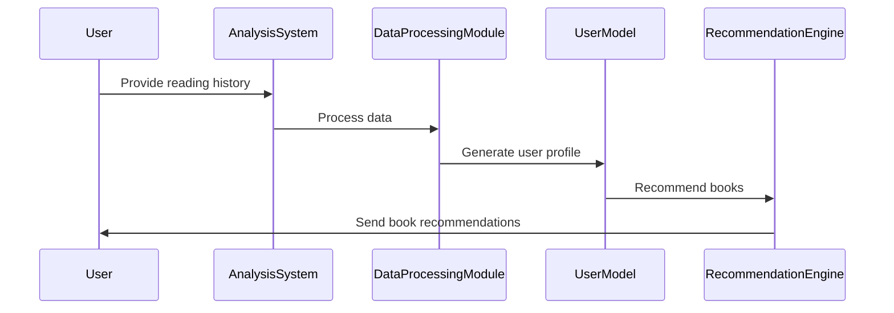
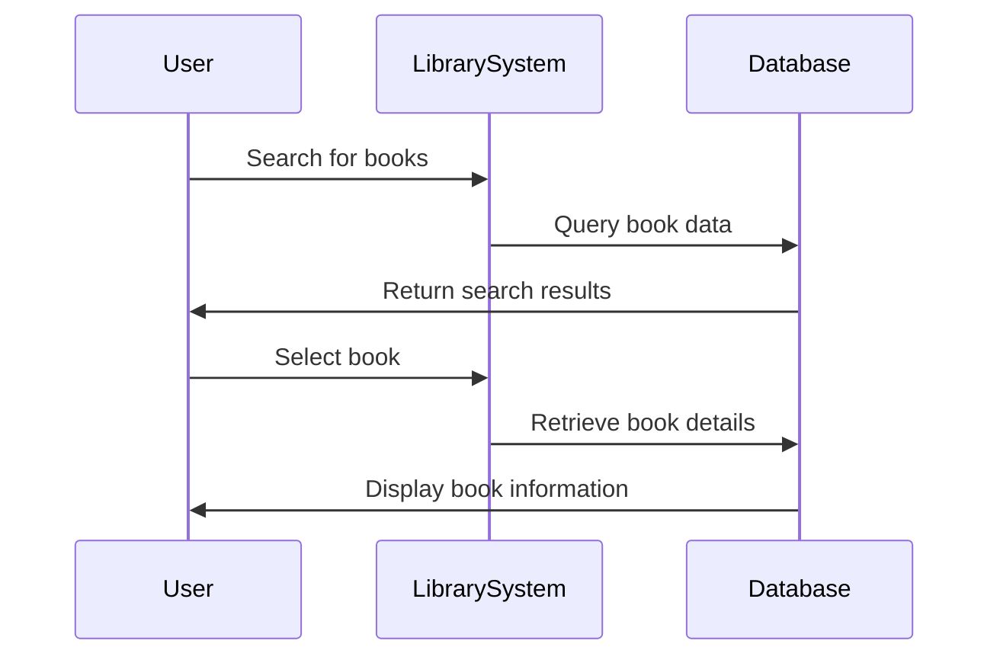
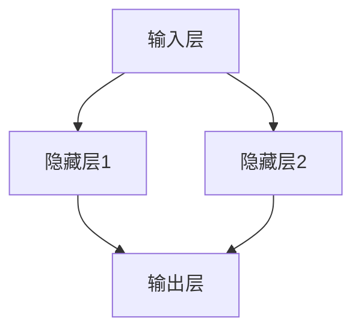
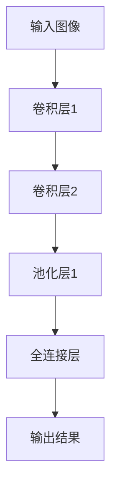
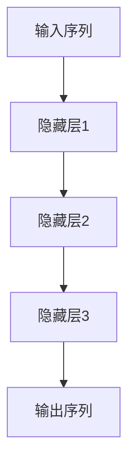

                 


### 核心概念与联系

在数字时代的智能图书推荐系统中，理解几个核心概念是至关重要的。首先，我们需要明确什么是深度学习、用户行为分析以及图书数据管理。

#### 深度学习基础

深度学习是一种机器学习技术，它模仿人脑的工作方式，通过多层神经网络对数据进行处理和分析。深度学习在图像识别、语音识别、自然语言处理等领域取得了显著成果。在智能图书推荐系统中，深度学习可以用来分析用户的阅读行为，预测用户可能感兴趣的书籍。

**核心概念对比表**：

| 概念 | 定义 | 关键属性 |
| ---- | ---- | -------- |
| 神经网络 | 一种模拟生物神经系统的计算模型 | 包含输入层、隐藏层和输出层 |
| 卷积神经网络 (CNN) | 用于图像识别的深度学习模型 | 特征提取能力强，适合处理图像数据 |
| 循环神经网络 (RNN) | 用于序列数据处理，如时间序列分析 | 能够处理任意长度的输入序列 |
| 长短时记忆网络 (LSTM) | RNN 的变体，解决长序列依赖问题 | 能够长期保持信息，防止梯度消失问题 |

**实体关系图（ER图）**：

```mermaid
erDiagram
  User ||--|{ Book } : reads
  Book ||--|{ Review } : contains
  Review ||--|{ User } : writes
```

在这个ER图中，用户（User）可以阅读书籍（Book），书籍包含评论（Review），评论是由用户撰写的。

#### 用户行为分析

用户行为分析是智能图书推荐系统的关键组成部分。通过分析用户的阅读历史、搜索记录、收藏夹等行为数据，可以更好地了解用户的兴趣和偏好。

**用户行为数据分析流程**：



#### 图书数据管理

图书数据管理涉及到如何存储、检索和管理图书信息。在智能图书推荐系统中，图书数据通常包括标题、作者、类别、摘要、评分等。

**图书数据管理流程**：



通过上述对核心概念与联系的分析，我们可以为后续的算法原理讲解、数学模型和系统架构设计等部分打下坚实的基础。

## 算法原理讲解

在智能图书推荐系统中，深度学习算法的核心作用在于通过分析用户数据，预测用户对书籍的偏好，从而实现个性化推荐。下面，我们将详细讲解深度学习算法的基本原理、数学模型以及实际案例。

### 深度学习算法介绍

深度学习算法主要包括神经网络、卷积神经网络（CNN）和循环神经网络（RNN）等。每种算法都有其独特的结构和应用场景。

#### 神经网络

神经网络是一种由大量简单计算单元（神经元）互联而成的复杂网络。每个神经元接收多个输入信号，通过激活函数处理后产生一个输出信号。神经网络的基本结构包括输入层、隐藏层和输出层。

**神经网络基本结构图**：



在智能图书推荐系统中，输入层可以接收用户的行为数据，隐藏层负责提取特征，输出层则生成推荐结果。

#### 卷积神经网络（CNN）

卷积神经网络是一种专门用于图像识别的神经网络。其核心在于卷积操作，能够有效地提取图像中的局部特征。

**CNN结构图**：



在图书推荐中，虽然不是直接处理图像数据，但CNN的卷积操作原理同样适用于特征提取，例如提取用户的阅读行为模式。

#### 循环神经网络（RNN）

循环神经网络是一种用于处理序列数据的神经网络。其特点是能够记忆序列中的上下文信息，适合处理时间序列数据。

**RNN结构图**：



在图书推荐系统中，RNN可以用于分析用户的阅读历史，预测其对后续书籍的偏好。

### 数学模型解析

深度学习算法的核心在于其背后的数学模型。以下是几种常用的数学模型：

#### 损失函数

损失函数用于衡量模型预测结果与实际结果之间的差异。常用的损失函数包括均方误差（MSE）和交叉熵（Cross-Entropy）。

**均方误差（MSE）**：

$$
MSE = \frac{1}{n}\sum_{i=1}^{n}(y_i - \hat{y}_i)^2
$$

其中，$y_i$ 是实际值，$\hat{y}_i$ 是预测值。

**交叉熵（Cross-Entropy）**：

$$
CE = -\sum_{i=1}^{n}y_i\log(\hat{y}_i)
$$

其中，$y_i$ 是实际值，$\hat{y}_i$ 是预测值。

#### 激活函数

激活函数用于引入非线性特性，使得神经网络能够拟合复杂的非线性关系。常用的激活函数包括ReLU（Rectified Linear Unit）和Sigmoid。

**ReLU函数**：

$$
f(x) = \max(0, x)
$$

**Sigmoid函数**：

$$
f(x) = \frac{1}{1 + e^{-x}}
$$

### 实际案例展示

为了更好地理解深度学习算法在智能图书推荐系统中的应用，我们来看一个实际案例。

#### 案例背景

假设有一个图书推荐系统，用户可以通过系统浏览书籍，并对其进行评分。我们的目标是利用用户的行为数据，预测其对新书《深度学习入门》的评分。

**用户行为数据**：

- 用户A：阅读了《机器学习实战》和《数据挖掘：实用技术引导》，分别给出了4星和5星的评分。
- 用户B：阅读了《深度学习》和《自然语言处理》，分别给出了5星和4星的评分。

**模型训练**：

1. **数据预处理**：将用户行为数据转换为数值表示，例如将书籍标题、评分等转换为向量。

2. **模型构建**：构建一个基于RNN的深度学习模型，用于预测用户的评分。

3. **模型训练**：使用用户的行为数据进行模型训练，优化模型的参数。

4. **模型评估**：使用未参与训练的数据对模型进行评估，验证其预测能力。

**模型预测**：

当用户C浏览《深度学习入门》时，模型会根据其阅读历史和评分数据，预测其对这本书的评分。例如，如果用户C之前阅读了《深度学习》并给出了5星评分，那么模型可能会预测用户C对《深度学习入门》的评分也为5星。

通过这个案例，我们可以看到深度学习算法在智能图书推荐系统中的应用，如何通过分析用户行为数据，预测其对书籍的偏好。

### 总结

本章详细介绍了智能图书推荐系统中的深度学习算法，包括神经网络、卷积神经网络和循环神经网络等。通过数学模型和实际案例的讲解，读者可以理解这些算法在推荐系统中的应用原理。接下来，我们将进一步探讨数学模型和数学公式的具体细节，为后续的算法实现和系统设计打下基础。

---

**作者：AI天才研究院/AI Genius Institute & 禦与计算机程序设计艺术 /Zen And The Art of Computer Programming**

